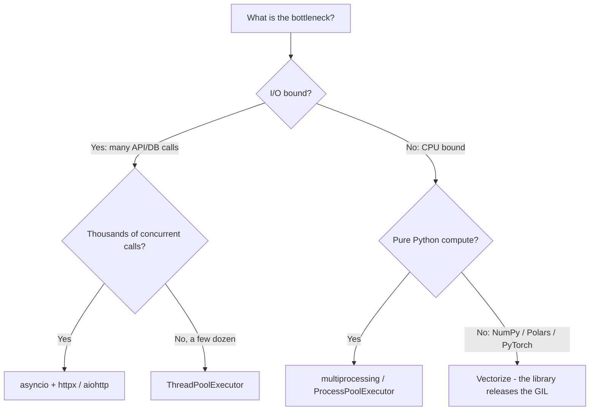
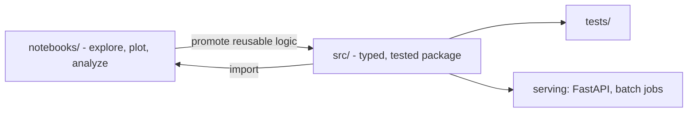

# Python for AI Engineering

Python is the lingua franca of AI, but the Python that ships production ML systems looks very different from notebook-tutorial Python. This guide covers the language features, scientific stack, and production tooling that AI engineers use daily, with a focus on data pipelines, model services, and repository discipline.

Part of the [Senior AI Engineer Roadmap](./00-Senior-AI-Engineer-Roadmap.md) — Phase 1.

> For language deep-dives (OOP, memory internals, error handling, testing patterns), use the full [Python guide](../Programming%20Languages%20and%20Concepts/Python/README.md) in this repo. This file focuses on *AI-specific* usage of those features.

---

## 1. Core Language Features for AI Work

### 1.1 Generators: streaming data without exhausting memory

Training and ETL jobs routinely process datasets larger than RAM. Generators give you lazy, constant-memory iteration — the backbone of every `Dataset`/`DataLoader` abstraction.

```python
import json
from pathlib import Path
from typing import Iterator

def stream_jsonl(path: Path, batch_size: int = 256) -> Iterator[list[dict]]:
    """Yield batches of records from a JSONL file without loading it all."""
    batch: list[dict] = []
    with path.open() as f:
        for line in f:           # file objects are themselves lazy iterators
            batch.append(json.loads(line))
            if len(batch) == batch_size:
                yield batch
                batch = []
    if batch:                    # don't drop the final partial batch
        yield batch

# Pitfall: a generator is single-use. This silently processes nothing the 2nd time:
gen = stream_jsonl(Path("events.jsonl"))
n_batches = sum(1 for _ in gen)
for batch in gen:                # gen is already exhausted -> loop body never runs
    ...
```

### 1.2 Context managers: deterministic resource handling

Model files, DB connections, GPU memory scopes, and MLflow runs all want guaranteed cleanup. Write your own with `contextlib`:

```python
import time
from contextlib import contextmanager

@contextmanager
def timed(stage: str):
    start = time.perf_counter()
    try:
        yield
    finally:
        print(f"{stage}: {time.perf_counter() - start:.3f}s")

with timed("feature-build"):
    build_features()             # timing is recorded even if this raises
```

### 1.3 Decorators: cross-cutting concerns for pipelines

Retries, caching, timing, and tracing wrap model calls cleanly.

```python
import functools, time

def retry(times: int = 3, backoff: float = 0.5):
    def deco(fn):
        @functools.wraps(fn)                 # preserve name/docstring for debugging
        def wrapper(*args, **kwargs):
            for attempt in range(times):
                try:
                    return fn(*args, **kwargs)
                except TimeoutError:
                    if attempt == times - 1:
                        raise
                    time.sleep(backoff * 2 ** attempt)
        return wrapper
    return deco

@retry(times=3)
def call_embedding_api(texts: list[str]) -> list[list[float]]: ...
```

### 1.4 Type annotations, dataclasses, and Pydantic

Types are documentation that `mypy` can check — critical when tensors, DataFrames, and JSON blobs all look like "objects" at runtime.

- **`dataclasses`**: lightweight internal containers (configs, feature rows). No validation.
- **Pydantic**: *boundary* validation — API payloads, LLM structured outputs, config files. It parses and coerces, and fails loudly on bad data.

```python
from dataclasses import dataclass
from pydantic import BaseModel, Field

@dataclass(frozen=True, slots=True)      # immutable, memory-efficient internal type
class TrainConfig:
    lr: float = 1e-3
    batch_size: int = 64

class RiskDecision(BaseModel):           # validates untrusted data at the edge
    decision: str = Field(pattern="^(approve|deny|manual_review)$")
    confidence: float = Field(ge=0.0, le=1.0)
    risk_factors: list[str] = []

RiskDecision.model_validate_json('{"decision": "manual_review", "confidence": 0.71}')
```

### 1.5 Protocols: structural typing for pluggable components

Swap model providers or feature stores without inheritance hierarchies.

```python
from typing import Protocol

class Embedder(Protocol):
    def embed(self, texts: list[str]) -> list[list[float]]: ...

def index_documents(embedder: Embedder, docs: list[str]) -> None:
    vectors = embedder.embed(docs)       # any class with .embed() satisfies this
```

### 1.6 Async, threading, and multiprocessing: pick by workload



- **asyncio** shines for fan-out LLM/embedding API calls (I/O wait dominates).
- **Threads** are fine for moderate I/O concurrency, and for NumPy-heavy code because C extensions release the GIL.
- **Multiprocessing** is for CPU-bound *pure Python* work (parsing, tokenizing) — but beware pickling overhead: sending large arrays between processes can erase the speedup. Prefer chunked work and shared memory.

```python
import asyncio, httpx

async def embed_all(texts: list[str]) -> list[list[float]]:
    async with httpx.AsyncClient(timeout=30) as client:
        sem = asyncio.Semaphore(8)                    # cap concurrency; be a good citizen
        async def one(t: str):
            async with sem:
                r = await client.post("https://api.example.com/embed", json={"text": t})
                r.raise_for_status()
                return r.json()["vector"]
        return await asyncio.gather(*(one(t) for t in texts))
```

---

## 2. The Scientific Stack

### 2.1 NumPy: vectorization and broadcasting

Loops over Python floats are ~100x slower than vectorized array ops. Broadcasting stretches shapes without copying data.

```python
import numpy as np

X = np.random.randn(10_000, 128)          # 10k embeddings, 128-dim

# Normalize every row to unit length (broadcasting: (10000,128) / (10000,1))
norms = np.linalg.norm(X, axis=1, keepdims=True)
X_unit = X / norms

# Full pairwise cosine similarity in one matmul
S = X_unit @ X_unit.T                      # (10000, 10000)

# Pitfall: forgetting keepdims breaks broadcasting
bad = X / np.linalg.norm(X, axis=1)        # ValueError: (10000,128) vs (10000,)
```

Rules of thumb: know your array's `shape` and `dtype` at every step; prefer `float32` for model inputs (half the memory of `float64`); watch for silent upcasting.

### 2.2 Pandas vs Polars

| | Pandas | Polars |
|---|---|---|
| Execution | Eager, single-threaded core | Lazy or eager, multi-threaded Rust |
| Memory | Row index + object dtypes can bloat | Arrow-backed, compact |
| API | Huge ecosystem, sklearn-native | Expression API, query optimizer |
| Best for | Small/medium data, interop | Large ETL, feature pipelines |

```python
import polars as pl

# Lazy pipeline: Polars optimizes the whole query before executing
features = (
    pl.scan_parquet("transactions.parquet")            # nothing read yet
    .filter(pl.col("amount") > 0)
    .group_by("customer_id")
    .agg(
        pl.col("amount").sum().alias("total_spend"),
        pl.col("amount").count().alias("txn_count"),
    )
    .collect()                                          # executes optimized plan
)
```

Pandas pitfall to know cold: chained indexing (`df[df.a > 0]["b"] = 1`) silently writes to a copy. Use `df.loc[df.a > 0, "b"] = 1`.

### 2.3 PyArrow: the interchange layer

Arrow is the in-memory columnar format underneath Polars, Parquet I/O, DuckDB, and zero-copy handoff between them. For AI work: store datasets as **Parquet** (columnar, compressed, schema-carrying), not CSV. CSVs lose dtypes, break on commas, and read ~10x slower.

```python
import pyarrow.parquet as pq
table = pq.read_table("train.parquet", columns=["label", "amount"])  # column pruning
```

---

## 3. The Production Stack

- **FastAPI** — inference endpoints; Pydantic request/response models give you validation and OpenAPI docs for free. Load the model once at startup (lifespan handler), never per-request.
- **SQLAlchemy + Alembic** — typed DB access and versioned schema migrations for feature tables and audit logs.
- **pytest** — fixtures for test data, `parametrize` for edge cases, and *golden tests* for feature transformations (fixed input -> exact expected output).
- **Ruff** — linting and formatting in one fast tool; replaces flake8 + isort + black.
- **mypy** (or Pyright) — static checking; run in CI with `--strict` on new code.
- **uv** — fast dependency management: lockfile (`uv.lock`) for reproducible environments, `uv run` for hermetic execution. Reproducibility of environments is part of model reproducibility.

```python
# Minimal FastAPI inference service pattern
from contextlib import asynccontextmanager
from fastapi import FastAPI
from pydantic import BaseModel

class ScoreRequest(BaseModel):
    features: list[float]

@asynccontextmanager
async def lifespan(app: FastAPI):
    app.state.model = load_model("model.joblib")   # load once, not per request
    yield

app = FastAPI(lifespan=lifespan)

@app.post("/score")
def score(req: ScoreRequest) -> dict:
    p = app.state.model.predict_proba([req.features])[0, 1]
    return {"risk_score": float(p), "model_version": "2026-07-01"}
```

---

## 4. Notebooks vs Packages Discipline

Notebooks are for *exploration*: plots, quick experiments, error analysis. They are not for production logic — hidden execution-order state, no tests, painful diffs.

The workflow: explore in `notebooks/`, then **promote** any reusable function into `src/` with types and tests, and import it back into the notebook. A notebook should read like a report that calls your package.



## 5. The Production-Style Repo Layout

The roadmap's required deliverable:

```text
ai-project/
├── src/
│   ├── data/            # ingestion, validation, dataset snapshots
│   ├── features/        # feature transformations (shared by train AND serve)
│   ├── models/          # training loops, model definitions, registry glue
│   ├── evaluation/      # metrics, eval datasets, error analysis
│   ├── serving/         # FastAPI app, batch scoring entrypoints
│   └── observability/   # logging, tracing, drift monitors
├── tests/               # mirrors src/ structure; golden tests for features
├── notebooks/           # exploration only; imports from src/
├── configs/             # YAML/TOML configs, one per environment/experiment
├── scripts/             # thin CLI entrypoints (train.py, backfill.py)
├── migrations/          # Alembic schema migrations
├── Dockerfile           # multi-stage: build deps -> slim runtime image
├── pyproject.toml       # deps, ruff/mypy/pytest config, package metadata
└── README.md
```

Why this shape matters:

- **`features/` is shared by training and serving.** The number-one cause of training-serving skew is reimplementing feature logic twice. One function, imported in both places.
- **`data/` vs `features/` vs `models/`** separates concerns so a data-format change doesn't touch model code.
- **`evaluation/` is a first-class module**, not a notebook afterthought — CI can run it as a regression gate.
- **`configs/` + `pyproject.toml` + `Dockerfile`** make every run reproducible: same code, same deps, same parameters.
- **`tests/` mirrors `src/`** so coverage gaps are visible at a glance.

---

## Best Practices

1. Validate at boundaries with Pydantic; use plain dataclasses internally. Don't pay validation cost twice.
2. Never load a model inside a request handler; load once at startup and treat it as immutable state.
3. Vectorize before you parallelize. A NumPy/Polars rewrite usually beats multiprocessing and is simpler.
4. Store datasets as Parquet with explicit schemas. Treat CSV as a legacy input format to be converted at ingestion.
5. Keep one feature-transformation codepath used by both training and serving — this is a design rule, not a nice-to-have.
6. Pin everything: `uv.lock` for deps, config files for hyperparameters, and record git SHA + data version with every artifact.
7. Run Ruff and mypy in CI; type-annotate all public functions in `src/`.
8. Notebooks must be runnable top-to-bottom from a fresh kernel before committing ("Restart and Run All" or it doesn't merge).
9. Prefer `Protocol` interfaces for anything you might swap (embedder, vector store, model provider) so tests can inject fakes.
10. Cap async concurrency with semaphores and always set timeouts on network calls — model APIs fail, and unbounded fan-out turns one failure into thousands.

## Interview Questions

<details>
<summary>Why are generators important for ML data pipelines, and what is their main gotcha?</summary>

Generators provide lazy, constant-memory iteration, letting you stream datasets larger than RAM (files, DB cursors, batches into a training loop). PyTorch's iterable datasets and most ETL readers build on this. The main gotcha: generators are single-use — once exhausted, iterating again yields nothing, silently. If you need multiple passes, recreate the generator (e.g., call the generator function again each epoch) or materialize the data.
</details>

<details>
<summary>When do you choose asyncio vs threading vs multiprocessing for data work?</summary>

Choose by bottleneck. I/O-bound with high concurrency (thousands of API/DB calls, e.g. batch embedding requests): asyncio. I/O-bound with modest concurrency or blocking libraries: ThreadPoolExecutor. CPU-bound pure-Python work (parsing, tokenization): multiprocessing, since the GIL blocks threads from parallel bytecode execution. CPU-bound numeric work: vectorize with NumPy/Polars first — these release the GIL and use optimized native code, often making process parallelism unnecessary. Also note multiprocessing's pickling cost: shipping large arrays between processes can negate gains.
</details>

<details>
<summary>Dataclasses vs Pydantic models — when do you use each?</summary>

Dataclasses are zero-dependency containers with no runtime validation — ideal for trusted internal data (configs, intermediate records) where you want low overhead (`frozen=True, slots=True` for immutability and memory). Pydantic validates and coerces at runtime — use it at trust boundaries: API request/response bodies, LLM structured outputs, config file parsing, message queue payloads. The pattern: Pydantic at the edges, dataclasses (or plain types) in the core.
</details>

<details>
<summary>What is NumPy broadcasting and how does it enable computing pairwise cosine similarity without loops?</summary>

Broadcasting aligns arrays of different shapes by virtually stretching size-1 dimensions, without copying data. Shapes are compared right-to-left; dimensions must be equal or 1. For cosine similarity: normalize rows with `X / np.linalg.norm(X, axis=1, keepdims=True)` — the `(n,128)/(n,1)` division broadcasts across columns — then a single matrix multiply `X_unit @ X_unit.T` yields all pairwise cosines. `keepdims=True` is essential; without it the shapes `(n,128)` and `(n,)` fail to broadcast.
</details>

<details>
<summary>What advantages does Polars offer over Pandas for feature pipelines?</summary>

Polars is Arrow-backed and multi-threaded (Rust core), and its lazy API builds a query plan that gets optimized before execution — predicate pushdown, projection pruning, and parallel execution for free. That means it can scan only needed columns/rows from Parquet and use all cores. Pandas remains stronger for ecosystem interop (scikit-learn, plotting, many libraries expect DataFrames) and quick interactive work. Common choice: Polars for heavy ETL/feature building, convert to Pandas/NumPy at the model boundary.
</details>

<details>
<summary>What is training-serving skew and how does repo structure help prevent it?</summary>

Training-serving skew is when features computed at training time differ from those computed at inference time — different code, different data freshness, or different preprocessing — so the model sees a distribution in production it never saw in training. The structural defense is a single `src/features/` package imported by both the training pipeline and the serving app: one implementation, golden-tested, versioned together with the model. Duplicate feature logic (SQL for training, Python for serving) is the classic root cause.
</details>

<details>
<summary>Why should notebooks not contain production logic?</summary>

Notebooks have hidden state (cells can run out of order, deleted cells leave live variables), no natural unit testing, poor diffs/code review, and no import story. Any logic you need twice belongs in a package. The discipline: explore in the notebook, promote stable functions into `src/` with types and tests, import them back. Enforce "restart kernel and run all" before commit so the notebook is at least reproducible as a report.
</details>

<details>
<summary>Why load an ML model at FastAPI startup rather than in the request handler?</summary>

Model deserialization is expensive (hundreds of ms to minutes) and memory-heavy; doing it per request destroys latency and can OOM under concurrency. Loading once in the lifespan/startup hook amortizes the cost, keeps a single copy in memory shared across requests, and makes readiness explicit — the pod only reports healthy after the model is loaded, so orchestrators don't route traffic to a cold instance.
</details>
