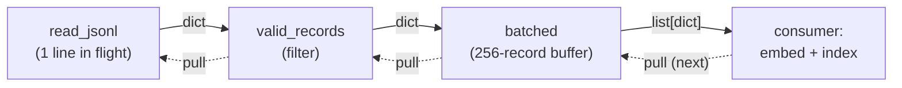
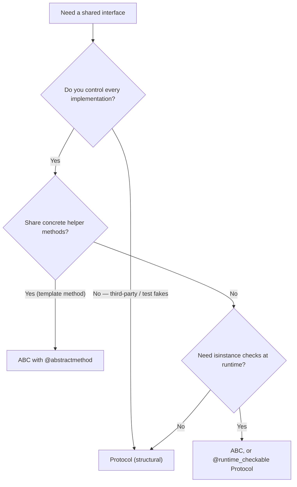

# Advanced Python Language

Production AI code lives or dies on the parts of Python most tutorials skip: the iteration protocol that lets you stream a 200 GB dataset through 2 GB of RAM, the object model that decides whether your feature store fits in memory, and the typing system that keeps a five-person team from passing a DataFrame where a tensor was expected. This guide works through those mechanisms from first principles, assuming you already engineer software seriously in some language and want to know how Python *actually* behaves — not just what the idioms look like.

Every section builds toward AI-engineering use cases: generator pipelines for ETL, context managers for GPU/DB/tracing scopes, decorators for retry/caching of model calls, and the memory model that explains why a list of 100 million Python floats needs 25x the RAM of the equivalent NumPy array.

Part of the [Senior AI Engineer Roadmap](../00-Senior-AI-Engineer-Roadmap.md) — Phase 1.

---

## 1. Iterators and Generators

### 1.1 The iteration protocol from the ground up

`for x in obj` is sugar for: call `iter(obj)` to get an iterator, then call `next(it)` repeatedly until it raises `StopIteration`. Two distinct roles matter:

- An **iterable** implements `__iter__` and returns a fresh iterator each time (lists, dicts, files-to-be-opened).
- An **iterator** implements `__next__` (and returns itself from `__iter__`). It is *stateful and single-use*.

```python
# iteration_protocol.py — run with: python iteration_protocol.py
class CountDown:
    """An iterable: each iter() call returns a NEW iterator, so it is re-usable."""
    def __init__(self, start: int):
        self.start = start

    def __iter__(self):
        return CountDownIterator(self.start)

class CountDownIterator:
    def __init__(self, current: int):
        self.current = current

    def __iter__(self):          # iterators return themselves — this is why you
        return self              # can pass an iterator anywhere an iterable goes

    def __next__(self):
        if self.current <= 0:
            raise StopIteration  # the protocol's "done" signal — not an error
        self.current -= 1
        return self.current + 1

cd = CountDown(3)
print(list(cd))   # [3, 2, 1]
print(list(cd))   # [3, 2, 1]  — iterable: fresh iterator each time

it = iter(cd)
print(list(it))   # [3, 2, 1]
print(list(it))   # []         — iterator: exhausted, silently empty
```

That last line is the single most common data-pipeline bug in ML code: you count records with `sum(1 for _ in reader)` and then train on an empty stream. Generators are iterators, so they share this property.

### 1.2 Generators: the compiler writes the iterator for you

A function containing `yield` returns a **generator object** when called; the body does not run until the first `next()`. Each `yield` suspends the frame — locals, instruction pointer, exception state all preserved — and each `next()` resumes it. This is a full coroutine mechanism (asyncio is built on the same machinery).

```python
# gen_mechanics.py
def gen():
    print("A: body starts")
    x = yield 1
    print(f"B: resumed, received {x!r}")
    yield 2
    print("C: falling off the end")

g = gen()                 # nothing printed — body not started
print(next(g))            # A: body starts        -> prints 1
print(g.send("hello"))    # B: resumed, received 'hello'  -> prints 2
try:
    next(g)               # C: falling off the end
except StopIteration:
    print("done")         # done
```

Key mechanics, line by line:

- `g = gen()` allocates a generator object holding a *paused frame*. Cost: one small object, no body execution.
- `next(g)` runs to the first `yield` and freezes. The yielded value is `next`'s return value.
- `g.send(v)` resumes and makes `v` the value of the `yield` expression inside the frame — two-way communication.
- Falling off the end raises `StopIteration`. A `return v` inside a generator sets `StopIteration.value = v`.
- `g.close()` throws `GeneratorExit` into the frame so `finally` blocks run — this is how `with` blocks inside generators get cleaned up when a consumer abandons the stream early.

### 1.3 Generator-based pipelines for large datasets

The pattern that matters for AI work: compose small generators into a lazy pipeline. Memory stays O(batch), not O(dataset), because only one record (or batch) is in flight per stage.

```python
# pipeline.py — streaming ETL: constant memory over an arbitrarily large JSONL file
import json
from pathlib import Path
from typing import Iterator, Iterable

def read_jsonl(path: Path) -> Iterator[dict]:
    with path.open() as f:            # file handle closed when generator is
        for line in f:                # closed or garbage-collected
            yield json.loads(line)

def valid_records(records: Iterable[dict]) -> Iterator[dict]:
    for r in records:
        if r.get("text") and len(r["text"]) < 8192:
            yield r

def batched(records: Iterable[dict], size: int) -> Iterator[list[dict]]:
    batch: list[dict] = []
    for r in records:
        batch.append(r)
        if len(batch) == size:
            yield batch
            batch = []
    if batch:                         # never drop the final partial batch
        yield batch

# Build the pipeline: NOTHING executes yet — this is pure plumbing.
def run(path: Path) -> int:
    pipeline = batched(valid_records(read_jsonl(path)), size=256)
    n = 0
    for batch in pipeline:            # pull-based: each batch flows through all
        n += len(batch)               # stages before the next line is even read
        # embed(batch); index(batch)  # <- your real work here
    return n

if __name__ == "__main__":
    p = Path("demo.jsonl")
    p.write_text('\n'.join(json.dumps({"text": f"doc {i}"}) for i in range(1000)))
    print(run(p))                     # 1000 — peak memory: one 256-record batch
```

Why pull-based composition wins: each stage is independently testable (`list(valid_records([{...}]))`), stages can be swapped (read from S3 instead of disk by replacing one generator), and backpressure is automatic — a slow consumer simply pulls less.

`yield from sub()` delegates to a sub-generator transparently, forwarding `send`/`throw` and returning `StopIteration.value` — use it to flatten nested pipelines without a manual loop.



### 1.4 Generator expressions and itertools

`(f(x) for x in xs)` builds a generator with no function definition; `[f(x) for x in xs]` materializes a list. For a 10M-row scan, the difference is a few bytes vs gigabytes. `itertools` supplies fused, C-speed combinators: `islice` (pagination over a stream), `chain` (concatenate shards), `groupby` (requires sorted input — classic bug), `tee` (duplicate a stream, but buffers the divergence in memory — dangerous on large streams).

---

## 2. Context Managers

### 2.1 The protocol

`with` calls `__enter__`, binds its return value to the `as` target, and *guarantees* `__exit__(exc_type, exc, tb)` runs — on success, exception, or early `return`. If `__exit__` returns `True`, the exception is swallowed. This is Python's RAII: deterministic cleanup regardless of the GC.

```python
# ctx_class.py — a class-based context manager for a GPU-ish resource scope
import time

class InferenceSession:
    def __init__(self, model_name: str):
        self.model_name = model_name

    def __enter__(self):
        print(f"loading {self.model_name}")       # acquire: load weights, pin memory
        self.start = time.perf_counter()
        return self                               # bound to `as` target

    def __exit__(self, exc_type, exc, tb):
        elapsed = time.perf_counter() - self.start
        print(f"released after {elapsed:.3f}s "   # release runs even on exception
              f"(error={exc_type.__name__ if exc_type else None})")
        return False                              # False => propagate exceptions

with InferenceSession("bert-base") as sess:
    raise ValueError("bad batch")
# Output:
#   loading bert-base
#   released after 0.000s (error=ValueError)
#   Traceback ... ValueError: bad batch   <- still raised, cleanup already done
```

### 2.2 Writing them the easy way: @contextmanager

`contextlib.contextmanager` turns a one-`yield` generator into a context manager: code before `yield` is `__enter__`, code after (in `finally`) is `__exit__`. The decorator's wrapper calls `next()` on enter and `gen.throw(exc)` on exceptional exit — which is why the `try/finally` around `yield` is mandatory, not stylistic.

```python
# ctx_gen.py
from contextlib import contextmanager
import time

@contextmanager
def timed(stage: str):
    start = time.perf_counter()
    try:
        yield                                   # control passes to the with-body
    finally:                                    # runs even if the body raised —
        print(f"{stage}: {time.perf_counter()-start:.3f}s")   # throw() lands here

with timed("feature-build"):
    time.sleep(0.05)
# feature-build: 0.050s
```

### 2.3 ExitStack: dynamic numbers of resources

When you open N resources decided at runtime — shards, connections, temp dirs — nesting `with` doesn't work. `ExitStack` collects callbacks and unwinds them LIFO, and crucially: if opening resource 7 of 10 fails, the 6 already opened are closed.

```python
# exitstack_demo.py
from contextlib import ExitStack
from pathlib import Path

def merge_shards(paths: list[Path], out: Path) -> int:
    lines = 0
    with ExitStack() as stack:
        files = [stack.enter_context(p.open()) for p in paths]  # all-or-nothing
        with out.open("w") as f_out:
            for f in files:
                for line in f:
                    f_out.write(line)
                    lines += 1
    return lines            # every shard handle closed here, LIFO, guaranteed

if __name__ == "__main__":
    shards = []
    for i in range(3):
        p = Path(f"shard_{i}.txt"); p.write_text(f"row from {i}\n"); shards.append(p)
    print(merge_shards(shards, Path("merged.txt")))   # 3
```

`stack.callback(fn, *args)` registers arbitrary cleanup (kill a subprocess, delete a temp table), and `stack.pop_all()` transfers ownership — the idiom for "return an open resource to my caller but clean up if construction fails midway".

---

## 3. Decorators

### 3.1 Mechanism

`@deco` above `def f` is exactly `f = deco(f)`, executed at *definition time* (import time for module-level functions). A decorator is any callable taking a callable. The standard shape closes over the wrapped function:

```python
# retry.py — parameterized decorator with functools.wraps
import functools, time, random

def retry(times: int = 3, backoff: float = 0.5, retry_on: tuple = (TimeoutError,)):
    def decorate(fn):                              # receives the real function
        @functools.wraps(fn)                       # copies __name__, __doc__,
        def wrapper(*args, **kwargs):              # __module__, __wrapped__ ...
            for attempt in range(times):
                try:
                    return fn(*args, **kwargs)
                except retry_on:
                    if attempt == times - 1:
                        raise                      # out of retries: propagate
                    sleep = backoff * 2 ** attempt * (0.5 + random.random())
                    time.sleep(sleep)              # exponential backoff + jitter
        return wrapper
    return decorate                                # @retry(...) calls THIS first

calls = 0

@retry(times=3, backoff=0.01)
def flaky() -> str:
    """Pretend embedding call."""
    global calls
    calls += 1
    if calls < 3:
        raise TimeoutError
    return "ok"

print(flaky(), "after", calls, "calls")   # ok after 3 calls
print(flaky.__name__, "-", flaky.__doc__) # flaky - Pretend embedding call.
```

Why `functools.wraps` is non-negotiable: without it, `flaky.__name__` is `"wrapper"`, breaking logging, pickling (multiprocessing serializes functions by qualified name), pytest introspection, and FastAPI's signature-based dependency injection. `wraps` also sets `__wrapped__`, letting tools unwrap to the original.

Three layers to keep straight: `retry(...)` runs once at decoration and returns `decorate`; `decorate(fn)` runs once and returns `wrapper`; `wrapper` runs on every call. State that must persist across calls (a cache, a counter) lives in `decorate`'s closure.

### 3.2 Class-based decorators

When a decorator carries rich state or needs methods (reset a cache, inspect stats), implement `__call__`:

```python
# memo.py — class-based memoizing decorator with stats
import functools

class Memoize:
    def __init__(self, fn):
        functools.update_wrapper(self, fn)   # wraps() for classes
        self.fn = fn
        self.cache: dict = {}
        self.hits = self.misses = 0

    def __call__(self, *args):
        if args in self.cache:
            self.hits += 1
        else:
            self.misses += 1
            self.cache[args] = self.fn(*args)
        return self.cache[args]

@Memoize
def embed(text: str) -> tuple:
    return (hash(text) % 100, len(text))     # stand-in for a $$$ API call

embed("hello"); embed("hello"); embed("world")
print(embed.hits, embed.misses)              # 1 2
```

Caveat: a class-based decorator on a *method* breaks unless you also implement `__get__` (the descriptor protocol, §6) so `self` binds — the reason `functools.lru_cache` on methods leaks instances (the cache keys hold `self` forever).

In production prefer battle-tested versions: `functools.lru_cache`/`functools.cache` for memoization, `tenacity` for retries (async support, per-exception policies), `functools.singledispatch` for type-based dispatch.

---

## 4. Typing Deep Dive

Python's annotations are erased at runtime by default — they exist for static checkers (mypy, pyright), IDEs, and runtime frameworks that opt in (Pydantic, FastAPI). For a senior role you need the generic machinery, not just `list[str]`.

### 4.1 TypeVar and generics

```python
# generics.py — checked with: mypy --strict generics.py  (passes)
from typing import TypeVar, Generic
from collections.abc import Iterable, Callable

T = TypeVar("T")
U = TypeVar("U")
Num = TypeVar("Num", int, float)            # constrained: int or float, exactly

def first(xs: Iterable[T]) -> T | None:     # T links input to output: caller of
    for x in xs:                            # first([1,2]) gets int | None back,
        return x                            # not object | None
    return None

def pipe(xs: Iterable[T], f: Callable[[T], U]) -> list[U]:
    return [f(x) for x in xs]

class Batcher(Generic[T]):                  # generic class: Batcher[dict], etc.
    def __init__(self, size: int):
        self.size = size
        self._buf: list[T] = []

    def add(self, item: T) -> list[T] | None:
        self._buf.append(item)
        if len(self._buf) >= self.size:
            out, self._buf = self._buf, []
            return out
        return None

b: Batcher[str] = Batcher(2)
print(b.add("a"), b.add("b"))               # None ['a', 'b']
```

Python 3.12+ syntax: `def first[T](xs: Iterable[T]) -> T | None` and `class Batcher[T]:` — same semantics, no explicit `TypeVar`.

### 4.2 Protocols: structural typing

A `Protocol` specifies a *shape*; any object with matching methods satisfies it — no inheritance, no registration. This is how you make model providers swappable and tests injectable.

```python
# protocols.py
from typing import Protocol, runtime_checkable

@runtime_checkable                          # enables isinstance() (methods only,
class Embedder(Protocol):                   # signatures are NOT checked at runtime)
    def embed(self, texts: list[str]) -> list[list[float]]: ...

class OpenAIEmbedder:                       # note: no inheritance from Embedder
    def embed(self, texts: list[str]) -> list[list[float]]:
        return [[0.1] * 4 for _ in texts]

class FakeEmbedder:                         # test double — also just "fits"
    def embed(self, texts: list[str]) -> list[list[float]]:
        return [[float(len(t))] for t in texts]

def index(embedder: Embedder, docs: list[str]) -> int:
    return len(embedder.embed(docs))

print(index(OpenAIEmbedder(), ["a", "b"]))       # 2
print(index(FakeEmbedder(), ["a"]))              # 1
print(isinstance(FakeEmbedder(), Embedder))      # True
```

### 4.3 ParamSpec: decorators that preserve signatures

Annotating a decorator with `Callable[..., T]` destroys the wrapped signature — callers lose parameter checking. `ParamSpec` captures "the entire parameter list" as a variable:

```python
# paramspec.py — mypy now knows traced(fetch)("url", timeout=1.0) is valid
from typing import ParamSpec, TypeVar
from collections.abc import Callable
import functools, time

P = ParamSpec("P")
R = TypeVar("R")

def traced(fn: Callable[P, R]) -> Callable[P, R]:   # signature flows through
    @functools.wraps(fn)
    def wrapper(*args: P.args, **kwargs: P.kwargs) -> R:
        t0 = time.perf_counter()
        try:
            return fn(*args, **kwargs)
        finally:
            print(f"{fn.__name__}: {(time.perf_counter()-t0)*1000:.1f}ms")

    return wrapper

@traced
def fetch(url: str, timeout: float = 5.0) -> str:
    return f"GET {url}"

print(fetch("https://x.test"))
# fetch: 0.0ms
# GET https://x.test
# fetch(123) is now a *static* type error; with Callable[..., T] it wasn't.
```

### 4.4 Overloads

`@overload` declares multiple signatures for one implementation — precise types for functions whose return type depends on argument types (the `open()` text/binary pattern):

```python
# overloads.py
from typing import overload

@overload
def get_embedding(text: str) -> list[float]: ...
@overload
def get_embedding(text: list[str]) -> list[list[float]]: ...

def get_embedding(text):                    # single real implementation
    if isinstance(text, str):
        return [0.0, 1.0]
    return [[0.0, 1.0] for _ in text]

v = get_embedding("hi")                     # checker knows: list[float]
m = get_embedding(["hi", "yo"])             # checker knows: list[list[float]]
print(len(v), len(m))                       # 2 2
```

Also load-bearing in real codebases: `TypedDict` (typed JSON payloads), `Literal["cosine","dot"]` (closed string enums), `Annotated[float, Field(ge=0)]` (metadata channel Pydantic/FastAPI read), and variance — `list[T]` is invariant (a `list[Cat]` is *not* a `list[Animal]`, because the function could append a `Dog`), while `Sequence[T]` is covariant; accept `Sequence`/`Iterable` in signatures, return concrete types.

### 4.5 Dataclasses vs Pydantic vs attrs

```python
# containers.py
from dataclasses import dataclass, field
from pydantic import BaseModel, Field, ValidationError

@dataclass(frozen=True, slots=True)          # zero-dep, no validation, cheap
class TrainConfig:
    lr: float = 1e-3
    layers: list[int] = field(default_factory=lambda: [256, 128])

class ScoreRequest(BaseModel):               # parses & validates & coerces
    features: list[float]
    threshold: float = Field(ge=0, le=1, default=0.5)

print(TrainConfig(lr="oops"))                # TrainConfig(lr='oops', ...) — no check!
print(ScoreRequest.model_validate({"features": ["1.5", 2]}).features)  # [1.5, 2.0] — coerced
try:
    ScoreRequest(features=[1.0], threshold=3)
except ValidationError as e:
    print(e.error_count(), "error")          # 1 error
```

| | dataclasses | attrs | Pydantic v2 |
|---|---|---|---|
| Validation | none | opt-in validators | always, Rust-core (fast) |
| Coercion | no | no | yes (str→float, etc.) |
| Dependency | stdlib | small | pydantic-core (compiled) |
| Serialization | `asdict` (shallow semantics) | `asdict` | `model_dump_json`, aliases, custom serializers |
| Cost per instance | lowest | low | validation cost on construction |
| Use for | internal records, configs | libraries wanting slots+validators without pydantic weight | trust boundaries: APIs, LLM outputs, config files, queue payloads |

The rule: **Pydantic at the edges, dataclasses in the core.** Validating twice wastes CPU; validating never corrupts your feature store.

### 4.6 ABCs vs Protocols

- **ABC** (`abc.ABC`, `@abstractmethod`): *nominal* — implementers must inherit; instantiation fails until all abstract methods exist; can ship shared concrete methods (template-method pattern). Choose when you own all implementations and want enforcement at class-creation time.
- **Protocol**: *structural* — no inheritance; third-party and test classes conform automatically. Choose for plugin points and dependency inversion — the consumer defines the interface it needs; providers don't even import it.

Rule of thumb for AI systems: Protocols at architecture seams (Embedder, VectorStore, LLMClient), ABCs inside a framework you control (BaseTrainer with a shared training loop and abstract `compute_loss`).



---

## 5. Descriptors and `__slots__`

### 5.1 Descriptors: how attributes actually work

A **descriptor** is a class-level attribute whose type defines `__get__`/`__set__`/`__delete__`. Attribute lookup `obj.x` consults `type(obj).__mro__` first; if it finds a *data* descriptor (has `__set__`), the descriptor wins over the instance `__dict__`. This one mechanism implements methods (functions are descriptors — `__get__` produces bound methods), `@property`, `@classmethod`, `@staticmethod`, `super()`, and every ORM/config field you've used.

```python
# descriptor.py — a validated field, the pattern under ORMs and pydantic-like libs
class Positive:
    def __set_name__(self, owner, name):      # called at class creation with the
        self.name = "_" + name                # attribute's name — no strings needed

    def __get__(self, obj, objtype=None):
        if obj is None:
            return self                       # accessed on the class itself
        return getattr(obj, self.name)

    def __set__(self, obj, value):
        if value <= 0:
            raise ValueError(f"{self.name[1:]} must be > 0, got {value}")
        setattr(obj, self.name, value)

class Batch:
    size = Positive()                          # one descriptor instance, class-level
    lr = Positive()
    def __init__(self, size: int, lr: float):
        self.size = size                       # triggers Positive.__set__
        self.lr = lr

b = Batch(32, 1e-3)
print(b.size)          # 32
try:
    b.size = -1
except ValueError as e:
    print(e)           # size must be > 0, got -1
```

### 5.2 `__slots__`: trading flexibility for memory

By default every instance carries a `__dict__` (~64+ bytes overhead plus hash-table slack). `__slots__ = ("a", "b")` replaces it with fixed C-level offsets: no dynamic attributes, no `__dict__`, roughly 40–60% memory reduction and faster attribute access.

```python
# slots.py
import sys

class Plain:
    def __init__(self): self.x = 1; self.y = 2.0

class Slotted:
    __slots__ = ("x", "y")
    def __init__(self): self.x = 1; self.y = 2.0

p, s = Plain(), Slotted()
print(sys.getsizeof(p) + sys.getsizeof(p.__dict__))  # ~48 + ~296 = ~344 bytes (3.12)
print(sys.getsizeof(s))                              # ~48 bytes
s.z = 3            # AttributeError: 'Slotted' object has no attribute 'z'
```

For 10M feature-row objects that's gigabytes. But at that scale the real answer is usually "stop using per-row objects — use NumPy/Arrow" (guide 3). `@dataclass(slots=True)` gives you both conveniences.

---

## 6. The CPython Memory Model

### 6.1 Refcounting + cyclic GC

Every object header holds a reference count; `Py_DECREF` to zero frees immediately and deterministically — this is why `with open(...)` matters less in CPython than in JVM languages, and why most objects die instantly. Reference **cycles** (a→b→a) never hit zero, so a generational mark-and-sweep GC runs periodically to collect them. Three generations; young objects are scanned often, survivors promoted.

```python
# memory.py
import sys, gc

a = []
print(sys.getrefcount(a))       # 2  (a, plus the temporary argument reference)
b = a
print(sys.getrefcount(a))       # 3

class Node:
    def __init__(self): self.other = None

x, y = Node(), Node()
x.other, y.other = y, x         # cycle: refcounts never reach 0
del x, y
print(gc.collect())             # 4  (2 Nodes + 2 instance __dict__s reclaimed)
```

### 6.2 Interning and the small-int cache

CPython pre-allocates ints −5..256 and interns many strings (identifiers, compile-time literals), so `is` comparisons on small values "work" accidentally and then break on larger ones:

```python
x, y = 256, 256
print(x is y)                   # True  — cached singleton
a = 1000; b = int("1000")
print(a is b, a == b)           # False True — never use `is` for value equality
```

### 6.3 Why large object graphs hurt AI workloads

Every Python object costs: header (refcount + type pointer, 16 bytes), payload, allocator slack, and — for containers — a pointer per element to a separately-allocated boxed object. Concretely:

```python
import sys
xs = list(range(1_000_000))
# list of 1M ints: ~8 MB of pointers + ~28 bytes per unique int object
print(sys.getsizeof(xs))              # ~8,000,056 bytes (pointer array alone)

import numpy as np
arr = np.arange(1_000_000, dtype=np.int64)
print(arr.nbytes)                     # 8,000,000 bytes TOTAL — one flat buffer
```

The list costs ~4x the array (and ~25x for floats vs `float32`), plus every element is a GC-visible object: a 100M-object graph makes each young-gen GC pass and each `pickle` to a worker process painfully slow. Consequences you'll act on:

- Prefer flat buffers (NumPy, Arrow, tensors) over lists-of-dicts for anything big; the data lives *outside* the object graph as one untracked allocation.
- `gc.freeze()` after loading a large model in a fork-based server keeps the GC from touching (and copy-on-write-dirtying) millions of tenured objects.
- Refcount writes dirty memory pages: forked workers sharing a big read-only model still balloon RSS because *reading* Python objects writes their refcounts (mitigated in 3.12+ by immortal objects for statics).

---

## Production War Stories & Failure Modes

### Story 1: The training job that trained on nothing

- **Symptom:** A fine-tuning job completed in 40 seconds instead of 6 hours, "successfully", producing a garbage model that passed deployment gates because eval also scored 0 examples.
- **Investigation:** Logs showed `dataset ready: 2,143,001 records` followed immediately by `epoch 1 complete`. The count was right; the training loop saw zero batches.
- **Root cause:** `records = read_jsonl(path)` produced a generator; a pre-flight check did `n = sum(1 for _ in records)` to log the count, exhausting it. The training loop then iterated an empty iterator — no error, no warning.
- **Fix:** Made the loader a *re-iterable* class (`__iter__` returns a fresh generator) and added a guard: `if batches_seen == 0: raise RuntimeError("empty dataset")`.
- **Prevention:** Never pass bare iterators across function boundaries; pass iterables or factories. Assert non-emptiness at consumption sites. Treat "suspiciously fast success" as a failure in CI (minimum-duration checks).

### Story 2: Retry decorator without `wraps` breaks multiprocessing

- **Symptom:** A parallel preprocessing job crashed with `PicklingError: Can't pickle <function wrapper at 0x...>: it's not the same object as tasks.clean_text`.
- **Investigation:** `clean_text` worked serially; only `ProcessPoolExecutor.map(clean_text, docs)` failed. `clean_text.__qualname__` printed `retry.<locals>.decorate.<locals>.wrapper`.
- **Root cause:** A hand-rolled `@retry` without `functools.wraps`. Pickle serializes functions by qualified name and re-imports them in the worker; the name no longer resolved to the same object.
- **Fix:** Added `functools.wraps(fn)`; the qualname round-tripped again and pickling worked (the closure itself isn't pickled — the *name* is, and workers re-execute the decoration on import).
- **Prevention:** `wraps` in every decorator, enforced by a lint rule; a unit test that pickles every task function (`pickle.loads(pickle.dumps(fn))`).

### Story 3: The 60 GB "small" cache

- **Symptom:** A long-running scoring service's RSS climbed ~400 MB/day until OOM-killed weekly. `tracemalloc` pointed at a memoization dict.
- **Investigation:** An `@lru_cache`-style decorator had been applied to a *method*: `self` was part of every cache key, so every request-scoped object (each holding a parsed document tree) was pinned forever. `maxsize=None` sealed it.
- **Root cause:** Method + unbounded cache = every instance immortalized through cache keys; large object graphs also slowed GC passes (multi-second p99 spikes correlated with gen-2 collections).
- **Fix:** Moved caching to a module-level function keyed on a content hash string, `maxsize=10_000`; RSS flatlined and p99 dropped 35%.
- **Prevention:** Never cache on methods without `cached_property` or weakref-keyed caches; cap every cache; alert on RSS slope, not just level; keep cache keys to scalars.

### Story 4: `frozen=True` that wasn't deep enough

- **Symptom:** Two A/B experiment arms silently ran with identical hyperparameters; weeks of results invalid.
- **Investigation:** Config was a `@dataclass(frozen=True)` with `layers: list[int]`. Arm B's setup did `cfg.layers.append(64)` — no error, because frozen only blocks *rebinding attributes*, not mutating the objects they point to. Both arms shared one default list (created once via a shared `default_factory` result passed in by the caller).
- **Root cause:** Shallow immutability + shared mutable default. Frozen dataclasses guarantee `cfg.layers = ...` fails, not `cfg.layers.append(...)`.
- **Fix:** Switched to `tuple[int, ...]`, added a Pydantic `model_config = ConfigDict(frozen=True)` schema at the config-file boundary, and logged the full resolved config hash per run.
- **Prevention:** Immutable *element types* (tuples, frozensets) in frozen configs; hash and log the effective config with every artifact so identical-config runs are detectable.

---

## Best Practices

- Pass iterables or generator *factories* across boundaries, never half-consumed iterators; make dataset objects re-iterable via `__iter__`.
- Build ETL as small composable generator stages; keep per-stage state O(batch) and test stages with plain lists.
- Every resource acquisition goes through a context manager; use `ExitStack` for dynamic resource counts and `pop_all()` for ownership transfer.
- Always `functools.wraps` (or `update_wrapper`) in decorators; type them with `ParamSpec` so signatures survive.
- Prefer `tenacity`/`lru_cache` over hand-rolled retry/memoization in production; cap every cache and never key on `self`.
- Pydantic at trust boundaries, `@dataclass(frozen=True, slots=True)` internally; immutable element types inside frozen configs.
- Protocols at architecture seams you don't fully control; ABCs for template-method frameworks you do.
- Accept abstract types (`Iterable`, `Sequence`, `Mapping`) in parameters; return concrete ones. Run mypy/pyright strict on new code.
- Use `slots=True` for high-count objects, but graduate to NumPy/Arrow once counts hit millions — flat buffers beat any per-object optimization.
- Never use `is` for value comparison (interning makes it lie); reserve it for `None` and sentinels.
- Watch the object graph: RSS slope alerts, `tracemalloc` in staging, `gc.freeze()` after loading large models in forking servers.

---

## Interview Drills

<details>
<summary>Explain the difference between an iterable and an iterator. Why does it matter for a training loop that runs multiple epochs?</summary>

An iterable implements `__iter__` returning a fresh iterator; an iterator implements `__next__` (and `__iter__` returning itself) and is stateful and single-use. A multi-epoch loop does `for batch in dataset` once per epoch — that calls `iter(dataset)` each time. If `dataset` is a bare generator (an iterator), epoch 2 silently iterates nothing: no exception, zero batches. The fix is a class whose `__iter__` constructs a new generator each call, or re-invoking the generator function per epoch.

**Follow-up: how would you *detect* this bug systematically?** Assert batch counts per epoch are equal and non-zero; wrap loaders so a second `iter()` on an exhausted raw iterator raises instead of yielding nothing.

**Follow-up: why does PyTorch's `DataLoader` not suffer from this?** Because `DataLoader.__iter__` constructs a new `_BaseDataLoaderIter` per call — it's an iterable wrapping iterator-construction logic, exactly the pattern above.
</details>

<details>
<summary>Walk through what happens, frame by frame, when you call a generator function and then call next() twice.</summary>

Calling the function allocates a generator object containing a suspended frame (locals, instruction pointer) — no body code runs. First `next()` starts the frame, runs to the first `yield`, freezes the frame mid-expression, and returns the yielded value. Second `next()` resumes exactly after the `yield` (the `yield` expression evaluates to `None` unless `send(v)` was used), runs to the next `yield` or to function end; falling off the end raises `StopIteration` with any `return` value attached.

**Follow-up: what does `close()` do and why does it matter for files?** It throws `GeneratorExit` into the paused frame, so `finally`/`with` blocks inside the generator execute — that's how a `with path.open()` inside a generator gets closed when a consumer abandons the stream early. If the generator catches `GeneratorExit` and yields again, `RuntimeError` is raised.

**Follow-up: relate this to asyncio.** Coroutines use the same suspended-frame machinery; `await` is generator delegation (`yield from`) driven by an event loop instead of user `next()` calls.
</details>

<details>
<summary>Design a constant-memory pipeline that reads a 500 GB JSONL corpus, filters, batches, and embeds via an API. What are the memory characteristics and failure points?</summary>

Compose generators: `read_jsonl → filter → batched(256) → embed`. Memory is O(batch): each `next()` on the tail pulls one item through every stage; only the batcher holds a buffer. Failure points: (1) accidental materialization — any `list(...)`, `sorted(...)`, or `itertools.tee` on the stream buffers unboundedly; (2) single-use exhaustion if the pipeline is consumed twice; (3) an exception mid-stream loses position — for resumability, track byte offsets or record indices and support seeking; (4) the embed stage is I/O-bound, so a purely synchronous pull pipeline underutilizes the network — hand batches to an async fan-out (guide 2) with bounded concurrency.

**Follow-up: the API allows 8 concurrent requests — where does backpressure come from?** From pull semantics plus a semaphore: the consumer only pulls the next batch when a slot frees; nothing upstream reads ahead, so a slow API automatically slows file reading.

**Follow-up: what changes if stages run in different processes?** You need explicit bounded queues between stages (`multiprocessing.Queue(maxsize=...)`); generators can't cross process boundaries, and serialization cost per item becomes a design constraint.
</details>

<details>
<summary>Why must the yield in a @contextmanager generator be wrapped in try/finally?</summary>

The decorator's `__exit__` delivers a with-body exception by calling `gen.throw(exc)` — the exception materializes *at the yield expression*. Without `try/finally` (or `try/except`), the exception propagates out of the generator immediately and your cleanup code after `yield` never executes: connections leak, GPU memory stays allocated, spans never close. `finally` guarantees cleanup on success, exception, and even `GeneratorExit`.

**Follow-up: when would you use `except` instead of `finally` there?** To *handle* specific errors — e.g., translate a low-level driver exception into a domain exception, or suppress an expected error (returning normally after catching suppresses it, mirroring `__exit__` returning True). `finally` is for unconditional cleanup; `except` changes exception semantics.

**Follow-up: what's the class-based equivalent of suppressing?** `__exit__` returning `True`. Dangerous default — silently swallowing `CancelledError` or `KeyboardInterrupt` in a broad suppressor is a classic bug; suppress narrow types only.
</details>

<details>
<summary>Your teammate's decorator works fine until it's used with ProcessPoolExecutor, then pickling fails. Diagnose.</summary>

Pickle serializes plain functions *by qualified name*: it records `module.qualname` and the worker re-imports it. A decorator without `functools.wraps` returns a `wrapper` whose `__qualname__` is `deco.<locals>.wrapper`, which either doesn't resolve or resolves to a different object than the one being pickled — hence "it's not the same object as ...". With `wraps`, the decorated name in the module namespace matches the metadata and pickling works, because workers re-run the decoration at import time; the closure never actually crosses the process boundary.

**Follow-up: why do lambdas and closures fail to pickle at all?** They have no importable qualified name; there's nothing for the worker to look up. Fixes: module-level functions, `functools.partial` over module-level functions, or a fork start method (children inherit memory, nothing pickled — with its own hazards, guide 2).

**Follow-up: does `wraps` copy the function's behavior?** No — only metadata (`__name__`, `__qualname__`, `__doc__`, `__module__`, `__dict__`, and sets `__wrapped__`). Behavior is still the wrapper; `inspect.unwrap` follows `__wrapped__` back to the original.
</details>

<details>
<summary>What does ParamSpec solve that TypeVar cannot? Show the failure mode it fixes.</summary>

`TypeVar` abstracts over single types; it cannot represent "this function's entire parameter list". Typing a decorator as `Callable[..., R] -> Callable[..., R]` erases parameters: after `@traced`, calling `fetch(123, bogus=1)` type-checks fine because `...` accepts anything. `ParamSpec("P")` captures the full parameter specification — `Callable[P, R] -> Callable[P, R]` with `*args: P.args, **kwargs: P.kwargs` — so the wrapped function keeps exact parameter checking and IDE signatures.

**Follow-up: what is `Concatenate` for?** Decorators that add or remove a leading parameter — e.g., a decorator injecting a `Session` first argument is `Callable[Concatenate[Session, P], R] -> Callable[P, R]`.

**Follow-up: how does this interact with FastAPI?** FastAPI builds request parsing from the endpoint's runtime signature (`inspect.signature`), which follows `__wrapped__`. A decorator lacking `wraps` breaks DI at runtime; lacking ParamSpec breaks it only statically — both matter.
</details>

<details>
<summary>Dataclasses vs Pydantic vs attrs — give your decision rule and justify the cost model.</summary>

Pydantic at trust boundaries: API bodies, LLM structured outputs, config files, queue messages — anywhere data is untrusted, you want parsing, coercion, and loud failures; v2's Rust core makes validation cheap but not free. Dataclasses (`frozen=True, slots=True`) for internal data already validated once — zero dependency, minimal per-instance cost, no re-validation tax on hot paths. attrs sits between: slots by default, opt-in validators, good for libraries that can't take the Pydantic dependency. Cost model: validation is O(fields) per construction; on a hot path constructing millions of internal records, Pydantic's overhead is real and buys nothing since the data was validated at ingress.

**Follow-up: your intern uses Pydantic everywhere "for safety" — concretely what degrades?** Hot-path construction cost (allocation + validation per record), slower `copy`/`deepcopy` semantics, and a false sense of safety — internal invariants (e.g., "embedding dim matches index dim") aren't field-level checks anyway; they belong in constructors or type design.

**Follow-up: how do you validate LLM JSON output robustly?** `Model.model_validate_json` inside a retry loop: on `ValidationError`, feed the error messages back to the model for a repair attempt, cap attempts, and fall back to a default or DLQ. Constrain generation with JSON schema when the provider supports it.
</details>

<details>
<summary>When do you reach for an ABC over a Protocol? Be concrete.</summary>

ABC when you own the hierarchy and want (a) enforcement at instantiation time — forgetting to implement `compute_loss` fails immediately, not on first call; (b) shared concrete behavior — a `BaseTrainer.fit()` template method calling abstract hooks; (c) an explicit registration story (`ABC.register`). Protocol when you *don't* own implementations: an `Embedder` seam where OpenAI wrappers, local models, and test fakes all conform structurally without importing your package — the consumer defines the minimal interface it needs (interface segregation), and swapping providers requires no inheritance changes.

**Follow-up: what does `@runtime_checkable` actually check?** Only method *presence*, not signatures or return types — `isinstance(x, Embedder)` passes if `x.embed` exists even with the wrong arity. Static checkers verify full signatures; runtime checks are a coarse duck-typing gate.

**Follow-up: can a class be checked against a Protocol explicitly?** Yes — inherit from it (`class Mine(Embedder):`) to get static conformance errors at definition site, or write `x: Embedder = Mine()` in a test module; many teams add the latter as a cheap conformance test.
</details>

<details>
<summary>Explain the descriptor protocol and name four language features built on it.</summary>

When resolving `obj.x`, Python first searches `type(obj).__mro__`; if the class attribute defines `__set__` or `__delete__` (a *data* descriptor), its `__get__` is invoked and wins over the instance `__dict__`; non-data descriptors (only `__get__`) lose to instance attributes. Built on it: plain functions (their `__get__` returns bound methods — that's where `self` comes from), `@property`, `@classmethod`/`@staticmethod`, and `__slots__` (each slot is a data descriptor mapping to a fixed C offset). ORMs (SQLAlchemy columns) and validated-field libraries use the same hook.

**Follow-up: why does an instance attribute shadow a method but not a property?** Methods are non-data descriptors (no `__set__`) — instance `__dict__` wins; properties are data descriptors — class wins, which is why assigning to a read-only property raises instead of shadowing.

**Follow-up: what does `__set_name__` give you?** The attribute's name at class-creation time, so a descriptor can compute its storage key (`"_" + name`) without repeating the name — pre-3.6 libraries needed metaclasses for this.
</details>

<details>
<summary>Your service holds 20M small Python objects and p99 latency spikes every few minutes. Hypothesis and fix?</summary>

Hypothesis: generational GC. 20M long-lived objects sit in gen-2; periodic full collections traverse the entire graph, pausing for hundreds of ms — matching the periodic spikes. Confirm with `gc.set_debug(gc.DEBUG_STATS)` or timing `gc.callbacks`, correlating collections with latency. Fixes in order: (1) `gc.freeze()` after startup to move the stable graph out of collection consideration; (2) tune thresholds (`gc.set_threshold`) to make full collections rare; (3) structurally remove the objects — replace lists-of-objects with NumPy/Arrow buffers, which are single untracked allocations; tuples of scalars are also untracked after a first pass.

**Follow-up: why does refcounting alone not suffice, and what does it cost?** Cycles never hit zero — hence the cyclic collector. Refcounting costs a write on every reference operation, which dirties CoW pages in forked workers (a big model "shared" via fork balloons RSS as children touch refcounts) — mitigated by 3.12 immortal objects and by loading models after fork or via true shared memory.

**Follow-up: would `__slots__` help here?** It shrinks per-object memory ~50% and removes per-instance dicts (fewer GC-tracked containers), but the object *count* still drives GC traversal — buffers are the real fix at this scale.
</details>

<details>
<summary>Why is `x is y` sometimes True for equal ints and strings and sometimes False? When is `is` correct?</summary>

CPython caches ints −5..256 as singletons and interns identifier-like strings and compile-time constants (and folds constants within a compilation unit), so small/literal values often share identity by accident; values created at runtime (`int("1000")`, concatenated strings) usually don't. `is` compares object identity (pointer equality), not value. It is correct only for singletons by contract: `None`, `True`/`False` (though `== ` is fine), `Ellipsis`, and your own sentinel objects (`_MISSING = object()`).

**Follow-up: why do sentinels use `object()` instead of `None`?** Because `None` may be a legitimate value (e.g., "explicitly no timeout") — a unique sentinel distinguishes "not provided" from "provided as None" in APIs and cache lookups.

**Follow-up: does interning ever matter for performance?** Yes — `sys.intern()` on high-cardinality repeated strings (e.g., token strings, column names) deduplicates memory and makes dict lookups pointer-compare fast; Pandas/Arrow dictionary encoding is the columnar version of the same idea.
</details>

<details>
<summary>A frozen dataclass config was mutated in production. How, and what's the robust design?</summary>

`frozen=True` only blocks attribute *rebinding* (`cfg.lr = 2`); it does nothing about mutating referenced objects — `cfg.layers.append(64)` succeeds if `layers` is a list. Also, two configs can share one mutable object (same default_factory result passed twice, or aliasing on copy). Robust design: immutable element types (`tuple`, `frozenset`, nested frozen dataclasses), `slots=True` to block accidental new attributes, validation at the parse boundary (Pydantic with `frozen=True` reading YAML), and logging a content hash of the resolved config with every run so silently-diverged configs are detectable in experiment tracking.

**Follow-up: why does `frozen=True` make instances hashable and why is that useful?** With `eq=True` (default), frozen dataclasses get `__hash__` from field values — usable as cache keys and dict keys, e.g., memoizing "dataset prepared for config C". Mutable dataclasses set `__hash__ = None` because hash must be stable over an object's lifetime.

**Follow-up: deep-freeze options?** There's no language-level deep freeze; use immutable types throughout, `types.MappingProxyType` for dict views, or serialize-and-hash at boundaries and treat equality of hashes as the invariant.
</details>

<details>
<summary>Estimate the memory of a list of 10M Python floats vs a float32 NumPy array, and explain every term.</summary>

List: the list object holds a pointer array — 10M × 8 B = 80 MB (plus over-allocation slack ~12.5%). Each float is a separate boxed object: 24 B (16 B header: refcount + type pointer, 8 B double) → 240 MB. Total ≈ 320+ MB, scattered across the heap, all GC-relevant. NumPy float32 array: one contiguous buffer, 10M × 4 B = 40 MB, plus ~100 B of ndarray metadata; the buffer is invisible to the GC. That's ~8x, and the array also vectorizes and shares zero-copy with Arrow/torch.

**Follow-up: where does the 24 B per float come from exactly?** 8 B refcount + 8 B type pointer (the `PyObject` header) + 8 B C double payload; allocated from pymalloc pools in 8 B-aligned size classes so a 24 B request costs exactly 24 B — small ints are worse relatively (28 B for the variable-length int header).

**Follow-up: your JSON ingestion builds lists-of-dicts before converting — cost and fix?** Peak memory is the boxed graph, not the final table — dict keys/values all boxed, dicts ~200+ B each. Fix: stream directly into columnar builders (`pyarrow.json.read_json`, Polars `scan_ndjson`) or accumulate typed column buffers per batch, never a per-row object graph.
</details>

<details>
<summary>Implement retry-with-backoff as a decorator and defend every design decision under review.</summary>

Decisions: (1) *parameterized* (`@retry(times=3)`) so policies vary per call site — requires the three-layer closure; (2) `functools.wraps` for pickling/DI/introspection; (3) retry only a *whitelist* of exceptions (`TimeoutError`, HTTP 429/5xx) — retrying `ValueError` or 400s just triples the error rate and can duplicate side effects; (4) exponential backoff *with jitter* — synchronized clients without jitter re-stampede in waves exactly when the service is recovering; (5) re-raise the last exception after exhaustion, never return None silently; (6) cap total elapsed time, not just attempts, so callers' deadlines hold; (7) log each retry with attempt number and correlation ID.

**Follow-up: what changes for async functions?** A separate branch using `await fn(...)` and `await asyncio.sleep(...)` — `time.sleep` in a coroutine blocks the entire event loop; detect with `inspect.iscoroutinefunction` or provide `retry_async`. `tenacity` handles both.

**Follow-up: is retrying safe for non-idempotent operations?** No — a timeout doesn't mean the operation failed; the server may have committed. You need idempotency keys, dedup on the server, or at-least-once semantics with idempotent effects (guide 6 covers the patterns).
</details>

<details>
<summary>What's the practical difference between `__slots__` and letting instances have `__dict__`, and when is neither the right answer?</summary>

`__slots__` replaces the per-instance dict with fixed-offset storage declared at class creation: ~40–60% smaller instances, slightly faster attribute access, and a hard error on undeclared attributes (which also catches typo-assignments like `self.batchsize`). Costs: no dynamic attributes, care with multiple inheritance (at most one non-empty `__slots__` base per layout), and no weakref support unless you add `"__weakref__"`. Neither is right past ~1M instances: per-object storage of any kind loses to columnar buffers (NumPy/Arrow) by an order of magnitude in memory and iteration speed — restructure to arrays-of-columns.

**Follow-up: `@dataclass(slots=True)` — what does it actually generate?** A *new* class with `__slots__` synthesized from the fields — it must recreate the class because slots cannot be added after class creation.
</details>
