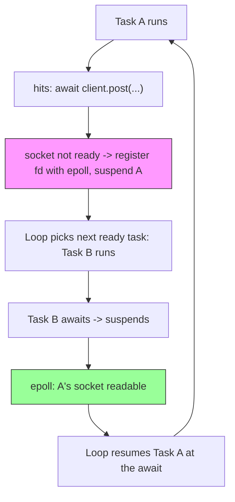
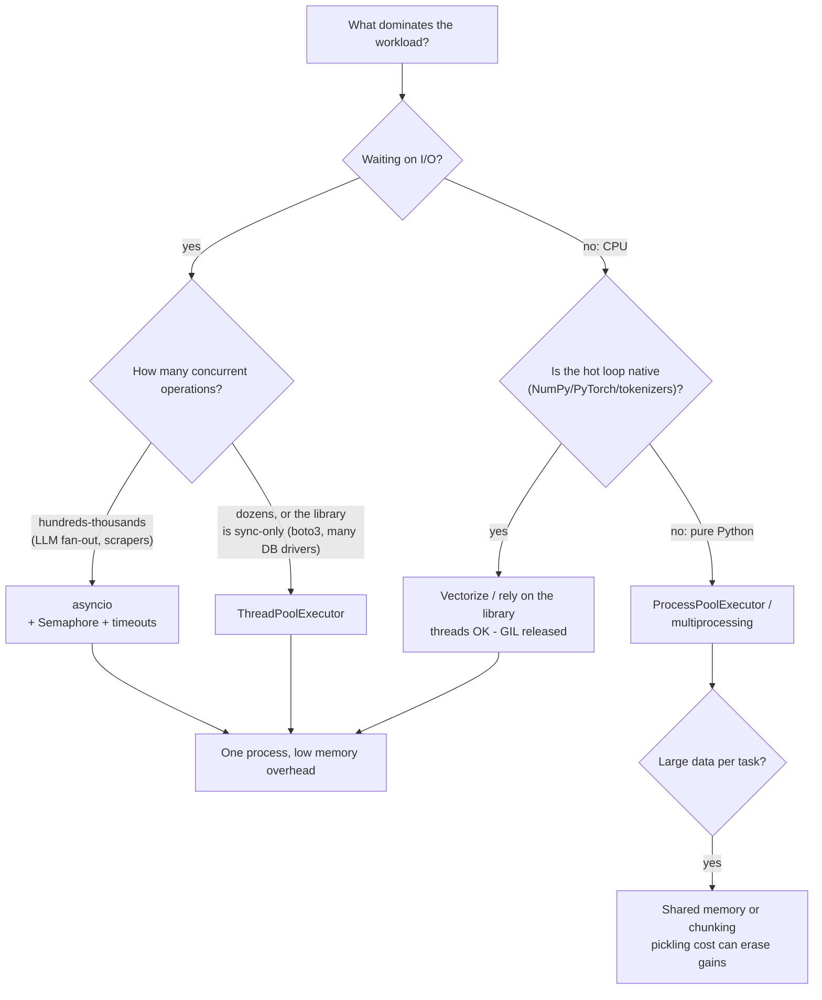

# Async, Concurrency, and Multiprocessing

AI engineering is concurrency engineering in disguise: you fan out thousands of embedding calls, stream tokens from an LLM while the user watches, keep a GPU busy while CPU workers preprocess the next batch, and do all of it without deadlocking, leaking tasks, or getting rate-limited into oblivion. Python gives you three distinct machines for this — threads, processes, and the asyncio event loop — and each has sharp edges that only show up under load.

This guide explains the GIL as it actually works (including the free-threaded build), walks through asyncio's internals down to how `await` suspends a coroutine, gives you a decision framework for choosing between the three models, and finishes with the multiprocessing hazards (fork vs spawn, CUDA) that take down real training jobs. Every example is a complete program with its output shown.

Part of the [Senior AI Engineer Roadmap](../00-Senior-AI-Engineer-Roadmap.md) — Phase 1.

---

## 1. The GIL, Truthfully

### 1.1 What the GIL actually is

The Global Interpreter Lock is a single mutex inside CPython that a thread must hold to execute Python bytecode. Its purpose is to make CPython's memory management (reference counting) safe without fine-grained locking on every object. Consequences, stated precisely:

- **Only one thread executes *Python bytecode* at a time.** Two threads running pure-Python loops on a 32-core machine use one core.
- **The GIL is released during blocking I/O.** `socket.recv`, `file.read`, `time.sleep`, DB drivers — all drop the GIL while waiting. Threads are therefore *excellent* for I/O concurrency.
- **C extensions may release the GIL during computation.** NumPy's matmul, `hashlib`, `zlib`, most of PyTorch's CPU ops, and tokenizers written in Rust all release it. Threads running NumPy *do* use multiple cores.
- **The GIL is not a correctness guarantee for your code.** It makes individual bytecodes atomic, not statements. `x += 1` is three bytecodes (load, add, store) and two threads can interleave between them.

```python
# gil_demo.py — run with: python gil_demo.py
import threading, time
import hashlib

def pure_python(n: int) -> int:
    total = 0
    for i in range(n):
        total += i * i          # pure bytecode: holds the GIL the whole time
    return total

def gil_releasing(data: bytes) -> str:
    # hashlib releases the GIL for buffers > 2047 bytes
    return hashlib.sha256(data).hexdigest()

def timed(label: str, fn, *args, threads: int) -> None:
    start = time.perf_counter()
    ts = [threading.Thread(target=fn, args=args) for _ in range(threads)]
    for t in ts: t.start()
    for t in ts: t.join()
    print(f"{label:24s} threads={threads}  {time.perf_counter() - start:.2f}s")

N = 5_000_000
BLOB = b"x" * 50_000_000

timed("pure python", pure_python, N, threads=1)   # pure python  threads=1  0.31s
timed("pure python", pure_python, N, threads=4)   # pure python  threads=4  1.26s  <- 4x work, NO speedup
timed("sha256 (releases GIL)", gil_releasing, BLOB, threads=1)  # 0.11s
timed("sha256 (releases GIL)", gil_releasing, BLOB, threads=4)  # 0.13s  <- 4x work, ~same wall time
```

Read those numbers carefully: four threads of pure Python take 4x the wall time of one (serialized by the GIL, plus switching overhead). Four threads of SHA-256 take roughly the *same* wall time as one — the work ran genuinely in parallel because the C code dropped the GIL.

### 1.2 Free-threaded Python (PEP 703)

Python 3.13 shipped an experimental **free-threaded build** (`python3.13t`) with the GIL removed, and 3.14 promoted it to officially supported. Status as of 2026, what a working engineer needs to know:

- It is a **separate build**, not a flag on the default binary. Check with `sys._is_gil_enabled()` or `sysconfig.get_config_var("Py_GIL_DISABLED")`.
- Reference counting becomes *biased reference counting* plus deferred refcounting; per-object locks protect mutation of `list`/`dict` internals. Single-threaded code pays a few percent overhead versus the GIL build.
- **C extensions must opt in.** An extension that hasn't declared free-threading support causes the interpreter to re-enable the GIL at import time. NumPy, and the major scientific stack, shipped support during 2025 — but always verify your exact dependency set.
- Practical stance: design new CPU-bound code so it *could* run threaded (no unsynchronized shared mutable state), but don't bet production workloads on the free-threaded build until your full dependency tree supports it. Multiprocessing and vectorization remain the deployed answers today.

---

## 2. asyncio Internals

### 2.1 The event loop is a scheduler, not magic

An `async def` function is a *coroutine function*; calling it returns a coroutine object without running the body — exactly like a generator (asyncio is literally built on generator machinery). The **event loop** is a single-threaded scheduler that:

1. Runs one callback/coroutine step at a time until it hits an `await` on something not ready.
2. Registers the underlying file descriptor or timer with the OS selector (`epoll` on Linux).
3. Runs *other* ready tasks while waiting.
4. Resumes the suspended coroutine when the selector reports readiness.

The critical mental model: **`await` is the only place a coroutine can be suspended.** Between awaits, your code runs uninterrupted — no other task can touch shared state. That is why asyncio needs far fewer locks than threading. It is also why a single blocking call (a synchronous `requests.get`, a heavyweight `json.loads`, a model forward pass) **freezes every task on the loop**.



### 2.2 Coroutines, tasks, and futures

- A **coroutine** is inert. `await coro` runs it *inline* inside the current task — sequential, no concurrency.
- A **Task** wraps a coroutine and schedules it on the loop *immediately and independently*. `asyncio.create_task(coro)` is how you get concurrency.
- A **Future** is the low-level "promise" both are built on.

```python
# tasks_vs_await.py
import asyncio, time

async def fetch(name: str, delay: float) -> str:
    await asyncio.sleep(delay)          # stands in for an HTTP call
    return f"{name} done"

async def sequential():
    start = time.perf_counter()
    a = await fetch("a", 1.0)           # runs to completion first...
    b = await fetch("b", 1.0)           # ...then this one starts
    print(f"sequential: {time.perf_counter() - start:.1f}s")   # sequential: 2.0s

async def concurrent():
    start = time.perf_counter()
    ta = asyncio.create_task(fetch("a", 1.0))   # scheduled NOW
    tb = asyncio.create_task(fetch("b", 1.0))   # scheduled NOW
    await ta; await tb                          # both were already running
    print(f"concurrent: {time.perf_counter() - start:.1f}s")   # concurrent: 1.0s

asyncio.run(sequential())
asyncio.run(concurrent())
```

**Task-reference gotcha:** the loop holds only a *weak* reference to tasks. `asyncio.create_task(work())` without keeping the returned handle can be garbage-collected mid-flight and silently vanish. Keep handles (or use `TaskGroup`, which does it for you).

### 2.3 gather, TaskGroup, timeouts, cancellation

```python
# fanout_patterns.py
import asyncio

async def call_llm(i: int) -> str:
    if i == 2:
        raise RuntimeError(f"provider 500 on request {i}")
    await asyncio.sleep(0.1)
    return f"response {i}"

async def main():
    # gather with return_exceptions=True: collect results AND failures
    results = await asyncio.gather(*(call_llm(i) for i in range(4)),
                                   return_exceptions=True)
    for r in results:
        print(type(r).__name__, r)
    # str response 0
    # RuntimeError provider 500 on request 2   <- an exception object IN the list
    # str response 1 / response 3 ...

    # TaskGroup (3.11+): structured concurrency — one failure cancels siblings,
    # and the block does not exit until every task is finished or cancelled.
    try:
        async with asyncio.TaskGroup() as tg:
            for i in range(4):
                tg.create_task(call_llm(i))
    except* RuntimeError as eg:               # except* catches ExceptionGroup
        print("group failed:", [str(e) for e in eg.exceptions])
    # group failed: ['provider 500 on request 2']

    # Timeouts: asyncio.timeout is a context manager (3.11+)
    try:
        async with asyncio.timeout(0.05):
            await asyncio.sleep(1)
    except TimeoutError:
        print("timed out")                    # timed out

asyncio.run(main())
```

Mechanics worth internalizing:

- `gather` without `return_exceptions=True` raises the *first* exception but **does not cancel the other tasks** — they keep running detached. This is the classic source of "phantom" API calls that still bill you after an error. `TaskGroup` fixes this: any failure cancels all siblings, which is why it's the modern default.
- Cancellation works by *injecting `CancelledError` at the task's next `await`*. A task that never awaits can't be cancelled. Cleanup goes in `finally`; if you must await during cleanup after cancellation, shield it: `await asyncio.shield(cleanup())` — and never swallow `CancelledError` (re-raise it), or timeouts and shutdown stop working for everything above you.
- `asyncio.timeout()` is implemented as *scheduled cancellation* of the current task, converted to `TimeoutError` at the boundary. That means the timed-out operation really stops (unlike, say, `requests`' read timeout which only bounds socket waits).

### 2.4 Semaphores: rate-limiting LLM fan-out

The canonical AI-engineering asyncio pattern — embed 10,000 chunks against an API that allows ~50 concurrent requests — done properly with concurrency caps, timeouts, and retries with jittered backoff:

```python
# embed_fanout.py — the pattern to memorize
import asyncio, random
import httpx

MAX_CONCURRENCY = 16
MAX_RETRIES = 4

async def embed_one(client: httpx.AsyncClient, sem: asyncio.Semaphore,
                    text: str) -> list[float]:
    async with sem:                             # blocks if 16 calls already in flight
        for attempt in range(MAX_RETRIES):
            try:
                async with asyncio.timeout(30):
                    r = await client.post("https://api.example.com/v1/embed",
                                          json={"input": text})
                if r.status_code == 429:        # rate limited: back off, retry
                    retry_after = float(r.headers.get("retry-after",
                                                      2 ** attempt))
                    await asyncio.sleep(retry_after + random.uniform(0, 1))
                    continue
                r.raise_for_status()
                return r.json()["embedding"]
            except (httpx.TransportError, TimeoutError):
                if attempt == MAX_RETRIES - 1:
                    raise
                # exponential backoff + full jitter: avoids retry stampedes
                await asyncio.sleep(2 ** attempt + random.uniform(0, 1))
        raise RuntimeError("unreachable")

async def embed_corpus(texts: list[str]) -> list[list[float]]:
    sem = asyncio.Semaphore(MAX_CONCURRENCY)
    # ONE client for the whole batch: connection pooling + keep-alive.
    # A client per request = TCP+TLS handshake per request = 3-5x slower.
    async with httpx.AsyncClient(http2=True) as client:
        async with asyncio.TaskGroup() as tg:
            tasks = [tg.create_task(embed_one(client, sem, t)) for t in texts]
    return [t.result() for t in tasks]          # order preserved by list order

if __name__ == "__main__":
    vecs = asyncio.run(embed_corpus([f"chunk {i}" for i in range(1000)]))
    print(len(vecs))        # 1000
```

Why each piece exists:

- **Semaphore, not batching by slicing.** `Semaphore(16)` keeps exactly 16 requests in flight continuously. Chunking into groups of 16 and `gather`-ing each group makes every group wait for its slowest member — a straggler stalls 15 idle slots.
- **Jitter on backoff.** If 500 tasks all hit a 429 at once and all sleep exactly 2s, they re-stampede together. `random.uniform(0, 1)` decorrelates them.
- **`retry-after` header first.** The provider knows its own rate window; respect it before falling back to exponential guessing.
- **Timeout per attempt, inside the retry loop** — so a hung connection burns one attempt, not the whole call budget.

### 2.5 Blocking code on the loop: the cardinal sin and the escape hatch

```python
# offload.py
import asyncio, time

def cpu_heavy(n: int) -> int:            # synchronous: tokenization, parsing, a model forward
    return sum(i * i for i in range(n))

async def main():
    loop = asyncio.get_running_loop()
    # WRONG: cpu_heavy(30_000_000) here would freeze every task for seconds.
    # RIGHT: push it to the default ThreadPoolExecutor (or a ProcessPool for pure Python CPU):
    result = await asyncio.to_thread(cpu_heavy, 30_000_000)
    print(result)

asyncio.run(main())
```

`asyncio.to_thread` (and `loop.run_in_executor`) hands the callable to a thread pool and returns a future the loop can await — the loop stays responsive. For *pure-Python* CPU work threads don't help (GIL), so pass a `ProcessPoolExecutor` to `run_in_executor` instead. Detect accidental blocking in development with `asyncio.run(main(), debug=True)` or `loop.slow_callback_duration = 0.1` — the loop logs any callback that hogged it.

---

## 3. Threads vs Processes vs Async: the Decision Framework



The three costs that decide it:

| | asyncio | threads | processes |
|---|---|---|---|
| Unit cost | ~KB per task, thousands cheap | ~8 MB stack each, hundreds max | full interpreter + imports, dozens |
| Parallel Python bytecode | no | no (GIL build) | **yes** |
| Data sharing | free (same heap, no races between awaits) | free but needs locks | pickled through pipes (expensive) |
| Requires cooperative libraries | yes (async drivers) | no | no, but code must be picklable |

Two rules dominate real decisions: **(1) Vectorize before you parallelize** — a NumPy/Polars rewrite is usually a bigger win than any process pool and composes with everything else. **(2) The library ecosystem chooses for you** more often than theory does: if your DB driver is sync-only, you're using threads no matter how much you like asyncio.

---

## 4. Multiprocessing Done Right

### 4.1 fork vs spawn — and why fork bites

A child process must get a copy of the parent's state. Two start methods matter:

- **`fork`** (Unix): clone the process instantly via copy-on-write. Fast, and child sees all parent globals. But *only the forking thread survives* — any lock held by another thread at fork time is copied **locked forever** in the child. Deadlocks in logging handlers, and corrupted state in threaded libraries, are the classic result. Python 3.12+ emits a `DeprecationWarning` when forking a multi-threaded process, and **3.14 changed the Linux default to `forkserver`** for exactly this reason.
- **`spawn`** (default on macOS/Windows): start a fresh interpreter, re-import your module, pickle over the arguments. Slow (imports rerun) but clean. Requires the `if __name__ == "__main__":` guard — without it, each child re-executes the module top level, spawns its own children, and fork-bombs your machine.

**The CUDA + fork hazard, spelled out:** CUDA contexts cannot survive a `fork()`. If you initialize CUDA (any `torch.cuda` touch, even `torch.cuda.is_available()` in some setups) and then fork workers, the children inherit a broken context and fail with `RuntimeError: Cannot re-initialize CUDA in forked subprocess`. This is why PyTorch `DataLoader(num_workers>0)` documentation pushes you toward `spawn`/`forkserver` when workers touch CUDA, and why the fix is either: set `multiprocessing.set_start_method("spawn")` before any CUDA init, keep all CUDA work in the parent and give workers CPU-only jobs, or use `torch.multiprocessing` which handles tensor sharing correctly.

```python
# start_methods.py
import multiprocessing as mp

def child(x: int) -> int:
    return x * 2

if __name__ == "__main__":                       # mandatory under spawn
    ctx = mp.get_context("spawn")                # explicit beats platform-default
    with ctx.Pool(processes=4) as pool:
        print(pool.map(child, range(8)))         # [0, 2, 4, 6, 8, 10, 12, 14]
```

### 4.2 Pools, chunking, and the pickling tax

Every argument and every return value crosses the process boundary by **pickling**. For a million tiny tasks, IPC dominates; for huge arrays, serialization dominates. Two levers:

```python
# pool_chunking.py
import multiprocessing as mp
import time

def tokenize(doc: str) -> int:
    return len(doc.split())

if __name__ == "__main__":
    docs = [f"word " * 200 for _ in range(200_000)]
    with mp.get_context("spawn").Pool(4) as pool:
        t0 = time.perf_counter()
        r1 = pool.map(tokenize, docs, chunksize=1)      # one IPC round-trip per doc
        t1 = time.perf_counter()
        r2 = pool.map(tokenize, docs, chunksize=2048)   # 2048 docs per round-trip
        t2 = time.perf_counter()
    print(f"chunksize=1:    {t1 - t0:.2f}s")            # chunksize=1:    9.4s
    print(f"chunksize=2048: {t2 - t1:.2f}s")            # chunksize=2048: 1.1s
```

Same work, ~8x difference, purely from amortizing IPC. `pool.map` picks a heuristic chunksize if you don't; `imap_unordered(fn, it, chunksize=...)` additionally streams results as they finish and keeps memory flat.

### 4.3 Shared memory: zero-copy arrays across processes

For large numeric data, skip pickling entirely with `multiprocessing.shared_memory` — one allocation, mapped into every process:

```python
# shm_demo.py
import numpy as np
from multiprocessing import Process
from multiprocessing.shared_memory import SharedMemory

def worker(shm_name: str, shape: tuple, start: int, stop: int) -> None:
    shm = SharedMemory(name=shm_name)                    # attach, no copy
    arr = np.ndarray(shape, dtype=np.float64, buffer=shm.buf)
    arr[start:stop] = np.sqrt(arr[start:stop])           # in-place, visible to parent
    shm.close()                                          # detach (do NOT unlink here)

if __name__ == "__main__":
    data = np.arange(16.0)
    shm = SharedMemory(create=True, size=data.nbytes)
    arr = np.ndarray(data.shape, dtype=data.dtype, buffer=shm.buf)
    arr[:] = data                                        # one copy in, ever
    ps = [Process(target=worker, args=(shm.name, data.shape, i * 8, (i + 1) * 8))
          for i in range(2)]
    for p in ps: p.start()
    for p in ps: p.join()
    print(arr[:4])          # [0. 1. 1.41421356 1.73205081]
    shm.close(); shm.unlink()                            # owner unlinks exactly once
```

The contract to respect: exactly one owner calls `unlink()` (destroys the segment); everyone calls `close()` (detaches). Forgetting `unlink` leaks segments in `/dev/shm` until reboot — check with `ls /dev/shm` when a box mysteriously runs out of memory.

### 4.4 concurrent.futures: the API you should usually use

`concurrent.futures` wraps both pools behind one interface, and `as_completed` gives you streaming results with per-task error isolation:

```python
# futures_pattern.py
from concurrent.futures import ProcessPoolExecutor, as_completed

def parse(path: str) -> tuple[str, int]:
    if "bad" in path:
        raise ValueError(f"corrupt file: {path}")
    return path, len(path)

if __name__ == "__main__":
    paths = ["a.pdf", "bad.pdf", "c.pdf"]
    with ProcessPoolExecutor(max_workers=4) as ex:
        futures = {ex.submit(parse, p): p for p in paths}
        for fut in as_completed(futures):                # yields in completion order
            try:
                print("ok:", fut.result())
            except ValueError as e:
                print("failed:", futures[fut], "->", e)  # one failure ≠ batch failure
    # ok: ('a.pdf', 5)
    # ok: ('c.pdf', 5)
    # failed: bad.pdf -> corrupt file: bad.pdf
```

Exceptions raised in the worker are pickled back and re-raised at `.result()` — so a bad document doesn't kill the batch, and you get a real traceback. Swap `ProcessPoolExecutor` for `ThreadPoolExecutor` and the calling code is unchanged: this is the cheapest way to keep the threads-vs-processes decision reversible.

---

## 5. Production War Stories & Failure Modes

### 5.1 The frozen chatbot: one sync call on the event loop

**Symptom:** A FastAPI RAG service streams answers normally, then every user's stream stalls for 8–15 seconds at random moments. p99 latency graphs show synchronized spikes across *all* concurrent requests.

**Investigation:** `py-spy dump --pid <pid>` during a stall shows the event-loop thread inside `requests.post` — a synchronous HTTP call to a re-ranker service, added in a "small PR" weeks earlier. Every stall lines up with a cache miss that triggered the re-ranker.

**Root cause:** One synchronous network call inside an `async def` endpoint. The event loop is single-threaded; while `requests` waited on the socket, no other coroutine — including every other user's token stream — could run. Under low traffic nobody noticed; under load, one slow re-rank froze the whole loop.

**Fix:** Replace with `httpx.AsyncClient` (shared, from app state). Interim hotfix was `await asyncio.to_thread(rerank, ...)`.

**Prevention:** Run development with `PYTHONASYNCIODEBUG=1` and `loop.slow_callback_duration = 0.1` so the loop logs offenders; lint for `requests`/`time.sleep` imports in async modules; load-test with concurrency, not just RPS.

### 5.2 CUDA workers die on fork

**Symptom:** A training job runs fine on a laptop (macOS) but on the Linux training box, `DataLoader` workers crash instantly: `RuntimeError: Cannot re-initialize CUDA in forked subprocess. To use CUDA with multiprocessing, you must use the 'spawn' start method`.

**Investigation:** The dataset's `__init__` called a small model to precompute labels — `torch.cuda.is_available()` plus a `.to("cuda")` — before the `DataLoader` was constructed. On macOS the default start method is `spawn`, so workers started clean. On Linux (pre-3.14 default `fork`), workers inherited the parent's initialized CUDA context.

**Root cause:** CUDA contexts are not fork-safe; a forked child holding a copied context is undefined behavior, and PyTorch detects and refuses.

**Fix:** `torch.multiprocessing.set_start_method("spawn", force=True)` at program start — and better, moved all GPU work out of the dataset so workers are CPU-only (spawn workers re-import the module, so heavyweight imports made them slow to start; keeping workers CPU-only allowed reverting to forkserver for speed).

**Prevention:** Never touch CUDA before worker processes exist; set the start method explicitly at every entrypoint instead of trusting platform defaults; CI on Linux, not just dev laptops.

### 5.3 The retry stampede that kept the provider down

**Symptom:** During an OpenAI-compatible provider's brief 429 window, an ingestion job's throughput dropped to near zero *and stayed there* for 40 minutes after the provider recovered. Logs: hundreds of thousands of 429s.

**Investigation:** The embed function retried on 429 with fixed `sleep(1)`. 2,000 in-flight tasks (no semaphore — `gather` over the whole corpus) all failed together, all slept 1 second, all retried together: a synchronized battering ram. Each wave was itself large enough to trip the rate limiter, so the system never drained.

**Root cause:** Unbounded concurrency plus fixed-delay retries creates self-synchronizing load. The provider's limiter saw a periodic spike exactly at its window size and kept everyone throttled.

**Fix:** `Semaphore(32)` on in-flight calls; exponential backoff with full jitter; honor `retry-after`. Throughput recovered in seconds on the next incident.

**Prevention:** Every fan-out gets a semaphore sized from the provider's documented limits; every retry gets jitter; alert on 429 *rate*, not just error rate, so throttling is visible before it cascades.

### 5.4 Silent task loss: the garbage-collected background job

**Symptom:** A service that "fires and forgets" usage-metering writes (`asyncio.create_task(record_usage(...))` at the end of each request) undercounts usage by ~2% — unreproducible locally.

**Investigation:** Added `task.add_done_callback` logging — some tasks never logged *anything*, not even an exception. The event loop keeps only weak references to tasks; under GC pressure, tasks with no strong reference were collected before completing. A second bug hid the first: tasks that *did* fail raised inside a fire-and-forget context, so their exceptions went to the "Task exception was never retrieved" log nobody watched.

**Root cause:** Unreferenced tasks are not guaranteed to run to completion; unawaited task exceptions are invisible by default.

**Fix:** A module-level `background_tasks: set[asyncio.Task]` — add each task, remove in a done-callback that also logs exceptions. (The durable fix later: move metering to a real task queue — see guide 06.)

**Prevention:** Treat `create_task` without a saved handle as a bug (ruff's `RUF006` flags it); route "Task exception was never retrieved" logs to an alert; anything that must not be lost belongs in a queue, not a coroutine.

---

## 6. Best Practices

- Pick the model by bottleneck: asyncio for high-fanout I/O, threads for modest I/O or sync-only libraries, processes for pure-Python CPU — and vectorize before any of them.
- Never block the event loop: no sync HTTP/DB calls, no `time.sleep`, no heavy CPU in `async def`. Escape hatch: `asyncio.to_thread` / `run_in_executor`.
- Cap every fan-out with a `Semaphore` and put a timeout on every network await; unbounded `gather` is an outage waiting for load.
- Prefer `asyncio.TaskGroup` over bare `gather`: sibling cancellation on failure and no leaked tasks.
- Retries need exponential backoff **with jitter**, a retry budget, and respect for `retry-after`. Retry only idempotent operations.
- Keep one `httpx.AsyncClient` (or session) per application, not per request — connection pooling is most of the latency win.
- Never swallow `CancelledError`; cleanup in `finally`, shield genuinely un-cancellable cleanup.
- Set the multiprocessing start method explicitly (`spawn`/`forkserver`) at the entrypoint; never initialize CUDA before workers exist; always use the `__main__` guard.
- Tune `chunksize` on pools; use `SharedMemory` for large arrays; remember exceptions surface at `.result()`, so structure code to isolate per-task failures.
- Hold no locks across `await`; in threads, prefer queues over shared mutable state; in processes, prefer message passing over shared state unless it's a big numeric buffer.

---

## 7. Interview Drills

<details>
<summary>What does the GIL actually prevent, and what does it not prevent?</summary>

It prevents two threads from executing Python **bytecode** simultaneously in one process — protecting CPython's refcount-based memory management. It does not prevent: parallel execution inside C extensions that release the GIL (NumPy, hashlib, tokenizers), parallel blocking I/O (the GIL is dropped while waiting), or data races in your code — `x += 1` is multiple bytecodes and the interpreter can switch threads between them, so you still need locks for read-modify-write on shared state.

**Follow-up: "So is `list.append` thread-safe?"** A single `append` is atomic (one bytecode-level C call under the GIL), so the list won't corrupt. But *compound* operations aren't: `if x not in lst: lst.append(x)` can insert duplicates under races. The GIL gives you object-integrity, not logic-level atomicity.

**Follow-up: "Why hasn't the GIL just been removed years ago?"** Because removal makes single-threaded code slower (fine-grained locking/atomic refcounts cost more than one uncontended lock) and breaks the C-extension ABI. PEP 703's free-threaded build finally paid those costs — biased refcounting, per-object locks, an opt-in flag for extensions — accepting a small single-thread regression for real parallelism.
</details>

<details>
<summary>Explain what happens, step by step, when a coroutine hits `await client.get(url)`.</summary>

The coroutine calls into httpx, which ultimately awaits a socket operation. That bottoms out in a Future tied to the socket's file descriptor. The coroutine's frame is suspended (`yield`-based machinery — locals and instruction pointer preserved), control returns to the Task, which returns control to the event loop. The loop registers the fd with the selector (epoll/kqueue) and runs other ready callbacks/tasks. When the kernel reports the fd readable, the loop schedules the Task's resumption; the Task calls `coro.send(result)` and execution continues on the line after the `await`.

**Follow-up: "So what happens if the awaited thing is already complete?"** Awaiting a completed Future/coroutine result doesn't yield to the loop at all in the Future case — it returns immediately. That's why `await` on pure-CPU async functions gives no concurrency: suspension only happens when something genuinely isn't ready.

**Follow-up: "Why does one blocking sync call freeze all requests?"** The loop is one thread running one callback at a time. A sync call never yields back to the loop, so the selector is never polled and no other task's resumption can be scheduled until it returns.
</details>

<details>
<summary>`asyncio.gather` vs `asyncio.TaskGroup` — when and why?</summary>

`gather` collects results of many awaitables in order; on the first exception (without `return_exceptions=True`) it raises immediately but **leaves the sibling tasks running**, detached and unsupervised. `TaskGroup` (3.11+) implements structured concurrency: exiting the `async with` waits for all tasks; any failure cancels all siblings and raises an `ExceptionGroup`. Use `TaskGroup` by default; use `gather(..., return_exceptions=True)` when you want *partial results* — e.g., 990 of 1000 embeddings succeeded and you'll retry the rest.

**Follow-up: "How do you get partial-result semantics with TaskGroup?"** Don't let exceptions escape the tasks: wrap each task body to catch and return errors as values (`return Err(e)`-style), then inspect after the group exits. The group then only fails on truly unexpected errors.

**Follow-up: "What is an ExceptionGroup and how do you catch it?"** A container of concurrent exceptions; caught with `except*` clauses, which match and extract subgroups by type — because with concurrency, multiple different failures can be simultaneously true.
</details>

<details>
<summary>Design the concurrency for embedding 1M document chunks against an API with a 100-concurrent-request limit.</summary>

asyncio with a `Semaphore(~80)` (below the documented cap to leave headroom), one shared `AsyncClient` with HTTP/2 and connection pooling, per-attempt timeouts, retries with exponential backoff + full jitter honoring `retry-after`, and `TaskGroup` for supervision. Feed tasks from the corpus lazily (e.g., a bounded queue or batched task creation) so you don't materialize 1M task objects at once; checkpoint completed IDs so a crash resumes instead of restarting; batch multiple chunks per request if the API supports it — that's usually a 10-50x request-count reduction, bigger than any concurrency tuning.

**Follow-up: "Why not 10 processes each doing 10 concurrent requests?"** Processes buy parallel *CPU*, but this workload is ~99% network wait — one event loop handles 80 in-flight requests using a few percent of one core. Multiprocessing adds IPC, duplicated memory, and harder rate-limit coordination (each process needs its own semaphore share).

**Follow-up: "Where does this design shed load if the provider degrades?"** The semaphore is the backpressure point: as latency rises, in-flight slots stay full, task creation (bounded queue) blocks, and the pipeline slows down instead of piling up requests. Alert on queue depth and 429 rate.
</details>

<details>
<summary>Why is `fork` dangerous in a multi-threaded or CUDA-using process?</summary>

`fork` clones only the calling thread; other threads vanish mid-instruction in the child, but everything they *held* is copied — a mutex locked by a dead thread stays locked forever, so the child deadlocks the moment it touches that lock (logging's handler lock is the classic victim). CUDA contexts hold driver-side state tied to the original process; a forked copy is invalid, so any CUDA touch in the child fails — hence PyTorch's error demanding `spawn`. This is why 3.12 warns on forking multi-threaded processes and 3.14 moved Linux's default to `forkserver`.

**Follow-up: "What does forkserver actually do differently?"** At startup, a clean single-threaded server process is spawned early; every worker is forked *from that server*, not from your (by now multi-threaded, CUDA-tainted) main process. You get fork's speed with spawn's cleanliness — provided the server was created before the parent got dirty.

**Follow-up: "Why does spawn require the `__main__` guard?"** Spawned children import your module fresh to reconstruct the environment. Without the guard, the import re-executes the pool-creation code at top level, each child creating its own children — a fork bomb.
</details>

<details>
<summary>A pool over 200k small tasks is slower than the serial loop. Diagnose.</summary>

The per-task cost is dominated by IPC: each task's argument and result is pickled, sent over a pipe, unpickled, and scheduled — microseconds of work wrapped in milliseconds of overhead. Fixes in order: (1) increase `chunksize` so hundreds of tasks ride per round-trip; (2) make the task bigger (pass file paths, not parsed contents; return aggregates, not raw items); (3) check whether the "work" is actually native code that releases the GIL — then a thread pool avoids pickling entirely; (4) check for a vectorized rewrite that removes the need for parallelism.

**Follow-up: "The tasks each need a 2 GB model. Now what?"** Don't ship it per task. Load it once per *worker* via the pool's `initializer=` into a module global, so each worker pays the load exactly once. On fork-based pools with read-only access, workers can even share the parent's copy via copy-on-write — but beware: Python refcount writes touch pages and gradually un-share them.
</details>

<details>
<summary>How does task cancellation work in asyncio, and how do you write cancellation-safe code?</summary>

`task.cancel()` schedules a `CancelledError` to be raised inside the task at its **next await point** — a task that never awaits is uncancellable. Safe code: put cleanup in `finally` blocks; re-raise `CancelledError` if you catch it (swallowing it breaks timeouts and shutdown for every caller above); wrap must-complete cleanup awaits in `asyncio.shield`; be aware `asyncio.timeout` is built on cancellation, so the same rules make timeouts work.

**Follow-up: "You cancel a task that's mid-way through a two-step DB write. What's the state?"** Whatever the interleaving left: cancellation lands at an await boundary, possibly between the writes. Cancellation safety is therefore an *application invariant*: make multi-step effects transactional, or idempotent and resumable — asyncio can't do it for you.

**Follow-up: "Difference between cancelling a task and the task raising an exception?"** An exception propagates to whoever awaits the task. Cancellation is injected *into* the task from outside and, in TaskGroup/timeout contexts, is bookkept specially (`uncancel()`) so libraries can tell "my timeout fired" apart from "someone above cancelled me".
</details>

<details>
<summary>When do threads beat asyncio for I/O even though asyncio scales further?</summary>

When the libraries are synchronous (boto3, many DB drivers, most SDKs), when concurrency needs are modest (a `ThreadPoolExecutor(20)` is simpler and debugs with normal tracebacks), when you're inside a sync codebase and an event loop would fragment it, or when calls do nontrivial CPU between I/O (threads interleave that under the GIL's 5ms switch; a loop would stutter). asyncio wins when concurrency is in the hundreds-plus, when you need streaming/websockets, or when task lifecycle control (timeouts, cancellation, structured groups) matters — which for LLM services it usually does.

**Follow-up: "Why not both?"** That's the deployed pattern: an async web layer for streaming and fan-out, with `asyncio.to_thread` bridging into sync SDKs. The trap is pool exhaustion — the default executor has a small thread cap; a burst of offloaded calls queues behind it and looks like the loop is "slow". Size a dedicated executor for the offloaded workload.
</details>

<details>
<summary>What is `SharedMemory` and when is it the right tool versus a `Queue`?</summary>

`multiprocessing.shared_memory.SharedMemory` allocates an OS shared segment mappable into multiple processes; wrap it in `np.ndarray(shape, dtype, buffer=shm.buf)` and all processes read/write the same bytes with zero copies. Right tool when the payload is one large numeric array (features, embeddings) and pickling would dominate. A `Queue` (which pickles) is right for streams of small heterogeneous messages — plus it gives you ordering and blocking semantics for free. Shared memory gives no synchronization: concurrent writers need a `Lock` or disjoint slices, and lifecycle is manual — every process `close()`es, exactly one owner `unlink()`s, or you leak `/dev/shm` until reboot.

**Follow-up: "Parent forks workers to read a big NumPy array read-only — do you even need SharedMemory?"** Under fork, no: copy-on-write shares the pages for free as long as nobody writes. But Python object headers get refcount writes that dirty pages; a raw NumPy buffer is mostly safe (one object header, big clean data pages), while a list of millions of objects un-shares itself rapidly. Under spawn there's no inheritance, so SharedMemory (or memory-mapped files / Arrow) becomes necessary.
</details>

<details>
<summary>Explain backpressure. Where does it come from in an asyncio pipeline, and what happens without it?</summary>

Backpressure is the mechanism by which a slow downstream stage slows the upstream producer, keeping in-flight work bounded. In asyncio you build it from bounded primitives: `Semaphore(n)` bounds concurrent calls; `asyncio.Queue(maxsize=m)` makes `await queue.put()` block producers when consumers lag. Without it, producers happily create unbounded tasks/buffers: memory climbs, per-request latency explodes (everything is "accepted" but nothing finishes), timeouts fire en masse, retries multiply the load, and the service dies not from throughput but from *accepted-but-unfinished* work.

**Follow-up: "How does this interact with retries?"** Retries inject load exactly when the system is weakest. The retry must happen *inside* the semaphore-bounded region (a retrying task holds or re-acquires its slot) so total offered load stays capped; and a retry *budget* (e.g., max 10% of requests retrying) prevents retry amplification from dominating traffic.
</details>

<details>
<summary>What is the free-threaded Python build and how would it change your architecture?</summary>

PEP 703's build of CPython 3.13+ without the GIL: biased reference counting plus per-object locks make bytecode execution truly parallel across threads, at a few percent single-thread cost; C extensions must declare support or the GIL silently re-enables. If the full stack supports it, CPU-bound pure-Python work moves from process pools to thread pools — eliminating pickling, duplicated memory, and start-method hazards; a web worker could parallelize tokenization in-process. What does *not* change: asyncio remains right for massive I/O fan-out; data races that the GIL never protected you from (compound operations) are exactly as present, and code that accidentally relied on GIL scheduling gets flushed out.

**Follow-up: "How do you verify you're actually running free-threaded?"** `sys._is_gil_enabled()` at runtime — crucially it can return `True` even on the `t` build if an extension forced the GIL back on, so check *after* all imports.
</details>

<details>
<summary>Your async service's p99 is fine at 50 RPS but collapses at 200 RPS while CPU sits at 30%. Walk through the diagnosis.</summary>

Low CPU with collapsing latency means waiting, not computing. Ordered checks: (1) event-loop blocking — `py-spy dump` a few times; if the loop thread is inside sync I/O or CPU-heavy serialization (`json.dumps` of huge payloads counts), that's it; (2) default thread-pool exhaustion — `to_thread` offloads queueing behind ~`min(32, cores+4)` threads; (3) connection-pool limits — httpx/DB pools smaller than concurrency turn into hidden queues (check pool acquire wait metrics); (4) downstream saturation propagating back through your semaphores (correct backpressure, wrong alert); (5) GC pauses from allocation storms of large request bodies. Instrument loop lag (schedule a no-op every 100ms, measure drift) — it separates "loop is blocked" from "resources are exhausted" in one graph.

**Follow-up: "Loop lag is clean but latency is still bad — where next?"** Then the loop is healthy and the wait is in awaited resources: measure time-to-acquire on each pool/semaphore and each downstream's latency histograms; the stage whose acquire-time grows with load is your bottleneck. Fix by raising that pool, sharding it, or shedding load ahead of it.
</details>

<details>
<summary>Why must retried API calls be idempotent, and how do you make an LLM-pipeline step idempotent?</summary>

A timeout tells you nothing about whether the effect happened — the request may have completed just after you gave up. Retrying a non-idempotent effect (charge, append, send) risks duplicates. Techniques: idempotency keys (send a client-generated key; server dedupes — most payment and some LLM batch APIs support this), natural keys (upsert embeddings by `chunk_id` so re-embedding overwrites rather than appends), and check-then-write with content hashes (skip the chunk if its hash is already indexed). For pure LLM *reads* (generate/embed) the call itself is safe to retry; the danger concentrates in the *write* that follows, so make writes upserts and put the checkpoint after the write.

**Follow-up: "Temperature > 0 means a retried generation returns a different answer — is that an idempotency problem?"** It's non-determinism, not an effect-duplication problem — but it becomes one if two racing executions both write their (different) answers downstream. The idempotent write (last-write-wins by key, or first-write-wins with a conditional put) is still what saves you.
</details>

<details>
<summary>Compare `asyncio.Queue` and `multiprocessing.Queue` — what do they share besides the name?</summary>

Almost nothing internally. `asyncio.Queue` is a single-process, single-thread data structure with no locks — safety comes from the event loop's run-to-completion between awaits; `put`/`get` are awaitable and its `maxsize` provides coroutine backpressure. It cannot cross threads (use `janus` or `loop.call_soon_threadsafe`) or processes. `multiprocessing.Queue` is a pipe plus a feeder thread plus pickling: crossing process boundaries, paying serialization per item, with subtle shutdown behavior (a process exiting with unflushed queue data can hang joins). Choosing the wrong one is a category error: the first structures concurrency *inside* a loop, the second transports data *between* interpreters.

**Follow-up: "How do you connect an asyncio producer to a process-pool consumer?"** Don't wire queues directly; use `loop.run_in_executor(process_pool, fn, arg)` per item — the loop handles the future bridging — with a semaphore bounding in-flight submissions to keep backpressure.
</details>

---

*Previous: [Advanced Python Language](./01-Advanced-Python-Language.md) · Next: [NumPy and the Scientific Stack](./03-NumPy-and-the-Scientific-Stack.md)*
