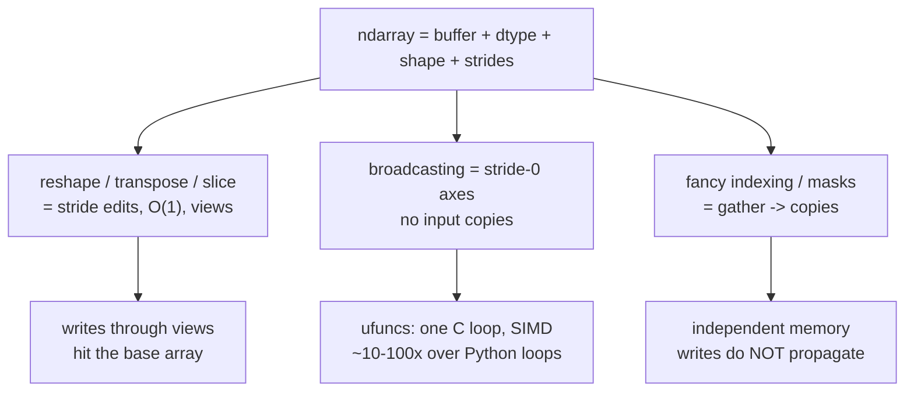
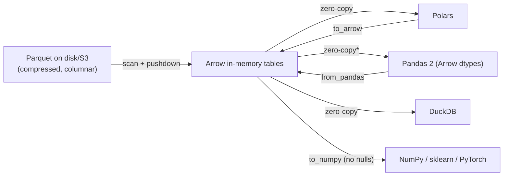

# NumPy and the Scientific Stack

Every tensor library you will ever touch — PyTorch, JAX, TensorFlow — is a re-implementation of ideas NumPy standardized: a flat buffer of typed bytes, a shape, and strides that turn indices into memory offsets. Understand that triad and you can predict, without running the code, which operations are free (views), which allocate (copies), why one loop order is 10x faster than another, and why your "quick" Pandas transformation eats 30 GB of RAM.

This guide derives NumPy's behavior from its memory model, measures vectorization honestly, then moves up the stack: Pandas' internals and its famous traps, Polars' lazy engine and when it wins, and Arrow as the zero-copy interchange layer that ties the whole 2020s data ecosystem together.

Part of the [Senior AI Engineer Roadmap](../00-Senior-AI-Engineer-Roadmap.md) — Phase 1.

---

## 1. ndarray Internals: Buffer, Dtype, Shape, Strides

### 1.1 The four-field model

An `ndarray` is a small header pointing at a flat, contiguous block of bytes, plus interpretation metadata:

- **data pointer** — address of byte 0 of the buffer,
- **dtype** — how to interpret each element (e.g. `float32` = 4 bytes, IEEE 754),
- **shape** — the logical dimensions,
- **strides** — *bytes* to step in memory to advance one index along each axis.

Element `A[i, j]` lives at `data + i*strides[0] + j*strides[1]`. Everything else — transposes, slices, broadcasting, C vs Fortran order — is stride arithmetic on the same buffer.

```python
# strides_demo.py — run with: python strides_demo.py
import numpy as np

A = np.arange(12, dtype=np.int32).reshape(3, 4)
print(A.shape, A.strides)      # (3, 4) (16, 4)
# Row-major (C order): moving one column = 4 bytes (one int32),
# moving one row = 16 bytes (4 columns * 4 bytes).

T = A.T
print(T.shape, T.strides)      # (4, 3) (4, 16)
print(T.base is A)             # True  — the transpose is a VIEW: zero bytes copied,
                               # NumPy just swapped the strides.

col = A[:, 1]
print(col, col.strides)        # [1 5 9] (16,)  — a strided view: step 16 bytes per element

every_other = A[:, ::2]
print(every_other.strides)     # (16, 8)  — slicing just multiplies the stride
```

`reshape`, `transpose`, basic slicing, `ravel` (when possible), and `np.newaxis` are all *O(1) metadata edits*. That's the source of NumPy's composability: you can build elaborate access patterns without touching the data.

### 1.2 Views vs copies: the rule and the trap

**Basic slicing (slices, ints, newaxis) returns views. Fancy indexing (integer arrays, boolean masks) returns copies.** Views share memory — writes propagate; copies don't.

```python
# views_vs_copies.py
import numpy as np

A = np.zeros((4, 4))
v = A[:2, :2]                  # basic slice -> view
v[:] = 1
print(A[0, 0])                 # 1.0  — write through the view hit A

c = A[[0, 1], :]               # fancy index -> copy
c[:] = 9
print(A[0, 0])                 # 1.0  — A unchanged

mask = A > 0
A[mask] = 5                    # BUT: fancy indexing directly on the LHS of assignment
print(A[0, 0])                 # 5.0  — works, because A.__setitem__ writes in place

# The classic silent bug:
b = A[A > 0]                   # copy
b[:] = -1                      # modifies the copy; A untouched, no warning
print(A[0, 0])                 # 5.0

# When unsure:
print(np.shares_memory(A, v), np.shares_memory(A, c))   # True False
```

The asymmetry to memorize: `A[mask] = value` writes into `A` (it's a `__setitem__` call), but `sub = A[mask]; sub[...] = value` writes into a copy. NumPy is consistent — Python surface syntax is what misleads.

A related trap: a tiny view keeps the giant base buffer alive. Slicing 1 KB out of a 10 GB array and storing the slice pins all 10 GB (`slice.base` holds the reference). Fix: `small = big[a:b].copy()`.

### 1.3 Contiguity and why iteration order matters

"C-contiguous" means the last axis is packed tightly (strides decrease left to right). CPUs fetch memory in 64-byte cache lines and prefetch sequential access, so traversal order changes real performance even though the math is identical:

```python
# contiguity_timing.py
import numpy as np, timeit

A = np.random.rand(8000, 8000)          # C-contiguous: rows are packed

row_sum = timeit.timeit(lambda: A.sum(axis=1), number=10)   # sum along packed axis
col_sum = timeit.timeit(lambda: A.sum(axis=0), number=10)   # strided axis

print(f"sum axis=1 (cache-friendly): {row_sum:.2f}s")   # ~0.35s
print(f"sum axis=0 (strided):        {col_sum:.2f}s")   # ~0.55s   (machine-dependent)

# Copying a transpose makes it contiguous again — sometimes worth the memcpy:
B = np.ascontiguousarray(A.T)
```

This is also why `arr.flags['C_CONTIGUOUS']` matters at library boundaries: many C/BLAS kernels require contiguous input and silently copy when it isn't — your "zero-copy" pipeline can hide a full materialization inside a single innocuous call.

---

## 2. Broadcasting, Derived

### 2.1 The two rules

Broadcasting lets arrays of different shapes combine without materializing repeats. The algorithm, exactly:

1. **Align shapes right-to-left**, padding the shorter shape with 1s on the left.
2. For each dimension pair: they're compatible if **equal, or either is 1**. A size-1 dimension is "stretched" to match — implemented by giving that axis **stride 0**, so every step re-reads the same memory. No copy ever happens.

```text
(10000, 128)  /  (10000, 1)     -> pair up: 128 vs 1 (stretch), 10000 vs 10000  ✓ -> (10000, 128)
(10000, 128)  /  (10000,)       -> pad:     (1, 10000): 128 vs 10000            ✗ ERROR
(8, 1, 6, 1)  *  (7, 1, 5)      -> (8, 7, 6, 5)   — both stretch, in different axes
```

That second line is the single most common broadcasting error in ML code, and it's why reductions grow a `keepdims=True` flag:

```python
# broadcasting.py
import numpy as np

X = np.random.randn(10_000, 128).astype(np.float32)     # 10k embeddings

norms = np.linalg.norm(X, axis=1, keepdims=True)        # (10000, 1) — keepdims!
X_unit = X / norms                                      # (10000,128)/(10000,1) broadcasts

# Without keepdims: (10000,128) / (10000,) -> pads to (1,10000) -> 128 vs 10000 -> ValueError
# operands could not be broadcast together with shapes (10000,128) (10000,)

# Outer difference via injected axes — pairwise L2 distances without a loop:
a = np.random.randn(500, 3)
b = np.random.randn(400, 3)
diff = a[:, None, :] - b[None, :, :]        # (500,1,3) - (1,400,3) -> (500,400,3)
d = np.sqrt((diff ** 2).sum(axis=2))        # (500, 400) distance matrix
print(d.shape)                              # (500, 400)
```

The `[:, None, :]` idiom — inserting size-1 axes so broadcasting produces an outer product/difference — is the workhorse of vectorized pairwise computation. Cost awareness: `diff` here materializes 500×400×3 floats. Broadcasting avoids copying *inputs*, not *outputs*; for big pairwise problems, use the algebraic expansion (`‖a-b‖² = ‖a‖² + ‖b‖² − 2ab`) so the only big array is the final matrix computed by one BLAS matmul.

### 2.2 Vectorization with honest numbers

```python
# vectorize_timing.py
import numpy as np, timeit

x = np.random.rand(1_000_000)

def python_loop():
    out = [0.0] * len(x)
    for i, v in enumerate(x):
        out[i] = v * 2.5 + 1.0
    return out

def numpy_vec():
    return x * 2.5 + 1.0

t_loop = timeit.timeit(python_loop, number=5) / 5
t_vec  = timeit.timeit(numpy_vec,  number=5) / 5
print(f"python loop: {t_loop*1000:7.1f} ms")     # python loop:   95.3 ms
print(f"numpy:       {t_vec*1000:7.1f} ms")      # numpy:          1.1 ms   -> ~90x
```

Where the ~90x comes from: the Python loop pays per element for bytecode dispatch, a `float` object allocation, and dynamic type checks; NumPy runs one C loop over a raw `double` buffer with SIMD. The corollary: **crossing the Python↔NumPy boundary per element destroys the win.** `np.vectorize` is a convenience wrapper around a Python loop, not an optimization. `x * 2.5 + 1.0` does allocate a temporary for `x * 2.5`; for hot paths, `np.multiply(x, 2.5, out=buf); np.add(buf, 1.0, out=buf)` reuses memory.

### 2.3 einsum: index notation for tensor ops

`np.einsum` expresses contractions the way you'd write them on paper: name each operand's axes; repeated letters multiply-and-sum; letters missing from the output are summed away.

```python
# einsum_demo.py
import numpy as np

A = np.random.rand(64, 128)          # (batch, dim)
B = np.random.rand(128, 32)

# matmul: sum over shared index k
C = np.einsum("ik,kj->ij", A, B)     # == A @ B          (64, 32)

# row-wise dot products (what (A*A).sum(1) does, without the temporary):
sq = np.einsum("ij,ij->i", A, A)     # (64,)

# batched attention-style scores: (batch, heads, seq, d) x (batch, heads, seq, d)
Q = np.random.rand(8, 4, 32, 16)
K = np.random.rand(8, 4, 32, 16)
scores = np.einsum("bhqd,bhkd->bhqk", Q, K)   # (8, 4, 32, 32)
print(scores.shape)

# Transpose-free trace, outer products, etc. all read off the indices:
tr = np.einsum("ii->", np.random.rand(5, 5))   # trace
```

Why it earns a place: it documents the operation (axis names beat a chain of `transpose`/`reshape`), it avoids intermediate temporaries, and `optimize=True` lets NumPy reorder multi-operand contractions to the cheapest association order — which can be asymptotically better than the naive left-to-right evaluation. The same notation transfers verbatim to `torch.einsum`, where you'll use it for attention math.



---

## 3. Pandas: Internals and Pitfalls

### 3.1 What a DataFrame actually is

Classic Pandas stores a DataFrame as **blocks**: same-dtype columns consolidated into 2-D NumPy arrays (all float64 columns in one block, etc.), managed by a `BlockManager`. Consequences:

- Column operations are fast (they're NumPy ops on a block); row-wise `df.apply(axis=1)` is a Python loop building a Series per row — often 100-1000x slower than a vectorized equivalent.
- An `object` dtype column is an array of *pointers to Python objects* — every string op walks pointers and re-boxes. (Pandas 2.x can back strings/columns with **Arrow** — `dtype="string[pyarrow]"` or `dtype_backend="pyarrow"` on read — for compact, fast, properly-null-able columns; Pandas 3.0 makes the dedicated string dtype the default.)
- Insertion of a differently-typed column can trigger block re-consolidation — one reason wide-DataFrame column-by-column construction is quadratic-ish; build from a dict once instead.

### 3.2 SettingWithCopy: the mechanism, not the folklore

```python
# setting_with_copy.py
import pandas as pd

df = pd.DataFrame({"a": [1, 2, 3], "b": [10.0, 20.0, 30.0]})

# Chained indexing = TWO separate calls:
df[df.a > 1]["b"] = 0        # step 1: df[df.a > 1] -> boolean mask -> COPY
                             # step 2: copy["b"] = 0 -> writes to the doomed copy
print(df.b.tolist())         # [10.0, 20.0, 30.0]  — unchanged! (plus SettingWithCopyWarning)

# One call, one indexer -> unambiguous in-place write:
df.loc[df.a > 1, "b"] = 0
print(df.b.tolist())         # [10.0, 0.0, 0.0]
```

The root cause is that `df[mask]` must return *something* before the assignment happens, and for masks that something is a copy; Pandas can't see the whole chained expression. The warning exists because the reverse case (a chain that happens to hit a view) would corrupt data silently. **Pandas 3.0 closes this permanently with copy-on-write (opt-in via `pd.set_option("mode.copy_on_write", True)` in 2.x):** every indexing result behaves as a copy, lazily materialized only when written — chained assignment then *never* works, deterministically, instead of sometimes-working.

### 3.3 Memory reduction: dtypes and categoricals

```python
# memory_diet.py
import pandas as pd, numpy as np

n = 1_000_000
df = pd.DataFrame({
    "user_id":  np.random.randint(0, 50_000, n),          # int64 by default
    "country":  np.random.choice(["KE", "NG", "ZA", "EG"], n),  # object
    "amount":   np.random.rand(n) * 100,                  # float64
})
print(df.memory_usage(deep=True).sum() / 1e6)             # ~ 79.7 MB

df["user_id"] = df["user_id"].astype("int32")             # values fit -> half the bytes
df["amount"]  = df["amount"].astype("float32")            # if precision allows
df["country"] = df["country"].astype("category")          # 4 uniques -> int8 codes + tiny dict
print(df.memory_usage(deep=True).sum() / 1e6)             # ~ 9.0 MB   -> ~9x smaller
```

`category` stores each value as a small integer code plus one shared lookup table — transformative for low-cardinality strings (country, status, model_name), and `groupby` on categoricals is faster too. Traps: high-cardinality categoricals *waste* memory (codes + a huge dictionary); merging on category columns with different dictionaries silently upcasts to object; and `.str` ops require round-trips. Also beware the classic silent upcast: an int column that receives a `NaN` becomes float64 (use nullable `Int32`/Arrow dtypes to avoid it).

---

## 4. Polars: the Lazy Engine

### 4.1 Expressions and lazy frames

Polars is a Rust, Arrow-backed DataFrame engine. Two ideas do the heavy lifting:

- **Expressions** (`pl.col("amount").sum()`) are *descriptions* of computations, composable and optimizable, executed in parallel across cores.
- **LazyFrames** (`pl.scan_parquet`, `.lazy()`) build a query plan; `.collect()` optimizes then executes: predicate pushdown (filter while reading the file), projection pushdown (read only needed columns), common-subexpression elimination, join reordering.

```python
# polars_lazy.py
import polars as pl

lf = (
    pl.scan_parquet("transactions.parquet")     # nothing is read yet
      .filter(pl.col("amount") > 0)             # will be pushed into the parquet scan
      .with_columns(
          (pl.col("amount") / pl.col("amount").sum().over("customer_id"))
              .alias("share_of_customer"),      # window expression, no groupby+merge dance
      )
      .group_by("customer_id")
      .agg(
          pl.col("amount").sum().alias("total_spend"),
          pl.col("amount").count().alias("txn_count"),
          pl.col("merchant").n_unique().alias("merchants"),
      )
)
print(lf.explain())      # shows the optimized plan: SELECTION pushed into SCAN,
                         # only 3 columns projected from the file
df = lf.collect()        # executes, multi-threaded
# Larger-than-RAM: lf.collect(engine="streaming") processes in chunks
```

### 4.2 An honest benchmark

```python
# polars_vs_pandas_bench.py — 20M-row groupby, 8-core laptop, numbers indicative
import numpy as np, pandas as pd, polars as pl, time

n = 20_000_000
ids = np.random.randint(0, 100_000, n)
amounts = np.random.rand(n)

pdf = pd.DataFrame({"id": ids, "amount": amounts})
plf = pl.DataFrame({"id": ids, "amount": amounts})

t0 = time.perf_counter()
r1 = pdf.groupby("id")["amount"].agg(["sum", "mean", "max"])
t1 = time.perf_counter()
r2 = plf.group_by("id").agg(pl.col("amount").sum(),
                            pl.col("amount").mean(),
                            pl.col("amount").max())
t2 = time.perf_counter()
print(f"pandas: {t1 - t0:.2f}s")     # pandas: 2.9s
print(f"polars: {t2 - t1:.2f}s")     # polars: 0.4s   -> ~7x on 8 cores
```

Where Polars wins big: multi-core aggregations/joins/sorts, lazy pipelines over Parquet where pushdown skips most of the file, string operations (Arrow strings vs object dtype), streaming larger-than-RAM jobs. Where Pandas still wins: ecosystem interop (scikit-learn, statsmodels, plotting expect Pandas), tiny data where engine startup dominates, decades of niche functionality and Stack Overflow answers. The pragmatic pattern: **Polars for ETL and feature pipelines, convert at the model boundary** — `pl_df.to_pandas()` is cheap (often zero-copy via Arrow), `.to_numpy()` feeds sklearn/PyTorch directly.

Polars also kills the SettingWithCopy class of bugs structurally: DataFrames are immutable; every operation returns a new frame (cheaply, sharing Arrow buffers), so there is no view-vs-copy ambiguity to reason about.

---

## 5. PyArrow and Zero-Copy Interchange

Apache Arrow specifies a **language-independent columnar memory layout**: each column is a set of contiguous buffers (values, validity bitmap, offsets for variable-length types). Because the layout is a standard, systems that both speak Arrow can hand datasets to each other **by passing pointers** — no serialization, no copy.

```python
# arrow_interchange.py
import pyarrow as pa, pyarrow.parquet as pq
import polars as pl
import numpy as np

# Parquet <-> Arrow: Parquet is the on-disk format, Arrow the in-memory one
table = pq.read_table("train.parquet", columns=["label", "amount"])  # projection pushdown

# Arrow -> Polars: zero-copy (both are Arrow memory)
pl_df = pl.from_arrow(table)

# Arrow -> Pandas: zero-copy where dtypes allow; keep Arrow-backed dtypes:
pdf = table.to_pandas(types_mapper=pd.ArrowDtype) if False else table.to_pandas()

# Arrow numeric column -> NumPy: zero-copy view when there are no nulls
col = table["amount"].combine_chunks()
arr = col.to_numpy(zero_copy_only=True)      # raises if a copy would be needed
print(arr.dtype, np.shares_memory if False else "view over Arrow buffer")
```

Why this matters operationally:

- **Store datasets as Parquet, not CSV.** Columnar + compressed + schema-carrying + statistics for row-group skipping. CSV loses dtypes, breaks on embedded commas, and parses ~10x slower.
- **The `__dataframe__`/Arrow C interface** lets DuckDB query a Polars frame, Polars ingest a Pandas frame, and Ray/Spark ship Arrow batches — all without copies. Your pipeline's frameworks become interchangeable at the buffer level.
- **Memory-mapped Arrow/Feather files** (`pa.memory_map`) let multiple processes read one dataset with the OS page cache doing the sharing — the practical answer to "give 8 DataLoader workers the same 20 GB table."



---

## 6. Production War Stories & Failure Modes

### 6.1 The 10 GB DataFrame that became 60 GB

**Symptom:** A feature-building job reading a 10 GB Parquet file OOMs a 64 GB machine. `memory_usage(deep=True)` on a sample shows the loaded frame is ~35 GB, and peak RSS hits ~60 GB mid-pipeline.

**Investigation:** Three multipliers stacked: (1) object-dtype string columns — each short string a 50-60-byte Python object versus ~10 bytes in Arrow; (2) an int column with NaNs upcast to float64; (3) the pipeline's chained `.merge().assign().fillna()` materialized full intermediate copies, so peak = 2-3 live frames.

**Root cause:** Default dtypes plus eager evaluation. Parquet's compressed size had anchored everyone's memory expectations at "10 GB-ish".

**Fix:** `pd.read_parquet(..., dtype_backend="pyarrow")` (strings ~5x smaller, ints stay nullable ints), categoricals for low-cardinality columns, and the pipeline rewritten in Polars lazy so the optimizer streamed and never held two full copies. Peak RSS: 11 GB.

**Prevention:** Log `memory_usage(deep=True)` at pipeline stage boundaries; a CI canary asserting per-stage memory against a budget; treat `object` dtype in a schema check as a lint error.

### 6.2 The nondeterministic "training data corruption"

**Symptom:** A model's offline metrics jump run to run with the same seed. Feature matrices differ between "identical" runs on a few thousand rows.

**Investigation:** Diffing feature arrays localized the changes to rows touched by an outlier-clipping step: `sub = df[df.amount > cap]` then `sub["amount"] = cap` — chained-indexing assignment writing to a copy. Whether the warning even appeared depended on upstream steps (a preceding `.copy()` in one code path silenced it), and downstream code sometimes read clipped values, sometimes not, depending on branch order.

**Root cause:** SettingWithCopy — the clip silently didn't apply to the real frame, and a later *differently-written* clip applied conditionally.

**Fix:** `df.loc[df.amount > cap, "amount"] = cap` (then, properly, `df["amount"] = df["amount"].clip(upper=cap)`); enabled copy-on-write mode globally so chained assignment fails deterministically.

**Prevention:** `pd.set_option("mode.copy_on_write", True)` (default in Pandas 3); treat `SettingWithCopyWarning` as an error in CI (`-W error::pandas.errors.SettingWithCopyWarning`); golden tests on feature outputs so any silent change diffs loudly.

### 6.3 The all-pairs similarity that "should have fit"

**Symptom:** A dedup job computing cosine similarity over 200k embeddings (768-dim, float32 — ~600 MB) is killed by the OOM killer on a 128 GB box.

**Investigation:** The code built pairwise differences with broadcasting: `X[:, None, :] - X[None, :, :]` — shape (200k, 200k, 768). Broadcasting the *inputs* was free; the *output* was 200k × 200k × 768 × 4 bytes ≈ **117 TB** requested. The allocator died long before that, but a smaller intermediate variant (chunked, still materializing (200k, 200k) float64 ≈ 320 GB) also failed.

**Root cause:** Confusing "broadcasting doesn't copy" (true, for inputs) with "the result is small" (false — the result has the broadcast shape).

**Fix:** Normalize rows, then chunked matmul: for each 4k-row block, `block @ X_unit.T` gives (4k, 200k) scores — 3.2 GB per block, top-k reduced immediately, block discarded. Runs in minutes. (At larger scale: a vector index / ANN, not exact all-pairs.)

**Prevention:** Before any broadcasted op, compute the output shape and bytes (`np.prod(shape) * itemsize`) — a one-line assert; prefer algebraic forms (`‖a‖²+‖b‖²−2ab`) that route through BLAS; budget memory like you budget latency.

### 6.4 The Parquet partition explosion

**Symptom:** A daily Polars job writing features "partitioned by customer" slows from 4 minutes to 3 hours over two months; the S3 bucket has 4.1 million objects; downstream `scan_parquet` spends 20 minutes just listing files.

**Investigation:** `write_parquet` with hive partitioning on `customer_id` (~70k values) times 60 daily runs created millions of kilobyte-sized files. Parquet's benefits (columnar compression, row-group statistics) evaporate below a few tens of MB per file; object-store latency is per-object.

**Root cause:** Partitioning by a high-cardinality key — a database-index habit misapplied to a columnar file layout.

**Fix:** Repartitioned by date only, sorted within files by `customer_id` (so row-group min/max statistics still prune customer lookups), targeting 128-512 MB files; a compaction job merged the historical small files.

**Prevention:** Partition by low-cardinality query dimensions (date, region); rely on sorting + row-group stats for fine-grained pruning; monitor object count and average file size as first-class pipeline metrics.

---

## 7. Best Practices

- Know `shape`, `dtype`, and (when performance matters) `strides`/contiguity of every array at every step; assert shapes at function boundaries.
- Prefer `float32` for model-bound data — half the memory and bandwidth of float64, and it's what the GPU wants anyway. Watch for silent upcasts (`float32 + float64 -> float64`, int + NaN -> float64).
- Basic slicing = view, fancy indexing = copy; use `np.shares_memory` when unsure, and `.copy()` small slices of huge arrays so views don't pin the base buffer.
- Estimate output sizes of broadcasted operations before running them; chunk or use BLAS-friendly algebra for pairwise computations.
- Vectorize end-to-end: one element-wise Python callback (`apply`, `np.vectorize`) in the middle forfeits the entire speedup.
- In Pandas: never chain-index for assignment — one `.loc[rows, cols] = value`; enable copy-on-write; use Arrow-backed dtypes and categoricals; build DataFrames once from complete data, not column-by-column.
- Default to Polars lazy (`scan_*` … `collect`) for pipelines; check `explain()` to confirm pushdown; convert to Pandas/NumPy only at the model boundary.
- Store data as Parquet with explicit schemas; target 100-500 MB files partitioned by low-cardinality keys; treat CSV as an ingestion-time legacy format.
- Let Arrow carry data between engines (Polars/DuckDB/Pandas) zero-copy instead of exporting/importing through Python objects.
- Benchmark with `timeit`/real timings on realistic sizes before optimizing — intuition about NumPy performance is wrong often enough to be dangerous.

---

## 8. Interview Drills

<details>
<summary>What are strides, and how do they make transpose free?</summary>

Strides are the per-axis byte steps used to map an index tuple to a memory offset: `addr(i, j) = base + i*s0 + j*s1`. A (3,4) int32 C-order array has strides (16, 4). `A.T` returns a new header over the *same buffer* with shape and strides reversed — (4,3) with strides (4,16). No data moves; indexing math changes. The same trick implements slicing (offset the base, multiply strides by step) and `reshape` when the layout allows.

**Follow-up: "When can `reshape` NOT return a view?"** When the requested shape can't be expressed as strides over the existing layout — e.g., reshaping a transposed (non-contiguous) array. NumPy then silently copies. If correctness depends on view-ness, use `arr.reshape(...)` only on contiguous arrays or check `result.base is not None`.

**Follow-up: "What's a stride-0 array?"** An axis with stride 0 re-reads the same memory for every index — this is exactly how broadcasting implements "stretching" a size-1 axis, and how `np.broadcast_to` creates a huge logical array over tiny physical storage. Writing to overlapping stride-0 views is undefined-behavior territory.
</details>

<details>
<summary>State NumPy's broadcasting rules precisely, and explain why `(n,128) / (n,)` fails but `(n,128) / (n,1)` works.</summary>

Align shapes right-to-left, pad the shorter with leading 1s; each dimension pair must be equal or contain a 1 (which stretches). `(n,128)` vs `(n,)`: pad to `(1,n)`; rightmost pair 128 vs n mismatches (for n≠128) — error. `(n,128)` vs `(n,1)`: rightmost 128 vs 1 stretches, then n vs n matches — result `(n,128)`. This is precisely why reductions have `keepdims=True`: it preserves the reduced axis as size 1 so the result broadcasts back against the source array.

**Follow-up: "Nastier: what happens if n happens to equal 128?"** `(128,128) / (128,)` *succeeds* — but divides each **row** element-wise by the vector, i.e., normalizes columns-ish, not rows. A shape-compatible-but-semantically-wrong broadcast is worse than an error: this is the argument for `keepdims` and explicit `[:, None]` even when the unpadded version "works".
</details>

<details>
<summary>Why is a Python loop ~100x slower than the equivalent NumPy expression?</summary>

Per element, the loop pays: bytecode dispatch through the interpreter loop, boxing (each float becomes a heap-allocated PyObject with refcounting), dynamic dispatch of `*`/`+` through type protocols, and cache-hostile pointer chasing. NumPy pays those costs *once per array*: one dispatch selects a compiled C loop that streams over a contiguous typed buffer with SIMD and good cache behavior. The ratio is workload-dependent (~10-100x); it shrinks for tiny arrays (fixed overhead dominates) and grows for element-wise math on large ones.

**Follow-up: "So is `np.vectorize` fast?"** No — it's a Python-level loop with broadcasting sugar; the docs say so explicitly. Real options for un-vectorizable logic: reformulate with masks/`np.where`/`np.select`, use Numba/Cython to compile the loop, or accept the loop for small n.

**Follow-up: "When is NumPy slower than the loop?"** Sub-hundred-element arrays in a hot path (per-call overhead dominates — a plain float loop or math module wins), and expression chains that allocate many large temporaries and blow cache, where a fused single pass (Numba, or `out=` reuse) wins.
</details>

<details>
<summary>Views vs copies: which operations return which, and what two bug classes result?</summary>

Views: basic slices (`a[2:8]`, `a[:, ::2]`), `transpose`/`T`, `ravel` on contiguous data, `reshape` when stride-expressible, `newaxis`. Copies: fancy indexing with integer arrays, boolean-mask indexing, `flatten()`, arithmetic results, `np.sort` (vs `.sort()`). Bug class 1 — *unintended aliasing*: mutate a slice, silently mutate the source (or vice versa) — e.g., normalizing a "copy" that's actually a view of your raw data. Bug class 2 — *phantom writes*: assign into a mask-derived intermediate and the source never changes (`sub = a[mask]; sub[:] = 0`). Bonus class: a small view pinning a huge base array in memory.

**Follow-up: "But `a[mask] = 0` works — why?"** That's a single `__setitem__` on `a` — NumPy scatters directly into `a`'s buffer. The copy only exists when fancy indexing appears in an *expression* (`__getitem__`) whose result you then modify. Same syntax shape, different protocol call.
</details>

<details>
<summary>Explain `einsum("bhqd,bhkd->bhqk", Q, K)` and why you'd use einsum over matmul chains.</summary>

Axes: batch b, heads h, query position q, key position k, feature d. `d` appears in both inputs but not the output → multiply and sum over it; `q` and `k` each appear in one input and the output → outer-product them; `b`,`h` appear everywhere → batched. Result: for every (batch, head), the q×k matrix of dot products — attention scores, equal to `Q @ K.transpose(-1, -2)`. Advantages: self-documenting axis semantics (transpose chains encode intent invisibly), no manual reshape/transpose bookkeeping, fewer temporaries, and with `optimize=True` NumPy chooses a near-optimal contraction order for 3+ operands, which can change complexity class, not just constants.

**Follow-up: "What's a case where naive einsum order is asymptotically bad?"** Chained matmul like `einsum("ij,jk,kl->il", A, B, C)` with skewed dims: (1000×2)·(2×1000)·(1000×2) left-to-right materializes a 1000×1000 intermediate (~2·10⁹ flops); associating right first keeps everything rank-2 (~10⁷). `optimize=True` finds this; hand-chained `@` makes you choose yourself.
</details>

<details>
<summary>What actually causes SettingWithCopyWarning, and how does copy-on-write eliminate the problem?</summary>

Chained indexing performs two independent operations: `df[mask]` returns an object (for masks, a copy), then `["b"] = 0` mutates *that object*. Pandas can't statically know the assignment was meant for `df`, so writes may land on a temporary — it heuristically warns. The fix is a single indexer: `df.loc[mask, "b"] = 0`, one `__setitem__` on the real frame. Copy-on-write (opt-in in 2.x, standard in 3.0) makes every derived object semantically a copy — sharing buffers until first write, then materializing. Chained assignment then *deterministically* does nothing to the parent (and raises a ChainedAssignmentError warning), converting a heisenbug into a consistent, catchable behavior, while also making defensive `.copy()` calls unnecessary.

**Follow-up: "Does CoW change performance?"** Mostly improves it: methods that defensively copied (e.g., `reset_index`, many `astype`s) now return lazy shares. The cost is a copy triggered at first mutation of shared data — predictable, and cheaper than the old always-copy paths.
</details>

<details>
<summary>When does `category` dtype help, when does it hurt, and what's the merge trap?</summary>

Helps when cardinality ≪ length: values become int8/16/32 codes plus one dictionary — a million-row country column drops ~50 MB → ~1 MB, and groupbys get faster. Hurts when cardinality approaches row count (codes + dictionary > original), or when you constantly do `.str` operations (decode → operate → re-encode). Merge trap: joining two frames on category columns whose dictionaries differ makes Pandas upcast the join keys to object — memory balloons and the join slows, precisely in the "big join" scenario where you wanted categoricals. Fix: align dictionaries beforehand (`union_categoricals` or define a shared `CategoricalDtype`).

**Follow-up: "How does this compare with Arrow dictionary encoding?"** Same idea, standardized: Arrow's dictionary type is what Parquet uses on disk and Polars/DuckDB use in memory, so with Arrow-backed frames you get the compression without Pandas-specific dictionary-mismatch semantics.
</details>

<details>
<summary>What optimizations does Polars' lazy engine apply that eager Pandas cannot?</summary>

Because `.collect()` sees the whole plan: **predicate pushdown** (filters evaluated during the Parquet scan, skipping row groups via min/max stats), **projection pushdown** (only referenced columns are read at all), common-subexpression elimination, filter/join reordering, and parallel execution of independent plan branches; the streaming engine additionally executes the plan over chunks for larger-than-RAM data. Eager Pandas executes each statement fully before seeing the next, so `read_parquet` must load everything the later filter would have skipped. The mental shift: you write *what*, the optimizer decides *when and how much* — verify with `lf.explain()`.

**Follow-up: "So why does anyone still use Pandas?"** Ecosystem gravity (sklearn, statsmodels, plotting, tutorials), tiny-data ergonomics, and organizational familiarity. The standard architecture is Polars/DuckDB for the heavy pipeline, Pandas at the edges where libraries demand it — Arrow makes the conversion nearly free.
</details>

<details>
<summary>Why Parquet over CSV for ML datasets — give concrete mechanisms, not vibes.</summary>

(1) **Types in the file**: schema travels with data — no dtype inference flipping a zero-padded ID column to int, no datetime re-parsing. (2) **Columnar layout**: reading 3 of 80 columns reads ~3/80 of the bytes; CSV must scan every byte regardless. (3) **Compression + encodings**: dictionary/RLE + zstd routinely 5-10x smaller than CSV. (4) **Row-group statistics**: min/max per chunk lets engines skip data that can't match a filter — I/O proportional to the query, not the dataset. (5) **Parse cost**: binary columnar decode is ~an order of magnitude faster than text parsing. CSV keeps exactly one advantage: universal human/tool readability at the edge of the system.

**Follow-up: "How do you choose row-group and file sizes?"** Row groups ~100k-1M rows (large enough for compression and skipping stats to work, small enough for granular pruning/parallelism); files 100-500 MB (object-store request overhead vs parallelism). Avoid the many-tiny-files regime — per-object latency and metadata listing dominate everything.
</details>

<details>
<summary>What is Arrow, and what makes "zero-copy interchange" actually zero-copy?</summary>

Arrow is a specification for how columnar data is laid out in memory — for each column: a contiguous values buffer, a validity bitmap for nulls, and offset buffers for variable-length types — plus a C data interface for handing these buffers across library/language boundaries. Zero-copy works because both sides agree on the layout *bit for bit*: "transferring" a table from Polars to DuckDB passes pointers + schema; no serialization, no traversal, no allocation. Contrast with the old world: Pandas → objects → per-row conversion → target format, copying and boxing everything.

**Follow-up: "When does Arrow→NumPy still copy?"** When representations differ: columns with nulls (NumPy has no validity bitmap — floats can use NaN, ints can't), chunked arrays needing consolidation, or type mismatches (Arrow strings → object array of PyObjects, inherently a copy+boxing). `to_numpy(zero_copy_only=True)` makes the copy explicit instead of silent.
</details>

<details>
<summary>Design the memory strategy: 500M rows of transactions on S3, build per-customer features, 64 GB RAM machine.</summary>

Never hold the raw data in RAM. Storage: Parquet partitioned by date, sorted by customer within files. Compute: Polars lazy with the streaming engine — `scan_parquet` (predicate/projection pushdown reads only needed columns/dates), aggregations stream per chunk; per-customer aggregates are the *output* (~customers × features, likely a few GB) and that's all that materializes. If features need multi-pass logic, stage intermediate aggregates back to Parquet between passes. Alternatives in the same shape: DuckDB SQL over the same files (also streaming, also pushdown). What rules out Pandas: eager full load of even one month likely exceeds RAM after object-dtype inflation.

**Follow-up: "A feature needs a 90-day rolling window per customer — streaming groupby won't give you that directly."** Exploit the sort: process customer-partitioned, time-sorted chunks so each customer's history is contiguous — window functions (`over`/`rolling` in Polars, window frames in DuckDB) then operate within bounded state; or restate the rolling feature incrementally (carry running sums/counts per customer in a state table updated daily) — the same trick that makes it cheap in production serving too.
</details>

<details>
<summary>`df.apply(f, axis=1)` is in your hot path. Why is it slow and what are the escalation steps to fix it?</summary>

`axis=1 apply` constructs a Series per row (allocations, index machinery), calls a Python function per row, then reassembles — you pay Pandas overhead *and* Python-loop overhead; it's often slower than a plain loop over NumPy rows. Escalation: (1) express the logic as vectorized column arithmetic + `np.where`/`np.select` for conditionals — covers 90% of real cases; (2) `df["c"] = f_vectorized(df["a"].to_numpy(), df["b"].to_numpy())` operating on raw arrays; (3) rewrite in Polars expressions (parallel, no per-row Python); (4) if the logic is irreducibly scalar and hot, Numba `@njit` over the NumPy arrays; (5) reconsider whether the computation belongs upstream in SQL/ETL.

**Follow-up: "The function calls an external API per row — vectorization can't help. Now what?"** Then it's not a DataFrame problem, it's an I/O concurrency problem: extract the column, fan out with asyncio + semaphore (guide 02), join results back by key. Row-wise `apply` doing network I/O is the worst of both worlds — serial *and* per-row overhead.
</details>

---

*Previous: [Async, Concurrency, and Multiprocessing](./02-Async-Concurrency-and-Multiprocessing.md) · Next: [Production Python Engineering](./04-Production-Python-Engineering.md)*
