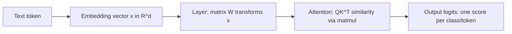
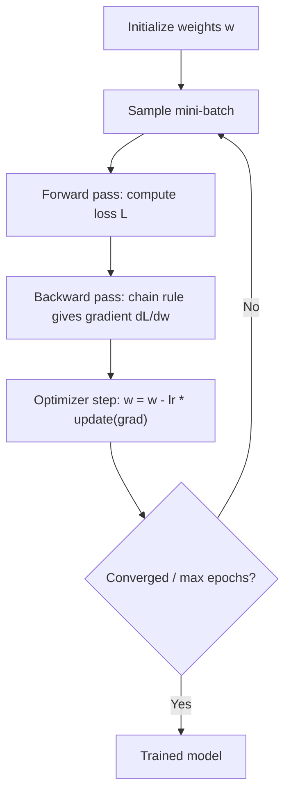

# Mathematics for AI: Linear Algebra, Calculus and Optimization

Every modern model — from linear regression to transformers — is linear algebra plus calculus plus an optimizer. This guide builds the intuition (what each object *means* in an AI system) and then cashes it in with the roadmap's required from-scratch NumPy implementations: linear regression, PCA, cosine similarity, k-means, and manual backprop.

Part of the [Senior AI Engineer Roadmap](./00-Senior-AI-Engineer-Roadmap.md) — Phase 1.

---

## 1. Linear Algebra

### 1.1 Vectors and matrices as AI objects

- A **vector** is a point in n-dimensional space. Embeddings are vectors: "similar meaning" becomes "nearby in space".
- A **matrix** is a linear transformation (rotate/scale/shear/project). A dense neural-network layer *is* a matrix (plus bias and nonlinearity).
- A **tensor** is the n-dimensional generalization — a batch of token embeddings is a `(batch, seq_len, d_model)` tensor.



### 1.2 Dot product and matrix multiplication

The dot product measures alignment between two vectors:

$$
\mathbf{a} \cdot \mathbf{b} = \sum_i a_i b_i = \|\mathbf{a}\|\,\|\mathbf{b}\|\cos\theta
$$

Matrix multiplication is "many dot products at once": entry $(i,j)$ of $AB$ is the dot product of row $i$ of $A$ with column $j$ of $B$. Shapes must chain: $(m \times k)(k \times n) \to (m \times n)$.

AI applications:
- **Similarity search / retrieval**: query embedding dotted against all document embeddings — one matmul.
- **Attention**: $QK^\top$ is exactly "every query dotted with every key".
- **A forward pass** is a chain of matmuls.

```python
import numpy as np
Q = np.random.randn(8, 64)    # 8 query vectors
K = np.random.randn(20, 64)   # 20 key vectors
scores = Q @ K.T              # (8, 20): similarity of every query to every key
```

### 1.3 Norms, cosine similarity, and projections

$$
\|\mathbf{x}\|_2 = \sqrt{\sum_i x_i^2}, \qquad
\text{cosine}(\mathbf{a},\mathbf{b}) = \frac{\mathbf{a}\cdot\mathbf{b}}{\|\mathbf{a}\|\,\|\mathbf{b}\|}
$$

Cosine similarity ignores magnitude and compares direction only — the standard for embedding search (documents of different lengths get comparable scores). The **projection** of $\mathbf{a}$ onto $\mathbf{b}$ is the component of $\mathbf{a}$ along $\mathbf{b}$; PCA is repeated projection onto the most informative directions. L2 norms also appear as weight decay (ridge regularization); L1 norms drive sparsity (lasso).

```python
def cosine_similarity(a: np.ndarray, b: np.ndarray) -> float:
    return float(a @ b / (np.linalg.norm(a) * np.linalg.norm(b)))

# Pitfall: cosine of a zero vector is undefined (division by zero) -> guard or add eps.
```

### 1.4 Eigenvalues, eigenvectors, and SVD

An **eigenvector** of $A$ is a direction the transformation only stretches: $A\mathbf{v} = \lambda\mathbf{v}$. The **SVD** factors *any* matrix:

$$
A = U \Sigma V^\top
$$

with orthonormal $U, V$ and non-negative singular values in $\Sigma$. Interpretation: every linear map is rotate -> scale along principal axes -> rotate.

AI applications:
- **PCA**: top singular vectors of centered data = directions of maximum variance.
- **Low-rank approximation**: keep top-$k$ singular values — the idea behind LoRA (fine-tune a low-rank update $BA$ instead of full weights) and classic matrix-factorization recommenders.
- **Positive definite matrices** (all eigenvalues > 0) are curvature "bowls" — covariance matrices, Hessians at minima.

---

## 2. Calculus and Optimization

### 2.1 Derivatives, gradients, Jacobians

The derivative is local sensitivity: how much does the output move per unit input nudge. For a scalar loss $L(\mathbf{w})$ over a weight vector, the **gradient** $\nabla L$ collects all partial derivatives and points in the direction of steepest *increase* — so we step against it. For a vector-valued function $f: \mathbb{R}^n \to \mathbb{R}^m$, the **Jacobian** is the $m \times n$ matrix of all partials; backprop is repeated Jacobian-vector products. The **chain rule** composes derivatives through nested functions:

$$
\frac{\partial L}{\partial x} = \frac{\partial L}{\partial u} \cdot \frac{\partial u}{\partial x}
$$

That single rule *is* backpropagation: a network is a composition of layers, and gradients flow backwards multiplying local Jacobians.

### 2.2 Convexity, GD, SGD, momentum, Adam

A convex function has one global minimum (linear/logistic regression). Deep networks are non-convex, yet SGD works remarkably well in practice.

$$
\mathbf{w}_{t+1} = \mathbf{w}_t - \eta \, \nabla L(\mathbf{w}_t)
$$

- **GD**: gradient over the full dataset per step — exact but slow.
- **SGD (mini-batch)**: gradient over a random batch — noisy, cheap, and the noise helps escape saddle points.
- **Momentum**: exponentially averaged gradient smooths oscillation and accelerates along consistent directions.
- **Adam**: momentum + per-parameter learning rates scaled by a running estimate of gradient magnitude — the robust default for deep learning.



Learning-rate intuition: too large diverges (loss becomes NaN), too small crawls. If loss explodes, the first suspects are learning rate and unscaled features.

---

## 3. Required NumPy Implementations (no scikit-learn)

### 3.1 Linear regression — normal equations AND gradient descent

$$
\hat{\mathbf{w}} = (X^\top X)^{-1} X^\top \mathbf{y}
$$

```python
import numpy as np
rng = np.random.default_rng(0)

# Synthetic data: y = 3x1 - 2x2 + 1 + noise
X = rng.normal(size=(500, 2))
y = 3 * X[:, 0] - 2 * X[:, 1] + 1 + rng.normal(scale=0.1, size=500)
Xb = np.hstack([X, np.ones((len(X), 1))])          # append bias column

# --- Closed form (normal equations). Use lstsq, not an explicit inverse. ---
w_closed, *_ = np.linalg.lstsq(Xb, y, rcond=None)
print(w_closed)                                     # ~[3, -2, 1]

# --- Gradient descent on MSE: grad = (2/n) X^T (Xw - y) ---
w = np.zeros(3)
lr = 0.1
for _ in range(500):
    grad = 2 / len(y) * Xb.T @ (Xb @ w - y)
    w -= lr * grad
print(w)                                            # converges to the same solution
```

When to use which: normal equations are exact but cost $O(d^3)$ and need $X^\top X$ well-conditioned; GD scales to huge $n$ and $d$ and generalizes to any differentiable loss. Pitfall: with unscaled features GD zigzags — standardize inputs first.

### 3.2 PCA via SVD

```python
def pca(X: np.ndarray, k: int):
    Xc = X - X.mean(axis=0)                 # centering is mandatory
    U, S, Vt = np.linalg.svd(Xc, full_matrices=False)
    components = Vt[:k]                     # top-k principal directions
    explained = S[:k] ** 2 / np.sum(S ** 2) # variance ratio per component
    return Xc @ components.T, components, explained

Z, comps, ratio = pca(rng.normal(size=(200, 10)) @ rng.normal(size=(10, 10)), k=2)
```

Pitfall: forgetting to center makes the first component point at the data mean, not the max-variance direction. Also scale features first if their units differ wildly, or the largest-unit feature dominates.

### 3.3 Cosine similarity (batch) — the retrieval primitive

```python
def cosine_matrix(A: np.ndarray, B: np.ndarray, eps: float = 1e-9) -> np.ndarray:
    """Pairwise cosine similarity between rows of A (n,d) and B (m,d) -> (n,m)."""
    A_n = A / (np.linalg.norm(A, axis=1, keepdims=True) + eps)
    B_n = B / (np.linalg.norm(B, axis=1, keepdims=True) + eps)
    return A_n @ B_n.T

query = rng.normal(size=(1, 128))
docs = rng.normal(size=(1000, 128))
top5 = np.argsort(-cosine_matrix(query, docs)[0])[:5]   # nearest-neighbor search
```

### 3.4 K-means from scratch

```python
def kmeans(X: np.ndarray, k: int, iters: int = 100, seed: int = 0):
    rng = np.random.default_rng(seed)
    centers = X[rng.choice(len(X), size=k, replace=False)]   # init from data points
    for _ in range(iters):
        # Assign: squared distance of every point to every center, via broadcasting
        d2 = ((X[:, None, :] - centers[None, :, :]) ** 2).sum(axis=2)  # (n, k)
        labels = d2.argmin(axis=1)
        new_centers = np.array([
            X[labels == j].mean(axis=0) if np.any(labels == j) else centers[j]
            for j in range(k)                                # guard empty clusters
        ])
        if np.allclose(new_centers, centers):
            break
        centers = new_centers
    return labels, centers
```

Pitfalls: k-means only finds a local optimum (run multiple seeds, keep lowest inertia); it assumes roughly spherical clusters of similar size; and distances are meaningless if features are on different scales — standardize first.

### 3.5 Manual backprop for a tiny 2-layer network

Forward: $h = \mathrm{ReLU}(XW_1 + b_1)$, $\hat{y} = \sigma(hW_2 + b_2)$, binary cross-entropy loss. Every backward line below is one application of the chain rule.

```python
def sigmoid(z): return 1 / (1 + np.exp(-z))

rng = np.random.default_rng(1)
X = rng.normal(size=(200, 2))
y = ((X[:, 0] * X[:, 1]) > 0).astype(float).reshape(-1, 1)   # XOR-like: not linearly separable

W1 = rng.normal(scale=0.5, size=(2, 8)); b1 = np.zeros((1, 8))
W2 = rng.normal(scale=0.5, size=(8, 1)); b2 = np.zeros((1, 1))
lr, n = 0.5, len(X)

for epoch in range(2000):
    # ---- Forward ----
    z1 = X @ W1 + b1
    h  = np.maximum(0, z1)                 # ReLU
    z2 = h @ W2 + b2
    p  = sigmoid(z2)                       # predicted probability
    loss = -np.mean(y * np.log(p + 1e-9) + (1 - y) * np.log(1 - p + 1e-9))

    # ---- Backward (chain rule, layer by layer) ----
    dz2 = (p - y) / n                      # dL/dz2 for sigmoid + BCE simplifies to (p-y)/n
    dW2 = h.T @ dz2                        # dL/dW2 = h^T dz2
    db2 = dz2.sum(axis=0, keepdims=True)
    dh  = dz2 @ W2.T                       # push gradient back through W2
    dz1 = dh * (z1 > 0)                    # ReLU gradient: pass where z1 > 0, else 0
    dW1 = X.T @ dz1
    db1 = dz1.sum(axis=0, keepdims=True)

    # ---- SGD step ----
    W1 -= lr * dW1; b1 -= lr * db1
    W2 -= lr * dW2; b2 -= lr * db2

acc = np.mean((p > 0.5) == y)
print(f"loss={loss:.3f} acc={acc:.2f}")    # ~0.95+ — a linear model gets ~0.5 here
```

Debugging habit: verify gradients numerically with finite differences, `(L(w + eps) - L(w - eps)) / (2 * eps)`, on a few random weights. If manual and numeric gradients disagree, the backward pass has a bug.

---

## Best Practices

1. Think in shapes. Before writing a matmul, write the shapes as comments; most numeric bugs are silent broadcasting mistakes.
2. Never compute an explicit matrix inverse for regression — use `lstsq` / `solve` (more stable, faster).
3. Standardize features before gradient descent, PCA, or k-means; all three are scale-sensitive.
4. Add an epsilon guard to every division and every `log` (cosine norms, cross-entropy).
5. Implement each algorithm once from scratch, verify against scikit-learn, then use the library — the point is intuition plus a debugging baseline.
6. Gradient-check any hand-written backward pass with finite differences before trusting it.
7. Prefer `float32` for large arrays and models; reserve `float64` for numerical-analysis situations (normal equations, covariance of ill-conditioned data).
8. Fix random seeds (`np.random.default_rng(seed)`) so experiments are reproducible; run k-means and other local-optimum algorithms with several seeds.
9. When loss diverges, check in order: learning rate, feature scaling, gradient sign errors, exploding values in `exp`.

## Interview Questions

<details>
<summary>How does attention use matrix multiplication, and why divide by sqrt(d_k)?</summary>

Attention computes softmax(QK^T / sqrt(d_k)) V. QK^T is a batch of dot products — every query vector against every key vector — producing a similarity matrix; softmax turns each row into weights; multiplying by V takes a weighted average of value vectors. The sqrt(d_k) scaling matters because dot products of random d_k-dimensional vectors have variance proportional to d_k; without scaling, large d_k pushes scores into softmax's saturated region where gradients vanish. Dividing by sqrt(d_k) keeps score variance roughly constant.
</details>

<details>
<summary>Cosine similarity vs dot product for embedding search — when does the difference matter?</summary>

Dot product mixes direction and magnitude; cosine normalizes to direction only. If embeddings have varying norms (e.g., longer documents or more frequent tokens get larger vectors), dot product biases retrieval toward high-norm items regardless of topical match; cosine makes items comparable. If vectors are already L2-normalized the two rank identically (dot product equals cosine). Many vector databases exploit this: normalize once at index time, then use the cheaper dot product.
</details>

<details>
<summary>Explain PCA via SVD. Why must you center the data?</summary>

Center the data, take the SVD X_c = U S V^T; the rows of V^T are the principal components (orthogonal directions of maximum variance), squared singular values are proportional to variance explained, and projecting X_c onto the top-k components gives the reduced representation. Centering is required because PCA finds directions of maximum variance *around the mean*; uncentered, the first "component" largely points from the origin to the data mean, which encodes location, not spread. SVD on X is preferred over eigendecomposition of the covariance matrix because it avoids explicitly forming X^T X, which squares the condition number.
</details>

<details>
<summary>Normal equations vs gradient descent for linear regression — trade-offs?</summary>

Normal equations give the exact minimizer in one shot but cost O(n d^2 + d^3), require X^T X to be well-conditioned/invertible (fails with collinear features unless regularized), and need all data in memory. Gradient descent is iterative and approximate but scales to large n and d, works out-of-core with mini-batches, and generalizes to any differentiable loss (logistic regression, neural nets) where no closed form exists. Practically: small/medium tabular least squares -> lstsq; everything else -> (S)GD variants.
</details>

<details>
<summary>Why does SGD use mini-batches instead of the full gradient, and what do momentum and Adam add?</summary>

Full-batch gradients cost one pass over the entire dataset per step — wasteful because a random batch already gives an unbiased gradient estimate, so you take many cheap noisy steps instead of few exact ones; the noise also helps escape saddle points and sharp minima. Momentum keeps an exponential moving average of gradients, damping oscillation across ravines and accelerating along consistent directions. Adam adds a per-parameter scale: it divides by a running estimate of gradient magnitude, so rarely-updated or small-gradient parameters get relatively larger steps. Adam is the robust default; SGD+momentum with a tuned schedule can generalize slightly better in some vision tasks.
</details>

<details>
<summary>What is backpropagation, mathematically?</summary>

Backprop is the chain rule applied efficiently to a composition of functions. A network output is L = f_k(f_{k-1}(...f_1(x))); the gradient of L with respect to any layer's parameters is a product of local Jacobians from the loss back to that layer. Backprop computes this right-to-left as vector-Jacobian products, reusing each intermediate gradient once (dynamic programming), so the whole gradient costs about the same as one forward pass. Concretely, in the 2-layer example: dL/dz2 = (p - y)/n for sigmoid+BCE, then dW2 = h^T dz2, dh = dz2 W2^T, dz1 = dh * ReLU'(z1), dW1 = X^T dz1.
</details>

<details>
<summary>Why does low-rank structure (SVD) matter for modern LLM fine-tuning?</summary>

LoRA freezes the pretrained weight matrix W and learns an update Delta W = B A where B is (d, r) and A is (r, d) with rank r much smaller than d. This is motivated by the observation that fine-tuning updates have low intrinsic rank — the same insight behind truncated SVD being a good approximation. Benefits: trainable parameters drop by orders of magnitude, optimizer state shrinks accordingly, adapters are small and swappable per task, and at inference B A can be merged into W with zero latency cost.
</details>

<details>
<summary>What assumptions does k-means make, and how do you make results reproducible and trustworthy?</summary>

K-means minimizes within-cluster squared Euclidean distance, so it implicitly assumes roughly spherical, similarly sized clusters on comparably scaled features, and it converges only to a local optimum dependent on initialization. Practice: standardize features; run with multiple random seeds (or k-means++ init) and keep the lowest-inertia solution; choose k with the elbow/silhouette methods plus domain judgment; and remember the roadmap's warning — clusters can be mathematically present but commercially meaningless, so validate that clusters differ on business-relevant variables.
</details>
