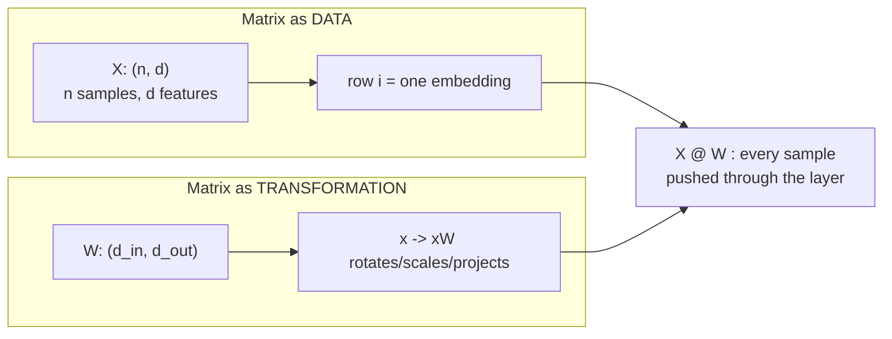
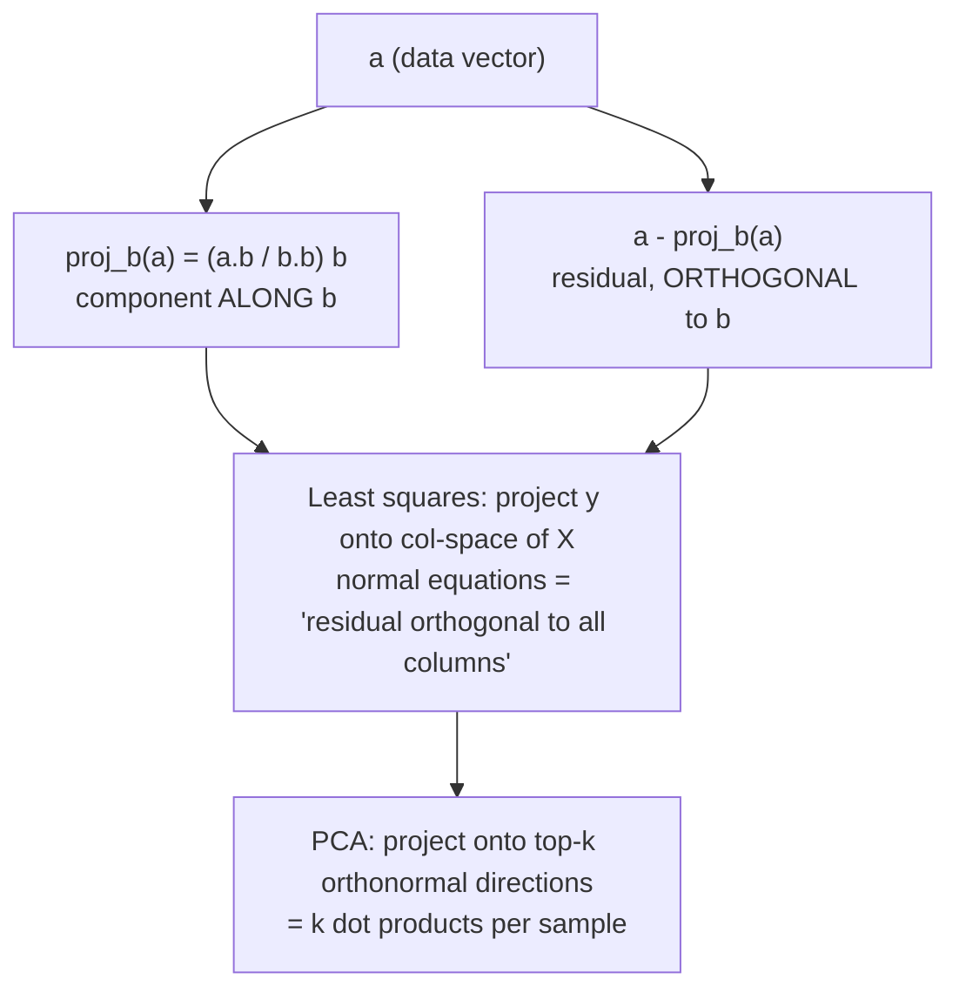

# Linear Algebra Foundations

Every tensor flowing through a model, every embedding sitting in a vector database, every attention score in a transformer is linear algebra. This guide builds the two mental models you need — *matrices as data* and *matrices as transformations* — and then derives the operations that show up daily in ML work: matrix multiplication (three ways), norms, cosine similarity, projections, and positive semidefinite matrices. Every derivation is verified numerically in NumPy, because the fastest way to internalize a matrix identity is to watch `np.allclose` return `True`.

Coming from an actuarial background you already know covariance matrices and linear models; what this guide adds is the ML *reading* of each object — why an embedding index is "just" a matrix, why L2 regularization is a norm penalty, why cosine similarity (not raw dot product) powers retrieval, and why you never, ever compute an explicit matrix inverse in production code.

Part of the [Senior AI Engineer Roadmap](../00-Senior-AI-Engineer-Roadmap.md) — Phase 1.

---

## 1. Vectors and Matrices: Two Mental Models

### 1.1 Model A — matrices as data

A matrix is a table of numbers. In ML this is the *dataset view*:

- `X` of shape `(n, d)`: `n` samples, each a row vector in `R^d`. A design matrix, a batch of embeddings, a vector-database index.
- An embedding model maps a token/sentence/image to a row of this table. "Semantically similar" becomes "geometrically nearby".
- A `(batch, seq_len, d_model)` activation tensor is just a stack of such tables — one `(seq_len, d_model)` matrix per sequence.

### 1.2 Model B — matrices as transformations

A matrix `W` of shape `(d_out, d_in)` is a *function* `f(x) = Wx` from `R^d_in` to `R^d_out`. It is the unique kind of function that is **linear**:

```text
W(a·x + b·y) = a·Wx + b·Wy        (linearity: scaling and addition commute with W)
```

Geometrically, every linear map is some combination of rotate / scale / shear / project. A dense neural-network layer is exactly `Wx + b` followed by a pointwise nonlinearity — the matrix does *all* of the mixing between features; the nonlinearity only bends each coordinate independently.

The key habit: whenever you see a matrix, ask *which* model applies. `X @ W` is "data hits transformation": each **row** of `X` (a sample) is independently transformed by `W`.



### 1.3 Shapes are the type system

Matrix multiplication `(m, k) @ (k, n) -> (m, n)` requires the inner dimensions to match. Treat shapes like types: annotate them in comments before writing the matmul. Most silent numerical bugs in ML code are shape/broadcasting bugs that *run without error* and produce garbage.

```python
import numpy as np
rng = np.random.default_rng(0)

X = rng.normal(size=(32, 512))    # (batch=32, d_in=512)
W = rng.normal(size=(512, 128))   # (d_in=512, d_out=128)
H = X @ W                          # (32, 128)  <- inner 512s cancel
print(H.shape)                     # (32, 128)
```

---

## 2. Matrix Multiplication, Three Ways

`C = A @ B` with `A: (m, k)`, `B: (k, n)`, `C: (m, n)`. There are three equivalent ways to *read* this product, and each unlocks a different ML insight.

### 2.1 Way 1 — entries as dot products (the definition)

```text
C[i, j] = sum_p A[i, p] * B[p, j] = (row i of A) · (column j of B)
```

Every entry is a dot product — a similarity score. This is the *attention* reading: in `scores = Q @ K.T`, entry `(i, j)` is "how much does query `i` align with key `j`".

### 2.2 Way 2 — columns of C as combinations of columns of A

```text
C[:, j] = A @ B[:, j] = sum_p B[p, j] * A[:, p]
```

Column `j` of `C` is a **linear combination of the columns of A**, with weights taken from column `j` of `B`. This is the *span* reading: everything `A` can produce lives in the span of its columns (its **column space**). It explains rank at a glance — if `A` has only `r` independent columns, every output lies in an `r`-dimensional subspace, no matter what `B` is.

### 2.3 Way 3 — the sum of outer products

```text
C = sum_p  A[:, p] outer B[p, :]        (k rank-1 matrices, one per inner index)
```

The whole product is a sum of `k` **rank-1** matrices `(column of A) (row of B)`. This is the *low-rank* reading: truncating the sum early gives a low-rank approximation — the seed of SVD truncation, LoRA (`ΔW = B @ A` is a sum of `r` outer products), and matrix-factorization recommenders.

### 2.4 NumPy verification of all three

```python
import numpy as np
rng = np.random.default_rng(42)

m, k, n = 4, 3, 5
A = rng.normal(size=(m, k))
B = rng.normal(size=(k, n))
C = A @ B                                        # reference

# --- Way 1: entry (i, j) = row_i(A) . col_j(B) ---
C1 = np.empty((m, n))
for i in range(m):
    for j in range(n):
        C1[i, j] = A[i, :] @ B[:, j]
print(np.allclose(C, C1))                        # True

# --- Way 2: column j of C = A @ (column j of B) ---
C2 = np.column_stack([A @ B[:, j] for j in range(n)])
print(np.allclose(C, C2))                        # True

# --- Way 3: sum of k outer products ---
C3 = sum(np.outer(A[:, p], B[p, :]) for p in range(k))
print(np.allclose(C, C3))                        # True
```

All three print `True`. Same arithmetic, three geometries. Reach for:
- **Way 1** when thinking about similarity/attention,
- **Way 2** when thinking about spans, rank, and what a layer *can* express,
- **Way 3** when thinking about compression and low-rank structure.

---

## 3. Linear Independence, Rank, and Basis

### 3.1 Definitions with intuition

- Vectors `v1..vk` are **linearly independent** if no vector in the set can be written as a combination of the others — equivalently `c1 v1 + ... + ck vk = 0` forces all `ci = 0`. Intuition: each vector adds a genuinely *new direction*.
- The **rank** of a matrix is the number of linearly independent columns (equivalently rows — this equality is a theorem, not an accident). Intuition: the true dimensionality of the information in the matrix.
- A **basis** of a subspace is a minimal spanning set: enough independent vectors to reach everything in the subspace, none redundant. Coordinates are just "weights with respect to a chosen basis" — PCA is nothing more than *changing to a smarter basis*.

### 3.2 Why ML cares

- **Collinear features** (rank-deficient `X`) make `X.T @ X` singular — the normal equations blow up, and coefficients become unidentifiable (infinitely many optimal weight vectors). This is the linear-algebra face of multicollinearity from actuarial regression.
- **Effective rank of embeddings**: if your 768-dim embeddings actually occupy a ~30-dim subspace (common — measure singular value decay), you are paying 768-dim storage and compute for 30 dims of information. This motivates dimensionality reduction of vector indexes.
- **Rank of weight updates**: LoRA works because fine-tuning updates empirically have low rank — the update "needs few new directions".

```python
import numpy as np
rng = np.random.default_rng(0)

# Build a 6-column matrix where col5 = col0 + 2*col1 (deliberate redundancy)
X = rng.normal(size=(100, 5))
X = np.column_stack([X, X[:, 0] + 2 * X[:, 1]])
print(np.linalg.matrix_rank(X))                  # 5, not 6

# Rank deficiency makes X^T X singular:
XtX = X.T @ X
print(np.linalg.cond(XtX))                       # ~1e16+ (numerically singular)
# np.linalg.inv(XtX) would "succeed" and return garbage — see Section 8.
```

Note the trap in that last comment: `inv` on a numerically singular matrix often does **not** raise — it silently returns junk. Rank problems must be *detected* (condition number, singular values), not discovered by crash.

---

## 4. Norms — and Their ML Job Descriptions

A norm measures the "size" of a vector. The three you use constantly:

```text
L1:   ||x||_1   = sum_i |x_i|                (Manhattan / taxicab)
L2:   ||x||_2   = sqrt(sum_i x_i^2)          (Euclidean)
Linf: ||x||_inf = max_i |x_i|                (worst coordinate)
```

All satisfy the norm axioms: non-negativity (`||x|| >= 0`, zero iff `x = 0`), homogeneity (`||a·x|| = |a|·||x||`), and the triangle inequality (`||x + y|| <= ||x|| + ||y||`).

### 4.1 Each norm's role in ML

| Norm | Geometry of unit ball | ML role |
|------|----------------------|---------|
| L1 | Diamond (pointy at axes) | **Lasso** regularization — the corners of the ball sit *on the axes*, so the constrained optimum lands on sparse solutions (exact zeros). Feature selection for free. |
| L2 | Sphere (smooth) | **Ridge / weight decay** — shrinks all weights smoothly toward 0, never exactly to 0. Also the distance in k-means, the normalizer in cosine similarity. |
| Linf | Cube | **Adversarial robustness** bounds ("perturbation of at most ε per pixel"); also `max abs` sanity checks on activations. |

Why L1 gives sparsity and L2 does not, in one sentence: the penalized optimum is where the loss's level curves first touch the norm ball; a diamond's corners (axes, where coordinates are exactly zero) stick out and get touched first, while a sphere has no corners so the touch point is generically off-axis.

### 4.2 Gradient clipping — a norm operation

Global-norm gradient clipping rescales the *entire* gradient vector when its L2 norm exceeds a threshold, preserving direction:

```python
def clip_by_global_norm(grads: list[np.ndarray], max_norm: float) -> list[np.ndarray]:
    total = np.sqrt(sum(float((g ** 2).sum()) for g in grads))   # L2 norm over ALL params
    scale = min(1.0, max_norm / (total + 1e-6))
    return [g * scale for g in grads]

grads = [np.array([3.0, 4.0]), np.array([12.0])]     # global norm = sqrt(9+16+144) = 13
clipped = clip_by_global_norm(grads, max_norm=1.0)
print(np.sqrt(sum((g**2).sum() for g in clipped)))   # 1.0  (direction preserved)
```

Clipping by value (`np.clip(g, -c, c)`, an Linf operation) *changes the gradient direction*; clipping by global norm does not. That's why transformer training recipes use global-norm clipping.

### 4.3 Norm equivalence (and why it half-matters)

In finite dimensions all norms are equivalent up to constants: `||x||_inf <= ||x||_2 <= ||x||_1 <= sqrt(d)·||x||_2 <= d·||x||_inf`. So "converging in L1" and "converging in L2" are the same *qualitatively* — but the constants involve `d`, and in ML `d` is often 10^6+, so the *quantitative* choice of norm (which regularizer, which clipping) matters enormously.

```python
x = rng.normal(size=(5,))
l1, l2, linf = np.abs(x).sum(), np.sqrt((x**2).sum()), np.abs(x).max()
print(np.linalg.norm(x, 1) == l1, np.isclose(np.linalg.norm(x, 2), l2),
      np.linalg.norm(x, np.inf) == linf)   # True True True
print(linf <= l2 <= l1)                     # True
```

---

## 5. Dot Product and Cosine Similarity, Derived

### 5.1 From algebra to geometry

Algebraic definition: `a · b = sum_i a_i b_i`. The geometric identity is:

```text
a · b = ||a|| ||b|| cos θ
```

**Derivation** (law of cosines). For the triangle with sides `a`, `b`, and `a - b`:

```text
||a - b||^2 = ||a||^2 + ||b||^2 - 2 ||a|| ||b|| cos θ        (law of cosines)
```

Expand the left side algebraically:

```text
||a - b||^2 = (a - b)·(a - b) = a·a - 2 a·b + b·b = ||a||^2 - 2 a·b + ||b||^2
```

Set the two expressions equal; the `||a||^2 + ||b||^2` terms cancel:

```text
-2 a·b = -2 ||a|| ||b|| cos θ    =>    a·b = ||a|| ||b|| cos θ    ∎
```

So the dot product entangles **two** signals: *directional alignment* (`cos θ`) and *magnitudes* (`||a|| ||b||`). Dividing out the magnitudes isolates pure direction:

```text
cosine(a, b) = (a · b) / (||a|| ||b||)  =  cos θ   ∈ [-1, 1]
```

### 5.2 Why cosine for embeddings

Embedding norms carry nuisance information: longer documents, higher-frequency tokens, and quirks of the encoder all inflate `||x||` without making the item more *relevant*. Raw dot-product retrieval therefore biases toward high-norm items. Cosine compares direction only, making a 50-word note and a 5,000-word report comparable.

The crucial special case: **if all vectors are L2-normalized, dot product = cosine = a monotone function of Euclidean distance:**

```text
||a - b||^2 = ||a||^2 + ||b||^2 - 2 a·b = 2 - 2 a·b       (when ||a|| = ||b|| = 1)
```

So on normalized vectors, cosine ranking, dot-product ranking, and Euclidean nearest-neighbor ranking are *identical*. Vector databases exploit this: normalize once at write time, then serve queries with the cheapest metric. On **unnormalized** vectors the three metrics can rank differently — the classic silent retrieval bug (see War Story 1).

```python
import numpy as np
rng = np.random.default_rng(7)

def cosine_matrix(A, B, eps=1e-9):
    """Rows of A (n,d) vs rows of B (m,d) -> (n,m) cosine matrix."""
    A_n = A / (np.linalg.norm(A, axis=1, keepdims=True) + eps)
    B_n = B / (np.linalg.norm(B, axis=1, keepdims=True) + eps)
    return A_n @ B_n.T

docs = rng.normal(size=(1000, 64))
docs[0] *= 50.0                       # one document with a huge norm
q = rng.normal(size=(1, 64))

dot_rank = np.argsort(-(q @ docs.T)[0])[:3]
cos_rank = np.argsort(-cosine_matrix(q, docs)[0])[:3]
print(dot_rank)   # e.g. [  0 812 219]  <- doc 0 wins on magnitude alone
print(cos_rank)   # e.g. [812 219 505]  <- doc 0 gone: direction didn't actually match
```

Expected behavior: the inflated-norm document tops the dot-product ranking but not the cosine ranking. One `*= 50` is all it takes.

---

## 6. Projections and Orthogonality

### 6.1 Projection derived

The projection of `a` onto the line through `b` is the multiple of `b` closest to `a`. Find the scalar `c` minimizing `||a - c·b||^2`:

```text
d/dc ||a - c b||^2 = d/dc (a·a - 2c a·b + c^2 b·b) = -2 a·b + 2c b·b = 0
=>  c = (a·b) / (b·b)
=>  proj_b(a) = ((a·b) / (b·b)) b
```

The **residual is orthogonal** to `b` — check: `(a - proj_b(a)) · b = a·b - (a·b/b·b)(b·b) = 0`. That orthogonality is the defining property of "closest point" and the engine behind least squares: linear regression *is* orthogonal projection of `y` onto the column space of `X` (the normal equations `X.T @ (Xw - y) = 0` literally say "residual ⟂ every column of X").

```python
a, b = np.array([3.0, 4.0]), np.array([2.0, 0.0])
proj = (a @ b) / (b @ b) * b
print(proj)                    # [3. 0.]
print((a - proj) @ b)          # 0.0  <- residual orthogonal to b
```

### 6.2 Orthogonality and orthonormal bases

Vectors are **orthogonal** if `a · b = 0` (θ = 90°: zero shared information along each other's direction). An **orthonormal** set is orthogonal with unit norms; stacked as columns of `Q` it satisfies `Q.T @ Q = I`, which makes life easy:

- Coordinates in an orthonormal basis are just dot products: `x = sum_i (q_i · x) q_i` — no linear system to solve.
- Orthonormal maps preserve lengths and angles (`||Qx|| = ||x||`) — they are pure rotations/reflections, numerically perfectly conditioned.
- SVD and PCA hand you orthonormal bases; that is *why* projecting onto principal components is a single matmul.

ML sightings: orthogonal weight initialization (preserves activation norms through depth), QK/OV geometry analyses in transformer interpretability, Gram–Schmidt inside QR decomposition.



---

## 7. Positive (Semi)Definite Matrices — and Why Covariance Is PSD

### 7.1 Definitions

A symmetric matrix `A` is:

- **positive definite (PD)** if `x.T A x > 0` for every `x ≠ 0`;
- **positive semidefinite (PSD)** if `x.T A x >= 0` for every `x`.

Equivalently (for symmetric `A`): PD ⟺ all eigenvalues > 0; PSD ⟺ all eigenvalues ≥ 0. Intuition: the quadratic form `x.T A x` is a bowl (PD), a bowl with some perfectly flat directions (PSD), or a saddle (indefinite). Hessians at strict local minima are PD; kernel/Gram matrices are PSD; covariance matrices are PSD.

### 7.2 Proof that covariance matrices are PSD

Let `X` be an `(n, d)` data matrix, `x̄` its column-mean row vector, and `Xc = X - x̄` the centered data. The sample covariance is

```text
S = (1/(n-1)) Xc.T Xc          # shape (d, d), symmetric by construction
```

Take any `v ∈ R^d` and compute the quadratic form:

```text
v.T S v = (1/(n-1)) v.T Xc.T Xc v
        = (1/(n-1)) (Xc v).T (Xc v)
        = (1/(n-1)) ||Xc v||^2
        >= 0                                   ∎
```

A squared norm cannot be negative — that is the entire proof. Reading it back: `Xc v` is the vector of centered data *projected onto direction v*, and `v.T S v / ...` is the **sample variance of the data along direction v**. Variance along any direction is ≥ 0, so covariance is PSD. It is strictly PD iff no direction has zero variance, i.e. iff `Xc` has full column rank (no exact linear dependence among features).

That interpretation — "`v.T S v` = variance along `v`" — is exactly what PCA maximizes in the next guide.

```python
rng = np.random.default_rng(3)
X = rng.normal(size=(500, 6))
X[:, 5] = X[:, 0] - X[:, 1]                 # a zero-variance *direction* exists
S = np.cov(X, rowvar=False)                 # (6, 6)

eigvals = np.linalg.eigvalsh(S)             # eigvalsh: for symmetric matrices
print(eigvals)                              # e.g. [ ~1e-16  0.83  0.95  1.02  1.9  3.1 ]
print(eigvals.min() >= -1e-10)              # True: PSD (up to float noise)

v = rng.normal(size=6)
print(np.isclose(v @ S @ v, np.var((X - X.mean(0)) @ v, ddof=1)))   # True
```

Note the smallest eigenvalue: mathematically 0, numerically ~±1e-16. **Never test PSD-ness with `min(eig) >= 0` exactly** — float noise makes true-zero eigenvalues wobble slightly negative. This is also why Cholesky (`np.linalg.cholesky`) on a barely-PSD covariance sometimes fails and the standard fix is jitter: `S + 1e-8 * np.eye(d)`.

### 7.3 Where PSD shows up in ML

- **Gaussian sampling / GP kernels**: Cholesky of the covariance turns white noise into correlated samples; requires PD (hence jitter).
- **Optimization**: the Hessian's definiteness classifies critical points; Newton's method needs PD to guarantee descent.
- **Mahalanobis distance / whitening**: `S^{-1/2}` exists precisely because `S` is PSD.
- **Kernel methods**: a kernel is valid iff its Gram matrix is always PSD (Mercer).

---

## 8. Solving Linear Systems — and Why You Never Invert Explicitly

### 8.1 The rule

To solve `A w = b`, do **not** compute `w = np.linalg.inv(A) @ b`. Use:

- `np.linalg.solve(A, b)` — square, well-posed systems (LU factorization under the hood);
- `np.linalg.lstsq(X, y)` — least squares / possibly rank-deficient (SVD or QR under the hood);
- `np.linalg.cholesky` — symmetric PD systems (covariances, ridge normal equations), ~2× faster than LU.

### 8.2 Why: cost, stability, and conditioning

1. **Cost.** Computing the full inverse costs ~`2d^3` flops then a matmul; `solve` costs ~`(2/3)d^3` for one factorization. You do strictly more work to get a strictly worse answer.
2. **Stability.** Error in a solve is governed by the **condition number** `κ(A) = σ_max / σ_min` — you lose roughly `log10(κ)` decimal digits. Forming `inv(A)` explicitly amplifies rounding twice (once inverting, once multiplying) instead of once.
3. **The `X.T X` trap.** The normal equations form `X.T X`, and `κ(X.T X) = κ(X)^2` — forming the Gram matrix *squares* the condition number. In float32 (~7 digits), a modest `κ(X) = 10^4` becomes `κ = 10^8` in the normal equations: all digits gone. Prefer `lstsq(X, y)` (QR/SVD directly on `X`) over solving `X.T X w = X.T y`.

```python
import numpy as np
rng = np.random.default_rng(0)

# An ill-conditioned regression: two nearly-identical columns.
n = 200
x0 = rng.normal(size=n)
X = np.column_stack([x0, x0 + 1e-6 * rng.normal(size=n), rng.normal(size=n)])
w_true = np.array([1.0, 2.0, 3.0])
y = X @ w_true

print(f"cond(X)     = {np.linalg.cond(X):.2e}")        # ~2e6
print(f"cond(X^T X) = {np.linalg.cond(X.T @ X):.2e}")  # ~5e12  <- squared!

w_inv   = np.linalg.inv(X.T @ X) @ X.T @ y             # the forbidden way
w_lstsq = np.linalg.lstsq(X, y, rcond=None)[0]         # the right way

print("inv  :", w_inv)     # e.g. [ 0.9903  2.0097  3. ]   (wrong in digit 3)
print("lstsq:", w_lstsq)   # [1. 2. 3.] to ~1e-9
print("residual inv  :", np.linalg.norm(X @ w_inv - y))    # ~1e-4-ish
print("residual lstsq:", np.linalg.norm(X @ w_lstsq - y))  # ~1e-12
```

(The exact junk digits vary by BLAS; the point is the gap in residuals — several orders of magnitude — from mathematically identical formulas.)

### 8.3 Ridge fixes conditioning

Ridge regression solves `(X.T X + λI) w = X.T y`. Adding `λI` lifts every eigenvalue of `X.T X` by `λ`, so `κ` drops from `σ_max^2 / σ_min^2` to `(σ_max^2 + λ)/(σ_min^2 + λ)`. Regularization is *simultaneously* a statistical prior and a numerical rescue — the same `λ` that fights overfitting also fights conditioning. This dual role explains why even "unregularized" production systems ship with a tiny ridge term.

---

## Production War Stories & Failure Modes

### War Story 1 — Retrieval quality collapsed after switching similarity metric

- **Symptom:** After migrating a RAG index from one vector DB to another, retrieval quality craters: long boilerplate documents dominate every result set, relevance evals drop 30 points.
- **Investigation:** Spot-check top-k for a few queries — the same handful of documents appears for *every* query. Compute `np.linalg.norm(embs, axis=1)`: norms range from 4 to 60. The old DB was configured with `cosine`; the new collection was created with the default metric — `dot`.
- **Root cause:** Unnormalized embeddings + inner-product metric. Dot product = `||a|| ||b|| cos θ`, so high-norm documents win regardless of direction. The old system had silently hidden this by normalizing internally.
- **Fix:** L2-normalize at both index time and query time (`x / (||x|| + eps)`), rebuild the index; or set the collection metric to cosine.
- **Prevention:** Assert `np.allclose(np.linalg.norm(embs, axis=1), 1.0, atol=1e-3)` in the ingestion pipeline; make the metric an explicit, reviewed config value; add a canary eval query set that runs on every index rebuild.

### War Story 2 — "Singular matrix" every Monday: one-hot + intercept

- **Symptom:** A weekly retraining job for a pricing model intermittently fails with `LinAlgError: Singular matrix` — but only some weeks, and only in production, never on the dev sample.
- **Investigation:** Diff the design matrices. The feature pipeline one-hot encodes `region` with *all* categories and also appends an intercept column. When every region appears in the week's data, the one-hot columns sum to the all-ones column — exact collinearity, rank-deficient `X`, singular `X.T X`. On the dev sample one region was absent, breaking the dependency by luck.
- **Root cause:** Dummy-variable trap: full one-hot + intercept is always rank-deficient; whether the *solver* notices depends on which rows show up.
- **Fix:** Drop one category per one-hot group (`drop='first'`) or add a small ridge `λI`; switch from `solve(X.T X, ...)` to `lstsq`, which handles rank deficiency gracefully (returns the min-norm solution).
- **Prevention:** Log `np.linalg.matrix_rank(X)` and `cond(X)` as training metrics with alerts; property-test the feature pipeline with "all categories present" inputs; always regularize at least a little.

### War Story 3 — Cholesky crash on a covariance that "must be" PSD

- **Symptom:** A portfolio-simulation service (Gaussian sampling via Cholesky of a correlation matrix) starts throwing `LinAlgError: Matrix is not positive definite` after an upstream team expands the asset universe from 80 to 300 names.
- **Investigation:** `eigvalsh` on the correlation matrix shows the smallest eigenvalues at `-3e-9` — *mathematically* impossible for a true correlation matrix, numerically routine. Deeper: the matrix was assembled from **pairwise** correlations computed on different, partially-overlapping date ranges (each pair used its own available history). Pairwise-assembled matrices are not guaranteed PSD.
- **Root cause:** Two stacked issues — float noise around zero eigenvalues, and a genuinely non-PSD estimate from inconsistent pairwise estimation.
- **Fix:** Short-term: eigenvalue clipping (`eigvals = np.maximum(eigvals, 1e-10)`, reconstruct, renormalize diagonal) plus `1e-8 I` jitter before Cholesky. Long-term: estimate the covariance on a single aligned sample, or use a shrinkage estimator (Ledoit–Wolf), which is PSD by construction.
- **Prevention:** Validate `min(eigvalsh(S)) > -tol` at the boundary where the matrix enters the service; treat "assembled from pairwise pieces" as a red-flag pattern in review.

### War Story 4 — float32 Gram matrix quietly destroyed a ridge solve

- **Symptom:** A recommender's item-item ridge solve produces weights that look fine in the notebook (float64) but are garbage in the production service — same code, same data.
- **Investigation:** The service loads embeddings as float32 to save memory (sensible) and then forms `E.T @ E` in float32. `cond(E)` ≈ 3e4, so `cond(E.T E)` ≈ 1e9 — float32 has ~7 significant digits, so the Gram matrix has *zero* trustworthy digits in its small eigen-directions.
- **Root cause:** Condition-number squaring (`κ(X.T X) = κ(X)^2`) interacting with reduced precision. float64 masked it in dev; float32 exposed it in prod.
- **Fix:** Keep embeddings float32 for storage/matmul, but *accumulate the Gram matrix and run the solve in float64* (`E.astype(np.float64)` just for the solve), or avoid the Gram matrix entirely with `lstsq` on `E`.
- **Prevention:** Make dtype an explicit part of numerical code review ("what precision does this factorization run in?"); add a regression test comparing prod-path output to a float64 reference with a tolerance.

---

## Best Practices

- Annotate matrix shapes in comments (`# (batch, d_in) @ (d_in, d_out) -> (batch, d_out)`) *before* writing the matmul; treat a shape comment mismatch as a failed code review.
- Never call `np.linalg.inv` to solve a system. `solve` for square PD/general systems, `lstsq` for least squares, `cholesky` for symmetric PD. Reserve `inv` for the rare case where you truly need the inverse's *entries*.
- Avoid forming `X.T @ X` when you can factor `X` directly — Gram matrices square the condition number.
- L2-normalize embeddings at index time *and* query time; assert unit norms in the ingestion pipeline rather than trusting the encoder.
- Guard every division and normalization with an epsilon (`norm + 1e-9`); zero vectors show up in production (empty strings, padding rows) even when they "can't".
- Test PSD-ness with a tolerance (`min(eigvalsh(S)) > -1e-8`), and jitter (`+ 1e-8 I`) before Cholesky on empirical covariances.
- Log `matrix_rank` and `cond` for any design matrix you solve against; alert when conditioning degrades — it is a data-quality signal.
- Use `eigvalsh`/`eigh` (not `eig`) on symmetric matrices: faster, and guaranteed real outputs.
- Do linear-algebra-heavy accumulation (Gram matrices, covariance, solves) in float64 even if the surrounding pipeline is float32; cast at the boundary.
- Fix seeds (`np.random.default_rng(seed)`) in every numerical experiment so failures are reproducible.
- When ranking by cosine over normalized vectors, use the plain dot product — it is the same ranking and cheaper; but document *why* it is valid (normalization) next to the code.

---

## Interview Drills

<details>
<summary>1. Explain matrix multiplication three ways. When is each view the useful one?</summary>

(1) **Entry-wise**: `C[i,j]` is the dot product of row `i` of `A` with column `j` of `B` — the similarity view, e.g. `Q @ K.T` in attention where each entry scores one query against one key. (2) **Column view**: each column of `C` is a linear combination of columns of `A` — the span/expressiveness view, which explains why rank limits what a layer can produce. (3) **Outer-product view**: `C` is a sum of `k` rank-1 matrices — the compression view, underlying truncated SVD, LoRA, and matrix-factorization recommenders.

**Follow-up:** *Which view explains why `rank(AB) <= min(rank A, rank B)`?* The column view: columns of `AB` are combinations of columns of `A`, so the column space of `AB` sits inside that of `A` (rank ≤ rank A); symmetrically for rows and `B`.

**Follow-up:** *Your intern computes attention as a Python double loop over queries and keys. Same math — why is the matmul form dramatically faster?* One BLAS matmul exploits cache-blocked, vectorized (SIMD), multithreaded kernels with `O(1)` Python-interpreter overhead, versus `n·m` interpreted iterations each allocating temporaries. Same flops on paper, orders of magnitude apart in practice.
</details>

<details>
<summary>2. Derive `a · b = ||a|| ||b|| cos θ`. Why does this identity matter for embedding search?</summary>

Apply the law of cosines to the triangle with sides `a`, `b`, `a-b`: `||a-b||² = ||a||² + ||b||² − 2||a||||b||cos θ`. Expand algebraically: `||a-b||² = a·a − 2a·b + b·b`. Equate and cancel: `a·b = ||a||||b||cos θ`. It matters because it shows the dot product mixes *direction* (cos θ, the semantic signal) with *magnitudes* (often nuisance: document length, token frequency). Cosine similarity divides out the magnitudes, isolating direction — which is why it's the default for embedding retrieval.

**Follow-up:** *When are dot-product and cosine rankings identical?* When all vectors are L2-normalized: then `a·b = cos θ` exactly, and also `||a−b||² = 2 − 2a·b`, so Euclidean NN gives the same ranking too.

**Follow-up:** *Is there a case where you'd deliberately keep the norms?* Yes — some recommendation embeddings encode popularity/confidence in the norm on purpose (a popular item should win ties), and maximum-inner-product search is then the correct objective, not a bug.
</details>

<details>
<summary>3. What is the rank of a matrix, and give three distinct ML situations where rank deficiency bites.</summary>

Rank = number of linearly independent columns (= rows) = number of nonzero singular values = dimension of the image. (1) **Collinear features**: full one-hot + intercept, or duplicated features, make `X.T X` singular — normal equations fail or coefficients become non-identifiable. (2) **Degenerate embeddings**: if an encoder collapses (all outputs in a low-dim cone), the effective rank of the index drops and nearest-neighbor distinctions wash out. (3) **Covariance in high dimensions**: with `n < d` samples, the sample covariance has rank ≤ `n−1 < d`, so it's singular — Mahalanobis distance and Gaussian likelihoods are undefined without shrinkage/regularization.

**Follow-up:** *How do you measure "effective" rank when nothing is exactly dependent?* Look at the singular value spectrum: count σᵢ above a tolerance relative to σ₁ (what `matrix_rank` does), or use a soft measure like the entropy-based effective rank of the normalized spectrum. In practice: plot the spectrum and look for the elbow.

**Follow-up:** *`n=100` samples, `d=1000` features, you need a covariance for Mahalanobis scoring. What do you do?* Shrinkage (e.g., Ledoit–Wolf: convex blend with a scaled identity) or a factor model / diagonal approximation — anything that restores full rank with statistical justification, not raw `np.cov` plus jitter alone.
</details>

<details>
<summary>4. Prove that a covariance matrix is positive semidefinite. When is it strictly PD?</summary>

With centered data `Xc` (shape `(n,d)`), `S = Xc.T Xc/(n−1)`. For any `v`: `v.T S v = ||Xc v||²/(n−1) ≥ 0` — a squared norm is non-negative, done. Interpretation: `v.T S v` is the sample variance of the data projected onto direction `v`, and variance can't be negative. Strictly PD iff `Xc v = 0` has no nonzero solution, i.e., `Xc` has full column rank — no feature direction with exactly zero variance and `n − 1 ≥ d`.

**Follow-up:** *Your empirical covariance shows eigenvalue −3e−9. Is the proof wrong?* No — floating-point roundoff. True-zero (or near-zero) eigenvalues land within float noise of zero, either side. Test PSD with a tolerance, and jitter before Cholesky.

**Follow-up:** *Why does Gaussian sampling need PD rather than just PSD?* The standard recipe `x = μ + L z` needs a Cholesky factor `L` with `LL.T = S`, which requires PD (or a pivoted/eigen-based factorization for PSD). Semidefinite directions have zero variance — legitimate distributionally, but plain Cholesky fails, so you clip/jitter eigenvalues or sample in the reduced-rank subspace.
</details>

<details>
<summary>5. Why should you never solve a regression with `inv(X.T @ X) @ X.T @ y`? What do you use instead?</summary>

Three compounding reasons. (1) Explicit inversion costs more flops than a factorization-based solve and adds an extra rounding-error stage. (2) Forming `X.T X` squares the condition number: `κ(X.T X) = κ(X)²`, so you lose twice the digits — catastrophic in float32. (3) `inv` on a near-singular matrix often *doesn't raise*; it returns plausible-looking garbage. Instead: `np.linalg.lstsq(X, y)` (QR/SVD on `X` directly), or for ridge, `solve(X.T X + λI, X.T y)` with Cholesky — the `λI` restores conditioning.

**Follow-up:** *Roughly how many digits do you lose in a solve?* About `log10(κ)` decimal digits of the answer. With float64 (~16 digits) and κ = 1e12 you have ~4 trustworthy digits; with float32 (~7 digits) you have none.

**Follow-up:** *Interviewer pushes: "but sklearn's LinearRegression works fine and I've never thought about this."* sklearn uses `lstsq`/SVD internally — the library made the safe choice *for* you. The question is whether you'll make it in custom code: hand-rolled normal equations in a feature-store job or an online-learning service is exactly where this bites.
</details>

<details>
<summary>6. Compare L1, L2, and L∞ norms as regularizers/tools. Why does L1 give sparsity and L2 not?</summary>

L2 (ridge/weight decay) shrinks all coefficients smoothly toward zero — its penalty gradient `2λw` vanishes as `w → 0`, so weights approach but never exactly hit zero. L1's penalty gradient has constant magnitude `λ·sign(w)` all the way to zero, so small weights are pushed *through* to exact zero — sparsity/feature selection. Geometrically: the constrained optimum is where loss contours touch the norm ball; the L1 ball's corners lie on the axes (coordinates exactly zero) and protrude, so they're touched first; the L2 ball is smooth with no preferred axis points. L∞ appears less as a regularizer and more as a constraint language: adversarial-robustness budgets ("≤ ε per coordinate") and per-value clipping.

**Follow-up:** *Why does global-norm gradient clipping use L2, and what's wrong with per-value clipping?* Global L2 clipping rescales the whole gradient uniformly, preserving its direction — you take the same step direction, just shorter. Per-value (L∞-style) clipping changes the direction whenever any coordinate saturates, which can systematically bias updates.

**Follow-up:** *What's elastic net and when would you reach for it?* L1+L2 combined: keeps L1's sparsity but handles correlated features better — pure L1 arbitrarily picks one of a correlated group; the L2 part spreads weight across the group and stabilizes the selection.
</details>

<details>
<summary>7. What is a projection, and what does it have to do with least squares?</summary>

`proj_b(a) = (a·b / b·b) b` is the closest point to `a` on the line through `b`; the minimization `min_c ||a − cb||²` gives `c = a·b/b·b`, and the residual `a − proj_b(a)` is orthogonal to `b`. Least squares is the multi-dimensional version: `min_w ||y − Xw||²` finds the point in the column space of `X` closest to `y` — the orthogonal projection of `y`. The optimality condition `X.T(Xw − y) = 0` (the normal equations) says exactly "residual orthogonal to every column of X".

**Follow-up:** *What's the projection matrix and its key algebraic properties?* `P = X(X.T X)^{-1}X.T` (the "hat matrix"). It's symmetric and idempotent (`P² = P` — projecting twice changes nothing), its eigenvalues are 0 and 1, and `trace(P) = rank(X)` = model degrees of freedom, which is why the hat matrix shows up in leverage diagnostics and AIC-style penalties.

**Follow-up:** *How does this connect to PCA?* PCA chooses an orthonormal basis (principal components) and projects data onto the top-k of them. Because the basis is orthonormal, projection is just k dot products per sample — no system to solve — and reconstruction error decomposes cleanly across the discarded directions.
</details>

<details>
<summary>8. Your ANN vector index returns different neighbors than a brute-force scan on the same data. Walk through your debugging tree.</summary>

First separate *metric* bugs from *approximation* error. (1) Check the metric configured at collection creation vs the metric used in the brute-force scan (cosine vs dot vs L2) — the most common cause. (2) Check normalization: are index vectors and query vectors both normalized, or neither? A pipeline that normalizes at write but not at query (or vice versa) breaks dot/cosine equivalence. (3) Check dtype/quantization: int8/PQ compression in the index changes distances; compare recall@k rather than exact ID match. (4) Only then blame the ANN algorithm: raise search parameters (efSearch/nprobe) — if recall climbs toward 100%, it was approximation, working as designed.

**Follow-up:** *What recall would you consider acceptable, and how do you measure it in production?* Depends on the stage: for a candidate-generation stage feeding a re-ranker, recall@100 of 95%+ is typically fine. Measure by running a sampled shadow brute-force job over live queries and computing overlap — continuously, not once, because recall degrades as the index grows or drifts.

**Follow-up:** *Embedding norms turn out to encode document length. Retrieval with cosine is fine but downstream re-ranking uses raw dot products. What happens?* The re-ranker inherits a length bias: long documents get systematically inflated scores. Either normalize before re-ranking or verify the re-ranker's training matched the serving metric — train/serve metric skew is a real failure class.
</details>

<details>
<summary>9. What does the condition number of a matrix mean operationally? How does regularization change it?</summary>

`κ(A) = σ_max/σ_min` measures how much a relative error in the input can be amplified in the solution of `Ax = b`: you lose roughly `log10(κ)` decimal digits. κ near 1: rotation-like, benign. κ = 1e16 in float64: numerically singular. Operationally it tells you whether your solve's answer has any trustworthy digits at your working precision. Ridge shifts every eigenvalue of `X.T X` up by λ, changing κ from `σ_max²/σ_min²` to `(σ_max²+λ)/(σ_min²+λ)` — a huge reduction when `σ_min` is tiny. Regularization is thus both a statistical prior and a numerical stabilizer.

**Follow-up:** *Feature scaling and conditioning — connection?* Wildly different feature scales (age in years vs revenue in cents) directly inflate κ of the design matrix: the spread of column norms lower-bounds the spread of singular values. Standardizing columns is often the single biggest conditioning fix — and it's also why unscaled features wreck gradient descent (the loss surface becomes an extreme ellipse).

**Follow-up:** *Does high κ always mean your model is bad?* No — it means the *solution is sensitive*, i.e., coefficients are poorly identified. Predictions on the training distribution can still be accurate (the ill-conditioned directions barely affect fitted values). It becomes a real problem for coefficient interpretation, extrapolation, and reproducibility across retrains.
</details>

<details>
<summary>10. Why do transformer attention scores get divided by √d_k? Derive the variance argument.</summary>

Let `q, k ∈ R^{d_k}` have i.i.d. entries with mean 0 and variance 1. Then `q·k = Σᵢ qᵢkᵢ` has mean 0 and variance `Σᵢ Var(qᵢkᵢ) = d_k` (products of independent unit-variance zero-mean terms have variance 1, and there are `d_k` of them). So raw scores have standard deviation `√d_k` — at `d_k = 512`, scores of magnitude ±40+ are routine. Softmax at that scale saturates: one entry ≈ 1, rest ≈ 0, and its Jacobian (`diag(p) − pp.T`) is nearly zero — vanishing gradients. Dividing by `√d_k` restores unit variance regardless of dimension, keeping softmax in its responsive regime.

**Follow-up:** *This is the same phenomenon as which classical initialization argument?* Xavier/Glorot: scale weights by `1/√fan_in` so that sums of `fan_in` terms keep unit variance layer to layer. Both are "variance of a sum of d terms grows like d; rescale by √d".

**Follow-up:** *If Q and K were L2-normalized instead, would you still need the scaling?* Normalizing bounds each score in [−1,1], so the *explosion* is gone — but now scores may be too *small*/flat for softmax to discriminate, which is why cosine-attention variants introduce a learned temperature instead. The real requirement is "score scale matched to softmax's sensitive range", by whatever mechanism.
</details>

<details>
<summary>11. What is an orthonormal basis and why are they numerically and computationally precious?</summary>

A set of mutually orthogonal unit vectors; stacked as columns of `Q`, `Q.T Q = I`. Precious because: (1) coordinates are dot products — expressing `x` in the basis costs one matvec, no solve; (2) `Q` preserves norms and angles (`||Qx|| = ||x||`), so κ(Q) = 1 — perfectly conditioned, no error amplification; (3) inverses are free: `Q^{-1} = Q.T`. This is why algorithms are built *around* orthogonal factorizations: QR for least squares, SVD for everything, Householder reflections inside both.

**Follow-up:** *Why is orthogonal weight initialization useful in deep networks?* Each layer starts as an isometry — activation norms are preserved through depth instead of growing/shrinking geometrically, which delays exploding/vanishing signals until training shapes the weights.

**Follow-up:** *Classical Gram–Schmidt is taught everywhere; why do libraries avoid it?* It's numerically unstable — orthogonality degrades badly for ill-conditioned inputs as errors accumulate. Modified Gram–Schmidt is better; Householder-reflection QR is the production standard.
</details>

<details>
<summary>12. A dense layer is `y = Wx + b`. In what precise sense is the matrix "all" of the model's mixing power, and what do nonlinearities add?</summary>

`W` is the only place where different input coordinates interact — every output coordinate is a weighted combination of all input coordinates. The nonlinearity acts *pointwise*: it bends each coordinate independently and mixes nothing. Without nonlinearities, stacking layers collapses: `W₂(W₁x + b₁) + b₂ = (W₂W₁)x + (W₂b₁ + b₂)` — still a single affine map, with rank ≤ min(rank W₂, rank W₁). Depth would buy nothing. Nonlinearities break the collapse, letting compositions of "linear mix, pointwise bend" approximate arbitrary continuous functions.

**Follow-up:** *So what does the* rank *of a weight matrix mean for expressiveness?* A rank-r `W` maps all inputs into an r-dimensional subspace before the nonlinearity — an information bottleneck. Deliberate low rank (bottleneck layers, LoRA's `BA` update, factorized embeddings) trades expressiveness for parameters/compute; accidental rank collapse (from degenerate training) silently caps capacity.

**Follow-up:** *Where does the bias term fit in the "linear map" story?* Strictly, `Wx + b` is affine, not linear (doesn't fix the origin). The homogeneous-coordinates trick — append a constant 1 to `x` and a column to `W` — makes it linear again, which is exactly the "bias column" in the design matrix of linear regression.
</details>

<details>
<summary>13. You must compute pairwise cosine similarity between 1M stored embeddings and 10K queries (d=768). Talk through memory, compute, and numerical issues.</summary>

Compute: normalize both sides once (`O(nd)`), then the similarity matrix is one matmul `Q_n @ D_n.T` — `10⁴ × 10⁶` output = 10¹⁰ floats = 40 GB in float32, which does **not** fit; so you *block* the computation (chunk queries, or chunk docs, keeping a running top-k per query) and never materialize the full matrix. Compute cost `~2·10⁴·10⁶·768 ≈ 1.5×10¹³` flops — feasible on a GPU in seconds, minutes on CPU BLAS. Numerical: add eps to norms (zero vectors), prefer float32 with float64 accumulation if scores feed a sensitive downstream threshold, and use `argpartition` (O(n)) not full `argsort` (O(n log n)) for top-k.

**Follow-up:** *When do you stop brute-forcing and build an ANN index?* Brute force is exact, simple, and — batched on GPU — competitive to surprisingly large scales (tens of millions). Switch when query latency SLOs (single queries, not batches) or memory force it: HNSW/IVF-PQ trade exact recall for sublinear query time. Always keep the brute-force path as the recall-measurement baseline.

**Follow-up:** *Why `argpartition` and what's the follow-on subtlety?* `np.argpartition(-s, k)[:k]` gets the top-k unordered in O(n); you then sort just those k. Subtlety: ties and NaNs — a single NaN similarity (zero-vector division without eps) poisons the partition; guard upstream.
</details>

<details>
<summary>14. Explain why `κ(X.T X) = κ(X)²` and give the two standard ways to avoid paying that price.</summary>

With SVD `X = UΣV.T`, we get `X.T X = VΣ²V.T` — its singular values are the *squares* `σᵢ²`. So `κ(X.T X) = σ_max²/σ_min² = κ(X)²`. Every digit of conditioning you had gets spent twice. Avoidance: (1) factor `X` directly — QR or SVD (`lstsq`) works on the un-squared spectrum; (2) if you must use normal equations (e.g., streaming accumulation of `X.T X` over minibatches), regularize (`+λI`) and accumulate in float64.

**Follow-up:** *When is the normal-equations route actually the right engineering choice?* When `n` is huge and `d` is small: accumulating the `(d,d)` Gram matrix and `(d,)` moment vector in one streaming pass costs O(nd²) with O(d²) memory — no need to hold `X`. With `d` in the hundreds and float64 accumulation plus ridge, it's a solid production pattern (this is how many online/distributed linear models work).

**Follow-up:** *How does this connect to why PCA-via-SVD is preferred over eigendecomposing the covariance?* Same theorem: the covariance is `Xc.T Xc/(n−1)`, so its condition number is squared relative to `Xc`. SVD of the centered data recovers identical components from the unsquared spectrum — strictly better numerics for small singular values.
</details>

<details>
<summary>15. Design the linear-algebra "unit test suite" you'd attach to a numerical pipeline (embeddings + regression solves) in CI.</summary>

Identity-based tests with tolerances, not exact equality: (1) *Normalization invariant*: all indexed embedding norms within `1 ± 1e-3`. (2) *Metric consistency*: cosine ranking == dot ranking on a sample (valid because of (1)); alert if they diverge. (3) *Solve residual*: `||Xw − y||` from the production solver within 10× of `lstsq`'s residual on a fixed fixture. (4) *Conditioning gate*: `cond(X)` on the current training batch below a threshold; warn, don't fail, above it. (5) *PSD gate*: `min(eigvalsh(S)) > −1e-8` for any covariance entering Cholesky. (6) *Reconstruction check*: `np.allclose(U @ np.diag(S) @ Vt, Xc, atol=1e-8)` after any factorization step. (7) *Dtype contract*: assert float64 inside factorizations if the pipeline is float32 elsewhere. All with fixed seeds.

**Follow-up:** *Why "10× of lstsq's residual" instead of comparing weight vectors directly?* With ill-conditioned or rank-deficient `X`, the weight vector is not unique/stable — two correct solvers can return very different `w` with identical fits. Residuals (and predictions) are the well-posed quantity; weights are only comparable when conditioning is good.

**Follow-up:** *Which one test catches the most real-world regressions, in your experience?* The normalization invariant — upstream embedding-model swaps, dtype changes, and library upgrades all tend to break norms first, and everything downstream (retrieval, clustering, re-ranking) silently degrades from there.
</details>

---

*Next: [Eigenvalues, SVD, and PCA](./02-Eigenvalues-SVD-and-PCA.md) — where the "matrices as transformations" view pays off: the directions a transformation merely stretches, and the single factorization that explains PCA, low-rank compression, and LoRA.*
