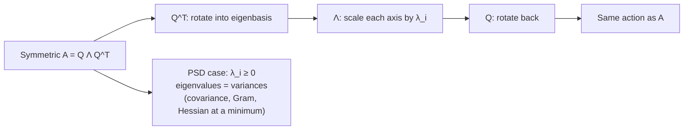
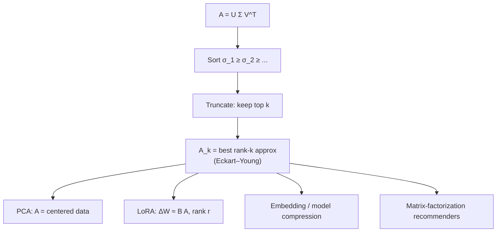

# Eigenvalues, SVD, and PCA

Eigen decomposition and the singular value decomposition are the two theorems that turn "a matrix is a pile of numbers" into "a matrix has a small number of directions that matter". That single idea powers PCA, spectral clustering, low-rank adapters (LoRA), embedding compression, recommender systems, and the conditioning analysis that explains why your gradient descent run is crawling. This guide derives both decompositions line by line, shows they are two views of the same object, and then builds PCA twice — once from variance maximization, once from reconstruction error — and proves the two derivations land on the same answer before verifying everything against scikit-learn.

Coming from an actuarial background you have met eigenvalues in covariance matrices and principal components in risk-factor models (interest-rate PCA on yield curves is the classic). What this guide adds is the ML reading: why "top-k singular values" is the mathematically optimal compression of a weight matrix, why that justifies LoRA's low-rank update, and the leakage pitfall that silently corrupts PCA pipelines in production.

Part of the [Senior AI Engineer Roadmap](../00-Senior-AI-Engineer-Roadmap.md) — Phase 1.

---

## 1. Eigenvalues and Eigenvectors: The Directions a Matrix Preserves

### 1.1 Definition and what it means

For a square matrix `A` of shape `(n, n)`, an **eigenvector** `v ≠ 0` and its **eigenvalue** `λ` satisfy:

```text
A v = λ v          # A: (n, n),  v: (n,),  λ: scalar
```

Read it geometrically: most vectors get rotated *and* stretched by `A`. An eigenvector is a direction that `A` does **not** rotate — it only stretches it by factor `λ` (flips it if `λ < 0`). If you can find `n` independent such directions, you understand `A` completely: any input decomposes along the eigenvectors, and `A` just scales each component independently.

Rearranging: `(A - λI) v = 0` has a nonzero solution only when `A - λI` is singular, i.e. `det(A - λI) = 0`. That polynomial in `λ` is the characteristic polynomial; its roots are the eigenvalues. Nobody solves it numerically past `n = 3` — iterative methods (next section) are how it is actually done.

### 1.2 Eigendecomposition (diagonalization)

If `A` has `n` linearly independent eigenvectors, stack them as columns of `V` (shape `(n, n)`) and put the eigenvalues on the diagonal of `Λ`:

```text
A V = V Λ                 # each column: A v_i = λ_i v_i
A   = V Λ V^{-1}          # multiply on the right by V^{-1}
```

Why this matters for ML — powers of `A` become trivial:

```text
A^k = (V Λ V^{-1})(V Λ V^{-1})...(V Λ V^{-1}) = V Λ^k V^{-1}
```

Repeatedly applying a linear map (an RNN step, a power-iteration step, a Markov transition, a gradient-descent iteration matrix) amplifies components with `|λ| > 1` and kills components with `|λ| < 1`. Exploding and vanishing gradients in deep/recurrent nets are literally this equation — see guide 03.

### 1.3 Power iteration — computing the top eigenvector from scratch

Take any starting vector `b0` and repeatedly apply `A`, normalizing each time. Writing `b0` in the eigenbasis, `b0 = Σ c_i v_i`:

```text
A^k b0 = Σ c_i λ_i^k v_i = λ_1^k [ c_1 v_1 + Σ_{i≥2} c_i (λ_i/λ_1)^k v_i ]
```

Every ratio `(λ_i/λ_1)^k → 0` when `|λ_1| > |λ_i|`, so the iterate rotates toward `v_1`. Convergence rate is geometric with ratio `|λ_2/λ_1|` — a small spectral gap means slow convergence.

```python
import numpy as np
rng = np.random.default_rng(0)

def power_iteration(A: np.ndarray, iters: int = 200, tol: float = 1e-10):
    """Top eigenvalue/eigenvector of a symmetric matrix A (n, n)."""
    b = rng.normal(size=A.shape[0])
    b /= np.linalg.norm(b)
    lam = 0.0
    for _ in range(iters):
        Ab = A @ b                        # (n,)
        b_new = Ab / np.linalg.norm(Ab)
        lam_new = b_new @ A @ b_new       # Rayleigh quotient (b is unit norm)
        if abs(lam_new - lam) < tol:
            break
        b, lam = b_new, lam_new
    return lam, b

# Build a symmetric matrix with a known spectrum
Q, _ = np.linalg.qr(rng.normal(size=(5, 5)))     # random orthogonal Q
true_eigs = np.array([9.0, 4.0, 2.0, 1.0, 0.5])
A = Q @ np.diag(true_eigs) @ Q.T                  # eigenvalues by construction

lam, v = power_iteration(A)
print(f"power iteration: {lam:.6f}")              # power iteration: 9.000000
print(np.allclose(np.abs(v @ Q[:, 0]), 1.0, atol=1e-5))   # True — recovered v_1 up to sign
```

The Rayleigh quotient `v^T A v / v^T v` is the eigenvalue estimate associated with any direction `v`; for a unit eigenvector it equals `λ` exactly. Power iteration is not a toy — it (with refinements: deflation, Lanczos, randomized sketching) is how `TruncatedSVD` and large-scale PCA actually run, and Google's original PageRank was one giant power iteration.

### 1.4 The spectral theorem — why symmetric matrices are special

For a **symmetric** matrix (`A = A^T`), the spectral theorem guarantees:

1. All eigenvalues are **real**.
2. Eigenvectors for distinct eigenvalues are **orthogonal**, and a full orthonormal eigenbasis always exists.
3. Therefore `A = Q Λ Q^T` with `Q` orthogonal (`Q^T Q = I`) — the inverse is a free transpose.

Sketch of the orthogonality proof — one line of algebra worth knowing cold:

```text
λ_1 (v_1 · v_2) = (A v_1) · v_2 = v_1^T A^T v_2 = v_1 · (A v_2) = λ_2 (v_1 · v_2)
=> (λ_1 - λ_2)(v_1 · v_2) = 0   =>   λ_1 ≠ λ_2 implies v_1 ⊥ v_2
```

Every matrix ML cares about most — covariance matrices `X^T X / n`, Hessians, kernel/Gram matrices, graph Laplacians — is symmetric, so all of them decompose as rotate → scale → rotate-back with a genuinely orthogonal rotation. Covariance and Gram matrices are additionally **positive semidefinite** (`v^T A v = ||X v||² / n ≥ 0`), so their eigenvalues are ≥ 0 and can be read as variances along the eigenvector directions.



---

## 2. SVD: Eigendecomposition for Every Matrix

### 2.1 The problem with rectangular matrices

Eigendecomposition needs a square matrix, and even square matrices can fail to diagonalize. But data matrices are `(n, d)` with `n ≠ d`. The fix: `A` itself may be rectangular, but `A^T A` (shape `(d, d)`) and `A A^T` (shape `(n, n)`) are always symmetric PSD — the spectral theorem applies to them.

### 2.2 Deriving the SVD

Let `A` be `(n, d)`. Take the spectral decomposition of the `(d, d)` symmetric PSD matrix:

```text
A^T A = V Λ V^T,    V orthogonal (d, d),  Λ = diag(λ_1 ≥ λ_2 ≥ ... ≥ 0)
```

Define **singular values** `σ_i = sqrt(λ_i)` and, for each `σ_i > 0`, define:

```text
u_i = A v_i / σ_i               # (n,) — the image of v_i under A, normalized
```

Check the `u_i` are orthonormal:

```text
u_i · u_j = (A v_i)^T (A v_j) / (σ_i σ_j) = v_i^T (A^T A) v_j / (σ_i σ_j)
          = λ_j (v_i · v_j) / (σ_i σ_j) = δ_ij            # orthonormality of V
```

So `A v_i = σ_i u_i` for all `i`; stacking columns gives `A V = U Σ`, and since `V` is orthogonal:

```text
A = U Σ V^T
    U: (n, r) orthonormal columns   — "output directions" (left singular vectors)
    Σ: (r, r) diagonal, σ_1 ≥ σ_2 ≥ ... > 0
    V: (d, r) orthonormal columns   — "input directions" (right singular vectors)
    r = rank(A)
```

Geometric reading — **every** matrix, square or not, invertible or not, is: rotate the input (`V^T`), scale along axes (`Σ`), rotate into the output space (`U`). The unit sphere always maps to an ellipsoid; the `σ_i` are its semi-axis lengths.

### 2.3 SVD ↔ eigendecomposition, and why SVD wins numerically

From `A = U Σ V^T`:

```text
A^T A = V Σ U^T U Σ V^T = V Σ² V^T     # right singular vectors = eigenvectors of A^T A
A A^T = U Σ V^T V Σ U^T = U Σ² U^T     # left  singular vectors = eigenvectors of A A^T
σ_i² = λ_i(A^T A)
```

So you *could* compute the SVD by eigendecomposing `A^T A` — but never do in practice: forming `A^T A` **squares the condition number** (`κ(A^T A) = κ(A)²`), destroying half your floating-point precision. Direct SVD algorithms (Golub–Kahan bidiagonalization) work on `A` itself.

```python
A = rng.normal(size=(6, 4))
U, S, Vt = np.linalg.svd(A, full_matrices=False)   # U:(6,4) S:(4,) Vt:(4,4)

print(np.allclose(U @ np.diag(S) @ Vt, A))                          # True
print(np.allclose(U.T @ U, np.eye(4)))                              # True
eigval = np.linalg.eigvalsh(A.T @ A)[::-1]                          # eigenvalues, descending
print(np.allclose(np.sqrt(eigval), S))                              # True — σ_i = sqrt(λ_i(AᵀA))
```

### 2.4 Low-rank approximation — Eckart–Young

Because `Σ` is sorted, the SVD writes `A` as a sum of rank-1 layers in decreasing order of importance:

```text
A = Σ_i σ_i u_i v_i^T            # each term: (n,1)(1,d) outer product, rank 1
A_k = Σ_{i≤k} σ_i u_i v_i^T      # keep the k largest
```

**Eckart–Young theorem**: `A_k` is the *best possible* rank-`k` approximation of `A` in both Frobenius and spectral norm, with error:

```text
||A - A_k||_F² = σ_{k+1}² + σ_{k+2}² + ... + σ_r²
```

Intuition for why: the Frobenius norm is invariant under the rotations `U`, `V`, so the problem reduces to approximating the diagonal `Σ` by a rank-`k` matrix — and obviously you keep the `k` biggest diagonal entries. The error is exactly the energy you threw away.

```python
A = rng.normal(size=(100, 50)) @ rng.normal(size=(50, 50))  # generic full-rank matrix
U, S, Vt = np.linalg.svd(A, full_matrices=False)

k = 10
A_k = U[:, :k] * S[:k] @ Vt[:k]                     # broadcasting: U[:, :k] @ diag(S[:k]) @ Vt[:k]
err = np.linalg.norm(A - A_k, "fro") ** 2
print(np.allclose(err, np.sum(S[k:] ** 2)))         # True — Eckart–Young error formula
print(f"kept {np.sum(S[:k]**2) / np.sum(S**2):.1%} of energy with rank {k}")
# kept ~57.8% of energy with rank 10 (value varies with seed)
```

### 2.5 Why ML cares: LoRA and embedding compression

- **LoRA**: fine-tuning updates `ΔW` to large weight matrices empirically have rapidly decaying singular values — most of the change lives in a low-dimensional subspace. LoRA bakes that in: learn `ΔW = B A` with `B: (d, r)`, `A: (r, d)`, `r ≪ d`. Storage and optimizer state drop from `O(d²)` to `O(2dr)`; Eckart–Young says that *if* the true update is approximately low-rank, this parameterization loses almost nothing.
- **Embedding compression**: an embedding table `E: (vocab, d)` costs `vocab × d` floats. Truncated SVD `E ≈ (U_k Σ_k)(V_k^T)` stores `vocab × k + k × d` — for `vocab = 100k, d = 768, k = 128` that is an 83% size cut, and retrieval quality often barely moves because cosine geometry is dominated by the top directions.
- **Recommenders**: classic matrix-factorization (guide 05) is "learn the truncated SVD of the ratings matrix from its observed entries".



---

## 3. PCA: Derived Twice, Same Answer

Setup: data matrix `X: (n, d)`, **centered** so each column has mean 0 (mandatory — see pitfalls). Sample covariance:

```text
C = X^T X / (n - 1)              # (d, d), symmetric PSD
```

We want a `k`-dimensional linear summary of the data. Two natural but different-sounding goals:

### 3.1 Derivation A — maximize retained variance

Find a unit vector `w: (d,)` such that the projected data `X w: (n,)` has maximal variance.

```text
Var(X w) = (X w)^T (X w) / (n-1) = w^T C w

maximize  w^T C w    subject to  w^T w = 1
```

Lagrangian: `L(w, λ) = w^T C w − λ (w^T w − 1)`. Setting the gradient to zero:

```text
∂L/∂w = 2 C w − 2 λ w = 0    =>    C w = λ w
```

The optimum is an **eigenvector of the covariance matrix**, and the attained variance is `w^T C w = λ w^T w = λ` — so pick the eigenvector with the **largest eigenvalue**. Subsequent components repeat the argument constrained to be orthogonal to the previous ones, yielding eigenvectors 2, 3, … in order. Eigenvalue `λ_i` *is* the variance captured by component `i`.

### 3.2 Derivation B — minimize reconstruction error

Alternative goal: find an orthonormal basis `W: (d, k)` (`W^T W = I_k`) whose subspace reconstructs the data best. Project and reconstruct: `x̂ = W W^T x`.

```text
minimize  Σ_i ||x_i − W W^T x_i||²  =  ||X − X W W^T||_F²
```

Expand using `||A||_F² = tr(A^T A)` and `W^T W = I`:

```text
||X − X W W^T||_F² = tr[(X − X W W^T)^T (X − X W W^T)]
                   = tr(X^T X) − 2 tr(W W^T X^T X) + tr(W W^T X^T X W W^T)
                   = tr(X^T X) − tr(W^T X^T X W)          # cyclic trace + W^T W = I, twice
```

`tr(X^T X)` is fixed by the data, so **minimizing reconstruction error ≡ maximizing `tr(W^T X^T X W) = Σ_j w_j^T (X^T X) w_j`** — the total variance captured. The two objectives are the same problem: variance kept + error made = total variance, a Pythagorean split. Both are solved by the top-`k` eigenvectors of `C`, equivalently the top-`k` right singular vectors of `X` (since `X^T X = V Σ² V^T`).

```text
variance retained + reconstruction error = total variance   (per-sample Pythagoras:
||x||² = ||W W^T x||² + ||x − W W^T x||², because projection and residual are orthogonal)
```

### 3.3 PCA from scratch, verified against sklearn

```python
import numpy as np
rng = np.random.default_rng(42)

def pca_fit(X: np.ndarray, k: int):
    """PCA via SVD of the centered data. Returns (mean, components, explained_ratio)."""
    mu = X.mean(axis=0)                       # (d,)
    Xc = X - mu                               # (n, d) centered
    U, S, Vt = np.linalg.svd(Xc, full_matrices=False)
    components = Vt[:k]                       # (k, d) rows = principal directions
    var = S**2 / (len(X) - 1)                 # eigenvalues of covariance
    return mu, components, var[:k] / var.sum()

def pca_transform(X, mu, components):
    return (X - mu) @ components.T            # (n, k)

def pca_reconstruct(Z, mu, components):
    return Z @ components + mu                # (n, d)

# Anisotropic Gaussian data: known dominant directions
true_dirs = np.linalg.qr(rng.normal(size=(10, 10)))[0]
scales = np.array([5.0, 3.0, 1.0, 0.5, 0.3, 0.2, 0.1, 0.1, 0.05, 0.05])
X = rng.normal(size=(2000, 10)) * scales @ true_dirs.T + rng.normal(size=10)  # shifted mean

mu, comps, ratio = pca_fit(X, k=2)
Z = pca_transform(X, mu, comps)
Xhat = pca_reconstruct(Z, mu, comps)

print(ratio)                     # ~[0.703, 0.253] — first two dirs carry ~95.6% of variance
print(np.linalg.norm(X - Xhat, "fro")**2 / np.linalg.norm(X - X.mean(0), "fro")**2)
                                 # ~0.044 — reconstruction error = 1 - retained ratio

# --- Verify against scikit-learn ---
from sklearn.decomposition import PCA
sk = PCA(n_components=2).fit(X)
print(np.allclose(sk.explained_variance_ratio_, ratio))                     # True
# Components match up to sign (eigenvectors are defined up to ±):
print(np.allclose(np.abs(sk.components_ @ comps.T), np.eye(2), atol=1e-8))  # True
print(np.allclose(np.abs(Z), np.abs(sk.transform(X)), atol=1e-8))           # True
```

### 3.4 Choosing k, whitening, and the leakage pitfall

**Choosing `k`.** Plot cumulative explained variance and pick the elbow, or keep enough components for a target (90–99%). For downstream models, treat `k` as a hyperparameter and cross-validate — variance retained is a proxy, not the objective. Kaiser's "keep λ > 1" rule applies only to correlation-matrix PCA (standardized features).

```python
_, _, full_ratio = pca_fit(X, k=10)
cum = np.cumsum(full_ratio)
k95 = int(np.searchsorted(cum, 0.95)) + 1
print(k95)        # 2 — matches the construction above
```

**Whitening** divides each projected coordinate by its standard deviation, `Z_white = Z / S[:k] * sqrt(n-1)`, producing identity covariance. Useful when a downstream algorithm assumes isotropic inputs (some distance-based methods, ZCA preprocessing for images); harmful when trailing components are mostly noise, because whitening *amplifies* them to unit variance.

**The leakage pitfall** — the most common real-world PCA bug: fitting PCA on the full dataset (train + test) before the split. The components then encode test-set structure, and cross-validation scores become optimistically biased. The mean and components are *learned parameters*: fit them on train only, apply to test. In sklearn terms, PCA belongs **inside** the `Pipeline` so each CV fold refits it.

```python
# WRONG: leaks test-set variance structure into the features
# X_all_reduced = PCA(k).fit_transform(X_all); train_test_split(X_all_reduced, ...)

# RIGHT: PCA is fit on the training fold only
from sklearn.pipeline import make_pipeline
from sklearn.linear_model import LogisticRegression
pipe = make_pipeline(PCA(n_components=2), LogisticRegression())
# cross_val_score(pipe, X, y) refits PCA inside each fold — no leakage
```

Also remember: PCA is scale-sensitive. A feature measured in cents will dominate one measured in millions. Standardize first (correlation-matrix PCA) unless the features share units *and* their raw variances are genuinely meaningful.

---

## Production War Stories & Failure Modes

### Incident 1: The recommender that recommended nothing new

- **Symptom**: after a "performance optimization", an embedding-compression job (truncated SVD on the item-embedding table) shipped, and CTR on recommendations dropped 8% for long-tail items while head items were unaffected.
- **Investigation**: recall@10 against the uncompressed index was 0.99 for popular items, 0.71 for items in the bottom traffic decile.
- **Root cause**: singular-value energy is dominated by dense, popular regions of the embedding space. Rank-64 truncation preserved head-item geometry but collapsed sparse long-tail neighborhoods — Eckart–Young optimizes *average* (Frobenius) error, not worst-case per-item error.
- **Fix**: raised rank until per-decile recall@10 ≥ 0.95, and added the per-decile recall check to the compression job's CI.
- **Prevention**: never validate a low-rank approximation with a single global metric; slice the evaluation by the segments the business cares about.

### Incident 2: The model that aced offline eval and face-planted in prod

- **Symptom**: fraud model showed AUC 0.94 in cross-validation, 0.79 in the first week live.
- **Investigation**: preprocessing notebook ran `PCA(50).fit_transform` on the entire historical dataset, *then* split into CV folds.
- **Root cause**: PCA leakage. Components were fit on data that included every fold's "future" — the projection axes encoded global structure the model would never have at inference time. Compounding it, the serving pipeline refit the scaler+PCA on each day's traffic, so the projection axes drifted daily relative to training.
- **Fix**: moved scaler and PCA inside the sklearn `Pipeline`; froze and versioned the fitted transformer artifacts; served the *training-time* mean and components.
- **Prevention**: rule of thumb — anything with a `.fit` method is part of the model. It trains on train, ships as an artifact, and never refits at serving time.

### Incident 3: Power iteration that "hung" in a nightly job

- **Symptom**: a nightly spectral job (top eigenvector of a graph adjacency-derived matrix) started timing out after a data change; no code had changed.
- **Investigation**: convergence logging showed the Rayleigh quotient oscillating between two values instead of settling.
- **Root cause**: the new graph made the top two eigenvalues nearly equal (`|λ_2/λ_1| ≈ 0.999`), so power iteration's geometric convergence rate collapsed; worse, with `λ_2 ≈ −λ_1` iterates can genuinely oscillate.
- **Fix**: switched to `scipy.sparse.linalg.eigsh` (Lanczos), which handles clustered eigenvalues; added a shift (`A + cI`) to break sign symmetry; capped iterations with an explicit convergence-failure alert instead of a silent timeout.
- **Prevention**: any iterative numerical method in production needs (a) a convergence metric that is logged, (b) an iteration cap, (c) an alert path for non-convergence — data drift *will* eventually find the slow-convergence regime.

### Incident 4: PCA features that flipped sign between retrains

- **Symptom**: a dashboard tracking "component 1 of customer behavior" inverted overnight; downstream rules keyed on its sign started firing on the wrong customers.
- **Investigation**: weekly PCA refit; component 1 was the same axis but negated.
- **Root cause**: eigenvectors are defined only up to sign (and up to rotation when eigenvalues are near-equal). Different LAPACK code paths / data orderings legitimately return `±v`.
- **Fix**: canonicalized sign after each fit (e.g., force the largest-magnitude loading of each component to be positive) and aligned new components to the previous fit via the sign of their dot product before publishing.
- **Prevention**: treat PCA outputs as coordinates in an arbitrary-sign basis; never let raw component signs reach business logic without canonicalization.

---

## Best Practices

- Compute SVD on the data matrix directly; never form `X^T X` explicitly — it squares the condition number.
- Always center before PCA; standardize too unless features share meaningful units. The mean and scale you fit are model parameters — version them and ship them.
- Keep PCA (and every `.fit` transformer) inside the cross-validation loop / `Pipeline` to avoid leakage.
- Eigenvectors are defined up to sign: canonicalize before comparing runs, caching, or exposing components to downstream logic.
- Validate low-rank approximations with task metrics sliced by segment (per-decile recall, per-cohort error), not just global reconstruction error.
- Use `np.linalg.eigvalsh` / `eigh` (not `eig`) for symmetric matrices — faster, and guarantees real sorted output.
- For very large or sparse matrices, use iterative/randomized methods (`TruncatedSVD`, `eigsh`) and log their convergence.
- Choose `k` by cross-validated downstream performance when PCA feeds a model; explained-variance thresholds are only a starting heuristic.
- Whiten only when a downstream algorithm needs isotropy, and only after confirming the trailing components you are amplifying are signal, not noise.
- Prefer `float64` for covariance/eigen work on ill-conditioned data; `float32` half-precision covariance matrices can come out non-PSD due to rounding.

---

## Interview Drills

<details>
<summary>Define eigenvector and eigenvalue, and give the geometric interpretation. Why do we care in ML?</summary>

`A v = λ v` for `v ≠ 0`: `v` is a direction that `A` does not rotate, only scales by `λ`. Geometrically the eigenvectors are the "axes" of the transformation. ML cares because (1) repeated application `A^k = V Λ^k V^{-1}` explains vanishing/exploding gradients and Markov-chain convergence; (2) eigenvectors of the covariance matrix are PCA components; (3) Hessian eigenvalues describe loss-surface curvature and condition optimization.

Follow-up: *Does every matrix have a full set of eigenvectors?* No — e.g. a shear `[[1,1],[0,1]]` has a repeated eigenvalue with a single eigenvector direction (defective matrix). Symmetric matrices always have a full orthonormal eigenbasis (spectral theorem), which is why covariance/Hessian analysis is so clean.
</details>

<details>
<summary>State the spectral theorem and explain why it matters that Q is orthogonal.</summary>

For symmetric `A`: all eigenvalues are real and there exists an orthonormal eigenbasis, so `A = Q Λ Q^T` with `Q^T Q = I`. Orthogonality matters because (1) inverting the basis change is a free transpose — numerically stable, no conditioning issues from `V^{-1}`; (2) the decomposition is a pure rotate → scale → rotate-back, so quadratic forms `v^T A v = Σ λ_i (Q^T v)_i²` decompose into independent axis contributions — this is exactly how you read variance along principal components and curvature along Hessian directions.

Follow-up: *Prove eigenvectors of distinct eigenvalues are orthogonal.* `λ_1 (v_1·v_2) = (A v_1)·v_2 = v_1·(A v_2) = λ_2 (v_1·v_2)` using symmetry; subtract to get `(λ_1−λ_2)(v_1·v_2)=0`.
</details>

<details>
<summary>Walk me through why power iteration converges, and when it converges slowly.</summary>

Expand the start vector in the eigenbasis: `b0 = Σ c_i v_i`. Then `A^k b0 = λ_1^k [c_1 v_1 + Σ c_i (λ_i/λ_1)^k v_i]`; every non-dominant term decays like `(λ_i/λ_1)^k`, so after normalization the iterate converges to `v_1`. Convergence is geometric with rate `|λ_2/λ_1|`: a small spectral gap (clustered top eigenvalues) makes it painfully slow, and `λ_2 = −λ_1` makes it oscillate forever.

Follow-up: *What if `c_1 = 0`, i.e. the start vector is orthogonal to `v_1`?* In exact arithmetic you converge to `v_2`; in floating point, rounding error injects a tiny `v_1` component that eventually dominates — so in practice it still finds `v_1`, just slower. Follow-up: *How do you get the second eigenvector?* Deflation (project out `v_1` each step, or use `A − λ_1 v_1 v_1^T`), or use Lanczos/`eigsh` which builds a Krylov subspace and gets several extremal eigenpairs at once.
</details>

<details>
<summary>Derive the relationship between SVD and eigendecomposition. Why not compute SVD via A^T A?</summary>

From `A = U Σ V^T`: `A^T A = V Σ² V^T` and `A A^T = U Σ² U^T`. So right/left singular vectors are eigenvectors of `A^T A` / `A A^T`, and `σ_i = sqrt(λ_i(A^T A))`. You avoid computing it that way because forming `A^T A` squares the condition number — `κ(A^T A) = κ(A)²` — so small singular values drown in rounding error; with `κ(A) = 10^8` in float64 you lose essentially all precision on the trailing spectrum. Direct bidiagonalization-based SVD works on `A` itself and is backward stable.

Follow-up: *When is forming the covariance matrix acceptable anyway?* When `d ≪ n` and the matrix is well-conditioned, the `(d,d)` eigenproblem is much cheaper than SVD of `(n,d)`; streaming/online covariance updates also require the explicit matrix. Know the trade you are making.
</details>

<details>
<summary>State Eckart–Young. What exactly does "best rank-k approximation" mean, and what is the error?</summary>

Among all matrices `B` with `rank(B) ≤ k`, the truncated SVD `A_k = Σ_{i≤k} σ_i u_i v_i^T` minimizes both `||A − B||_F` and `||A − B||_2`. The Frobenius error is `sqrt(σ_{k+1}² + ... + σ_r²)` — exactly the energy in the discarded singular values; the spectral-norm error is `σ_{k+1}`. Intuition: Frobenius norm is rotation-invariant, so the problem reduces to approximating the diagonal `Σ`, where keeping the `k` largest entries is clearly optimal.

Follow-up: *Optimal in Frobenius norm — what does that NOT guarantee?* Nothing about per-row/per-entry error: individual rows (e.g. rare items in an embedding table) can be badly approximated while the global average looks great. Production validation must slice by segment.
</details>

<details>
<summary>Explain the connection between truncated SVD and LoRA.</summary>

LoRA parameterizes the fine-tuning update as `ΔW = B A`, `B: (d, r)`, `A: (r, k)`, an explicit rank-`r` matrix. The justification is empirical + Eckart–Young: measured fine-tuning updates have fast-decaying singular values (low "intrinsic rank"), and the best rank-`r` approximation of such a matrix loses only the tail energy `Σ_{i>r} σ_i²`, which is small. Payoff: trainable parameters and optimizer state drop from `O(dk)` to `O(r(d+k))`, adapters are swappable per task, and `ΔW` merges into `W` at inference for zero latency overhead.

Follow-up: *Does LoRA compute an SVD anywhere?* No — it learns `B, A` by gradient descent; the SVD argument only explains why restricting to low rank shouldn't cost much. Follow-up: *What happens if the true update isn't low-rank?* You pay the discarded-tail error as a quality gap; raising `r` or using full fine-tuning for that task is the fix — which is why `r` is a tuned hyperparameter, not a constant.
</details>

<details>
<summary>Derive PCA from variance maximization.</summary>

Maximize `Var(Xw) = w^T C w` subject to `||w|| = 1`, where `C = X^T X/(n−1)` is the covariance of centered data. Lagrangian `w^T C w − λ(w^T w − 1)`; stationarity gives `Cw = λw` — an eigenvector equation — and the attained variance equals `λ`. So component 1 is the top eigenvector of `C`; later components maximize variance subject to orthogonality with earlier ones and are the subsequent eigenvectors. Explained variance ratios are `λ_i / Σ_j λ_j`.

Follow-up: *Why does the constraint matter?* Without `||w||=1`, variance is unbounded — scale `w` up. The Lagrange multiplier λ turning out to be the eigenvalue (and the variance) is the elegant part; be ready to show `w^T C w = λ w^T w = λ`.
</details>

<details>
<summary>Show that minimum-reconstruction-error PCA and maximum-variance PCA coincide.</summary>

Reconstruction error with orthonormal basis `W: (d,k)` is `||X − XWW^T||_F² = tr(X^T X) − tr(W^T X^T X W)` (expand, use cyclic trace and `W^T W = I`). Since `tr(X^T X)` is constant, minimizing error is maximizing `tr(W^T X^T X W)` — the projected variance. Per-sample it is Pythagoras: projection and residual are orthogonal, so `||x||² = ||proj||² + ||residual||²`; captured variance and reconstruction error always sum to total variance. Both objectives are solved by the top-k eigenvectors of the covariance.

Follow-up: *Where exactly does orthogonality of projection and residual come from?* `(WW^T x) · (x − WW^T x) = x^T W W^T x − x^T W (W^T W) W^T x = 0` using `W^T W = I` — the projector `WW^T` is idempotent and symmetric.
</details>

<details>
<summary>Why must you center data before PCA, and when must you also standardize?</summary>

PCA finds directions of maximal variance *about the mean*. On uncentered data, `X^T X` mixes mean and covariance (`E[xx^T] = μμ^T + Cov`), so the first "component" mostly points from the origin toward the data centroid — encoding location, not spread. Standardize additionally when features have different units or wildly different scales: PCA maximizes raw variance, so a feature in cents outvotes one in millions purely by units; correlation-matrix PCA (standardized features) makes components unit-free.

Follow-up: *Is there a case where you deliberately don't standardize?* Yes — when features share the same physical unit and their variance differences are meaningful signal, e.g. PCA on yield-curve moves (all in basis points) or on image pixels; standardizing there would amplify noisy low-variance dimensions.
</details>

<details>
<summary>How do you choose the number of components k?</summary>

Depends on the goal. (1) Compression/visualization: cumulative explained variance threshold (90–99%) or the scree-plot elbow. (2) Feature engineering for a downstream model: treat `k` as a hyperparameter and pick by cross-validated downstream metric — variance is a proxy that can keep noise or discard discriminative low-variance directions. (3) Denoising with a known noise floor: keep components whose eigenvalues exceed the noise level (Marchenko–Pastur-style cutoffs for high-dimensional data).

Follow-up: *Can a low-variance component be the most predictive one?* Absolutely — PCA is unsupervised; the label can live along a small-variance direction (classic failure of "PCA then classify"). That is the argument for supervised alternatives (PLS, LDA) or for cross-validating `k` on the actual task.
</details>

<details>
<summary>What is whitening, and what are its risks?</summary>

After projecting onto components, divide each coordinate by its standard deviation (`Z / σ_i`, up to the `sqrt(n−1)` factor), yielding features with identity covariance. Some algorithms that assume isotropic inputs (nearest-neighbor with Euclidean distance, some ICA/ZCA image pipelines) benefit. Risk: whitening scales *up* the smallest-variance directions to unit variance; if those directions are noise, you have amplified noise to equal footing with signal. Also `1/σ_i` explodes for near-zero eigenvalues — clamp or truncate first.

Follow-up: *ZCA vs PCA whitening?* Both whiten; ZCA (`Q Λ^{-1/2} Q^T x`) rotates back into the original feature basis afterward, producing whitened data that stays maximally similar to the input — preferred for images where you want pixels to remain pixel-like.
</details>

<details>
<summary>Explain PCA leakage. How does it corrupt evaluation, and what's the correct pipeline?</summary>

Leakage: fitting PCA (its mean and components) on data that includes validation/test rows. The learned projection then encodes hold-out structure, so hold-out scores are optimistically biased — you evaluated a model that saw the "future". Symptom pattern: great CV, disappointing production. Correct pipeline: PCA is a model component — fit on the training fold only, transform the validation fold with the training fit; in sklearn, put it inside a `Pipeline` under `cross_val_score` so every fold refits. At serving, load the frozen training-time mean/components; never refit on live traffic.

Follow-up: *Is leakage material if PCA is unsupervised — it never sees labels?* Yes. It sees the test feature distribution, which shifts the axes; with small n, high d, or distribution drift the bias is measurable. Also the interviewer trap: scalers, imputers, target encoders leak identically — the rule is "anything with `.fit` fits on train only".
</details>

<details>
<summary>Your PCA components change sign (or swap) between retrains. Bug?</summary>

Not a bug. Eigenvectors are defined up to sign — `±v` are equally valid — and when two eigenvalues are close, any rotation of their 2D eigenspace is nearly as valid, so components can swap or mix across runs/libraries. Fixes: canonicalize signs (force largest-|loading| entry positive), align each new component with the previous fit via dot-product sign, and treat near-degenerate components as a subspace rather than individual axes.

Follow-up: *Why is comparing subspaces the right abstraction?* Because the model-relevant object is the projection `WW^T`, which is invariant to sign and to rotations within the span; compare fits via principal angles between subspaces or `||W_1 W_1^T − W_2 W_2^T||`, not component-by-component.
</details>

<details>
<summary>How would you run PCA on a dataset too large for memory, or with d in the millions?</summary>

Options by regime. (1) `n` huge, `d` moderate: accumulate `X^T X` and the mean in one streaming pass (`d×d` fits in memory), then `eigh` — accepting the conditioning trade-off — or use incremental PCA (minibatch updates, sklearn `IncrementalPCA`). (2) `d` huge, need few components: randomized SVD (sketch with a random `(d, k+p)` matrix, project, small SVD — `TruncatedSVD`/`randomized_svd`), or Lanczos `eigsh` for sparse data. (3) Both huge: randomized sketching over minibatches, or subsample rows for the fit and validate stability. Always log explained variance and compare against an exact solve on a subsample.

Follow-up: *Error characteristics of randomized SVD?* With oversampling `p` (5–10) and a couple of power iterations it is near-optimal w.h.p. when the spectrum decays fast; slow spectral decay is the hard case — add power iterations `(A A^T)^q A Ω` to sharpen the gap.
</details>

<details>
<summary>Attention matrices, Hessians, covariance — which decomposition applies to each and why?</summary>

Covariance and Gram/kernel matrices: symmetric PSD → spectral theorem, `Q Λ Q^T`, eigenvalues ≥ 0 read as variances; this is PCA/kernel-PCA territory. Hessians: symmetric (not necessarily PSD) → spectral theorem; signs of eigenvalues classify critical points (all + = minimum, mixed = saddle) and the ratio `λ_max/λ_min` is the conditioning that dictates gradient-descent speed (guide 04). Attention score matrices `QK^T`: generally *not* symmetric, so no spectral theorem — the SVD is the applicable decomposition; low-rank structure of attention is exactly what linear-attention and Performer-style approximations exploit.

Follow-up: *Why is a Hessian symmetric at all?* Equality of mixed partials (Schwarz/Clairaut) for twice continuously differentiable losses — `∂²L/∂w_i∂w_j = ∂²L/∂w_j∂w_i`.
</details>
