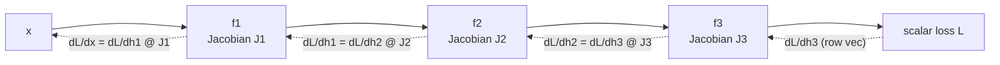
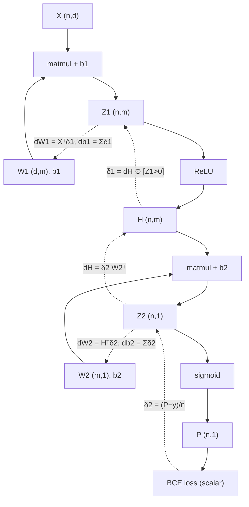

# Calculus and Backpropagation

Training a neural network is nothing more than: compute a loss, compute the gradient of that loss with respect to every parameter, step downhill, repeat. The entire deep-learning revolution rests on one algorithm — backpropagation — which is the chain rule organized so that the full gradient of a million-parameter network costs about as much as one extra forward pass. This guide builds the calculus vocabulary (partials, gradients, Jacobians, Hessians) with geometric meaning attached, states the chain rule in matrix form, and then does the thing most tutorials skip: derives every gradient of a two-layer MLP symbol by symbol, with the shape of every intermediate annotated, and verifies the result against finite differences in runnable NumPy.

Coming from an actuarial background, none of the calculus here is new to you — what is new is the *organization*: how the chain rule becomes a message-passing algorithm on a computational graph, why the transposes land where they do in `dW = h^T dz`, and how the same product-of-Jacobians structure mathematically forces gradients to vanish or explode in deep networks.

Part of the [Senior AI Engineer Roadmap](../00-Senior-AI-Engineer-Roadmap.md) — Phase 1.

---

## 1. The Derivative Zoo, with Geometry

### 1.1 Scalar derivative — local sensitivity

`f'(x) = lim_{ε→0} [f(x+ε) − f(x)] / ε`. Meaning: nudge the input by a tiny `ε`, the output moves by approximately `f'(x)·ε`. Every derivative in this guide is that one idea, bookkept across more dimensions. This limit is also the *test* for every gradient we derive: finite differences approximate it numerically, and hand-derived gradients must match.

### 1.2 Partial derivatives and the gradient

For a scalar-valued `L(w_1, ..., w_n)`, the partial `∂L/∂w_i` holds all other inputs fixed and nudges only `w_i`. The **gradient** collects them:

```text
∇L(w) = [∂L/∂w_1, ..., ∂L/∂w_n]^T        # shape (n,) — same shape as w. Always.
```

Geometry — two facts worth internalizing:

1. `∇L` points in the direction of **steepest ascent**, and its norm is the slope in that direction. Proof sketch: the directional derivative along unit vector `u` is `∇L · u = ||∇L|| cos θ`, maximized at `θ = 0`, i.e. `u` aligned with `∇L`. Gradient *descent* steps along `−∇L`.
2. `∇L` is **perpendicular to level sets** (contour lines) of `L` — moving along a contour changes nothing, so the direction of change must be orthogonal to it.

### 1.3 Jacobians — derivatives of vector-valued functions

For `f: R^n → R^m`, the **Jacobian** stacks every partial:

```text
J[i, j] = ∂f_i/∂x_j            # J: (m, n) — output index down the rows, input index across
```

Meaning: locally, `f(x + δ) ≈ f(x) + J δ` — the Jacobian is the matrix of the best linear approximation. Special cases: scalar `f` of a vector → `J` is `∇f^T` (a row); a linear layer `f(x) = Wx` → `J = W` exactly, everywhere.

Backprop never *forms* Jacobians of big layers — it computes **vector–Jacobian products** `v^T J`, which for structured layers collapse into cheap expressions (a matmul with a transpose, an elementwise mask). That is the whole efficiency trick.

### 1.4 Hessians — curvature

For scalar `L: R^n → R`, the **Hessian** `H[i,j] = ∂²L/∂w_i∂w_j` is `(n, n)` and symmetric (mixed partials commute). Its eigenvalues are curvatures along its eigenvector directions:

- all `λ_i > 0`: local bowl (minimum); all `< 0`: dome (maximum); mixed signs: **saddle** — the dominant critical point in high dimensions.
- `κ = λ_max/λ_min` is the **condition number** of the bowl: a long narrow valley. Gradient descent zigzags across the steep direction while crawling along the shallow one — this single number drives most optimizer design (guide 04).

### 1.5 Chain rule in matrix form

For a composition `L = g(f(x))` with `f: R^n → R^m`, `g: R^m → R^k`:

```text
J_{g∘f}(x) = J_g(f(x)) @ J_f(x)          # (k, n) = (k, m) @ (m, n) — shapes chain
```

For a deep network, `L = f_D(f_{D-1}(... f_1(x)))` with scalar loss:

```text
∂L/∂x = J_D @ J_{D-1} @ ... @ J_1        # (1, n) row vector: a chain of Jacobians
```

Two ways to evaluate this product:

- **Left to right** (forward mode): propagate `J_1`, then `J_2 J_1`, ... — cost scales with the number of *inputs*. Great for functions with few inputs.
- **Right to left** (reverse mode = backprop): start from the scalar loss (`J_D` is a row vector) and sweep backward — every step is a cheap vector–Jacobian product, and the cost scales with the number of *outputs*, which is 1 (the loss). One backward sweep yields `∂L/∂θ` for **every** parameter simultaneously.

That asymmetry — millions of inputs (parameters), one output (loss) — is why deep learning uses reverse mode.



---

## 2. The Centerpiece: Backprop for a 2-Layer MLP, Symbol by Symbol

### 2.1 The model and the forward pass

Binary classifier. Batch of `n` samples, input dim `d`, hidden dim `m`, one output. All shapes annotated — treat them as the type system of the derivation.

```text
Inputs and parameters
  X  : (n, d)      batch of inputs, one sample per row
  y  : (n, 1)      labels in {0, 1}
  W1 : (d, m)      first-layer weights        b1 : (1, m)
  W2 : (m, 1)      second-layer weights       b2 : (1, 1)

Forward pass
  Z1 = X @ W1 + b1          # (n, m)   pre-activations, b1 broadcasts over rows
  H  = ReLU(Z1)             # (n, m)   H = max(0, Z1), elementwise
  Z2 = H @ W2 + b2          # (n, 1)   logits
  P  = σ(Z2)                # (n, 1)   σ(z) = 1/(1+e^{−z}), predicted probabilities

Loss (mean binary cross-entropy)
  L = −(1/n) Σ_i [ y_i log p_i + (1−y_i) log(1−p_i) ]     # scalar
```

### 2.2 Two local derivatives we need first

**Sigmoid.** With `p = σ(z) = (1+e^{−z})^{−1}`:

```text
dp/dz = −(1+e^{−z})^{−2} · (−e^{−z}) = e^{−z} / (1+e^{−z})²
      = [1/(1+e^{−z})] · [e^{−z}/(1+e^{−z})]
      = p (1 − p)
```

**BCE w.r.t. p.** For one sample:

```text
∂L_i/∂p_i = −[ y_i/p_i − (1−y_i)/(1−p_i) ] = (p_i − y_i) / [ p_i(1−p_i) ]
```

### 2.3 δ2 = ∂L/∂Z2 — the famous cancellation

Chain rule through the sigmoid, per sample, then divide by `n` for the mean:

```text
∂L/∂z2_i = (∂L_i/∂p_i) · (dp_i/dz2_i) · (1/n)
         = [(p_i − y_i) / (p_i(1−p_i))] · [p_i(1−p_i)] · (1/n)
         = (p_i − y_i) / n
```

The `p(1−p)` factors cancel exactly — sigmoid + BCE is engineered so the logit gradient is just **prediction minus target**. In batch form:

```text
δ2 := ∂L/∂Z2 = (P − y) / n            # (n, 1) — same shape as Z2, as gradients must be
```

(The same cancellation happens for softmax + cross-entropy: `δ = P − Y_onehot`. Interviewers love this.)

### 2.4 ∂L/∂W2 — where the transpose comes from

`Z2 = H @ W2 + b2`. Entry-wise, `z2[i] = Σ_k H[i,k] · W2[k] + b2`. So `∂z2[i]/∂W2[k] = H[i,k]`, and summing the chain rule over all samples that touch `W2[k]`:

```text
∂L/∂W2[k] = Σ_i δ2[i] · H[i, k]  =  Σ_i H^T[k, i] δ2[i]
```

which is exactly matrix multiplication by the transpose:

```text
∂L/∂W2 = H^T @ δ2                     # (m, 1) = (m, n) @ (n, 1) — shape of W2 ✓
```

The transpose is not a convention — it is the summation over the batch index written as a matmul. Memorize the pattern: **for any layer `Z = A @ W`, `∂L/∂W = A^T @ δ` and `∂L/∂A = δ @ W^T`** — and you can always re-derive the transposes in an interview by making the shapes come out right, because they only chain one way.

### 2.5 ∂L/∂b2 — broadcasting backward is summation

`b2` is added to every row of `H @ W2`, so every sample's gradient flows into it: `∂z2[i]/∂b2 = 1` for all `i`, hence

```text
∂L/∂b2 = Σ_i δ2[i]  =  sum over the batch axis      # (1, 1) — shape of b2 ✓
```

General rule: whatever was **broadcast** forward gets **summed** backward over the broadcast axes.

### 2.6 ∂L/∂H — pushing the gradient back through W2

`z2[i] = Σ_k H[i,k] W2[k]` gives `∂z2[i]/∂H[i,k] = W2[k]`, so

```text
∂L/∂H = δ2 @ W2^T                     # (n, m) = (n, 1) @ (1, m) — shape of H ✓
```

Same pattern as 2.4, other operand: `∂L/∂A = δ @ W^T`.

### 2.7 δ1 = ∂L/∂Z1 — through the ReLU

`H = max(0, Z1)` elementwise, so the local derivative is `1` where `Z1 > 0` and `0` where `Z1 < 0` (at exactly 0 we pick 0; it is a measure-zero event and any subgradient in `[0,1]` is valid):

```text
δ1 := ∂L/∂Z1 = (∂L/∂H) ⊙ 1[Z1 > 0]    # (n, m), ⊙ = elementwise product (the ReLU mask)
```

Elementwise nonlinearities have *diagonal* Jacobians — the vector–Jacobian product is just an elementwise multiply. This is why activations are nearly free in backprop.

### 2.8 ∂L/∂W1 and ∂L/∂b1 — the pattern repeats

`Z1 = X @ W1 + b1` is the same affine pattern as layer 2, with `X` playing the role of `H`:

```text
∂L/∂W1 = X^T @ δ1                     # (d, m) = (d, n) @ (n, m) — shape of W1 ✓
∂L/∂b1 = Σ_i δ1[i, :]                 # (1, m) — sum over batch axis, shape of b1 ✓
```

### 2.9 The complete backward pass — six lines

```text
δ2  = (P − y) / n                     # (n, 1)   sigmoid+BCE shortcut
dW2 = H^T @ δ2                        # (m, 1)
db2 = δ2.sum(axis=0)                  # (1, 1)
δ1  = (δ2 @ W2^T) ⊙ 1[Z1 > 0]         # (n, m)   through W2, then ReLU mask
dW1 = X^T @ δ1                        # (d, m)
db1 = δ1.sum(axis=0)                  # (1, m)
```

Note what got **reused**: `H`, `Z1`, `P` from the forward pass. Backprop's memory cost is storing these activations — this is why training uses far more memory than inference, and what gradient checkpointing trades compute to avoid.



### 2.10 Full implementation with finite-difference gradient checking

The check implements the definition of the derivative: `∂L/∂θ ≈ [L(θ+ε) − L(θ−ε)] / 2ε` (central difference — error `O(ε²)` vs `O(ε)` for one-sided). If analytic and numeric disagree, the backward pass is wrong. This is the single most valuable debugging habit for anyone writing custom layers or losses.

```python
import numpy as np
rng = np.random.default_rng(7)

def sigmoid(z):
    return 1.0 / (1.0 + np.exp(-z))

def forward(X, y, params):
    W1, b1, W2, b2 = params["W1"], params["b1"], params["W2"], params["b2"]
    Z1 = X @ W1 + b1                   # (n, m)
    H  = np.maximum(0.0, Z1)           # (n, m)
    Z2 = H @ W2 + b2                   # (n, 1)
    P  = sigmoid(Z2)                   # (n, 1)
    eps = 1e-12                        # guard the logs
    L = -np.mean(y * np.log(P + eps) + (1 - y) * np.log(1 - P + eps))
    cache = (X, Z1, H, P)
    return L, cache

def backward(y, params, cache):
    X, Z1, H, P = cache
    n = len(y)
    d2  = (P - y) / n                          # (n, 1)  δ2 — sigmoid+BCE shortcut
    dW2 = H.T @ d2                             # (m, 1)
    db2 = d2.sum(axis=0, keepdims=True)        # (1, 1)
    dH  = d2 @ params["W2"].T                  # (n, m)
    d1  = dH * (Z1 > 0)                        # (n, m)  δ1 — ReLU mask
    dW1 = X.T @ d1                             # (d, m)
    db1 = d1.sum(axis=0, keepdims=True)        # (1, m)
    return {"W1": dW1, "b1": db1, "W2": dW2, "b2": db2}

def grad_check(X, y, params, grads, eps=1e-5, n_checks=25):
    """Compare analytic grads to central finite differences on random entries."""
    worst = 0.0
    for name, W in params.items():
        for _ in range(n_checks):
            idx = tuple(rng.integers(0, s) for s in W.shape)
            orig = W[idx]
            W[idx] = orig + eps; L_plus, _  = forward(X, y, params)
            W[idx] = orig - eps; L_minus, _ = forward(X, y, params)
            W[idx] = orig                       # restore!
            num = (L_plus - L_minus) / (2 * eps)
            ana = grads[name][idx]
            rel = abs(num - ana) / max(1e-12, abs(num) + abs(ana))
            worst = max(worst, rel)
    return worst

# --- Data: XOR-ish problem a linear model cannot solve ---
n, d, m = 256, 2, 16
X = rng.normal(size=(n, d))
y = ((X[:, 0] * X[:, 1]) > 0).astype(float).reshape(-1, 1)

params = {
    "W1": rng.normal(scale=np.sqrt(2.0 / d), size=(d, m)),   # He init for ReLU
    "b1": np.zeros((1, m)),
    "W2": rng.normal(scale=np.sqrt(2.0 / m), size=(m, 1)),
    "b2": np.zeros((1, 1)),
}

# --- 1) Gradient check BEFORE training ---
L, cache = forward(X, y, params)
grads = backward(y, params, cache)
print(f"initial loss = {L:.4f}")                    # initial loss ≈ 0.69 (≈ log 2: chance level)
print(f"max relative grad error = {grad_check(X, y, params, grads):.2e}")
# max relative grad error ≈ 1e-9 .. 1e-7  -> backward pass verified.
# (Errors near 1e-2+ on ReLU entries can occur if a nudge crosses the kink at Z1=0 — rare; re-run.)

# --- 2) Train with plain gradient descent ---
lr = 1.0
for step in range(3000):
    L, cache = forward(X, y, params)
    grads = backward(y, params, cache)
    for k in params:
        params[k] -= lr * grads[k]
    if step % 1000 == 0:
        print(f"step {step:4d}  loss {L:.4f}")
# step    0  loss 0.6907
# step 1000  loss 0.1414        (values vary slightly with seed)
# step 2000  loss 0.0666

L, cache = forward(X, y, params)
acc = np.mean((cache[3] > 0.5) == y)
print(f"final loss {L:.4f}  accuracy {acc:.3f}")     # final loss ≈ 0.05  accuracy ≈ 0.97+
# A linear model scores ~0.5 on this data — the hidden layer is doing real work.
```

Practical notes on the checker: use `float64` (in `float32` the finite-difference noise floor is ~1e-3 and drowns the signal); `ε = 1e-5` balances truncation error (`O(ε²)`) against cancellation error (`O(machine_eps/ε)`); always restore the perturbed entry; and check *before* training, at initialization, when gradients are informative and nothing has saturated.

---

## 3. The Computational-Graph View

Frameworks (PyTorch, JAX, TensorFlow) generalize section 2 into an algorithm over a DAG:

1. **Forward**: execute ops in topological order; each node stores what its backward needs (inputs and/or output).
2. **Backward**: seed the loss node with gradient `1.0`; sweep nodes in *reverse* topological order; each node receives the gradient of the loss w.r.t. its output ("upstream gradient") and multiplies it by its **local** Jacobian to produce gradients w.r.t. its inputs.
3. **Fan-out sums**: if a tensor feeds several consumers (weight sharing, residual connections), its gradient is the **sum** of the gradients from each path — the multivariate chain rule.

Each op only needs its local rule:

| op forward | stored | backward rule |
|---|---|---|
| `Z = A @ W` | `A`, `W` | `dA = dZ @ W^T`, `dW = A^T @ dZ` |
| `H = relu(Z)` | mask `Z>0` | `dZ = dH ⊙ mask` |
| `P = σ(Z)` | `P` | `dZ = dP ⊙ P(1−P)` |
| `Y = X + b` (broadcast) | shapes | `dX = dY`, `db = dY.sum(broadcast axes)` |
| `L = mean(v)` | `n` | `dv = dL / n` (broadcast) |

Our hand-derivation in section 2 was exactly this table applied to a 7-node graph. Autodiff is not symbolic differentiation and not finite differences — it is *exact* derivatives computed numerically by composing local Jacobian products, at ~2–3x the cost of the forward pass regardless of parameter count.

A residual connection `y = x + f(x)` gets backward `dy/dx = I + f'(x)` — the `I` term gives gradients a lossless highway past `f`. Keep that in mind for the next section: residual networks are an *architectural answer to a calculus problem*.

---

## 4. Why Gradients Vanish and Explode — It's in the Product

Stack `D` layers. The gradient reaching layer 1 is a product of `D` per-layer Jacobians:

```text
∂L/∂h_1 = ∂L/∂h_D · J_D · J_{D-1} · ... · J_2,     J_k = diag(φ'(z_k)) W_k
```

A product of `D` matrices behaves like `(typical gain)^D`:

- If the typical singular value of `J_k` is `s < 1`: gradient norm ~ `s^D` → **vanishes**. With sigmoid activations `φ' = p(1−p) ≤ 0.25`, even perfectly scaled weights give gain ≤ 0.25 per layer: at depth 10 the signal is down by `~10^{-6}`. Early layers stop learning.
- If `s > 1`: gradient norm ~ `s^D` → **explodes**. Loss spikes to `inf`/`NaN`; common in RNNs, where the *same* `W` multiplies at every timestep, so the product is literally `W^T`-powers and behaves as `λ_max(W)^T` (eigendecomposition, guide 02).

```python
D, width = 30, 100
rng2 = np.random.default_rng(0)
for scale in [0.5, 1.0, 1.5]:
    g = np.ones(width)
    for _ in range(D):
        W = rng2.normal(scale=scale / np.sqrt(width), size=(width, width))
        g = W.T @ g                          # backprop through a linear layer
    print(f"scale {scale}: ||grad|| after {D} layers = {np.linalg.norm(g):.2e}")
# scale 0.5: ||grad|| after 30 layers ≈ 1e-10   (vanished)
# scale 1.0: ||grad|| after 30 layers ≈ 1e+00   (stable — critical scaling)
# scale 1.5: ||grad|| after 30 layers ≈ 1e+05   (exploding)
```

Every standard remedy attacks a factor of the product:

| remedy | which factor it fixes |
|---|---|
| ReLU/GELU instead of sigmoid | `φ'` is ~1 on the active half, not ≤ 0.25 |
| He/Xavier init | sets initial `W` scale so per-layer gain ≈ 1 |
| BatchNorm/LayerNorm | re-standardizes activations, keeping `z` in the responsive zone |
| Residual connections | Jacobian becomes `I + J_f` — product has an identity highway |
| Gradient clipping | caps the norm when the product transiently explodes |
| LSTM/GRU gates → attention | replace the `W^T` power with additive/gated paths |

---

## Production War Stories & Failure Modes

### Incident 1: The custom loss that silently trained the wrong model

- **Symptom**: a team replaced BCE with a hand-written focal loss (NumPy prototype ported into a custom framework op). Training converged, metrics looked plausible, but the model underperformed the plain-BCE baseline it was supposed to beat.
- **Investigation**: loss values were correct (forward verified); nobody had checked the backward. Finite-difference checking showed analytic gradients off by a factor related to the focusing term — a `(1−p)^γ` factor had been treated as a constant during differentiation.
- **Root cause**: the derivative was taken only through the `log p` term, ignoring that `(1−p)^γ` also depends on `p` — a classic product-rule omission. The wrong gradient was still a descent-ish direction, so training "worked", just not on the intended objective.
- **Fix**: rederived with the product rule, added a gradient-check unit test (`rel_err < 1e-6` on float64 random inputs) to CI for every custom op.
- **Prevention**: a wrong gradient that still decreases the loss is the most dangerous bug in ML — it fails silently. Gradient-check every hand-written backward, always.

### Incident 2: NaN at 3 a.m., step 41,207

- **Symptom**: long training run dies with `loss = NaN` mid-run; restarts from checkpoint die again within a few thousand steps.
- **Investigation**: activation/grad-norm logging showed grad norms rising over ~200 steps before the spike; the blast originated in an `exp` inside a custom softmax on sequences that had grown longer than any seen earlier in the (length-curriculum) data pipeline.
- **Root cause**: two compounding issues — softmax implemented without the max-subtraction trick (`exp(z − z.max())`), overflowing for large logits, and no gradient clipping, so one bad batch poisoned the weights before the NaN surfaced.
- **Fix**: numerically stable softmax; global-norm gradient clipping at 1.0; loss-scale/NaN-skip guard that drops the offending batch and logs it; checkpoint + resume from *before* the norm ramp.
- **Prevention**: log gradient norms continuously (the ramp is the early warning), stabilize every `exp`/`log`/`div` at write time, and treat clipping as cheap insurance on any long run.

### Incident 3: The fine-tune where nothing learned below layer 2

- **Symptom**: an internally built (non-residual, sigmoid-activated, 12-layer) tabular network fine-tuned on new data: top layers moved, probes showed layers 1–8 essentially frozen; validation gains plateaued far below expectations.
- **Investigation**: per-layer gradient-norm histograms showed norms decaying ~4x per layer going down the stack — textbook vanishing gradients, exactly the `(≤0.25)^D` sigmoid arithmetic.
- **Root cause**: legacy architecture: sigmoid activations without residual connections or normalization; depth had been increased from 4 to 12 without revisiting the calculus.
- **Fix**: swapped sigmoid → GELU, added residual connections and LayerNorm, re-initialized with He scaling; per-layer grad norms flattened and the fine-tune recovered the expected lift.
- **Prevention**: per-layer gradient-norm monitoring belongs in every training dashboard; any architecture change that increases depth must re-check the per-layer gain story.

---

## Best Practices

- Annotate the shape of every tensor in comments before writing the math; a gradient must have exactly the shape of the thing it differentiates — this catches most transpose bugs at derivation time.
- Gradient-check every hand-written backward pass with central differences on float64 at initialization (`rel_err < 1e-6`), and keep the check as a unit test.
- Use the fused shortcuts: sigmoid+BCE → `δ = (P−y)/n`, softmax+CE → `δ = P − Y`; besides being simpler they are more numerically stable than chaining through the saturating activation.
- Stabilize primitives at write time: `exp(z − max)`, `log(p + eps)`, guard every division; a formula correct in ℝ can still be wrong in float32.
- Log gradient norms (global and per-layer) in every training run — vanishing shows as monotone per-layer decay, explosion shows as a ramp before the NaN.
- Match init to activation: He (`√(2/fan_in)`) for ReLU-family, Xavier for tanh; wrong init at depth reproduces vanishing/exploding at step 0.
- Clip gradients by global norm on long or recurrent runs; it is cheap and converts rare catastrophic batches into non-events.
- Remember what backprop stores: forward activations. Memory scales with depth × batch; use gradient checkpointing when activations, not weights, are the bottleneck.
- Derivatives at kinks (ReLU at 0) are a choice of subgradient — fine in practice, but be aware finite-difference checks can "fail" across a kink; re-sample rather than panic.
- When loss diverges, check in order: learning rate, feature/target scaling, gradient sign or transpose bugs, unstabilized `exp`/`log`.

---

## Interview Drills

<details>
<summary>What is a gradient, geometrically? Why does gradient descent use its negative?</summary>

The gradient of scalar `L(w)` collects all partials into a vector with the same shape as `w`. Geometrically it points in the direction of steepest local increase — because the directional derivative along unit `u` is `∇L·u = ||∇L|| cos θ`, maximized when `u` aligns with `∇L` — and it is orthogonal to level sets. Descending means moving where `L` decreases fastest locally, hence `−∇L`.

Follow-up: *Is steepest descent the best direction?* Only in the Euclidean metric. If curvature differs wildly across directions (ill-conditioned Hessian), the steepest direction is nearly perpendicular to the direction toward the minimum, causing zigzag; Newton's direction `−H^{-1}∇L` corrects for this — see guide 04.
</details>

<details>
<summary>Jacobian vs gradient vs Hessian — define each, with shapes, and say where each appears in ML.</summary>

Gradient: scalar function `R^n → R`, shape `(n,)` — loss w.r.t. parameters, the object optimizers consume. Jacobian: vector function `R^n → R^m`, shape `(m, n)`, the best linear approximation `f(x+δ) ≈ f(x) + Jδ` — every layer has one; backprop multiplies them. Hessian: second derivatives of a scalar function, `(n, n)` symmetric — curvature; its eigenvalues classify critical points and its condition number governs gradient-descent speed; appears in Newton methods, Laplace approximations, and sharpness analyses.

Follow-up: *Why does backprop never materialize layer Jacobians?* A linear layer `(n,m)→(n,k)` has a Jacobian with `nm × nk` entries — absurd. Backprop only needs the vector–Jacobian product, which collapses to `δ @ W^T` or a mask — same information along the one direction that matters, at matmul cost.
</details>

<details>
<summary>State the chain rule in matrix form and explain forward-mode vs reverse-mode autodiff.</summary>

For `g∘f`, `J_{g∘f} = J_g J_f` — Jacobians multiply, shapes chaining `(k,n) = (k,m)(m,n)`. A deep net's gradient is a product of many Jacobians ending in a row vector (scalar loss). Forward mode evaluates the product left-to-right, cost proportional to number of inputs — good for `R^few → R^many`. Reverse mode (backprop) evaluates right-to-left as vector–Jacobian products, cost proportional to number of outputs — for a scalar loss, one backward sweep gets gradients for *all* parameters at ~2–3x forward cost. ML has millions of inputs and one output, so reverse mode wins.

Follow-up: *When is forward mode the right tool?* Jacobian-vector products (directional derivatives), e.g. computing `Hv` products via forward-over-reverse for Hessian-free optimization, or differentiating functions with few parameters and many outputs (some scientific-computing settings).
</details>

<details>
<summary>Derive ∂L/∂W2 for Z2 = H @ W2 and explain, precisely, where the transpose in H^T @ δ2 comes from.</summary>

Entrywise, `z2[i] = Σ_k H[i,k] W2[k]`, so `∂z2[i]/∂W2[k] = H[i,k]`. Total derivative sums over every sample that used `W2[k]`: `∂L/∂W2[k] = Σ_i δ2[i] H[i,k]`. That sum over the batch index `i` is exactly the `(k,i)(i,·)` contraction `H^T @ δ2`. The transpose is the batch summation written as a matmul, not a convention. Sanity check: `(m,n)@(n,1) = (m,1)`, the shape of `W2` — gradients always match their parameter's shape, and for these affine layers only one arrangement of transposes makes shapes work.

Follow-up: *And ∂L/∂H?* Same expansion in the other operand: `∂z2[i]/∂H[i,k] = W2[k]`, giving `δ2 @ W2^T`, shape `(n,m)`. Follow-up: *Why is the bias gradient a sum over the batch?* `b` was broadcast to every row on the forward pass; broadcasting forward becomes summation backward over the broadcast axes.
</details>

<details>
<summary>Show that sigmoid+BCE gives δ = (P − y)/n at the logit. Why does this matter beyond elegance?</summary>

`∂L_i/∂p_i = (p_i−y_i)/(p_i(1−p_i))` and `dp/dz = p(1−p)`; the `p(1−p)` cancels, leaving `(p_i−y_i)`, divided by `n` for the mean. It matters because (1) numerically, chaining through the sigmoid separately involves dividing by `p(1−p)` which underflows when the sigmoid saturates — the fused form never does; (2) it means the logit gradient never saturates: even a confidently wrong prediction (`p≈1, y=0`) gets a full-strength gradient `≈1/n`, whereas MSE-on-sigmoid would multiply by `p(1−p)≈0` and stall. This is the actual argument for cross-entropy over MSE in classification.

Follow-up: *Softmax + cross-entropy?* Identical structure: `∂L/∂z = P − Y_onehot` per sample. Be able to state it without derivation, and derive it if pushed (split the diagonal and off-diagonal terms of the softmax Jacobian `diag(p) − pp^T`).
</details>

<details>
<summary>What does backprop store between forward and backward, and what are the memory implications?</summary>

Each op stores whatever its backward rule needs: matmuls store their inputs, ReLU stores its mask, sigmoid stores its output. Total: the forward activations of essentially every layer, scaling as O(depth × batch × width) — usually dominating weight memory during training, and the reason training needs several times inference memory. Mitigations: gradient checkpointing (store activations only at intervals, recompute the rest during backward — ~30% more compute for large memory savings), reversible layers (reconstruct inputs from outputs), and smaller microbatches with gradient accumulation.

Follow-up: *Why does gradient accumulation give identical gradients to a larger batch?* The loss is a mean over samples; gradients are linear in the loss, so averaging the gradients of k microbatches equals the gradient of the combined batch — as long as batch-dependent ops (BatchNorm) don't break the independence.
</details>

<details>
<summary>How does finite-difference gradient checking work, and what are its numerical gotchas?</summary>

Approximate each partial with the central difference `[L(θ+ε) − L(θ−ε)]/2ε` (truncation error O(ε²)) and compare to the analytic gradient via relative error `|num−ana|/(|num|+|ana|)`; below ~1e-6 in float64 means the backward is almost surely right. Gotchas: (1) use float64 — float32's noise floor is ~1e-3; (2) ε too small → catastrophic cancellation in the numerator, ε too large → truncation error; ~1e-5 is the sweet spot; (3) restore the perturbed parameter; (4) kinks (ReLU at 0) can flip the mask between the ± evaluations and produce false alarms; (5) it is O(#params) forward passes, so check random entries, never the full gradient, and never during training.

Follow-up: *Why central rather than one-sided differences?* One-sided has error O(ε); central cancels the even-order term giving O(ε²) — with ε = 1e-5 that's the difference between ~1e-5 accuracy (drowns real bugs) and ~1e-10.
</details>

<details>
<summary>Explain vanishing and exploding gradients from the chain rule, quantitatively.</summary>

The gradient at depth-1 is a product of D per-layer Jacobians `J_k = diag(φ'(z_k)) W_k`. Products compound geometrically: typical per-layer gain `s` gives gradient norm ~`s^D`. Sigmoid caps `φ'` at 0.25, so even with well-scaled weights, gain ≤ 0.25 per layer → at D = 10 a factor ≤ 1e-6: early layers get no learning signal. Gain modestly above 1 (e.g. 1.5 per layer, D = 30) gives ~1e5 amplification → NaN. RNNs are the extreme case: the same W appears at every step, so the product is a matrix power behaving as `λ_max(W)^T`.

Follow-up: *Map each standard fix to the factor it repairs.* ReLU/GELU fix `φ'` (≈1 when active); He/Xavier init fix the initial scale of `W`; norm layers keep pre-activations in the responsive zone throughout training; residual connections change the Jacobian to `I + J_f`, giving an identity path so the product no longer decays; clipping caps transient explosions; gates/attention remove the repeated-`W` power structure entirely.
</details>

<details>
<summary>Why do residual connections help gradients, mathematically?</summary>

For `y = x + f(x)`, the Jacobian is `∂y/∂x = I + J_f`. Through D residual blocks, the end-to-end Jacobian is `Π(I + J_k)`; expanding, it contains the identity term plus cross terms — there is always a direct, product-free path for the gradient from loss to any layer, so the signal cannot decay as `s^D` even if each `J_k` is small. It also reframes learning: each block learns a *perturbation* around identity rather than a full transformation, which is an easier optimization problem at initialization (blocks start near identity).

Follow-up: *Any downside — can residuals cause explosion?* The `(I + J)^D` product grows if the `J_k` push in aligned directions; that's why deep residual nets pair skips with normalization and often scale residual branches (e.g. init last layer of each block near zero) to keep growth controlled.
</details>

<details>
<summary>What exactly is autodiff — how is it different from symbolic and from numerical differentiation?</summary>

Autodiff executes the program while propagating derivative information through each primitive op using its known local Jacobian rule — results are exact to machine precision (unlike finite differences' truncation error) and cost a small constant multiple of the forward pass (unlike symbolic differentiation, which manipulates expressions and can blow up in size, and unlike numerical differentiation, which costs one forward pass *per parameter*). Reverse-mode autodiff over a computational graph = backpropagation: forward pass in topological order caching inputs, backward pass in reverse order applying local vector–Jacobian products, summing gradients at fan-out points.

Follow-up: *Why do gradients sum at fan-out?* Multivariate chain rule: if `u` feeds both `f` and `g` and `L` depends on both, `dL/du = (∂L/∂f)(∂f/∂u) + (∂L/∂g)(∂g/∂u)`. Weight sharing (RNNs, tied embeddings) and residual junctions are exactly this case.
</details>

<details>
<summary>ReLU is not differentiable at 0. Why is that not a problem, and what IS the "dying ReLU" problem?</summary>

Non-differentiability at a single point is a measure-zero event; frameworks use a subgradient (conventionally 0) there, and optimization theory for subgradient methods covers it — in practice hitting exactly 0.0 in float is vanishingly rare. The real issue is **dying ReLU**: if a unit's pre-activation becomes negative for every input in the data (e.g. after a large negative bias update from a big learning rate), its output is always 0, its gradient mask is always 0, and no gradient can ever flow to revive it — the unit is permanently dead. Diagnose by monitoring the fraction of always-inactive units; mitigate with lower LR, LeakyReLU/GELU (nonzero slope everywhere), or better init.

Follow-up: *Does the same permanent death happen with sigmoid?* Saturated sigmoids give tiny but nonzero gradients (`p(1−p) > 0`), so units can in principle recover — slowly. ReLU's hard zero is what makes death permanent; the trade is that when active, ReLU's gradient is exactly 1 (no vanishing), which is why it won overall.
</details>

<details>
<summary>Your training loss becomes NaN at step 40k of a long run. Walk me through your debugging playbook.</summary>

First triage the moment of death: reload the checkpoint just before, replay with logging — gradient global norm, per-layer norms, max |activation|, and the specific batch. Common causes in rough order: (1) LR too high for late-training loss geometry — norm ramp before the spike is the tell; (2) unstable primitive — `exp` overflow (softmax without max-subtraction), `log(0)`, division by tiny variance (norm layers with small batch); (3) a poisoned data batch (corrupt values, extreme lengths) — replaying identifies it; (4) fp16/bf16 range issues — check if the run uses mixed precision without loss scaling. Fixes map to causes: clip by global norm, stabilize the primitive, add data validation/skip-batch guard, proper loss scaling. Then resume from a checkpoint *before* the norm ramp, since weights may already be damaged.

Follow-up: *Why resume from before the ramp rather than right before the NaN?* The NaN is the symptom's end, not its start — weights accumulated damage during the ramp; resuming at the last "healthy norm" checkpoint with the fix applied avoids re-diverging.
</details>

<details>
<summary>How would you verify a custom layer's backward implementation in a real codebase — beyond a one-off check?</summary>

Layered defense: (1) unit test with central-difference gradient check on float64 random inputs across several shapes (including batch = 1 and non-square dims to catch transpose bugs), asserting relative error < 1e-6; (2) property tests — gradient of a sum equals sum of gradients (linearity), gradient is zero at a known minimum; (3) comparison test against a reference autodiff implementation (compose the same math from PyTorch/JAX primitives and compare both forward and backward); (4) an end-to-end "canary" — tiny model must overfit 32 samples to ~zero loss in N steps; failure means the gradient is wrong-but-plausible. All in CI, because the failure mode of a wrong gradient is silent underperformance, not a crash.

Follow-up: *The check passes at init but training underperforms — what could still be wrong?* Numerical instability appearing only at extreme values (check with saturating inputs), incorrect handling of non-contiguous/broadcast inputs, a forward/backward mismatch under dropout or training/eval mode flags, or gradient correctness but wrong *scaling* (e.g. sum vs mean reduction) that effectively rescales the LR per-layer.
</details>

<details>
<summary>Estimate the compute and memory cost of backprop relative to the forward pass.</summary>

Compute: each matmul `A@W` in forward spawns two matmuls in backward (`δ@W^T` and `A^T@δ`) of the same FLOP count, so backward ≈ 2x forward; a full training step ≈ 3x inference FLOPs (the source of the ~"6ND" transformer training FLOPs rule: 2ND forward + 4ND backward per token, N params). Memory: backward needs forward activations of every layer — O(depth × batch × width) — typically dominating parameter memory; plus optimizer state (Adam: 2 extra copies of every parameter, guide 04). This is why inference fits on hardware that training does not.

Follow-up: *Levers when activation memory is the constraint?* Gradient checkpointing (recompute activations in backward: ~1.3x compute for O(√depth) memory), microbatching + gradient accumulation, mixed precision activations, and architecture choices (fewer, wider layers store less than many narrow ones at equal params).
</details>
