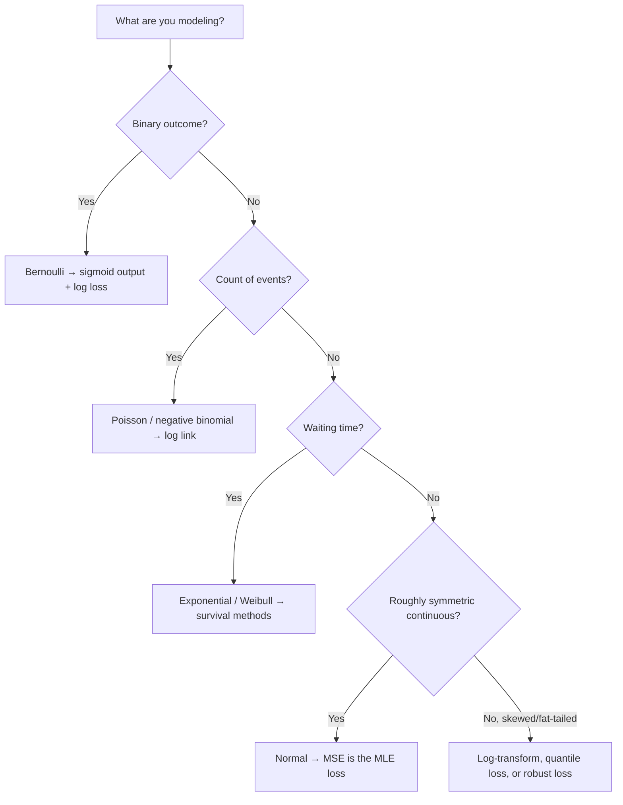
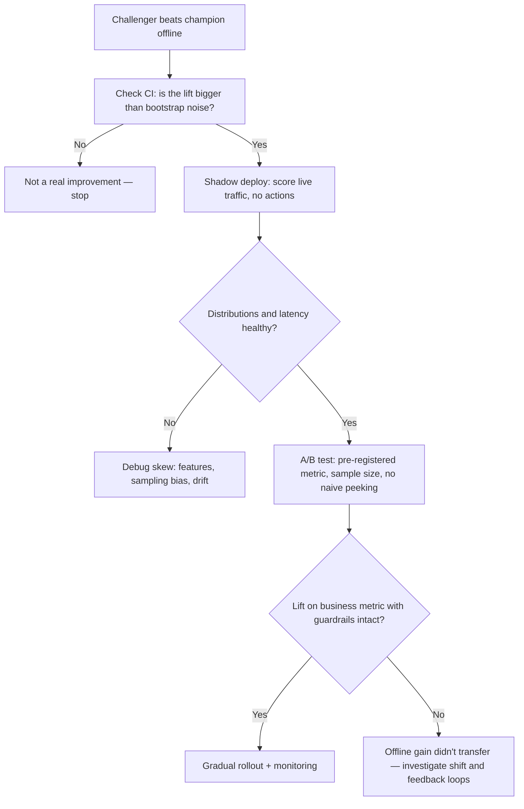

# Probability and Statistics for AI

Every ML model is a statistical claim: "given data sampled this way, this function's outputs approximate this conditional distribution." Senior engineers get paid for knowing when that claim breaks — when accuracy flatters a useless model, when an offline win is a sampling artifact, when a p-value is theater, when probabilities are rankings in disguise. With an actuarial background you already own the math; this guide maps each concept to the exact place it bites in production ML.

Part of the [Senior AI Engineer Roadmap](./00-Senior-AI-Engineer-Roadmap.md) — Phase 1.

---

## 1. Random Variables and Distributions in ML

### 1.1 Where Each Distribution Shows Up

| Distribution | Models | Where it appears in ML |
| --- | --- | --- |
| Bernoulli | single binary outcome | classification labels; the output a sigmoid parameterizes |
| Binomial | count of successes in n trials | conversion counts in A/B tests; CTR aggregates |
| Poisson | event counts per interval | request rates, claim/fraud counts, word counts; Poisson regression |
| Normal | sums/averages of many effects (CLT) | residual noise assumption behind MSE; weight init; CLT justifies almost every confidence interval |
| Exponential | waiting time between events | time-to-churn, time-between-transactions; hazard-style features |

Two facts you will use weekly: the Central Limit Theorem makes averages of anything approximately normal (which is why metric comparisons work at all), and real data is fat-tailed more often than normal — transaction amounts, latencies, and token frequencies are log-normal or power-law. Squared-error losses and z-tests both degrade on fat tails; log-transform or use robust statistics.

### 1.2 Checking Distributional Assumptions in Code

```python
import numpy as np
from scipy import stats

rng = np.random.default_rng(42)
amounts = rng.lognormal(mean=3.5, sigma=1.2, size=10_000)   # realistic transaction amounts

print(f"mean {amounts.mean():.0f}  median {np.median(amounts):.0f}  p99 {np.percentile(amounts, 99):.0f}")
# mean >> median: fat right tail. A model trained with MSE here chases the tail.

# Normality is testable, not assumable
print("raw normal?", stats.shapiro(amounts[:500]).pvalue > 0.05,
      "| logged normal?", stats.shapiro(np.log(amounts[:500])).pvalue > 0.05)  # False, True
```



---

## 2. Conditional Probability and Bayes' Theorem

### 2.1 The Base-Rate Fallacy, Worked

A fraud model has 95% recall (sensitivity) and a 3% false-positive rate. Fraud prevalence is 0.5%. What fraction of flagged transactions are actually fraud?

```text
P(fraud | flag) = P(flag | fraud) P(fraud) / P(flag)
                = (0.95)(0.005) / [(0.95)(0.005) + (0.03)(0.995)]
                = 0.00475 / 0.03460 ≈ 0.137
```

Only ~14% of flags are real fraud — an impressive-sounding classifier drowns the review team 6:1 in false alarms, because the enormous legitimate class feeds the false-positive term. This single calculation explains why class imbalance matters, why precision collapses at low prevalence, and why the same model produces different alert quality in a low-fraud market than in a high-fraud one. Precision is a function of prevalence; recall and FPR are not.

### 2.2 Bayes in Code

```python
def posterior(prior, sensitivity, fpr):
    evidence = sensitivity * prior + fpr * (1 - prior)
    return sensitivity * prior / evidence

for prev in [0.05, 0.005, 0.0005]:
    print(f"prevalence {prev:.2%} -> {posterior(prev, 0.95, 0.03):.1%}")  # 62.5%, 13.7%, 1.6%
```

Bayes' theorem is also the skeleton of ML itself: `posterior ∝ likelihood × prior`. Regularization is a prior on weights (L2 = Gaussian prior, L1 = Laplace prior), and Naive Bayes, spam filters, and Bayesian A/B testing are direct applications.

---

## 3. Expectation, Variance, Covariance, Correlation

- **Expectation** is what every loss function minimizes on average — training minimizes *empirical* expectation over the training sample, which is only a good proxy for deployment expectation if the sample matches production (Section 4).
- **Variance** of an estimator tells you how much a metric would move if you re-drew the data. A 0.3% AUC "improvement" measured on 2,000 rows is usually inside estimator variance — check before celebrating (Section 6).
- **Covariance/correlation** drive feature redundancy, multicollinearity in linear models, and PCA (which diagonalizes the covariance matrix). Remember Pearson correlation only measures *linear* dependence.

```python
rng = np.random.default_rng(0)
x = rng.uniform(-3, 3, 5_000)
y = x**2 + rng.normal(0, 0.5, 5_000)          # perfectly dependent, non-linearly
print(f"Pearson  r = {stats.pearsonr(x, y).statistic:+.3f}")   # ~0.00
print(f"corr(x^2, y) = {stats.pearsonr(x**2, y).statistic:+.3f}")  # ~0.98
# Zero correlation != independence. Trees and NNs can use x; a linear model cannot.
```

---

## 4. Sampling and Sampling Bias

A model learns `P(y|x)` **under the training sampling distribution**. If that distribution differs from production, the model is confidently answering the wrong question. Classic ways this happens:

1. **Selection on the outcome:** training a credit-default model only on *approved* loans — the previous policy censored the riskiest applicants out of your data (reject inference problem).
2. **Survivorship:** churn models trained on customers who stayed long enough to accumulate features.
3. **Convenience sampling:** labeling only the transactions analysts happened to review — which were selected *by the old model*, so the new model inherits and amplifies its blind spots (feedback loop).
4. **Temporal drift:** training on last year's distribution and serving this year's.
5. **Non-response / platform bias:** feedback ratings come disproportionately from angry users.

Damage mode: offline metrics are computed on the same biased distribution, so they look fine — the model fails silently only where the sample under-covers, which is often exactly the segment you care about. Mitigations: compare training feature distributions against production logs (population stability index, KS tests), use importance weighting when the bias is quantifiable, randomize a small "exploration" slice of decisions to collect unbiased labels, and always ask *how did each row earn its way into this dataset?*

---

## 5. Maximum Likelihood Estimation

MLE picks parameters that maximize `P(data | θ)`. Its real value for you: **the standard loss functions are not arbitrary — they are MLE under specific noise assumptions.**

### 5.1 MSE Is MLE Under Gaussian Noise

Assume `y = f(x; θ) + ε`, with `ε ~ N(0, σ²)`. The negative log-likelihood of the data is

```text
-log L = (n/2) log(2πσ²) + (1/2σ²) Σ (yᵢ - f(xᵢ; θ))²
```

Everything except the sum is constant in θ, so maximizing likelihood ≡ minimizing squared error. Corollary: when your noise is *not* Gaussian (fat tails, outliers), MSE is the wrong likelihood — use MAE (Laplace noise), Huber, or quantile loss.

### 5.2 Cross-Entropy Is MLE for Classification

For Bernoulli labels with predicted probability `pᵢ`, the likelihood is `Π pᵢ^yᵢ (1-pᵢ)^(1-yᵢ)`; its negative log is exactly binary cross-entropy `-Σ [yᵢ log pᵢ + (1-yᵢ) log(1-pᵢ)]`. Softmax + categorical cross-entropy is the multiclass version. So "training with log loss" *is* maximum likelihood — which is why log loss rewards calibrated probabilities, not just correct rankings.

```python
from scipy.optimize import minimize_scalar

rng = np.random.default_rng(1)
y = rng.binomial(1, 0.23, size=1_000)                       # true p = 0.23

nll = lambda p: -np.sum(y*np.log(p) + (1-y)*np.log(1-p))    # cross-entropy
p_hat = minimize_scalar(nll, bounds=(1e-6, 1-1e-6), method="bounded").x
print(f"MLE {p_hat:.4f}  vs  sample mean {y.mean():.4f}")   # identical: MLE = frequency
```

---

## 6. Confidence Intervals and the Bootstrap

A point metric without an interval is a guess. Analytic CIs exist for means and proportions (`p̂ ± 1.96·√(p̂(1-p̂)/n)`), but for AUC, PR-AUC, F1, or expected cost, use the **bootstrap**: resample the evaluation set with replacement, recompute the metric, and read percentiles.

```python
from sklearn.metrics import roc_auc_score

rng = np.random.default_rng(7)
n = 2_000
y = rng.binomial(1, 0.08, n)                       # 8% positives
scores = rng.normal(loc=1.1 * y, scale=1.0)        # a mediocre model

point = roc_auc_score(y, scores)
boot = []
for _ in range(2_000):
    idx = rng.integers(0, n, n)
    if 0 < y[idx].sum() < n:
        boot.append(roc_auc_score(y[idx], scores[idx]))
lo, hi = np.percentile(boot, [2.5, 97.5])
print(f"AUC {point:.3f}  95% CI [{lo:.3f}, {hi:.3f}]")   # ~±0.035 with only ~160 positives
```

The interval width is driven by the *minority class count*, not total rows. If your challenger beats the champion by less than the CI width, you have measured noise. Bootstrap the **difference** between two models on the same resamples (paired bootstrap) for a sharper comparison.

---

## 7. Hypothesis Testing, Power, and Multiple Comparisons

### 7.1 The Machinery, Honestly Stated

A p-value is `P(data this extreme | no true difference)` — not the probability the null is true, and not effect size. With enough data, trivial differences become "significant"; always report the effect size and its CI alongside. **Power** is the probability of detecting a real effect of a given size; underpowered experiments (small eval sets, rare positives) mostly produce noise and, worse, systematically *exaggerate* the effects they do detect.

### 7.2 Multiple Comparisons

Evaluate 20 model variants against a champion at α = 0.05 and roughly one will "win" by chance. The same trap hides in: metric dashboards with many segments, hyperparameter sweeps scored on the test set, and re-running an experiment "until it works." Corrections: Bonferroni (`α/m`) when tests are few, Benjamini-Hochberg (false discovery rate) when many, or — cleanest for ML — confirm any winner on a fresh holdout it has never touched.

```python
rng = np.random.default_rng(3)
trials = 10_000
# 20 identical "model variants" (no real effect), tested at alpha = 0.05
p_vals = rng.uniform(0, 1, size=(trials, 20))
print(f"P(at least one false 'win') = {(p_vals < 0.05).any(axis=1).mean():.2f}")  # ~0.64
```

---

## 8. Bias and Variance, Statistically

For squared loss, expected prediction error decomposes as `E[(y - f̂(x))²] = Bias² + Variance + σ²_irreducible`. Bias is systematic error from model rigidity (the estimator's expectation misses the truth); variance is sensitivity to the particular training sample (the estimator moves when data is re-drawn); irreducible noise is the floor no model can beat.

The statistical lens adds two production insights: regularization is *deliberately accepting bias to cut variance* (shrinkage estimators — the same logic as actuarial credibility weighting); and ensembling works because averaging m decorrelated estimators divides variance by up to m while leaving bias untouched. Diagnose which side you're on from the train/validation gap before choosing a fix.

---

## 9. Correlation vs Causation

### 9.1 Confounders

Correlation in observational data can come from `X→Y`, `Y→X`, or a confounder `Z→X, Z→Y`. Models exploit correlation and that's fine *for prediction under a stable distribution* — but the moment you use a model to justify an **intervention** ("customers who use feature X churn less, so force everyone into X"), you need causal reasoning: randomized experiments (Section 11), or careful adjustment for confounders. Predictive importance is not causal importance.

### 9.2 Simpson's Paradox, Numerically

Two fraud models evaluated on 350 reviewed cases each:

| Segment | Model A | Model B |
| --- | --- | --- |
| Hard cases | 81/87 = **93%** | 234/270 = 87% |
| Easy cases | 192/263 = **73%** | 55/80 = 69% |
| **Overall** | 273/350 = 78% | 289/350 = **83%** |

Model A wins **both** segments yet loses overall, because B was mostly evaluated on hard cases (270 of 350) and A on easy ones — case mix, not model quality, drives the aggregate. This happens whenever traffic routing is non-random: champion/challenger comparisons, regional rollouts, analyst-selected review queues. Defense: always compare **within segments**, and randomize assignment so the mix is balanced.

---

## 10. Calibration of Probabilistic Predictions

A model is calibrated if events predicted at probability p happen with frequency p. AUC is invariant to any monotonic rescaling of scores, so a model can rank flawlessly while every probability is wrong — common with boosted trees (scores compressed toward the middle) and modern neural nets (overconfident). Uncalibrated probabilities poison anything downstream that does expected-value math: `decline if p × exposure > review_cost`, insurance-style pricing, ranking by expected loss.

```python
rng = np.random.default_rng(11)
n = 20_000
p_true = rng.uniform(0.01, 0.9, n)
y = rng.binomial(1, p_true)
p_model = np.clip(p_true ** 0.5, 0, 1)          # overconfident but same ranking

bins = np.quantile(p_model, np.linspace(0, 1, 11))
which = np.clip(np.digitize(p_model, bins) - 1, 0, 9)
for b in range(0, 10, 3):
    m = which == b
    print(f"predicted {p_model[m].mean():.2f} -> observed {y[m].mean():.2f}")
# predicted 0.23 -> observed 0.05 ... ranking intact, probabilities badly inflated
```

Measure with reliability curves, expected calibration error, and Brier score; fix with Platt scaling, isotonic regression, or temperature scaling **fitted on held-out data**. Recheck after any retrain or prevalence shift — calibration decays even when AUC doesn't.

---

## 11. Bayesian Reasoning

Frequentist estimates answer "what does this dataset say?"; Bayesian posteriors answer "what should I believe, combining this dataset with what I already knew?" That distinction matters in ML precisely when data is scarce relative to the decision: cold-start segments, per-merchant fraud rates with 30 observations, early A/B test reads, exploration/exploitation (Thompson sampling), and any place a raw empirical rate would be absurd (1 fraud in 3 transactions ≠ 33% fraud rate). It's actuarial credibility theory in modern clothes — the posterior shrinks small-sample estimates toward the prior.

```python
from scipy import stats

# Prior from portfolio history: fraud rate a few percent -> Beta(2, 50)
prior = stats.beta(2, 50)
k, n = 7, 300                                    # new merchant: 7 fraud in 300 txns
post = stats.beta(2 + k, 50 + n - k)

print(f"raw rate {k/n:.3f}, posterior mean {post.mean():.3f}, "
      f"95% credible interval ({post.ppf(0.025):.3f}, {post.ppf(0.975):.3f})")
print(f"P(rate > 3%) = {1 - post.cdf(0.03):.2f}")   # directly answers the business question
```

When data is plentiful the likelihood swamps the prior and both schools agree — use whichever is operationally simpler. Regularization, shrinkage, and hierarchical pooling across segments are all Bayesian ideas you can use without a full Bayesian stack.

---

## 12. A/B Testing for ML Systems

Offline metrics rank models; only a randomized online experiment measures **business impact** — because production adds distribution shift, feedback loops, latency effects, and user behavior that no holdout set contains. This is the main reason offline improvements fail in production: the offline eval scores yesterday's logged, policy-biased distribution, while the A/B test scores today's world reacting to the new model.

### 12.1 Design: Sample Size First

Fix the minimum effect worth detecting, α, and power **before** launch, and compute the required sample size — otherwise you run until noise looks like signal.

```python
alpha, power = 0.05, 0.80
p1, p2 = 0.040, 0.044                      # detect a 10% relative lift on a 4% base rate
z_a, z_b = stats.norm.ppf(1 - alpha/2), stats.norm.ppf(power)
p_bar = (p1 + p2) / 2
n = ((z_a * np.sqrt(2*p_bar*(1-p_bar)) + z_b * np.sqrt(p1*(1-p1) + p2*(1-p2)))**2
     / (p2 - p1)**2)
print(f"needed per arm: {int(np.ceil(n)):,}")   # ~40,000 — small lifts need big samples
```

### 12.2 Sequential Peeking Inflates False Positives

Checking a fixed-horizon test repeatedly and stopping at the first p < 0.05 is a multiple-comparisons problem in disguise:

```python
rng = np.random.default_rng(5)
sims, n_max, hits = 400, 20_000, 0
for _ in range(sims):                      # A/A test: no true difference exists
    a, b = rng.normal(0, 1, n_max), rng.normal(0, 1, n_max)
    for n in np.linspace(1_000, n_max, 20).astype(int):   # peek 20 times
        if abs(a[:n].mean() - b[:n].mean()) / np.sqrt(a[:n].var()/n + b[:n].var()/n) > 1.96:
            hits += 1
            break
print(f"false positive rate with peeking: {hits/sims:.2f}")   # ~0.23, not 0.05
```

If you must peek, use methods built for it: group-sequential boundaries (O'Brien-Fleming), always-valid p-values, or Bayesian monitoring with explicit decision rules.

### 12.3 Practicalities for ML Experiments

Randomize by a stable unit (user/account, not request) to avoid contamination; choose an overall evaluation criterion plus guardrails (latency, complaint rate, revenue) up front; watch for novelty effects and feedback loops (a fraud model changes fraudster behavior); and for expensive or slow outcomes consider interleaving, switchback tests, or shadow deployment before the real experiment.



---

## 13. The Roadmap's "Explain This" Checklist

- **Why high accuracy misleads:** accuracy is dominated by the majority class and blind to error asymmetry — "never fraud" scores 99%+ at 1% prevalence. Report precision/recall at the operating threshold, PR-AUC, and expected cost.
- **Why class imbalance matters:** the base-rate term in Bayes' theorem crushes precision (Section 2), minority-class counts drive metric variance (Section 6), and default thresholds/losses implicitly assume balance.
- **Why accurate-but-uncalibrated happens:** ranking metrics are invariant to monotonic score distortions, and training/architectures distort them systematically (Section 10).
- **Why offline improvements fail in production:** the offline eval is computed on a logged, policy-biased, stale sample; production adds drift, feedback loops, and behavior change — plus some offline "wins" were noise or multiple-comparisons artifacts to begin with (Sections 4, 7, 12).
- **How sampling bias damages a model:** the model faithfully learns the wrong distribution, and biased evaluation data hides the damage until deployment (Section 4).

---

## Best Practices

- Attach a confidence interval (bootstrap if analytic is hard) to every reported metric; treat differences inside the interval as noise.
- Compute precision at realistic prevalence before promising alert quality — Bayes' theorem, not the confusion matrix on a balanced sample.
- Choose the loss to match the noise: MSE assumes Gaussian residuals; use quantile/Huber/log-transform for fat tails, cross-entropy for probabilities.
- Interrogate every dataset's provenance: how did rows get selected, who labeled them, and what did the *previous* policy censor out?
- Check calibration (reliability curve, ECE, Brier) whenever probabilities feed decisions, and recheck after every retrain.
- Pre-register experiments: metric, minimum detectable effect, sample size, stopping rule. No naive peeking; confirm winners on fresh holdouts.
- Compare models within segments and with randomized assignment — aggregate comparisons under non-random routing invite Simpson's paradox.
- Shrink small-sample estimates toward a prior (Beta-Binomial, hierarchical pooling) instead of trusting raw rates from tiny segments, and shadow-deploy between offline eval and A/B test to catch sampling bias and feature skew early.

## Interview Questions

<details><summary>A fraud model has 95% recall and a 3% false-positive rate; fraud prevalence is 0.5%. What fraction of its alerts are real, and what does this imply?</summary>
Bayes: P(fraud|flag) = (0.95×0.005) / (0.95×0.005 + 0.03×0.995) ≈ 13.7%. Roughly 6 of 7 alerts are false alarms despite strong-sounding metrics, because the huge legitimate class feeds the false-positive term. Implications: precision depends on prevalence (the same model degrades in lower-fraud markets), review-team capacity must be sized from this number, and improving the FPR often helps operations more than improving recall. This is the base-rate fallacy, and it is the core reason class imbalance matters.
</details>

<details><summary>Show that minimizing MSE is maximum likelihood estimation. When is MSE the wrong loss?</summary>
Assume y = f(x;θ) + ε with ε ~ N(0, σ²). The negative log-likelihood is (n/2)log(2πσ²) + (1/2σ²)Σ(yᵢ − f(xᵢ;θ))²; only the squared-error sum depends on θ, so maximizing likelihood equals minimizing MSE. Therefore MSE is wrong when the Gaussian noise assumption fails: fat-tailed or outlier-heavy targets (use Huber/MAE — MAE is MLE under Laplace noise), multiplicative noise (log-transform first), counts (Poisson deviance), or asymmetric costs (quantile loss). Similarly, cross-entropy is exactly MLE for Bernoulli/categorical labels, which is why it trains probabilities and not just rankings.
</details>

<details><summary>Your challenger improves AUC from 0.912 to 0.915 on a 2,000-row test set with 8% positives. Ship it?</summary>
Not on this evidence. With ~160 positives, the bootstrap 95% CI on AUC is roughly ±0.03 — the 0.003 difference is well inside noise. Do a paired bootstrap of the AUC difference on the same resamples, check whether the interval excludes zero, and ask how many variants were compared (multiple comparisons make one lucky winner likely). If it survives, confirm on a larger fresh holdout, then shadow deploy and A/B test on the business metric — offline AUC deltas this small rarely translate to production impact.
</details>

<details><summary>What is a p-value, what is it not, and how do multiple comparisons corrupt ML workflows?</summary>
A p-value is the probability of observing data at least this extreme assuming the null hypothesis is true. It is not the probability the null is true, not the probability the result replicates, and not an effect size — with huge n, trivial effects are "significant". Multiple comparisons: testing m hypotheses at α inflates the family-wise false-positive rate to 1−(1−α)^m (~64% for m=20 at α=0.05). In ML this appears as hyperparameter sweeps scored on the test set, dashboards sliced by many segments, repeatedly re-run experiments, and A/B peeking. Fixes: Bonferroni or Benjamini-Hochberg, pre-registration, and confirming winners on untouched holdouts.
</details>

<details><summary>Explain Simpson's paradox with numbers and how it appears in model comparisons.</summary>
Model A: 93% (81/87) on hard cases and 73% (192/263) on easy cases. Model B: 87% (234/270) hard, 69% (55/80) easy. A wins both segments, yet overall B leads 83% vs 78%, because B was evaluated mostly on hard cases and A on easy ones — the aggregate reflects case mix, not quality. This occurs whenever assignment is non-random: challenger routed to specific regions, analyst-selected review queues, staged rollouts. Defense: compare within segments, randomize assignment, and be suspicious of any aggregate comparison where traffic composition differs between arms.
</details>

<details><summary>How can a model have excellent AUC but useless probabilities, and how do you fix it?</summary>
AUC measures ranking and is invariant to any monotonic transform of scores — so systematically over- or under-confident probabilities leave AUC untouched. Boosted trees compress scores toward the middle; deep nets are typically overconfident; class re-weighting and under-sampling shift the probability scale. It matters when probabilities feed expected-value decisions (p × exposure vs review cost), pricing, or thresholds. Diagnose with reliability curves, expected calibration error, and Brier score; fix with Platt scaling, isotonic regression, or temperature scaling fitted on held-out data; re-verify after every retrain or prevalence shift.
</details>

<details><summary>Give three concrete sampling-bias mechanisms and how each damages a model.</summary>
(1) Outcome-selected training data: a credit model trained only on approved loans never sees the applicants the old policy rejected, so it's blind exactly where the decision is hardest (reject inference). (2) Model-driven labeling loops: fraud labels come from cases the current model flagged, so novel fraud patterns are absent from training data and the new model inherits the old model's blind spots. (3) Temporal/convenience bias: training on last year's users or on the users who respond to surveys shifts P(x) and P(y|x) relative to production. Damage is silent because evaluation data shares the bias. Mitigate with production-vs-training distribution monitoring (PSI/KS), importance weighting, and randomizing a small exploration slice to collect unbiased labels.
</details>

<details><summary>Why do offline improvements often fail to appear in production A/B tests?</summary>
Several compounding reasons: the offline eval set is a logged sample biased by the previous policy (sampling bias), and it's stale relative to a drifting world; the offline metric (AUC) may not be causally linked to the business metric; the "improvement" may have been estimator noise or a multiple-comparisons artifact; production introduces feedback loops (adversaries and users adapt), latency and infrastructure effects, and training-serving skew in features. The disciplined path is: bootstrap CI offline, fresh-holdout confirmation, shadow deployment to check distributions and skew, then a properly powered randomized A/B test with pre-registered metrics and guardrails.
</details>

<details><summary>Why is stopping an A/B test the first time p &lt; 0.05 wrong, and what should you do instead?</summary>
A fixed-horizon test controls the false-positive rate only for a single look. Peeking repeatedly gives the test statistic many chances to wander across 1.96 by chance — an A/A simulation with 20 peeks shows a false-positive rate around 20-25%, not 5%. It is sequential multiple testing. Correct approaches: pre-compute the sample size from the minimum detectable effect and evaluate once; use group-sequential designs with spending functions (O'Brien-Fleming) that budget the alpha across planned looks; use always-valid p-values / confidence sequences; or run Bayesian monitoring with a pre-committed decision rule. Whichever you choose, the stopping rule must be fixed before the experiment starts.
</details>

<details><summary>When does Bayesian reasoning beat raw empirical estimates in an ML system?</summary>
Whenever the data for a specific decision unit is small relative to the noise: a new merchant with 7 fraud cases in 300 transactions, cold-start users, per-segment rates, early experiment reads. The posterior (e.g., Beta prior updated by binomial counts) shrinks the raw rate toward the portfolio prior in proportion to evidence — the same logic as actuarial credibility weighting — and yields direct decision-relevant statements like P(rate > 3%). Bayesian machinery also underlies Thompson sampling for exploration and hierarchical pooling across segments. With abundant data the likelihood dominates the prior and frequentist estimates agree, so the extra machinery buys little there.
</details>
