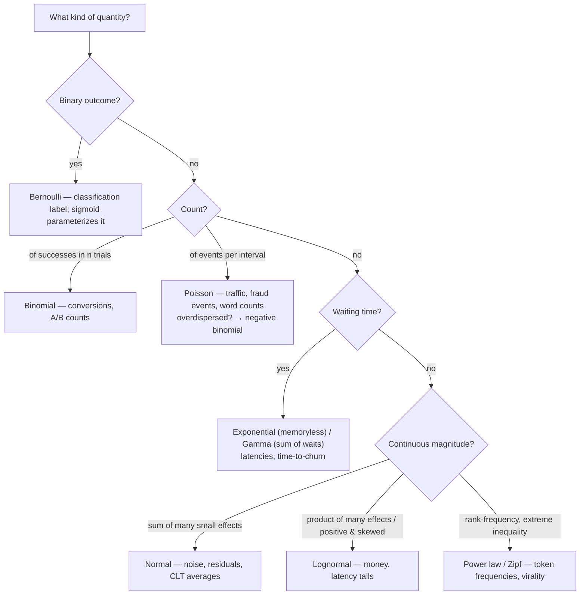
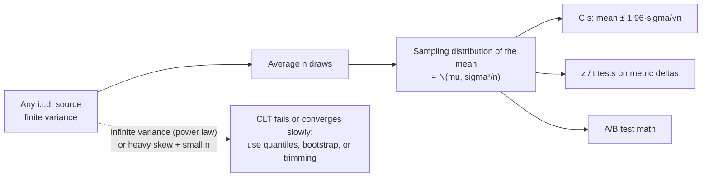

# Probability Foundations and Distributions

Every quantity an ML system touches — a label, a click, a latency, a token, a loss — is a draw from some distribution, and every modeling choice quietly assumes which one. Choose MSE and you have assumed Gaussian noise; put a sigmoid on your output and you have assumed a Bernoulli label; average a latency and you have assumed the mean exists and is stable. This guide rebuilds the foundations — random variables, the expectation algebra, the distribution zoo, the Central Limit Theorem, and the joint/marginal/conditional machinery — with each piece pinned to the exact place it appears in a production ML system.

For an actuarial reader most of the raw math is review; the new muscle is the mapping. By the end you should be able to look at any column in a dataset and say which distribution family it belongs to, what that implies about the right loss and the right summary statistic, and which standard tools (means, z-tests, MSE) will silently fail on it.

Part of the [Senior AI Engineer Roadmap](../00-Senior-AI-Engineer-Roadmap.md) — Phase 1.

---

## 1. Random Variables, PMF, PDF, CDF

A **random variable** X is a function from outcomes to numbers. Everything else is bookkeeping about how probability mass is spread across those numbers:

- **PMF** (discrete): `p(x) = P(X = x)`, with `Σₓ p(x) = 1`. Labels, counts, token IDs.
- **PDF** (continuous): `f(x) ≥ 0` with `∫ f(x) dx = 1`; probabilities come only from integrals, `P(a ≤ X ≤ b) = ∫ₐᵇ f(x) dx`, and `P(X = x) = 0` for any single point. Latencies, amounts, embeddings.
- **CDF** (both): `F(x) = P(X ≤ x)` — monotone, right-continuous, `F(-∞)=0`, `F(∞)=1`. The CDF is the universal interface: quantiles are its inverse (`Q(u) = F⁻¹(u)`), and `F(X) ~ Uniform(0,1)` (probability integral transform) is the trick behind inverse-transform sampling, Q-Q plots, and copulas.

The ML relevance of the CDF is underrated: **percentile metrics are CDF reads**. "p99 latency = 840 ms" means `F(840) = 0.99`. A model score's CDF over production traffic is exactly what a threshold slices: flag rate at threshold t is `1 - F(t)`. Monitoring score distribution drift = monitoring `F`.

```python
import numpy as np
from scipy import stats

rng = np.random.default_rng(42)

# Inverse-transform sampling: any distribution from Uniform(0,1) via F^{-1}
u = rng.uniform(0, 1, 100_000)
lam = 2.0                            # exponential rate
x = -np.log(1 - u) / lam             # F(x) = 1 - exp(-lam x)  =>  F^{-1}(u) = -ln(1-u)/lam
print(f"mean {x.mean():.3f} (theory {1/lam})")        # mean 0.500 (theory 0.5)
print(f"P(X<=1) {np.mean(x <= 1):.3f} (theory {1 - np.exp(-2):.3f})")  # 0.865 (theory 0.865)

# Probability integral transform: F(X) is uniform — basis of Q-Q plots
z = rng.normal(0, 1, 100_000)
pit = stats.norm.cdf(z)
print(f"PIT looks uniform: KS p-value = {stats.kstest(pit, 'uniform').pvalue:.2f}")  # > 0.05
```

---

## 2. Expectation, Variance, Covariance — the Algebra, Proved

### 2.1 Definitions

```text
E[X]   = Σ x p(x)            (discrete)     or   ∫ x f(x) dx        (continuous)
Var(X) = E[(X - E[X])²]
Cov(X,Y) = E[(X - E[X])(Y - E[Y])]
```

### 2.2 Linearity of Expectation — proof, and why it is the workhorse

Claim: `E[aX + bY] = aE[X] + bE[Y]`, **with no independence assumption whatsoever**.

Proof (discrete case; the continuous case swaps sums for integrals):

```text
E[aX + bY] = Σₓ Σ_y (ax + by) p(x, y)                      (definition, joint PMF)
           = a Σₓ Σ_y x p(x, y)  +  b Σₓ Σ_y y p(x, y)      (split the sum)
           = a Σₓ x [Σ_y p(x, y)] + b Σ_y y [Σₓ p(x, y)]    (reorder finite sums)
           = a Σₓ x p_X(x)       + b Σ_y y p_Y(y)           (inner sums are the marginals)
           = a E[X] + b E[Y]                                 ∎
```

At no step did we need `p(x,y) = p_X(x)p_Y(y)`. This is why linearity works on arbitrarily dependent quantities — the expected total loss of a minibatch is the sum of per-example expected losses even though examples share the model; the expected number of fraud alerts today is the sum of per-transaction flag probabilities even though transactions are correlated.

### 2.3 The variance identity and its consequences

Claim: `Var(X) = E[X²] - (E[X])²`.

```text
Var(X) = E[(X - μ)²]                where μ = E[X]
       = E[X² - 2μX + μ²]           (expand the square)
       = E[X²] - 2μE[X] + μ²        (linearity; μ is a constant)
       = E[X²] - 2μ² + μ²
       = E[X²] - μ²                  ∎
```

Since `Var(X) ≥ 0`, this also proves `E[X²] ≥ (E[X])²` (Jensen for the square).

Variance of a sum — this one **does** care about dependence:

```text
Var(X + Y) = E[(X + Y - μ_X - μ_Y)²]
           = E[((X-μ_X) + (Y-μ_Y))²]
           = E[(X-μ_X)²] + 2E[(X-μ_X)(Y-μ_Y)] + E[(Y-μ_Y)²]
           = Var(X) + 2Cov(X,Y) + Var(Y)
```

For the mean of n i.i.d. draws, `Var(X̄) = σ²/n` — **the single most-used fact in ML evaluation**: it is why metric noise shrinks like `1/√n`, why small eval sets lie, and why ensembling m decorrelated models divides variance by up to m. When the terms are *positively correlated* (ensemble members trained on the same data, metrics computed on overlapping windows), the covariance term keeps variance from shrinking — averaging correlated things helps less than you hope:

```text
Var(mean of m models, pairwise correlation ρ, each variance σ²)
  = σ²/m + (m-1)/m · ρσ²   →   ρσ²  as m → ∞      (variance floor set by correlation)
```

```python
rng = np.random.default_rng(0)
sigma2, rho, m = 1.0, 0.6, 50
# Build m correlated "model errors": shared component + individual component
shared = rng.normal(0, np.sqrt(rho * sigma2), 200_000)
errs = shared[:, None] + rng.normal(0, np.sqrt((1 - rho) * sigma2), (200_000, m))
print(f"var of 1 model     {errs[:, 0].var():.3f}")        # ~1.000
print(f"var of mean of 50  {errs.mean(axis=1).var():.3f}") # ~0.608 — floor at rho*sigma^2, not 1/50
```

### 2.4 Covariance algebra

From linearity: `Cov(aX + b, cY + d) = ac·Cov(X, Y)` (constants shift means, cancel in the centered products). Correlation is covariance made scale-free:

```text
ρ(X,Y) = Cov(X,Y) / (σ_X σ_Y)   ∈ [-1, 1]     (Cauchy-Schwarz gives the bounds)
```

PCA is nothing but the eigendecomposition of the covariance matrix; multicollinearity in linear models is near-singular covariance; feature redundancy screening is a covariance read.

---

## 3. The Distribution Zoo, Mapped to Its ML Homes



### 3.1 Bernoulli(p) — the atom of classification

`P(X=1)=p, P(X=0)=1-p`; `E[X]=p`; `Var(X)=p(1-p)` (maximized at p=0.5 — balanced classes are the *noisiest* per example). Every binary label is Bernoulli; a sigmoid output is an estimate of its parameter; binary cross-entropy is its negative log-likelihood (derived fully in [Guide 3](./03-Estimation-MLE-and-Loss-Functions.md)).

### 3.2 Binomial(n, p) — counts of successes

Sum of n i.i.d. Bernoullis. `E=np`, `Var=np(1-p)`. Home: conversion counts per arm in A/B tests, clicks per ad slot, positives per evaluation fold. The `√(p(1-p)/n)` standard error of a rate follows directly and drives every sample-size calculation in [Guide 4](./04-Statistical-Inference-and-Testing.md).

### 3.3 Poisson(λ) — event rates

Limit of Binomial(n, λ/n) as n→∞: many opportunities, each tiny probability. `E = Var = λ` — that equality is a *testable assumption*: real event counts (fraud per merchant, requests per second, words per document) are usually **overdispersed** (Var > mean) because rates themselves vary across units; then negative binomial (a Gamma-mixed Poisson) fits better. Homes: traffic modeling, capacity planning, count regression with a log link, rare-event alerting.

### 3.4 Exponential(λ) and Gamma(k, θ) — waiting times

Exponential is the waiting time to the first Poisson event: `f(x)=λe^{-λx}`, `E=1/λ`. Its defining property is **memorylessness**: `P(X > s+t | X > s) = P(X > t)` — having waited doesn't change the remaining wait. Real latencies are *not* memoryless (a request slow so far is likely stuck behind a GC pause or a retry storm), which is precisely why exponential is a baseline to test against, not to assume. Gamma is the sum of k exponentials — total service time across k sequential stages; also the conjugate prior for Poisson rates ([Guide 2](./02-Bayes-and-Bayesian-Reasoning.md)).

### 3.5 Normal(μ, σ²) — the CLT's gift

Sums and averages of many small independent effects. Homes: residual noise (the assumption behind MSE), weight initialization, the sampling distribution of nearly every evaluation metric, z-based confidence intervals. Its tails die like `e^{-x²/2}`: a 6σ event is a once-per-500-million draw. When your monitoring pages on "6σ" events daily, the distribution is not normal — the model of the noise is wrong, not the world.

### 3.6 Lognormal — money and latency tails

X is lognormal iff log X is normal — the product of many small multiplicative effects (each service stage multiplies delay; each growth period multiplies wealth). Mean is dragged far above the median: for `LN(μ, σ²)`, `median = e^μ` but `mean = e^{μ+σ²/2}`.

```python
rng = np.random.default_rng(7)
lat = rng.lognormal(mean=4.0, sigma=1.0, size=1_000_000)   # latencies in ms
print(f"median {np.median(lat):.0f}  mean {lat.mean():.0f}  p99 {np.percentile(lat, 99):.0f}")
# median ~55  mean ~90  p99 ~560   — mean is 64% above median; p99 is 10x the median
frac_above_mean = np.mean(lat > lat.mean())
print(f"fraction of requests above the mean: {frac_above_mean:.2f}")   # ~0.31
```

Averaging latencies reports a number that ~70% of requests beat — dashboards must use quantiles. Modeling money or latency with MSE makes the model chase the tail; log-transform the target first (turning multiplicative noise additive and Gaussian) or use quantile loss.

### 3.7 Power laws and Zipf — language and virality

`P(X ≥ x) ∝ x^{-α}`. Token frequencies follow Zipf's law (frequency ∝ 1/rank): a handful of tokens dominate, and the vocabulary has an enormous tail of rare tokens — the reason subword tokenizers (BPE) exist, the reason embedding tables for rare items are undertrained, the reason "average user" is a fiction in engagement data. For small α, variance (or even the mean) may not exist — sample means never settle, and the CLT's preconditions fail or convergence is glacial.

```python
rng = np.random.default_rng(3)
# Zipf check on a synthetic corpus: frequency vs rank on log-log axes is a straight line
tokens = rng.zipf(a=1.8, size=1_000_000)
vals, counts = np.unique(tokens, return_counts=True)
ranks = np.argsort(-counts)
top = counts[ranks][:1000]
slope = np.polyfit(np.log(np.arange(1, 1001)), np.log(top), 1)[0]
print(f"log-log slope ~ {slope:.2f}")     # ~ -1.2 : straight line => power law
print(f"top 10 token types cover {counts[ranks][:10].sum()/1e6:.1%} of the corpus")  # ~ 60%+
```

---

## 4. The Central Limit Theorem, Demonstrated

**Statement.** If X₁,…,Xₙ are i.i.d. with mean μ and *finite* variance σ², then

```text
√n (X̄ₙ - μ) / σ  →  N(0, 1)   in distribution as n → ∞
```

Equivalently: `X̄ₙ ≈ N(μ, σ²/n)` for large n, *whatever the shape of X*. This single theorem is why metric averages have bell-shaped noise, why `±1.96·SE` intervals work for conversion rates, and why t-tests on means of horribly skewed quantities are still roughly valid at scale.

The two fine-print clauses that bite in production:

1. **Finite variance required.** Power-law data with α ≤ 2 has infinite variance — averages converge to stable laws, not normals, and "the mean over the last hour" never stabilizes.
2. **"Large n" depends on skewness.** For heavily skewed data (lognormal revenue), n = 30 folklore is wildly optimistic; the sampling distribution of the mean stays visibly skewed into the thousands.

```python
import numpy as np
rng = np.random.default_rng(1)

def sampling_dist_of_mean(draw, n, reps=20_000):
    """Simulate the distribution of the sample mean of n draws."""
    return draw((reps, n)).mean(axis=1)

# Source: exponential(1) — heavily skewed, mean 1, var 1
for n in [2, 10, 100, 1000]:
    means = sampling_dist_of_mean(lambda s: rng.exponential(1.0, s), n)
    skew = ((means - means.mean())**3).mean() / means.std()**3
    print(f"n={n:5d}  mean {means.mean():.3f}  sd {means.std():.4f} "
          f"(theory {1/np.sqrt(n):.4f})  skewness {skew:+.2f}")
# n=    2  mean 1.000  sd 0.7080 (theory 0.7071)  skewness +1.41
# n=   10  mean 1.000  sd 0.3163 (theory 0.3162)  skewness +0.63
# n=  100  mean 1.000  sd 0.1000 (theory 0.1000)  skewness +0.20
# n= 1000  mean 1.000  sd 0.0316 (theory 0.0316)  skewness +0.06
# Plot description: histogram of `means` morphs from a right-skewed spike (n=2)
# to a clean symmetric bell (n=1000) centered at 1 with width sigma/sqrt(n).

# Same experiment with lognormal(0, 2): skewness ~ +1.0 even at n=1000 —
# "n=30 is enough" fails badly for fat-tailed metrics like revenue per user.
means_ln = sampling_dist_of_mean(lambda s: rng.lognormal(0.0, 2.0, s), 1000)
skew_ln = ((means_ln - means_ln.mean())**3).mean() / means_ln.std()**3
print(f"lognormal(0,2), n=1000: skewness of the mean {skew_ln:+.2f}")   # ~ +1.0, still skewed
```



---

## 5. Joint, Marginal, Conditional

For two variables the entire probabilistic story is the **joint** `p(x, y)`. Everything else is derived:

```text
Marginal:     p(x) = Σ_y p(x, y)                       ("integrate out" what you don't care about)
Conditional:  p(y | x) = p(x, y) / p(x)                 (renormalized slice of the joint)
Chain rule:   p(x, y) = p(x) p(y | x) = p(y) p(x | y)
Independence: p(x, y) = p(x) p(y)  ⇔  p(y | x) = p(y)  (knowing x tells you nothing about y)
```

**Supervised learning is estimating a conditional:** a classifier approximates `p(y | x)`; a generative model approximates the joint `p(x, y)` (or `p(x)`); the difference is exactly the discriminative/generative split. An LLM factorizes the joint over tokens with the chain rule: `p(t₁,…,t_k) = Π p(tᵢ | t₁…tᵢ₋₁)` — autoregressive generation *is* the chain rule sampled left to right.

**Marginalization is where deployment surprises live.** A model learns `p(y|x)` but business metrics are marginals: `P(fraud alert) = Σₓ P(flag | x) p(x)` — change the traffic mix `p(x)` (new market, marketing campaign, bot wave) and the alert volume changes with **zero model change**. Most "the model broke" pages are actually "`p(x)` moved."

```python
rng = np.random.default_rng(9)
# Joint over (segment, click): two segments with different CTRs
p_seg = np.array([0.7, 0.3])            # p(x): traffic mix
ctr = np.array([0.02, 0.10])            # p(y=1|x): conditional the model learned
print(f"marginal CTR: {(p_seg * ctr).sum():.3f}")           # 0.038
p_seg_new = np.array([0.3, 0.7])        # campaign shifts the mix; model unchanged
print(f"after mix shift: {(p_seg_new * ctr).sum():.3f}")    # 0.076 — 'CTR doubled', no model change
```

---

## 6. Covariance vs Correlation vs Independence

The hierarchy, with the directions that hold and the ones that don't:

```text
Independence  ⇒  Cov(X,Y) = 0  ⇒  ρ = 0
Independence  ⇐  Cov = 0        FALSE in general   (the converse fails)
Independence  ⇐  Cov = 0        TRUE only for jointly Gaussian (X,Y)
```

Proof that independence kills covariance: if X ⫫ Y then `E[XY] = ΣΣ xy p(x)p(y) = (Σx p(x))(Σy p(y)) = E[X]E[Y]`, so `Cov = E[XY] − E[X]E[Y] = 0`.

**The canonical counterexample** — perfect dependence with zero correlation:

```python
rng = np.random.default_rng(0)
x = rng.uniform(-3, 3, 100_000)
y = x**2 + rng.normal(0, 0.3, 100_000)      # y is (almost) a deterministic function of x
r = np.corrcoef(x, y)[0, 1]
print(f"Pearson r(x, y)      = {r:+.3f}")              # ~ +0.00  — 'no relationship'
print(f"Pearson r(x^2, y)    = {np.corrcoef(x**2, y)[0,1]:+.3f}")   # ~ +0.99
# Mutual dependence is total; the *linear* projection of it is zero because
# E[XY] = E[X^3] = 0 by symmetry. Correlation only sees lines.
```

Production consequences:

- **Feature selection by correlation throws away nonlinear signal.** A Pearson screen would drop x above; a tree or NN would exploit it fully. Use mutual information, distance correlation, or just model-based importance for screening.
- **Spearman vs Pearson:** Spearman (rank correlation) catches any monotone relation and resists outliers — the right default for skewed production metrics.
- **"Uncorrelated features" ≠ "independent features"** in whitened/PCA'd data — PCA decorrelates, it does not de-depend, unless the data is Gaussian.

---

## 7. Production War Stories & Failure Modes

### 7.1 The dashboard mean that no one experienced

**Symptom.** SLO dashboard shows mean inference latency 92 ms, comfortably under the 150 ms target. Customer complaints about slowness keep arriving.
**Investigation.** Pulled raw latency histogram instead of the pre-aggregated mean. Distribution is lognormal-ish: median 55 ms, p95 310 ms, p99 900 ms.
**Root cause.** Latency is fat-tailed; the mean sits at the ~69th percentile and is dominated by a tail the SLO never looked at. Worse, upstream fan-out means a user request touches 10 model calls — the user sees the *max* of 10 draws, so `P(user hits a >p95 call) = 1 − 0.95¹⁰ ≈ 40%`.
**Fix.** SLOs rewritten on p95/p99 per call *and* per user journey; tail-specific fixes (request hedging, timeout tuning) rather than mean-shaving.
**Prevention.** Never aggregate a skewed quantity with a mean on a dashboard; store histograms/sketches (t-digest), alert on quantiles; for fan-out systems compute the user-level tail explicitly.

### 7.2 The 6σ alert that fired every day

**Symptom.** Anomaly detector on transaction volume, thresholded at mean + 6σ ("once in 500M" events), pages on-call several times a week.
**Investigation.** Volume per merchant is heavy-tailed (a few whales) and per-hour counts are overdispersed relative to Poisson (Var/mean ≈ 40, not 1). The z-score machinery assumed normality that never held.
**Root cause.** Normal tails die like `e^{-x²/2}`; power-law/overdispersed tails die polynomially. "6σ" under the wrong distribution is not rare at all.
**Fix.** Replaced z-scores with empirical quantile thresholds per merchant segment, and modeled counts with a negative binomial (fit dispersion, alert on tail probability under the fitted model).
**Prevention.** Before any σ-based threshold, test the distributional assumption: Var/mean ratio for counts, Q-Q plot against the assumed family for continuous data. Alert design starts with "what distribution is this?"

### 7.3 Ensembling that stopped helping at m = 5

**Symptom.** Team ensembles 25 gradient-boosted models; validation error is barely better than a 5-model ensemble, contradicting the "variance / m" pitch.
**Investigation.** Measured pairwise correlation of member errors: ρ ≈ 0.8 — all models trained on the same features, same data, near-identical hyperparameters.
**Root cause.** `Var(mean) = σ²/m + (1−1/m)ρσ² → ρσ²`. With ρ = 0.8 the variance floor is 80% of a single model's — members were 25 copies of the same opinion.
**Fix.** Diversified the ensemble: different feature subsets, different algorithm families, bagged data. ρ dropped to ~0.4 and the ensemble gain reappeared.
**Prevention.** Report member-error correlation alongside ensemble size; ensemble ROI is a function of ρ, not m.

### 7.4 The token tail that ate the embedding table

**Symptom.** Search relevance model performs well on frequent queries, embarrassingly on the long tail — which is 40% of traffic.
**Investigation.** Query token frequencies are Zipfian; 70% of vocabulary items appeared < 20 times in training. Their embeddings were essentially random initialization plus noise.
**Root cause.** Power-law data means "average behavior" is dominated by the head, while a large minority of *traffic* lives in a tail the model never effectively trained on. Aggregate metrics (weighted by frequency) hid the failure.
**Fix.** Subword fallback for rare tokens, frequency-stratified evaluation slices, and head/tail-specific metrics on the dashboard.
**Prevention.** For any Zipfian entity (tokens, users, items, merchants): always evaluate by frequency decile, never trust a single traffic-weighted aggregate.

---

## 8. Best Practices

- Identify the distribution family of every metric and target before choosing losses, aggregations, or alert thresholds — Bernoulli/Binomial → rates and BCE; counts → Poisson/negative binomial with a dispersion check; waiting times → exponential/Gamma/Weibull; money and latency → assume lognormal until proven otherwise; ranked entities → assume Zipf.
- Summarize skewed quantities with quantiles, not means; store histograms/sketches so quantiles are computable after the fact.
- Trust the CLT for rates and averages of well-behaved quantities at scale; distrust it for heavy-tailed data at small n and for anything power-law — bootstrap ([Guide 4](./04-Statistical-Inference-and-Testing.md)) when in doubt.
- Use `Var(X̄) = σ²/n` to sanity-check every metric delta: compute the standard error before reacting to a movement.
- Remember averaging correlated estimates hits a variance floor of ρσ² — measure error correlation before scaling an ensemble.
- Zero correlation is not independence: screen features with rank correlation or mutual information, not Pearson alone.
- Treat marginal-vs-conditional confusion as a debugging category: when an aggregate metric moves, check the traffic mix `p(x)` before blaming the model's `p(y|x)`.
- Test distributional assumptions in code (Var/mean for counts, Q-Q or Shapiro on logs for lognormality) — assumptions are hypotheses, not axioms.

---

## 9. Interview Drills

<details><summary>1. Prove linearity of expectation and explain why it needs no independence. Give an ML place where that matters.</summary>

Expand the definition over the joint: E[aX+bY] = ΣΣ(ax+by)p(x,y), split into aΣΣx·p(x,y) + bΣΣy·p(x,y), and note the inner sums collapse to the marginals: aΣx·p_X(x) + bΣy·p_Y(y) = aE[X]+bE[Y]. Independence never enters because we never factor p(x,y). ML relevance: expected minibatch loss = sum of per-example expected losses despite shared-model dependence; expected alert volume = sum of per-transaction flag probabilities despite correlated transactions.

Follow-up: *Does linearity hold for variance too?* No — Var(X+Y) = Var(X)+Var(Y)+2Cov(X,Y); the cross term needs uncorrelatedness (weaker than independence) to vanish.

Follow-up: *E[g(X)] vs g(E[X])?* Not equal in general; Jensen's inequality gives the direction for convex/concave g — e.g., E[log X] ≤ log E[X], which is why log-transforming a target changes what "unbiased" means after back-transforming.
</details>

<details><summary>2. Why is Var(X̄) = σ²/n the most important formula in ML evaluation?</summary>

It quantifies metric noise: any average-based metric on n examples has standard error σ/√n, so distinguishing two models requires their true gap to exceed roughly 2·√2·σ/√n. It explains why small eval sets produce unstable rankings, why halving noise costs 4x data, why per-segment metrics on small segments are untrustworthy, and why ensembling helps (averaging predictions is averaging estimators).

Follow-up: *When does it fail?* When draws are dependent (time-series metrics, users contributing many rows — use cluster-robust SEs or block bootstrap) and when σ² is infinite (power-law data — means never stabilize).

Follow-up: *Eval examples come from the same users repeatedly — what happens to your CI?* Effective sample size shrinks toward the number of users; naive CIs are too narrow, sometimes drastically. Cluster by user.
</details>

<details><summary>3. Map these to distributions and justify: click label, conversions per arm, requests per second, time between fraud events, revenue per user, token frequencies.</summary>

Click label → Bernoulli(p), p is what the sigmoid estimates. Conversions per arm → Binomial(n,p), basis of proportion tests. Requests/sec → Poisson(λ) baseline, but check Var/mean; overdispersion → negative binomial. Time between fraud events → exponential if the process is Poisson (memoryless), Gamma/Weibull if rates vary or aging matters. Revenue per user → lognormal-ish (multiplicative growth), mean >> median, use quantiles and log-transforms. Token frequencies → Zipf/power law; head dominates counts, tail dominates vocabulary.

Follow-up: *How would you test the Poisson assumption in one line?* Compare sample variance to sample mean; ratio >> 1 (say > 1.5-2 with reasonable n) indicates overdispersion. Formal option: chi-square dispersion test.
</details>

<details><summary>4. State the CLT precisely, including the fine print, and give one production scenario where each clause bites.</summary>

For i.i.d. Xᵢ with mean μ and finite variance σ², √n(X̄−μ)/σ → N(0,1). Fine print: (a) finite variance — power-law revenue/engagement data with tail exponent ≤ 2 has infinite variance, so hourly means never stabilize and z-intervals are meaningless; (b) convergence speed depends on skewness — lognormal revenue means stay visibly skewed at n=1000, so "n=30" folklore under-covers; (c) i.i.d. — autocorrelated time series and per-user clustering break the √n rate.

Follow-up: *Your A/B metric is revenue per user, heavily skewed. Options?* Larger n; log-transform or winsorize (changes the estimand — say so); bootstrap the difference; or use a rank-based test (Mann-Whitney) accepting it tests a different hypothesis.
</details>

<details><summary>5. Give a concrete example where correlation is zero but dependence is total. What does this imply for feature screening?</summary>

X ~ Uniform(−3,3), Y = X². Pearson r ≈ 0 because E[XY]=E[X³]=0 by symmetry, yet Y is a function of X. Correlation measures only linear association. Implication: correlation-based feature screens discard nonlinearly predictive features; use mutual information, distance correlation, or model-based importance (e.g., permutation importance with a tree model) instead. Also the converse caution: high correlation between features signals redundancy for *linear* models but trees can still extract complementary splits.

Follow-up: *When does zero correlation imply independence?* When (X,Y) is jointly Gaussian — the Gaussian's dependence is entirely linear. PCA-whitened non-Gaussian data is decorrelated but generally still dependent (this gap is exactly what ICA exploits).
</details>

<details><summary>6. Your mean latency is 92 ms but users complain. Diagnose with distribution language.</summary>

Latency is right-skewed (lognormal-like): mean sits above the median and far below the tail. Check quantiles: median may be 55 ms while p99 is 900 ms. With fan-out (k parallel/sequential model calls per user request) the user experiences a max or sum of draws: P(user hits at least one >p95 call) = 1−0.95^k ≈ 40% at k=10. So a healthy mean coexists with a broadly painful tail.

Follow-up: *Which statistic goes in the SLO?* Per-call p95/p99 plus an end-to-end user-journey quantile; means only for capacity math. Follow-up: *How do you store data to compute p99 cheaply at scale?* Mergeable quantile sketches (t-digest, DDSketch) — exact quantiles don't aggregate across shards, sketches do.
</details>

<details><summary>7. Derive Var(X) = E[X²] − (E[X])², then use it to explain why balanced classes are the noisiest for a Bernoulli label.</summary>

Expand E[(X−μ)²] = E[X²] − 2μE[X] + μ² = E[X²] − μ². For Bernoulli, E[X²] = E[X] = p (since X² = X), so Var = p − p² = p(1−p), maximized at p = 0.5 with value 0.25. Interpretation: per-example label noise is largest at 50/50; rates near 0 or 1 are individually low-variance, but rare-event *metrics* are noisy because the effective count of the minority class (np) is small — two different noise mechanisms interviewers like to see separated.

Follow-up: *So which A/B test needs more users: base rate 50% or 4%, same relative lift?* The 4% one, by far — the detectable absolute effect shrinks with p while SE shrinks only like √(p(1−p)); sample size scales roughly like p(1−p)/Δ², and Δ = 0.1p shrinks quadratically.
</details>

<details><summary>8. What is the probability integral transform and where does it show up in ML practice?</summary>

If X has continuous CDF F, then F(X) ~ Uniform(0,1). Uses: inverse-transform sampling (generate U, apply F⁻¹); Q-Q and P-P plots for assumption checking; copulas (model marginals and dependence separately — an actuarial standard that transfers directly to correlated risk features); calibration diagnostics for probabilistic forecasts (PIT histograms should be flat for a well-calibrated predictive distribution — the regression analogue of the reliability diagrams in Guide 5).

Follow-up: *Your PIT histogram is U-shaped. What does it mean?* The predictive distribution is too narrow (overconfident) — observed outcomes land in its tails too often. Hump-shaped means too wide (underconfident).
</details>

<details><summary>9. Alert volume doubled overnight but the model wasn't changed. Walk through marginal vs conditional reasoning.</summary>

Alert volume is a marginal: P(flag) = Σₓ P(flag|x)p(x). Two suspects: the conditional P(flag|x) (model or feature pipeline changed) or the mix p(x) (traffic changed). Since the model didn't change, check p(x): new geography launched, bot wave, marketing campaign, an upstream filter failed and let different traffic through, or a feature outage shifted scores (which is a conditional change in disguise — the *effective* model changed even though weights didn't). Diagnose by slicing flag rate within fixed segments: if per-segment rates are stable but the segment mix moved, it's p(x).

Follow-up: *Per-segment rates are stable, mix moved. Do you retrain?* No — the model's conditional is intact. You resize the review team or re-derive thresholds; retraining on the new mix changes nothing about P(flag|x) except adapting the prior, which you should do deliberately, not reflexively.
</details>

<details><summary>10. Why does an ensemble of 25 similar models barely beat 5? Give the formula and the fix.</summary>

Var(mean of m estimators with pairwise correlation ρ) = σ²/m + (1−1/m)ρσ², which → ρσ² as m→∞. With ρ near 1, extra members add almost nothing — the floor is set by correlation, not count. Fix: reduce ρ — different algorithm families, feature subsets, data bags, seeds with genuinely different augmentation; measure member-error correlation to verify.

Follow-up: *Does this bias-variance logic say anything about bagging vs boosting?* Bagging attacks variance (averaging decorrelated high-variance trees); boosting attacks bias (sequentially fitting residuals with high-bias learners) and can *increase* variance/overfit if run too long — so the ensemble diagnostic differs: for bagging check ρ, for boosting check the train/validation gap versus rounds.
</details>

<details><summary>11. When is the sample mean simply the wrong estimator to report, even with lots of data?</summary>

(a) Infinite-variance power laws: the mean estimator never converges (or converges without a CLT), so it jumps whenever a new extreme arrives — report quantiles or trimmed/winsorized means. (b) Heavily skewed finite-variance data where the mean answers no user-facing question (latency: mean is dominated by tail, experienced by a minority). (c) Multimodal mixtures (two user populations): the mean sits between modes describing nobody. (d) Data with a changing distribution — a mean over a drifting window mixes regimes. The right response is always: what decision does the number feed? Capacity planning genuinely wants means (sums = n × mean); user experience wants quantiles; risk wants tail probabilities.

Follow-up: *Winsorizing changed your A/B result from significant to not. Which is right?* Neither is "right" — they estimate different estimands (winsorized mean vs mean). The pre-registered one is the answer; deciding after seeing both is p-hacking (Guide 4).
</details>

<details><summary>12. Explain memorylessness. Why are real latencies not memoryless, and what does that imply for timeout design?</summary>

Exponential: P(X > s+t | X > s) = P(X > t) — elapsed waiting carries no information. Real latencies violate this: a request slow so far is disproportionately likely to be stuck (lock contention, GC, retry storm, cold cache), so conditional remaining time *grows* with elapsed time — the hazard rate is decreasing (heavier than exponential). Implication: hedged requests (fire a duplicate after p95 elapsed) are hugely effective precisely because a request past p95 is likely stuck, not almost-done; and static timeouts should be set from conditional tail behavior, not from the unconditional mean.

Follow-up: *Which distribution would you fit instead?* Weibull with shape < 1 or lognormal both give decreasing hazard; fit both, compare via log-likelihood on holdout, and validate the conditional-tail predictions directly since that's the decision-relevant quantity.
</details>

<details><summary>13. A junior says "our features are uncorrelated after PCA, so they're independent — naive Bayes assumptions hold." Correct them.</summary>

PCA decorrelates (diagonal covariance) but independence requires the joint to factor, which is strictly stronger for non-Gaussian data. Example: X uniform, Y = X² can appear in rotated form with zero correlation yet full dependence. Only for jointly Gaussian data does decorrelation imply independence. Naive Bayes' conditional-independence assumption is about independence *given the class*, which PCA (fit unconditionally) does nothing to ensure. Practically, naive Bayes often works despite violated assumptions because classification needs only the argmax to be right — but its probabilities become badly overconfident (calibration, Guide 5).

Follow-up: *What transformation would target independence?* ICA seeks statistically independent components by maximizing non-Gaussianity — the difference between ICA and PCA is exactly the correlation/independence gap.
</details>

<details><summary>14. Your count-based anomaly detector uses mean + 3σ thresholds and fires constantly. Diagnose and redesign.</summary>

Diagnosis: counts are overdispersed relative to Poisson (rates vary by entity/time), and the aggregate distribution is heavy-tailed, so σ-thresholds calibrated on normal tails fire orders of magnitude more often than intended. Check Var/mean ratio; inspect a Q-Q plot. Redesign: (1) model counts per entity with negative binomial (fit r, p; alert when P(count ≥ observed) < α under the fitted model); (2) or go nonparametric: empirical per-entity quantile thresholds with seasonality adjustment; (3) size α from alert-budget math — expected alerts/day = Σ per-entity α — the linearity-of-expectation calculation that turns statistics into an on-call staffing decision.

Follow-up: *Why per-entity rather than global thresholds?* Mixture of heterogeneous rates makes the global distribution fat even if each entity is well-behaved — a whale merchant's normal Tuesday exceeds a small merchant's worst-ever hour. Global thresholds are simultaneously too tight for whales and too loose for minnows.
</details>

<details><summary>15. Sketch how you'd verify, with simulation, that a claimed variance formula is right. Why is this habit worth having?</summary>

Pattern: (1) fix a ground-truth generative process with known parameters; (2) draw many replicate datasets; (3) compute the estimator on each; (4) compare the empirical variance across replicates to the formula. Example: verify Var(X̄)=σ²/n by drawing 20,000 samples of size n from exponential(1) and checking the SD of means against 1/√n (matches to three decimals). Worth having because production statistics constantly composes assumptions (independence, finite variance, stationarity) that fail quietly; a 10-line simulation catches wrong formulas, wrong CIs, and wrong test behavior before they misprice a launch decision. Every derivation in this track ships with its simulation for exactly this reason.

Follow-up: *Simulation agrees with theory but production disagrees. What now?* The generative model is wrong, not the algebra — hunt for the violated assumption: dependence (cluster/user effects), heavy tails, drift, selection in how the data reached you (Guide 6's sampling-bias catalogue is the checklist).
</details>

---

Next: [Bayes and Bayesian Reasoning](./02-Bayes-and-Bayesian-Reasoning.md), where conditional probability becomes the operating system for decisions under uncertainty. Back to the [track index](./README.md).
