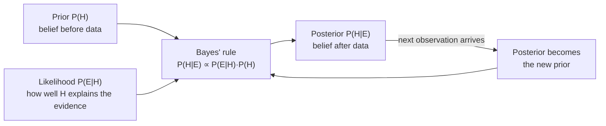
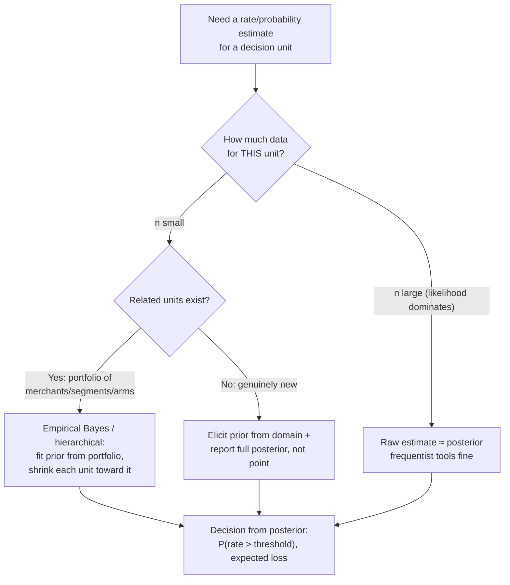

# Bayes and Bayesian Reasoning

Bayes' theorem is a one-line consequence of the definition of conditional probability, and yet it is the single most operationally important equation in production ML: it explains why a 95%-recall fraud model produces mostly false alarms, why raw per-merchant rates from 30 transactions are garbage, why regularization works, how spam filters accumulate evidence, and how to read an A/B test as a probability statement a product manager can actually use. Frequentist machinery answers "what does this dataset say?"; Bayesian machinery answers "what should I believe, combining this dataset with what I already knew?" — and production systems constantly face decisions where the dataset alone is too small to answer.

For an actuarial reader this is home turf — credibility theory *is* Bayesian shrinkage — so this guide moves fast on the math and slow on the ML wiring: base rates and alert precision, sequential evidence accumulation, conjugate updating for CTR/fraud rates, Bayesian A/B reads, naive Bayes from scratch, and the cold-start/shrinkage patterns that separate senior answers from junior ones.

Part of the [Senior AI Engineer Roadmap](../00-Senior-AI-Engineer-Roadmap.md) — Phase 1.

---

## 1. Bayes' Theorem, Derived

Everything follows from the definition of conditional probability:

```text
P(A | B) = P(A ∩ B) / P(B)          (definition, requires P(B) > 0)
```

Read `P(A ∩ B)` two ways:

```text
P(A ∩ B) = P(A | B) P(B)            (condition on B)
P(A ∩ B) = P(B | A) P(A)            (condition on A)
```

Set them equal and divide:

```text
P(A | B) = P(B | A) P(A) / P(B)      ∎   (Bayes' theorem)
```

The denominator is expanded with the **law of total probability** over a partition {A, ¬A}:

```text
P(B) = P(B | A) P(A) + P(B | ¬A) P(¬A)
```

In ML vocabulary, with hypothesis H and observed evidence E:

```text
P(H | E)  =  P(E | H) · P(H) / P(E)
posterior =  likelihood · prior / evidence
```

The evidence `P(E)` is just the normalizer — it doesn't depend on H, which is why you will constantly see the proportional form `posterior ∝ likelihood × prior` and why classifiers can compare unnormalized posteriors across classes.



That loop at the bottom — *today's posterior is tomorrow's prior* — is the entire mechanism behind sequential updating (Section 3), online learning of rates, and Thompson sampling.

---

## 2. The Base-Rate Fallacy, Fully Worked

The most consequential Bayes calculation in industry: **how good are my model's alerts, really?**

Setup: a fraud model with 90% recall (sensitivity) and a 1% false-positive rate, deployed where fraud prevalence is **0.1%**. Intuition says "90% accurate model, alerts are mostly right." Bayes says otherwise. Push 1,000,000 transactions through and count every cell:

| | Fraud (1,000) | Legit (999,000) | Row total |
| --- | --- | --- | --- |
| **Flagged** | TP = 0.90 × 1,000 = **900** | FP = 0.01 × 999,000 = **9,990** | 10,890 |
| **Not flagged** | FN = 100 | TN = 989,010 | 989,110 |
| **Column total** | 1,000 | 999,000 | 1,000,000 |

```text
Precision = P(fraud | flag) = TP / (TP + FP) = 900 / 10,890 ≈ 0.0826
```

**8.3% of alerts are real.** Eleven analysts review alerts; ten of them are wasting their time. Nothing is wrong with the model — recall and FPR are properties of the model, but precision is a property of the model *and the prevalence*, and at 0.1% prevalence the enormous legitimate class feeds the FP cell 999× harder than the fraud class feeds the TP cell.

The same model across markets:

```python
import numpy as np

def precision(prevalence, recall=0.90, fpr=0.01):
    tp = recall * prevalence
    fp = fpr * (1 - prevalence)
    return tp / (tp + fp)

for prev in [0.10, 0.01, 0.001, 0.0001]:
    print(f"prevalence {prev:>7.2%} -> alert precision {precision(prev):6.1%}")
# prevalence  10.00% -> alert precision  90.9%
# prevalence   1.00% -> alert precision  47.6%
# prevalence   0.10% -> alert precision   8.3%
# prevalence   0.01% -> alert precision   0.9%
```

Three orders of magnitude of prevalence swing precision from "trust the alert" to "ignore the alert" **with an identical model**. Senior consequences:

- **Review capacity** must be sized from precision-at-prevalence, not from the confusion matrix on a rebalanced offline set.
- A model validated in a high-fraud market **will disappoint** in a low-fraud one; nobody changed the model.
- At very low prevalence, cutting FPR (even at some recall cost) usually improves operations more than raising recall — the FP term dominates the denominator.
- This is precisely *why class imbalance matters*: imbalance is a base-rate statement, and Bayes converts it into precision collapse.

---

## 3. Sequential Updating: Evidence Compounds Multiplicatively

Bayes chains. If evidence arrives in pieces E₁, E₂, … that are conditionally independent given H, the posterior after each piece becomes the prior for the next. The clean way to run the chain is in **odds** form. Define odds `O(H) = P(H)/P(¬H)`. Dividing Bayes' rule for H by Bayes' rule for ¬H kills the evidence term:

```text
P(H|E)/P(¬H|E) = [P(E|H)/P(E|¬H)] · [P(H)/P(¬H)]
posterior odds  =  likelihood ratio  ×  prior odds
```

Each new conditionally-independent piece of evidence just multiplies on another likelihood ratio — or **adds a log-likelihood-ratio**, which is how real systems implement it.

### 3.1 A Spam Filter, Updating Word by Word

```python
import numpy as np

# P(word appears | spam) / P(word appears | ham), estimated from a labeled corpus
likelihood_ratio = {"free": 6.0, "wire": 9.0, "urgent": 4.0,
                    "meeting": 0.2, "attached": 0.5, "invoice": 1.5}

def spam_posterior(words, prior_spam=0.40):
    log_odds = np.log(prior_spam / (1 - prior_spam))      # prior odds 2:3
    for w in words:
        lr = likelihood_ratio.get(w, 1.0)                 # unknown word: no evidence
        log_odds += np.log(lr)
        p = 1 / (1 + np.exp(-log_odds))
        print(f"  after {w!r:<11} LR={lr:>4}  P(spam) = {p:.3f}")
    return 1 / (1 + np.exp(-log_odds))

print("Email: 'free wire urgent meeting'")
spam_posterior(["free", "wire", "urgent", "meeting"])
#   after 'free'      LR= 6.0  P(spam) = 0.800
#   after 'wire'      LR= 9.0  P(spam) = 0.973
#   after 'urgent'    LR= 4.0  P(spam) = 0.993
#   after 'meeting'   LR= 0.2  P(spam) = 0.966
```

Every observation nudges the log-odds by log(LR): strong evidence for spam ("wire", +2.2 nats), mild evidence against ("meeting", −1.6 nats). Notes with production teeth:

- Working in log space is not cosmetic — multiplying 500 word likelihoods underflows float64; adding 500 log-ratios does not (Guide 3, log-sum-exp).
- The conditional-independence assumption ("naive") is false for language, so the chain **over-counts correlated evidence** — "free" and "winner" co-occurring is not two independent clues. The posterior direction is usually right; its magnitude is overconfident. This is exactly why naive Bayes needs calibration (Guide 5).
- A stable prior matters: the same words under a 5% spam prior end at a much lower posterior. Deploying a filter trained under one base rate into an inbox with another is the base-rate fallacy again.

---

## 4. Conjugate Priors: Beta-Binomial End to End

For binomial data there is a prior family that makes updating a two-line operation. The **Beta(α, β)** density on p ∈ (0,1):

```text
f(p) = p^(α-1) (1-p)^(β-1) / B(α, β)
mean = α / (α + β)
```

Observe k successes in n Bernoulli trials — likelihood `L(p) ∝ p^k (1-p)^(n-k)`. Multiply prior by likelihood:

```text
posterior ∝ p^k (1-p)^(n-k) · p^(α-1) (1-p)^(β-1)
          = p^(α+k-1) (1-p)^(β+n-k-1)
```

That is the kernel of a Beta again — the family is **conjugate** to the binomial likelihood:

```text
Beta(α, β)  +  data (k successes, n−k failures)  →  Beta(α + k, β + n − k)
```

So α and β act as **pseudo-counts**: the prior is worth α+β imaginary trials. The posterior mean exposes the shrinkage explicitly:

```text
E[p | data] = (α + k)/(α + β + n)
            = w · (k/n)  +  (1 − w) · α/(α+β),    where  w = n/(α + β + n)
```

A **credibility-weighted average** of the raw rate and the prior mean — literally the actuarial credibility formula with credibility factor `w = n/(n + K)`, K = α+β.

### 4.1 CTR Estimation for a New Ad Creative

```python
import numpy as np
from scipy import stats

# Portfolio history: creatives average ~2% CTR, moderate spread -> Beta(2, 98)
alpha0, beta0 = 2, 98
prior = stats.beta(alpha0, beta0)

k, n = 13, 400                                # new creative: 13 clicks / 400 impressions
post = stats.beta(alpha0 + k, beta0 + n - k)  # Beta(15, 485)

w = n / (alpha0 + beta0 + n)
print(f"raw CTR        {k/n:.4f}")                      # 0.0325
print(f"prior mean     {prior.mean():.4f}")             # 0.0200
print(f"posterior mean {post.mean():.4f}")              # 0.0300
print(f"shrinkage w    {w:.2f} (data weight)")          # 0.80
print(f"95% credible interval ({post.ppf(0.025):.4f}, {post.ppf(0.975):.4f})")
# (0.0169, 0.0464)
print(f"P(CTR > 2.5%) = {1 - post.cdf(0.025):.2f}")     # 0.71 — a direct business answer

# Verify the conjugate algebra by brute-force grid integration
p_grid = np.linspace(1e-4, 0.2, 20_000)
unnorm = prior.pdf(p_grid) * p_grid**k * (1 - p_grid)**(n - k)
grid_mean = np.trapz(p_grid * unnorm, p_grid) / np.trapz(unnorm, p_grid)
print(f"grid-integrated posterior mean {grid_mean:.4f}")  # 0.0300 — matches
```

With 400 impressions the data gets 80% of the weight; with 20 impressions it would get ~17%, and a lucky 2-click streak would barely move the estimate. That refusal to be impressed by small n is the entire point.

### 4.2 Credible vs Confidence Intervals

They answer different questions and only accidentally look alike:

| | 95% **confidence** interval | 95% **credible** interval |
| --- | --- | --- |
| Random object | the *interval* (recomputed per sample) | the *parameter* (given this one sample) |
| Statement | "the procedure covers the true p in 95% of repeated samples" | "given the data and prior, P(p ∈ interval) = 0.95" |
| Valid to say "95% probability p is in here"? | **No** — p is fixed; the interval either contains it or not | **Yes** — that is its definition |
| Needs a prior? | No | Yes (and inherits its bias) |

```python
rng = np.random.default_rng(0)
p_true, n = 0.03, 400
covered = 0
for _ in range(10_000):                     # the frequentist guarantee is about repetition
    k = rng.binomial(n, p_true)
    se = np.sqrt(max(k/n * (1 - k/n), 1e-12) / n)
    covered += (k/n - 1.96*se) <= p_true <= (k/n + 1.96*se)
print(f"CI coverage over repeats: {covered/10_000:.3f}")   # ~0.93 (Wald CI undercovers at small p!)
```

Note the punchline: the textbook Wald interval *doesn't even hit its promised 93-95%* at small p and moderate n — use Wilson or Jeffreys (which is the Beta(½,½) credible interval, a quiet Bayesian victory inside frequentist practice).

---

## 5. Bayesian A/B Testing: P(B > A) by Monte Carlo

Frequentist tests return "p = 0.03", which stakeholders misread. The Bayesian read returns "there is a 97.8% probability B beats A, and the expected lift is X" — the question people actually asked. With Beta posteriors it is three lines of Monte Carlo:

```text
p_A ~ Beta(1 + k_A, 1 + n_A − k_A)         (uniform Beta(1,1) priors)
p_B ~ Beta(1 + k_B, 1 + n_B − k_B)
P(B > A) = ∫∫ 1[p_B > p_A] dPost(p_A) dPost(p_B)   ← estimate by sampling
```

```python
import numpy as np
rng = np.random.default_rng(42)

k_a, n_a = 620, 14_000        # control:   4.43% conversion
k_b, n_b = 690, 14_000        # treatment: 4.93%

S = 500_000
p_a = rng.beta(1 + k_a, 1 + n_a - k_a, S)
p_b = rng.beta(1 + k_b, 1 + n_b - k_b, S)

lift = p_b - p_a
print(f"P(B > A)              = {(p_b > p_a).mean():.3f}")          # ~0.978
print(f"expected abs lift     = {lift.mean():.4f}")                 # ~0.0050
print(f"95% credible interval = ({np.quantile(lift, .025):.4f}, "
      f"{np.quantile(lift, .975):.4f})")                            # ~(0.0002, 0.0098)
print(f"P(lift > 0.2% abs)    = {(lift > 0.002).mean():.3f}")       # ~0.89
# Expected loss if we ship B and it's actually worse (decision-theoretic stop rule):
print(f"expected loss of shipping B = {np.maximum(p_a - p_b, 0).mean():.6f}")  # ~1e-4
```

The **expected loss** line is the professional stopping rule: ship when the expected cost of a wrong ship decision falls below a pre-agreed threshold (e.g., 0.01% absolute conversion). Two honesty requirements, though: (1) the prior must be defensible — a strong optimistic prior on B manufactures wins; (2) Bayesian monitoring is *not* automatically immune to peeking — continuously watching `P(B>A)` and stopping at 0.95 still inflates wrong-ship rates unless the decision rule (expected-loss threshold, fixed prior) was committed to in advance. Guide 6 covers the frequentist version of this trap.

---

## 6. Naive Bayes, Derived and Built From Scratch

Classify document x = (w₁,…,w_d) into class c. Bayes:

```text
P(c | x) ∝ P(x | c) P(c)
```

`P(x | c)` is an exponentially large joint. The **naive** assumption — features conditionally independent given the class — factorizes it:

```text
P(x | c) ≈ Π_j P(w_j | c)
⇒  ĉ = argmax_c  [ log P(c) + Σ_j count_j · log P(w_j | c) ]     (multinomial NB, log space)
```

With MLE word probabilities, an unseen word gives `log 0 = −∞` and vetoes the class. **Laplace (add-one) smoothing** is the fix, and it is itself Bayesian: a Dirichlet(1,…,1) prior over the word distribution, i.e., pseudo-counts again:

```text
P(w | c) = (count(w, c) + 1) / (Σ_w' count(w', c) + V)        V = vocabulary size
```

```python
import numpy as np
from collections import Counter

train = [("free wire transfer urgent claim prize", 1),
         ("urgent free offer claim free prize now", 1),
         ("wire money now free free",               1),
         ("meeting notes attached see agenda",      0),
         ("please review the attached invoice",     0),
         ("agenda for the quarterly meeting",       0),
         ("see you at the meeting tomorrow",        0)]

docs   = [d.split() for d, _ in train]
labels = np.array([y for _, y in train])
vocab  = sorted({w for d in docs for w in d}); V = len(vocab)
w2i    = {w: i for i, w in enumerate(vocab)}

log_prior, log_lik = {}, {}
for c in (0, 1):
    class_docs = [d for d, y in zip(docs, labels) if y == c]
    counts = Counter(w for d in class_docs for w in d)
    total = sum(counts.values())
    log_prior[c] = np.log(len(class_docs) / len(docs))
    log_lik[c] = np.array([np.log((counts[w] + 1) / (total + V)) for w in vocab])

def predict_log_posterior(text):
    x = np.zeros(V)
    for w in text.split():
        if w in w2i: x[w2i[w]] += 1          # unseen-in-vocab words carry no evidence
    scores = {c: log_prior[c] + x @ log_lik[c] for c in (0, 1)}
    m = max(scores.values())                                  # log-sum-exp normalize
    Z = m + np.log(sum(np.exp(s - m) for s in scores.values()))
    return {c: np.exp(s - Z) for c, s in scores.items()}

for text in ["free prize claim now", "meeting agenda attached", "urgent wire the invoice"]:
    p = predict_log_posterior(text)
    print(f"{text!r:<28} P(spam) = {p[1]:.3f}")
# 'free prize claim now'       P(spam) = 0.998
# 'meeting agenda attached'    P(spam) = 0.005
# 'urgent wire the invoice'    P(spam) = 0.918
```

Why naive Bayes still earns a place in production: training is one counting pass (streamable, trivially updatable — the counts *are* the posterior); it is strong with tiny training sets because the independence assumption is a massive variance reducer (high bias, low variance — Guide 3); and it makes a superb latency-free baseline. Its posteriors, however, are systematically overconfident (correlated evidence double-counted), so **rank with them, but calibrate before thresholding on them**.

---

## 7. Bayesian Thinking Inside ML Systems

You rarely deploy a "Bayesian model"; you constantly deploy Bayesian *ideas*:

- **Cold start / small-n rates.** Any dashboard or feature that computes `events/exposure` per merchant, user, SKU, or region should ship shrunk estimates: `(α + k)/(α + β + n)` with α, β fit from the portfolio (empirical Bayes: match the portfolio mean and variance). Raw rates make the smallest cells the most extreme — always.
- **Shrinkage = regularization.** MAP estimation with a Gaussian prior is exactly L2 regularization (derived in Guide 3). Every ridge model you have shipped was a Bayesian posterior mode.
- **Hierarchical intuition.** Merchants nest in categories nest in countries. A hierarchical model lets a 30-transaction merchant borrow strength from its category, which borrows from the country. You can approximate this without an MCMC stack: shrink each level toward its parent with credibility weights `n/(n+K)`. That two-line approximation captures most of the value.
- **Exploration (Thompson sampling).** Maintain a Beta posterior per arm; each round, sample one p from each posterior and act on the argmax. Randomness scales with uncertainty, so exploration is automatic and self-extinguishing — the standard fix for recommender/bandit cold start.
- **Base-rate audits.** Any time a classifier crosses a prevalence boundary (new market, new segment, retrain window shift), rerun the Section 2 table before promising alert quality.



---

## Production War Stories & Failure Modes

### 1. The alert queue that ate the review team

**Symptom:** Fraud ops in a newly launched market escalates: "the model is broken here — 9 out of 10 alerts are false." Same model, same threshold, praised in the home market.
**Investigation:** Offline metrics identical across markets: recall 0.90, FPR 0.01, AUC unchanged. Feature distributions show no drift. Confusion: "nothing changed."
**Root cause:** Prevalence changed. Home market fraud rate 1.2% → alert precision ~52%. New market 0.08% → precision ~7%. Precision was never a model property; it was a model×prevalence property, and nobody re-ran the Bayes table at launch.
**Fix:** Raised the threshold in the new market to hit a target precision (accepting recall loss), and re-sized the review queue from predicted alert volume × expected precision.
**Prevention:** Launch checklist item: recompute the full flagged/unflagged × fraud/legit table under the target market's prevalence; alert-precision SLOs defined per market, not global.

### 2. The "best merchants" leaderboard of tiny merchants

**Symptom:** A risk dashboard ranking merchants by chargeback rate is dominated at both extremes by merchants nobody has heard of; the ops team starts manually excluding "weird" rows.
**Investigation:** Top-ranked merchant: 2 chargebacks in 3 transactions ("67% fraud rate!"). Every extreme entry has n < 20. Large merchants can't mathematically reach the top: with n = 50,000 the rate can't stray far from its truth.
**Root cause:** Raw rates have variance ∝ 1/n, so a rank on raw rates is a rank on sample size inverted — the smallest cells always look most extreme. Classic small-sample/no-shrinkage failure.
**Fix:** Empirical-Bayes shrinkage: fit Beta(α, β) to the portfolio's rate distribution (method of moments), rank by posterior mean `(α+k)/(α+β+n)`; showed posterior intervals in the UI so tiny merchants display as "wide and uncertain," not "extreme."
**Prevention:** Code-review rule: any per-entity rate that feeds ranking, alerting, or pricing must be shrunk or interval-qualified; raw `k/n` allowed only with an n floor.

### 3. The spam filter that stopped a company acquisition email

**Symptom:** A high-stakes legitimate email ("urgent: wire transfer instructions for closing") quarantined; executive escalation.
**Investigation:** The naive Bayes log-odds trace showed three fat positive log-LRs ("urgent", "wire", "transfer") and nothing pulling back — the sender-reputation feature, which should have contributed a large negative log-LR, was silently defaulting to LR = 1.0 after a schema change upstream.
**Root cause:** Two compounding issues: (a) a broken feature degrading to "no evidence" invisibly, and (b) naive independence over-counting three highly correlated tokens, so the posterior hit 0.99+ on what was really one piece of evidence ("this is about a wire transfer").
**Fix:** Restored the reputation feature with an explicit *missing-feature alarm* (evidence terms that default to neutral now emit metrics); recalibrated posteriors with isotonic regression so correlated-token overconfidence stopped saturating the score; added a human-review band instead of a hard threshold for 0.9–0.99.
**Prevention:** Log per-feature log-LR contributions for every quarantine decision (interpretability for free — naive Bayes is a sum); monitor the fraction of decisions where key evidence terms are neutral.

### 4. The Bayesian A/B test that "won" with 400 users

**Symptom:** A growth PM ships a variant after two days: "P(B>A) = 0.96, Bayesian, so sample size doesn't matter." The metric regresses the following month.
**Investigation:** The dashboard recomputed `P(B>A)` hourly from a Beta posterior with a prior of Beta(20, 380) — set "from a previous similar experiment" — on 400 users/arm. Replaying the trace: `P(B>A)` had crossed 0.95 four times and fallen back; the ship happened on a crossing.
**Root cause:** Two abuses: an informative prior that carried most of the evidence (400 pseudo-count prior vs 400 real users), and continuous stopping on a posterior threshold, which — like frequentist peeking — selects lucky excursions. Bayesian math is only immune to optional stopping with respect to *the posterior being valid*, not with respect to *a threshold-crossing decision rule's error rate*.
**Fix:** Re-ran with Beta(1,1) priors, a pre-registered expected-loss stopping criterion, and a minimum runtime of two business cycles.
**Prevention:** Experiment platform now requires priors and stopping rules declared before start; posterior-threshold stopping without an expected-loss cap is disallowed by the tooling.

---

## Best Practices

- Recompute alert precision from the full Bayes table whenever prevalence changes: new market, new segment, seasonality, or after upstream filters shift the mix. Precision is model × prevalence, never model alone.
- Do all evidence accumulation in log space (log-priors + log-likelihood-ratios); never multiply raw probabilities in a loop.
- Shrink every small-n rate: empirical-Bayes Beta posterior means for rates, hierarchical borrowing for nested entities. Raw `k/n` is only acceptable with large n or an explicit interval.
- Choose priors you can defend out loud: portfolio-fitted (empirical Bayes) or weakly informative. If the conclusion flips under a reasonable prior perturbation, you don't have enough data — say so.
- Report posteriors as decision quantities: `P(rate > threshold)`, `P(B > A)`, expected loss — not just point estimates. That is the Bayesian payoff; don't throw it away by quoting only a mean.
- Pre-register Bayesian stopping rules (expected-loss thresholds, fixed priors, minimum runtimes). "Bayesian" is not a license to peek-and-ship.
- Treat smoothing constants as what they are — priors — and tune them as hyperparameters with that interpretation (Laplace = Dirichlet(1) is rarely optimal; 0.1–1 pseudo-counts is a better default for text).
- Rank with naive Bayes if it wins on your data, but calibrate (Guide 5) before using its probabilities in thresholds or expected-value math.
- Credible and confidence intervals answer different questions; never present one with the other's interpretation, and prefer Wilson/Jeffreys over Wald for proportions.

---

## Interview Drills

<details><summary>Derive Bayes' theorem from first principles, and explain why the denominator is often ignored in classification.</summary>

From the definition of conditional probability, P(A∩B) = P(A|B)P(B) = P(B|A)P(A); dividing by P(B) gives P(A|B) = P(B|A)P(A)/P(B), with P(B) expanded by total probability over a partition. In classification we compare P(c|x) across classes for the *same* x, and P(x) is a shared normalizer independent of c — so argmax over c is unchanged by dropping it: argmax_c P(x|c)P(c).

**Follow-up: when do you actually need the denominator?** Whenever the output must be a calibrated probability rather than a ranking: thresholding at a cost-derived cutoff, expected-value math, combining with other systems. Then you normalize — in log space via log-sum-exp for stability.
</details>

<details><summary>A fraud model has 90% recall and 1% FPR. Fraud prevalence is 0.1%. Walk me through the exact alert precision, and tell me what you'd do about it.</summary>

Per million transactions: 1,000 fraud, 999,000 legit. TP = 900, FP = 9,990; precision = 900/10,890 ≈ 8.3%. Eleven alerts to find one fraud. Actions: set the threshold from a target precision or expected review cost, not from a balanced-set F1; consider a two-stage design (cheap model routes to expensive model routes to human); attack FPR before recall, since the FP term dominates at low prevalence; size the review team from expected alert volume × precision.

**Follow-up: your PM says "just improve the model."** Show the sensitivity: even a *perfect-recall* model at 1% FPR has 9.1% precision here. To reach 50% precision at 90% recall you need FPR ≈ 0.09% — a 10× FPR reduction. The lever is base-rate-driven; sometimes the right fix is upstream (pre-filtering obviously-legit traffic raises prevalence in what the model sees).

**Follow-up: does rebalancing the training set fix this?** No. Rebalancing changes the learned score distribution (and wrecks calibration) but the deployment prevalence still governs precision. You must correct probabilities back to true prevalence and threshold there.
</details>

<details><summary>Explain the odds form of Bayes and why spam filters use log-likelihood ratios.</summary>

Dividing Bayes for H by Bayes for ¬H cancels P(E): posterior odds = likelihood ratio × prior odds. With conditionally independent evidence, ratios multiply, so log-odds add — turning inference into a running sum: log-posterior-odds = log-prior-odds + Σ log LRᵢ. Benefits: numerical stability (no underflow from multiplying hundreds of small probabilities), streaming updates in O(1) per token, and interpretability — each feature's contribution is its additive log-LR, so you can print exactly why an email was flagged.

**Follow-up: what breaks if evidence isn't conditionally independent?** Correlated features are double-counted, inflating |log-odds| — direction usually survives, magnitude doesn't. Consequences: overconfident posteriors that need recalibration, and thresholds set on validation data implicitly absorbing the overconfidence (fragile under distribution shift).
</details>

<details><summary>Derive the Beta-Binomial conjugate update and interpret the posterior mean.</summary>

Prior Beta(α,β) ∝ p^(α−1)(1−p)^(β−1); binomial likelihood ∝ p^k(1−p)^(n−k). The product is p^(α+k−1)(1−p)^(β+n−k−1) — a Beta(α+k, β+n−k) kernel, so conjugacy holds and updating is count addition. Posterior mean (α+k)/(α+β+n) = w·(k/n) + (1−w)·α/(α+β) with w = n/(α+β+n): a credibility-weighted blend of data and prior, with the prior worth α+β pseudo-trials.

**Follow-up: how do you choose α and β in practice?** Empirical Bayes: fit them to the portfolio of comparable units (method of moments on the observed rate distribution, or maximize the marginal likelihood). Failing that, weakly informative choices — Jeffreys Beta(½,½) or Beta(1,1) — and a sensitivity check that conclusions survive reasonable perturbations.

**Follow-up: your prior says 2% but this unit is genuinely different — how would the model tell you?** As n grows, w→1 and the data overwhelms the prior; the posterior migrates. If you need faster adaptation, that's the case for hierarchical modeling — the unit's prior comes from its own subgroup rather than the global portfolio.
</details>

<details><summary>What precisely is the difference between a 95% confidence interval and a 95% credible interval?</summary>

Confidence: a *procedure* guarantee — across hypothetical repeated samples, 95% of the intervals the procedure produces contain the fixed true parameter; for any single computed interval, "95% probability it contains p" is not a valid statement. Credible: a *belief* statement — given this one dataset and the prior, the posterior probability that p lies in the interval is 0.95. They coincide numerically for large n with flat priors, which is why the confusion survives.

**Follow-up: which does a stakeholder actually want?** Almost always the credible statement — "what's the chance the true lift is above zero?" is a posterior question. If you quote a CI, either translate carefully or compute the Bayesian quantity they're really asking for.

**Follow-up: any frequentist interval that's secretly Bayesian?** The Jeffreys interval for a proportion is the Beta(½,½) credible interval, adopted in frequentist practice because it has better coverage than Wald — small-sample Wald intervals undercover badly (simulation shows ~93% at p=3%, n=400).
</details>

<details><summary>Implement Bayesian A/B testing conceptually: how do you compute P(B&gt;A), and what stopping rule would you use?</summary>

Posterior for each arm: Beta(1+k, 1+n−k) under uniform priors. P(B>A) has no clean closed form, so Monte Carlo: draw ~10⁵ paired samples from each posterior and take the fraction with p_B > p_A; the same draws give the lift distribution, credible intervals, and P(lift > minimum-worthwhile-effect). Stopping rule: pre-registered *expected loss* — E[max(p_A − p_B, 0)] for shipping B — ship when it drops below a pre-agreed cost tolerance. That rule bounds the expected cost of wrong decisions even under continuous monitoring, unlike naive "stop when P(B>A) ≥ 0.95."

**Follow-up: why is stopping on P(B&gt;A) ≥ 0.95 still peeking?** The posterior at each time is valid, but a *first-crossing decision rule* selects random excursions: under A=B, P(B>A) is a random walk around 0.5 and will cross 0.95 in some fraction of experiments given enough looks. The posterior isn't wrong; the threshold-crossing policy's error rate is. Expected-loss rules cap the damage because near-null differences carry near-zero loss.
</details>

<details><summary>Derive the multinomial naive Bayes classifier and explain Laplace smoothing in Bayesian terms.</summary>

P(c|x) ∝ P(c)Π_j P(w_j|c)^{x_j} under conditional independence; in log space, score(c) = log P(c) + Σ_j x_j log P(w_j|c) — a linear function of counts, which is why NB is a linear classifier in log space. MLE for P(w|c) is count(w,c)/Σcount(·,c), which assigns zero to unseen words and −∞ vetoes the class. Laplace smoothing adds 1 to every count: (count+1)/(total+V). Bayesian reading: a symmetric Dirichlet(1,…,1) prior over the class-conditional word distribution; the smoothed estimate is the posterior mean. Fractional pseudo-counts α<1 correspond to sparser Dirichlet priors and usually work better for text.

**Follow-up: NB beat logistic regression on your 500-example dataset. Why, and will it hold at 100k examples?** NB's independence assumption is a huge variance reduction — it estimates d univariate distributions instead of a joint — so it dominates in the small-n regime (high bias, low variance). Logistic regression (discriminative, lower bias) overtakes as n grows; expect the crossover, and re-evaluate at scale. (Ng & Jordan's generative-vs-discriminative result, and a clean bias-variance story — Guide 3.)
</details>

<details><summary>Your dashboard ranks 5,000 merchants by fraud rate. The top 20 all have fewer than 10 transactions. Diagnose and fix.</summary>

Diagnosis: Var(k/n) = p(1−p)/n — variance explodes as n shrinks, so extreme raw rates concentrate in tiny merchants; ranking by raw rate is ranking by noise. Fix: empirical Bayes — fit Beta(α,β) to the portfolio (moment-match the mean and variance of observed rates, subtracting binomial sampling variance), then rank by posterior mean (α+k)/(α+β+n). Tiny merchants shrink to the portfolio mean; only sustained deviation over real volume climbs the ranking. Display credible intervals so uncertainty is visible.

**Follow-up: the fraud team objects that shrinkage will hide a genuinely bad new merchant.** True and quantifiable: shrinkage trades false alarms for detection delay. Complement it with a sequential rule on the raw counts (e.g., posterior P(rate > 5×portfolio) > 0.9 triggers review regardless of rank) so a merchant with 5 frauds in 8 transactions still surfaces — the posterior tail probability, not the shrunk mean, is the right alarm statistic.
</details>

<details><summary>What is Thompson sampling and why is it the Bayesian answer to explore/exploit?</summary>

Maintain a posterior per arm (Beta for Bernoulli rewards). Each round: draw one sample from each posterior, play the argmax, update that arm's posterior with the outcome. Arms are chosen with probability equal to their posterior probability of being best — "probability matching." Uncertain arms get sampled because their posteriors are wide (their samples occasionally come out on top); as evidence accumulates, posteriors tighten and exploration decays automatically. No exploration hyperparameter, strong regret bounds, trivially implementable with conjugate updates.

**Follow-up: how does this interact with delayed feedback (conversions land days later)?** Naive TS with delayed rewards over-explores stale arms and can oscillate. Mitigations: update on delayed outcomes with importance-corrected batches, model the delay distribution (attribute pending trials fractionally), or batch the posterior updates per delay window — and validate the whole loop in simulation with the production delay profile before launch.
</details>

<details><summary>Explain how L2 regularization is Bayesian, in one derivation.</summary>

MAP estimation: maximize log P(θ|D) = log P(D|θ) + log P(θ) + const. With a Gaussian prior θ ~ N(0, τ²I), log P(θ) = −‖θ‖²/(2τ²) + const, so MAP ≡ minimize [NLL + λ‖θ‖²] with λ = 1/(2τ²) (absorbing noise variance). Ridge regression is the posterior mode under a Gaussian prior; the regularization strength encodes prior confidence that weights are small. Laplace prior → L1/lasso, whose sharp peak at zero produces exact sparsity. (Full line-by-line derivation in Guide 3.)

**Follow-up: what does the *posterior distribution* give you that the MAP point doesn't?** Uncertainty on weights and predictions — which drives exploration, abstention, and honest intervals. MAP alone can be badly unrepresentative in skewed/multimodal posteriors: the mode of a Gamma-like posterior sits far from its mean, and decisions made at the mode ignore tail risk.
</details>

<details><summary>Your model was trained on data where 30% of examples are fraud (rebalanced), but production prevalence is 0.5%. What happens to its probabilities and how do you correct them?</summary>

The model learned P(y|x) under the training prior 0.3; its outputs are inflated by roughly the prior odds ratio. Bayes gives the correction: posterior odds scale with prior odds, so adjust the log-odds by log[(π_prod/(1−π_prod)) / (π_train/(1−π_train))] — subtract log(0.3/0.7), add log(0.005/0.995), then apply the sigmoid. Equivalently p_corrected = p·r / (p·r + (1−p)) with r the prior-odds ratio. Then verify calibration on a production-prevalence holdout, because the correction is exact only if the class-conditional distributions P(x|y) were preserved by the rebalancing (true for random under/oversampling, false for SMOTE-style synthesis).

**Follow-up: is it better not to rebalance at all?** Often yes for probabilistic models with proper losses — class weight or threshold adjustment achieves the operating point without distorting probabilities. Rebalance when the minority class is so rare that optimization is starved, and then always re-correct and re-calibrate.
</details>

<details><summary>When does the prior stop mattering, and what's the practical test?</summary>

The likelihood accumulates at rate O(n) in log space while the prior contributes O(1), so the posterior is asymptotically dominated by the data (Bernstein–von Mises: the posterior approaches a normal centered at the MLE). Practically the prior matters when n is small relative to noise, when the parameter is at the edge of identifiability, or when the prior is extremely concentrated. The test is **prior sensitivity analysis**: rerun with a few defensible priors (flat, Jeffreys, portfolio-fitted, deliberately skeptical); if decisions flip, the data is not sufficient and the honest report is the disagreement itself.

**Follow-up: a colleague says "I use flat priors so I'm objective."** Flat is not objective — it's a specific choice that isn't even invariant under reparameterization (flat on p is not flat on log-odds of p). Jeffreys priors fix the invariance issue; but the real answer is that *defensibility and sensitivity analysis*, not flatness, are what make a prior honest.
</details>

<details><summary>Design the probability layer for a system that must estimate click-through rates for thousands of ads, most with little data.</summary>

Hierarchy: global → campaign → ad. Empirical Bayes at each level: fit Beta hyperparameters from sibling units; each ad's CTR estimate is its Beta posterior mean shrunk toward its campaign, whose estimate is shrunk toward global. Serving: Thompson sampling from ad-level posteriors handles explore/exploit for new ads automatically. Updates are count increments (conjugacy) — O(1), streamable, no retraining. Monitoring: posterior intervals surface uncertainty; drift detected by comparing rolling-window posteriors to lifetime posteriors.

**Follow-up: an ad's CTR changes over time — conjugate updating averages over its whole life.** Add forgetting: exponentially decay the counts (α ← λα + k_t, β ← λβ + (n_t − k_t), λ ≈ 0.99/day), which is a principled "effective sample size cap" — the posterior can never get more certain than the decay horizon allows, so it stays adaptive. Choose λ by validating one-step-ahead predictive likelihood.
</details>

<details><summary>What breaks first when you apply naive Bayes posteriors directly as decision probabilities, and what's the minimal fix?</summary>

Calibration breaks first: correlated features double-count evidence, pushing posteriors toward 0 and 1 — the score *ranking* is often fine while the probabilities are far too extreme (reliability curve is an S squashed to the corners). Expected-value decisions (p × exposure vs cost) and fixed thresholds then misfire. Minimal fix: fit isotonic regression or Platt scaling from NB scores to outcomes on held-out data, and threshold on the calibrated output. Also cap or de-duplicate highly correlated features (e.g., collapse token clusters) to attack the cause, not just the symptom. (Calibration machinery in Guide 5.)

**Follow-up: why does the ranking survive when the probabilities don't?** The over-counting applies a roughly monotone distortion to the log-odds (evidence is scaled up, rarely reordered), and ranking metrics are invariant to monotone transforms. It's the same reason AUC can be excellent while ECE is terrible.
</details>

---

Previous: [Probability Foundations and Distributions](./01-Probability-Foundations-and-Distributions.md) · Next: [Estimation, MLE, and Loss Functions](./03-Estimation-MLE-and-Loss-Functions.md) · Up: [Track index](./README.md)
