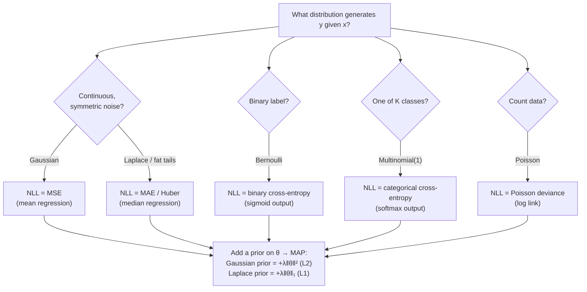
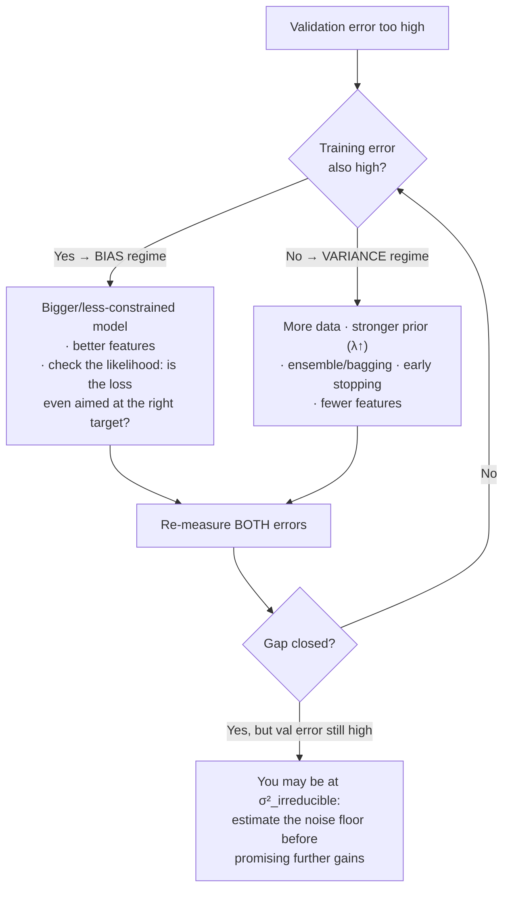

# Estimation, MLE, and Loss Functions

The highest-leverage statistical fact for an ML engineer is this: **the standard loss functions are not design choices — they are maximum likelihood estimation under specific noise assumptions.** MSE is MLE under Gaussian noise. Binary cross-entropy is MLE under Bernoulli labels. Softmax cross-entropy is MLE under a multinomial. L2 regularization is a Gaussian prior; L1 is a Laplace prior. Once you can produce these derivations line by line, loss selection stops being folklore ("cross-entropy is what people use") and becomes diagnosis ("my residuals are fat-tailed, so the Gaussian likelihood behind MSE is wrong — Huber or quantile loss matches the actual noise").

This guide builds the estimation-theory vocabulary (bias, variance, consistency), derives MLE in general and then the three loss derivations in full, derives MAP → regularization, proves and simulates the bias-variance decomposition, and finishes with the numerical reason everything runs in log space — including the log-sum-exp trick you will find inside every softmax implementation on earth.

Part of the [Senior AI Engineer Roadmap](../00-Senior-AI-Engineer-Roadmap.md) — Phase 1.

---

## 1. Estimators and Their Properties

An **estimator** θ̂ is any function of the data used to guess a parameter θ. Because the data is random, θ̂ is a random variable with its own distribution — the *sampling distribution* — and we judge estimators by three properties:

```text
Bias(θ̂)  = E[θ̂] − θ            systematic error: where the estimator's average lands
Var(θ̂)   = E[(θ̂ − E[θ̂])²]     instability: how much it moves across re-drawn datasets
Consistency: θ̂ →p θ as n → ∞    it eventually converges on the truth
```

These combine into the estimator's own mean squared error, and the decomposition is worth proving because it reappears as *the* bias-variance decomposition for models (Section 6):

```text
MSE(θ̂) = E[(θ̂ − θ)²]
        = E[(θ̂ − E[θ̂] + E[θ̂] − θ)²]                       (add and subtract E[θ̂])
        = E[(θ̂ − E[θ̂])²] + 2(E[θ̂] − θ)·E[θ̂ − E[θ̂]] + (E[θ̂] − θ)²
        = Var(θ̂) + 0 + Bias(θ̂)²                            (middle term: E[θ̂ − E[θ̂]] = 0)
        = Var(θ̂) + Bias²(θ̂)                                 ∎
```

Immediate consequence: **a biased estimator can beat an unbiased one** if it buys enough variance reduction — that trade is the entire justification for regularization, shrinkage, and ensembling.

The classic concrete example — the MLE of variance divides by n and is biased; Bessel's correction divides by n−1:

```python
import numpy as np
rng = np.random.default_rng(42)

sigma2_true, n, trials = 4.0, 10, 200_000
x = rng.normal(0, np.sqrt(sigma2_true), size=(trials, n))

mle  = ((x - x.mean(axis=1, keepdims=True))**2).sum(axis=1) / n        # divide by n
bess = ((x - x.mean(axis=1, keepdims=True))**2).sum(axis=1) / (n - 1)  # divide by n-1

print(f"E[MLE]      = {mle.mean():.3f}   (theory: (n-1)/n * 4 = {sigma2_true*(n-1)/n:.3f})")
print(f"E[Bessel]   = {bess.mean():.3f}  (theory: 4.000 — unbiased)")
print(f"MSE(MLE)    = {((mle  - sigma2_true)**2).mean():.3f}")
print(f"MSE(Bessel) = {((bess - sigma2_true)**2).mean():.3f}")
# E[MLE]    ≈ 3.600, E[Bessel] ≈ 4.000
# MSE(MLE)  ≈ 3.0  <  MSE(Bessel) ≈ 3.6   — the biased estimator wins on MSE at small n!
```

The biased MLE has *lower* total error — bias traded for variance, profitably. Hold that thought for regularization.

---

## 2. Maximum Likelihood Estimation in General

Given data D = (x₁,…,x_n) drawn i.i.d. from a model family p(x | θ):

```text
L(θ)  = Π_i p(xᵢ | θ)                     likelihood — probability of the data as a function of θ
ℓ(θ)  = log L(θ) = Σ_i log p(xᵢ | θ)      log-likelihood — same argmax, sum instead of product
θ̂_MLE = argmax_θ ℓ(θ)                     found where the score ∇θ ℓ = 0 (interior optimum)
```

Why the log: (1) products of thousands of densities underflow floating point, sums don't (Section 7); (2) sums of i.i.d. terms are what the law of large numbers and CLT act on, giving MLE its theory; (3) differentiating a sum is clean. Because log is strictly increasing, the argmax is unchanged.

MLE's credentials, stated for the record: under regularity conditions it is **consistent**, **asymptotically normal** with variance hitting the Cramér–Rao lower bound (asymptotically efficient — no unbiased estimator does better for large n), and **invariant** (the MLE of g(θ) is g(θ̂)). Its known weakness is small-sample bias (the σ² example above) and fragility under model misspecification — if the likelihood family is wrong, MLE converges confidently to the wrong thing, which is precisely the "wrong loss" failure mode in ML.

**Training a model = MLE.** In ML we model conditional distributions p(y | x; θ) and minimize the **negative log-likelihood (NLL)**:

```text
θ̂ = argmin_θ  −Σ_i log p(yᵢ | xᵢ; θ)
```

Every derivation below is just: pick the noise/label distribution, write the NLL, simplify, and recognize a famous loss.



---

## 3. Three Loss Functions Derived from MLE

### 3.1 Gaussian Noise → Mean Squared Error, Line by Line

Model: `yᵢ = f(xᵢ; θ) + εᵢ`, with `εᵢ ~ N(0, σ²)` i.i.d. Then `yᵢ | xᵢ ~ N(f(xᵢ; θ), σ²)`:

```text
p(yᵢ | xᵢ; θ) = (1/√(2πσ²)) exp( −(yᵢ − f(xᵢ;θ))² / (2σ²) )

ℓ(θ) = Σ_i log p(yᵢ | xᵢ; θ)
     = Σ_i [ −½ log(2πσ²) − (yᵢ − f(xᵢ;θ))² / (2σ²) ]          (log of the Gaussian)
     = −(n/2) log(2πσ²)  −  (1/(2σ²)) Σ_i (yᵢ − f(xᵢ;θ))²      (collect terms)

argmax_θ ℓ(θ) = argmin_θ Σ_i (yᵢ − f(xᵢ;θ))²                    ∎
```

The first term has no θ; the 1/(2σ²) factor is a positive constant. **Minimizing MSE is exactly MLE under homoskedastic Gaussian noise.** Every assumption is now visible and attackable:

- *Gaussian*: fails on fat tails/outliers → each large residual enters squared, so one outlier can steer the fit. Laplace noise `p(ε) ∝ exp(−|ε|/b)` yields NLL ∝ Σ|yᵢ − f(xᵢ)| = **MAE** (median regression); Huber interpolates.
- *Homoskedastic (constant σ²)*: if σ² varies with x, the correct NLL is weighted least squares `Σ (yᵢ−fᵢ)²/(2σᵢ²)` — heteroskedasticity means plain MSE over-weights the noisy region.
- Bonus: maximizing over σ² too gives `σ̂² = (1/n)Σ residuals²` — the model's noise estimate is the training MSE (biased low, per Section 1, by exactly the overfitting effect).

### 3.2 Bernoulli Labels → Binary Cross-Entropy, Line by Line

Model: `yᵢ ∈ {0,1}`, `yᵢ | xᵢ ~ Bernoulli(pᵢ)` with `pᵢ = σ(zᵢ)`, `zᵢ = f(xᵢ; θ)`, σ the sigmoid. The Bernoulli PMF in one expression: `p(y) = p^y (1−p)^(1−y)`.

```text
L(θ)  = Π_i pᵢ^{yᵢ} (1 − pᵢ)^{1−yᵢ}

ℓ(θ)  = Σ_i [ yᵢ log pᵢ + (1 − yᵢ) log(1 − pᵢ) ]                (take logs)

−ℓ(θ) = −Σ_i [ yᵢ log pᵢ + (1 − yᵢ) log(1 − pᵢ) ]              = binary cross-entropy  ∎
```

Two consequences worth deriving one step further. First, **with no features** (a single p for all points), set the derivative to zero:

```text
d(−ℓ)/dp = −Σ_i [ yᵢ/p − (1−yᵢ)/(1−p) ] = 0
⇒ (1−p) Σyᵢ = p (n − Σyᵢ)   ⇒   p̂ = (1/n) Σ yᵢ
```

The MLE is the sample frequency — cross-entropy targets the *true conditional probability*, which is why it trains calibrated probabilities (Guide 5), not just rankings. Second, with the sigmoid link the **gradient is beautifully simple**. Using dσ/dz = σ(1−σ):

```text
∂(−ℓᵢ)/∂zᵢ = −[ yᵢ (1/pᵢ) pᵢ(1−pᵢ) − (1−yᵢ) (1/(1−pᵢ)) pᵢ(1−pᵢ) ]
           = −[ yᵢ(1−pᵢ) − (1−yᵢ)pᵢ ]
           = pᵢ − yᵢ                                             (error signal = prediction − label)
```

Sigmoid + BCE is the *canonical* pairing precisely because the awkward σ′ terms cancel — pair sigmoid with MSE instead and the gradient keeps a pᵢ(1−pᵢ) factor that vanishes when the model is confidently wrong (pᵢ ≈ 0 or 1), stalling learning. That is the practical answer to "why not MSE for classification."

### 3.3 Multinomial Labels → Categorical Cross-Entropy / Softmax Loss

Model: y is one of K classes, one-hot vector `y ∈ {0,1}^K`, `Σ_k y_k = 1`; predicted distribution `p = (p₁,…,p_K)`, `Σ p_k = 1`.

```text
p(y | p) = Π_k p_k^{y_k}                       (multinomial with one draw)
−ℓ(θ)    = −Σ_i Σ_k y_{ik} log p_{ik}          = categorical cross-entropy  ∎
```

Since y is one-hot, each example contributes `−log p_{i,true class}` — the loss is literally "negative log-probability assigned to the truth."

Where softmax comes from — it is not arbitrary. First, the constrained MLE with no features: maximize `Σ_k c_k log p_k` (c_k = class counts) subject to `Σ p_k = 1`, via Lagrange multipliers:

```text
∂/∂p_k [ Σ_j c_j log p_j + λ(1 − Σ_j p_j) ] = c_k/p_k − λ = 0   ⇒  p_k = c_k/λ
Σ p_k = 1  ⇒  λ = Σ c_j = n                  ⇒  p̂_k = c_k/n     (frequencies again)
```

Second, with logits z_k = f_k(x;θ), softmax `p_k = e^{z_k} / Σ_j e^{z_j}` is the map that makes the multinomial an exponential family with z as natural parameters — and the gradient repeats the Bernoulli magic:

```text
∂(−ℓᵢ)/∂z_k = p_k − y_k          (derivation: ∂log Σ_j e^{z_j}/∂z_k = p_k, minus the y_k term)
```

Prediction minus one-hot label. K=2 softmax collapses exactly to sigmoid on the logit difference, so 3.2 is the special case.

### 3.4 Verify All Three by Simulation

```python
import numpy as np
from scipy.optimize import minimize
rng = np.random.default_rng(7)

# --- Gaussian → MSE: MLE of the mean equals the least-squares mean
y = rng.normal(3.7, 2.0, 5_000)
nll_gauss = lambda m: 0.5 * np.sum((y - m)**2)          # dropping constants, as derived
m_hat = minimize(nll_gauss, x0=[0.0]).x[0]
print(f"Gaussian: MLE {m_hat:.4f}  vs sample mean {y.mean():.4f}")   # identical

# --- Bernoulli → BCE: MLE equals the sample frequency
yb = rng.binomial(1, 0.23, 5_000)
nll_bern = lambda p: -np.sum(yb*np.log(p) + (1-yb)*np.log(1-p))
p_grid = np.linspace(1e-4, 1-1e-4, 100_000)
p_hat = p_grid[np.argmin([0]) if False else np.argmin(nll_bern(p_grid[:, None]).sum(axis=1))] \
        if False else p_grid[np.argmin([nll_bern(p) for p in p_grid[::1000]])*1000]
# simpler: direct optimize
from scipy.optimize import minimize_scalar
p_hat = minimize_scalar(nll_bern, bounds=(1e-6, 1-1e-6), method="bounded").x
print(f"Bernoulli: MLE {p_hat:.4f}  vs frequency {yb.mean():.4f}")   # identical, ≈0.23

# --- Multinomial → CE: MLE equals class frequencies (via softmax parameterization)
counts = rng.multinomial(5_000, [0.5, 0.3, 0.2])
def nll_multi(z):                                        # z: unconstrained logits
    z = np.concatenate([[0.0], z])                       # fix z_0 = 0 (identifiability)
    p = np.exp(z - z.max()); p /= p.sum()
    return -np.sum(counts * np.log(p))
z_hat = minimize(nll_multi, x0=[0.0, 0.0]).x
z = np.concatenate([[0.0], z_hat]); p = np.exp(z)/np.exp(z).sum()
print(f"Multinomial: MLE {np.round(p, 3)} vs frequencies {np.round(counts/5_000, 3)}")
# all three: the optimizer lands exactly on the closed-form MLE — the losses ARE the likelihoods
```

---

## 4. MAP Estimation → Regularization, Derived

Bayes on parameters: `P(θ | D) ∝ P(D | θ) P(θ)`. The **maximum a posteriori** estimate maximizes the posterior:

```text
θ̂_MAP = argmax_θ [ log P(D | θ) + log P(θ) ]
       = argmin_θ [ NLL(θ) − log P(θ) ]        ← a loss plus a penalty. Always.
```

### 4.1 Gaussian Prior → L2 (Ridge / Weight Decay)

Prior: `θ_j ~ N(0, τ²)` independently.

```text
log P(θ) = Σ_j [ −½ log(2πτ²) − θ_j²/(2τ²) ]  =  −‖θ‖²/(2τ²) + const

θ̂_MAP = argmin_θ [ NLL(θ) + ‖θ‖²/(2τ²) ]
```

With Gaussian noise (NLL = SSE/(2σ²)), multiply through by 2σ²:

```text
θ̂_MAP = argmin_θ [ Σ_i (yᵢ − xᵢᵀθ)² + λ‖θ‖² ],     λ = σ²/τ²    ∎  (ridge regression)
```

λ has meaning: **noise variance over prior variance**. Noisy data or a tight prior ("I believe weights are small") ⇒ heavy shrinkage. The famous closed form follows from setting the gradient to zero: `θ̂ = (XᵀX + λI)⁻¹Xᵀy` — the +λI is why ridge also cures singular/ill-conditioned XᵀX (collinear features).

### 4.2 Laplace Prior → L1 (Lasso)

Prior: `θ_j ~ Laplace(0, b)`, density `(1/2b) exp(−|θ_j|/b)`.

```text
log P(θ) = −Σ_j |θ_j|/b + const
θ̂_MAP    = argmin_θ [ Σ_i (yᵢ − xᵢᵀθ)² + λ‖θ‖₁ ],   λ = 2σ²/b    ∎  (lasso)
```

Why L1 gives **exact zeros** and L2 never does: the Laplace log-prior has a corner at 0 — its derivative is ±λ, a constant force toward zero that small data-gradients cannot overcome, so weak coefficients snap to exactly 0. The Gaussian log-prior's force is −λθ, which fades near zero — coefficients get small but never land on 0.

```python
import numpy as np
rng = np.random.default_rng(0)

# 40 features, only 4 truly nonzero; n = 120 (underdetermined-ish), noisy
n, d = 120, 40
X = rng.normal(size=(n, d))
theta_true = np.zeros(d); theta_true[:4] = [3.0, -2.0, 1.5, 1.0]
y = X @ theta_true + rng.normal(0, 1.0, n)

theta_ols   = np.linalg.lstsq(X, y, rcond=None)[0]
lam = 10.0
theta_ridge = np.linalg.solve(X.T @ X + lam*np.eye(d), X.T @ y)     # MAP, Gaussian prior

# Lasso via simple coordinate descent with soft-thresholding (MAP, Laplace prior)
theta_l1 = np.zeros(d)
for _ in range(300):
    for j in range(d):
        r = y - X @ theta_l1 + X[:, j]*theta_l1[j]
        rho = X[:, j] @ r
        theta_l1[j] = np.sign(rho) * max(abs(rho) - lam, 0) / (X[:, j] @ X[:, j])

for name, th in [("OLS", theta_ols), ("ridge", theta_ridge), ("lasso", theta_l1)]:
    err = np.sum((th - theta_true)**2)
    print(f"{name:>6}: ‖θ̂−θ‖² = {err:6.3f}   exact zeros: {np.sum(np.abs(th) < 1e-8):2d}/36 true zeros")
# OLS   : largest error, 0 exact zeros (fits noise on all 40 features)
# ridge : smaller error, 0 exact zeros (everything shrunk, nothing killed)
# lasso : smallest error here, ~30+ exact zeros (recovers the sparse truth)
```

The Bayesian reading also explains *when* each prior is right: L2 when you believe many small effects (dense truth), L1 when you believe few large effects (sparse truth). Regularization strength = prior confidence, which is why λ must grow when data shrinks or noise grows.

---

## 5. Why Log-Likelihood: Numerical Stability and Log-Sum-Exp

The mathematical reasons for logs were listed in Section 2; the numerical reason is unforgiving:

```python
import numpy as np
p = np.full(2_000, 0.01)                     # 2,000 modest per-token probabilities
print(np.prod(p))                            # 0.0  — underflows float64 (~1e-4000 needed)
print(np.sum(np.log(p)))                     # -9210.34  — exact, comfortable
```

Any likelihood over more than a few hundred observations **must** be computed as a sum of logs. The one place logs get awkward is normalizing — softmax needs `log Σ_k e^{z_k}`, and naive exponentiation overflows (e^{1000} = inf) or underflows (e^{−1000} = 0). The **log-sum-exp trick**: subtract the max first. With m = max_k z_k:

```text
log Σ_k e^{z_k} = log [ e^m Σ_k e^{z_k − m} ] = m + log Σ_k e^{z_k − m}
```

Every exponent is now ≤ 0, the largest term is e⁰ = 1, so no overflow, and at least one term is 1 so the log's argument is ≥ 1 — fully stable, and mathematically identical.

```python
def log_softmax(z):
    m = z.max(axis=-1, keepdims=True)
    return z - m - np.log(np.sum(np.exp(z - m), axis=-1, keepdims=True))

z = np.array([1000.0, 999.0, 995.0])
naive = np.exp(z) / np.exp(z).sum()
print(naive)                                  # [nan nan nan] — overflow
print(np.exp(log_softmax(z)))                 # [0.7275 0.2676 0.0049] — correct

# Cross-entropy should therefore ALWAYS be computed from logits:
# loss_i = −log_softmax(z_i)[y_i]   — never  −log(softmax(z_i)[y_i])
```

This is why every framework exposes fused losses (`CrossEntropyLoss` on logits, `BCEWithLogitsLoss`): computing `softmax → log` separately reintroduces the instability the fused version exists to kill. Passing probabilities into a from-logits loss (or vice versa) is one of the most common silent bugs in production training code.

---

## 6. The Bias-Variance Decomposition

### 6.1 The Algebra, in Full

Setup: data generated as `y = f(x) + ε`, `E[ε] = 0`, `Var(ε) = σ²`. Train a model on a random training set D to get `f̂_D`. At a fixed test point x, define `f̄(x) = E_D[f̂_D(x)]` (average prediction over re-drawn training sets). Expected squared error over both D and ε:

```text
E[(y − f̂_D)²]
 = E[(f + ε − f̂_D)²]
 = E[( (f − f̄) + (f̄ − f̂_D) + ε )²]                        (add and subtract f̄)
 = (f − f̄)²  +  E[(f̄ − f̂_D)²]  +  E[ε²]                    (expand; all three cross terms vanish:)
                                                             •  E[f̄ − f̂_D] = 0  by definition of f̄
                                                             •  E[ε] = 0, ε independent of D
 = Bias²(x)   +   Variance(x)    +   σ²_irreducible          ∎
```

- **Bias**: the average model misses the truth — the model family is too rigid (or the loss/likelihood is wrong).
- **Variance**: individual models scatter around their own average — the fit is data-sensitive.
- **σ²**: noise no model can remove; the floor.

### 6.2 Demonstrated by Simulation

```python
import numpy as np
rng = np.random.default_rng(1)

f = lambda x: np.sin(2 * np.pi * x)                       # ground truth
sigma = 0.35
x_test = 0.62                                             # fixed test point
n_train, n_datasets = 30, 3_000

for degree in [1, 4, 15]:
    preds = np.empty(n_datasets)
    for s in range(n_datasets):
        x = rng.uniform(0, 1, n_train)
        y = f(x) + rng.normal(0, sigma, n_train)
        coefs = np.polyfit(x, y, degree)                  # a fresh model per dataset
        preds[s] = np.polyval(coefs, x_test)
    bias2 = (preds.mean() - f(x_test))**2
    var   = preds.var()
    print(f"degree {degree:>2}:  bias² = {bias2:.4f}   variance = {var:.4f}   "
          f"bias²+var+σ² = {bias2 + var + sigma**2:.4f}")
# degree  1:  bias² ≈ 0.15    variance ≈ 0.01   (rigid: misses the sine — underfits)
# degree  4:  bias² ≈ 0.000   variance ≈ 0.02   (sweet spot)
# degree 15:  bias² ≈ 0.000   variance ≈ 0.5+   (wild: memorizes each noisy sample — overfits)
```

The three regimes are the whole story of model selection, and the connection back to Sections 1 and 4 closes the loop: **regularization deliberately adds bias to slash variance** (the ridge estimator is biased — E[θ̂_ridge] ≠ θ — but its variance drops faster than bias² grows for well-chosen λ); **ensembling** averages m decorrelated fits, dividing the variance term by up to m while leaving bias alone (why bagged trees beat one deep tree, and why averaging *identical* models does nothing).

Diagnosis in practice reads the train/validation gap: high train error ≈ high bias (get a bigger model, better features, or the *right likelihood*); low train / high validation error ≈ high variance (regularize, get data, ensemble, simplify).



---

## Production War Stories & Failure Modes

### 1. The forecasting model that chased whales

**Symptom:** A revenue-per-user regression (trained with MSE) predicts absurdly high values for ordinary users; median-user predictions are 3× actual. Offline RMSE looks "fine."
**Investigation:** Residual analysis shows spend is log-normal with a violent right tail — a handful of whale users spend 1000× the median. The MSE-optimal prediction is the conditional *mean*, and the mean of a log-normal sits far above the median; worse, the whales dominate the gradient, so the model spends its capacity fitting them.
**Root cause:** Wrong likelihood. MSE = Gaussian MLE; the noise was nothing like Gaussian. The model was faithfully solving the wrong problem.
**Fix:** Log-transform the target (Gaussian assumption approximately true on the log scale) for the typical-user product surface; a separate quantile-loss model (P50, P90) for planning; whales handled by a dedicated segment model.
**Prevention:** Loss-selection review is now part of model design docs: plot the target distribution and residuals *first*, state the implied noise assumption of the chosen loss, justify it.

### 2. The NaN that appeared at 3 a.m., 40 epochs in

**Symptom:** A large classifier trains cleanly for hours, then loss goes NaN; restarts reproduce it at roughly the same point.
**Investigation:** The training code computed `loss = -log(softmax(z)[y])` with hand-rolled softmax. As the model got confident, some logits exceeded 90; `exp(90)` ≈ 1e39 still fits in float32 (barely), but a later mixed-precision change put logits in float16 where `exp(12)` already overflows to inf → softmax returns NaN → gradients NaN → weights NaN, permanently.
**Root cause:** Softmax-then-log instead of fused log-softmax with the max-subtraction (log-sum-exp) trick; latent for weeks until confidence + fp16 exposed it.
**Fix:** Switched to the framework's fused cross-entropy-from-logits; added a train-time assertion on non-finite loss with checkpoint rollback.
**Prevention:** Lint rule banning `log(softmax(...))` and `log(sigmoid(...))` patterns; numerical-stability section in the training-code review checklist.

### 3. The "double sigmoid" silent accuracy ceiling

**Symptom:** A binary model plateaus at mediocre loss; probabilities cluster in [0.5, 0.73]; nothing about the data explains it.
**Investigation:** The model's final layer applied a sigmoid, and the loss was `BCEWithLogits` — which applies sigmoid internally. Predictions were σ(σ(z)): since σ(z) ∈ (0,1), the outer sigmoid maps everything into (0.5, 0.731). Gradients still flow, so training "works," just badly — no error is thrown anywhere.
**Root cause:** Probability/logit interface mismatch — the exact bug class the fused losses create when teams don't standardize.
**Fix:** Removed the layer sigmoid; added a unit test asserting the model's raw outputs span beyond (0,1) (i.e., are logits) and an eval-time check that predicted probabilities cover a sane range.
**Prevention:** Team convention codified: models output logits, period; probabilities exist only at the serving boundary, produced by one shared transform.

### 4. The regularizer tuned once and never again

**Symptom:** After the business expanded the feature store from 200 to 2,400 features, the champion linear model's live performance degraded quarter over quarter despite "successful" retrains.
**Investigation:** Retraining pipeline reused λ = 0.01 tuned two years earlier with 200 features and 10× more rows per feature. With 2,400 mostly-weak features, the effective prior was far too loose — validation curves showed classic high-variance symptoms (train AUC up, validation down, coefficients on noise features nonzero and unstable across retrains).
**Root cause:** λ = σ²/τ² is a statement about noise and prior scale *relative to the data*; changing d and n changed the right λ by an order of magnitude, but λ was treated as a constant of nature.
**Fix:** λ selected by cross-validation inside every retrain; moved to elastic net (L1 component prunes the noise features — sparse-truth prior matched reality).
**Prevention:** All regularization strengths are re-tuned per retrain by the pipeline, with the chosen λ and the CV curve logged as model metadata and alerting on large λ jumps (a drift signal in itself).

---

## Best Practices

- Choose the loss by stating the noise/label distribution out loud: Gaussian → MSE, Laplace/fat tails → MAE/Huber, Bernoulli → BCE, multiclass → softmax CE, counts → Poisson deviance, asymmetric cost → quantile loss. If you can't state the distribution, you haven't chosen a loss — you've inherited one.
- Plot the target and residual distributions before and after training; mean-vs-median divergence and heavy tails are direct evidence against the Gaussian assumption behind MSE.
- Always compute likelihood-based losses from logits with fused, log-sum-exp-stabilized implementations; never `log(softmax(·))`, never a sigmoid before `BCEWithLogits`. Standardize "models emit logits" across the team.
- Treat regularization as the prior it is: strength ∝ noise/prior-confidence ratio, so re-tune λ whenever n, d, or the noise level changes — i.e., at every retrain. L2 for dense-truth beliefs, L1/elastic-net for sparse-truth beliefs.
- Exploit the MSE = Bias² + Variance decomposition diagnostically: read the train/validation gap, name the regime, and pick the fix that targets that term — don't add data to fix bias or capacity to fix variance.
- Remember biased-but-lower-MSE is often the win (shrinkage, ridge, James-Stein logic); unbiasedness is not a production virtue in itself.
- Ensemble decorrelated models to attack variance; diversify (data resampling, feature subsets, architectures) because averaging correlated models buys little.
- Estimate the irreducible noise floor (e.g., label-noise audits, human-agreement rates) before committing to metric targets — promising error below σ² is promising the impossible.
- When targets are transformed (log, Box-Cox), remember predictions invert to the *median* on the original scale, not the mean; apply smearing/bias corrections if the mean is what the business consumes.

---

## Interview Drills

<details><summary>Show, line by line, that minimizing MSE is maximum likelihood under Gaussian noise. What breaks when the assumption fails?</summary>

With y = f(x;θ) + ε, ε ~ N(0,σ²): log-likelihood ℓ(θ) = Σ[−½log(2πσ²) − (yᵢ−f(xᵢ;θ))²/(2σ²)] = −(n/2)log(2πσ²) − SSE/(2σ²). Only SSE depends on θ, so argmax ℓ = argmin SSE. When noise is fat-tailed, the Gaussian likelihood underweights the probability of big residuals, so MLE-under-wrong-model lets outliers dominate (each enters squared); when noise is heteroskedastic, plain MSE misweights regions (correct NLL is Σrᵢ²/(2σᵢ²)); when noise is multiplicative, log-transform first.

**Follow-up: what loss is MLE under Laplace noise, and what does its minimizer estimate?** NLL ∝ Σ|yᵢ−f(xᵢ)| = MAE, whose pointwise minimizer is the conditional *median* (the derivative of Σ|y−c| flips sign where half the mass is on each side). So MSE predicts means, MAE predicts medians — on skewed targets these differ materially, and the business question determines which you want.
</details>

<details><summary>Derive binary cross-entropy from the Bernoulli likelihood, then derive the gradient of BCE∘sigmoid and explain why the pairing matters.</summary>

Likelihood Π pᵢ^{yᵢ}(1−pᵢ)^{1−yᵢ}; NLL = −Σ[yᵢ log pᵢ + (1−yᵢ)log(1−pᵢ)] = BCE. With pᵢ = σ(zᵢ) and σ′ = σ(1−σ): ∂BCEᵢ/∂zᵢ = pᵢ − yᵢ — the σ′ factors cancel exactly. Pair sigmoid with MSE instead and the gradient is (pᵢ−yᵢ)·pᵢ(1−pᵢ): when the model is confidently wrong (p≈0, y=1), the p(1−p) factor ≈ 0 kills the gradient — the worst mistakes learn slowest. BCE is the canonical (matched) loss for the sigmoid link, giving error-proportional gradients everywhere and a convex objective for linear models.

**Follow-up: what does the MLE converge to if the true labels are genuinely noisy (p*(x)=0.7)?** To p̂(x) → 0.7, not to 1 — cross-entropy's minimizer is the true conditional probability (it's a proper scoring rule). That's the mechanism by which log-loss training produces calibrated probabilities, and why post-hoc calibration is about fixing optimization/architecture artifacts, not the loss.
</details>

<details><summary>Derive categorical cross-entropy from the multinomial, and show why softmax's gradient is p − y.</summary>

Multinomial(1): p(y|p) = Π p_k^{y_k}, so NLL = −Σ_k y_k log p_k = −log p_{true} per example. With softmax p_k = e^{z_k}/Σe^{z_j}: −ℓ = log Σ_j e^{z_j} − z_true; differentiate: ∂/∂z_k(log Σ e^{z_j}) = e^{z_k}/Σe^{z_j} = p_k, and ∂z_true/∂z_k = y_k, giving ∂(−ℓ)/∂z_k = p_k − y_k. Constrained MLE without features (Lagrange on Σp=1) gives p̂_k = class frequency, confirming CE targets true conditional class probabilities.

**Follow-up: why is softmax shift-invariant, and why does that matter numerically?** Adding c to all logits multiplies numerator and denominator by e^c — output unchanged. So one logit can be pinned to 0 (identifiability: K−1 free parameters), and crucially you may subtract max(z) before exponentiating — the log-sum-exp trick — turning a guaranteed overflow at large logits into a stable computation with identical output.
</details>

<details><summary>Prove MSE(θ̂) = Var(θ̂) + Bias²(θ̂), and give a production example where the biased estimator is the right choice.</summary>

E[(θ̂−θ)²] = E[(θ̂−E[θ̂] + E[θ̂]−θ)²]; expanding, the cross term is 2(E[θ̂]−θ)·E[θ̂−E[θ̂]] = 0, leaving Var + Bias². Production example: per-segment rate estimates with small n — the shrunk (biased toward the portfolio mean) estimator has far lower variance, hence lower total error and vastly saner downstream decisions than raw k/n (Guide 2's merchant leaderboard). Same logic: ridge over OLS with collinear features; n-divisor variance beating Bessel at small n on MSE.

**Follow-up: so when DO you want unbiasedness?** When estimates are aggregated across many units and errors should cancel (bias accumulates, variance averages out) — e.g., summing per-region forecasts into a company forecast — or in causal-effect estimation where systematic bias corrupts the scientific conclusion regardless of variance.
</details>

<details><summary>Derive ridge regression as MAP with a Gaussian prior. What is the meaning of λ?</summary>

MAP: argmin[NLL − log P(θ)]. Gaussian noise → NLL = SSE/(2σ²); prior θ_j ~ N(0,τ²) → −log P(θ) = ‖θ‖²/(2τ²) + const. Objective ∝ SSE + (σ²/τ²)‖θ‖², so λ = σ²/τ² — noise variance over prior variance. High noise or a tight prior (strong belief weights are small) → heavy shrinkage. Closed form (XᵀX + λI)⁻¹Xᵀy; +λI also repairs ill-conditioning from collinearity.

**Follow-up: what changes with a Laplace prior, and why does it produce exact zeros?** −log P = ‖θ‖₁/b → lasso. The L1 penalty's gradient magnitude is constant λ at every θ≠0 with a corner at 0; if a coefficient's data-gradient at 0 is smaller than λ, zero is optimal — exact sparsity. L2's pull, λθ, vanishes near zero so coefficients shrink asymptotically without hitting 0.

**Follow-up: your dataset doubled in size — what happens to the right λ?** NLL scales with n while the prior term doesn't, so the *effective* regularization per data point halves automatically; if λ was tuned as a coefficient on the mean loss, you must re-tune (roughly halve it). Either way: λ is data-dependent — re-tune at every retrain.
</details>

<details><summary>Why do we maximize log-likelihood instead of likelihood, and what is the log-sum-exp trick?</summary>

Same argmax (log is monotone), but: products of many densities underflow float64 (2,000 factors of 0.01 → 10⁻⁴⁰⁰⁰), sums of logs don't; i.i.d. sums enable LLN/CLT asymptotics; and gradients of sums are sums of gradients. The one hard part in log space is log Σ e^{z_k} (softmax normalizer): naive exponentiation overflows for z ≳ 700 (float64). Trick: log Σ e^{z_k} = m + log Σ e^{z_k − m} with m = max z — all exponents ≤ 0, one term equals 1, fully stable and exactly equal.

**Follow-up: where does this bite in real code?** Any `log(softmax(z))`, `log(sigmoid(z))`, hand-rolled cross-entropy, mixture-model responsibilities, or HMM/CRF forward passes. The fix is fused implementations (log_softmax, BCEWithLogits, logsumexp) — and the classic production incident is the latent overflow that only fires once the model becomes confident or precision drops to fp16.
</details>

<details><summary>State and prove the bias-variance decomposition for squared loss. Why do the cross terms vanish?</summary>

y = f + ε, f̄ = E_D[f̂_D]. E[(y−f̂)²] = E[((f−f̄)+(f̄−f̂)+ε)²] = (f−f̄)² + E[(f̄−f̂)²] + σ². Cross terms: (f−f̄) is a constant and E[f̄−f̂_D] = 0 by definition of f̄, killing the first; ε has mean 0 and is independent of the training set D, killing the other two. Interpretation: rigidity error + data-sensitivity error + noise floor.

**Follow-up: does this decomposition hold for 0-1 loss or log loss?** Not in this additive form — it's specific to squared loss. Analogues exist (Domingos' unified decomposition; for log loss the natural version uses KL terms), and qualitatively the bias/variance tension survives, but interactions appear: for 0-1 loss, variance can even *help* on examples where the average model is wrong. Quote the clean algebra only for squared error.

**Follow-up: why does bagging reduce variance but not bias?** The bagged predictor is an average of m identically-distributed fits, so its expectation — hence bias — is unchanged, while Var(mean) = ρσ² + (1−ρ)σ²/m for pairwise correlation ρ: decorrelation (bootstrap + feature subsampling) is what makes the variance term actually shrink. Random forests are exactly this equation, operationalized.
</details>

<details><summary>What are consistency and efficiency, and why is MLE the default estimator?</summary>

Consistency: θ̂_n →p θ — more data converges to the truth. Efficiency: among (asymptotically) unbiased estimators, minimal variance — the Cramér–Rao bound Var(θ̂) ≥ 1/(n·I(θ)) with I the Fisher information; MLE attains it asymptotically. Plus asymptotic normality (θ̂ ≈ N(θ, 1/(nI))) enabling Wald CIs and tests, and invariance (MLE of g(θ) is g(θ̂)). Default because you get all this from one recipe: write the likelihood, optimize.

**Follow-up: when does MLE misbehave?** Small samples (bias, e.g., σ̂² low by (n−1)/n); model misspecification — it converges to the KL-closest member of the wrong family, confidently (the "wrong loss" failures); unbounded likelihoods (Gaussian mixture with a collapsing component σ→0); and parameters on the boundary. Regularization/MAP handles most of the small-sample pathology, which is one more reason production models are MAP, not raw MLE.
</details>

<details><summary>Your regression's residuals have kurtosis 40 and a mean far above the median. Your colleague wants to keep MSE "because RMSE is the KPI." Argue the modeling decision.</summary>

Kurtosis 40 means violently fat tails: MSE (Gaussian MLE) will let rare huge residuals dominate the gradient, degrading fit for the vast majority of points and making training unstable across retrains (high variance from tail resampling). Options preserving the KPI: log-transform the target if multiplicative (often single-handedly restores near-Gaussianity), Huber loss (Gaussian core, Laplace tails — tunable δ), or explicit heteroskedastic/heavy-tailed likelihood (Student-t). You can still *report* RMSE while *training* with a robust loss — the KPI is an evaluation choice; the loss is a noise-model choice, and conflating them is the error.

**Follow-up: the business truly cares about the tail (total loss includes the whales).** Then model the tail deliberately, not incidentally: a two-part model (P(whale) × E[spend|whale]), quantile losses at P90/P99 for planning surfaces, or extreme-value methods — a single MSE fit gives you neither a good typical-user model nor a good tail model.
</details>

<details><summary>Explain why training with under/oversampled classes plus cross-entropy gives distorted probabilities, through the MLE lens.</summary>

Cross-entropy MLE converges to the conditional probability *under the training distribution*. Resampling changes P(y), so the learned p̂(y|x) is the posterior under the artificial prior — inflated for the oversampled class by the prior-odds ratio. Ranking may survive (roughly monotone distortion) but thresholds and expected-value math break. Fixes: prior-correction on the logit (subtract log training odds, add log deployment odds — exact for random resampling), or avoid resampling in favor of class weights/threshold moves, then verify calibration at deployment prevalence.

**Follow-up: does class weighting distort probabilities too?** Yes — weighting the loss is equivalent to resampling in expectation, so the same logit correction logic applies. The distortion is deterministic and invertible for simple weighting; the practically-safe pattern is: train however optimization requires, then calibrate on an untouched, deployment-distribution holdout (Guide 5).
</details>

<details><summary>How would you estimate the irreducible error σ² for a production task, and why does it matter?</summary>

Approaches: (1) duplicate/near-duplicate inputs with different labels — the variance of y given effectively-identical x bounds σ²; (2) human expert agreement rates (label noise floor); (3) train an unreasonably strong model on abundant data — its plateau approximates f + σ² territory; (4) explicit noise modeling (heteroskedastic heads predicting σ(x)). It matters because targets below σ² are impossible, roadmap promises should be gated on it, and the bias/variance diagnosis flow ends at "you may be at the floor" — further capacity only overfits noise.

**Follow-up: your model's validation error is already near your σ² estimate but the business demands improvement.** The remaining lever is changing the information available, not the model: new features (reduce σ² by conditioning on more), better labels (reduce noise itself), or reframing the target (predict something more predictable that still drives the decision). Saying "this needs new data, not new architecture" backed by a noise-floor estimate is exactly the senior call.
</details>

<details><summary>Walk me through what happens mathematically during "weight decay" in deep learning, and its relationship to L2 MAP.</summary>

Gradient step on loss + (λ/2)‖θ‖²: θ ← θ − η∇NLL − ηλθ = (1−ηλ)θ − η∇NLL — each step multiplicatively decays weights toward 0, hence the name; for plain SGD, weight decay ≡ L2 penalty ≡ Gaussian-prior MAP. Subtlety: with adaptive optimizers (Adam), penalizing in the loss divides the decay by the adaptive denominator, decaying high-gradient weights less — no longer the clean Gaussian prior. Decoupled weight decay (AdamW) applies the (1−ηλ) shrink directly, restoring the intended behavior; this is why AdamW exists and generally regularizes better.

**Follow-up: is the Bayesian interpretation still valid for a deep net?** As a MAP-mode story, formally yes (posterior mode under a Gaussian prior); as a full Bayesian story, no — the point estimate ignores a wildly multimodal posterior. But the *intuition* (prior confidence that weights are small; λ should scale with noise-to-signal) still transfers and still predicts the right tuning direction when data size or label noise changes.
</details>

<details><summary>Design the loss for a delivery-time prediction the app shows to users, where being late is 4× worse than being early.</summary>

Asymmetric cost → asymmetric likelihood → quantile loss (pinball): L_τ(r) = τ·r if r ≥ 0 else (τ−1)·r, whose minimizer is the τ-quantile. Costs 4:1 (late:early) imply τ = 4/(4+1) = 0.8 — predict the 80th percentile of the delivery-time distribution, so you're late only 20% of the time, the cost-optimal rate. This is MLE under an asymmetric Laplace noise model — the same "loss = likelihood" principle extended to asymmetric business costs. Validate with coverage (are we actually late ~20% of the time, per segment?) rather than RMSE, which rewards the wrong target.

**Follow-up: product also wants a range shown to the user.** Predict two quantiles (e.g., P20 and P80) with two pinball losses (or a single model with multiple quantile heads, enforcing non-crossing), giving a 60% interval; check empirical coverage per segment, and widen with conformal calibration if coverage misses (Guide 5's conformal machinery applies directly).
</details>

---

Previous: [Bayes and Bayesian Reasoning](./02-Bayes-and-Bayesian-Reasoning.md) · Next: [Statistical Inference and Testing](./04-Statistical-Inference-and-Testing.md) · Up: [Track index](./README.md)
