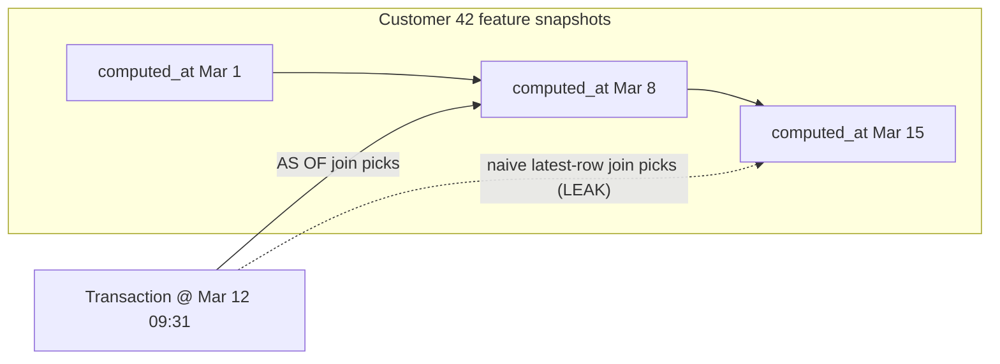
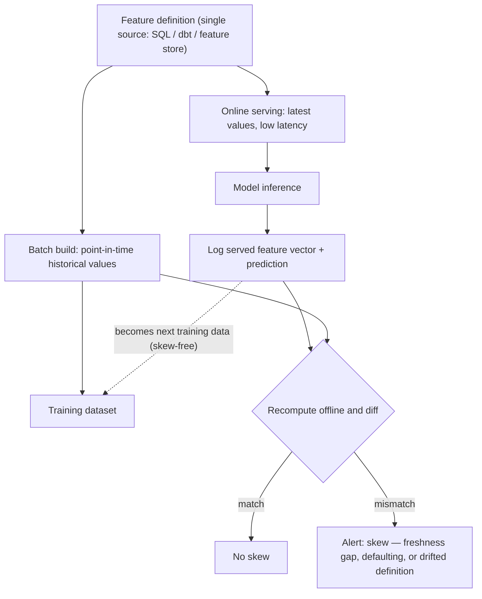

# SQL and Data Engineering for ML

A CRUD backend asks "what is true now?"; an ML training pipeline asks "what did we know *then*?" — and almost every catastrophic model failure in tabular ML traces back to getting that second question wrong. Point-in-time joins, leakage-proof schemas, and reproducible dataset builds are not data-science niceties: they are the difference between a fraud model that works in a notebook and one that works in production. This guide takes the PostgreSQL you already know and adds the ML-specific disciplines from Phase 1: temporal correctness, training-serving skew, label construction, and versioned, rebuildable datasets.

Part of the [Senior AI Engineer Roadmap](./00-Senior-AI-Engineer-Roadmap.md) — Phase 1.

---

## 1. Why ML Puts Different Demands on SQL

### 1.1 CRUD vs Training Queries

| Concern | CRUD app | ML training pipeline |
| --- | --- | --- |
| Question | Current state ("what is this customer's balance?") | Historical state ("what was it at 2025-03-14 09:31:07?") |
| Updates | `UPDATE` in place is fine | In-place updates silently rewrite history → leakage |
| Correctness bug | Wrong answer, user complains, you fix it | Inflated offline metrics, model ships, fails silently in prod |
| Reproducibility | Irrelevant | A dataset you cannot rebuild bit-for-bit is a dataset you cannot debug |
| Freshness | Always want latest | Training must see *stale-as-of-then*; serving wants latest |

The nasty property of temporal bugs: they make offline metrics **better**, not worse. Nothing errors; you find out in production, weeks later.

### 1.2 The Golden Rule

> Every feature value attached to a training example must be computable from data that existed **strictly before** that example's decision timestamp.

Everything in this guide — event tables, SCD2, `AS OF` joins, label maturity — is machinery for enforcing that one sentence. Data after the decision timestamp is allowed to influence exactly one thing: the label, and only through an explicit outcome window (Section 7).

---

## 2. Point-in-Time Correct Joins

### 2.1 The Setup

A fraud model scores each transaction using customer-level features. Features are recomputed daily into a snapshot table:

```sql
CREATE TABLE transactions (
    txn_id bigint PRIMARY KEY, customer_id bigint NOT NULL,
    amount numeric(12,2) NOT NULL, merchant_cat text NOT NULL,
    occurred_at timestamptz NOT NULL
);
CREATE TABLE customer_features (
    customer_id bigint NOT NULL,
    computed_at timestamptz NOT NULL,   -- when this feature row became available
    txn_count_30d int, avg_amount_30d numeric(12,2), chargeback_rate numeric(6,4),
    PRIMARY KEY (customer_id, computed_at)
);
```

The wrong join — the one every backend engineer writes first — grabs each customer's *latest* feature row (`ORDER BY computed_at DESC LIMIT 1` with no time bound). For historical transactions that row was computed weeks *after* the transaction: pure future leakage, and it looks fantastic offline.

### 2.2 The Correct "AS OF" Join

Point-in-time (aka "as of") semantics: for each transaction, take the most recent feature row whose `computed_at` is **at or before** `occurred_at`. In PostgreSQL, `LATERAL` expresses this cleanly and uses the PK index:

```sql
SELECT t.txn_id, t.customer_id, t.amount, t.occurred_at,
       f.txn_count_30d, f.avg_amount_30d, f.chargeback_rate,
       f.computed_at AS feature_as_of
FROM transactions t
LEFT JOIN LATERAL (
    SELECT * FROM customer_features f
    WHERE f.customer_id = t.customer_id
      AND f.computed_at <= t.occurred_at       -- the point-in-time constraint
    ORDER BY f.computed_at DESC
    LIMIT 1
) f ON true;
```

Notes that matter at senior level:

- **`LEFT JOIN LATERAL`, not inner**: a new customer has no feature history yet. Dropping those rows biases the dataset toward established customers; keep them with NULLs and let the model see "no history" — exactly what serving will see.
- **`<=` vs `<`**: if features at `computed_at` include data *from* that instant, use strict `<` to be safe. Off-by-one-instant bugs are real leakage.
- Index `(customer_id, computed_at DESC)` (the PK above already serves this) or the lateral probe becomes a per-row seq scan. The same semantics can also be written with `ROW_NUMBER() ... rn = 1` over an inequality join — often faster for full-table dataset builds.



---

## 3. Feature Leakage Through Data

### 3.1 The Two Families

1. **Future data**: any value computed from events after the decision timestamp — the mutable `customers.balance` column, a feature snapshot taken next week, an aggregate whose window frame includes the current or later rows.
2. **Label proxies**: columns that exist *because of* the outcome. `chargeback_filed`, `account_closed_date`, `review_notes`, a `status` column that ops sets to `'fraud_confirmed'`. They are legitimately in your OLTP schema; they are poison in a feature list.

The tell for both: validation metrics that look too good. AUC 0.999 on fraud is not a triumph, it is a leak report.

### 3.2 Schemas That Prevent Leakage

You cannot code-review every query, so make the schema do it:

- **Timestamp every row's availability**, not just its business time. `occurred_at` = when it happened; `ingested_at` = when your system could first have seen it. Join on `ingested_at` — at serving time you only have what has *arrived*.
- **Never `UPDATE` feature-relevant state in place.** Mutable columns have no history, so their historical values are unrecoverable and every training join against them leaks the present. Use event tables and SCD2 (next section).
- **Segregate outcome data.** Put labels/outcomes in their own tables (`chargebacks`, `defaults`) with their own timestamps, never as columns on the entity or event row. A training query then has to *choose* to join outcomes — an auditable, greppable act — rather than inheriting them via `SELECT *`.
- **Expose training data only through curated views** that do the point-in-time join correctly, so notebook users physically cannot touch raw mutable tables.

---

## 4. Modelling Time: SCD Type 2 and Immutable Events

### 4.1 Slowly Changing Dimensions (Type 2)

Entity attributes (customer tier, address, risk segment) change over time. A Type 2 dimension keeps every version as a validity interval instead of overwriting:

```sql
CREATE TABLE dim_customer (
    customer_sk   bigserial PRIMARY KEY,       -- surrogate key per version
    customer_id   bigint NOT NULL,             -- natural key
    tier          text NOT NULL,
    country       text NOT NULL,
    valid_from    timestamptz NOT NULL,
    valid_to      timestamptz NOT NULL DEFAULT 'infinity',
    EXCLUDE USING gist (
        customer_id WITH =,
        tstzrange(valid_from, valid_to) WITH &&
    )                                          -- no overlapping versions, enforced by the DB
);

-- Point-in-time attribute lookup: interval containment, not ORDER BY/LIMIT
SELECT t.txn_id, d.tier, d.country
FROM transactions t
JOIN dim_customer d ON d.customer_id = t.customer_id
 AND t.occurred_at >= d.valid_from AND t.occurred_at < d.valid_to;
```

Why ML specifically needs SCD2: a Type 1 (overwrite) dimension retroactively rewrites your training set every time an attribute changes — a customer upgraded to `gold` yesterday suddenly appears as `gold` in three-year-old training rows, and "tier" becomes a leaky proxy for whatever caused the upgrade. With SCD2, rebuilding last year's dataset yields last year's truth.

### 4.2 Event Tables: Immutable, Append-Only

Facts are events, and events do not change — so model them that way:

```sql
CREATE TABLE events (
    event_id     bigint GENERATED ALWAYS AS IDENTITY PRIMARY KEY,
    event_type   text NOT NULL,                 -- 'txn_authorized', 'chargeback_filed', ...
    entity_id    bigint NOT NULL,
    occurred_at  timestamptz NOT NULL,
    ingested_at  timestamptz NOT NULL DEFAULT now(),
    payload      jsonb NOT NULL
);
REVOKE UPDATE, DELETE ON events FROM PUBLIC;    -- append-only by privilege, not convention
```

Corrections are new events (`txn_reversed`), never edits. Benefits: any historical state is derivable by replaying events up to a timestamp; datasets are rebuildable; audits are trivial; and there is simply no mutable cell for a leak to hide in. Current-state views for the application are projections *derived from* events — the reverse of the CRUD habit where history (if any) is derived from state.

---

## 5. Time-Window Aggregations

Rolling features ("transactions in the last 24h", "spend vs own 30-day average") are the workhorses of risk models. The point-in-time-safe per-row formulation uses a `RANGE` frame:

```sql
SELECT txn_id, customer_id, occurred_at,
       COUNT(*) OVER w                 AS txn_count_24h,
       COALESCE(SUM(amount) OVER w, 0) AS amount_sum_24h,
       amount / NULLIF(AVG(amount) OVER w, 0) AS amount_vs_24h_avg  -- ratio feature
FROM transactions
WINDOW w AS (PARTITION BY customer_id ORDER BY occurred_at
             RANGE BETWEEN INTERVAL '24 hours' PRECEDING AND CURRENT ROW
             EXCLUDE CURRENT ROW);
```

`EXCLUDE CURRENT ROW` is the detail interviews probe: without it, `amount_sum_24h` includes the very transaction being scored — information serving will not have before the decision. For batch snapshot tables, the equivalent is aggregating with `WHERE occurred_at < :snapshot_ts AND occurred_at >= :snapshot_ts - INTERVAL '30 days'` — always half-open, always strictly before the snapshot instant.

---

## 6. Training-Serving Skew

### 6.1 Causes

- **Dual implementations**: features defined once in SQL for training and again in Python/Java for the serving path. The two definitions drift — different null handling, different window boundaries, `>=` vs `>`.
- **Freshness gaps**: training joins yesterday's nightly snapshot (honest), serving computes features live (fresher) — or worse, the reverse. The model learns one staleness distribution and is served another.
- **Defaulting differences**: training fills missing history with NULL→median; the serving service's protobuf defaults missing ints to `0`. A new customer scores as someone with zero transactions ever — a very different signal than "unknown".

### 6.2 Defences

1. **Single source of feature definitions**: one SQL/dbt definition per feature, executed by both batch training builds and the online path (or compiled to both). Never two hand-maintained copies.
2. **Feature stores** (Feast, Tecton, or a disciplined in-house one): register each feature once; the store serves the offline point-in-time-correct historical values *and* the online low-latency lookup from the same definition, eliminating the dual-implementation class entirely.
3. **Log served features**: at inference time, persist the exact feature vector the model saw alongside the prediction. This gives you (a) a skew monitor — diff logged features against the offline pipeline's recomputation for the same entities/timestamps — and (b) the best possible future training data, because logged features have zero training-serving skew by construction.



---

## 7. Label Construction

### 7.1 Observation Window vs Outcome Window

A label is a *claim about a time interval*, not a column you already have. For "will this transaction be charged back?":

- **Observation window**: the period whose data is allowed into features — everything strictly before `occurred_at`.
- **Outcome window**: the period you watch *after* the decision to determine the label — e.g., 90 days for chargebacks.

```sql
SELECT t.txn_id, t.occurred_at,
       EXISTS (
           SELECT 1 FROM chargebacks c
           WHERE c.txn_id = t.txn_id
             AND c.filed_at <= t.occurred_at + INTERVAL '90 days'
       )::int AS label_chargeback_90d
FROM transactions t
WHERE t.occurred_at <= now() - INTERVAL '90 days';   -- label maturity: see below
```

### 7.2 Maturity and Censoring

A transaction from last week has an **immature** label: its 90-day outcome window has not elapsed, so "no chargeback yet" is censoring, not a negative. Including immature examples floods the negative class with soon-to-be-positives and silently deflates the observed fraud rate. Hence the `WHERE` clause above: only rows whose outcome window has fully elapsed may enter the training set. The tradeoff is fundamental — longer outcome windows give truer labels but older training data; many teams train companion models on shorter windows (30d) to stay fresh and validate against the mature 90d label.

---

## 8. Lineage, Versioning, Freshness, Reproducibility

### 8.1 Data Lineage and Versioning

Every trained model must answer: *which exact rows produced you?* Mechanisms, cheapest first:

- **Snapshot tables**: materialize the training set into an immutable, dated table (`training.txn_risk_v20260701`) and `REVOKE UPDATE/DELETE`. The model card records the table name.
- **dbt-style refs**: define each transformation as a model with `ref()` dependencies; dbt compiles the DAG, giving you lineage for free and one definition per feature (Section 6's defence #1). `dbt build` + tests = validated, documented layers.
- **Versioned object paths**: export snapshots to `s3://ml-data/txn-risk/v=2026-07-01/` (Parquet). Immutable paths + a manifest (row count, checksum, git SHA of the build query) make datasets citable artifacts, diffable across versions.

### 8.2 Feature Freshness: Batch vs Streaming

| | Batch (nightly snapshot) | Streaming (event-driven update) |
| --- | --- | --- |
| Staleness | Up to 24h | Seconds |
| Cost & complexity | Low — plain SQL | High — Kafka/Flink or triggers, dedup, late events |
| Skew risk | Low *if serving reads the same snapshot* | Higher — two computation paths to reconcile |
| Good for | `avg_amount_30d`, tenure, tier | `txn_count_10min`, velocity checks |

Senior move: default every feature to batch, and pay the streaming cost only for features where an ablation shows freshness actually buys lift. "Is 24-hour-old data materially worse for this feature?" is an empirical question, not an architecture aesthetic.

### 8.3 Reproducible Dataset Builds

- **Deterministic queries**: stable `ORDER BY` (unique key) before any `LIMIT`; no `now()` inside build logic — pass `:build_ts` as an explicit parameter so re-running yesterday's build gives yesterday's rows.
- **Seeded sampling**: `SELECT setseed(0.42);` before `random()`-based sampling, or better, deterministic hash sampling: `WHERE (hashtextextended(txn_id::text, 42) % 100) < 10`.
- **Immutable inputs**: build only from append-only events and SCD2 dimensions — then the same query at the same `:build_ts` is bit-for-bit reproducible even months later.
- Record in the snapshot manifest: build query git SHA, `:build_ts`, seed, source table versions, row count, label prevalence.

---

## 9. Phase 1 Project: Transaction-Risk Dataset from Raw Events

The roadmap's pipeline: raw → validated staging → customer features → point-in-time join → labeled training set → versioned snapshot. Key DDL/DML:

```sql
-- 1. Raw landing: append-only, accepts anything, records arrival time
CREATE SCHEMA raw; CREATE SCHEMA staging; CREATE SCHEMA features; CREATE SCHEMA training;
CREATE TABLE raw.txn_events (
    raw_id bigint GENERATED ALWAYS AS IDENTITY PRIMARY KEY,
    payload jsonb NOT NULL,
    ingested_at timestamptz NOT NULL DEFAULT now()
);
REVOKE UPDATE, DELETE ON raw.txn_events FROM PUBLIC;

-- 2. Validated staging: typed, constrained; bad rows quarantined, not dropped
CREATE TABLE staging.transactions (
    txn_id bigint PRIMARY KEY, customer_id bigint NOT NULL,
    amount numeric(12,2) NOT NULL CHECK (amount > 0),
    merchant_cat text NOT NULL,
    occurred_at timestamptz NOT NULL, ingested_at timestamptz NOT NULL,
    CHECK (occurred_at <= ingested_at)   -- an event cannot arrive before it happened
);
INSERT INTO staging.transactions
SELECT (payload->>'txn_id')::bigint, (payload->>'customer_id')::bigint,
       (payload->>'amount')::numeric, payload->>'merchant_cat',
       (payload->>'occurred_at')::timestamptz, ingested_at
FROM raw.txn_events
ON CONFLICT (txn_id) DO NOTHING;                -- idempotent re-runs

-- 3. Daily customer feature snapshots, computed only from data BEFORE the snapshot instant
INSERT INTO features.customer_daily (customer_id, computed_at, txn_count_30d, avg_amount_30d)
SELECT customer_id, :snapshot_ts,
       COUNT(*), AVG(amount)
FROM staging.transactions
WHERE occurred_at <  :snapshot_ts               -- strictly before: no same-instant leak
  AND occurred_at >= :snapshot_ts - INTERVAL '30 days'
GROUP BY customer_id;

-- 4 & 5. Point-in-time join + mature labels → immutable versioned snapshot
CREATE TABLE training.txn_risk_v20260701 AS
SELECT t.txn_id, t.customer_id, t.amount, t.merchant_cat, t.occurred_at,
       f.txn_count_30d, f.avg_amount_30d, f.computed_at AS feature_as_of,
       EXISTS (SELECT 1 FROM staging.chargebacks c
               WHERE c.txn_id = t.txn_id
                 AND c.filed_at <= t.occurred_at + INTERVAL '90 days')::int AS label
FROM staging.transactions t
LEFT JOIN LATERAL (
    SELECT * FROM features.customer_daily f
    WHERE f.customer_id = t.customer_id AND f.computed_at <= t.occurred_at
    ORDER BY f.computed_at DESC LIMIT 1
) f ON true
WHERE t.occurred_at <= :build_ts - INTERVAL '90 days'   -- label maturity
ORDER BY t.txn_id;                                       -- deterministic output
REVOKE UPDATE, DELETE ON training.txn_risk_v20260701 FROM PUBLIC;
```

The no-leak guarantee is structural: raw and staging are append-only, features use strict `<` against a parameterized snapshot instant, the training join enforces `computed_at <= occurred_at`, labels come from a segregated outcome table with an explicit maturity cutoff, and the snapshot is immutable and named by version. A quick Python leak test belongs in CI:

```python
df = pd.read_sql("SELECT occurred_at, feature_as_of FROM training.txn_risk_v20260701", engine)
mask = df.feature_as_of.notna()
assert (df.feature_as_of[mask] <= df.occurred_at[mask]).all(), "LEAK: feature newer than decision"
```

---

## Best Practices

- Enforce the golden rule structurally: append-only events, SCD2 dimensions, `REVOKE UPDATE/DELETE` — never rely on query authors remembering.
- Record both `occurred_at` and `ingested_at` and join on availability (what serving sees); make snapshot-boundary comparisons strict (`<`) and windows half-open — off-by-one-instant is still leakage.
- Keep labels/outcomes in separate tables joined explicitly with a maturity cutoff — never as columns on the entity, never via `SELECT *`.
- Define each feature exactly once (dbt model or feature store) and let both training and serving consume that definition.
- Log the served feature vector with every prediction; diff it against offline recomputation to detect skew, and reuse it as skew-free training data.
- Version datasets as immutable named snapshots (table or S3 path) with a manifest: build query SHA, `build_ts`, seed, row count, label prevalence.
- Parameterize `:build_ts` instead of calling `now()` inside builds; deterministic `ORDER BY` before any `LIMIT`; hash-based sampling over `random()`.
- Default features to batch freshness; pay for streaming only where an ablation proves the lift.
- Add automated leak tests to CI: `feature_as_of <= occurred_at` on every row, and treat any suspiciously large offline metric jump as a leak until proven otherwise.

## Interview Questions

<details><summary>What is a point-in-time correct join and why do ML pipelines need it when CRUD apps don't?</summary>
A point-in-time (AS OF) join attaches to each event the most recent version of related data that existed at or before that event's timestamp, instead of the current version. CRUD apps ask about current state, so joining the latest row is correct. Training data reconstructs past decisions: joining today's feature values onto last year's transactions injects information from the future (future leakage), inflating offline metrics while production — which genuinely only has past data — underperforms. In PostgreSQL you implement it with LEFT JOIN LATERAL ... WHERE computed_at <= occurred_at ORDER BY computed_at DESC LIMIT 1, or with ROW_NUMBER over the same predicate, backed by an index on (entity_id, computed_at).
</details>

<details><summary>Name the main ways feature leakage enters through data, and the schema designs that prevent each.</summary>
(1) Future data: mutable columns updated in place, feature snapshots newer than the decision time, window frames including the current row — prevented by append-only event tables, SCD2 dimensions, point-in-time joins with strict comparisons, and EXCLUDE CURRENT ROW. (2) Label proxies: columns that exist because of the outcome (chargeback flags, closure dates, review notes) — prevented by segregating outcomes into their own tables so training queries must join them explicitly, and banning SELECT * in feature definitions. (3) Availability leakage: joining on when an event occurred rather than when it arrived — prevented by recording ingested_at and joining on it. The detection heuristic in all cases: metrics too good to be true are a leak report, not a result.
</details>

<details><summary>Why does ML specifically need Type 2 slowly changing dimensions rather than Type 1?</summary>
Type 1 overwrites attribute values, destroying history. Two ML consequences: (a) rebuilding a historical training set joins current attribute values onto old examples, so the dataset silently changes every time an attribute changes and is never reproducible; (b) attributes that change in response to outcomes (tier upgrades, risk segments) become label proxies — the model sees the post-outcome value on pre-outcome examples. Type 2 stores each version with a [valid_from, valid_to) interval, so an interval-containment join recovers what was true at any timestamp, training sets are bit-for-bit rebuildable, and Postgres can even enforce non-overlapping versions with a GiST exclusion constraint.
</details>

<details><summary>What causes training-serving skew and how do you defend against it?</summary>
Causes: dual feature implementations (SQL for training, application code for serving) that drift in null handling or window boundaries; freshness gaps (training on nightly snapshots while serving computes live, or vice versa); and defaulting differences (training uses NULL/median, the serving layer defaults missing values to 0). Defences: a single source of truth per feature definition consumed by both paths (dbt model or feature store); feature stores that serve point-in-time-correct offline values and online lookups from the same registered definition; and logging the exact served feature vector with each prediction, both to diff against offline recomputation (skew monitoring) and to use as future training data that has zero skew by construction.
</details>

<details><summary>Explain observation window, outcome window, and label maturity. What goes wrong if you ignore maturity?</summary>
The observation window is the period before the decision timestamp whose data may become features. The outcome window is the period after the decision you watch to assign the label, e.g. "chargeback within 90 days". A label is mature only once its full outcome window has elapsed. If you include immature examples, "no chargeback yet" gets recorded as a negative when it is actually censored — many of those rows are future positives. This deflates observed prevalence, teaches the model that recent fraud patterns are safe, and biases metrics optimistically. The fix is a maturity cutoff (WHERE occurred_at <= build_ts - outcome_window), accepting the freshness cost or training companion short-window models validated against the mature label.
</details>

<details><summary>Why are event tables designed as immutable and append-only, and how do corrections work?</summary>
Because facts about the past do not change — only our knowledge does. Append-only tables (enforced with REVOKE UPDATE, DELETE, not convention) guarantee that any historical state can be reconstructed by replaying events up to a timestamp, which makes point-in-time features and reproducible datasets possible and leaves no mutable cell for leakage to hide in. Corrections are modeled as new compensating events (txn_reversed, amount_adjusted) with their own timestamps, so you can distinguish "what we knew then" from "what we know now". Current state for the application becomes a derived projection of events — inverting the CRUD habit of storing state and discarding history.
</details>

<details><summary>How would you make a training dataset build fully reproducible?</summary>
(1) Build only from immutable inputs: append-only events and SCD2 dimensions. (2) Parameterize time — pass an explicit build_ts instead of calling now() inside queries, so re-running an old build reproduces the old rows. (3) Make queries deterministic: stable ORDER BY on a unique key before any LIMIT, seeded or hash-based sampling (hashtextextended(id, seed) % 100 < k) instead of bare random(). (4) Materialize the result as an immutable versioned artifact — a dated snapshot table with UPDATE/DELETE revoked, or a versioned S3 Parquet path — with a manifest recording the build query's git SHA, build_ts, seed, row count, and label prevalence. The test: rebuilding from the manifest yields a bit-for-bit identical dataset months later.
</details>

<details><summary>When do you choose streaming feature freshness over batch, and what does it cost?</summary>
Choose streaming only for features whose value decays in minutes — velocity counters like transactions in the last 10 minutes for fraud, or session features. Slow-moving aggregates (30-day averages, tenure, tier) lose nothing measurable at 24-hour staleness. Streaming costs more infrastructure (Kafka/Flink or trigger pipelines, dedup, late/out-of-order event handling) and raises skew risk because you now have an online computation path to reconcile with the offline one; it also complicates point-in-time training joins since feature values change continuously rather than at discrete snapshot instants. The senior approach is empirical: default everything to batch, then ablate — train with artificially staled features and only pay for streaming where the freshness lift is real.
</details>

<details><summary>Your fraud model shows AUC 0.998 offline. Walk through how you'd investigate before celebrating.</summary>
Treat it as a leak until proven otherwise. (1) Check feature timestamps: assert feature_as_of <= occurred_at (and ingested_at-based availability) on every row. (2) Audit the feature list for label proxies — columns downstream of the outcome like chargeback flags, closure dates, status fields, review notes. (3) Check window frames for EXCLUDE CURRENT ROW and strict boundaries at snapshot instants. (4) Check label maturity — immature negatives distort everything. (5) Check the split: random splits on temporal data leak; use time-based splits and confirm no entity overlap across them. (6) Inspect feature importances — a single dominant feature is usually the leak. (7) Finally, retrain with the suspect features removed; if AUC drops to a plausible level, you found it. Ship nothing until offline data generation mirrors serving-time information availability.
</details>

<details><summary>How does a feature store solve both point-in-time correctness and training-serving skew?</summary>
A feature store makes the feature definition the registered unit: each feature has one owner, one transformation, and per-row event timestamps. For training it exposes a historical retrieval API — give it (entity_id, timestamp) pairs and it performs the point-in-time join for you, returning the value each feature had as of each timestamp, eliminating hand-written AS OF joins per project. For serving it materializes the same definitions into a low-latency online store keyed by entity. Because both paths execute one definition, the dual-implementation cause of skew disappears; freshness policies and served-feature logging are handled by the platform. The tradeoff is operational complexity, so small teams often start with the disciplined equivalent: dbt-defined features, snapshot tables, and a thin online cache.
</details>
