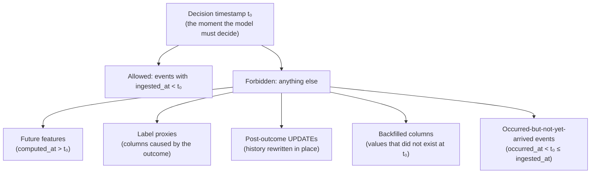
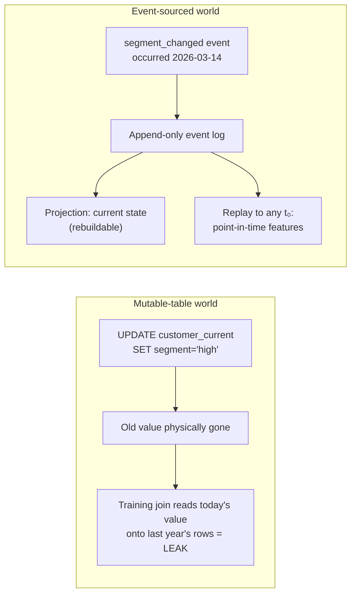

# Point-in-Time Correctness and Leakage

A CRUD backend asks "what is true now?"; a training pipeline asks "what did we know *then*?" — and nearly every catastrophic tabular-ML failure traces back to answering the second question with the first query. Temporal leakage has a uniquely nasty property: it makes offline metrics **better**, not worse. Nothing throws, nothing is NULL, the AUC climbs — and the model quietly fails in production weeks later, because production genuinely does not have the future data your training join smuggled in.

This guide builds the full leakage taxonomy, implements point-in-time (AS OF) joins in PostgreSQL three different ways with performance analysis, shows why mutable tables are structurally incompatible with training data, and finishes with an executable audit checklist for detecting leakage in a dataset you inherited.

Part of the [Senior AI Engineer Roadmap](../00-Senior-AI-Engineer-Roadmap.md) — Phase 1.

---

## 1. The Leakage Taxonomy

"Leakage" is not one bug; it is a family. Naming the family members precisely is what lets you audit for each one.

| # | Class | Mechanism | Canonical example |
|---|-------|-----------|-------------------|
| 1 | **Future features** | A feature value computed from events *after* the decision timestamp | Joining today's `txn_count_30d` snapshot onto last year's transactions |
| 2 | **Label proxies** | A column that exists *because of* the outcome | `chargeback_filed`, `account_closed_at`, `status = 'fraud_confirmed'`, ops `review_notes` |
| 3 | **Post-outcome updates** | An in-place `UPDATE` that rewrites a pre-outcome value after the outcome | `customers.risk_segment` set to `'high'` *after* the fraud was confirmed — then joined onto the pre-fraud transaction |
| 4 | **Backfilled columns** | A column added later and populated retroactively, so historical rows carry values that did not exist at decision time | `email_verified` added in 2025, backfilled `true` for all old rows because active users verified eventually |
| 5 | **Availability leakage** | Joining on when an event *occurred* rather than when your system *received* it | A chargeback that occurred day 5 but arrived in your warehouse day 45 — a feature counting it on day 6 is impossible at serving time |
| 6 | **Split leakage** | The same entity (or near-duplicate rows) on both sides of a train/test split | Random row split puts customer 42's Monday txns in train and Tuesday txns in test |

Classes 1–5 are *data-pipeline* leakage — this guide's subject. Class 6 is covered in the [reproducible datasets guide](./04-Reproducible-Datasets-Versioning-and-Lineage.md).

The golden rule that unifies all of them:

> Every feature value attached to a training example must be computable from data that had **arrived** in your system **strictly before** that example's decision timestamp.

Two words carry the weight: *arrived* (availability, not occurrence — class 5) and *strictly before* (off-by-one-instant is still leakage).



### 1.1 Why each class is easy to miss

- **Future features** hide behind reasonable-looking joins. `JOIN customer_features USING (customer_id)` is correct SQL and wrong ML.
- **Label proxies** are legitimate OLTP columns. Nobody "added leakage"; ops needed a `status` field. The poison is only visible from the training side.
- **Post-outcome updates** are invisible in the current table state. You cannot detect them by querying the table — the history is *gone*. Only WAL archives, audit logs, or luck reveal them.
- **Backfilled columns** look like complete, high-quality data — which is exactly the problem. A column with suspiciously few NULLs in old rows should raise your eyebrows, not lower them.
- **Availability leakage** requires a second timestamp (`ingested_at`) that most schemas never recorded, so the bug is unfixable retroactively.

---

## 2. The Worked Schema

Everything below runs on stock PostgreSQL. A fraud model scores each transaction using customer-level features recomputed periodically into a snapshot table.

```sql
DROP TABLE IF EXISTS transactions, customer_profile CASCADE;

-- Fact table: one row per card transaction (the thing we score)
CREATE TABLE transactions (
    txn_id       bigint PRIMARY KEY,
    customer_id  bigint NOT NULL,
    amount       numeric(12,2) NOT NULL,
    merchant_cat text NOT NULL,
    occurred_at  timestamptz NOT NULL
);

-- Feature snapshots: recomputed periodically; one row per (customer, snapshot time)
CREATE TABLE customer_profile (
    customer_id     bigint NOT NULL,
    computed_at     timestamptz NOT NULL,  -- when this row became AVAILABLE
    txn_count_30d   int NOT NULL,
    avg_amount_30d  numeric(12,2) NOT NULL,
    chargeback_rate numeric(6,4) NOT NULL,
    PRIMARY KEY (customer_id, computed_at)  -- also the index the AS OF join needs
);

INSERT INTO transactions VALUES
  (1001, 42, 120.00, 'grocery',     '2026-03-05 10:00+00'),
  (1002, 42, 950.00, 'electronics', '2026-03-12 09:31+00'),
  (1003, 42,  35.50, 'grocery',     '2026-03-20 18:45+00'),
  (1004, 77,  60.00, 'fuel',        '2026-03-12 11:00+00'),
  (1005, 99, 410.00, 'travel',      '2026-03-13 08:15+00');  -- customer 99: NO profile history

INSERT INTO customer_profile VALUES
  (42, '2026-03-01 00:00+00', 10,  80.00, 0.0000),
  (42, '2026-03-08 00:00+00', 12,  95.00, 0.0000),
  (42, '2026-03-15 00:00+00', 14, 160.00, 0.0100),  -- computed AFTER txn 1002!
  (77, '2026-03-01 00:00+00',  3,  55.00, 0.0000),
  (77, '2026-03-10 00:00+00',  4,  58.00, 0.0000);
```

The trap, stated concretely: transaction **1002** happened on **Mar 12**. Customer 42's *latest* profile row (Mar 15) was computed three days *later* — and its elevated `avg_amount_30d = 160.00` and nonzero `chargeback_rate` partly reflect transaction 1002 itself and whatever happened after it. Joining "latest row per customer" gives the model a peek at the consequences of the very event it is supposed to be predicting.

The correct semantics — a **point-in-time (AS OF) join** — is: *for each transaction, take the most recent profile row whose `computed_at` is at or before `occurred_at`.* For txn 1002 that is the **Mar 8** row. PostgreSQL has no `ASOF JOIN` keyword (unlike DuckDB or QuestDB), so we build it. Three ways.

---

## 3. Point-in-Time Joins, Three Ways

### 3.1 Way 1: Correlated scalar subqueries

The most portable formulation — works on anything SQL-92-ish.

```sql
SELECT t.txn_id, t.customer_id, t.amount, t.occurred_at,
       (SELECT p.txn_count_30d
          FROM customer_profile p
         WHERE p.customer_id = t.customer_id
           AND p.computed_at <= t.occurred_at
         ORDER BY p.computed_at DESC LIMIT 1) AS txn_count_30d,
       (SELECT p.avg_amount_30d
          FROM customer_profile p
         WHERE p.customer_id = t.customer_id
           AND p.computed_at <= t.occurred_at
         ORDER BY p.computed_at DESC LIMIT 1) AS avg_amount_30d,
       (SELECT p.computed_at
          FROM customer_profile p
         WHERE p.customer_id = t.customer_id
           AND p.computed_at <= t.occurred_at
         ORDER BY p.computed_at DESC LIMIT 1) AS feature_as_of
FROM transactions t
ORDER BY t.txn_id;
-- Expected output:
--  txn_id | customer_id | amount  |      occurred_at       | txn_count_30d | avg_amount_30d |     feature_as_of
-- --------+-------------+---------+------------------------+---------------+----------------+------------------------
--    1001 |          42 |  120.00 | 2026-03-05 10:00:00+00 |            10 |          80.00 | 2026-03-01 00:00:00+00
--    1002 |          42 |  950.00 | 2026-03-12 09:31:00+00 |            12 |          95.00 | 2026-03-08 00:00:00+00
--    1003 |          42 |   35.50 | 2026-03-20 18:45:00+00 |            14 |         160.00 | 2026-03-15 00:00:00+00
--    1004 |          77 |   60.00 | 2026-03-12 11:00:00+00 |             4 |          58.00 | 2026-03-10 00:00:00+00
--    1005 |          99 |  410.00 | 2026-03-13 08:15:00+00 |          NULL |           NULL | NULL
```

Reasoning, line by line:

- The predicate pair `p.customer_id = t.customer_id AND p.computed_at <= t.occurred_at` **is** the point-in-time constraint. Everything else is plumbing.
- `ORDER BY computed_at DESC LIMIT 1` picks the newest *eligible* row — "most recent knowledge as of then".
- Customer 99 correctly gets NULLs. Scalar subqueries return NULL for empty results, which mirrors what serving sees for a brand-new customer. **Do not "fix" these NULLs by dropping the rows** — that biases the dataset toward tenured customers, and serving will still meet new ones.
- The fatal flaw: **one subquery per feature column**. Postgres executes each independently — with 40 feature columns you probe the index 40 times per transaction row. There is also a subtle correctness hazard: if someone edits the predicate in one subquery but not the others, different columns silently come from *different* snapshot rows.

**EXPLAIN-level view**: each subquery shows up as a separate `SubPlan` doing an index scan on `customer_profile_pkey` with `Index Cond: (customer_id = t.customer_id AND computed_at <= t.occurred_at)`, `Backward` scan + `Limit 1`. Cost scales as `O(T × F)` index probes for T transactions and F feature columns. Fine for a debugging query on one entity; wrong shape for a dataset build.

### 3.2 Way 2: `LEFT JOIN LATERAL` (the idiomatic Postgres form)

`LATERAL` lets the subquery reference the outer row and return the **whole row at once**:

```sql
SELECT t.txn_id, t.customer_id, t.amount, t.occurred_at,
       p.txn_count_30d, p.avg_amount_30d, p.chargeback_rate,
       p.computed_at AS feature_as_of
FROM transactions t
LEFT JOIN LATERAL (
    SELECT *
    FROM customer_profile p
    WHERE p.customer_id = t.customer_id
      AND p.computed_at <= t.occurred_at      -- the point-in-time constraint
    ORDER BY p.computed_at DESC
    LIMIT 1
) p ON true
ORDER BY t.txn_id;
-- Output: identical to Way 1 (plus chargeback_rate), one row per transaction.
```

Why this is the default choice:

- **One probe per transaction**, regardless of the number of feature columns — the whole eligible row comes back together, eliminating both the O(T×F) cost and the mixed-snapshot hazard of Way 1.
- **`LEFT JOIN ... ON true`**, not an inner lateral (`CROSS JOIN LATERAL`): inner drops customers without history — the new-customer bias again. `ON true` because all the join logic already lives inside the lateral subquery.
- **`<=` vs `<` is a real decision, not pedantry.** If the snapshot at `computed_at` was built from data *up to and including* that instant, a transaction occurring at exactly `computed_at` would see itself via `<=`. When in doubt, use strict `<`; the only cost is marginally staler features, while the cost of `<=` done wrong is leakage.

**EXPLAIN-level view**:

```text
Nested Loop Left Join
  -> Seq Scan on transactions t
  -> Limit (1)
       -> Index Scan Backward using customer_profile_pkey on customer_profile p
            Index Cond: ((customer_id = t.customer_id) AND (computed_at <= t.occurred_at))
```

The plan is *forced* to be a nested loop — lateral correlation cannot be hash- or merge-joined. Each outer row costs one B-tree descent (`O(log S)` for S snapshot rows) plus a 1-row backward scan. Total `O(T log S)`. Excellent up to millions of transactions **if and only if** the `(customer_id, computed_at)` index exists — without it, each probe becomes a per-row sequential scan of the entire profile table and the build goes from minutes to days. This index is the single most important physical-design fact in this guide (here the composite PK provides it for free).

### 3.3 Way 3: Union + window function (the set-based form)

For very large offline builds, restate the problem without correlation: pour both tables into one timeline per customer, sort, and let each transaction "look up" the last profile row above it.

```sql
WITH timeline AS (
    -- Profile snapshots: kind 0 sorts BEFORE kind 1 at identical timestamps,
    -- which implements the '<=' semantics. Swap to kind 2 for strict '<'.
    SELECT customer_id, computed_at AS ts, 0 AS kind,
           NULL::bigint AS txn_id, NULL::numeric AS amount,
           txn_count_30d, avg_amount_30d, computed_at
    FROM customer_profile
    UNION ALL
    SELECT customer_id, occurred_at, 1,
           txn_id, amount, NULL, NULL, NULL
    FROM transactions
),
filled AS (
    SELECT *,
           -- carry the most recent profile values forward down the timeline
           last_value(txn_count_30d)  IGNORE NULLS OVER w AS f_txn_count_30d,  -- (see note)
           last_value(avg_amount_30d) IGNORE NULLS OVER w AS f_avg_amount_30d,
           last_value(computed_at)    IGNORE NULLS OVER w AS f_feature_as_of
    FROM timeline
    WINDOW w AS (PARTITION BY customer_id ORDER BY ts, kind
                 ROWS BETWEEN UNBOUNDED PRECEDING AND CURRENT ROW)
)
SELECT txn_id, customer_id, amount, ts AS occurred_at,
       f_txn_count_30d AS txn_count_30d,
       f_avg_amount_30d AS avg_amount_30d,
       f_feature_as_of  AS feature_as_of
FROM filled
WHERE kind = 1
ORDER BY txn_id;
-- Output: identical to Way 2.
```

Note: PostgreSQL (as of 17) does not support `IGNORE NULLS` on `last_value`; the portable Postgres idiom is the "gaps-and-islands fill" — tag each row with a running count of profile rows and take a max within the group:

```sql
WITH timeline AS (
    SELECT customer_id, computed_at AS ts, 0 AS kind, NULL::bigint AS txn_id,
           NULL::numeric AS amount, txn_count_30d, avg_amount_30d,
           computed_at AS snap_at
    FROM customer_profile
    UNION ALL
    SELECT customer_id, occurred_at, 1, txn_id, amount, NULL, NULL, NULL
    FROM transactions
),
grouped AS (
    SELECT *,
           -- how many profile rows have we passed so far? = which "island" we are on
           COUNT(*) FILTER (WHERE kind = 0)
               OVER (PARTITION BY customer_id ORDER BY ts, kind
                     ROWS BETWEEN UNBOUNDED PRECEDING AND CURRENT ROW) AS grp
    FROM timeline
)
SELECT txn_id, customer_id, amount, ts AS occurred_at,
       MAX(txn_count_30d)  OVER island AS txn_count_30d,
       MAX(avg_amount_30d) OVER island AS avg_amount_30d,
       MAX(snap_at)        OVER island AS feature_as_of
FROM grouped
WINDOW island AS (PARTITION BY customer_id, grp)
-- every island contains at most one profile row (its opener), so MAX = that row's value
ORDER BY txn_id;
```

(To emit only transactions, wrap it and filter `kind = 1`; `grp = 0` rows are pre-first-snapshot transactions and correctly get NULLs.)

**EXPLAIN-level view**: no nested loop at all — the plan is `Append` (the UNION) → `Sort` (or index-assisted `Incremental Sort`) on `(customer_id, ts, kind)` → two `WindowAgg` passes. Cost is `O((T+S) log (T+S))` for the sort, *independent of the number of feature columns*, with sequential I/O instead of T random index probes. On a 100M-row build this typically beats the lateral join badly, because random probes thrash cache while one big sort streams. The trade-offs: memory/spill for the sort (watch `work_mem`), the query is much harder to read and audit, and the `(ts, kind)` tie-break is load-bearing — get it backwards and you flip `<=` into `<` silently.

### 3.4 Choosing between them

| | Correlated subqueries | LATERAL | Union + window |
|---|---|---|---|
| Correctness auditability | Poor (predicate duplicated per column) | **Best** (one predicate) | Subtle (tie-break encodes the boundary) |
| Cost shape | O(T·F·log S) probes | O(T·log S) probes | O((T+S)·log(T+S)) sort |
| Sweet spot | Ad-hoc single-entity debugging | Default; builds up to ~10⁷ rows | Massive backfills, wide feature tables |
| Needs index on (entity, time) | Yes | **Yes, absolutely** | Helps (avoids full sort) |

Senior answer in interviews: *lead with LATERAL, know why you'd switch to the window form at scale, and mention that DuckDB/BigQuery/Snowflake give you `ASOF JOIN`/`MATCH_RECOGNIZE`-style shortcuts so you'd export a copy for a giant one-off backfill.*

---

## 4. Mutable Tables: Where History Goes to Die

All three joins above only work because `customer_profile` **keeps every snapshot**. The far more common schema is the mutable one:

```sql
-- The OLTP-shaped table that destroys training data
CREATE TABLE customer_current (
    customer_id     bigint PRIMARY KEY,
    risk_segment    text NOT NULL,
    avg_amount_30d  numeric(12,2),
    updated_at      timestamptz NOT NULL
);
-- Every nightly job does:
--   UPDATE customer_current SET avg_amount_30d = ..., updated_at = now() WHERE ...
```

Three months later someone builds a training set by joining `customer_current` onto historical transactions. Every row gets **today's** values. There is no query — none — that can recover what `avg_amount_30d` was on Mar 12, because the UPDATE physically overwrote it (and vacuum reclaimed the old tuple). This is leakage class 3, and it is *unfixable after the fact*: you cannot repair a dataset whose ground truth no longer exists; you can only start recording history now and wait.

The particularly cruel special case: columns that are updated *because of* the outcome. Ops confirms fraud → sets `risk_segment = 'high'` → training join sees `'high'` on the pre-fraud transactions → the model "discovers" that `risk_segment` is a spectacular predictor → in production, where the segment is still `'normal'` at decision time, the feature is worthless. Offline AUC 0.99, online AUC 0.62. Nobody changed the model; the data lied.

### 4.1 The event-sourcing fix

Make the *write path* incapable of destroying history:

```sql
CREATE TABLE events (
    event_id    bigint GENERATED ALWAYS AS IDENTITY PRIMARY KEY,
    event_type  text NOT NULL,           -- 'txn_authorized', 'chargeback_filed', 'segment_changed'
    entity_id   bigint NOT NULL,
    occurred_at timestamptz NOT NULL,    -- business time
    ingested_at timestamptz NOT NULL DEFAULT now(),  -- availability time
    payload     jsonb NOT NULL
);
-- Append-only by PRIVILEGE, not by convention or code review:
REVOKE UPDATE, DELETE, TRUNCATE ON events FROM PUBLIC;

-- Corrections are new events, never edits:
INSERT INTO events (event_type, entity_id, occurred_at, payload) VALUES
  ('txn_authorized', 42, '2026-03-12 09:31+00', '{"txn_id":1002,"amount":950.00}'),
  ('txn_reversed',   42, '2026-03-14 16:02+00', '{"txn_id":1002,"reason":"duplicate"}');
```

Consequences that matter for ML:

- **Any historical state is a replay**: "customer 42's state as of t₀" = fold all events with `ingested_at < t₀`. Point-in-time features become *possible by construction* instead of impossible by construction.
- **`occurred_at` vs `ingested_at`** is first-class. Train on `ingested_at` (what had *arrived*); analyze on `occurred_at`. A chargeback that occurred day 5 but arrived day 45 must not appear in day-6 features — leakage class 5 — and with both timestamps recorded, the join can enforce that.
- The application's "current state" table becomes a **derived projection** of events (a materialized view or a consumer-maintained table) — the inverse of the CRUD habit where state is primary and history is an afterthought. You can throw the projection away and rebuild it; you can never rebuild discarded events.



For entity attributes with validity intervals (tier, address, segment), the same idea takes the SCD Type 2 shape — full DDL and merge logic in the [feature engineering guide](./02-Feature-Engineering-in-SQL.md).

---

## 5. The Leakage Audit: SQL Probes for an Existing Dataset

You inherit `training.txn_risk` with columns `txn_id, occurred_at, feature_as_of, f1..fN, label`. Before trusting any metric computed from it, run these probes.

### Probe 1: Temporal sanity — features newer than decisions

```sql
SELECT COUNT(*) AS leaked_rows,
       ROUND(100.0 * COUNT(*) / SUM(COUNT(*)) OVER (), 2) AS pct
FROM training.txn_risk
WHERE feature_as_of > occurred_at;   -- must be exactly 0
-- Expected output:
--  leaked_rows | pct
-- -------------+------
--            0 | 0.00
```

Any nonzero count is a hard fail. Also assert the *staleness distribution* is plausible — a `feature_as_of` exactly equal to `occurred_at` on many rows suggests a `<=`-at-snapshot-boundary bug:

```sql
SELECT percentile_cont(ARRAY[0.5, 0.95, 1.0]) WITHIN GROUP
         (ORDER BY EXTRACT(epoch FROM occurred_at - feature_as_of)/3600.0) AS staleness_hours_p50_p95_max,
       COUNT(*) FILTER (WHERE feature_as_of = occurred_at) AS exact_ties
FROM training.txn_risk
WHERE feature_as_of IS NOT NULL;
```

### Probe 2: Feature–label temporal correlation (the label-proxy detector)

A legitimate feature's relationship with the label should be *stable over time*. A label proxy or post-outcome update shows a suspicious pattern: it separates classes perfectly in old (fully-processed) data and weakly in recent data, because the proxy only gets written after outcomes resolve.

```sql
-- Per-month class separation for one feature: mean in positives vs negatives.
-- A proxy shows a large gap in old months that COLLAPSES in recent months.
SELECT date_trunc('month', occurred_at) AS mth,
       AVG(f_chargeback_rate) FILTER (WHERE label = 1) AS mean_pos,
       AVG(f_chargeback_rate) FILTER (WHERE label = 0) AS mean_neg,
       COUNT(*) AS n
FROM training.txn_risk
GROUP BY 1 ORDER BY 1;
-- Healthy: mean_pos/mean_neg gap roughly constant across months.
-- Leaky:   gap huge until ~90 days ago, then shrinks toward zero
--          (the proxy hasn't been backfilled for recent rows yet).
```

The same probe as a single number per feature — a cheap point-biserial correlation, computed for every numeric feature via one query you template:

```sql
SELECT corr(label::float, f_chargeback_rate) AS r_all,
       corr(label::float, f_chargeback_rate)
         FILTER (WHERE occurred_at >= now() - interval '60 days') AS r_recent;
-- |r_all| >> |r_recent| is the classic proxy signature.
```

### Probe 3: Too-good-AUC canary (single-feature AUC in SQL)

AUC of a single feature equals the probability a random positive outranks a random negative — computable exactly with a rank trick. Any *single* feature with AUC > ~0.90 on a hard problem (fraud, churn, default) is a leak until proven otherwise:

```sql
WITH ranked AS (
    SELECT label, RANK() OVER (ORDER BY f_chargeback_rate) AS r
    FROM training.txn_risk
    WHERE f_chargeback_rate IS NOT NULL
)
SELECT ( (SUM(r) FILTER (WHERE label=1)
          - COUNT(*) FILTER (WHERE label=1)
            * (COUNT(*) FILTER (WHERE label=1) + 1) / 2.0)
        / (COUNT(*) FILTER (WHERE label=1)::float
           * COUNT(*) FILTER (WHERE label=0)) ) AS single_feature_auc
FROM ranked;
-- (Mann–Whitney U / (n_pos * n_neg)). Run per feature; sort descending; audit the top.
```

### Probe 4: Backfill detector — NULL rates over time

A genuinely-collected column has NULLs that *decrease* over time (data quality improves). A backfilled column has an unnaturally *flat, low* NULL rate stretching back before the column could have existed:

```sql
SELECT date_trunc('quarter', occurred_at) AS qtr,
       ROUND(AVG((f_email_verified IS NULL)::int)::numeric, 4) AS null_rate,
       COUNT(*) AS n
FROM training.txn_risk
GROUP BY 1 ORDER BY 1;
-- Suspicious: 0.0000 null_rate in quarters before the column shipped.
-- Cross-check against schema-migration history / dbt docs for the column's birth date.
```

### Probe 5: Duplicate/near-duplicate rows across the split

```sql
SELECT split, COUNT(*) AS rows, COUNT(DISTINCT customer_id) AS entities
FROM training.txn_risk GROUP BY split;

SELECT COUNT(DISTINCT a.customer_id) AS entities_in_both
FROM training.txn_risk a
JOIN training.txn_risk b USING (customer_id)
WHERE a.split = 'train' AND b.split = 'test';
-- Must be 0 for entity-grouped splits (see guide 04).
```

### Probe 6: The ablation confirmation

SQL probes generate suspects; the *confirmation* is empirical — retrain without the suspect feature:

```python
import pandas as pd
from sklearn.ensemble import HistGradientBoostingClassifier
from sklearn.metrics import roc_auc_score

df = pd.read_sql("SELECT * FROM training.txn_risk", engine)
train, test = df[df.split == "train"], df[df.split == "test"]
feats = [c for c in df.columns if c.startswith("f_")]

def auc_without(dropped: set[str]) -> float:
    cols = [c for c in feats if c not in dropped]
    m = HistGradientBoostingClassifier().fit(train[cols], train.label)
    return roc_auc_score(test.label, m.predict_proba(test[cols])[:, 1])

base = auc_without(set())
for f in feats:
    delta = base - auc_without({f})
    if delta > 0.05:                       # one feature carrying >5 points of AUC
        print(f"SUSPECT {f}: removing it drops AUC by {delta:.3f}")
# A legitimate feature rarely carries the model alone.
# If dropping one feature moves AUC from 0.99 to 0.78, you found the leak.
```

### The checklist, condensed

1. `feature_as_of <= occurred_at` (better: `<`) on **every** row — automated in CI, not run once.
2. Staleness distribution plausible; investigate exact-tie spikes.
3. Per-feature single-feature AUC; audit everything above 0.90.
4. Per-feature temporal correlation stability (proxy signature: strong-then-collapsing).
5. NULL-rate-over-time per feature (backfill signature: implausibly complete history).
6. No entity overlap across splits; time-ordered split for temporal problems.
7. Feature list reviewed against the outcome pipeline: anything written by the team that *resolves* outcomes (ops tooling, chargeback processing, support) is guilty until proven innocent.
8. Ablation-confirm every suspect before shipping.

---

## Production War Stories & Failure Modes

### War story 1: The nightly job that predicted the past

**Symptom.** A churn model's offline AUC was 0.94; the online champion/challenger test showed the new model *worse* than the two-year-old incumbent.

**Investigation.** Served predictions were logged with their feature vectors. Diffing logged `days_since_last_login` against the training pipeline's recomputation for the same (customer, timestamp) pairs showed systematic disagreement: training values were consistently *smaller*.

**Root cause.** Training features were joined from a `user_stats` table maintained by a nightly `UPDATE`. The training join took the *current* row for each user — so a user who churned in January and never logged in again showed, on their *October pre-churn* training rows, the enormous present-day `days_since_last_login`. The feature was a time machine: it encoded the churn it was supposed to predict.

**Fix.** Rebuilt `user_stats` as dated snapshots (append-only, one row per user per day), re-joined with a LATERAL AS OF join, retrained. Offline AUC fell to 0.81 — the honest number — and the online test now matched offline.

**Prevention.** `REVOKE UPDATE` on every table training reads from; Probe 1 added to the dataset-build CI; a rule that offline metrics may only be reported from point-in-time-audited datasets.

### War story 2: The chargeback that arrived before it happened

**Symptom.** Fraud model performed beautifully in backtests, poorly live — but *only* on fraud rings, its whole purpose.

**Investigation.** The feature `customer_chargebacks_90d` was computed from the `chargebacks` table joined on `filed_at <= txn.occurred_at`. Looked point-in-time correct. But `filed_at` was the date the cardholder filed with their *bank* — the row only reached the company's warehouse via a processor batch file **2–6 weeks later**.

**Root cause.** Availability leakage (class 5). Backtests "knew" about chargebacks weeks before the serving system could have. Fraud rings are exactly the population where recent chargebacks predict the next transaction — so the leak concentrated its damage on the segment that mattered.

**Fix.** Added `ingested_at` (from the batch-file load timestamp, backfilled from load logs) and re-joined on `ingested_at <= occurred_at`. Backtest recall on rings dropped 30% — matching live reality — and the team compensated with genuinely-available velocity features.

**Prevention.** Every warehouse table now records `ingested_at NOT NULL DEFAULT now()`; a standing rule that **joins for features use availability time, never business time**; new-source onboarding checklist asks "what is the arrival lag distribution?"

### War story 3: The backfilled verification flag

**Symptom.** A credit-risk model's top feature by importance was `email_verified` — odd, since verification was nearly universal.

**Investigation.** Probe 4's NULL-rate-over-time showed `email_verified` perfectly populated back to 2019, but the column had shipped in 2024. The backfill script had set `true` for every account that had verified *by backfill day*.

**Root cause.** Accounts that later defaulted were disproportionately abandoned/closed and never verified — so on the 2019–2023 rows, `email_verified = false` was substantially a *post-hoc marker of accounts that went bad*, not information available at decision time. Leakage class 4.

**Fix.** Replaced the column with an event-derived feature (`verified_before(t)` from the `email_verified` event's timestamp) for rows after the event stream existed; excluded the feature for earlier rows.

**Prevention.** Migration review now requires backfilled columns to be tagged in the catalog as `not_pit_safe_before = <date>`; the feature-build tooling refuses to read them for earlier decision timestamps.

---

## Best Practices

- Enforce the golden rule **structurally**, not by review: append-only event tables, `REVOKE UPDATE/DELETE`, snapshot (not mutable) feature tables, training access only through views that already do the AS OF join.
- Record **two timestamps everywhere** — `occurred_at` (business time) and `ingested_at` (availability time) — and join features on availability time.
- Default to the **LATERAL** AS OF join with a mandatory `(entity_id, time)` index; switch to the union+window form for huge backfills; use strict `<` at snapshot boundaries when in doubt.
- Use `LEFT` (never inner) point-in-time joins and keep NULLs for entities without history — that is exactly what serving sees for new entities.
- Keep outcomes in **segregated tables** (`chargebacks`, `cancellations`) joined explicitly — never as columns on the entity or event row, and never reachable by `SELECT *`.
- Treat any surprisingly good metric as a **leak report**: run the single-feature-AUC canary and the temporal-stability probe before celebrating.
- Automate Probes 1–5 in CI on every dataset build; a leakage check run once is a leakage check that will silently rot.
- Document every backfilled column with its birth date and refuse it for decision timestamps before that date.
- When history was never recorded, say so: the honest answer is "we start snapshotting today and can train point-in-time-correctly in N months", not a join against current state.

---

## Interview Drills

<details><summary>1. What is a point-in-time join, and why does a CRUD-correct join produce ML-incorrect training data?</summary>

A point-in-time (AS OF) join attaches to each event the most recent version of related data that was <em>available at or before</em> the event's timestamp, rather than the current version. CRUD queries ask about current state, so "latest row per entity" is correct there. Training data reconstructs historical decisions: joining today's feature values onto last year's transactions injects information that postdates the decision — future leakage — which inflates offline metrics while the production system, which genuinely only has the past, underperforms. In PostgreSQL: <code>LEFT JOIN LATERAL (... WHERE computed_at &lt;= occurred_at ORDER BY computed_at DESC LIMIT 1) ON true</code>, backed by an index on <code>(entity_id, computed_at)</code>.

**Follow-up: why LEFT rather than inner?** An inner lateral drops entities with no feature history — new customers — biasing training toward tenured entities. Serving will still meet new customers; training must see the same NULL "no history" signal.

**Follow-up: `<=` or `<`?** Depends on whether the snapshot at `computed_at` includes data from that exact instant. If unsure, strict `<` — the cost is slightly staler features; the cost of getting `<=` wrong is leakage.
</details>

<details><summary>2. Enumerate the leakage classes in a data pipeline and give a schema-level defence for each.</summary>

(1) <strong>Future features</strong> — values computed after the decision timestamp: defend with snapshot/event tables plus AS OF joins with strict boundaries. (2) <strong>Label proxies</strong> — columns caused by the outcome (chargeback flags, closure dates, status fields): defend by segregating outcomes into their own tables so features must join them deliberately, and ban <code>SELECT *</code> in feature definitions. (3) <strong>Post-outcome updates</strong> — in-place UPDATEs rewriting pre-outcome values: defend with append-only tables enforced via <code>REVOKE UPDATE/DELETE</code> and corrections-as-new-events. (4) <strong>Backfilled columns</strong> — retroactively populated values that didn't exist at decision time: defend with catalog metadata (`not_pit_safe_before`) and NULL-rate-over-time audits. (5) <strong>Availability leakage</strong> — joining on occurrence rather than arrival: defend by recording `ingested_at` and joining on it. (6) <strong>Split leakage</strong> — same entity across train/test: defend with entity-hash, time-ordered splits.

**Follow-up: which class is unfixable after the fact?** Post-outcome updates — once the UPDATE happened and vacuum ran, the historical value is physically unrecoverable. You can only start recording history now and wait for enough to accumulate.
</details>

<details><summary>3. Compare the three PostgreSQL implementations of an AS OF join and when you'd pick each.</summary>

<strong>Correlated scalar subqueries</strong>: one subquery per feature column; O(T×F) index probes; fine for ad-hoc debugging of one entity, dangerous at scale and error-prone because the temporal predicate is duplicated per column (columns can silently come from different snapshots). <strong>LEFT JOIN LATERAL</strong>: one probe per outer row returning the whole snapshot row; O(T log S) with an (entity, time) index; the default for auditability and for builds up to ~10⁷ rows; plan is necessarily a nested loop. <strong>Union + window functions</strong> (interleave both tables on one per-entity timeline, forward-fill the last snapshot with a gaps-and-islands grouping): no correlation, one big sort, O((T+S) log(T+S)) regardless of column count, sequential I/O — wins for massive backfills, but the ORDER BY tie-break between snapshot and event rows at equal timestamps encodes the &lt;= vs &lt; boundary and must be audited.

**Follow-up: what happens to the LATERAL plan without the index?** The inner side degrades to a per-outer-row sequential scan of the snapshot table — O(T×S) — turning a minutes-long build into days. The (entity_id, time) index is non-negotiable.

**Follow-up: does Postgres have a native ASOF JOIN?** No (as of PG 17). DuckDB, QuestDB, ClickHouse, and Snowflake have native/near-native forms; a legitimate senior move is exporting an immutable copy to DuckDB for a giant one-off backfill.
</details>

<details><summary>4. Your fraud model scores AUC 0.998 offline. Walk through the audit before you believe it.</summary>

Treat it as a leak report. (1) Temporal assert: <code>feature_as_of &lt; occurred_at</code> on every row, on availability time. (2) Single-feature AUC canary per feature (Mann–Whitney rank formula in SQL); anything above ~0.9 alone is a suspect. (3) Feature-list review against the outcome pipeline: columns written by chargeback processing, ops tooling, or support are proxies until proven otherwise. (4) Temporal-stability probe: a proxy separates classes strongly in old data and weakly in recent (not-yet-resolved) data. (5) NULL-rate-over-time for backfill signatures. (6) Split audit: entity overlap, random-vs-time split. (7) Ablation-confirm: retrain without the top suspect; a legitimate model rarely loses 20 AUC points from one feature. Ship nothing until offline generation provably mirrors serving-time information availability.

**Follow-up: the metrics drop to 0.81 after fixes — how do you explain this to stakeholders?** 0.81 is the first honest number; 0.998 measured a time machine, not a model. Frame it as risk removed: the previous number guaranteed a production surprise. Bring the logged-features-vs-training diff as evidence.
</details>

<details><summary>5. Why are mutable (UPDATE-in-place) tables structurally incompatible with training data?</summary>

An in-place UPDATE physically destroys the previous value (after vacuum), so the table only ever answers "what is true now". Historical joins against it silently return present values for past timestamps — leakage that is undetectable from the table itself because the evidence was overwritten. Worse, columns updated <em>because of</em> outcomes (risk segment set after fraud confirmation) become perfect label proxies on pre-outcome rows. The fix is event sourcing or snapshots: append-only event logs (REVOKE UPDATE/DELETE) with corrections as compensating events, current state as a rebuildable projection, and features computed by replay up to the decision timestamp.

**Follow-up: we already have three years of mutable data — what now?** Be honest: the history is gone. Start dual-writing events/snapshots today; check WAL archives, CDC streams (Debezium), or backup restores as partial archaeology; and until enough history accumulates, train only on features whose past values are genuinely reconstructible.
</details>

<details><summary>6. Distinguish `occurred_at` from `ingested_at`. Which do you join features on, and what breaks if you choose wrong?</summary>

<code>occurred_at</code> is business time — when the event happened in the world. <code>ingested_at</code> is availability time — when your system first had the row. They can differ by weeks (processor batch files, mobile clients syncing, partner data drops). Features must join on <strong>availability</strong> time, because serving can only use data that has arrived. Joining on occurrence lets backtests "know" about events (a chargeback filed day 5, arrived day 45) long before production could — availability leakage, which concentrates its damage exactly where delayed-arrival data is most predictive (fraud rings, disputes).

**Follow-up: the source never recorded arrival time — can you retrofit?** Sometimes: load-job logs, file modification times, or CDC offsets can approximate it. If not, apply a conservative synthetic lag (e.g., assume worst-case batch delay) to the join, and start recording <code>ingested_at DEFAULT now()</code> immediately.
</details>

<details><summary>7. What is a label proxy, and why do the most damaging ones live in perfectly legitimate schemas?</summary>

A label proxy is a column whose value exists because the outcome happened: <code>account_closed_at</code>, <code>status='fraud_confirmed'</code>, <code>review_notes</code>, a collections flag. Nobody adds them maliciously — ops genuinely needs a status field — so they pass code review; the poison is only visible from the training side, where the column encodes the answer. They are devastating because they're strong, clean, and always populated for resolved cases. Defences: outcomes live in segregated tables joined only deliberately; feature definitions are explicit column lists, never <code>SELECT *</code>; and the temporal-stability probe catches them (perfect separation on old resolved rows, collapsing on recent unresolved rows).

**Follow-up: is `review_notes IS NOT NULL` a proxy even if the notes text is unused?** Yes — the <em>existence</em> of a review is downstream of the case being flagged/resolved. Any transform of a proxy is a proxy.
</details>

<details><summary>8. Design a schema for a payments company such that leakage is structurally hard, not just discouraged.</summary>

(1) Append-only <code>events</code> table with <code>occurred_at</code>, <code>ingested_at DEFAULT now()</code>, and <code>REVOKE UPDATE/DELETE</code>; corrections as compensating events. (2) Outcome tables (<code>chargebacks</code>) physically separate from facts, with their own arrival timestamps. (3) Feature snapshots keyed <code>(entity_id, computed_at)</code>, append-only, built by parameterized jobs using strict <code>&lt; :snapshot_ts</code> on <code>ingested_at</code>. (4) SCD2 dimensions with a GiST exclusion constraint forbidding overlapping validity intervals. (5) Training access only through curated views that already perform the AS OF join and maturity cutoff, so notebooks physically cannot touch raw mutable state. (6) CI probes (temporal assert, single-feature AUC canary) on every dataset build.

**Follow-up: the app team says append-only makes their queries slow.** They query projections — materialized current-state views maintained from the event log — which are exactly as fast as the mutable table was. Event log for truth, projection for speed; only the write path changed.
</details>

<details><summary>9. Write the SQL probe that detects a label proxy in an existing training table, and explain the signature it looks for.</summary>

Group by month and compare the feature's mean (or separation) between classes over time:
<pre><code>SELECT date_trunc('month', occurred_at) AS mth,
       AVG(f) FILTER (WHERE label=1) AS mean_pos,
       AVG(f) FILTER (WHERE label=0) AS mean_neg
FROM training.t GROUP BY 1 ORDER BY 1;</code></pre>
Signature: a proxy is written when outcomes <em>resolve</em>, so old (fully-resolved) months show a huge pos/neg gap while recent months — where the proxy hasn't been populated yet — show the gap collapsing toward zero. A legitimate feature's separation is roughly stable over time. Quantified version: compare <code>corr(label::float, f)</code> over all history vs the last 60 days; <code>|r_all| &gt;&gt; |r_recent|</code> flags the proxy.

**Follow-up: could genuine concept drift produce the same signature?** Yes — that's why the probe generates suspects, not verdicts. Disambiguate with the ablation retrain and by tracing the column's lineage to see who writes it and when.
</details>

<details><summary>10. Compute AUC of a single feature in pure SQL. Why is this a useful leakage canary?</summary>

AUC equals P(random positive ranks above random negative) — the Mann–Whitney statistic. Rank all rows by the feature, then <code>U = SUM(rank | positives) − n_pos(n_pos+1)/2</code> and <code>AUC = U / (n_pos·n_neg)</code>:
<pre><code>WITH r AS (SELECT label, RANK() OVER (ORDER BY f) AS rk FROM t)
SELECT (SUM(rk) FILTER (WHERE label=1)
        - COUNT(*) FILTER (WHERE label=1)*(COUNT(*) FILTER (WHERE label=1)+1)/2.0)
       / (COUNT(*) FILTER (WHERE label=1)::float * COUNT(*) FILTER (WHERE label=0))
FROM r;</code></pre>
It's a canary because hard problems (fraud, churn) have no honest single feature near AUC 0.95 — one feature that alone separates the classes almost perfectly is essentially always a proxy or future data. Running it per-feature in SQL is cheap and needs no model training.

**Follow-up: handling ties?** RANK gives tied values the same rank, which is the standard mid-rank-adjacent treatment; for exactness use average ranks (<code>(RANK() + COUNT(*) OVER (...same value...) - 1)/2</code>-style) — for a canary the RANK version is sufficient.
</details>

<details><summary>11. Why does the union+window AS OF join beat LATERAL on very large builds, and what is its subtlest correctness hazard?</summary>

LATERAL costs one random B-tree probe per transaction — at 10⁸ rows that's 10⁸ random I/Os, thrashing cache. The union form pays one big sort of (T+S) rows and then streams sequentially through two WindowAgg passes: O((T+S)log(T+S)) with sequential I/O and cost independent of feature-column count. The hazard: at identical timestamps, whether a snapshot row sorts <em>before</em> a transaction row (via the <code>kind</code> tie-break column in the ORDER BY) is exactly what encodes <code>&lt;=</code> vs <code>&lt;</code> semantics. Flip the tie-break and you silently change the temporal boundary on every tied row — a leak or a staleness bug with no error anywhere.

**Follow-up: how do you test the boundary?** A fixture with a snapshot and a transaction at the exact same timestamp, with an assertion pinning which one wins; run it in CI against both join implementations to prove they agree.
</details>

<details><summary>12. A teammate proposes "just always use yesterday's snapshot for training joins — simpler than exact AS OF logic." Evaluate.</summary>

It can be legitimate — if and only if <em>serving does the same thing</em>. Joining each transaction to the snapshot as of the prior day boundary is a coarser but still point-in-time-safe rule (features are strictly pre-decision), and it's simpler and cache-friendly. The trap is asymmetry: if training uses day-old features but serving computes fresh ones (or vice versa), you've traded leakage for training-serving skew — the model learns one staleness distribution and is served another. The senior framing: the choice of feature freshness is a <em>product decision that must be identical in both paths</em>; exact AS OF vs daily-boundary AS OF are both valid, mismatched is not.

**Follow-up: how would you detect the mismatch if it shipped?** Log served feature vectors and diff against offline recomputation for the same (entity, timestamp) pairs — covered in depth in the training-serving skew guide.
</details>

<details><summary>13. What does `EXCLUDE CURRENT ROW` do in a window frame and what leaks without it?</summary>

In a frame like <code>RANGE BETWEEN INTERVAL '24 hours' PRECEDING AND CURRENT ROW</code>, the aggregate includes the current row itself — so "count of transactions in the last 24h" includes the transaction being scored. At serving time the decision is made <em>before</em> the transaction is committed history, so the served feature won't include it: an off-by-one skew, and for amount-sums a genuine self-leak (the feature contains the target row's own amount). <code>EXCLUDE CURRENT ROW</code> removes the current row from the frame while keeping ties. For batch snapshot builds the equivalent discipline is half-open windows with a strict upper bound: <code>occurred_at &lt; :ts AND occurred_at &gt;= :ts - interval '30 days'</code>.

**Follow-up: does `EXCLUDE CURRENT ROW` also exclude other rows at the exact same timestamp?</strong> No — with RANGE it excludes only the current row; peers at the same ORDER BY value remain (use <code>EXCLUDE GROUP</code> to drop peers too). Whether serving would see a same-instant sibling event determines which you want — say that out loud in an interview and you're done.
</details>

<details><summary>14. How do you handle a source table where you discover history was silently rewritten for the last two years?</summary>

First, quantify the blast radius: which features read that table, which models trained on those features, over what date ranges. Second, stop the bleeding — dual-write an append-only event/snapshot stream immediately, and REVOKE direct training access to the mutable table. Third, archaeology: WAL/CDC archives, warehouse snapshots, backup restores, or a downstream consumer that happened to snapshot it may partially reconstruct history. Fourth, for the unreconstructible window, either exclude those features for those dates (train on the reduced set and measure the hit) or accept clearly-documented leakage risk with an online holdback test as the real evaluation. Fifth, communicate: prior offline metrics from that window are unreliable — say so before someone builds on them.

**Follow-up: the model trained on the corrupted data is currently in production and performing fine — retrain?** If online metrics are genuinely fine, the production model is validated by production, not by the corrupt offline numbers — don't panic-retrain. The corruption invalidates your <em>offline evaluation</em>, so the actual emergency is that you currently cannot evaluate any challenger. Fix the dataset first, then compare.
</details>

<details><summary>15. When is a small amount of leakage acceptable?</summary>

Almost never knowingly — but the honest senior answer distinguishes leakage from <em>approximation</em>. Acceptable: features computed at a coarser time grain than the decision (daily snapshot for an intraday decision) — that's staleness, strictly pre-decision, fine if serving matches. Acceptable with eyes open: a feature whose availability timestamp is approximate (synthetic conservative lag) when true arrival times were never recorded — documented, with online validation as the backstop. Never acceptable: any feature computed from post-decision data, however small the effect seems offline — because leakage's offline effect systematically <em>understates</em> nothing and overstates everything; you cannot bound the production damage from offline numbers that are themselves corrupted. If a "small leak" is truly unavoidable, the evaluation must move online (shadow deployment, holdback), where leakage is physically impossible.

**Follow-up: our competitor reportedly trains on post-outcome data and does fine.** You can't observe their online reality, only their claims; and "does fine" may mean their serving path has the same data available (e.g., they score retrospectively, not in real time). Leakage is defined relative to <em>serving-time availability</em> — if their decision genuinely happens later with more data, it isn't leakage for them. Match the training data to <em>your</em> decision point.
</details>
