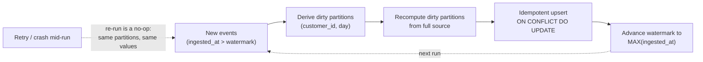
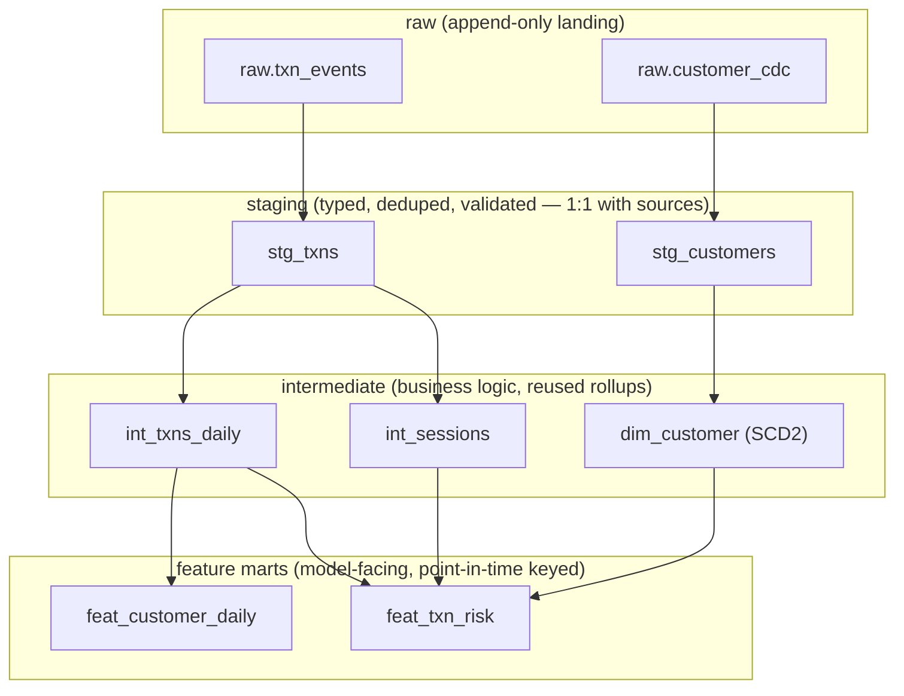

# Feature Engineering in SQL

The features that win in tabular ML — rolling velocities, ratios against an entity's own history, recency/frequency/monetary summaries, "how different is this from their normal?" — are all *temporal aggregations*, and SQL window functions are the sharpest tool ever built for computing them correctly at scale. But the gap between "knows window functions" and "can build a leakage-free feature pipeline" is exactly where senior interviews live: `ROWS` vs `RANGE` frame semantics, excluding the current row, gaps-and-islands sessionization, SCD2 dimensions that survive rebuilds, and incremental aggregation that stays idempotent when yesterday's data arrives tomorrow.

This guide assumes you already write fluent PostgreSQL. Every section is about the ML-specific correctness of the feature, not the syntax — and every snippet runs as-is against the sample schema at the top.

Part of the [Senior AI Engineer Roadmap](../00-Senior-AI-Engineer-Roadmap.md) — Phase 1.

---

## 1. The Worked Schema

All examples run against this. Note the two timestamps (`occurred_at` business time, `ingested_at` availability time) — the [point-in-time guide](./01-Point-in-Time-Correctness-and-Leakage.md) explains why both exist.

```sql
DROP TABLE IF EXISTS txns CASCADE;

CREATE TABLE txns (
    txn_id      bigint PRIMARY KEY,
    customer_id bigint NOT NULL,
    amount      numeric(12,2) NOT NULL,
    merchant    text NOT NULL,
    occurred_at timestamptz NOT NULL,
    ingested_at timestamptz NOT NULL
);
CREATE INDEX ON txns (customer_id, occurred_at);

INSERT INTO txns VALUES
 (1, 42,  25.00, 'grocery', '2026-03-01 09:00+00', '2026-03-01 09:00:05+00'),
 (2, 42,  60.00, 'fuel',    '2026-03-01 09:30+00', '2026-03-01 09:30:02+00'),
 (3, 42,  15.00, 'coffee',  '2026-03-01 09:30+00', '2026-03-01 09:31:00+00'),  -- same instant as txn 2!
 (4, 42, 500.00, 'electronics','2026-03-02 08:00+00', '2026-03-02 08:00:03+00'),
 (5, 42,  30.00, 'grocery', '2026-03-02 10:15+00', '2026-03-02 10:15:01+00'),
 (6, 42,  45.00, 'grocery', '2026-03-05 18:00+00', '2026-03-05 18:00:02+00'),
 (7,  7, 900.00, 'travel',  '2026-03-01 12:00+00', '2026-03-01 12:00:04+00'),
 (8,  7,  20.00, 'coffee',  '2026-03-03 07:45+00', '2026-03-03 07:45:01+00'),
 (9,  7,  22.00, 'coffee',  '2026-03-03 08:05+00', '2026-03-03 08:05:02+00'),
 (10, 7,  21.00, 'coffee',  '2026-03-03 09:20+00', '2026-03-03 09:20:01+00');
```

Transaction 3 is deliberately at the *same instant* as transaction 2 — the pair will expose the difference between every frame specification below.

---

## 2. ROWS vs RANGE vs GROUPS — the Precise Semantics

A window frame decides which peer rows an aggregate sees. Three frame modes, three different answers:

| Mode | Frame boundary unit | "CURRENT ROW" means | Ties (same ORDER BY value) |
|---|---|---|---|
| `ROWS` | physical row positions | exactly this one row | ties are *separate* rows |
| `RANGE` | values of the ORDER BY expression | **all peer rows with the same ORDER BY value** | ties are merged into the frame together |
| `GROUPS` | peer groups | this row's whole peer group | counts peer *groups*, not rows |

The ML consequence: for time-ordered features you almost always want `RANGE` with an interval offset, because "last 24 hours" is a statement about *time*, not about *row counts*. But `RANGE ... AND CURRENT ROW` silently includes **simultaneous events** — txn 3 sees txn 2 because they share `occurred_at`.

```sql
SELECT txn_id, occurred_at, amount,
       SUM(amount) OVER (PARTITION BY customer_id ORDER BY occurred_at
                         ROWS  BETWEEN UNBOUNDED PRECEDING AND CURRENT ROW) AS rows_sum,
       SUM(amount) OVER (PARTITION BY customer_id ORDER BY occurred_at
                         RANGE BETWEEN UNBOUNDED PRECEDING AND CURRENT ROW) AS range_sum
FROM txns WHERE customer_id = 42 ORDER BY occurred_at, txn_id;
-- txn_id | occurred_at         | amount | rows_sum | range_sum
--      1 | 2026-03-01 09:00    |  25.00 |    25.00 |     25.00
--      2 | 2026-03-01 09:30    |  60.00 |    85.00 |    100.00   <- RANGE already sees txn 3
--      3 | 2026-03-01 09:30    |  15.00 |   100.00 |    100.00
--      4 | 2026-03-02 08:00    | 500.00 |   600.00 |    600.00
--      5 | 2026-03-02 10:15    |  30.00 |   630.00 |    630.00
--      6 | 2026-03-05 18:00    |  45.00 |   675.00 |    675.00
```

Row 2's `range_sum` is 100, not 85: under `RANGE`, txn 3 is a *peer* of txn 2, so `CURRENT ROW` drags it in. If txn 3 is the row being *scored*, txn 2's feature just consumed an event the model cannot have at serving time — same-instant leakage. `ROWS` gives a stable running sum but depends on physical order among ties, which is **non-deterministic** unless you extend the ORDER BY with a unique key.

The senior summary: `ROWS` = deterministic only with unique ordering; `RANGE` = time-correct windows but peers are merged; the fix for both problems is the `EXCLUDE` clause, next.

---

## 3. "Transactions in the Last 24h, Excluding the Current One"

The canonical fraud feature, with the three subtleties interviews probe.

```sql
SELECT txn_id, customer_id, occurred_at, amount,
       COUNT(*)                 OVER w AS cnt_24h,
       COALESCE(SUM(amount) OVER w, 0) AS sum_24h,
       AVG(amount)              OVER w AS avg_24h
FROM txns
WINDOW w AS (
    PARTITION BY customer_id
    ORDER BY occurred_at
    RANGE BETWEEN INTERVAL '24 hours' PRECEDING AND CURRENT ROW
    EXCLUDE CURRENT ROW
)
ORDER BY customer_id, occurred_at, txn_id;
-- txn_id | customer_id | occurred_at      | amount | cnt_24h | sum_24h | avg_24h
--      8 |           7 | 2026-03-03 07:45 |  20.00 |       0 |    0.00 |  (null)
--      9 |           7 | 2026-03-03 08:05 |  22.00 |       1 |   20.00 | 20.00
--     10 |           7 | 2026-03-03 09:20 |  21.00 |       2 |   42.00 | 21.00
--      1 |          42 | 2026-03-01 09:00 |  25.00 |       0 |    0.00 |  (null)
--      2 |          42 | 2026-03-01 09:30 |  60.00 |       2 |   40.00 | 20.00   <- still sees txn 3!
--      3 |          42 | 2026-03-01 09:30 |  15.00 |       2 |   85.00 | 42.50
--      4 |          42 | 2026-03-02 08:00 | 500.00 |       2 |   75.00 | 37.50
--      5 |          42 | 2026-03-02 10:15 |  30.00 |       1 |  500.00 | 500.00
--      6 |          42 | 2026-03-05 18:00 |  45.00 |       0 |    0.00 |  (null)
```

Three subtleties:

1. **`EXCLUDE CURRENT ROW` is mandatory.** Without it, `sum_24h` includes the amount of the transaction being scored — the model learns "big transactions have big 24h sums", a tautology unavailable at decision time (the decision happens *before* the transaction is committed to history).
2. **`EXCLUDE CURRENT ROW` under `RANGE` removes only this one row, not its peers.** Look at txn 2: `cnt_24h = 2` — it still counts *simultaneous* txn 3. If strict "strictly before me" semantics matter (they do for fraud), you need `EXCLUDE TIES` as well? No — `EXCLUDE TIES` removes peers but *keeps* the current row. To drop the row **and** its peers, use `EXCLUDE GROUP`:

```sql
-- Strictly-before-me semantics: no current row, no same-instant peers
WINDOW w AS (PARTITION BY customer_id ORDER BY occurred_at
             RANGE BETWEEN INTERVAL '24 hours' PRECEDING AND CURRENT ROW
             EXCLUDE GROUP)
-- txn 2 now: cnt_24h = 1, sum_24h = 25.00 (only txn 1)
```

   Memorize the four: `EXCLUDE NO OTHERS` (default, keep all) / `EXCLUDE CURRENT ROW` / `EXCLUDE TIES` (keep me, drop peers) / `EXCLUDE GROUP` (drop me and peers).
3. **`COUNT(*)` vs `AVG`: empty-frame behavior differs.** An empty frame yields `COUNT = 0` but `AVG = NULL`. Decide explicitly whether the model should see 0, NULL, or a sentinel — and make serving do the *same thing* (see the [skew guide](./03-Training-Serving-Skew-and-Feature-Stores.md), where this exact divergence is a war story).

The boundary is also half-open in the wrong direction by default: `INTERVAL '24 hours' PRECEDING` *includes* the event exactly 24h ago. If your product definition is "(t-24h, t)", accept the inclusive edge or subtract a microsecond — but write the choice down, because serving must match it.

---

## 4. Ratio-to-Own-History Features

Absolute amounts are weak; *deviation from the entity's own baseline* is strong. The pattern is one long window and one short window over the same partition:

```sql
SELECT txn_id, customer_id, occurred_at, amount,
       amount / NULLIF(AVG(amount) OVER hist, 0)             AS amt_vs_30d_avg,
       (amount - AVG(amount) OVER hist)
           / NULLIF(STDDEV_SAMP(amount) OVER hist, 0)        AS amt_zscore_30d,
       COUNT(*) OVER day / NULLIF(COUNT(*) OVER hist / 30.0, 0) AS velocity_vs_norm
FROM txns
WINDOW
  hist AS (PARTITION BY customer_id ORDER BY occurred_at
           RANGE BETWEEN INTERVAL '30 days' PRECEDING AND CURRENT ROW EXCLUDE GROUP),
  day  AS (PARTITION BY customer_id ORDER BY occurred_at
           RANGE BETWEEN INTERVAL '24 hours' PRECEDING AND CURRENT ROW EXCLUDE GROUP)
ORDER BY customer_id, occurred_at, txn_id;
-- For txn 4 (customer 42, 500.00): history = txns 1,2,3 -> avg 33.33
--   amt_vs_30d_avg = 15.00, amt_zscore_30d ≈ 19.6  -> screams anomaly, exactly the signal you want
```

Correctness notes that separate senior answers:

- **`NULLIF(..., 0)` on every denominator.** A division error thrown by one degenerate customer kills the whole dataset build at 3 a.m.
- **The baseline must also exclude the current row** (`EXCLUDE GROUP` on `hist`), otherwise a huge anomalous transaction *drags its own baseline up* and partially masks itself — self-referential leakage that specifically weakens the model on the largest frauds, the ones you care about most.
- **Cold start is a feature, not a bug.** New customers get NULL ratios. Do not backfill with 1.0 ("perfectly normal") — "no history" is itself predictive, and serving will genuinely encounter it. Let the model see NULL/missing via its native missing-value handling.

---

## 5. RFM Features (Recency, Frequency, Monetary)

The classic churn/LTV triple, computed *as of a parameterized snapshot instant* — never `now()`, because dataset builds must be reproducible (see the [reproducibility guide](./04-Reproducible-Datasets-Versioning-and-Lineage.md)):

```sql
-- :snapshot_ts = '2026-03-06 00:00+00' for this run
WITH params AS (SELECT '2026-03-06 00:00+00'::timestamptz AS snapshot_ts)
SELECT c.customer_id,
       p.snapshot_ts,
       EXTRACT(epoch FROM p.snapshot_ts - MAX(t.occurred_at)) / 86400.0 AS recency_days,
       COUNT(*) FILTER (WHERE t.occurred_at >= p.snapshot_ts - INTERVAL '90 days') AS freq_90d,
       COALESCE(SUM(t.amount) FILTER (
           WHERE t.occurred_at >= p.snapshot_ts - INTERVAL '90 days'), 0) AS monetary_90d,
       NTILE(5) OVER (ORDER BY MAX(t.occurred_at) DESC)                  AS r_quintile,
       NTILE(5) OVER (ORDER BY COUNT(*))                                  AS f_quintile
FROM (SELECT DISTINCT customer_id FROM txns) c
JOIN txns t USING (customer_id)
CROSS JOIN params p
WHERE t.occurred_at < p.snapshot_ts          -- strictly before the snapshot instant
GROUP BY c.customer_id, p.snapshot_ts;
-- customer_id | recency_days | freq_90d | monetary_90d | r_quintile | f_quintile
--          42 |     0.25     |        6 |       675.00 |          1 |          5
--           7 |     2.61     |        3 |       943.00 |          2 |          1
```

Two ML-specific traps:

- **Quantile features (`NTILE`) are population-relative** — customer 42's `f_quintile = 5` depends on who else is in this snapshot. At serving time you cannot recompute quintiles over the live population per request; you must ship the *training-time bin edges* as constants and bucket against them. Teams that recompute quantiles online create population-drift skew.
- **Recency has a hard leakage failure**: computing `recency_days` relative to `MAX(occurred_at)` *in the dataset* instead of the snapshot instant makes every customer's recency depend on the dataset's end date — retrain next month and every value shifts. Always anchor to the explicit `snapshot_ts`.

---

## 6. Session Windows via Gaps-and-Islands

"Session" features (events per session, session length, time since last session) need sessionization: consecutive events belong to one session if the gap between them is under a threshold. There is no `SESSION WINDOW` in PostgreSQL — you build it with the gaps-and-islands pattern:

```sql
WITH gaps AS (                       -- step 1: measure the gap to the previous event
    SELECT txn_id, customer_id, occurred_at,
           occurred_at - LAG(occurred_at) OVER (PARTITION BY customer_id
                                                ORDER BY occurred_at, txn_id) AS gap
    FROM txns
), flagged AS (                      -- step 2: a new session starts when gap > threshold (or first event)
    SELECT *,
           (gap IS NULL OR gap > INTERVAL '30 minutes')::int AS is_session_start
    FROM gaps
), sessions AS (                     -- step 3: running sum of starts = session id
    SELECT *,
           SUM(is_session_start) OVER (PARTITION BY customer_id
                                       ORDER BY occurred_at, txn_id) AS session_seq
    FROM flagged
)
SELECT customer_id, session_seq,
       MIN(occurred_at) AS session_start,
       MAX(occurred_at) AS session_end,
       COUNT(*)         AS events_in_session,
       MAX(occurred_at) - MIN(occurred_at) AS session_duration
FROM sessions
GROUP BY customer_id, session_seq
ORDER BY customer_id, session_seq;
-- customer_id | session_seq | session_start    | session_end      | events | duration
--           7 |           1 | 2026-03-01 12:00 | 2026-03-01 12:00 |      1 | 00:00
--           7 |           2 | 2026-03-03 07:45 | 2026-03-03 08:05 |      2 | 00:20
--           7 |           3 | 2026-03-03 09:20 | 2026-03-03 09:20 |      1 | 00:00
--          42 |           1 | 2026-03-01 09:00 | 2026-03-01 09:30 |      3 | 00:30
--          42 |           2 | 2026-03-02 08:00 | 2026-03-02 08:00 |      1 | 00:00
--          42 |           3 | 2026-03-02 10:15 | 2026-03-02 10:15 |      1 | 00:00
--          42 |           4 | 2026-03-05 18:00 | 2026-03-05 18:00 |      1 | 00:00
```

The mechanism: `LAG` measures gaps, a boolean flags boundary rows, and a *running sum of the flags* assigns a monotonically increasing island id — every row inherits the count of session-starts at or before it. `ORDER BY occurred_at, txn_id` (unique tiebreak) keeps it deterministic.

ML correctness notes:

- **Per-event session features must be as-of the event, not the finished session.** `events_in_session` for a whole session is a *label-time* quantity — at the moment of event 2 of 5, serving only knows about 2. The point-in-time version replaces the final `GROUP BY` with windows: `COUNT(*) OVER (PARTITION BY customer_id, session_seq ORDER BY occurred_at, txn_id ROWS UNBOUNDED PRECEDING)` = events *so far this session*.
- **Sessionization near a batch boundary is unstable**: a session straddling midnight gets split if you sessionize each day independently. Sessionize over a window that extends one `threshold` before the batch start, then keep only sessions starting inside the batch.

---

## 7. SCD Type 2: Full Implementation

Entity attributes (tier, country, risk segment) change; training needs *what was true then*. Type 2 keeps every version as a validity interval. Here is the complete lifecycle: DDL, upsert/merge, and the AS-OF join.

### 7.1 DDL

```sql
DROP TABLE IF EXISTS dim_customer CASCADE;
CREATE TABLE dim_customer (
    customer_sk  bigint GENERATED ALWAYS AS IDENTITY PRIMARY KEY,  -- surrogate key per VERSION
    customer_id  bigint NOT NULL,                                   -- natural key
    tier         text   NOT NULL,
    country      text   NOT NULL,
    valid_from   timestamptz NOT NULL,
    valid_to     timestamptz NOT NULL DEFAULT 'infinity',
    is_current   boolean GENERATED ALWAYS AS (valid_to = 'infinity') STORED,
    EXCLUDE USING gist (customer_id WITH =, tstzrange(valid_from, valid_to) WITH &&)
);
-- The exclusion constraint makes overlapping versions IMPOSSIBLE, not just discouraged.
-- Requires: CREATE EXTENSION IF NOT EXISTS btree_gist;

INSERT INTO dim_customer (customer_id, tier, country, valid_from) VALUES
 (42, 'bronze', 'KE', '2026-01-01 00:00+00'),
 (7,  'gold',   'NG', '2026-01-15 00:00+00');
```

### 7.2 The Upsert (Close-and-Insert Merge)

A batch of attribute changes arrives (from CDC or a nightly extract). For each changed entity: close the current version at the change timestamp, insert the new version starting there. Unchanged entities must be *untouched* — rewriting identical versions destroys history granularity.

```sql
CREATE TEMP TABLE staged_changes (
    customer_id bigint, tier text, country text, changed_at timestamptz
);
INSERT INTO staged_changes VALUES
 (42, 'gold',   'KE', '2026-03-03 00:00+00'),   -- tier changed
 (7,  'gold',   'NG', '2026-03-03 00:00+00');   -- nothing changed -> must be a no-op

WITH real_changes AS (                -- only rows that actually differ from the current version
    SELECT s.*
    FROM staged_changes s
    JOIN dim_customer d
      ON d.customer_id = s.customer_id AND d.is_current
    WHERE (d.tier, d.country) IS DISTINCT FROM (s.tier, s.country)
), closed AS (                        -- close the outgoing version
    UPDATE dim_customer d
    SET valid_to = rc.changed_at
    FROM real_changes rc
    WHERE d.customer_id = rc.customer_id AND d.is_current
    RETURNING d.customer_id
)
INSERT INTO dim_customer (customer_id, tier, country, valid_from)
SELECT customer_id, tier, country, changed_at FROM real_changes;

SELECT customer_id, tier, valid_from, valid_to FROM dim_customer ORDER BY customer_id, valid_from;
-- customer_id | tier   | valid_from        | valid_to
--           7 | gold   | 2026-01-15        | infinity          <- untouched, correct
--          42 | bronze | 2026-01-01        | 2026-03-03        <- closed
--          42 | gold   | 2026-03-03        | infinity          <- new version
```

`IS DISTINCT FROM` (not `<>`) is the load-bearing detail: it treats NULLs sanely, so a NULL→NULL "change" doesn't spawn phantom versions. The whole statement is one atomic CTE chain — no window where a customer has zero current rows.

### 7.3 AS-OF Join Against SCD2

Interval containment — no `ORDER BY ... LIMIT 1` needed, and the GiST constraint's index accelerates it:

```sql
SELECT t.txn_id, t.occurred_at, t.amount, d.tier AS tier_at_txn_time
FROM txns t
LEFT JOIN dim_customer d
  ON d.customer_id = t.customer_id
 AND t.occurred_at >= d.valid_from
 AND t.occurred_at <  d.valid_to
WHERE t.customer_id = 42
ORDER BY t.occurred_at;
-- txn_id | occurred_at      | amount | tier_at_txn_time
--      1 | 2026-03-01 09:00 |  25.00 | bronze
--      2 | 2026-03-01 09:30 |  60.00 | bronze
--      3 | 2026-03-01 09:30 |  15.00 | bronze
--      4 | 2026-03-02 08:00 | 500.00 | bronze
--      5 | 2026-03-02 10:15 |  30.00 | bronze
--      6 | 2026-03-05 18:00 |  45.00 | gold      <- after the 03-03 upgrade
```

Half-open `[valid_from, valid_to)` intervals mean a transaction exactly at a version boundary matches exactly one version — closed-closed intervals double-match and closed-open-with-`<=` mismatches; this is the most common SCD2 join bug.

Why ML needs SCD2 at all: with a Type 1 (overwrite) dimension, txns 1–5 would *retroactively* become `gold` the day customer 42 upgrades — and if upgrades correlate with the label (they usually do: spend-driven tier changes), `tier` becomes a label proxy on historical rows. SCD2 makes rebuilding last year's dataset yield last year's truth.

---

## 8. Event Tables and Append-Only Design

Features should be derived from **immutable events**, not mutable state. The design rules:

```sql
CREATE TABLE feature_events (
    event_id    bigint GENERATED ALWAYS AS IDENTITY PRIMARY KEY,
    event_type  text NOT NULL,
    entity_id   bigint NOT NULL,
    occurred_at timestamptz NOT NULL,
    ingested_at timestamptz NOT NULL DEFAULT now(),
    payload     jsonb NOT NULL
);
REVOKE UPDATE, DELETE ON feature_events FROM PUBLIC;   -- enforced, not conventional
```

- Corrections are **compensating events** (`txn_reversed`), never edits — so "what we knew at time t" is always reconstructable by filtering `ingested_at < t`.
- Current state is a *projection* of events (a view or materialized rollup), inverting the CRUD habit of storing state and discarding history.
- Every feature in this guide is a fold over such events; that is what makes them point-in-time computable and the datasets rebuildable.

---

## 9. Incremental Aggregation: Idempotent Upserts and Watermarks

Recomputing all features from scratch nightly stops scaling; incremental builds are where correctness usually dies. Two disciplines keep them safe.

### 9.1 Idempotent Upserts

Every incremental load must be re-runnable without double counting. Never `+=` into an aggregate from "new" rows you might see twice; instead recompute the affected *grain* fully and upsert:

```sql
CREATE TABLE feat_customer_daily (
    customer_id bigint,
    day         date,
    txn_cnt     int,
    txn_sum     numeric(14,2),
    PRIMARY KEY (customer_id, day)
);

-- Recompute WHOLE days touched by this batch, then upsert. Running it twice is a no-op.
INSERT INTO feat_customer_daily (customer_id, day, txn_cnt, txn_sum)
SELECT customer_id, occurred_at::date, COUNT(*), SUM(amount)
FROM txns
WHERE occurred_at::date IN (SELECT DISTINCT occurred_at::date FROM txns
                            WHERE ingested_at > '2026-03-02 00:00+00')  -- days touched by new arrivals
GROUP BY customer_id, occurred_at::date
ON CONFLICT (customer_id, day) DO UPDATE
SET txn_cnt = EXCLUDED.txn_cnt, txn_sum = EXCLUDED.txn_sum;
```

The pattern: *derive the dirty partitions from the new data, recompute those partitions from source, replace them wholesale.* `DELETE + INSERT` per partition works equally well. What never works: `SET txn_cnt = txn_cnt + delta` — one retried job and every count is doubled, silently, forever.

### 9.2 Late-Arriving Data and Watermarks

Events arrive out of order: a transaction that *occurred* Monday can *arrive* Thursday (mobile offline sync, upstream retries, CDC lag). A watermark makes lateness explicit:

```sql
CREATE TABLE etl_watermark (
    pipeline text PRIMARY KEY,
    processed_through timestamptz NOT NULL   -- ingested_at high-water mark
);
INSERT INTO etl_watermark VALUES ('feat_customer_daily', '-infinity');

-- One incremental run, atomically: find new arrivals BY INGESTED_AT, recompute their business days
WITH new_rows AS (
    SELECT t.* FROM txns t, etl_watermark w
    WHERE w.pipeline = 'feat_customer_daily'
      AND t.ingested_at > w.processed_through
), dirty_days AS (
    SELECT DISTINCT customer_id, occurred_at::date AS day FROM new_rows
), recomputed AS (
    SELECT t.customer_id, t.occurred_at::date AS day, COUNT(*) AS c, SUM(t.amount) AS s
    FROM txns t JOIN dirty_days d
      ON t.customer_id = d.customer_id AND t.occurred_at::date = d.day
    GROUP BY 1, 2
), upserted AS (
    INSERT INTO feat_customer_daily
    SELECT customer_id, day, c, s FROM recomputed
    ON CONFLICT (customer_id, day) DO UPDATE
    SET txn_cnt = EXCLUDED.txn_cnt, txn_sum = EXCLUDED.txn_sum
    RETURNING 1
)
UPDATE etl_watermark
SET processed_through = (SELECT COALESCE(MAX(ingested_at), processed_through) FROM new_rows)
WHERE pipeline = 'feat_customer_daily';
```

The two rules the pattern encodes:

1. **Watermark on `ingested_at`, never `occurred_at`.** An `occurred_at` watermark permanently skips every late event — the exact rows that are often most informative (fraudsters exploit sync delays).
2. **Late data dirties *old* partitions** — Thursday's run rewrites Monday's aggregate. This is correct for training data ("what actually happened Monday") but means Monday's *served* feature values differed from the final Monday aggregate. If you retrain on the revised values, you have created training-serving skew for late-event-heavy features; the fix is logging served values (covered in [guide 03](./03-Training-Serving-Skew-and-Feature-Stores.md)).



---

## 10. The Feature Dependency DAG: Staging → Intermediate → Marts

At three features you write ad-hoc queries; at three hundred you need layers with dependency ordering — the idea dbt industrialized. The layering convention:



In plain PostgreSQL the layers are schemas + views/tables; in dbt each node is a model whose dependencies are declared by `ref()`:

```sql
-- models/staging/stg_txns.sql  (view: cheap, always fresh)
SELECT DISTINCT ON (txn_id)                      -- dedupe upstream retries
       txn_id, customer_id, amount, merchant, occurred_at, ingested_at
FROM {{ source('raw', 'txn_events') }}
ORDER BY txn_id, ingested_at;

-- models/intermediate/int_txns_daily.sql  (incremental table)
SELECT customer_id, occurred_at::date AS day, COUNT(*) AS txn_cnt, SUM(amount) AS txn_sum
FROM {{ ref('stg_txns') }}
GROUP BY 1, 2;

-- models/marts/feat_txn_risk.sql — composes intermediates; never reaches back to raw
SELECT t.txn_id, t.occurred_at, d.tier,
       i.txn_cnt AS prior_day_cnt
FROM {{ ref('stg_txns') }} t
LEFT JOIN {{ ref('dim_customer') }} d
  ON d.customer_id = t.customer_id
 AND t.occurred_at >= d.valid_from AND t.occurred_at < d.valid_to
LEFT JOIN {{ ref('int_txns_daily') }} i
  ON i.customer_id = t.customer_id AND i.day = t.occurred_at::date - 1;
```

Why the DAG matters for ML specifically:

- **One definition per feature, referenced everywhere** — the primary defence against training-serving skew (two models needing `txn_cnt_30d` must `ref()` the same node, not paste the SQL).
- **Lineage falls out for free**: "which raw tables feed this model's features?" is a graph traversal, which you need for incident response ("upstream table X was corrupted for 3 days — which models must be retrained?").
- **Tests attach to nodes**: uniqueness, non-null, accepted ranges, and leak checks (`feature_as_of <= decision_ts`) run per layer, so garbage is caught at staging instead of inside a trained model.
- **Layer discipline is a leakage firewall**: marts may only read intermediates and staging; nothing model-facing touches raw mutable state directly.

---

## Production War Stories & Failure Modes

### Story 1: The `RANGE CURRENT ROW` burst-fraud blind spot

- **Symptom**: Card-testing attacks (50 authorizations in the same second) were scored as *low* risk — the exact opposite of intent. Velocity features looked correct in ad-hoc queries.
- **Investigation**: Pulled the served feature vectors for one attack. `cnt_1h` for the *first* transaction of the burst was 49 — it had "seen" the other 49 simultaneous transactions. Every txn in the burst saw all the others, so the *ratio* features (this amount vs recent avg) normalized to ~1.0: perfectly normal-looking.
- **Root cause**: `RANGE ... AND CURRENT ROW EXCLUDE CURRENT ROW` in the training build. `EXCLUDE CURRENT ROW` removed each row itself but kept its same-instant *peers* in the frame. Offline this leaked "a burst is happening" into every feature; the model learned that high 1h-counts co-occur with... normal ratios, and the online path (which computed counts strictly-before) never reproduced the pattern.
- **Fix**: `EXCLUDE GROUP` in the training query, matching the online "strictly before now" semantics; retrained; burst recall recovered.
- **Prevention**: A CI test with two same-timestamp fixture rows asserting each row's window features exclude the other. Tie-heavy fixtures find frame bugs that realistic-looking data hides.

### Story 2: The doubled counts from a retried Airflow task

- **Symptom**: A churn model's precision degraded over two months. Feature drift monitoring flagged `txn_cnt_30d` distributions shifting right — customers appeared to be transacting more, but revenue was flat.
- **Investigation**: Picked 20 customers, recomputed `txn_cnt_30d` from raw events, compared with the feature table: feature values were 1.4–2× the true counts, and the multiplier correlated with... Airflow task retry counts on the incremental job.
- **Root cause**: The incremental aggregation did `UPDATE ... SET txn_cnt = txn_cnt + batch_delta`. The task occasionally succeeded in the database but failed to report success (network blip), so Airflow retried, and the delta was added twice. Non-idempotent increment + at-least-once orchestration = monotonically corrupting features.
- **Fix**: Rewrote as recompute-dirty-partitions + `ON CONFLICT DO UPDATE SET txn_cnt = EXCLUDED.txn_cnt` (assignment, not addition). Backfilled the feature table from raw events, retrained.
- **Prevention**: Rule adopted: *no `+=` anywhere in the ETL*; every job must be run-twice-safe, verified by a CI harness that runs each incremental job twice on fixtures and diffs the result against once.

### Story 3: The SCD2 dimension that quietly became Type 1

- **Symptom**: A credit-risk model's offline AUC jumped from 0.74 to 0.81 after a "no-op" data-platform migration. The team celebrated; a skeptical reviewer did not.
- **Investigation**: Feature importance now ranked `risk_segment` #1 (previously #7). Sampled historical rows: customers who later defaulted showed `risk_segment = 'high'` on training rows *dated before* the events that caused the segment change.
- **Root cause**: The migration rewrote the customer dimension load as a plain upsert — the merge lost the close-and-insert logic, so it overwrote current rows in place (Type 1). Old versions kept their rows but `valid_to` was never set, and the AS-OF join, hitting overlapping intervals, matched the *newest* row. Post-outcome segments leaked onto pre-outcome examples.
- **Fix**: Restored the close-and-insert merge; added the GiST exclusion constraint so overlapping validity intervals are a *database error*, not a silent behavior; rebuilt the dimension from CDC history; retrained (AUC honestly back to 0.74).
- **Prevention**: The exclusion constraint plus a dbt test asserting exactly one `is_current` row per natural key. And an institutional rule: any unexplained offline metric *improvement* after a pipeline change is treated as a leak until proven otherwise.

### Story 4: The midnight session split

- **Symptom**: A recommender's "session length" feature had a sawtooth distribution — a spike of 1-event sessions at 00:00–00:30 local time every day.
- **Investigation**: Sessions were computed per daily batch partition. A session straddling midnight was cut in two: the pre-midnight half lost its tail, the post-midnight half appeared as a fresh short session.
- **Root cause**: Sessionizing inside a partition boundary that has no business meaning. Gaps-and-islands is correct only over a contiguous event stream.
- **Fix**: Each daily run sessionizes `[batch_start - 30 min lookback-threshold, batch_end]` and keeps only sessions whose *start* falls inside the batch window; late-arriving events also mark their session's day dirty for recompute.
- **Prevention**: Distribution tests on session features (no time-of-day spikes) and a fixture with a midnight-straddling session in CI.

---

## Best Practices

- Default to `RANGE` frames with interval bounds for time features; use `EXCLUDE GROUP` (not just `EXCLUDE CURRENT ROW`) when serving semantics are "strictly before now" — and test with same-timestamp fixture rows.
- Make every window deterministic: extend `ORDER BY` with a unique key wherever `ROWS` frames or `LAG/LEAD` are involved.
- Guard every ratio with `NULLIF` denominators, and exclude the current row (and its peers) from its own baseline.
- Keep cold-start NULLs as NULLs; "no history" is signal, and serving will see it too. Decide 0-vs-NULL per feature, write it down, and make training and serving match.
- Anchor every snapshot feature to an explicit `:snapshot_ts` parameter — never `now()`, never `MAX(occurred_at)` of the dataset.
- Ship training-time bin edges (quantiles, `NTILE` boundaries) as constants to serving; never recompute population-relative features online.
- SCD2: half-open intervals, `IS DISTINCT FROM` change detection, close-and-insert as one atomic statement, GiST exclusion constraint to make overlap impossible.
- Derive features from append-only events (`REVOKE UPDATE, DELETE`); corrections are compensating events.
- Incremental jobs: recompute dirty partitions wholesale and upsert by assignment; watermark on `ingested_at`; every job run-twice-safe, verified in CI.
- Layer the DAG (staging → intermediate → marts), give each feature exactly one defining node, and forbid marts from reading raw.

---

## Interview Drills

<details><summary>Explain precisely what differs between ROWS, RANGE, and GROUPS frames — and which is right for "sum of amounts in the last 24 hours"?</summary>
ROWS bounds the frame by physical row offsets; RANGE bounds it by the ORDER BY expression's <em>values</em> (so `INTERVAL '24 hours' PRECEDING` is expressible, and all rows sharing the current row's ORDER BY value — peers — are in or out together); GROUPS bounds it by counts of peer groups. "Last 24 hours" is a statement about time, so RANGE with an interval bound is correct — ROWS BETWEEN 23 PRECEDING would count <em>rows</em>, which only matches if events arrive exactly hourly. The catch: under RANGE, "CURRENT ROW" as an end bound means "through my entire peer group", so simultaneous events are included.
<br><br><strong>Follow-up: your ORDER BY has ties and you use a ROWS frame — what goes wrong?</strong> The frame content depends on the physical order among tied rows, which PostgreSQL does not guarantee — the same query can return different feature values run-to-run, making the dataset non-reproducible. Fix: extend the ORDER BY with a unique key (`ORDER BY occurred_at, txn_id`).
<br><br><strong>Follow-up: does the same hazard exist for LAG/LEAD?</strong> Yes — LAG/LEAD are pure row-offset functions, so with ambiguous ordering their output is nondeterministic too. Any window ORDER BY that can tie needs a unique tiebreaker.
</details>

<details><summary>Why is EXCLUDE CURRENT ROW insufficient for a fraud velocity feature, and what do you use instead?</summary>
Under a RANGE frame, EXCLUDE CURRENT ROW removes only the current row itself — its <em>peers</em> (rows with an identical timestamp) stay in the frame. In a card-testing burst of 50 same-second authorizations, each transaction's "count in last hour" would be 49: the feature has seen the simultaneous attack it is supposed to detect, which serving (computing strictly-before-now) cannot reproduce. EXCLUDE GROUP removes the current row <em>and</em> all its peers, matching "strictly before me" semantics. The full set: EXCLUDE NO OTHERS (default), EXCLUDE CURRENT ROW, EXCLUDE TIES (keep me, drop peers), EXCLUDE GROUP (drop me and peers).
<br><br><strong>Follow-up: when would EXCLUDE TIES be the right choice?</strong> When the current row's own value legitimately belongs in the aggregate but simultaneous <em>other</em> events don't — e.g., a running "my cumulative spend including this purchase" display metric. For decision-time ML features it's almost never right, because the current row's value is the thing being predicted about.
<br><br><strong>Follow-up: how would you catch this class of bug in CI?</strong> A fixture with two or more rows sharing an exact timestamp, asserting each row's window features exclude the others. Realistic random test data almost never contains exact ties, which is why this bug survives most test suites.
</details>

<details><summary>Walk me through gaps-and-islands sessionization. Why can't you just GROUP BY date_trunc('hour', ts)?</summary>
Fixed buckets (date_trunc) split behavioral sessions arbitrarily — a session from 09:55 to 10:10 lands in two buckets, and two unrelated visits at 09:01 and 09:59 land in one. Gaps-and-islands defines sessions behaviorally: (1) LAG computes each event's gap from the previous event per entity; (2) a boolean flags rows where gap IS NULL or gap > threshold — session starts; (3) a running SUM of that flag over the ordered partition assigns each row a session id, because every row inherits the number of session starts at or before it. Then group by (entity, session_id).
<br><br><strong>Follow-up: your pipeline runs daily — what happens to a session that straddles midnight, and how do you fix it?</strong> Sessionized per-day, it is cut in two: the first half loses its tail, the second appears as a spurious new session — visible as a spike of short sessions just after the batch boundary. Fix: sessionize over the batch window extended backwards by at least the gap threshold, then emit only sessions whose start falls inside the batch window; late events must mark their session's partition dirty for recompute.
<br><br><strong>Follow-up: "events so far in this session" for real-time scoring — what changes?</strong> The final GROUP BY becomes a window: COUNT(*) OVER (PARTITION BY entity, session_id ORDER BY ts, id ROWS UNBOUNDED PRECEDING), optionally EXCLUDE-ing the current row. Whole-session aggregates (total events, final duration) are label-time quantities — using them as features is leakage, since mid-session serving cannot know how the session ends.
</details>

<details><summary>Implement SCD Type 2 change capture: what are the pieces, and where do implementations usually go wrong?</summary>
Pieces: (1) a version table with natural key, attributes, half-open [valid_from, valid_to) interval, surrogate key per version; (2) a merge that first filters staged rows to <em>real</em> changes via IS DISTINCT FROM against the current version, then closes the outgoing version (valid_to = changed_at) and inserts the new one — atomically, ideally one CTE chain; (3) a GiST exclusion constraint on (natural key, tstzrange) so overlapping versions are a database error. Common failures: using <> instead of IS DISTINCT FROM (NULL comparisons spawn phantom versions or miss real changes); creating new versions for unchanged rows (destroys change-history granularity); closed-closed intervals (boundary instants match two versions); non-atomic close-then-insert (a crash between them leaves the entity with no current row); and the silent regression to Type 1 when someone "simplifies" the merge to a plain upsert.
<br><br><strong>Follow-up: why does ML care about Type 2 vs Type 1 more than a BI dashboard does?</strong> A dashboard shows current state, so overwriting is at worst cosmetically wrong. Training data reconstructs past decisions: Type 1 joins today's attribute onto old examples, so (a) datasets silently change on every attribute update — irreproducible — and (b) attributes that change <em>because of</em> outcomes (risk segment set to 'high' after fraud confirmation) become label proxies, inflating offline metrics with information that didn't exist at decision time.
<br><br><strong>Follow-up: your SCD2 table records when changes were applied to the warehouse, but the attribute actually changed earlier in the source. Which timestamp should valid_from carry?</strong> Ideally both exist: business validity (when it became true) and system validity (when the warehouse learned it) — a bitemporal design. For training joins you must use <em>system</em> availability, because serving can only act on what has arrived; joining on business validity backdates knowledge you didn't have (availability leakage). If you keep only one, keep system time.
</details>

<details><summary>Why must incremental feature aggregation be idempotent, and what does the correct pattern look like?</summary>
Because orchestration is at-least-once: retries, replays, and crash-recovery mean any job can run twice against overlapping input. A += pattern (UPDATE SET cnt = cnt + delta) double-counts on any replay — the corruption is silent, cumulative, and unfixable without a rebuild from raw. Correct pattern: derive the set of dirty partitions (e.g., (customer, day)) from the newly arrived rows, recompute those partitions <em>entirely</em> from source, and write with assignment semantics — ON CONFLICT DO UPDATE SET cnt = EXCLUDED.cnt, or DELETE+INSERT per partition. Running it twice recomputes the same partitions to the same values: a no-op.
<br><br><strong>Follow-up: how do you verify idempotency rather than just claim it?</strong> A CI harness runs every incremental job twice consecutively on a fixture and asserts the target table is byte-identical after run 2; a second test crashes the job midway (kill between upsert and watermark advance) and asserts a rerun converges to the same state.
<br><br><strong>Follow-up: the recompute-partition approach reads more data than the pure delta — when is that a problem and what then?</strong> When partitions are huge (a whale customer's daily grain, or global aggregates). Options: shrink the grain so recomputes stay bounded; keep additive <em>component</em> aggregates (count, sum, sum of squares) that can be safely recombined, storing them per micro-batch keyed by a batch id so replays overwrite rather than add; or move that feature to a streaming engine with exactly-once sinks. What you never do is += into the final aggregate.
</details>

<details><summary>Design the watermark logic for a feature pipeline where events can arrive days late. Which column does the watermark track and why?</summary>
The watermark tracks ingested_at (arrival time), never occurred_at (business time). Each run selects rows with ingested_at > watermark, derives the business-time partitions those rows touch, recomputes those partitions, upserts, then advances the watermark to MAX(ingested_at) of the processed rows — in the same transaction as the upsert. An occurred_at watermark would permanently skip every late event: a Monday transaction arriving Thursday sits below a watermark that has already passed Monday.
<br><br><strong>Follow-up: late data rewrites Monday's aggregate on Thursday. Is that correct?</strong> For the historical record, yes — Monday's true totals include the late event. But it creates a subtlety: the feature value <em>served</em> on Monday was computed without the late event, while the retrained model sees the revised value. For late-heavy features that's training-serving skew; the honest fix is logging served feature vectors and training on the logs, or building features on ingested_at-based windows ("events that had arrived in the 24h before decision") so training reconstructs exactly what serving knew.
<br><br><strong>Follow-up: the watermark update and the upsert are separate statements — what failure mode appears and how do you close it?</strong> Crash after upsert, before watermark advance: next run reprocesses the same rows. That's why the upsert must be idempotent — then the reprocess is harmless. Crash after watermark advance but before upsert commit is worse (data loss), which is why both must be in one transaction, watermark last.
</details>

<details><summary>Your model needs "customer's spend this transaction vs their trailing 30-day average". Write the feature and name every correctness hazard.</summary>
amount / NULLIF(AVG(amount) OVER (PARTITION BY customer_id ORDER BY occurred_at RANGE BETWEEN INTERVAL '30 days' PRECEDING AND CURRENT ROW EXCLUDE GROUP), 0). Hazards: (1) the baseline must exclude the current row and its same-instant peers (EXCLUDE GROUP), or a large fraud partially masks itself by inflating its own denominator; (2) NULLIF against zero-average degenerate histories, or the build dies on division; (3) cold start — new customers get NULL, which should stay NULL rather than be imputed to 1.0, because "no history" is signal and serving will see it; (4) for batch snapshot variants, the window must end strictly before the snapshot instant; (5) serving must implement the identical boundary (inclusive 30-days-ago edge or not) and identical null policy, or you've built skew.
<br><br><strong>Follow-up: the distribution of this ratio is extremely heavy-tailed. Do you clip it in SQL?</strong> Transformations that are part of the feature definition (log, clipping bounds) should live in the single shared definition so training and serving match — but the <em>bounds</em> must be computed from training data only and shipped as constants, never recomputed per-batch, or the feature's meaning drifts with the population. Alternatively leave clipping to the model pipeline's preprocessing, as long as that same preprocessing artifact is applied at serving.
</details>

<details><summary>What is the staging → intermediate → mart layering for, in ML terms — not just tidiness?</summary>
Three ML-specific payoffs. (1) Skew defence: each feature has exactly one defining node that every consumer refs — two models can't quietly diverge on what txn_cnt_30d means. (2) Lineage: the ref() graph answers "this raw table was corrupt for 3 days — which feature marts and therefore which trained models are contaminated?" — an incident-response query you cannot answer from a pile of ad-hoc SQL. (3) A leakage firewall: marts are only allowed to read intermediates/staging, never raw mutable state, and validation tests (uniqueness, non-null, accepted ranges, feature_as_of <= decision_ts) attach per node so bad data is stopped at the layer boundary instead of inside a trained artifact.
<br><br><strong>Follow-up: views or tables per layer?</strong> Staging: views (cheap, always consistent with source, dedupe logic only). Intermediate: tables/incremental models when reused by several marts or expensive (sessionization, SCD2). Marts: materialized tables, because training reads must be stable and repeatable, and because you want to snapshot them for versioned datasets. The general rule: materialize where reuse or reproducibility demands it, view otherwise.
<br><br><strong>Follow-up: where do tests for point-in-time correctness live in this DAG?</strong> At the mart layer, as data tests on the model-facing tables: every feature column carries or implies an as-of timestamp, and a test asserts feature_as_of &lt;= decision_ts row-wise; plus fixture-based unit tests on the AS-OF join logic itself at the intermediate layer.
</details>

<details><summary>NTILE-based RFM quintiles worked offline but misbehave in serving. Why?</summary>
NTILE is population-relative: a customer's quintile depends on everyone else in the batch. Serving one customer at a time, you cannot recompute the population ranking per request — and if you recompute quantiles over the <em>live</em> population nightly, the bin edges drift away from the ones the model was trained against, so the same raw frequency maps to a different quintile than in training: population-drift skew. Fix: compute quantile boundaries once on the training population, ship them as constants (in the model artifact or feature metadata), and bucket serving values against those frozen edges. Re-derive edges only at retrain time, versioned with the model.
<br><br><strong>Follow-up: is the same trap present anywhere besides NTILE?</strong> Yes — any population-relative transform: rank features, percentile features, z-scores normalized by <em>batch</em> mean/std instead of a frozen scaler, target encoding recomputed per batch, and "share of total" features where the denominator is the batch total. The rule: anything whose value depends on other rows in the batch must have its reference statistics frozen at training time.
</details>

<details><summary>When do you compute a feature with a per-event window function versus a periodic snapshot table, and what are the tradeoffs?</summary>
Per-event windows (RANGE frames over the event stream) give exact as-of-event values — maximal freshness and precision, ideal for transaction-level decisioning — but are computed at training-build time and must be mirrored by an online path that can do the same computation in milliseconds. Periodic snapshots (daily feature table keyed by (entity, computed_at)) are cheap, cache-friendly, easy to serve (point lookup), and easy to AS-OF join, but carry staleness up to the snapshot interval, and the training join must respect computed_at &lt;= decision_ts — the "grab latest row" join is the classic leak. Choose per-event for fast-decaying signals (velocity, session position), snapshots for slow aggregates (30-day averages, tenure, RFM). The empirical tiebreak: train with artificially staled features and measure the lift freshness actually buys before paying for the streaming path.
<br><br><strong>Follow-up: with daily snapshots computed at 02:00, what exact predicate does the training join need?</strong> A LATERAL as-of join: the newest snapshot row with computed_at &lt;= the example's decision timestamp — not date equality, which off-by-ones around the 02:00 boundary (a 01:00 transaction must join <em>two days'</em> prior snapshot, since that day's 02:00 run hasn't happened yet). And computed_at must record when the snapshot was <em>available</em>, not the nominal data date, or you leak the gap between data date and job completion.
</details>

<details><summary>A teammate's feature query uses ORDER BY occurred_at DESC LIMIT 1 to get "the latest customer attribute" in the training build. Review it.</summary>
Reject it: "latest" is a serving-time concept. In a training build, each example must join the attribute as of <em>its own</em> decision timestamp — the newest version with valid_from &lt;= ts &lt; valid_to (SCD2) or computed_at &lt;= ts (snapshots). ORDER BY DESC LIMIT 1 with no time bound joins the attribute's <em>current</em> value onto historical rows — future leakage, and worse, the specific kind that self-inflates offline metrics when attributes respond to outcomes. Also flag: ties on the sort key make LIMIT 1 nondeterministic without a unique tiebreaker; and if the attribute table is mutable (Type 1), even the corrected query can't recover history — the schema itself must change to SCD2 or events.
<br><br><strong>Follow-up: they respond "but at serving time we DO use the latest value, so training should match serving!" — resolve the apparent paradox.</strong> Serving uses the latest value <em>as of the decision moment</em>; that is exactly what the point-in-time join reconstructs for each historical example — each training row gets what was latest <em>then</em>. Joining what is latest <em>now</em> gives historical examples information from after their decision moment, which serving never has. Training-serving consistency means matching the <em>information availability rule</em>, not the literal query text.
</details>

<details><summary>How would you build "distinct merchants in the last 7 days" — and why is it harder than count/sum features?</summary>
COUNT(DISTINCT ...) is not supported as a window function in PostgreSQL, and distincts are not additive — you cannot combine per-day distinct counts into a weekly one. Options: (1) exact per-event via a LATERAL subquery (SELECT COUNT(DISTINCT merchant) FROM txns t2 WHERE t2.customer_id = t.customer_id AND t2.occurred_at &gt;= t.occurred_at - INTERVAL '7 days' AND t2.occurred_at &lt; t.occurred_at) — correct, indexed on (customer_id, occurred_at), but O(rows × window size); (2) daily grain: store per-day merchant <em>sets</em> (array_agg DISTINCT) and union+distinct 7 days at query time — bounded work; (3) approximate: HLL sketches (postgresql-hll extension), which <em>are</em> mergeable, so 7 daily sketches union into a weekly distinct estimate — the standard warehouse answer at scale. The senior point: non-additive aggregates (distincts, medians, percentiles) break naive incremental designs, so either pay exact-recompute on a bounded grain or switch to mergeable sketches, and note the approximation in the feature's documentation because serving must use the same method.
<br><br><strong>Follow-up: the LATERAL version and the sketch version disagree by ~2% — does it matter?</strong> Only if training and serving use <em>different</em> methods — then the 2% is systematic skew. Consistency beats exactness: pick one implementation, use it on both paths, and record the expected error bound with the feature definition.
</details>

<details><summary>Everything in your feature mart is derived from an events table someone just "cleaned up" with an UPDATE. What breaks, and how should the table have been designed?</summary>
Every downstream guarantee breaks at once: historical feature rebuilds no longer reproduce what models were trained on (the past has been edited); point-in-time joins now return values that never existed at decision time; the dataset manifest's checksums fail; and there is no record of what changed, so contamination scope is unknowable — you must assume every model trained on the table is suspect. Design that prevents it: REVOKE UPDATE, DELETE on the events table so append-only is a privilege, not a convention; corrections modeled as compensating events (txn_reversed, amount_adjusted) carrying their own ingested_at, so both "what we knew then" and "what we know now" remain queryable; current state exposed as a projection view over events for anyone who "just needs the fixed number".
<br><br><strong>Follow-up: the UPDATE already happened and there's no WAL archive. Recovery plan?</strong> Triage, not recovery: identify affected rows via the app team's change script or backups/replicas if any exist; quarantine the time range; rebuild what's possible from upstream sources (the original producer, Kafka retention, raw landing files); for the unrecoverable span, mark datasets built over it as non-reproducible in their manifests, and prioritize models by how much of their training data overlaps the span. Then fix the privileges so it cannot recur — the postmortem action is structural, not "be more careful".
</details>

<details><summary>Sketch the end-to-end flow from raw events to a served window feature, naming where each correctness control lives.</summary>
Raw landing (append-only, REVOKE UPDATE/DELETE; records ingested_at) → staging (typed, DISTINCT ON dedupe of upstream retries; schema/range validation tests) → intermediate (sessionization with boundary lookback; SCD2 dimension with exclusion constraint; incremental daily aggregates with ingested_at watermark and idempotent partition upserts) → feature mart (point-in-time keyed rows: entity, feature values, computed_at/as-of timestamp; leak test feature_as_of &lt;= decision_ts; single defining node per feature) → training build (LATERAL as-of join, deterministic ORDER BY, parameterized build_ts, versioned snapshot) and online serving (same definitions materialized to a low-latency store; served vectors logged for skew diffing). Controls at every arrow: privileges at raw, tests at staging, constraints at intermediate, leak assertions at mart, manifests at training, logging at serving.
<br><br><strong>Follow-up: if you could only keep three of those controls, which?</strong> (1) Append-only raw with both timestamps — without it nothing downstream is reconstructible; (2) the single-definition feature mart with as-of keys — it's the chokepoint that makes both leakage and skew auditable; (3) served-feature logging — it's the only control that catches whatever the other two missed, because it measures reality rather than intent.
</details>
