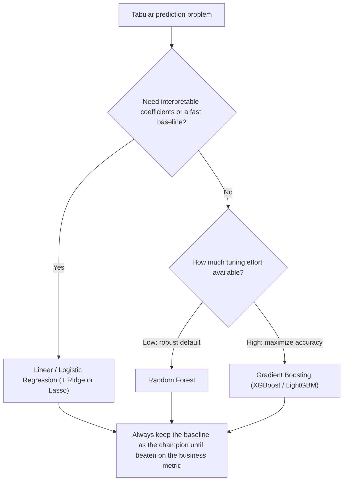
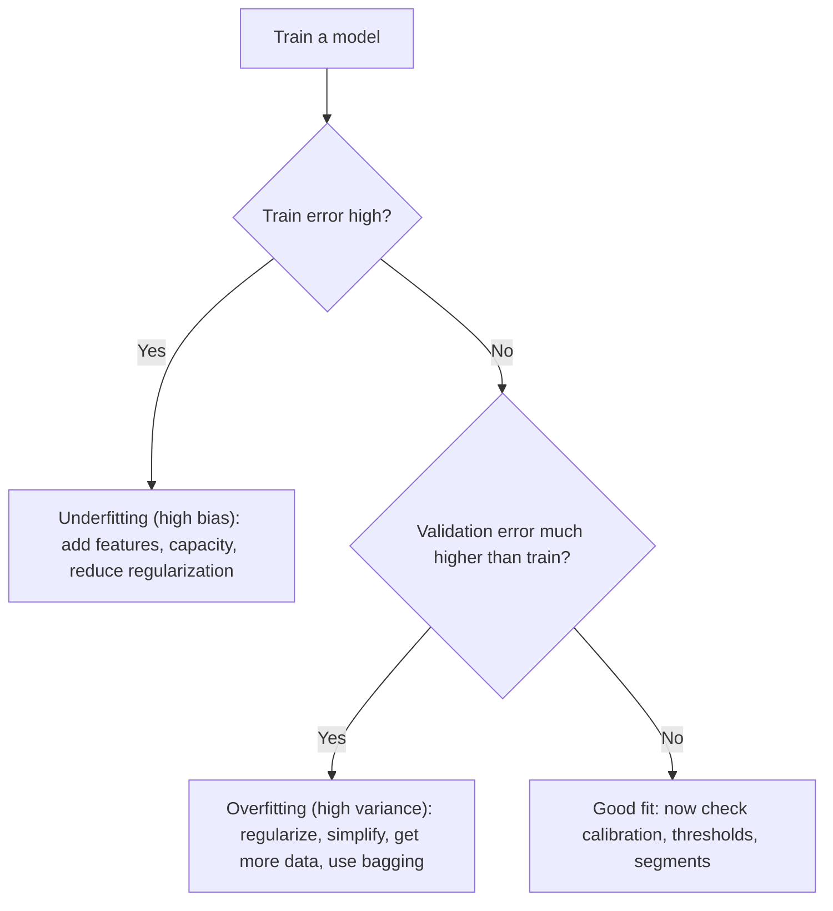

# Classical Machine Learning

Classical ML is where you learn the engineering disciplines that make every later phase possible: baselines, feature quality, leakage detection, honest evaluation, calibration, and threshold selection tied to business cost. A senior engineer who cannot debug a logistic regression will not be able to debug a transformer. This guide expands Phase 2 into practical depth with scikit-learn, XGBoost, and MLflow.

Part of the [Senior AI Engineer Roadmap](./00-Senior-AI-Engineer-Roadmap.md) — Phase 2.

---

## 1. Supervised Learning: How Each Algorithm Works and When to Choose It

### 1.1 Linear Regression

Fits `y = Xw + b` by minimizing mean squared error. The closed-form solution is `w = (XᵀX)⁻¹Xᵀy`; in practice solvers use QR/SVD or gradient descent.

**Choose it when:** you need a fast, interpretable baseline for a continuous target; the relationship is roughly linear; you must explain coefficients to a regulator or stakeholder.

**Watch out for:** multicollinearity (unstable coefficients), outliers (squared loss is sensitive), and extrapolation beyond the training range.

### 1.2 Logistic Regression

Despite the name, a classifier. It models `P(y=1|x) = sigmoid(w·x + b)` and is trained by minimizing log loss (cross-entropy). Coefficients are log-odds contributions, which makes it the standard interpretable baseline for credit, fraud, and medical risk.

**Choose it when:** you need calibrated-ish probabilities, interpretability, fast training/serving, or a baseline any challenger must beat.

### 1.3 Regularization: Ridge, Lasso, Elastic Net

Regularization adds a penalty on weight magnitude to the loss, trading a little bias for a large reduction in variance.

| Penalty | Formula added to loss | Effect |
| --- | --- | --- |
| Ridge (L2) | `alpha * sum(w_j^2)` | Shrinks all weights smoothly; handles correlated features by sharing weight |
| Lasso (L1) | `alpha * sum(abs(w_j))` | Drives some weights to exactly zero — implicit feature selection |
| Elastic Net | mix of L1 + L2 | Sparse like Lasso but stable under correlated features |

Rule of thumb: Ridge when most features matter a little; Lasso when you believe few features matter and want sparsity; Elastic Net when features are correlated and you still want sparsity. Always scale features before L1/L2 — the penalty is scale-sensitive.

### 1.4 Decision Trees

A tree greedily picks the split (feature, threshold) that most reduces impurity (Gini or entropy for classification, variance for regression). Trees capture non-linearities and interactions automatically, need no scaling, and handle mixed feature types — but a single deep tree overfits badly (high variance).

### 1.5 Random Forests

Bagging: train many deep trees on bootstrap samples, with a random subset of features considered at each split, then average (or vote). Averaging many decorrelated high-variance/low-bias trees slashes variance. Forests are robust defaults: little tuning, hard to overfit catastrophically, built-in out-of-bag error estimates and feature importances.

**Choose it when:** tabular data, you want strong accuracy with minimal tuning, and parallel training is fine.

### 1.6 Gradient Boosting and XGBoost

Boosting builds shallow trees **sequentially**; each new tree fits the gradient of the loss with respect to the current ensemble's predictions (i.e., the residual errors). XGBoost/LightGBM/CatBoost add second-order gradients, L1/L2 regularization on leaf weights, histogram-based split finding, and clever handling of missing values and categoricals.

**Choose it when:** tabular data and you want maximum accuracy — gradient boosting is still the strongest family on most structured-data problems. It needs more careful tuning than a forest (learning rate, tree depth, subsampling, early stopping) and is easier to overfit.



### 1.7 The Bias-Variance Trade-off

- **High bias (underfitting):** train and validation error both high, close together. Fix: more capacity, better features, less regularization.
- **High variance (overfitting):** train error low, validation error much higher. Fix: more data, regularization, simpler model, bagging.



---

## 2. Unsupervised Learning

### 2.1 K-Means

Alternates: assign each point to the nearest centroid; recompute centroids as cluster means. Minimizes within-cluster squared distance. Assumes roughly spherical, similar-sized clusters; requires choosing `k` (elbow method, silhouette score). Always scale features first.

### 2.2 DBSCAN

Density-based: points with at least `min_samples` neighbors within `eps` are core points; clusters grow from connected core points; sparse points become **noise**. No `k` needed, finds arbitrary shapes, produces an outlier label for free. Struggles when densities vary widely across clusters.

### 2.3 Gaussian Mixture Models

Probabilistic k-means: data is modeled as a mixture of Gaussians fitted with Expectation-Maximization. Gives **soft assignments** (probability of membership) and elliptical clusters. Use BIC/AIC to pick the number of components.

### 2.4 PCA

Finds orthogonal directions of maximum variance (eigenvectors of the covariance matrix / SVD of the centered data). Uses: decorrelation, compression, visualization, noise reduction. Fit PCA **only on training data** — fitting on the full dataset is leakage.

### 2.5 Isolation Forest

Anomaly detection by random recursive splitting: anomalies are isolated in fewer splits, so short average path length = anomalous. Fast, scales well, needs no distance metric — a strong first tool for fraud and outlier screening.

> Roadmap warning worth memorizing: clusters can be mathematically present but commercially meaningless. Always validate segments against a business outcome.

---

## 3. Evaluation, Deeply

### 3.1 Confusion Matrix Walkthrough

Fraud example, 10,000 transactions, 100 actually fraudulent, model flags 150:

```text
                    Predicted fraud   Predicted legit
Actually fraud         TP = 70           FN = 30
Actually legit         FP = 80           TN = 9,820
```

- **Precision** = TP / (TP + FP) = 70/150 = 0.467 — of the transactions we flagged, how many were really fraud? Governs analyst workload and customer friction.
- **Recall** = TP / (TP + FN) = 70/100 = 0.70 — of real fraud, how much did we catch? Governs fraud losses.
- **F1** = harmonic mean = 2PR/(P+R) ≈ 0.56 — a single number when you must balance both, but it hides the trade-off; prefer reporting both.
- **Accuracy** = 9,890/10,000 = 98.9% — nearly meaningless here: predicting "never fraud" scores 99.0%. This is why accuracy is a trap on imbalanced data.

### 3.2 ROC-AUC vs PR-AUC

- **ROC curve:** true positive rate vs false positive rate across all thresholds. AUC = probability a random positive scores higher than a random negative.
- **PR curve:** precision vs recall across thresholds.

**When PR-AUC matters:** under heavy class imbalance. FPR's denominator is the huge negative class, so thousands of extra false positives barely move FPR and ROC-AUC stays flattering. Precision's denominator is your own predictions, so those same false positives crater it. For fraud at 1% prevalence, a model with ROC-AUC 0.95 can still have unusable precision; PR-AUC exposes that. Use ROC-AUC for balanced problems and ranking quality; use PR-AUC when the positive class is rare and false positives are costly.

### 3.3 Log Loss and Calibration

Log loss `-(y log p + (1-y) log(1-p))` scores the **probabilities**, not just the ranking, and punishes confident wrong predictions brutally. A model is **calibrated** if, among cases where it says 0.8, about 80% are positive. Ranking metrics (AUC) can be great while calibration is terrible — common with boosted trees and SVMs.

Why it matters: expected-loss decisions ("decline if `p * exposure > review_cost`") are garbage if `p` is uncalibrated. Check with a reliability curve; fix with `CalibratedClassifierCV` (Platt scaling / isotonic) fitted on held-out data.

```python
from sklearn.calibration import CalibratedClassifierCV, calibration_curve

calibrated = CalibratedClassifierCV(base_model, method="isotonic", cv=5)
calibrated.fit(X_train, y_train)
prob_true, prob_pred = calibration_curve(y_val, calibrated.predict_proba(X_val)[:, 1], n_bins=10)
# A calibrated model tracks the diagonal: prob_true ≈ prob_pred
```

### 3.4 Threshold Selection Tied to Business Cost

The 0.5 default threshold is an accident of math, not a business decision. Pick the threshold that minimizes expected cost:

```python
import numpy as np
from sklearn.metrics import confusion_matrix

COST_FN = 500.0   # missed fraud: average loss per fraudulent transaction
COST_FP = 15.0    # false alarm: manual review + customer friction

probs = model.predict_proba(X_val)[:, 1]
thresholds = np.linspace(0.01, 0.99, 99)
costs = []
for t in thresholds:
    preds = (probs >= t).astype(int)
    tn, fp, fn, tp = confusion_matrix(y_val, preds).ravel()
    costs.append(fn * COST_FN + fp * COST_FP)

best_t = thresholds[int(np.argmin(costs))]
print(f"Business-optimal threshold: {best_t:.2f}, expected cost: {min(costs):,.0f}")
```

When costs are asymmetric (they almost always are), the optimal threshold moves far from 0.5. Revisit it whenever costs, prevalence, or the model change.

---

## 4. Feature Engineering

- **Numeric:** log/Box-Cox for skew, binning, scaling (StandardScaler for linear/SVM/k-means; trees don't need it).
- **Categorical:** one-hot for low cardinality; target encoding for high cardinality (must be done inside CV folds or it leaks); ordinal only when order is real.
- **Time-based:** hour/day-of-week, recency ("days since last transaction"), rolling windows ("txn count last 24h"), lags.
- **Aggregations:** per-customer means, counts, ratios to own history ("amount / customer 30-day median") — ratio features are gold in fraud.
- **Missing values:** impute (median/most-frequent) + add a "was_missing" indicator; missingness is often signal.
- **Selection:** start with model-based importance and permutation importance; drop features that are leaky, unstable, or unavailable at serving time.

Critical lesson from the roadmap: a sophisticated model cannot rescue bad labels or a broken data-generation process. Feature and label quality dominate algorithm choice.

---

## 5. Data Leakage: Concrete Examples

Leakage = information available at training time that will not exist at prediction time. Symptoms: suspiciously good offline metrics, production collapse.

1. **Target leakage in a column:** training a churn model with `account_closed_date` present, or a hospital readmission model with `discharge_disposition = "expired"`. The feature encodes the label.
2. **Preprocessing before splitting:** fitting a scaler, imputer, or PCA on the full dataset then splitting — validation statistics contaminate training.
3. **Temporal leakage:** random train/test split on time-series data lets the model train on the future. Use time-based splits and point-in-time joins ("what did we know about this customer at transaction time?").
4. **Group leakage:** the same customer (or patient, or document) appears in both train and test. Use `GroupKFold`.
5. **Target encoding leakage:** computing category-level target means on the full data, then cross-validating.

```python
# WRONG: scaler sees the test fold before CV — leakage
from sklearn.preprocessing import StandardScaler
from sklearn.linear_model import LogisticRegression
from sklearn.model_selection import cross_val_score

X_scaled = StandardScaler().fit_transform(X)          # fit on ALL data
scores = cross_val_score(LogisticRegression(), X_scaled, y, cv=5)  # optimistic!

# RIGHT: put preprocessing inside the pipeline so it is fit per-fold
from sklearn.pipeline import make_pipeline
pipe = make_pipeline(StandardScaler(), LogisticRegression())
scores = cross_val_score(pipe, X, y, cv=5)            # scaler fit on train folds only
```

---

## 6. The scikit-learn Pipeline Pattern

Pipelines bundle preprocessing + model into one estimator, which (a) prevents leakage in CV, (b) guarantees training-serving consistency, and (c) gives you one artifact to version and deploy.

```python
from sklearn.compose import ColumnTransformer
from sklearn.pipeline import Pipeline
from sklearn.preprocessing import StandardScaler, OneHotEncoder
from sklearn.impute import SimpleImputer
from sklearn.ensemble import GradientBoostingClassifier
from sklearn.model_selection import GridSearchCV

numeric = ["amount", "txn_count_24h", "days_since_last_txn"]
categorical = ["merchant_category", "channel", "country"]

preprocess = ColumnTransformer([
    ("num", Pipeline([("impute", SimpleImputer(strategy="median")),
                      ("scale", StandardScaler())]), numeric),
    ("cat", Pipeline([("impute", SimpleImputer(strategy="most_frequent")),
                      ("onehot", OneHotEncoder(handle_unknown="ignore"))]), categorical),
])

pipe = Pipeline([("prep", preprocess),
                 ("model", GradientBoostingClassifier(random_state=42))])

# Hyperparameter search over the WHOLE pipeline — no leakage, one artifact
grid = GridSearchCV(pipe,
                    {"model__n_estimators": [200, 400],
                     "model__learning_rate": [0.05, 0.1],
                     "model__max_depth": [2, 3]},
                    scoring="average_precision",  # PR-AUC for imbalanced fraud data
                    cv=5, n_jobs=-1)
grid.fit(X_train, y_train)
print(grid.best_params_, grid.best_score_)
```

At serving time you call `grid.best_estimator_.predict_proba(raw_features)` — the exact same transforms run in production.

---

## 7. Experimentation Discipline

Every experiment must record (per the roadmap): dataset version, feature definitions, code revision, hyperparameters, random seed, model artifact, environment, metrics, error analysis, decision threshold, and the business interpretation. If you cannot reproduce a result, it does not exist.

```python
import mlflow
import mlflow.sklearn
from sklearn.metrics import average_precision_score, roc_auc_score, log_loss

mlflow.set_experiment("fraud-risk-engine")

with mlflow.start_run(run_name="gbm-v3-ratio-features"):
    mlflow.log_params({
        "dataset_version": "s3://features/fraud/v2026-07-01",
        "git_sha": "81efbbf",
        "seed": 42,
        **grid.best_params_,
    })
    probs = grid.predict_proba(X_test)[:, 1]
    mlflow.log_metrics({
        "pr_auc": average_precision_score(y_test, probs),
        "roc_auc": roc_auc_score(y_test, probs),
        "log_loss": log_loss(y_test, probs),
        "decision_threshold": best_t,
        "expected_cost_at_threshold": float(min(costs)),
    })
    mlflow.sklearn.log_model(grid.best_estimator_, name="model",
                             registered_model_name="fraud-risk")
    mlflow.log_artifact("reports/error_analysis.md")  # slices, worst FPs/FNs
```

---

## 8. Phase 2 Project: Credit / Fraud Risk Engine

A structured outline of the roadmap's capstone project.

**Goal:** score transactions (or credit applications) for risk, with calibrated probabilities, a business-tuned threshold, full auditability, and a path to safe iteration.

1. **Data ingestion** — raw events land in PostgreSQL staging tables; schema and null-rate validation on entry.
2. **Feature pipeline** — point-in-time correct customer aggregates (counts, ratios, recency); versioned snapshots so training data is reproducible.
3. **Baseline** — logistic regression in a Pipeline; this is the champion until beaten on the business metric, not just AUC.
4. **Challenger** — gradient boosting (XGBoost/LightGBM) with early stopping; compare on PR-AUC and expected cost.
5. **Validation** — time-based cross-validation (never random splits), plus segment metrics (by country, channel, amount band).
6. **Calibration** — isotonic/Platt on a held-out window; verify with reliability curves.
7. **Threshold optimization** — expected-cost minimization as in Section 3.4; document the cost assumptions.
8. **Explainability** — SHAP values per prediction; top risk factors returned with each score.
9. **Serving** — FastAPI endpoint returning `{score, decision, risk_factors[]}`; batch scoring job for nightly rescoring.
10. **Audit** — every request/response persisted to a PostgreSQL audit log (model version, features, score, threshold, decision).
11. **Deployment** — Docker image; monitoring dashboard for score distribution, approval rate, latency.
12. **Model card** — intended use, training data, metrics by segment, limitations, fairness notes.

**Senior-level additions:** shadow deployment of the challenger on live traffic; champion-challenger comparison on production outcomes; drift monitoring on feature and score distributions; fairness analysis across protected segments; manual-review queue for mid-band scores; feedback-based retraining loop from analyst decisions.

---

## Best Practices

- Always ship a dumb baseline first (majority class, logistic regression). Every fancier model must beat it on the **business** metric.
- Put every transform inside a `Pipeline`/`ColumnTransformer`. If preprocessing lives outside the pipeline, assume you have leakage.
- On imbalanced problems, report PR-AUC, precision/recall at the operating threshold, and expected cost — never accuracy alone.
- Use time-based and group-aware splits whenever time or entities repeat. Random splits on transactional data are leakage.
- Calibrate before you threshold; threshold from error costs, not from 0.5.
- Log every experiment (data version, code SHA, seed, params, metrics, artifact) to MLflow. Unreproducible wins are losses.
- Do error analysis on the worst false positives and false negatives after every training run — it finds label bugs and missing features faster than tuning does.
- Prefer boring, explainable models when the accuracy gap is small; regulated domains will demand it anyway.

## Interview Questions

<details><summary>Why can a model with 99% accuracy be useless, and what metrics would you use instead?</summary>
On imbalanced data (e.g., 1% fraud), predicting "never fraud" achieves 99% accuracy while catching nothing. Accuracy weights all errors equally and is dominated by the majority class. Use precision and recall at the operating threshold, PR-AUC for ranking under imbalance, log loss/calibration if probabilities drive decisions, and ultimately expected business cost of FP vs FN.
</details>

<details><summary>Explain the difference between Ridge and Lasso. When would you pick each?</summary>
Both penalize weight magnitude to reduce variance. Ridge adds an L2 penalty (sum of squared weights): it shrinks all coefficients smoothly toward zero and distributes weight across correlated features. Lasso adds an L1 penalty (sum of absolute weights): its corners in the constraint region drive some coefficients to exactly zero, performing feature selection. Pick Ridge when many features contribute a little or features are correlated; pick Lasso when you expect a sparse solution and want interpretability; Elastic Net when you want both sparsity and stability under correlation. Scale features first in all cases.
</details>

<details><summary>When does ROC-AUC mislead you, and why does PR-AUC help?</summary>
Under heavy class imbalance. ROC's false-positive rate divides by the huge negative class, so adding thousands of false positives barely moves the curve — ROC-AUC stays high. Precision divides by the number of positive predictions, so those false positives destroy it. PR-AUC therefore reflects what an analyst experiences: how much of what the model flags is real. Use PR-AUC (average precision) when positives are rare and false positives carry cost.
</details>

<details><summary>How do random forests and gradient boosting differ, and when do you choose each?</summary>
Forests train many deep trees independently on bootstrap samples with random feature subsets and average them — a variance-reduction (bagging) strategy that is robust and nearly tuning-free. Boosting trains shallow trees sequentially, each fitting the gradient of the loss w.r.t. current predictions — a bias-reduction strategy that usually wins on accuracy but needs careful tuning (learning rate, depth, early stopping) and overfits more easily. Choose forests for a fast robust baseline or noisy labels; boosting when you need maximum tabular accuracy and can afford tuning.
</details>

<details><summary>Give three concrete examples of data leakage and how you would prevent each.</summary>
(1) Target leakage: a feature like "chargeback_filed" in a fraud training set encodes the outcome — prevent with point-in-time feature generation, only using data available at decision time. (2) Preprocessing leakage: fitting scalers/imputers/PCA on the full dataset before splitting — prevent by putting all transforms inside a scikit-learn Pipeline so they are fit per CV fold. (3) Temporal/group leakage: random splits on time-series or repeated entities let the model see the future or memorize entities — prevent with time-based splits and GroupKFold. Detection heuristic: results that look too good usually are.
</details>

<details><summary>What does it mean for a model to be well calibrated, and why can a high-AUC model still be poorly calibrated?</summary>
Calibration means predicted probabilities match observed frequencies: among cases scored 0.8, about 80% are positive. AUC only measures ranking — any monotonic transform of the scores leaves AUC unchanged, so a model can rank perfectly while its probabilities are systematically over- or under-confident (common for boosted trees and SVMs). If probabilities feed expected-value decisions or thresholds, calibrate with Platt scaling or isotonic regression on held-out data and verify with a reliability curve.
</details>

<details><summary>How do you choose a classification threshold in a fraud system?</summary>
Not 0.5. Estimate the cost of each error type — e.g., a missed fraud costs the average fraud loss, a false positive costs review time plus customer friction — then sweep thresholds on a validation set and pick the one minimizing expected cost (FN_count * cost_FN + FP_count * cost_FP), possibly subject to capacity constraints like "the review team can handle 200 cases/day". Requires calibrated probabilities to be meaningful, and must be re-tuned when prevalence, costs, or the model change. Often you use two thresholds: auto-decline, manual review band, auto-approve.
</details>

<details><summary>K-means vs DBSCAN vs GMM — how do you decide?</summary>
K-means: fast, needs k, assumes spherical similar-sized clusters, hard assignments, sensitive to scale and outliers. DBSCAN: density-based, no k, finds arbitrary shapes, labels sparse points as noise (free anomaly detection), but struggles with clusters of varying density and needs eps/min_samples tuning. GMM: probabilistic, elliptical clusters, soft assignments, model selection via BIC. Decide by cluster shape assumptions, whether you need outlier handling or membership probabilities, and always sanity-check clusters against a business outcome — mathematically valid clusters can be commercially meaningless.
</details>

<details><summary>What must every ML experiment record, and why?</summary>
Dataset version, feature definitions, code revision (git SHA), hyperparameters, random seed, environment/dependencies, the model artifact, evaluation metrics (including per-segment), the chosen decision threshold, error analysis, and a business interpretation. Without these you cannot reproduce results, compare runs fairly, roll back safely, or explain to stakeholders why the deployed model behaves as it does. Tools like MLflow make this cheap: log params/metrics/artifacts per run and register the model with lineage.
</details>
