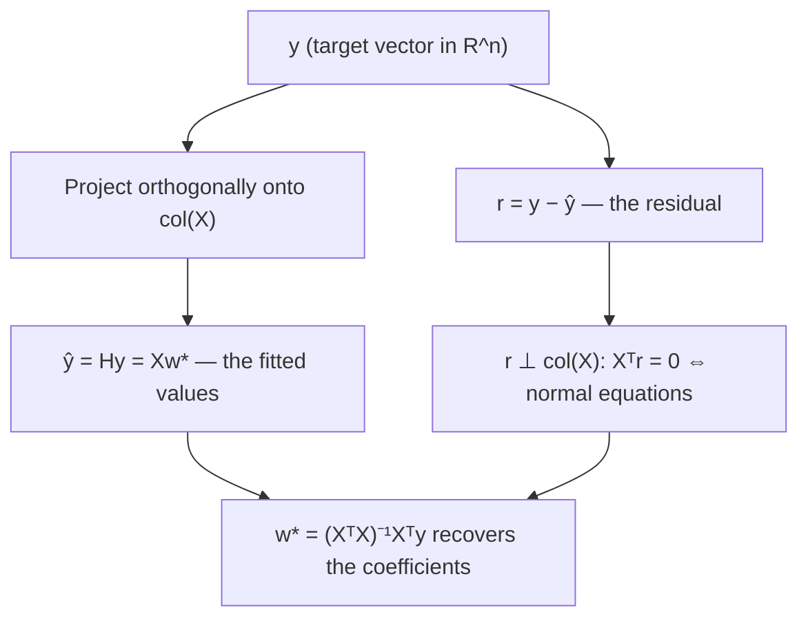
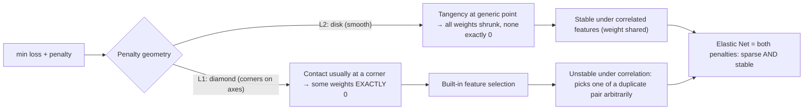

# Linear Models in Depth

Linear and logistic regression are the load-bearing walls of applied machine learning. They are the baselines every challenger must beat, the models regulators will actually accept, and — most importantly for a senior engineer — the simplest setting in which every core ML concept (loss functions, gradients, regularization, multicollinearity, calibration, MLE) can be understood *completely* rather than by analogy. If you can derive logistic regression's gradient from scratch and explain why L1 zeroes coefficients while L2 does not, debugging any larger model becomes pattern-matching against machinery you actually understand.

This guide derives ordinary least squares three ways (calculus, linear algebra, geometry), builds logistic regression from log-odds and from maximum likelihood with the gradient derived line by line and implemented in NumPy, treats regularization as geometry rather than folklore, and finishes with the GLM view that unifies linear, logistic, and Poisson regression under one framework — the same framework actuarial pricing models are built on.

Part of the [Senior AI Engineer Roadmap](../00-Senior-AI-Engineer-Roadmap.md) — Phase 2.

---

## 1. Linear Regression, Derived Three Ways

### 1.1 The model and the loss

We model a continuous target as a linear function of features plus noise:

```text
y_i = w · x_i + b + ε_i        ε_i ~ noise, E[ε_i] = 0
```

Fold the intercept into the weights by appending a constant-1 column to `X` (so `X` is `n × (d+1)` and `w` includes `b`). Ordinary least squares (OLS) picks `w` to minimize the residual sum of squares:

```text
L(w) = ||y − Xw||²  =  Σ_i (y_i − x_iᵀw)²
```

### 1.2 Derivation 1 — calculus (normal equations)

Expand the loss and differentiate. Line by line:

```text
L(w) = (y − Xw)ᵀ(y − Xw)
     = yᵀy − yᵀXw − wᵀXᵀy + wᵀXᵀXw
     = yᵀy − 2wᵀXᵀy + wᵀXᵀXw          (the two middle terms are equal scalars)

∇_w L = −2Xᵀy + 2XᵀXw                   (using ∇ wᵀa = a and ∇ wᵀAw = 2Aw for symmetric A)

Set ∇_w L = 0:
XᵀX w = Xᵀy                              ← the NORMAL EQUATIONS
w* = (XᵀX)⁻¹ Xᵀy                         (when XᵀX is invertible)
```

The Hessian is `2XᵀX`, which is positive semi-definite, so this stationary point is a global minimum — OLS is a convex problem with no local-minimum traps.

### 1.3 Derivation 2 — the geometric projection view

This is the picture that makes the normal equations *obvious*. The set of all possible predictions `{Xw : w ∈ R^d}` is the **column space** of `X` — a d-dimensional subspace of n-dimensional space. `y` generally lives outside that subspace. The best prediction `ŷ = Xw*` is the **orthogonal projection** of `y` onto the column space: the closest point in the subspace to `y`.

Orthogonality of the residual to the subspace is exactly the normal equations:

```text
residual r = y − Xw*  must be ⊥ to every column of X
Xᵀ(y − Xw*) = 0   ⇒   XᵀX w* = Xᵀy
```

The projection ("hat") matrix is `H = X(XᵀX)⁻¹Xᵀ`, so `ŷ = Hy`. `H` is symmetric and idempotent (`H² = H`) — projecting twice changes nothing. The diagonal entries `h_ii` are the **leverages**: how much observation `i` pulls the fit toward itself. High-leverage outliers are the ones that silently bend your regression.



### 1.4 Derivation 3 — MLE under Gaussian noise

Assume `ε_i ~ N(0, σ²)` i.i.d. Then `y_i | x_i ~ N(x_iᵀw, σ²)` and the log-likelihood is

```text
log L(w) = Σ_i [ −½ log(2πσ²) − (y_i − x_iᵀw)² / (2σ²) ]
```

Maximizing over `w` ignores the constant and the `1/(2σ²)` factor — it is exactly minimizing `Σ (y_i − x_iᵀw)²`. **OLS = MLE under Gaussian noise.** This is why squared loss is "natural" and also why it is fragile: heavy-tailed noise violates the Gaussian assumption and squared loss over-weights outliers (a residual of 10 costs 100). Robust alternatives (Huber loss, quantile/absolute loss) correspond to different noise assumptions.

### 1.5 Gauss–Markov, in plain terms

**Theorem (intuition):** if the errors have mean zero, constant variance (homoscedastic), and are uncorrelated, then among all *linear unbiased* estimators of `w`, OLS has the smallest variance — it is BLUE (Best Linear Unbiased Estimator).

What a senior engineer should take from it:

- It says nothing about *biased* estimators. Ridge is biased and routinely beats OLS on test MSE because it trades a little bias for a lot of variance. Gauss–Markov is a statement about a restricted class, not a license to never regularize.
- Its assumptions fail constantly in practice: heteroscedastic errors (variance grows with the prediction, common in monetary targets), correlated errors (time series), and non-linear truth. When they fail, OLS is still unbiased for the linear projection but is no longer minimum-variance, and naive standard errors are wrong.

### 1.6 Numerical reality: nobody inverts XᵀX

Forming `XᵀX` squares the condition number of `X` (κ(XᵀX) = κ(X)²), amplifying floating-point error. Production solvers use **QR decomposition** (`X = QR`, solve `Rw = Qᵀy` by back-substitution) or **SVD** (`X = UΣVᵀ`, `w = VΣ⁺Uᵀy`, which also handles rank deficiency gracefully — this is what `np.linalg.lstsq` and sklearn's `LinearRegression` do). For huge n or d, use gradient descent / SGD (`SGDRegressor`).

### 1.7 Multicollinearity and VIF, implemented

When columns of `X` are nearly linearly dependent, `XᵀX` is nearly singular: `w*` still exists but individual coefficients become wildly unstable — huge, opposite-signed pairs that change completely on resampling, while *predictions* stay fine. Diagnosis: **Variance Inflation Factor**. For feature `j`, regress it on all other features; if that regression's R² is high, feature `j` is redundant.

```text
VIF_j = 1 / (1 − R²_j)      VIF > 5–10 ⇒ problematic collinearity
```

```python
import numpy as np

def vif(X: np.ndarray) -> np.ndarray:
    """VIF per column, from scratch. X: (n, d), columns are features (no intercept col)."""
    n, d = X.shape
    out = np.empty(d)
    for j in range(d):
        target = X[:, j]
        others = np.delete(X, j, axis=1)
        others = np.column_stack([np.ones(n), others])          # intercept for the aux regression
        beta, *_ = np.linalg.lstsq(others, target, rcond=None)
        pred = others @ beta
        ss_res = np.sum((target - pred) ** 2)
        ss_tot = np.sum((target - target.mean()) ** 2)
        r2 = 1 - ss_res / ss_tot
        out[j] = 1.0 / (1.0 - r2 + 1e-12)
    return out

rng = np.random.default_rng(0)
n = 500
x1 = rng.normal(size=n)
x2 = rng.normal(size=n)
x3 = x1 + 0.05 * rng.normal(size=n)      # x3 ≈ x1 → collinear pair
X = np.column_stack([x1, x2, x3])
print(np.round(vif(X), 1))
# Expected output (approximately): [389.4   1.  389.5]
# x1 and x3 have massive VIF; x2 is clean.
```

**Fixes:** drop or combine redundant features, use Ridge (which stabilizes the inversion: `(XᵀX + λI)` is always invertible for λ > 0), or use PCA/PLS. Do **not** interpret individual coefficients of collinear features — the model cannot attribute credit between near-duplicates.

---

## 2. Logistic Regression, Derived Properly

### 2.1 From log-odds

We want `P(y=1|x)`. A linear score `z = wᵀx` lives in (−∞, ∞); probability lives in (0,1). The bridge: model the **log-odds** as linear.

```text
log( p / (1−p) ) = wᵀx
p / (1−p) = e^{wᵀx}
p = e^{wᵀx} / (1 + e^{wᵀx}) = 1 / (1 + e^{−wᵀx}) = σ(wᵀx)     ← the sigmoid
```

Consequences worth stating in interviews:

- A one-unit increase in `x_j` multiplies the **odds** by `e^{w_j}` — coefficients are log-odds-ratios, which is why credit and medical people love this model.
- The decision boundary `p = 0.5` is the hyperplane `wᵀx = 0` — logistic regression is a *linear* classifier in feature space.

### 2.2 From MLE — the gradient, line by line

With `p_i = σ(wᵀx_i)`, each label is Bernoulli: `P(y_i|x_i) = p_i^{y_i} (1−p_i)^{1−y_i}`. The negative log-likelihood (= cross-entropy / log loss):

```text
L(w) = − Σ_i [ y_i log p_i + (1−y_i) log(1−p_i) ]
```

Derive the gradient. First the sigmoid's derivative:

```text
σ(z) = 1/(1+e^{−z})
σ'(z) = e^{−z}/(1+e^{−z})² = σ(z)·(1−σ(z))
```

Now chain rule, one observation at a time, with `z_i = wᵀx_i`:

```text
∂L_i/∂p_i = −[ y_i/p_i − (1−y_i)/(1−p_i) ]
∂p_i/∂z_i = p_i(1−p_i)
∂z_i/∂w   = x_i

∂L_i/∂w = −[ y_i/p_i − (1−y_i)/(1−p_i) ] · p_i(1−p_i) · x_i
        = −[ y_i(1−p_i) − (1−y_i)p_i ] · x_i          (multiply through)
        = −[ y_i − y_i p_i − p_i + y_i p_i ] · x_i
        = (p_i − y_i) · x_i                            ← beautifully simple

∇_w L = Σ_i (p_i − y_i) x_i  =  Xᵀ(p − y)
```

The gradient is "prediction error times input" — the *same form* as linear regression's gradient. This is not a coincidence: it is the signature of GLMs with canonical link functions (Section 5). The loss is convex (Hessian `XᵀSX` with `S = diag(p_i(1−p_i))` is PSD), so gradient descent finds the global optimum. There is **no closed form** — you must iterate (sklearn uses lbfgs by default; the classic method is Newton/IRLS).

### 2.3 From scratch in NumPy, verified against sklearn

```python
import numpy as np
from sklearn.datasets import make_classification
from sklearn.linear_model import LogisticRegression

rng = np.random.default_rng(42)
X, y = make_classification(n_samples=2000, n_features=5, n_informative=4,
                           n_redundant=0, random_state=42)

def sigmoid(z):
    return 1.0 / (1.0 + np.exp(-np.clip(z, -30, 30)))   # clip: avoid overflow in exp

def fit_logreg(X, y, lr=0.1, n_iter=5000):
    n, d = X.shape
    Xb = np.column_stack([np.ones(n), X])                # intercept column
    w = np.zeros(d + 1)
    for _ in range(n_iter):
        p = sigmoid(Xb @ w)
        grad = Xb.T @ (p - y) / n                        # ∇L/n, derived above
        w -= lr * grad
    return w

w = fit_logreg(X, y)

sk = LogisticRegression(penalty=None, max_iter=5000).fit(X, y)
print("scratch :", np.round(w, 3))
print("sklearn :", np.round(np.r_[sk.intercept_, sk.coef_.ravel()], 3))
# Expected output: the two rows match to ~3 decimals, e.g.
# scratch : [ 0.081  0.253  1.782 -0.635  2.104  0.021]
# sklearn : [ 0.081  0.253  1.782 -0.635  2.104  0.021]
# (exact numbers depend on the random data; the point is they AGREE)
```

If your from-scratch model does not match sklearn, the usual culprits: forgot the intercept column, forgot to divide the gradient by n (then lr is effectively n× larger), compared against sklearn's *default L2-regularized* fit (`C=1.0`) instead of `penalty=None`, or labels not in {0,1}.

### 2.4 Class weights and imbalanced fitting

On imbalanced data the loss is dominated by the majority class; the fitted intercept drifts so that predicted probabilities match the base rate, and recall on the minority class suffers at threshold 0.5. Options, in order of preference:

1. **Do nothing to the data; move the threshold.** If probabilities are what you need, a well-fit model on natural prevalence plus a cost-tuned threshold is cleanest (see the evaluation guide).
2. **`class_weight="balanced"`** — reweights each class's loss terms by `n / (2 · n_class)`. Equivalent to oversampling without duplicating rows. *Warning:* this deliberately mis-calibrates the probabilities (they no longer match true prevalence); recalibrate afterward if you use them as probabilities.
3. **Resampling (SMOTE, undersampling)** — last resort for linear models; changes the training distribution and, done outside a pipeline, is a classic leakage source (never resample the validation fold).

```python
sk_w = LogisticRegression(class_weight="balanced", max_iter=2000).fit(X, y)
# Same API; loss terms for the rare class are up-weighted.
```

---

## 3. Regularization, Derived

### 3.1 Ridge — closed form and what it does

Add an L2 penalty (never penalize the intercept; scale features first):

```text
L(w) = ||y − Xw||² + λ||w||²
∇_w L = −2Xᵀy + 2XᵀXw + 2λw = 0
(XᵀX + λI) w = Xᵀy
w_ridge = (XᵀX + λI)⁻¹ Xᵀy
```

Two readings of `+λI`:

- **Numerical:** it makes the matrix invertible even when `XᵀX` is singular (collinearity, d > n). Ridge *always* has a unique solution.
- **Spectral:** in the SVD basis, OLS scales component `i` by `1/σ_i`; ridge scales by `σ_i/(σ_i² + λ)`. Directions with small singular values (the unstable, noise-dominated ones) are shrunk hardest. Ridge is a smooth low-pass filter on the data's principal directions.

Bayesian view: ridge = MAP estimate with a Gaussian prior `w ~ N(0, τ²I)`; lasso = MAP with a Laplace prior. Regularization is a prior belief that weights are small.

### 3.2 Why L1 induces sparsity — the geometric argument, spelled out

Penalized form `min L(w) + λ‖w‖` is equivalent to constrained form `min L(w) subject to ‖w‖ ≤ t`. Picture d = 2:

- The loss `L(w)` has elliptical contours centered at the OLS solution.
- The L2 constraint region `w₁² + w₂² ≤ t` is a **disk** — smooth, round boundary.
- The L1 constraint region `|w₁| + |w₂| ≤ t` is a **diamond** — with corners *on the axes*.

The solution is where the smallest loss contour first touches the constraint region. A smooth ellipse touching a smooth disk meets it at a generic tangent point — almost never exactly on an axis, so L2 makes weights small but nonzero. The same ellipse expanding toward a diamond will, for a large set of ellipse positions, hit a **corner first** — and corners are points where some coordinates are exactly zero. In higher dimensions the L1 ball has corners, edges, and faces of every dimension aligned with coordinate subspaces; contact overwhelmingly happens on them. **Sparsity is the geometry of corners.**

The calculus version: the L1 penalty's subgradient at `w_j = 0` is the interval `[−λ, +λ]`. If the loss gradient at zero satisfies `|∂L/∂w_j| ≤ λ`, then zero is optimal for that coordinate — L1 imposes a *dead zone* that weak features cannot escape. L2's gradient `2λw_j` vanishes at 0, so it exerts no force holding weights at exactly zero.



### 3.3 Elastic Net

```text
L(w) = ||y − Xw||² + λ [ α‖w‖₁ + (1−α)/2 · ‖w‖₂² ]
```

Lasso's known failure: with a group of correlated features it arbitrarily selects one and zeroes the rest (unstable across resamples), and with d > n it can select at most n features. The L2 term fixes both — correlated features get similar (shared) weights, while the L1 term still zeroes genuinely useless ones. Use `ElasticNetCV` / `LogisticRegressionCV(penalty="elasticnet", solver="saga")` to tune `λ` and `α` jointly. **Always standardize features first** — both penalties compare weight magnitudes across features, which is meaningless if features are on different scales.

### 3.4 Polynomial features and the interpretability–capacity trade

`PolynomialFeatures(degree=2)` turns a linear model into one that fits curves and pairwise interactions — still linear *in the parameters*, so all the OLS/Ridge machinery applies. The costs: feature count explodes combinatorially (`(d+k choose k)`), collinearity between `x` and `x²` appears, extrapolation beyond the training range becomes wild (high-degree polynomials oscillate), and the coefficient story ("effect of x_j") dies because effects now depend on other features' values. Practical guidance: degree 2 with regularization is often a strong, still-explainable baseline; beyond that, switch to trees, which get interactions for free.

```python
from sklearn.pipeline import make_pipeline
from sklearn.preprocessing import PolynomialFeatures, StandardScaler
from sklearn.linear_model import RidgeCV

poly_model = make_pipeline(
    PolynomialFeatures(degree=2, include_bias=False),
    StandardScaler(),
    RidgeCV(alphas=np.logspace(-3, 3, 13)),
)
# Ridge is not optional here: polynomial expansions are collinear by construction.
```

---

## 4. The GLM View: One Framework, Many Models

A Generalized Linear Model has three parts:

1. **Random component:** `y | x` follows an exponential-family distribution (Gaussian, Bernoulli, Poisson, Gamma, Tweedie…).
2. **Systematic component:** linear predictor `η = wᵀx`.
3. **Link function** `g`: connects the mean to the linear predictor, `g(E[y|x]) = η`.

| Model | Distribution | Canonical link | Inverse link (mean) |
| --- | --- | --- | --- |
| Linear regression | Gaussian | identity | `μ = η` |
| Logistic regression | Bernoulli | logit `log(p/(1−p))` | `p = σ(η)` |
| Poisson regression | Poisson | log | `μ = e^η` |
| Gamma regression | Gamma | (log used in practice) | `μ = e^η` |

With the canonical link, the gradient of the negative log-likelihood is always `Xᵀ(μ − y)` — the same "error times input" form we derived twice above. That is the unification.

### 4.1 Poisson regression for counts — and the actuarial connection

For count targets (claims per policy-year, transactions per hour, defects per batch), Gaussian assumptions fail: counts are non-negative integers with variance that grows with the mean. Poisson regression models `log μ = wᵀx`, so coefficients are **multiplicative**: `e^{w_j}` is a *rate ratio*. With varying observation windows, add a **log-exposure offset**: `log μ = log(exposure) + wᵀx` — modeling the rate per unit exposure.

This is the backbone of actuarial pricing: claim **frequency** is modeled with Poisson GLM (offset = policy-years), claim **severity** with Gamma GLM, and the pure premium is frequency × severity (or one Tweedie GLM does both). Insurers have used exactly this stack for decades because multiplicative rate factors ("urban drivers: 1.3×") are explainable to regulators.

```python
import numpy as np
from sklearn.linear_model import PoissonRegressor

rng = np.random.default_rng(7)
n = 20_000
age = rng.uniform(18, 80, n)
urban = rng.integers(0, 2, n)
exposure = rng.uniform(0.2, 1.0, n)                       # policy-years observed
true_rate = np.exp(-2.0 + 0.015 * (50 - np.abs(age - 50)) + 0.30 * urban)
claims = rng.poisson(true_rate * exposure)

X = np.column_stack([50 - np.abs(age - 50), urban])
model = PoissonRegressor(alpha=1e-6)
# sample_weight = exposure with y = claims/exposure is sklearn's offset idiom:
model.fit(X, claims / exposure, sample_weight=exposure)
print(np.round(model.coef_, 3), round(float(model.intercept_), 3))
# Expected output (approximately): [0.015 0.30] -2.0   ← recovers the true params
print("urban rate ratio:", round(float(np.exp(model.coef_[1])), 2))
# Expected output: urban rate ratio: 1.35  (≈ e^0.30)
```

**Overdispersion warning:** real count data usually has variance > mean (Poisson assumes equal). Point estimates stay reasonable but Poisson-based uncertainty is overconfident; check the dispersion statistic and consider Negative Binomial (statsmodels) or quasi-Poisson corrections.

---

## Production War Stories & Failure Modes

### Story 1: The coefficient that flipped sign overnight

**Symptom:** a credit-risk logistic regression retrained weekly; one Monday the "income" coefficient flipped from negative (higher income → lower risk, sensible) to positive. Risk team blocked the release.
**Investigation:** predictions were nearly identical to the prior model (AUC unchanged). Coefficient history showed "income" and a newly added "debt-to-income ratio" feature swinging in opposite directions week to week.
**Root cause:** multicollinearity. The new DTI feature was largely income-driven; VIFs for the pair were > 40. OLS/logit cannot attribute credit between near-duplicates, so coefficients traded off against each other while the fitted probabilities stayed stable.
**Fix:** dropped raw income, kept DTI (the more causal feature), and added an L2 penalty; coefficients stabilized.
**Prevention:** VIF check in CI on every feature addition; alert when any VIF > 10; never present individual coefficients of correlated groups to stakeholders without a stability check across bootstrap resamples.

### Story 2: "Balanced" class weights broke the pricing engine

**Symptom:** a fraud model's scores fed an expected-loss calculation (`p × exposure`). After a retrain, expected-loss estimates roughly tripled and auto-decline volume spiked; customer complaints followed.
**Investigation:** AUC was fine — slightly improved. The reliability curve showed predicted probabilities ~3× the observed frequencies at every score band.
**Root cause:** someone added `class_weight="balanced"` to boost recall. That reweights the loss as if classes were 50/50, which systematically inflates predicted probabilities on data whose true prevalence is ~2%. Ranking survives; calibration dies.
**Fix:** kept the class weights (recall was genuinely better) but wrapped the model in isotonic calibration fit on an untouched holdout; expected-loss math returned to sanity.
**Prevention:** a calibration gate in the release checklist — reliability curve + Brier score must pass before any model whose probabilities are consumed downstream ships.

### Story 3: The perfect AUC that was a label in disguise

**Symptom:** a junior engineer's logistic regression for loan default hit AUC 0.999 on validation. Celebration, then suspicion.
**Investigation:** inspected the largest coefficients: `days_past_due_at_snapshot` dominated with a huge weight. The feature snapshot was taken *after* the default event window for many rows.
**Root cause:** target leakage — the feature is an artifact of the outcome, not a predictor available at decision time. Linear models make this *easy to catch* because the coefficient screams; a boosted ensemble would have hidden it across hundreds of trees.
**Fix:** rebuilt the feature table with point-in-time joins (features as of application date only); AUC dropped to a believable 0.78.
**Prevention:** every feature must declare its availability timestamp; leakage review = sort |coefficients| descending and ask "could we know this at prediction time?" for the top ten. This is a genuine advantage of starting with linear baselines.

### Story 4: Unscaled features silently neutered the Lasso

**Symptom:** a Lasso model meant to select ~20 of 400 features kept all features with transaction amounts (scale: 10⁴–10⁶) and zeroed every ratio feature (scale: 0–1), including known-predictive ones.
**Investigation:** re-ran with standardized features; the selected set changed almost completely and validation error improved.
**Root cause:** the L1 penalty charges per unit of coefficient magnitude. A feature measured in cents needs a tiny coefficient to have the same effect as a ratio feature — so it is *cheap* under the penalty. Selection was driven by units, not signal.
**Fix:** `StandardScaler` inside the pipeline before the Lasso step.
**Prevention:** lint rule/code review convention: no `Lasso`, `Ridge`, `ElasticNet`, `LogisticRegression` (which defaults to L2!) without a scaler in the same `Pipeline`.

---

## Best Practices

- Always ship the linear/logistic baseline first and keep it as champion until beaten on the *business* metric. It is also your leakage detector and your regulator-friendly fallback.
- Standardize features before any penalized model; put the scaler *inside* the Pipeline so CV is leakage-free. Remember sklearn's `LogisticRegression` is L2-penalized by default (`C=1.0`) — an unscaled fit is silently distorted.
- Never interpret individual coefficients without a collinearity check (VIF) and a stability check (bootstrap the fit; see if signs/magnitudes hold).
- Prefer threshold-moving and calibration over resampling for imbalance; if you use `class_weight`, recalibrate before anyone consumes the probabilities.
- Report odds ratios (`e^w`) not raw logistic coefficients to stakeholders, with confidence intervals from statsmodels if decisions depend on them.
- Use Poisson (with log-exposure offset) for counts and rates; Gaussian OLS on counts produces negative predictions and wrong uncertainty.
- Check residual plots (residual vs fitted, QQ) on regression models — heteroscedasticity and curvature are visible in seconds and invalidate naive inference.
- For d > n or heavy collinearity, reach for Ridge/Elastic Net by default; pure Lasso's selections are unstable under correlation.
- Watch for perfect separation in logistic regression (weights → ∞, probabilities saturate): the fix is regularization, not more iterations.

---

## Interview Drills

<details><summary>Derive the normal equations for linear regression. What can make them fail in practice?</summary>
Minimize L(w) = ||y − Xw||². Expanding: L = yᵀy − 2wᵀXᵀy + wᵀXᵀXw; gradient ∇L = −2Xᵀy + 2XᵀXw; setting to zero gives XᵀXw = Xᵀy, so w* = (XᵀX)⁻¹Xᵀy. Failures: (1) XᵀX singular or near-singular under collinearity or d > n — no unique solution, unstable coefficients; (2) numerical conditioning — forming XᵀX squares the condition number, so solvers use QR or SVD instead of explicit inversion; (3) memory/compute at scale — use SGD.
Follow-up: "Why does sklearn use SVD rather than the closed form?" — SVD avoids forming XᵀX (better conditioning) and handles rank deficiency by using the pseudo-inverse, returning the minimum-norm solution among the infinitely many that fit.
Follow-up: "What is the geometric meaning of the normal equations?" — the residual y − Xw* is orthogonal to the column space of X; ŷ is the orthogonal projection of y onto that space, via the hat matrix H = X(XᵀX)⁻¹Xᵀ.
</details>

<details><summary>Derive the gradient of logistic regression's loss. Why is there no closed-form solution?</summary>
Loss L = −Σ[y log p + (1−y)log(1−p)] with p = σ(wᵀx). Using σ' = σ(1−σ) and the chain rule, per-example gradient collapses to (p_i − y_i)x_i, so ∇L = Xᵀ(p − y). Setting it to zero gives equations that are nonlinear in w (w appears inside the sigmoid), so no algebraic solution exists — you iterate (gradient descent, Newton/IRLS, lbfgs). The loss is convex (Hessian XᵀSX, S = diag(p(1−p)), is PSD) so iteration finds the global optimum.
Follow-up: "Why is the gradient identical in form to linear regression's?" — both are GLMs with canonical links; for canonical links the score function is always Xᵀ(μ − y). Same estimating equation, different mean function.
Follow-up: "What happens with perfectly separable data?" — the likelihood increases without bound as ||w|| → ∞; weights diverge and probabilities saturate at 0/1. Regularization (any λ > 0) restores a finite optimum.
</details>

<details><summary>Explain, with the geometric argument, why L1 regularization produces exact zeros and L2 does not.</summary>
Constrained view: minimize the loss subject to the weight vector lying in a penalty ball. Loss contours are ellipses around the unpenalized optimum. The L2 ball is round — first contact between an expanding ellipse and a sphere lands at a generic tangent point, so coordinates are shrunk but almost never exactly zero. The L1 ball is a cross-polytope with corners on the coordinate axes (and edges/faces in axis-aligned subspaces); an ellipse overwhelmingly makes first contact at those corners/edges, where some coordinates are exactly zero. Subgradient view: at w_j = 0 the L1 subdifferential is [−λ, λ]; if the loss gradient magnitude is below λ, zero is optimal — a dead zone. L2's force 2λw_j vanishes at zero, so nothing holds weights there.
Follow-up: "When is Lasso's selection unreliable?" — under correlated features it picks one member of a group semi-arbitrarily and zeroes the rest; the selected set churns across resamples. Elastic Net's L2 component groups correlated features and stabilizes selection.
</details>

<details><summary>What does the Gauss–Markov theorem actually guarantee, and why does Ridge outperform OLS anyway?</summary>
Under mean-zero, homoscedastic, uncorrelated errors, OLS is minimum-variance among LINEAR UNBIASED estimators. Ridge exits the "unbiased" class: it accepts bias in exchange for a large variance reduction (shrinking noise-dominated directions), and test MSE = bias² + variance + noise, so total error can drop. Gauss–Markov constrains a class we have no obligation to stay inside.
Follow-up: "When do the assumptions break?" — heteroscedasticity (variance depends on x, common with monetary targets → use WLS or robust/sandwich standard errors), autocorrelated errors (time series → Newey–West), and misspecification (truth nonlinear).
Follow-up: "Does Gauss–Markov require Gaussian errors?" — no; Gaussianity is only needed for exact finite-sample inference (t/F tests), not for BLUE.
</details>

<details><summary>Your logistic model's coefficients change drastically between weekly retrains but AUC is stable. Diagnose and fix.</summary>
Classic multicollinearity: near-duplicate features let the optimizer trade weight between them freely — many coefficient vectors give nearly identical predictions, so ranking metrics are stable while individual coefficients wander. Diagnose with VIF (regress each feature on the rest; VIF_j = 1/(1−R²_j); flag > 5–10) and with coefficient trajectories across bootstrap resamples. Fix: drop/merge redundant features, or add L2 which makes the objective strictly convex and pins a unique stable solution.
Follow-up: "Is this a problem if you only need predictions?" — mostly no for in-distribution prediction, but it degrades robustness to distribution shift (opposite-signed huge coefficients amplify small input changes) and destroys explainability, which regulated deployments require.
</details>

<details><summary>Interpret a logistic regression coefficient of 0.7 on feature "num_prior_chargebacks" to a non-technical stakeholder.</summary>
Each additional prior chargeback multiplies the odds of fraud by e^0.7 ≈ 2.0 — roughly doubling the odds — holding other features fixed. Careful distinctions: odds, not probability (the probability change depends on the starting point: from 1% to ~2% at low base rate, but 50% → 67%, not 100%); "holding others fixed" is only meaningful if the feature isn't collinear with others; and it's an associational statement, not causal.
Follow-up: "The stakeholder asks: so if we stop customers from filing chargebacks, fraud halves?" — no: the coefficient is predictive, not causal; intervening on the feature breaks the correlation structure the model learned (Goodhart). Causal claims need experiments or causal-inference methods.
</details>

<details><summary>When would you choose Poisson regression over OLS, and what is an exposure offset?</summary>
For count/rate targets: non-negative integers, variance growing with mean, multiplicative effects. OLS on counts can predict negatives, assumes constant variance, and models additive effects. Poisson GLM models log μ = wᵀx: predictions are always positive and e^{w_j} is a rate ratio. When observation windows differ (0.4 vs 1.0 policy-years), include log(exposure) as an offset — a term with coefficient fixed at 1 — so the model fits the rate per unit exposure: log μ = log(exposure) + wᵀx. This is the standard actuarial frequency model.
Follow-up: "Your Poisson model's residual deviance is far above its degrees of freedom — what does that mean?" — overdispersion: variance exceeds the mean (unobserved heterogeneity, clustering). Point estimates are still consistent but standard errors are too small. Use Negative Binomial, quasi-Poisson, or robust standard errors.
</details>

<details><summary>Why must features be scaled before regularized regression but not before OLS?</summary>
OLS is equivariant to feature rescaling — rescale a column by c and its coefficient rescales by 1/c, predictions unchanged. Penalties break this: L1/L2 charge for coefficient magnitude, and magnitude depends on units. A feature in cents needs a 100× smaller coefficient than the same feature in dollars, so it's artificially "cheap" under the penalty; regularization strength effectively varies per feature by accident of units. Standardizing makes the penalty apply evenly. Same logic applies to k-NN, SVM, k-means (distance-based) — and remember sklearn's LogisticRegression penalizes by default.
Follow-up: "Should you scale the intercept?" — never penalize or scale away the intercept; it absorbs the base rate. sklearn handles this via fit_intercept; if you build the design matrix manually, exclude the ones-column from the penalty.
</details>

<details><summary>Implement VIF from scratch. Why is VIF better than a pairwise correlation matrix?</summary>
For each feature j: regress x_j on all other features, get R²_j, VIF_j = 1/(1−R²_j). (Implementation: lstsq of x_j against the other columns plus intercept — see this guide's code.) Pairwise correlation only detects two-variable redundancy; VIF detects a feature reproducible by a *linear combination* of several others (e.g., total = A + B + C has huge VIF while no single pairwise correlation is alarming). VIF > 5–10 → investigate.
Follow-up: "VIFs are fine but coefficients are still unstable — what else could it be?" — small n relative to d (variance ∝ σ²(XᵀX)⁻¹ is large even without collinearity), influential outliers/high-leverage points (check hat values), or non-stationarity between retrains (the data itself changed).
</details>

<details><summary>Your model needs high recall on 1% fraud. Compare class_weight="balanced", oversampling, and threshold moving.</summary>
Threshold moving: train on natural data, keep calibrated probabilities, pick the operating point from error costs — cleanest, fully reversible, preserves probability semantics. class_weight="balanced": reweights loss terms (≈ oversampling without duplication); shifts the learned boundary toward minority recall but systematically inflates predicted probabilities — must recalibrate if probabilities are consumed. Oversampling/SMOTE: changes the training distribution; SMOTE's synthetic interpolation can create unrealistic points, and any resampling applied before splitting (or to validation folds) is leakage. For linear models, prefer threshold moving; the decision boundary of a logistic model under reweighting is largely an intercept shift anyway.
Follow-up: "Why is the effect mostly an intercept shift for logistic regression?" — reweighting classes multiplies the odds by a constant factor (the weight ratio), which in log-odds space adds a constant — the intercept. Slopes change only second-order. So thresholding the original model reaches nearly the same operating points without distorting calibration.
</details>

<details><summary>Show that OLS is the MLE under Gaussian noise. What loss does Laplace noise give, and when would you prefer it?</summary>
With ε ~ N(0, σ²), the log-likelihood is Σ[−½log(2πσ²) − (y_i − x_iᵀw)²/(2σ²)]; maximizing in w minimizes Σ(y_i − x_iᵀw)² — OLS. With Laplace noise (density ∝ e^{−|ε|/b}), MLE minimizes Σ|y_i − x_iᵀw| — least absolute deviations, i.e., median regression (quantile regression at the 0.5 quantile). Prefer it (or Huber, the compromise) with heavy-tailed noise/outliers: squared loss lets one wild point dominate the fit because a residual of 10 costs 100; absolute loss caps the influence.
Follow-up: "How does this connect to regularization?" — the same likelihood logic applied to the PRIOR: Gaussian prior on w gives L2 (ridge = MAP), Laplace prior gives L1 (lasso = MAP). Loss ↔ noise model; penalty ↔ prior.
</details>

<details><summary>A regulator asks you to justify a declined loan application scored by your logistic model. Walk through what you can and cannot say.</summary>
Can: exact per-feature contributions — the score is Σ w_j x_j + b in log-odds; each term w_j x_j is that feature's additive contribution, convertible to odds multipliers; report the top adverse factors ("DTI above threshold contributed +0.9 log-odds"). This decomposition is exact, not an approximation — the key advantage over black-box models where SHAP is an attribution method with assumptions. Cannot: causal claims ("if income were higher you'd be approved" is only true holding everything else fixed, which correlated features make counterfactually shaky); nor validity outside the training distribution. Also required: evidence of calibration (score means what it says), stability across protected segments, and documented feature availability at decision time.
Follow-up: "The top contribution is from a feature the applicant can't influence — is the model unfair?" — attribution ≠ fairness. Fairness requires analyzing error rates/calibration across protected groups and checking the feature isn't a proxy for a protected attribute; a model can be exactly explainable and still discriminatory.
</details>

<details><summary>Why is the logistic loss preferred over squared error for classification, even though squared error on probabilities "works"?</summary>
Three reasons. (1) MLE: cross-entropy is the correct likelihood for Bernoulli outcomes — it's the loss under which probabilities are statistically meaningful. (2) Optimization: squared error composed with sigmoid is non-convex with flat plateaus where σ saturates (gradient contains an extra p(1−p) factor that vanishes when the model is confidently wrong — the worst time to have no gradient); cross-entropy's gradient (p − y)x stays large when wrong. (3) Proper scoring: log loss is a strictly proper scoring rule — it's minimized in expectation only by the true probabilities, so it incentivizes calibration. (Brier score is also proper, but the optimization argument still favors cross-entropy for sigmoid models.)
Follow-up: "Why does cross-entropy punish confident errors so hard?" — the loss is −log(p assigned to the truth); as that p → 0, −log p → ∞. Predicting 0.999 wrong costs ~6.9 nats vs 0.69 for 0.5 — a 10× penalty, which is exactly the pressure that keeps probabilities honest.
</details>

<details><summary>You fit Ridge with λ chosen by cross-validation. A colleague says the coefficients are biased so the model is invalid for their causal analysis. Respond.</summary>
They're right about the bias and wrong about the conclusion for prediction — but right for their use case. Ridge deliberately biases coefficients toward zero to cut variance; for PREDICTION this is a favorable trade (test MSE = bias² + variance + noise). For CAUSAL/inferential work, shrinkage invalidates coefficient magnitudes and naive standard errors — they should use OLS (or debiased/post-double-selection lasso from the causal-ML literature) with correct inference, on a specification designed for identification, not predictive accuracy. The deeper point: prediction and inference are different objectives; a model optimal for one is generally wrong for the other.
Follow-up: "Can you get valid confidence intervals for ridge coefficients?" — not from the naive formulas; the estimator's distribution depends on the unknown true w through the bias. Bootstrap gives intervals for the *ridge estimator*, but those are intervals around a biased target. Debiased lasso / double machine learning are the principled tools when inference on effects is the goal.
</details>

---

Next: [Tree Ensembles in Depth](./02-Tree-Ensembles-in-Depth.md) — where the linear world's "capacity via feature engineering" trade flips into "capacity via ensembling," and the math moves from closed forms to functional gradient descent.
