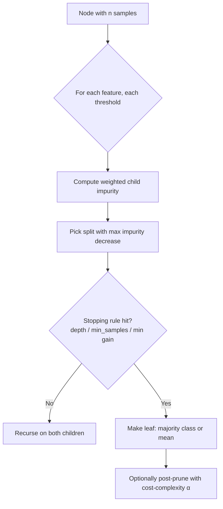
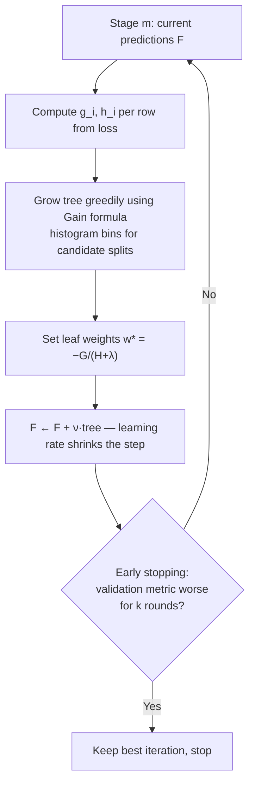

# Tree Ensembles in Depth

Gradient-boosted trees are still the strongest general-purpose family for tabular prediction, and random forests are still the most forgiving. But "boosting fits residuals" and "forests average trees" are analogy-level explanations, and analogy-level understanding is exactly what fails you when a model overfits in a weird way, an importance plot lies to you, or an interviewer asks you to derive the XGBoost leaf weight. This guide builds tree ensembles from the ground up: impurity math computed by hand, the variance-reduction formula that justifies bagging, functional gradient descent derived line by line through to XGBoost's `w* = -G/(H+λ)`, the mechanical differences between XGBoost, LightGBM, and CatBoost, and SHAP values used correctly.

Everything runnable here uses scikit-learn and xgboost; from-scratch implementations are checked against library output so you can trust — and reproduce — every claim.

Part of the [Senior AI Engineer Roadmap](../00-Senior-AI-Engineer-Roadmap.md) — Phase 2.

---

## 1. Decision Trees: The Split Decision, Derived

### 1.1 Impurity measures

A tree grows by repeatedly picking the (feature, threshold) pair that most reduces **impurity**. For a node with class proportions `p_1 … p_K`:

```text
Gini:     G = 1 − Σ_k p_k²         (probability two random draws disagree)
Entropy:  H = −Σ_k p_k log₂ p_k    (bits needed to encode the label)
Variance: V = (1/n) Σ_i (y_i − ȳ)²  (regression: MSE around the node mean)
```

Both Gini and entropy are 0 for a pure node and maximal at the uniform distribution (`0.5` and `1.0` bit respectively for two balanced classes). Gini is cheaper (no log) and slightly favors isolating the largest class; entropy penalizes mixed nodes a bit harder. In practice they choose the same split ~98% of the time — knowing *that* is a senior answer; arguing Gini vs entropy at length is a junior one.

### 1.2 Information gain by hand

Small fraud dataset, 10 transactions, 4 fraud (+) / 6 legit (−):

| # | amount>500 | foreign | label |
|---|---|---|---|
| 1 | yes | yes | + |
| 2 | yes | no  | + |
| 3 | yes | yes | + |
| 4 | no  | yes | + |
| 5 | yes | no  | − |
| 6 | no  | no  | − |
| 7 | no  | no  | − |
| 8 | no  | yes | − |
| 9 | no  | no  | − |
| 10| no  | no  | − |

Parent entropy:

```text
H(parent) = −0.4·log₂0.4 − 0.6·log₂0.6 = 0.529 + 0.442 = 0.971 bits
```

Split on `amount>500` (yes: {1,2,3,5} → 3+/1−; no: {4,6..10} → 1+/5−):

```text
H(yes) = −(3/4)log₂(3/4) − (1/4)log₂(1/4) = 0.311 + 0.5   = 0.811
H(no)  = −(1/6)log₂(1/6) − (5/6)log₂(5/6) = 0.431 + 0.219 = 0.650
IG = 0.971 − (4/10)·0.811 − (6/10)·0.650 = 0.971 − 0.324 − 0.390 = 0.257 bits
```

Split on `foreign` (yes: {1,3,4,8} → 3+/1−; no: {2,5,6,7,9,10} → 1+/5−):

```text
Same child distributions by symmetry → IG = 0.257 bits — a tie.
```

With Gini instead: parent `1 − 0.4² − 0.6² = 0.48`; children `1 − 0.75² − 0.25² = 0.375` and `1 − (1/6)² − (5/6)² = 0.278`; gain `0.48 − 0.4·0.375 − 0.6·0.278 = 0.163`. Different number, same ranking — the usual outcome. For continuous features the tree sorts values and evaluates thresholds at midpoints between consecutive distinct values; that sort is why naive tree building is `O(n log n)` per feature per node.

### 1.3 Pruning and complexity control

An unconstrained tree drives training error to zero by memorizing — a high-variance estimator. Two control philosophies:

- **Pre-pruning (early stopping the growth):** `max_depth`, `min_samples_leaf`, `min_samples_split`, `min_impurity_decrease`. Cheap, but greedy — a weak split can be the gateway to a strong one below it.
- **Post-pruning:** grow fully, then prune. Scikit-learn implements **cost-complexity pruning**: for each subtree `T`, define `R_α(T) = R(T) + α·|leaves(T)|` (training risk plus a per-leaf penalty). As `α` rises, weakest-link branches collapse. `cost_complexity_pruning_path` gives you the critical α values to cross-validate over.

```python
from sklearn.datasets import make_classification
from sklearn.model_selection import train_test_split, cross_val_score
from sklearn.tree import DecisionTreeClassifier
import numpy as np

X, y = make_classification(n_samples=2000, n_features=20, n_informative=8,
                           weights=[0.9, 0.1], random_state=42)
X_tr, X_te, y_tr, y_te = train_test_split(X, y, stratify=y, random_state=42)

path = DecisionTreeClassifier(random_state=42).cost_complexity_pruning_path(X_tr, y_tr)
alphas = path.ccp_alphas[:-1:5]  # subsample the path for speed
scores = [cross_val_score(DecisionTreeClassifier(ccp_alpha=a, random_state=42),
                          X_tr, y_tr, cv=5, scoring="average_precision").mean()
          for a in alphas]
best = alphas[int(np.argmax(scores))]
print(f"best ccp_alpha={best:.5f}, CV AP={max(scores):.3f}")
# Typical output: best ccp_alpha≈0.001-0.003, CV AP≈0.55-0.65
# (an unpruned tree scores noticeably lower — variance is the enemy)
```



---

## 2. Bagging and Random Forests: The Variance Math

### 2.1 Why averaging works — with the correlation term

Average `B` identically-distributed estimators, each with variance `σ²`, pairwise correlation `ρ`:

```text
Var(mean) = Var( (1/B) Σ f_b )
          = (1/B²) [ Σ_b Var(f_b) + Σ_{b≠c} Cov(f_b, f_c) ]
          = (1/B²) [ B·σ² + B(B−1)·ρσ² ]
          = ρσ² + (1−ρ)σ²/B
```

Read that final line carefully — it is the whole theory of random forests:

- The `(1−ρ)σ²/B` term → 0 as you add trees. **More trees never hurt** (only cost compute).
- The `ρσ²` term is the **floor**. If your trees are correlated, no number of them helps.
- Therefore the forest's two randomization devices exist to shrink `ρ`: **bootstrap sampling** (each tree sees a different resample of rows) and **feature subsampling** (`max_features` — each split considers only a random subset, so dominant features can't dominate every tree).

Deep unpruned trees are used deliberately: low bias, high variance — and bagging is a variance-destruction machine. Bagging a high-bias model (e.g., stumps) is pointless; the `ρσ²` floor is small but so is the achievable quality.

### 2.2 Out-of-bag error — free validation

Each bootstrap sample omits ≈ `1/e ≈ 36.8%` of rows (`P(row never drawn in n draws) = (1−1/n)ⁿ → e⁻¹`). Every row is therefore "out of bag" for about a third of the trees, and those trees form an honest ensemble for scoring it — a built-in cross-validation.

```python
from sklearn.ensemble import RandomForestClassifier

rf = RandomForestClassifier(n_estimators=500, oob_score=True, n_jobs=-1,
                            random_state=42).fit(X_tr, y_tr)
print(f"OOB accuracy: {rf.oob_score_:.3f}, test accuracy: {rf.score(X_te, y_te):.3f}")
# Typical output: OOB accuracy: 0.951, test accuracy: 0.948 — they track closely
```

### 2.3 Feature importance and its biases

Default `feature_importances_` is **mean decrease in impurity (MDI)**: total impurity reduction attributed to a feature across all splits. Two known biases: (1) inflates high-cardinality / continuous features (more candidate thresholds → more chances to look useful, even on noise); (2) computed on training data, so a feature the model *overfits* looks important. **Permutation importance** fixes both: shuffle one column in held-out data and measure the metric drop.

```python
import numpy as np

def permutation_importance_scratch(model, X, y, metric, n_repeats=10, seed=0):
    rng = np.random.default_rng(seed)
    base = metric(y, model.predict_proba(X)[:, 1])
    out = np.zeros((X.shape[1], n_repeats))
    for j in range(X.shape[1]):
        for r in range(n_repeats):
            Xp = X.copy()
            Xp[:, j] = rng.permutation(Xp[:, j])
            out[j, r] = base - metric(y, model.predict_proba(Xp)[:, 1])
    return out.mean(axis=1)

from sklearn.metrics import roc_auc_score
imp = permutation_importance_scratch(rf, X_te, y_te, roc_auc_score)
print(np.argsort(imp)[::-1][:5])   # top-5 features by honest importance
# Verify against sklearn:
from sklearn.inspection import permutation_importance
skl = permutation_importance(rf, X_te, y_te, scoring="roc_auc", n_repeats=10,
                             random_state=0)
print(np.argsort(skl.importances_mean)[::-1][:5])  # same top features
```

Caveat that interviewers love: permutation importance **splits credit between correlated features** — permuting one leaves its correlated twin carrying the signal, so both look unimportant. Fix: permute correlated groups together, or drop-and-refit.

---

## 3. Gradient Boosting, Derived Properly

### 3.1 Functional gradient descent

Boosting is gradient descent **in function space**. We build `F_M(x) = Σ_m ν·h_m(x)` stagewise; at stage `m` we want the `h` that most decreases loss `L = Σ_i ℓ(y_i, F_{m−1}(x_i) + h(x_i))`.

Treat the vector of current predictions `F = (F(x_1) … F(x_n))` as the "parameters". The gradient of the loss with respect to those parameters is:

```text
g_i = ∂ℓ(y_i, F(x_i)) / ∂F(x_i)
```

Gradient descent says: move predictions in direction `−g`. But we can't move each prediction freely — we must move via a function that generalizes. So we **fit a tree to the negative gradient** (`h_m ≈ −g`), the closest realizable descent direction, then take a small step `ν` (learning rate). That is the whole algorithm.

For squared error `ℓ = ½(y − F)²`, the negative gradient is `y − F` — the **residual**. "Boosting fits residuals" is thus the MSE special case of the general statement "boosting fits negative gradients". For log loss with `p = σ(F)`, the negative gradient is `y − p` — the class residual on the probability scale, which is why boosted classifiers accumulate log-odds.

### 3.2 The XGBoost objective, line by line

XGBoost upgrades this with a second-order Taylor expansion and explicit regularization. At stage `m`, with `g_i = ∂ℓ/∂F_i` and `h_i = ∂²ℓ/∂F_i²` evaluated at the current prediction:

```text
Obj = Σ_i ℓ(y_i, F_i + f(x_i)) + Ω(f)
    ≈ Σ_i [ ℓ(y_i, F_i) + g_i·f(x_i) + ½·h_i·f(x_i)² ] + Ω(f)      (Taylor to 2nd order)

Drop the constant ℓ(y_i, F_i). A tree f assigns leaf weight w_j to all rows in leaf j.
Let I_j = rows landing in leaf j, G_j = Σ_{i∈I_j} g_i, H_j = Σ_{i∈I_j} h_i.
Ω(f) = γ·T + ½λ·Σ_j w_j²                     (T leaves, L2 on leaf weights)

Obj = Σ_j [ G_j·w_j + ½(H_j + λ)·w_j² ] + γT

Per leaf this is a scalar quadratic in w_j. Minimize: d/dw_j = G_j + (H_j+λ)w_j = 0

    w_j* = − G_j / (H_j + λ)                  ← the optimal leaf weight

Plug back in:

    Obj* = −½ Σ_j G_j² / (H_j + λ) + γT      ← quality score of a tree structure
```

The **split gain** compares parent vs children on this score:

```text
Gain = ½ [ G_L²/(H_L+λ) + G_R²/(H_R+λ) − (G_L+G_R)²/(H_L+H_R+λ) ] − γ
```

Every XGBoost knob now has a derived meaning: `λ` (`reg_lambda`) shrinks leaf weights and damps gain from small leaves; `γ` (`gamma` / `min_split_loss`) is a hard floor on gain — splits below it don't happen; `min_child_weight` is a floor on `H` in a child (for log loss `h_i = p_i(1−p_i)`, so it's an effective-sample-size constraint); the learning rate `ν` scales `w*` after the fact.

### 3.3 Gradient boosting from scratch, verified

```python
import numpy as np
from sklearn.tree import DecisionTreeRegressor
from sklearn.ensemble import GradientBoostingRegressor
from sklearn.datasets import make_regression

X, y = make_regression(n_samples=1000, n_features=10, noise=10, random_state=0)

def gbm_mse_scratch(X, y, n_rounds=100, lr=0.1, max_depth=3):
    F = np.full(len(y), y.mean())          # F_0 = argmin_c Σ(y−c)² = mean
    trees = []
    for _ in range(n_rounds):
        residual = y - F                    # negative gradient of ½(y−F)²
        t = DecisionTreeRegressor(max_depth=max_depth, random_state=0).fit(X, residual)
        F += lr * t.predict(X)
        trees.append(t)
    return y.mean(), trees

def gbm_predict(init, trees, X, lr=0.1):
    return init + lr * sum(t.predict(X) for t in trees)

init, trees = gbm_mse_scratch(X, y)
ours = gbm_predict(init, trees, X)

skl = GradientBoostingRegressor(n_estimators=100, learning_rate=0.1, max_depth=3,
                                random_state=0).fit(X, y)
print(np.corrcoef(ours, skl.predict(X))[0, 1])
# Output: 0.9999... — our 15-line loop IS sklearn's algorithm (minus subtleties
# like friedman_mse splitting and per-leaf line search)
```

### 3.4 XGBoost vs LightGBM vs CatBoost

| Mechanism | XGBoost | LightGBM | CatBoost |
|---|---|---|---|
| Split finding | exact or **histogram** (`tree_method=hist`: bucket features into ~256 bins, gain over bin boundaries — O(bins) not O(n) per feature) | histogram-native, plus **GOSS**: keep all large-gradient rows, subsample small-gradient rows and reweight — most of the gradient signal at a fraction of the cost | histogram, symmetric (oblivious) trees: same split at every node of a level → extremely fast inference, built-in regularization |
| Tree growth | level-wise (depth-controlled) | **leaf-wise**: always split the leaf with max gain — deeper, more accurate, easier to overfit (control with `num_leaves`, not depth) | level-wise symmetric |
| Categoricals | one-hot / leave to you | native categorical splits (partition search) | **ordered target statistics**: encode a category by target mean computed only over *preceding* rows in a random permutation — target encoding without self-leakage |
| Missing values | learn default direction per split | same | same |
| Overfitting-on-small-data resistance | good with tuning | weakest (leaf-wise) | strongest (ordered boosting also decouples gradient estimation from the rows being fit) |

Rules of thumb: LightGBM for very large datasets and speed; CatBoost when many high-cardinality categoricals or little tuning time; XGBoost as the battle-tested default with the biggest ecosystem.



### 3.5 Tuning playbook

Tune in this order — each step holds earlier ones fixed:

1. **Fix `learning_rate=0.1`, use early stopping** to find `n_estimators` for free — never grid-search tree count.
2. **Capacity:** `max_depth` (3–8; XGBoost) or `num_leaves` (15–255; LightGBM), plus `min_child_weight` (1–100, log scale) — the main overfitting axis.
3. **Sampling:** `subsample` (0.6–1.0) and `colsample_bytree` (0.6–1.0) — decorrelation, cheap accuracy.
4. **Regularization:** `reg_lambda` (1–20), `gamma` (0–5) — polish, useful on noisy data.
5. **Final:** drop `learning_rate` to 0.02–0.05, re-run early stopping (rounds will grow ~proportionally), confirm the gain holds.

```python
import xgboost as xgb
from sklearn.model_selection import train_test_split

X_tr, X_val, y_tr, y_val = train_test_split(X_tr, y_tr, stratify=y_tr,
                                            test_size=0.2, random_state=42)
model = xgb.XGBClassifier(
    n_estimators=2000, learning_rate=0.05, max_depth=5,
    min_child_weight=5, subsample=0.8, colsample_bytree=0.8,
    reg_lambda=5.0, eval_metric="aucpr",
    early_stopping_rounds=50, random_state=42)
model.fit(X_tr, y_tr, eval_set=[(X_val, y_val)], verbose=False)
print(f"best_iteration={model.best_iteration}, best AP={model.best_score:.4f}")
# Typical output: best_iteration≈180-400 — the other 1600+ trees were never needed
```

---

## 4. SHAP Values Without the Hand-Waving

### 4.1 Shapley intuition

Game theory: `N` players cooperate to produce value `v(N)`; the Shapley value pays each player its **average marginal contribution over every possible joining order**:

```text
φ_j = Σ_{S ⊆ N\{j}}  |S|!·(|N|−|S|−1)! / |N|!  ·  [ v(S ∪ {j}) − v(S) ]
```

For a prediction: players = features, `v(S)` = expected model output when only features in `S` are known. Shapley values are the **unique** attribution satisfying efficiency (`Σφ_j = f(x) − E[f]` — attributions sum exactly to the gap between this prediction and the average), symmetry, and additivity. Exact computation is `O(2^d)`; **TreeSHAP** exploits tree structure to get exact values in polynomial time, which is why SHAP owns the tabular world.

### 4.2 Using it

```python
import shap

explainer = shap.TreeExplainer(model)
sv = explainer(X_val)                       # shap.Explanation object

# Local: why did row 0 get its score? (log-odds units for XGBClassifier)
print(f"base value {sv.base_values[0]:+.3f}  +  sum(shap) {sv.values[0].sum():+.3f}"
      f"  =  margin {model.predict(X_val[:1], output_margin=True)[0]:+.3f}")
# Output: the three numbers reconcile exactly — that's the efficiency axiom

shap.plots.waterfall(sv[0])                 # single-prediction explanation
shap.plots.beeswarm(sv)                     # global: importance + direction
shap.plots.scatter(sv[:, 3])                # dependence: feature value vs impact
```

### 4.3 Common misreadings

- **SHAP is not causal.** It attributes the *model's* prediction, not reality. A proxy feature (e.g., zip code proxying income) gets the credit the true cause would have earned.
- **Units:** for XGBoost classifiers TreeSHAP works in log-odds (margin) space by default. A SHAP value of +1.0 is one logit, not "+1 probability". A near-certain prediction can show large SHAP values that move probability barely at all.
- **Correlated features** split credit in unstable ways between them; small data changes can swap which twin gets the credit. Don't over-interpret rank ordering among correlated features.
- **Sign confusion:** beeswarm color shows the *feature's value*, x-position shows *impact*. "High amount pushes score up" requires reading both, and reviewers routinely read only one.

---

## 5. Production War Stories & Failure Modes

### Incident 1: The importance plot that pointed at a random number

**Symptom:** a `customer_id`-derived hash landed in the top-3 of the random forest's feature importance chart shown to stakeholders. **Investigation:** the feature was near-unique per row; MDI importance was computed on training data. **Root cause:** high-cardinality bias of impurity importance — a feature with thousands of distinct values gives the tree endless chances to carve training rows apart, so it accumulates impurity reduction while carrying zero generalizable signal. **Fix:** removed ID-like features; switched all reported importances to permutation importance on a held-out set, where the hash's importance was ≈0. **Prevention:** lint the feature list for near-unique cardinality; never present train-set MDI importance outside the team.

### Incident 2: Early stopping tuned the model to its own test set

**Symptom:** XGBoost challenger beat the champion by 4 points of PR-AUC offline; in shadow mode the gap was ~0. **Investigation:** the "test set" used for the headline metric was the same split passed to `eval_set` for early stopping. **Root cause:** early stopping *selects* the iteration that maximizes performance on that split — it is a hyperparameter fit on it, so the split's metric is optimistically biased. **Fix:** three-way split (train / early-stop validation / untouched test); headline number from the untouched set only. **Prevention:** rule in the experiment template: any dataset that influences any training decision may not produce a reported metric.

### Incident 3: Leaf-wise LightGBM memorized a 30k-row dataset

**Symptom:** LightGBM with defaults (`num_leaves=31` raised to 255 "because more capacity") showed train AUC 1.00, validation AUC dropping as training continued. **Root cause:** leaf-wise growth with high `num_leaves` and low `min_data_in_leaf` on a small dataset produces effectively-memorizing trees; depth limits don't bind because leaf-wise trees go deep on narrow paths. **Fix:** `num_leaves=31`, `min_data_in_leaf=50`, stronger `feature_fraction`/`bagging_fraction`, early stopping; validation AUC recovered above the XGBoost baseline. **Prevention:** on datasets under ~100k rows, start LightGBM at conservative capacity; remember `num_leaves`, not `max_depth`, is its true capacity knob.

### Incident 4: SHAP explanations contradicted the credit policy team

**Symptom:** risk officers escalated: the API's top risk factor for declined applicants was often "months_at_address — low", which policy says should barely matter. **Investigation:** `months_at_address` correlated 0.8 with `age`, which the model was not allowed to use and had been dropped. **Root cause:** the tree ensemble reconstructed the forbidden signal through its proxy and SHAP truthfully attributed to the proxy — an explainability success revealing a compliance failure. **Fix:** removed the proxy, added a monotone constraint review, and added correlation-with-protected-attributes screening to the feature intake checklist. **Prevention:** treat surprising SHAP output as a feature-audit trigger, not a display bug.

---

## 6. Best Practices

- Random forest first: minimal tuning, hard to break, and its OOB score is a free honest estimate. Boosting must beat it to earn its tuning budget.
- Never grid-search `n_estimators` for boosting — set it high and use early stopping on a dedicated validation split (not your reported test set).
- Tune capacity (`max_depth`/`num_leaves`, `min_child_weight`) before regularization; sampling parameters (`subsample`, `colsample_bytree`) are cheap wins.
- Distrust impurity-based importances; report permutation importance or SHAP computed on held-out data, and disclose the correlated-features caveat.
- Handle class imbalance with `scale_pos_weight` (≈ n_neg/n_pos) or focal-style reweighting — but remember any reweighting destroys calibration; recalibrate before thresholding.
- Trees extrapolate as constants: any prediction outside the training feature range is a flat leaf value. Guard time-trending features (prices, volumes) with ratio/differencing transforms.
- Pin library versions in the model artifact's metadata: boosted-tree predictions can shift across major library versions even with identical parameters and seed.
- Keep SHAP explanations in the same units you report probabilities in, or explicitly label them as log-odds — mixed units in a UI is how trust dies.

---

## 7. Interview Drills

<details><summary>Derive why bagging reduces variance, and where the limit is.</summary>
For B estimators with variance σ² and pairwise correlation ρ, the variance of their average is ρσ² + (1−ρ)σ²/B. The second term vanishes as B grows, so averaging kills the independent component of variance; the first term ρσ² is an irreducible floor set by tree correlation. Random forests attack ρ with bootstrap row sampling and per-split feature subsampling.
Follow-up: *Why deep trees in a forest but shallow trees in boosting?* Bagging reduces variance but not bias, so you feed it low-bias/high-variance learners (deep trees). Boosting reduces bias sequentially, so each learner can be weak/shallow; deep trees in boosting overfit quickly.
Follow-up: *Does adding more trees to a forest ever overfit?* No — variance monotonically decreases toward the floor; more trees only cost compute. This is not true for boosting, where more rounds means more capacity.
</details>

<details><summary>Derive the optimal XGBoost leaf weight.</summary>
Second-order Taylor expansion of the loss around current predictions gives per-row g_i, h_i. Rows in leaf j all receive weight w_j, so the objective restricted to that leaf is G_j·w_j + ½(H_j+λ)w_j² with G, H the summed gradients/hessians. Setting the derivative G_j + (H_j+λ)w_j = 0 yields w_j* = −G_j/(H_j+λ), and substituting back gives leaf quality −½G_j²/(H_j+λ), from which the split gain formula follows.
Follow-up: *What does λ do to predictions, mechanically?* It inflates the denominator, shrinking every leaf weight toward zero — same spirit as ridge on leaf values — and it damps the gain of small-H (small effective sample) leaves so noisy splits stop winning.
Follow-up: *What is min_child_weight really constraining for log loss?* The hessian h_i = p_i(1−p_i), so H is an effective sample size weighted by prediction uncertainty; min_child_weight forbids leaves supported by too little effective evidence.
</details>

<details><summary>Gini vs entropy — does the choice matter?</summary>
Both are concave impurity measures, zero at purity, maximal at uniform. Entropy penalizes mixed nodes slightly more (log curvature); Gini is cheaper to compute. Empirically they select identical splits the vast majority of the time and generalization differences are noise-level. The senior answer: pick Gini for speed, spend your energy on depth/leaf-size regularization and data quality instead.
Follow-up: *When could the choice matter?* Extremely imbalanced nodes near the decision boundary of pruning thresholds — entropy's harsher penalty can keep a split Gini would forgo — but you'd tune min_impurity_decrease before you'd tune the criterion.
</details>

<details><summary>Explain out-of-bag error and derive the 36.8% figure.</summary>
A bootstrap sample draws n rows with replacement; P(a given row is never drawn) = (1−1/n)ⁿ → e⁻¹ ≈ 0.368. So each row is excluded from ~37% of trees; predicting it with only those trees yields an honest ensemble estimate without a holdout set — approximately equivalent to leave-one-out over sub-ensembles.
Follow-up: *When would you not trust OOB error?* Grouped or temporal data — bootstrap rows from the same customer/time period leak across the in-bag/out-of-bag boundary, so OOB is optimistic; you need GroupKFold or time-based splits instead.
</details>

<details><summary>Why is impurity-based feature importance biased, and what do you use instead?</summary>
Two biases: high-cardinality/continuous features offer more candidate split points, so they win splits by chance and accumulate impurity credit even on noise; and MDI is computed on training data, so overfit features look important. Use permutation importance on held-out data (metric drop when a column is shuffled) or SHAP values. Caveat both: correlated features split or hide credit — permuting one leaves its twin covering for it.
Follow-up: *A feature has near-zero permutation importance — can you drop it safely?* Not necessarily: it may share signal with a correlated feature, or matter only in an interaction the metric averages away. Check grouped permutation and drop-and-refit before deleting.
</details>

<details><summary>What is boosting actually fitting each round?</summary>
The negative gradient of the loss with respect to current predictions — gradient descent in function space where the "step direction" must be representable by a tree. For MSE the negative gradient is the residual y−F (hence "fits residuals"); for log loss it is y−p. XGBoost refines this with second-order information: the tree structure is chosen to maximize the Taylor-approximated objective decrease and leaves get closed-form optimal weights.
Follow-up: *Why does a small learning rate generalize better?* Each tree overfits its gradient target slightly; shrinkage ν takes only a fraction of each step, so errors accumulate slowly and later trees correct earlier ones — effectively a regularization path, at the cost of more rounds.
</details>

<details><summary>Explain GOSS and why LightGBM can afford to drop rows.</summary>
Gradient-based One-Side Sampling keeps all rows with large gradients (badly-predicted, information-rich) and randomly samples a fraction of small-gradient rows, reweighting the sampled ones by (1−a)/b to keep the gradient sum unbiased. Because split gain depends on gradient statistics, most of the gain signal lives in large-gradient rows — so you get near-identical trees at a fraction of the scan cost.
Follow-up: *What's the failure mode?* Early in training or with noisy labels, "large gradient" includes label errors, so GOSS concentrates compute on noise; disable it (or use plain bagging) when label quality is suspect.
</details>

<details><summary>How does CatBoost avoid target-encoding leakage?</summary>
Ordered target statistics: draw a random permutation of rows; encode row i's category using target statistics computed only from rows before i in the permutation. The encoding for a row never contains its own label — the same trick as per-fold target encoding but at per-row granularity. Ordered boosting extends the idea to gradient estimation itself, using models trained on prefixes to compute residuals for later rows.
Follow-up: *Cost?* Higher variance for early-permutation rows (tiny history) — CatBoost mitigates with multiple permutations; and training is slower than LightGBM.
</details>

<details><summary>Walk me through your gradient-boosting tuning process.</summary>
(1) lr=0.1, n_estimators high, early stopping on a dedicated validation split — tree count is never grid-searched. (2) Tune capacity: max_depth or num_leaves with min_child_weight, the primary overfit axis. (3) subsample and colsample_bytree around 0.8. (4) reg_lambda and gamma if validation still diverges from train. (5) Halve the learning rate, let early stopping re-lengthen training, confirm on an untouched test set.
Follow-up: *Why does the eval_set for early stopping contaminate the metric?* The chosen iteration maximizes that split's metric — a selection decision fit on it — so its metric is biased upward; report from a third, untouched split.
Follow-up: *When do you stop tuning?* When gains are within the fold-to-fold noise band (measure it!) — chasing deltas smaller than CV standard deviation is fitting the validation set.
</details>

<details><summary>What are Shapley values and which axioms make them special?</summary>
The unique attribution scheme distributing f(x)−E[f] across features such that: efficiency (contributions sum exactly to the gap), symmetry (identical-contribution features get equal credit), dummy (a feature that never changes the output gets zero), and additivity across models. Computed exactly for trees by TreeSHAP in polynomial time by dynamic programming over tree paths.
Follow-up: *Why do SHAP values not identify causes?* They attribute the model's function, which reflects correlations in training data; a proxy inherits the credit of its cause. Causal claims need interventions or causal models, not attributions.
Follow-up: *Why can a top-SHAP feature have tiny probability impact?* TreeSHAP for classifiers works in log-odds space; near 0 or 1 probability, large logit movements barely move probability through the sigmoid's flat tails.
</details>

<details><summary>Your boosted model's train PR-AUC is 0.99, validation 0.62. Diagnose.</summary>
Classic variance problem — but check leakage and split design first: is the validation split time-respecting and group-respecting? If splits are sound, reduce capacity (shallower trees, higher min_child_weight), increase subsampling, raise reg_lambda, and rely on early stopping; also check for near-unique features (IDs, timestamps) that enable memorization. If validation is also unstable fold-to-fold, the dataset may simply be too small for boosting's capacity — a forest or linear model may win.
Follow-up: *Validation is fine but production degrades in week one — what's different?* That's distribution shift or train-serve skew, not overfitting: compare production feature distributions and the point-in-time correctness of serving features against training features.
</details>

<details><summary>Why do tree ensembles fail at extrapolation, and what do you do about it?</summary>
A tree's prediction is a constant per leaf; outside the training range, every input falls into an edge leaf, so predictions plateau. A price model trained on 2019 prices predicts 2019-level prices forever. Mitigations: model trends with ratios/differences relative to a moving reference, hybrid models (linear component for trend + trees for residual structure), frequent retraining, and monitoring for out-of-range feature values at serving time.
Follow-up: *Would a linear model be better here?* For the extrapolating component, yes — linear models extend the trend line. That's exactly the argument for linear-plus-trees hybrids in forecasting.
</details>

<details><summary>Random forest vs gradient boosting — decision criteria beyond accuracy?</summary>
Forests: parallel training, near-zero tuning, robust to noisy labels (averaging), OOB validation for free, harder to catastrophically overfit — great baseline and great under time pressure. Boosting: usually 1–5 points better on structured data, but requires tuning, careful validation hygiene, and monitoring; sequential training; more sensitive to label noise (it fits its own mistakes hardest — the gradients concentrate on mislabeled rows). Regulated settings sometimes prefer forests or constrained boosting (monotone constraints) for defensibility.
Follow-up: *Label noise specifically hurts boosting — why?* Mislabeled rows keep large gradients round after round, so boosting allocates ever more capacity to explaining them; forests just average the noise away. Robust losses (huber, focal variants) or label auditing of high-gradient rows mitigate.
</details>

<details><summary>Explain histogram-based split finding and its accuracy trade-off.</summary>
Bucket each feature into ~256 quantile bins once; per node, accumulate G and H per bin and evaluate gain only at bin boundaries — O(bins) per feature instead of O(n·log n) sorting. Accuracy loss is minimal because splits rarely need sub-bin precision, and the binning acts as mild regularization. It also shrinks memory (uint8 bin indices) and enables efficient GPU training.
Follow-up: *When would exact splits beat histograms?* Small datasets where a precise threshold on a continuous feature matters, or features with heavy point-masses where quantile binning collapses meaningful boundaries — rare, and usually dominated by histogram speed elsewhere.
</details>

---

Continue to [03 — Model Evaluation in Depth](./03-Model-Evaluation-in-Depth.md), where these models face honest measurement, or back to the [track index](./README.md).
