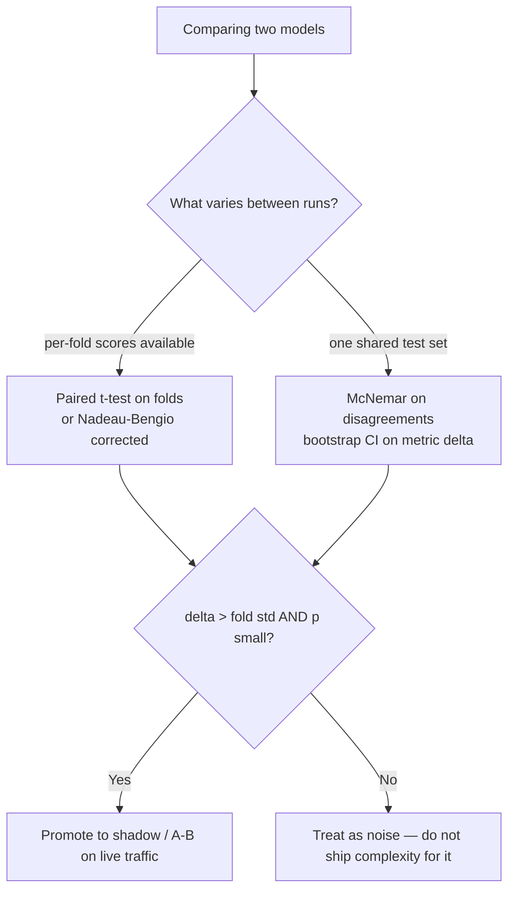
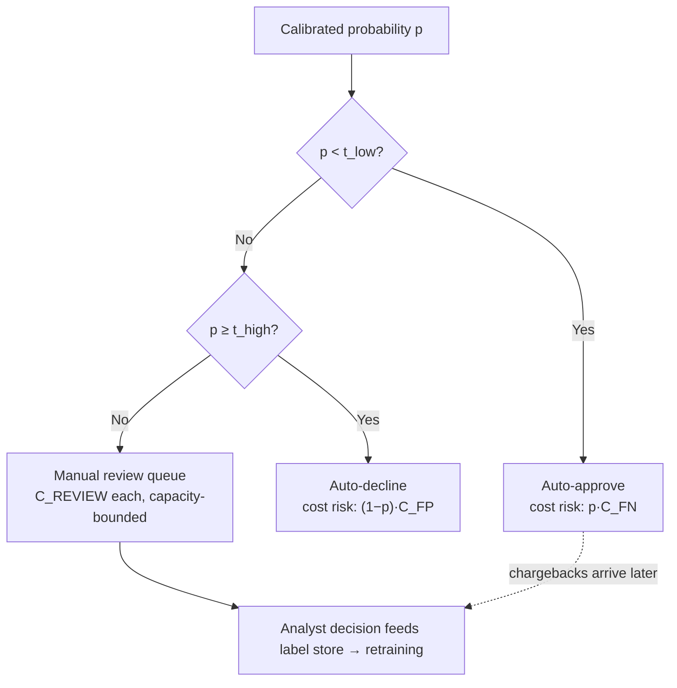

# Model Evaluation in Depth

Evaluation is the discipline that separates engineers who ship models from engineers who ship *numbers about models*. Most production ML failures are not modeling failures — they are measurement failures: a leaky split, a metric that flattered the model, a threshold nobody revisited, a "significant" improvement that was fold-to-fold noise. This guide constructs every core metric by hand from one small worked score table (so you see exactly where ROC and PR curves come from and why they diverge under imbalance), then builds the machinery of honest measurement: stratified/grouped/time-series cross-validation, nested CV, statistical model comparison, learning curves, disciplined error analysis, and expected-cost decision frameworks with multi-threshold operating bands.

The through-line: a metric is a claim about future behavior. Every section here is about making that claim honest.

Part of the [Senior AI Engineer Roadmap](../00-Senior-AI-Engineer-Roadmap.md) — Phase 2.

---

## 1. The Confusion Matrix Family, From One Table

### 1.1 The worked example

Ten transactions, scored by a model, sorted by descending score. 3 positives (fraud), 7 negatives:

| rank | id | score | label |
|---|---|---|---|
| 1 | A | 0.95 | 1 |
| 2 | B | 0.86 | 1 |
| 3 | C | 0.74 | 0 |
| 4 | D | 0.65 | 1 |
| 5 | E | 0.52 | 0 |
| 6 | F | 0.44 | 0 |
| 7 | G | 0.37 | 0 |
| 8 | H | 0.28 | 0 |
| 9 | I | 0.15 | 0 |
| 10| J | 0.06 | 0 |

At threshold `t = 0.5` (flag A, B, C, D, E): TP=3 (A,B,D), FP=2 (C,E), FN=0, TN=5.

```text
Precision = TP/(TP+FP) = 3/5 = 0.60     "of what I flagged, how much was real"
Recall    = TP/(TP+FN) = 3/3 = 1.00     "of what was real, how much I caught"  (= TPR, sensitivity)
FPR       = FP/(FP+TN) = 2/7 = 0.286    "share of innocents I flagged"
Specificity = TN/(FP+TN) = 5/7 = 0.714  (= 1 − FPR)
F1        = 2·0.6·1.0/(0.6+1.0) = 0.75
Accuracy  = 8/10 = 0.80
```

Every threshold produces one such matrix. Curves are what you get by sweeping the threshold through the whole score column.

### 1.2 ROC constructed point by point

Walk down the ranked table; each row is a threshold just below that score. Each positive encountered moves you **up** by 1/P = 1/3; each negative moves you **right** by 1/N = 1/7:

```text
threshold >  (TPR, FPR)
0.95   A:+   (1/3, 0)
0.86   B:+   (2/3, 0)
0.74   C:−   (2/3, 1/7)
0.65   D:+   (3/3, 1/7)
0.52   E:−   (1, 2/7)
...remaining negatives walk right to (1, 1)
```

**AUC by counting:** AUC = P(random positive ranked above random negative). Count concordant pairs among the 3×7 = 21 (positive, negative) pairs: A beats all 7 negatives, B beats all 7, D beats 6 (loses to C). AUC = (7+7+6)/21 = **20/21 ≈ 0.952**. That is a proof by construction that AUC is a *ranking* statistic: rescale the scores by any monotonic function and nothing changes.

### 1.3 PR curve on the same table — the imbalance divergence

Same walk, plotting precision vs recall:

```text
after A:  P=1/1=1.00, R=1/3
after B:  P=2/2=1.00, R=2/3
after C:  P=2/3=0.67, R=2/3     ← one FP among few predictions craters precision
after D:  P=3/4=0.75, R=3/3
after E:  P=3/5=0.60, R=1
...
```

Now imagine the same model on 1,000 negatives instead of 7, with the same ranking quality (same fraction of negatives outscored by positives). ROC is unchanged — FPR normalizes by the huge negative class. But precision after D becomes `3/(3 + ~48)` if just 5% of negatives outrank D — a collapse from 0.75 to ~0.06. **ROC answers "how well does it rank"; PR answers "what will the review team actually experience."** Under heavy imbalance, only the second is a business statement. Also note the PR baseline: a random classifier gets precision = prevalence (0.3 here, 0.001 at fraud scale), while random ROC-AUC is always 0.5 — PR-AUC numbers are not comparable across datasets with different prevalence.

```python
import numpy as np
from sklearn.metrics import roc_auc_score, average_precision_score, roc_curve

scores = np.array([.95,.86,.74,.65,.52,.44,.37,.28,.15,.06])
labels = np.array([1,1,0,1,0,0,0,0,0,0])
print(roc_auc_score(labels, scores))           # 0.9523809... = 20/21 ✓
print(average_precision_score(labels, scores)) # 0.9166... — AP is the standard PR-AUC
# AP = Σ (R_n − R_{n−1})·P_n = (1/3)(1.0) + (1/3)(1.0) + (1/3)(0.75) = 0.9167 ✓
```

### 1.4 Metrics for probabilities: log loss and Brier

Threshold-free metrics that score the probabilities themselves: `log loss = −mean(y·log p + (1−y)·log(1−p))` (unbounded punishment for confident errors) and `Brier = mean((p − y)²)` (bounded, decomposable into calibration + refinement). Track at least one alongside ranking metrics — AUC can improve while probabilities degrade, and downstream expected-cost decisions consume probabilities, not ranks.

---

## 2. Cross-Validation Done Right

### 2.1 Choosing the splitter is choosing your leakage model

```python
from sklearn.model_selection import (StratifiedKFold, GroupKFold,
                                     StratifiedGroupKFold, TimeSeriesSplit)

# 1) i.i.d. rows, imbalanced target → stratify so every fold has positives
cv = StratifiedKFold(n_splits=5, shuffle=True, random_state=42)

# 2) repeated entities (same customer, patient, device in many rows)
#    → all rows of an entity stay on one side, or you're testing memorization
cv = StratifiedGroupKFold(n_splits=5, shuffle=True, random_state=42)
# use with: cross_val_score(pipe, X, y, cv=cv, groups=customer_ids)

# 3) temporal data → train on past, validate on future, ALWAYS
cv = TimeSeriesSplit(n_splits=5, gap=0)   # expanding window
# gap>0 simulates label latency: labels arrive N days late in production,
# so exclude the N days before each validation window from training
```

The decision is not statistical taste — it is a claim about production: "rows at serving time will be (new customers | future dates | more of the same)". Pick the splitter that matches the claim. The most common senior-level catch: transactional fraud data needs **both** grouped and temporal discipline (a customer's future transactions leak their past), which is why real systems validate on out-of-time windows with customer-level separation.

### 2.2 Nested CV — the honest way to tune and report

If you tune hyperparameters with CV and then report the best CV score, the reported number is biased: you selected the config that got lucky on those folds. Nested CV separates *selection* (inner loop) from *assessment* (outer loop):

```python
from sklearn.model_selection import GridSearchCV, cross_val_score, StratifiedKFold
from sklearn.pipeline import make_pipeline
from sklearn.preprocessing import StandardScaler
from sklearn.linear_model import LogisticRegression
from sklearn.datasets import make_classification
import numpy as np

X, y = make_classification(n_samples=1000, n_features=30, n_informative=6,
                           weights=[0.9, 0.1], random_state=0)

inner = StratifiedKFold(5, shuffle=True, random_state=1)
outer = StratifiedKFold(5, shuffle=True, random_state=2)

tuner = GridSearchCV(
    make_pipeline(StandardScaler(), LogisticRegression(max_iter=2000)),
    {"logisticregression__C": np.logspace(-3, 2, 12)},
    scoring="average_precision", cv=inner)

nested = cross_val_score(tuner, X, y, cv=outer, scoring="average_precision")
print(f"nested (honest):    {nested.mean():.3f} ± {nested.std():.3f}")

tuner.fit(X, y)
print(f"non-nested (biased): {tuner.best_score_:.3f}")
# Typical output:
# nested (honest):    0.62 ± 0.05
# non-nested (biased): 0.66   ← the flattering number people put on slides
```

The gap grows with the size of the search space and shrinks with dataset size. Report the nested (or untouched-test-set) number; use the non-nested machinery only to *choose* the config.

### 2.3 Statistical comparison of models

Model A scored 0.71, model B scored 0.69 — is A better, or did A get lucky folds? Two standard tools:

```python
from scipy import stats
import numpy as np

# Paired t-test on per-fold scores (same folds for both models — paired!)
a = np.array([0.71, 0.68, 0.74, 0.70, 0.72])
b = np.array([0.69, 0.67, 0.71, 0.70, 0.69])
t, p = stats.ttest_rel(a, b)
print(f"t={t:.2f}, p={p:.3f}")   # e.g. t=3.16, p=0.034 → difference is real-ish
# Caveat: CV folds share training data → scores are correlated → the test is
# somewhat anti-conservative. 5x2cv or repeated CV with corrected variance
# (Nadeau–Bengio) is the rigorous fix; the paired test is the everyday screen.

# McNemar: two classifiers, ONE test set — uses only the disagreements
# b01 = A wrong & B right, b10 = A right & B wrong
b01, b10 = 27, 43
chi2 = (abs(b01 - b10) - 1)**2 / (b01 + b10)
print(f"chi2={chi2:.2f}, p={1 - stats.chi2.cdf(chi2, df=1):.3f}")
# Output: chi2=3.21, p=0.073 → not significant at 0.05 despite 43 vs 27
```

Decision rule worth institutionalizing: **an improvement smaller than the fold-to-fold standard deviation is noise until proven otherwise** — retest on fresh data before celebrating.



---

## 3. Learning Curves and Validation Curves

**Learning curve** (score vs training-set size) answers the most expensive question in ML: *would more data help?* **Validation curve** (score vs one hyperparameter) localizes the under/overfit transition.

```python
from sklearn.model_selection import learning_curve, validation_curve
from sklearn.ensemble import RandomForestClassifier
import numpy as np

sizes, tr, va = learning_curve(
    RandomForestClassifier(n_estimators=200, random_state=0), X, y,
    train_sizes=np.linspace(0.1, 1.0, 6), cv=5,
    scoring="average_precision", n_jobs=-1)
for s, t_, v_ in zip(sizes, tr.mean(1), va.mean(1)):
    print(f"n={s:4d}  train={t_:.3f}  val={v_:.3f}  gap={t_-v_:.3f}")
# n= 160  train=1.000  val=0.489  gap=0.511
# n= 800  train=1.000  val=0.598  gap=0.402   ← val still climbing, gap wide:
#                                               high variance — MORE DATA HELPS
# Interpretation table:
#   both curves plateau low, small gap  → high bias: more data useless,
#                                         need features/capacity
#   val rising, large gap               → high variance: more data or
#                                         regularization pays
#   train ≈ val ≈ target quality        → done; spend effort elsewhere

param_range = np.array([2, 4, 8, 16, 32, None])
tr2, va2 = validation_curve(
    RandomForestClassifier(n_estimators=200, random_state=0), X, y,
    param_name="max_depth", param_range=param_range, cv=5,
    scoring="average_precision")
# Typical shape: val score rises with depth, peaks (here ~8-16), then flattens
# or dips while train marches to 1.0 — the peak is your capacity sweet spot.
```

These two plots, made before any tuning, prevent the most common resource misallocation in applied ML: weeks of hyperparameter search on a high-bias model, or a data-labeling campaign for a high-variance one that just needed regularization.

---

## 4. Error Analysis as a Discipline

Aggregate metrics tell you *how good*; error analysis tells you *what to do next*. The senior workflow after every training run:

### 4.1 Slice metrics

```python
import pandas as pd
from sklearn.metrics import average_precision_score

def slice_report(df, prob_col, label_col, slice_cols):
    rows = []
    for col in slice_cols:
        for val, g in df.groupby(col):
            if g[label_col].nunique() < 2 or len(g) < 200:
                continue  # metric undefined / too noisy to act on
            rows.append({"slice": f"{col}={val}", "n": len(g),
                         "prevalence": g[label_col].mean(),
                         "ap": average_precision_score(g[label_col], g[prob_col])})
    return (pd.DataFrame(rows)
              .assign(ap_gap=lambda d: d.ap - average_precision_score(
                  df[label_col], df[prob_col]))
              .sort_values("ap_gap"))

report = slice_report(val_df, "prob", "is_fraud",
                      ["country", "channel", "amount_band", "customer_tenure_band"])
print(report.head(8))
# The rows at the top — worst ap_gap — are your roadmap: e.g.
#   slice=channel=mobile_web   n=4102  prevalence=0.021  ap=0.31  ap_gap=-0.24
# means the model is weak exactly where fraud is migrating.
```

A model can hold a strong global PR-AUC while being useless on a segment that matters (new customers, one country, one channel). Segment/cohort metrics belong in the model card and in monitoring — a global metric is an average that hides every decision that matters.

### 4.2 Worst-FP / worst-FN review

```python
val_df = val_df.assign(prob=probs)
worst_fp = val_df[(val_df.is_fraud == 0)].nlargest(25, "prob")   # confident, wrong flags
worst_fn = val_df[(val_df.is_fraud == 1)].nsmallest(25, "prob")  # confident, missed fraud
worst_fp.to_csv("reports/worst_fp.csv"); worst_fn.to_csv("reports/worst_fn.csv")
```

Then **read them, row by row, with a domain expert**. Every batch sorts into: (a) label errors — fix the labels, they were poisoning training; (b) missing feature — the human can tell it's fraud from a signal the model can't see, so build that feature; (c) genuinely hard — accept, or route to the review band. Twenty-five rows of this beats a week of hyperparameter tuning with a regularity that still surprises people. This is the highest-ROI habit in tabular ML.

---

## 5. Expected Cost and Operating Bands

### 5.1 From metric to money

Business decisions need the metric expressed in cost. With `C_FN` = expected loss of a missed fraud and `C_FP` = cost of a false alarm, the classic result: flag when `p · C_FN > (1−p) · C_FP`, i.e. the optimal single threshold is

```text
t* = C_FP / (C_FP + C_FN)          e.g. C_FP=15, C_FN=500 → t* = 15/515 ≈ 0.029
```

— valid **only if `p` is calibrated** (this is why calibration precedes thresholding). With uncalibrated scores, sweep empirically instead.

### 5.2 Three-way operating bands, implemented

Real systems rarely binarize: they auto-approve, auto-decline, and route the ambiguous middle to human review under a capacity constraint.

```python
import numpy as np
from itertools import product

C_FN, C_FP_DECLINE, C_REVIEW = 500.0, 15.0, 4.0
REVIEW_CAPACITY = 0.02          # review team can handle 2% of daily volume
CATCH_RATE_IN_REVIEW = 0.85    # analysts catch most fraud routed to them

def band_cost(probs, y, t_low, t_high):
    approve, decline = probs < t_low, probs >= t_high
    review = ~approve & ~decline
    cost = (y[approve].sum() * C_FN                      # fraud auto-approved
            + (~y[decline].astype(bool)).sum() * C_FP_DECLINE  # legits declined
            + review.sum() * C_REVIEW                    # analyst time
            + y[review].sum() * (1 - CATCH_RATE_IN_REVIEW) * C_FN)
    return cost, review.mean()

grid = np.linspace(0.005, 0.6, 60)
best = min((band_cost(probs, y_val, lo, hi) + (lo, hi)
            for lo, hi in product(grid, grid) if lo < hi
            if band_cost(probs, y_val, lo, hi)[1] <= REVIEW_CAPACITY),
           key=lambda r: r[0])
print(f"cost={best[0]:,.0f}  review_rate={best[1]:.1%}  "
      f"approve<{best[2]:.3f}  decline>={best[3]:.3f}")
# Typical output: cost=41,250  review_rate=1.9%  approve<0.021  decline>=0.310
# Note how LOW both thresholds are — asymmetric costs push everything down.
```

Document the cost assumptions next to the thresholds and re-derive both whenever prevalence, costs, review capacity, or the model change — thresholds silently rot as the world moves.



---

## 6. Production War Stories & Failure Modes

### Incident 1: The random-split fraud model that aced offline and died in production

**Symptom:** offline PR-AUC 0.81; two weeks after launch, live precision at threshold ran at a third of the offline estimate. **Investigation:** offline evaluation used a shuffled 80/20 split over 18 months of transactions. **Root cause:** two leaks at once — temporal (training on transactions *after* some test transactions, so seasonal patterns and fraud-ring behavior leaked backward) and group (the same card present on both sides, letting the model memorize card-level fraud status). **Fix:** re-evaluated with an out-of-time validation window and card-level grouping; true PR-AUC was 0.58; the team re-planned features against the honest number. **Prevention:** splitter choice is a design review item; any transactional dataset defaults to out-of-time + grouped evaluation.

### Incident 2: The "2-point improvement" that was one fold of noise

**Symptom:** challenger beat champion 0.71 vs 0.69 mean CV AP; shipped; production dashboards showed no change over eight weeks. **Investigation:** per-fold scores had std 0.04; paired t-test p = 0.4. **Root cause:** the delta was well inside fold noise; the team compared point estimates without dispersion, after trying ~30 configurations — a garden-of-forking-paths selection effect. **Fix:** rollback (the challenger was heavier to serve for nothing); comparison policy now requires per-fold deltas, a paired test, and confirmation on a later out-of-time window. **Prevention:** every experiment report shows mean ± std and the paired-test p-value; deltas inside one std are labeled "noise" by the tooling itself.

### Incident 3: Great global AUC, catastrophic on the segment that mattered

**Symptom:** credit model with strong overall metrics; three months in, default rates in one country segment ran 3× the model's implied risk. **Investigation:** segment slicing (which had never been run) showed near-random ranking for that country — 4% of volume, badly underrepresented, with different feature semantics (income reported in a different convention). **Root cause:** global AUC averaged over segments; the minority segment's failure was invisible at the top line. **Fix:** per-segment metrics with minimum-sample gates added to the evaluation suite and model card; the segment got a feature fix and, until retraining, a conservative threshold override. **Prevention:** no model ships without slice metrics on the segmentation the business actually manages by.

### Incident 4: The threshold nobody re-tuned

**Symptom:** review-queue volume doubled over a quarter; analyst catch-rate per case fell; no model change had occurred. **Investigation:** prevalence had drifted (a fraud ring moved on; base rate halved) and marketing had shifted the customer mix toward a lower-risk cohort. **Root cause:** thresholds were derived once from costs and prevalence at launch and never revisited — the operating point silently walked off its optimum as `p(y)` moved. **Fix:** re-derived bands from current data; queue volume normalized. **Prevention:** monthly automated re-derivation of expected-cost thresholds with alerting when the optimal band moves more than a set amount; threshold config versioned alongside the model.

---

## 7. Best Practices

- Decide the splitter before the model: match CV structure to the production claim (new entities → grouped; future data → time-based; both → out-of-time with grouping).
- Report mean ± std over folds, never a bare point estimate; treat deltas inside one fold-std as noise pending fresh-data confirmation.
- Tune with an inner loop, report from an outer loop (nested CV) or an untouched out-of-time test set — any data that influenced a decision is spent.
- Under imbalance, lead with PR-AUC and precision/recall at the operating point; keep ROC-AUC as a ranking diagnostic; never report accuracy alone.
- Track a proper scoring rule (log loss or Brier) alongside ranking metrics — downstream decisions consume probabilities.
- Slice metrics by the segments the business manages by, with minimum-sample gates; put them in the model card and in monitoring.
- After every training run, read the top-25 worst FPs and FNs with a domain expert; classify into label error / missing feature / genuinely hard, and act accordingly.
- Derive thresholds from calibrated probabilities and explicit costs; version them with the model; re-derive on a schedule and on prevalence drift.
- Plot learning curves before tuning — establish whether you're bias-limited or variance-limited before spending compute or labeling budget.

---

## 8. Interview Drills

<details><summary>Prove that ROC-AUC equals the probability a random positive outranks a random negative.</summary>
Construct the ROC by walking the ranked list: each positive is a step up of height 1/P, each negative a step right of width 1/N. The area added when passing a negative equals (current TPR) × 1/N = (fraction of positives already seen, i.e., ranked above this negative) × 1/N. Summing over all negatives: AUC = (1/PN) Σ_neg #{positives ranked above} = concordant pairs / total pairs = P(score(pos) > score(neg)). Ties contribute half.
Follow-up: *So what transformations leave AUC unchanged?* Any strictly monotonic transform of the scores — which is exactly why AUC says nothing about calibration.
Follow-up: *Connection to a classical statistic?* It's the Wilcoxon–Mann–Whitney U statistic normalized by PN.
</details>

<details><summary>Why do ROC and PR curves diverge under class imbalance?</summary>
FPR = FP/N normalizes false positives by the (huge) negative class, so thousands of extra FPs barely move the ROC. Precision = TP/(TP+FP) normalizes by the model's own positive predictions, so the same FPs crater it. With 1% prevalence, a model at TPR 0.8 / FPR 0.05 looks excellent on ROC but has precision ≈ 0.008·0.8·... — concretely: 80 TP vs ~495 FP → precision 0.14. PR reflects the analyst's inbox; ROC reflects abstract ranking.
Follow-up: *Why can't you compare PR-AUC across datasets?* The random baseline equals prevalence, so PR-AUC 0.3 is superb at 0.1% prevalence and terrible at 30%. Always report prevalence next to PR-AUC.
</details>

<details><summary>What is nested cross-validation and when is it worth the compute?</summary>
An outer CV loop assesses a *procedure* (including its inner-loop hyperparameter search), so the reported score is untouched by selection. Without nesting, "best CV score over 50 configs" is a max over noisy estimates — biased upward. Worth it when the dataset is small (selection noise is large) or the search space is big; with large data and a truly untouched final test window, the simpler train/val/test protocol delivers the same honesty cheaper.
Follow-up: *What hyperparameters does nested CV give you to deploy?* None directly — each outer fold may select different ones. It scores the procedure; for the shipped model you rerun the search on all training data and carry the nested estimate as its honest performance claim.
</details>

<details><summary>When do you use GroupKFold, and what goes wrong without it?</summary>
Whenever multiple rows share an entity (customer, patient, session, device) and production will score *new* entities. Random splits put the same entity's rows on both sides, so the model partially memorizes entity identity through its feature fingerprint, inflating validation scores — the model looks like it learned fraud patterns when it learned that customer #4711 is fraudulent. GroupKFold keeps every entity on one side.
Follow-up: *What if production scores a mix of known and new entities?* Evaluate both regimes separately — grouped CV for the new-entity claim, and a temporal split (past rows of an entity in train, future in test) for the known-entity claim. Report both; they can differ hugely.
</details>

<details><summary>Two models differ by 0.02 AUC on 5-fold CV. Ship the better one?</summary>
Not yet. Check dispersion: with fold std 0.03, the difference is inside noise. Run a paired test on per-fold scores (same folds!), acknowledging CV's correlated-folds anti-conservatism (Nadeau–Bengio correction or 5x2cv if rigor matters). Then weigh non-metric costs: serving latency, interpretability, retraining complexity. Confirm any real-looking gain on a later out-of-time window before promotion — and prefer shadow deployment as the final arbiter.
Follow-up: *Why must the test be paired?* Both models are evaluated on identical folds, so scores share fold-difficulty variance; pairing subtracts it and dramatically increases power. An unpaired test wastes that structure.
</details>

<details><summary>Explain McNemar's test and when it beats a paired t-test.</summary>
For two classifiers on one shared test set, build the 2×2 disagreement table: b01 = A wrong/B right, b10 = A right/B wrong. Under H0 (equal error rates), disagreements split 50/50, so χ² = (|b01−b10|−1)²/(b01+b10) with 1 df. It uses per-example paired outcomes rather than per-fold aggregates — the right tool when you have a single test set and hard predictions (no retraining variance in view).
Follow-up: *43 vs 27 disagreements looks decisive — is it?* χ² = (16−1)²/70 ≈ 3.2, p ≈ 0.07 — not significant at 0.05. Intuition about disagreement counts is poorly calibrated; that's why the test exists.
</details>

<details><summary>How do learning curves change what you do next?</summary>
Train and validation converge at a low plateau → high bias: more data is wasted money; invest in features, capacity, or a richer model class. Validation still climbing with a wide train-val gap → high variance: more data pays, as do regularization and bagging. Curves converged at target quality → stop tuning; move effort to calibration, thresholds, slices. The curve turns "should we buy more labels?" from a debate into a measurement.
Follow-up: *Validation curve vs learning curve?* Validation curve sweeps one hyperparameter at fixed data size, localizing the under/overfit transition for that knob; learning curve sweeps data size at fixed config. Bias/variance diagnosis uses both.
</details>

<details><summary>Design the evaluation protocol for a fraud model, end to end.</summary>
(1) Out-of-time split: train on months 1–10, validate on 11, test on 12 — never random. (2) Entity grouping: card/customer never crosses boundaries. (3) Label-latency gap between train and evaluation windows (chargebacks arrive weeks late — recent labels are incomplete). (4) Metrics: PR-AUC with prevalence, precision/recall at operating thresholds, log loss, calibration curve. (5) Slices: country, channel, amount band, customer tenure. (6) Expected-cost evaluation of the full approve/review/decline band under review capacity. (7) Worst-FP/FN review with fraud analysts. (8) Statistical comparison against champion on identical windows.
Follow-up: *Why the gap for label latency?* The last weeks' "negatives" include fraud not yet charged back — training or evaluating on them teaches and rewards calling fraud legitimate. Either wait out the maturation window or model label immaturity explicitly.
</details>

<details><summary>Where does the threshold formula t* = C_FP/(C_FP+C_FN) come from, and when is it invalid?</summary>
Flag when expected cost of approving exceeds cost of flagging: p·C_FN > (1−p)·C_FP ⇒ p > C_FP/(C_FP+C_FN). Derivation assumes p is a calibrated probability — with uncalibrated scores the formula's threshold lands somewhere meaningless, so calibrate first or sweep thresholds empirically on validation data. It also assumes per-example constant costs; if cost scales with amount, threshold on expected loss p·amount instead of on p.
Follow-up: *Why do fraud thresholds end up so low (e.g., 0.03)?* Because C_FN ≫ C_FP: at 500 vs 15, flagging is worth it even at 3% fraud probability. The 0.5 default encodes the assumption C_FN = C_FP, which is almost never true.
</details>

<details><summary>What does error analysis find that metric tuning cannot?</summary>
Reading worst false positives/negatives with a domain expert sorts errors into: label errors (fix the training data — no hyperparameter can), missing features (the human uses a signal the model lacks — build it), and genuinely-hard cases (route to review band). Each has a *different* fix, and aggregate metrics can't tell you which bucket dominates. It also finds systematic bugs — a merchant category always misclassified, a unit mismatch in one country — that move metrics more than any tuning.
Follow-up: *How do you make it stick as a process?* Automate the export (top-25 FP/FN with features) as a logged artifact of every training run, and make the classification of those rows a required section of the experiment write-up.
</details>

<details><summary>Your model's AUC improved but log loss got worse. What happened and does it matter?</summary>
Ranking improved while probability quality degraded — typically the new model is more overconfident (common when adding boosting rounds or reweighting classes). It matters iff downstream consumes probabilities: expected-cost thresholds, review-band routing, and loss forecasts all corrupt silently. Fix by recalibrating (isotonic/Platt on held-out data) and verifying with a reliability curve; then re-derive thresholds, because the score-to-probability mapping moved.
Follow-up: *Could you just keep the old thresholds on the new scores?* No — thresholds are statements about the score distribution, which changed. Every model update invalidates thresholds until re-derived; that belongs in the promotion checklist.
</details>

<details><summary>How would you detect that your offline evaluation no longer predicts online performance?</summary>
Instrument the comparison: log serving-time features and scores, join with matured labels, and periodically compute the same metrics offline evaluation reported — the gap between "offline metric on the launch test window" and "same metric on recent production data" is the honesty gauge. Widening gaps implicate drift (feature or label), train-serve skew (feature computed differently online), or evaluation leakage at launch. Shadow-mode scoring of candidate models on live traffic is the strongest version: same traffic, same features, matured labels.
Follow-up: *What single check catches train-serve skew fastest?* Score a sample of production requests offline through the training pipeline and diff the scores; any mismatch beyond float noise means the feature computations disagree.
</details>

<details><summary>Prevalence in production drifted from 1% to 0.4%. What breaks?</summary>
Ranking metrics (AUC) are prevalence-free and survive. Precision at a fixed threshold drops mechanically (fewer true positives per flag); PR-AUC's baseline halves; calibrated probabilities become miscalibrated (the model's implicit prior is stale); expected-cost thresholds are no longer optimal; review-queue volume and composition shift. Response: recalibrate (or apply a prior-shift correction p' = p·r / (p·r + (1−p)) with r the odds ratio of new-to-old prevalence), re-derive thresholds, and investigate *why* prevalence moved — it may be a fraud-ring departure or a labeling delay artifact.
Follow-up: *Which alarm should fire first?* Score-distribution monitoring (mean score, band volumes) detects it before labels mature — label-based metrics lag by the chargeback window.
</details>

---

Continue to [04 — Feature Engineering and Pipelines](./04-Feature-Engineering-and-Pipelines.md), or back to the [track index](./README.md).
