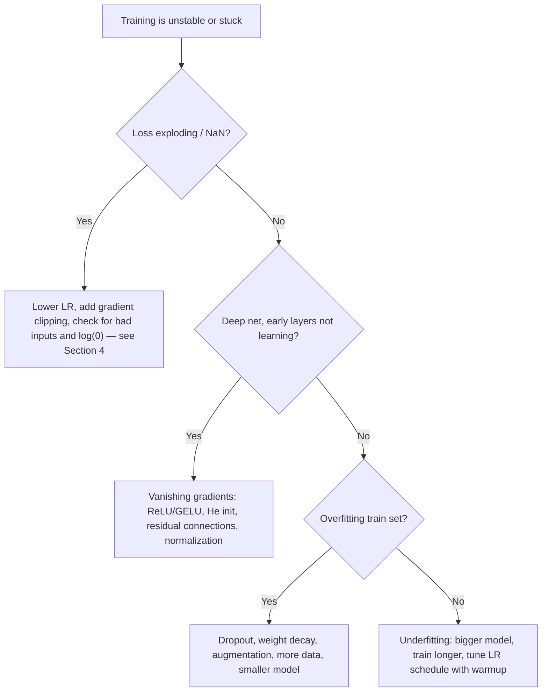
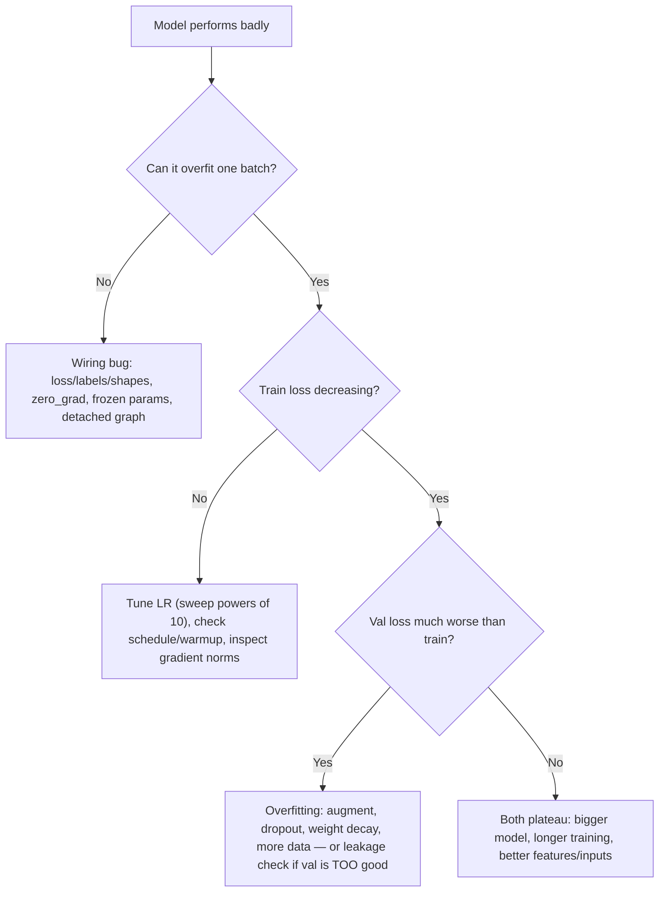

# Deep Learning with PyTorch

Deep learning is where "the model" stops being a library call and becomes a system you design, train, debug, and operate. A senior AI engineer must be able to explain exactly what happens in a forward and backward pass, write a training loop that survives production (checkpointing, early stopping, mixed precision, reproducibility), and diagnose the classic failure modes — loss plateaus, NaNs, silent data bugs — without guessing. This guide expands Phase 3 into practical depth: neural-net fundamentals with a from-scratch NumPy network, PyTorch's core machinery, CNNs and transfer learning, and sequence/time-series models with honest forecasting evaluation.

Part of the [Senior AI Engineer Roadmap](./00-Senior-AI-Engineer-Roadmap.md) — Phase 3.

---

## 1. Neural-Network Fundamentals

### 1.1 Forward Propagation

A dense layer computes `z = Wx + b`, then applies a non-linearity `a = g(z)`. Stacking layers composes functions: `f(x) = g2(W2 · g1(W1 x + b1) + b2)`. Without the non-linearities the whole stack collapses to a single linear map — activations are what buy you expressive power. Defaults: **ReLU** (`max(0, z)`) or **GELU** for hidden layers; identity for regression outputs; sigmoid/softmax only at the output of classifiers (and usually fused into the loss, see below).

### 1.2 Loss Functions: Which Loss for Which Task

| Task | Loss | PyTorch | Notes |
| --- | --- | --- | --- |
| Regression | MSE | `nn.MSELoss` | Sensitive to outliers; penalizes large errors quadratically |
| Regression, outliers present | Huber | `nn.HuberLoss` | MSE near zero, MAE in the tails |
| Binary classification | Binary cross-entropy | `nn.BCEWithLogitsLoss` | Takes **logits**, not sigmoid outputs — numerically stable, supports `pos_weight` for imbalance |
| Multi-class (one label) | Cross-entropy | `nn.CrossEntropyLoss` | Takes logits + integer class labels; softmax is inside the loss |
| Multi-label | BCE per label | `nn.BCEWithLogitsLoss` | One independent sigmoid per label |

The classic bug: applying `softmax`/`sigmoid` yourself and then passing the result to `CrossEntropyLoss`/`BCEWithLogitsLoss`. Both expect raw logits; doubling the squash silently degrades training.

### 1.3 Backpropagation: The Chain Rule, Concretely

Backprop is just the chain rule applied to a computation graph, cached efficiently. Take one neuron with sigmoid output and squared loss: `z = wx + b`, `a = σ(z)`, `L = (a − y)²`. To update `w` you need `∂L/∂w`, and the chain rule decomposes it into local derivatives multiplied along the path from loss to weight:

```text
∂L/∂w = ∂L/∂a · ∂a/∂z · ∂z/∂w
      = 2(a − y) · σ(z)(1 − σ(z)) · x
```

Each node only needs to know its **local** derivative; the backward pass walks the graph from the loss to the inputs, multiplying local derivatives by the incoming upstream gradient and caching forward-pass values (`x`, `z`, `a`) to avoid recomputation. For a layer, the same idea in matrix form: if `Z = XW + b` and the upstream gradient is `dZ`, then `dW = Xᵀ dZ`, `db = sum(dZ, axis=0)`, `dX = dZ Wᵀ`. That is the entire algorithm — Section 2 implements it by hand.

Gradient descent then updates `w ← w − lr · ∂L/∂w`. In practice you use mini-batch SGD with momentum, or **AdamW** (adaptive per-parameter learning rates + decoupled weight decay), which is the modern default.

### 1.4 Vanishing and Exploding Gradients

Backprop multiplies many Jacobians. If their norms are consistently < 1 the product shrinks exponentially with depth (**vanishing** — early layers stop learning, classic with sigmoid/tanh whose max derivative is 0.25); consistently > 1 and it blows up (**exploding** — loss spikes to NaN, classic in RNNs). The modern toolkit exists largely to fight this:

- **Weight initialization** — scale initial weights so activation variance is preserved layer to layer: **He/Kaiming init** (`std = sqrt(2/fan_in)`) for ReLU, **Xavier/Glorot** for tanh/sigmoid. PyTorch layers ship with sane defaults; you mostly care when writing custom layers. Pair with ReLU-family activations, whose derivative is 1 on the active half so gradients don't shrink through activations.
- **Residual connections** — `y = x + F(x)` gives gradients an identity path around every block (Section 5.2).
- **Normalization** — keeps activations in a well-scaled regime (next section).
- **Gradient clipping** — `torch.nn.utils.clip_grad_norm_(model.parameters(), 1.0)` caps the global gradient norm before the optimizer step. Cheap insurance against exploding gradients; near-mandatory for RNNs and transformer training.

### 1.5 BatchNorm vs LayerNorm, Dropout, LR Schedules

- **BatchNorm** normalizes each channel using statistics computed **across the batch**, then rescales with learned `γ, β`. Standard in CNNs. Weaknesses: behaves differently in train vs eval (running stats — a top source of train/serve bugs), degrades with tiny batches, and couples examples within a batch (bad for sequence models and DDP edge cases).
- **LayerNorm** normalizes **across the feature dimension of each example independently** — no batch statistics, identical behavior in train and eval, works at batch size 1. Standard in transformers, RNNs, and anything with variable-length sequences. Rule of thumb: BatchNorm for conv nets with decent batch sizes; LayerNorm for sequences and everything transformer-shaped.
- **Dropout** randomly zeroes each activation with probability `p` at train time (scaling the survivors by `1/(1−p)`), forcing redundant representations — an ensemble-flavored regularizer. Disabled automatically by `model.eval()`. Typical `p` = 0.1–0.5; rarely combined with BatchNorm in conv nets.
- **LR schedules** — the learning rate is the single most important hyperparameter. Common patterns: **warmup** (linearly ramp up for the first few hundred steps to avoid early instability, essential with Adam + transformers), then **cosine decay** to near zero; or `ReduceLROnPlateau` (cut LR when validation loss stalls); or **OneCycle** for fast convergence on smaller jobs.



---

## 2. A Neural Network from Scratch in NumPy

Before trusting autograd, implement backprop once by hand. A complete 2-layer MLP on a toy binary-classification problem — every gradient line maps to the matrix rules from Section 1.3.

```python
import numpy as np

rng = np.random.default_rng(42)

n = 1000
X = rng.normal(size=(n, 2))                                    # 2 features
y = ((X[:, 0] ** 2 + X[:, 1]) > 1).astype(np.float64).reshape(-1, 1)  # non-linear boundary

H = 32  # He initialization: std = sqrt(2 / fan_in)
W1 = rng.normal(0, np.sqrt(2 / 2), size=(2, H)); b1 = np.zeros((1, H))
W2 = rng.normal(0, np.sqrt(2 / H), size=(H, 1)); b2 = np.zeros((1, 1))

def sigmoid(z):
    return 1 / (1 + np.exp(-np.clip(z, -30, 30)))

lr = 0.5
for epoch in range(2000):
    # ---- Forward pass (cache everything needed for backward) ----
    Z1 = X @ W1 + b1          # (n, H)
    A1 = np.maximum(0, Z1)    # ReLU
    Z2 = A1 @ W2 + b2         # (n, 1) logits
    P = sigmoid(Z2)           # probabilities
    loss = -np.mean(y * np.log(P + 1e-12) + (1 - y) * np.log(1 - P + 1e-12))

    # ---- Backward pass (chain rule, output -> input) ----
    dZ2 = (P - y) / n                 # BCE + sigmoid gradient simplifies to (p - y)
    dW2 = A1.T @ dZ2                  # dL/dW2 = A1^T dZ2
    db2 = dZ2.sum(axis=0, keepdims=True)
    dA1 = dZ2 @ W2.T                  # push gradient back through W2
    dZ1 = dA1 * (Z1 > 0)              # ReLU gate: gradient flows only where Z1 > 0
    dW1 = X.T @ dZ1
    db1 = dZ1.sum(axis=0, keepdims=True)

    # ---- Gradient descent step ----
    W1 -= lr * dW1; b1 -= lr * db1
    W2 -= lr * dW2; b2 -= lr * db2

    if epoch % 400 == 0:
        print(f"epoch {epoch:4d}  loss {loss:.4f}  acc {((P > 0.5) == y).mean():.3f}")
```

Two details worth internalizing: the combined sigmoid+BCE gradient collapses to the beautifully simple `p − y` (this is why frameworks fuse them), and the ReLU backward pass is just a boolean mask of the forward pass. Everything PyTorch does in `loss.backward()` is this, generalized to arbitrary graphs.

---

## 3. PyTorch Core

### 3.1 Tensors, Autograd, nn.Module

Tensors are NumPy arrays with a `device` (CPU/GPU) and an optional gradient tape. Every operation on a tensor with `requires_grad=True` is recorded in a dynamic graph; `loss.backward()` replays it in reverse and accumulates gradients into `.grad` (accumulates — hence `optimizer.zero_grad()` every step). `nn.Module` is the unit of composition: parameters registered in `__init__` are tracked automatically for the optimizer, moved with `.to(device)`, and serialized via `state_dict()`.

```python
import torch
from torch import nn

class MLP(nn.Module):
    def __init__(self, in_dim: int, hidden: int, n_classes: int, p_drop: float = 0.2):
        super().__init__()
        self.net = nn.Sequential(
            nn.Linear(in_dim, hidden), nn.ReLU(), nn.Dropout(p_drop),
            nn.Linear(hidden, hidden), nn.ReLU(), nn.Dropout(p_drop),
            nn.Linear(hidden, n_classes),   # logits out; CrossEntropyLoss applies softmax
        )

    def forward(self, x):
        return self.net(x)
```

`Dataset` answers "give me example i" (`__len__`/`__getitem__`); `DataLoader` handles batching, shuffling, parallel workers (`num_workers`), and pinned memory for fast host-to-GPU copies. Keep heavy decoding/augmentation in the Dataset so workers parallelize it.

### 3.2 A Production-Quality Training Loop

Reproducibility, train/val separation, mixed precision, checkpointing, early stopping, clipping — the loop you should be able to write from memory.

```python
import random
import numpy as np
import torch
from torch import nn
from torch.utils.data import DataLoader

def set_seed(seed: int = 42):
    random.seed(seed); np.random.seed(seed); torch.manual_seed(seed)
    torch.cuda.manual_seed_all(seed)  # strict: torch.use_deterministic_algorithms(True)

def train(model, train_ds, val_ds, epochs=50, lr=3e-4, patience=5):
    set_seed(42)
    device = "cuda" if torch.cuda.is_available() else "cpu"
    model = model.to(device)
    train_dl = DataLoader(train_ds, batch_size=256, shuffle=True,
                          num_workers=4, pin_memory=True, drop_last=True)
    val_dl = DataLoader(val_ds, batch_size=512, num_workers=4, pin_memory=True)

    opt = torch.optim.AdamW(model.parameters(), lr=lr, weight_decay=1e-2)
    sched = torch.optim.lr_scheduler.CosineAnnealingLR(opt, T_max=epochs)
    scaler = torch.amp.GradScaler(device)          # mixed precision loss scaling
    loss_fn = nn.CrossEntropyLoss()

    best_val, bad_epochs = float("inf"), 0
    for epoch in range(epochs):
        model.train()
        for x, y in train_dl:
            x, y = x.to(device, non_blocking=True), y.to(device, non_blocking=True)
            opt.zero_grad(set_to_none=True)
            with torch.amp.autocast(device):        # fp16/bf16 forward + loss
                loss = loss_fn(model(x), y)
            scaler.scale(loss).backward()
            scaler.unscale_(opt)                    # unscale before clipping
            torch.nn.utils.clip_grad_norm_(model.parameters(), max_norm=1.0)
            scaler.step(opt)
            scaler.update()
        sched.step()

        model.eval()
        val_loss, n_val = 0.0, 0
        with torch.no_grad():
            for x, y in val_dl:
                x, y = x.to(device), y.to(device)
                val_loss += loss_fn(model(x), y).item() * len(y)
                n_val += len(y)
        val_loss /= n_val
        if val_loss < best_val - 1e-4:              # improvement -> checkpoint
            best_val, bad_epochs = val_loss, 0
            torch.save({"epoch": epoch, "model": model.state_dict(),
                        "opt": opt.state_dict(), "val_loss": val_loss}, "best.pt")
        else:                                       # early stopping
            bad_epochs += 1
            if bad_epochs >= patience:
                print(f"Early stopping at epoch {epoch}")
                break

    model.load_state_dict(torch.load("best.pt")["model"])  # restore best weights
    return model
```

Key habits: `model.train()`/`model.eval()` toggled correctly (dropout and BatchNorm depend on it), `torch.no_grad()` for validation, checkpoints containing optimizer state so training is resumable, and the scaler's unscale-before-clip ordering under AMP.

### 3.3 torch.compile, DDP, and When to Reach for FSDP

`model = torch.compile(model)` traces your Python into an optimized graph (TorchDynamo + Inductor): kernel fusion, reduced Python overhead, often 1.3–2x speedups for free. The catch is **graph breaks** — data-dependent Python control flow, `.item()` calls, printing tensors, or unsupported ops split the graph back into eager fragments and eat the win. Debug with `torch.compile(model, fullgraph=True)` (errors on any break) or `TORCH_LOGS=graph_breaks`.

**DistributedDataParallel (DDP)** replicates the full model on every GPU; each rank processes its shard of the batch, and gradients are all-reduced (averaged) during backward so replicas stay in sync. Use it whenever the model fits on one GPU and you want data-parallel throughput.

```python
# torchrun --nproc_per_node=4 train_ddp.py
import os, torch, torch.distributed as dist
from torch.nn.parallel import DistributedDataParallel as DDP
from torch.utils.data.distributed import DistributedSampler

dist.init_process_group("nccl")
rank = int(os.environ["LOCAL_RANK"])
torch.cuda.set_device(rank)

model = DDP(MLP(128, 512, 10).cuda(rank), device_ids=[rank])
sampler = DistributedSampler(train_ds)             # each rank gets a distinct shard
train_dl = DataLoader(train_ds, batch_size=256, sampler=sampler)
# per epoch: sampler.set_epoch(epoch); run the normal loop; checkpoint on rank 0 only
```

**FSDP** (Fully Sharded Data Parallel) shards the parameters, gradients, and optimizer states themselves across ranks, gathering each layer's weights just-in-time for its forward/backward. Reach for it when the model + optimizer state no longer fits on a single GPU (roughly the multi-billion-parameter regime, or large models with Adam's 2x optimizer-state overhead). DDP first; FSDP when memory, not compute, is the binding constraint.

---

## 4. Debugging Neural Networks

### 4.1 The Overfit-One-Batch Trick

Before any long run: take a single small batch and train on it repeatedly. A correct model/loss/optimizer wiring will drive the loss to ~0 within a few hundred steps. If it can't memorize 32 examples, no amount of data or epochs will save you — the bug is in the pipeline, not the capacity.

### 4.2 Loss Not Decreasing — the Checklist

1. **Learning rate** — too high (loss oscillates or explodes) or too low (flat). Sweep powers of 10 first.
2. **Loss/label mismatch** — softmax fed into `CrossEntropyLoss`, labels not 0-indexed, shapes broadcasting silently (`(N,1)` vs `(N,)` in MSE is a classic).
3. **Forgotten `zero_grad()`** — gradients accumulate across steps.
4. **Data bugs** — unnormalized inputs, shuffled labels, train/serve preprocessing mismatch. Print and eyeball a batch; check label distribution.
5. **Mode and freezing bugs** — `model.eval()` left on during training, `no_grad` around the forward pass, `requires_grad=False` parameters, or parameters never handed to the optimizer.
6. **Gradient flow** — log `p.grad.norm()` per layer; all-zeros means a detached graph, all-tiny in early layers means vanishing gradients.

### 4.3 NaN Hunting

NaNs almost always come from: LR too high, `log(0)` or `sqrt(0)` in custom losses, division by a variance that hit zero, corrupt inputs (NaN in the data itself), or fp16 overflow under mixed precision. Tools: `torch.autograd.set_detect_anomaly(True)` pinpoints the op that produced the first NaN (slow — debugging only); `torch.isnan(x).any()` asserts on inputs; use `bf16` instead of `fp16` if overflow is the culprit (same range as fp32); clip gradients; add epsilons to logs and denominators.



---

## 5. Convolutional Networks and Computer Vision

### 5.1 Convolution Intuition

A convolution slides a small learned kernel (e.g., 3x3) across the image, computing dot products at every position. Two properties make this the right prior for images: **local connectivity** (nearby pixels correlate) and **weight sharing** (an edge detector useful at one location is useful everywhere — translation equivariance), which slashes parameters versus dense layers. Stacking conv + pooling/stride layers grows the receptive field, so the hierarchy learns edges → textures → parts → objects.

### 5.2 Residual Connections and ResNets

Plain deep stacks degrade: a 56-layer CNN trained *worse* than a 20-layer one — an optimization problem, not overfitting. ResNet blocks compute `y = x + F(x)`: the block learns a residual correction on top of identity. Consequences: gradients always have an unattenuated path to early layers (killing vanishing gradients), and "do nothing" is trivially learnable (`F → 0`), so deeper never has to be worse. Residual connections are now universal — every transformer block uses the same trick.

### 5.3 Transfer Learning and Fine-Tuning

Almost nobody trains vision models from scratch. Start from ImageNet-pretrained weights: the early layers already encode generic edges and textures. Standard recipe: replace the classification head, train it first (optionally with the backbone frozen), then unfreeze and fine-tune everything at a low LR.

```python
import torch
from torch import nn
from torchvision import models, transforms

weights = models.ResNet50_Weights.IMAGENET1K_V2
model = models.resnet50(weights=weights)

for p in model.parameters():          # phase 1: freeze the backbone
    p.requires_grad = False
model.fc = nn.Linear(model.fc.in_features, 2)   # new head: defect / no-defect

train_tfms = transforms.Compose([     # augmentation: train-time only
    transforms.RandomResizedCrop(224, scale=(0.7, 1.0)),
    transforms.RandomHorizontalFlip(),
    transforms.ToTensor(),
    transforms.Normalize(mean=[0.485, 0.456, 0.406], std=[0.229, 0.224, 0.225]),
])
# ... train the head for a few epochs, then:
for p in model.parameters():          # phase 2: unfreeze, fine-tune at low LR
    p.requires_grad = True
opt = torch.optim.AdamW([
    {"params": model.fc.parameters(), "lr": 1e-3},
    {"params": [p for n, p in model.named_parameters() if not n.startswith("fc")],
     "lr": 1e-5},                     # discriminative LRs: backbone moves gently
])
```

**Augmentation** (random crops, flips, color jitter, and stronger schemes like RandAugment/MixUp/CutMix) is the cheapest regularizer in vision — it multiplies effective dataset size with label-preserving transforms. Apply it only at train time, and only transforms that preserve the label (don't horizontally flip digit "6" datasets or left/right-sensitive medical images).

**Vision transformers, briefly:** ViTs split the image into 16x16 patches, embed each as a token, and run a standard transformer over the sequence. With no convolutional prior they need large-scale pretraining to shine, but pretrained ViTs now match or beat CNNs and dominate as backbones for CLIP-style multimodal models. Practical stance: fine-tuning a pretrained ViT and a pretrained ResNet look almost identical in code; choose by available checkpoints, latency budget, and dataset size.

---

## 6. Sequence and Time-Series Models

### 6.1 RNN, LSTM, GRU — and Why Transformers Displaced Them

An RNN consumes a sequence step by step, carrying a hidden state: `h_t = tanh(W_x x_t + W_h h_{t−1} + b)`. Backpropagation-through-time multiplies by `W_h` at every step, so plain RNNs vanish/explode over long sequences and forget quickly. **LSTM** adds a cell state with input/forget/output gates — an additive memory path whose gradients survive far longer. **GRU** is the lighter two-gate variant (fewer parameters, similar accuracy, often the pragmatic pick).

Transformers displaced them for two reasons: **parallelism** (recurrence is inherently sequential — step t needs step t−1 — while attention processes all positions at once, saturating GPUs) and **direct long-range access** (attention connects any two positions in one hop; an RNN squeezes history through a fixed-size state). LSTMs/GRUs remain relevant for small datasets, low-latency streaming inference, and edge deployment.

**Temporal convolutions (TCNs)** are the third option: stacked 1-D **causal** convolutions (no peeking at the future) with exponentially **dilated** kernels, so the receptive field grows exponentially with depth. Parallel like transformers, cheap like CNNs — a strong, underrated baseline for forecasting.

### 6.2 Forecasting Evaluation: No Random Splits

Random train/test splits on time series are leakage — the model trains on the future. Evaluate the way the model will be used:

- **Backtesting (walk-forward validation):** train on `[t0, t1)`, predict `[t1, t2)`; slide or expand the window and repeat. Report metrics per fold and per horizon step — accuracy at horizon 1 says nothing about horizon 30.
- **Baselines first:** naive last-value, seasonal-naive ("same hour last week"), and exponential smoothing. Deep models frequently lose to seasonal-naive on real business series; if yours doesn't beat it, ship the baseline.
- **Handle seasonality and trend explicitly:** calendar covariates (hour, day-of-week, holidays), known-future covariates (planned promotions), and either differencing/detrending or a model family that learns them.
- **Prediction intervals, not just point forecasts:** operational decisions (staffing, inventory) need uncertainty. Get intervals via quantile losses (pinball loss at q10/q50/q90), a parametric output head (predict mean and variance), or conformal prediction on backtest residuals. Validate **coverage**: your 90% interval should contain ~90% of actuals in the backtest. For point metrics use MAE/RMSE; treat MAPE/sMAPE cautiously (they explode near zero actuals).

---

## 7. Phase 3 Project: Image Defect-Detection Service

The roadmap's capstone: a defect-detection service with a human-in-the-loop retraining flywheel — the pattern behind most production vision systems.

1. **Upload API** — FastAPI endpoint accepting images; store originals in object storage, metadata in PostgreSQL.
2. **Async preprocessing** — queue (Celery/RQ) resizes, normalizes, and validates images off the request path.
3. **Inference** — fine-tuned ResNet/ViT (Section 5.3) served from a checkpoint; return `{label, confidence, model_version}` and persist every prediction.
4. **Review interface** — low-confidence and sampled high-confidence predictions routed to a human review queue.
5. **Human corrections** — reviewer accepts or corrects labels; corrections are stored as new versioned training data with reviewer ID and timestamp.
6. **Retraining loop** — periodically fine-tune from corrected labels; evaluate on a frozen golden test set plus the newest corrections; promote only if both improve.
7. **Confidence monitoring** — dashboard for the confidence distribution over time; a drifting distribution is your earliest drift alarm, available before labels arrive.

**Senior-level additions:** shadow-deploy the retrained model before promotion; track per-defect-class precision/recall (rare defect classes get swamped by aggregates); active learning — prioritize the most uncertain images for review to maximize label ROI; guard against feedback loops (reviewers only seeing what the model flags biases the correction data — keep a random-sample audit stream).

---

## Best Practices

- Overfit a single batch before every long training run; it catches wiring bugs in minutes instead of GPU-days.
- Pass logits to `CrossEntropyLoss`/`BCEWithLogitsLoss` — never pre-softmax/pre-sigmoid outputs.
- Fix seeds and log them; checkpoint model + optimizer + scheduler state so any run is resumable and reproducible.
- Use AdamW + warmup + cosine decay as the default recipe; sweep the LR in powers of 10 before touching anything else. Toggle `model.train()` / `model.eval()` correctly and wrap validation in `torch.no_grad()`.
- Use mixed precision (`torch.amp`, prefer bf16 where supported) and `torch.compile` for free speed; watch for graph breaks, and clip gradient norms by default for RNNs and transformers.
- Fine-tune pretrained backbones instead of training from scratch; use discriminative learning rates (head fast, backbone slow).
- For time series: walk-forward backtests only, seasonal-naive as the baseline to beat, and prediction intervals with verified coverage. In production, monitor the confidence distribution — it drifts before accuracy metrics can.

## Interview Questions

<details><summary>Walk me through backpropagation for a 2-layer network. What gets cached and why?</summary>
Forward: Z1 = XW1 + b1, A1 = ReLU(Z1), Z2 = A1·W2 + b2, loss from Z2. Backward applies the chain rule from the loss toward the inputs: with upstream gradient dZ2 (which for softmax/sigmoid + cross-entropy simplifies to p − y), dW2 = A1ᵀ dZ2, db2 = sum(dZ2), dA1 = dZ2 W2ᵀ, dZ1 = dA1 ⊙ 1[Z1 > 0] (the ReLU mask), dW1 = Xᵀ dZ1. The forward pass caches activations (X, Z1, A1) because the local derivatives need them — that cache is exactly why training uses far more memory than inference, and why gradient checkpointing (recompute instead of cache) trades compute for memory.
</details>

<details><summary>Which loss function would you use for each of: regression with outliers, multi-class classification, multi-label classification — and what is the classic mistake with PyTorch's classification losses?</summary>
Huber loss for regression with outliers (quadratic near zero, linear in the tails, so outliers don't dominate). CrossEntropyLoss for multi-class with a single label — it takes raw logits plus integer labels and applies log-softmax internally. BCEWithLogitsLoss for multi-label — one independent sigmoid per label, with pos_weight available for imbalance. The classic mistake: applying softmax or sigmoid yourself before these losses. They expect logits; double-squashing compresses gradients and silently degrades training while still "working".
</details>

<details><summary>What causes vanishing and exploding gradients, and what are the modern fixes?</summary>
Backprop is a product of per-layer Jacobians; norms consistently below 1 shrink the product exponentially with depth (vanishing — early layers stop learning; classic with sigmoid/tanh whose derivative maxes at 0.25), norms above 1 blow it up (exploding — spikes and NaNs, classic in RNNs multiplying by the same recurrent matrix each step). Fixes: ReLU/GELU activations (derivative ~1 on the active region), He/Xavier initialization matched to the activation, residual connections (identity gradient highway), Batch/LayerNorm keeping activations well-scaled, gradient-norm clipping against explosions, and gated architectures (LSTM/GRU) or attention for sequences.
</details>

<details><summary>BatchNorm vs LayerNorm — how do they differ, and when do you use each?</summary>
BatchNorm normalizes each channel using mean/variance computed across the batch, keeping running statistics for inference — so it behaves differently in train vs eval, degrades at small batch sizes, and couples examples in a batch. LayerNorm normalizes across the feature dimension of each example independently: no batch statistics, identical train/eval behavior, works at batch size 1 and with variable-length sequences. Use BatchNorm in CNNs with healthy batch sizes; LayerNorm in transformers, RNNs, and small-batch or sequence settings. A frequent production bug is BatchNorm running stats going stale or eval mode not being set, causing train/serve skew.
</details>

<details><summary>Your training loss is not decreasing. What is your debugging process?</summary>
First run the overfit-one-batch test: train repeatedly on ~32 examples; a correctly wired model drives loss to near zero, so failure means a pipeline bug, not a capacity problem. Then check in order: learning rate (sweep powers of 10 — too high oscillates/explodes, too low flatlines); loss/label wiring (softmax fed to CrossEntropyLoss, non-0-indexed labels, silent shape broadcasting like (N,1) vs (N,)); optimizer wiring (zero_grad each step, parameters actually registered and requires_grad=True); data (eyeball a decoded batch, verify normalization and label distribution); mode flags (model.train() during training); and finally gradient flow — log per-layer gradient norms to spot detached graphs (zeros) or vanishing gradients (tiny early-layer norms).
</details>

<details><summary>What does torch.compile do, and what is a graph break?</summary>
torch.compile traces the Python-level model into an FX graph (TorchDynamo) and compiles it to fused, optimized kernels (Inductor), removing Python overhead and fusing elementwise ops — commonly 1.3–2x training speedups without code changes. A graph break happens when tracing hits something it cannot capture — data-dependent Python control flow, .item()/print on tensors, unsupported ops or third-party calls — and the model falls back to eager for that segment, splitting the graph and losing fusion opportunities across the boundary. Diagnose with fullgraph=True (hard-errors on the first break) or TORCH_LOGS=graph_breaks, then rewrite the offending code (e.g., replace Python branches with torch.where).
</details>

<details><summary>Compare DDP and FSDP. When do you need each?</summary>
DDP replicates the entire model on every GPU; each rank computes on its own data shard and gradients are all-reduced during backward so replicas stay identical. Memory cost per GPU is the full model + gradients + optimizer state, so it works only while everything fits on one device — but it is the simplest, most robust scaling tool and the right default. FSDP shards parameters, gradients, and optimizer state across ranks, all-gathering each layer's weights just-in-time for forward/backward and freeing them after — per-GPU memory drops roughly by the world size at the cost of extra communication. Reach for FSDP when memory, not compute, is the constraint: multi-billion-parameter models, or large models where Adam's optimizer state (2 extra copies) breaks the budget. Rule: DDP until it OOMs, then FSDP.
</details>

<details><summary>Why did transformers displace RNNs/LSTMs for sequence modeling, and when are recurrent models still the right choice?</summary>
Two reasons. Parallelism: recurrence is inherently sequential (h_t depends on h_{t−1}), so training cannot parallelize across time steps, while self-attention processes all positions simultaneously and saturates modern accelerators — enabling training on vastly more data. Access pattern: attention connects any two positions in one hop with a path length of 1, whereas an RNN must squeeze all history through a fixed-size hidden state across many steps, losing long-range information even with LSTM gating. Recurrent models (and GRUs especially) remain sensible for small datasets where transformer capacity overfits, strict low-latency streaming inference with O(1) per-step state, and memory-constrained edge deployment. Temporal convolutions are a strong middle ground for forecasting.
</details>

<details><summary>How do you evaluate a time-series forecasting model honestly?</summary>
Never with random splits — that trains on the future (leakage). Use walk-forward backtesting: train on data up to time t, forecast the next horizon, slide or expand the window, and aggregate metrics per fold and per horizon step. Always compare against naive and seasonal-naive baselines — deep models routinely lose to "same hour last week" on business series, and beating the baseline is the bar for shipping. Include calendar and known-future covariates properly (only information available at forecast time). Produce prediction intervals, not just points — via quantile/pinball loss, a distributional head, or conformal residuals — and verify empirical coverage in the backtest (a 90% interval should contain ~90% of actuals). Prefer MAE/RMSE or pinball loss; treat MAPE with suspicion near zero-valued actuals.
</details>
