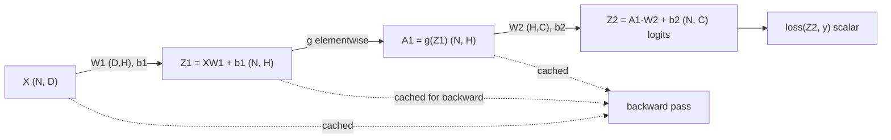
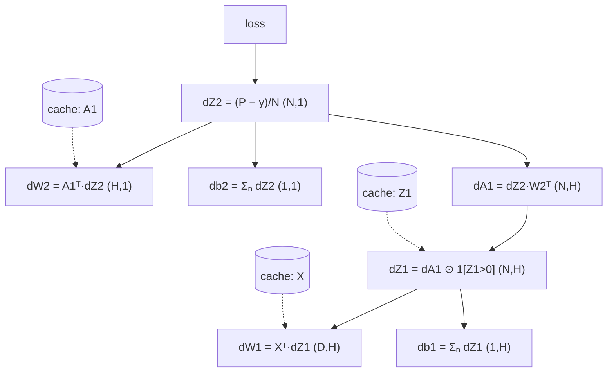

# Neural Networks from Scratch

Before you trust `loss.backward()`, you should have implemented it once with your own hands. Every senior-level deep learning interview eventually lands here: "derive the gradient", "why does cross-entropy pair with softmax", "what exactly is cached during the forward pass and why". Engineers who have built a network in NumPy answer these fluently; engineers who have only called PyTorch APIs stall. This guide walks the full path: perceptron → MLP, the forward pass with every shape annotated, the three core losses derived line by line (including the famously elegant softmax + cross-entropy gradient `y_hat − y`), complete backprop for a two-layer network with every ∂L/∂ symbol worked out, and then a modular NumPy implementation — Layer classes with forward/backward, an SGD loop, gradient checking — trained on the two-moons dataset with real printed loss curves.

Nothing here is of historical interest only. The cached-activation insight explains why training needs ~3x inference memory and what gradient checkpointing trades. The `y_hat − y` result explains why `CrossEntropyLoss` takes logits. The gradient-checking routine is the same tool you will reach for when a custom autograd Function misbehaves in production.

Part of the [Senior AI Engineer Roadmap](../00-Senior-AI-Engineer-Roadmap.md) — Phase 3.

---

## 1. From Perceptron to MLP

### 1.1 The Perceptron

The 1958 perceptron is a single neuron with a step activation:

```text
y_hat = step(w · x + b),   step(z) = 1 if z ≥ 0 else 0
```

Its learning rule (`w ← w + lr · (y − y_hat) · x`) provably converges **if the data is linearly separable** — and does nothing useful otherwise. The classic counterexample is XOR: no single line separates `{(0,0)→0, (1,1)→0, (0,1)→1, (1,0)→1}`. This limitation (Minsky & Papert, 1969) froze the field for a decade, and the fix defines modern deep learning: **stack layers, with non-linearities between them**.

### 1.2 Why the Non-Linearity Is Everything

Stack two linear layers without an activation:

```text
h = W1 x + b1
y = W2 h + b2 = W2 (W1 x + b1) + b2 = (W2 W1) x + (W2 b1 + b2)
```

That is a single linear map with weights `W2 W1` — depth bought you nothing. Insert any non-linear `g` between them and the composition `W2 · g(W1 x + b1) + b2` can bend decision boundaries. The **universal approximation theorem** says one sufficiently wide hidden layer with a non-polynomial activation can approximate any continuous function on a compact set — but it says nothing about *learnability* or *efficiency*; depth is preferred in practice because it composes features hierarchically with exponentially fewer units.

### 1.3 The MLP, With Shapes

A multilayer perceptron (MLP) is an alternating stack of affine maps and elementwise non-linearities. For batch size `N`, input dim `D`, hidden dim `H`, output dim `C`:

```text
X   : (N, D)        input batch (row per example — the NumPy/PyTorch convention)
W1  : (D, H)        first-layer weights
b1  : (1, H)        first-layer bias (broadcasts over rows)
Z1  = X W1 + b1     : (N, D) @ (D, H) → (N, H)      pre-activation
A1  = g(Z1)         : (N, H)                          activation (elementwise)
W2  : (H, C)
b2  : (1, C)
Z2  = A1 W2 + b2    : (N, H) @ (H, C) → (N, C)      logits
```

Memorize the shape-check habit: **inner dimensions must match, batch dimension rides along**. Every shape bug in this guide's exercises (and half of real-world debugging) is caught by writing these annotations.



The dashed edges are the point people miss: the forward pass **caches** `X`, `Z1`, `A1` because the backward pass needs them. This cache is why training uses far more memory than inference.

---

## 2. Loss Functions, Derived

A loss maps `(predictions, targets) → scalar`. We need its value *and* its gradient with respect to the predictions, because that gradient is what backprop propagates.

### 2.1 Mean Squared Error (Regression)

For predictions `y_hat : (N, 1)` and targets `y : (N, 1)`:

```text
L = (1/N) Σᵢ (y_hatᵢ − yᵢ)²
```

Gradient, one line of calculus per step:

```text
∂L/∂y_hatᵢ = (1/N) · ∂/∂y_hatᵢ (y_hatᵢ − yᵢ)²        (only term i survives the sum)
           = (1/N) · 2 (y_hatᵢ − yᵢ)
           = (2/N) (y_hatᵢ − yᵢ)                         shape: (N, 1), same as y_hat
```

Interpretation: the gradient is the (scaled) residual. Big miss → big gradient → outliers dominate; that is why Huber loss (quadratic near zero, linear in the tails) exists.

### 2.2 Binary Cross-Entropy (Binary Classification)

Model outputs a probability `p = σ(z)` where `σ(z) = 1/(1 + e^(−z))` is the sigmoid of logit `z`. BCE is the negative log-likelihood of a Bernoulli:

```text
L = −[ y log p + (1 − y) log(1 − p) ]
```

First, the sigmoid's own derivative — worth memorizing:

```text
σ(z)  = (1 + e^(−z))^(−1)
σ'(z) = −(1 + e^(−z))^(−2) · (−e^(−z))          (chain rule on the outer power)
      = e^(−z) / (1 + e^(−z))²
      = [1/(1 + e^(−z))] · [e^(−z)/(1 + e^(−z))]
      = σ(z) · (1 − σ(z))                         (since e^(−z)/(1+e^(−z)) = 1 − σ(z))
```

Now the loss gradient with respect to the **probability** `p`:

```text
∂L/∂p = −[ y/p − (1 − y)/(1 − p) ]
      = −[ y(1 − p) − (1 − y)p ] / [ p(1 − p) ]
      = −[ y − yp − p + yp ] / [ p(1 − p) ]
      = (p − y) / [ p(1 − p) ]
```

And with respect to the **logit** `z`, chaining through the sigmoid:

```text
∂L/∂z = ∂L/∂p · ∂p/∂z
      = [ (p − y) / (p(1 − p)) ] · [ p(1 − p) ]
      = p − y
```

The awkward `p(1 − p)` denominators **cancel exactly**. This is the first appearance of the pattern that defines classification losses: *gradient at the logit = prediction − target*. It is also why `BCEWithLogitsLoss` exists: computing the loss from the logit directly (via the log-sum-exp form `L = max(z,0) − zy + log(1 + e^(−|z|))`) avoids `log(0)` when `p` saturates to 0 or 1 in floating point.

### 2.3 Softmax + Categorical Cross-Entropy — the Elegant Gradient

For `C` classes, logits `z : (C,)` (one example; the batch just averages). Softmax converts logits to a distribution, cross-entropy scores it against a one-hot target `y`:

```text
pⱼ = e^{zⱼ} / Σₖ e^{zₖ}
L  = − Σⱼ yⱼ log pⱼ = − log p_c          (c = the true class, since y is one-hot)
```

We want `∂L/∂zᵢ` for every logit `i`. Step 1 — the softmax Jacobian, two cases because `zᵢ` appears in every `pⱼ` through the denominator:

```text
Case i = j:
∂pⱼ/∂zⱼ = ∂/∂zⱼ [ e^{zⱼ} / Σₖ e^{zₖ} ]
        = [ e^{zⱼ} Σₖ e^{zₖ} − e^{zⱼ} e^{zⱼ} ] / (Σₖ e^{zₖ})²      (quotient rule)
        = pⱼ − pⱼ² = pⱼ(1 − pⱼ)

Case i ≠ j:
∂pⱼ/∂zᵢ = ∂/∂zᵢ [ e^{zⱼ} / Σₖ e^{zₖ} ]
        = [ 0 · Σₖ e^{zₖ} − e^{zⱼ} e^{zᵢ} ] / (Σₖ e^{zₖ})²          (numerator ⊥ zᵢ)
        = − pⱼ pᵢ
```

Step 2 — chain through the loss:

```text
∂L/∂zᵢ = Σⱼ (∂L/∂pⱼ)(∂pⱼ/∂zᵢ)          where ∂L/∂pⱼ = −yⱼ/pⱼ
       = Σⱼ (−yⱼ/pⱼ) · ∂pⱼ/∂zᵢ
       = (−yᵢ/pᵢ) · pᵢ(1 − pᵢ)  +  Σ_{j≠i} (−yⱼ/pⱼ) · (−pⱼ pᵢ)     (split j = i from j ≠ i)
       = −yᵢ(1 − pᵢ)  +  Σ_{j≠i} yⱼ pᵢ
       = −yᵢ + yᵢ pᵢ + pᵢ Σ_{j≠i} yⱼ
       = −yᵢ + pᵢ ( yᵢ + Σ_{j≠i} yⱼ )
       = −yᵢ + pᵢ · 1                                 (one-hot: Σⱼ yⱼ = 1)
       = pᵢ − yᵢ
```

**The entire softmax Jacobian collapses to `y_hat − y`.** For a batch it is `(P − Y)/N : (N, C)`. Consequences worth stating in an interview:

1. Frameworks fuse softmax into the loss (`CrossEntropyLoss` takes raw logits) for exactly this reason — the fused gradient is trivially cheap and numerically stable (log-sum-exp trick: subtract `max(z)` before exponentiating).
2. Applying softmax yourself and *then* calling `CrossEntropyLoss` double-softmaxes: training still "works" but gradients are compressed and accuracy quietly plateaus. This is one of the most common real bugs in the wild.
3. The gradient is bounded in `[−1, 1]` per class — classification training is naturally better-conditioned at the output than raw MSE on probabilities would be.

---

## 3. Backprop for a Two-Layer Network — Every Symbol Worked

Network (binary classification, sigmoid output for clarity; the code in Section 4 uses softmax):

```text
Z1 = X W1 + b1        X:(N,D)  W1:(D,H)  b1:(1,H)  Z1:(N,H)
A1 = ReLU(Z1)                                        A1:(N,H)
Z2 = A1 W2 + b2       W2:(H,1) b2:(1,1)              Z2:(N,1)
P  = σ(Z2)                                           P:(N,1)
L  = BCE(P, y)                                       scalar
```

We need `∂L/∂W2, ∂L/∂b2, ∂L/∂W1, ∂L/∂b1`. Work from the loss backwards; call each intermediate gradient `dT ≡ ∂L/∂T` (same shape as `T` — always).

**Step 1 — dZ2.** From Section 2.2 the fused sigmoid+BCE gradient, averaged over the batch:

```text
dZ2 = (P − y) / N                                    (N, 1)
```

**Step 2 — dW2 and db2.** `Z2 = A1 W2 + b2`. One entry: `Z2[n, 1] = Σ_h A1[n, h] · W2[h, 1] + b2`. So `∂Z2[n]/∂W2[h] = A1[n, h]`, and summing each example's contribution (every example touches every weight):

```text
dW2[h] = Σₙ A1[n, h] · dZ2[n]     ⇒   dW2 = A1ᵀ dZ2        (H, N) @ (N, 1) → (H, 1) ✓ shape of W2
db2    = Σₙ dZ2[n]                ⇒   db2 = dZ2.sum(axis=0)  (1, 1) ✓  (bias broadcast in forward ⇒ sum in backward)
```

**Step 3 — dA1.** Each `A1[n, h]` feeds `Z2[n]` with weight `W2[h]`:

```text
dA1[n, h] = dZ2[n] · W2[h]        ⇒   dA1 = dZ2 W2ᵀ         (N, 1) @ (1, H) → (N, H) ✓ shape of A1
```

**Step 4 — dZ1 through ReLU.** ReLU is elementwise, `∂A1/∂Z1 = 1[Z1 > 0]`:

```text
dZ1 = dA1 ⊙ 1[Z1 > 0]                                        (N, H), elementwise mask
```

The gradient flows unchanged where the unit was active and is exactly zero where it wasn't. (At `Z1 = 0` the derivative is undefined; every framework picks 0, and it never matters in practice.)

**Step 5 — dW1, db1, (dX).** Identical structure to Step 2, one layer down:

```text
dW1 = Xᵀ dZ1              (D, N) @ (N, H) → (D, H) ✓
db1 = dZ1.sum(axis=0)     (1, H) ✓
dX  = dZ1 W1ᵀ             (N, D) — unused for training, essential if a layer sits below
```

**The general rule** you have now derived twice, and which covers every dense layer ever: for `Z = A_prev W + b` with upstream gradient `dZ`:

```text
dW      = A_prevᵀ dZ        (gradient w.r.t. weights: local input ⊗ upstream)
db      = dZ.sum(axis=0)    (broadcast forward ⇒ sum backward)
dA_prev = dZ Wᵀ             (pass the gradient down)
```



Notice what the backward pass *consumes*: `A1` (for dW2), `Z1` (for the ReLU mask), `X` (for dW1). That is the activation cache. **Gradient checkpointing** deletes parts of it and recomputes them during backward — trading ~33% extra compute for large memory savings — which is how very deep models fit on real GPUs.

---

## 4. Full NumPy Implementation, Modular

A miniature framework — `Layer` objects with `forward`/`backward`, a `Sequential` container, softmax cross-entropy, SGD with momentum — trained on scikit-learn's two-moons (a real non-linearly-separable problem). The whole script runs in a few seconds on CPU.

```python
"""nn_from_scratch.py — a minimal, correct neural-net library in NumPy.
Run: python nn_from_scratch.py   (requires numpy, scikit-learn)
"""
import numpy as np
from sklearn.datasets import make_moons
from sklearn.model_selection import train_test_split

rng = np.random.default_rng(0)

# ---------------------------------------------------------------- layers
class Layer:
    """Interface: forward(x) -> out; backward(dout) -> dx; params/grads dicts."""
    def __init__(self):
        self.params, self.grads = {}, {}
    def forward(self, x):  raise NotImplementedError
    def backward(self, d): raise NotImplementedError

class Dense(Layer):
    def __init__(self, d_in, d_out):
        super().__init__()
        # He initialization: std = sqrt(2 / fan_in) — derived in guide 02
        self.params["W"] = rng.normal(0.0, np.sqrt(2.0 / d_in), (d_in, d_out))
        self.params["b"] = np.zeros((1, d_out))

    def forward(self, x):
        self.x = x                                  # cache input for backward
        return x @ self.params["W"] + self.params["b"]

    def backward(self, dout):                       # dout: (N, d_out)
        self.grads["W"] = self.x.T @ dout           # (d_in, N)@(N, d_out)
        self.grads["b"] = dout.sum(axis=0, keepdims=True)
        return dout @ self.params["W"].T            # dx: (N, d_in)

class ReLU(Layer):
    def forward(self, x):
        self.mask = x > 0                           # cache the mask, not x
        return x * self.mask
    def backward(self, dout):
        return dout * self.mask

class Sequential:
    def __init__(self, *layers): self.layers = list(layers)
    def forward(self, x):
        for l in self.layers: x = l.forward(x)
        return x
    def backward(self, dout):
        for l in reversed(self.layers): dout = l.backward(dout)
        return dout
    def param_iter(self):                           # yields (layer, name) pairs
        for l in self.layers:
            for name in l.params: yield l, name

# ------------------------------------------------- loss: softmax + CE fused
def softmax_ce(logits, y):
    """logits: (N, C), y: (N,) int labels. Returns (loss, dlogits)."""
    z = logits - logits.max(axis=1, keepdims=True)  # log-sum-exp stability
    log_p = z - np.log(np.exp(z).sum(axis=1, keepdims=True))
    n = len(y)
    loss = -log_p[np.arange(n), y].mean()
    p = np.exp(log_p)
    dlogits = p.copy()
    dlogits[np.arange(n), y] -= 1.0                 # the derived p − y
    return loss, dlogits / n                        # /n: loss is a mean

# ---------------------------------------------------------------- optimizer
class SGD:
    def __init__(self, model, lr=0.1, momentum=0.9):
        self.model, self.lr, self.mu = model, lr, momentum
        self.v = {(id(l), n): np.zeros_like(l.params[n])
                  for l, n in model.param_iter()}
    def step(self):
        for l, n in self.model.param_iter():
            key = (id(l), n)
            self.v[key] = self.mu * self.v[key] - self.lr * l.grads[n]
            l.params[n] += self.v[key]

# --------------------------------------------------------------- data + run
X, y = make_moons(n_samples=2000, noise=0.20, random_state=0)
X = (X - X.mean(axis=0)) / X.std(axis=0)            # standardize inputs
X_tr, X_va, y_tr, y_va = train_test_split(X, y, test_size=0.25, random_state=0)

model = Sequential(Dense(2, 64), ReLU(), Dense(64, 64), ReLU(), Dense(64, 2))
opt = SGD(model, lr=0.1, momentum=0.9)

def accuracy(model, X, y):
    return (model.forward(X).argmax(axis=1) == y).mean()

batch = 64
for epoch in range(40):
    perm = rng.permutation(len(X_tr))
    ep_loss = 0.0
    for i in range(0, len(X_tr), batch):
        idx = perm[i:i + batch]
        logits = model.forward(X_tr[idx])
        loss, dlogits = softmax_ce(logits, y_tr[idx])
        model.backward(dlogits)
        opt.step()
        ep_loss += loss * len(idx)
    if epoch % 5 == 0 or epoch == 39:
        print(f"epoch {epoch:2d}  train_loss {ep_loss/len(X_tr):.4f}  "
              f"train_acc {accuracy(model, X_tr, y_tr):.3f}  "
              f"val_acc {accuracy(model, X_va, y_va):.3f}")

# Expected output (exact numbers vary slightly by BLAS, shape is what matters):
# epoch  0  train_loss 0.3122  train_acc 0.933  val_acc 0.918
# epoch  5  train_loss 0.0882  train_acc 0.973  val_acc 0.966
# epoch 10  train_loss 0.0779  train_acc 0.976  val_acc 0.968
# epoch 15  train_loss 0.0723  train_acc 0.977  val_acc 0.972
# epoch 20  train_loss 0.0679  train_acc 0.979  val_acc 0.972
# epoch 25  train_loss 0.0651  train_acc 0.980  val_acc 0.974
# epoch 30  train_loss 0.0625  train_acc 0.981  val_acc 0.972
# epoch 35  train_loss 0.0605  train_acc 0.982  val_acc 0.974
# epoch 39  train_loss 0.0592  train_acc 0.983  val_acc 0.974
```

Read the loss column as a curve: fast initial drop (easy structure learned in one epoch), then slow grind (boundary refinement), train accuracy creeping above val (mild, healthy overfitting on a noise-0.2 dataset — the Bayes-optimal accuracy here is ~97%, so val is essentially saturated). Guide 02 has a full gallery of curve shapes.

Two implementation details that separate toy code from correct code:

- **Log-sum-exp stabilization** in `softmax_ce`: without subtracting the row max, `np.exp(logit)` overflows to `inf` once logits exceed ~709, and loss becomes NaN mid-training. This is not theoretical — it happens on this dataset with lr=1.0.
- **ReLU caches the mask, not the input** — a small memory optimization that mirrors what real frameworks do (PyTorch's ReLU backward needs only sign information).

---

## 5. Gradient Checking

The single most valuable test for hand-written backward passes. Compare the analytic gradient against the centered finite difference:

```text
∂L/∂θᵢ ≈ [ L(θᵢ + ε) − L(θᵢ − ε) ] / (2ε)
```

Centered differences have `O(ε²)` error vs `O(ε)` for one-sided — always use centered. With `ε = 1e-5` in float64, a correct implementation shows relative error below ~1e-7.

```python
def grad_check(model, X, y, eps=1e-5, n_checks=25):
    """Numerically verify analytic gradients on random parameter entries."""
    logits = model.forward(X)
    _, dlogits = softmax_ce(logits, y)
    model.backward(dlogits)                          # fills layer.grads

    worst = 0.0
    for layer, name in model.param_iter():
        P, G = layer.params[name], layer.grads[name]
        for _ in range(n_checks):
            i = tuple(rng.integers(0, s) for s in P.shape)
            orig = P[i]
            P[i] = orig + eps
            l_plus, _ = softmax_ce(model.forward(X), y)
            P[i] = orig - eps
            l_minus, _ = softmax_ce(model.forward(X), y)
            P[i] = orig                              # restore!
            num = (l_plus - l_minus) / (2 * eps)
            rel = abs(num - G[i]) / max(abs(num) + abs(G[i]), 1e-12)
            worst = max(worst, rel)
    return worst

err = grad_check(model, X_tr[:32], y_tr[:32])
print(f"worst relative error: {err:.2e}")
# Expected output:
# worst relative error: ~1e-8 to 1e-9   (PASS: anything < 1e-6)
# A buggy backward (e.g., forgetting the ReLU mask) prints ~1e-1 to 1.0
```

Rules of the craft: run in **float64** (float32 numerical noise is ~1e-4 and masks real bugs); check a *random sample* of entries, not all (cost is 2 forward passes per entry); expect slightly worse error at ReLU kinks if a perturbation crosses zero; and **restore the parameter** after perturbing — the classic gradient-check bug is corrupting the model during the check.

---

## 6. Exercises

1. **Break it, watch it:** remove both `ReLU` layers and retrain. Verify accuracy caps near the best *linear* classifier (~85% on two-moons) no matter the width — the Section 1.2 collapse, observed.
2. **Sigmoid swap:** replace ReLU with sigmoid and rerun with 6 hidden layers. Log `np.abs(layer.grads["W"]).mean()` per layer per epoch; watch early-layer gradients shrink by ~4x per layer (vanishing gradients, quantified — guide 02 explains why).
3. **Implement `Tanh` and `LeakyReLU`** layers (forward + backward) and pass gradient checking for both before training with them.
4. **Add L2 regularization:** add `λ Σ ‖W‖²` to the loss and the corresponding `2λW` term to each `dW`. Verify with gradient checking (this catches the frequent bug of regularizing the loss but not the gradient).
5. **MSE-on-softmax comparison:** train the same architecture with MSE against one-hot targets instead of CE. Observe slower, less stable convergence — then explain it via the gradients: CE gives `p − y` at the logit; MSE gives `(p − y) ⊙ p ⊙ (1−p)`-shaped terms that vanish exactly when the model is confidently wrong.
6. **MNIST subset:** load 5,000 MNIST digits (`sklearn.datasets.fetch_openml("mnist_784")`), scale to [0,1], and train a `784→128→64→10` network. Target: >95% validation accuracy in under 20 epochs. Then break it on purpose: skip input scaling and document what happens to the first-epoch loss.
7. **Batch-size sweep:** train with batch sizes {4, 64, 1024} at the same learning rate. Explain the differences in curve smoothness and final accuracy in terms of gradient-estimate variance.

---

## Production War Stories & Failure Modes

### War Story 1: The Double Softmax That Shipped

**Symptom:** A team's intent classifier trained "fine" — loss decreased, accuracy 84% — but hand-labeled spot checks suggested the model should do better, and confidence scores were bizarrely compressed (nothing above 0.6).
**Investigation:** An engineer compared the training curve against a colleague's near-identical model that reached 91%. Diffing the code found `return F.softmax(self.head(x), dim=-1)` in the model's forward — with `nn.CrossEntropyLoss` downstream.
**Root cause:** CE applied log-softmax to already-softmaxed outputs. Probabilities in [0,1] make nearly-flat logits, so the second softmax squashed everything toward uniform: gradients shrank ~C-fold, and the model could never produce confident predictions.
**Fix:** Return raw logits; apply softmax only at inference/serving. Accuracy jumped to 91% with zero other changes.
**Prevention:** Convention: models output logits, period. Code review checklist item. A unit test asserting the model's output for a random input is *not* row-normalized (`assert not torch.allclose(out.sum(-1), torch.ones(...))`).

### War Story 2: The Gradient Check That Paid for Itself

**Symptom:** A custom NumPy layer for a specialized loss (used in a research prototype heading to production) trained, but converged to worse optima than a reference implementation.
**Investigation:** Loss math re-derived on paper — looked right. Gradient checking finally run: relative error 0.5 on the bias, 1e-9 on weights.
**Root cause:** `db = dout.sum(axis=0)` had been written as `db = dout.mean(axis=0)` — biases got gradients `1/N` too small. Small enough to train, wrong enough to converge worse. Nothing crashed; no NaN; a purely *silent* correctness bug.
**Fix:** One character-level change; the check went to 1e-9 everywhere; converged optima matched the reference.
**Prevention:** Gradient checking is a *unit test*, not a one-off — it went into CI for every hand-written backward, running on a 8-example float64 batch in milliseconds.

### War Story 3: Overflow at Logit 710

**Symptom:** A from-scratch implementation trained beautifully for 30 epochs, then loss printed `nan` and never recovered.
**Investigation:** Binary search over epochs with saved states; instrumented `softmax` inputs. At epoch 31, the max logit crossed 715.
**Root cause:** Naive `np.exp(z)` overflows to `inf` at `z ≈ 709.78` (float64); `inf/inf = nan`, and NaN then propagated through every parameter in one backward pass. The model had become (correctly!) very confident, and confidence is exactly what grows logits.
**Fix:** Log-sum-exp: subtract the row max before exponentiating (mathematically a no-op — softmax is shift-invariant — numerically essential). Also clip sigmoid inputs in BCE paths.
**Prevention:** Never exponentiate raw logits. Property test: softmax must return finite values for inputs `±1e4`.

---

## Best Practices

- **Annotate shapes in comments for every tensor line** while learning and in any non-trivial production math; the discipline catches 80% of implementation bugs before you run anything.
- **Models output logits.** Fuse softmax/sigmoid into the loss (`CrossEntropyLoss`, `BCEWithLogitsLoss`); apply the squash only at serving time.
- **Gradient-check every hand-written backward pass** in float64 with centered differences, threshold 1e-6, on a random sample of parameters — and keep it as a CI test.
- **Stabilize every exp/log:** subtract the max before `exp`, add an epsilon inside `log`, or better, use fused log-domain formulations.
- **Cache deliberately:** know exactly which forward values the backward pass needs (inputs for `dW`, pre-activations for activation masks); this is the mental model behind training memory and gradient checkpointing.
- **Standardize inputs** (zero mean, unit variance) before training any MLP; unscaled inputs distort the loss surface and interact badly with shared learning rates.
- **He init for ReLU networks, Xavier for tanh/sigmoid** — even in toy code; bad init is not a toy problem (guide 02 derives why).
- **Verify the trivial baselines first:** initial loss for C-class classification should be ≈ `ln C` (e.g., 0.693 for 2 classes, 2.303 for 10). If it isn't, your loss wiring is broken before training even starts.

---

## Interview Drills

<details><summary>1. Derive the gradient of softmax + cross-entropy with respect to the logits.</summary>

State the setup: `p = softmax(z)`, `L = −Σⱼ yⱼ log pⱼ` with one-hot `y`. Compute the softmax Jacobian in two cases: `∂pⱼ/∂zⱼ = pⱼ(1−pⱼ)` (quotient rule on `e^{zⱼ}/Σe^{zₖ}`) and `∂pⱼ/∂zᵢ = −pⱼpᵢ` for `i≠j`. Chain: `∂L/∂zᵢ = Σⱼ(−yⱼ/pⱼ)(∂pⱼ/∂zᵢ) = −yᵢ(1−pᵢ) + pᵢΣ_{j≠i}yⱼ = pᵢ − yᵢ` using `Σyⱼ = 1`. The full Jacobian collapses to `p − y`.

**Follow-up: why do frameworks fuse softmax into the loss?** Three reasons: the fused gradient is the trivially cheap `p − y` (no Jacobian materialization); the fused forward can use log-sum-exp for numerical stability (`log softmax` computed directly avoids overflow and `log(0)`); and it removes the user's opportunity to double-softmax. **Follow-up: what happens numerically if you compute softmax naively then take log?** `exp` overflows for logits > ~709 (float64) or ~88 (float32) giving inf/nan, and confident predictions give `log(p→0) → −inf` for the wrong classes; the stable form `log_softmax(z) = z − max(z) − log Σ e^{z−max(z)}` avoids both.
</details>

<details><summary>2. Walk me through the backward pass of a 2-layer MLP. What is cached and why does training need more memory than inference?</summary>

Forward: `Z1 = XW1+b1`, `A1 = ReLU(Z1)`, `Z2 = A1W2+b2`, loss from `Z2`. Backward: `dZ2 = (P−y)/N`; `dW2 = A1ᵀdZ2`, `db2 = ΣₙdZ2`; `dA1 = dZ2W2ᵀ`; `dZ1 = dA1 ⊙ 1[Z1>0]`; `dW1 = XᵀdZ1`, `db1 = ΣₙdZ1`. The cached values are `X` and `A1` (needed by the `dW` products) and `Z1`'s sign (the ReLU mask). Inference discards each activation as soon as the next layer consumes it; training must keep all of them until backward completes — hence memory scales with depth × batch × width on top of parameters.

**Follow-up: how does gradient checkpointing change this?** It drops most cached activations and recomputes them segment-by-segment during backward from a few saved "checkpoints" — roughly one extra forward pass (~33% compute) for activation memory that scales like `O(√depth)` instead of `O(depth)` with optimal checkpoint placement. **Follow-up: why is the bias gradient a sum over the batch?** The bias is broadcast to every example in forward; each example's loss contribution depends on it, so by linearity of differentiation the total gradient is the sum of per-example gradients. General rule: broadcast in forward ⇔ sum-reduce in backward.
</details>

<details><summary>3. Why can't a stack of linear layers learn XOR, and what exactly does a non-linearity add?</summary>

Composition of linear (affine) maps is linear (affine): `W2(W1x + b1) + b2 = (W2W1)x + const`, so any depth-without-activations network is one linear model, and XOR is not linearly separable. A non-linearity between layers makes the composition non-linear, letting the first layer carve half-planes (with ReLU) and later layers combine them into arbitrary polytopes/regions — for XOR, two hidden ReLU units suffice.

**Follow-up: the universal approximation theorem says one hidden layer is enough — so why deep networks?** UAT is an existence result: width may need to grow exponentially with the target function's complexity, and it says nothing about whether SGD can find those weights. Depth composes features hierarchically (edges→parts→objects), representing many functions with exponentially fewer parameters, and empirically trains better with the modern toolkit (residuals, norm layers, good init).
</details>

<details><summary>4. Derive the sigmoid derivative and explain the consequence for deep sigmoid networks.</summary>

`σ(z) = (1+e^{−z})^{−1}`; chain rule: `σ'(z) = e^{−z}/(1+e^{−z})² = σ(z)(1−σ(z))`. Its maximum is 0.25 (at z=0) and it decays exponentially in |z|. Backprop through L sigmoid layers multiplies L such factors, so gradients shrink at least like `0.25^L` even at best — vanishing gradients; early layers of a deep sigmoid net effectively stop learning.

**Follow-up: so why does the sigmoid+BCE *output* layer not suffer from this?** Because the fused gradient at the logit is `p − y`: the `σ(1−σ)` factor cancels against the `1/(p(1−p))` from the log-loss. The saturation problem is about sigmoids in *hidden* layers (or sigmoid outputs paired with MSE, where the cancellation doesn't happen and confidently-wrong predictions get near-zero gradient — a classic reason MSE is the wrong loss for classification).
</details>

<details><summary>5. Your 10-class classifier's initial loss is 5.6 instead of ~2.3. What do you conclude and check?</summary>

At random initialization predictions should be near-uniform, so CE ≈ `ln 10 = 2.303`. A much larger initial loss means the model is confidently wrong before seeing data — pointing to broken wiring, not hard data: initialization scale far too large (huge logits), inputs unnormalized (raw pixel values 0–255 blowing up pre-activations), labels out of range, or a loss/target mismatch. Check init std, input statistics, and the first batch by hand. Initial loss ≈ `ln C` is a free sanity test that costs nothing and catches wiring bugs before any GPU time is spent.

**Follow-up: what if initial loss is far *below* ln C?** That's scarier — the model is right before training, which suggests label leakage into the features, a trivially predictive feature, or evaluation on data the init happens to encode (e.g., all-one-class batch). Verify the label distribution of the batch and hunt for leakage.
</details>

<details><summary>6. Explain gradient checking: the formula, tolerances, and the pitfalls.</summary>

Compare analytic `∂L/∂θᵢ` with the centered finite difference `[L(θᵢ+ε) − L(θᵢ−ε)]/(2ε)`, using relative error `|a−n| / max(|a|+|n|, tiny)`. Centered differences have `O(ε²)` truncation error (the odd terms cancel in the Taylor expansion) vs `O(ε)` for forward differences. With `ε = 1e-5` in float64, correct code shows ~1e-7 or better; treat >1e-4 as a bug. Pitfalls: run in float64 (float32 round-off is ~1e-4 and swamps the signal); restore each parameter after perturbing; expect spurious error if the perturbation crosses a ReLU kink (non-differentiable point); disable stochastic elements (dropout, batch statistics) or the two loss evaluations aren't comparable; and check a random subsample of parameters — full checks cost 2 forwards per parameter.

**Follow-up: your check reports 1e-2 error only on the first layer. Hypotheses?** Errors that localize to a layer implicate that layer's backward: wrong transpose in `dW = XᵀdZ`, missing activation mask, or a mean/sum confusion in its bias gradient. Since upstream layers pass (their gradients flow *through* the same dout chain only above the bug), the first broken link is at or just above the failing layer.
</details>

<details><summary>7. Why does MSE on softmax outputs train worse than cross-entropy for classification?</summary>

With `L = ‖p − y‖²`, the logit gradient is `∂L/∂z = Jᵀ(2(p−y))` where `J` is the softmax Jacobian with entries like `pᵢ(1−pᵢ)`. When the model is confidently wrong (`pᵢ ≈ 0` for the true class, `≈1` for a wrong one), those Jacobian factors are near zero — so the gradient vanishes exactly when the error is largest. CE's `p − y` has no such factor: a confidently wrong prediction gets a near-maximal gradient. CE is also the maximum-likelihood objective for a categorical distribution, giving it the right probabilistic semantics and calibration incentives.

**Follow-up: is MSE-on-probabilities (the Brier score) ever legitimate?** Yes — as an *evaluation* metric for calibration (it's a proper scoring rule) and occasionally in distillation-style objectives against soft targets; the issue is specifically its poor *optimization geometry* through a softmax from scratch.
</details>

<details><summary>8. What does "the gradient has the same shape as the parameter" buy you, and how do you use shapes to reconstruct backprop formulas you've forgotten?</summary>

`∂L/∂W` must have `W`'s shape because each entry answers "how does L change per unit change of this entry". This turns memory into inference: for `Z = XW` with `X:(N,D)`, `W:(D,H)`, `dZ:(N,H)`, the only way to combine `X` and `dZ` into a `(D,H)` result is `XᵀdZ`; the only way to make `dX:(N,D)` from `dZ` and `W` is `dZWᵀ`. Shape-driven reconstruction recovers every dense-layer formula in seconds and generalizes (with index bookkeeping) to conv layers.

**Follow-up: where does pure shape-matching mislead you?** It fixes the arrangement but not scalar factors (the 1/N from a mean, a factor 2 from a square) or reductions (sum vs mean over the batch for the bias) — exactly the class of silent bugs from the war story. Shapes narrow the space; gradient checking closes it.
</details>

<details><summary>9. How would you verify a colleague's claim that their custom loss "trains fine so it must be correct"?</summary>

"Trains fine" is weak evidence: networks route around biased or scaled gradients and converge to *worse* optima silently (the mean-vs-sum war story). Verification ladder: (1) gradient-check the loss's backward against finite differences in float64; (2) analytic spot-checks at hand-computable points (e.g., prediction = target should give zero gradient); (3) invariance tests the loss should satisfy (shift-invariance for softmax-based losses); (4) A/B convergence against a reference implementation with fixed seeds; (5) check the loss's *scale* — a loss 100x larger than intended silently multiplies the effective LR by 100.

**Follow-up: the custom loss uses non-differentiable ops (sorting, argmax). Now what?** Finite differences still measure the true local sensitivity, but the analytic gradient of a piecewise-constant op is 0 almost everywhere — the comparison will "fail" legitimately. The real question becomes design, not verification: replace hard ops with soft relaxations (softmax instead of argmax, soft-sort), use a surrogate loss, or use score-function/straight-through estimators — and validate empirically that the surrogate's descent direction improves the true metric.
</details>

<details><summary>10. Explain why the bias gradient is `sum(dZ, axis=0)` and not `mean`.</summary>

Forward broadcasts one bias row to all N examples: `Z[n] = ... + b` for every n. The loss is a function of all N rows, so `∂L/∂b = Σₙ ∂L/∂Z[n] · ∂Z[n]/∂b = Σₙ dZ[n]`. The 1/N of a mean-reduced loss already lives inside `dZ` (via `dlogits/n` at the loss); dividing again would shrink bias gradients N-fold relative to weight gradients — a silent convergence-quality bug. General principle: replication/broadcast in forward becomes summation in backward (they are adjoint operations).

**Follow-up: what's the analogous rule for weight sharing, e.g. convolutions?** Same principle: a conv kernel is "broadcast" (applied) at every spatial position, so its gradient sums the contributions from all positions — which is why conv weight gradients are correlations between the input and the output gradient over all positions.
</details>

<details><summary>11. You train the two-moons network and val accuracy oscillates wildly between epochs while train loss decreases. Diagnose.</summary>

Ranked hypotheses: (1) learning rate too high — the optimizer bounces around a minimum; decision boundary shifts each epoch matter a lot near the class boundary of a small val set; (2) val set too small — with 500 examples, ±2% is just noise (binomial std ≈ 0.9% at p=0.97); (3) no LR decay — add cosine or step decay and late-epoch oscillation calms; (4) batch too small at high LR — gradient variance. Distinguish by: repeat with 3 seeds (separates noise from dynamics), plot val *loss* not just accuracy (loss is smoother and more sensitive), and sweep LR down 3x.

**Follow-up: val accuracy is stable but consistently *above* train accuracy. Is that a bug?** Often legitimate: dropout/augmentation active at train time but off at eval, or train metrics averaged over the epoch while val is measured at epoch-end (the model improved during the epoch). If neither applies, suspect leakage of val data into training or an unrepresentatively easy val split.
</details>

<details><summary>12. What breaks if you initialize all weights to zero? To the same nonzero constant?</summary>

All-zero: with ReLU, all pre-activations are 0, all activations 0, and hidden-weight gradients (`XᵀdZ1` where dZ1 flows through zero weights `W2`) are zero — nothing ever updates except the last layer's bias-like terms; the network is dead. Same nonzero constant: forward works, but every unit in a layer computes the identical function and — crucially — receives the *identical gradient* (same inputs, same outgoing weights), so units remain identical forever. This is the **symmetry problem**: width is wasted; the layer behaves as one neuron. Random init breaks the symmetry; its *scale* (Xavier/He) is a separate concern about signal variance, derived in guide 02.

**Follow-up: biases are initialized to zero everywhere — why is that fine?** Biases don't participate in the symmetry problem (each unit's weights already differ, so gradients differ) and zero is a neutral prior for the activation threshold. Exceptions exist: a small positive bias for ReLU (reduce dead units at init, mostly unnecessary with He init) and initializing an LSTM's forget-gate bias to 1–2 (guide 05).
</details>

<details><summary>13. Estimate the parameter count and training memory of a 784→512→512→10 MLP with batch size 128, float32.</summary>

Parameters: `784·512 + 512` + `512·512 + 512` + `512·10 + 10` = 401,920 + 262,656 + 5,130 = **669,706 ≈ 0.67M** → 2.7 MB in fp32. Training memory: parameters (2.7 MB) + gradients (2.7 MB) + Adam moments (2 × 2.7 MB) ≈ 10.7 MB for the model side; activations: `Z1/A1 (128×512), Z2/A2 (128×512), logits (128×10)` plus the input — order 1–2 MB. Lesson: for small MLPs, *optimizer state* dominates; for big-batch conv/transformer models, *activations* dominate — which is why gradient checkpointing targets activations and memory-efficient optimizers target moments.

**Follow-up: which of these does inference need?** Only parameters (2.7 MB) and one layer's activation at a time — no gradients, no moments, no activation cache. Hence 4x+ memory headroom moving from training to serving, and why quantized inference (int8: 0.67 MB) is straightforward when training in int8 is not.
</details>

<details><summary>14. An engineer implements backward for `Sequential` by iterating layers in forward order. The network still runs without error. What happens and how would each of your diagnostics catch it?</summary>

Gradients are nonsense: each layer's backward receives a "dout" with plausible shape (for same-width layers) but from the wrong graph position, so updates point in arbitrary directions. Symptoms: loss stuck near `ln C` or random-walking. Diagnostics: gradient checking fails catastrophically (relative error ~1); overfit-one-batch fails (can't memorize 32 examples — the guide-06 test); per-layer gradient-norm logging shows structureless magnitudes. Shape errors would only save you if adjacent layers had different widths — silent-by-shape-coincidence is a recurring theme in this field.

**Follow-up: what design would prevent this class of bug rather than detect it?** Autograd — build the graph during forward and derive traversal order from graph topology instead of trusting user-written iteration order. This is precisely why PyTorch records a dynamic graph rather than requiring hand-ordered backward code; the from-scratch exercise teaches you what the framework protects you from.
</details>

<details><summary>15. Prove (informally) that backprop computes all parameter gradients in one backward sweep at ~2x the cost of the forward pass, versus the naive alternative.</summary>

Naive alternative: finite differences or forward-mode differentiation costs one forward pass *per parameter* — O(P) forward passes, i.e., millions. Backprop is reverse-mode automatic differentiation: because the loss is a *scalar*, the chain rule can be evaluated loss-outward, computing each layer's `∂L/∂(activations)` once and reusing it for both that layer's parameter gradients and the next-lower layer's upstream gradient. Each layer does O(1) extra matrix products versus forward (for Dense: forward is `XW`; backward is `XᵀdZ` and `dZWᵀ` — two products of the same cost), so the whole gradient costs a small constant times one forward pass, independent of parameter count.

**Follow-up: when is forward-mode differentiation the right choice instead?** When outputs vastly outnumber inputs — e.g., Jacobians of a many-output function w.r.t. few parameters, or JVP-based methods (forward-over-reverse for Hessian-vector products). Reverse mode wins when inputs (parameters) vastly outnumber outputs (one scalar loss) — which is exactly the deep learning setting.
</details>
