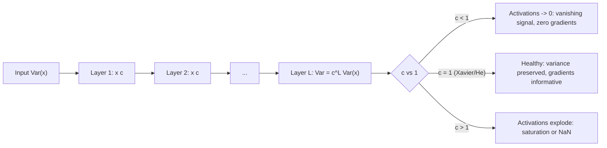
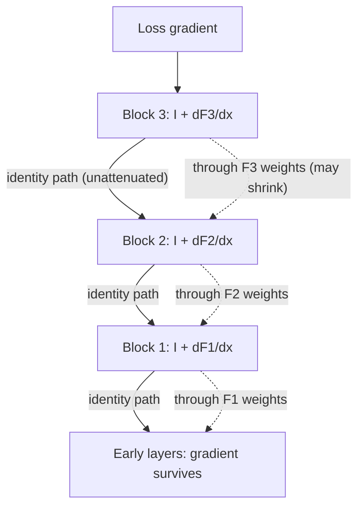

# Training Dynamics

Getting a network to *train* — stably, quickly, to a good optimum — is a discipline of its own, and it is where most real-world deep learning time goes. The components in this guide (initialization, activations, normalization, regularization, schedules, clipping, residuals) all exist for one underlying reason: **keeping signal variance and gradient magnitude in a healthy range as they flow through depth and through time**. Understand that single thread and the whole zoo of tricks becomes a coherent toolkit instead of folklore.

This guide derives why variance preservation matters and sketches the Xavier/He derivations, demonstrates bad initialization collapsing a network in runnable code, works through the saturation math of sigmoid/tanh and the dying-ReLU failure, treats BatchNorm and LayerNorm at production depth (train/eval behavior, running stats, the small-batch failure), untangles weight decay vs L2 in Adam (why AdamW exists), gives an LR-schedule tuning playbook, and closes with a gallery of eight loss-curve pathologies you should be able to read like an ECG.

Part of the [Senior AI Engineer Roadmap](../00-Senior-AI-Engineer-Roadmap.md) — Phase 3.

---

## 1. Initialization: Why Variance Preservation Matters

### 1.1 The Core Problem

A forward pass through `L` layers multiplies the input signal by `L` weight matrices; the backward pass multiplies the loss gradient by (roughly) the same matrices transposed. If each layer scales its input's variance by a factor `c`:

```text
Var(activations at layer L) ≈ c^L · Var(input)
```

- `c < 1` → activations shrink exponentially → by layer 20 everything is ~0 → gradients are ~0 → nothing learns.
- `c > 1` → activations grow exponentially → saturating activations pin at their rails, or floats overflow → NaN.

Initialization's job is to set `c ≈ 1` **at step 0**, so that the first gradient steps are informative. Normalization layers keep `c ≈ 1` *during* training; init gets you off the launchpad.

### 1.2 Xavier/Glorot Derivation (Sketch)

Consider one linear unit `z = Σᵢ wᵢ xᵢ` with `fan_in = n` inputs. Assume the `wᵢ` and `xᵢ` are independent, zero-mean. Variance of a sum of independent products:

```text
Var(z) = Σᵢ Var(wᵢ xᵢ)                    n terms
       = Σᵢ Var(wᵢ) · Var(xᵢ)             zero-mean independence: Var(wx) = Var(w)Var(x)
       = n · Var(w) · Var(x)
```

To preserve variance forward (`Var(z) = Var(x)`) we need:

```text
n · Var(w) = 1   ⟹   Var(w) = 1 / fan_in
```

The backward pass runs the same argument through `Wᵀ`, giving `Var(w) = 1 / fan_out`. Glorot's compromise averages the two:

```text
Var(w) = 2 / (fan_in + fan_out)          # Xavier/Glorot init
```

This derivation assumed a roughly **linear** (or tanh-near-zero) activation — tanh has slope 1 at the origin, so for tanh networks Xavier is the right answer.

### 1.3 He/Kaiming Derivation (Sketch)

ReLU breaks the assumption: it zeroes half of a zero-mean input, so for `a = max(0, z)` with symmetric `z`:

```text
E[a²] = ½ E[z²]        (half the mass is zeroed, the other half passes through)
⟹ Var through a ReLU layer picks up an extra factor of ½
```

To cancel it, double the weight variance:

```text
Var(w) = 2 / fan_in                      # He/Kaiming init — the ReLU default
```

Rules of thumb: **He for ReLU-family**, **Xavier for tanh/sigmoid**, and for the final layer of a residual block, initialize *small or zero* so blocks start near identity (used by GPT-style models: scale residual-branch init by `1/sqrt(2·n_layers)`).

### 1.4 Demo: Bad Init Collapsing a Deep Network

```python
import torch
import torch.nn as nn

torch.manual_seed(0)

def probe_activations(std: float, depth: int = 30, width: int = 256):
    """Push a batch through `depth` Linear+ReLU layers, report activation std per layer."""
    x = torch.randn(512, width)
    stats = []
    for _ in range(depth):
        W = torch.randn(width, width) * std
        x = torch.relu(x @ W)
        stats.append(x.std().item())
    return stats

for std, name in [(0.01, "too small"),
                  ((2 / 256) ** 0.5, "He (correct)"),
                  (0.30, "too large")]:
    s = probe_activations(std)
    print(f"{name:12s} layer1 std={s[0]:.3e}  layer10 std={s[9]:.3e}  layer30 std={s[29]:.3e}")

# Expected output (values approximate):
# too small    layer1 std=6.1e-02  layer10 std=1.6e-12  layer30 std=0.0e+00   <- signal dead
# He (correct) layer1 std=1.0e+00  layer10 std=9.7e-01  layer30 std=1.1e+00   <- variance preserved
# too large    layer1 std=3.5e+00  layer10 std=3.1e+05  layer30 std=inf       <- signal exploded
```

Three lines of arithmetic predicted all three rows: each Linear+ReLU layer multiplies the std by `std_w · sqrt(fan_in / 2)`. With `std_w = 0.01` that factor is `0.01·sqrt(128) ≈ 0.11` — a 9x shrink *per layer*, hence `0.11^30 ≈ 10⁻²⁹ ≈ 0`. He init makes the factor exactly 1.



---

## 2. Activation Functions: A Comparative Autopsy

### 2.1 Sigmoid and Tanh: The Saturation Math

```text
σ(z) = 1 / (1 + e⁻ᶻ)          σ'(z) = σ(z)(1 − σ(z))     max σ' = 0.25 at z = 0
tanh(z)                        tanh'(z) = 1 − tanh²(z)    max tanh' = 1 at z = 0
```

Two problems, both fatal at depth:

1. **Saturation.** For `|z| > 4`, `σ'(z) < 0.018`. Any neuron whose pre-activation drifts into the tails passes back nearly zero gradient — it stops learning, and everything upstream of it through that path stops too.
2. **Chained shrinkage.** Even at the *best* operating point, sigmoid multiplies the backward signal by ≤ 0.25 per layer: a 10-layer sigmoid net attenuates gradients by up to `0.25¹⁰ ≈ 10⁻⁶`. Tanh's max slope of 1 makes it strictly better (and it is zero-centered, which keeps the next layer's inputs balanced), but its tails saturate identically.

This is why sigmoid survives only at **output** layers (probabilities) and inside **gates** (LSTM/GRU — where "squash to [0,1]" is the point), never as a deep hidden activation.

### 2.2 ReLU and the Dying-Unit Failure

`ReLU(z) = max(0, z)` has derivative exactly 1 for `z > 0`: no shrinkage on the active path, cheap to compute, sparse activations. Its failure mode: a unit whose pre-activation goes negative **for every input in the dataset** outputs 0 always, gets gradient 0 always, and can never recover — a **dead unit**. Common cause: a too-large LR step knocks the bias strongly negative.

```python
import torch
import torch.nn as nn

torch.manual_seed(0)

def frac_dead(model, X):
    """Fraction of hidden units that are inactive for EVERY input."""
    with torch.no_grad():
        h = torch.relu(model[0](X))
    return (h.sum(dim=0) == 0).float().mean().item()

X = torch.randn(2048, 64)
y = torch.randn(2048, 1)

for lr in [0.01, 1.5]:
    torch.manual_seed(0)
    model = nn.Sequential(nn.Linear(64, 512), nn.ReLU(), nn.Linear(512, 1))
    opt = torch.optim.SGD(model.parameters(), lr=lr)
    for _ in range(200):
        opt.zero_grad()
        nn.functional.mse_loss(model(X), y).backward()
        opt.step()
    print(f"lr={lr:<5} dead units: {frac_dead(model, X):.1%}")

# Expected output (approximate):
# lr=0.01  dead units: 0.8%     <- healthy
# lr=1.5   dead units: 61.4%    <- huge LR spike killed most of the layer permanently
```

Mitigations: lower the LR (or warm up), **LeakyReLU** (`max(0.01z, z)` — small negative slope keeps a recovery gradient), or a smooth activation.

### 2.3 GELU and SiLU: The Modern Defaults

```text
GELU(z) = z · Φ(z)          Φ = standard normal CDF   (transformer default: BERT, GPT, ViT)
SiLU(z) = z · σ(z)          a.k.a. Swish              (EfficientNet, many modern CNNs, LLaMA-style MLPs use SwiGLU)
```

Both are smooth, non-monotonic near zero (they dip slightly negative), and pass gradient everywhere — no dead units. They act like a ReLU whose gate is *probabilistic* in the input's magnitude rather than a hard threshold. Cost: an extra transcendental per element — negligible on modern accelerators. Practical guidance: **ReLU is never wrong** for MLPs/CNNs; **GELU** whenever you are in transformer-land or matching a pretrained checkpoint; never sigmoid/tanh as deep hidden activations.

---

## 3. Batch Normalization, Deeply

### 3.1 The Mechanism

For each channel, over a batch of size `N` (and spatial positions for conv):

```text
μ_B = mean(x)                              # per channel, across the batch
σ²_B = var(x)
x̂ = (x − μ_B) / sqrt(σ²_B + ε)             # normalize to zero mean, unit var
y = γ · x̂ + β                              # learned affine restores expressiveness
```

`γ, β` matter: without them, normalization would force every layer's output distribution to N(0,1), destroying representational freedom. With them, the network can undo the normalization if it wants — BN constrains the *optimization path*, not the function class.

**Why it helps** (the honest, modern answer): the original "internal covariate shift" story is largely discredited. The best-supported explanation is that BN **smooths the loss landscape** (reduces the Lipschitz constant of the loss and gradients), permitting much larger learning rates without divergence, and it adds a mild regularizing noise because each example's normalization depends on its batch-mates. Empirically: nets with BN train several times faster and tolerate 10x larger LRs.

### 3.2 Train vs Eval: Running Stats

At train time BN uses **batch statistics**. At eval time using batch stats would make predictions depend on whatever else is in the batch (and break batch-size-1 inference), so BN maintains **running estimates** updated by exponential moving average during training:

```text
running_mean ← (1 − m) · running_mean + m · μ_B        # m = momentum, default 0.1
running_var  ← (1 − m) · running_var  + m · σ²_B
```

`model.eval()` switches BN to running stats. This dual behavior is one of the top sources of production bugs:

```python
import torch, torch.nn as nn

torch.manual_seed(0)
bn = nn.BatchNorm1d(8)
x = torch.randn(32, 8) * 5 + 3          # data with mean 3, std 5

bn.train()
out_train = bn(x)                        # uses batch stats; also updates running stats
bn.eval()
out_eval = bn(x)                         # uses running stats (still near init: mean 0, var 1)

print("train-mode output mean:", out_train.mean().item())   # ~0.0  (normalized by batch stats)
print("eval-mode  output mean:", out_eval.mean().item())    # ~2.7  (running stats barely warmed up!)
# After ONE batch the running stats are still ~90% at their init values (0, 1),
# so eval-mode output is nearly the raw input. Train/eval outputs disagree wildly
# until running stats converge over many batches.
```

### 3.3 Batch-Size Sensitivity and the Small-Batch Failure

Batch statistics are *estimates* of the true activation statistics; their noise scales like `1/sqrt(N)`. Consequences:

- **N ≥ 32**: noise is mild, acts as regularization. BN at its best.
- **N = 8–16**: noticeable accuracy loss on hard tasks (well documented for detection/segmentation, where high-res inputs force tiny batches).
- **N ≤ 4**: batch stats are so noisy that train-time normalization is nearly random, while eval uses smooth running stats — a large train/eval mismatch. Accuracy craters. **N = 1 train-mode is degenerate** (variance of one sample per channel... with spatial dims it limps; without them it's zero).

Fixes for the small-batch regime: **GroupNorm** (normalize over channel groups within each example — batch-independent, ~matches BN at N≥32 and vastly better at N≤8), **SyncBatchNorm** (compute stats across all GPUs in DDP — bigger effective N at a communication cost), or LayerNorm.

Also note: in DDP, vanilla BN computes stats **per GPU** — 8 GPUs x batch 4 is BN batch 4, not 32. `torch.nn.SyncBatchNorm.convert_sync_batchnorm(model)` is the one-liner fix.

### 3.4 LayerNorm and Why Transformers Need It

LayerNorm normalizes **across the feature dimension of a single example**:

```text
For each example (or each token): μ, σ² over its own D features
y = γ ⊙ (x − μ) / sqrt(σ² + ε) + β
```

Properties that make it the sequence-model default:

- **No batch coupling** — works at batch size 1, with variable-length sequences, and identically across DDP ranks.
- **No running stats** — train and eval behavior are *identical*. A whole class of bugs disappears.
- **Per-token applicability** — in a transformer, LN normalizes each token's `d_model` vector independently, which is well-defined regardless of sequence length or padding. BN across a batch of ragged, padded sequences would mix real tokens with padding and couple unrelated sentences — statistically incoherent.
- Autoregressive **inference is batch-size-1, token-by-token** — BN's train/eval mismatch would be maximal exactly where LLMs live.

Rule of thumb: **BN for conv nets with healthy batches; LN for transformers, RNNs, and anything with small or variable batches.** (Modern LLMs go further: RMSNorm drops the mean-centering and β, keeping only the scale — cheaper, works just as well.)

---

## 4. Dropout

Train time: zero each activation independently with probability `p`, and scale survivors by `1/(1−p)` ("inverted dropout"). Eval time: identity — no zeroing, no scaling.

The scaling is the part people flub in interviews. Without it, the *expected* activation magnitude at train time would be `(1−p)` times the eval-time magnitude, so the downstream layers would see a distribution shift when you switch modes. Inverted dropout fixes the expectation at train time:

```text
E[drop(x)] = (1−p) · x/(1−p) + p · 0 = x        # expectation matches eval-time identity
```

```python
import torch
drop = torch.nn.Dropout(p=0.5)
x = torch.ones(10000)
drop.train();  print(drop(x).mean().item())   # ~1.0  (half zeros, half 2.0 — scaled by 1/(1-p))
drop.eval();   print(drop(x).mean().item())   # 1.0 exactly (identity)
```

Where it earns its keep: large fully-connected layers and transformer attention/FFN blocks (p = 0.1 typical). Where it doesn't: convolutional feature maps at modern scale (BN's noise already regularizes; conv weight sharing overfits less), and it interacts awkwardly placed *before* BN (dropout shifts the variance BN then estimates). `model.eval()` forgetting is the classic bug — jittery, worse-than-expected inference.

---

## 5. Weight Decay vs L2 — Why AdamW Exists

For **SGD**, adding an L2 penalty `λ/2 ||w||²` to the loss and *decaying weights* directly are identical:

```text
L2 gradient:      g ← g + λw;   w ← w − lr·g        ≡     w ← w(1 − lr·λ) − lr·g_data
```

For **Adam** they are *not* the same, and the difference matters. Adam divides each parameter's gradient by `sqrt(v̂)` — its running RMS gradient:

```text
Adam-with-L2:  w ← w − lr · (ĝ_data + λw) / (sqrt(v̂) + ε)
```

The decay term `λw` gets divided by `sqrt(v̂)` too. So parameters with **large historical gradients get less regularization** and rarely-updated parameters get more — the effective decay is coupled to gradient magnitudes, which is not what you asked for and empirically regularizes poorly.

**AdamW decouples** the decay from the adaptive machinery:

```text
AdamW:  w ← w − lr · ĝ_data / (sqrt(v̂) + ε) − lr · λ · w      # decay applied raw, outside the division
```

Every parameter decays at the same relative rate regardless of its gradient history. This is the Loshchilov & Hutter (2019) fix, and it is why `torch.optim.AdamW` is the modern default (`weight_decay=0.01`–`0.1` for transformers). Convention: **exempt biases and all norm-layer γ/β from decay** (they don't cause overfitting; decaying γ fights the normalization):

```python
decay, no_decay = [], []
for name, p in model.named_parameters():
    if not p.requires_grad:
        continue
    (no_decay if p.ndim <= 1 or name.endswith(".bias") else decay).append(p)
opt = torch.optim.AdamW([
    {"params": decay, "weight_decay": 0.05},
    {"params": no_decay, "weight_decay": 0.0},
], lr=3e-4)
```

---

## 6. Learning-Rate Schedules and the Tuning Playbook

### 6.1 The Shapes

- **Warmup**: linearly ramp 0 → peak LR over the first few hundred/thousand steps. Essential with Adam: its `v̂` second-moment estimate is garbage for the first steps (built from a handful of samples), so early adaptive steps are wildly mis-scaled; warmup keeps them small until the statistics stabilize. Also protects freshly-initialized heads from tearing up pretrained backbones.
- **Cosine decay**: `lr_t = lr_min + ½(lr_max − lr_min)(1 + cos(π t/T))` — smooth decay to near zero, no step-cliff hyperparameters. The transformer-era default, paired with warmup.
- **One-cycle**: LR ramps up to a peak then anneals below the starting point (momentum inverse-cycled). Aggressive and fast-converging on small/medium jobs; the peak-LR excursion acts as regularization.
- **ReduceLROnPlateau**: cut LR x0.1 when val loss stalls. Reactive and schedule-free; fine for classic CV fine-tuning, awkward for exact-budget runs.

```python
import torch
opt = torch.optim.AdamW(model.parameters(), lr=3e-4)
steps_total, steps_warmup = 10_000, 500
sched = torch.optim.lr_scheduler.SequentialLR(
    opt,
    schedulers=[
        torch.optim.lr_scheduler.LinearLR(opt, start_factor=1e-3, total_iters=steps_warmup),
        torch.optim.lr_scheduler.CosineAnnealingLR(opt, T_max=steps_total - steps_warmup),
    ],
    milestones=[steps_warmup],
)
# call sched.step() once PER OPTIMIZER STEP (not per epoch) for step-based schedules
```

### 6.2 The Tuning Playbook

1. **Find the LR order of magnitude first** — nothing else matters until this is right. Sweep `{1e-5, 1e-4, 1e-3, 1e-2}` for ~200 steps each; pick the largest LR that still descends smoothly, then optionally refine x3 either side. (An LR-range test — ramp LR exponentially over one epoch, plot loss vs LR, pick just below the divergence elbow — automates this.)
2. **Add warmup** (1–5% of total steps) if using Adam, transformers, or large batches. Symptom that you need it: loss spikes or NaNs in the first few hundred steps at an LR that is otherwise fine.
3. **Cosine to ~0** for fixed-budget runs; the final low-LR phase is where the last accuracy points come from — don't chop it off.
4. **Batch size changed? Rescale LR.** Linear scaling is the first-order rule (2x batch → 2x LR) with warmup absorbing the early instability; for Adam sqrt-scaling is often closer.
5. **Fine-tuning pretrained weights**: peak LR 10–100x lower than from-scratch (e.g. 1e-5–5e-5 for transformer fine-tunes), short warmup, cosine or constant.
6. Only after LR/schedule are settled, tune weight decay, then dropout/augmentation, then architecture.

### 6.3 Gradient Clipping

`torch.nn.utils.clip_grad_norm_(model.parameters(), max_norm=1.0)` computes the **global** norm over all gradients and, if it exceeds `max_norm`, rescales every gradient by `max_norm / total_norm` — direction preserved, magnitude capped. It is insurance against rare bad batches / loss spikes (an outlier sequence, a fp16 wobble) producing a step that catapults the weights out of the good basin. Near-mandatory for RNNs and standard for transformer training. Two operational notes: clip **after** `scaler.unscale_(opt)` under AMP (otherwise you clip scaled gradients — effectively no clip), and **log the pre-clip norm**: a norm that trends upward toward your threshold is an early-warning signal that instability is building.

---

## 7. Vanishing/Exploding Gradients, Demonstrated

The backward pass through `L` layers multiplies `L` Jacobians. Per-layer norm `< 1` → exponentially vanishing; `> 1` → exploding. Watch it happen:

```python
import torch, torch.nn as nn

def grad_profile(act, depth=20, width=128, gain=1.0):
    torch.manual_seed(0)
    layers = []
    for _ in range(depth):
        lin = nn.Linear(width, width)
        nn.init.xavier_normal_(lin.weight, gain=gain)
        layers += [lin, act()]
    model = nn.Sequential(*layers, nn.Linear(width, 1))
    x = torch.randn(64, width)
    model(x).mean().backward()
    norms = [model[i].weight.grad.norm().item() for i in range(0, 2 * depth, 2)]
    return norms[0], norms[depth // 2 * 2 // 2], norms[-1]   # first, middle, last layer

for act, gain, name in [(nn.Sigmoid, 1.0, "sigmoid"),
                        (nn.ReLU, (2**0.5), "relu+He"),
                        (nn.ReLU, 3.0, "relu, gain 3x")]:
    first, mid, last = grad_profile(act, gain=gain)
    print(f"{name:14s} grad norm  layer1={first:.2e}  layer10={mid:.2e}  layer20={last:.2e}")

# Expected output (approximate):
# sigmoid        grad norm  layer1=2.1e-09  layer10=4.7e-06  layer20=1.3e-02   <- vanishing toward input
# relu+He        grad norm  layer1=3.9e-02  layer10=4.1e-02  layer20=3.6e-02   <- flat = healthy
# relu, gain 3x  grad norm  layer1=8.2e+05  layer10=5.5e+02  layer20=1.9e-01   <- exploding toward input
```

The **diagnostic habit**: log `p.grad.norm()` per layer (or per block) during training. A healthy network shows norms within ~1–2 orders of magnitude across depth; a strong monotone trend from output to input is the fingerprint of vanishing (decreasing) or exploding (increasing) gradients.

### 7.1 Residual Connections as Gradient Highways

A residual block computes `y = x + F(x)`. Differentiate:

```text
∂y/∂x = I + ∂F/∂x
```

Chain through `L` blocks:

```text
∂y_L/∂x_0 = Π_{l=1..L} (I + ∂F_l/∂x)
          = I + Σ_l ∂F_l/∂x + (cross terms...)
```

The expansion always contains a pure **identity term**: a gradient path from the loss to *any* layer that passes through no weight matrices at all. Even if every `∂F/∂x` is tiny, the gradient reaching early layers is ≈ `I` — it cannot vanish. Contrast the plain stack, `Π_l ∂F_l/∂x`, a pure product that shrinks exponentially. Bonus: "do nothing" (`F → 0`) is trivially learnable, so adding depth can never make the representable optimum worse — which dissolves the degradation problem that motivated ResNet (see guide 04). Every transformer block uses the same trick around attention and FFN sublayers.



---

## 8. Loss-Curve Pathology Gallery

Eight shapes you must be able to interpret on sight. ("Train" = training loss per step, "val" = validation loss per epoch.)

| # | Shape | Diagnosis | First move |
| --- | --- | --- | --- |
| 1 | Flat from step 0, never moves | LR far too low; frozen/detached params; loss disconnected from labels (e.g. labels all one class, wrong tensor passed) | Overfit-one-batch test; sweep LR x10; print per-layer grad norms (all-zero → wiring bug) |
| 2 | Immediate explosion → NaN in < 100 steps | LR far too high; missing warmup; bad init; unscaled inputs (raw pixel 0–255 into an unnormalized net) | Drop LR x10, add warmup, verify input normalization |
| 3 | Decreases, then a sudden spike, then recovers (or dies) | A rare pathological batch (outlier, corrupt sample) or LR-schedule discontinuity; fp16 overflow | Gradient clipping; find and inspect the offending batch (log batch indices); check schedule at that step |
| 4 | Smooth but sawtooth that repeats **every epoch** | Data not shuffled — the model sees the same easy→hard ordering each epoch; or per-epoch LR restart | `shuffle=True` in the train DataLoader; check the scheduler |
| 5 | Train ↓ steadily, val ↓ then ↑ | Textbook overfitting | Early stop at the val minimum; then add augmentation/weight decay/dropout or get more data |
| 6 | Train ↓, val **lower than train** persistently | Not a miracle: dropout/augmentation active only at train time (train loss is measured on a harder task), or leakage into val | Check the gap magnitude; recompute train loss in eval mode; audit the split for leakage |
| 7 | Loss plateaus early at a suspiciously specific value | Model predicting a constant (e.g. multi-class CE stuck at `ln(C)` = predicting uniform; BCE at `0.693`) | That value *is* the diagnosis: the model found the trivial optimum — LR, init, or dead-input bug (features carry no signal or are zeroed by a transform bug) |
| 8 | Val loss noisy/jumping wildly while train is smooth | Val set too small; BN running stats not converged; non-determinism in the val pipeline (augmentation left on in val!) | Grow/fix the val set; disable augmentation in val transforms; verify `model.eval()` |

Shape 7 deserves the arithmetic: for 10-class classification, `−ln(1/10) ≈ 2.303`. A loss glued to 2.30 means the model is outputting uniform probabilities — it has learned *nothing*, and that exact number tells you so. Memorize `ln(C)` for your task.

---

## Production War Stories & Failure Modes

### War Story 1: The Model That Aced Training and Failed Every Demo

**Symptom:** An internal tabular-classification service trained to 94% val accuracy. In the live demo, single-request predictions were near-random.
**Investigation:** Batch predictions (the offline eval path) were fine; single-item requests were wrong. The serving code was traced: `model.eval()` was called... but a code path that re-loaded the checkpoint on config refresh constructed the model fresh and forgot it. The model was in train mode in production.
**Root cause:** With `BatchNorm1d` in train mode at batch size 1, the layer normalizes each feature by *its own single value* — output is dominated by β, wiping out the input signal. Dropout was also live, adding noise.
**Fix:** `model.eval()` immediately after every checkpoint load, plus a unit test asserting `not model.training` on the serving object and asserting that two identical requests return identical outputs.
**Prevention:** Treat train/eval mode as part of the serving contract. Determinism test (same input → same output) in CI catches both dropout-on and BN-in-train-mode instantly.

### War Story 2: The Fine-Tune That Destroyed the Backbone

**Symptom:** Fine-tuning a pretrained ResNet on a small defect dataset: loss dropped for 50 steps, then val accuracy fell *below* the frozen-backbone baseline and never recovered.
**Investigation:** Per-layer gradient norms in the first 20 steps were enormous in the backbone. The freshly-initialized head had random weights, so early gradients were huge — and at LR 1e-3 with no warmup they propagated straight into the pretrained features, scrambling them before the head learned anything.
**Root cause:** No warmup + uniform LR across randomly-initialized head and pretrained backbone.
**Fix:** Discriminative LRs (head 1e-3, backbone 1e-5), 500-step warmup; optionally train the head for one epoch with the backbone frozen first.
**Prevention:** Any time new random parameters sit on top of pretrained ones, either freeze-then-unfreeze or warm up with the backbone LR 10–100x lower.

### War Story 3: SyncBN and the 8-GPU Accuracy Regression

**Symptom:** A segmentation model that hit target IoU on a single GPU (batch 16) regressed by 4 points when moved to 8 GPUs with per-GPU batch 2 "for higher resolution".
**Investigation:** Total batch was still 16, so the team expected parity. But BN computes statistics **per process**: each GPU's BN saw batch 2 — deep in the noisy-statistics regime — while eval used smooth running stats, maximizing train/eval mismatch.
**Root cause:** BN batch size is per-GPU, not global.
**Fix:** `SyncBatchNorm.convert_sync_batchnorm(model)` restored effective batch 16 for statistics (at ~5% step-time cost). GroupNorm was benchmarked as the comm-free alternative and matched within 0.3 points.
**Prevention:** Whenever per-GPU batch < 16 with BN in the model, reach for SyncBN or GroupNorm by default; add per-GPU batch size to the training-config review checklist.

### War Story 4: The Regularizer That Wasn't

**Symptom:** A transformer overfit badly despite `weight_decay=0.1`. Raising it to 0.3 changed almost nothing.
**Investigation:** The config used `torch.optim.Adam(..., weight_decay=0.1)` — L2-style decay *inside* the adaptive update. Parameters with large gradient history (exactly the ones doing the overfitting) were being divided by large `sqrt(v̂)`, shrinking their effective decay toward zero.
**Root cause:** Adam+L2 couples decay strength inversely to gradient magnitude; the intended regularization never reached the hot parameters.
**Fix:** Switch to `AdamW` with the same `weight_decay=0.1` and exempt biases/norm params. Val gap closed measurably with no other change.
**Prevention:** Grep configs for `optim.Adam(` with nonzero weight decay — it is almost always a bug; standardize on AdamW.

---

## Best Practices

- Initialize deliberately: He for ReLU-family, Xavier for tanh; near-zero for residual-branch outputs. Verify by probing activation std through depth before the first real run.
- Default activations: ReLU for CNNs/MLPs, GELU in transformer-land. Never sigmoid/tanh as deep hidden activations; watch dead-unit fractions if LR is aggressive.
- BatchNorm only with per-device batch ≥ ~16; below that, GroupNorm/SyncBN/LayerNorm. LayerNorm for anything sequence-shaped.
- Treat `model.train()`/`model.eval()` as part of the serving contract; test that identical inputs give identical outputs in serving.
- Use AdamW, never Adam+weight_decay; exempt biases and norm parameters from decay.
- Tune LR first and alone: sweep powers of 10, add 1–5% warmup, cosine to near zero. Rescale LR when batch size changes.
- Clip global grad norm (1.0 is a fine default) and **log the pre-clip norm** as an instability early-warning metric; under AMP, unscale before clipping.
- Log per-layer gradient norms during bring-up; a monotone trend across depth is vanishing/exploding gradients announcing themselves.
- Memorize the trivial-optimum loss values (`ln(C)` for CE, 0.693 for balanced BCE) — a plateau at that number is a diagnosis, not a mystery.

---

## Interview Drills

<details><summary>Derive Xavier initialization. What assumption does ReLU break, and how does He init fix it?</summary>
For z = Σ wᵢxᵢ with n = fan_in independent zero-mean terms, Var(z) = n·Var(w)·Var(x). Preserving variance forward requires Var(w) = 1/fan_in; the symmetric backward argument gives 1/fan_out; Glorot averages: Var(w) = 2/(fan_in+fan_out). The derivation assumes the activation is roughly identity around zero (true for tanh, slope 1). ReLU zeroes half of a symmetric input, so E[a²] = ½E[z²] — each layer halves the variance. He init doubles the weight variance to compensate: Var(w) = 2/fan_in.
Follow-up: *Why do GPT-style models additionally scale residual-branch init by 1/sqrt(2·n_layers)?* Because residual streams **add** L branch outputs; if each branch contributes unit variance the stream's variance grows linearly with depth. Scaling each branch by 1/sqrt(2L) keeps the summed variance O(1) at init.
</details>

<details><summary>Why is the maximum derivative of the sigmoid a problem for deep networks? Give the number.</summary>
σ'(z) = σ(1−σ) has maximum 0.25 at z = 0. Backprop multiplies one such factor per sigmoid layer, so even at the best operating point a depth-L sigmoid net attenuates gradients by ≤ 0.25^L — for L = 10 that is ~10⁻⁶; early layers effectively stop learning. In the saturated tails (|z| > 4) the factor is < 0.02 and it's worse. tanh improves the peak to 1 and is zero-centered, but its tails saturate identically.
Follow-up: *So why does sigmoid survive inside LSTMs?* Gates *want* outputs pinned to [0,1] ("fraction to keep"), the gate path is not the main gradient highway (the additive cell state is), and saturation at 0/1 is a feature — a fully-open or fully-closed gate is a meaningful, stable decision.
</details>

<details><summary>What is a dead ReLU unit, what causes it, and how would you detect and prevent it?</summary>
A unit whose pre-activation is negative for every input in the data distribution: it outputs 0 always, its gradient is 0 always, so no update can revive it. Typical cause: a large LR step (often early, pre-warmup) drives the bias strongly negative. Detect: forward the training set, compute the fraction of hidden units with zero activation across all inputs; a healthy layer is a few percent, tens of percent means trouble. Prevent: lower/warm up the LR, LeakyReLU (small negative slope keeps a recovery path), or GELU/SiLU which pass gradient everywhere.
Follow-up: *Is sparsity from ReLU zeros ever a good thing?* Yes — per-input sparsity (different units off for different inputs) is fine and even useful; the pathology is specifically units off for **all** inputs.
</details>

<details><summary>Explain exactly what BatchNorm does differently in train and eval modes, and name two bugs this causes.</summary>
Train: normalize with the current batch's mean/variance, and update running EMA estimates. Eval: normalize with the stored running estimates — batch-independent, deterministic. Bug 1: serving with the model left in train mode — batch-size-1 statistics are degenerate (each feature normalized by itself), predictions destroyed; and outputs depend on batch composition. Bug 2: evaluating before running stats have converged (early in training, or after loading a checkpoint whose buffers were not saved/loaded) — eval outputs computed with stale/init statistics, so val metrics look catastrophically wrong while training looks healthy.
Follow-up: *You fine-tune with tiny batches but the checkpoint's BN stats come from large-batch pretraining. What do you do?* Freeze the BN layers (eval mode + frozen affine params) so you keep the good pretrained statistics instead of overwriting them with noisy small-batch estimates — the standard trick in detection fine-tuning.
</details>

<details><summary>Why does BatchNorm degrade at small batch sizes, and what are the alternatives?</summary>
Batch statistics are estimates with noise ~1/sqrt(N). At N ≤ 8 the train-time normalization is dominated by estimation noise while eval uses smooth running stats — a systematic train/eval mismatch that costs accuracy; at N = 1 the statistics are degenerate. Alternatives: GroupNorm (per-example statistics over channel groups — batch-independent, the standard fix for detection/segmentation), SyncBatchNorm (pool statistics across DDP ranks, restoring effective N at a communication cost), LayerNorm (per-example over all features — the sequence-model default).
Follow-up: *In DDP with 8 GPUs and per-GPU batch 4, what batch does BN see?* 4. Statistics are per-process unless you convert to SyncBN — a top cause of "same total batch, worse accuracy" regressions when scaling out.
</details>

<details><summary>Why do transformers use LayerNorm rather than BatchNorm?</summary>
Four reasons. (1) Sequences are variable-length and padded; batch statistics would mix real tokens with padding and couple unrelated sequences. (2) Autoregressive inference runs at batch size 1 token-by-token — BN's train/eval mismatch would be maximal exactly there. (3) LN has no running stats, so train and eval are identical — one fewer failure mode at LLM scale. (4) LN is well-defined per token (normalize the d_model vector), independent of batch and sequence dims, which also makes it clean under model/sequence parallelism. Modern LLMs simplify further to RMSNorm (scale-only, no mean-centering), which trains equivalently and is cheaper.
Follow-up: *Pre-norm vs post-norm?* Pre-norm (LN inside the residual branch, before attention/FFN) leaves the residual path completely clean — an identity gradient highway — making deep transformers trainable without fragile warmup tuning; post-norm (original) normalizes after the addition, giving slightly better final performance at small depth but notoriously unstable training at large depth. Pre-norm is the modern default.
</details>

<details><summary>Why does dropout scale activations by 1/(1−p) at train time?</summary>
So the expected activation matches between train and eval. Dropping with probability p multiplies the expected value by (1−p); scaling survivors by 1/(1−p) restores E[drop(x)] = x, so eval (identity) sees the same expected input magnitude the downstream layers were trained on — no distribution shift when switching modes. The alternative (scale by (1−p) at eval, original formulation) is equivalent but pushes the correction into inference, where you least want extra logic.
Follow-up: *Why is dropout rarely used in modern conv nets?* BN's batch-statistic noise already provides regularization; conv weight sharing overfits less than dense layers; and dropout before BN distorts the variance BN estimates. It survives mainly in classifier heads and transformer blocks (p ≈ 0.1).
</details>

<details><summary>Weight decay and L2 regularization — identical or not? Explain the AdamW distinction precisely.</summary>
Identical under plain SGD: the L2 gradient λw times the LR equals a multiplicative weight decay. Not identical under Adam: with L2, the λw term joins the gradient **before** division by sqrt(v̂), so parameters with large historical gradients get their regularization shrunk — decay strength becomes inversely coupled to gradient magnitude, which regularizes the "hottest" parameters least. AdamW applies decay outside the adaptive update (w ← w − lr·λ·w, separately), giving every parameter the same relative decay. Empirically AdamW generalizes better and its decay hyperparameter is decoupled from the LR-adaptation dynamics.
Follow-up: *Which parameters should be exempt from decay?* Biases and normalization γ/β (any 1-D parameter, by convention): they contribute negligibly to overfitting, and decaying γ toward zero directly fights the normalization layers' job.
</details>

<details><summary>Why does Adam need learning-rate warmup?</summary>
Adam scales steps by 1/sqrt(v̂), the running estimate of squared gradients. In the first tens of steps v̂ is estimated from almost no data (bias correction fixes the *expectation*, not the *variance* of the estimate), so per-parameter step sizes are erratically mis-scaled — some parameters take enormous steps, which at transformer scale means instant loss spikes or permanent damage (e.g. dead ReLUs, scrambled pretrained weights). Warmup keeps the global LR small until the second-moment statistics are trustworthy. Secondary reason: freshly-initialized layers (a new head) emit large gradients at first; warmup protects everything downstream of them.
Follow-up: *Could you fix it without warmup?* Partially — RAdam rectifies the variance of the adaptive term analytically, and small-init/normalization choices reduce the need — but in practice warmup is simpler, robust, and near-universal.
</details>

<details><summary>How does gradient clipping by global norm work, and where must it go in an AMP training step?</summary>
Compute total_norm = sqrt(Σ over all params of ||grad||²); if total_norm > max_norm, multiply every gradient by max_norm/total_norm — the update direction is preserved, only the magnitude is capped. It defends against rare bad batches producing catastrophic steps. Under AMP, gradients are held multiplied by the GradScaler's scale factor, so you must call scaler.unscale_(opt) **before** clip_grad_norm_ — otherwise you compare a scaled norm (often thousands) to max_norm=1.0 and clip everything to numerical dust, or effectively never clip meaningfully. Order: backward → unscale → clip → scaler.step → scaler.update.
Follow-up: *Clip-by-norm vs clip-by-value?* Clip-by-value (clamp each element) changes the gradient direction and is rarely what you want; clip-by-norm preserves direction. Also: log the pre-clip norm — if it trends up toward the threshold, instability is building and you want to know before the spike.
</details>

<details><summary>Show mathematically why residual connections prevent vanishing gradients.</summary>
For y = x + F(x), ∂y/∂x = I + ∂F/∂x. Across L blocks the Jacobian is Π(I + ∂F_l/∂x), which expands to I + Σ ∂F_l/∂x + higher-order cross terms. The leading identity term is a gradient path from the loss to any earlier layer that traverses no weight matrices — it cannot be attenuated, regardless of how small each ∂F/∂x is. A plain stack's Jacobian is the bare product Π ∂F_l/∂x, which shrinks exponentially when per-layer norms are below 1. Residuals also make F → 0 (identity block) trivially learnable, so extra depth can't make the achievable optimum worse — resolving the degradation problem.
Follow-up: *Do residuals help with exploding gradients too?* Not directly — the identity term bounds the Jacobian from below, not above; explosion is handled by normalization, init scaling of the residual branch, and clipping.
</details>

<details><summary>Your 10-class classifier's training loss sits at exactly 2.30 and doesn't move. What happened?</summary>
2.30 ≈ ln(10): the cross-entropy of a uniform prediction over 10 classes. The model has collapsed to the trivial optimum — outputting equal probabilities regardless of input. This is a diagnosis, not a plateau: either gradients aren't flowing (LR ~0, frozen/detached parameters, dead units from bad init), or the inputs carry no usable signal (a transform bug zeroing/shuffling features, all-constant inputs after a broken normalization), or labels are uninformative (shuffled labels — though those usually still let train loss fall while val sits at ln C). First moves: overfit-one-batch test, print a decoded input batch, check per-layer grad norms.
Follow-up: *Val loss is at ln(C) but train loss is decreasing nicely — what does THAT mean?* The model is memorizing training data that has no generalizable signal — classic shuffled-labels or train/val distribution mismatch; also check for a preprocessing difference between the train and val pipelines.
</details>

<details><summary>Training loss shows a repeating sawtooth with period exactly one epoch. Diagnosis?</summary>
The model is seeing examples in the same order every epoch with a systematic difficulty gradient — almost always a missing shuffle=True on the training DataLoader (data stored sorted by class or difficulty), occasionally a per-epoch LR schedule restart or a curriculum artifact. Loss falls through the "easy" region and jumps when the "hard" region (or a class boundary in class-sorted data) arrives, at the same step offset each epoch. Class-sorted data without shuffling is worse than cosmetic: consecutive single-class batches make optimization lurch between class-specific optima. Fix: shuffle the train loader (and confirm the sampler in DDP calls set_epoch, or every epoch uses the same shard ordering).
Follow-up: *Why must DistributedSampler.set_epoch(epoch) be called?* The sampler seeds its permutation with the epoch number; without it every epoch reuses the epoch-0 permutation — you get identical batch order all training, quietly reintroducing this pathology in a shuffled-looking pipeline.
</details>

<details><summary>Validation loss is consistently LOWER than training loss. Is something broken?</summary>
Not necessarily — three benign mechanisms first: (1) regularization asymmetry: dropout and augmentation are active only at train time, so train loss is measured on a harder task; (2) timing: train loss is averaged over an epoch during which the model improved, val is measured at the epoch's end with the better model; (3) small-sample luck on a tiny val set. Verify by recomputing loss on the training set in eval mode with no augmentation — if it drops below val loss, fine. If val remains suspiciously better, then worry: leakage (val examples appearing in train, e.g. near-duplicates or the same entity on both sides of the split), or a val set that is genuinely easier than the training distribution.
Follow-up: *What split-level bug creates leakage even with disjoint rows?* Group leakage — multiple samples from the same patient/user/product split across train and val, or normalization statistics computed on the full dataset before splitting (see guide 06).
</details>

<details><summary>You double the batch size. What do you change about the learning rate and why?</summary>
First-order rule: scale the LR linearly with batch size (2x batch → 2x LR). Rationale: the gradient estimate's variance halves with 2x batch, so a proportionally larger step maintains the same expected update per example seen; equivalently, keeping LR fixed while doubling the batch halves the number of optimizer steps per epoch and slows learning per epoch. Caveats: linear scaling holds up to a problem-dependent ceiling beyond which large-batch training degrades (sharp-minima/noise-floor effects) and needs warmup to survive the larger early steps; for Adam, sqrt scaling often tracks better empirically because the adaptive denominator already absorbs part of the variance change. Always re-validate with a short LR sweep after any batch-size change.
Follow-up: *Why does large-batch training tend to generalize worse without countermeasures?* Less gradient noise means less implicit regularization and a tendency toward sharper minima; countermeasures include LR scaling with warmup, longer training, and explicit regularization — or just not chasing enormous batches unless throughput demands it.
</details>
</details>
