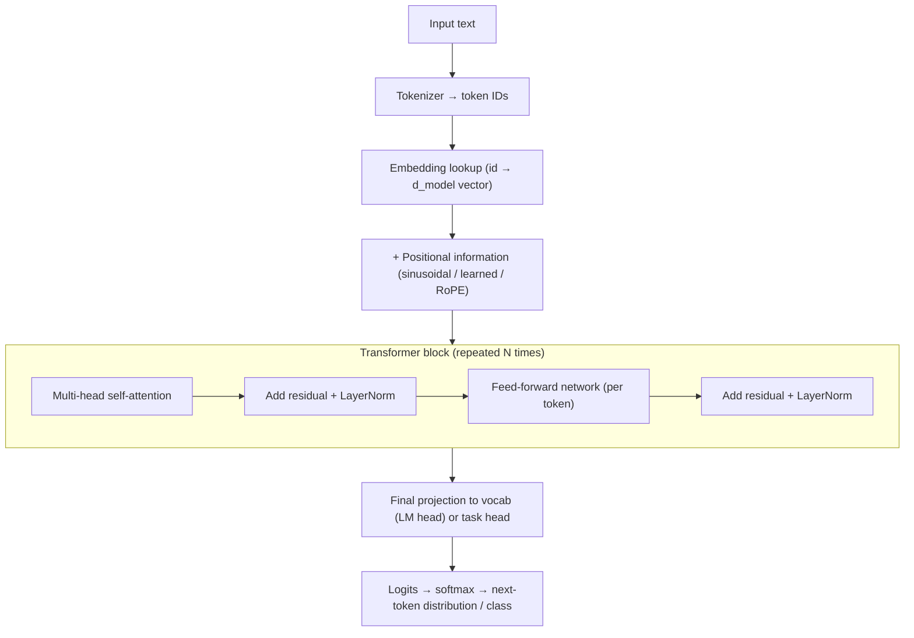
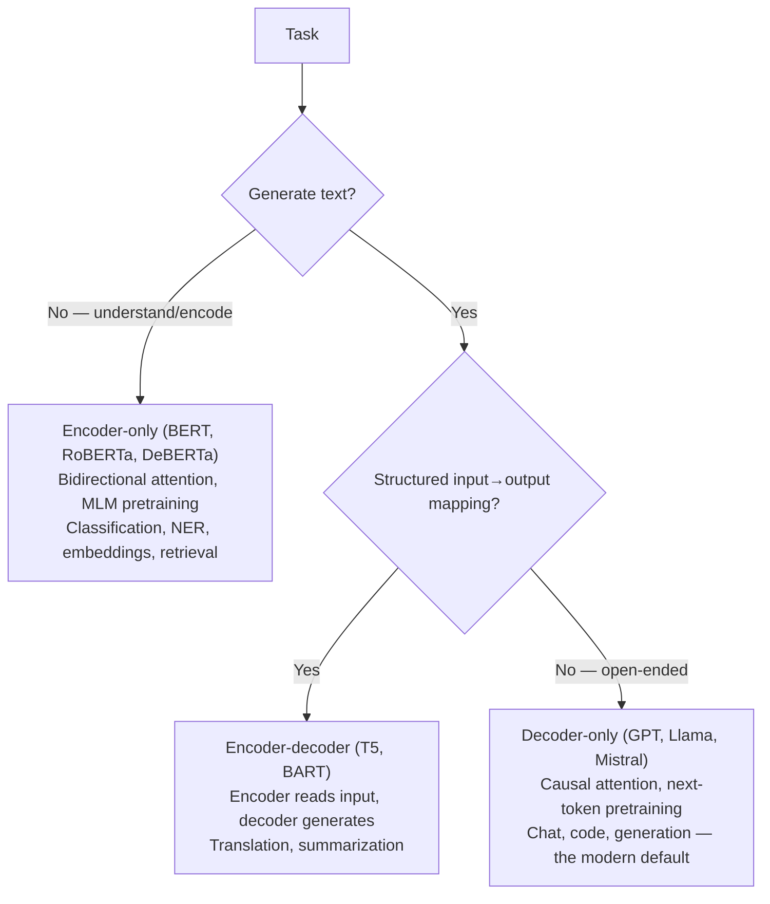

# NLP and Transformers

Everything above the API layer — prompting, RAG, agents — rests on what happens below it. This guide takes you from traditional NLP (still your fastest baselines) through the transformer architecture piece by piece, into the Hugging Face ecosystem where fine-tuning, PEFT/LoRA, and quantization become practical engineering decisions. A senior engineer who cannot explain what attention computes, or why a tokenizer just broke their production pipeline, is operating on faith.

Part of the [Senior AI Engineer Roadmap](./00-Senior-AI-Engineer-Roadmap.md) — Phase 4.

---

## 1. Traditional NLP: Why It Still Matters

### 1.1 The Classical Pipeline

Before transformers, NLP was: tokenize → normalize (lowercase, stem/lemmatize) → vectorize (bag-of-words, TF-IDF, n-grams) → classic ML model. This pipeline is still valuable because it is fast, cheap, interpretable, and often surprisingly hard to beat on narrow classification tasks with abundant labeled data.

- **Bag of words:** document = vector of word counts; loses order, keeps topical signal.
- **TF-IDF:** `tf(t,d) * log(N / df(t))` — upweights terms frequent in a document but rare in the corpus. The default text baseline.
- **N-grams:** contiguous token sequences (bigrams/trigrams) recover a little local word order.
- **Word embeddings (word2vec/GloVe):** dense vectors where similarity ≈ meaning; static — "bank" has one vector regardless of context. Transformers fix exactly this: they produce **contextual** embeddings.
- **Sequence labelling / NER:** per-token classification (person, org, location); classically CRFs, today fine-tuned encoders.

```python
from sklearn.feature_extraction.text import TfidfVectorizer
from sklearn.linear_model import LogisticRegression
from sklearn.pipeline import make_pipeline

pipe = make_pipeline(TfidfVectorizer(ngram_range=(1, 2), min_df=2), LogisticRegression(max_iter=1000))
pipe.fit(train_texts, train_labels)
print(pipe.score(test_texts, test_labels))
```

Senior habit: TF-IDF + logistic regression is the baseline every transformer must beat by enough to justify 100x the inference cost. Frequently the gap is small on simple topical classification — and enormous on anything requiring context, negation, or world knowledge.

### 1.2 Where Classical Methods Break

Static embeddings and counting methods fail on polysemy ("apple" the fruit vs the company), long-range dependencies, and compositional meaning ("not bad" vs "bad"). Those failures motivated attention: let every token's representation be computed *from its context*.

---

## 2. Tokenization: The Layer That Causes Real Bugs

### 2.1 Subword Algorithms

Word-level vocabularies explode and can't handle unseen words; character-level sequences are too long. Subword tokenization is the compromise: frequent words stay whole, rare words split into pieces.

| Algorithm | Used by | Idea |
| --- | --- | --- |
| BPE (byte-pair encoding) | GPT family, Llama | Start from bytes/chars; repeatedly merge the most frequent adjacent pair until vocab size reached |
| WordPiece | BERT | Like BPE but merges the pair that maximizes training-data likelihood; continuation pieces marked `##` |
| SentencePiece (unigram/BPE) | T5, Llama, Gemma | Treats text as raw stream (spaces become `▁`), language-agnostic, no pre-tokenization step |

Byte-level BPE guarantees no out-of-vocabulary tokens ever — any UTF-8 string is representable.

### 2.2 Why Tokenization Breaks Production Systems

- **Token counts ≠ word counts.** English averages ~1.3 tokens/word; code, non-Latin scripts, and rare terms can be far worse. Cost estimates and context-window budgets based on words will be wrong.
- **Whitespace sensitivity.** `"hello"` and `" hello"` are different tokens in BPE. Prompt templates that drop or add a leading space change model behavior.
- **Numbers and IDs fragment.** `"2026-07-24"` may split into 5+ tokens; arithmetic and exact-string tasks suffer.
- **Tokenizer/model mismatch.** Loading a checkpoint with the wrong tokenizer produces garbage silently — token IDs map to different embeddings. Always load both from the same repo.
- **Truncation bugs.** Exceeding `max_length` silently truncates by default in many pipelines — your classifier may be reading only the first half of documents.
- **Special tokens.** Forgetting `[CLS]`/`[SEP]`/BOS/EOS or the model's chat template degrades quality invisibly. Use `tokenizer.apply_chat_template` for chat models, never hand-rolled strings.

```python
from transformers import AutoTokenizer
tok = AutoTokenizer.from_pretrained("bert-base-uncased")
print(tok.tokenize("Tokenization breaks unsuspecting pipelines"))
# ['token', '##ization', 'breaks', 'un', '##sus', '##pect', '##ing', 'pipeline', '##s']
print(tok("hello", "world"))  # includes [CLS]/[SEP] and token_type_ids automatically
```

---

## 3. The Transformer Architecture, Step by Step

### 3.1 The Big Picture



### 3.2 Embeddings and Positional Encoding

Each token ID indexes a learned embedding matrix `(vocab_size, d_model)`. But attention is permutation-invariant — without positional information, "dog bites man" and "man bites dog" are identical. Three approaches:

- **Sinusoidal (original paper):** fixed `sin/cos` waves of varying frequency added to embeddings; no parameters, extrapolates somewhat to longer sequences.
- **Learned absolute positions (BERT, GPT-2):** an embedding per position index; simple, but hard-capped at trained length.
- **RoPE (rotary, Llama/most modern LLMs):** rotates query/key vectors by a position-dependent angle so attention scores depend on **relative** position; scales better to long contexts and enables context-extension tricks (position interpolation, YaRN).

### 3.3 Scaled Dot-Product Attention

The core formula:

```text
Attention(Q, K, V) = softmax(QKᵀ / √d_k) V
```

Each token's embedding is projected into three vectors: a **query** (what am I looking for?), a **key** (what do I contain?), and a **value** (what do I contribute?). Computationally, for each token:

1. **Compare** its query against every token's key via dot product → a similarity score per token (`QKᵀ` gives an `n × n` score matrix).
2. **Scale** by `√d_k`, then **softmax** each row → attention weights that sum to 1: a probability distribution over which tokens to attend to.
3. **Weighted sum** of value vectors using those weights.
4. The output is a **context-aware representation**: the token "bank" near "river" now literally contains a mixture of river-related value vectors.

**Why divide by √d_k?** Dot products of random `d_k`-dimensional vectors have variance proportional to `d_k`. With `d_k = 64`+ the raw scores get large, softmax saturates into near one-hot outputs, and gradients through the flat regions vanish. Dividing by `√d_k` normalizes score variance to ~1, keeping softmax in its sensitive range and training stable.

### 3.4 A Minimal Self-Attention Implementation

```python
import numpy as np

def softmax(x, axis=-1):
    x = x - x.max(axis=axis, keepdims=True)   # numerical stability
    e = np.exp(x)
    return e / e.sum(axis=axis, keepdims=True)

def self_attention(X, Wq, Wk, Wv, causal=False):
    """X: (n_tokens, d_model). Returns context-aware representations."""
    Q, K, V = X @ Wq, X @ Wk, X @ Wv          # project into query/key/value spaces
    d_k = Q.shape[-1]
    scores = Q @ K.T / np.sqrt(d_k)            # (n, n) similarity of every query to every key
    if causal:                                 # decoder: token i may not see tokens > i
        mask = np.triu(np.ones_like(scores, dtype=bool), k=1)
        scores = np.where(mask, -1e9, scores)  # -inf before softmax → weight 0
    weights = softmax(scores, axis=-1)         # each row: attention distribution over tokens
    return weights @ V                         # weighted sum of values

rng = np.random.default_rng(42)
n, d_model, d_k = 5, 16, 8
X = rng.normal(size=(n, d_model))
Wq, Wk, Wv = (rng.normal(size=(d_model, d_k)) * 0.1 for _ in range(3))
out = self_attention(X, Wq, Wk, Wv, causal=True)
print(out.shape)  # (5, 8) — one context-aware vector per token
```

Multi-head attention runs this `h` times in parallel with `d_k = d_model / h`, each head with its own projections, then concatenates the outputs and applies a final linear layer. Different heads learn different relations (syntax, coreference, positional patterns) — and it's nearly free, since total compute matches one full-width head.

### 3.5 The Rest of the Block

- **Feed-forward network:** a two-layer MLP applied to each token independently (`d_model → ~4·d_model → d_model`, GELU/SwiGLU). Attention mixes information *across* tokens; the FFN transforms each token *individually* and holds most of the parameters — much of the model's "knowledge".
- **Residual connections:** each sublayer computes `x + Sublayer(x)`, giving gradients a direct path through dozens of layers.
- **Layer normalization:** stabilizes activations. **Post-norm** (original: norm after the residual add) trains poorly at depth without warmup; **pre-norm** (norm before the sublayer, used by GPT-2 onward) is the modern default because it keeps the residual stream clean and trains stably.
- **Causal masking:** decoders zero out attention to future positions (upper-triangular mask of `-inf` before softmax) so training can compute every position's next-token prediction in one parallel pass without cheating.

### 3.6 Three Architectural Families



Decoder-only won the scaling race: one simple objective, every token is a training signal, and generation is native. Encoder-only models remain the workhorses for cheap high-throughput classification and embedding/retrieval systems.

### 3.7 From Pretraining to a Useful Assistant

1. **Pretraining:** MLM for encoders (mask 15% of tokens, predict them, bidirectional context) or **next-token prediction** for decoders (predict token *t+1* given tokens ≤ *t*) over trillions of tokens. Produces a raw text-completer with broad knowledge.
2. **Instruction tuning (SFT):** supervised fine-tuning on (instruction, response) pairs teaches the completer to behave like an assistant.
3. **Preference optimization:** align outputs to human preference. **RLHF** trains a reward model on human comparisons then optimizes the policy with PPO against it; **DPO** skips the reward model and optimizes directly on preference pairs with a classification-style loss — simpler and more stable, now the common default. Concept-level understanding is what interviews probe: pretraining gives capability, SFT gives format, preference optimization gives judgment.

### 3.8 Context Windows and the KV Cache

Attention is O(n²) in sequence length — doubling context quadruples attention compute and memory. During generation, each new token's query must attend to all previous keys/values; recomputing them every step would be O(n²) per token. The **KV cache** stores every layer's keys and values so each new token costs O(n): generation becomes memory-bound, not compute-bound. Cache size = `2 · layers · kv_heads · head_dim · seq_len · bytes` per sequence — at long contexts it dwarfs activations and caps batch size (hence GQA/MQA, which shrink `kv_heads`, and paged attention in vLLM). Practical implications: long prompts cost real memory per concurrent request; time-to-first-token scales with prompt length (prefill), and per-token latency grows with total context.

### 3.9 Decoding Strategies

| Strategy | How it works | Use when |
| --- | --- | --- |
| Greedy | Always pick argmax token | Deterministic extraction/classification; can loop and repeat |
| Beam search | Keep k highest-probability sequences | Translation/summarization with a "correct" output; bland for open-ended text |
| Temperature | Divide logits by T before softmax; T<1 sharpens, T>1 flattens | T≈0 for factual/structured, 0.7–1.0 for creative |
| Top-k | Sample from the k most likely tokens | Crude cutoff; fixed k regardless of confidence |
| Top-p (nucleus) | Sample from smallest set with cumulative probability ≥ p | Adaptive: narrow when confident, wide when uncertain — the practical default (p≈0.9) |

Practical guidance: for anything parsed by code (JSON, labels), use greedy/near-zero temperature; for open-ended generation, temperature ~0.7 with top-p 0.9; add repetition penalties if you see loops. Sampling parameters are product decisions — log them with every request.

---

## 4. The Hugging Face Ecosystem

### 4.1 Pipelines: Inference in Three Lines

```python
from transformers import pipeline

clf = pipeline("sentiment-analysis", model="distilbert-base-uncased-finetuned-sst-2-english")
print(clf("Tokenization bugs ruined my week"))  # [{'label': 'NEGATIVE', 'score': 0.99...}]
```

The Hub hosts models and datasets with versioned revisions; **safetensors** is the default weight format — unlike pickle, it cannot execute arbitrary code on load, loads faster via zero-copy memory mapping, and should be the only format you accept from third parties.

### 4.2 Fine-Tuning a Text Classifier with Trainer

```python
from datasets import load_dataset
from transformers import (AutoTokenizer, AutoModelForSequenceClassification,
                          TrainingArguments, Trainer, DataCollatorWithPadding)
import numpy as np
import evaluate

model_name = "distilbert-base-uncased"
tokenizer = AutoTokenizer.from_pretrained(model_name)
model = AutoModelForSequenceClassification.from_pretrained(model_name, num_labels=2)

dataset = load_dataset("imdb")
tokenized = dataset.map(lambda b: tokenizer(b["text"], truncation=True, max_length=512),
                        batched=True)   # Datasets: Arrow-backed, memory-mapped, cached

accuracy = evaluate.load("accuracy")
def compute_metrics(eval_pred):
    logits, labels = eval_pred
    return accuracy.compute(predictions=np.argmax(logits, axis=-1), references=labels)

args = TrainingArguments(
    output_dir="imdb-distilbert",
    learning_rate=2e-5,               # fine-tuning LRs are small: 1e-5 to 5e-5
    per_device_train_batch_size=16,
    num_train_epochs=2,
    eval_strategy="epoch",
    save_strategy="epoch",
    load_best_model_at_end=True,
    metric_for_best_model="accuracy",
    fp16=True,
)

trainer = Trainer(model=model, args=args,
                  train_dataset=tokenized["train"].shuffle(seed=42).select(range(10_000)),
                  eval_dataset=tokenized["test"].select(range(2_000)),
                  data_collator=DataCollatorWithPadding(tokenizer),
                  compute_metrics=compute_metrics)
trainer.train()
trainer.save_model("imdb-distilbert/best")   # saves safetensors + config; save tokenizer too
tokenizer.save_pretrained("imdb-distilbert/best")
```

The same skeleton handles NER (`AutoModelForTokenClassification`) and causal LM fine-tuning. `Accelerate` sits underneath, handling device placement and multi-GPU without code changes.

### 4.3 PEFT and LoRA

Full fine-tuning of a 7B model needs the weights, gradients, and optimizer states in memory — roughly 60–100 GB. **LoRA** (Low-Rank Adaptation) observes that fine-tuning weight updates have low intrinsic rank, so instead of updating `W (d × k)` it learns:

```text
W' = W + ΔW = W + (alpha / r) · B A      where B: (d × r), A: (r × k), r << min(d, k)
```

`W` stays frozen; only `A` (initialized Gaussian) and `B` (initialized zero, so ΔW starts at 0) are trained. For `d = k = 4096` and `r = 16`, that's 131K trainable parameters per matrix instead of 16.8M — typically <1% of the model. After training, merge `BA` into `W` for **zero inference overhead**, or keep adapters separate to hot-swap many tasks over one base model.

```python
from peft import LoraConfig, get_peft_model, TaskType

lora_config = LoraConfig(
    task_type=TaskType.CAUSAL_LM,
    r=16, lora_alpha=32, lora_dropout=0.05,
    target_modules=["q_proj", "k_proj", "v_proj", "o_proj"],  # attention projections
)
model = get_peft_model(base_model, lora_config)
model.print_trainable_parameters()
# trainable params: ~4M || all params: ~7B || trainable%: ~0.06
# Train with Trainer exactly as before; save_pretrained() writes only the small adapter.
```

### 4.4 Quantization and QLoRA

Quantization stores weights in fewer bits: fp16 (2 bytes) → **int8** (1 byte, near-lossless with outlier handling, e.g. LLM.int8()) → **4-bit** (NF4, ~0.5 bytes, small quality loss). A 7B model drops from ~14 GB to ~4 GB in 4-bit. **QLoRA** combines them: freeze the base model in 4-bit NF4, backpropagate through it into fp16 LoRA adapters — fine-tuning a 7–13B model on a single 24 GB consumer GPU with quality close to full fine-tuning.

```python
from transformers import AutoModelForCausalLM, BitsAndBytesConfig
import torch

bnb = BitsAndBytesConfig(load_in_4bit=True, bnb_4bit_quant_type="nf4",
                         bnb_4bit_compute_dtype=torch.bfloat16)
base_model = AutoModelForCausalLM.from_pretrained("meta-llama/Llama-3.1-8B", quantization_config=bnb)
# then apply the LoraConfig above → QLoRA
```

Always measure quality, memory, and latency before/after quantizing — the roadmap's exercise list exists because the trade-off is task-dependent.

### 4.5 Full Fine-Tuning vs PEFT vs No Fine-Tuning at All

| | Full fine-tuning | PEFT (LoRA/QLoRA) | Prompting / RAG |
| --- | --- | --- | --- |
| Hardware | Multi-GPU, large memory | Single GPU feasible | None (API) |
| Artifact | Full model copy per task | MB-scale adapter per task | Prompt + index |
| Risk | Catastrophic forgetting | Base knowledge preserved | None to weights |
| Best for | Deep domain shift, small models | Style/format/task adaptation on LLMs | Fresh or private knowledge |

Decision rule: **fine-tuning teaches behavior (form, style, task format); RAG provides knowledge (facts that change or must be cited)**. Try prompting first, add RAG for knowledge gaps, and reach for PEFT only when few-shot prompting demonstrably fails on behavior — with an eval set in place *before* you train, or you cannot tell whether fine-tuning helped.

---

## Best Practices

- Keep a TF-IDF + logistic regression baseline for every text classification task; make the transformer justify its cost.
- Always load tokenizer and model from the same checkpoint; for chat models, use `apply_chat_template` — never hand-build prompt strings.
- Budget in tokens, not words; log token counts per request and watch for silent truncation (`max_length`).
- Use near-zero temperature for machine-parsed output, top-p sampling (~0.9, T≈0.7) for open-ended generation; log sampling params with every request.
- Prefer safetensors; never load pickle-based weights from untrusted sources.
- Default to LoRA/QLoRA over full fine-tuning for LLMs; merge adapters for latency-critical serving, keep them separate for multi-task swapping.
- Build the evaluation set before fine-tuning, and compare against the strongest prompted baseline, not against zero-shot.
- Remember the memory equation of serving: KV cache grows with context length × batch size — long contexts are a capacity decision, not just a quality one.
- Re-measure quality, memory, and latency after every quantization or adapter change; the trade-off is task-dependent.

## Interview Questions

<details><summary>Walk me through scaled dot-product attention. What does each matrix do, and why divide by √d_k?</summary>
Each token is projected into a query (what it seeks), a key (what it advertises), and a value (what it contributes). QKᵀ computes every query's dot product with every key — an n×n similarity matrix. Dividing by √d_k, then applying row-wise softmax, converts similarities into attention weights summing to 1. Multiplying by V takes a weighted average of value vectors, producing a context-aware representation of each token. The √d_k scaling exists because dot-product variance grows with dimension d_k; unscaled scores push softmax into saturation where outputs are near one-hot and gradients vanish, destabilizing training. Scaling keeps score variance ~1 and softmax in its sensitive regime.
</details>

<details><summary>Why do transformers need positional encoding, and how do sinusoidal, learned, and RoPE approaches differ?</summary>
Self-attention is a set operation — permuting input tokens permutes outputs identically, so word order would be invisible without injected position information. Sinusoidal encodings add fixed sin/cos waves of varying frequencies: parameter-free and partially extrapolable. Learned absolute embeddings (BERT, GPT-2) train a vector per position: flexible but hard-capped at the trained length. RoPE rotates query and key vectors by position-dependent angles so attention scores depend on relative offsets between tokens; it generalizes better to long sequences and enables context-window extension methods (position interpolation, YaRN), which is why most modern LLMs use it.
</details>

<details><summary>Compare encoder-only, decoder-only, and encoder-decoder architectures. When do you use each?</summary>
Encoder-only (BERT-style): bidirectional attention, pretrained with masked language modeling; every token sees full context, ideal for understanding tasks — classification, NER, sentence embeddings for retrieval — but cannot generate. Decoder-only (GPT-style): causal attention, next-token pretraining; native generation, every position provides training signal, scales best — the modern default for chat, code, and open-ended tasks. Encoder-decoder (T5-style): encoder reads input bidirectionally, decoder generates while cross-attending to it; natural for explicit input-to-output mappings like translation and summarization. Practically: cheap high-throughput classification or embeddings → encoder; anything generative → decoder-only.
</details>

<details><summary>What is causal masking and why does training a decoder still parallelize?</summary>
Causal masking sets attention scores from position i to all positions j > i to -infinity before softmax, so each token attends only to itself and the past. During training we feed the entire sequence at once; the mask guarantees position i's next-token prediction never used future tokens, so all n predictions are computed in one parallel forward pass — teacher forcing — rather than n sequential steps. At inference, generation is inherently sequential, which is why the KV cache matters there and not in training.
</details>

<details><summary>How can tokenization cause production bugs?</summary>
(1) Cost/context budgeting: token counts diverge from word counts, badly for code and non-English text, so word-based estimates overflow context windows and budgets. (2) Silent truncation at max_length quietly discards the end of long inputs. (3) Whitespace sensitivity: BPE treats " hello" and "hello" as different tokens, so template spacing changes model behavior. (4) Tokenizer/checkpoint mismatch maps IDs to wrong embeddings and produces degraded output with no error. (5) Missing special tokens or wrong chat template degrades chat models invisibly. Mitigations: load tokenizer and model from the same repo, use apply_chat_template, log token counts, and alert on truncation.
</details>

<details><summary>Explain how LoRA works mathematically and why it is so much cheaper than full fine-tuning.</summary>
LoRA freezes the pretrained weight W (d×k) and learns an additive update constrained to low rank: ΔW = BA, with B (d×r) initialized to zero and A (r×k) Gaussian-initialized, r ≪ min(d,k), scaled by alpha/r. Trainable parameters drop from d·k to r·(d+k) — under 1% of the model — so gradient and optimizer-state memory (the dominant training cost) collapses, enabling single-GPU fine-tuning. Since ΔW starts at zero, training begins exactly at the pretrained model. After training you can merge W + BA for zero inference overhead, or keep adapters separate and hot-swap multiple tasks over one shared base. QLoRA extends this by holding the frozen base in 4-bit NF4 while training fp16 adapters.
</details>

<details><summary>What is the KV cache, and what are its serving implications?</summary>
During autoregressive generation, each new token's query must attend to the keys and values of all previous tokens. Recomputing those every step costs O(n²) per token; the KV cache stores each layer's K and V so each step only computes the new token's projections — O(n) per token. The cost is memory: 2 · layers · kv_heads · head_dim · seq_len · precision bytes per sequence, which at long contexts exceeds the activations and becomes the batch-size bottleneck. Consequences: long prompts consume memory per concurrent request, prefill makes time-to-first-token scale with prompt length, and architectures reduce kv_heads via grouped-query/multi-query attention while servers like vLLM page the cache to cut fragmentation.
</details>

<details><summary>Compare decoding strategies. What settings would you use for JSON extraction vs creative writing?</summary>
Greedy picks argmax each step — deterministic but repetition-prone. Beam search keeps k best sequences — good for translation/summarization, bland and degenerate for open-ended text. Temperature rescales logits (T<1 sharpens, T>1 flattens). Top-k samples from a fixed k most-likely tokens; top-p (nucleus) samples from the smallest set whose cumulative probability exceeds p, adapting to model confidence. For JSON extraction or classification: temperature ~0 (greedy) for determinism and parseability, plus constrained/structured decoding if available. For creative writing: temperature 0.7–1.0 with top-p ~0.9, optionally a repetition penalty. Sampling settings materially change product behavior, so version and log them like code.
</details>

<details><summary>When should you fine-tune versus use prompting or RAG?</summary>
Rule of thumb: fine-tuning teaches behavior; RAG supplies knowledge. Start with prompting — it's free to iterate. Add RAG when the model lacks fresh, private, or citable knowledge; retraining cannot keep up with changing facts, and RAG gives provenance. Fine-tune (usually LoRA/QLoRA) when the model must reliably adopt a form few-shot prompting can't hold — strict output formats, domain style/terminology, a narrow specialized task — or to distill a large model's behavior into a smaller, cheaper one. Prerequisites: hundreds-plus quality examples and an eval set built beforehand, compared against the strongest prompted baseline. Fine-tuning does not reliably add facts and risks regressions, so it's the last tool, not the first.
</details>

<details><summary>What are pretraining, instruction tuning, and preference optimization, and what does each contribute?</summary>
Pretraining optimizes next-token prediction (decoders) or masked-token prediction (encoders) over massive corpora, producing a raw completer with broad linguistic and world knowledge — capability, but no assistant behavior. Instruction tuning (SFT) fine-tunes on (instruction, response) pairs so the model answers requests in the expected format. Preference optimization aligns outputs with human judgments of quality and safety: RLHF trains a reward model on human comparisons and optimizes the policy against it with PPO; DPO reframes the same objective as a direct loss on preference pairs, skipping the reward model — simpler and more stable, now widely used. In short: pretraining gives capability, SFT gives format, preference optimization gives judgment.
</details>
