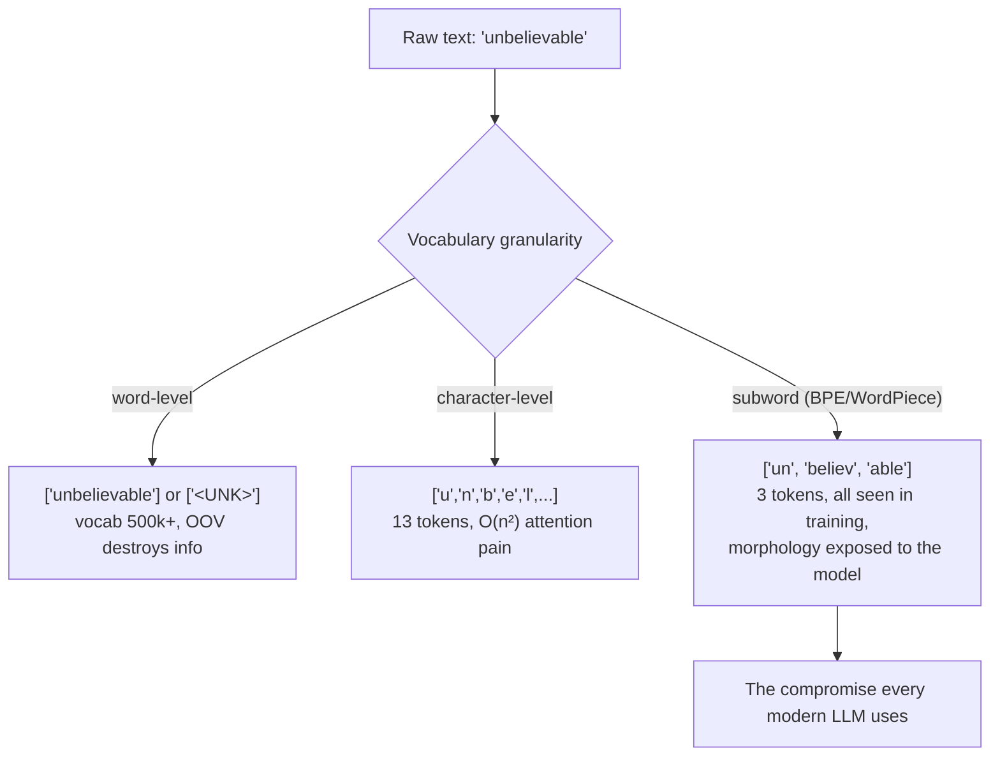
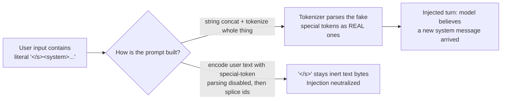

# Tokenization and Embeddings

Every model you will ever fine-tune, prompt, or serve begins with the same two operations: text becomes integers (tokenization), and integers become vectors (embedding lookup). These two layers are where an astonishing fraction of real production bugs live — silently wrong chat templates, multilingual cost blowups, truncated documents, injection through token boundaries — precisely because they sit below the level most engineers ever inspect. This guide builds both layers from first principles: a classical TF-IDF baseline that still wins sometimes, a byte-pair-encoding trainer implemented from scratch with its merges shown step by step, the design differences between BPE/WordPiece/SentencePiece, and then the embedding side — what the matrix actually is, why word2vec worked, why contextual embeddings replaced static ones, and how pooling strategy quietly decides whether your retrieval system works.

By the end you should be able to train a toy tokenizer by hand, explain to an interviewer exactly why `" hello"` and `"hello"` are different tokens, compute the cost impact of tokenizing Swahili vs English, and defend a pooling choice for a sentence-embedding service.

Part of the [Senior AI Engineer Roadmap](../00-Senior-AI-Engineer-Roadmap.md) — Phase 4.

---

## 1. The Classical Pipeline: A Baseline That Still Wins Sometimes

Before subwords and attention, NLP was a pipeline: tokenize → normalize → vectorize → classic ML. It remains the correct *first* system for narrow classification with labeled data, because it is ~1000x cheaper than a transformer and interpretable.

### 1.1 TF-IDF, Derived

For term `t` in document `d` within corpus of `N` documents:

```text
tf(t, d)   = count of t in d            (often log-scaled: 1 + log(count))
idf(t)     = log(N / df(t))             df(t) = number of documents containing t
tfidf(t,d) = tf(t, d) · idf(t)
```

The intuition, term by term:

- `tf` says "this word matters *to this document*".
- `idf` says "this word discriminates *between documents*" — a word appearing in every document ("the": `df = N`, `idf = log(1) = 0`) carries zero weight; a word in 1 of 10,000 documents gets weight `log(10000) ≈ 9.2`.
- The product upweights terms frequent here but rare everywhere else — exactly the topical signal a linear classifier can exploit.

### 1.2 The Baseline, Implemented

```python
# baseline_tfidf.py — the model every transformer must beat by enough to justify its cost
from sklearn.datasets import fetch_20newsgroups
from sklearn.feature_extraction.text import TfidfVectorizer
from sklearn.linear_model import LogisticRegression
from sklearn.pipeline import make_pipeline
from sklearn.metrics import accuracy_score

cats = ["sci.space", "rec.autos", "comp.graphics", "talk.politics.misc"]
train = fetch_20newsgroups(subset="train", categories=cats, remove=("headers", "footers", "quotes"))
test  = fetch_20newsgroups(subset="test",  categories=cats, remove=("headers", "footers", "quotes"))

pipe = make_pipeline(
    TfidfVectorizer(ngram_range=(1, 2), min_df=2, sublinear_tf=True),
    LogisticRegression(max_iter=1000, C=1.0),
)
pipe.fit(train.data, train.target)
pred = pipe.predict(test.data)
print(f"accuracy: {accuracy_score(test.target, pred):.3f}")
# Expected output (varies slightly by sklearn version):
# accuracy: 0.878
#
# Training time: ~3 seconds on CPU. Inference: ~50k docs/sec on one core.
# A fine-tuned DistilBERT gets ~0.92 here — is +4 points worth 100x the cost?
# Sometimes yes. But you cannot answer without this number.
```

**Where the classical pipeline breaks** — and what motivates everything after it: polysemy ("apple" the company vs the fruit gets one column), negation ("not bad" ≈ "bad" in bag-of-words), word order (lost entirely beyond n-grams), and out-of-vocabulary words (unseen at train time → dropped). Contextual models fix all four.

---

## 2. Subword Tokenization: Why It Exists

Two naive extremes fail:

- **Word-level vocab:** English alone needs 500k+ words; morphology multiplies it (run, runs, running, runner); any unseen word becomes `<UNK>` and its information is destroyed.
- **Character-level:** vocabulary of ~100, but sequences become 5x longer, and attention is O(n²) in length — a 4x length increase is a 16x compute increase, and the model must relearn that `t-h-e` means "the" from scratch.

Subword tokenization is the negotiated middle: **frequent strings become single tokens, rare strings decompose into learnable pieces**. `"tokenization"` → `["token", "ization"]` — both pieces occur in many other words, so the model has seen them, and nothing is ever `<UNK>`.



---

## 3. BPE From Scratch: The Algorithm, Derived and Implemented

Byte-Pair Encoding (originally a 1994 compression algorithm) trains a tokenizer with one loop:

1. Start with a base vocabulary (characters, or all 256 bytes for byte-level BPE).
2. Count every adjacent symbol pair in the corpus.
3. Merge the most frequent pair into a new symbol; add it to the vocabulary; record the merge rule.
4. Repeat until the vocabulary reaches the target size.

Encoding new text then replays the learned merge rules **in training order** — that ordering *is* the tokenizer.

### 3.1 The Trainer, Implemented

```python
# bpe_from_scratch.py — trainable BPE in ~60 lines, no dependencies
from collections import Counter

def get_pair_counts(word_freqs):
    """Count adjacent symbol pairs across the corpus, weighted by word frequency."""
    pairs = Counter()
    for word, freq in word_freqs.items():
        symbols = word.split()
        for i in range(len(symbols) - 1):
            pairs[(symbols[i], symbols[i + 1])] += freq
    return pairs

def merge_pair(pair, word_freqs):
    """Apply one merge rule to every word in the corpus."""
    a, b = pair
    merged = a + b
    out = {}
    for word, freq in word_freqs.items():
        symbols = word.split()
        i, new_symbols = 0, []
        while i < len(symbols):
            if i < len(symbols) - 1 and symbols[i] == a and symbols[i + 1] == b:
                new_symbols.append(merged)
                i += 2
            else:
                new_symbols.append(symbols[i])
                i += 1
        out[" ".join(new_symbols)] = freq
    return out

def train_bpe(corpus, num_merges):
    # Pre-tokenize on whitespace; append </w> so "est" at word-end differs from "est" mid-word
    word_freqs = Counter()
    for text in corpus:
        for word in text.lower().split():
            word_freqs[" ".join(list(word)) + " </w>"] += 1
    merges = []
    for step in range(num_merges):
        pairs = get_pair_counts(word_freqs)
        if not pairs:
            break
        best, count = pairs.most_common(1)[0]
        word_freqs = merge_pair(best, word_freqs)
        merges.append(best)
        print(f"merge {step + 1:2d}: {best[0]!r} + {best[1]!r} -> {best[0] + best[1]!r}  (count={count})")
    return merges

def encode(word, merges):
    """Encode a new word by replaying merges in training order."""
    symbols = list(word.lower()) + ["</w>"]
    for a, b in merges:                       # order matters: earlier merges first
        i, new_symbols = 0, []
        while i < len(symbols):
            if i < len(symbols) - 1 and symbols[i] == a and symbols[i + 1] == b:
                new_symbols.append(a + b); i += 2
            else:
                new_symbols.append(symbols[i]); i += 1
        symbols = new_symbols
    return symbols

corpus = [
    "low low low low low",
    "lower lower newer newer newer newer newer newer",
    "newest newest newest widest widest widest",
]
merges = train_bpe(corpus, num_merges=10)
print(encode("lowest", merges))   # a word NEVER seen in training
print(encode("newer", merges))
```

### 3.2 The Merges, Step by Step (Actual Output)

```text
merge  1: 'e' + 'r' -> 'er'  (count=8)      # 2 in lower, 6 in newer... 'er' everywhere
merge  2: 'er' + '</w>' -> 'er</w>'  (count=8)   # word-final 'er'
merge  3: 'n' + 'e' -> 'ne'  (count=9)      # newer(6) + newest(3)
merge  4: 'ne' + 'w' -> 'new'  (count=9)    # 'new' is now ONE symbol
merge  5: 'l' + 'o' -> 'lo'  (count=7)      # low(5) + lower(2)
merge  6: 'lo' + 'w' -> 'low'  (count=7)
merge  7: 'new' + 'er</w>' -> 'newer</w>'  (count=6)   # whole word fused
merge  8: 'low' + '</w>' -> 'low</w>'  (count=5)
merge  9: 'e' + 's' -> 'es'  (count=6)      # newest(3) + widest(3)
merge 10: 'es' + 't' -> 'est'  (count=6)
['low', 'est', '</w>']        # "lowest": unseen word, sensible decomposition
['newer</w>']                 # "newer": frequent word became a single token
```

Read what happened: **frequency drove everything**. `newer` appeared 6 times so it fused into one token; `lowest` never appeared, yet encodes to `low` + `est` — pieces the model has seen and has embeddings for. This is exactly the behavior GPT's tokenizer exhibits at 50,000-merge scale: `the` is one token, `Kilimanjaro` is four.

### 3.3 The Family: BPE vs WordPiece vs SentencePiece vs Byte-Level

| | BPE | WordPiece | SentencePiece (unigram) | Byte-level BPE |
| --- | --- | --- | --- | --- |
| Used by | GPT-2, RoBERTa | BERT | T5, Llama, Gemma | GPT-2/3/4, Llama 3 |
| Merge criterion | Highest pair **frequency** | Highest **likelihood gain**: score = freq(ab) / (freq(a)·freq(b)) | Start big, **prune** tokens that hurt corpus likelihood least | Frequency, over raw bytes |
| Continuation marker | `</w>` end-of-word (classic) | `##` prefix on non-initial pieces | `▁` marks word *start* (space is a symbol) | `Ġ` encodes leading space |
| Pre-tokenization | Whitespace split first | Whitespace split first | **None** — raw stream, language-agnostic | Regex split, then bytes |
| OOV possible? | Yes (unseen chars) | Yes → `[UNK]` | Yes (byte fallback optional) | **Never** — any UTF-8 encodes |

Key distinctions an interviewer probes:

- **WordPiece vs BPE:** WordPiece merges the pair that most increases training-data likelihood, not the most frequent pair. `freq(ab)/(freq(a)·freq(b))` is a pointwise-mutual-information-like score: it prefers pairs that occur together *disproportionately*, not just often.
- **SentencePiece** is really a *framework* (with BPE and unigram-LM algorithms inside) whose defining property is no pre-tokenization: spaces become `▁`, so tokenization is fully reversible and works for languages without whitespace (Chinese, Japanese, Thai).
- **Byte-level BPE** starts from 256 bytes, so every UTF-8 string is representable and `<UNK>` cannot exist. The cost: rare scripts decompose into many byte tokens (see the war stories below).

### 3.4 Vocabulary-Size Trade-offs

Vocabulary size `V` is a knob with real consequences:

```text
Small V (e.g. 8k)                       Large V (e.g. 256k)
─ longer sequences (more tokens/word)   ─ shorter sequences (fewer tokens/word)
─ less embedding memory: V × d_model    ─ embedding matrix dominates small models:
   8k × 768 = 6.1M params                  256k × 768 = 196.6M params — more than
                                           the entire 12-layer body of BERT-base!
─ more compute per document (O(n²))     ─ softmax over V every decode step
─ rare-word pieces well-trained         ─ tail tokens seen rarely → undertrained
                                          embeddings ("glitch tokens")
```

Modern choices: GPT-2 50,257; Llama 2 32,000; Llama 3 **128,256** (up 4x, chiefly to compress non-English text and code — Meta reported ~15% fewer tokens on the same corpora); Gemma 256,000. The trend is upward because inference cost scales with token count, and a bigger vocabulary is effectively a compression upgrade.

---

## 4. Tokenizer Bugs That Reach Production

### 4.1 Multilingual Token Inflation — the Cost Bug

Tokenizers are trained on a corpus mix; whatever is underrepresented fragments. Measure it:

```python
from transformers import AutoTokenizer
tok = AutoTokenizer.from_pretrained("gpt2")

samples = {
    "english": "The weather is beautiful today",
    "swahili": "Hali ya hewa ni nzuri sana leo",
    "amharic": "ዛሬ የአየር ሁኔታው በጣም ቆንጆ ነው",
}
for lang, text in samples.items():
    ids = tok(text)["input_ids"]
    print(f"{lang:8s}: {len(ids):3d} tokens for {len(text.split())} words")
# Expected output:
# english :   6 tokens for 5 words       (~1.2 tokens/word)
# swahili :  13 tokens for 7 words       (~1.9 tokens/word)
# amharic :  38 tokens for 6 words       (~6.3 tokens/word — every char is 3 UTF-8
#                                          bytes, and none were merged in training)
```

Consequences: the *same message* costs 5x more in tokens, fills the context window 5x faster, and generates 5x slower for Amharic users. If you serve African or Asian markets, per-language token multipliers belong in your cost model and your context budgeting.

### 4.2 Whitespace and Normalization Mismatches

```python
tok = AutoTokenizer.from_pretrained("gpt2")
print(tok.tokenize("hello"))    # ['hello']
print(tok.tokenize(" hello"))   # ['Ġhello']  ← DIFFERENT token id entirely
print(tok("hello")["input_ids"], tok(" hello")["input_ids"])
# [31373] vs [23748] — different rows of the embedding matrix
```

A prompt template that renders `"Answer:"` vs `"Answer: "` (trailing space) makes the model predict the *continuation of a word* vs a *new word* — measurably different outputs. Similarly, Unicode normalization (NFC vs NFD: `é` as one codepoint vs `e` + combining accent) yields different token sequences for visually identical text; if your ingestion normalizes one way and your training data another, retrieval and classification quality silently degrade.

### 4.3 Chat-Template Mistakes

Chat models are trained on one exact serialization — special tokens, role markers, whitespace and all. Hand-rolling it is the classic silent killer:

```python
# WRONG — hand-built string, missing special tokens the model was trained with
prompt = f"User: {question}\nAssistant:"

# RIGHT — the template ships with the tokenizer
messages = [{"role": "user", "content": question}]
prompt = tok.apply_chat_template(messages, tokenize=False, add_generation_prompt=True)
print(prompt)
# e.g. for Llama-3-Instruct:
# <|begin_of_text|><|start_header_id|>user<|end_header_id|>
#
# {question}<|eot_id|><|start_header_id|>assistant<|end_header_id|>
```

The failure mode is vicious because the model still *answers* — just worse: more rambling, ignores system instructions, occasionally emits role markers. Nothing errors. Evals catch it; eyeballs usually don't.

### 4.4 Token-Boundary Injection

Because special tokens are just strings until the tokenizer maps them, user input containing the literal text `<|im_end|>` or `</s>` can — if you concatenate strings and then tokenize with `add_special_tokens` behavior that parses them — fabricate a fake end-of-turn and inject a new "system" turn. Defenses: tokenize user content with special-token parsing disabled (`split_special_tokens=True` / encode user text separately), or strip/escape special-token strings at the trust boundary. This is the tokenizer-level sibling of SQL injection, and interviewers increasingly ask about it.



### 4.5 The Rest of the Rogues' Gallery

- **Tokenizer/checkpoint mismatch:** loading a model with a different repo's tokenizer maps ids to the wrong embedding rows. Output is degraded, not garbage — the worst kind of wrong. Always load both from the same revision.
- **Silent truncation:** `truncation=True, max_length=512` quietly discards everything past 512 tokens. Your classifier reads only the first half of long documents and nobody notices until someone audits errors by document length.
- **Numbers fragment:** `"3.14159"` → `['3', '.', '14', '159']`; `"2026-07-24"` → 5+ tokens. Arithmetic, ID matching, and exact-copy tasks all inherit this.
- **`decode(encode(x)) != x`** for some tokenizers/settings (normalization, stripped whitespace) — never assume round-tripping when reconstructing spans (critical for NER offsets; see guide 04).

---

## 5. Embedding Layers: Integers Become Geometry

### 5.1 What the Matrix Is

An embedding layer is a matrix `E` of shape `(V, d_model)` — one learned row per vocabulary entry. "Lookup" is exactly `E[token_id]`; equivalently, multiplying a one-hot vector by `E`. That equivalence matters: it means the embedding layer *is* a linear layer, its rows receive gradients only when their token occurs, and rare tokens therefore train slowly (the "glitch token" phenomenon: tokens frequent in the tokenizer-training corpus but rare in the model-training corpus keep near-initialization embeddings, and feeding them produces bizarre behavior).

```python
import torch, torch.nn as nn

V, d_model = 50_257, 768
emb = nn.Embedding(V, d_model)
print(sum(p.numel() for p in emb.parameters()))   # 38,597,376 — 38.6M params
ids = torch.tensor([[31373, 995]])                # batch=1, seq=2
print(emb(ids).shape)                             # torch.Size([1, 2, 768])
```

### 5.2 Tied Embeddings

A language model also needs an **output projection** ("LM head") of shape `(d_model, V)` to turn final hidden states into vocabulary logits. Input embedding: `(V, d_model)`. Same shape transposed — so many models **tie** them, using `Eᵀ` as the head. Effects: saves `V × d_model` parameters (38.6M for GPT-2 — ~31% of the 124M model!), and imposes a consistency prior: a token's input representation and its output "detector" direction coincide. GPT-2 and Gemma tie; Llama 2/3 do not (at 7B+, 131M params is 0.5% — not worth the constraint).

### 5.3 word2vec: Why Static Embeddings Worked At All

The skip-gram objective, sketched: for each center word `c` and context word `o` within a window, maximize

```text
P(o | c) = exp(u_oᵀ v_c) / Σ_w exp(u_wᵀ v_c)
```

where `v_c` is the center-word vector and `u_o` the context-word vector. Intuition: push `v_c` toward the context vectors of words it co-occurs with, and (via the normalizer, in practice approximated by **negative sampling** — a binary logistic loss against k random "noise" words instead of the full softmax) away from words it doesn't. Words in similar contexts end up with similar vectors — the distributional hypothesis, made differentiable. This is why `king − man + woman ≈ queen` emerges: consistent co-occurrence *differences* become consistent vector *offsets*.

The fatal limitation: one vector per type. "bank" gets a single point that must average the river and the finance senses.

### 5.4 Contextual vs Static

A transformer's output for a token is computed *from the whole sequence* — "bank" in "river bank" and "bank" in "bank transfer" produce different vectors. That single property is the qualitative jump of the transformer era: embeddings became functions of context, not lookup tables. The embedding *layer* (§5.1) is still a static lookup — context enters through attention above it.

### 5.5 Sentence Embeddings and Pooling — Why Retrieval Cares

To embed a whole sentence with an encoder you must pool per-token vectors into one. The choice is not cosmetic:

- **CLS pooling:** take the `[CLS]` token's final hidden state. Only meaningful if the model was *trained* with an objective that concentrates sentence meaning there (e.g. next-sentence prediction, or a contrastive fine-tune using CLS). Vanilla BERT's CLS without fine-tuning is a famously *bad* sentence embedding — worse than averaging GloVe vectors on similarity benchmarks (the Sentence-BERT paper's motivating result).
- **Mean pooling:** average all token vectors (masking padding!). Robust default; what most `sentence-transformers` models use.
- **Last-token pooling:** for decoder-only embedders (causal attention means only the last position has seen everything).

```python
# pooling.py — the mean-pooling everyone gets subtly wrong (padding!)
import torch
from transformers import AutoTokenizer, AutoModel

tok = AutoTokenizer.from_pretrained("sentence-transformers/all-MiniLM-L6-v2")
model = AutoModel.from_pretrained("sentence-transformers/all-MiniLM-L6-v2")

def embed(texts):
    batch = tok(texts, padding=True, truncation=True, return_tensors="pt")
    with torch.no_grad():
        hidden = model(**batch).last_hidden_state          # (B, L, 384)
    mask = batch["attention_mask"].unsqueeze(-1).float()   # (B, L, 1)
    summed = (hidden * mask).sum(dim=1)                    # zero out pad positions
    counts = mask.sum(dim=1).clamp(min=1e-9)               # true lengths
    return torch.nn.functional.normalize(summed / counts, dim=-1)

e = embed(["How do I reset my password?",
           "password reset instructions",
           "The weather in Nairobi is pleasant"])
print((e @ e.T).round(decimals=2))
# Expected output (approximately):
# tensor([[1.00, 0.81, 0.06],
#         [0.81, 1.00, 0.04],
#         [0.06, 0.04, 1.00]])
# Paraphrases ~0.8; unrelated ~0.05. If you forget the mask and average padding
# vectors, short texts drift toward the padding direction and scores compress.
```

**Why it matters for retrieval:** your RAG system's recall is bounded by embedding quality. Using the wrong pooling for a given checkpoint (CLS on a mean-pooled model or vice versa) can cost 10–20 points of retrieval recall with zero errors thrown. Always read the model card; `sentence-transformers` encodes the correct pooling in the model config so `SentenceTransformer.encode` does the right thing.

---

## Production War Stories & Failure Modes

### Incident 1: The 4.7x Invoice — Multilingual Token Inflation

- **Symptom:** LLM API bill for the month is 4.7x forecast. Traffic volume grew only 1.3x. Finance escalates.
- **Investigation:** Per-request token logging (added after the fact — it should have existed) shows mean prompt tokens jumped from ~800 to ~3,100. Segmenting by user locale: the product launched in three new markets that month; requests in Amharic and Burmese average 5–7 tokens *per word* against English's 1.3, and the RAG context (translated docs) inflates identically.
- **Root cause:** cost model and context budgets were calibrated on English tokens-per-word. The tokenizer fragments underrepresented scripts into near-byte-level pieces, multiplying both cost and context usage; some requests were also silently truncating retrieved context, degrading answer quality in exactly those markets.
- **Fix:** per-locale token multipliers in the cost model; context budgeter counts tokens (never words) with the *actual* tokenizer; retrieval chunk sizes set in tokens.
- **Prevention:** log `prompt_tokens`/`completion_tokens` per request from day one, dashboard by locale; load-test cost with production language mix, not English fixtures.

### Incident 2: The Model That Got Quietly Worse — Chat-Template Drift

- **Symptom:** after a routine model upgrade (7B-instruct v2 → v3), user thumbs-down rate creeps up 8% over two weeks. No errors, no latency change.
- **Investigation:** offline eval reproduces a small quality drop. Diffing actual prompts sent to the server against `tokenizer.apply_chat_template` output for the new checkpoint reveals the serving layer used a hand-maintained template string from v2 — v3 changed its role-marker tokens and system-prompt placement.
- **Root cause:** the prompt was built by string formatting frozen at v2's template; v3 received a serialization it was never trained on. The model coped — degraded, but functional — which is why nothing alarmed.
- **Fix:** delete the hand-rolled template; serialize exclusively via `apply_chat_template` from the deployed checkpoint's own tokenizer; add a canary eval that runs on every model or tokenizer version bump.
- **Prevention:** treat the chat template as part of the model artifact. CI asserts `apply_chat_template(sample) == recorded_golden` and fails loudly on checkpoint changes so a human re-records deliberately.

### Incident 3: The Support Bot That Obeyed a Customer — Token-Boundary Injection

- **Symptom:** a support chatbot begins a session claiming it will issue a full refund "as authorized by the system administrator". No such policy exists.
- **Investigation:** transcript logs show the user pasted text containing literal `<|im_end|>` and `<|im_start|>system` strings followed by fake instructions. The serving code concatenated user text into the prompt string and tokenized the whole thing with special-token parsing enabled — the fake markers became *real* control tokens.
- **Root cause:** trust-boundary violation at the tokenizer: user-controlled bytes were allowed to produce special token ids.
- **Fix:** encode user content with special-token parsing disabled and splice ids into the template programmatically; add a filter rejecting known special-token strings in inbound text as defense in depth.
- **Prevention:** red-team suite includes special-token payloads for every deployed tokenizer; code review checklist item: "can user bytes ever reach a tokenize call that parses special tokens?"

### Incident 4: Retrieval Recall Off a Cliff — Wrong Pooling and a Missing Mask

- **Symptom:** new in-house embedding service ships; RAG answer quality drops though the "same" model is used. Recall@10 on the eval set: 0.83 (old managed service) → 0.61 (new).
- **Investigation:** embedding vectors for identical inputs differ between services. The new service ran the raw `AutoModel` and took `last_hidden_state[:, 0]` (CLS) — but the checkpoint is a mean-pooling `sentence-transformers` model. A second bug compounding it: batch inference averaged over padding positions (no attention-mask weighting), so scores depended on what a text was batched with.
- **Root cause:** pooling strategy is part of the model contract, not a free choice; and mean pooling without masking is a correctness bug, not an approximation.
- **Fix:** masked mean pooling per the model card (or just use `SentenceTransformer`); regression test asserting cosine similarity ≥ 0.999 between the service's vectors and reference `encode()` output for a fixture set.
- **Prevention:** any embedding-service change must pass the vector-equivalence fixture plus a retrieval-metric eval before rollout; batch-invariance test (same text, different batch companions → same vector).

---

## Best Practices

- Keep a TF-IDF + logistic regression baseline for every classification task; make the transformer justify its cost with a measured gap.
- Always load tokenizer and model from the same repo and revision; pin both.
- Budget, log, and alert in **tokens**, never words; keep per-locale multipliers if you serve multilingual traffic.
- Use `apply_chat_template` exclusively; treat the template as part of the model artifact with a golden-output CI test.
- Never let user-controlled bytes be parsed into special tokens — encode user content with special-token parsing disabled at the trust boundary.
- Watch for silent truncation: log actual token counts and alert when inputs hit `max_length`.
- For sentence embeddings, the pooling strategy is part of the checkpoint contract — read the model card, mask padding in mean pooling, and L2-normalize before cosine/dot retrieval.
- Test `decode(encode(x))` round-tripping before building anything that maps model output back to character offsets.
- When choosing vocabulary size for a from-scratch model, account for the embedding matrix share of total parameters and the sequence-length/compute trade.
- Prefer byte-level or byte-fallback tokenizers for open-domain input so `<UNK>` cannot exist.

---

## Interview Drills

<details><summary>Walk me through how BPE training works. What is the algorithm actually optimizing?</summary>
Start with a base vocabulary (characters or 256 bytes). Repeatedly: count all adjacent symbol pairs in the corpus, merge the most frequent pair into a new symbol, record the merge rule; stop at target vocab size. Encoding replays merges in training order. It is a greedy compression procedure: each merge maximally reduces the corpus token count at that step, so BPE approximately minimizes tokens-per-corpus subject to vocabulary budget — it is not likelihood-based.
Follow-up: *So what does WordPiece optimize differently?* WordPiece merges the pair maximizing likelihood gain, scoring freq(ab)/(freq(a)·freq(b)) — a PMI-like criterion preferring pairs that co-occur disproportionately, not merely frequently. A pair like "th"+"e" may be frequent but if both parts are independently ubiquitous the score is modest.
Follow-up: *Why does merge order matter at encode time?* Because later merges consume the outputs of earlier ones ("l"+"o"→"lo" must run before "lo"+"w"→"low"). Replaying out of order produces different segmentations than training saw, and the model's embeddings were learned against the training segmentation.
</details>

<details><summary>Why did every modern LLM converge on subword tokenization rather than words or characters?</summary>
Word-level: unbounded vocabulary, OOV destroys information, morphologically rich languages explode. Character-level: tiny vocabulary but 4–5x longer sequences, and attention cost is quadratic in length — 4x length is 16x attention compute — plus the model wastes capacity relearning that character n-grams form units. Subwords give bounded vocabulary, no OOV (with byte fallback), frequent words as single tokens, and rare words as decompositions built from trained pieces.
Follow-up: *Why are vocabularies trending larger — Llama 2's 32k to Llama 3's 128k?* Larger vocab compresses text (fewer tokens per document), which cuts O(n²) attention cost, context usage, and generation latency — especially for code and non-English. Costs: bigger embedding/head matrices and a rarer, less-trained tail. At 8B+ parameters the matrix cost is proportionally small, so compression wins.
</details>

<details><summary>Your prompt template accidentally gains a trailing space. Could that change model behavior? Why?</summary>
Yes. BPE encodes leading whitespace into tokens: "hello" and " hello" are different ids mapping to different embedding rows. With "Answer: " the model continues from a token boundary that implies the next token starts a new word; with "Answer:" it may prefer tokens that continue the string. Because the model's training distribution has strong conventions about spacing, this measurably shifts output distributions.
Follow-up: *How would you catch this class of bug systematically?* Golden-prompt tests: render templates against fixtures and assert exact token-id sequences, not strings; run a small behavioral eval on template changes. Log rendered prompts (or their hashes) so drift is diffable.
</details>

<details><summary>Explain tied embeddings. Why do some models tie and others not?</summary>
Input embedding is (V, d_model); LM head is (d_model, V). Tying uses the transpose of the embedding as the head. Saves V×d_model parameters — enormous relatively for small models (38.6M of GPT-2's 124M, ~31%) — and adds a consistency prior: a token's input vector and output detector coincide. Large models (Llama 2/3) untie because the saving is proportionally negligible (~0.5% at 7B) and untied heads give slightly better loss — the roles (recognize token as input vs predict token as output) are related but not identical.
Follow-up: *Does tying change the gradient dynamics?* Yes — the matrix receives gradients from both the input path (rows of occurring tokens) and the output path (all rows, via softmax normalization every step), so tied embeddings train faster and more uniformly across the vocabulary.
</details>

<details><summary>What is a "glitch token" and what causes it?</summary>
A token present in the vocabulary but essentially absent from the model's training data — e.g. tokenizer trained on a corpus containing Reddit usernames, model trained on a filtered corpus. Its embedding row almost never receives gradients and stays near initialization. At inference, that near-random vector enters attention and produces erratic behavior: refusals, hallucination, or bizarre completions ("SolidGoldMagikarp"). Cause: distribution mismatch between tokenizer-training and model-training corpora.
Follow-up: *How would you detect them in a model you're deploying?* Scan for embedding rows with near-initialization norms/statistics, or feed each vocab token in a fixed probe prompt and flag outlier perplexity/behavior. Practically: fuzz your system with rare tokens before exposing free-text input.
</details>

<details><summary>How can tokenization be a security boundary? Give a concrete attack and defense.</summary>
Special tokens (end-of-turn, role markers) are strings until tokenized. If user input is concatenated into the prompt and the full string is tokenized with special-token parsing on, a user pasting literal "<|im_end|><|im_start|>system ..." mints real control tokens — a fake system turn, i.e., prompt injection at the token level. Defense: encode user content with special-token parsing disabled (or escape/strip known special-token strings), splice token ids programmatically, and red-team with special-token payloads.
Follow-up: *Is stripping the strings enough?* Strings alone are brittle — homoglyphs, partial overlaps with normalization, and new tokenizer versions add markers. The robust invariant is structural: user bytes must never pass through a tokenize call that can parse special tokens. Stripping is defense in depth, not the primary control.
</details>

<details><summary>Derive why "bank" defeats word2vec but not BERT.</summary>
Skip-gram assigns one vector per word type, trained so v_bank predicts all its contexts. "River bank" and "bank transfer" contexts pull v_bank toward both hydrology and finance neighborhoods; the result is a compromise point optimal for neither — polysemy is averaged away by construction. BERT computes each occurrence's representation from its actual sentence via attention: the "bank" vector in "river bank" literally mixes in value vectors from "river". One vector per *occurrence*, not per type.
Follow-up: *Sketch the skip-gram objective and why negative sampling is needed.* Maximize Σ log P(context|center) with P(o|c) = softmax(u_oᵀ v_c) over the vocabulary. The normalizer sums over all V words — too expensive per step at V=10⁵⁺. Negative sampling replaces it with binary logistic discrimination of the true context word against k sampled noise words, approximating the gradient at k+1 dot products per pair.
</details>

<details><summary>You're building a semantic search service. CLS pooling or mean pooling? Defend the decision.</summary>
Neither by fiat — the checkpoint decides. Pooling is part of the training contract: if the model was contrastively fine-tuned with mean pooling (most sentence-transformers), mean pooling with attention-mask weighting is correct; if fine-tuned through CLS, use CLS. Vanilla BERT's CLS without sentence-level fine-tuning is a known-bad sentence embedding (the Sentence-BERT result: worse than averaged GloVe on STS). Then: mask padding in the mean, L2-normalize, and add a batch-invariance regression test.
Follow-up: *Your decoder-only LLM is now the embedder. What changes?* Causal attention means position i never sees positions >i, so mean pooling averages many partially-informed vectors; last-token pooling (the only position attending to everything) is standard, usually with an instruction prefix and contrastive fine-tuning (e.g. E5-Mistral style).
</details>

<details><summary>A teammate estimates context usage as words × 1.3. When does this fail badly?</summary>
It's an English-prose average. Fails on: code (dense punctuation and identifiers — often 2–4 tokens/word-equivalent); non-Latin scripts on English-heavy tokenizers (3–7 tokens/word — each Amharic char is 3 UTF-8 bytes with no learned merges); URLs, IDs, and numbers (near per-character fragmentation); and different tokenizers entirely (32k vs 128k vocab differ ~15%+ on identical text). The only correct method: count with the deployed model's actual tokenizer, and log real counts.
Follow-up: *What breaks first when the estimate is low?* Silent truncation — the context assembler drops or clips retrieved passages (or the tokenizer truncates at max_length), so answers degrade with no error. Alert on inputs hitting the limit.
</details>

<details><summary>What's the difference between SentencePiece and BPE? Why does no-pre-tokenization matter?</summary>
SentencePiece is a framework (containing BPE and unigram-LM trainers) whose signature design is operating on the raw character stream with space as a normal symbol (▁), no whitespace pre-splitting. This makes tokenization fully reversible (exact detokenization) and language-agnostic — Chinese/Japanese/Thai lack whitespace, so whitespace-pre-tokenized BPE can't even define "words" there. Unigram-LM additionally trains top-down: start with a large candidate vocab, iteratively prune tokens whose removal least hurts corpus likelihood — yielding probabilistic segmentation that supports sampling multiple segmentations (subword regularization) as augmentation.
Follow-up: *When would unigram beat BPE?* Evidence is modest, but unigram's segmentations tend to align better with morphology, and subword regularization helps low-resource MT/robustness. In practice ecosystem compatibility usually dominates the choice.
</details>

<details><summary>Compute the embedding-matrix parameter count for V=128,256, d_model=4096, tied vs untied. Is it significant for an 8B model?</summary>
One matrix: 128,256 × 4,096 = 525,336,576 ≈ 525M. Untied doubles it: ~1.05B. For an 8B-parameter model that's ~6.6% (tied) or ~13% (untied) — genuinely significant, which is why vocabulary expansion is a real architectural decision, and why Llama 3's shift to 128k vocab traded parameter budget for ~15% text compression. For a 124M model the same 128k vocab would be impossible — the embeddings alone would dwarf the body.
Follow-up: *Where else does vocab size cost at inference?* The output softmax: every decode step computes d_model × V logits (~525M MACs/step here) plus the softmax over V; at small batch this matmul can be a visible slice of per-token latency, and the logits tensor (B × V floats) is real memory.
</details>

<details><summary>Your NER system's character offsets are wrong for ~2% of documents. Tokenization hypothesis?</summary>
Offset mapping breaks where tokenization isn't a clean substring partition: Unicode normalization (NFC/NFD) changes lengths before tokenization; some tokenizers strip/collapse whitespace or replace characters (bytes→Ġ, space→▁) so decode(encode(x)) ≠ x; multi-byte chars and emoji split across byte-level tokens mid-character. If offsets are computed on normalized text but applied to raw text, spans drift precisely on documents containing accents, emoji, or unusual whitespace — matching a ~2% tail.
Follow-up: *Fix?* Use the fast tokenizers' return_offsets_mapping (offsets into the ORIGINAL string), never reconstruct via decode; test round-trip and offset validity on a fixture set with emoji, NFD accents, tabs, and non-Latin scripts.
</details>

<details><summary>When would TF-IDF + logistic regression legitimately beat a fine-tuned transformer?</summary>
When the signal is topical/lexical rather than compositional: spam keywords, product-category routing, language ID. With abundant labels, strong word-presence signal, and short training budget, the linear model reaches within a few points of the transformer at ~1/1000 the inference cost, trains in seconds, and its coefficients are auditable. It also degrades more predictably under domain shift of style (though worse under vocabulary shift). The transformer wins decisively on negation, sarcasm, paraphrase, world knowledge, or few-label regimes (transfer from pretraining).
Follow-up: *How do you decide in practice?* Build both; the TF-IDF baseline costs an hour. Compare on a held-out set with the deployment metric, then price the gap: accuracy delta vs 100–1000x serving cost, latency, and operational complexity. Make the transformer pay rent.
</details>

<details><summary>Explain byte-level BPE's guarantee and its price.</summary>
Guarantee: the base vocabulary is all 256 bytes, so any UTF-8 string tokenizes — <UNK> is structurally impossible; arbitrary binary-ish input (typos, emoji, new scripts, zalgo) always encodes. Price: text in scripts underrepresented at merge-training time decomposes toward raw bytes — a 3-byte UTF-8 character can cost 3 tokens — creating the multilingual inflation problem: same content, 3–7x tokens, hence cost, latency, and context consumption. Also byte pieces mid-character make offset mapping and streaming decode trickier (a partial character can't render until its bytes complete).
Follow-up: *How do you handle partial characters in streaming?* Buffer decoded bytes until they form valid UTF-8 before emitting — tokenizers' streaming decoders do this; naive per-token decode prints replacement characters on multi-byte boundaries.
</details>

---

Next: [Attention and the Transformer Block](./02-Attention-and-the-Transformer-Block.md), where these token ids and embedding vectors enter the machine that made all of this matter.
