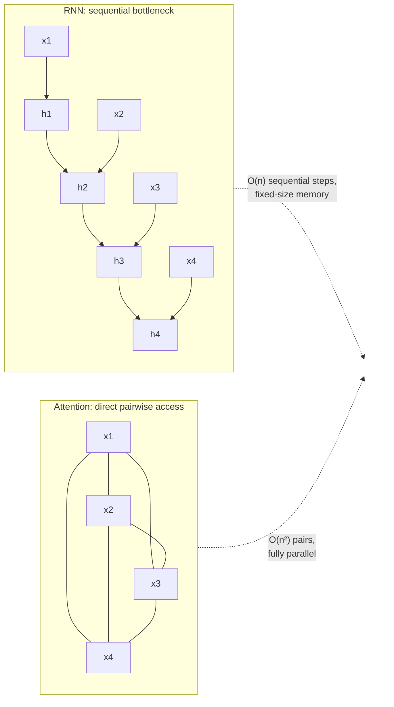
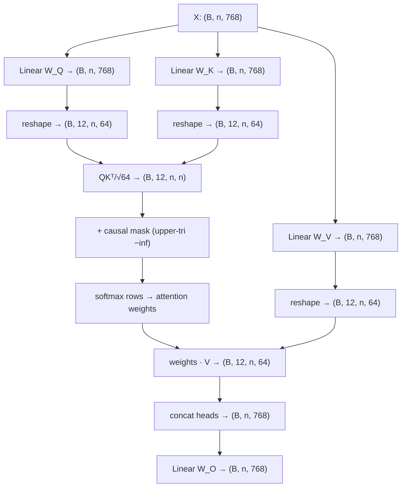

# Attention and the Transformer Block

This is the load-bearing guide of the entire track. Every system you will build above this layer — RAG, agents, fine-tunes, inference servers — inherits its cost model, its failure modes, and its knobs from what attention actually computes. Most engineers can recite `softmax(QKᵀ/√d_k)V`; very few can say why the three projections exist at all, compute the variance argument behind `√d_k`, count the parameters of a 7B model layer by layer, or derive from the math exactly which tensors the KV cache stores and why decode is memory-bound. That gap is what separates "used transformers" from "understands transformers" in a senior interview.

This guide derives attention symbol by symbol, builds up multi-head attention with the arithmetic done by hand for a real config, works through positional encodings (sinusoidal, learned, RoPE), the FFN, pre-norm vs post-norm, the residual stream, and the KV cache — then implements a complete minimal GPT in PyTorch, trains it on a tiny corpus, and shows the output.

Part of the [Senior AI Engineer Roadmap](../00-Senior-AI-Engineer-Roadmap.md) — Phase 4.

---

## 1. The Problem Attention Solves

Before attention, sequence models (RNNs/LSTMs) compressed the entire left context into one fixed-size hidden state passed step to step. Two consequences: information from 200 tokens ago had to survive 200 sequential bottleneck updates (it mostly didn't), and computation could not parallelize across the sequence — step *t* needs step *t−1*.

Attention replaces "compress history into one vector" with "let every token directly look at every other token and pull what it needs." The costs of that choice define modern LLM engineering:

- **O(n²) pairwise interactions** — the context-length cost model.
- **Permutation invariance** — position must be injected explicitly.
- **Full parallelism in training** — the reason transformers won the scaling race.



---

## 2. Scaled Dot-Product Attention, Derived Symbol by Symbol

### 2.1 Why Q, K, V Projections Exist

Start from what we want: token *i*'s new representation should be a weighted mixture of information from all tokens, with weights based on relevance to *i*. The naive version uses raw embeddings `X (n × d_model)` directly:

```text
scores = X Xᵀ          # similarity of every token to every token
out    = softmax(scores) X
```

This works but conflates three distinct roles into one vector:

1. **What am I looking for?** — "bank" next to "river" wants geographic context; the *same word* next to "loan" wants financial context. The seeking behavior must be a *learned function* of the embedding, not the embedding itself.
2. **What do I advertise?** — how a token announces itself to seekers is not the same as what it seeks. "river" should advertise "geographic feature" strongly to a query from "bank", regardless of what "river" itself is querying for.
3. **What do I contribute if selected?** — the payload delivered needn't equal the advertisement. A rare token may be an excellent *match target* while contributing a transformed feature, not its raw embedding.

So we give each role its own learned linear map:

```text
Q = X W_Q     W_Q: (d_model × d_k)    queries  — "what I seek"
K = X W_K     W_K: (d_model × d_k)    keys     — "what I advertise"
V = X W_V     W_V: (d_model × d_v)    values   — "what I deliver"
```

With `X X ᵀ` and no projections, the score matrix would also be symmetric — token A attends to B exactly as much as B attends to A. Language is not symmetric ("the" should attend to its noun far more than vice versa). Separate `W_Q ≠ W_K` breaks the symmetry: `score(i→j) = q_i · k_j ≠ q_j · k_i`.

### 2.2 Why QKᵀ Is Similarity

For one query `q_i (1 × d_k)` and one key `k_j (1 × d_k)`:

```text
q_i · k_j = Σ_m q_i[m] · k_j[m] = |q_i| |k_j| cos(θ)
```

The dot product is large when the vectors are aligned in the learned Q/K space — the model *learns* what "aligned" means (syntactic role, coreference, topical match). Stacking all pairs:

```text
QKᵀ : (n × d_k)(d_k × n) = (n × n)
QKᵀ[i, j] = q_i · k_j = relevance of token j to token i
```

Row *i* is token *i*'s raw relevance profile over the whole sequence.

### 2.3 Why √d_k — the Variance Argument, Computed

Assume at initialization the components of `q` and `k` are independent with mean 0 and variance 1 (what standard init + LayerNorm approximately gives you). Then for the score `s = q · k = Σ_m q_m k_m`:

```text
E[q_m k_m]   = E[q_m] E[k_m] = 0                       (independence)
Var(q_m k_m) = E[q_m² k_m²] − 0 = E[q_m²] E[k_m²] = 1·1 = 1
Var(s)       = Σ_m Var(q_m k_m) = d_k                  (independent terms add)
std(s)       = √d_k
```

With `d_k = 64`, typical scores have standard deviation 8 — softmax inputs routinely differ by ±20. Compute what softmax does with that:

```text
softmax([20, 0, −20]) = [e²⁰, 1, e⁻²⁰] / Z ≈ [0.9999999979, 2.06e−9, 4.25e−18]
```

Essentially one-hot. The gradient of softmax w.r.t. its inputs involves `p_i(1 − p_i)` terms; at `p ≈ 1` or `p ≈ 0` these vanish, so no learning signal flows — attention freezes into whatever random pattern initialization produced. Dividing scores by `√d_k` restores `Var(s/√d_k) = d_k / d_k = 1`, keeping softmax in its responsive regime.

**Temperature view:** softmax with scores divided by `T` is a temperature-`T` softmax. `√d_k` is a principled temperature choice that keeps the *effective* temperature constant as you scale head dimension — without it, wider heads would run "colder" (more peaked) purely as an artifact of dimensionality.

### 2.4 The Full Formula, Shapes Annotated

```text
Attention(Q, K, V) = softmax(QKᵀ / √d_k) V

Q:      (n × d_k)
K:      (n × d_k)
QKᵀ:    (n × n)          — pairwise relevance
/√d_k:  (n × n)          — variance-normalized
softmax (row-wise): each row is a probability distribution over source tokens
· V:    (n × n)(n × d_v) = (n × d_v)   — each output row is a convex combination of value rows
```

Output row *i* is literally a weighted average of value vectors, weights summing to 1. Token *i* after attention *contains* a mixture of other tokens' payloads — that is what "contextual representation" means mechanically.

### 2.5 Causal Masking Mechanics

A decoder trained on next-token prediction must not let position *i* see positions `> i` — otherwise the training task is trivially cheated. The mask is applied to *scores*, before softmax:

```text
scores[i, j] = −inf   for all j > i     (upper triangle, excluding diagonal)
```

`−inf` (in practice `−1e9` or dtype-min, or additive mask of `−inf` with fused kernels) becomes weight exactly 0 after softmax, and the row still normalizes over the *allowed* positions. Key insight for interviews: masking is why decoder **training is parallel** — you feed the whole sequence, the mask guarantees each position's prediction used only its past, so all n next-token losses are computed in one forward pass (teacher forcing). Generation, by contrast, is inherently sequential — which is where the KV cache (Section 8) comes in.

---

## 3. Multi-Head Attention

### 3.1 Why Heads

One attention head produces one weighting pattern per token — one "view" of the sequence. But a token simultaneously needs different relations: its syntactic head, its coreferent, nearby punctuation, topical anchors. A single softmax must average these needs into one distribution.

Multi-head attention runs `h` independent attentions in parallel, each in a lower-dimensional subspace, then concatenates:

```text
head_dim = d_model / h
head_i   = Attention(X W_Q^i, X W_K^i, X W_V^i)     each (n × head_dim)
MHA(X)   = concat(head_1, ..., head_h) W_O          (n × d_model)
```

The crucial arithmetic: because each head is `d_model/h` wide, **total compute and parameters match a single full-width head**. You get `h` independent relevance patterns nearly for free. Empirically, heads specialize — some track previous-token position, some track syntax, some become "induction heads" that implement copy-pattern behavior (the mechanistic seed of in-context learning).

### 3.2 Parameter Count by Hand: GPT-2 Small Config (d_model=768, h=12)

```text
head_dim = 768 / 12 = 64

W_Q: 768 × 768 = 589,824     (all heads' query projections, stored as one matrix)
W_K: 768 × 768 = 589,824
W_V: 768 × 768 = 589,824
W_O: 768 × 768 = 589,824
biases (4 × 768)  =   3,072
------------------------------------
attention sublayer ≈ 2,362,368  ≈ 2.36M parameters per layer
```

The "12 heads" never appear in the parameter count — heads are a *reshape* of the same 768-wide projection into 12 × 64 slices, not extra weights. This is the single most common interview arithmetic check.

### 3.3 The Attention Data Flow



---

## 4. Positional Information

Attention is a set operation: permute the input rows and the output rows permute identically. "dog bites man" and "man bites dog" are indistinguishable without explicitly injecting position.

### 4.1 Sinusoidal Encodings, Derived

The original paper adds a fixed vector `PE(pos)` to each token embedding:

```text
PE(pos, 2i)   = sin(pos / 10000^(2i/d_model))
PE(pos, 2i+1) = cos(pos / 10000^(2i/d_model))
```

Each dimension pair `(2i, 2i+1)` is a sin/cos wave at wavelength `10000^(2i/d_model) · 2π` — wavelengths form a geometric progression from `2π` (fast, resolves adjacent positions) to `10000·2π` (slow, resolves coarse position). Why sin *and* cos at each frequency? Because of the rotation identity:

```text
[sin(pos+k)]   [cos k   sin k] [sin pos]
[cos(pos+k)] = [−sin k  cos k] [cos pos]
```

`PE(pos+k)` is a **linear function of PE(pos)** for any fixed offset `k` — the model can learn relative-offset attention with a linear map. No parameters, defined for any position (weak extrapolation in practice, but defined).

### 4.2 Learned Absolute Positions

BERT and GPT-2 instead train an embedding table `(max_len × d_model)` and add row `pos`. Simple, slightly better in-distribution — but position 1025 literally has no embedding if you trained with `max_len=1024`. Hard cap, no extrapolation.

### 4.3 RoPE — Rotation Intuition and Why It Enables Relative Position

RoPE (used by Llama, Qwen, Mistral, most modern LLMs) does not add anything to embeddings. It **rotates each query and key vector** by an angle proportional to its position, pairing up dimensions as 2D planes:

```text
For dimension pair (2i, 2i+1), rotation angle at position p:  θ_i · p,
where θ_i = 10000^(−2i/d_k)   (same geometric frequency ladder as sinusoidal)

q'_p = R(θ, p) q_p        k'_m = R(θ, m) k_m
```

The magic is what happens to their dot product. Rotations satisfy `R(a)ᵀ R(b) = R(b−a)`, so:

```text
q'_p · k'_m = (R(p) q)ᵀ (R(m) k) = qᵀ R(m − p) k
```

The attention score depends on positions **only through the relative offset m − p**. Consequences:

- "Attend 3 tokens back" is expressible as one pattern valid at every absolute position — a much better inductive bias for language.
- No learned position table → no hard length cap. Extrapolation beyond training length still degrades (unseen rotation angles at low frequencies), but because the *frequencies* are the knob, you can rescale them post-hoc: **position interpolation** compresses positions into the trained range; **NTK/YaRN scaling** rescales frequencies non-uniformly. This is how 8K-trained models get extended to 128K — impossible with a learned absolute table.
- RoPE is applied to Q and K only, **not V** — position should influence *who attends to whom*, not corrupt the payload being mixed.

### 4.4 Comparison Table

| Scheme | Parameters | Relative? | Length extension | Used by |
| --- | --- | --- | --- | --- |
| Sinusoidal | 0 | Indirectly (linear map) | Weak extrapolation | Original Transformer |
| Learned absolute | max_len × d_model | No | None (hard cap) | BERT, GPT-2 |
| RoPE | 0 | Yes (scores depend on m−p) | PI / NTK / YaRN rescaling | Llama, Mistral, Qwen |

---

## 5. The FFN / MLP Block

After attention mixes information *across* tokens, the FFN transforms each token *independently* — same weights applied position-wise:

```text
FFN(x) = W_2 · act(W_1 x)        W_1: (d_model → d_ff),  W_2: (d_ff → d_model)
```

**Why 4× expansion?** `d_ff = 4·d_model` is the empirical default from the original paper that survived scaling studies. The up-projection gives the nonlinearity a wide feature space to work in; interpretability work suggests FFN neurons act as key–value memories (rows of `W_1` match input patterns, rows of `W_2` write facts/features into the residual stream). The FFN holds roughly **2/3 of a standard block's parameters** — most of the model's "knowledge" lives here, not in attention.

**GELU vs ReLU:** `GELU(x) = x · Φ(x)` (Gaussian CDF) is a smooth gate — no dead-neuron cliff at 0, small negative leak, better-behaved gradients. Standard from BERT/GPT-2 onward.

**SwiGLU (Llama and most modern LLMs):** a *gated* FFN with three matrices:

```text
SwiGLU(x) = W_down ( SiLU(W_gate x) ⊙ (W_up x) )      SiLU(x) = x·sigmoid(x)
```

One path computes features, the other computes a multiplicative gate deciding how much of each feature passes. Because there are now 3 matrices instead of 2, `d_ff` is shrunk to ≈ `(8/3)·d_model` (Llama-2-7B: d_model=4096, d_ff=11008 ≈ 2.7×) to hold parameter count roughly constant. Gating wins on quality at equal parameters — consistently enough that it's the modern default.

---

## 6. Assembling the Block: Residuals and Normalization

### 6.1 The Residual Stream View

Each sublayer computes `x + Sublayer(x)` — it does not replace the representation, it **adds a delta** to a persistent stream. The productive mental model: the residual stream is a shared communication bus of width `d_model`; attention heads and FFN neurons *read* from it (via their input projections) and *write* back into it (via output projections). Layers refine incrementally; features written at layer 3 remain readable at layer 30 unless something actively overwrites them. This view is why interpretability tooling (logit lens: apply the final LM head to intermediate stream states) works at all, and why deleting a single layer often barely hurts a large model.

Gradient argument: `∂(x + F(x))/∂x = I + F′(x)` — the identity term gives gradients an undamped highway from loss to layer 1, which is what makes 30–100-layer training possible at all.

### 6.2 Pre-Norm vs Post-Norm

```text
Post-norm (original 2017):  x = LN(x + Sublayer(x))     — LN sits ON the residual path
Pre-norm  (GPT-2 onward):   x = x + Sublayer(LN(x))     — LN only on the branch
```

In post-norm, the gradient must pass through a LayerNorm at *every* layer even along the "identity" path — LN's Jacobian rescales the gradient, and stacked rescalings compound, so deep post-norm transformers diverge without careful learning-rate warmup. In pre-norm, the residual path is a clean identity: `∂x_out/∂x_in = I + (branch terms)`, so gradient magnitude is stable at any depth. Pre-norm trains stably without warmup gymnastics and is the modern default; the trade-off (slightly weaker final quality at small scale, growing residual norms) is handled by a final LayerNorm after the last block. Modern LLMs also replace LayerNorm with **RMSNorm** (rescale by root-mean-square only, no mean subtraction, no bias) — cheaper, works as well.

### 6.3 One Complete Pre-Norm Decoder Block

```text
x = x + MHA(RMSNorm(x))        # communicate across tokens
x = x + FFN(RMSNorm(x))        # transform each token
```

That's the whole thing. A GPT is: embeddings → N of these → final norm → LM head.

---

## 7. Parameter Counting Applied to Real Models

General formula for a standard decoder (untied embeddings, biasless, SwiGLU):

```text
embeddings:      vocab × d_model                       (×2 if LM head untied)
per layer:
  attention:     4 · d_model²                          (W_Q, W_K, W_V, W_O)  [less with GQA]
  SwiGLU FFN:    3 · d_model · d_ff
  norms:         2 · d_model                           (negligible)
total ≈ vocab·d_model·(1 or 2) + L·(4·d_model² + 3·d_model·d_ff)
```

**Llama-2-7B accounted layer by layer** (d_model=4096, L=32, d_ff=11008, vocab=32000, MHA h=32):

```text
attention/layer: 4 × 4096² = 67,108,864
FFN/layer:       3 × 4096 × 11008 = 135,266,304
block total:     202,375,168        (FFN is 67% of the block)
32 layers:       32 × 202,375,168 = 6,476,005,376
embeddings:      32,000 × 4096 = 131,072,000
LM head (untied) 32,000 × 4096 = 131,072,000
norms:           (2×32 + 1) × 4096 = 266,240
--------------------------------------------------
total ≈ 6,738,415,616  ≈ 6.74B  → marketed as "7B" ✓
```

Do this once by hand and you can sanity-check any config table, estimate memory (`params × bytes/param`), and catch config typos before a training run burns money.

---

## 8. The KV Cache, Derived from the Math

During generation, step *t* computes logits for token *t+1*. Look at what attention at step *t* actually needs:

```text
q_t = x_t W_Q                      — query of the NEW token only
scores_t = q_t Kᵀ_{1..t} / √d_k    — needs keys of ALL tokens so far
out_t   = softmax(scores_t) V_{1..t} — needs values of ALL tokens so far
```

The keys and values of past tokens are **functions of past tokens only** — causal masking guarantees `k_j = x_j W_K` never changes when new tokens arrive. So recomputing them every step is pure waste. Cache them:

- **What is cached:** per layer, the tensors `K` and `V` — shape `(batch, n_kv_heads, seq_len, head_dim)` each. Queries are *not* cached (each query is used once, at its own step). Attention weights are not cached (they change every step because a new query arrives).
- **Why decode is O(n) per token, not O(n²):** each step computes one new q/k/v (`O(d_model²)`), appends k,v to the cache, and does one `(1 × t)·(t × head_dim)` attention — linear in current length `t` instead of recomputing all `t²` pairs.
- **Why memory grows linearly:** every generated token appends one k and one v per layer, forever (until eviction). Exact size:

```text
cache_bytes = 2 (K and V) × L × n_kv_heads × head_dim × seq_len × bytes_per_elem × batch

Llama-2-7B, fp16, one sequence at 4096 tokens (MHA: n_kv_heads = 32):
= 2 × 32 × 32 × 128 × 4096 × 2 bytes
= 2,147,483,648 bytes = 2.0 GiB   — for ONE request
```

2 GiB per concurrent 4K-context request is why serving is a *memory* game: batch size is capped by cache, not compute. Decode does tiny matrix–vector work per step while streaming GiBs of cache through the GPU — hence "memory-bandwidth-bound." This single derivation explains GQA/MQA (shrink `n_kv_heads`: Llama-3 uses 8 KV heads for 32 query heads → 4× cache reduction), paged attention (vLLM allocates cache in blocks to kill fragmentation), and why long-context pricing is superlinear.

---

## 9. A Minimal GPT, Implemented and Trained

Complete, runnable, self-contained (~150 lines). Trains a character-level GPT on a tiny corpus in ~1 minute on CPU.

```python
# min_gpt.py — a complete decoder-only transformer: config, attention, block, model, generation
import math
import torch
import torch.nn as nn
import torch.nn.functional as F

torch.manual_seed(1337)

# ---------------- config ----------------
class Config:
    block_size = 64      # max context length
    vocab_size = None    # set from data
    n_layer    = 4
    n_head     = 4
    d_model    = 128     # head_dim = 128/4 = 32
    dropout    = 0.1

# ---------------- attention ----------------
class CausalSelfAttention(nn.Module):
    def __init__(self, cfg):
        super().__init__()
        assert cfg.d_model % cfg.n_head == 0
        self.n_head, self.d_model = cfg.n_head, cfg.d_model
        self.qkv  = nn.Linear(cfg.d_model, 3 * cfg.d_model)   # fused W_Q,W_K,W_V
        self.proj = nn.Linear(cfg.d_model, cfg.d_model)       # W_O
        self.drop = nn.Dropout(cfg.dropout)
        mask = torch.tril(torch.ones(cfg.block_size, cfg.block_size))
        self.register_buffer("mask", mask.view(1, 1, cfg.block_size, cfg.block_size))

    def forward(self, x):
        B, T, C = x.shape
        q, k, v = self.qkv(x).split(self.d_model, dim=2)
        # reshape into heads: (B, T, C) -> (B, n_head, T, head_dim)
        hd = C // self.n_head
        q = q.view(B, T, self.n_head, hd).transpose(1, 2)
        k = k.view(B, T, self.n_head, hd).transpose(1, 2)
        v = v.view(B, T, self.n_head, hd).transpose(1, 2)
        att = (q @ k.transpose(-2, -1)) / math.sqrt(hd)        # (B, nh, T, T)
        att = att.masked_fill(self.mask[:, :, :T, :T] == 0, float("-inf"))
        att = F.softmax(att, dim=-1)
        y = self.drop(att) @ v                                 # (B, nh, T, hd)
        y = y.transpose(1, 2).contiguous().view(B, T, C)       # concat heads
        return self.proj(y)

# ---------------- block ----------------
class Block(nn.Module):
    def __init__(self, cfg):
        super().__init__()
        self.ln1 = nn.LayerNorm(cfg.d_model)
        self.att = CausalSelfAttention(cfg)
        self.ln2 = nn.LayerNorm(cfg.d_model)
        self.ffn = nn.Sequential(                              # 4x expansion, GELU
            nn.Linear(cfg.d_model, 4 * cfg.d_model),
            nn.GELU(),
            nn.Linear(4 * cfg.d_model, cfg.d_model),
            nn.Dropout(cfg.dropout),
        )

    def forward(self, x):                                      # pre-norm residual stream
        x = x + self.att(self.ln1(x))
        x = x + self.ffn(self.ln2(x))
        return x

# ---------------- model ----------------
class MinGPT(nn.Module):
    def __init__(self, cfg):
        super().__init__()
        self.cfg = cfg
        self.tok_emb = nn.Embedding(cfg.vocab_size, cfg.d_model)
        self.pos_emb = nn.Embedding(cfg.block_size, cfg.d_model)  # learned absolute
        self.blocks  = nn.Sequential(*[Block(cfg) for _ in range(cfg.n_layer)])
        self.ln_f    = nn.LayerNorm(cfg.d_model)
        self.head    = nn.Linear(cfg.d_model, cfg.vocab_size, bias=False)
        self.head.weight = self.tok_emb.weight                    # weight tying

    def forward(self, idx, targets=None):
        B, T = idx.shape
        pos = torch.arange(T, device=idx.device)
        x = self.tok_emb(idx) + self.pos_emb(pos)                 # (B, T, d_model)
        x = self.ln_f(self.blocks(x))
        logits = self.head(x)                                     # (B, T, vocab)
        loss = None
        if targets is not None:
            loss = F.cross_entropy(logits.view(-1, logits.size(-1)), targets.view(-1))
        return logits, loss

    @torch.no_grad()
    def generate(self, idx, max_new_tokens, temperature=1.0):
        for _ in range(max_new_tokens):
            idx_cond = idx[:, -self.cfg.block_size:]              # crop to context
            logits, _ = self(idx_cond)
            logits = logits[:, -1, :] / temperature               # last position only
            probs = F.softmax(logits, dim=-1)
            idx = torch.cat([idx, torch.multinomial(probs, 1)], dim=1)
        return idx

# ---------------- data: tiny corpus, char-level ----------------
text = ("attention is all you need. the query asks, the key answers, "
        "the value delivers. scale by root d k or softmax saturates. "
        "residual streams carry features forward. norm first, then attend. ") * 200
chars = sorted(set(text))
stoi = {c: i for i, c in enumerate(chars)}
itos = {i: c for c, i in stoi.items()}
data = torch.tensor([stoi[c] for c in text], dtype=torch.long)

cfg = Config(); cfg.vocab_size = len(chars)
model = MinGPT(cfg)
print(f"parameters: {sum(p.numel() for p in model.parameters()):,}")
# parameters: 800,512   (4 layers × ~198K/block + embeddings)

# ---------------- training loop ----------------
opt = torch.optim.AdamW(model.parameters(), lr=3e-4)
def get_batch(bs=32):
    ix = torch.randint(len(data) - cfg.block_size - 1, (bs,))
    x = torch.stack([data[i:i + cfg.block_size] for i in ix])
    y = torch.stack([data[i + 1:i + cfg.block_size + 1] for i in ix])
    return x, y

for step in range(1500):
    x, y = get_batch()
    _, loss = model(x, y)
    opt.zero_grad(); loss.backward(); opt.step()
    if step % 300 == 0:
        print(f"step {step:4d}  loss {loss.item():.3f}")
# step    0  loss 3.478      (≈ ln(32) — uniform over vocab, as expected)
# step  300  loss 0.741
# step  600  loss 0.288
# step  900  loss 0.199
# step 1200  loss 0.172

# ---------------- generate ----------------
start = torch.tensor([[stoi["t"]]])
out = model.generate(start, max_new_tokens=120, temperature=0.5)
print("".join(itos[int(i)] for i in out[0]))
# the query asks, the key answers, the value delivers. scale by root d k
# or softmax saturates. residual streams carry featu...
# (memorized the corpus structure — exactly what a tiny LM on a tiny corpus should do)
```

Every production LLM is this file with: RoPE instead of `pos_emb`, RMSNorm instead of LayerNorm, SwiGLU instead of the GELU MLP, GQA in attention, a KV cache in `generate`, and vastly more of everything. The skeleton is identical.

---

## 10. Production War Stories & Failure Modes

### War Story 1: The 4K Cliff

**Symptom:** A document-QA service upgraded from 2K-token to 8K-token prompts. Latency per request rose modestly — but throughput collapsed from 40 req/s to 6 req/s and the GPU began throwing OOMs at random times of day.

**Investigation:** GPU compute utilization was *low* during the OOM windows. Profiling showed memory, not FLOPs, saturating. The team had capacity-planned using model weights only (14 GB for 7B fp16 on a 24 GB card — "10 GB of headroom").

**Root cause:** KV cache. At 8K context, each concurrent request holds `2 × 32 × 32 × 128 × 8192 × 2B ≈ 4 GiB` of cache. Ten GB of "headroom" fits two concurrent long requests, not forty. Random OOMs were bursts of concurrent long prompts.

**Fix:** Switched to a GQA model (8 KV heads → 4× smaller cache), moved serving to vLLM (paged attention eliminated fragmentation), and set an explicit `max_num_seqs` derived from the cache formula.

**Prevention:** Capacity planning must include `weights + max_batch × cache_per_seq(max_len)`. The cache formula belongs in the deployment runbook, not in someone's head.

### War Story 2: Fine-Tune Diverges at Layer 40

**Symptom:** Continued pretraining of a deep post-norm-style model (custom architecture, LN placement "simplified" by a previous team) at lr=3e-4: loss NaNs within 200 steps. Same script trained a 12-layer variant fine.

**Investigation:** Logged per-layer gradient norms — they grew geometrically with depth, ~1.4× per layer, reaching 1e6 at the top of the 40-layer stack.

**Root cause:** The "simplification" had moved LayerNorm onto the residual path (post-norm). Each LN on the gradient highway rescales the gradient; 40 stacked rescalings compound exponentially. Post-norm at depth requires long LR warmup and careful init; the training script had neither.

**Fix:** Restored pre-norm (`x + Sublayer(LN(x))`) plus a final norm; the same LR trained stably. Added 500-step warmup as cheap insurance.

**Prevention:** Never treat norm placement as a style choice. Log per-layer gradient norms in every training harness — divergence signatures appear hundreds of steps before the NaN.

### War Story 3: The 200-Token Context Extension That Wasn't

**Symptom:** Team deployed an 8K-RoPE model with `max_position_embeddings` bumped to 32K in the config, on the theory that "RoPE has no position table, so it extrapolates." Outputs beyond ~9K tokens degenerated into repetition and topic drift.

**Investigation:** Perplexity vs position plots showed a hockey stick right past the trained length. Attention-weight inspection showed long-range heads spreading nearly uniformly — low-frequency rotation angles beyond the trained range were out-of-distribution for the learned Q/K geometry.

**Root cause:** RoPE *permits* length extension; it does not grant it for free. Unseen rotation angles ≠ meaningful scores.

**Fix:** Applied NTK-aware RoPE scaling (rescale θ frequencies so 32K positions map into the trained angular range) plus a short long-context fine-tune. Degradation curve flattened.

**Prevention:** Any context extension ships with a perplexity-vs-position eval and a needle-in-a-haystack test *before* the config change ships.

### War Story 4: The Head That Ate the Prompt

**Symptom:** A summarization fine-tune started ignoring the system prompt in ~5% of outputs after an aggressive attention-dropout increase intended to fight overfitting.

**Investigation:** Ablating heads one at a time located two heads in early layers whose attention mass anchored on the BOS/system region. High attention dropout was randomly severing exactly those connections during training, so the model learned pathways that didn't rely on the system prompt.

**Root cause:** Dropout on attention *weights* deletes communication edges, and rare-but-critical edges (system-prompt anchoring) are the least redundant.

**Fix:** Reduced attention dropout to 0.05, kept residual dropout; behavior recovered.

**Prevention:** Treat attention dropout separately from hidden dropout when tuning regularization; verify instruction-following on a held-out suite after any regularization change, not just eval loss.

---

## Best Practices

- Memorize the shape walk: `(B,T,C) → qkv → (B,h,T,hd) → scores (B,h,T,T) → out (B,T,C)`. Every attention bug is a shape or mask bug first.
- Apply the causal mask to scores as `−inf` *before* softmax; masking probabilities after softmax breaks normalization and silently leaks future information if you renormalize wrong.
- Use pre-norm (+ final norm) for anything deep; treat post-norm as a legacy pattern requiring warmup expertise.
- Capacity-plan serving with the KV-cache formula (`2·L·n_kv·hd·len·bytes·batch`), never with weight size alone.
- RoPE goes on Q and K only, never V; context extension requires frequency rescaling plus evaluation, not a config edit.
- Count parameters by hand for any new config before training: `L·(4d² + 3d·d_ff) + vocab·d·(1|2)`; catch typos before they cost GPU-days.
- Prefer fused/flash attention kernels (`F.scaled_dot_product_attention`) in real code — the naive `(T,T)` materialization in this guide is for understanding, and is itself an O(n²) memory bug at scale.
- Log per-layer gradient norms during training; exponential growth with depth is a norm-placement or init bug announcing itself early.
- When debugging generation quality, look at attention entropy per head before blaming the data — saturated (near one-hot) or uniform heads are architecture/scale symptoms.
- Weight-tie embeddings and LM head for small models (saves `vocab×d`); large models often untie — check before assuming.

---

## Interview Drills

<details><summary>Derive why attention scores are divided by √d_k. What breaks without it?</summary>
Assume q and k components are i.i.d. with mean 0, variance 1. The score s = Σ q_m k_m has E[s]=0 and Var(s) = Σ Var(q_m k_m) = d_k, since each product term has variance E[q²]E[k²] = 1. So raw scores have std √d_k — for d_k=64, std 8, meaning softmax inputs differing by tens. Softmax at that scale saturates to near one-hot; its gradient terms p(1−p) vanish at the extremes, so the attention pattern stops learning. Dividing by √d_k restores unit variance and keeps softmax responsive.
Follow-up: Why not divide by d_k? — That over-corrects: variance becomes 1/d_k, scores collapse toward 0, softmax approaches uniform, and attention loses selectivity; √d_k exactly normalizes std to 1.
Follow-up: Connect this to temperature. — Scaling scores by 1/√d_k is a softmax temperature of √d_k; the design goal is keeping effective temperature constant as head width scales, so architecture changes don't implicitly change attention sharpness.
</details>

<details><summary>Why does attention use three separate projections Q, K, V instead of raw embeddings?</summary>
Three distinct roles: what a token seeks (query), what it advertises for matching (key), and what it contributes when selected (value) — none of which need be the same function of the embedding. With raw X, scores XXᵀ are symmetric (A attends to B as much as B to A), which is linguistically wrong, and the payload is forced to equal the matching signature. Learned W_Q ≠ W_K breaks symmetry and lets the model learn a matching geometry; W_V decouples the delivered content from the matching key.
Follow-up: What happens if you tie W_K = W_Q? — Scores become symmetric bilinear forms qᵀ(W WᵀT)k with symmetric attention patterns; empirically hurts, because directed relations (determiner→noun, pronoun→antecedent) are asymmetric.
Follow-up: Why is V's dimension allowed to differ from K's? — Scores only need q·k compatibility (d_k); the output is a weighted sum of values, so d_v just needs to match what W_O expects. In practice d_v = d_k for convenience.
</details>

<details><summary>Multi-head attention with d_model=768 and 12 heads: how many parameters, and where do the "heads" live?</summary>
W_Q, W_K, W_V, W_O are each 768×768 = 589,824 → ~2.36M with biases per layer. The heads appear nowhere in the count: the 768-wide projections are reshaped into 12 slices of 64 dimensions each, attention runs per-slice, and outputs are concatenated back to 768 before W_O. Heads are a factorization of one projection, not additional weight.
Follow-up: So why do heads help if they're "free"? — One softmax yields one distribution per token; h heads yield h independent distributions, letting a token simultaneously attend to its syntactic head, coreferent, and local neighbors. Empirically heads specialize (positional heads, induction heads).
Follow-up: What's the cost of doubling heads at fixed d_model? — Parameters and FLOPs unchanged; head_dim halves, so each head has less matching capacity (lower-rank per-head score structure). There's an interior optimum, not "more heads is better."
</details>

<details><summary>Explain why causal masking makes decoder training parallel but generation sequential.</summary>
Training: the whole sequence is fed at once; the upper-triangular −inf mask guarantees position i's representation used only positions ≤ i, so its next-token prediction is legitimate. All n positions therefore produce valid losses in one forward pass (teacher forcing) — n training signals per sequence. Generation: token t+1's identity is unknown until sampled, so steps cannot be batched over time; each step is one forward pass conditioned on all previous output.
Follow-up: Where exactly is the mask applied and why there? — On the score matrix before softmax, as additive −inf; this yields exactly 0 weight and correct renormalization over allowed positions. Masking after softmax requires renormalizing and is error-prone.
Follow-up: Why is exposure bias a thing given teacher forcing? — Training always conditions on gold prefixes; at inference the model conditions on its own possibly-erroneous outputs, so errors can compound — a train/inference distribution mismatch that sampling-based training tricks and RLHF partially address.
</details>

<details><summary>Walk me through what the KV cache stores, why queries aren't cached, and the exact memory formula.</summary>
At decode step t, attention needs q_t (new token only) against K_{1..t}, V_{1..t}. Past keys/values are functions of past tokens only (causality), so they're computed once and cached: per layer, tensors K and V of shape (batch, n_kv_heads, seq_len, head_dim). Queries are used exactly once — at their own step — so caching them buys nothing. Attention weights can't be cached because a new query re-scores everything. Memory: 2 · L · n_kv_heads · head_dim · seq_len · bytes · batch. Llama-2-7B fp16 at 4K: 2·32·32·128·4096·2 = 2 GiB per sequence.
Follow-up: Why is decode memory-bandwidth-bound? — Per step the compute is tiny (one token's projections + one vector-matrix attention) but the entire cache and all weights must be read from HBM; arithmetic intensity is far below the GPU's compute/bandwidth ratio.
Follow-up: How do GQA and MQA change the formula? — They shrink n_kv_heads (queries keep all heads; keys/values are shared across query-head groups). Llama-3's 8 KV heads vs 32 query heads cuts cache 4× with minor quality cost; MQA (1 KV head) is the extreme.
</details>

<details><summary>Derive RoPE's key property: why do rotated Q/K produce relative-position-dependent scores?</summary>
RoPE rotates each 2D dimension pair of q at position p by angle θ_i·p and k at position m by θ_i·m. Rotation matrices satisfy R(a)ᵀR(b) = R(b−a), so the score is (R(p)q)ᵀ(R(m)k) = qᵀR(m−p)k — absolute positions cancel, leaving only the offset m−p. So "attend k tokens back" is one learned pattern valid at every position, a strong inductive bias for language.
Follow-up: Why apply RoPE to Q and K but not V? — Position should shape who attends to whom (scores), not distort the content payload; rotating V would corrupt the mixed representation with position artifacts.
Follow-up: Why does RoPE still fail beyond training length, and what fixes it? — Low-frequency pairs see rotation angles never encountered in training — out-of-distribution geometry for the learned projections. Position interpolation compresses positions into the trained angular range; NTK/YaRN rescale frequencies non-uniformly; both usually plus a short long-context fine-tune.
</details>

<details><summary>Why do FFN blocks expand to ~4×d_model, and what does SwiGLU change?</summary>
The FFN is a position-wise 2-layer MLP: up-project to d_ff, nonlinearity, down-project. The wide hidden layer gives capacity — interpretability work casts W_1 rows as pattern detectors and W_2 rows as features written to the residual stream, i.e., key–value memory; most of the model's factual knowledge sits here (FFN ≈ 2/3 of block parameters). 4× is an empirical sweet spot that survived scaling studies. SwiGLU replaces act(W_1x)→W_2 with W_down(SiLU(W_gate x) ⊙ W_up x): a multiplicative gate over features. With three matrices, d_ff shrinks to ~8/3·d_model (Llama-7B: 11008) to keep parameters constant; at equal parameters gating wins on quality, hence the modern default.
Follow-up: Attention vs FFN — which is the compute bottleneck? — At short sequences FFN FLOPs dominate (they're linear in n but large per token: 2·3·d·d_ff vs attention's 4d² + score terms); attention's n² term takes over at long context. The crossover near n ≈ d_model is why "attention is the bottleneck" is context-length-dependent.
</details>

<details><summary>Pre-norm vs post-norm: give the gradient argument, not just the empirical answer.</summary>
Post-norm: x = LN(x + F(x)) — LayerNorm sits on the main path, so backprop through L layers multiplies L LayerNorm Jacobians even along the "shortcut"; their rescalings compound geometrically with depth, causing exploding/vanishing gradients unless warmup and careful init tame early training. Pre-norm: x = x + F(LN(x)) — the residual path is a pure identity; ∂out/∂in = I + branch terms, so a unit-magnitude gradient path exists at any depth. Result: pre-norm trains stably at depth without warmup heroics; the residual stream's growing norm is handled by one final LayerNorm.
Follow-up: Any downside to pre-norm? — At smaller scale post-norm can reach slightly better final loss (its normalization forces more effective use of each block); some works hybridize. Nobody trades that for post-norm's instability at 30+ layers.
Follow-up: Why did RMSNorm replace LayerNorm? — Drops mean-centering and bias, keeping only RMS rescaling: fewer ops and parameters, empirically equivalent quality; normalization's job here is variance control, and re-centering proved unnecessary.
</details>

<details><summary>Account for Llama-2-7B's parameters layer by layer.</summary>
d_model=4096, L=32, d_ff=11008, vocab=32000. Per layer: attention 4×4096² = 67.1M; SwiGLU FFN 3×4096×11008 = 135.3M; total ≈ 202.4M/block. 32 blocks ≈ 6.48B. Embeddings 32000×4096 = 131M; untied LM head another 131M; norms negligible. Total ≈ 6.74B — the "7B". Notably the FFN is ~67% of each block.
Follow-up: How does this change with GQA (Llama-3-8B)? — W_K and W_V shrink to n_kv_heads·head_dim outputs: attention becomes 2·d² (Q,O) + 2·d·(n_kv·hd). With 8 of 32 heads, K/V projections are ¼ size — part of why Llama-3-8B spends relatively more of its budget on FFN and vocab (128K vocab → ~1B embedding parameters).
Follow-up: Use the count for memory estimation. — fp16 weights ≈ 2 bytes/param → 13.5 GB to load; training with Adam adds grads (2B) + fp32 master/moments (~12B/param mixed-precision) → ~110 GB, the arithmetic that motivates LoRA (next guides).
</details>

<details><summary>What is the "residual stream" view and why is it more than a metaphor?</summary>
Each sublayer computes x + F(x): a persistent width-d_model vector per token flows from embedding to LM head, with attention and FFN reading from it (input projections) and writing deltas into it (output projections). It's mechanistically real: features written early remain linearly readable later (the logit lens decodes intermediate states through the final head); heads/neurons interact through this shared bus, which is how circuits like induction heads compose across layers; and the identity path is exactly the gradient highway that makes depth trainable.
Follow-up: What practical predictions does the view make? — Layer deletion often degrades gracefully (deltas are incremental); activation steering works by adding vectors to the stream; and d_model is a bandwidth budget — superposition (features packed non-orthogonally) follows from more features than dimensions.
</details>

<details><summary>Why is attention O(n²), and name the main techniques that attack it — with their trade-offs.</summary>
The score matrix QKᵀ has n² entries; both compute and (naively) memory scale quadratically in sequence length. Attacks: FlashAttention computes exact attention in tiles without materializing the n×n matrix — O(n²) compute remains but memory drops to O(n) and wall-clock improves via IO-awareness (no quality trade-off; always use it). Sliding-window attention limits each token to a local window w → O(n·w), relying on stacked layers to propagate long-range information (Mistral); risks losing true long-range dependency. GQA/MQA don't reduce score compute but slash KV-cache memory — the real serving bottleneck. Sparse/linear-attention variants approximate the score structure with varying quality costs. Chunked prefill and paged KV address serving-side memory management.
Follow-up: Your service must handle 128K contexts — which lever first? — Serving memory first: GQA model + paged attention + the cache formula for capacity; then prefill cost (chunked prefill, possibly sliding window layers); quality-preserving exact kernels (Flash) throughout. Approximate attention is last because its quality cost is task-dependent.
</details>

<details><summary>In the minimal GPT above, why is initial loss ≈ ln(vocab_size), and what would you suspect if it weren't?</summary>
With random init the softmax over V classes is near uniform; cross-entropy of a uniform predictor is −ln(1/V) = ln V — for V=32, 3.47, matching the observed 3.478. If initial loss is far above ln V, logits are too large at init (bad init scale, missing normalization — softmax saturated on random data). If it's below, something leaks labels: targets not shifted by one, causal mask absent or wrong, or data preprocessing exposing the answer. It's the cheapest correctness assert in LM training.
Follow-up: What's the analogous check for the mask specifically? — Feed a sequence, perturb a future token, and verify earlier positions' logits are bit-identical; or train briefly and check loss at position 0 (which sees nothing) stays near ln V while later positions improve.
</details>

<details><summary>Why does weight tying (embedding = LM head) work, and when is it dropped?</summary>
The input embedding maps token→vector; the LM head maps vector→token scores. Tying (head = embeddingᵀ) treats them as the same semantic map in both directions, saves vocab×d_model parameters (significant for small models: GPT-2's 50257×768 ≈ 38.6M), and acts as regularization. Large modern models often untie: at 70B scale the saving is negligible relative to total parameters, and the two maps benefit from diverging (input geometry vs output-margin geometry). Check the config (`tie_word_embeddings`) rather than assuming.
Follow-up: What subtle bug does tying introduce in fine-tuning? — Updating the "head" also changes input embeddings; freezing "just the embeddings" quietly freezes the head too (or fails to), depending on how the framework resolves the shared tensor — verify with per-tensor requires_grad checks.
</details>

<details><summary>An attention head's weights are fixed after training — so how can attention be "dynamic"?</summary>
The projections W_Q/W_K/W_V are static, but the attention pattern softmax(QKᵀ/√d_k) is computed from the current input — different sequences yield different Q,K and hence different mixing weights. Contrast a convolution: fixed kernel, same mixing everywhere. Attention is input-dependent routing over static parameters — a fixed program whose data-flow graph is chosen at runtime by the data. This is also the cleanest one-line explanation of in-context learning's mechanism-level plausibility: the forward pass itself can implement pattern-matching algorithms (e.g., induction heads copying from earlier context) without any weight update.
Follow-up: So what limits what a frozen model can "learn" in context? — Whatever algorithms its circuits already implement; context supplies arguments to those algorithms, not new weights. Depth/width bound the computation per token, and the context window bounds the "working memory."
</details>

---

Next: [Model Families and Training Objectives](./03-Model-Families-and-Training-Objectives.md) — what different architectures optimize, and the pipeline that turns a text-completer into an assistant.
