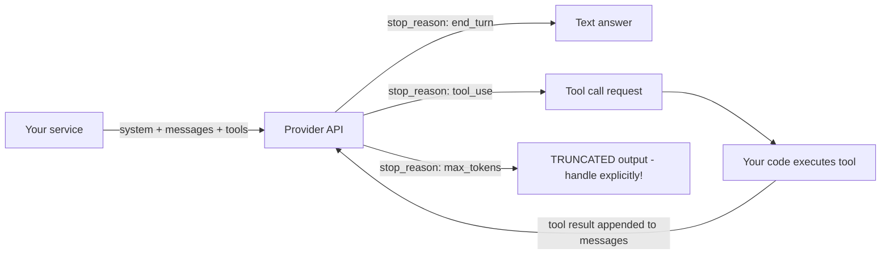
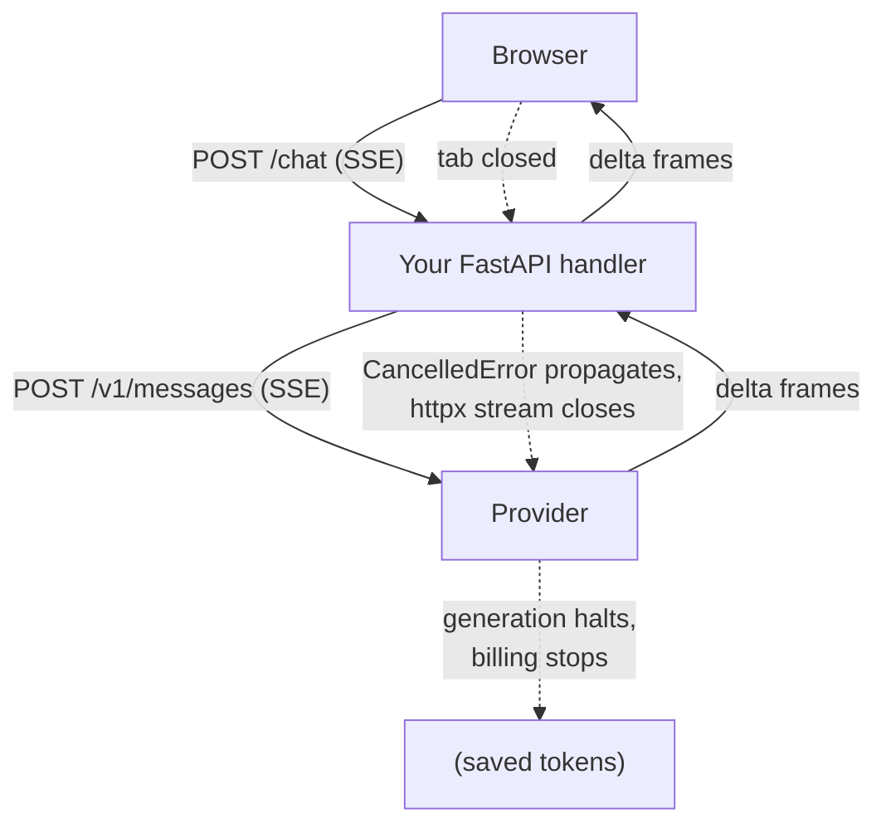

# Model API Engineering

A foundation model behind an HTTP API is the least reliable dependency in your stack: it is slow (seconds, not milliseconds), rate-limited, priced per token, occasionally overloaded, and nondeterministic. Treating it like "just another REST call" is the root cause of most GenAI production incidents. This guide covers the client-side engineering discipline — request anatomy, token accounting, streaming mechanics, timeouts, retries, rate limiting, fallbacks, hedging, and batching — and ends with a complete production-grade async client you can adapt to any provider.

Everything here is provider-neutral. Provider SDKs differ in field names, but the underlying mechanics (messages, tokens, SSE streams, 429s) are identical, and your resilience layer should be written against your own abstraction, not against any vendor's SDK.

Part of the [Senior AI Engineer Roadmap](../00-Senior-AI-Engineer-Roadmap.md) — Phase 5.

---

## 1. Anatomy of a Model API

Every major provider converges on the same request shape:

```jsonc
{
  "model": "large-model-v2",
  "system": "You are a claims triage assistant...",   // the application contract
  "messages": [
    {"role": "user", "content": "..."},
    {"role": "assistant", "content": "..."},          // prior turns
    {"role": "user", "content": "..."}
  ],
  "tools": [                                          // optional: tool schemas
    {
      "name": "lookup_policy",
      "description": "Fetch a policy record by ID",
      "input_schema": {
        "type": "object",
        "properties": {"policy_id": {"type": "string"}},
        "required": ["policy_id"]
      }
    }
  ],
  "max_tokens": 1024,
  "temperature": 0.0
}
```

The parts that matter architecturally:

* **System prompt** — owned by engineering, versioned like code. It carries the role, constraints, output contract, and refusal policy. It is *not* user input.
* **Messages** — an alternating conversation transcript. The model is stateless: you send the entire history every call. This is why context management (guide 03) and token accounting (below) exist.
* **Roles** — `user` (untrusted input), `assistant` (prior model output), and tool-result roles. The role structure is a trust boundary: content in `user`/tool messages must never be treated as instructions (see guide 17 for injection defenses).
* **Tool schemas** — JSON Schema declarations of functions the model may request. Tool descriptions are effectively prompt material: the model reads them to decide when and how to call. Sloppy descriptions cause sloppy calls.
* **Sampling parameters** — `temperature`, `top_p`, `max_tokens`. For machine-consumed output use temperature 0 (or near it) and always set `max_tokens`: an unbounded generation is an unbounded bill and an unbounded latency.



`stop_reason` is the most under-checked field in the response. `max_tokens` as a stop reason means the output was cut off mid-thought — parsing it as if it were complete is a classic silent-corruption bug.

---

## 2. Token Accounting, Deeply

Tokens are the unit of **cost**, **latency**, and **capacity**. A senior engineer can answer, for any request: how many tokens went in, how many came out, what it cost, and how close it came to the context limit.

### 2.1 What counts against the context window

* The system prompt — every single call.
* All messages — the full conversation history, resent each turn.
* Tool schemas — serialized into the prompt by the provider; ten verbose tools can cost 2-4k tokens per call before the user says a word.
* Tool results you append.
* The output — `max_tokens` must fit inside `context_limit - input_tokens`.

A 10-turn conversation does not cost 10 × (one turn). It costs roughly the *triangular sum* of the history: turn *n* resends turns 1..n-1. Input token spend in chat products grows quadratically with conversation length unless you window or summarize.

### 2.2 Context budgeting with a real tokenizer

Never budget by `len(text) // 4`. Use a tokenizer and enforce budgets before the call fails server-side (a 400 for an over-long prompt is not retryable — you must shrink the request).

```python
"""Context budgeting with a tokenizer.

pip install tiktoken   # provider-neutral BPE tokenizer; close enough for
                       # budgeting even when the target model differs slightly.
Expected behavior: build_context() always returns a message list that fits
the budget, dropping oldest turns first but never the system prompt or the
latest user message.
"""
import tiktoken

ENC = tiktoken.get_encoding("cl100k_base")

def count_tokens(text: str) -> int:
    return len(ENC.encode(text))

def message_tokens(msg: dict) -> int:
    # ~4 tokens of per-message framing overhead is a good cross-provider estimate.
    return count_tokens(msg["content"]) + 4

def build_context(
    system: str,
    history: list[dict],          # oldest -> newest, last item is current user msg
    context_limit: int = 200_000,
    max_output_tokens: int = 4_096,
    safety_margin: int = 500,     # tokenizer mismatch insurance
) -> list[dict]:
    budget = context_limit - max_output_tokens - safety_margin - count_tokens(system)
    if budget <= 0:
        raise ValueError("System prompt alone exceeds the context budget")

    # Walk history newest-first, keep what fits. The newest user message is
    # mandatory; if it alone does not fit, that is a hard error, not a truncation.
    kept: list[dict] = []
    remaining = budget
    for msg in reversed(history):
        t = message_tokens(msg)
        if t > remaining:
            if not kept:  # even the latest message doesn't fit
                raise ValueError(f"Latest message ({t} tokens) exceeds budget {budget}")
            break
        kept.append(msg)
        remaining -= t
    return list(reversed(kept))

# Expected: with a tiny budget, only the newest messages survive.
history = [{"role": "user", "content": "old " * 500},
           {"role": "assistant", "content": "old answer " * 500},
           {"role": "user", "content": "What is the refund policy?"}]
msgs = build_context("You are a support bot.", history,
                     context_limit=1200, max_output_tokens=300, safety_margin=50)
assert msgs[-1]["content"] == "What is the refund policy?"
```

### 2.3 Truncation strategies, ranked

1. **Drop oldest turns** (above) — simplest; loses long-range context.
2. **Summarize-then-drop** — replace evicted turns with a model-written summary message; preserves gist at the cost of an extra call (guide 03 covers this in depth).
3. **Structured state** — extract the *facts* (order ID, user goal, decisions made) into a state object and render it into the system prompt; the transcript itself becomes disposable. Best for task-oriented agents.
4. **Middle-out truncation** for single long documents — models attend best to the start and end of context ("lost in the middle"); if you must cut a document, cut the middle and say so in the prompt: `[... 40 pages omitted ...]`.

Never truncate silently. Truncation is a data-loss event; log it and, when quality matters, surface it.

---

## 3. Streaming Mechanics

Streaming does not make generation faster; it moves time-to-first-token (TTFT) from "after the whole answer" to ~0.5-2s. For humans watching a chat UI this is the difference between "instant" and "broken". For machine-to-machine calls it usually adds complexity for nothing, because you must buffer and validate the full output anyway.

### 3.1 SSE on the wire

Providers stream over Server-Sent Events: a long-lived HTTP response with `Content-Type: text/event-stream`, emitting frames like:

```text
event: content_block_delta
data: {"delta": {"text": "The refund"}}

event: content_block_delta
data: {"delta": {"text": " policy allows"}}

event: message_stop
data: {"usage": {"input_tokens": 812, "output_tokens": 214}}
```

Key mechanics you must handle:

* **Chunk assembly** — TCP does not respect frame boundaries. One `read()` may contain half an SSE frame or three of them. Buffer bytes, split on the blank-line frame delimiter (`\n\n`), parse complete frames only.
* **Usage arrives last** — token counts come in the final event. If the stream dies mid-way you have no authoritative usage; estimate from what you buffered and flag the record.
* **Partial JSON** — if the model is emitting a JSON object, every prefix of it is invalid JSON. Options: (a) buffer fully, validate at the end (right answer for pipelines); (b) stream a display-only text field while the structured payload arrives at the end; (c) use an incremental JSON parser to progressively render fields (worth it only for rich UIs).
* **Cancellation propagation** — when the end user closes the tab, your server must close the upstream connection, otherwise you keep paying for tokens nobody will read. In `asyncio`, client disconnect raises `CancelledError` in the handler; you must let it propagate to the httpx stream (closing it), not swallow it.

```python
"""Minimal SSE consumer with correct frame assembly and cancellation.

Expected behavior: yields text deltas as they arrive; on cancellation the
upstream HTTP connection closes (stopping the meter); on completion returns
usage via the `usage` dict the caller passed in.
"""
import json
import httpx

async def stream_completion(client: httpx.AsyncClient, payload: dict, usage: dict):
    async with client.stream("POST", "/v1/messages", json=payload) as resp:
        resp.raise_for_status()
        buffer = b""
        async for chunk in resp.aiter_bytes():
            buffer += chunk
            while b"\n\n" in buffer:                 # complete SSE frame available
                frame, buffer = buffer.split(b"\n\n", 1)
                for line in frame.split(b"\n"):
                    if not line.startswith(b"data: "):
                        continue
                    data = json.loads(line[6:])
                    if text := data.get("delta", {}).get("text"):
                        yield text                   # forward downstream immediately
                    if u := data.get("usage"):
                        usage.update(u)              # final frame carries usage
    # Exiting the `async with` (including via CancelledError) closes the
    # connection -> provider stops generating -> billing stops.
```



---

## 4. Robust Client Engineering

### 4.1 Timeouts: connect vs read vs total

One number is not a timeout policy. httpx distinguishes:

* **connect** — TCP+TLS establishment. Should be short (3-5s); a slow connect means network trouble, not a slow model.
* **read** — gap between bytes. For streaming this is the *inter-chunk* timeout; a healthy stream emits every few hundred ms, so 30s of silence means the stream is dead even if the socket is open.
* **write / pool** — request-body send and connection-pool acquisition; pool timeout matters under load (waiting forever for a pool slot is a hidden queue).
* **total deadline** — you must enforce this yourself (e.g., `asyncio.timeout`): a stream that trickles a token every 20s never trips the read timeout but can run for an hour.

```python
import httpx
TIMEOUT = httpx.Timeout(connect=5.0, read=30.0, write=10.0, pool=10.0)
# plus, around the whole call:  async with asyncio.timeout(120): ...
```

### 4.2 Retries: which errors, and how

Retry decision table:

| Status | Retry? | Why |
|---|---|---|
| 429 rate limit | Yes, honor `Retry-After` | Transient by definition |
| 500 / 502 / 503 / 529 overloaded | Yes | Provider-side transient |
| Connect/read timeout | Yes (see idempotency below) | Network transient |
| 400 bad request | **No** | Your request is malformed; identical retry = identical failure, paid again |
| 401 / 403 | **No** | Credentials/permissions; retrying is noise |
| Content-policy refusal (200 with refusal text) | **No** | Same input → same refusal; burns money |

Backoff must be **exponential with full jitter**: `delay = uniform(0, base * 2^attempt)`, capped. Without jitter, every client that failed at the same moment retries at the same moment — a synchronized retry storm that keeps the provider (or your own gateway) down. This is the classic thundering-herd self-DDoS.

**Idempotency**: a generation request is not idempotent — a timed-out request may have completed server-side and been billed. For cost that is usually acceptable; for *side-effecting* flows (the model output triggers an email, a refund) retries must be gated by your own idempotency key around the downstream action, never around the model call alone.

### 4.3 Client-side rate limiting

Waiting to be 429'd is the worst rate-limit strategy: you pay latency for rejected requests and risk provider-side penalties. Shape traffic client-side:

* **Concurrency semaphore** — cap simultaneous in-flight requests. Protects your worker pool and matches provider per-connection expectations.
* **Token bucket** — cap requests-per-minute (and, in serious systems, tokens-per-minute) to just under your provider quota.

Both are implemented in the complete client below.

### 4.4 Fallback chains and hedging

**Fallback chain**: primary model → alternate provider/model → cached or templated answer → explicit degraded failure. Each hop trades quality for availability. Critical detail: the fallback must be *tested regularly* (send it a trickle of live traffic), or it will be broken exactly when you need it.

**Request hedging**: fire a second request to another provider if the first hasn't answered within e.g. the p95 latency; take the first response, cancel the loser. Cuts tail latency dramatically, but: it costs up to 2× tokens on hedged requests, doubles load exactly when the provider is slow (i.e., struggling), and is only sane for idempotent, latency-critical, cheap calls. Default to *no*; hedge only with a strict hedge-rate budget (e.g., ≤5% of requests).

### 4.5 Batch APIs

Providers offer async batch endpoints (submit a file of requests, poll, download results) at typically ~50% discount with hour-scale SLAs. Use them for anything without a human waiting: nightly enrichment, backfills, evals, bulk classification/extraction. The discount exists because batch traffic soaks up idle capacity — it is the single cheapest cost lever that requires zero prompt changes.

---

## 5. A Complete Production-Grade Async Client

```python
"""llm_client.py — provider-neutral resilient async LLM client.

Dependencies: pip install httpx
Python 3.11+ (asyncio.timeout).

Design:
  * ProviderAdapter: the ONLY provider-specific code (URL, auth, payload shape).
  * ResilientLLMClient: timeouts, total deadline, retries w/ exponential
    backoff + full jitter, Retry-After honoring, token-bucket rate limiting,
    concurrency semaphore, fallback chain, usage accounting.

Expected behavior:
  * generate() returns LLMResponse or raises AllProvidersFailed.
  * 429/5xx/timeouts are retried per provider (max_attempts), then the next
    provider in the chain is tried. 400/401/403 fail fast to the next provider
    only if the error is provider-specific, else raise immediately.
  * Never exceeds `rpm` requests/minute or `max_concurrency` in-flight.
"""
from __future__ import annotations

import asyncio
import dataclasses
import logging
import random
import time
import uuid

import httpx

log = logging.getLogger("llm_client")

# --------------------------------------------------------------------------- #
# Data types
# --------------------------------------------------------------------------- #
@dataclasses.dataclass
class Usage:
    input_tokens: int = 0
    output_tokens: int = 0

@dataclasses.dataclass
class LLMResponse:
    text: str
    model: str
    provider: str
    usage: Usage
    stop_reason: str
    request_id: str
    latency_ms: float

class LLMError(Exception):
    def __init__(self, msg: str, *, status: int | None = None, retryable: bool = False):
        super().__init__(msg)
        self.status = status
        self.retryable = retryable

class AllProvidersFailed(Exception):
    pass

RETRYABLE_STATUSES = {429, 500, 502, 503, 504, 529}

# --------------------------------------------------------------------------- #
# Provider adapter — the only vendor-specific surface
# --------------------------------------------------------------------------- #
@dataclasses.dataclass
class ProviderAdapter:
    name: str
    base_url: str
    api_key: str
    model: str

    def build_request(self, system: str, messages: list[dict],
                      max_tokens: int, temperature: float) -> dict:
        # Adjust per vendor; this shape matches the common messages API style.
        return {
            "url": "/v1/messages",
            "headers": {"authorization": f"Bearer {self.api_key}"},
            "json": {
                "model": self.model,
                "system": system,
                "messages": messages,
                "max_tokens": max_tokens,
                "temperature": temperature,
            },
        }

    def parse_response(self, data: dict) -> tuple[str, Usage, str]:
        text = "".join(b.get("text", "") for b in data.get("content", []))
        u = data.get("usage", {})
        usage = Usage(u.get("input_tokens", 0), u.get("output_tokens", 0))
        return text, usage, data.get("stop_reason", "end_turn")

# --------------------------------------------------------------------------- #
# Token-bucket rate limiter (requests/minute)
# --------------------------------------------------------------------------- #
class TokenBucket:
    """Async token bucket. acquire() waits until a request slot is available.

    Expected behavior: at rpm=60, sustained callers proceed ~1/sec; bursts up
    to `burst` pass immediately after idle periods.
    """
    def __init__(self, rpm: int, burst: int | None = None):
        self.rate = rpm / 60.0
        self.capacity = float(burst or max(1, rpm // 10))
        self.tokens = self.capacity
        self.last = time.monotonic()
        self._lock = asyncio.Lock()

    async def acquire(self) -> None:
        while True:
            async with self._lock:
                now = time.monotonic()
                self.tokens = min(self.capacity, self.tokens + (now - self.last) * self.rate)
                self.last = now
                if self.tokens >= 1:
                    self.tokens -= 1
                    return
                wait = (1 - self.tokens) / self.rate
            await asyncio.sleep(wait)      # sleep OUTSIDE the lock

# --------------------------------------------------------------------------- #
# The resilient client
# --------------------------------------------------------------------------- #
class ResilientLLMClient:
    def __init__(
        self,
        providers: list[ProviderAdapter],       # fallback order: [primary, ...]
        *,
        max_concurrency: int = 8,
        rpm: int = 300,
        max_attempts: int = 4,                  # per provider
        base_delay: float = 1.0,
        max_delay: float = 30.0,
        total_deadline_s: float = 120.0,
        timeout: httpx.Timeout = httpx.Timeout(connect=5, read=60, write=10, pool=10),
    ):
        assert providers, "need at least one provider"
        self.providers = providers
        self.semaphore = asyncio.Semaphore(max_concurrency)
        self.bucket = TokenBucket(rpm)
        self.max_attempts = max_attempts
        self.base_delay = base_delay
        self.max_delay = max_delay
        self.total_deadline_s = total_deadline_s
        self._clients = {
            p.name: httpx.AsyncClient(base_url=p.base_url, timeout=timeout)
            for p in providers
        }

    async def aclose(self) -> None:
        for c in self._clients.values():
            await c.aclose()

    # ------------------------------------------------------------------ #
    async def generate(self, *, system: str, messages: list[dict],
                       max_tokens: int = 1024, temperature: float = 0.0) -> LLMResponse:
        request_id = str(uuid.uuid4())
        errors: list[str] = []
        async with asyncio.timeout(self.total_deadline_s):   # hard total deadline
            for provider in self.providers:
                try:
                    return await self._call_with_retries(
                        provider, request_id, system, messages, max_tokens, temperature)
                except LLMError as e:
                    errors.append(f"{provider.name}: {e}")
                    log.warning("provider %s failed (%s); trying next", provider.name, e)
        raise AllProvidersFailed(f"request {request_id}: {errors}")

    # ------------------------------------------------------------------ #
    async def _call_with_retries(self, p: ProviderAdapter, request_id: str,
                                 system: str, messages: list[dict],
                                 max_tokens: int, temperature: float) -> LLMResponse:
        last: LLMError | None = None
        for attempt in range(self.max_attempts):
            await self.bucket.acquire()                 # shape traffic first
            async with self.semaphore:                  # then cap concurrency
                start = time.monotonic()
                try:
                    return await self._call_once(p, request_id, system, messages,
                                                 max_tokens, temperature, start)
                except LLMError as e:
                    last = e
                    if not e.retryable:
                        raise                            # 400/401/403: fail fast
            # Exponential backoff + FULL jitter; honor Retry-After when we saw 429.
            delay = min(self.max_delay, random.uniform(0, self.base_delay * 2 ** attempt))
            if last.status == 429 and getattr(last, "retry_after", None):
                delay = max(delay, last.retry_after)
            log.info("retry %d/%d for %s in %.2fs (%s)",
                     attempt + 1, self.max_attempts, p.name, delay, last)
            await asyncio.sleep(delay)
        raise last  # retries exhausted on this provider

    async def _call_once(self, p: ProviderAdapter, request_id: str,
                         system: str, messages: list[dict],
                         max_tokens: int, temperature: float, start: float) -> LLMResponse:
        req = p.build_request(system, messages, max_tokens, temperature)
        client = self._clients[p.name]
        try:
            resp = await client.post(req["url"], headers=req["headers"], json=req["json"])
        except (httpx.TimeoutException, httpx.TransportError) as e:
            raise LLMError(f"transport: {e!r}", retryable=True) from e

        if resp.status_code != 200:
            err = LLMError(f"HTTP {resp.status_code}: {resp.text[:200]}",
                           status=resp.status_code,
                           retryable=resp.status_code in RETRYABLE_STATUSES)
            if resp.status_code == 429 and (ra := resp.headers.get("retry-after")):
                err.retry_after = float(ra)             # type: ignore[attr-defined]
            raise err

        text, usage, stop_reason = p.parse_response(resp.json())
        if stop_reason == "max_tokens":
            log.warning("request %s truncated at max_tokens=%d", request_id, max_tokens)
        return LLMResponse(
            text=text, model=p.model, provider=p.name, usage=usage,
            stop_reason=stop_reason, request_id=request_id,
            latency_ms=(time.monotonic() - start) * 1000,
        )

# --------------------------------------------------------------------------- #
# Usage example
# --------------------------------------------------------------------------- #
async def main() -> None:
    client = ResilientLLMClient(
        providers=[
            ProviderAdapter("primary",  "https://api.provider-a.example", "KEY_A", "large-model-v2"),
            ProviderAdapter("fallback", "https://api.provider-b.example", "KEY_B", "medium-model-v3"),
        ],
        max_concurrency=8, rpm=300,
    )
    try:
        resp = await client.generate(
            system="You are a concise assistant.",
            messages=[{"role": "user", "content": "Summarize SSE in one sentence."}],
            max_tokens=200,
        )
        # Expected: LLMResponse with provider="primary" under normal conditions;
        # provider="fallback" if provider A exhausts retries; AllProvidersFailed
        # (after <=120s) if both are down.
        print(resp.provider, resp.usage, resp.text)
    finally:
        await client.aclose()

if __name__ == "__main__":
    asyncio.run(main())
```

Order of operations inside the client is deliberate: **rate limit → semaphore → call**. Acquiring the semaphore before the bucket would let a slow bucket hold concurrency slots hostage; the reverse lets shaped requests queue cheaply.

---

## Production War Stories & Failure Modes

### Incident 1: The synchronized retry storm

* **Symptom**: Provider had a 90-second blip returning 529s. Instead of recovering in 90 seconds, the product was down for 40 minutes with the provider returning 429s only to *us*.
* **Investigation**: Request logs showed traffic arriving in clean spikes every 1, 2, 4, 8 seconds after the blip — thousands of requests landing in the same 100ms windows.
* **Root cause**: Retry code used exponential backoff *without jitter*. Every client that failed at T=0 retried at exactly T+1, T+3, T+7... The synchronized waves tripped the provider's rate limiter, whose 429s were themselves retried in sync. A second bug amplified it: 429 responses were retried immediately "because Retry-After was absent".
* **Fix**: Full jitter (`uniform(0, base * 2^n)`), a retry cap of 4, and a client-side token bucket set to 80% of the provider quota so the fleet cannot collectively exceed it.
* **Prevention**: Load-test the failure path, not just the happy path: inject 60s of forced 529s in staging and watch the traffic shape. A retry policy you have never seen fire under load is an outage waiting for a trigger.

### Incident 2: The 400 that cost $11,000

* **Symptom**: Monthly bill tripled; no traffic growth. Error rate dashboards green (errors were "handled").
* **Investigation**: Token metering by feature showed one batch enrichment job consuming 60% of spend. Its logs showed near-100% retry exhaustion — every request attempted 5 times.
* **Root cause**: A schema change made the job send a `messages` array with an empty content field — a 400 every time. The retry helper retried *all* non-200s, including 400s. Worse, the 400 arrived *after* input processing on some paths, so some attempts billed input tokens. 5 attempts × millions of rows × weeks.
* **Fix**: Retry only 429/5xx/timeouts; 4xx fails fast and pages. Added a circuit breaker: if a job's error rate exceeds 20% over 5 minutes, halt the job.
* **Prevention**: Cost-per-*successful*-task alerting. Total-spend alerts fired too late; spend-per-success went 5× on day one and nobody was looking at it.

### Incident 3: Ghost generations after tab close

* **Symptom**: Token spend ~30% higher than what users plausibly read; support tickets about "sluggish" chat during peak.
* **Investigation**: Compared provider-billed output tokens to tokens actually delivered to browsers: large gap. Traced individual sessions: users asked a question, closed the tab, but the server-side stream ran to completion — sometimes 2,000+ more tokens.
* **Root cause**: The FastAPI streaming handler wrapped the upstream stream in `try/except Exception` and, on the client-disconnect `CancelledError` (which one code path swallowed via a broad except), continued draining the provider stream "to log the full response". Cancellation never propagated; every abandoned chat ran to completion. The drained streams also held connection-pool slots, causing the peak-time sluggishness.
* **Fix**: Let `CancelledError` propagate; the `async with client.stream(...)` block closes the connection on exit, halting generation and billing. Log whatever was buffered at cancellation time, flagged as partial.
* **Prevention**: A "delivered tokens vs billed tokens" ratio metric with an alert; chaos test that kills client connections mid-stream and asserts upstream closure within 1s.

### Incident 4: Truncation shipped as truth

* **Symptom**: A contract-summarization feature intermittently produced summaries that simply omitted the final sections. No errors anywhere.
* **Investigation**: Sampled bad outputs; every one ended mid-sentence-ish but grammatically plausibly. Checked responses: `stop_reason == "max_tokens"` on 7% of requests.
* **Root cause**: `max_tokens=1024` was fine at launch; a prompt change ("be more detailed") pushed long documents past it. Nobody checked `stop_reason`, so truncated outputs were stored as complete summaries.
* **Fix**: Treat `stop_reason == "max_tokens"` as an error for this feature: retry once with a higher cap, else route to a map-reduce summarization path (guide 05).
* **Prevention**: The client logs a warning on truncation (see code above) and the gateway exports a `truncation_rate` metric per feature; any nonzero rate on "completeness matters" features pages.

---

## Best Practices

* Set `max_tokens`, a connect/read timeout, a total deadline, and a retry cap on **every** call — an LLM call missing any one of these is a production bug, not a style issue.
* Retry only 429/5xx/timeouts, with exponential backoff and full jitter; honor `Retry-After`; never retry 400s or content refusals.
* Check `stop_reason` on every response; `max_tokens` means truncated output and must be handled explicitly.
* Shape traffic client-side (token bucket at ~80% of quota + concurrency semaphore) instead of discovering limits via 429s.
* Budget context with a real tokenizer and a safety margin; never truncate silently.
* Keep the full conversation-resend cost model in mind: chat input spend grows quadratically with turns — window or summarize.
* Write all resilience logic against your own thin provider adapter, never against a vendor SDK scattered through business logic.
* Maintain a tested fallback chain (trickle live traffic to it) and treat hedging as a scalpel with a hedge-rate budget, not a default.
* Route non-urgent work to batch APIs — ~50% cost reduction with zero prompt changes.
* Propagate cancellation end-to-end: user disconnect must close the upstream stream within a second.
* Meter tokens and attribute cost per tenant/feature; alert on cost-per-successful-task, not just total spend.

---

## Interview Drills

<details><summary>Why does exponential backoff need jitter, and what kind of jitter would you use?</summary>

Without jitter, all clients that failed at the same moment (which is exactly what happens when a provider blips) retry at the same deterministic instants — T+1s, T+2s, T+4s — producing synchronized load waves that re-trigger the failure: a thundering herd. Full jitter (`delay = uniform(0, base * 2^attempt)`) decorrelates clients completely and empirically drains retry queues fastest (per the classic AWS analysis). Equal jitter (`base*2^n/2 + uniform(0, base*2^n/2)`) is a compromise if you need a minimum wait.

**Follow-up: your provider sends `Retry-After: 20` but your jittered delay computed 3s — which wins?** Retry-After wins as a floor: `delay = max(jittered, retry_after)`. The header is the provider telling you when capacity returns; retrying earlier is a wasted, possibly penalized request.

**Follow-up: where should the retry cap live when you also have a fallback chain?** Per provider, and small (3-4). Total worst-case latency is `providers × attempts × (timeout + delay)` — compute it and check it fits inside your total deadline, or the fallback chain never gets a chance before the deadline fires.
</details>

<details><summary>Which HTTP errors from a model API should you retry, and which never?</summary>

Retry: 429 (honoring Retry-After), 500/502/503/504/529, and transport-level timeouts — all transient. Never retry: 400 (your request is malformed; identical input yields identical failure and you may pay input tokens each attempt), 401/403 (credentials — page a human), and content-policy refusals that arrive as HTTP 200 (same input → same refusal; retrying burns money and adds latency).

**Follow-up: a read timeout — did the request fail?** Unknown. The provider may have completed and billed the generation; your retry is a second, separately billed generation. For pure generation that duplicate cost is acceptable; if the output triggers side effects (send email, issue refund), the *action* must be deduplicated with your own idempotency key — retrying the model call alone is not safe.

**Follow-up: how do you stop a systematically failing job from retrying its way through your budget?** A circuit breaker above the retry layer: if error rate over a sliding window exceeds a threshold, halt/open the circuit and page. Retries handle transient failure; breakers handle persistent failure.
</details>

<details><summary>Walk me through what counts against the context window in a tool-using chat turn.</summary>

Everything: the system prompt (resent every call), the entire message history (the API is stateless), the serialized tool schemas (names, descriptions, JSON Schemas — easily 2-4k tokens for a rich toolset), any tool results appended as messages, and the reserved output budget (`max_tokens` must fit in what remains). People forget tool schemas most often — adding "just three more tools" can silently push long conversations over the limit.

**Follow-up: why does chat input cost grow quadratically?** Turn *n* resends turns 1..n-1, so total input tokens across a conversation is a triangular sum, ~O(n²) in turns. Mitigations: windowing, summarize-then-drop, structured state, and provider prompt caching for the static prefix.
</details>

<details><summary>Does streaming reduce latency?</summary>

Not total latency — the model generates at the same tokens/second either way. It reduces *time-to-first-token*, which transforms perceived latency for a human watching text render. For machine-to-machine calls it typically adds complexity for no benefit: you must buffer the full output to validate it, and partial JSON is unparseable until the last token anyway.

**Follow-up: when would you stream a machine-consumed response anyway?** When a total deadline is tight and you want to fail fast on a dead connection (inter-chunk read timeout detects stalls early), or when you can act on a streamed *prefix* — e.g., the first classification field of a JSON object via an incremental parser — to start downstream work early. Both are optimizations to add only with evidence.
</details>

<details><summary>How would you implement client-side rate limiting for an asyncio service calling a model API?</summary>

Two mechanisms, layered: a token bucket for requests/minute (refill at `rpm/60` per second, capacity = allowed burst; acquire waits for a token) set to ~80% of the provider quota so the whole fleet cannot collectively exceed it; and a semaphore capping concurrent in-flight requests, protecting both the provider connection expectations and your own worker pool. Acquire the bucket *before* the semaphore so throttled requests wait without holding concurrency slots.

**Follow-up: the provider limits tokens/minute, not just requests/minute.** Extend the bucket to weighted acquisition: `acquire(estimated_tokens)` using tokenizer-estimated input + `max_tokens`, and reconcile with actual usage after the response to correct drift.

**Follow-up: you run 12 replicas — where does the bucket live?** A local bucket at quota/12 wastes headroom when load is skewed. Options: a shared bucket in Redis (atomic Lua refill-and-take), or route all model traffic through the AI gateway (guide 04) and rate-limit at that single choke point — usually the cleanest answer.
</details>

<details><summary>Design the timeout policy for a streaming LLM call end-to-end.</summary>

Four layers: connect timeout ~5s (TCP/TLS; slow connect = network problem, fail fast to retry/fallback); read timeout ~30s interpreted as *inter-chunk* silence for streams (healthy streams emit every few hundred ms); pool timeout so requests don't queue invisibly for a connection slot; and a self-enforced total deadline (`asyncio.timeout`) because a stream trickling one token every 20s never trips the read timeout yet can run indefinitely. The total deadline must exceed `worst-case attempts × (read timeout + max backoff)` across the fallback chain or fallbacks never execute.

**Follow-up: what happens to the provider-side generation when your deadline fires?** Only if you close the connection does generation halt. `asyncio.timeout` cancels the task; ensure cancellation propagates so the `async with stream` closes the socket — a swallowed CancelledError means you keep paying for a response nobody will receive.
</details>

<details><summary>What is request hedging and when is it a bad idea?</summary>

Send a duplicate request to a second provider/model if the first hasn't responded by some percentile latency (e.g., p95); take whichever answers first and cancel the other. It's a powerful tail-latency cut. It's a bad idea when: requests are expensive (you pay ~2× on hedged calls), the provider is slow because it's overloaded (hedging doubles load at the worst moment — anti-stability), outputs trigger side effects (two completions racing), or responses differ across models in ways downstream code notices. Sane deployment: only for cheap, idempotent, latency-critical calls, with a hedge-rate budget (≤5%) and monitoring on how often hedges win.

**Follow-up: hedging vs fallback — the difference?** Fallback is sequential (try B after A *fails*), optimizing availability at the cost of added latency on failure. Hedging is parallel (try B while A is *slow*), optimizing tail latency at the cost of extra spend. Production systems usually want fallback always, hedging rarely.
</details>

<details><summary>Your monthly LLM bill doubled with flat traffic. Debug it.</summary>

Attribution first — token metering per feature/tenant/prompt-version (if you don't have it, that's finding #1). Then the usual suspects in likelihood order: (1) retry amplification — a failing job retrying non-retryable errors N times; check attempts-per-request; (2) prompt growth — a deploy added few-shot examples/tools to the system prompt, multiplying every call's input; diff prompt versions by token count; (3) conversation-length growth — history windowing broke or users' sessions lengthened (quadratic input growth); (4) `max_tokens` raised or a verbose new model emitting longer outputs; (5) cache regression — a cache-key change (e.g., adding a timestamp) silently zeroing the hit rate; (6) truncation-driven re-asks by users. The prevention for all of them is the same: cost-per-successful-task per feature, alerted on relative change.

**Follow-up: which single metric catches most of these early?** Cost per successful task, per feature. Total spend hides mix shifts; per-request cost hides retry storms (failed requests still bill); per-success unifies both.
</details>

<details><summary>Explain how you'd correctly consume an SSE stream over raw HTTP.</summary>

Read bytes, append to a buffer, and only parse *complete frames* — split on the blank-line delimiter (`\n\n`) — because TCP chunk boundaries don't align with SSE frame boundaries: one read may hold half a frame or three. For each frame, extract `data:` lines, JSON-parse them, dispatch by event type. Handle: usage arriving only in the terminal event (a mid-stream death leaves you estimating usage from the buffer), reconnection/resume if supported, and cancellation closing the underlying socket. In httpx: `async with client.stream(...)` + `aiter_bytes()` and let the context manager close on exit or cancellation.

**Follow-up: the model is streaming a JSON object — how do you show progress?** Three options by effort: buffer fully and validate at the end (pipelines — correct default); split the contract so a human-readable text field streams and the structured object arrives complete at the end; or an incremental JSON parser that yields fields as they close (rich UIs only). Never hand a partial JSON prefix to `json.loads` in a loop and treat failures as flow control — quadratic reparsing and impossible error handling.
</details>

<details><summary>Why put a thin adapter between your code and provider SDKs, when the SDK already handles retries?</summary>

Because the SDK's resilience is per-vendor and configured per call-site: five call sites become five inconsistent policies, and switching providers becomes a codebase-wide rewrite. A thin adapter gives one place for the request/response mapping, while *your* layer owns timeouts, retries, rate shaping, fallback across vendors (which no single vendor's SDK will ever do), metering, and logging — uniformly. It also makes model swaps a config change and lets you unit-test resilience logic against a fake adapter.

**Follow-up: isn't this just NIH? Why not a framework like LangChain?** The adapter is ~50 lines; the resilience layer is a few hundred you must understand deeply either way, because its failure modes (retry storms, swallowed cancellations) are *your* outages. Frameworks are fine for prototyping; in production you need to own the policy layer's exact semantics. Using a framework *as* the adapter while owning the policy layer yourself is a defensible middle ground.
</details>

<details><summary>When do batch APIs beat real-time calls, and what changes architecturally?</summary>

Whenever no human is waiting: backfills, nightly enrichment, evals, bulk classification/extraction, report generation. Providers discount ~50% because batch soaks idle capacity, with hour-scale completion SLAs. Architecturally you shift from request/response to job orchestration: submit a batch, persist the batch ID, poll or webhook for completion, download and join results back to your records by custom ID, handle per-item failures (a batch can partially succeed), and make resubmission idempotent. Your pipeline must tolerate results arriving hours later and out of order.

**Follow-up: a product manager wants "near-real-time" enrichment — batch or not?** Interrogate the freshness requirement in numbers. If "near-real-time" means minutes-to-an-hour, a micro-batching tier (accumulate 5-15 minutes, submit small batches) may capture most of the discount. If it means seconds, batch is out; consider a cheaper/smaller model instead (guide 05's cascade pattern) to recover the cost difference.
</details>

<details><summary>What does `stop_reason: "max_tokens"` mean and why is ignoring it dangerous?</summary>

Generation halted because it hit your output cap — the response is truncated mid-thought, not complete. Danger: truncated text often looks plausible (it ends at a sentence-ish boundary), so downstream code stores an incomplete summary as complete, or a truncated JSON object fails parsing with a confusing error far from the cause. Handling: log and export a truncation-rate metric per feature; for completeness-critical features treat it as an error — retry with a larger cap or switch to a chunked strategy; for JSON outputs, truncation is *the* first hypothesis when parse errors spike.

**Follow-up: why not just set `max_tokens` very high everywhere?** It's your cost and latency circuit breaker — a runaway generation (e.g., a model stuck repeating) bills until the cap. Set it per feature: comfortably above the p99 *legitimate* output length, not at the context ceiling.
</details>

<details><summary>How do tool schemas influence model behavior, and what are the engineering consequences?</summary>

Tool name, description, and parameter schema are serialized into the prompt — they *are* prompt material. The model chooses tools by reading descriptions, so vague descriptions cause wrong-tool calls and missing constraint documentation causes malformed arguments. Consequences: (1) write descriptions like docs for a junior engineer — when to use, when *not* to, with argument examples in the description; (2) tool schemas cost input tokens on every call — a 15-tool registry can burn thousands of tokens per request, so scope the toolset per feature rather than sending everything; (3) tool definitions need versioning and regression tests exactly like prompts (guide 03) — renaming a tool or tightening a parameter is a behavior change that can silently break call rates.

**Follow-up: the model keeps calling a tool with an invalid enum value — fixes in order of preference?** First fix the schema-as-prompt: put the allowed values and an example in the parameter description, not just the JSON Schema `enum`. Second, validate and feed the error back for one retry (guide 02's retry-on-invalid). Third, if the value space is small, restructure so the model picks an option ID from a provided list instead of generating the value. Constrained decoding, where available, eliminates the failure class entirely.
</details>

<details><summary>Sketch the fallback chain for a customer-facing chat feature and justify each hop.</summary>

(1) Primary: the large model — best quality. (2) Alternate: a different provider/model tier with the *per-model prompt variant* (prompts don't transfer verbatim — guide 03) — availability at slight quality cost. (3) Cached/templated degraded answer: for classifiable intents, a curated response ("I can't generate a full answer right now; here's the relevant help article") — availability with honesty. (4) Explicit failure with a retry affordance — never a spinner that hangs. Each hop must be *exercised* (a trickle of synthetic or shadow traffic through the fallback path weekly), because an untested fallback is a second outage discovered during the first. The gateway (guide 04) owns the chain so every feature inherits it.

**Follow-up: should fallback be automatic on content-policy refusals?** No — a refusal is not an availability failure; the same input will generally be refused by the fallback too, and "shopping" refusals across providers is both wasteful and a governance smell. Refusals surface to the product layer, which decides the UX.

**Follow-up: how do you stop a flapping primary from ping-ponging traffic?** A circuit breaker with hysteresis: open after N failures in a window (all traffic to fallback), half-open probe with a small fraction, close only after sustained success. Log breaker state transitions as deploy-grade events.
</details>

<details><summary>Estimate: 1M documents to classify, ~1,500 input tokens and ~50 output tokens each. Real-time large model: $3/M input, $15/M output. How do you make this cheap?</summary>

Baseline: input 1M × 1,500 = 1.5B tokens → $4,500; output 1M × 50 = 50M → $750; total ≈ **$5,250**. Levers, in order: (1) Batch API at ~50% → ≈ $2,625 — no quality change, just latency you don't care about. (2) Small model ($0.25/$1.25) where it's accurate enough: ≈ $375 + $62.50 ≈ $437 batched ≈ **$219**. (3) Cascade (guide 05): small model with a confidence gate, escalate ~10% to the large model → ≈ $219 + ~$260 ≈ $480 with near-large-model accuracy. (4) Prompt caching for the shared instruction prefix and trimming the per-document prompt — often another 20-40% off input. The interview point: a 10-25× cost reduction with *measured* accuracy trade-offs, not a single heroic optimization.

**Follow-up: how do you validate the small model is "accurate enough"?** A labeled eval set (guide 11): run both models on 1-2k stratified samples, compare against gold labels, and set the cascade's confidence threshold from the small model's calibration curve — never from vibes.
</details>
