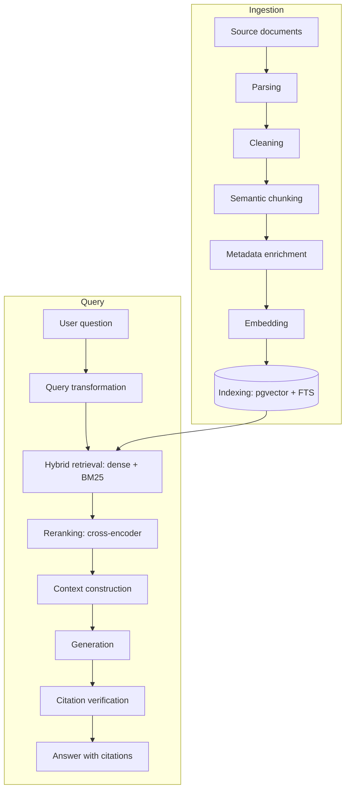
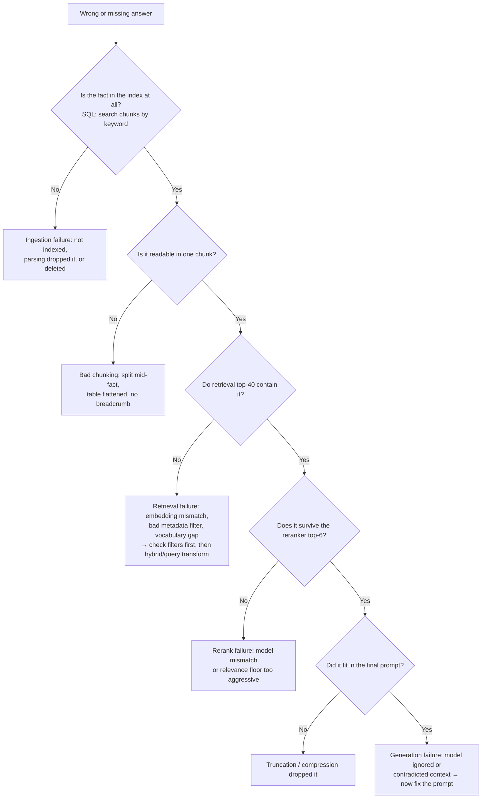

# Retrieval-Augmented Generation

RAG is how you make an LLM answer from *your* data: retrieve the relevant documents at question time and put them in the context window with instructions to answer from them. It sounds like one retrieval call; in production it is a twelve-stage pipeline, and quality problems can originate in any stage. The senior skill this guide builds is treating RAG as a system of independently testable layers — parsing, chunking, embedding, retrieval, reranking, context construction, generation — rather than a black box you prompt-tweak.

Part of the [Senior AI Engineer Roadmap](./00-Senior-AI-Engineer-Roadmap.md) — Phase 5.

---

## 1. The Full RAG Pipeline

Two paths share an index: an **ingestion path** (offline, batch or event-driven) and a **query path** (online, latency-sensitive). Keep them mentally separate — they fail differently and are debugged differently.



Every arrow is a place where quality can be lost silently. Section 10 gives the layer-by-layer diagnosis method.

---

## 2. Document Parsing and Cleaning

### 2.1 PDF pain is real

PDFs are a *layout* format, not a text format. Text extraction must reconstruct reading order from positioned glyphs, and it routinely fails on multi-column layouts, headers/footers bleeding into body text, hyphenated line breaks, and ligatures. Scanned PDFs contain no text at all — detect them (extracted text length near zero per page) and fall back to OCR (Tesseract, or a cloud OCR/vision model for hard cases). Budget real engineering time here: garbage at the parsing stage is unrecoverable downstream, and no retriever or prompt fixes it.

### 2.2 Tables

Tables flattened to prose lose their meaning ("Q3 | 4.2M | 12%" becomes noise). Extract tables separately (Camelot, pdfplumber, or a vision model), render them as Markdown or key-value sentences, and store them as their own chunks with `content_type = 'table'` metadata so retrieval can find them and the prompt can present them intact.

### 2.3 Cleaning

Strip boilerplate (repeated headers, nav bars, legal footers), normalize whitespace and Unicode, deduplicate near-identical documents. Boilerplate is poison: it embeds similarly for every document, so it pollutes nearest-neighbor results for every query.

---

## 3. Chunking Strategies

Embedding models and rerankers have input limits, and retrieval precision demands that a chunk be *about one thing*. Chunking decides both.

### 3.1 The strategies and their tradeoffs

| Strategy | How | Tradeoff |
| --- | --- | --- |
| Fixed-size | Every N tokens, sliding window | Trivial, predictable; cuts sentences and ideas mid-thought |
| Recursive | Split on `\n\n`, then `\n`, then `. `, until under the limit | Respects structure; the standard default |
| Semantic | Split where embedding similarity between consecutive sentences drops | Chunks are topically coherent; costs an embedding pass at index time |
| Parent-child | Embed small chunks (precise retrieval), return the larger parent section (rich context) | Best of both; more storage and bookkeeping |

### 3.2 Concrete guidance

- Start with **recursive splitting at 300–800 tokens with 10–15% overlap**. Overlap prevents an answer that straddles a boundary from being unfindable in either chunk.
- Small chunks (~128–256 tokens) retrieve precisely but lack context for generation; large chunks (1,000+) retrieve vaguely — one embedding averaging several topics matches everything weakly. Parent-child retrieval resolves this tension: match on the small child, feed the LLM the parent.
- Never split across document boundaries, and prepend a breadcrumb ("Doc title > Section") to each chunk so it is interpretable standalone.

### 3.3 Metadata enrichment

Attach to every chunk: source document id and URI, title, section path, page number, content type, tenant/ACL fields, ingestion timestamp, and embedding model version. Metadata powers filtered retrieval ("only 2025 policy docs"), citations (page-level links), tenant isolation, and re-embedding migrations. Skimping here is the classic junior mistake — you cannot retrofit metadata without re-ingesting.

---

## 4. Embeddings

### 4.1 What they are

An embedding model maps text to a dense vector (typically 256–3072 dims) such that semantically similar texts land close together. Retrieval is then nearest-neighbor search in that space.

### 4.2 Cosine vs dot product

- **Cosine similarity** compares direction only — invariant to vector length. Safe default.
- **Dot product** = cosine × both magnitudes; equivalent to cosine when vectors are normalized to unit length, otherwise it favors longer vectors.
Most modern embedding APIs return normalized vectors, making the two identical — but *check*, because an unnormalized model scored with dot product silently biases toward certain documents. In pgvector: `<=>` is cosine distance, `<#>` is negative inner product, `<->` is L2.

### 4.3 Dimension and cost tradeoffs

Higher dimensions buy accuracy but cost linearly in storage, index memory, and query compute — at 1M chunks, 3072-dim float32 vectors are ~12 GB of vectors alone before index overhead. Matryoshka-style models let you truncate (e.g., 3072 → 1024) with modest quality loss. Measure recall@k on *your* data before paying for dimensions.

### 4.4 The broken-embedding-migration hazard

**Vectors from different embedding models (or versions) are not comparable.** Query vectors from model B searched against an index built with model A return garbage — often silently, with plausible-looking but wrong neighbors. Therefore: stamp `embedding_model` on every row, filter every query to the model version it was embedded with, and migrate by building a complete parallel index with the new model, validating retrieval metrics on it, then cutting queries over atomically. Never upgrade the query-side model "in place."

---

## 5. Dense, Sparse, and Hybrid Retrieval

### 5.1 Dense retrieval

Nearest-neighbor search over embeddings. Strength: semantic matching — "how do I get my money back" finds the refunds policy. Weakness: exact tokens. Product codes, error strings, names, and rare jargon (`ERR_CONN_RESET`, `SKU-88123`) embed poorly and get lost.

### 5.2 Sparse retrieval and BM25

Sparse retrieval scores on term overlap. **BM25** is the workhorse: term frequency with saturation (a 10th occurrence adds little), inverse document frequency (rare terms weigh more), and length normalization. It nails exact-match queries and requires no ML at all.

### 5.3 Hybrid search with Reciprocal Rank Fusion

Dense and sparse fail on different queries, so production systems run both and fuse. BM25 scores and cosine similarities live on incomparable scales, so fuse on **ranks**, not scores — Reciprocal Rank Fusion:

```python
def rrf(result_lists: list[list[str]], k: int = 60) -> list[tuple[str, float]]:
    """Fuse ranked lists of chunk ids. k=60 is the standard damping constant."""
    scores: dict[str, float] = {}
    for results in result_lists:
        for rank, chunk_id in enumerate(results, start=1):
            scores[chunk_id] = scores.get(chunk_id, 0.0) + 1.0 / (k + rank)
    return sorted(scores.items(), key=lambda x: x[1], reverse=True)

fused = rrf([dense_ids, bm25_ids])[:20]   # top 20 go to the reranker
```

RRF is scale-free, parameter-light, and hard to beat — reach for weighted score normalization only when you have eval data proving it helps.

---

## 6. pgvector: The Recommended Starting Point

The roadmap is explicit: start with PostgreSQL + `pgvector` (+ object storage for raw documents), move to OpenSearch when hybrid-search requirements become substantial, and **do not introduce a dedicated vector database without a clear operational or scale reason**. Postgres gives you vectors, BM25-ish full-text search, metadata filters, joins to your application data, transactions for index updates, and one fewer system to operate.

### 6.1 Schema

```sql
CREATE EXTENSION IF NOT EXISTS vector;

CREATE TABLE chunks (
    id               bigserial PRIMARY KEY,
    tenant_id        uuid        NOT NULL,
    document_id      uuid        NOT NULL,
    source_uri       text        NOT NULL,
    section_path     text,
    page_number      int,
    content_type     text        NOT NULL DEFAULT 'text',   -- text | table | code
    content          text        NOT NULL,
    content_tsv      tsvector GENERATED ALWAYS AS (to_tsvector('english', content)) STORED,
    embedding        vector(1024) NOT NULL,
    embedding_model  text        NOT NULL,                   -- migration safety
    updated_at       timestamptz NOT NULL DEFAULT now()
);

CREATE INDEX chunks_embedding_hnsw ON chunks
    USING hnsw (embedding vector_cosine_ops) WITH (m = 16, ef_construction = 64);
CREATE INDEX chunks_fts ON chunks USING gin (content_tsv);
CREATE INDEX chunks_tenant_doc ON chunks (tenant_id, document_id);
```

### 6.2 HNSW vs IVFFlat

| | HNSW | IVFFlat |
| --- | --- | --- |
| Structure | Multi-layer proximity graph | k-means cluster lists, probe nearest `nprobes` |
| Recall/speed | Better recall at a given latency | Cheaper to build, lower recall or more probing |
| Build cost | Slow build, high memory | Fast build; needs data present *before* creation to place centroids |
| Data drift | Degrades gracefully on inserts | Centroids go stale as data grows — periodic reindex |

Default to **HNSW** for query-heavy workloads; tune `hnsw.ef_search` upward for recall. Both are *approximate* — an ANN index trades a little recall for a lot of speed, which matters when you debug "the chunk exists but wasn't returned."

### 6.3 Hybrid query: cosine search + full-text search fused with RRF

```sql
WITH dense AS (
    SELECT id, row_number() OVER (ORDER BY embedding <=> $query_vec) AS r
    FROM chunks
    WHERE tenant_id = $tenant AND embedding_model = $model
    ORDER BY embedding <=> $query_vec
    LIMIT 40
),
sparse AS (
    SELECT id, row_number() OVER (
        ORDER BY ts_rank_cd(content_tsv, plainto_tsquery('english', $query_text)) DESC) AS r
    FROM chunks
    WHERE tenant_id = $tenant
      AND content_tsv @@ plainto_tsquery('english', $query_text)
    LIMIT 40
)
SELECT c.id, c.content, c.source_uri, c.page_number,
       COALESCE(1.0/(60+d.r), 0) + COALESCE(1.0/(60+s.r), 0) AS rrf_score
FROM chunks c
LEFT JOIN dense  d ON d.id = c.id
LEFT JOIN sparse s ON s.id = c.id
WHERE d.id IS NOT NULL OR s.id IS NOT NULL
ORDER BY rrf_score DESC
LIMIT 20;
```

### 6.4 When to move off pgvector

Legitimate triggers: tens of millions of vectors where index build/memory strains your Postgres instance; heavy lexical requirements (custom analyzers, language-specific tokenization, complex boosting) where OpenSearch's search engine earns its keep; or retrieval QPS that competes with your OLTP workload. "The architecture diagram looks cooler with a vector DB" is not a trigger. Every additional datastore is an operational tax: backups, upgrades, consistency with the source of truth, and a second security model.

---

## 7. Query Transformation

Raw user queries are often bad retrieval queries. Transform before searching.

- **Query rewriting:** resolve conversational context ("what about for enterprise plans?" → "refund policy for enterprise plans") and strip filler. A small/fast model does this well.
- **Multi-query retrieval:** generate 3–4 paraphrases/decompositions of the question, retrieve for each, fuse with RRF. Covers vocabulary mismatch and multi-part questions at the cost of parallel retrievals.
- **HyDE (Hypothetical Document Embeddings):** ask the LLM to write a *hypothetical answer*, embed that, and search with it. Rationale: a fake answer lives closer to real answer-bearing chunks in embedding space than a short question does. Helps when queries and documents differ sharply in register; adds a generation call of latency.

```python
async def transform(question: str, history: list[str]) -> list[str]:
    rewritten = await llm_small(f"Rewrite as a standalone search query.\n"
                                f"History: {history}\nQuestion: {question}")
    variants = await llm_small(f"Give 3 diverse paraphrases, one per line: {rewritten}")
    return [rewritten, *variants.splitlines()]   # retrieve for each, RRF the results
```

---

## 8. Reranking

### 8.1 Bi-encoders vs cross-encoders

The embedding model is a **bi-encoder**: query and document are encoded *independently*, so document vectors can be precomputed and searched in milliseconds — but the model never sees query and document together, so its relevance judgment is coarse. A **cross-encoder** feeds the concatenated (query, document) pair through the model jointly and outputs a relevance score. Far more accurate, far too slow to run against a corpus.

### 8.2 The standard architecture

So the standard design is a funnel: **bi-encoder (+ BM25) retrieves a generous candidate set cheaply; a cross-encoder reranks the top 20–100 precisely; the top 3–8 survivors go into the prompt.** Retrieval is tuned for recall ("is the right chunk *anywhere* in the candidates?"), reranking for precision at the top.

```python
from sentence_transformers import CrossEncoder

reranker = CrossEncoder("BAAI/bge-reranker-v2-m3")

def rerank(query: str, candidates: list[dict], top_n: int = 6) -> list[dict]:
    scores = reranker.predict([(query, c["content"]) for c in candidates])
    ranked = sorted(zip(scores, candidates), key=lambda x: x[0], reverse=True)
    return [c for s, c in ranked[:top_n] if s > 0.2]   # relevance floor: better
                                                       # to send fewer chunks than junk
```

The relevance floor matters: if nothing clears it, the right behavior is usually "I don't know," not padding the context with the least-bad junk.

---

## 9. Context Construction, Generation, and Citations

### 9.1 Assembling the context

- **Token budget:** fix a retrieval budget (e.g., 4–8k tokens) regardless of the model's window. More context means more cost, more latency, and more distractors — stuffing the window measurably *hurts* answer quality past a point.
- **Lost in the middle:** models attend best to the start and end of the prompt. Place the strongest chunks first (and/or last), never buried mid-sequence in rank order.
- **Ordering and grouping:** merge adjacent chunks from the same document, keep document order within a source, label every chunk with a stable id: `[S1] (policy.pdf, p.12): ...`.
- **Context compression:** when candidates exceed budget, either extract only query-relevant sentences (an LLM or extractive pass) or summarize low-ranked chunks. Compression trades recall for focus — measure it, don't assume it.

### 9.2 Citation grounding and verification

Grounding: instruct the model to answer *only* from the provided sources and to tag each claim with the supporting chunk ids (`[S2]`). Verification: after generation, check the citations programmatically — every cited id must exist in the supplied context, and each cited sentence should be entailed by its source (sanity-check with string overlap; use an NLI/judge model for higher assurance). Reject or regenerate on failure.

```python
import re

def verify_citations(answer: str, context_ids: set[str]) -> list[str]:
    cited = set(re.findall(r"\[S(\d+)\]", answer))
    problems = [f"S{c} cited but not in context" for c in cited
                if f"S{c}" not in context_ids]
    for sentence in re.split(r"(?<=[.!?])\s+", answer):
        if sentence.strip() and not re.search(r"\[S\d+\]", sentence):
            problems.append(f"Uncited claim: {sentence[:60]}...")
    return problems   # empty list = passes; else regenerate or flag
```

Citations are not decoration: they make hallucinations detectable, enable user trust, and turn "the bot said something wrong" tickets into a traceable chunk id.

---

## 10. Failure Diagnosis: Layer by Layer

When a RAG answer is wrong, the junior move is to tweak the prompt. The senior move is to find the responsible layer with a binary search over the pipeline — each layer has a distinct test.



Practical implications: log every intermediate artifact (transformed queries, candidate ids and scores, reranked ids, final context) per request — without those logs the diagnosis above is impossible. And note that **bad metadata** deserves special suspicion: an over-strict tenant or date filter silently returns an empty or wrong candidate set that looks exactly like an embedding problem.

### 10.1 Retrieval metrics preview

Instrument at minimum: **recall@k** (fraction of questions whose gold chunk appears in the top k — the retrieval layer's headline metric), **MRR/NDCG** (rank quality), and **answer faithfulness** (are claims supported by the retrieved context — an LLM-judge metric). Build a small gold set of (question, correct chunk id) pairs from real traffic. Guide 11 covers evaluation methodology in depth; the point here is that each pipeline layer gets its *own* metric, so regressions localize themselves.

---

## 11. Operating the Index

### 11.1 Incremental indexing and deletion propagation

Full nightly re-ingestion stops scaling early. Instead: hash each document's content; on change, delete its chunks and re-ingest just that document (transactionally, in Postgres). **Deletion must propagate**: when a source document is deleted or an employee loses access to it, its chunks must leave the index promptly — a RAG system happily quoting a revoked or deleted document is a compliance incident, not a bug. Drive ingestion from source-system events (or a change-detection sweep) and treat "delete" with the same urgency as "create."

```sql
BEGIN;
DELETE FROM chunks WHERE document_id = $doc AND tenant_id = $tenant;
INSERT INTO chunks (tenant_id, document_id, source_uri, content, embedding, embedding_model, ...)
SELECT ...;  -- freshly parsed, chunked, embedded rows
COMMIT;      -- readers never observe a half-updated document
```

### 11.2 Tenant isolation in retrieval

Multi-tenant RAG must enforce isolation **in the retrieval query, in the database** — a `tenant_id` predicate on every search (belt) plus Postgres row-level security (suspenders):

```sql
ALTER TABLE chunks ENABLE ROW LEVEL SECURITY;
CREATE POLICY tenant_isolation ON chunks
    USING (tenant_id = current_setting('app.tenant_id')::uuid);
```

Never rely on the LLM or the prompt to filter out another tenant's chunks: once a chunk reaches the context window, its contents can surface in the answer. Cross-tenant retrieval leakage is a data breach with an embedding-shaped root cause. Document-level ACLs within a tenant work the same way — as metadata filters applied at query time, evaluated against the *requesting user*.

---

## Best Practices

- Treat parsing as a first-class engineering problem; validate extraction on your ugliest PDFs before designing anything downstream.
- Default to recursive chunking at 300–800 tokens with 10–15% overlap and breadcrumb prefixes; adopt parent-child retrieval when precision and context needs conflict.
- Stamp every chunk with `embedding_model` and never mix vectors across model versions — migrate via a parallel index and an atomic cutover.
- Run hybrid retrieval (dense + BM25) fused with RRF from day one; pure dense search loses exact identifiers, pure BM25 loses paraphrases.
- Start on PostgreSQL + pgvector with HNSW; move to OpenSearch or a dedicated vector DB only on demonstrated operational or scale pressure.
- Retrieve generously (top 20–100) for recall, rerank with a cross-encoder for precision, and enforce a relevance floor — "I don't know" beats confident junk.
- Cap the context token budget and order chunks against lost-in-the-middle; more context is not better context.
- Require chunk-id citations and verify them programmatically after generation.
- Log transformed queries, candidate sets, rerank scores, and final context per request; diagnose failures layer by layer instead of prompt-tweaking.
- Enforce tenant and ACL filters in the database (predicates + row-level security), never in the prompt; propagate deletions as urgently as creations.

## Interview Questions

<details><summary>Walk me through a production RAG pipeline end to end. Where does quality get lost?</summary>
Ingestion: source documents → parsing (PDF layout reconstruction, OCR fallback, table extraction) → cleaning (boilerplate, dedup) → chunking (recursive/semantic, 300–800 tokens, overlap) → metadata enrichment (source, section, tenant, embedding model version) → embedding → indexing (vector + full-text). Query: query transformation (rewrite, multi-query) → hybrid retrieval (dense + BM25, RRF fusion) → cross-encoder reranking → context construction (token budget, ordering) → generation → citation verification. Quality is lost silently at every stage: parsing drops or scrambles text, chunking splits facts, stale embeddings mismatch queries, filters exclude the right chunks, reranking demotes them, truncation drops them, and generation can ignore context. That is why each layer needs its own logs and metrics.
</details>

<details><summary>Why is hybrid search better than pure vector search, and how do you combine the scores?</summary>
Dense retrieval matches meaning but loses exact tokens — product codes, error strings, names, and rare jargon embed poorly. BM25 nails exact terms but misses paraphrases. Real query streams contain both types, so running both and fusing dominates either alone. BM25 scores and cosine similarities are on incomparable scales, so fuse on ranks with Reciprocal Rank Fusion: score(d) = Σ 1/(k + rank_i(d)) with k≈60 across the result lists. RRF needs no score normalization or tuning and is the standard baseline; only replace it with learned or weighted fusion when evals prove a gain.
</details>

<details><summary>How would you design a RAG store on PostgreSQL, and when would you leave it?</summary>
One `chunks` table with the text, a `vector` column (pgvector), a generated `tsvector` column for full-text search, and metadata (tenant_id, document_id, section, page, content_type, embedding_model). HNSW index for ANN, GIN index for FTS, B-tree on (tenant_id, document_id). Hybrid queries run both searches as CTEs and fuse with RRF in SQL; row-level security enforces tenant isolation; transactions make document re-ingestion atomic. Leave it only on real pressure: tens of millions of vectors straining memory/build times, advanced lexical needs (custom analyzers, boosting) that justify OpenSearch, or retrieval QPS competing with OLTP. The roadmap's rule: no dedicated vector DB without a clear operational or scale reason — every extra datastore is an operational and consistency tax.
</details>

<details><summary>Compare HNSW and IVFFlat. What does "approximate" mean for your debugging?</summary>
HNSW builds a multi-layer proximity graph: slower, memory-hungrier builds, but better recall/latency and graceful behavior under inserts — the default for query-heavy workloads. IVFFlat clusters vectors with k-means and probes the nearest lists: cheap fast builds, but it must be created after data exists (to place centroids), and recall decays as data drifts from the original centroids, requiring reindexing. Both are approximate nearest neighbor: they can miss true neighbors by design. Debugging implication: "the chunk is indexed but not returned" may be an ANN recall miss, not a bug — verify with exact search (drop the index or raise ef_search/probes) before blaming embeddings.
</details>

<details><summary>Your team upgrades the embedding model and retrieval quality collapses. What happened and what is the correct migration?</summary>
Vectors from different embedding models — even versions of the "same" model — live in incompatible spaces. If queries are embedded with the new model against an index of old vectors, nearest-neighbor results are effectively random while looking superficially plausible: the classic broken-embedding-migration. Correct procedure: every row stores its embedding_model; queries always filter to the model they were embedded with; migration builds a complete parallel index with the new model, validates recall@k and downstream answer quality against the old one on a gold set, then cuts the query path over atomically and drops the old vectors. Never re-embed in place while serving mixed versions.
</details>

<details><summary>Why do production systems retrieve with a bi-encoder and rerank with a cross-encoder?</summary>
A bi-encoder embeds query and document independently, so all document vectors are precomputable and searchable in milliseconds via ANN — but it never sees query and document together, so its relevance judgment is coarse. A cross-encoder scores the concatenated pair jointly with full attention — far more accurate, but O(corpus) inference makes it impossible to run everywhere. The funnel exploits each where it is strong: cheap high-recall retrieval of 20–100 candidates, precise cross-encoder reranking to the top handful. Retrieval is measured on recall@k (is the answer anywhere in the candidates?), reranking on precision at the top. Add a relevance floor so that when nothing is truly relevant the system says "I don't know" rather than padding the prompt.
</details>

<details><summary>A user reports a wrong answer from your RAG system. Describe your diagnosis process.</summary>
Never start with the prompt — isolate the layer. (1) Is the fact in the index? SQL keyword search over chunks; if absent, it's an ingestion/parsing/deletion issue. (2) Is it intact within one chunk, or split mid-fact / flattened from a table? (3) Do the raw retrieval top-40 contain it? If not, check metadata filters first (an over-strict tenant/date filter mimics an embedding problem), then embedding-model mismatch and vocabulary gaps (fix with hybrid search or query transformation). (4) Does it survive reranking? (5) Did it fit in the final context or was it truncated/compressed away? (6) Only if it was in the prompt and the model still answered wrongly is it a generation failure — now prompt work is justified. This requires logging every intermediate artifact (transformed queries, candidate ids/scores, final context) per request.
</details>

<details><summary>What are query rewriting, multi-query retrieval, and HyDE, and when does each help?</summary>
Query rewriting turns a conversational fragment into a standalone search query (resolving pronouns and context from history) — essential for chat interfaces. Multi-query retrieval generates several paraphrases/decompositions, retrieves for each, and fuses with RRF — helps with vocabulary mismatch and multi-part questions at the cost of parallel searches. HyDE has the LLM write a hypothetical answer and embeds that instead of the question, since a plausible answer sits closer to real answer-bearing chunks in embedding space than a terse question does — helps when question and document registers differ sharply, at the cost of an extra generation call. All three attack the same root cause: the user's literal words are often a poor retrieval query.
</details>

<details><summary>How do you make RAG citations trustworthy, and how do you keep one tenant's documents out of another tenant's answers?</summary>
Citations: give each context chunk a stable id, instruct the model to support every claim with ids, then verify programmatically — every cited id must exist in the supplied context, every claim sentence must carry a citation, and (for higher assurance) an NLI/judge check confirms the cited chunk entails the claim; failures trigger regeneration or a flagged response. This converts hallucinations from undetectable to measurable. Tenant isolation: enforce it in the retrieval query in the database — a tenant_id predicate on every search plus Postgres row-level security as a backstop — and apply document-level ACLs as query-time metadata filters evaluated against the requesting user. Never rely on the prompt to withhold another tenant's content: anything that enters the context window can surface in the answer, so cross-tenant retrieval is a data breach at the retrieval layer. Deletion and permission revocation must propagate to the index promptly for the same reason.
</details>
