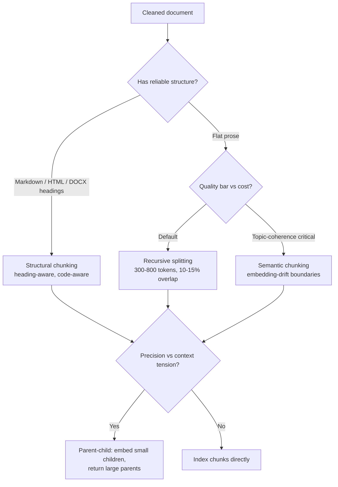
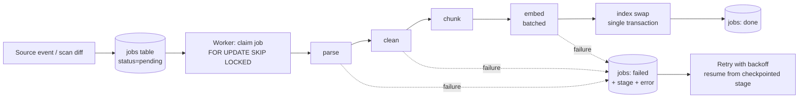

# Document Processing and Chunking

Everything in RAG inherits the quality ceiling set at ingestion. If the parser scrambles a table, no embedding model, reranker, or prompt will recover the numbers; if a chunk boundary severs a fact from its subject, the fact is unfindable in either half. Yet ingestion is the least glamorous stage and the one teams under-invest in most reliably. This guide treats it as a first-class engineering problem: extracting text from hostile formats, cleaning and deduplicating it, chunking it so that retrieval units are coherent, enriching chunks with the metadata that powers filtering and citations, and keeping the index incrementally in sync with changing sources.

The through-line: ingestion is a *pipeline of lossy transformations*, and your job is to measure the loss at each step rather than discover it months later through bad answers.

Part of the [Senior AI Engineer Roadmap](../00-Senior-AI-Engineer-Roadmap.md) — Phase 5.

---

## 1. PDF Extraction: The Hardest 20% That Takes 80% of the Time

PDF is a *layout* format, not a text format. A PDF file contains positioned glyph-drawing instructions — "place the glyph for 'R' at (72.4, 391.2)" — with no notion of words, paragraphs, columns, or reading order. Extraction is *reconstruction*, and reconstruction fails in predictable ways:

- **Multi-column layouts** read across columns instead of down them, interleaving unrelated sentences.
- **Headers/footers** bleed into body text every page ("Confidential — Q3 Report — Page 12" appears mid-paragraph 40 times).
- **Hyphenated line breaks** split words ("perfor-\nmance"), and ligatures (fi, fl) come out as garbage codepoints in older encoders.
- **Scanned PDFs** contain no text layer at all — extraction returns empty strings while the file *looks* full of text.

### 1.1 The text-layer vs OCR decision

Never OCR everything (10–100x slower, introduces its own errors) and never trust the text layer blindly. Decide per page:

```python
import fitz  # PyMuPDF: pip install pymupdf

def page_extraction_strategy(page: fitz.Page) -> str:
    """Decide text-layer extraction vs OCR for one page."""
    text = page.get_text("text")
    n_chars = len(text.strip())
    n_images = len(page.get_images())
    covered = sum(fitz.Rect(b[:4]).get_area() for b in page.get_text("blocks"))
    page_area = page.rect.get_area()

    if n_chars < 50 and n_images > 0:
        return "ocr"            # image-only page: scanned or a figure
    if n_chars >= 50 and covered / max(page_area, 1) < 0.05:
        return "ocr_verify"     # sparse text layer over images: possibly bad OCR baked in
    return "text_layer"

# Expected output for a typical mixed PDF (born-digital body, scanned appendix):
#   page 1: text_layer   page 2: text_layer   ...   page 41: ocr   page 42: ocr
```

For pages routed to OCR, Tesseract handles clean scans; a vision-capable LLM or cloud OCR (Textract, Document AI) earns its cost on degraded scans, handwriting, and complex layouts. Always record *which* path produced each page's text — it is essential metadata when debugging a bad answer later.

### 1.2 Extraction-quality scoring

You cannot manually inspect 50,000 documents, so score extractions automatically and quarantine the worst:

```python
import re

def extraction_quality(text: str) -> dict:
    """Heuristic quality score for extracted text. 1.0 = clean, < 0.5 = quarantine."""
    if not text.strip():
        return {"score": 0.0, "reason": "empty"}
    n = len(text)
    alpha_ratio  = sum(c.isalpha() or c.isspace() for c in text) / n
    replacement  = text.count("�") / n                      # U+FFFD = decode failure
    words        = re.findall(r"[A-Za-z]+", text)
    avg_wordlen  = sum(map(len, words)) / max(len(words), 1)
    # Real prose: alpha_ratio ~0.85+, avg word length 4-7, near-zero replacement chars.
    score = 1.0
    if alpha_ratio < 0.70:  score -= 0.3     # tables-as-noise, glyph soup
    if replacement > 0.001: score -= 0.4     # encoding failures
    if not 3 <= avg_wordlen <= 9: score -= 0.3  # "p e r f o r m a n c e" spacing bugs
    return {"score": max(score, 0.0), "alpha_ratio": round(alpha_ratio, 3),
            "avg_wordlen": round(avg_wordlen, 1)}

print(extraction_quality("Quarterly revenue grew 12% to $4.2M driven by enterprise."))
# {'score': 1.0, 'alpha_ratio': 0.862, 'avg_wordlen': 5.6}
print(extraction_quality("Q u a r t e r l y  r e v e n u e  g r e w"))
# {'score': 0.7, 'alpha_ratio': 1.0, 'avg_wordlen': 1.0}  → wait, score drops for wordlen
# {'score': 0.7} → quarantine threshold is yours to calibrate; log the distribution
```

Route documents scoring below your threshold to a quarantine table for re-extraction with a different tool — do not index garbage, because garbage embeds and *retrieves*.

### 1.3 Tables and multi-column

Tables flattened to prose become noise: `"Q3 | 4.2M | 12%"` loses its column headers and its meaning. Extract tables separately (pdfplumber's `extract_tables()`, Camelot for ruled tables, a vision model for borderless ones), render them as Markdown, and store them as their own chunks with `content_type = 'table'` so retrieval finds them and the prompt presents them intact:

```python
import pdfplumber

def tables_as_markdown(pdf_path: str) -> list[dict]:
    out = []
    with pdfplumber.open(pdf_path) as pdf:
        for pageno, page in enumerate(pdf.pages, 1):
            for table in page.extract_tables():
                header, *rows = table
                md = "| " + " | ".join(str(h or "") for h in header) + " |\n"
                md += "|" + "---|" * len(header) + "\n"
                md += "\n".join("| " + " | ".join(str(c or "") for c in r) + " |" for r in rows)
                out.append({"page": pageno, "content_type": "table", "content": md})
    return out
# Expected: [{'page': 3, 'content_type': 'table',
#             'content': '| Quarter | Revenue | Growth |\n|---|---|---|\n| Q3 | 4.2M | 12% |'}]
```

For multi-column pages, extract *blocks with coordinates* and sort by column first (cluster x-positions), then y — PyMuPDF's `get_text("blocks")` gives you the geometry to do this. Verify on your ugliest real documents; every extraction library has layouts it silently botches.

## 2. HTML and Office Formats

HTML and Office documents are easier — they have real structure — but each has traps:

- **HTML:** the payload is buried in navigation, cookie banners, footers, and sidebars. Use a content-extraction library (`trafilatura` is the strongest default; `readability-lxml` as fallback) rather than `BeautifulSoup(...).get_text()`, which returns the nav bar 200 times. Preserve heading tags — they become your section paths.
- **DOCX:** `python-docx` walks paragraphs with style names (`Heading 1`, `Heading 2`) — a free document outline. Tables come structured. Watch for text inside text-boxes and headers/footers, which the default iterators skip.
- **XLSX:** a spreadsheet is *data*, not prose. Render each sheet (or each logical table) as Markdown with headers; consider one chunk per N rows with the header row repeated so every chunk is self-describing.
- **PPTX:** slides are terse and context-poor; concatenate slide title + body + speaker notes per slide, and prepend the deck title.

```python
import trafilatura

def parse_html(url_or_html: str) -> dict:
    downloaded = trafilatura.fetch_url(url_or_html) if url_or_html.startswith("http") else url_or_html
    text = trafilatura.extract(downloaded, include_tables=True, include_comments=False)
    meta = trafilatura.extract_metadata(downloaded)
    return {"content": text, "title": meta.title if meta else None,
            "date": meta.date if meta else None}
# Expected on a docs page: {'content': 'Configuring retries\nThe client retries...',
#                           'title': 'Retry configuration', 'date': '2025-11-02'}
```

## 3. Normalization, Cleaning, and Dedup

### 3.1 Cleaning pipeline

Order matters — run these as a fixed sequence:

1. **Unicode normalization** (`unicodedata.normalize("NFKC", text)`) — collapses ligatures, full-width chars, exotic spaces.
2. **De-hyphenation** — rejoin `perfor-\nmance` → `performance` (regex on `-\n` followed by lowercase).
3. **Boilerplate removal** — find lines repeating across many pages/documents (page headers, legal footers) by exact-line frequency count and strip them. Boilerplate is poison: it embeds near-identically for every document, so it pollutes nearest-neighbor results for *every* query.
4. **Whitespace normalization** — collapse runs, preserve paragraph breaks (`\n\n`), which chunkers rely on.

```python
from collections import Counter
import re, unicodedata

def strip_boilerplate(pages: list[str], min_frac: float = 0.6) -> list[str]:
    """Remove lines that appear on >= min_frac of pages (headers/footers)."""
    line_pages = Counter()
    for p in pages:
        for line in set(l.strip() for l in p.splitlines() if l.strip()):
            line_pages[line] += 1
    boiler = {l for l, c in line_pages.items() if c >= min_frac * len(pages) and len(pages) > 3}
    return ["\n".join(l for l in p.splitlines() if l.strip() not in boiler) for p in pages]

def normalize(text: str) -> str:
    text = unicodedata.normalize("NFKC", text)
    text = re.sub(r"(\w)-\n(\w)", r"\1\2", text)        # de-hyphenate
    text = re.sub(r"[ \t]+", " ", text)
    return re.sub(r"\n{3,}", "\n\n", text).strip()
# strip_boilerplate(["Acme Corp Confidential\nRevenue grew.", "Acme Corp Confidential\nCosts fell.", ...])
# → ["Revenue grew.", "Costs fell.", ...]   (header line removed from all pages)
```

### 3.2 Near-duplicate detection with MinHash (sketched)

Corpora are full of near-duplicates — the same policy exported to PDF and HTML, v1.2 and v1.3 of a doc, mirrored pages. Duplicates waste index space and, worse, fill the retrieval top-k with five copies of one fact, crowding out the second-best fact. Exact hashing misses near-dupes; pairwise comparison is O(n²). **MinHash + LSH** solves both:

- Shingle each document into overlapping word 5-grams.
- For each of ~128 hash functions, record the *minimum* hash value over the document's shingles. Key property: P(minhash agrees between two docs) = Jaccard similarity of their shingle sets — so 128 minhashes estimate Jaccard with a few percent error.
- Band the 128 signatures into groups (e.g., 32 bands of 4); docs colliding in *any* band become candidate pairs — locality-sensitive hashing turns O(n²) into near-linear.

```python
from datasketch import MinHash, MinHashLSH  # pip install datasketch

def doc_minhash(text: str, num_perm: int = 128) -> MinHash:
    m = MinHash(num_perm=num_perm)
    words = text.lower().split()
    for i in range(max(len(words) - 4, 1)):
        m.update(" ".join(words[i:i + 5]).encode())
    return m

lsh = MinHashLSH(threshold=0.85, num_perm=128)
docs = {"a": "the refund policy allows returns within 30 days of purchase for any reason",
        "b": "the refund policy allows returns within 30 days of purchase for any cause",
        "c": "on-call rotation schedules are published every monday morning"}
for k, t in docs.items():
    lsh.insert(k, doc_minhash(t))
print(lsh.query(doc_minhash(docs["a"])))   # ['a', 'b']  ← b is a near-dupe of a
```

Policy on hit: keep the newest / most authoritative copy, record the suppressed duplicates in a `duplicate_of` column so ingestion stays idempotent and auditable.

## 4. Chunking: The Core Design Decision

Chunking decides your retrieval unit. Two competing pressures: **retrieval precision** wants small, single-topic chunks (one embedding should mean one thing); **generation quality** wants large chunks with enough surrounding context to be interpretable. Every strategy is a different resolution of this tension.



### 4.1 Fixed-size (the baseline)

```python
import tiktoken
enc = tiktoken.get_encoding("cl100k_base")

def fixed_chunks(text: str, size: int = 400, overlap: int = 50) -> list[str]:
    toks = enc.encode(text)
    step = size - overlap
    return [enc.decode(toks[i:i + size]) for i in range(0, max(len(toks) - overlap, 1), step)]

chunks = fixed_chunks("word " * 1000, size=400, overlap=50)
print(len(chunks), [len(enc.encode(c)) for c in chunks])
# 3 [400, 400, 300]   ← predictable sizes; but boundaries cut sentences mid-thought
```

Trivial and predictable; cuts sentences and ideas arbitrarily. Acceptable only as a baseline in experiments.

### 4.2 Recursive (the production default)

Split on the coarsest separator that produces pieces under the limit, recursing to finer separators only when needed — respects paragraphs, then sentences, then words:

```python
SEPARATORS = ["\n\n", "\n", ". ", " "]

def recursive_chunks(text: str, max_tokens: int = 400, seps: list[str] = SEPARATORS) -> list[str]:
    if len(enc.encode(text)) <= max_tokens:
        return [text]
    if not seps:                                   # single un-splittable blob
        return fixed_chunks(text, max_tokens, 0)
    sep, rest = seps[0], seps[1:]
    pieces, buf, out = text.split(sep), "", []
    for p in pieces:
        candidate = (buf + sep + p) if buf else p
        if len(enc.encode(candidate)) <= max_tokens:
            buf = candidate
        else:
            if buf: out.append(buf)
            out.extend(recursive_chunks(p, max_tokens, rest)) if \
                len(enc.encode(p)) > max_tokens else None
            buf = p if len(enc.encode(p)) <= max_tokens else ""
    if buf: out.append(buf)
    return out

doc = "Refunds are allowed within 30 days.\n\nEnterprise plans differ. " \
      "Enterprise refunds require account-manager approval and take 10 business days."
print(recursive_chunks(doc, max_tokens=20))
# ['Refunds are allowed within 30 days.',
#  'Enterprise plans differ.',
#  'Enterprise refunds require account-manager approval and take 10 business days.']
```

### 4.3 Semantic chunking

Split where the *topic changes* — measured as an embedding-similarity drop between consecutive sentences:

```python
import numpy as np

def semantic_chunks(sentences: list[str], embed, drop_percentile: int = 20) -> list[str]:
    """Break where cosine similarity between adjacent sentences dips below the
    drop_percentile of all adjacent similarities (adaptive threshold)."""
    vecs = np.array(embed(sentences))                       # (n, d), unit-normalized
    sims = (vecs[:-1] * vecs[1:]).sum(axis=1)               # cosine of adjacent pairs
    threshold = np.percentile(sims, drop_percentile)
    chunks, current = [], [sentences[0]]
    for i, s in enumerate(sims):
        if s < threshold:
            chunks.append(" ".join(current)); current = []
        current.append(sentences[i + 1])
    chunks.append(" ".join(current))
    return chunks
# On a doc that moves from refunds → shipping → returns-fraud, the three similarity
# dips at the topic transitions fall below the 20th percentile and become boundaries.
```

Produces topically coherent chunks at the cost of an embedding pass over every sentence at index time. Worth it for long, meandering documents (meeting transcripts, long reports); overkill for well-structured docs.

### 4.4 Structural: heading-aware and code-aware

When documents have structure, *use it* — it encodes the author's own topic boundaries:

```python
import re

def markdown_chunks(md: str, max_tokens: int = 500) -> list[dict]:
    """Split on headings; carry the heading path as a breadcrumb; recurse if oversized."""
    sections, path = [], {}
    current = {"path": "", "lines": []}
    for line in md.splitlines():
        m = re.match(r"^(#{1,4})\s+(.*)", line)
        if m:
            if current["lines"]:
                sections.append(current)
            level = len(m.group(1)); path[level] = m.group(2)
            path = {k: v for k, v in path.items() if k <= level}
            current = {"path": " > ".join(path[k] for k in sorted(path)), "lines": []}
        else:
            current["lines"].append(line)
    sections.append(current)
    out = []
    for s in sections:
        body = "\n".join(s["lines"]).strip()
        if not body: continue
        for piece in recursive_chunks(body, max_tokens):
            out.append({"section_path": s["path"], "content": f"[{s['path']}]\n{piece}"})
    return out
# Expected on a policy doc:
# [{'section_path': 'Refund Policy > Enterprise', 'content': '[Refund Policy > Enterprise]\n...'}]
```

Code-aware chunking follows the same principle with syntactic units: split at function/class boundaries (tree-sitter gives you the AST for any language), never mid-function; keep imports and the enclosing class signature as breadcrumb context; store `content_type='code'` and the language. A half-function chunk is as useless as a half-sentence fact.

### 4.5 Chunk size and overlap: how to actually decide

The folklore ("300–800 tokens, 10–15% overlap") is a starting point, not an answer — the right size depends on your corpus's fact density and your queries' specificity. Measure it:

**Experiment design:**
1. Build a gold set of 100–300 `(question, answer-bearing passage)` pairs from real or realistic queries. The passage is identified by *document + character span*, not by chunk id — chunk ids change across configurations, spans don't.
2. For each configuration in a grid — sizes {128, 256, 512, 1024} × overlaps {0%, 10%, 20%} — chunk the corpus, embed, index.
3. Score each configuration on **recall@k with span overlap**: a retrieval "hits" if any top-k chunk overlaps the gold span by ≥ 50%.
4. Also record **tokens-sent-to-LLM at fixed k** (context cost) and answer quality on a downstream eval.

```python
def span_recall_at_k(retrieved: list[tuple[int, int]], gold: tuple[int, int], k: int) -> bool:
    gs, ge = gold
    for cs, ce in retrieved[:k]:
        inter = max(0, min(ge, ce) - max(gs, cs))
        if inter / (ge - gs) >= 0.5:
            return True
    return False
# Typical outcome on a policy corpus (illustrative):
#   size=256, ov=10%: recall@5=0.86, ctx@5=1280 tok
#   size=512, ov=10%: recall@5=0.83, ctx@5=2560 tok
#   size=1024,ov=10%: recall@5=0.74, ctx@5=5120 tok   ← big chunks retrieve vaguely
```

Small chunks usually win recall (each embedding means one thing) but starve generation of context — which is exactly what parent-child retrieval fixes.

### 4.6 Parent-child chunking, implemented

Embed *small children* for precise retrieval; return their *large parent* for rich generation context:

```sql
CREATE TABLE parents (
    id          bigserial PRIMARY KEY,
    document_id uuid NOT NULL,
    section_path text,
    content     text NOT NULL                     -- ~1500-token section
);
CREATE TABLE children (
    id          bigserial PRIMARY KEY,
    parent_id   bigint NOT NULL REFERENCES parents(id) ON DELETE CASCADE,
    content     text NOT NULL,                    -- ~200-token passage
    embedding   vector(1024) NOT NULL
);
CREATE INDEX ON children USING hnsw (embedding vector_cosine_ops);
```

```sql
-- Retrieve on children, return DISTINCT parents ranked by their best child:
SELECT p.id, p.section_path, p.content,
       min(c.embedding <=> $1) AS best_child_distance
FROM children c JOIN parents p ON p.id = c.parent_id
GROUP BY p.id
ORDER BY best_child_distance
LIMIT 5;
-- Expected: 5 full sections, ranked by their most-relevant passage; a section with
-- three matching children appears once (the GROUP BY dedups siblings for free).
```

The `GROUP BY parent` also solves a subtle problem: without it, three sibling children of one great section occupy three of your k slots.

## 5. Metadata Enrichment

Attach to every chunk at ingestion time — you cannot retrofit metadata without re-ingesting:

| Field | Powers |
| --- | --- |
| `document_id`, `source_uri`, `title` | Citations, deletion propagation |
| `section_path`, `page_number` | Page-level citations, breadcrumbs |
| `content_type` (text/table/code) | Type-aware prompting and filtering |
| `tenant_id`, `acl_tags` | Isolation and permission filtering *in the database* |
| `created_at`, `source_modified_at` | Recency boosts, freshness filters |
| `embedding_model` | Migration safety (guide 2) |
| `content_hash` | Delta detection (below) |
| extracted entities (product names, versions) | High-precision filtered retrieval |

Entity extraction can be a cheap LLM pass at ingestion ("list product names, version numbers, and dates mentioned") stored as a `jsonb` column — it converts fuzzy semantic retrieval into exact filters for the queries that need them.

## 6. Versioning and Incremental Re-indexing

Full nightly re-ingestion stops scaling almost immediately (cost: re-embedding everything; risk: a window where the index is half-built). The correct model is **content-hash-based delta detection** with transactional per-document swaps:

```sql
CREATE TABLE documents (
    id            uuid PRIMARY KEY,
    tenant_id     uuid NOT NULL,
    source_uri    text NOT NULL,
    content_hash  text NOT NULL,          -- sha256 of normalized content
    status        text NOT NULL DEFAULT 'active',   -- active | deleted
    ingested_at   timestamptz NOT NULL DEFAULT now(),
    UNIQUE (tenant_id, source_uri)
);
```

```sql
-- Delta detection: compare a fresh source scan (staged) against the catalog.
-- staging_scan(source_uri, content_hash) is loaded by the crawler each run.
SELECT s.source_uri,
       CASE WHEN d.id IS NULL                 THEN 'create'
            WHEN d.content_hash <> s.content_hash THEN 'update'
       END AS action
FROM staging_scan s
LEFT JOIN documents d ON d.source_uri = s.source_uri AND d.tenant_id = $tenant
WHERE d.id IS NULL OR d.content_hash <> s.content_hash
UNION ALL
SELECT d.source_uri, 'delete'
FROM documents d
LEFT JOIN staging_scan s ON s.source_uri = d.source_uri
WHERE d.tenant_id = $tenant AND d.status = 'active' AND s.source_uri IS NULL;
-- Expected: only the changed rows — e.g. 14 creates, 3 updates, 1 delete out of 50,000 docs.
```

```sql
-- Per-document atomic swap: readers never observe a half-updated document.
BEGIN;
DELETE FROM chunks WHERE document_id = $doc_id;
INSERT INTO chunks (document_id, tenant_id, content, embedding, embedding_model, ...)
VALUES (...);   -- freshly parsed, chunked, embedded rows
UPDATE documents SET content_hash = $new_hash, ingested_at = now() WHERE id = $doc_id;
COMMIT;

-- Deletion propagation: treat with the same urgency as creation.
BEGIN;
DELETE FROM chunks WHERE document_id = $doc_id;
UPDATE documents SET status = 'deleted' WHERE id = $doc_id;
COMMIT;
```

A RAG system happily quoting a deleted or access-revoked document is a compliance incident, not a bug. Drive deletions from source-system events where possible; the scan-diff above is the safety net for sources without events.

## 7. The Ingestion Pipeline as Background Jobs

Ingestion must be **asynchronous, resumable, and idempotent**. A synchronous "upload → parse → embed → index" request dies on the first 500-page PDF.



```sql
CREATE TABLE ingestion_jobs (
    id           bigserial PRIMARY KEY,
    document_id  uuid NOT NULL,
    action       text NOT NULL,               -- create | update | delete
    status       text NOT NULL DEFAULT 'pending',  -- pending|running|done|failed
    stage        text NOT NULL DEFAULT 'start',    -- checkpoint: start|parsed|chunked|embedded
    attempts     int  NOT NULL DEFAULT 0,
    last_error   text,
    updated_at   timestamptz NOT NULL DEFAULT now()
);
```

```python
def claim_job(conn):
    """Postgres-native work queue: safe with many concurrent workers."""
    row = conn.execute("""
        UPDATE ingestion_jobs SET status='running', attempts=attempts+1, updated_at=now()
        WHERE id = (SELECT id FROM ingestion_jobs
                    WHERE status IN ('pending','failed') AND attempts < 5
                    ORDER BY id
                    FOR UPDATE SKIP LOCKED LIMIT 1)
        RETURNING id, document_id, action, stage""").fetchone()
    return row   # None means the queue is drained

def run_job(conn, job):
    doc_id, stage = job.document_id, job.stage
    try:
        if stage in ("start",):
            pages = parse(doc_id); save_artifact(doc_id, "parsed", pages)
            checkpoint(conn, job.id, "parsed")
        if stage in ("start", "parsed"):
            chunks = chunk(load_artifact(doc_id, "parsed"))
            save_artifact(doc_id, "chunked", chunks); checkpoint(conn, job.id, "chunked")
        if stage in ("start", "parsed", "chunked"):
            vecs = embed_batched(load_artifact(doc_id, "chunked"))   # resumable per batch
            save_artifact(doc_id, "embedded", vecs); checkpoint(conn, job.id, "embedded")
        swap_into_index(conn, doc_id)          # the atomic transaction from section 6
        conn.execute("UPDATE ingestion_jobs SET status='done' WHERE id=%s", (job.id,))
    except Exception as e:
        conn.execute("UPDATE ingestion_jobs SET status='failed', last_error=%s WHERE id=%s",
                     (str(e)[:2000], job.id))
```

Checkpointing at stage boundaries means a crash mid-embedding (the expensive stage) resumes from the chunked artifact instead of re-parsing and re-paying. Store intermediate artifacts in object storage keyed by `(document_id, stage, content_hash)` — that also makes re-runs idempotent.

---

## Production War Stories & Failure Modes

**1. The header that answered every question.**
*Symptom:* whatever users asked, retrieval returned chunks from random documents whose text began "Acme Corp Confidential — Internal Use Only". Answers cited irrelevant sources. *Investigation:* pulled the top-20 candidates for ten failing queries; 14 of 20 chunks opened with the same 9-word header, and their embeddings clustered tightly — cosine similarity between "random header chunk" and any query beat genuinely relevant chunks. *Root cause:* the PDF extractor emitted the page header into every page's text; chunks were dominated by identical boilerplate, so their embeddings all sat in one dense blob near the centroid of query space. *Fix:* frequency-based boilerplate stripping (section 3.1) and full re-ingestion. *Prevention:* an ingestion-time assertion that no 8+-word line appears in > 30% of a document's chunks; extraction-quality dashboards.

**2. The table that said the opposite.**
*Symptom:* "What was Q3 churn?" answered with the Q1 number, confidently, with a citation. *Investigation:* the cited chunk contained `"5.1 3.8 2.9 2.4"` — four quarters of churn flattened into a whitespace run with no headers; the model picked the first number. *Root cause:* tables extracted with `get_text()` lose row/column structure; the chunk was technically "retrieved correctly" — the data was destroyed at parsing. *Fix:* table-aware extraction to Markdown chunks with `content_type='table'`; re-ingested the 900 affected documents. *Prevention:* extraction-quality scoring flags pages whose digit-to-alpha ratio is high but contain no table chunks; a gold-set question over every important table.

**3. The deleted contract that kept answering.**
*Symptom:* legal requested removal of a terminated customer's contract; three weeks later the assistant quoted its terms verbatim. *Investigation:* the source system deleted the file; the nightly crawler skipped deleted files but the diff logic only computed creates/updates — nothing ever removed chunks. *Root cause:* deletion propagation was never implemented; the index was append-only in practice. *Fix:* the anti-join delete detection from section 6, plus an event-driven delete path from the DMS webhook; backfilled by diffing the catalog against a fresh full scan. *Prevention:* a weekly reconciliation job asserting `count(chunks where document not active) = 0`, alerting on violation — deletion is a compliance requirement, so it gets a monitor, not just code.

**4. The re-ingestion that doubled the corpus.**
*Symptom:* answers degraded after a "harmless" pipeline redeploy; retrieval top-k filled with duplicate chunks. *Investigation:* `SELECT document_id, count(*) FROM chunks GROUP BY 1 ORDER BY 2 DESC` showed every document had exactly 2x its expected chunks. *Root cause:* the new pipeline version generated different chunk boundaries, and ingestion *inserted* new chunks without deleting old ones — the swap was not transactional delete-then-insert. *Fix:* the atomic per-document swap (delete + insert in one transaction); dedup cleanup migration. *Prevention:* idempotency test in CI — ingest the same document twice, assert chunk count unchanged.

## Best Practices

- Decide text-layer vs OCR per *page*, not per document, and record which path produced each page's text.
- Score every extraction automatically; quarantine below-threshold documents instead of indexing garbage — garbage embeds and retrieves.
- Extract tables as structured Markdown chunks with `content_type='table'`; never flatten them to prose.
- Strip boilerplate by cross-page/cross-document line frequency before chunking; it poisons nearest-neighbor search globally.
- Deduplicate near-identical documents with MinHash/LSH; keep the authoritative copy and record `duplicate_of`.
- Default to recursive chunking at 300–800 tokens with 10–15% overlap; upgrade to structural chunking wherever headings or ASTs exist; reserve semantic chunking for unstructured long-form content.
- Choose chunk size by experiment — span-based recall@k on a gold set across a size×overlap grid — not by folklore.
- Use parent-child retrieval when precision and context needs conflict; group children by parent to avoid sibling crowding.
- Enrich every chunk with source, section path, page, content type, tenant/ACL, timestamps, content hash, and embedding model version at ingestion — retrofit requires full re-ingestion.
- Make re-indexing incremental (content-hash deltas) and per-document atomic; treat deletion propagation as a monitored compliance requirement.
- Run ingestion as checkpointed, idempotent background jobs (`FOR UPDATE SKIP LOCKED` queues work fine in Postgres); never parse a 500-page PDF in a request handler.

## Interview Drills

<details><summary>Why is PDF extraction so much harder than HTML extraction, and how do you decide between text-layer extraction and OCR?</summary>
PDF is a layout format: positioned glyph-drawing instructions with no encoded notion of words, paragraphs, columns, or reading order — extraction is reconstruction, and it fails on multi-column layouts (reads across columns), headers/footers bleeding into body text, hyphenated line breaks, and ligatures. Scanned PDFs have no text layer at all. Decide per page: if extracted text length is near zero but the page contains images, it is a scan — route to OCR; if a sparse text layer floats over images, the PDF may contain baked-in bad OCR — verify it. Never OCR everything (10–100x slower, adds its own errors) and never trust the text layer blindly.
Follow-up: *your extractor "works" — how do you know it keeps working across 50k heterogeneous documents?* Automated extraction-quality scoring: alphabetic ratio, replacement-character rate, average word length, per-page text density. Quarantine below-threshold documents for alternative extraction rather than indexing them, and dashboard the score distribution so a regression in a new document batch is visible before users see bad answers.
</details>

<details><summary>Why is boilerplate (repeated headers/footers) described as "poison" for vector retrieval specifically?</summary>
Chunks dominated by identical boilerplate embed near-identically regardless of their real content — they collapse into a dense cluster in embedding space. That cluster tends to sit near the centroid of query space, so boilerplate chunks outrank genuinely relevant chunks for *many unrelated queries at once*. One bad header degrades every query, not just queries about that document. The fix is frequency-based: lines appearing on a large fraction of pages (or across documents) are stripped before chunking.
Follow-up: *how would you detect this in production before users complain?* Monitor candidate-set diversity: alert when the same n-gram prefix appears in a high share of retrieved chunks across distinct queries, and assert at ingestion that no long line repeats across >30% of a document's chunks.
</details>

<details><summary>Explain MinHash + LSH for dedup. Why not just hash documents, or compare all pairs?</summary>
Exact hashing only catches byte-identical copies — it misses the same policy exported to PDF and HTML, or v1.2 vs v1.3. Pairwise Jaccard comparison is O(n²) — infeasible at corpus scale. MinHash: shingle each doc into word n-grams; for each of ~128 hash functions record the minimum hash over the shingles; the probability two docs agree on one minhash equals their Jaccard similarity, so the 128-signature agreement rate estimates similarity cheaply. LSH: band the signatures (e.g., 32 bands × 4 rows); docs colliding in any band become candidate pairs — near-linear total work with tunable precision/recall via the band shape.
Follow-up: *you found a near-duplicate pair — what do you actually do?* Keep the most authoritative/newest copy, suppress the other from indexing, and record `duplicate_of` so ingestion stays idempotent and the decision is auditable. Silently dropping is how you lose the one copy with the newer paragraph.
</details>

<details><summary>Compare fixed, recursive, semantic, and structural chunking. What would you deploy by default and why?</summary>
Fixed: split every N tokens — trivial, predictable, cuts thoughts mid-sentence; baseline only. Recursive: split on the coarsest separator (paragraph → sentence → word) that fits the limit — respects natural structure at zero model cost; the production default. Semantic: split where embedding similarity between adjacent sentences drops — topically coherent chunks, costs an embedding pass per sentence at index time; worth it for unstructured long-form content like transcripts. Structural: split on headings (Markdown/HTML/DOCX) or AST nodes (code) — uses the author's own topic boundaries, the best signal available; deploy wherever structure exists. Default stack: structural where possible, recursive fallback, 300–800 tokens, 10–15% overlap.
Follow-up: *why overlap at all?* A fact straddling a boundary is otherwise split across two chunks, each embedding half a fact — unfindable from either. Overlap ensures boundary-adjacent content exists intact in at least one chunk. Follow-up: *why not 50% overlap?* Index size and cost scale with total tokens; heavy overlap also fills top-k with near-duplicate chunks, crowding out distinct evidence.
</details>

<details><summary>How would you empirically determine the best chunk size for a specific corpus?</summary>
Build a gold set of (question, answer-bearing passage) pairs where the passage is a document+character-span — spans survive re-chunking, chunk ids don't. Grid over sizes {128, 256, 512, 1024} × overlaps {0, 10, 20%}: chunk, embed, index each configuration. Score span-based recall@k (a hit = any top-k chunk overlaps ≥50% of the gold span), plus context tokens at fixed k, plus downstream answer quality. Typical shape: small chunks win retrieval recall (one embedding = one topic) but starve generation; large chunks retrieve vaguely because one embedding averages several topics.
Follow-up: *recall@5 says 256 tokens wins but answers got worse — why?* Retrieval found the right passages but generation lacked surrounding context (definitions, table headers, the sentence before). That's the precision-vs-context tension; the resolution is parent-child retrieval — match small, return large — not bigger flat chunks.
</details>

<details><summary>Walk through parent-child chunking: schema, the retrieval query, and the subtle top-k problem it solves.</summary>
Two tables: `parents` (~1,500-token sections) and `children` (~200-token passages, each with an embedding and a `parent_id` FK with ON DELETE CASCADE). Only children are embedded/indexed. Retrieval: ANN over children, then `GROUP BY parent_id` taking `min(child_distance)` as the parent's score, return top parents. Precision comes from small single-topic child embeddings; generation context from the full parent section. The GROUP BY also fixes sibling crowding: without it, three strong children of one section consume three of your k slots — you return one great section three times instead of three distinct sections.
Follow-up: *costs?* Roughly 2x storage and bookkeeping, cascade-delete correctness on re-ingestion, and parents may include some irrelevant content — budget tokens accordingly (guide 5's token budgeting).
</details>

<details><summary>What metadata do you attach to chunks at ingestion, and why can't you add it later?</summary>
Document id + source URI + title (citations, deletion propagation), section path + page (breadcrumbs, page-level citations), content type (table/code/text prompting), tenant + ACL tags (isolation enforced in the database), timestamps (recency boosts, freshness filters), embedding model version (migration safety), content hash (delta detection), extracted entities (exact filtered retrieval). You can't retrofit because metadata derives from the parsing context — section paths, page numbers, extraction provenance exist only while the document is being processed; adding a field means re-parsing and re-ingesting the corpus, which at scale means a full re-embed bill.
Follow-up: *which single missing field causes the worst incident?* Tenant/ACL tags — without them isolation gets "enforced" in the prompt, and cross-tenant leakage is a breach. Second worst: embedding_model, which makes model migrations silently corrupting (guide 2).
</details>

<details><summary>Design incremental re-indexing for a 500k-document corpus that changes ~1%/day. Why is nightly full re-ingestion wrong?</summary>
Full re-ingestion re-embeds 500k documents to refresh 5k — 100x the embedding cost — and creates a nightly window of half-built index state. Instead: store `content_hash` per document; each sync, stage a scan of (source_uri, hash) and compute the delta in SQL — new URIs = create, changed hashes = update, catalog rows missing from the scan = delete (anti-join). Process each changed document as a job whose index write is a single transaction: DELETE old chunks + INSERT new + update hash — readers never see a half-updated document. Prefer source-system events (webhooks) as the trigger, with the scan-diff as reconciliation.
Follow-up: *the hash matches but your chunking code changed — now what?* Version the pipeline: store `pipeline_version` on documents and treat (content_hash, pipeline_version) as the identity — a pipeline bump marks everything stale, which you drain through the job queue at a controlled rate rather than a big-bang re-ingest.
</details>

<details><summary>Why does deletion propagation deserve the same urgency as indexing new content?</summary>
Because a RAG system quoting a deleted document is not a stale-cache annoyance — it's a legal/compliance incident: terminated contracts, retracted policies, revoked-access files surfacing verbatim in answers. Retrieval doesn't know the source is gone; the chunks answer forever until removed. Deletions must flow from source events and be backstopped by scan-diff reconciliation, and — because it's a compliance property — monitored: a recurring job asserting no chunks belong to non-active documents, alerting on violation.
Follow-up: *what about permission revocation rather than deletion?* Same machinery, different predicate: ACL tags on chunks must be updated when source permissions change, and every retrieval query filters on the requesting user's entitlements. A user keeping retrieval access to a document they lost source access to is the same class of incident.
</details>

<details><summary>Design the ingestion pipeline as background jobs. Where do you checkpoint and why?</summary>
Queue in Postgres: an `ingestion_jobs` table (document_id, action, status, stage, attempts, last_error); workers claim with `FOR UPDATE SKIP LOCKED` — safe under concurrency with no extra infrastructure. Stages: parse → clean → chunk → embed → index-swap, checkpointing the `stage` column and persisting each stage's artifact to object storage keyed by (document_id, stage, content_hash). Checkpoint at stage boundaries because failure cost is asymmetric: embedding is the expensive stage (API dollars, rate limits), so a crash mid-embed must resume from the chunked artifact, not re-parse and re-pay. Idempotency: keyed artifacts + the transactional index swap mean any stage can be safely re-run.
Follow-up: *a poison document crashes every worker that touches it.* Attempts counter with a max (the claim query filters `attempts < 5`), then park it as failed with the error and stage recorded — one bad PDF must never wedge the queue. Follow-up: *when do you outgrow the Postgres queue?* When job throughput or worker fan-out makes queue contention visible, or you need scheduled/prioritized/fan-out semantics — then SQS/Celery/Temporal; the stage-checkpoint design carries over unchanged.
</details>

<details><summary>A user asks "What was Q3 churn?" and gets the Q1 number with a confident citation. The retrieval logs look fine. What happened?</summary>
Retrieval *was* fine — the failure is upstream, at parsing. The table holding quarterly churn was flattened to a whitespace-separated number run ("5.1 3.8 2.9 2.4") with headers destroyed; the chunk is topically relevant so it retrieves correctly, but the data inside is meaningless, and the model guessed. This is the signature of parsing failures: correct-looking retrieval, wrong content. Fix: table-aware extraction to Markdown with `content_type='table'`, re-ingest affected documents. Diagnose by reading the actual retrieved chunk text — not just ids and scores — which is why traces must store content (guide 6).
Follow-up: *how do you prevent regressions?* Gold-set questions targeting every business-critical table, run in CI against the ingestion pipeline; plus an extraction heuristic flagging pages with high digit density but zero table chunks.
</details>

<details><summary>Your corpus includes source code. What changes about chunking and metadata?</summary>
Chunk on syntactic units via AST (tree-sitter): function and class boundaries, never mid-function — a half-function is as useless as a half-sentence. Prepend breadcrumb context: file path, enclosing class, imports summary, so a method chunk is interpretable standalone. Metadata: `content_type='code'`, language, symbol name, repo + commit — the commit enables freshness handling since code changes faster than prose. Consider dual indexing: the code itself plus an LLM-generated natural-language summary per function, because user queries are in English and code-to-English vocabulary mismatch is severe for dense retrieval (and BM25 helps for exact identifiers — guide 3).
Follow-up: *how do you keep a code index fresh against daily merges?* Hook CI/merge events, re-ingest only changed files (git diff gives you the delta for free — better than content hashing), and stamp commit SHA so answers can cite the exact version.
</details>

<details><summary>What is extraction-quality scoring and where does it sit in the pipeline?</summary>
A cheap heuristic pass over every extracted document before chunking: alphabetic-character ratio (catches glyph soup and tables-as-noise), replacement-character (U+FFFD) rate (encoding failures), average word length (catches "p e r f o r m a n c e" spacing bugs and de-hyphenation failures), per-page text density (catches silent OCR misses). Below-threshold documents go to a quarantine table for re-extraction with an alternative tool or human review — they are never indexed, because a garbage chunk still embeds somewhere and will retrieve for someone. It sits immediately after parsing, gating entry to cleaning/chunking, and its score distribution is dashboarded per source and per extractor version so regressions localize.
Follow-up: *a new document batch scores fine but answers are still wrong — what did the score miss?* Heuristics catch character-level damage, not semantic damage: correct-looking text in scrambled reading order (multi-column interleave) passes every character metric. That needs structure-aware checks (sentence-level perplexity via a small LM, or spot-check sampling) — know the limits of your gates.
</details>

<details><summary>How do you make document re-ingestion atomic, and what goes wrong if it isn't?</summary>
Wrap the swap in one transaction: `BEGIN; DELETE FROM chunks WHERE document_id=$d; INSERT (new chunks); UPDATE documents SET content_hash=...; COMMIT;`. Postgres MVCC guarantees readers see the old version until commit, then the new — never a mix, never a gap. Without it, two classic failures: (1) insert-without-delete duplicates the document's chunks on every pipeline change (top-k fills with dupes); (2) delete-then-crash leaves the document absent from the index until the retry lands — a window of "the fact isn't in the corpus" failures that are maddening to reproduce.
Follow-up: *does this hold if chunks live in a separate vector DB instead of Postgres?* No — most dedicated vector stores lack multi-op transactions, so you switch to versioned writes: insert new chunks under a new doc_version, flip a version pointer, garbage-collect the old version. That's more machinery — one of the quiet reasons the roadmap starts you on pgvector.
</details>

---

Next: [Embeddings in Depth](./02-Embeddings-in-Depth.md) — what happens to these chunks when they become vectors, and how to keep that transformation from silently rotting.
