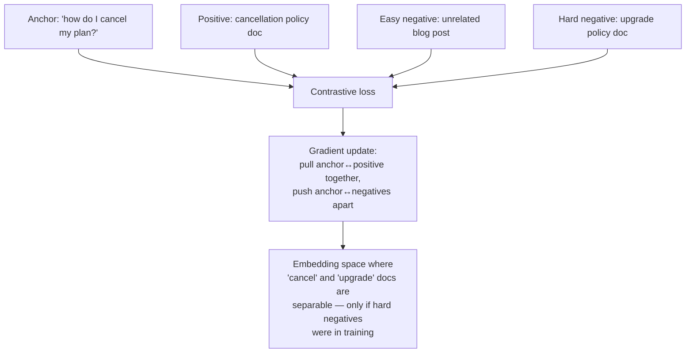
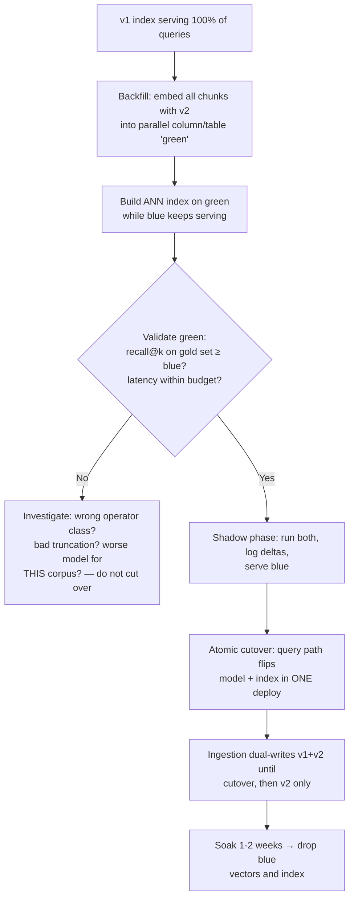
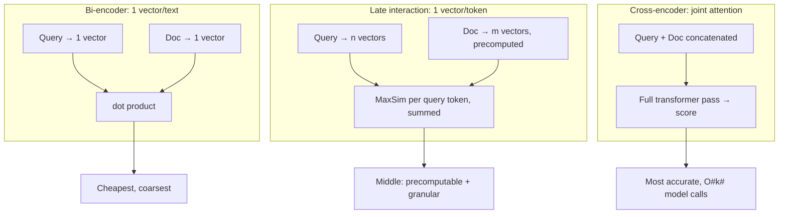

# Embeddings in Depth

The embedding model is the lens through which your retrieval system sees text. Every downstream component — the ANN index, the hybrid fusion, the reranker — operates on whatever geometry that lens produces, so a mismatch between your corpus and your embedding model is a quality ceiling nothing else can raise. This guide goes below the "call the API, get a vector" surface: how embedding models are trained and why that training shapes what they can and cannot distinguish, how the similarity metrics actually work and when they disagree, what embeddings cost at 10M-chunk scale, and the operational problem that bites nearly every team eventually — the fact that vectors from different model versions live in incompatible spaces.

The through-line: **embeddings are versioned, measurable infrastructure**, not a magic semantic oracle. You will build a recall@k harness for your own corpus, because published benchmark numbers (MTEB and friends) predict your retrieval quality about as well as a stranger's shoe size predicts yours.

Part of the [Senior AI Engineer Roadmap](../00-Senior-AI-Engineer-Roadmap.md) — Phase 5.

---

## 1. What an Embedding Model Actually Is

### 1.1 Bi-encoders

A text embedding model is a **bi-encoder**: a transformer that encodes a piece of text into a single fixed-size vector, *independently* of any other text. The query is encoded once; every document was encoded ahead of time; relevance is approximated by a cheap vector comparison. That independence is the entire reason retrieval scales — 10M document vectors are precomputed and searchable in milliseconds — and also the source of its fundamental accuracy limit (guide 5 covers the ceiling and the cross-encoder fix).

Mechanically, most embedding models are encoder transformers whose final token representations are pooled into one vector:

- **Mean pooling** — average all token vectors (most sentence-transformers models).
- **CLS pooling** — take the first token's vector (BERT-style).
- **Last-token pooling** — take the final token (decoder-based embedders like many recent API models).

The pooled vector is usually L2-normalized as the model's last step. Whether it is normalized matters enormously for metric choice — Section 2.

### 1.2 Contrastive training: why "similar" means what it means

Embedding models are trained with a **contrastive objective**: pull matched pairs together, push mismatched pairs apart. Training data is millions of (anchor, positive) pairs — question/answer pairs, title/body pairs, duplicate questions, citation pairs. The standard loss (InfoNCE / in-batch negatives) treats every *other* example in the batch as a negative:

```
loss = -log( exp(sim(q, d+) / τ) / Σ_d exp(sim(q, d) / τ) )
```

Read it term by term:

- `sim(q, d+)` — similarity of the query to its true positive. The numerator rewards making this large.
- The denominator sums over the positive *and all in-batch negatives* — the loss is a softmax classification: "pick the right document out of this batch."
- `τ` (temperature, typically 0.01–0.05) sharpens the softmax; low τ forces the model to make fine-grained distinctions near the top of the ranking rather than coarse ones.

Two consequences you will observe in production:

1. **"Similar" means "co-occurred in training pairs,"** not "similar" in any philosophically pure sense. Models trained mostly on web Q&A learn that questions are similar to their answers — great for RAG. But they also learn that *superficially related* texts are similar: "how do I cancel my subscription" and "how do I upgrade my subscription" land very close, because both discuss subscriptions, even though for your support bot they are opposite intents.
2. **Hard negatives decide fine-grained quality.** In-batch negatives are mostly easy (random unrelated texts), so a model trained only on them learns topic-level separation but stays fuzzy within a topic. Good models are trained with mined **hard negatives** — documents that are topically close but wrong (e.g., the *upgrade* doc as a negative for the *cancel* question). When you evaluate models on your corpus, the differentiator is almost always their behavior on near-miss distinctions, which is exactly what hard-negative training buys.



---

## 2. Similarity Metrics, Derived

Three metrics dominate. They are related but not interchangeable, and pgvector makes you choose an operator class per index — choose wrong and recall silently drops.

### 2.1 The three formulas

For vectors `a`, `b` of dimension `n`:

```
dot(a, b)      = Σᵢ aᵢ·bᵢ
||a||          = sqrt(Σᵢ aᵢ²)                       (L2 norm / length)
cosine(a, b)   = dot(a, b) / (||a|| · ||b||)         (direction only, ∈ [-1, 1])
euclidean(a,b) = ||a - b|| = sqrt(Σᵢ (aᵢ - bᵢ)²)
```

Derive the relationship by expanding squared Euclidean distance:

```
||a - b||² = Σ (aᵢ - bᵢ)²
           = Σ aᵢ² - 2·Σ aᵢbᵢ + Σ bᵢ²
           = ||a||² + ||b||² - 2·dot(a, b)
```

Now impose **unit normalization** (`||a|| = ||b|| = 1`):

```
||a - b||² = 1 + 1 - 2·dot(a, b) = 2 - 2·cosine(a, b)
```

So for normalized vectors: **cosine, dot product, and Euclidean distance produce identical rankings** — cosine equals dot, and Euclidean is a monotone transform of both. They only *differ* when vectors have varying lengths.

### 2.2 When they differ, and why it matters

Un-normalized, `dot(a, b) = cosine(a, b) · ||a|| · ||b||` — dot product is cosine *scaled by magnitude*. If your embedding model does not normalize its outputs, documents that happen to produce longer vectors (often longer or more "content-dense" texts) get boosted under dot product for *every* query. Some models are deliberately trained this way — magnitude encodes a learned importance/confidence prior, and the model card will say "use dot product." Most retrieval models normalize and say "use cosine" (equivalently, dot on their already-unit vectors).

The failure mode to avoid: pairing an unnormalized model with cosine (throws away the trained magnitude signal), or a normalized model's vectors with an L2 index while your code assumes similarity ordering (works, but your thresholds are on the wrong scale). **Rule: read the model card; match the pgvector operator class to the model's trained metric; verify empirically with the harness in Section 7.**

```python
import numpy as np

def cosine(a, b):  return float(a @ b / (np.linalg.norm(a) * np.linalg.norm(b)))
def dot(a, b):     return float(a @ b)
def euclid(a, b):  return float(np.linalg.norm(a - b))

rng = np.random.default_rng(0)
q  = rng.normal(size=8)
d1 = rng.normal(size=8)          # some document
d2 = 3.0 * d1                    # same direction, 3x the magnitude

print(round(cosine(q, d1), 4), round(cosine(q, d2), 4))   # 0.1928 0.1928  ← identical
print(round(dot(q, d1), 4),    round(dot(q, d2), 4))      # 1.3765 4.1294  ← 3x boost
print(round(euclid(q, d1), 4), round(euclid(q, d2), 4))   # 3.2483 7.4581  ← d2 now "farther"

# After normalizing all vectors to unit length, all three metrics agree on ranking:
qn, d1n, d2n = (v / np.linalg.norm(v) for v in (q, d1, d2))
print(round(dot(qn, d1n), 4) == round(dot(qn, d2n), 4))    # True — d1, d2 now identical
print(round(euclid(qn, d1n), 4), round(2 - 2*cosine(q, d1), 4) ** 0.5 if False else "")
# ||a-b||² = 2 - 2·cos confirmed numerically: 1.2707² ≈ 2 - 2(0.1928) ≈ 1.6144
```

### 2.3 Practical defaults

- Model card says vectors are normalized → cosine and dot are identical; in pgvector prefer `vector_cosine_ops` (robust even if a stray unnormalized vector sneaks in) or `vector_ip_ops` (marginally cheaper — skips the norm division).
- Model card says use dot product on raw vectors → `vector_ip_ops`, and do **not** normalize.
- Nobody sane uses raw L2 for text retrieval unless the model was trained for it; it exists mostly for image/classical vectors.

---

## 3. Dimensions: The Cost/Quality Trade

### 3.1 What dimensions cost

Every dimension is paid for **per chunk, forever**: storage, index memory, cache footprint, and per-query compute (distance computation is O(n·dims·candidates)). For a 10M-chunk corpus at float32:

```
dims   bytes/vec   raw vectors    HNSW index (rough 1.2–1.5x)
 384      1,536       15.4 GB        ~19–23 GB
 768      3,072       30.7 GB        ~37–46 GB
1536      6,144       61.4 GB        ~74–92 GB
3072     12,288      122.9 GB       ~147–184 GB   ← no longer fits RAM on modest instances
```

Quality does **not** scale linearly with dimensions. Going 384 → 768 typically buys a few recall points; 1536 → 3072 often buys under one point on in-domain data. Measure on your corpus before paying 8x storage for the top-end dimension.

### 3.2 Matryoshka embeddings

**Matryoshka Representation Learning (MRL)** trains the model so that *prefixes* of the vector are themselves valid embeddings: the loss is applied at multiple truncation points (e.g., dims 64, 128, 256, 512, 1024...), forcing the most important information into the earliest dimensions. Consequence: you can truncate a 3072-dim Matryoshka vector to 1024 or 256 dims, re-normalize, and lose only modest quality — an option the model card must advertise; truncating a non-MRL model's vectors scrambles quality badly.

Production patterns this enables:

- **Tiered retrieval:** first-pass ANN over 256-dim truncations (small, fast, cache-friendly), rescore the top 200 with full-dimension vectors. Recall of full dims at a fraction of the memory.
- **Cheap experimentation:** store full vectors in cold storage, serve truncated ones; re-tune the serving dimension without re-embedding.

```python
import numpy as np

def truncate_matryoshka(vec: np.ndarray, dims: int) -> np.ndarray:
    """Truncate an MRL embedding and re-normalize. Only valid for MRL-trained models."""
    v = vec[:dims]
    return v / np.linalg.norm(v)

full = np.random.default_rng(1).normal(size=3072); full /= np.linalg.norm(full)
small = truncate_matryoshka(full, 256)
print(small.shape, round(float(np.linalg.norm(small)), 6))
# (256,) 1.0   — a valid unit vector 1/12th the size; ranking quality per model card
```

---

## 4. Embedding at Scale: Batching, Rate Limits, and Cost Arithmetic

### 4.1 The 10M-chunk worked example

Assume 10M chunks averaging 500 tokens, embedded via an API priced at $0.02 per 1M tokens (representative small-embedding pricing; check current rates):

```
total tokens   = 10,000,000 chunks × 500 tok = 5.0B tokens
embedding cost = 5,000 × $0.02              = $100          ← cost is rarely the problem
wall-clock     : at 5,000 requests/min × 100 chunks/request = 500k chunks/min
                 → ~20 minutes at full rate limit... in theory
reality        : rate limits, retries, and pipeline overhead → plan hours, not minutes
storage (1536d): 10M × 6,144 B ≈ 61 GB vectors + index overhead
```

The dominant engineering costs are not the API bill — they are **throughput orchestration** (batching, concurrency, backoff), **idempotency** (a backfill that dies at 7.3M chunks must resume, not restart), and **index build time** on the receiving side (guide 4).

### 4.2 A production-shaped batch embedder

```python
import asyncio, hashlib, json

async def embed_batch(texts: list[str], model: str) -> list[list[float]]:
    """Stub for your provider's batch embedding call."""
    ...

async def embed_corpus(chunks, model: str, db, batch_size: int = 96,
                       concurrency: int = 8):
    """Idempotent, resumable corpus embedding.
    - batch_size: most APIs take up to ~100-2000 inputs/request; batching amortizes
      HTTP overhead ~50x vs one-per-request.
    - concurrency: semaphore-bounded so retries don't stampede the rate limit.
    - resumability: skip chunks whose (content_hash, model) is already embedded.
    """
    sem = asyncio.Semaphore(concurrency)
    todo = [c for c in chunks
            if not await db.embedding_exists(c["content_hash"], model)]
    print(f"{len(chunks) - len(todo)} already embedded, {len(todo)} to go")

    async def run(batch):
        async with sem:
            for attempt in range(6):
                try:
                    vecs = await embed_batch([c["content"] for c in batch], model)
                    await db.upsert_embeddings(
                        [(c["id"], c["content_hash"], model, v)
                         for c, v in zip(batch, vecs)])
                    return len(batch)
                except RateLimitError:
                    await asyncio.sleep(2 ** attempt)  # 1,2,4,8,16,32s backoff
            raise RuntimeError("batch failed after retries")

    batches = [todo[i:i+batch_size] for i in range(0, len(todo), batch_size)]
    done = 0
    for n in await asyncio.gather(*(run(b) for b in batches)):
        done += n
    print(f"embedded {done} chunks with {model}")

# Expected run log on a resumed backfill:
#   9,214,336 already embedded, 785,664 to go
#   embedded 785,664 chunks with text-embed-v3   ← resumes exactly where it died
```

Operational rules that pay for themselves:

- **Key embeddings on `(content_hash, model)`**, not chunk id — identical content across documents embeds once; re-running is free.
- **Use the provider's async/batch tier for backfills** (typically ~50% cheaper, hours-scale latency is fine offline); reserve the synchronous API for the live ingestion path.
- **Record `embedding_model` and `embedded_at` on every row.** This is non-negotiable and is the foundation of Section 5.

---

## 5. The Embedding-Versioning Problem

### 5.1 Why vectors from different models are incomparable

An embedding space's coordinate system is an *artifact of training*: dimension 217 means nothing in itself; only the learned geometry relates vectors to each other. Two models — even v1 and v2 of the "same" product line, even the same architecture retrained with a different seed — produce spaces with no alignment whatsoever. A v2 query vector searched against v1 document vectors is not "slightly degraded"; it is **structured noise**. And here is the trap: the results *look plausible* — ANN always returns *something*, and cosine values still cluster in a familiar-looking range — so nothing crashes and no alert fires. Quality just falls off a cliff that only a recall metric can see.

### 5.2 Anatomy of the broken-migration incident

The canonical incident, seen at countless companies:

1. Provider announces embedding model v2, better and cheaper. An engineer flips the model name in the config — one line.
2. The **query path** picks up v2 immediately. The **index** still contains 10M v1 vectors. Nothing errors.
3. Retrieval quality collapses; answers become confidently irrelevant. Users report "the bot got dumber," which reads like a model/prompt problem, so the team burns days tweaking prompts.
4. Meanwhile the ingestion path *also* picked up v2, so new documents are embedded with v2 into the same index — now the index itself is a mixed-space corruption where even rolling back the config can't fully fix retrieval for new docs.
5. Eventually someone checks `SELECT embedding_model, count(*) FROM chunks GROUP BY 1` and finds two values. Full re-embed required; the mixed period's ingestion must be replayed.

Every element of the correct design exists to make step 2 impossible.

### 5.3 Blue-green index migration, step by step



The invariants:

- **The query embedding model and the index it searches change together, atomically.** They are one configuration unit, deployed as one artifact — never two flags that can drift.
- **Every search filters `WHERE embedding_model = $expected`** (or targets a model-specific column/partition). This turns a mixed-space bug from silent garbage into zero results — loud and diagnosable.
- **Ingestion dual-writes during the migration window** so neither index goes stale while the backfill runs (a 10M-chunk backfill takes hours-to-days; documents keep changing).
- **Validation gates the cutover**: the recall@k harness (Section 7) must show green ≥ blue on *your* gold set. "The benchmark says v2 is better" is not evidence about your corpus.
- **Rollback stays cheap** until the soak ends: keep blue's vectors until you would no longer roll back for any other reason.

```sql
-- Schema pattern: model-stamped vectors; the WHERE clause is the safety interlock.
SELECT id, content
FROM chunks
WHERE tenant_id = $1
  AND embedding_model = 'text-embed-v2'      -- returns 0 rows, not garbage, on drift
ORDER BY embedding <=> $2
LIMIT 40;
```

---

## 6. Domain Adaptation: When General Embeddings Fail

General-purpose embedding models are trained on web text. They fail predictably on:

- **Opaque identifiers**: SKUs, error codes, ICD/CPT medical codes, part numbers. `ERR_CONN_RESET_2317` tokenizes into meaningless fragments; the model cannot know two codes are related unless surface text says so. (This is the core argument for hybrid search — guide 3 — since BM25 matches identifiers exactly.)
- **Domain-inverted vocabulary**: in finance, "security" means an instrument; in your infra docs it means auth. The general model resolves ambiguity by web-scale priors, which may be exactly wrong for your corpus.
- **Dense jargon registers**: legal boilerplate, clinical notes, log lines — texts where near-identical surface forms carry critically different meanings. A general model embeds them all into one tight blob; recall looks fine, precision is terrible.

Escalation ladder, cheapest first:

1. **Don't fine-tune yet.** Fix chunking, add hybrid search, add a reranker, prefix context breadcrumbs. These solve most "embeddings seem bad" reports.
2. **Enrich the text instead of the model**: expand codes inline at index time ("ERR_CONN_RESET_2317 (connection reset during TLS handshake)") so the embedder sees meaning, not opaque tokens.
3. **Fine-tune the embedding model** when a measured gap persists on your gold set. Conceptually: continue contrastive training on in-domain (query, positive, hard-negative) triplets — typically 10k–100k pairs mined from click logs, support-ticket links, or LLM-generated synthetic queries over your own chunks. Even a few thousand high-quality pairs with hard negatives moves in-domain recall more than switching to a bigger general model. Cost: you now own model hosting, and *every* fine-tune is a new embedding version — the full Section 5 migration applies each time.

---

## 7. Evaluating Embedding Quality on YOUR Corpus

### 7.1 Build a retrieval gold set

A gold set is a list of `(query, relevant_chunk_ids)` pairs — 100–500 of them, drawn from reality:

- Mine real user queries from logs; have a human (or carefully-prompted LLM with human spot-checks) mark which chunks answer each.
- Synthesize the rest: for sampled chunks, generate "a question this chunk answers" with an LLM — cheap and scalable, but keep synthetic and organic queries separate in reporting, since synthetic queries share vocabulary with their source chunk and overstate recall.

### 7.2 The recall@k harness

```python
import numpy as np

def recall_at_k(gold: list[dict], search_fn, ks=(5, 10, 40)) -> dict:
    """gold: [{'query': str, 'relevant_ids': set[str]}, ...]
    search_fn(query, k) -> ranked list of chunk ids.
    recall@k = fraction of queries with ≥1 relevant chunk in the top k.
    Also reports MRR@max(k): mean of 1/rank of the first relevant hit."""
    kmax = max(ks)
    hits = {k: 0 for k in ks}
    rr_sum = 0.0
    for ex in gold:
        ranked = search_fn(ex["query"], kmax)
        first = next((i for i, cid in enumerate(ranked, 1)
                      if cid in ex["relevant_ids"]), None)
        if first is not None:
            rr_sum += 1.0 / first
            for k in ks:
                if first <= k:
                    hits[k] += 1
    n = len(gold)
    return {**{f"recall@{k}": round(hits[k] / n, 3) for k in ks},
            "mrr": round(rr_sum / n, 3), "n_queries": n}

# Comparing two candidate embedding models on the same 300-query gold set:
# model_a: {'recall@5': 0.71, 'recall@10': 0.80, 'recall@40': 0.92, 'mrr': 0.63}
# model_b: {'recall@5': 0.77, 'recall@10': 0.85, 'recall@40': 0.93, 'mrr': 0.70}
# → model_b wins where it matters (top of ranking); recall@40 near-tied means the
#   reranker sees similar candidates either way — the mrr gap is the real story.
```

Run this harness for: model selection, dimension-truncation decisions, every embedding migration gate, and as a scheduled regression test (index drift, filter bugs, and ingestion regressions all show up here first). Interpretation guide: **recall@40 is the retrieval layer's ceiling for a rerank-to-top-6 pipeline** — if the answer isn't in the top 40, no reranker can save it; recall@5/MRR matter most if you have no reranker.

---

## 8. Query vs Document Asymmetry

Queries and documents are different *kinds* of text — a 7-word question vs a 500-token passage — and modern retrieval models are trained to embed them **differently**:

- **Instruction/prefix asymmetry**: many models require `"query: ..."` vs `"passage: ..."` prefixes (E5 family), or a task instruction prepended to queries only ("Represent this question for retrieving supporting documents: ..."). The model learned distinct projections for each side.
- **The failure mode**: omit the prefixes (or apply the query prefix to documents in a bulk backfill) and recall drops 5–20 points, silently. This is a top-3 cause of "we evaluated model X and it was bad" — the eval harness embedded both sides identically.

```python
def embed_query(text: str) -> list[float]:
    return embed(f"query: {text}")        # E5-style; per your model card

def embed_passage(text: str) -> list[float]:
    return embed(f"passage: {text}")

# Wrong: embed(question) vs embed(passage) with no prefixes on an E5-family model
#   recall@10 = 0.61
# Right: prefixed as above
#   recall@10 = 0.79   ← same model, 18-point difference; the model card is load-bearing
```

Bake the prefix logic into a single shared embedding client used by *both* ingestion and query paths, so it cannot drift between them — the same discipline as the model-version interlock.

---

## 9. Late Interaction: ColBERT and Multi-Vector Retrieval

Single-vector bi-encoders compress an entire passage into one point — the "single-vector bottleneck": a chunk about three things gets one averaged vector that matches all three weakly. **Late-interaction** models (ColBERT family) keep **one vector per token**, and score a (query, document) pair as:

```
score(q, d) = Σ_{i ∈ query tokens} max_{j ∈ doc tokens} sim(qᵢ, dⱼ)
```

Each query token finds its best-matching document token ("MaxSim"), and the sum rewards documents that cover *every* aspect of the query. This sits between bi-encoders and cross-encoders: documents are still precomputable (unlike a cross-encoder), but matching is token-granular (unlike a single vector).

The trade: storage explodes — 500 tokens × 128 dims per chunk is ~50–100x a single vector even with compression — and indexing/serving requires specialized infrastructure (PLAID, or a vector DB with multi-vector support). Practical positioning: for most teams, **single-vector retrieval + cross-encoder rerank** (guide 5) captures most of the quality at far lower operational cost; late interaction earns its complexity in high-value search products where retrieval quality is the product. Know the concept and the trade — it is a favorite senior-interview discriminator.



---

## Production War Stories & Failure Modes

### Incident 1: The one-line model upgrade that "made the bot dumber"

**Symptom:** Overnight, answer quality craters across all tenants. No deploys to the RAG service itself. Retrieval latency and error rates: completely normal.
**Investigation:** Prompt diffs — none. LLM provider status — green. Sampled retrievals show top-k chunks that are *topically* adjacent but never actually relevant, for every query. Someone finally runs the gold-set harness: recall@10 has fallen from 0.82 to 0.11.
**Root cause:** A shared config repo bumped `EMBEDDING_MODEL` to the provider's new version. The query path redeployed and picked it up; the 12M-vector index was still entirely old-model. Two spaces, one index, zero errors.
**Fix:** Pin the query path back to v1 (immediate recovery), then run a proper blue-green migration to v2 over the following week. Replay ingestion for the 14-hour window where new docs were embedded with v2 into the v1 index.
**Prevention:** `embedding_model` column stamped on every row with `WHERE embedding_model = $expected` on every search (drift now returns zero rows and pages someone); model name + index target deployed as a single atomic config unit; gold-set recall as a canary check in the deploy pipeline.

### Incident 2: The backfill that embedded the prefix bug into 10M rows

**Symptom:** A migration to a new open-weights E5-family model passes offline benchmarks brilliantly but performs *worse* than the old model in the shadow phase — recall@40 down 9 points.
**Investigation:** The team's benchmark script and the production ingestion pipeline used different embedding wrappers. The benchmark added `"passage: "` prefixes; the production backfill worker called the raw model with bare text for all 10M chunks. Query-side used `"query: "` correctly — asymmetric on one side only.
**Root cause:** Prefix logic duplicated in two codebases; one copy was wrong. The model, trained with asymmetric prefixes, put unprefixed passages in a subtly shifted region of the space.
**Fix:** Re-run the entire backfill with the shared client (2 days, ~$400 of batch-tier compute), re-validate, then cut over.
**Prevention:** One embedding client library, imported by ingestion, query path, and eval harness alike; a unit test asserting that `embed_passage("x")` ≠ `embed(raw="x")` for prefix-requiring models; shadow-phase recall gates that block cutover (they worked — this incident was caught *before* users saw it, which is the system succeeding).

### Incident 3: Death by dimension — the index that outgrew RAM

**Symptom:** p99 retrieval latency creeps from 40ms to 900ms over three months. No code changes. CPU is idle; iowait is high.
**Investigation:** The corpus grew from 2M to 9M chunks at 3072 dims. Raw vectors alone: ~110 GB; with the HNSW index, well past the database instance's 128 GB RAM. The index no longer fits in the page cache — every ANN traversal hits disk, and HNSW's random-access pattern is pathological for disk.
**Root cause:** Dimension choice made at 2M chunks ("bigger is better, storage is cheap") with no growth model. Storage *was* cheap; RAM was not.
**Fix:** The model was Matryoshka-trained: truncated stored vectors to 1024 dims (a re-normalization pass, no re-embedding), rebuilt the index at ~1/3 the size, recall@10 dropped 0.9 points on the gold set — accepted. Bought 18 months of headroom.
**Prevention:** Capacity model tying (chunks × dims × 4 bytes × index overhead) to instance RAM with an alert at 70%; dimension decisions made with the recall harness, not vibes; preference for MRL models specifically to keep the truncation escape hatch open.

---

## Best Practices

- Read the model card like a contract: normalization, required prefixes/instructions, trained similarity metric, max input length, and Matryoshka support all change your code.
- Match the pgvector operator class to the model's trained metric; verify with a 20-line sanity script, not faith.
- Stamp every vector row with `embedding_model` (and `embedded_at`); filter every search by expected model. Make drift loud (zero rows), never silent (garbage neighbors).
- Deploy query-side model choice and index target as one atomic unit; migrate via blue-green with dual-write ingestion and a recall-gated cutover; keep rollback cheap through a soak period.
- Key embeddings on `(content_hash, model)` for idempotent, resumable, dedup-free backfills; use batch/async API tiers for offline work.
- Build a 100–500 query gold set from real traffic (plus labeled synthetic) and wire recall@k + MRR into CI and migration gates; never select models on public benchmarks alone.
- Centralize embedding calls in one shared client (prefixes, normalization, truncation) imported by ingestion, query, and eval paths.
- Model your memory: `chunks × dims × 4B × ~1.3 index overhead` vs instance RAM; prefer Matryoshka models for the truncation escape hatch; measure before buying dimensions.
- Fix chunking, hybrid search, and reranking before reaching for embedding fine-tuning; when you do fine-tune, treat every fine-tune as a new model version with a full migration.
- Enrich opaque identifiers with natural-language expansions at index time; let BM25 (hybrid) carry exact-match load rather than asking embeddings to memorize codes.

---

## Interview Drills

<details><summary>What is a bi-encoder, and what fundamental trade does it make?</summary>
A bi-encoder encodes query and document into fixed-size vectors independently, so document vectors are precomputable and retrieval reduces to nearest-neighbor search — that independence is what makes searching 10M documents in milliseconds possible. The trade: the model never sees query and document together, so all interaction is compressed through two single vectors ("single-vector bottleneck"), capping fine-grained relevance judgment. Cross-encoders make the opposite trade — joint attention, far more accurate, but O(k) full model passes at query time, so they can only rerank a small candidate set.
Follow-up: Where does ColBERT sit? — Late interaction: one vector per token, precomputable like a bi-encoder, but scoring is per-token MaxSim summed over query tokens, recovering granular matching at the cost of ~50–100x vector storage and specialized index infrastructure.
Follow-up: So why don't most teams use ColBERT? — Because single-vector retrieval + cross-encoder reranking captures most of the accuracy at far lower operational cost; late interaction earns its keep mainly when search quality is the core product.
</details>

<details><summary>Derive the relationship between cosine similarity, dot product, and Euclidean distance. When do they rank differently?</summary>
Expand ||a−b||² = ||a||² + ||b||² − 2·dot(a,b). Also dot(a,b) = cos(a,b)·||a||·||b||. For unit-normalized vectors, ||a||=||b||=1, so ||a−b||² = 2 − 2·cos(a,b) and dot = cos: all three are monotone transforms of each other and produce identical rankings. They diverge only with varying magnitudes: dot product boosts longer vectors for every query; Euclidean penalizes magnitude differences even at identical direction; cosine ignores magnitude entirely.
Follow-up: A model card says "trained for dot product, do not normalize" — what happens if you use cosine anyway? — You erase the magnitude signal the model deliberately learned (often a document-importance/confidence prior), degrading ranking; metric choice must match training.
Follow-up: Which pgvector operator class for a normalized-output model? — `vector_cosine_ops` (robust to stray unnormalized rows) or `vector_ip_ops` (equivalent and marginally cheaper if normalization is guaranteed); the answers must match at the index and the query operator.
</details>

<details><summary>Explain contrastive training and why hard negatives matter.</summary>
Training minimizes InfoNCE: −log(exp(sim(q,d⁺)/τ) / Σ_d exp(sim(q,d)/τ)) — a softmax classification picking the true positive out of the batch, pulling matched pairs together and pushing others apart, with temperature τ sharpening top-of-ranking distinctions. In-batch negatives are mostly random, hence easy — a model trained only on them separates topics but stays fuzzy within a topic. Hard negatives (topically close but wrong documents, e.g., the "upgrade" doc as a negative for a "cancel" question) force fine-grained separations, which is exactly what determines retrieval quality among top candidates in production.
Follow-up: How does this shape what "similar" means? — Similar means "resembles pairs that co-occurred in training data," not semantic similarity in the abstract; a model trained on web Q&A puts opposite intents about the same product close together unless hard negatives taught it otherwise. This is why in-domain evaluation is mandatory.
</details>

<details><summary>Your team is choosing between a 768-dim and a 3072-dim embedding model. Walk through the decision.</summary>
Dimensions cost linearly forever: at 10M chunks, 768d ≈ 31 GB of raw vectors vs 123 GB at 3072d, plus ~1.3x index overhead — the real constraint is usually whether the ANN index fits in RAM, since HNSW on disk is pathologically slow. Quality gains are sublinear: measure recall@k and MRR on your own gold set; the delta from 768→3072 is often under a point in-domain. If the larger model is Matryoshka-trained, you can have both: store or truncate to a smaller serving dimension and keep the option to change later without re-embedding. Decide with the harness plus a capacity model, not the benchmark leaderboard.
Follow-up: The 3072 model wins by 4 points on MTEB — doesn't that settle it? — No; MTEB averages many tasks over web-domain data. Your corpus's jargon, identifiers, and query register can invert the ordering. Public benchmarks shortlist candidates; your gold set decides.
Follow-up: How would tiered retrieval use Matryoshka? — First-pass ANN over 256-dim truncations (small, cache-resident), rescore top ~200 candidates with full vectors — near-full recall at a fraction of memory.
</details>

<details><summary>Why exactly are vectors from two embedding model versions incomparable, and what makes this failure so dangerous operationally?</summary>
An embedding space's coordinates are arbitrary artifacts of training — only the learned internal geometry is meaningful, and nothing aligns geometry across trainings (even the same architecture, data, and a different seed yields an unrelated rotation/warp of the space). A v2 query against v1 vectors is structured noise. It's dangerous because it fails silently: ANN always returns nearest *somethings*, cosine scores still look normal, no errors are thrown — quality collapses in a way that only a recall metric or human review detects, and teams routinely misattribute it to the LLM or the prompt for days.
Follow-up: Design the safeguard. — Stamp `embedding_model` per row; every search filters to the expected model so drift returns zero rows (loud) instead of garbage (silent); deploy query-model + index-target as one atomic config unit; gate any change on gold-set recall.
Follow-up: What if ingestion also ran the new model into the old index for a day? — The index is mixed-space: rollback alone doesn't fix rows embedded during the window. You must identify affected rows via the model stamp (or ingestion logs) and re-embed/replay them — which is why the stamp must exist before the incident.
</details>

<details><summary>Walk me through a zero-downtime migration to a new embedding model on a 10M-chunk corpus.</summary>
Blue-green: (1) Backfill — embed all chunks with v2 into a parallel column/table using the batch API tier, keyed on (content_hash, model) for resumability. (2) Build the ANN index on green while blue serves 100% of traffic. (3) Dual-write ingestion to both models during the window so neither index goes stale. (4) Validate: recall@k and MRR on the gold set for green ≥ blue, plus latency checks; optionally a shadow phase logging result deltas on live queries. (5) Atomic cutover: flip query-side model and index target in one deploy. (6) Soak 1–2 weeks with cheap rollback, then drop blue vectors and stop dual-writes.
Follow-up: Cost/time for the backfill? — ~10M × 500 tok = 5B tokens; at ~$0.02/1M tokens ≈ $100 (batch tier ~half), but wall-clock is rate-limit and index-build bound — plan days, and make the worker resumable because it will die mid-run.
Follow-up: What specifically gates the cutover? — The gold-set harness: if green's recall@40 or MRR regresses, you stop — regardless of what the provider's benchmarks claim. Also index build health and p99 latency on green under shadow load.
</details>

<details><summary>When do general-purpose embeddings fail on a domain corpus, and what's your escalation path before fine-tuning?</summary>
They fail on opaque identifiers (SKUs, error codes, medical codes — tokenized into meaningless fragments), domain-inverted vocabulary (words whose domain meaning contradicts web priors), and dense jargon registers where near-identical surface forms differ critically. Escalation: (1) fix chunking, add hybrid BM25 for exact identifiers, add a cross-encoder reranker — these resolve most "bad embeddings" reports; (2) enrich text at index time (expand codes inline with their meanings) so the embedder sees semantics; (3) only then fine-tune with in-domain contrastive triplets (10k–100k pairs mined from clicks/tickets or synthetic queries, with hard negatives), accepting that you now own hosting and that every fine-tune is a new version requiring a full migration.
Follow-up: How would you mine hard negatives for the fine-tune? — Retrieve top-k with the current model for each training query and take high-ranked non-relevant results — the model's own confusions are the most instructive negatives (filter out false negatives, i.e., actually-relevant unlabeled docs, or you'll train the model to push away right answers).
</details>

<details><summary>How do you evaluate whether embedding model A or B is better for YOUR system?</summary>
Build a gold set of 100–500 (query, relevant_chunk_ids) pairs — real logged queries with human-verified relevance, topped up with LLM-synthesized queries kept separate in reporting (they share vocabulary with source chunks and overstate recall). Run a recall@k + MRR harness against each model over the same corpus and identical pipeline settings. Interpret by pipeline role: with a reranker, recall@40–100 is the retrieval ceiling that matters; without one, recall@5 and MRR dominate. Wire the harness into CI and migration gates so it doubles as a regression detector.
Follow-up: Models tie on recall@40 but B wins MRR by 0.07 — which ships? — If a reranker follows retrieval, the tie at 40 means the reranker sees equivalent candidates and the MRR gap mostly washes out — decide on cost/dims/ops. Without a reranker, B's MRR advantage directly improves what enters the prompt: ship B.
Follow-up: Why not just measure end-to-end answer quality? — You should, too — but end-to-end metrics don't localize regressions. Per-layer metrics (recall for retrieval, precision for reranking, faithfulness for generation) tell you *which* layer broke; that's the entire diagnostic method of guide 6.
</details>

<details><summary>What is query/document asymmetry and how does it bite in practice?</summary>
Queries and documents are different text registers, and many models are trained with distinct treatments per side — "query: "/"passage: " prefixes (E5 family) or task instructions prepended to queries only. The model learns different projections for each side; omitting the prefixes, or applying the wrong one during a bulk backfill, silently costs 5–20 recall points. It bites via duplicated embedding logic: the eval script does it right, the production worker doesn't (or vice versa), and the discrepancy is invisible until someone diffs recall numbers between environments.
Follow-up: Prevention? — A single shared embedding client exposing embed_query()/embed_passage(), imported by ingestion, query path, and eval harness; a test asserting prefixed ≠ raw embeddings for prefix-requiring models; recall gates on any backfill before cutover.
</details>

<details><summary>Estimate the cost and the real engineering work of embedding a 10M-chunk corpus.</summary>
Arithmetic: 10M chunks × 500 tokens = 5B tokens; at ~$0.02/1M tokens ≈ $100 (≈$50 on a batch tier) — API cost is a rounding error. The real work: throughput orchestration (batches of ~100 texts amortize HTTP overhead ~50x; semaphore-bounded concurrency with exponential backoff against rate limits), idempotency and resumability (key on content_hash + model; skip already-embedded work so a crash at 7.3M chunks resumes, not restarts), dedup (identical content embeds once), and the receiving side — index build time and memory on the database, which often exceeds the embedding wall-clock itself.
Follow-up: The backfill runs for 2 days while documents keep changing — how do you avoid a stale index at cutover? — Dual-write: live ingestion embeds new/changed docs with both models during the window; the backfill covers the historical set; cutover then requires no catch-up phase.
</details>

<details><summary>What are Matryoshka embeddings and what operational problems do they solve?</summary>
MRL trains the model with the contrastive loss applied at multiple prefix lengths (64, 128, 256, ... full), forcing the most discriminative information into the earliest dimensions, so truncating a vector and re-normalizing yields a valid lower-dim embedding with modest quality loss. Operationally this decouples the embedding decision from the serving-cost decision: shrink a RAM-overflowing index by truncation without re-embedding (a re-normalization pass instead of a $-and-days backfill), run tiered retrieval (coarse ANN on short prefixes, exact rescoring on full vectors), and A/B serving dimensions cheaply.
Follow-up: Can you truncate a non-MRL model's vectors? — Mechanically yes, but quality craters unpredictably — information is spread across all dimensions with no importance ordering. Truncation is a model-card-granted capability, not a general property.
</details>

<details><summary>Your recall@10 dropped from 0.81 to 0.62 over two months with no model changes. Hypotheses and diagnosis?</summary>
Ordered by likelihood: (1) corpus drift — new document types/vocabulary entered the index and the gold set no longer represents traffic (check recall split by document age/type); (2) ingestion regression — a parser or chunker change degraded chunk quality for recent docs (sample recent chunks); (3) prefix/normalization drift — a refactor broke the shared embedding client on one path (diff a fresh embedding of an old chunk against its stored vector: cosine should be ~1.0); (4) ANN index degradation — heavy insert/delete churn degrading HNSW graph quality or an IVFFlat index with stale centroids (compare ANN results against exact scan on sampled queries: a gap means index, not embeddings); (5) filter changes — a new metadata/tenant filter silently excluding gold chunks. The stored-vs-fresh-embedding diff and the ANN-vs-exact comparison are the two highest-information probes and take minutes each.
Follow-up: The stored-vs-fresh diff shows cosine 0.93 on old rows — what happened? — Something changed the embedding function since those rows were written (silent provider model update, library upgrade, prefix change) without a version-stamp change: you have a slow-motion mixed-space index. Freeze the query-side, identify the change point, and re-embed one side to consistency — then make version stamps actually capture whatever changed.
</details>

<details><summary>Why do embeddings struggle with product codes and error strings, and what's the right architecture for a corpus full of them?</summary>
Codes like SKU-88123 tokenize into arbitrary subword fragments with no distributional meaning; contrastive training never saw enough of each specific code to place it meaningfully, so two related codes land no closer than unrelated ones. Right architecture: hybrid retrieval — BM25/full-text handles exact identifier matches deterministically while dense handles paraphrase, fused with RRF (guide 3); plus index-time enrichment that expands codes into natural-language descriptions inline so dense retrieval gets some signal too. Fine-tuning embeddings to memorize a code catalog is fighting the tool's nature — lexical matching does it perfectly for free.
Follow-up: A user queries "ERR_CONN_RESET_2317" alone — what does each retriever return? — BM25: exact hits on chunks containing the literal string, ranked by rarity-weighted term match — excellent. Dense: chunks about connection errors generally, possibly missing the exact code — mediocre alone, useful blended. This asymmetry per query type is the core argument for hybrid as the default, not an optimization.
</details>

<details><summary>You must serve embeddings for 40 languages. What breaks and what do you check?</summary>
Check: (1) the model is actually multilingual and — critically — *cross-lingually aligned* if you need query-in-language-A to retrieve docs-in-language-B (alignment is a separate trained property from per-language quality); (2) per-language recall on gold sets, because averaged multilingual scores hide 20-point gaps on low-resource languages; (3) tokenizer behavior — some languages consume 3–5x tokens per word, blowing chunk-size assumptions and embedding costs; (4) normalization/prefix conventions still hold across scripts. Architecture options: one aligned multilingual space (simplest ops, one index) vs per-language models and indexes with query-language routing (better per-language quality, N× the operational surface and the migration burden).
Follow-up: Users write queries mixing English and Swahili in one sentence — which design handles that? — The single aligned multilingual space: code-switched queries embed into one space that neighbors documents in either language. Per-language routing needs a language classifier that code-switching defeats.
</details>

---

*Previous: [Document Processing and Chunking](./01-Document-Processing-and-Chunking.md) · Next: [Retrieval: Search and Hybrid](./03-Retrieval-Search-and-Hybrid.md)*
