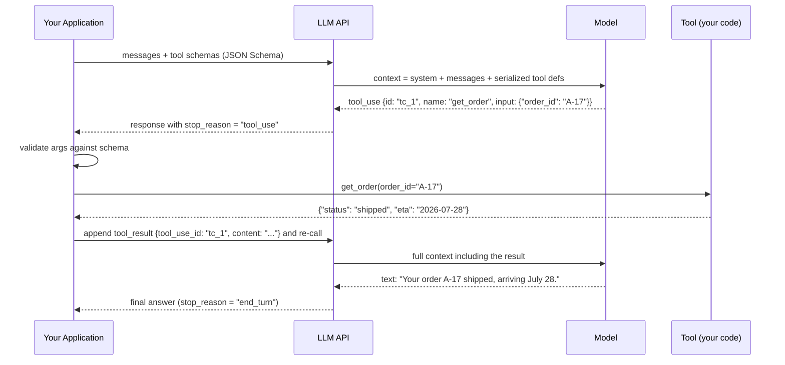
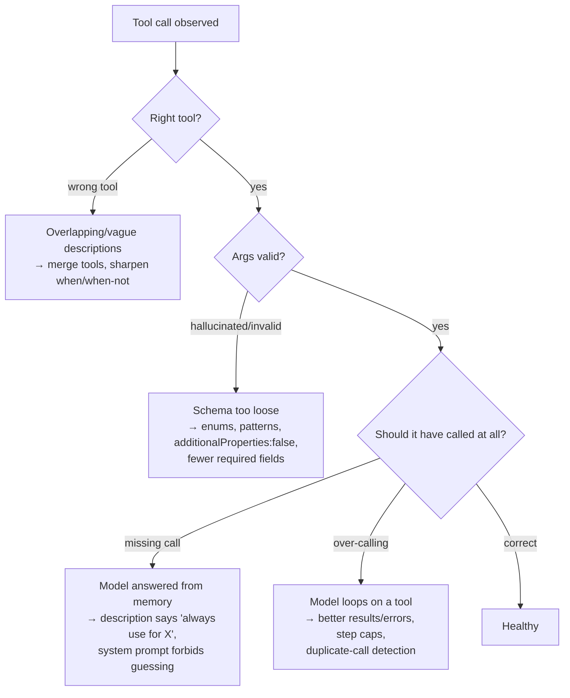

# Tool Calling Foundations

Tool calling is the mechanism that turns a text generator into a system that can *act*: the model is shown a menu of functions, it emits a structured request to call one, your application executes it and returns the result, and the loop continues. Every agent, every RAG-with-tools setup, every "AI that books meetings" reduces to this loop — and most of its failures are engineering failures in the parts *you* own: vague schemas, ambiguous tool boundaries, tool results that dump raw JSON into the context, and dispatch layers with no validation, timeouts, or error normalization.

This guide covers the loop mechanically (what actually travels over the wire), tool schema design as an API-design discipline, parallel calls, result design, a complete runnable tool-execution engine, the recurring failure modes, and how to test tools both in isolation and with a live model.

Part of the [Senior AI Engineer Roadmap](../00-Senior-AI-Engineer-Roadmap.md) — Phase 5.

---

## 1. How Tool Calling Actually Works

There is no magic: the model never executes anything. Tool calling is a *protocol convention* between your application and the model:

1. **You send tool schemas in the request.** Each tool has a name, a description, and a JSON Schema for its arguments. These are serialized into the model's context — the model literally reads them as (specially formatted) text.
2. **The model emits a structured tool call instead of (or alongside) prose.** The API returns a message whose content includes a `tool_use` block: a generated call ID, the tool name, and a JSON object of arguments. The model was trained to emit this format; it is still just next-token prediction over a constrained output format.
3. **Your application executes the tool.** The API provider does nothing with the call. You look up the function, validate the arguments, run it, and capture the result.
4. **You send the result back** as a `tool_result` message referencing the call ID, appended to the conversation, and call the model again.
5. **The model continues** — either emitting more tool calls or producing a final text answer that incorporates the results.



Three consequences fall out of this design:

- **Tool schemas consume context tokens** on *every* request. Thirty verbose tools can cost thousands of tokens per call before the user says a word.
- **The arguments are generated text.** They can be malformed, hallucinated, or subtly wrong — validation is mandatory, not defensive paranoia.
- **The loop is yours.** Step limits, timeouts, retries, parallelism, and authorization all live in your application code between steps 2 and 4.

### 1.1 The minimal loop in code

```python
# Minimal but honest tool loop. Provider-agnostic shape; the Anthropic SDK's
# shapes are used for concreteness (tool_use / tool_result content blocks).
import json

def run_tool_loop(client, messages: list, tools: list[dict],
                  registry: dict, max_steps: int = 10) -> str:
    """Drive the model until it stops calling tools or the step budget runs out."""
    for step in range(max_steps):
        resp = client.messages.create(
            model="claude-sonnet-4-5", max_tokens=2048,
            tools=tools, messages=messages,
        )
        messages.append({"role": "assistant", "content": resp.content})

        tool_calls = [b for b in resp.content if b.type == "tool_use"]
        if not tool_calls:                       # model produced a final answer
            return "".join(b.text for b in resp.content if b.type == "text")

        results = []
        for call in tool_calls:                  # may be several (parallel calls)
            fn = registry.get(call.name)
            try:
                if fn is None:
                    raise KeyError(f"unknown tool {call.name!r}")
                output = fn(**call.input)        # validation happens inside fn
                content, is_error = json.dumps(output), False
            except Exception as e:
                content, is_error = f"Error: {e}", True
            results.append({"type": "tool_result", "tool_use_id": call.id,
                            "content": content, "is_error": is_error})
        messages.append({"role": "user", "content": results})
    return "Stopped: exceeded max_steps without a final answer."

# Expected behavior: for "where is order A-17?", the model calls get_order once,
# receives the JSON result, and the second iteration returns the final text.
```

Note that a tool *error* is returned to the model as a result with `is_error: true` — not raised out of the loop. A well-written error message lets the model correct itself (retry with fixed arguments, try another tool, or tell the user). Only infrastructure failures should abort the loop.

---

## 2. Tool Schema Design — The Real API Docs

The model decides *whether* and *how* to call your tool exclusively from the name, description, and argument schema. Schema design is therefore prompt engineering with types. Treat it with the care of a public API.

### 2.1 Naming and descriptions

- **Name for the action, verb-first:** `search_orders`, `create_ticket`, `refund_transaction`. Not `orders` (ambiguous), not `helper2` (meaningless), not `do_everything` (a design smell).
- **The description is where behavior lives.** Say *what* the tool does, *when* to use it, *when not to*, and what it returns. The model reads this like documentation because it is documentation:

```python
GOOD_DESCRIPTION = (
    "Search the customer's past orders by free-text query and optional date range. "
    "Use this when the user asks about a specific order or purchase history. "
    "Do NOT use for subscription questions — use get_subscription instead. "
    "Returns up to 10 matches with order_id, date, status, and total."
)
BAD_DESCRIPTION = "Searches orders."   # the model will guess everything else
```

- **Disambiguate at the description level** when tools are adjacent: if `search_orders` and `get_order` both exist, each description should reference the other ("if you already have an order_id, use get_order").

### 2.2 Typed arguments: Pydantic → JSON Schema

Define arguments once as a Pydantic model and derive the JSON Schema from it — one source of truth for the model-facing contract and the runtime validation:

```python
from pydantic import BaseModel, Field
from enum import Enum

class OrderStatus(str, Enum):
    pending = "pending"
    shipped = "shipped"
    delivered = "delivered"
    cancelled = "cancelled"

class SearchOrdersArgs(BaseModel):
    """Search the customer's past orders."""
    query: str = Field(description="Free-text search over item names and notes.")
    status: OrderStatus | None = Field(
        default=None, description="Filter by order status. Omit for all statuses.")
    limit: int = Field(default=10, ge=1, le=50,
                       description="Maximum results to return.")

def tool_def(name: str, description: str, model: type[BaseModel]) -> dict:
    schema = model.model_json_schema()
    schema.pop("title", None)
    schema["additionalProperties"] = False   # hallucinated fields fail validation
    return {"name": name, "description": description, "input_schema": schema}

print(json.dumps(tool_def("search_orders", GOOD_DESCRIPTION, SearchOrdersArgs), indent=2))
# Expected output (abbreviated):
# {
#   "name": "search_orders",
#   "input_schema": {
#     "type": "object",
#     "properties": {
#       "query":  {"type": "string", "description": "Free-text search ..."},
#       "status": {"anyOf": [{"$ref": ".../OrderStatus"}, {"type": "null"}], ...},
#       "limit":  {"type": "integer", "minimum": 1, "maximum": 50, "default": 10}
#     },
#     "required": ["query"],
#     "additionalProperties": false
#   }
# }
```

Design rules that measurably improve call accuracy:

- **Enums for closed sets, never free text.** `status: "shipped"` from an enum cannot be misspelled into `"shiped"`; a free-text status can and will be. Any argument with < ~20 legal values should be an enum.
- **Optional vs required is a promise.** Mark required only what the tool truly cannot run without. Every required field is a field the model must *produce* — if the user didn't supply it, the model will either ask (good) or invent it (bad). Fewer required fields → fewer hallucinated values.
- **Per-field descriptions with formats and examples:** `"ISO 8601 date, e.g. 2026-07-24"` prevents an entire class of format errors.
- **Constrain with the schema, not hope:** `minimum`, `maximum`, `pattern`, `maxLength`. The schema is enforced at validation; the description is merely persuasive.

### 2.3 Designing the toolset for model success

The model's tool-selection accuracy degrades as the toolset grows and overlaps:

- **Few tools beat many.** A dozen well-bounded tools outperform forty granular ones. If you have forty, group them behind fewer higher-level tools or route to different toolsets per conversation state.
- **No overlapping tools.** If `search_kb` and `search_docs` both plausibly answer a question, the model will pick inconsistently and your evals will be noise. Merge them or make the boundary explicit in both descriptions.
- **Match granularity to intent.** One `get_customer_context(customer_id)` returning profile + recent orders + open tickets beats three round-trips of separate tools when they're always used together — each round-trip costs a full model call.
- **Make dangerous things separate.** Never overload one tool with a `mode: "read"|"delete"` argument. Read and delete are different tools with different authorization (see guide 03).

---

## 3. Parallel Tool Calls

Models can emit several `tool_use` blocks in a single response when the calls are independent ("compare weather in Paris and Rome" → two `get_weather` calls). Your loop should:

- **Execute independent calls concurrently** — the model already declared them independent by batching them.
- **Return all results in one message**, each matched to its call ID, preserving order.
- **Not assume order of side effects.** If two parallel calls could conflict (two writes to the same record), that's a toolset design bug: writes that can conflict should be one tool or forced sequential by the schema design.

```python
import asyncio

async def execute_parallel(calls, registry):
    async def one(call):
        fn = registry[call.name]
        try:
            out = await asyncio.wait_for(fn(**call.input), timeout=10.0)
            return {"type": "tool_result", "tool_use_id": call.id,
                    "content": json.dumps(out)}
        except Exception as e:
            return {"type": "tool_result", "tool_use_id": call.id,
                    "content": f"Error: {e}", "is_error": True}
    return await asyncio.gather(*(one(c) for c in calls))
# Expected: 3 independent calls at ~1s each complete in ~1s wall clock, not 3s.
```

If parallel calls hurt you (rate limits, ordering-sensitive tools), you can disable them per-request in most APIs (e.g. `disable_parallel_tool_use`) — but first ask whether the toolset design created the ordering sensitivity.

---

## 4. Tool-Result Design: What You Return Is a Prompt

The tool result goes straight into the model's context. Returning `json.dumps(orm_object)` with 40 internal fields is prompt pollution: it wastes tokens, buries the signal, and leaks internals (IDs, feature flags, other customers' data if your query was sloppy).

**Return structured summaries designed for the model's next decision:**

```python
def format_order_result(order: dict) -> dict:
    """Project the internal order record onto what the model needs."""
    return {
        "order_id": order["public_id"],
        "status": order["status"],
        "eta": order.get("eta_date"),                 # None if not shipped
        "items": [{"name": i["display_name"], "qty": i["qty"]}
                  for i in order["items"][:10]],
        "total": f'{order["total_cents"] / 100:.2f} {order["currency"]}',
    }
# Expected: 8 lines of relevant JSON instead of a 3KB ORM dump with
# warehouse_shard_id, fraud_score_v3, and internal_notes leaking into context.
```

**Error messages the model can act on.** The model will read the error and decide what to do next. Write errors like you'd write them for a competent junior colleague:

```python
# Bad:   "Error: 500"                        → model retries blindly or gives up
# Bad:   "KeyError: 'ordr_id'"               → leaks internals, unhelpful
# Good:  "No order found with id 'A-17'. Order ids look like 'ORD-123456'.
#         Use search_orders to find the order by item name or date."
```

A good tool error states: what failed, why (in domain terms), and what to do instead. This single habit removes most retry loops.

**Truncate large results deliberately.** A file-read or SQL tool can return megabytes. Truncate with an explicit marker and a way to get more, so the model knows the data is partial:

```python
def truncate_result(text: str, max_chars: int = 8_000) -> str:
    if len(text) <= max_chars:
        return text
    return (text[:max_chars]
            + f"\n\n[TRUNCATED: showing first {max_chars} of {len(text)} chars. "
              f"Refine the query or request a specific range for more.]")
```

Silent truncation is worse than none — the model will confidently reason over data it doesn't know is incomplete.

---

## 5. A Complete Tool-Execution Engine

Everything above, assembled: a registry with Pydantic validation, per-tool timeouts, error normalization, and an audit trail. This is the layer that sits between "model emitted a call" and "function ran."

```python
"""tool_engine.py — a production-shaped tool execution engine (~150 lines).

Run: python tool_engine.py
Expected output at the bottom of the file.
"""
from __future__ import annotations
import asyncio, inspect, json, time, traceback
from dataclasses import dataclass, field
from typing import Any, Awaitable, Callable
from pydantic import BaseModel, ValidationError


@dataclass
class ToolSpec:
    name: str
    description: str
    args_model: type[BaseModel]
    handler: Callable[..., Any | Awaitable[Any]]
    timeout_s: float = 15.0
    max_result_chars: int = 8_000

    def schema(self) -> dict:
        s = self.args_model.model_json_schema()
        s.pop("title", None)
        s["additionalProperties"] = False
        return {"name": self.name, "description": self.description,
                "input_schema": s}


@dataclass
class ToolOutcome:
    tool_use_id: str
    content: str
    is_error: bool = False
    elapsed_ms: int = 0
    error_kind: str | None = None      # validation | timeout | not_found | execution


@dataclass
class ToolEngine:
    specs: dict[str, ToolSpec] = field(default_factory=dict)
    audit: list[dict] = field(default_factory=list)

    def register(self, spec: ToolSpec) -> None:
        if spec.name in self.specs:
            raise ValueError(f"duplicate tool name: {spec.name}")
        self.specs[spec.name] = spec

    def tool_defs(self) -> list[dict]:
        return [s.schema() for s in self.specs.values()]

    async def dispatch(self, tool_use_id: str, name: str, raw_args: dict) -> ToolOutcome:
        t0 = time.monotonic()

        def done(content: str, *, is_error=False, kind=None) -> ToolOutcome:
            out = ToolOutcome(tool_use_id, content, is_error,
                              int((time.monotonic() - t0) * 1000), kind)
            self.audit.append({"tool": name, "args": raw_args,
                               "is_error": out.is_error, "kind": out.error_kind,
                               "elapsed_ms": out.elapsed_ms})
            return out

        # 1. Resolve — unknown tool is a model error; answer with the menu.
        spec = self.specs.get(name)
        if spec is None:
            return done(f"Unknown tool '{name}'. Available tools: "
                        f"{sorted(self.specs)}.", is_error=True, kind="not_found")

        # 2. Validate — never let unvalidated model output reach a handler.
        try:
            args = spec.args_model(**raw_args)
        except ValidationError as e:
            msgs = "; ".join(f"{'.'.join(map(str, err['loc']))}: {err['msg']}"
                             for err in e.errors())
            return done(f"Invalid arguments for {name}: {msgs}. "
                        f"Fix these fields and call again.",
                        is_error=True, kind="validation")

        # 3. Execute with a per-tool timeout; support sync and async handlers.
        try:
            if inspect.iscoroutinefunction(spec.handler):
                result = await asyncio.wait_for(
                    spec.handler(args), timeout=spec.timeout_s)
            else:
                result = await asyncio.wait_for(
                    asyncio.to_thread(spec.handler, args), timeout=spec.timeout_s)
        except asyncio.TimeoutError:
            return done(f"{name} timed out after {spec.timeout_s}s. The operation "
                        f"may still complete; do not assume it failed or retry "
                        f"a side-effecting call without checking.",
                        is_error=True, kind="timeout")
        except Exception as e:
            traceback.print_exc()          # full trace to *your* logs only
            return done(f"{name} failed: {e}", is_error=True, kind="execution")

        # 4. Serialize + truncate.
        text = result if isinstance(result, str) else json.dumps(result, default=str)
        if len(text) > spec.max_result_chars:
            text = (text[:spec.max_result_chars]
                    + f"\n[TRUNCATED at {spec.max_result_chars} chars "
                      f"of {len(text)}]")
        return done(text)

    async def dispatch_all(self, calls: list[dict]) -> list[ToolOutcome]:
        """Execute a batch of parallel calls concurrently, preserving order."""
        return list(await asyncio.gather(*(
            self.dispatch(c["id"], c["name"], c["input"]) for c in calls)))


# --- Demo tools -------------------------------------------------------------
class GetWeatherArgs(BaseModel):
    city: str
    unit: str = "celsius"

def get_weather(args: GetWeatherArgs) -> dict:
    fake = {"paris": 24, "rome": 31}
    if args.city.lower() not in fake:
        raise ValueError(f"unknown city {args.city!r}; try a major city name")
    return {"city": args.city, "temp": fake[args.city.lower()], "unit": args.unit}

class SlowArgs(BaseModel):
    seconds: float

async def slow_tool(args: SlowArgs) -> str:
    await asyncio.sleep(args.seconds)
    return "finished"


async def main():
    eng = ToolEngine()
    eng.register(ToolSpec("get_weather", "Current weather for a city.",
                          GetWeatherArgs, get_weather))
    eng.register(ToolSpec("slow_tool", "Sleeps.", SlowArgs, slow_tool,
                          timeout_s=0.2))

    outs = await eng.dispatch_all([
        {"id": "tc_1", "name": "get_weather", "input": {"city": "Paris"}},
        {"id": "tc_2", "name": "get_weather", "input": {"city": 42}},
        {"id": "tc_3", "name": "get_wether",  "input": {}},
        {"id": "tc_4", "name": "slow_tool",   "input": {"seconds": 1.0}},
    ])
    for o in outs:
        print(f"{o.tool_use_id} error={o.is_error} kind={o.error_kind}: "
              f"{o.content[:70]}")

asyncio.run(main())
# Expected output:
# tc_1 error=False kind=None: {"city": "Paris", "temp": 24, "unit": "celsius"}
# tc_2 error=True kind=validation: Invalid arguments for get_weather: city: Inp...
# tc_3 error=True kind=not_found: Unknown tool 'get_wether'. Available tools: ...
# tc_4 error=True kind=timeout: slow_tool timed out after 0.2s. The operation ...
```

Design points worth internalizing:

- **Every failure becomes a model-readable message** with a machine-readable `error_kind` for your metrics. You can now graph validation-error rate per tool — the single best signal that a schema needs work.
- **The timeout message warns against blind retry** for side-effecting tools — a timed-out payment may have succeeded. Idempotency (guide 03) is the real fix; the message is the safety net.
- **The audit list** is the seed of the observability you'll need (guide 16): per-tool latency, error rates, argument distributions.

For persistence-minded teams, mirror the audit trail into PostgreSQL from day one:

```sql
-- Tool invocation log: the raw material for debugging, evals, and cost analysis.
CREATE TABLE tool_invocations (
    id            BIGINT GENERATED ALWAYS AS IDENTITY PRIMARY KEY,
    run_id        UUID        NOT NULL,          -- agent run (guide 02)
    tool_use_id   TEXT        NOT NULL,          -- model-generated call id
    tool_name     TEXT        NOT NULL,
    args          JSONB       NOT NULL,          -- validated args as sent
    result        TEXT,                          -- possibly truncated
    is_error      BOOLEAN     NOT NULL DEFAULT FALSE,
    error_kind    TEXT,                          -- validation|timeout|not_found|execution
    elapsed_ms    INTEGER     NOT NULL,
    created_at    TIMESTAMPTZ NOT NULL DEFAULT now()
);
CREATE INDEX ON tool_invocations (run_id, created_at);
CREATE INDEX ON tool_invocations (tool_name, is_error, created_at);
-- Expected use: SELECT tool_name, avg(elapsed_ms), count(*) FILTER (WHERE is_error)
--               FROM tool_invocations GROUP BY 1;  → your per-tool health dashboard.
```

---

## 6. Failure Modes and Mitigations



**Wrong tool chosen.** Root cause is almost always overlap or vagueness in the descriptions. Fix the *toolset*, not the prompt: merge near-duplicates, add explicit "use X instead when…" cross-references, cut rarely-used tools. Measure with a labeled set of (input → expected tool) cases.

**Hallucinated arguments.** The model invents an `order_id` it was never given, or fills a required field with a plausible guess. Mitigations: make fewer fields required; validate formats with `pattern`; in descriptions say "only pass values the user explicitly provided — ask if missing"; and design tools so IDs come from previous tool results (search-then-get) rather than from the model's imagination.

**Missing calls.** The model answers a question it should have looked up — confidently and wrongly. Mitigations: descriptions that assert authority ("This tool is the only source of truth for order status"); a system-prompt rule ("never answer order questions from memory"); and eval cases that catch regressions.

**Over-calling / call loops.** The model calls the same tool repeatedly with the same or trivially varied arguments, usually because the result didn't tell it what it needed (or the error message was unactionable). Mitigations: fix result/error design first, then add mechanical guards — hash (tool, args) pairs and short-circuit exact repeats, cap steps per run.

**Malformed structured output.** Rare with modern models but nonzero: truncated JSON when `max_tokens` was hit mid-call. Detect `stop_reason == "max_tokens"` and retry with a bigger budget rather than parsing garbage.

---

## 7. Testing Tools

**In isolation (no model, fast, deterministic).** Tools are functions; test them like functions, plus schema-level tests that lock the model-facing contract:

```python
import pytest

def test_get_weather_happy_path():
    out = get_weather(GetWeatherArgs(city="Paris"))
    assert out == {"city": "Paris", "temp": 24, "unit": "celsius"}

def test_schema_rejects_extra_fields():
    spec = ToolSpec("get_weather", "d", GetWeatherArgs, get_weather)
    assert spec.schema()["input_schema"]["additionalProperties"] is False

def test_error_message_is_actionable():
    with pytest.raises(ValueError, match="try a major city"):
        get_weather(GetWeatherArgs(city="Xyzzy"))
# Expected: all pass in milliseconds; runs in CI on every commit.
```

**Contract snapshot tests:** serialize `tool_defs()` and diff against a committed snapshot. Any schema change becomes a visible code-review event — schema changes silently change model behavior, so they deserve review.

**With the model (slower, statistical).** Tool *selection* and *argument construction* can only be tested with the model in the loop. Build a small eval set of realistic inputs with expected calls, run each N times (behavior is stochastic), and score:

```python
CASES = [
    {"input": "What's the weather in Rome in fahrenheit?",
     "expect_tool": "get_weather",
     "expect_args_subset": {"city": "Rome", "unit": "fahrenheit"}},
    {"input": "Tell me a joke",           # negative case: no tool should fire
     "expect_tool": None},
]

def score_case(case, observed_calls) -> bool:
    if case["expect_tool"] is None:
        return len(observed_calls) == 0
    if not observed_calls or observed_calls[0].name != case["expect_tool"]:
        return False
    sub = case.get("expect_args_subset", {})
    return all(observed_calls[0].input.get(k) == v for k, v in sub.items())
# Expected: run 5x per case; report per-case pass rate. A case at 3/5 is a
# schema-design bug to fix, not noise to ignore. Gate deploys on the aggregate.
```

Include negative cases (no tool expected) — over-calling regressions are as damaging as under-calling and rarely tested. Rerun the suite whenever you change a description: descriptions are behavior.

---

## Production War Stories & Failure Modes

### War story 1: The 40-tool menu that made every answer worse

**Symptom:** After a "big integration push" added 28 new tools (total 41), overall answer quality dropped — including on tasks whose tools hadn't changed. Latency and cost per conversation rose ~35%.

**Investigation:** Tool-selection evals showed accuracy on the *original* 13 tools fell from 96% to 81%. Transcripts showed the model calling `search_knowledge_base` where it used to call `search_orders` — a new tool with a description broad enough to plausibly cover everything.

**Root cause:** Two compounding effects: (1) 41 schemas consumed ~6K tokens of every request, diluting attention; (2) three of the new tools had overlapping, vaguely-worded descriptions that made previously unambiguous choices ambiguous.

**Fix:** Cut to 17 tools by merging near-duplicates; rewrote descriptions with explicit "use / don't use" boundaries and cross-references; routed conversations so only the relevant subset of tools is attached per intent (support conversations never see the analytics tools).

**Prevention:** A tool-count budget with the same review bar as a public API surface; the tool-selection eval suite runs on every toolset change and gates the deploy.

### War story 2: The retry that emailed a customer four times

**Symptom:** A customer received four identical "your issue has been escalated" emails within a minute. Support flagged it as a bug; the customer flagged it as spam.

**Investigation:** The `send_email` tool called an SMTP relay with a 10s timeout. Under load, the relay took 12–15s but *succeeded*. The engine returned "Error: timeout" to the model, which — reasonably, given the message — retried. Three times.

**Root cause:** Timeout treated as failure for a non-idempotent, side-effecting tool, with an error message that invited retry.

**Fix:** The timeout message was rewritten to state the operation may have succeeded and instruct the model not to retry side-effecting calls (the wording now in Section 5's engine). Real fix: `send_email` got an idempotency key derived from (run_id, step_id) so retries deduplicate at the relay wrapper.

**Prevention:** Policy: every side-effecting tool must accept an idempotency key before it can be registered; the registry rejects side-effecting tools without one (a `side_effecting: bool` flag on `ToolSpec` enforced in `register()`).

### War story 3: The SQL tool that flooded the context window

**Symptom:** An internal analytics agent started returning garbage answers and occasionally hard 400 errors ("prompt too long") — but only for some users.

**Investigation:** The `run_sql` tool returned query results as raw JSON with no limit. A user's query returned 90,000 rows; the serialized result was 14MB. Even "successful" smaller dumps (2–3K rows) pushed out earlier conversation context, so the model lost track of what question it was answering.

**Root cause:** No truncation, no row cap, no result-size design. The tool was written to "return the data," not to feed a model's next decision.

**Fix:** Row cap (100) enforced in the tool with `LIMIT` injection; results returned as a compact markdown table plus a summary line (`"1,204,556 rows matched; showing first 100"`); an explicit `TRUNCATED` marker; and a separate `summarize_sql` tool for aggregate questions.

**Prevention:** Engine-level `max_result_chars` as a hard backstop on every tool (as in Section 5), with per-tool overrides requiring justification in review.

---

## Best Practices

- Treat tool schemas as a public API: version them, snapshot-test them, review every change — descriptions are behavior.
- Write descriptions that say when to use the tool, when *not* to, and what it returns; cross-reference adjacent tools explicitly.
- Define arguments once in Pydantic; derive the JSON Schema; set `additionalProperties: false`; use enums for every closed set; constrain with `pattern`/`minimum`/`maximum`.
- Keep the toolset small and non-overlapping; attach only the relevant subset per conversation intent when the catalog is large.
- Make required fields a minimum: every required field is a hallucination opportunity when the user didn't provide it.
- Validate every call before execution and return validation failures to the model as actionable messages, not exceptions.
- Design tool results for the model's next decision: project fields, summarize, and truncate with explicit markers — never dump raw internal objects.
- Write error messages that state what failed, why in domain terms, and what to do instead.
- Give every tool a timeout; for side-effecting tools, pair timeouts with idempotency keys and a "may have succeeded — do not blindly retry" message.
- Execute model-batched parallel calls concurrently; if ordering matters, fix the toolset design rather than the loop.
- Log every invocation (tool, args, result size, latency, error kind) to a durable table from day one.
- Maintain a model-in-the-loop eval set for tool selection and argument accuracy, including negative (no-call) cases; run it N times per case and gate deploys.

---

## Interview Drills

<details><summary>Walk me through exactly what happens, message by message, when a model "calls a tool."</summary>
The application sends a request containing the conversation messages plus tool definitions (name, description, JSON Schema) — these are serialized into the model's context as text. The model, trained to emit a structured format, responds with a <code>tool_use</code> content block: a call ID, tool name, and JSON arguments; the response's stop reason indicates a tool call. The API provider executes nothing. The application validates the arguments, runs the corresponding function, and sends a new message containing a <code>tool_result</code> block referencing the call ID. The model is invoked again with the full history and either emits more tool calls or a final text answer.

Follow-up: *So where does authorization live?* Entirely in the application, between receiving the tool_use block and executing — the model's output is a proposal. Follow-up: *What does this imply about token costs?* Tool schemas are re-sent (and re-read) on every request in the loop, so a large toolset taxes every single step; and every loop iteration replays the growing conversation, so an n-step run costs roughly O(n²) in input tokens unless you use prompt caching.
</details>

<details><summary>What makes a good tool description, and why does it matter more than the function's docstring?</summary>
The description is the only documentation the model ever sees — it decides whether to call the tool, and partly how, based on it. A good description states what the tool does, when to use it, when not to (with cross-references to adjacent tools), what it returns, and any format expectations. A vague description ("Searches orders") forces the model to guess boundaries, which shows up as wrong-tool selections and missing calls.

Follow-up: *How do you know a description is bad?* Measure: a labeled eval set of inputs → expected tool, run repeatedly; wrong-tool rate localizes to the ambiguous pair. Also watch production validation-error rates per tool — persistent argument errors often trace to a description that doesn't state formats. Follow-up: *Descriptions are natural language — how do you stop regressions?* Treat them as code: snapshot-test the serialized tool defs, require review on diffs, and rerun the selection evals on every change.
</details>

<details><summary>Why derive tool schemas from Pydantic models rather than writing JSON Schema by hand?</summary>
One source of truth: the same model that generates the model-facing schema also validates incoming arguments at runtime, so the contract can never drift between what the model was told and what the code enforces. You also get typed access in handlers, good error messages from ValidationError to feed back to the model, and free schema features (enums, constraints, defaults) from Python type annotations.

Follow-up: *Any downsides?* Pydantic's schema output includes artifacts (<code>$defs</code>, titles, <code>anyOf</code> for optionals) that can confuse weaker models — post-process to simplify, and always set <code>additionalProperties: false</code> yourself since Pydantic doesn't by default. Follow-up: *When would you hand-write the schema anyway?* When you need model-facing simplification that diverges from the runtime type — e.g. presenting a flat enum to the model while accepting richer input internally; then a contract test must assert the hand-written schema stays a valid projection of the Pydantic model.
</details>

<details><summary>The model keeps hallucinating an argument value. What's your debugging sequence?</summary>
(1) Check whether the field is required — if the user often doesn't supply it, a required field forces the model to invent one; make it optional or have the tool ask. (2) Check the field description — does it state the format and say "only use values explicitly provided; ask the user if missing"? (3) Check the schema constraints — a <code>pattern</code> or enum turns a plausible hallucination into a validation error the model can recover from. (4) Check the data flow — if the value is an internal ID, the model should obtain it from a prior tool result (search-then-get design), never from its own generation. (5) Add the case to the eval set to lock the fix.

Follow-up: *The hallucinated value passes the pattern check — now what?* Format validation can't catch semantically wrong values; that's the authorization layer's job — verify the referenced resource exists and belongs to the acting user before executing (existence/ownership checks in the handler), which converts a plausible-but-wrong ID into an actionable "not found" result.
</details>

<details><summary>How should a tool report errors, and why not just raise exceptions out of the loop?</summary>
Errors should return to the model as tool results flagged as errors, containing: what failed, why in domain terms, and what to do next ("No order 'A-17'; order ids look like 'ORD-123456'; use search_orders to find it"). The model can then self-correct — retry with fixed args, choose another tool, or ask the user. Raising out of the loop turns every recoverable error into a dead conversation. Only infrastructure failures (auth to the LLM API, out of budget) should abort.

Follow-up: *Doesn't that risk infinite retry loops?* Yes, if the error is unactionable — which is why error text quality is the first fix; mechanically, cap steps per run and detect repeated identical (tool, args) calls. Follow-up: *What about errors that leak internals?* Normalize at the engine layer: full stack traces to your logs, sanitized domain-level messages to the model — the model's context may end up user-visible.
</details>

<details><summary>How do parallel tool calls work, and what constraint do they place on tool design?</summary>
The model may emit multiple tool_use blocks in one response when it judges the calls independent. The application should execute them concurrently and return all results in a single message, each matched by call ID. The design constraint: the model's batching is an independence claim you must be able to honor — tools whose concurrent execution could conflict (two writes touching the same record) indicate a toolset design flaw. Make conflicting writes a single tool, or design schemas so the conflicting combination can't be expressed.

Follow-up: *When would you disable parallel calls?* Rate-limited downstream APIs, strict ordering requirements you can't design away, or simplifying debugging during development — but treat disabling as a workaround; the toolset should be parallel-safe. Follow-up: *Do you run them with threads or async?* Either; the engine shown uses asyncio with <code>to_thread</code> for sync handlers, giving one code path for both and easy per-call timeouts via <code>wait_for</code>.
</details>

<details><summary>Why is tool-result design "prompt engineering," and what are the rules?</summary>
The result string is injected verbatim into the model's context and becomes the substrate of its next decision. Rules: project internal objects onto the fields the model needs (no raw ORM dumps — they waste tokens, bury signal, and leak internals); summarize collections with counts; truncate large payloads with an explicit marker and a path to get more ("showing 100 of 90,000 rows; refine the query"); keep formats consistent per tool so the model learns the shape; and never silently truncate — the model will reason confidently over data it doesn't know is partial.

Follow-up: *How do you pick the size budget?* Work backward from the context budget: decide what fraction of the window a single tool result may consume (a few thousand tokens is typical), enforce it engine-wide as a backstop, and tune per tool. Follow-up: *Structured JSON or prose?* JSON/markdown-table for data the model must relay precisely (IDs, amounts); prose summaries for narrative context; often both — a one-line summary followed by compact structured data.
</details>

<details><summary>Name the four classic tool-calling failure modes and one mitigation for each.</summary>
(1) Wrong tool: caused by overlapping or vague descriptions — merge near-duplicate tools and add explicit use/don't-use boundaries. (2) Hallucinated arguments: caused by loose schemas and over-required fields — enums, patterns, <code>additionalProperties: false</code>, fewer required fields, and search-then-get designs so IDs come from tool results. (3) Missing calls (answering from memory): descriptions that assert the tool is the source of truth plus a system-prompt rule against guessing, verified by eval cases. (4) Over-calling/loops: usually a symptom of unactionable results or errors — fix result design first, then add duplicate-call detection and step caps.

Follow-up: *Which is most dangerous in production?* Missing calls — the failure is silent and confident (wrong answers with no error signal); the others at least leave traces in invocation logs. That's why negative and positive eval cases both matter.
</details>

<details><summary>How do you test tools when the model's behavior is stochastic?</summary>
Split the problem. Tool logic is deterministic: unit-test handlers directly and snapshot-test the serialized schemas so contract changes are visible in review. Model behavior (selection, argument construction) is statistical: build an eval set of realistic inputs with expected tool + argument subsets, include negative cases where no call should fire, run each case N times (e.g. 5), and report per-case pass rates. A case passing 3/5 is a design bug to investigate, not noise. Gate deploys on aggregate accuracy and rerun on any description/schema change.

Follow-up: *How many cases do you need?* Enough to cover each tool's happy path, each pairwise ambiguity you've seen, each negative pattern, and each historical regression — typically 30–100 cases; grow it from production incidents. Follow-up: *Isn't running each case 5x expensive?* It's a few hundred cheap requests; compare against the cost of shipping a selection regression to production. Use a small/cheap model tier for the eval harness runner logic itself, but eval against the production model.
</details>

<details><summary>Your agent's step count and cost have crept up 3x over a quarter with no code changes to the loop. Where do you look?</summary>
The loop didn't change, so the *decisions* did — driven by toolset drift and result quality. Check: (1) toolset growth — new tools added by other teams enlarge the schema payload and create ambiguity that leads to exploratory calling; (2) tool result regressions — a downstream API that started returning less useful data causes follow-up calls; (3) error-rate creep — rising validation or timeout errors mean each logical action now takes multiple attempts (graph error_kind rates per tool from the invocation log); (4) prompt/model version changes — a model upgrade changes calling behavior even with identical schemas; (5) data drift — user asks shifted toward tasks requiring more steps.

Follow-up: *What instrumentation makes this a 10-minute investigation instead of a week?* The tool_invocations table: steps per run, error kinds per tool, tool-call frequency over time, and result sizes — plus tagging runs with model and toolset versions so you can diff cohorts before/after each change.
</details>

<details><summary>When should one tool do more, versus splitting into several tools?</summary>
Granularity should match the model's decision points, not your code's function boundaries. Merge when tools are always used together in sequence (each round-trip costs a model call and latency) — <code>get_customer_context</code> beating three separate getters. Split when the operations carry different risk levels (read vs write vs delete must be separate tools with separate authorization), when a mode argument would make the description ambiguous, or when arguments barely overlap. The test: can you write a crisp "use when / don't use when" description? If the description needs three paragraphs of cases, split it; if two tools' descriptions keep referencing each other for disambiguation, consider merging.

Follow-up: *Why is <code>mode: "read"|"delete"</code> in one tool an anti-pattern?* Authorization becomes argument-dependent, which is easy to get wrong and impossible to allowlist per-user at the tool level; one hallucinated enum value flips a read into a destructive write. Risk boundaries deserve tool boundaries.
</details>

<details><summary>How would you handle a tool whose execution takes minutes, not seconds?</summary>
Don't hold the model call open. Convert to an async job pattern: the tool starts the job and immediately returns a job ID with expected duration ("started export job JOB-42; typically completes in ~3 min; poll with get_job_status"). Give the model a polling tool, or better, park the agent run in a durable waiting state (guide 02) and resume when the job completes via callback — polling burns model calls. The tool's timeout then bounds only the *enqueue*, which is fast.

Follow-up: *What if the model polls in a tight loop?* The status result should include guidance ("check again after 60s") and the harness can enforce a minimum interval or inject a delay; ultimately durable pause/resume removes the loop entirely. Follow-up: *How does this interact with idempotency?* The job-start call needs an idempotency key so a retried start doesn't launch two exports — key on (run_id, step_id) as in guide 03.
</details>

<details><summary>What belongs in a per-tool timeout policy, and why not one global timeout?</summary>
Timeouts should reflect each tool's downstream reality: a cache lookup at 2s, a SQL query at 15s, a document-processing call at 60s. One global value is either too tight for slow tools (spurious timeouts → retries → duplicated side effects) or too loose for fast ones (a hung cache call stalls the whole step). Per-tool timeouts live on the ToolSpec, with a global backstop. Critically, the timeout *message* must distinguish "may have succeeded" (side-effecting tools — do not blindly retry) from "safe to retry" (pure reads), and side-effecting tools need idempotency keys so even a wrong retry is safe.

Follow-up: *A tool times out 5% of the time in production — what do you do?* First determine if it's the tool or the budget: p99 latency from the invocation log vs the configured timeout. If the downstream is genuinely slow, either raise the budget, convert to the async-job pattern, or add caching; a timeout that fires on healthy traffic is a misconfiguration, not a model problem.
</details>

<details><summary>Sketch the schema for a `transfer_funds` tool and defend each design choice.</summary>
<code>transfer_funds(from_account_id: str (pattern "^ACC-[0-9]{8}$"), to_account_id: str (same pattern), amount_cents: int (ge=1, le=hard cap), currency: enum, memo: str (maxLength 140, optional), idempotency_key: injected by the harness — not model-supplied)</code>. Choices: integer cents, never floats — float currency arithmetic is an incident generator; patterns on account IDs so hallucinated IDs fail fast; a schema-level maximum as defense-in-depth under the authorization layer's real limit checks; currency as an enum of supported values; the idempotency key excluded from the model-facing schema entirely because the model must not control deduplication identity; and the description states the tool only proposes — execution requires the application's authorization checks and, above thresholds, human approval.

Follow-up: *Why not let the model pass the idempotency key?* The model could vary it across retries (defeating dedup) or reuse it across distinct transfers (collapsing two intended payments into one); dedup identity is a correctness property, so the harness derives it from run/step identity. Follow-up: *Where do amount limits actually get enforced?* In the authorization layer with the user's real entitlements and the account's balance — the schema maximum is only a cheap early rejection; never trust schema validation as policy.
</details>
