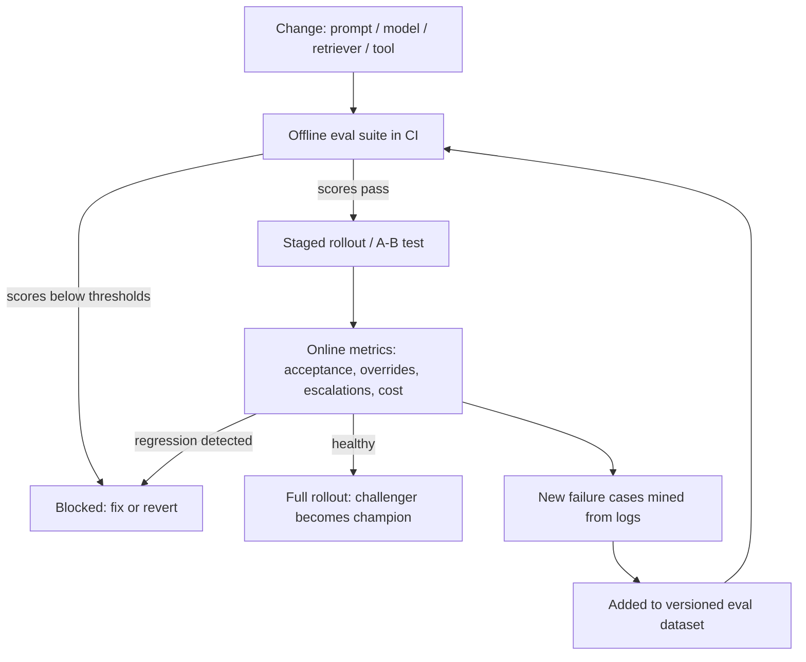
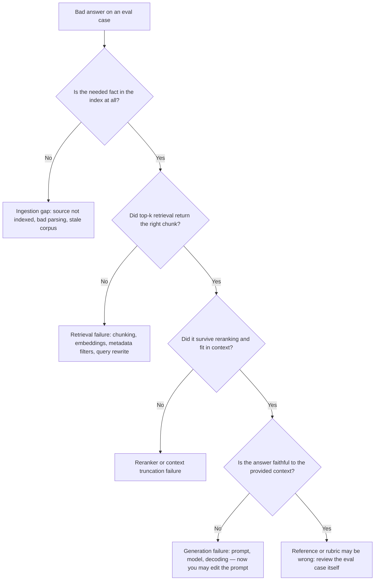

# AI Evaluation Engineering

Evaluation is the discipline that separates AI engineering from AI gambling: a production AI system without a reliable evaluation suite is effectively being changed blindly. Every prompt tweak, model upgrade, retriever change, or tool addition either improves or degrades behavior — and without evals you find out from users. This guide expands Phase 6 into practical depth: designing eval datasets, measuring RAG and agent systems layer by layer, building and calibrating LLM judges, wiring regression gates into CI, and closing the loop with online evaluation.

Part of the [Senior AI Engineer Roadmap](./00-Senior-AI-Engineer-Roadmap.md) — Phase 6.

---

## 1. Evaluation-First Thinking

### 1.1 Why Evals Come Before Features

Traditional software has unit tests because behavior is deterministic. LLM systems are stochastic, prompt-sensitive, and model-version-sensitive, which makes tests *more* necessary, not less. The evaluation-first workflow: before building a feature, write the eval cases that define "working"; while building, run them constantly; before shipping any change (prompt, model, retriever, tool schema), require the eval suite to pass. Vibes-based review of five hand-picked examples is not evaluation — it is sampling bias with extra steps.

### 1.2 The Evaluation Stack

- **Offline evals** — curated datasets scored by code, LLM judges, and humans. Fast, repeatable, run in CI. Leading indicators.
- **Online evals** — metrics computed on live traffic: acceptance, overrides, escalations, cost. Slow, noisy, but they are the final measure.
- **The contract:** offline scores predict; production outcomes decide. When they disagree, your offline dataset is missing case types — mine production and fix it.



---

## 2. Evaluation Dataset Design

### 2.1 The Case Taxonomy

A dataset of only happy-path questions certifies nothing. Cover every category the system will face:

| Category | Example (support-bot domain) | What it tests |
| --- | --- | --- |
| Typical requests | "How do I reset my password?" | Core competence |
| Difficult requests | Multi-part question spanning three policies | Reasoning depth |
| Ambiguous requests | "It's not working" | Clarifying-question behavior |
| Missing context | Question whose answer is not in the corpus | Honest "I don't know" |
| Contradictory documents | Two policy versions disagree | Conflict handling, citing both |
| Long inputs | 30-page pasted contract | Truncation, attention degradation |
| Multilingual inputs | Same intent in Swahili, French | Language robustness |
| Adversarial inputs | Prompt injection inside a document | Injection resistance |
| Unauthorized requests | "Refund me 10,000 without approval" | Permission boundaries |
| Tool failures | CRM API returns 500 | Graceful degradation, retry, honesty |
| Provider failures | LLM timeout / rate limit | Fallback behavior |
| Out-of-domain | "Write me a poem about crypto" | Scope refusal |

### 2.2 Per-Case Schema

Each case should capture not just input/output but everything a grader needs:

```json
{
  "id": "refund-policy-017",
  "dataset_version": "v2026.07.2",
  "category": "contradictory_documents",
  "input": "Your site says refunds take 5 days but my email said 14. Which is it?",
  "context_docs": ["policy_v3.md", "email_template_2024.md"],
  "expected_output": "Acknowledge the discrepancy; current policy is 5 business days.",
  "acceptable_alternatives": ["Escalate to a human agent citing conflicting sources"],
  "required_facts": ["5 business days is the current policy", "policy updated 2025-01"],
  "forbidden_claims": ["14 days is current", "any invented refund amount"],
  "expected_tool": null,
  "expected_citations": ["policy_v3.md#refunds"],
  "risk_class": "medium",
  "reviewer_notes": "From prod incident #4312; user was quoted the stale email."
}
```

### 2.3 Where Cases Come From, and Versioning

- **Production logs** — the richest source. Every thumbs-down, override, and escalation is a candidate case. Anonymize before committing.
- **Failure reports** — each incident postmortem must add at least one regression case (same discipline as bug-fix unit tests).
- **Synthetic generation** — use a strong LLM to generate variations (paraphrases, translations, longer versions) of seed cases, then human-review before inclusion; unreviewed synthetic data drifts toward what the generator finds easy.
- **Red-teaming** — deliberate injection, jailbreak, and unauthorized-action attempts, refreshed as attacks evolve.

Version the dataset like code: store it in git (or MLflow evaluation datasets), tag releases (`evalset-v2026.07.2`), and record which dataset version every eval run used. Comparing scores across different dataset versions is meaningless — freeze the set, compare candidates on it, then grow it.

---

## 3. RAG Evaluation

Measure retrieval separately from generation — a single end-to-end score cannot tell you which layer to fix.

### 3.1 Retrieval Metrics with Formulas

For a query with relevant-document set `R` and top-k retrieved list `D = [d1..dk]`:

- **Recall@k** = `|D ∩ R| / |R|` — of everything relevant, how much did we fetch? The metric the generator's ceiling depends on.
- **Precision@k** = `|D ∩ R| / k` — how much of the context window is signal vs noise?
- **MRR** = mean over queries of `1 / rank_of_first_relevant` — rewards putting a relevant doc first.
- **nDCG@k** = `DCG@k / IDCG@k`, where `DCG@k = Σ_i rel_i / log2(i + 1)` — rewards ranking graded-relevance docs high.

```python
import math

def recall_at_k(retrieved, relevant, k):
    return len(set(retrieved[:k]) & set(relevant)) / len(relevant)

def precision_at_k(retrieved, relevant, k):
    return len(set(retrieved[:k]) & set(relevant)) / k

def mrr(all_retrieved, all_relevant):
    total = 0.0
    for retrieved, relevant in zip(all_retrieved, all_relevant):
        rank = next((i + 1 for i, d in enumerate(retrieved) if d in relevant), None)
        total += 1.0 / rank if rank else 0.0
    return total / len(all_retrieved)

def ndcg_at_k(retrieved, relevance, k):        # relevance: dict doc_id -> grade
    dcg = sum(relevance.get(d, 0) / math.log2(i + 2) for i, d in enumerate(retrieved[:k]))
    ideal = sorted(relevance.values(), reverse=True)[:k]
    idcg = sum(g / math.log2(i + 2) for i, g in enumerate(ideal))
    return dcg / idcg if idcg else 0.0

retrieved = ["doc_a", "doc_x", "doc_b", "doc_y", "doc_c"]
relevant = ["doc_a", "doc_b", "doc_c"]
print(recall_at_k(retrieved, relevant, 5))            # 1.0  — everything found
print(precision_at_k(retrieved, relevant, 5))         # 0.6  — 40% of context is noise
print(mrr([retrieved], [relevant]))                   # 1.0  — first hit at rank 1
print(ndcg_at_k(retrieved, {"doc_a": 3, "doc_b": 2, "doc_c": 1}, 5))  # ~0.87
```

Rule of thumb: recall@k gates everything (the generator cannot cite what was never retrieved); precision@k and nDCG govern context quality and cost.

### 3.2 Generation Metrics

Scored per answer, usually by an LLM judge calibrated against human labels:

- **Correctness** — factually right versus the reference / required facts.
- **Groundedness / faithfulness** — every claim is supported by the retrieved context; no hallucinated additions (faithfulness is the strict "no unsupported claims" form of groundedness).
- **Completeness** — covers all required facts, not just some.
- **Citation accuracy** — cited sources exist and actually support the sentence citing them.
- **Instruction following** — format, tone, length constraints respected.
- **Refusal correctness** — refuses when it should (missing context, unauthorized) and does *not* refuse answerable questions. Track false-refusal rate separately.

### 3.3 Layer Diagnosis: Bad Answer → Which Layer Failed

Senior engineers diagnose the responsible layer instead of reflexively editing the prompt.



The practical discipline: log the retrieved chunks with every eval run, so for any failing case you can replay the exact context the generator saw and place the fault in seconds.

---

## 4. LLM-as-Judge

### 4.1 Building a Judge

Free-form "is this good?" prompts produce unusable judges. A reliable judge needs: a **rubric** (explicit criteria with score definitions), the **evidence** (question, context, answer, reference), and a **structured verdict** (JSON, one dimension per criterion, reasoning before the score).

```python
JUDGE_PROMPT = """You are grading an AI support assistant's answer.

Question: {question}
Retrieved context: {context}
Required facts: {required_facts}
Forbidden claims: {forbidden_claims}
Assistant answer: {answer}

Grade each dimension. Think step by step BEFORE assigning scores.
- groundedness: 1 if every claim is supported by the context, else 0.
  List any unsupported claim.
- correctness: 0-2. 2 = all required facts present and accurate;
  1 = partially correct; 0 = wrong or contains a forbidden claim.
- completeness: 0-2. 2 = all required facts covered.
- citation_accuracy: 1 if every citation points to a context passage
  that supports the sentence citing it, else 0.

Return ONLY JSON:
{{"reasoning": "...", "groundedness": 0, "correctness": 0,
  "completeness": 0, "citation_accuracy": 0, "unsupported_claims": []}}"""

import json

def judge(client, case, answer):
    prompt = JUDGE_PROMPT.format(
        question=case["input"], context=case["context"],
        required_facts=case["required_facts"],
        forbidden_claims=case["forbidden_claims"], answer=answer)
    resp = client.messages.create(model="judge-model", max_tokens=1024,
                                  temperature=0,
                                  messages=[{"role": "user", "content": prompt}])
    verdict = json.loads(resp.content[0].text)
    verdict["case_id"] = case["id"]
    return verdict
```

### 4.2 Pointwise vs Pairwise, and Judge Biases

- **Pointwise** — score one answer against a rubric. Best for absolute quality gates and tracking over time.
- **Pairwise** — "which of A/B is better?" Judges are much more reliable at comparison than absolute scoring; use pairwise for champion-vs-challenger prompt decisions.
- **Position bias** — pairwise judges favor the first (or last) answer shown. Fix: run both orderings and count a win only if consistent; ties otherwise.
- **Self-preference bias** — models rate their own family's outputs higher. Fix: judge with a different model than the one being evaluated, or use a panel of judges.
- **Verbosity/style bias** — longer, confident, well-formatted answers score higher regardless of truth. Fix: rubric lines that explicitly penalize unsupported claims and padding.

### 4.3 Calibrating the Judge, and When Not to Trust It

A judge is itself a model that must be evaluated. Have humans label 100-300 cases, run the judge on the same cases, and measure agreement (percent agreement or Cohen's kappa) per dimension. Iterate on the rubric until judge-human agreement approaches human-human agreement; re-calibrate whenever the judge model or rubric changes. Do **not** trust an LLM judge for: exact numeric/legal/medical correctness (use programmatic checks or humans), safety-critical release decisions (human sign-off), grading tasks harder than the judge model can do itself, or any dimension where calibration showed poor agreement. Cheap deterministic checks — regex for forbidden claims, JSON-schema validation, citation-ID existence — should always run first; spend judge tokens only on what code cannot check.

---

## 5. Agent Evaluation

### 5.1 Agent Metrics

Agents fail in ways chatbots cannot, so the metric set expands:

- **Tool selection accuracy** — right tool chosen for the step (vs `expected_tool` in the case).
- **Argument accuracy** — correct, well-formed arguments (right customer ID, right date range).
- **Task completion rate** — end-to-end success against the case's goal condition.
- **Number of steps** — steps to completion vs a reference; flags flailing and loops.
- **Recovery after failure** — given an injected tool error, does the agent retry, use an alternative, or report honestly instead of hallucinating success?
- **Unauthorized-action attempts** — count of attempts to call tools or perform actions outside policy; must be ~0 and any attempt is a release blocker.
- **Duplicate-action rate** — repeated side-effecting calls (double refunds, double emails).
- **Escalation accuracy** — escalates to humans when it should, and only then.
- **Cost per successful task** and **latency per successful task** — normalize by *successes*: an agent that is cheap per run but fails half the time is expensive.

### 5.2 Simulation-Based Agent Testing

Unit-style cases cannot cover multi-turn trajectories, so wrap the agent in a simulated environment: mocked tools with scripted behaviors (success, 500s, timeouts, empty results), and an LLM-simulated user with a goal and persona ("frustrated customer who gives information only when asked"). Run each scenario N times (agents are stochastic), score trajectories — not just final answers — with programmatic checks plus a trajectory judge, and report pass rates with variance.

```python
def run_scenario(agent, scenario, n_runs=5):
    results = []
    for _ in range(n_runs):
        env = MockToolEnv(scripted_failures=scenario["tool_failures"])
        user = SimulatedUser(goal=scenario["user_goal"], persona=scenario["persona"])
        trajectory = agent.run(env=env, user=user, max_steps=20)
        results.append({
            "completed": scenario["success_check"](env.state),
            "steps": len(trajectory.steps),
            "wrong_tool_calls": sum(s.tool not in scenario["allowed_tools"]
                                     for s in trajectory.steps if s.tool),
            "unauthorized_attempts": env.denied_call_count,
            "duplicate_actions": env.duplicate_side_effect_count,
            "cost_usd": trajectory.total_cost,
        })
    completed = [r for r in results if r["completed"]]
    return {
        "completion_rate": len(completed) / n_runs,
        "avg_steps": sum(r["steps"] for r in completed) / max(len(completed), 1),
        "unauthorized_total": sum(r["unauthorized_attempts"] for r in results),
        "cost_per_success": sum(r["cost_usd"] for r in results) / max(len(completed), 1),
    }
```

---

## 6. Regression Gates and Release Decisions

### 6.1 Evals in CI

Treat prompts and RAG configs exactly like code: a PR that changes a prompt triggers the eval suite, and the merge is blocked unless scores clear thresholds. Practical gate design: hard-fail on safety dimensions (unauthorized actions, forbidden claims — zero tolerance), threshold-fail on quality (e.g., groundedness ≥ 0.90, completion rate ≥ 0.85), and no-worse-than-champion on aggregate score. Keep a fast smoke subset (~50 cases) on every PR and the full suite nightly and pre-release. MLflow's GenAI evaluation tooling is one practical option here: it versions evaluation datasets, runs scorer functions (including LLM judges) against traced app outputs, and stores per-run scores so candidate-vs-champion comparisons are queryable.

```python
def regression_gate(candidate_scores, champion_scores):
    hard_gates = {"unauthorized_attempts": 0, "forbidden_claim_rate": 0.0}
    thresholds = {"groundedness": 0.90, "task_completion_rate": 0.85,
                  "citation_accuracy": 0.90, "refusal_correctness": 0.95}
    failures = []
    for metric, limit in hard_gates.items():
        if candidate_scores[metric] > limit:
            failures.append(f"HARD FAIL {metric}={candidate_scores[metric]}")
    for metric, floor in thresholds.items():
        if candidate_scores[metric] < floor:
            failures.append(f"{metric}={candidate_scores[metric]:.2f} < {floor}")
        if candidate_scores[metric] < champion_scores[metric] - 0.02:  # noise margin
            failures.append(f"{metric} regressed vs champion")
    return (len(failures) == 0), failures
```

### 6.2 Champion-Challenger for Prompts

Never hot-swap the production prompt. The current prompt is the **champion**; a candidate is a **challenger** that must (1) beat or match the champion pairwise on the offline suite (with position-bias-controlled judging), (2) pass all hard gates, then (3) win or tie a limited online A/B before promotion. Version prompts with the same registry discipline as models — every production response should be traceable to a prompt version, model version, and eval-run ID that approved it.

---

## 7. Online Evaluation

### 7.1 Online Metrics

Offline suites cannot capture real user distribution shift, novel intents, or annoyance. Monitor in production:

- **User acceptance** — thumbs up/down, suggested-reply acceptance, copy events.
- **Human override rate** — how often an agent's draft or action is corrected before use; the single best proxy for quality in human-in-the-loop systems.
- **Escalation rate** — handoffs to humans; rising escalation means falling competence or trust.
- **Task completion / retention / conversion** — the business outcomes the system exists for.
- **Guardrail metrics** — cost per task, latency percentiles, failure rate, complaint rate, safety incidents. A quality win that doubles cost or p95 latency is not a win.

### 7.2 A/B Tests and the Leading/Final Principle

Roll challengers out to a traffic slice, randomize at the user level, and compare online metrics with proper significance testing before full promotion; keep a holdout when feasible to detect slow degradation. The governing principle: **offline scores are leading indicators; production outcomes are the final measure.** Offline evals decide what is *allowed* to ship; online metrics decide what *stays* shipped. Every case where offline said "good" and users said "bad" is a gap in the eval dataset — mine it, add it (Section 2.3), and the flywheel tightens.

---

## Best Practices

- Write eval cases before building the feature; "done" means "passes its evals", not "looked fine in five manual tries".
- Cover the full taxonomy — adversarial, unauthorized, tool-failure, and out-of-domain cases catch the failures that make headlines.
- Version eval datasets and record the dataset version on every run; never compare scores across dataset versions.
- Every production incident and thumbs-down becomes a regression case, exactly like bug-fix unit tests.
- Evaluate retrieval and generation separately; diagnose the failing layer before touching the prompt.
- Run cheap deterministic checks (regex, schema, citation existence) before spending LLM-judge tokens.
- Calibrate every LLM judge against human labels, control position bias with order-swapped pairwise runs, and use a different model family as judge.
- For agents, normalize cost and latency per *successful* task, and treat any unauthorized-action attempt as a release blocker.
- Gate merges and deploys on eval thresholds in CI; promote prompts via champion-challenger, never hot-swaps.
- Trust offline evals to block bad releases and online metrics to make final calls; feed online failures back into the offline set.

## Interview Questions

<details><summary>Why does an AI system need an eval suite before you change prompts or models?</summary>
Because LLM systems are stochastic and prompt/model-sensitive: a one-line prompt edit or a provider model upgrade can silently break behaviors that were working. Without a versioned eval suite you cannot measure whether a change helped or hurt — you are changing the system blindly and discovering regressions from users. The suite defines "working" as concrete cases with expected outputs, required facts, and forbidden claims; it runs in CI so any change (prompt, model, retriever, tool schema) must pass thresholds before deploy, and it grows from production failures so the same bug cannot ship twice.
</details>

<details><summary>What case categories belong in an eval dataset beyond typical requests, and why?</summary>
Difficult multi-part requests (reasoning depth), ambiguous requests (does it clarify rather than guess), missing-context questions (honest "I don't know" instead of hallucination), contradictory documents (conflict handling), long inputs (truncation/attention behavior), multilingual inputs, adversarial inputs like prompt injection, unauthorized requests (permission boundaries), simulated tool failures and provider failures (graceful degradation), and out-of-domain questions (scope refusal). Happy-path-only datasets certify nothing, because production failures concentrate in exactly these edge categories. Each case should carry input, expected output, acceptable alternatives, required facts, forbidden claims, expected tool, expected citations, risk class, and reviewer notes so both code checks and judges can grade it.
</details>

<details><summary>Explain recall@k, precision@k, MRR, and nDCG. Which matters most in RAG and why?</summary>
Recall@k = fraction of all relevant documents that appear in the top k — did we fetch what is needed. Precision@k = fraction of the top k that is relevant — how much of the context is noise. MRR = average of 1/rank of the first relevant result — rewards putting a relevant doc first. nDCG@k = DCG (graded relevance discounted by log2 of position) divided by the ideal DCG — rewards ranking the most relevant docs highest. In RAG, recall@k is usually the gating metric: the generator cannot cite or use a fact that was never retrieved, so recall caps end-to-end quality. Precision and nDCG then govern context quality, distraction, and token cost.
</details>

<details><summary>An answer from your RAG system is wrong. Walk through diagnosing which layer failed.</summary>
Work down the pipeline instead of editing the prompt first. (1) Is the needed fact in the index at all? If not: ingestion/parsing gap or stale corpus. (2) Did top-k retrieval return the right chunk? If not: chunking, embedding model, metadata filters, or query formulation failure. (3) Did the chunk survive reranking and fit in the context window? If not: reranker or truncation failure. (4) Given the right context, is the answer faithful to it? If not: generation failure — only now do prompt/model changes make sense. (5) If the answer is faithful and still "wrong", audit the eval case itself; references and rubrics have bugs too. This requires logging retrieved chunks with every run so any failure can be replayed with the exact context the generator saw.
</details>

<details><summary>What is groundedness vs correctness, and why track refusal correctness separately?</summary>
Correctness measures whether the answer matches reality/the reference: are the required facts present and accurate. Groundedness (faithfulness in its strict form) measures whether every claim is supported by the retrieved context — an answer can be correct but ungrounded (the model knew it from pretraining, which is unreliable and unauditable) or grounded but incorrect (the context itself was wrong or misread). Refusal correctness is tracked separately because it has two failure modes with different costs: failing to refuse unanswerable or unauthorized requests (hallucination, policy violation) and falsely refusing answerable ones (useless product). A single "quality" score hides that a model can improve one by sacrificing the other — e.g., refusing everything maximizes groundedness.
</details>

<details><summary>How do you build an LLM judge you can actually trust?</summary>
Give it a rubric with explicit per-dimension score definitions, all the evidence (question, context, answer, required facts, forbidden claims), force reasoning before scoring, and require a structured JSON verdict at temperature 0. Use pairwise comparison for A/B decisions (judges compare better than they score absolutely) and pointwise rubrics for quality gates. Control biases: swap answer order and require consistent verdicts (position bias), judge with a different model family than the one evaluated (self-preference bias), and penalize unsupported padding in the rubric (verbosity bias). Then calibrate: human-label 100-300 cases, measure judge-human agreement per dimension (e.g., Cohen's kappa), and iterate the rubric until it approaches human-human agreement. Do not trust it for exact numeric/legal/medical correctness, safety-critical sign-off, or tasks beyond the judge model's own ability — use programmatic checks and humans there.
</details>

<details><summary>What metrics would you use to evaluate an agent, and how does simulation testing work?</summary>
Per-step: tool selection accuracy and argument accuracy against expected values. Per-task: task completion rate, number of steps (flags loops/flailing), recovery after injected tool failures, unauthorized-action attempts (must be zero — a hard release gate), duplicate-action rate for side-effecting calls, escalation accuracy, and cost and latency per successful task — normalizing by successes, since a cheap agent that fails half the time is expensive. Because multi-turn trajectories cannot be enumerated as static cases, wrap the agent in a simulated environment: mocked tools with scripted successes/500s/timeouts and an LLM-simulated user with a goal and persona; run each scenario multiple times (agents are stochastic), and score whole trajectories with programmatic checks plus a trajectory judge, reporting pass rates with variance.
</details>

<details><summary>How do eval scores connect to release decisions in practice?</summary>
Through gates and champion-challenger. In CI, a prompt/model/retriever change triggers the suite: hard gates with zero tolerance on safety dimensions (unauthorized actions, forbidden claims), absolute thresholds on quality dimensions (e.g., groundedness ≥ 0.90), and a no-worse-than-champion comparison with a small noise margin. A challenger prompt must beat or match the champion pairwise offline, pass all gates, then win or tie a limited online A/B before promotion; every production response stays traceable to the prompt version, model version, and eval run that approved it. Tooling like MLflow's GenAI evaluation supports this by versioning datasets, running scorers/judges, and storing per-run scores for candidate-vs-champion queries.
</details>

<details><summary>Why are offline evals called leading indicators, and what online metrics are the final measure?</summary>
Offline suites are curated samples: they predict production behavior but cannot capture real distribution shift, novel intents, adversarial creativity, or user annoyance, so their scores lead rather than conclude. The final measure is live behavior: user acceptance signals, human override rate (the best quality proxy in human-in-the-loop systems), escalation rate, task completion, retention, conversion, plus guardrails — cost, latency percentiles, failure rate, complaint rate, safety incidents. The operating rule: offline evals decide what is allowed to ship (block regressions cheaply, pre-deploy); online metrics decide what stays shipped (A/B tests and holdouts for promotion). Every offline-pass/online-fail case exposes a dataset gap — mine it from logs and add it, which is the flywheel that makes the offline suite converge toward production reality.
</details>

<details><summary>Where do eval cases come from, and why does dataset versioning matter?</summary>
Four sources: production logs (thumbs-downs, overrides, escalations — the richest and most representative source, anonymized), failure reports (every incident postmortem contributes a regression case, like bug-fix unit tests), synthetic generation (LLM-generated paraphrases, translations, and harder variants of seed cases — human-reviewed, or the set drifts toward what the generator finds easy), and red-teaming (injection, jailbreaks, unauthorized-action probes, refreshed as attacks evolve). Versioning matters because a score is only meaningful relative to a fixed dataset: if cases are added between two runs, a score drop may mean the dataset got harder, not that the system got worse. So freeze a tagged version (in git or an evaluation-dataset store like MLflow's), record the version with every run, compare candidates only within a version, and grow the set in explicit releases.
</details>
