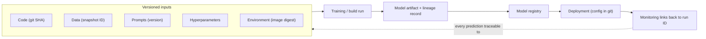
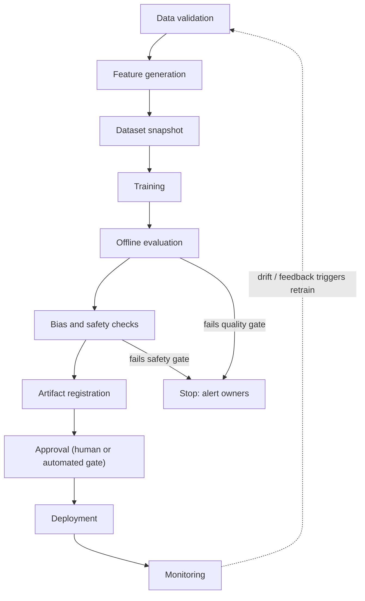
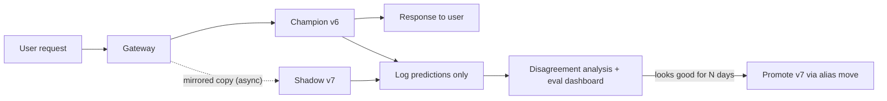

# MLOps and LLMOps

MLOps is the discipline of making AI systems reproducible, deployable, and governable — treating models, data, and prompts with the same rigor that software engineering applies to code. This guide covers versioning everything that matters, experiment tracking and model registries with MLflow, production training pipelines, CI/CD with AI-specific test layers, and deployment strategies designed for systems that can fail in subtle, probabilistic ways.

Part of the [Senior AI Engineer Roadmap](./00-Senior-AI-Engineer-Roadmap.md) — Phase 7.

---

## 1. Reproducibility: Version Everything

A model artifact without its data lineage and configuration is incomplete. If you cannot rebuild a model (or explain a prediction it made six months ago), you do not own it — you are merely hosting it.

Everything that must be versioned:

| What | Why | Typical tool |
| --- | --- | --- |
| Source code | The training logic itself | Git |
| Training data | Same code + different data = different model | DVC, LakeFS, versioned snapshots in object storage |
| Evaluation data | A moving eval set makes metrics incomparable | DVC, dataset registry |
| Features | Feature definitions drift; training-serving skew | Feature store, versioned SQL |
| Prompts | A prompt change is a model change in LLM systems | Prompt registry, Git |
| Model weights | The deployable artifact | MLflow registry, object storage |
| Hyperparameters | Needed to reproduce a run | MLflow params, config files |
| Containers | Same code, different CUDA version = different results | Image digests, not `:latest` |
| Dependencies | Transitive upgrades silently change behavior | Lockfiles (`uv.lock`, `poetry.lock`) |
| Infrastructure | GPU type affects numerics and latency | Terraform state, IaC |
| Deployment config | Batch size, timeouts, routing rules | Git + GitOps (Argo CD) |

**Common pitfall:** teams version code religiously and nothing else. Then a retrain "with the same code" produces a worse model because the upstream table changed, and nobody can prove it.



---

## 2. Experiment Tracking and Model Registry (MLflow)

### 2.1 Logging a run

Every experiment should record: dataset version, code revision, hyperparameters, seed, metrics, artifacts, and environment.

```python
import mlflow
import mlflow.sklearn
from sklearn.ensemble import GradientBoostingClassifier
from sklearn.metrics import roc_auc_score

mlflow.set_tracking_uri("http://mlflow.internal:5000")
mlflow.set_experiment("fraud-risk-v2")

with mlflow.start_run(run_name="gbm-baseline") as run:
    # Log everything needed to reproduce this run
    mlflow.log_params({
        "n_estimators": 300,
        "learning_rate": 0.05,
        "max_depth": 4,
        "random_seed": 42,
    })
    # Link the exact data used — not just "the fraud table"
    mlflow.log_param("dataset_snapshot", "s3://ml-data/fraud/snapshots/2026-07-20/")
    mlflow.set_tag("git_sha", "81efbbf")

    model = GradientBoostingClassifier(
        n_estimators=300, learning_rate=0.05, max_depth=4, random_state=42
    )
    model.fit(X_train, y_train)

    auc = roc_auc_score(y_val, model.predict_proba(X_val)[:, 1])
    mlflow.log_metric("val_roc_auc", auc)

    mlflow.sklearn.log_model(model, name="model")
    print(f"run_id={run.info.run_id} auc={auc:.4f}")
```

### 2.2 Registering, aliasing, promoting, rolling back

Modern MLflow uses **aliases** (e.g. `champion`, `challenger`) instead of the deprecated stage system. An alias is a mutable pointer to an immutable version — promotion and rollback are just pointer moves.

```python
from mlflow import MlflowClient

client = MlflowClient()

# Register the model from a run into the registry
result = mlflow.register_model(
    model_uri=f"runs:/{run.info.run_id}/model",
    name="fraud-risk",
)
new_version = result.version  # e.g. "7"

# Attach approval metadata before promotion
client.set_model_version_tag("fraud-risk", new_version, "approved_by", "risk-team")
client.set_model_version_tag("fraud-risk", new_version, "eval_suite", "eval-2026-07")

# Promote: move the alias to the new version
client.set_registered_model_alias("fraud-risk", "champion", new_version)

# Serving code always loads by alias, never by hard-coded version:
model = mlflow.pyfunc.load_model("models:/fraud-risk@champion")

# Rollback: point the alias back at the previous good version. No redeploy of code.
client.set_registered_model_alias("fraud-risk", "champion", "6")
```

**Common pitfall:** loading `models:/fraud-risk/7` directly in serving code. Now rollback requires a code change and a deploy. Aliases make rollback an operation, not a release.

---

## 3. Training Pipelines

A production training pipeline is a DAG, not a notebook. The roadmap's canonical flow:



Key properties: each stage is idempotent and retryable, the snapshot stage pins data before training (so a retry trains on identical data), and failure stops the pipeline *before* registration — a bad model should never reach the registry, let alone production.

### Prefect example

```python
from prefect import flow, task

@task(retries=3, retry_delay_seconds=60)
def validate_data(snapshot_date: str) -> str:
    # Schema, null-rate, freshness, and leakage checks (see CI/CD section)
    # Fail loudly here — cheapest place to catch bad data
    return f"s3://ml-data/fraud/raw/{snapshot_date}/"

@task
def build_features(raw_path: str) -> str:
    # Point-in-time correct feature generation
    return raw_path.replace("/raw/", "/features/")

@task
def snapshot_dataset(features_path: str) -> str:
    # Immutable, versioned copy — the run's single source of truth
    return features_path.replace("/features/", "/snapshots/")

@task(timeout_seconds=6 * 3600)
def train(snapshot_path: str) -> str:
    # Returns an MLflow run_id; logs params/metrics/artifacts inside
    ...

@task
def evaluate_and_gate(run_id: str) -> bool:
    # Compare against champion on the SAME frozen eval set
    ...

@task
def register_if_better(run_id: str, passed: bool) -> None:
    if not passed:
        raise ValueError("Quality gate failed; not registering")
    ...

@flow(name="fraud-training-pipeline")
def training_pipeline(snapshot_date: str):
    raw = validate_data(snapshot_date)
    feats = build_features(raw)
    snap = snapshot_dataset(feats)
    run_id = train(snap)
    passed = evaluate_and_gate(run_id)
    register_if_better(run_id, passed)

if __name__ == "__main__":
    # Deploy on a schedule; also allow dataset-arrival triggers and backfills
    training_pipeline.serve(name="nightly", cron="0 2 * * *")
```

The same DAG in Airflow uses `@dag`/`@task` decorators with near-identical structure; what matters is the shape (validate -> snapshot -> train -> gate -> register), retry policies, and secrets coming from a secret manager rather than the DAG file.

---

## 4. CI/CD for AI: Four Test Layers

Classic CI tests only the first layer. AI systems need all four:

1. **Software** — unit, integration, contract tests; dependency and container scanning.
2. **Data** — schema checks, null rates, distribution shifts, freshness, leakage checks.
3. **Model** — minimum quality thresholds, segment-level performance, calibration, regression vs. champion, latency and memory budgets.
4. **Generative AI** — prompt regression, retrieval regression, tool-use accuracy, safety tests, cost thresholds, citation correctness.

```yaml
# .github/workflows/ai-ci.yml
name: ai-ci
on:
  pull_request:
  push:
    branches: [main]

jobs:
  software-tests:
    runs-on: ubuntu-latest
    steps:
      - uses: actions/checkout@v4
      - uses: actions/setup-python@v5
        with: { python-version: "3.12" }
      - run: pip install uv && uv sync
      - run: uv run ruff check . && uv run mypy src/
      - run: uv run pytest tests/unit tests/integration
      - name: Container scan
        run: docker build -t app:${{ github.sha }} . && trivy image app:${{ github.sha }}

  data-validation:
    runs-on: ubuntu-latest
    needs: software-tests
    steps:
      - uses: actions/checkout@v4
      - name: Schema, nulls, distributions, leakage
        run: |
          uv run python -m checks.validate \
            --snapshot $DATASET_SNAPSHOT \
            --schema configs/fraud_schema.yaml \
            --max-null-rate 0.02 \
            --psi-threshold 0.2 \
            --leakage-columns "settled_at,chargeback_flag"

  model-quality-gates:
    runs-on: ubuntu-latest
    needs: data-validation
    steps:
      - uses: actions/checkout@v4
      - name: Evaluate candidate vs champion on frozen eval set
        run: |
          uv run python -m checks.model_gates \
            --candidate "models:/fraud-risk@challenger" \
            --champion  "models:/fraud-risk@champion" \
            --min-auc 0.85 \
            --max-auc-regression 0.005 \
            --segments "country,customer_tier" \
            --max-p99-latency-ms 120

  genai-checks:
    runs-on: ubuntu-latest
    needs: software-tests
    steps:
      - uses: actions/checkout@v4
      - name: Prompt regression suite
        # Golden dataset of inputs -> required facts / forbidden claims.
        # Fails if groundedness, tool accuracy, or cost regress.
        run: |
          uv run python -m checks.prompt_regression \
            --prompt-version ${{ github.sha }} \
            --eval-set evals/golden_v3.jsonl \
            --min-groundedness 0.92 \
            --min-tool-accuracy 0.95 \
            --max-cost-per-task-usd 0.04
```

**Common pitfall:** running the prompt regression against a *changing* eval set. Freeze and version the eval data; otherwise a "regression" might just be new harder cases, and a real regression might hide behind new easy ones.

---

## 5. Deployment Strategies

| Strategy | Mechanism | Best for |
| --- | --- | --- |
| Blue-green | Two full environments; flip the router | Instant, all-or-nothing cutover with instant rollback |
| Canary | Route 1-5% of traffic to the new version, ramp up | Catching latency/error regressions cheaply |
| Shadow | New version receives a mirrored copy of live traffic; outputs logged, never returned | High-risk AI: validate on real traffic with zero user impact |
| Champion-challenger | Both score every request; champion decides, challenger is evaluated offline | Model comparison on identical, real inputs |
| A/B test | Users randomly split; compare business metrics | Measuring real outcome impact (not just model metrics) |
| Feature flags | Config-controlled behavior toggles | Decoupling deploy from release; per-tenant rollout |
| Model rollback | Move registry alias back to previous version | Any bad model release |
| Prompt rollback | Revert prompt version in the prompt registry | Bad prompt release (as critical as model rollback) |

### Why shadow deployments matter for high-risk AI

Offline evaluation uses historical data; production traffic contains distribution shifts, adversarial inputs, and edge cases your eval set has never seen. A shadow deployment lets the new model or prompt process *real* production traffic — same inputs, same load, same latency conditions — while the incumbent still makes every user-visible decision. For a fraud model or medical triage assistant, this is the only way to answer "how would the new system have behaved on this week's actual traffic?" with zero user risk. You compare decisions, measure disagreement rates, and inspect the cases where challenger and champion diverge before a single customer is affected.



**Prompt rollback deserves equal ceremony.** In LLM systems a prompt edit changes behavior as much as a weight update. Version prompts, deploy them through the same pipeline (regression suite, canary), and keep one-command rollback:

```python
# Prompt registry pattern: serving code loads by alias, like models
prompt = prompt_registry.load("support-agent-system-prompt", alias="production")
# Rollback = registry.set_alias("support-agent-system-prompt", "production", "v14")
```

---

## Best Practices

- **Load models and prompts by alias, never by version number**, in serving code. Rollback must be a pointer move, not a redeploy.
- **Snapshot data before training.** A pipeline that reads "the current table" is not reproducible; a retry an hour later trains on different data.
- **Version prompts and eval sets with the same rigor as model weights.** In LLM systems, all three are the model.
- **Gate registration, not just deployment.** A model that fails quality or safety checks should never enter the registry.
- **Freeze eval sets and version them.** Metrics on a moving eval set are noise. Add new cases via a new eval version, and re-baseline deliberately.
- **Shadow first for high-risk systems, canary for everything else.** Never do big-bang cutovers of decision-making AI.
- **Pin container images by digest** and lock dependencies. "Same code" on a different CUDA/driver stack is not the same system.
- **Automate retraining triggers from monitoring** (drift, feedback volume), but keep a human approval gate before promotion in high-stakes domains.
- **Record `git_sha`, dataset snapshot ID, and prompt version on every prediction log.** Incident forensics depend on this.

## Interview Questions

<details><summary>What needs to be versioned to make an ML system truly reproducible, and what breaks if you only version code?</summary>
Code, training data, evaluation data, feature definitions, prompts, model weights, hyperparameters, random seeds, dependencies (lockfiles), container images (digests), infrastructure, and deployment configuration. If you only version code: a retrain on drifted upstream data silently produces a different model; eval metrics become incomparable because the eval set changed; you cannot explain historical predictions; and rollback may restore code but not the model/data state that made it work. The rule: a model artifact without its data lineage and configuration is incomplete.
</details>

<details><summary>Explain MLflow model registry aliases and why they beat hard-coded model versions in serving code.</summary>
An alias (e.g. <code>champion</code>, <code>challenger</code>) is a mutable named pointer to an immutable registered model version. Serving code loads <code>models:/name@champion</code>. Promotion is moving the alias to a new version; rollback is moving it back — both are registry operations with no code change or redeploy. Hard-coding <code>models:/name/7</code> couples releases to deploys, slows rollback during incidents, and scatters version knowledge across services. Aliases also give a natural place to attach approval metadata via tags before the pointer moves.
</details>

<details><summary>Walk through the stages of a production training pipeline. Where do you put the gates?</summary>
Data validation -> feature generation -> dataset snapshot -> training -> offline evaluation -> bias/safety checks -> artifact registration -> approval -> deployment -> monitoring (which feeds back into retraining triggers). Gates: (1) after data validation — bad data must not reach training; (2) after offline evaluation — the candidate must beat minimum thresholds and not regress vs. the champion on a frozen eval set, including per-segment; (3) after bias/safety checks; (4) an approval gate (human for high-stakes domains) before deployment. Critically, a failing model must be stopped before registration, not just before deployment.
</details>

<details><summary>CI/CD for AI has four test layers. Name them and give two example checks per layer.</summary>
(1) Software: unit/integration/contract tests, security and container scanning. (2) Data: schema checks, null-rate limits, distribution/PSI checks, freshness, leakage checks (e.g. asserting future-only columns are absent from features). (3) Model: minimum quality thresholds, max regression vs. champion, segment-level performance, calibration, latency and memory budgets. (4) Generative AI: prompt regression against a golden set, retrieval regression, tool-use accuracy, safety/red-team tests, cost-per-task thresholds, citation correctness. Classic CI covers only layer 1; AI incidents mostly originate in layers 2-4.
</details>

<details><summary>When would you choose a shadow deployment over a canary, and what does shadow not tell you?</summary>
Choose shadow when the cost of a wrong user-visible decision is high (fraud authorization, medical triage, financial actions): the challenger processes mirrored real traffic but its outputs are only logged, so user risk is zero while you measure behavior on true production distribution and load. A canary exposes a small percentage of users to the new version, so it carries real risk but measures real outcomes. Shadow cannot tell you: user reactions and downstream business metrics (nobody sees its outputs), effects of its decisions feeding back into the system (e.g. blocked transactions changing user behavior), and anything requiring interaction loops. Typical sequence for high-risk AI: shadow -> canary -> ramped rollout, with champion-challenger comparison throughout.
</details>

<details><summary>Why does prompt rollback need the same machinery as model rollback?</summary>
In an LLM system, behavior = weights + prompt + retrieval + tools. A prompt edit can change refusal behavior, tool selection, output schema compliance, and safety properties as much as swapping the model. Therefore prompts must be versioned in a registry, released through the same pipeline (prompt regression suite, canary), tagged on every request log, and revertible with one operation. Teams that hot-edit prompts in production have unversioned model changes with no rollback path — the exact anti-pattern MLOps exists to prevent.
</details>

<details><summary>Your nightly retrain produced a model that passed CI but degraded in production. What are the likely causes and what would you change?</summary>
Likely causes: eval set no longer represents production traffic (distribution drift); training-serving skew (features computed differently online vs offline); leakage in training making offline metrics optimistic; segment-level regression hidden by aggregate metrics; latency/memory regression under real load; or the eval gate compared against a stale champion baseline. Changes: add drift monitoring that gates promotion, add segment-level and calibration gates, validate point-in-time correctness of features, run the candidate in shadow against live traffic before promotion, and log model/prompt/data versions on every prediction so the regression can be attributed quickly and rolled back via alias.
</details>

<details><summary>What is champion-challenger and how does it differ from an A/B test?</summary>
Champion-challenger: both models score every (or a sampled subset of) production request; only the champion's output is used for the decision, while the challenger's outputs are logged and compared. It answers "how would B have decided on identical real inputs?" without user exposure — essentially a structured shadow comparison. An A/B test splits users between versions, so both versions affect real users, and it measures actual downstream/business outcomes (conversion, loss rate) with statistical testing. Use champion-challenger to build confidence safely; use A/B when you need causal evidence of business impact and the risk is acceptable.
</details>
