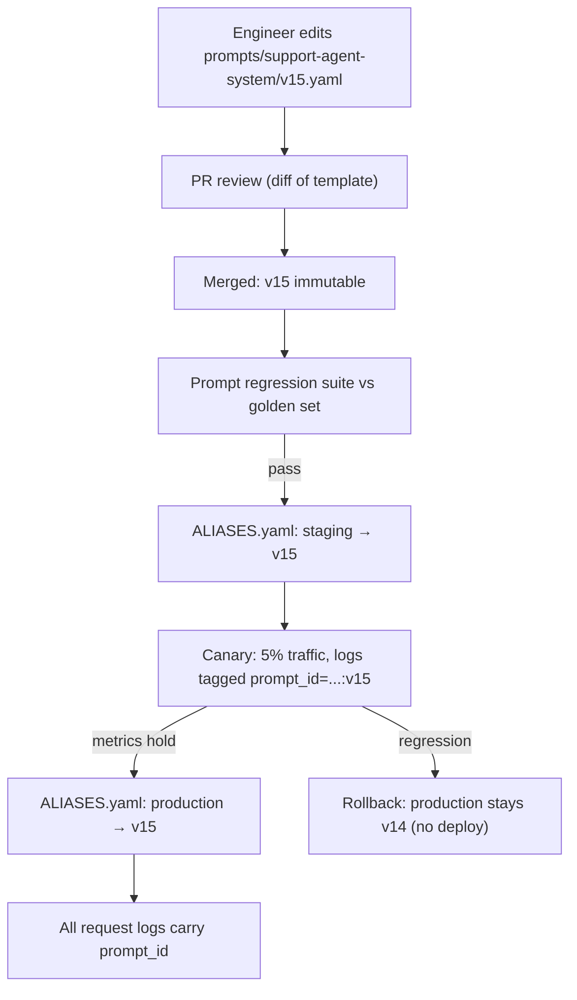

# Reproducibility and Versioning

Reproducibility is the foundation everything else in MLOps stands on. If you cannot rebuild a model bit-for-bit (or at least metric-for-metric), you cannot debug it, audit it, compare against it, or roll back to it — you are merely hosting a binary you no longer understand. The engineering discipline is simple to state and hard to practice: **every input that can change the model's behavior must have a version identifier, and those identifiers must travel together as a single lineage record.**

This guide builds the full versioning matrix (what to version, with what tool, at what granularity, and what the identifier looks like), designs and implements a concrete model-manifest schema, covers content-addressable data versioning, environment pinning down to CUDA drivers, the honest limits of seed-based determinism on GPUs, prompt versioning as a first-class system, and finishes with a walkthrough of reproducing a six-month-old model — and everything that breaks when you try.

Part of the [Senior AI Engineer Roadmap](../00-Senior-AI-Engineer-Roadmap.md) — Phase 7.

---

## 1. The Full Versioning Matrix

"Version everything" is a slogan. Engineering it means answering three questions per artifact class: what tool holds the versions, what granularity a version covers, and what the identifier literally looks like (because that string must be storable in a manifest and greppable in logs).

| What | Tool | Granularity | Identifier looks like |
| --- | --- | --- | --- |
| Source code | Git | Commit | `git_sha: 81efbbf3a9c...` (full 40-char SHA, never the short form in manifests) |
| Training data | Snapshot in object storage + hash manifest; DVC/LakeFS if you want tooling | Immutable snapshot per training run | `s3://ml-data/fraud/snapshots/2026-07-20T02:00Z/` + `sha256:9f2ab8...` over the manifest |
| Evaluation data | Same as training data, but frozen far longer; a registry entry per eval version | Named, frozen eval set version | `eval-fraud-v3` → `sha256:c41d0e...` |
| Feature definitions | Git (SQL/Python defs) + feature store metadata | Per feature-view version | `fraud_features:v12` or the git SHA of the definitions repo |
| Prompts | Prompt registry (or Git + registry index) | Template version; params separate | `support-agent-system:v14` |
| Model weights | Model registry (MLflow) + object storage | Registered model version | `models:/fraud-risk/7` (immutable) + `champion` alias (mutable pointer) |
| Hyperparameters | Logged with the run (MLflow params) + config file in Git | Per run | The run ID owns them: `run_id: a1b2c3...` |
| Containers | Registry digests — never tags | Image digest | `ghcr.io/acme/trainer@sha256:8d1f...` (a tag like `:v3` is a mutable pointer; a digest is content-addressed) |
| Dependencies | Lockfiles committed to Git | Full transitive closure | `uv.lock` / `poetry.lock` at the training commit; hash of the lockfile in the manifest |
| Infrastructure | Terraform/IaC in Git + state versioning | Per apply | Terraform state serial + module git SHA; GPU SKU recorded (`a10g`, `h100-sxm`) |
| Deployment config | Git + GitOps (Argo CD app manifests) | Per environment per release | Git SHA of the config repo; Argo sync revision |

Three observations senior engineers internalize:

1. **Mutable pointers vs immutable identities.** Tags, aliases, branch names, and "the current table" are pointers. Digests, SHAs, snapshot paths with timestamps, and content hashes are identities. Manifests must contain identities only; serving systems may use pointers, but every pointer dereference should be logged as the identity it resolved to.
2. **The granularity must match the blast radius.** Versioning "the data lake" is useless; versioning individual rows is unmanageable. The right unit is *the exact set of bytes a training run read* — a snapshot.
3. **Identifiers are only useful if they are joined.** Ten perfectly versioned artifacts stored in ten systems with no record linking them is not lineage. That is what the manifest is for.

```mermaid
flowchart LR
    subgraph Identities["Immutable identities"]
        GS["git SHA"]
        DS["dataset snapshot hash"]
        ES["eval set hash"]
        PV["prompt version"]
        IMG["image digest"]
        LK["lockfile hash"]
    end
    Identities --> RUN["Training run"]
    RUN --> W["Weights (registry version 7)"]
    RUN --> MAN["model-manifest.json"]
    W --> AL["Alias: champion (mutable pointer)"]
    MAN -.->|"joins every identity to the artifact"| W
    AL --> SRV["Serving"]
    SRV --> LOGS["Prediction logs carry run_id + prompt version"]
    LOGS -.->|"forensics walk back to"| Identities
```



---

## 2. The Model Manifest: Lineage Made Concrete

"A model artifact is incomplete without lineage" becomes real when you define a schema and generate it in the training pipeline — not by hand, not after the fact.

### 2.1 Manifest schema

```json
{
  "manifest_version": "1.2",
  "model_name": "fraud-risk",
  "registry_version": 7,
  "created_at": "2026-07-20T03:14:07Z",
  "training_run": {
    "run_id": "a1b2c3d4e5f6",
    "tracking_uri": "http://mlflow.internal:5000",
    "git_sha": "81efbbf3a9c1d2e4f5061728394a5b6c7d8e9f00",
    "git_dirty": false,
    "entrypoint": "python -m fraud.train --config configs/gbm.yaml"
  },
  "data": {
    "training_snapshot": {
      "uri": "s3://ml-data/fraud/snapshots/2026-07-20T02:00Z/",
      "manifest_sha256": "9f2ab8c1...",
      "row_count": 14203991,
      "label_cutoff": "2026-07-13T00:00:00Z"
    },
    "eval_set": {
      "name": "eval-fraud-v3",
      "uri": "s3://ml-data/fraud/eval/v3/",
      "manifest_sha256": "c41d0e77..."
    },
    "feature_definitions": "fraud_features:v12"
  },
  "environment": {
    "image_digest": "ghcr.io/acme/trainer@sha256:8d1f04...",
    "lockfile_sha256": "77aa9b...",
    "python": "3.12.4",
    "cuda": "12.4",
    "driver": "550.54.15",
    "gpu_sku": "a10g",
    "seeds": {"python": 42, "numpy": 42, "torch": 42, "deterministic_mode": true}
  },
  "hyperparameters": {"n_estimators": 300, "learning_rate": 0.05, "max_depth": 4},
  "metrics": {
    "val_roc_auc": 0.9137,
    "val_pr_auc": 0.6412,
    "segments": {"country=KE": {"roc_auc": 0.902}, "country=NG": {"roc_auc": 0.897}},
    "calibration_ece": 0.014,
    "p99_latency_ms_cpu": 41.2
  },
  "approvals": [
    {"gate": "offline_eval_vs_champion", "status": "passed", "at": "2026-07-20T03:02:11Z"},
    {"gate": "bias_audit", "status": "passed", "reviewer": "risk-team", "at": "2026-07-20T09:30:00Z"}
  ],
  "parent_model": {"registry_version": 6, "relationship": "retrain-same-architecture"}
}
```

Design choices worth defending in an interview: `git_dirty` catches "trained from an uncommitted working tree" (a shockingly common lineage hole); `label_cutoff` documents the point-in-time boundary so leakage audits are possible; `parent_model` builds a family tree so you can answer "which retrain introduced the regression?"; `approvals` lives in the manifest so governance evidence ships with the artifact.

### 2.2 Manifest generator

```python
"""manifest.py — generate and attach a lineage manifest to a training run.

Called at the END of training, before registration. If any field cannot be
resolved, it raises — an unresolvable manifest means an unreproducible model,
and the pipeline should fail rather than register it.
"""
import hashlib
import json
import platform
import subprocess
from datetime import datetime, timezone
from pathlib import Path

import mlflow


def _run(cmd: list[str]) -> str:
    return subprocess.check_output(cmd, text=True).strip()


def git_state() -> dict:
    sha = _run(["git", "rev-parse", "HEAD"])
    dirty = bool(_run(["git", "status", "--porcelain"]))
    if dirty:
        # Choose your policy: fail hard in CI, warn locally.
        # A dirty tree means the SHA does not describe the code that ran.
        raise RuntimeError("Refusing to build manifest from a dirty git tree")
    return {"git_sha": sha, "git_dirty": dirty}


def file_sha256(path: str | Path) -> str:
    h = hashlib.sha256()
    with open(path, "rb") as f:
        for chunk in iter(lambda: f.read(1 << 20), b""):
            h.update(chunk)
    return h.hexdigest()


def build_manifest(
    *,
    model_name: str,
    run_id: str,
    training_snapshot: dict,   # uri, manifest_sha256, row_count, label_cutoff
    eval_set: dict,            # name, uri, manifest_sha256
    hyperparameters: dict,
    metrics: dict,
    image_digest: str,         # injected by the pipeline (it knows what image it runs in)
    lockfile_path: str = "uv.lock",
    seeds: dict | None = None,
) -> dict:
    manifest = {
        "manifest_version": "1.2",
        "model_name": model_name,
        "created_at": datetime.now(timezone.utc).isoformat(),
        "training_run": {
            "run_id": run_id,
            "tracking_uri": mlflow.get_tracking_uri(),
            **git_state(),
        },
        "data": {"training_snapshot": training_snapshot, "eval_set": eval_set},
        "environment": {
            "image_digest": image_digest,
            "lockfile_sha256": file_sha256(lockfile_path),
            "python": platform.python_version(),
            "seeds": seeds or {},
        },
        "hyperparameters": hyperparameters,
        "metrics": metrics,
        "approvals": [],  # appended by downstream gates, never by training
    }
    # Validate: every identity field must be non-empty
    for path_keys in [("training_run", "git_sha"), ("data", "training_snapshot"),
                      ("environment", "image_digest")]:
        node = manifest
        for k in path_keys:
            node = node[k]
        if not node:
            raise ValueError(f"Manifest field {'.'.join(path_keys)} is empty")
    return manifest


def attach_manifest(run_id: str, manifest: dict) -> None:
    """Log the manifest as an artifact of the run AND as searchable tags."""
    path = Path("/tmp/model-manifest.json")
    path.write_text(json.dumps(manifest, indent=2))
    client = mlflow.MlflowClient()
    client.log_artifact(run_id, str(path), artifact_path="lineage")
    client.set_tag(run_id, "manifest.git_sha", manifest["training_run"]["git_sha"])
    client.set_tag(run_id, "manifest.snapshot_sha",
                   manifest["data"]["training_snapshot"]["manifest_sha256"])
    # Expected behavior: the manifest is now downloadable at
    # runs:/<run_id>/lineage/model-manifest.json and joins the model forever.
```

---

## 3. Content-Addressable Data Versioning

Data is the artifact class teams most often fail to version, because it is big and lives in systems designed for mutation. The trick that makes it tractable: **you do not version the data, you version a manifest of content hashes over the data.**

### 3.1 Hash manifests

A snapshot is a directory of files plus a manifest listing each file's path, size, and SHA-256. The snapshot's identity is the hash of the sorted manifest. Two snapshots with the same manifest hash are byte-identical — no diffing terabytes required.

```python
"""snapshot.py — content-addressable dataset snapshots on plain object storage.

Concepts borrowed from DVC/git-lfs without the tool lock-in: the manifest IS
the version; storage stays ordinary parquet in S3.
"""
import hashlib
import json
from pathlib import Path


def build_snapshot_manifest(snapshot_dir: Path) -> dict:
    entries = []
    for f in sorted(snapshot_dir.rglob("*.parquet")):
        h = hashlib.sha256(f.read_bytes()).hexdigest()
        entries.append({
            "path": str(f.relative_to(snapshot_dir)),
            "bytes": f.stat().st_size,
            "sha256": h,
        })
    body = json.dumps(entries, sort_keys=True).encode()
    manifest = {
        "files": entries,
        "file_count": len(entries),
        "total_bytes": sum(e["bytes"] for e in entries),
        "manifest_sha256": hashlib.sha256(body).hexdigest(),
    }
    (snapshot_dir / "_MANIFEST.json").write_text(json.dumps(manifest, indent=2))
    return manifest


def verify_snapshot(snapshot_dir: Path) -> bool:
    """Re-hash every file and compare. Run before training on a restored
    snapshot — this is what catches 'someone rewrote the parquet in place'."""
    stored = json.loads((snapshot_dir / "_MANIFEST.json").read_text())
    for e in stored["files"]:
        actual = hashlib.sha256((snapshot_dir / e["path"]).read_bytes()).hexdigest()
        if actual != e["sha256"]:
            raise ValueError(f"Snapshot corrupted: {e['path']} hash mismatch")
    return True
    # Expected behavior: silent True on a clean snapshot; loud ValueError
    # naming the exact file if anything was mutated.
```

### 3.2 The parquet snapshot pattern

The operational recipe most teams converge on:

1. Training pipeline queries the warehouse **as of a fixed point** (a timestamp filter, a partition set, or a warehouse time-travel clause — Snowflake `AT (TIMESTAMP => ...)`, Delta `VERSION AS OF`).
2. It writes the result to a **write-once path**: `s3://ml-data/<domain>/snapshots/<run-timestamp>/`. Bucket policy denies overwrite (S3 object lock or a deny-`PutObject`-on-existing-key convention).
3. It builds the hash manifest and records `uri + manifest_sha256` in the model manifest.
4. Training reads **only** the snapshot, never the warehouse. Retries and reproductions read the same bytes.
5. Retention: snapshots referenced by a registered model are kept for the model's audit lifetime; unreferenced snapshots are garbage-collected after N days. The registry is the GC root set.

### 3.3 DVC concepts without DVC lock-in

DVC's real ideas are: content-addressed cache (files stored under their hash), small pointer files in Git (`.dvc` files holding the hash), and pipelines that hash inputs to decide what to recompute. You can adopt the ideas with the pattern above; adopt the tool when you want its CLI ergonomics, shared cache dedup, and `dvc repro` incremental builds. What DVC does *not* give you: warehouse time travel, row-level lineage, or access control — those stay with your data platform. Deduplication is the honest reason to prefer content addressing over dated folders: ten nightly snapshots of a mostly-unchanged table share almost all their chunks in a content-addressed store, versus 10x storage for naive copies.

---

## 4. Environment Reproducibility

### 4.1 Lock files, not requirement ranges

`requirements.txt` with `scikit-learn>=1.4` is a description of hope. A lockfile (`uv.lock`, `poetry.lock`, `pip-compile` output) pins the full transitive closure with hashes. Rules: the lockfile is committed; CI installs with `--frozen`/`--locked` so drift fails the build; the lockfile's hash goes in the manifest; upgrades are deliberate PRs, reviewed like code, because a transitive bump of `numpy` can change numerical behavior.

### 4.2 Docker digests, not tags

`trainer:v3` is mutable — anyone (including a compromised CI) can re-push it. `trainer@sha256:8d1f04...` is content-addressed and immutable. The pipeline pattern:

```yaml
# CI builds once, captures the digest, and every later stage uses the digest.
- name: Build and capture digest
  run: |
    docker build -t ghcr.io/acme/trainer:${{ github.sha }} .
    docker push ghcr.io/acme/trainer:${{ github.sha }}
    DIGEST=$(docker inspect --format='{{index .RepoDigests 0}}' \
      ghcr.io/acme/trainer:${{ github.sha }})
    echo "IMAGE_DIGEST=$DIGEST" >> "$GITHUB_ENV"
    # Expected: IMAGE_DIGEST=ghcr.io/acme/trainer@sha256:8d1f04...
    # This exact string goes into the K8s Job spec AND the model manifest.
```

### 4.3 CUDA and driver pinning realities

The uncomfortable truth: the container pins CUDA toolkit and cuDNN, but the **driver lives on the host** and is not in your image. The same image on a node with driver 535 vs 550 can differ in kernel selection and therefore numerics. Practical mitigations: record driver version and GPU SKU in the manifest (query `nvidia-smi --query-gpu=driver_version,name --format=csv` at run start); homogenize training node pools per model family; treat driver upgrades as a change event that invalidates baseline comparisons; when bit-exactness matters, re-run the frozen eval set after any driver/node change and re-baseline.

### 4.4 Seed management — the honest version

```python
def seed_everything(seed: int = 42, deterministic: bool = True) -> None:
    import os, random
    import numpy as np
    import torch

    random.seed(seed)
    np.random.seed(seed)
    torch.manual_seed(seed)
    torch.cuda.manual_seed_all(seed)
    os.environ["PYTHONHASHSEED"] = str(seed)
    if deterministic:
        # Forces deterministic kernels; RAISES if an op has no deterministic impl.
        torch.use_deterministic_algorithms(True)
        torch.backends.cudnn.benchmark = False   # benchmark picks kernels by timing → nondeterministic choice
        os.environ["CUBLAS_WORKSPACE_CONFIG"] = ":4096:8"  # required for deterministic cuBLAS
```

What you **can** get: same-machine, same-image, same-driver, same-GPU-model runs that are bit-identical (at a 10–30% throughput cost, sometimes more). What you **cannot** honestly promise: bit-identity across GPU generations (different kernels), across driver versions, across `float` reduction orders in multi-GPU all-reduce (ring order and chunking change summation order, and floating-point addition is not associative), or for ops with atomics-based scatter/gather. cuDNN's autotuner (`benchmark=True`) is nondeterministic *across runs* because kernel choice depends on timing noise.

The senior position: aim for **statistical reproducibility** (metrics within a tolerance band across seeds — and report across-seed variance so you know the band), and reserve bit-exact mode for debugging and compliance evidence. A model whose eval AUC moves 0.01 across seeds has a seed-variance problem that no determinism flag fixes — that is a modeling instability finding, not an infrastructure one.

---

## 5. Prompt Versioning Systems

In LLM systems, the prompt is part of the model. It needs the same machinery: immutable versions, mutable aliases, IDs threaded through logs.

### 5.1 Template + params separation

A prompt version is the **template** (with placeholders) plus its **schema of parameters** — never a rendered string. Rendered strings are unversionable (every request differs) and undiffable.

```python
"""prompt_registry.py — a minimal file-backed prompt registry.

Layout (in Git, so versions are reviewed like code):
  prompts/support-agent-system/v14.yaml
  prompts/support-agent-system/ALIASES.yaml   # {production: v14, staging: v15}
"""
from dataclasses import dataclass
from pathlib import Path
import string
import yaml

ROOT = Path("prompts")


@dataclass(frozen=True)
class PromptVersion:
    name: str
    version: str          # "v14" — immutable once merged
    template: str         # contains {placeholders}
    params_schema: dict   # {"customer_tier": "str", "docs": "list[str]"}
    model_hint: str       # prompts are tuned per model; record which

    @property
    def prompt_id(self) -> str:
        return f"{self.name}:{self.version}"

    def render(self, **params) -> str:
        expected = set(self.params_schema)
        got = set(params)
        if expected != got:
            raise ValueError(f"Param mismatch for {self.prompt_id}: "
                             f"missing={expected - got} extra={got - expected}")
        # string.Formatter, not f-strings: fails loudly on unknown fields
        return string.Formatter().format(self.template, **params)


def load(name: str, *, alias: str | None = None, version: str | None = None) -> PromptVersion:
    assert (alias is None) != (version is None), "pass exactly one of alias/version"
    if alias:
        aliases = yaml.safe_load((ROOT / name / "ALIASES.yaml").read_text())
        version = aliases[alias]        # e.g. production -> v14
    spec = yaml.safe_load((ROOT / name / f"{version}.yaml").read_text())
    return PromptVersion(name=name, version=version, **spec)


# Serving usage — the prompt_id is attached to every log line:
# pv = load("support-agent-system", alias="production")
# response = llm(pv.render(customer_tier="gold", docs=chunks))
# log.info("llm_call", prompt_id=pv.prompt_id, model=..., trace_id=...)
# Rollback = edit ALIASES.yaml (one-line PR) or flip in a DB-backed registry.
```

### 5.2 Threading IDs through logs

The non-negotiable invariant: **every LLM call log record carries `prompt_id`, model ID, and (for RAG) retrieval index version.** Without this, "did the Tuesday prompt change cause the refusal spike?" is unanswerable. With it, it is one GROUP BY. Prompt changes then get the full release treatment covered in the CI/CD and deployment guides: regression suite, canary, rollback.



---

## 6. Walkthrough: Reproducing a Six-Month-Old Model

The exercise that separates teams with real reproducibility from teams with good intentions. Scenario: a regulator asks you to reproduce `fraud-risk` version 4, trained 2026-01-18, and explain a specific declined transaction. Here is the walkthrough, with everything that breaks at each step and what would have prevented it.

**Step 1 — find the lineage.** You query the registry for version 4 and download `lineage/model-manifest.json`. *Breaks if:* the manifest was optional and this run predates it; you now reverse-engineer from tribal memory. *Prevention:* manifest generation is a hard gate before registration (Section 2).

**Step 2 — check out the code.** `git checkout <git_sha>`. *Breaks if:* `git_dirty` was true (the SHA lies about what ran); the training repo was force-pushed or the monorepo path moved. *Prevention:* refuse dirty-tree training; protect branches; full SHAs in manifests.

**Step 3 — restore the environment.** Pull the image by digest; if the registry GC'd it, rebuild from the lockfile. *Breaks if:* only a tag was recorded and it now points elsewhere; the base image tag inside the Dockerfile was unpinned so a rebuild differs; a wheel was yanked from PyPI. *Prevention:* digests everywhere, lockfiles with hashes, and an internal artifact proxy (image + wheel mirror) with retention matched to model audit lifetimes.

**Step 4 — restore the data.** Fetch the snapshot URI, run `verify_snapshot()`. *Breaks if:* training read "the current table" so there is no snapshot; the snapshot bucket had 90-day lifecycle rules while the model's audit lifetime is 7 years; someone "fixed" a parquet file in place (hash mismatch catches this). *Prevention:* snapshot-before-train as a pipeline stage; retention tied to registry references; object lock.

**Step 5 — rerun training.** Same seeds, deterministic mode, and — realistically — a different GPU than January's fleet. You get a model whose weights differ in the last bits but whose frozen-eval metrics match within the recorded seed-variance band. *Breaks if:* nobody recorded across-seed variance, so you cannot say whether AUC 0.9128 vs the recorded 0.9137 is "reproduced" or "different"; the driver/GPU SKU was never recorded so you cannot even explain the delta. *Prevention:* record seed variance at training time; record driver/SKU; define reproduction acceptance as metric-band equality on the frozen eval set, in writing, before you need it.

**Step 6 — explain the specific prediction.** Join the prediction log row (which carries `run_id`, feature values used, threshold, and prompt/model versions if LLMs were involved) to the manifest. *Breaks if:* prediction logs recorded only the score and not the feature vector — the online feature values are gone forever because the feature store has since been backfilled. *Prevention:* log the served feature vector (or a pointer to an immutable feature-log record) with every high-stakes decision.

The meta-lesson: reproduction failures are almost never one catastrophic gap; they are five small conveniences ("we'll just use the tag", "the table barely changes") compounding. Each is invisible until the day you need the whole chain to hold at once.

---

## Production War Stories & Failure Modes

### War story 1: The retrain that "changed nothing" and lost 2 AUC points

**Symptom:** Scheduled monthly retrain of a credit-risk model, same code, same config. Offline AUC dropped from 0.91 to 0.89 and the team could not explain why; the previous month's number could not be regenerated either.
**Investigation:** Code SHA identical between runs. Hyperparameters identical. Data was read live from the warehouse with `WHERE event_date >= dateadd(month, -18, current_date)` — no snapshot. Comparing row counts against the previous run's logged count showed 6% fewer rows in one country partition.
**Root cause:** An upstream data engineering team had "deduplicated" the transactions table two weeks earlier, deleting rows the model's label join depended on. Same query, different bytes. Because neither run had a snapshot or hash manifest, proving this took four days of warehouse time-travel archaeology instead of one manifest diff.
**Fix:** Restored the prior table state via warehouse time travel, snapshotted it, retrained against the snapshot, confirmed AUC recovered.
**Prevention:** Snapshot-before-train became a hard pipeline stage; row counts, per-partition counts, and manifest hashes logged per run; a data-contract alert fires when upstream tables the pipeline reads are rewritten.

### War story 2: The `:latest` base image that broke inference numerics

**Symptom:** After a routine serving-cluster node upgrade, a small but real shift in fraud scores (mean score +0.7%), enough to push borderline cases over the decline threshold. No model, code, or config change had been deployed.
**Investigation:** The serving image was rebuilt nightly `FROM pytorch/pytorch:latest` and deployed by tag. Diffing the running containers' actual digests across nodes showed two different images in the same Deployment — old nodes had cached last week's `:latest`, new nodes pulled this week's, which carried a cuDNN minor bump that changed convolution kernel selection.
**Root cause:** Mutable tags at two levels (base image and deploy tag) meant "the same deployment" was two different binaries, and nobody could say which digest produced any given historical score.
**Fix:** Pinned the base image by digest; deploy manifests switched to digest references; the fleet was rolled to a single digest and scores re-baselined.
**Prevention:** CI policy check rejects any Dockerfile `FROM` or K8s manifest image reference without a digest; the manifest records the digest; admission controller enforces digest-only images in the ML namespaces.

### War story 3: The prompt nobody could roll back

**Symptom:** A support-agent LLM began agreeing to refund requests it should have escalated. Support leads noticed within hours; engineering could not say what had changed — no deploy had happened that day.
**Investigation:** Request logs carried model ID but no prompt identifier. The system prompt was stored in a database row that a PM had edited directly at 09:40 ("just tightening the tone") via an internal admin page. There was no previous-value history on the row.
**Root cause:** Prompts were treated as content, not as versioned model components. A mutable single-row prompt with no version, no ID in logs, and no review meant an unauditable behavior change with no rollback target — the old prompt text was reconstructed from an engineer's local notes.
**Fix:** Restored the reconstructed prompt; behavior normalized; incident review classified prompt edits as production model changes.
**Prevention:** Prompt registry with immutable versions and aliases (Section 5); admin page now creates a new version and moves the staging alias only; `prompt_id` on every LLM call log; production alias moves require the regression suite to pass.

### War story 4: Deterministic flags in training, nondeterministic embeddings in prod

**Symptom:** A semantic-dedup pipeline (embedding + threshold) flagged different duplicate sets on reruns over identical input, breaking an idempotency assumption downstream.
**Investigation:** Training had `use_deterministic_algorithms(True)`, so the team assumed inference was deterministic too. Production inference ran with `cudnn.benchmark = True` for throughput and dynamic batching, so the same text embedded in batch size 7 vs 32 produced vectors differing at ~1e-6 — enough to flip cosine similarities sitting exactly at the threshold.
**Root cause:** Float non-associativity under varying batch composition plus autotuned kernels; the real bug was a decision threshold with no tolerance sitting in a region dense with borderline pairs.
**Fix:** Kept fast nondeterministic inference; changed the consumer to treat similarity within ±1e-4 of the threshold as "borderline → deterministic tie-break by content hash".
**Prevention:** Documented the system's determinism contract explicitly ("embeddings stable to 1e-4, not bit-stable"); tests assert tolerance-band behavior instead of exact equality; thresholds near mass concentrations flagged in review.

---

## Best Practices

- **Manifests are generated by the pipeline, validated, and gate registration.** A model without a complete manifest never enters the registry.
- **Identities in manifests, pointers in serving** — and log the identity every time a pointer is dereferenced.
- **Snapshot before training; verify hashes before reuse.** Training reads snapshots only, never live tables.
- **Full git SHAs, and refuse dirty trees** in any run that can be registered.
- **Pin images by digest at build, deploy, and base-image level**; enforce with CI policy and admission control.
- **Commit lockfiles, install frozen, hash the lockfile into the manifest.** Dependency upgrades are reviewed PRs.
- **Record GPU SKU and driver version per run**; treat driver upgrades as re-baselining events.
- **Target statistical reproducibility; measure seed variance** so "reproduced" has a numeric definition. Reserve bit-exact deterministic mode for debugging and audits.
- **Prompts are versioned artifacts with immutable versions, aliased releases, and IDs in every request log.**
- **Tie data/image retention to registry references**, not calendar defaults — the registry is the GC root set.
- **Rehearse reproduction annually**: pick a 6-month-old model and rebuild it. Every break you find in the drill is one you will not find during an audit.

---

## Interview Drills

<details><summary>1. Enumerate everything that must be versioned for a reproducible ML system, and for three of them explain what the identifier should literally look like and why.</summary>
Code, training data, eval data, feature definitions, prompts, weights, hyperparameters, seeds, dependencies, container images, infrastructure, deployment config. Examples: (a) container image → a registry digest <code>ghcr.io/acme/trainer@sha256:8d1f...</code>, because tags are mutable pointers that can be re-pushed, while a digest is content-addressed and immutable; (b) training data → a write-once snapshot URI plus the SHA-256 of a sorted hash manifest over its files, because the URI alone doesn't prove the bytes are unchanged; (c) prompt → <code>name:vN</code> where vN is an immutable template version, with rendered strings never used as the identity because they vary per request.
<br><br><strong>Follow-up:</strong> Why full 40-char git SHAs in manifests rather than short SHAs? — Short SHAs can become ambiguous as the repo grows (collision on the prefix), and manifests are long-lived documents; the identity must stay unique for the audit lifetime, not just today.
<br><strong>Follow-up:</strong> Which of these do teams most commonly skip, and what's the failure signature? — Data and prompts. Data: a retrain "with the same code" silently degrades because upstream bytes changed and nobody can diff them. Prompts: behavior changes with no deploy in the timeline, and logs can't attribute it.
</details>

<details><summary>2. Design a model manifest schema. What fields are non-negotiable, and where should the manifest live?</summary>
Non-negotiable: full git SHA + dirty flag; training data snapshot URI + content hash + label cutoff; frozen eval set identity + hash; image digest; lockfile hash; hyperparameters and seeds; headline and segment metrics; run ID and tracking URI; approvals appended by gates. It should live attached to the model artifact in the registry (logged as a run artifact) so it travels with the model, with key fields duplicated as searchable tags. Generation must be automated in the pipeline and a hard precondition of registration — hand-written manifests drift into fiction.
<br><br><strong>Follow-up:</strong> Why record <code>git_dirty</code> at all instead of just failing? — In CI you fail hard; the field exists so that exploratory runs are still honestly labeled, and so an auditor can distinguish "reproducible by construction" runs from ad-hoc ones. The registration gate is where dirty must become fatal.
<br><strong>Follow-up:</strong> Why does <code>label_cutoff</code> belong in a lineage document? — It is the point-in-time boundary that makes leakage audits possible: any feature computed from data after the cutoff is leakage, and without the recorded cutoff you can't check.
</details>

<details><summary>3. How do you version a 5 TB training dataset without storing 5 TB per version?</summary>
Content addressing. Store files (or chunks) under their content hash; a version is a manifest listing paths→hashes, and the version's identity is the hash of the manifest. Unchanged files across versions are stored once. Operationally: warehouse time-travel or partition filters produce the snapshot, parquet files land in write-once paths, a hash manifest is built, and dedup happens at the object/chunk layer (this is DVC's cache model, usable without DVC). Retention is driven by registry references: snapshots referenced by registered models are pinned; orphans are GC'd.
<br><br><strong>Follow-up:</strong> Your warehouse has time travel — why snapshot at all instead of recording the timestamp and re-querying? — Time-travel windows are finite (days to months, cost-driven), engine upgrades can change query semantics subtly, and the query's inputs (UDFs, views) are themselves mutable. A snapshot converts "the ability to re-derive" into "the bytes themselves", which is what an audit requires. Recording the timestamp is still worth doing as documentation.
<br><strong>Follow-up:</strong> When is row-level lineage worth the cost? — When per-decision explanations are legally required (credit, healthcare) or when GDPR deletion must propagate into training sets; otherwise snapshot-level lineage is the right cost/benefit point.
</details>

<details><summary>4. What determinism can you actually guarantee on GPUs, and what should you promise instead of bit-exactness?</summary>
Achievable: bit-identical runs on the same GPU model, driver, image, and flags (<code>use_deterministic_algorithms(True)</code>, <code>cudnn.benchmark=False</code>, <code>CUBLAS_WORKSPACE_CONFIG</code>), at a throughput cost. Not achievable honestly: bit-identity across GPU generations or driver versions (different kernels), across multi-GPU reduction orders (float addition is non-associative), or with autotuned kernel selection. The right promise: statistical reproducibility — frozen-eval metrics within a measured across-seed variance band — with bit-exact mode reserved for debugging and compliance evidence.
<br><br><strong>Follow-up:</strong> Your reproduction gives AUC 0.9128 vs the recorded 0.9137. Reproduced or not? — Unanswerable without the recorded seed-variance band; that's why you measure across-seed variance at original training time. If σ across seeds was 0.001, a 0.0009 delta is within band → reproduced. If σ was 0.0001, investigate environment deltas (driver, GPU SKU — which the manifest should have recorded).
<br><strong>Follow-up:</strong> Why does <code>cudnn.benchmark=True</code> break determinism across runs? — It times candidate kernels at runtime and picks the fastest; timing noise means different runs can select different kernels with different summation orders, so outputs differ in low-order bits.
</details>

<details><summary>5. Why must serving code load models by alias but manifests record versions?</summary>
Two different jobs. Serving needs a mutable pointer (<code>models:/fraud-risk@champion</code>) so promotion and rollback are registry operations, not deploys. Lineage needs immutable identity: a manifest saying "champion" would be meaningless six months later because the pointer moved. The bridge is logging: every time serving resolves the alias, it logs the concrete version it resolved to, so prediction logs join to manifests.
<br><br><strong>Follow-up:</strong> What goes wrong if prediction logs record only the alias? — Forensics break: you cannot tell which version served a request near an alias flip. Log the resolved version (and cache-refresh moments), treating the alias as routing metadata only.
</details>

<details><summary>6. A teammate says "we pin our image to <code>trainer:v3</code>, we're reproducible." Critique this.</summary>
Three holes: (1) <code>:v3</code> is a mutable tag — anyone can re-push it and the history is silently rewritten; only the digest is immutable. (2) The Dockerfile's own <code>FROM</code> line is probably tag-based, so rebuilding "the same" image produces different bytes when the base moves. (3) The host driver isn't in the image at all; the same digest on different driver/GPU combinations can differ numerically. Fixes: deploy and record by digest, pin base images by digest, record driver + GPU SKU in the manifest, and enforce digest-only references with CI policy or an admission controller.
<br><br><strong>Follow-up:</strong> The registry garbage-collected the digest after 180 days — now what? — This is why retention must be reference-driven: images referenced by registered models are pinned for the audit lifetime. If it's already gone, rebuild from the lockfile + digest-pinned base and validate by frozen-eval metric-band equality, documenting that this is a functional, not bitwise, reproduction.
</details>

<details><summary>7. Design a prompt versioning system for a team of 10 engineers shipping LLM features. What are the invariants?</summary>
Invariants: (1) versions are immutable — an edit creates vN+1, never mutates vN; (2) template and parameters are separated — the versioned artifact is the template plus a params schema, rendered at request time with schema validation; (3) releases move aliases (production/staging), never inline version numbers in code; (4) every LLM call log carries <code>prompt_id</code> (name:version), model ID, and retrieval index version; (5) alias moves to production require the prompt regression suite to pass; (6) changes are reviewed as diffs (Git-backed or registry with review workflow). Rollback is an alias flip.
<br><br><strong>Follow-up:</strong> The PM wants to tweak prompts without engineering. Do you give them the admin page? — Yes, but the page creates new versions and can move only the staging alias; promotion to production still runs the regression gate. You keep velocity without unversioned production changes — the war-story alternative is an unattributable behavior change with no rollback target.
<br><strong>Follow-up:</strong> Why record a model hint per prompt version? — Prompts are tuned against specific model behavior; the same template on a different model is a different system. The pair (prompt version, model ID) is the behavioral unit that evals validate.
</details>

<details><summary>8. Walk me through reproducing a 6-month-old model for a regulator. Where does it usually break?</summary>
Manifest → code (<code>git checkout SHA</code>) → environment (image by digest, or rebuild from lockfile) → data (fetch snapshot, verify hashes) → retrain with recorded seeds → compare frozen-eval metrics within the recorded seed-variance band → join the specific prediction log to the manifest. Usual breaks: no manifest (run predates the gate); dirty-tree training; digest GC'd or only tags recorded; snapshot expired by bucket lifecycle while the model's audit lifetime is years; no recorded seed variance, so "reproduced" is undefined; prediction logs missing the served feature vector, so the individual decision can't be explained even though the model can be rebuilt.
<br><br><strong>Follow-up:</strong> Which single break is unrecoverable? — The missing served feature vector. Everything else can be reconstructed with effort; the online feature values at decision time are gone once the feature store is backfilled. That's why high-stakes systems log the feature vector (or an immutable feature-log pointer) per decision.
</details>

<details><summary>9. What is the difference between versioning your eval data and versioning your training data, operationally?</summary>
Training snapshots are per-run and numerous; eval sets are named, long-frozen, and few — because their whole value is comparability across time. An eval set changes only by deliberate re-versioning (eval-v3 → eval-v4), which is a re-baselining event: every model's historical numbers must be recomputed on the new version before comparisons resume. Metrics without an eval version attached are noise. Also: eval sets need contamination control (train/eval overlap checks by hash join on example IDs or content hashes) as part of the snapshot process.
<br><br><strong>Follow-up:</strong> New failure modes appear in production that eval-v3 doesn't cover. Add them? — Yes, as eval-v4, keeping v3 runnable so you have a continuous series on v3 plus a new series on v4 during transition. Silently appending to v3 destroys the time series — a candidate can look like a regression simply because it faced harder cases.
</details>

<details><summary>10. Your lockfile pins everything, but a retrain 8 months later still fails to install. Why, and what's the defense?</summary>
Lockfiles pin identities, not availability: wheels get yanked from PyPI, packages are deleted, index behavior changes, and native builds depend on system toolchains outside the lockfile. Defenses layered by cost: (1) the built image by digest is the primary reproduction artifact — you rarely reinstall at all; (2) an internal artifact proxy (mirror of every wheel/sdist ever installed by CI) with retention tied to model lifetimes; (3) hashes in the lockfile so a substituted artifact is detected, not silently accepted.
<br><br><strong>Follow-up:</strong> So is the lockfile redundant given the image digest? — No: the image answers "run the same bytes"; the lockfile answers "what were the bytes, and how do I make a controlled variation" (e.g., patch one CVE and rebuild with everything else fixed). Audits also read lockfiles, not layer tarballs.
</details>

<details><summary>11. How would you detect that someone mutated a dataset snapshot in place, and how do you make it impossible?</summary>
Detect: content hash manifests — re-hash every file and compare to <code>_MANIFEST.json</code> before use (the <code>verify_snapshot</code> pattern); a mismatch names the exact file. Make impossible: write-once storage — S3 Object Lock in compliance mode, or bucket policies denying overwrites/deletes on snapshot prefixes, with lifecycle deletion driven only by the registry-reference GC. Belt and suspenders: store the manifest hash in the model manifest (a different system), so tampering with both the data and its local manifest still mismatches the registered lineage.
<br><br><strong>Follow-up:</strong> Hashing 5 TB before every training run is slow — compromise? — Verify lazily and in parallel: hash-check the manifest file itself plus a random sample of data files at start (catches gross tampering cheaply), full verification as a parallel background step that must complete before the model can be <em>registered</em>, not before training can start. Object-lock storage lets you downgrade verification to a periodic audit rather than per-run.
</details>

<details><summary>12. Argue for and against adopting DVC versus building on plain object storage + manifests.</summary>
For DVC: proven CLI ergonomics, content-addressed shared cache with dedup out of the box, pointer files reviewed in Git alongside code, <code>dvc repro</code> gives hash-based incremental pipeline recomputation, low build cost. Against: another tool in every environment (CI images, laptops, K8s jobs), impedance with warehouse-native workflows (time travel, row-level ACLs stay in the platform anyway), pointer-file merge friction at scale, and the core ideas — content hashes, manifests, write-once paths — are ~200 lines to own. Decision rule: file-centric teams (CV/NLP corpora on disk) get real leverage from DVC; warehouse-centric tabular teams usually want snapshots + manifests native to their object store and orchestrator.
<br><br><strong>Follow-up:</strong> What's the one DVC idea you should adopt regardless of the tool decision? — The identity of a dataset is the hash of its content manifest, not its path. Everything else (retention, dedup, verification) follows from that.
</details>

<details><summary>13. Where do seeds belong in the lineage record, and when is seed variance itself the finding?</summary>
Seeds are hyperparameters of the run: record every seed (python/numpy/torch/dataloader workers) and the determinism flags in the manifest's environment block. Additionally, periodically train N seeds at fixed config and record metric mean/σ — that band defines what "reproduced" means later. Seed variance becomes the finding when it is large relative to the effect sizes you ship: if AUC σ across seeds is 0.004 and you promote models for +0.003 improvements, your promotions are noise — the fix is modeling-side (more data, ensembling, longer training, architecture stability), and no amount of versioning rigor substitutes for it.
<br><br><strong>Follow-up:</strong> How does unmeasured seed variance corrupt champion/challenger decisions? — Every comparison implicitly assumes the metric delta exceeds run-to-run noise. Without the band you'll promote lucky seeds and "roll back regressions" that were noise, thrashing production. Gates should require delta &gt; k·σ_seed, which you can only do if you measured σ.
</details>

<details><summary>14. Your org runs training on spot GPUs across three instance types. What does this do to reproducibility claims, and how do you write an honest internal SLA?</summary>
Cross-SKU kernels differ, so bit-exactness across the fleet is off the table; checkpoint-resume after preemption also changes dataloader ordering unless the sampler state is checkpointed too. Honest SLA: (1) any single run records its actual SKU(s), driver, and preemption/resume count in the manifest; (2) reproduction promise is metric-band equality on the frozen eval set within the measured seed+SKU variance band; (3) bit-exact reproduction offered only on a designated homogeneous "audit pool" (one SKU, pinned driver), used on demand; (4) sampler/RNG state included in checkpoints so resumed runs are self-consistent.
<br><br><strong>Follow-up:</strong> Is the audit pool worth its idle cost? — Price it against the alternative: in regulated domains, days of engineers reverse-engineering a numeric delta during an audit, or a finding of non-reproducibility. A small reserved pool (or on-demand capacity block) used a few times a year is usually cheap insurance; unregulated teams can reasonably skip it and standardize on metric-band claims.
</details>

---

*Previous: [AI Evaluation Engineering](../11-AI-Evaluation-Engineering.md) · Next: [MLflow in Depth](./02-MLflow-in-Depth.md)*
