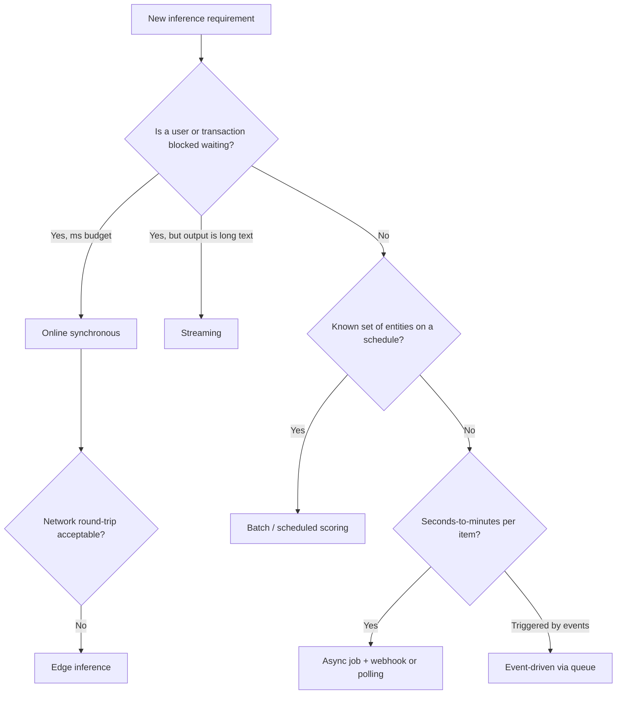
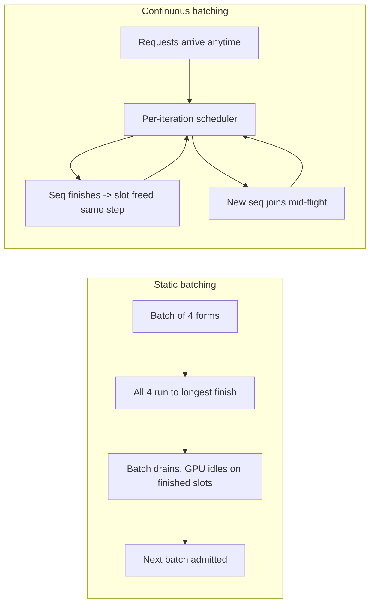

# Model Serving and Inference Optimization

Training a model is a one-time cost; serving it is a forever cost, and it is where latency budgets, GPU bills, and user experience collide. A senior engineer chooses the serving pattern from the business requirement (not habit), climbs the tooling ladder only as far as the workload demands, and can explain exactly why a p99 of 8 seconds coexists with a p50 of 400 ms. This guide expands Phase 8 into practical depth: serving patterns, the FastAPI → BentoML → Ray Serve → vLLM → Triton progression, KV-cache mechanics, continuous batching, percentile metrics, and the optimization trade-space.

Part of the [Senior AI Engineer Roadmap](./00-Senior-AI-Engineer-Roadmap.md) — Phase 8.

---

## 1. Serving Patterns: Choose from the Requirement

### 1.1 The Seven Patterns

- **Online synchronous** — request in, prediction out, caller blocks. For decisions that gate a user action right now.
- **Asynchronous** — caller submits a job, gets a job ID, polls or receives a webhook. For work too slow for a request/response cycle (30s–minutes).
- **Batch** — score millions of rows on a schedule; results land in a table. Latency is irrelevant, throughput and cost per row are everything.
- **Streaming** — emit partial results as they are produced (tokens over SSE/WebSocket). Perceived latency collapses because the user sees progress immediately.
- **Event-driven** — a message on a queue/stream (Kafka, RabbitMQ) triggers inference; results are published downstream. Decouples producers from GPU capacity.
- **Edge** — model runs on or near the device (camera, phone, factory gateway) when the network round-trip or bandwidth is unacceptable.
- **Scheduled scoring** — cron-style re-scoring of entities (nightly churn scores, weekly risk tiers); a batch job with a calendar.

### 1.2 Requirement → Pattern Mapping

| Requirement | Appropriate pattern | Why |
| --- | --- | --- |
| Fraud authorization | Low-latency online inference | Decision blocks a payment; budget is tens of ms |
| Nightly customer scoring | Batch inference | Millions of rows, no one is waiting |
| Long document extraction | Asynchronous job | Minutes of work; return a job ID, notify on completion |
| Chat response | Streaming inference | First token in <1s beats full answer in 8s |
| Camera detection | Edge or near-edge inference | Round-trip to cloud too slow; video too heavy to ship |



A wrong pattern choice is expensive: putting a 90-second document pipeline behind a synchronous endpoint yields timeouts and retry storms; putting a fraud check on a nightly batch means you approve fraud all day.

---

## 2. The Serving Technology Ladder

Learn progressively — each rung adds capability and complexity. Do not start at Triton for a model that fits in FastAPI.

| Rung | Tool | What it adds |
| --- | --- | --- |
| 1 | FastAPI | HTTP serving, validation, async I/O — you manage everything else |
| 2 | BentoML | Model packaging, versioned "bentos", containerization, adaptive batching |
| 3 | Ray Serve | Autoscaling replicas, model composition, request batching, multi-node/multi-GPU |
| 4 | vLLM | LLM-specific engine: PagedAttention, continuous batching, prefix caching |
| 5 | NVIDIA Triton | Multi-framework runtime, dynamic batching, ensembles, maximum GPU efficiency |

### 2.1 FastAPI Done Right

The baseline pattern everyone gets wrong first: loading the model per-request, blocking the event loop, no health checks. The correct shape:

```python
# serve.py — run with: uvicorn serve:app --workers 1
from contextlib import asynccontextmanager
from fastapi import FastAPI
from pydantic import BaseModel, Field
import asyncio, joblib

class ScoreRequest(BaseModel):
    amount: float = Field(gt=0)
    txn_count_24h: int
    merchant_category: str

class ScoreResponse(BaseModel):
    score: float
    model_version: str

state = {}

@asynccontextmanager
async def lifespan(app: FastAPI):
    state["model"] = joblib.load("model-v3.joblib")   # load ONCE at startup
    state["version"] = "fraud-gbm-v3"
    yield
    state.clear()                                      # release on shutdown

app = FastAPI(lifespan=lifespan)

@app.get("/healthz")
def health():                                          # liveness: process is up
    return {"status": "ok"}

@app.get("/readyz")
def ready():                                           # readiness: model is loaded
    return {"ready": "model" in state}

@app.post("/score", response_model=ScoreResponse)
async def score(req: ScoreRequest):
    # CPU-bound inference must not block the event loop
    features = [[req.amount, req.txn_count_24h, hash(req.merchant_category) % 1000]]
    prob = await asyncio.to_thread(
        lambda: float(state["model"].predict_proba(features)[0, 1])
    )
    return ScoreResponse(score=prob, model_version=state["version"])
```

Key decisions: model loaded once in `lifespan`, pydantic validates I/O at the boundary, inference runs in a thread so the async loop keeps accepting requests, and separate liveness/readiness probes let Kubernetes avoid routing traffic to a pod still loading weights.

### 2.2 Ray Serve: Scale and Composition

Ray Serve wraps your Python class in a **deployment** — a named, replicated, autoscaled unit. Deployments call each other (composition: preprocess → model A → model B → postprocess), and `@serve.batch` transparently coalesces concurrent requests into one vectorized model call.

```python
from ray import serve
import numpy as np

@serve.deployment(
    num_replicas="auto",
    autoscaling_config={"min_replicas": 1, "max_replicas": 8,
                        "target_ongoing_requests": 16},
    ray_actor_options={"num_gpus": 1},
)
class Embedder:
    def __init__(self):
        from sentence_transformers import SentenceTransformer
        self.model = SentenceTransformer("all-MiniLM-L6-v2", device="cuda")

    @serve.batch(max_batch_size=64, batch_wait_timeout_s=0.01)
    async def embed(self, texts: list[str]) -> list[list[float]]:
        return self.model.encode(texts).tolist()   # ONE GPU call for the batch

    async def __call__(self, request):
        payload = await request.json()
        return {"embedding": await self.embed(payload["text"])}

app = Embedder.bind()
# serve run module:app
```

The batching trade-off is explicit: `batch_wait_timeout_s` adds up to 10 ms of latency to each request in exchange for up to 64x fewer GPU kernel launches — usually a spectacular deal for throughput.

---

## 3. vLLM: Why It Wins for LLM Serving

### 3.1 The KV Cache Dominates Memory

During autoregressive generation, each new token attends to all previous tokens. To avoid recomputing them, the attention **keys and values for every past token are cached** on the GPU. Per token, that costs `2 × layers × kv_heads × head_dim × bytes` — for a 7B model in fp16, roughly 0.5 MB per token. A single 4,000-token conversation holds ~2 GB of KV cache; the model weights are a fixed 14 GB, but the cache grows with every concurrent sequence and every generated token. At scale, **KV cache — not weights — is what limits concurrency**.

Naive servers pre-allocate each sequence's cache as one contiguous block sized for max length. Result: massive internal fragmentation (a sequence that stops at 300 tokens wasted the space reserved for 4,096) and external fragmentation (free memory exists but not contiguously). Real utilization falls to 20–40%.

### 3.2 PagedAttention

vLLM applies the operating-system pages idea: KV cache is split into fixed-size **blocks** (e.g., 16 tokens), allocated on demand from a global pool, and a per-sequence block table maps logical to physical blocks. Non-contiguous, so no external fragmentation; allocated only as generation proceeds, so almost no internal fragmentation; waste drops to under ~4%, which translates directly into 2–4x more concurrent sequences on the same GPU. Blocks can also be **shared** between sequences (copy-on-write), which enables prefix caching and cheap parallel sampling.

### 3.3 Continuous Batching vs Static Batching

Static batching waits to assemble a batch, runs all sequences until the *longest* one finishes, and only then admits new requests — short requests sit idle behind long ones, and finished slots burn GPU doing nothing. **Continuous (in-flight) batching** schedules at the *iteration* level: after every token-generation step, finished sequences leave the batch and queued requests join immediately.



This is the single biggest throughput win in LLM serving — typically 5–10x over static batching under realistic mixed-length traffic — and it also cuts queue time, the main tail-latency driver.

### 3.4 Prefix Caching and Speculative Decoding

- **Prefix caching:** requests sharing a prefix (system prompt, few-shot examples, chat history) reuse the already-computed KV blocks via block sharing. A 2,000-token system prompt is prefilled once, not per request — TTFT for cache hits drops dramatically. Enable with `--enable-prefix-caching`.
- **Speculative decoding:** a small draft model (or n-gram lookup) proposes k tokens cheaply; the large model verifies all k in one parallel forward pass and accepts the longest correct prefix. Output is provably identical to the large model alone; you trade a little extra compute for 2–3x lower inter-token latency when acceptance rates are high (predictable text, code).

### 3.5 Launching an OpenAI-Compatible Server

```bash
vllm serve meta-llama/Llama-3.1-70B-Instruct \
  --tensor-parallel-size 4 \          # shard weights across 4 GPUs (70B won't fit on 1)
  --gpu-memory-utilization 0.90 \     # fraction of VRAM vLLM may claim (weights + KV pool)
  --max-model-len 8192 \              # cap context; longer = fewer concurrent sequences
  --enable-prefix-caching \
  --port 8000
# Any OpenAI SDK now works against http://localhost:8000/v1
```

The three flags to reason about in interviews: `tensor-parallel-size` (fit the model), `gpu-memory-utilization` (size the KV pool — too low starves concurrency, too high risks OOM), `max-model-len` (bounds worst-case KV per sequence, which bounds admission).

---

## 4. NVIDIA Triton: When It's the Right Pick

Triton is a multi-framework inference runtime: one server hosts PyTorch, TensorRT, ONNX, and Python backends side by side, each in a model repository with a `config.pbtxt`.

- **Dynamic batching:** the server queues individual requests briefly (`max_queue_delay_microseconds`) and combines them into a batch for stateless models — batching without any client cooperation.
- **Concurrent model execution:** multiple instances of the same model (or different models) share one GPU, raising utilization.
- **Ensembles:** a server-side DAG (preprocess → model → postprocess) executed inside Triton, avoiding a network hop per stage.

**Choose Triton when** you serve many non-LLM models (vision, ranking, embeddings, speech) across frameworks at high QPS and want maximum GPU efficiency with TensorRT; it pairs with vLLM (via the TRT-LLM or vLLM backend) rather than replacing it. For a pure LLM chat workload, vLLM alone is simpler and usually sufficient.

---

## 5. Performance Metrics

### 5.1 The Metric Vocabulary

- **Request latency** — full time from request to final byte. The only number a synchronous caller feels.
- **TTFT (time to first token)** — queue time + prefill. Governs perceived responsiveness for streaming; dominated by prompt length and queue depth.
- **Inter-token latency (ITL / TPOT)** — time per generated token after the first. Governs how fast the answer "types".
- **Tokens/sec** — per-request generation speed (ITL inverse) or aggregate system throughput; be explicit about which.
- **RPS** — requests per second the system sustains at acceptable latency.
- **Queue time** — wait before execution starts. The first place overload shows up; watch it as a leading indicator.
- **GPU utilization / GPU memory utilization** — low SM utilization with high memory use is the classic LLM decode signature (memory-bandwidth-bound); it means batching headroom.
- **Cache hit rate** — prefix-cache and response-cache hits; each hit converts prefill cost into a lookup.
- **Cost per request / per successful task** — the senior metric. A cheap request that fails and retries is expensive; divide spend by *successful* outcomes.

### 5.2 Percentiles: Why Averages Lie

Latency distributions are heavily right-skewed, so the mean is pulled by outliers and describes almost nobody's experience. Report **p50** (typical), **p90/p95** (the experience of your unluckiest frequent users — one request in 10 or 20), and **p99** (the tail your SLO and your retry logic live on). A service with mean 300 ms and p99 9 s is a bad service with a good average. Two structural facts make tails matter more than they look: a user session of 20 requests almost certainly contains a p95 event, and in fan-out architectures the slowest of N parallel calls sets the response time.

Tail-latency causes specific to LLM serving:

1. **Long generations** — latency is roughly linear in output tokens; an unbounded `max_tokens` is an unbounded SLO.
2. **Queueing** — bursty arrivals against a saturated batch make queue time explode nonlinearly near full utilization.
3. **Batching interference** — your short request shares iteration steps with someone's 4,000-token prefill; heavy neighbors slow your tokens.
4. Plus the classics: cold starts (multi-GB weight loads), preemption/recompute when the KV pool fills, and garbage-collection or CPU contention on the host.

### 5.3 A Percentile Computation You Should Be Able to Write

```python
import numpy as np

latencies_ms = np.array(load_test_samples)          # one entry per request
for p in (50, 90, 95, 99):
    print(f"p{p}: {np.percentile(latencies_ms, p):8.1f} ms")
print(f"mean: {latencies_ms.mean():8.1f} ms  <- report this last, if at all")
```

---

## 6. Optimization Techniques and the Trade-Space

### 6.1 Make the Model Cheaper

- **Quantization** — store weights (and sometimes activations/KV cache) in fewer bits. **int8** halves fp16 memory; **fp8** similar with better dynamic range on H100-class GPUs; **GPTQ** and **AWQ** are post-training 4-bit weight methods (AWQ protects the ~1% of weights most important to activations). 4-bit turns a 70B model from ~140 GB into ~35 GB — from 4 GPUs to 1 — and speeds up memory-bound decode. Cost: a usually-small quality drop that you must **measure on your own evals**, never assume.
- **Distillation** — train a small student to imitate a large teacher on your task distribution. Biggest wins when the task is narrow (classification, extraction, routing).
- **Compilation & kernel fusion** — `torch.compile`, TensorRT, and fused kernels (FlashAttention) merge many small GPU ops into few big ones, removing launch overhead and redundant memory reads.

### 6.2 Make the Hardware Go Further

- **Tensor parallelism** — split each layer's matrices across GPUs; every layer needs an all-reduce, so it wants NVLink within a node. Use to *fit* a model.
- **Pipeline parallelism** — split by layer ranges across GPUs/nodes; cheaper interconnect needs, but pipeline bubbles. Use across nodes.
- **Data parallelism (inference)** — full model replicas behind a load balancer. Use to add *throughput* once the model fits.
- **Model sharding + mixed precision** — combine the above; keep compute in fp16/bf16 (or fp8) with selective higher precision where numerics demand it.

### 6.3 The Trade-Space

```text
Accuracy ↔ Latency ↔ Throughput ↔ Memory ↔ Cost
```

Every technique moves several dials at once: quantization buys memory and latency with an accuracy risk; bigger batches buy throughput (cost per token) by taxing per-request latency; longer `max-model-len` buys capability by shrinking concurrency. A senior answer never says "make it faster" — it names which dial is being bought and which is being spent, and shows the eval that proves the spend was affordable.

### 6.4 Load Testing LLM Endpoints

Load testing an LLM endpoint is not `ab -n 1000`. You must:

- **Replay realistic token-length distributions** — sample prompt and output lengths from production logs, not fixed sizes; uniform 100-token tests hide batching interference and KV pressure entirely.
- **Measure the right things** — TTFT, ITL, and end-to-end latency percentiles per concurrency level; aggregate tokens/sec; queue time; GPU memory headroom; error/timeout rate.
- **Sweep concurrency** — plot throughput and p99 vs concurrent requests to find the knee where queueing takes over; your capacity number is just before the knee, not at it.
- **Include cache-realistic traffic** — shared system prompts and repeated prefixes, or you will understate real throughput; all-unique prompts, or you will overstate it. Tools: `vllm bench serve` (formerly benchmark_serving), `genai-perf`, or `locust` with a streaming-aware client.

---

## Best Practices

- Derive the serving pattern from the business requirement (who waits, and for how long?) — never default to a synchronous endpoint.
- Load models once at startup; expose separate liveness and readiness probes so orchestrators never route to a pod still loading weights.
- Validate every request and response at the boundary with pydantic (or equivalent) — inference bugs love silently malformed inputs.
- Set explicit `max_tokens`, timeouts, and admission limits; an unbounded generation is an unbounded SLO violation.
- Define SLOs on p95/p99 (and TTFT for streaming), alert on queue time as the leading indicator, and treat mean latency as decoration.
- Batch on the server (continuous/dynamic batching), and document the latency you paid for the throughput you bought.
- Quantize by default at 8-bit, consider 4-bit (AWQ/GPTQ) when memory-bound — but gate every quantized model behind your own eval suite.
- Size vLLM deployments deliberately: `gpu-memory-utilization` sets the KV pool, `max-model-len` sets worst-case per-sequence cost, and together they set concurrency.
- Load test with production-shaped token distributions and cache-realistic prefixes before every capacity decision.
- Track cost per successful task, not GPU-hours; an idle GPU and a retry storm are both cost bugs.

## Interview Questions

<details><summary>Why does the KV cache, not model weights, usually limit LLM serving concurrency, and how does PagedAttention help?</summary>
Weights are a fixed cost (14 GB for a 7B fp16 model) paid once per replica. The KV cache stores attention keys/values for every token of every active sequence — roughly 0.5 MB/token for a 7B fp16 model — so it grows with concurrency, context length, and generation length. Naive servers pre-allocate contiguous max-length buffers per sequence, wasting 60–80% of the pool to internal and external fragmentation. PagedAttention allocates the cache in small fixed-size blocks on demand, mapped through per-sequence block tables like OS virtual memory: no contiguity requirement, near-zero waste, plus copy-on-write block sharing that enables prefix caching. The reclaimed memory becomes 2–4x more concurrent sequences on the same GPU.
</details>

<details><summary>Explain continuous batching and why it beats static batching for LLMs.</summary>
Static batching admits a fixed group of requests and runs them until the longest finishes: short sequences occupy dead slots after finishing, new arrivals wait for the whole batch to drain, and GPU utilization collapses under mixed lengths. Continuous batching schedules at the iteration level — after each token step, finished sequences exit and queued requests join immediately, so the batch stays full at all times. Under realistic variable-length traffic this yields ~5–10x throughput and much lower queue time (hence better TTFT and tail latency). It's uniquely valuable for LLMs because generation lengths are highly variable and unknown in advance.
</details>

<details><summary>A stakeholder says "average latency is 300 ms, we're fine." What do you check, and why can that be wrong?</summary>
Check the percentiles. Latency distributions are right-skewed, so the mean hides the tail: p50 might be 250 ms while p99 is 9 s. Users making 20 requests per session almost surely hit a p95 event, and in fan-out designs the slowest parallel call sets the total. For LLM serving I'd inspect the tail's causes: unbounded output lengths (latency scales with tokens generated), queue time exploding near saturation, batching interference from long-prompt neighbors, cold starts, and KV-pool preemption. Then I'd set SLOs on p95/p99 (plus TTFT if streaming) and alert on queue time as the leading indicator.
</details>

<details><summary>Define TTFT, inter-token latency, and tokens/sec. Which matters for a chat product and why?</summary>
TTFT is queue time plus prefill — the delay before the first token appears; it's driven by prompt length, queue depth, and prefix-cache hits. Inter-token latency is the time per subsequent token — driven by decode speed, batch load, and model size. Tokens/sec is either the per-request inverse of ITL or the aggregate system throughput. For chat, TTFT dominates perceived quality: users tolerate an answer that streams for 6 s but not a 3-s blank screen — which is exactly why streaming is the right pattern. ITL then just needs to exceed reading speed (~10–20 tok/s). Aggregate tokens/sec is the ops/cost metric, and optimizing it (bigger batches) mildly taxes the first two — a trade you should state explicitly.
</details>

<details><summary>When would you pick Ray Serve over plain FastAPI, and Triton over both?</summary>
FastAPI suffices for one model, modest traffic, single node: load at startup, pydantic I/O, offload inference to threads. Move to Ray Serve when you need replica autoscaling, multi-node/multi-GPU placement, composition of several models into one pipeline, or server-side request batching (@serve.batch) without building that infrastructure yourself. Pick Triton when serving many non-LLM models across frameworks (PyTorch, ONNX, TensorRT) at high QPS where GPU efficiency is the bottleneck: dynamic batching, concurrent model instances per GPU, and server-side ensembles are built in. For LLM text generation specifically, vLLM beats all three on throughput because of PagedAttention and continuous batching; Triton can host it as a backend when you want one serving layer for everything.
</details>

<details><summary>Explain GPTQ/AWQ quantization at a concept level. What do you gain and what must you verify?</summary>
Both are post-training weight quantization to ~4 bits. GPTQ quantizes layer by layer, using second-order (Hessian-based) information to choose values minimizing output error. AWQ observes that a small fraction of weights (~1%) matters disproportionately because of activation magnitudes, and protects them via per-channel scaling before quantizing. Gains: ~4x smaller weights than fp16 (70B: ~140 GB → ~35 GB, i.e., 4 GPUs → 1), faster memory-bound decode, larger KV pool left over. int8 and fp8 are milder 2x options, fp8 with hardware support on modern GPUs. What you must verify: quality on your own task evals — benchmark deltas look tiny on average but can be concentrated exactly in your use case (math, code, low-resource languages). Never ship a quantized model on published numbers alone.
</details>

<details><summary>What is speculative decoding and when does it help?</summary>
A cheap draft model proposes k tokens; the target model verifies all k in a single parallel forward pass and accepts the longest prefix matching what it would have sampled — rejection sampling makes the output distribution provably identical to the target model's. Since verifying k tokens costs about one decode step, you get up to k tokens for one large-model iteration when acceptance is high. It helps most on predictable text (code, structured output, templated prose) and when you're latency-bound with spare compute; it hurts when acceptance is low (creative text) or the system is already throughput-saturated, because drafting spends compute that batching could have used. Prefer it for interactive latency, not for batch throughput.
</details>

<details><summary>You're deploying Llama-70B on 4 GPUs with vLLM. Walk through the key flags and their trade-offs.</summary>
`--tensor-parallel-size 4`: 70B fp16 needs ~140 GB weights, so shard each layer across the 4 GPUs; TP requires an all-reduce per layer, so the GPUs should share NVLink within a node (across nodes prefer pipeline parallelism). `--gpu-memory-utilization` (e.g., 0.90): fraction of VRAM vLLM claims for weights plus the KV block pool — higher means more concurrent sequences but OOM risk if other processes share the GPU. `--max-model-len`: caps context length, bounding worst-case KV per sequence, which directly sets how many sequences the scheduler can admit; don't set 128k if traffic is 4k. Add `--enable-prefix-caching` when requests share system prompts. Then load test with production-shaped lengths and watch preemption/queue metrics to tune the triangle of context length, concurrency, and memory headroom.
</details>

<details><summary>How would you load test an LLM endpoint before a launch, and what makes it different from normal API load testing?</summary>
Differences: cost per request varies by orders of magnitude with token counts, responses stream, and server-side batching means requests interfere with each other. Method: (1) sample prompt/output length distributions from production or realistic logs — never fixed-size payloads; (2) include cache-realistic prefixes (shared system prompts) at the observed rate; (3) sweep concurrency levels, measuring TTFT, inter-token latency, and end-to-end percentiles, aggregate tokens/sec, queue time, GPU memory headroom, and error/timeout rates at each level; (4) find the knee where p99 and queue time inflect, and set capacity just below it; (5) run soak tests for memory growth and preemption behavior. Tools: vllm bench serve, genai-perf, or locust with a streaming client. Deliverable: a curve of latency percentiles vs load and a cost per 1M tokens at the chosen operating point.
</details>

<details><summary>Describe the accuracy↔latency↔throughput↔memory↔cost trade-space with two concrete examples.</summary>
Every serving decision buys one dial by spending another; senior engineers name the exchange. Example 1 — quantize 70B to 4-bit AWQ: memory drops 4x (4 GPUs → 1, huge cost win), decode gets faster (memory-bound workload moves less data), but accuracy is at risk and must be re-evaluated on task evals; if quality drops below the product bar, the cost saving was fake. Example 2 — increase batch size / admission limit: aggregate tokens/sec rises so cost per token falls, but each request's inter-token latency and TTFT worsen because iterations carry more neighbors; if the p95 SLO breaks, you've converted a cost problem into a churn problem. The same logic covers max-model-len (capability vs concurrency) and distillation (cost vs accuracy). The senior move is to fix the constraint that matters (SLO or budget), then optimize the free dials against it — with an eval gate on accuracy at every step.
</details>
