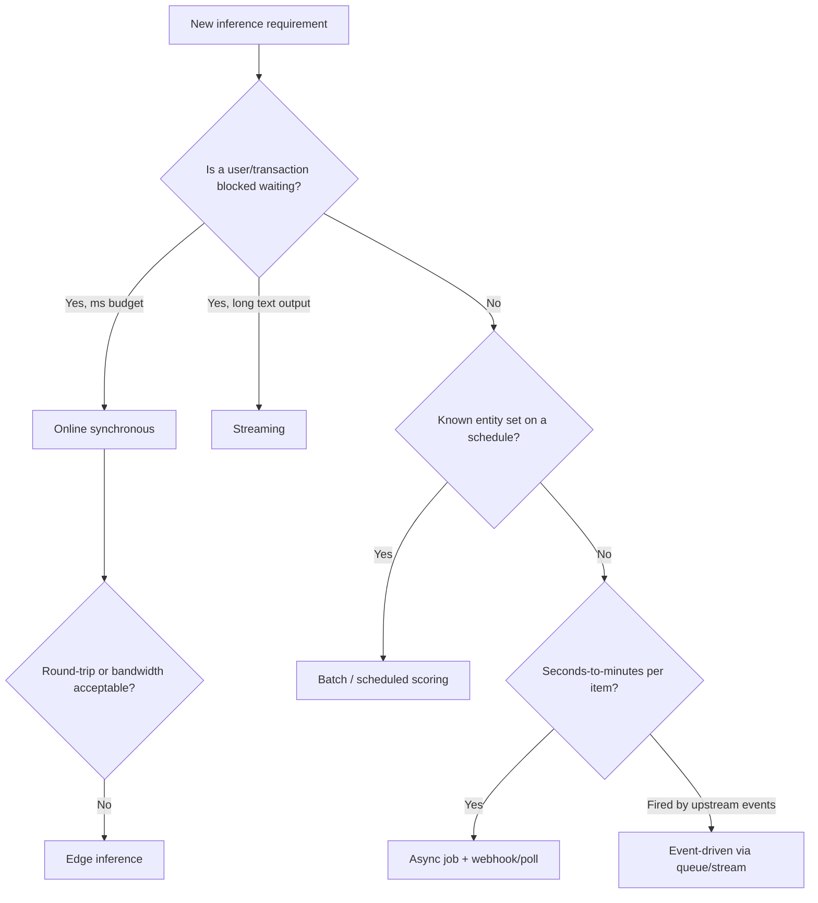
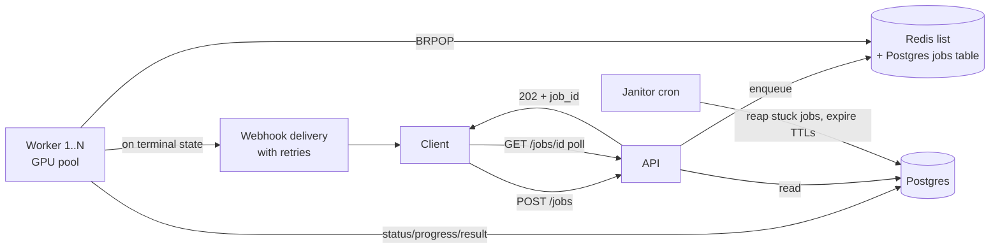
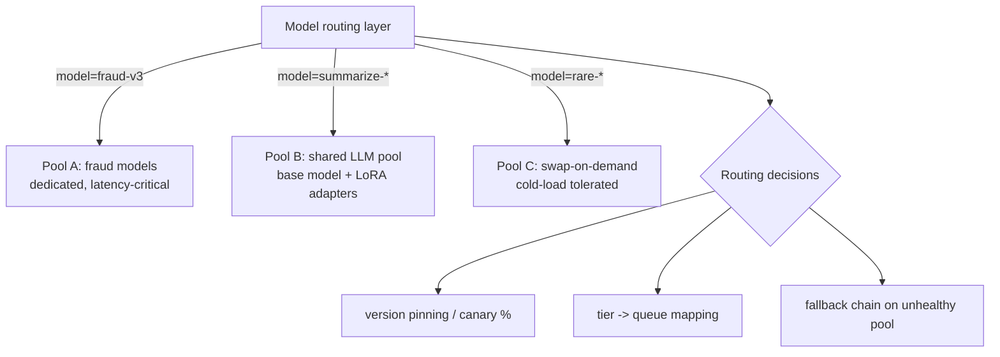

# Serving Patterns and Architecture

Every inference system is an answer to one question: *who is waiting for this prediction, and how long will they wait?* Get that answer wrong and no amount of GPU tuning saves you — a 90-second document pipeline behind a synchronous endpoint produces timeout storms, and a fraud model on a nightly batch approves fraud all day. This guide covers the seven serving patterns, the sync-vs-async decision framework, and complete implementations of the three architectures seniors are expected to build from scratch: async job serving, batch scoring, and streaming inference — plus QoS tiering and multi-model topologies.

Part of the [Senior AI Engineer Roadmap](../00-Senior-AI-Engineer-Roadmap.md) — Phase 8.

---

## 1. The Seven Serving Patterns

### 1.1 Pattern selection is requirement-driven

| Requirement (business language) | Pattern | Why |
| --- | --- | --- |
| "The payment must be approved or declined before the spinner ends" | Online synchronous | Decision gates a user action; budget is tens of ms |
| "Summarize this 200-page contract" | Async job | Minutes of work; return a job ID, notify on completion |
| "Re-score all 40M customers for churn every night" | Batch | Nobody waits; cost per row and throughput are everything |
| "Chat answer should feel instant" | Streaming | First token in <1s beats a complete answer in 8s |
| "Whenever an order lands on Kafka, flag anomalies" | Event-driven | Producers are decoupled from GPU capacity |
| "Detect defects on the factory camera with no internet" | Edge | Network round-trip or bandwidth unacceptable |
| "Refresh risk tiers every Monday 6am" | Scheduled | Batch with a calendar and a freshness SLA |



### 1.2 Online synchronous

Caller blocks; you return the prediction in the HTTP response.

```python
@app.post("/score")
async def score(req: TxnRequest) -> ScoreResponse:
    prob = await asyncio.to_thread(model.predict_proba_one, req.features())
    return ScoreResponse(score=prob, model_version=MODEL_VERSION)
# curl -X POST :8000/score -d '{"amount": 129.9, ...}'
# -> {"score": 0.031, "model_version": "fraud-gbm-v3"}   (p50 ~8 ms)
```

**Right when:** budget ≤ a few hundred ms, output is small, failure can fall back to a default decision.
**Failure modes:** retry storms under latency spikes (client timeout < server timeout inverts responsibility); thundering-herd on cold start; head-of-line blocking if inference runs on the event loop; cascading timeouts when a downstream feature store is slow.

### 1.3 Asynchronous job

Caller submits work, receives a `job_id` immediately, learns the result later via polling or webhook. Full implementation in §3.

**Right when:** work takes seconds-to-minutes, callers can tolerate eventual results, and you want to smooth bursty demand against fixed GPU capacity.
**Failure modes:** jobs stuck forever without visibility timeouts; result store filling up without TTLs; webhook receivers that are down when you deliver; duplicate execution without idempotency keys.

### 1.4 Batch

Score a known population on a schedule; results land in a table. Full implementation in §4.

**Right when:** latency irrelevant, population enumerable, output consumed by downstream systems (CRM, dashboards, campaigns).
**Failure modes:** one poison row killing an 8-hour run; non-idempotent re-runs double-writing; silently publishing garbage when an upstream table was half-loaded; cost blowups from full recomputes when incremental was possible.

### 1.5 Streaming

Emit partial output (tokens) as produced, over SSE or WebSocket. Full implementation in §5.

**Right when:** output is long text and perceived latency matters — chat, drafting, code generation.
**Failure modes:** proxies buffering the stream to death; client disconnects leaking GPU generation; mid-stream model errors after 200 OK has already been sent; no backpressure so slow clients balloon server memory.

### 1.6 Event-driven

A message on Kafka/RabbitMQ/SQS triggers inference; results are published to another topic or written to a store.

```python
# consumer.py — at-least-once consumption with manual commit
for msg in consumer:                      # kafka-python KafkaConsumer
    order = json.loads(msg.value)
    score = model.score(order)            # may take 50-500 ms
    producer.send("order-anomaly-scores",
                  json.dumps({"order_id": order["id"], "score": score}).encode())
    consumer.commit()                     # commit AFTER produce: at-least-once
# Duplicate scores are possible on crash between produce and commit ->
# downstream must upsert by order_id (idempotent), never insert blindly.
```

**Right when:** producers must not know or care about model capacity; natural buffering; replay from the log is your reprocessing story.
**Failure modes:** consumer lag growing unbounded (under-provisioned workers); poison messages blocking a partition; at-least-once duplicates hitting non-idempotent sinks; schema drift from producers you don't own.

### 1.7 Edge

Model runs on/near the device: phone (Core ML/TFLite), camera gateway (ONNX Runtime/TensorRT on Jetson), browser (WebGPU).

**Right when:** round-trip too slow (robotics, AR), bandwidth too costly (video), or offline operation is mandatory.
**Failure modes:** fleet version skew (device A on model v3, device B on v1 for months); no centralized telemetry so silent accuracy decay; hardware heterogeneity making one quantization profile wrong for half the fleet; update rollouts bricking devices.

### 1.8 Scheduled scoring

Batch with a calendar: cron/Airflow triggers, freshness SLA ("scores no older than 25h"), and an SLA alarm distinct from a job-failure alarm — a job that never *started* also violates freshness.

---

## 2. Sync vs Async: The Decision Framework

Four axes decide it; walk them in order.

1. **Latency tolerance.** What is the caller's honest timeout budget? Human-blocking UI: 200 ms–2 s. Machine-to-machine gating (payment auth): 50–500 ms. Anything whose p99 *work time* exceeds ~30 s cannot be sync — intermediate proxies, load balancers, and mobile networks will kill the connection for you even if both parties agree to wait.
2. **Retry semantics.** A failed sync call retries the *whole* request — cheap for a 20 ms scoring call, catastrophic for a 5-minute pipeline (retrying wastes 5 GPU-minutes and doubles load exactly when you're slow, which is why sync + slow = retry storm). Async retries a *job*, server-side, with backoff you control and an idempotency key the caller supplied once.
3. **User experience.** Sync gives the simplest client. But a spinner past ~3 s reads as broken; a progress bar with stages ("extracting… 3/10 pages") reads as working. If the UX wants progress, the architecture wants async (or streaming, which is sync transport with progressive content).
4. **Cost shape.** Sync capacity must absorb *peak* concurrent demand — you pay for the burst. Async capacity absorbs *average* demand — the queue is the shock absorber, and the price is delay. If traffic is 10x bursty and results can wait 2 minutes, async cuts your GPU fleet roughly to `avg/peak` of the sync size.

Worked example: document extraction, 40 s p50 / 180 s p99 per doc, bursts of 300 submissions in a minute, results needed "within 10 minutes."
- Sync would need capacity for 300 concurrent 40-180 s requests: at 4 concurrent docs per GPU that is 75 GPUs, plus every client holding a 3-minute HTTP connection through two proxies. Non-starter.
- Async with a 10-minute deadline: required throughput = 300 docs / 600 s = 0.5 docs/s. One GPU at 4 concurrent × (1/40 s) = 0.1 docs/s → **5 GPUs** (plus headroom), a 15x fleet reduction bought with acceptable delay.

Rule of thumb: **sync under 1 s, streaming under ~60 s of long-text output, async above that or whenever retries/cost/burstiness dominate.**

---

## 3. Async Inference Architecture, In Full



Job state machine — every transition is a single guarded UPDATE:

`PENDING → RUNNING → SUCCEEDED | FAILED`, plus `RUNNING → PENDING` (visibility-timeout reap, attempts left) and `RUNNING/PENDING → FAILED` (attempts exhausted / expired).

### 3.1 Schema and API

```python
# async_serving.py — run API: uvicorn async_serving:app ; worker: python async_serving.py worker
import asyncio, json, time, uuid, sys
import redis, psycopg
from fastapi import FastAPI, HTTPException

r = redis.Redis(decode_responses=True)
PG = "dbname=jobs user=app"
QUEUE = "q:inference"

DDL = """
CREATE TABLE IF NOT EXISTS jobs (
  id UUID PRIMARY KEY,
  state TEXT NOT NULL DEFAULT 'PENDING',     -- PENDING RUNNING SUCCEEDED FAILED
  payload JSONB NOT NULL,
  result JSONB,
  error TEXT,
  progress REAL NOT NULL DEFAULT 0,          -- 0.0 .. 1.0
  progress_note TEXT,
  attempts INT NOT NULL DEFAULT 0,
  max_attempts INT NOT NULL DEFAULT 3,
  idempotency_key TEXT UNIQUE,
  webhook_url TEXT,
  lease_expires_at TIMESTAMPTZ,              -- visibility timeout while RUNNING
  created_at TIMESTAMPTZ DEFAULT now(),
  expires_at TIMESTAMPTZ DEFAULT now() + interval '7 days'   -- result TTL
);
CREATE INDEX IF NOT EXISTS jobs_reap ON jobs (state, lease_expires_at);
"""

app = FastAPI()

@app.post("/v1/jobs", status_code=202)
def submit(body: dict):
    job_id = str(uuid.uuid4())
    idem = body.get("idempotency_key")
    with psycopg.connect(PG) as conn:
        if idem:  # same key -> same job, no duplicate execution
            row = conn.execute(
                "SELECT id FROM jobs WHERE idempotency_key=%s", (idem,)).fetchone()
            if row:
                return {"job_id": str(row[0]), "deduplicated": True}
        conn.execute(
            "INSERT INTO jobs (id, payload, idempotency_key, webhook_url) "
            "VALUES (%s,%s,%s,%s)",
            (job_id, json.dumps(body["input"]), idem, body.get("webhook_url")))
    r.lpush(QUEUE, job_id)          # enqueue AFTER the row is committed
    return {"job_id": job_id, "status_url": f"/v1/jobs/{job_id}"}
# -> 202 {"job_id":"5f0c...","status_url":"/v1/jobs/5f0c..."}

@app.get("/v1/jobs/{job_id}")
def status(job_id: str):
    with psycopg.connect(PG) as conn:
        row = conn.execute(
            "SELECT state, progress, progress_note, result, error FROM jobs "
            "WHERE id=%s AND expires_at > now()", (job_id,)).fetchone()
    if not row:
        raise HTTPException(404, "unknown or expired job")
    state, progress, note, result, error = row
    body = {"state": state, "progress": progress, "progress_note": note}
    if state == "SUCCEEDED": body["result"] = result
    if state == "FAILED":    body["error"] = error
    return body
# GET /v1/jobs/5f0c...  -> {"state":"RUNNING","progress":0.4,"progress_note":"page 4/10"}
```

### 3.2 Worker with lease, progress, and webhook

```python
def claim(conn, job_id: str, lease_s: int = 300) -> bool:
    # Guarded transition PENDING->RUNNING. Returns False if someone else won.
    return conn.execute(
        "UPDATE jobs SET state='RUNNING', attempts=attempts+1, "
        "lease_expires_at=now() + %s * interval '1 second' "
        "WHERE id=%s AND state='PENDING' AND attempts < max_attempts",
        (lease_s, job_id)).rowcount == 1

def worker_loop():
    model = load_model()                      # once per process, not per job
    while True:
        item = r.brpop(QUEUE, timeout=5)      # blocking pop
        if item is None:
            continue
        job_id = item[1]
        with psycopg.connect(PG, autocommit=True) as conn:
            if not claim(conn, job_id):
                continue
            payload = conn.execute(
                "SELECT payload FROM jobs WHERE id=%s", (job_id,)).fetchone()[0]
            try:
                def report(frac, note):       # heartbeat doubles as lease renewal
                    conn.execute(
                        "UPDATE jobs SET progress=%s, progress_note=%s, "
                        "lease_expires_at=now() + interval '300 seconds' "
                        "WHERE id=%s", (frac, note, job_id))
                result = model.run(payload, on_progress=report)
                conn.execute(
                    "UPDATE jobs SET state='SUCCEEDED', progress=1.0, result=%s "
                    "WHERE id=%s AND state='RUNNING'",
                    (json.dumps(result), job_id))
            except Exception as e:
                conn.execute(
                    "UPDATE jobs SET state='FAILED', error=%s "
                    "WHERE id=%s AND state='RUNNING' AND attempts >= max_attempts",
                    (str(e)[:2000], job_id))
                requeued = conn.execute(     # attempts left -> back to PENDING
                    "UPDATE jobs SET state='PENDING' "
                    "WHERE id=%s AND state='RUNNING'", (job_id,)).rowcount
                if requeued: r.lpush(QUEUE, job_id)
            deliver_webhook(conn, job_id)

def janitor():   # cron every minute
    with psycopg.connect(PG, autocommit=True) as conn:
        # Reap crashed workers: RUNNING past lease -> PENDING (or FAILED if spent)
        for (jid,) in conn.execute(
            "UPDATE jobs SET state='PENDING' WHERE state='RUNNING' "
            "AND lease_expires_at < now() AND attempts < max_attempts "
            "RETURNING id").fetchall():
            r.lpush(QUEUE, str(jid))
        conn.execute("UPDATE jobs SET state='FAILED', error='lease expired, attempts exhausted' "
                     "WHERE state='RUNNING' AND lease_expires_at < now()")
        conn.execute("DELETE FROM jobs WHERE expires_at < now()")   # TTL sweep
```

Design points seniors get probed on:

- **Postgres is the source of truth; Redis is only a wake-up signal.** A lost Redis entry is recovered by the janitor (any PENDING job with no lease and no queue presence can be re-pushed); a lost Postgres row is unrecoverable — so the insert commits before the push.
- **Visibility timeout (lease)**, not "worker will set FAILED": crashed workers set nothing. The lease plus janitor is what turns worker death into a retry instead of a forever-RUNNING job.
- **Idempotency key** dedupes client retries of `POST /jobs`; guarded `UPDATE ... WHERE state='PENDING'` dedupes worker races. Both are needed — they defend different edges.
- **Progress reporting doubles as heartbeat**, renewing the lease, so long jobs aren't reaped mid-flight.
- **TTLs everywhere:** results expire (7 days here) or the table grows forever; webhook delivery retries expire; the janitor deletes expired rows.
- **Webhook delivery is at-least-once with backoff** (e.g., 5 attempts over 30 min, signed payload, receiver must be idempotent) and **polling always remains available** — webhooks are an optimization, not the contract.

---

## 4. Batch Serving Done Right

A batch job is a distributed program that must be **partitioned, checkpointed, idempotent, and validated before publish**. The naive `SELECT *; predict; INSERT` fails all four.

```python
# batch_score.py — nightly churn scoring for 40M customers
# Partition -> score -> stage -> validate -> atomically publish
import math, psycopg, json

PARTITIONS = 400                       # 40M rows / 400 = 100k rows per partition
RUN_ID = "churn-2026-07-24"           # deterministic: date-based, NOT a uuid

def score_partition(pid: int):
    with psycopg.connect(PG, autocommit=True) as conn:
        done = conn.execute("SELECT 1 FROM batch_checkpoints WHERE run_id=%s AND part=%s",
                            (RUN_ID, pid)).fetchone()
        if done:
            return                     # re-run skips completed partitions: idempotent
        rows = conn.execute(
            "SELECT customer_id, features FROM customer_features "
            "WHERE abs(hashtext(customer_id::text)) %% %s = %s",   # stable hash partition
            (PARTITIONS, pid)).fetchall()
        preds = model.predict_batch([r[1] for r in rows])          # one vectorized call
        with conn.cursor().copy(
            "COPY churn_scores_staging (run_id, customer_id, score) FROM STDIN") as cp:
            for (cid, _), p in zip(rows, preds):
                cp.write_row((RUN_ID, cid, float(p)))
        conn.execute("INSERT INTO batch_checkpoints (run_id, part) VALUES (%s,%s)",
                     (RUN_ID, pid))    # checkpoint AFTER staging write commits

def validate_and_publish():
    with psycopg.connect(PG) as conn:
        n, mean, nulls = conn.execute(
            "SELECT count(*), avg(score), count(*) FILTER (WHERE score IS NULL) "
            "FROM churn_scores_staging WHERE run_id=%s", (RUN_ID,)).fetchone()
        assert n > 0.99 * 40_000_000, f"row count {n} too low — upstream half-loaded?"
        assert nulls == 0,            "null scores present"
        assert 0.02 < mean < 0.30,    f"mean score {mean:.3f} outside historical band"
        # Atomic publish: consumers never see a partial run
        conn.execute("BEGIN")
        conn.execute("DELETE FROM churn_scores WHERE score_date = current_date")
        conn.execute("INSERT INTO churn_scores SELECT current_date, customer_id, score "
                     "FROM churn_scores_staging WHERE run_id=%s", (RUN_ID,))
        conn.execute("COMMIT")
# Expected run: 400 partitions x ~40 s = ~4.5 h on 1 worker; ~35 min on 8 parallel workers.
# A crash at partition 217 re-runs in ~30 min (183 remaining), not 4.5 h.
```

The four properties, named:

1. **Partitioning** by stable hash — parallelizable, restartable units; partition count chosen so each unit is minutes, not hours (rule of thumb: a lost partition should cost <1% of the run).
2. **Checkpointing** — a completed-partition ledger written *after* the data commit, so re-runs skip finished work. Crash cost drops from "the whole night" to "one partition."
3. **Idempotent re-runs** — deterministic `RUN_ID` (date-based) plus skip-if-checkpointed plus staging keyed by run: running the job twice produces the same table, not doubled rows.
4. **Output validation before publish** — row count vs expectation, null checks, distribution vs historical band, and an *atomic* swap into the serving table. The staging table is the airlock: garbage dies there, never in front of consumers.

---

## 5. Streaming Inference: SSE End to End

```python
# stream_api.py — SSE chat endpoint proxying a vLLM/OpenAI-compatible backend
import asyncio, json
from fastapi import FastAPI, Request
from fastapi.responses import StreamingResponse
import httpx

app = FastAPI()

@app.post("/v1/chat/stream")
async def chat(request: Request):
    body = await request.json()

    async def event_stream():
        idx = 0
        try:
            async with httpx.AsyncClient(timeout=httpx.Timeout(300, connect=5)) as cl:
                async with cl.stream("POST", "http://vllm:8000/v1/chat/completions",
                                     json={**body, "stream": True}) as upstream:
                    async for line in upstream.aiter_lines():
                        if await request.is_disconnected():
                            return              # client gone -> stop pulling ->
                                                # upstream cancelled -> GPU freed
                        if not line.startswith("data: ") or line == "data: [DONE]":
                            continue
                        delta = json.loads(line[6:])["choices"][0]["delta"].get("content", "")
                        if delta:
                            idx += 1
                            # id: enables client resume via Last-Event-ID
                            yield f"id: {idx}\nevent: token\ndata: {json.dumps({'t': delta})}\n\n"
            yield "event: done\ndata: {}\n\n"
        except Exception as e:
            # HTTP status is already 200 — errors MUST travel in-band
            yield f"event: error\ndata: {json.dumps({'message': str(e)[:200]})}\n\n"

    return StreamingResponse(event_stream(), media_type="text/event-stream",
        headers={"Cache-Control": "no-cache",
                 "X-Accel-Buffering": "no"})    # tell nginx: do NOT buffer
```

```javascript
// client.js — browser side with mid-stream error handling and resume UX
async function streamChat(prompt, onToken, onError) {
  const resp = await fetch("/v1/chat/stream", {
    method: "POST", headers: {"Content-Type": "application/json"},
    body: JSON.stringify({messages: [{role: "user", content: prompt}]}),
  });
  const reader = resp.body.getReader(), dec = new TextDecoder();
  let buf = "";
  while (true) {
    const {done, value} = await reader.read();   // reading slowly = backpressure:
    if (done) break;                             // TCP window throttles the server
    buf += dec.decode(value, {stream: true});
    for (const frame of buf.split("\n\n").slice(0, -1)) {
      if (frame.includes("event: error")) {
        // Keep partial text visible; offer "Continue" which resends the
        // conversation WITH the partial assistant text so the model resumes,
        // rather than a "Retry" that regenerates (and re-bills) from scratch.
        onError(JSON.parse(frame.split("data: ")[1]));
        return;
      }
      if (frame.includes("event: token"))
        onToken(JSON.parse(frame.split("data: ")[1]).t);
    }
    buf = buf.split("\n\n").slice(-1)[0];
  }
}
```

The three hard problems, and where each is solved:

- **Backpressure.** SSE rides TCP: a slow client shrinks its receive window, `yield` inside the generator suspends, and the async generator stops pulling from the upstream — flow control propagates browser → API → engine for free, *provided* nothing in between buffers. That's why `X-Accel-Buffering: no` (nginx) and disabled proxy buffering matter: a buffering proxy absorbs the stream, destroying both perceived latency and backpressure. If you must serve very slow clients at scale, bound per-connection buffers and drop the connection past a threshold rather than queueing unboundedly.
- **Disconnect handling.** `request.is_disconnected()` + generator cancellation must propagate to the engine (httpx stream context exit cancels the upstream request; vLLM aborts the sequence). Without this, every closed laptop lid leaves a GPU generating tokens for nobody — at scale this is 10-30% of decode compute.
- **Mid-stream errors.** Once the first byte is sent, the 200 status is immutable — errors after that are *in-band protocol*, not HTTP. So the stream needs an explicit `done` event (absence of it = truncation, clients must not treat silence as success) and an `error` event; the client keeps partial output and offers *continue* (resume with partial text in context), not blind regenerate.

---

## 6. Request Prioritization and QoS Tiers

When paid and free traffic share a fleet, an unprioritized queue means free-tier bulk traffic sets paid-tier latency. Three escalating mechanisms:

1. **Weighted admission / separate queues.** Two queues (`q:paid`, `q:free`); workers drain paid first with a starvation guard (e.g., serve free at least 1-in-10 dequeues). Simple, effective, no engine support needed.

```python
def next_job():
    # 90/10 weighted poll; guarantees free tier is never fully starved
    order = ["q:paid", "q:free"] if random.random() < 0.9 else ["q:free", "q:paid"]
    item = r.brpop(order, timeout=5)     # brpop checks keys in listed order
    return item
```

2. **Per-tier concurrency budgets.** Cap free-tier in-flight requests at the serving layer (e.g., free ≤ 30% of `max_num_seqs`), so a free burst can queue but can never occupy the whole batch. This bounds paid TTFT regardless of free load.
3. **Preemption.** Under pressure, evict running low-priority sequences (vLLM preempts by recomputing or swapping KV to CPU) to admit paid ones. Preemption is expensive — the evicted request re-pays its prefill — so it's the last resort after budgets, and preempted work should be re-queued, not dropped.

Tie SLOs to tiers explicitly: paid p95 TTFT < 800 ms, free is best-effort with a queue-depth-based "busy, try later" (load shedding beats infinite queueing — a request that waits 90 s to start a 60 s job has already failed its user).

---

## 7. Multi-Model Serving Topologies

Two poles, one spectrum:

- **Per-model pools.** Each model gets dedicated replicas behind its own service. Isolation (one model's traffic spike or OOM can't hurt another), independent scaling and rollout, simple mental model. Cost: idle capacity multiplied by model count — 20 models × 1 mostly-idle GPU each is a very expensive kind of tidy.
- **Shared multiplexing.** Many models resident on (or swapped into) one pool; the server routes each request to the right weights (Triton concurrent models, vLLM LoRA multiplexing, model-swap-on-demand). Utilization is high; the costs are noisy neighbors, cold swap latency (loading 14 GB of weights on miss ≈ 5-30 s), and blast radius.



Practical hybrid: dedicate pools to latency-critical high-traffic models; multiplex the long tail. **LoRA multiplexing** is the sweet spot for LLM fleets — one base model's weights resident once, dozens of adapters (tens of MB each) hot-swapped per request, so "20 fine-tunes" costs one pool, not twenty.

The **routing layer** (an ordinary stateless service in front) owns: model-name → pool resolution, version pinning and canary splits (send 5% of `fraud` to `fraud-v4`), tier→queue mapping, and fallback chains (pool unhealthy → older version → degraded heuristic). Keep it dumb and fast; put no inference logic in it.

---

## Production War Stories & Failure Modes

### War story 1: The synchronous document pipeline that DDoSed itself

- **Symptom:** Document-extraction API p99 went from 70 s to timeouts; then traffic *tripled* while real user demand was flat; the service fell over entirely at 9:30am.
- **Investigation:** Load balancer logs showed the same request IDs appearing 3-4 times. Client SDK had a default 30 s timeout with 3 retries; server processing was 40-180 s and had no idempotency handling.
- **Root cause:** Wrong pattern. A minutes-long job behind sync HTTP meant every client timeout spawned a retry of the full pipeline while the original was still running — load multiplied by 4 precisely when the system was slowest, the retry-storm death spiral.
- **Fix:** Migrated to the async job pattern (§3): immediate 202 + job ID, idempotency keys deduping retries, workers pulling from the queue at fixed concurrency. Peak-hour GPU count *dropped* because the queue absorbed the burst.
- **Prevention:** Pattern-selection review for any endpoint whose p99 work time exceeds 10 s; client timeout must always exceed server timeout; idempotency keys on any non-trivial POST.

### War story 2: The batch job that emailed 40M customers garbage

- **Symptom:** Marketing's churn campaign targeted "high-risk" customers; complaints revealed loyal decade-long customers got win-back discounts. Scores in the table were uniformly ~0.5.
- **Investigation:** The nightly scoring run had executed while the upstream `customer_features` load was half-finished — 60% of feature columns were NULL, imputed to defaults, producing near-random scores. The job "succeeded" and wrote straight to the serving table.
- **Root cause:** No upstream freshness check, no output validation, no staging airlock — direct write to the table consumers read.
- **Fix:** Added the §4 pipeline: dependency sensor on upstream load completion, staging table, validation gates (row count, null rate, mean-score historical band ±3σ), atomic publish. The next occurrence (upstream broke again a month later) died in staging with a paged alert and yesterday's scores still serving.
- **Prevention:** Every batch output passes distribution validation before an atomic swap; consumers read only published tables; freshness SLA monitored separately from job success.

### War story 3: Streaming that worked on localhost and died in staging

- **Symptom:** Chat UI showed a blank screen for 20-40 s, then the entire answer appeared at once. Locally, tokens streamed beautifully. Meanwhile GPU cost rose ~25% with no traffic increase.
- **Investigation:** `curl -N` against the pod streamed fine; through the ingress it arrived in one burst — nginx `proxy_buffering on` (default) was absorbing the SSE stream. The cost issue: abandoned chats (users closing tabs mid-answer) never cancelled upstream — the API service didn't check disconnects, so vLLM generated full completions for departed users.
- **Root cause:** Two classic streaming failures at once: proxy buffering breaking the stream, and missing disconnect propagation leaking generation.
- **Fix:** `X-Accel-Buffering: no` header + ingress annotation disabling buffering; disconnect check in the generator loop with cancellation propagated to the engine (abandoned-request compute dropped 18%).
- **Prevention:** Streaming smoke test in CI *through the full ingress path* asserting inter-chunk gaps exist; dashboard metric for "tokens generated after client disconnect."

### War story 4: Free tier ate the paid tier

- **Symptom:** Enterprise customers on the LLM API reported TTFT of 15-30 s during business hours; the fleet showed healthy 85% utilization, so capacity "looked fine."
- **Investigation:** Queue-wait histograms split by tier showed paid requests waiting behind hundreds of free-tier requests from a single integration that batch-submitted 10k summarizations every hour on the hour. FIFO queue, no tiering.
- **Root cause:** One shared FIFO queue means the lowest-value bulk traffic sets the latency of the highest-value interactive traffic.
- **Fix:** Tiered queues with 90/10 weighted draining, free-tier concurrency budget capped at 30% of batch slots, and per-account rate limits with 429 + Retry-After for bulk submitters (who were happy to spread load once told how).
- **Prevention:** QoS design (queues, budgets, shedding) is part of the serving design review, not a retrofit; all queue metrics tagged by tier from day one.

---

## Best Practices

- Derive the pattern from "who waits, how long, and what happens on failure" — never default to a synchronous endpoint because it's easiest to write.
- Hard rule: p99 work time over ~30 s cannot be synchronous; intermediaries will kill the connection even if your client wouldn't.
- Async jobs: database as source of truth, queue as wake-up signal; enqueue after commit; visibility-timeout leases + janitor for crashed workers; idempotency keys on submission; TTLs on results; webhooks as at-least-once optimization with polling as the contract.
- Client timeouts must exceed server timeouts, and every retryable POST needs an idempotency key — otherwise your retry policy is a self-DDoS policy.
- Batch: partition by stable hash, checkpoint after commit, deterministic run IDs for idempotent re-runs, and validate distributions in a staging table before an atomic publish.
- Streaming: disable proxy buffering explicitly, propagate client disconnects to the engine, send explicit `done`/`error` events in-band, and design the retry UX as *continue*, not regenerate.
- Prioritize with separate queues and concurrency budgets before reaching for preemption; shed load with 429 + Retry-After rather than queueing past the point where completion is useful.
- Dedicate pools to latency-critical models; multiplex the long tail (LoRA adapters for LLM fine-tune fleets); keep the routing layer stateless and dumb.
- Every queue gets a depth alarm, an age-of-oldest-item alarm, and per-tier tagging from day one — queue metrics are your earliest overload signal.
- Load-shed early and explicitly: a job that starts too late to matter consumed capacity and still failed its user.

## Interview Drills

<details><summary>You're asked to add "AI summarization" to a document platform. Walk me through choosing the serving pattern.</summary>
Start from the requirement, not the tech: who waits, how long is the work, what's the failure story? Measure or estimate work time: a 50-page doc through an LLM is 30-120 s — over the ~30 s sync ceiling, so synchronous is out. Is the output long text a user reads? If summaries display in a UI as they generate, streaming gives the best perceived latency for interactive use. If summarization is triggered on upload and consumed later, async job fits: 202 + job ID, progress reporting ("page 4/10"), webhook or poll. If the platform wants all existing documents summarized, that's a batch backfill with partitioning and checkpointing — a different pipeline from the interactive path, sharing the model but not the architecture. Likely answer: streaming for the interactive "summarize now" button, async for upload-triggered processing, batch for the backfill.
Follow-up: *Why not make the async worker call the streaming endpoint?* — Reuse the engine, not the transport: workers should call the model directly (or the same internal API non-streaming); SSE adds nothing when no human is watching, and holding streams open from workers wastes connections.
Follow-up: *The PM insists on synchronous "because the API is simpler for customers."* — Quantify the failure: p99 of 120 s means client timeouts, retry storms, and proxy limits; offer the compromise of a sync facade with a short deadline that returns 202 and falls back to job semantics when work exceeds it (the "sync-until-it-isn't" pattern many cloud APIs use).
</details>

<details><summary>Design the state machine for an async inference job. What transitions exist and what guards each one?</summary>
States: PENDING → RUNNING → SUCCEEDED | FAILED, plus RUNNING → PENDING (lease expiry with attempts remaining) and → FAILED (attempts exhausted). Guards are conditional UPDATEs: claim is `UPDATE ... SET state='RUNNING', attempts=attempts+1 WHERE id=? AND state='PENDING' AND attempts < max_attempts` — rowcount 0 means another worker won the race. Completion guards on `WHERE state='RUNNING'` so a reaped-and-retried job's late-arriving first attempt can't overwrite the second attempt's result. The janitor transitions RUNNING → PENDING only when `lease_expires_at < now()`. Every transition is a single atomic statement; there is no read-then-write anywhere.
Follow-up: *Why is there no CANCELLED state in your first design, and how would you add it?* — Add CANCELLED reachable from PENDING (trivially, guarded update) and from RUNNING (cooperatively: set a cancel flag the worker checks between progress reports; the worker transitions to CANCELLED at the next checkpoint — you cannot atomically stop a running GPU computation from the database).
Follow-up: *A job is RUNNING forever. Enumerate causes.* — Worker crashed and janitor is broken/not deployed; lease renewal in the progress callback keeps renewing while the model call is hung (renewals should be bounded or accompanied by a wall-clock max job age); janitor's reap query misses the row due to a clock-skewed lease timestamp.
</details>

<details><summary>Why does the async design put the job row in Postgres but the queue in Redis? Why not only one system?</summary>
They hold different things with different loss tolerances. The Postgres row is the source of truth — losing it loses the job, the result, and the audit trail, so it must be durable and transactional (guarded state transitions need atomic conditional updates). The Redis list entry is only a wake-up signal — losing it costs latency, not correctness, because the janitor can re-derive "PENDING jobs not in the queue" and re-push. Redis-only fails on durability and on transactional guards (Lua scripts approximate them but you lose SQL's auditability); Postgres-only works at moderate scale — `SELECT ... FOR UPDATE SKIP LOCKED` is a fine queue up to thousands of jobs/sec — and is the right simplification when you already run Postgres and your volume fits.
Follow-up: *So when would you actually drop Redis?* — When queue throughput is under a few hundred jobs/sec and latency tolerance is seconds: SKIP LOCKED polling every 500 ms removes a whole system from the architecture. Add Redis (or SQS) back when polling load or wake-up latency starts to matter.
Follow-up: *What ordering guarantee does your queue give, and does it matter?* — Redis LPUSH/BRPOP is FIFO per list, but retries and multiple workers destroy global ordering anyway; jobs must be order-independent. If order matters (per-entity), you need per-entity serialization — e.g., partition by entity like Kafka does — which is a different design.
</details>

<details><summary>What is a visibility timeout and what breaks without it?</summary>
A lease on a claimed job: when a worker takes a job it sets `lease_expires_at = now() + T`; while the lease holds, no one else may take the job; if the lease expires (worker crashed, network partition, OOM-killed pod), a janitor returns the job to PENDING for another worker. Without it, worker death silently converts jobs into forever-RUNNING zombies — the failure isn't an error anywhere, just a job that never finishes and a user who never hears back. The subtleties: T must exceed honest p99 job duration or you get double execution (two workers on one job — which the guarded completion update and idempotent side effects must tolerate anyway, since at-least-once is the real contract); long jobs renew the lease via progress heartbeats; a wall-clock max age caps infinite renewal by a hung-but-alive worker.
Follow-up: *Worker A stalls (GC pause), gets reaped, worker B finishes the job, then A wakes and finishes too. What happens?* — A's completion UPDATE guards on `state='RUNNING'` with B's attempt count; A's write matches 0 rows and is discarded. But A's *side effects* (webhook already sent, file written) may have fired — which is why side effects need idempotency keys, and why the delivered contract is at-least-once, not exactly-once.
</details>

<details><summary>Your nightly batch job crashed at 3am, 60% complete. Compare what happens next in a naive design vs a well-designed one.</summary>
Naive (single query, direct write to serving table): the 60% of writes may be partially visible to consumers (or the transaction rolled back all of it), re-running redoes 100% of the work and may double-write whatever did commit, and the morning deadline is missed while someone hand-holds it. Well-designed: work is hash-partitioned (say 400 partitions), each partition checkpointed after its staging write commits; the retry (automatic, from the orchestrator) skips ~240 checkpointed partitions and completes the remaining ~160; staging is keyed by a deterministic run ID so even a full duplicate execution converges to the same rows; validation gates then check row count, null rate, and score distribution against historical bands; publish is an atomic swap, so consumers saw yesterday's complete data throughout, never a partial run.
Follow-up: *How do you size partitions?* — Small enough that a lost partition is cheap (<1% of run time) and stragglers don't dominate; large enough that per-partition overhead (query, checkpoint, task scheduling) stays negligible — typically minutes of work each.
Follow-up: *Why validate distributions and not just "job succeeded"?* — Because the deadliest batch failures are silent: upstream half-loaded, feature NULLed, encoding shifted. The job "succeeds" while producing garbage; only comparing the output's shape to history catches it. Exit code 0 is not a quality signal.
</details>

<details><summary>Explain how backpressure actually works in an SSE streaming pipeline from GPU to browser.</summary>
It's TCP flow control end to end, if you don't break it. A slow browser reads its socket slowly → its TCP receive window fills → the server's writes block → the ASGI server stops consuming the response generator → `yield` suspends → the generator stops iterating the upstream httpx stream → the engine's HTTP write blocks → the engine's scheduler can deprioritize or buffer that sequence. Each arrow is automatic; the chain breaks wherever something buffers unboundedly: an nginx proxy with `proxy_buffering on` absorbs everything (breaking both streaming UX and backpressure), or an application-level queue between engine and response that grows without bound. Practical stance: disable proxy buffering on the streaming route, keep no unbounded app buffers, and for pathologically slow clients set a policy — bounded buffer then disconnect — because one 2G-connection client shouldn't pin server memory or a batch slot indefinitely.
Follow-up: *Does a slow client actually slow the GPU?* — In most engines, no: generation proceeds and tokens buffer in the engine's per-request output queue; the risk is that queue's memory, plus the sequence occupying a batch slot for its full duration regardless. Some servers abort sequences whose consumer lags too far — know your engine's behavior.
Follow-up: *WebSocket vs SSE for this?* — SSE wins for one-directional token streams: plain HTTP (proxies, auth, HTTP/2 multiplexing all standard), auto-reconnect with Last-Event-ID. WebSocket earns its complexity only for bidirectional needs like live interruption mid-generation or voice.
</details>

<details><summary>A model error occurs 500 tokens into a streamed response. HTTP already said 200. Design the full handling, server and client.</summary>
Server: the status line is gone — errors are now in-band protocol. The stream contract needs three event types: `token`, `error` (structured payload: message, retryable flag), and `done` (explicit success terminator). On exception, emit `error` and close; never just close silently, because clients must treat an un-terminated stream (no `done`) as truncation, not success — connection close is ambiguous between "finished" and "died". Client: keep the partial text rendered (it has value; discarding 500 tokens of good output is user-hostile), show an inline failure state, and offer *Continue* — resubmit the conversation including the partial assistant message so the model resumes where it stopped — instead of *Retry*, which regenerates (and re-bills) everything and may diverge from the partial text. Log stream-termination cause (done/error/client-disconnect/silent-close) as a metric; a rising silent-close rate is an infrastructure smell (proxy idle timeouts, pod kills mid-stream).
Follow-up: *The "continue" completion produces text that doesn't join cleanly ("...the resul" + "The result is...").* — Resume prompts need care: include the partial text verbatim as the assistant turn and instruct continuation without repetition; some APIs support true completion-style resume. Test the seam; naive chat-turn resume often restarts the sentence.
Follow-up: *How do you bill/account a half-delivered response?* — Count generated tokens server-side regardless of delivery; decide the product policy explicitly (many bill infra-failure partials at zero, client-disconnect partials fully) — you need the termination-cause metric to implement any policy at all.
</details>

<details><summary>How would you keep free-tier bulk traffic from ruining paid-tier latency on a shared GPU fleet?</summary>
Layered, cheapest first. (1) Separate queues per tier with weighted draining (paid-first ~90/10 with a starvation guard for free). (2) Per-tier concurrency budgets at the engine: free tier capped at, say, 30% of batch slots, so a free burst queues among itself but can never fill the batch — this alone bounds paid TTFT. (3) Per-account rate limits with 429 + Retry-After so one integration's hourly 10k-request dump gets spread instead of spiking. (4) Only then preemption: evicting a running free sequence to admit a paid one, accepting the evicted request re-pays its prefill — expensive, so it's the pressure valve, not the mechanism. Tie SLOs to tiers (paid p95 TTFT < 800 ms; free best-effort with load shedding past a queue-age threshold) and tag every queue/latency metric by tier or you can't even see the problem.
Follow-up: *Why not just separate fleets?* — Isolation is perfect but you pay peak capacity twice and free-tier idle GPUs can't absorb paid bursts. Shared-with-budgets gives most of the isolation at much better utilization; separate fleets become right when the tiers' models, SLOs, or compliance boundaries genuinely differ.
Follow-up: *What does preemption cost, concretely?* — The evicted sequence loses its KV cache (recompute: re-run prefill, potentially seconds for long contexts; or swap to CPU RAM and re-load). Under sustained pressure preemption thrash can *reduce* total throughput — budgets exist precisely to keep you out of that regime.
</details>

<details><summary>When do per-model dedicated pools beat shared multiplexing, and where do LoRA adapters change the math?</summary>
Dedicated pools buy isolation: independent scaling, rollout, and failure domains — right for latency-critical, high-traffic models where a noisy neighbor or a cold swap is unacceptable (fraud scoring, search ranking). Their cost is idle capacity times model count: 20 models × mostly-idle dedicated GPUs is very expensive tidiness. Multiplexing packs many models per pool (concurrent residence or swap-on-demand) for high utilization, at the price of contention, 5-30 s cold-load latency on miss, and shared blast radius — right for the long tail of low-traffic models where p99 including an occasional cold start is still fine. LoRA changes LLM fleet math structurally: dozens of fine-tunes share one resident base model, adapters are tens of MB hot-swapped per request, so "a fine-tune per customer" costs one pool instead of N — multiplexing without the cold-start or memory multiplication.
Follow-up: *How does the routing layer fit in?* — A stateless service owning model-name → pool resolution, version pinning and canary percentages, tier → queue mapping, and fallback chains (unhealthy pool → previous version → heuristic). Keep it dumb; inference logic in the router turns your traffic map into a program nobody can reason about.
Follow-up: *What triggers promoting a model out of the shared pool?* — Sustained traffic making it a top occupant anyway, an SLO that cold swaps violate, or incident coupling (its spikes hurting pool-mates). Publish the promotion criteria so it's a routine capacity decision, not a fight.
</details>

<details><summary>Compare event-driven (Kafka-triggered) inference with the API+queue async job pattern. When is each right?</summary>
Same skeleton — buffer between producers and GPU workers — different contract. The job pattern is *request-scoped*: an identified caller submits, holds a job ID, checks status, gets a result or error addressed to them; it fits user- or API-initiated work needing per-request lifecycle (progress, cancellation, per-caller results). Event-driven is *flow-scoped*: producers emit domain events with no knowledge of consumers; inference is one subscriber; results are published onward as more events. It fits continuous pipelines (score every order, moderate every upload), gives replay-from-log as the native reprocessing story, and scales consumers by partition. Choose by who needs an answer: a specific waiting caller → job pattern; "the system reacts to things happening" → event-driven. Many stacks run both against the same model service.
Follow-up: *Ordering and duplicates in the Kafka path?* — Per-partition ordering only (partition by entity ID if per-entity order matters); consumption is at-least-once with commit-after-produce, so sinks must upsert idempotently. Exactly-once-ish exists via transactions within the Kafka ecosystem but ends at any external side effect.
Follow-up: *Consumer lag is growing steadily. Walk your response.* — Confirm it's throughput (lag grows at constant slope) vs a stuck partition (one partition's lag grows, others flat → poison message; DLQ it). For throughput: scale consumers up to partition count, then batch inference calls per poll, then raise partition count. Also check whether the model got slower — lag is often a model-latency regression wearing a Kafka costume.
</details>

<details><summary>What's your webhook delivery design for async job completion, and why must polling still exist?</summary>
At-least-once with signed payloads and bounded retries: on terminal state, POST the event (job ID, state, result pointer — not the full result if large) with an HMAC signature header; on non-2xx or timeout, retry with exponential backoff and jitter (e.g., 1m/5m/15m/1h/6h, then park in a dead-letter table with an ops alert). Include a delivery ID so receivers can dedupe, because retries after ambiguous timeouts mean duplicates are guaranteed eventually. Polling remains the contract because webhooks fail in ways you don't control: receiver down for a deploy exactly when you deliver, their proxy eating the request, cert rotation. GET /jobs/{id} is the always-available fallback; a receiver that missed the webhook reconciles by polling. Webhooks are a latency optimization on top of a pull-based truth, never the only path.
Follow-up: *A customer says they never got the webhook but your logs show 200.* — Delivery ID + signed payload settles it: they search their logs for the ID; usually their handler 200'd then crashed before processing — which is why the recommended receiver pattern is "persist the event, then 200, then process async." Publish that guidance in your docs.
Follow-up: *Why send a result pointer instead of the result?* — Size limits and secrecy: multi-MB results blow webhook body norms, and the pointer forces an authenticated fetch, so a leaked webhook URL doesn't leak result data.
</details>

<details><summary>Your sync fraud-scoring endpoint (p50 8 ms) starts timing out during a feature-store slowdown. Design the degradation behavior.</summary>
Fraud gating a payment can't queue — the payment is happening now — so async is off the table; the design question is what to do when you can't answer in budget. Layers: (1) a hard internal deadline (e.g., 150 ms of a 300 ms budget) on the feature-store call, with a circuit breaker so a sick dependency fails fast instead of slow; (2) a degraded scoring path when features are missing — a model variant trained on the always-available request-local subset, or a rules floor — explicitly logged as degraded; (3) a product-owned default decision when even that fails (approve-with-flag under $X, decline/step-up above), decided *before* the incident, not by whoever is on call; (4) load shedding at the edge if the score service itself saturates, so it degrades predictably rather than collapsing. Metric: fraction of decisions on the degraded path — alert on it, and reconcile degraded-path approvals afterward with the full model offline.
Follow-up: *Why a separately trained degraded model instead of imputing missing features?* — Imputation feeds the main model inputs from a distribution it rarely saw in training; scores become quietly untrustworthy exactly when risk is elevated. A model trained on the reduced feature set is honest about its information.
Follow-up: *Circuit breaker settings?* — Trip on error-rate or p99 breach over a short window (e.g., >50% failures over 10 s), half-open probes with a small request fraction, and per-dependency isolation so the feature store's breaker doesn't gate paths that don't need it.
</details>

<details><summary>How do TTLs show up across the async architecture, and what breaks when each is missing?</summary>
Five distinct TTLs, five distinct failures. (1) Result TTL (`expires_at` on job rows): missing → the jobs table grows forever; status reads slow down until the "database is slow" incident that's really an unbounded-retention incident. (2) Lease/visibility timeout: missing → crashed workers create forever-RUNNING zombies (covered above). (3) Queue-entry usefulness TTL: a job that waited past the point where its answer matters should be dropped/failed on claim ("expired before start"), not executed — missing it means burning GPU on answers nobody will read, *after* an overload, prolonging recovery. (4) Webhook retry horizon: missing → infinite redelivery to a dead endpoint, an accidental slow DDoS. (5) Idempotency-key retention: must outlive the client's maximum retry window (hours-days); too short → duplicate execution reappears; forever → another unbounded table. Each TTL is a product decision (how long do results matter? how late is too late?) wearing an engineering costume.
Follow-up: *Where do you enforce the "expired before start" check?* — At claim time in the worker (single guarded update: PENDING → FAILED/EXPIRED if now() > deadline), not in the janitor — claim time is the last responsible moment and needs no extra sweep.
</details>

<details><summary>Sketch the capacity math for choosing async over sync for a bursty workload.</summary>
Sync capacity is sized by peak concurrency; async by average throughput plus a delay budget. Take the document example: bursts of 300 submissions/minute, each job 40 s p50 (call it ~4 concurrent jobs per GPU), results acceptable within 10 minutes. Sync: 300 arrivals in a minute each holding a connection for 40-180 s means up to ~300 concurrent executions → 300/4 = 75 GPUs sized for the burst, idle most of the day. Async: required sustained throughput = 300 jobs / 600 s deadline = 0.5 jobs/s; one GPU does 4 concurrent / 40 s = 0.1 jobs/s; 0.5 / 0.1 = **5 GPUs** (plus ~30-50% headroom for p99 job length and retries → 7-8). The queue converts a 15x peak/average ratio into delay instead of hardware. The check you must add: queue drain time after the burst = 300 jobs / (8 GPUs × 0.1) = ~6 min < 10 min deadline. If the deadline shrinks to 1 minute, async's advantage collapses toward sync sizing — the delay budget *is* the savings.
Follow-up: *What if bursts sometimes stack (two 300-job bursts 3 minutes apart)?* — Model queue depth over time: second burst lands on a ~150-job backlog; drain time doubles and the deadline breaks. Options: autoscale workers on queue depth (with GPU cold-start lag ~2-5 min factored in), pre-scale on schedule if bursts are predictable (hourly on the hour), or negotiate the deadline. Show the queue-depth simulation, not vibes.
</details>

<details><summary>What single metric would you add first to an async serving system, and why?</summary>
Age of the oldest unfinished job (equivalently, time-in-queue at claim, but the oldest-age gauge catches stuck jobs too). Queue *depth* is the popular choice but lies twice: a deep queue of fast jobs may be healthy while a shallow queue with one stuck 3-hour-old job is an incident; and depth says nothing about whether you're meeting the user-facing promise, which is delay. Oldest-age unifies overload (age climbs when arrival > service rate — it's the leading indicator, moving before latency percentiles), stuck-job detection (janitor failures, poison jobs), and SLA (alert threshold = your delivery promise minus p99 execution time). Second and third metrics: per-tier claim latency histogram, and terminal-state rates (succeeded/failed/expired) — but oldest-age is the one that pages you correctly.
Follow-up: *How do you compute it cheaply?* — `SELECT min(created_at) FROM jobs WHERE state IN ('PENDING','RUNNING')` on an index of (state, created_at), exported every 15 s; at larger scale, track per-queue watermarks in Redis. Never scan; the monitoring query must not become the load problem.
</details>
