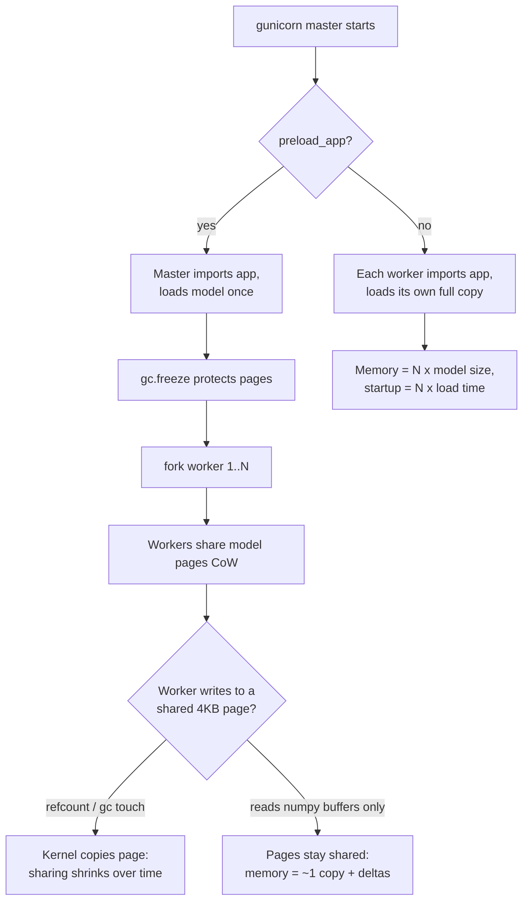
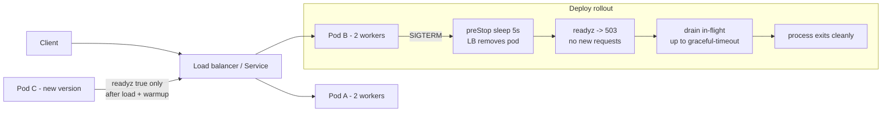

# FastAPI and CPU Model Serving

Most production ML inference is not a 70B LLM on an H100 — it is a gradient-boosted tree, a logistic regression, or a small neural network answering in single-digit milliseconds on CPUs. Serving these well is a different discipline from GPU serving: the constraints are process memory (every worker holds a model copy), the Python event loop (one blocking call stalls every concurrent request), and thread contention (BLAS and ONNX Runtime will happily oversubscribe your cores into a slowdown). This guide builds CPU serving from the process model up to a complete production service, with the arithmetic and benchmarks that justify each decision.

The through-line: on CPU, you are managing *copies* and *cores*. Get the worker count × model memory equation wrong and the OOM killer visits at 3 a.m.; get the threading model wrong and your p99 is 40x your p50 under load. Everything here is measurable on a laptop — run the snippets.

Part of the [Senior AI Engineer Roadmap](../00-Senior-AI-Engineer-Roadmap.md) — Phase 8.

---

## 1. The Process and Worker Model

### 1.1 How uvicorn/gunicorn Actually Run Your App

A single uvicorn process runs one event loop in one Python process — one GIL, one model copy. To use N cores for Python-level work you run N worker *processes*, each a full copy of your app:

```bash
# Option A: uvicorn's own multiprocess mode
uvicorn app:app --workers 4 --host 0.0.0.0 --port 8000

# Option B: gunicorn as process manager with uvicorn workers (more control)
gunicorn app:app \
  --worker-class uvicorn.workers.UvicornWorker \
  --workers 4 \
  --timeout 30 \
  --graceful-timeout 20 \
  --max-requests 10000 --max-requests-jitter 1000
```

`--max-requests` recycles workers periodically — a blunt but effective defense against slow memory leaks (fragmentation, native-extension leaks) that otherwise accumulate for weeks.

### 1.2 The Memory Arithmetic You Must Do Before Deploying

Every worker process loads its own model copy. The equation:

```text
total_memory ≈ workers × (base_python + model_size + per_request_buffers) + OS/page cache

Worked example — a 1.2 GB LightGBM ensemble:
  base Python + FastAPI + libs:            ~250 MB
  model in memory (deserialized):          ~1,500 MB   (disk 1.2 GB → RAM ~1.25x after joblib load)
  per-request feature buffers, headroom:   ~250 MB
  per-worker total:                        ~2,000 MB

  4 workers × 2 GB   = 8 GB
  Pod limit 8 GB     → OOMKilled on the first traffic burst (no headroom)
  Correct sizing     → 4 workers need a 10 GB limit, or drop to 3 workers on 8 GB
```

The classic failure: someone sets `--workers $(nproc)` on a 16-core node with a 2 GB model and requests a 16 GB pod. 16 × 2.25 GB = 36 GB. The pod is killed during startup and Kubernetes crash-loops it forever.

### 1.3 preload_app and Copy-on-Write: The Promise and the Reality

gunicorn's `--preload` loads the app (and model) **once in the master**, then forks workers. Linux fork gives copy-on-write (CoW) pages: children *share* the model's physical memory until a page is written.

```python
# gunicorn.conf.py
preload_app = True   # load model in master before fork -> workers share pages via CoW
workers = 4
```

The reality check — CoW sharing degrades over time:

- **CPython refcounting writes to every object header it touches.** Touching a Python object (even just reading it through normal code) increments its refcount, which dirties the 4 KB page it lives on, which triggers a private copy. A model stored as many small Python objects (sklearn trees pre-1.0, dict-heavy configs) gets progressively un-shared.
- **What stays shared:** large contiguous buffers that Python reads without refcount churn — numpy arrays backing the model (LightGBM/XGBoost internal buffers, ONNX Runtime's own native allocations). These are the bulk of most model memory, so in practice you keep 60–90% sharing for array-backed models.
- **`gc` makes it worse:** the cyclic garbage collector *walks* objects, dirtying pages. For big preloaded models, `gc.freeze()` after loading (Python 3.7+) moves everything loaded so far into a permanent generation the GC never touches, preserving CoW.

```python
# In gunicorn.conf.py
import gc

def on_starting(server):
    # runs in master, before fork
    from app.model_store import load_model
    load_model()          # populate module-level model object
    gc.freeze()           # protect loaded pages from GC-driven CoW faults

# Measured on a 1.5 GB model, 4 workers (RSS via smem, USS = truly private):
#   no preload:            4 × 1,500 MB private  = 6.0 GB
#   preload, no freeze:    ~55% shared after 1h  = 3.4 GB
#   preload + gc.freeze:   ~85% shared after 24h = 2.4 GB
```

Caveat: `--preload` means the master imports your app — a bad model file crashes the master (fail-fast, arguably good) and you lose per-worker lazy reload tricks. It also breaks if model loading opens connections/threads that don't survive fork (e.g., a client with background threads must be created *post*-fork, in a `post_fork` hook).



---

## 2. Sync Endpoints, Thread Offloading, and the Blocking-the-Loop Hazard

### 2.1 The Hazard, Demonstrated

An `async def` endpoint runs *on the event loop*. If it calls a CPU-bound model directly, the loop can do nothing else — not accept connections, not answer health checks — until inference finishes.

```python
# blocking_demo.py — run: uvicorn blocking_demo:app  ; then hit both endpoints concurrently
import time, asyncio
from fastapi import FastAPI

app = FastAPI()

def cpu_inference(ms: int = 200):
    t_end = time.perf_counter() + ms / 1000
    while time.perf_counter() < t_end:   # simulate BLAS/tree traversal: pure CPU, holds GIL
        pass
    return {"ok": True}

@app.get("/bad")
async def bad():
    return cpu_inference()               # BLOCKS the event loop for 200 ms

@app.get("/good")
async def good():
    return await asyncio.to_thread(cpu_inference)   # loop stays free

@app.get("/ping")
async def ping():
    return {"pong": time.time()}
```

```python
# probe.py — measure /ping latency while 20 concurrent requests hammer /bad vs /good
import asyncio, time, httpx

async def flood(client, path, n=20):
    await asyncio.gather(*[client.get(f"http://127.0.0.1:8000{path}") for _ in range(n)])

async def probe_ping(client):
    t0 = time.perf_counter()
    await client.get("http://127.0.0.1:8000/ping")
    return (time.perf_counter() - t0) * 1000

async def main():
    async with httpx.AsyncClient(timeout=60) as c:
        for path in ("/bad", "/good"):
            task = asyncio.create_task(flood(c, path))
            await asyncio.sleep(0.05)
            ping_ms = await probe_ping(c)
            await task
            print(f"flooding {path:5s} -> /ping latency: {ping_ms:8.1f} ms")

asyncio.run(main())
# Expected output (single worker):
# flooding /bad  -> /ping latency:   3987.4 ms   <- ping waited behind ~20 x 200ms of loop blockage
# flooding /good -> /ping latency:      2.1 ms   <- loop free; inference in threads
```

That 4-second `/ping` is exactly how "the service is deadlocked, health checks are failing, K8s is restarting healthy pods" incidents happen.

### 2.2 The Three Correct Shapes

| Shape | When | Mechanism |
| --- | --- | --- |
| `def` endpoint (sync) | Simplest; short CPU-bound handlers | FastAPI runs it in the threadpool automatically (default 40 threads) |
| `async def` + `await asyncio.to_thread(model.predict, X)` | Mixed I/O + CPU in one handler | You choose exactly what leaves the loop |
| `async def` pure | Handler does only awaited I/O (calls another service) | No offload needed |

The trap shape is the fourth: `async def` that calls CPU-bound code without `await` — demonstrated above.

Two caveats on thread offloading for ML:

1. **The GIL**: `asyncio.to_thread` gives *concurrency*, not parallelism, for pure-Python code. It works for ML because numpy/LightGBM/ONNX Runtime release the GIL inside native compute — so inference threads genuinely run in parallel with the loop.
2. **Threadpool as a hidden concurrency limit**: FastAPI's default AnyIO threadpool is 40. Forty concurrent 200 ms inferences on a 4-core box = CPU oversubscription and latency collapse. Cap concurrent inference explicitly with a semaphore sized near your core count (shown in §6).

---

## 3. Model Loading Patterns

### 3.1 Lifespan: Load Once, Eagerly

```python
from contextlib import asynccontextmanager
from fastapi import FastAPI
import joblib, numpy as np

class ModelStore:
    model = None
    version: str = ""

@asynccontextmanager
async def lifespan(app: FastAPI):
    ModelStore.model = joblib.load("artifacts/fraud-gbm-v7.joblib")   # eager: fail at boot, not first request
    ModelStore.version = "fraud-gbm-v7"
    _warmup()
    yield
    ModelStore.model = None      # shutdown: release reference

def _warmup(n: int = 20):
    X = np.random.rand(1, 30).astype(np.float32)
    for _ in range(n):
        ModelStore.model.predict_proba(X)

app = FastAPI(lifespan=lifespan)
```

**Eager vs lazy**: eager loading (in lifespan) surfaces a corrupt or missing artifact at boot, when the orchestrator still routes traffic to old pods; readiness stays false until the load succeeds. Lazy loading (on first request) starts "faster" but ships the failure to a user and puts a multi-second load inside one unlucky request. Eager wins for the primary model, always. Lazy is defensible only for rarely-used secondary models (long-tail per-tenant models with an LRU cache).

### 3.2 Why Warmup Requests Matter — Measured

First inferences are slow: memory allocators grow arenas, BLAS threads spin up, code paths JIT/populate caches, page cache warms.

```python
# warmup_bench.py
import time, joblib, numpy as np
model = joblib.load("artifacts/fraud-gbm-v7.joblib")
X = np.random.rand(1, 30).astype(np.float32)

lat = []
for i in range(200):
    t0 = time.perf_counter()
    model.predict_proba(X)
    lat.append((time.perf_counter() - t0) * 1e3)

print(f"call 1:      {lat[0]:6.2f} ms")
print(f"calls 2-10:  {np.mean(lat[1:10]):6.2f} ms")
print(f"calls 50+:   {np.mean(lat[50:]):6.2f} ms")
# Typical output (300-tree LightGBM, 4-core VM):
# call 1:       41.53 ms   <- allocator + thread-pool spin-up + cold caches
# calls 2-10:    3.87 ms
# calls 50+:     2.91 ms
```

A 14x first-call penalty. Without warmup, every deploy/scale-up sends a burst of 40 ms responses (and, for bigger models, seconds) to real users. The fix is the `_warmup()` loop above, run *before* readiness flips true — the orchestrator only routes traffic to a pod that is already fast.

---

## 4. Request Micro-Batching on CPU

Vectorized inference is dramatically cheaper per row than one-at-a-time — `predict_proba` on 32 rows costs barely more than on 1 (shared traversal setup, SIMD, cache locality). Micro-batching collects concurrent requests for a few milliseconds and runs them as one call.

### 4.1 Implementation with asyncio

```python
# microbatch.py — a self-contained batching layer
import asyncio
import numpy as np

class MicroBatcher:
    """Coalesce concurrent predict calls into one vectorized model call.

    max_batch: cap on rows per model call
    max_wait_ms: how long the first request in a window waits for company
    """
    def __init__(self, model, max_batch: int = 32, max_wait_ms: float = 5.0):
        self.model = model
        self.max_batch = max_batch
        self.max_wait = max_wait_ms / 1000
        self.queue: asyncio.Queue = asyncio.Queue()
        self._task = asyncio.create_task(self._loop())

    async def predict(self, row: np.ndarray) -> float:
        fut = asyncio.get_running_loop().create_future()
        await self.queue.put((row, fut))
        return await fut

    async def _loop(self):
        while True:
            row, fut = await self.queue.get()          # block until first request
            batch = [(row, fut)]
            deadline = asyncio.get_running_loop().time() + self.max_wait
            while len(batch) < self.max_batch:
                timeout = deadline - asyncio.get_running_loop().time()
                if timeout <= 0:
                    break
                try:
                    batch.append(await asyncio.wait_for(self.queue.get(), timeout))
                except asyncio.TimeoutError:
                    break
            X = np.vstack([r for r, _ in batch])
            try:                                        # ONE vectorized call, off the loop
                probs = await asyncio.to_thread(
                    lambda: self.model.predict_proba(X)[:, 1]
                )
                for (_, f), p in zip(batch, probs):
                    if not f.done():
                        f.set_result(float(p))
            except Exception as e:                      # fail the whole batch loudly
                for _, f in batch:
                    if not f.done():
                        f.set_exception(e)
```

Wire it into the app:

```python
@asynccontextmanager
async def lifespan(app: FastAPI):
    ModelStore.model = joblib.load("artifacts/fraud-gbm-v7.joblib")
    _warmup()
    app.state.batcher = MicroBatcher(ModelStore.model, max_batch=32, max_wait_ms=5)
    yield

@app.post("/score")
async def score(req: ScoreRequest):
    row = req.to_numpy()                       # shape (1, n_features)
    prob = await app.state.batcher.predict(row)
    return {"score": prob}
```

### 4.2 The Trade, Measured

```python
# bench: 200 concurrent requests, 300-tree LightGBM, 4 cores
# Per-call cost: 1 row = 2.9 ms ; 32 rows = 4.1 ms  (0.13 ms/row vectorized -> ~22x per-row win)
#
#                      throughput      p50        p99
# no batching          ~700 rps       6.1 ms    118 ms   <- 200 threads fight 4 cores
# batch=32, wait=5ms  ~4,800 rps      7.8 ms     14 ms
#
# Reading: you PAID up to 5 ms of added latency per request (the wait window)
# and BOUGHT ~7x throughput and a 8x better p99 (less core contention).
```

The tuning rule: `max_wait_ms` is a latency tax every request may pay; set it to a small fraction of your SLO (5 ms against a 100 ms SLO). At low traffic the window expires with 1–2 rows and behavior degrades gracefully to unbatched. Micro-batching only pays when (a) the model is meaningfully vectorized and (b) concurrency is high enough that windows actually fill — check the batch-size histogram in production before keeping it.

---

## 5. Inference Optimization for Classical / Tree / Small-NN Models

### 5.1 ONNX Runtime Conversion — Walkthrough with Benchmarks

ONNX Runtime (ORT) replaces the framework's Python inference path with an optimized C++ graph runtime — usually the single biggest CPU win for sklearn/tree models.

```python
# convert_and_bench.py
# pip install skl2onnx onnxruntime lightgbm onnxmltools
import time, numpy as np, joblib
import onnxruntime as ort
from skl2onnx import convert_sklearn
from skl2onnx.common.data_types import FloatTensorType

model = joblib.load("artifacts/fraud-gbm-v7.joblib")     # sklearn GradientBoosting or pipeline
n_features = 30

# 1) Convert
onnx_model = convert_sklearn(
    model,
    initial_types=[("input", FloatTensorType([None, n_features]))],
    options={id(model): {"zipmap": False}},   # zipmap off -> raw prob array, not list-of-dicts
)
with open("artifacts/fraud-gbm-v7.onnx", "wb") as f:
    f.write(onnx_model.SerializeToString())

# 2) Session with explicit thread control
so = ort.SessionOptions()
so.intra_op_num_threads = 1        # threads WITHIN one inference op — see 5.3
so.inter_op_num_threads = 1
sess = ort.InferenceSession("artifacts/fraud-gbm-v7.onnx",
                            sess_options=so, providers=["CPUExecutionProvider"])

# 3) Parity check BEFORE any benchmark — never ship an unverified conversion
X = np.random.rand(1000, n_features).astype(np.float32)
p_skl = model.predict_proba(X)[:, 1]
p_onnx = sess.run(None, {"input": X})[1][:, 1]
assert np.allclose(p_skl, p_onnx, atol=1e-5), "conversion changed predictions"

# 4) Benchmark single-row latency
def bench(fn, n=2000):
    fn(); fn()                                   # warm
    t0 = time.perf_counter()
    for _ in range(n):
        fn()
    return (time.perf_counter() - t0) / n * 1e3

x1 = X[:1]
print(f"sklearn 1-row:  {bench(lambda: model.predict_proba(x1)):6.3f} ms")
print(f"onnxrt  1-row:  {bench(lambda: sess.run(None, {'input': x1})):6.3f} ms")
# Typical output (300 trees, depth 8, 4-core VM):
# sklearn 1-row:   2.914 ms
# onnxrt  1-row:   0.184 ms      <- ~16x: no Python per-tree overhead, fused traversal
```

Order-of-magnitude wins are normal for single-row tree inference because sklearn's Python dispatch overhead dominates at batch size 1. For batch scoring the gap narrows (both vectorize) but ORT typically still wins 2–4x. Bonus: the `.onnx` artifact decouples serving from sklearn versions entirely (see §5.4).

### 5.2 Quantization on CPU

For small neural nets (embeddings, text classifiers), dynamic int8 quantization converts weights to int8 and quantizes activations on the fly:

```python
from onnxruntime.quantization import quantize_dynamic, QuantType
quantize_dynamic("encoder.onnx", "encoder.int8.onnx", weight_type=QuantType.QInt8)
# Typical effect on a small transformer encoder (CPU, AVX2/VNNI):
#   size:     440 MB -> 112 MB          (~4x)
#   latency:  38 ms  -> 17 ms per call  (~2.2x, VNNI int8 matmul)
#   quality:  re-run your eval suite; expect <1% delta but MEASURE it
```

Tree models gain nothing from int8 (they are comparisons, not matmuls) — for them, ORT conversion and thread tuning are the levers.

### 5.3 Thread-Count Tuning: intra-op, inter-op, and the Oversubscription Trap

Every native runtime brings its own threadpool: ORT (`intra_op_num_threads`), OpenBLAS/MKL (`OMP_NUM_THREADS`), LightGBM (`num_threads`). Defaults assume the process owns the whole machine. Under a web server you have: `workers × handler_threads × BLAS_threads` candidate threads on a fixed core count.

```text
The trap, quantified on a 4-core pod:
  4 gunicorn workers × ORT default intra_op=4 = 16 compute threads on 4 cores
  -> context-switch thrash: single-row p50 0.18 ms degrades to ~0.9 ms under load

The rule for many concurrent small requests:
  intra_op = 1 per session, parallelism comes from concurrent REQUESTS
  (each request already has a core's worth of work; splitting a 0.2 ms op
   across 4 threads adds sync overhead worth more than the op)

The opposite workload — one huge batch job on a 16-core box:
  intra_op = physical cores, workers = 1  (parallelize INSIDE the op)
```

Set them explicitly, everywhere, and pin the env vars too so hidden BLAS pools obey:

```bash
export OMP_NUM_THREADS=1 OPENBLAS_NUM_THREADS=1 MKL_NUM_THREADS=1
```

### 5.4 Serialization Hazards: joblib/pickle and the sklearn-Upgrade Incident

joblib/pickle store *object graphs referencing class definitions by import path* — not portable model math. Consequences:

- Loading requires the **same library versions** (often exactly; sklearn only guarantees best-effort across even minor versions). An artifact trained on sklearn 1.2 may fail to load on 1.4 — or worse, **load and predict differently** if internal attributes were reorganized.
- Unpickling executes arbitrary code — never load artifacts from untrusted sources.

The canonical incident: a routine base-image rebuild bumps sklearn 1.1 → 1.3. Pods start, `joblib.load` succeeds (no error!), but a changed private attribute default shifts predictions by a few percent. No crash, no alert — just silently different scores until a business metric drifts a week later. Defenses:

```python
# 1) Pin exactly in the serving image:      scikit-learn==1.3.2  joblib==1.3.2
# 2) Save a manifest next to every artifact and verify at load:
import json, sklearn, joblib, hashlib

def save_artifact(model, path):
    joblib.dump(model, path)
    manifest = {
        "sklearn": sklearn.__version__,
        "sha256": hashlib.sha256(open(path, "rb").read()).hexdigest(),
        "golden_input": [[0.1] * 30],
        "golden_output": [float(model.predict_proba([[0.1] * 30])[0, 1])],
    }
    json.dump(manifest, open(path + ".manifest.json", "w"))

def load_artifact(path):
    m = json.load(open(path + ".manifest.json"))
    assert m["sklearn"] == sklearn.__version__, \
        f"artifact needs sklearn {m['sklearn']}, runtime has {sklearn.__version__}"
    model = joblib.load(path)
    got = float(model.predict_proba(m["golden_input"])[0, 1])
    assert abs(got - m["golden_output"][0]) < 1e-9, "golden prediction drifted"
    return model
# 3) Best fix: export to ONNX — the artifact is then a version-independent graph.
```

---

## 6. The Complete Production Service

Everything above assembled, plus metrics, timeouts, and graceful shutdown:

```python
# app.py — gunicorn app:app -k uvicorn.workers.UvicornWorker -w 2 --graceful-timeout 25
import asyncio, time
from contextlib import asynccontextmanager
from fastapi import FastAPI, HTTPException, Request, Response
from pydantic import BaseModel, Field
import numpy as np
import onnxruntime as ort
from prometheus_client import Counter, Histogram, generate_latest

REQS = Counter("inference_requests_total", "requests", ["outcome"])
LAT = Histogram("inference_latency_seconds", "e2e latency",
                buckets=(.002, .005, .01, .025, .05, .1, .25, .5, 1, 2.5))

class ScoreRequest(BaseModel):
    features: list[float] = Field(min_length=30, max_length=30)

class Store:
    sess: ort.InferenceSession | None = None
    version = "fraud-gbm-v7-onnx"
    inflight = 0
    draining = False

INFER_SEM_SIZE = 4                       # ~= cores; caps concurrent native inference

@asynccontextmanager
async def lifespan(app: FastAPI):
    so = ort.SessionOptions()
    so.intra_op_num_threads = 1
    Store.sess = ort.InferenceSession("artifacts/fraud-gbm-v7.onnx",
                                      sess_options=so,
                                      providers=["CPUExecutionProvider"])
    x = np.zeros((1, 30), dtype=np.float32)
    for _ in range(20):                  # warmup before readiness flips true
        Store.sess.run(None, {"input": x})
    app.state.sem = asyncio.Semaphore(INFER_SEM_SIZE)
    yield
    Store.draining = True                # 1) readiness false -> LB stops sending
    for _ in range(100):                 # 2) wait for in-flight to drain (<=10 s)
        if Store.inflight == 0:
            break
        await asyncio.sleep(0.1)         # 3) then lifespan exits, process stops

app = FastAPI(lifespan=lifespan)

@app.middleware("http")
async def metrics_mw(request: Request, call_next):
    if request.url.path != "/score":
        return await call_next(request)
    t0 = time.perf_counter()
    Store.inflight += 1
    try:
        resp = await call_next(request)
        REQS.labels("ok" if resp.status_code < 500 else "error").inc()
        return resp
    except Exception:
        REQS.labels("error").inc()
        raise
    finally:
        Store.inflight -= 1
        LAT.observe(time.perf_counter() - t0)

@app.get("/healthz")
def healthz():                           # liveness: process alive, keep it dumb
    return {"ok": True}

@app.get("/readyz")
def readyz():                            # readiness: model loaded, warm, not draining
    if Store.draining or Store.sess is None:
        raise HTTPException(503, "not ready")
    return {"ready": True, "version": Store.version}

@app.get("/metrics")
def metrics():
    return Response(generate_latest(), media_type="text/plain")

@app.post("/score")
async def score(req: ScoreRequest):
    x = np.asarray([req.features], dtype=np.float32)
    async with app.state.sem:            # bound concurrent native compute
        try:
            out = await asyncio.wait_for(       # hard per-request timeout
                asyncio.to_thread(Store.sess.run, None, {"input": x}),
                timeout=2.0,
            )
        except asyncio.TimeoutError:
            REQS.labels("timeout").inc()
            raise HTTPException(504, "inference timeout")
    return {"score": float(out[1][0, 1]), "model_version": Store.version}
```

Kubernetes wiring that makes the shutdown actually graceful:

```yaml
readinessProbe: { httpGet: { path: /readyz, port: 8000 }, periodSeconds: 2 }
livenessProbe:  { httpGet: { path: /healthz, port: 8000 }, periodSeconds: 10 }
lifecycle:
  preStop:
    exec: { command: ["sleep", "5"] }    # let endpoint removal propagate BEFORE SIGTERM
terminationGracePeriodSeconds: 30        # > preStop + gunicorn graceful-timeout
```

The shutdown sequence, in order: pod marked Terminating → endpoints controller removes it from the Service (takes a few seconds to propagate — hence `preStop: sleep 5`) → SIGTERM → readiness goes false, in-flight requests drain → process exits. Skip the preStop sleep and the LB keeps sending requests to a pod that already got SIGTERM — those requests get connection resets, and users see 502s on every single deploy.



### 6.1 Horizontal Scaling and the Load Balancer

- **Slow start**: a fresh pod has cold allocator arenas and empty CPU caches even after warmup. Envoy/ALB "slow start" ramps its traffic share over 30–60 s instead of instantly sending 1/N of traffic; without it, every scale-up event puts a latency blip on the p99 graph.
- **Connection reuse**: HTTP keep-alive between LB and pods avoids per-request TCP/TLS setup, but long-lived connections *pin* traffic distribution — a pod that joined late gets few connections and sits idle. Fix by setting a server-side keep-alive max age (gunicorn `--keep-alive`, or `--max-requests` per connection at the LB) so connections recycle and rebalance.
- **Scale on the right signal**: HPA on CPU works for CPU-bound inference; better is scaling on in-flight requests per pod or p95 latency (KEDA/custom metrics), because CPU lags the queue building up.
- **Per-pod concurrency cap** (the semaphore above) turns overload into fast 5xx/queueing you can see, instead of every request slowly timing out together.

---

## Production War Stories & Failure Modes

### Story 1: The Deploy That OOMKilled Only Under Traffic

- **Symptom**: new model version deploys fine, passes health checks, then pods die with OOMKilled 5–20 minutes later, only during peak hours.
- **Investigation**: `kubectl describe pod` shows OOMKilled at the 8 GB limit. Startup RSS is 6.9 GB (4 workers × ~1.7 GB) — fits. Memory graphs show RSS climbing under load, stepping up ~150 MB at a time.
- **Root cause**: the new model was 40% bigger, and per-request numpy feature buffers plus allocator fragmentation pushed each worker from 1.7 GB toward 2.0 GB under concurrency. The sizing "worked" at idle. workers × (model + *peak* request memory) exceeded the limit only under real traffic.
- **Fix**: dropped to 3 workers immediately (headroom restored), then enabled gunicorn `--preload` with `gc.freeze()`, cutting total RSS by ~45% and allowing 4 workers again.
- **Prevention**: a load test with production-shaped payloads is part of the deploy gate; memory sizing formula documented in the runbook uses *peak-load* per-worker RSS, plus 25% headroom, not idle RSS.

### Story 2: Health Checks Failing on a "Healthy" Service

- **Symptom**: Kubernetes restarts pods repeatedly during traffic spikes; logs show no errors — the service was "fine" until it was killed. Users see connection resets.
- **Investigation**: liveness probe timeouts. Reproduced locally: under 50 concurrent requests, `/healthz` takes 6+ seconds. The endpoint itself is trivial — so the *event loop* must be busy. Found one endpoint declared `async def` calling `model.predict()` directly.
- **Root cause**: the blocking-the-loop hazard (§2.1). Every inference blocked the loop ~180 ms; under concurrency, probes queued behind seconds of compute. Kubernetes correctly concluded the process was unresponsive and killed the exact pods that were doing the most work — a load-shedding death spiral.
- **Fix**: `await asyncio.to_thread(...)` around inference plus a concurrency semaphore. Probe latency under load went from 6 s to <5 ms.
- **Prevention**: CI test that floods the app with concurrent inference and asserts `/healthz` p99 < 50 ms; lint rule flagging `async def` endpoints that call known model objects without `to_thread`/`run_in_executor`.

### Story 3: The Silent sklearn Upgrade

- **Symptom**: fraud-approval rate drifts 3% over a week. No deploys of the model, no errors, no alerts.
- **Investigation**: prediction distributions shifted exactly at the timestamp of a base-image rebuild. Diffed the image: scikit-learn 1.1.3 → 1.3.0, pulled in transitively by another dependency bump. The joblib artifact loaded without any warning.
- **Root cause**: pickle stores object internals; the new sklearn version interpreted a private attribute differently, changing tree-traversal tie-breaking. Predictions moved a few percent — enough to move money, not enough to crash.
- **Fix**: rolled back the image; re-exported the model to ONNX so the serving artifact no longer depends on sklearn at all.
- **Prevention**: exact-pin ML libraries in serving images; golden-prediction check at model load (manifest pattern in §5.4) so a drifted artifact fails readiness instead of serving; prediction-distribution monitoring alerting on population-stability index.

### Story 4: The Threadpool Meltdown at 2x Traffic

- **Symptom**: at a marketing-driven 2x traffic spike, p50 goes 4 ms → 9 ms but p99 goes 40 ms → 3.8 s. CPU is at 100%, throughput *drops* below the pre-spike level.
- **Investigation**: `py-spy dump` shows dozens of threads inside ORT compute; thread count per worker ~45. ORT sessions were created with default thread settings: `intra_op = ncores = 4` — and FastAPI's 40-thread pool happily ran 40 concurrent inferences, each spawning 4-way parallel ops: ~160 runnable threads on 4 cores.
- **Root cause**: thread oversubscription (§5.3). Past the core count, added concurrency only adds context switching; per-request latency inflates, requests pile up, more threads start — self-reinforcing collapse.
- **Fix**: `intra_op_num_threads=1`, `OMP_NUM_THREADS=1`, and a semaphore capping concurrent inference at 4 per worker. Same hardware then sustained 2.5x the original traffic with a flat p99; excess load queued briefly or shed with 503s.
- **Prevention**: thread-count settings are explicit in code (never defaults) and asserted in a startup log line; load tests run to *saturation*, not just to expected traffic, so the collapse mode is known before customers find it.

---

## Best Practices

- Do the memory arithmetic before choosing worker count: `workers × (base + model + peak request buffers) + headroom ≤ limit`, measured under load, not at idle.
- Use gunicorn `--preload` with `gc.freeze()` for large models to keep copy-on-write sharing; create clients/threads post-fork.
- Never run CPU-bound inference directly in an `async def` handler — use `def` endpoints or `asyncio.to_thread`, and prove it with a health-check-under-load test.
- Load models eagerly in lifespan, run warmup inferences, and only then report ready; keep liveness trivial and separate from readiness.
- Cap concurrent inference with a semaphore sized near core count; let excess queue or fail fast rather than thrash.
- Set every native threadpool explicitly (`intra_op`, `OMP_NUM_THREADS`, etc.); for many small requests use 1 thread per op and get parallelism from request concurrency.
- Convert sklearn/tree models to ONNX Runtime: order-of-magnitude single-row speedups and freedom from pickle version coupling — but always run a numerical parity check before shipping.
- Pin ML library versions exactly in serving images and verify artifacts with a golden-prediction manifest at load time.
- Micro-batch only when concurrency is real and the model vectorizes; bound the wait window at a small fraction of the SLO and watch the batch-size histogram.
- Enforce per-request timeouts server-side; a request you can't bound is an SLO you can't keep.
- Make shutdown graceful end to end: preStop delay for LB propagation, readiness flip, in-flight drain, and a termination grace period longer than the drain.
- Recycle workers (`--max-requests` with jitter) as a defense-in-depth against slow leaks.

---

## Interview Drills

<details><summary>You have a 2 GB model and a 16-core, 16 GB pod. How many gunicorn workers do you run, and what else do you change?</summary>
Naive `workers = ncores = 16` needs roughly 16 × (0.25 GB base + ~2.5 GB model in RAM + buffers) ≈ 45+ GB — instant OOM. On 16 GB, without sharing, you fit at most ~5 workers (5 × 2.9 ≈ 14.5 GB) and waste 11 cores of Python capacity. Better: enable `--preload` with `gc.freeze()` so workers share the model via copy-on-write — one ~2.5 GB copy plus per-worker private deltas lets you run 8–12 workers in 16 GB. Also verify inference releases the GIL (numpy/ORT does), cap native threadpools at 1, and confirm peak-load RSS with a load test before setting limits.

Follow-up: what breaks with preload? — The master imports the app, so load failures kill the master (fail-fast); anything that opens sockets or threads at import time must move to a post-fork hook; and CoW sharing erodes as Python refcounting dirties pages, which is why `gc.freeze()` and array-backed models matter.

Follow-up: why does the model take more RAM than its disk size? — Deserialization overhead: object headers, alignment, allocator fragmentation; 1.2–1.5x disk size is a normal planning number, but measure your artifact.
</details>

<details><summary>Explain exactly why calling model.predict() inside an async def endpoint is worse than inside a def endpoint.</summary>
An `async def` handler executes on the event loop thread. A CPU-bound `predict()` there monopolizes the loop for its whole duration: no other request is accepted or progressed, health checks stall, and concurrency drops to 1 regardless of load. A `def` handler, by contrast, is automatically dispatched to the threadpool by FastAPI/Starlette, so the loop stays free; since numpy/ORT release the GIL in native code, those threads run genuinely in parallel. The demo arithmetic: 20 concurrent 200 ms blocking calls serialize into ~4 s of loop blockage — a trivial `/ping` measured 3,987 ms during the flood versus 2 ms with `to_thread`.

Follow-up: so should everything be def? — For pure CPU handlers, def is fine. Use `async def` + `to_thread` when the handler mixes I/O you want to await (feature fetch, downstream calls) with CPU inference, and when you want explicit control over what leaves the loop.

Follow-up: does the threadpool itself become a problem? — Yes: default 40 threads means up to 40 concurrent inferences oversubscribing your cores. Bound inference with a semaphore near core count.
</details>

<details><summary>Your service's first request after every deploy takes 800 ms; steady-state is 12 ms. Diagnose and fix.</summary>
Classic cold-start: the first inference pays allocator arena growth, BLAS/ORT threadpool spin-up, lazy initialization, and cold CPU/page caches; possibly lazy model loading too if the load happens on first request. Fix in order: (1) load the model eagerly in lifespan, not lazily; (2) run 10–20 warmup inferences with representative input shapes before readiness returns true, so the orchestrator never routes to a cold pod; (3) if using an LB, enable slow-start so new pods ramp traffic. Verify by measuring call-1 vs call-50 latency (a 14x gap is typical for tree models) and confirming post-fix that deploys leave no p99 blip.

Follow-up: why warmup with representative shapes? — Some runtimes cache execution plans per input shape; warming with shape (1, N) doesn't warm batch paths if production sends (32, N).
</details>

<details><summary>When does micro-batching on CPU help, and how do you pick the window?</summary>
It helps when the model is much cheaper per row in vectorized form (1 row 2.9 ms vs 32 rows 4.1 ms — a ~22x per-row win for a GBM) *and* concurrency is high enough that a few-millisecond window actually accumulates rows. The window (`max_wait_ms`) is a deliberate latency tax capped by SLO: with a 100 ms budget, 5 ms buys up to 7x throughput and — counterintuitively — *better* p99, because one vectorized call replaces dozens of threads contending for cores. At low traffic the window expires nearly empty and the system gracefully behaves as unbatched. Monitor the realized batch-size histogram: if p90 batch size is 1, delete the batcher — you're paying the window for nothing.

Follow-up: why not batch on the load balancer or client instead? — Client batching couples callers and breaks request independence; server-side per-process batching keeps the API contract per-request while exploiting co-arrival. For GPU serving, this same idea becomes dynamic/continuous batching in the serving engine.
</details>

<details><summary>Walk me through converting a sklearn model to ONNX Runtime. What do you verify, and what wins do you expect?</summary>
Steps: export with skl2onnx (declare input tensor type/shape, disable zipmap to get plain arrays), create an ORT session with explicit `intra_op_num_threads`, then — before any benchmarking — run a numerical parity check on a large random and real sample (`np.allclose` within a tolerance) plus your task eval suite. Expected wins: ~10–20x on single-row tree inference (eliminates Python per-tree dispatch), 2–4x on batch, plus a portable artifact that removes the sklearn-version pickle coupling. Also verify: unsupported estimators or custom transformers in a Pipeline (they must be converted or reimplemented), float32 vs float64 differences (skl2onnx defaults to float32 — tolerance, not equality), and thread settings for your deployment shape.

Follow-up: the parity check passes but production shows different scores — how? — Feature pipelines outside the exported graph diverged (e.g., pandas dtype coercion), or the float64→float32 boundary interacts with a threshold; compare end-to-end request paths, not just model objects.
</details>

<details><summary>What is thread oversubscription in ML serving and what's your standard configuration?</summary>
Every layer brings a threadpool: web server workers, handler threadpool, and each native runtime (ORT intra/inter-op, OpenBLAS, MKL, LightGBM). Defaults each assume they own the machine, so effective threads = workers × concurrent handlers × BLAS threads — easily 10–40x core count. Past core count, extra runnable threads add only context switches and cache thrash: throughput drops as load rises, p99 explodes. Standard config for many small requests: `intra_op_num_threads=1`, `inter_op=1`, `OMP_NUM_THREADS=1`/`OPENBLAS_NUM_THREADS=1`/`MKL_NUM_THREADS=1`, worker count from memory arithmetic, and an asyncio semaphore capping concurrent inference at ~core count per pod. Parallelism then comes from concurrent requests, which is the natural unit.

Follow-up: when would you want intra_op high? — Batch/offline scoring or single large requests: one op at a time that can use all cores, e.g., `intra_op = physical cores` with a single worker.

Follow-up: how do you detect it in production? — Thread count per process, voluntary vs involuntary context-switch rates, and py-spy showing many threads inside native compute; the signature is throughput falling while CPU sits at 100%.
</details>

<details><summary>Why is pickle/joblib a production hazard for model artifacts, and what's the mitigation ladder?</summary>
Pickle serializes object graphs referencing classes by import path, so loading depends on the exact library code that created it. Hazards: (1) load failures on version change — the good outcome; (2) silent behavior change — artifact loads but internal attributes are reinterpreted, shifting predictions with no error; (3) arbitrary code execution on unpickle — a supply-chain risk for any artifact you didn't produce. Mitigation ladder: exact-pin ML libraries in the serving image; ship a manifest with library versions, artifact hash, and golden input→output pairs verified at load (fail readiness on drift); monitor live prediction distributions; and ultimately export to a framework-neutral format (ONNX) so serving depends only on the runtime, not the training stack.

Follow-up: the golden-prediction check passed but drift still happened — where? — Golden checks cover the model function at fixed points; drift can enter via feature-engineering code, upstream data semantics, or inputs in regions the golden set doesn't cover. Pair load-time checks with online distribution monitoring (e.g., PSI on scores).
</details>

<details><summary>Design the shutdown path so that a deploy causes zero user-visible errors.</summary>
The ordered sequence: (1) pod marked Terminating; endpoints controller begins removing it from the Service — this propagation takes seconds, so (2) a `preStop` hook sleeps ~5 s *before* SIGTERM so no new connections arrive after the app starts dying; (3) on SIGTERM, flip readiness to 503 (belt-and-suspenders) and stop accepting; (4) drain: wait for in-flight requests to complete, bounded by gunicorn `--graceful-timeout`; (5) exit. Kubernetes `terminationGracePeriodSeconds` must exceed preStop + graceful-timeout, or the kubelet SIGKILLs mid-drain. On the intake side, new pods must pass readiness only after model load + warmup. Verify with a load test that runs continuously through a rolling deploy asserting zero 5xx.

Follow-up: you still see a handful of 502s at the LB — why? — Keep-alive connections: the LB holds open connections to the dying pod and sends one more request on them. Fix with the preStop delay (most of it), plus having the server send `Connection: close` during drain and configuring LB connection max-age.
</details>

<details><summary>How do you enforce request timeouts for CPU inference, given that you can't kill a running thread in Python?</summary>
`asyncio.wait_for(asyncio.to_thread(infer), timeout=2)` bounds what the *caller* waits for and returns a 504 — but the underlying thread keeps running to completion (Python offers no safe thread kill). So the timeout protects latency SLO and caller resources, not CPU. To protect CPU: keep per-inference cost bounded by design (input size validation — cap rows/features at the pydantic boundary), size the semaphore so orphaned computations can't starve the pool, and for genuinely unbounded workloads use a process pool where a worker *can* be terminated, or push the work to the async-job pattern instead of a synchronous endpoint. Also set timeouts at every layer coherently: LB timeout > server timeout > inference timeout, so the innermost fires first and returns a clean error rather than a mid-flight connection reset.

Follow-up: what's the risk of timing out at the LB but not the app? — The app keeps computing and eventually writes to a closed socket; the user already saw a 504 and retried, so you now compute the same request twice — a retry amplification under overload.
</details>

<details><summary>Your p99 is 40x your p50 under load, CPU at 100%. Walk through your diagnosis.</summary>
That signature is queueing plus contention, not slow inference. Order of checks: (1) event-loop blockage — is any `async def` doing CPU work? Probe: health-check latency under load; (2) thread oversubscription — thread count per process vs cores, BLAS/ORT settings at defaults?; (3) queueing at saturation — arrival rate near service capacity makes wait time explode nonlinearly (utilization ρ→1, W ~ ρ/(1−ρ)); check in-flight request counts and threadpool queue depth; (4) GC pauses or worker recycling; (5) noisy neighbors/CPU throttling — check container CPU throttling metrics (cfs_throttled). Fixes map directly: to_thread + semaphore, thread pinning to 1, add pods or shed load below the knee, and raise CPU limits or pin requests=limits to avoid throttling.

Follow-up: why does capping concurrency *reduce* p99? — Beyond core count, admitted requests don't finish faster in aggregate — they all context-switch and everyone's latency inflates. A cap keeps service time flat and converts overload into short queue waits or explicit 503s, which the LB can retry against another pod.
</details>

<details><summary>Compare scaling this service with more workers per pod vs more pods.</summary>
Same CPU capacity, different failure and memory profiles. More workers per pod: shares the model via preload/CoW (memory-efficient), one node's cores, but a pod-level failure (OOM, node loss) takes out more capacity at once, and the memory limit must cover peak of *all* workers. More pods: finer-grained scheduling and failure blast radius, HPA-friendly, spreads across nodes, but each pod pays the full model copy and the load balancer needs slow-start and connection recycling to distribute load to newcomers. Practical shape: a few workers per pod (2–4) to amortize the model via CoW, then scale horizontally with pods; scale on in-flight requests or p95 latency rather than CPU, which lags the queue.

Follow-up: why does a newly added pod sometimes get almost no traffic? — Keep-alive pinning: existing LB→pod connections persist and requests follow them. Recycle connections (max-age, max-requests-per-connection) so the distribution rebalances.
</details>

<details><summary>When is CPU serving the wrong choice — what pushes you to a GPU?</summary>
Stay on CPU while per-request compute is small and models are trees/linear/small NNs: CPUs win on cost, cold-start, ops simplicity, and per-request latency at low batch sizes. Move to GPU when: model FLOPs per request make CPU latency miss the SLO even optimized (large transformers, vision models beyond a few hundred MB of matmuls); throughput economics flip — GPU batch inference can be cheaper per million inferences for big NNs; or you need the GPU-serving feature set (continuous batching for LLMs). The decision is a measurement: optimized CPU cost/latency (ONNX, int8, threads tuned) vs GPU cost/latency at your real traffic's achievable batch size. A GPU at batch size 1 with spiky traffic is often both slower to scale and more expensive than a rack of CPU pods.

Follow-up: what about int8 on CPU closing the gap? — For small transformers, VNNI int8 gives ~2x and often keeps you on CPU; for tree models quantization is irrelevant (no matmuls) and CPUs remain the right home almost regardless of scale.
</details>

<details><summary>What belongs in readiness vs liveness for an ML service, and what must never be in liveness?</summary>
Readiness answers "route traffic to me?": model loaded, warmup complete, dependencies reachable (feature store), not draining. It should flip false under drain and may flip false transiently under overload (with care). Liveness answers "is the process irrecoverably wedged?" — keep it trivial: return 200 if the loop can schedule. Never put model checks, dependency checks, or anything that can fail under load into liveness: a slow feature store or an event-loop stall would make Kubernetes kill loaded, warm pods — turning a partial degradation into a full outage, and specifically killing the busiest pods first (they're slowest to answer probes).

Follow-up: should readiness fail when a downstream dependency is down? — Only if the pod is truly useless without it. If all pods share the dependency, failing readiness everywhere removes the whole Service and turns a degraded state (errors on some endpoints) into a total one; prefer serving 5xx per-request with circuit breaking.
</details>

<details><summary>You enabled --preload and memory savings vanished after a day. Explain.</summary>
Copy-on-write sharing erodes as workers write to shared pages. In CPython the writes are mostly invisible to you: refcount updates on any object your code touches dirty that object's page, and cyclic GC *walks* the heap, dirtying pages wholesale. Over hours, per-worker private RSS (USS) climbs toward a full copy for object-heavy models. Mitigations: call `gc.freeze()` in the master after loading (moves loaded objects to a GC-exempt generation); prefer models whose memory is large native arrays (LightGBM buffers, ONNX runtime allocations) which Python never refcount-touches; recycle workers periodically so drifted workers reset to shared state; and measure with USS/PSS (smem), not RSS — RSS double-counts shared pages and hides the erosion.

Follow-up: why does worker recycling help memory here? — A fresh fork starts fully shared again; `--max-requests` with jitter staggers restarts so the fleet's average private memory stays low without simultaneous cold workers.
</details>

<details><summary>Sketch the capacity math: 4-core pods, single-row ORT inference at 0.2 ms, target 5,000 rps with p99 under 50 ms. How many pods?</summary>
Per-core service rate ≈ 1/0.0002 s = 5,000 rps ideal; per 4-core pod ≈ 20,000 rps at 100% utilization. But tail latency demands headroom: queueing delay explodes near saturation, so plan at ~60–70% utilization: ~12–14k rps per pod for pure inference. Realistically, per-request overhead (parsing, validation, serialization — often 0.5–1 ms of Python per request, GIL-bound) dominates: at ~1 ms total Python-side cost per request per worker, 4 workers ≈ 4,000 rps per pod at 100%, so ~2,800 rps at 70%. For 5,000 rps target: 2 pods minimum, 3 for N+1 redundancy across zones. The lesson: for tiny models the bottleneck is the Python request path, not the model — measure end-to-end rps per pod under load, don't extrapolate from model latency alone.

Follow-up: how would you raise per-pod capacity? — Cut per-request Python: orjson responses, lean pydantic models (or msgspec), micro-batching to amortize dispatch, fewer middleware layers — then re-measure; model inference at 0.2 ms was never the constraint.
</details>
