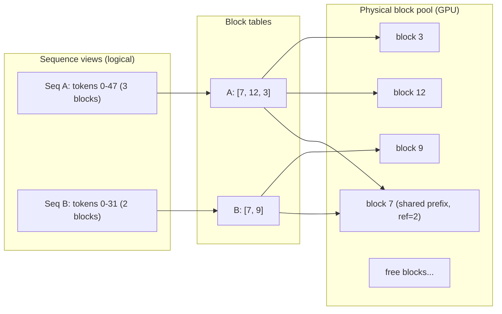
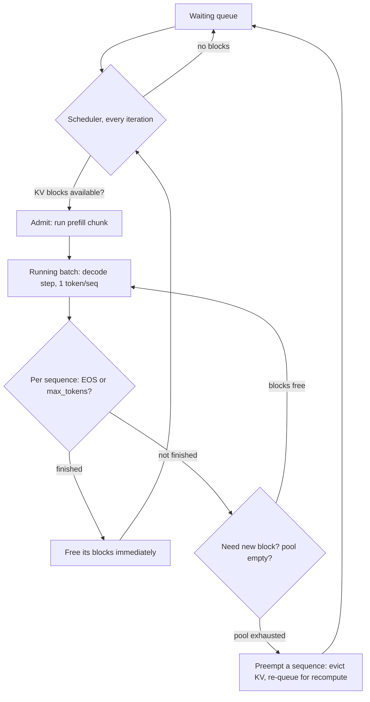

# vLLM and LLM Serving Internals

Serving an LLM is not like serving a gradient-boosted tree: a single response is thousands of sequential forward passes, memory demand grows token by token while the request runs, and the difference between a naive server and an engine like vLLM is 10-20x in throughput on identical hardware. This guide derives *why* from first principles — the KV-cache arithmetic, PagedAttention's virtual-memory trick, iteration-level scheduling — and then applies it: real server flags, a worked capacity plan for 100 concurrent chats, multi-GPU trade-offs, and an honest comparison of the alternatives.

The goal is to be able to answer not just "what does vLLM do" but "show me the numbers": bytes per token, blocks per sequence, GPUs per SLO. That arithmetic is what separates a senior serving answer from a buzzword list.

Part of the [Senior AI Engineer Roadmap](../00-Senior-AI-Engineer-Roadmap.md) — Phase 8.

---

## 1. Why Naive HF-Transformers Serving Collapses

The obvious first LLM server wraps `model.generate()` in FastAPI:

```python
# naive_server.py — the server everyone builds first, and why it dies.
# pip install fastapi uvicorn transformers torch
import torch, time
from fastapi import FastAPI
from pydantic import BaseModel
from transformers import AutoModelForCausalLM, AutoTokenizer

app = FastAPI()
MODEL = "mistralai/Mistral-7B-Instruct-v0.3"
tok = AutoTokenizer.from_pretrained(MODEL)
model = AutoModelForCausalLM.from_pretrained(MODEL, torch_dtype=torch.float16, device_map="cuda")

class Req(BaseModel):
    prompt: str
    max_tokens: int = 256

@app.post("/generate")
def generate(req: Req):                      # one request at a time, batch size 1
    t0 = time.perf_counter()
    ids = tok(req.prompt, return_tensors="pt").to("cuda")
    out = model.generate(**ids, max_new_tokens=req.max_tokens, do_sample=False)
    text = tok.decode(out[0][ids.input_ids.shape[1]:], skip_special_tokens=True)
    return {"text": text, "seconds": round(time.perf_counter() - t0, 2)}
# Measured on one A100-80GB, 256 output tokens:
#   1 client:   ~35 tok/s per request, GPU SM utilization ~8%
#   8 clients:  requests queue serially -> p50 latency 7s, p99 ~55s
#   Aggregate:  ~35 tok/s TOTAL no matter how many clients arrive
```

Three structural failures, each with arithmetic:

1. **No batching → the GPU is idle.** Decode generates one token per forward pass. At batch size 1, each pass reads all 14 GB of fp16 weights from HBM to produce *one* token's worth of compute. An A100 moves ~2 TB/s, so a pass takes ≥ 14/2000 s ≈ 7 ms — of which arithmetic is microseconds. The workload is **memory-bandwidth-bound**: compute utilization sits under 10%. Running 32 sequences in a batch reads the same 14 GB once for 32 tokens — nearly 32x more throughput for almost the same step time. The naive server never gets this because each request owns the model serially.
2. **KV memory is pre-allocated for the worst case.** HF's cache (and any naive static allocator) reserves a contiguous `max_length` buffer per sequence. A request that stops at 300 tokens with a 4,096-token reservation wastes 93% of its allocation. Measured across real traffic, naive allocators achieve 20-40% usable KV occupancy — meaning the GPU runs out of "memory" while most of it holds nothing.
3. **Static batching (the obvious fix) still loses.** If you batch 8 requests and run them together, the batch finishes when the *longest* generation finishes. Mixed lengths (output std-dev is large in chat traffic) mean finished sequences hold dead slots and arriving requests wait for a full drain. Utilization collapses again, just less badly.

vLLM's two core ideas — PagedAttention and continuous batching — attack failures 2 and 3 directly, which unlocks the large batches that fix failure 1.

---

## 2. The KV Cache, Derived Precisely

### 2.1 The per-token formula

At every layer, attention needs each past token's key and value vectors. Caching them avoids recomputing all previous tokens per step. The cache size per token:

```text
kv_bytes_per_token = 2 × n_layers × n_kv_heads × head_dim × dtype_bytes
                     ^   ^          ^             ^          ^
                     K&V layers     KV heads      dims/head  fp16=2, fp8/int8=1
```

Worked for two real 7B-class configs (fp16 cache):

| Model | layers | kv_heads | head_dim | Per-token KV |
| --- | --- | --- | --- | --- |
| Llama-2-7B (MHA: 32 kv heads) | 32 | 32 | 128 | 2×32×32×128×2 = **524,288 B = 512 KB** |
| Mistral-7B (GQA: 8 kv heads) | 32 | 8 | 128 | 2×32×8×128×2 = **131,072 B = 128 KB** |

GQA (grouped-query attention) is why modern 7-8B models serve 4x more concurrent context than Llama-2 era models — the KV cache shrank 4x while weights stayed similar.

```python
# kv_math.py — run: python kv_math.py
def kv_per_token(layers, kv_heads, head_dim, dtype_bytes=2):
    return 2 * layers * kv_heads * head_dim * dtype_bytes

for name, cfg in {
    "llama2-7b (MHA)":  (32, 32, 128),
    "mistral-7b (GQA)": (32, 8, 128),
    "llama3-70b (GQA)": (80, 8, 128),
}.items():
    b = kv_per_token(*cfg)
    print(f"{name:18s} {b/1024:7.0f} KB/token   "
          f"4k-token seq: {b*4096/2**30:5.2f} GB   "
          f"100 seqs @ 2k: {b*2048*100/2**30:6.1f} GB")
# Output:
# llama2-7b (MHA)        512 KB/token   4k-token seq:  2.00 GB   100 seqs @ 2k:  100.0 GB
# mistral-7b (GQA)       128 KB/token   4k-token seq:  0.50 GB   100 seqs @ 2k:   25.0 GB
# llama3-70b (GQA)       320 KB/token   4k-token seq:  1.25 GB   100 seqs @ 2k:   62.5 GB
```

### 2.2 What the numbers mean for serving

- **Weights are fixed; KV grows.** Mistral-7B weights: ~14 GB fp16, once per replica. KV: 128 KB × every token of every *active* sequence, growing each decode step. At 100 concurrent 2k-token chats that's 25 GB — nearly 2x the weights. For Llama-2-7B it would be 100 GB — more than an A100 — which is why MHA-era serving hit a concurrency wall.
- **Concurrency is a memory equation.** `max_concurrent ≈ KV_pool_bytes / (avg_context_tokens × kv_bytes_per_token)`. Everything vLLM does with memory exists to make the numerator big (no fragmentation) and let you reason about the denominator (`--max-model-len` caps it).
- **Decode speed is also a KV equation.** Each decode step streams weights + all active KV through HBM. Bigger batches amortize weights but add KV traffic; KV eventually dominates step time at high concurrency and long context.

---

## 3. PagedAttention: Virtual Memory for the KV Cache

### 3.1 The mechanism

vLLM splits KV cache into fixed-size **blocks** (default 16 tokens each). A global pool of physical blocks lives on the GPU; each sequence has a **block table** mapping its logical token positions to physical blocks — exactly like OS page tables mapping virtual to physical pages.

Block size math for Mistral-7B: 16 tokens × 128 KB = **2 MB per block**. A 55 GB KV pool holds ~28,000 blocks; the scheduler allocates and frees them like a page allocator.



### 3.2 What it eliminates

- **External fragmentation: gone.** Blocks need not be contiguous, so any free block anywhere satisfies any allocation. A naive contiguous allocator can fail an allocation while 30% of memory is free in scattered holes; a paged one cannot.
- **Internal fragmentation: bounded by one block.** Allocation happens on demand as generation proceeds; the only waste is the unfilled tail of the final block — ≤ 15 tokens per sequence, ~2 MB, versus multi-GB max-length reservations. vLLM's paper measured waste dropping from 60-80% to **under 4%**, which converts directly into 2-4x more concurrent sequences on identical hardware.
- **Duplication: shareable.** Two sequences with the same prefix (same system prompt; or n parallel samples of one prompt) point their block tables at the *same* physical blocks with a reference count. On divergence, the engine **copies-on-write** only the block being modified. This is the substrate for prefix caching (§5) and makes best-of-n sampling nearly free in memory.

### 3.3 The cost

Attention kernels must gather K/V through the block table (indirection) instead of reading one contiguous buffer — a few percent kernel overhead, repaid many times over by the batch size the reclaimed memory enables. This is the classic systems trade: pay indirection, buy utilization.

---

## 4. Continuous Batching, Step by Step

### 4.1 Two phases with opposite profiles

- **Prefill:** process the whole prompt in one pass to build its KV cache. Thousands of tokens of parallel work — **compute-bound**, high FLOP utilization. Produces the first token (ends TTFT).
- **Decode:** one token per step per sequence, each step re-streaming weights + KV — **memory-bandwidth-bound**, low FLOP utilization. Produces every subsequent token (sets ITL).

### 4.2 Iteration-level scheduling

Static batching admits a group and holds membership fixed until all finish. Continuous (in-flight) batching re-decides membership **every iteration**:



Every step: finished sequences leave and their blocks return to the pool *that same iteration*; queued requests join as soon as blocks exist. The batch stays full under mixed-length traffic — the exact condition where static batching starves. This is the single biggest LLM-serving throughput win: 5-10x over static batching on realistic traffic, plus far lower queue time (the dominant tail-latency term).

### 4.3 Why TTFT and throughput fight, and chunked prefill

A new request's prefill and the running batch's decodes contend for the same GPU. Two bad extremes:

- **Prefill-priority:** new arrivals prefill immediately → great TTFT, but a 4,000-token prefill stalls every running sequence for hundreds of ms → ITL spikes ("my tokens froze") .
- **Decode-priority:** decodes never wait → smooth ITL, but arrivals queue behind the batch → TTFT balloons.

**Chunked prefill** (default in modern vLLM) splits long prefills into chunks (e.g., 512 tokens) and mixes one chunk into each decode iteration. Each iteration does a little compute-bound prefill and a lot of memory-bound decode — complementary bottlenecks, so the hardware runs closer to both roofline limits. TTFT rises slightly for the long-prompt request; ITL variance collapses for everyone else. Tune with `--max-num-batched-tokens` (the per-iteration token budget: bigger = more throughput, spikier ITL).

### 4.4 Preemption

If the block pool empties mid-generation (admission was optimistic; sequences ran long), the scheduler **preempts**: evicts a sequence's KV (default: drop and recompute later; alternatively swap to CPU) and re-queues it. Preemption is the engine saving itself from OOM — occasional is normal, sustained means you over-admitted: lower `--max-num-seqs`, lower `--max-model-len`, or add hardware. Watch `vllm:num_preemptions_total`.

---

## 5. Prefix Caching: Hit-Rate Economics

With `--enable-prefix-caching`, vLLM hashes full blocks and keeps them in the pool after sequences finish; a new request whose prompt starts with cached blocks skips their prefill entirely.

Worked economics — support bot, 1,900 shared tokens (system prompt + tools), ~100 user-specific tokens, prefill speed ~8,000 tok/s on an A100:

```text
No cache:   prefill 2,000 tok  → TTFT ≈ 250 ms of prefill per request
Cache hit:  prefill   100 tok  → TTFT ≈  13 ms   (~95% of prefill eliminated)

At 50 req/min: saved compute = 50 × 1,900 = 95,000 prefill tok/min ≈ 12 GPU-seconds/min
             → ~20% of one GPU reclaimed for decode throughput, plus the TTFT win.
Cache cost:  1,900 tokens × 128 KB ≈ 243 MB of pool pinned while hot — trivial vs the win.
```

Rules of thumb: put shared content (system prompt, tool schemas, few-shot examples) **first** in the prompt — one differing early token invalidates every later block (hashing is prefix-based). Multi-turn chat re-sends growing history, so turn N hits the cache for turns 1..N-1: hit rates of 60-90% are common. Measure, don't assume: `vllm:prefix_cache_hits / vllm:prefix_cache_queries` in the metrics endpoint. Load tests with all-unique prompts understate production throughput; all-identical prompts wildly overstate it.

---

## 6. Speculative Decoding in Practice

Decode is memory-bound: verifying k proposed tokens in one forward pass costs roughly the same as generating one (same weight streaming). Speculative decoding exploits this: a cheap **draft** proposes k tokens; the target model verifies all k in a single pass and accepts the longest prefix consistent with its own distribution (rejection sampling keeps output **provably identical** to the target model sampling alone).

- **Expected speedup ≈ accepted tokens per verify step.** With k=5 and per-token acceptance ~0.8, expect ~3 accepted tokens/step → up to ~3x lower ITL, minus draft overhead.
- **Draft options in vLLM:** a small same-tokenizer model (e.g., 1B drafting for 70B — the draft should be ≥10x cheaper), or `[ngram]` (matches from the prompt itself — free, and shockingly effective for extraction/RAG where output copies input).
- **When it helps:** predictable text (code, JSON, templated prose, summaries quoting sources), latency-sensitive interactive traffic, GPUs with spare compute (small batches).
- **When it hurts:** creative/high-temperature text (low acceptance → pure overhead), and *throughput-saturated* systems — drafting consumes compute that larger batches would use better. Rule: speculative decoding buys latency with compute; if you're selling compute for throughput already, don't buy.

```bash
vllm serve meta-llama/Llama-3.1-70B-Instruct \
  --speculative-config '{"model": "meta-llama/Llama-3.2-1B-Instruct", "num_speculative_tokens": 5}'
# Watch acceptance rate in logs/metrics; below ~60-70% acceptance, turn it off.
```

---

## 7. Quantized Serving: AWQ, GPTQ, FP8

(Mechanisms are covered in [05-Optimization-Techniques](./05-Optimization-Techniques.md); here: what changes in vLLM and how to judge it.)

| Option | Weights | Command | Effect on a 70B |
| --- | --- | --- | --- |
| fp16 baseline | 140 GB | `vllm serve <model>` | 2-4 GPUs to fit |
| AWQ / GPTQ (4-bit weight-only) | ~35 GB | serve a pre-quantized checkpoint (e.g., `...-AWQ`) | 1 GPU; decode often *faster* (less weight traffic) |
| FP8 (weights + activations, H100+) | ~70 GB | `--quantization fp8` | ~2x memory; near-lossless; also `--kv-cache-dtype fp8` halves KV → ~2x concurrency |

Serving-specific notes: weight-only 4-bit speeds up *memory-bound decode* (less data streamed) but can slightly slow *compute-bound prefill* (dequantize overhead). `--kv-cache-dtype fp8` is frequently the highest-leverage flag in memory-tight deployments because concurrency is a KV equation (§2.2).

**Measurement methodology — never ship unmeasured quantization:**

1. Fix an eval suite that represents *your* traffic (task accuracy, format-validity rate, LLM-judged quality on real prompts) — not just published perplexity/MMLU deltas, which average away concentrated damage (math, code, low-resource languages).
2. Run baseline vs quantized on identical prompts, greedy or fixed seed; diff per-slice, not just in aggregate.
3. Benchmark VRAM, TTFT, ITL, and max sustained concurrency at your traffic shape (`vllm bench serve`).
4. Ship only if quality delta is within a pre-agreed budget; record all three numbers (quality, VRAM, throughput) in the deployment doc.

---

## 8. Deploying vLLM Properly

### 8.1 The flags that matter

```bash
vllm serve mistralai/Mistral-7B-Instruct-v0.3 \
  --gpu-memory-utilization 0.90 \
  --max-model-len 8192 \
  --max-num-seqs 128 \
  --enable-prefix-caching \
  --port 8000
```

- `--gpu-memory-utilization 0.90` — fraction of VRAM vLLM claims for weights + activations + **KV block pool** (the pool is the remainder after weights). Too low starves concurrency; too high OOMs when anything else (driver, another process, CUDA graphs) touches the GPU. 0.90 is a sane default on a dedicated GPU; drop to ~0.85 if you share.
- `--max-model-len 8192` — hard cap on context (prompt + output). Bounds worst-case KV per sequence, which is what the scheduler uses for admission. Setting 128k "because the model supports it" when traffic is 4k silently slashes admitted concurrency. Size it from your real p99 context length plus margin.
- `--max-num-seqs 128` — cap on sequences per iteration. The effective batch is `min(max_num_seqs, what the KV pool admits)`. Raise for throughput; lower to protect ITL and bound preemption.
- `--tensor-parallel-size N` — shard weights across N GPUs (§9). Use when the model doesn't fit one GPU; don't use for throughput when replicas would do.
- `--max-num-batched-tokens` — per-iteration token budget for chunked prefill (§4.3).

### 8.2 Client: it speaks OpenAI

```python
# client.py — any OpenAI SDK works unchanged against vLLM.
from openai import OpenAI
client = OpenAI(base_url="http://localhost:8000/v1", api_key="unused")

stream = client.chat.completions.create(
    model="mistralai/Mistral-7B-Instruct-v0.3",
    messages=[{"role": "user", "content": "Explain PagedAttention in two sentences."}],
    max_tokens=120, temperature=0.2, stream=True,
)
for chunk in stream:
    print(chunk.choices[0].delta.content or "", end="", flush=True)
# Output (streamed token by token):
# PagedAttention manages the KV cache in fixed-size blocks mapped through per-sequence
# block tables, like OS virtual memory. This removes fragmentation and enables block
# sharing, so far more sequences fit on one GPU.
```

### 8.3 Metrics you must scrape

```bash
curl -s localhost:8000/metrics | grep -E "vllm:(num_requests|gpu_cache|preempt|time_to_first|time_per_output)" | head
# vllm:num_requests_running 47        <- current batch size
# vllm:num_requests_waiting 3         <- queue depth: THE leading overload indicator
# vllm:gpu_cache_usage_perc 0.83      <- KV pool occupancy; pinned near 1.0 = preemption soon
# vllm:num_preemptions_total 12       <- sustained growth = over-admission
# vllm:time_to_first_token_seconds_bucket{...}   <- TTFT histogram
# vllm:time_per_output_token_seconds_bucket{...} <- ITL histogram
```

Alert on `num_requests_waiting` and preemption rate before latency SLOs burn — queue depth moves first.

---

## 9. Capacity Planning: A Worked Example

**Target:** 100 concurrent chat sessions on Mistral-7B. Traffic: ~1,500-token average context (p99 4k), ~300-token responses. SLOs: TTFT p95 < 1 s; per-user stream ≥ 20 tok/s (ITL ≤ 50 ms). Hardware: A100-80GB (HBM bandwidth ~2 TB/s).

**Step 1 — Memory: does the KV fit?**

```text
Budget          = 80 GB × 0.90 (gpu-memory-utilization)        = 72 GB
Weights (fp16)  = 7.2B params × 2 B                            ≈ 14.5 GB
Activations/CUDA graphs reserve                                 ≈  2.5 GB
KV pool         = 72 − 14.5 − 2.5                              = 55 GB

Per-sequence KV = 1,500 tok × 128 KB (GQA, §2.1)               ≈ 192 MB
Memory-limited concurrency = 55 GB / 0.192 GB                  ≈ 286 sequences
→ 100 concurrent fits on ONE GPU with ~3x headroom (p99 4k-context bursts: 512 MB each — still fine).
```

**Step 2 — Latency: is decode fast enough at batch 100?** Each decode step streams weights once plus all active KV:

```text
Bytes/step = 14.5 GB (weights) + 100 × 0.192 GB (KV)  ≈ 33.7 GB
Step time  ≈ 33.7 GB / 2 TB/s                          ≈ 17 ms
→ ITL ≈ 17-25 ms with overhead → 40-60 tok/s per user.  SLO is 20 tok/s. PASS.
```

**Step 3 — TTFT: prefill load.** 100 sessions ≈ 1 new request every 2 s (chats turn over slowly); each 1,500-token prefill is ~150-200 ms of compute, chunked. Queue is short at this arrival rate → TTFT p95 well under 1 s; prefix caching on shared system prompts cuts it further. PASS.

**Step 4 — Decision.** One A100 satisfies the math — but run **2 replicas** behind a load balancer: N+1 for deploys/failures, burst absorption, and zero-downtime rollouts. Data-parallel replicas (not tensor parallel — 7B fits easily). **Verify by load test** ([06](./06-Performance-Measurement-and-Load-Testing.md)) with production-shaped lengths and realistic prefix-hit rates; the calculation sizes the test, the test sets the capacity number.

The reusable skeleton: **KV pool ÷ per-sequence KV → memory-limited concurrency; bytes-per-step ÷ bandwidth → ITL; arrival rate × prefill time → TTFT; then add N+1.**

---

## 10. Multi-GPU Inference

**Tensor parallelism (TP)** slices every weight matrix across GPUs; each layer ends with an all-reduce to recombine partial results. For Llama-70B (~140 GB fp16): `--tensor-parallel-size 2` on 80 GB cards (weights fit but KV starves), TP=4 for real concurrency.

- **Communication cost:** an all-reduce per layer, ~80 layers, every single decode step. Over NVLink (600-900 GB/s) this is fine; over PCIe (~32-64 GB/s) the all-reduces dominate step time and TP performance craters. **TP wants NVLink within one node.**
- **TP is for fitting, not for speeding.** TP=2 on a model that fits one GPU usually yields well under 2x (communication + kernel inefficiency); two independent replicas give a clean 2x throughput. Rule: *TP to fit, replicate to scale.*

**Pipeline parallelism (PP)** assigns contiguous layer ranges to different GPUs/nodes; only activations cross the boundary (small, infrequent vs TP's all-reduces), so it tolerates slow interconnects — the choice when a model must span *nodes*. Cost: pipeline bubbles and per-request latency (a token traverses every stage serially). Common hybrid for very large models: TP within each node (NVLink), PP across nodes: `--tensor-parallel-size 8 --pipeline-parallel-size 2`.

---

## 11. Alternatives, Honestly

| Engine | Strengths | Choose when |
| --- | --- | --- |
| **vLLM** | Largest ecosystem, day-one model support, PagedAttention/continuous batching/prefix caching, easy ops | Sensible default for self-hosted LLM serving |
| **TGI** (Hugging Face) | Mature, similar core features, Rust server, tight HF Hub integration | Already deep in HF deployment tooling; otherwise no strong pull |
| **SGLang** | RadixAttention (tree-structured prefix cache), very fast structured/JSON output, strong multi-call program performance | Heavy shared-prefix workloads, agentic multi-call pipelines, constrained decoding at scale |
| **TensorRT-LLM** | Compiled, kernel-optimal engines on NVIDIA; often best raw single-model perf, FP8-first | Squeezing the last 10-30% at large fleet scale, NVIDIA-committed, can pay the build/rebuild-per-model-and-shape complexity (often behind Triton) |

Honest guidance: benchmark gaps between vLLM/TGI/SGLang shift with every release and are usually smaller than the gains from tuning flags on whichever you run. Pick vLLM by default, SGLang when its prefix/structured-output profile matches your workload, TensorRT-LLM when engineering time is cheaper than GPUs at your scale. Re-benchmark on *your* traffic, not blog charts.

---

## Production War Stories & Failure Modes

### Incident 1: The 128k context flag that halved capacity

- **Symptom:** After "upgrading" to a long-context model and setting `--max-model-len 131072`, p95 TTFT went from 600 ms to 9 s at the same traffic. GPUs not OOMing; utilization looked fine.
- **Investigation:** `vllm:num_requests_waiting` averaged 40 (previously ~0). `gpu_cache_usage_perc` low, yet admission was tiny. Real traffic p99 context: 6k tokens.
- **Root cause:** The scheduler admits sequences against *worst-case* KV (`max-model-len`). At 131k × 128 KB ≈ 16 GB reserved per sequence, a 55 GB pool admits ~3 sequences conservatively; everything else queued. Nobody actually sent 131k tokens.
- **Fix:** `--max-model-len 8192` (p99 + margin). Waiting queue emptied; concurrency returned.
- **Prevention:** Derive `max-model-len` from measured context distribution, never from the model card. Alert on `num_requests_waiting > 5` for 5 minutes.

### Incident 2: Preemption thrash at 0.98 memory utilization

- **Symptom:** Throughput *fell* 40% under peak load; ITL oscillated wildly; logs full of `Sequence ... preempted, recomputing`.
- **Investigation:** Someone had set `--gpu-memory-utilization 0.98` and raised `--max-num-seqs` to 512 to "use all the memory." `num_preemptions_total` climbed continuously; cache usage pinned at 1.0.
- **Root cause:** Over-admission. Sequences were admitted on optimistic memory math, then the pool emptied as generations ran long; the engine preempted and *recomputed* KV (redoing prefill), which consumed the very compute needed to drain the batch — a thrash loop, the paging analogue of a machine swapping to death.
- **Fix:** Utilization back to 0.90, `--max-num-seqs 128`. Aggregate throughput rose 40% despite "using less memory."
- **Prevention:** Treat sustained preemption as an over-admission alarm, not noise. Load test past saturation and record where thrash begins; set admission caps below it.

### Incident 3: The quantized model that aced MMLU and failed customers

- **Symptom:** A 4-bit AWQ 70B (published quality delta "<1%") shipped to replace fp16, halving GPU cost. Within days, support tickets: SQL-generation feature emitting subtly wrong JOINs; French-language answers degraded.
- **Investigation:** Replayed 2,000 production prompts through both models. Aggregate judge score: −1.5% (looks fine). Sliced: SQL-validity −11%, French quality −9%. Damage was concentrated exactly where the aggregate hid it.
- **Root cause:** Calibration data for the quantization was generic English web text; code and non-English weight channels quantized poorly. Published benchmarks never measured those slices.
- **Fix:** Rolled back; re-quantized with calibration data sampled from production traffic; re-evaluated per-slice; shipped with SQL validity within 1% of baseline.
- **Prevention:** Quantization gate = per-slice evals on your own traffic distribution. "Never ship unmeasured quantization" includes *unsliced* measurement.

### Incident 4: TP=2 across PCIe, or paying double for less

- **Symptom:** Team moved a 13B model from one L40S to `--tensor-parallel-size 2` on a two-GPU box expecting ~2x throughput; got 0.8x — slower than one GPU.
- **Investigation:** `nvidia-smi topo -m` showed the GPUs connected via PCIe host bridge, no NVLink. Nsight traces: per-layer all-reduces consumed >50% of each decode step.
- **Root cause:** TP's per-layer all-reduce is latency-critical every step; over PCIe it dominated. And the model fit on one GPU anyway — TP bought nothing but communication.
- **Fix:** Two independent single-GPU replicas behind the load balancer → clean 2x.
- **Prevention:** TP only when the model doesn't fit; check `nvidia-smi topo -m` for NVLink before enabling; replicate for throughput.

---

## Best Practices

- Do the KV arithmetic before touching hardware: `2 × layers × kv_heads × head_dim × dtype_bytes` per token, then pool ÷ per-sequence KV = concurrency ceiling.
- Set `--max-model-len` from your measured p99 context plus margin — never from the model card's maximum.
- Start at `--gpu-memory-utilization 0.90`; treat sustained preemptions as over-admission, not background noise.
- Enable prefix caching whenever prompts share structure, and put shared content first in the prompt; verify hit rate in metrics rather than assuming it.
- TP to fit, replicate to scale: tensor parallelism only when weights exceed one GPU, and only over NVLink; add throughput with data-parallel replicas.
- Gate every quantized deployment behind per-slice evals on your own traffic; record quality, VRAM, and throughput together.
- Scrape `/metrics`; alert on waiting-queue depth and preemption rate — they move before TTFT/ITL SLOs burn.
- Use speculative decoding for latency on predictable text with spare compute; disable it on throughput-saturated systems and check acceptance rate before keeping it.
- Capacity-plan with the four-step skeleton (KV fit → bytes/step ITL → prefill TTFT → N+1), then confirm with a production-shaped load test.
- Prefer boring defaults (vLLM, one flag change at a time, measured) over engine-hopping on benchmark blog posts.

## Interview Drills

<details><summary>Why does serving a 7B model with plain HF `model.generate()` behind FastAPI cap out at ~35 tokens/sec no matter how many GPUs of headroom you appear to have?</summary>
Because decode at batch size 1 is memory-bandwidth-bound: every generated token requires streaming all ~14 GB of fp16 weights through HBM for one token of useful work, so an A100 (~2 TB/s) is floor-limited to ~7 ms/step regardless of compute. The endpoint runs requests serially, so aggregate throughput equals single-request throughput. The fix is batching — 32 sequences share one weight stream per step — but naive servers can't batch effectively without solving KV memory (PagedAttention) and mixed-length scheduling (continuous batching). Follow-up: "So why not just static batching?" — Because the batch runs until its longest member finishes: finished sequences hold dead slots, arrivals wait for full drain, and variable-length chat traffic makes both constant. Follow-up: "What utilization signature confirms memory-bound decode?" — Low SM/FLOP utilization with high memory bandwidth utilization; that gap is exactly the batching headroom.
</details>

<details><summary>Derive KV-cache bytes per token for Llama-2-7B and Mistral-7B in fp16. Why is the difference so consequential?</summary>
Formula: 2 (K and V) × n_layers × n_kv_heads × head_dim × dtype_bytes. Llama-2-7B (32 layers, 32 KV heads, head_dim 128, MHA): 2×32×32×128×2 = 524,288 B = 512 KB/token. Mistral-7B (GQA, 8 KV heads): 2×32×8×128×2 = 128 KB/token — 4x smaller. Consequence: concurrency ≈ KV pool ÷ (context × per-token KV), so at 2k average context a 55 GB pool holds ~55 sequences of Llama-2 but ~215 of Mistral. GQA changed serving economics more than most kernel work. Follow-up: "Why does GQA shrink KV but not weights much?" — Only K/V projections shed heads; Q keeps all 32 heads and the FFN (most parameters) is untouched, so quality holds while cache drops 4x. Follow-up: "What else shrinks KV?" — fp8 KV cache (2x), shorter max-model-len (bounds worst case), prefix sharing (dedupes), and sliding-window attention (bounds the window).
</details>

<details><summary>Explain PagedAttention as if to a systems engineer who knows OS virtual memory.</summary>
It is page tables for the KV cache. Physical GPU memory is a pool of fixed-size blocks (16 tokens each); each sequence holds a block table mapping logical token positions to arbitrary physical blocks. Effects mirror paging exactly: external fragmentation disappears (no contiguity requirement — any free block serves any request); internal fragmentation bounds at one partially-filled tail block (≤15 tokens, ~2 MB) instead of a max-length reservation (potentially GBs); reference-counted block sharing with copy-on-write lets sequences share identical prefixes, enabling prefix caching and cheap parallel sampling. Waste falls from 60-80% to under 4%, which is where vLLM's 2-4x concurrency gain lives. Follow-up: "The cost?" — Kernel-side indirection through block tables, a few percent, massively repaid by batch size. Follow-up: "What plays the role of swapping?" — Preemption: when the pool empties, a sequence's blocks are evicted (recompute-later or CPU swap) and it re-queues — and like OS thrash, sustained preemption means the recompute work consumes the capacity you were trying to stretch.
</details>

<details><summary>Walk through what the continuous-batching scheduler does on each iteration. Where do TTFT and ITL come from in that loop?</summary>
Each iteration: (1) free blocks of sequences that just finished; (2) admit waiting requests if the pool can cover their worst-case KV; (3) build the step — a chunk of pending prefill tokens plus one decode token per running sequence, within the max-num-batched-tokens budget; (4) run the fused forward pass; (5) repeat. TTFT = queue time (waiting for admission) + prefill time for the prompt — so it degrades with queue depth and prompt length. ITL = decode step time — so it degrades with batch size, active KV volume, and interference from co-scheduled prefill chunks. Follow-up: "Why do TTFT and ITL trade against each other?" — Prefill and decode share the GPU: prioritizing new prefills stalls running decodes (ITL spikes); prioritizing decodes queues arrivals (TTFT grows). Chunked prefill is the compromise — bounded prefill slices interleaved into decode iterations, smoothing ITL at slight TTFT cost, tunable via the per-iteration token budget.
</details>

<details><summary>Your vLLM deployment shows gpu_cache_usage_perc pinned at 1.0 and climbing num_preemptions_total. What's happening and what do you change?</summary>
The scheduler over-admitted: sequences were admitted while free blocks existed, generations ran longer than the optimistic math, the pool emptied, and now sequences are being preempted — their KV dropped and re-computed later. Recompute redoes prefill, consuming exactly the compute needed to drain the batch: a thrash loop where throughput falls as load rises. Changes, in order: lower --max-num-seqs (admission cap), check --max-model-len isn't inflated beyond real traffic, consider --kv-cache-dtype fp8 to double the pool, then add replicas. Do NOT raise --gpu-memory-utilization to 0.98 — that shrinks headroom and worsens thrash. Follow-up: "When is preemption acceptable?" — Rare, burst-absorbing preemption is by design; the alarm condition is a sustained rate, which means steady-state demand exceeds pool capacity. Follow-up: "Recompute vs CPU swap?" — Recompute burns GPU compute, swap burns PCIe bandwidth and host RAM; recompute is the default and usually wins for short-to-mid contexts since prefill is fast.
</details>

<details><summary>Compute the prefix-cache saving for a bot with a 1,900-token shared system prompt and 100-token user turns, at 50 requests/minute.</summary>
Per hit, prefill drops from 2,000 to ~100 tokens — 95% of prefill compute gone; at ~8k tok/s prefill on an A100, TTFT's prefill term falls from ~250 ms to ~13 ms. Aggregate: 50 req/min × 1,900 tokens = 95,000 prefill-tokens/min saved ≈ 12 GPU-seconds/min ≈ 20% of a GPU reclaimed for decode. Cost: ~243 MB of pool (1,900 × 128 KB) pinned while hot — negligible. Requirements: caching enabled, the shared 1,900 tokens strictly first in the prompt (hashing is prefix-based; one early differing token invalidates all later blocks), and hit rate verified via metrics. Follow-up: "Why do load tests get this wrong?" — All-unique synthetic prompts give 0% hit rate and understate production capacity; a single repeated prompt gives ~100% and overstates it; model the real shared/unique split. Follow-up: "Where do multi-turn chats land?" — High hit rates (60-90%) because each turn re-sends the growing history, which is a prefix of itself plus one turn.
</details>

<details><summary>Speculative decoding: why does verifying 5 draft tokens cost about the same as generating 1, and when would you turn the feature off?</summary>
Decode is memory-bound: a forward pass's cost is dominated by streaming weights + KV, nearly independent of how many token positions it evaluates (5 positions add trivial compute). So the target model verifies k drafted tokens in one pass; rejection sampling accepts the longest prefix consistent with its own distribution, keeping output provably identical to non-speculative sampling. Expected speedup ≈ mean accepted tokens per step minus draft overhead — with 80% per-token acceptance and k=5, ~3x ITL improvement. Turn it off when: acceptance is low (creative, high-temperature text — drafting becomes pure overhead; below ~60-70% acceptance it's marginal), or the system is throughput-saturated — the draft's compute would serve larger batches better. It buys latency with compute. Follow-up: "A draft option with no extra model?" — n-gram/prompt-lookup speculation: propose continuations copied from the prompt; excellent for extraction, RAG, and editing where output quotes input. Follow-up: "Does the draft need the same tokenizer?" — Yes for standard token-level verification; mismatched vocabularies break the accept/reject comparison.
</details>

<details><summary>You must serve Llama-70B and your boss asks for --tensor-parallel-size 8 "for maximum speed." Critique.</summary>
TP is a fitting tool, not a speed tool. 70B fp16 is ~140 GB: TP=2 on 80 GB cards barely fits weights and starves KV; TP=4 gives real KV headroom — justified. Beyond that, TP=8 vs TP=4 rarely helps: every layer's all-reduce happens every decode step, so communication grows with TP degree while per-GPU compute shrinks — diminishing, sometimes negative, returns. If we have 8 GPUs, two TP=4 replicas will beat one TP=8 deployment on throughput and availability. Prerequisite check: NVLink topology (`nvidia-smi topo -m`) — TP over PCIe craters. Alternative: 4-bit AWQ (~35 GB) fits one GPU; eight single-GPU replicas may be the real throughput maximum, pending a quality gate. Follow-up: "When is pipeline parallelism right?" — When a model must span nodes: PP moves only stage-boundary activations over the slow interconnect instead of per-layer all-reduces; hybrid TP-in-node + PP-across-node is standard for very large models. Follow-up: "How would you decide between TP=4 fp16 and 1-GPU AWQ?" — Per-slice quality eval on our traffic; if AWQ passes, it wins on cost by ~4x.
</details>

<details><summary>Do the capacity math: 100 concurrent chats, Mistral-7B on A100-80GB, ~1,500-token contexts, need 20 tok/s per user. How many GPUs?</summary>
Memory: budget 80×0.9 = 72 GB; minus ~14.5 GB weights and ~2.5 GB activations → 55 GB KV pool. Per sequence: 1,500 × 128 KB ≈ 192 MB → pool holds ~286 sequences; 100 fits with ~3x headroom. Latency: decode step streams weights + active KV = 14.5 + 100×0.192 ≈ 34 GB; at 2 TB/s ≈ 17 ms/step → ~40-60 tok/s per user with overhead — beats the 20 tok/s SLO. TTFT: ~1 arrival/2 s against ~200 ms chunked prefills → short queue, sub-second p95. Answer: one GPU satisfies the math; deploy two data-parallel replicas for N+1, deploys, and bursts; confirm with a production-shaped load test. Follow-up: "Same question for Llama-2-7B (MHA)?" — 512 KB/token → 768 MB/sequence → pool holds ~71 < 100: now two GPUs are required by memory alone; the KV formula changed the answer before any latency analysis. Follow-up: "What breaks the plan first as context grows to 8k?" — Memory: per-sequence KV hits 1 GB (55 admitted), and step time rises with KV traffic — re-derive both.
</details>

<details><summary>What exactly do --gpu-memory-utilization, --max-model-len, and --max-num-seqs each control, and how do they interact?</summary>
--gpu-memory-utilization: fraction of VRAM vLLM claims; after weights and activation reserve, the remainder becomes the KV block pool — so it sets pool size. --max-model-len: hard context cap; sets worst-case KV per sequence, which admission uses — inflating it (128k on 4k traffic) collapses admitted concurrency even though memory sits idle. --max-num-seqs: explicit cap on sequences per iteration; bounds ITL degradation and preemption exposure. Effective concurrency = min(max-num-seqs, pool ÷ per-sequence worst case). Interactions: raising utilization grows the pool but shrinks OOM headroom; shrinking max-model-len multiplies admission without new hardware; raising max-num-seqs past what the pool sustains converts the "gain" into preemption thrash. Follow-up: "A request arrives with an 8,192-token prompt when max-model-len is 8,192 — what happens to its output?" — Nothing can be generated (prompt+output must fit the cap); it errors or truncates — size the cap for prompt plus max output. Follow-up: "Which flag would you touch first when waiting-queue depth grows but cache usage is low?" — max-model-len: classic over-reservation signature.
</details>

<details><summary>Your p95 TTFT doubled after traffic added a cohort of 8k-token prompts, but ITL is unchanged. Diagnose and fix.</summary>
TTFT = queue + prefill; ITL unchanged says decode is healthy, so the regression is prefill-side: 8k prefills are long (~1 s of compute each), and they also lengthen the queue for everyone behind them. Checks: chunked prefill enabled (modern default — without it, long prefills also spike others' ITL); --max-num-batched-tokens (too small = prefills crawl through in many chunks; too large = ITL spikes); prefix-cache hit rate for the new cohort (are those 8k tokens a shared document? — caching could remove most of the cost); queue depth metric. Fixes in order: enable/tune chunked prefill budget, exploit prefix caching if the long content repeats, add a replica if arrival×prefill work now exceeds capacity, and consider routing long-prompt traffic to a separate pool so interactive TTFT is protected. Follow-up: "Why does a separate pool help vs one bigger pool?" — Isolation: long prefills are bursty compute hogs; QoS separation keeps the interactive SLO independent of the batch-y cohort — scheduling fairness beats raw capacity here.
</details>

<details><summary>How would you validate a 4-bit quantized model before replacing the fp16 deployment? Be concrete about method.</summary>
(1) Build an eval set from real production prompts covering every important slice — task types, languages, formats — not just public benchmarks. (2) Run fp16 and quantized on identical inputs with greedy/fixed-seed decoding; score with task metrics (exact match, execution/validity for code and SQL, format-parse rate) plus an LLM judge for open-ended quality. (3) Compare per-slice, not aggregate — quantization damage concentrates (math, code, low-resource languages) while averages hide it. (4) Benchmark serving: VRAM, max concurrency, TTFT/ITL at production traffic shape. (5) Ship behind a pre-agreed per-slice quality budget; canary a traffic fraction with live metrics before full cutover. Follow-up: "Aggregate judge says −1.5%, SQL slice says −11% — ship?" — No: the aggregate is masking concentrated damage in a load-bearing feature; fix first. Follow-up: "What often causes such concentrated damage?" — Calibration data mismatch: PTQ methods (AWQ/GPTQ) tune scales on a calibration corpus; if it's generic English web text, code and non-English channels quantize poorly — recalibrate on production-sampled data.
</details>

<details><summary>When would you pick SGLang or TensorRT-LLM over vLLM? Give workload-shaped criteria, not vibes.</summary>
SGLang: workloads dominated by shared prefixes and multi-call structures — agent trees, heavy few-shot templates, many parallel branches over one context — where RadixAttention's tree-structured KV reuse beats linear prefix caching; also state-of-the-art constrained/JSON decoding throughput. TensorRT-LLM: large NVIDIA-committed fleets where a 10-30% efficiency edge from compiled engines pays for real complexity — building engines per model/shape, rebuilding on upgrades, typically operating behind Triton; the trade is engineering time for GPU dollars, which only clears at scale. TGI: strongest when already embedded in the HF deployment stack. Default remains vLLM: broadest model day-one support, mature scheduler, biggest community. Follow-up: "How would you actually decide?" — A/B on our own traffic shape (lengths, prefix structure, output constraints) measuring goodput under our SLO and cost per 1M tokens — cross-engine benchmark gaps shift every release and rarely survive contact with a specific workload. Follow-up: "What's the hidden cost of the fastest option?" — Operational: engine builds in CI, shape constraints, slower model iteration — a 20% GPU saving can be erased by weeks of integration per model change.
</details>

<details><summary>Explain why "GPU utilization is 95%" can be a meaningless health signal for an LLM server, and name the metrics you'd actually watch.</summary>
nvidia-smi "utilization" reports the fraction of time any kernel is resident — a memory-bound decode loop shows near-100% while FLOPs sit under 10%, and a preemption-thrashing server shows high utilization while goodput falls. It measures busyness, not useful work. Watch instead, from vLLM's /metrics: num_requests_waiting (queue depth — the leading overload indicator), num_requests_running (real batch size), gpu_cache_usage_perc (KV pool pressure), num_preemptions_total (over-admission), TTFT and per-output-token histograms (the user-facing SLOs), plus tokens/sec aggregate and — the capacity truth — goodput: requests completing within SLO. Follow-up: "Which single alert fires earliest before an SLO breach?" — Waiting-queue depth: it inflects before TTFT because queueing is the first symptom of saturation. Follow-up: "How do you know there's batching headroom left?" — High memory-bandwidth utilization with low SM occupancy and a non-full batch: admitting more sequences raises tokens/sec at modest ITL cost until KV traffic or the pool binds.
</details>

---

Next: [04-Ray-Serve-and-Composed-Inference](./04-Ray-Serve-and-Composed-Inference.md) — where a general-purpose serving framework fits above and beside the LLM engine.
