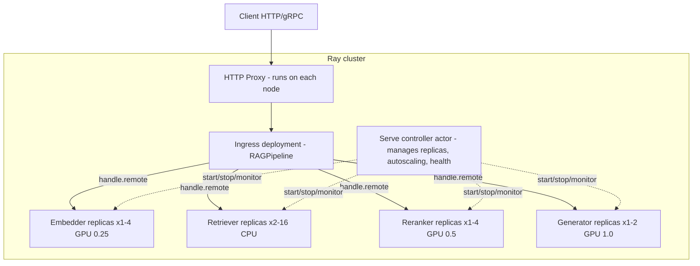
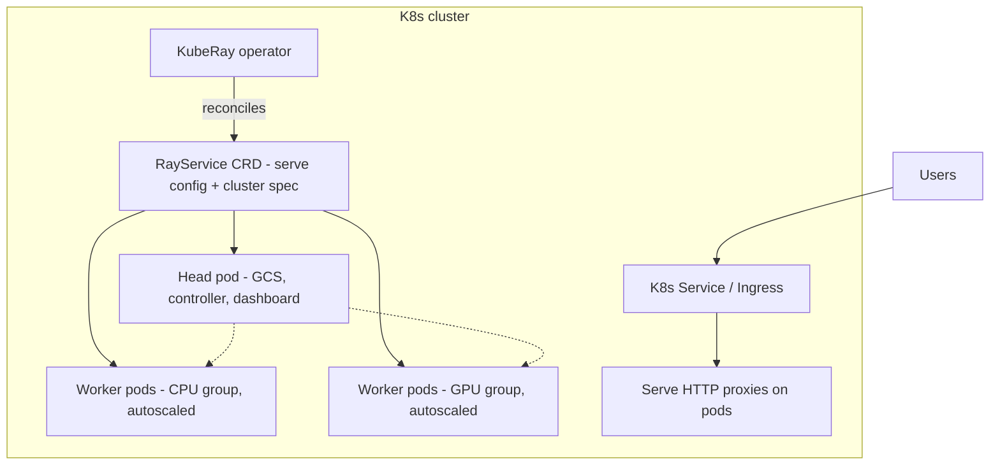

# Ray Serve and Composed Inference

Ray Serve is a scalable model-serving library built on Ray: you write ordinary Python classes, declare them as *deployments*, and Ray gives each one independent replication, autoscaling, request batching, and placement across a cluster of CPU/GPU machines. Its killer feature is not raw single-model throughput — vLLM and Triton beat it there — but **composition**: a multi-stage inference pipeline (embed → retrieve → rerank → generate) expressed as Python objects calling each other, where every stage scales on its own metrics and packs onto shared hardware.

This guide covers where Ray Serve genuinely earns its complexity and where it does not: the core deployment model implemented as a full RAG pipeline, autoscaling tuned with arithmetic rather than vibes, `@serve.batch` dynamic batching with measured effect, fractional-GPU packing realities, fault tolerance, KubeRay at concept level, and the honest assessment of when a plain queue plus workers is the better system.

Part of the [Senior AI Engineer Roadmap](../00-Senior-AI-Engineer-Roadmap.md) — Phase 8.

---

## 1. Where Ray Serve Fits

### 1.1 The Problem It Solves

A plain Kubernetes deployment scales a **container**. If your inference pipeline has four stages with wildly different resource profiles — a GPU embedder, a CPU-bound retriever, a GPU reranker, an LLM call — a single container forces them to scale together: to double reranker capacity you double everything, including the idle stages. Splitting each stage into its own K8s service fixes scaling but now you own four Dockerfiles, four Deployments, four Services, four HPA configs, and serialization + HTTP hops between every stage.

Ray Serve occupies the middle: **one application, many independently scaled units**, communicating via handles (direct actor-to-actor calls, no HTTP between stages), placed by Ray onto a shared pool of nodes.

| Situation | Right tool |
| --- | --- |
| One model, one container, simple HTTP | FastAPI on K8s + HPA — no Ray needed |
| One LLM, max token throughput | vLLM directly — Serve adds little |
| Multi-stage pipeline, stages need independent scaling | **Ray Serve** |
| Many small models multiplexed on shared GPUs | **Ray Serve** (fractional GPUs, model multiplexing) |
| Dozens of heterogeneous non-LLM models, max GPU efficiency | Triton |
| Minutes-long jobs, no one blocking | Queue + workers — not Serve |

### 1.2 Architecture at a Glance



Three actor types matter operationally:

- **Controller** — singleton that creates/destroys replicas, runs autoscaling loops, health-checks replicas. If it dies, existing replicas keep serving; no scaling happens until it restarts.
- **HTTP proxies** — one per node by default; route requests to replicas anywhere in the cluster with power-of-two-choices load balancing on queue length.
- **Replicas** — your class instances, each a Ray actor holding its own model copy.

---

## 2. Core Concepts Implemented: A Composed RAG Pipeline

The complete, runnable example: four stages, each with its own resources and autoscaling, composed by an ingress deployment. This is the shape of most production Serve apps.

```python
# rag_app.py — run with: serve run rag_app:app
# pip install "ray[serve]" sentence-transformers torch httpx
import asyncio
from typing import Any

import numpy as np
from fastapi import FastAPI
from pydantic import BaseModel
from ray import serve
from ray.serve.handle import DeploymentHandle


# ---------------------------------------------------------------- Stage 1
@serve.deployment(
    ray_actor_options={"num_gpus": 0.25},          # 4 replicas share one GPU
    autoscaling_config={
        "min_replicas": 1,
        "max_replicas": 4,
        "target_ongoing_requests": 8,
    },
    max_ongoing_requests=16,                        # per-replica admission cap
)
class Embedder:
    def __init__(self):
        from sentence_transformers import SentenceTransformer
        self.model = SentenceTransformer("BAAI/bge-small-en-v1.5", device="cuda")

    @serve.batch(max_batch_size=32, batch_wait_timeout_s=0.01)
    async def embed(self, texts: list[str]) -> list[np.ndarray]:
        # ONE GPU forward pass for up to 32 concurrent callers
        embs = self.model.encode(texts, normalize_embeddings=True)
        return [e for e in embs]                    # one result per caller

    async def __call__(self, text: str) -> np.ndarray:
        return await self.embed(text)


# ---------------------------------------------------------------- Stage 2
@serve.deployment(
    ray_actor_options={"num_cpus": 1},              # CPU-only stage
    autoscaling_config={
        "min_replicas": 2,
        "max_replicas": 16,                          # I/O-bound: scales widest
        "target_ongoing_requests": 20,
    },
    max_ongoing_requests=64,
)
class Retriever:
    def __init__(self):
        # Real system: pgvector/Qdrant client. Kept in-memory for runnability.
        rng = np.random.default_rng(0)
        self.corpus_emb = rng.standard_normal((10_000, 384)).astype(np.float32)
        self.corpus_emb /= np.linalg.norm(self.corpus_emb, axis=1, keepdims=True)
        self.docs = [f"document body {i}" for i in range(10_000)]

    async def __call__(self, query_emb: np.ndarray, k: int = 20) -> list[dict]:
        scores = self.corpus_emb @ query_emb
        top = np.argpartition(scores, -k)[-k:]
        top = top[np.argsort(-scores[top])]
        return [{"id": int(i), "text": self.docs[i], "score": float(scores[i])}
                for i in top]


# ---------------------------------------------------------------- Stage 3
@serve.deployment(
    ray_actor_options={"num_gpus": 0.5},
    autoscaling_config={
        "min_replicas": 1,
        "max_replicas": 4,
        "target_ongoing_requests": 4,               # cross-encoders are slow
    },
    max_ongoing_requests=8,
)
class Reranker:
    def __init__(self):
        from sentence_transformers import CrossEncoder
        self.model = CrossEncoder("cross-encoder/ms-marco-MiniLM-L-6-v2",
                                  device="cuda")

    async def __call__(self, query: str, docs: list[dict], top_n: int = 5):
        pairs = [(query, d["text"]) for d in docs]
        scores = self.model.predict(pairs)
        ranked = sorted(zip(docs, scores), key=lambda x: -x[1])[:top_n]
        return [d for d, _ in ranked]


# ---------------------------------------------------------------- Stage 4
@serve.deployment(
    autoscaling_config={"min_replicas": 1, "max_replicas": 2,
                        "target_ongoing_requests": 32},
    max_ongoing_requests=64,
)
class Generator:
    """Thin async client to an external vLLM server. Hosting the LLM inside
    a Serve replica is possible but usually worse than pointing at vLLM."""
    def __init__(self, base_url: str = "http://vllm:8000/v1"):
        import httpx
        self.client = httpx.AsyncClient(base_url=base_url, timeout=60)

    async def __call__(self, query: str, context: list[dict]) -> str:
        ctx = "\n\n".join(d["text"] for d in context)
        resp = await self.client.post("/chat/completions", json={
            "model": "meta-llama/Llama-3.1-8B-Instruct",
            "messages": [
                {"role": "system",
                 "content": f"Answer from this context only:\n{ctx}"},
                {"role": "user", "content": query},
            ],
            "max_tokens": 512,
        })
        resp.raise_for_status()
        return resp.json()["choices"][0]["message"]["content"]


# ---------------------------------------------------------------- Ingress
fastapi_app = FastAPI()

class AskRequest(BaseModel):
    query: str
    top_n: int = 5

@serve.deployment(autoscaling_config={"min_replicas": 1, "max_replicas": 4,
                                      "target_ongoing_requests": 50})
@serve.ingress(fastapi_app)
class RAGPipeline:
    def __init__(self, embedder: DeploymentHandle, retriever: DeploymentHandle,
                 reranker: DeploymentHandle, generator: DeploymentHandle):
        self.embedder, self.retriever = embedder, retriever
        self.reranker, self.generator = reranker, generator

    @fastapi_app.post("/ask")
    async def ask(self, req: AskRequest) -> dict[str, Any]:
        emb = await self.embedder.remote(req.query)          # GPU stage
        docs = await self.retriever.remote(emb, k=20)        # CPU stage
        top = await self.reranker.remote(req.query, docs,    # GPU stage
                                         top_n=req.top_n)
        answer = await self.generator.remote(req.query, top) # LLM call
        return {"answer": answer, "sources": [d["id"] for d in top]}


app = RAGPipeline.bind(Embedder.bind(), Retriever.bind(),
                       Reranker.bind(), Generator.bind())

# $ serve run rag_app:app
# ... INFO Deployed app 'default' successfully.
# $ curl -X POST localhost:8000/ask -H 'content-type: application/json' \
#        -d '{"query": "what is document 42 about?"}'
# {"answer":"...","sources":[42,4123,871,55,9034]}
```

What to notice, because these are the design decisions interviewers probe:

- **`.bind()` builds a graph, not objects.** `Embedder.bind()` returns a node in an application DAG; nothing is instantiated until `serve run` materializes it. Handles injected into `RAGPipeline.__init__` are how stages call each other — direct actor RPC with shared-memory object transfer for large arrays (the 384-float embedding never touches HTTP or JSON between stages).
- **Every stage scales independently.** The retriever (I/O-bound) can sit at 16 replicas while the reranker holds 2 GPUs' worth. In the monolith-container world, this pipeline would be provisioned for its most expensive stage everywhere.
- **`await handle.remote()` is async end to end.** The ingress replica holds no thread while a stage works; one ingress replica can have hundreds of pipelines in flight.

---

## 3. Autoscaling, Deeply

### 3.1 The Control Loop

Serve autoscaling is a feedback loop on **ongoing requests per replica** (running + queued at that replica). Every `metrics_interval_s` the controller computes:

```text
desired_replicas = ceil( total_ongoing_requests / target_ongoing_requests )
```

bounded by `min_replicas`/`max_replicas`, and applies it only after the decision has held for `upscale_delay_s` (default 30 s) or `downscale_delay_s` (default 600 s).

**Worked example.** Reranker: each request takes ~200 ms of GPU compute, `target_ongoing_requests = 4`. Traffic ramps to 60 requests/s.

```text
By Little's law:  L = λ × W = 60 req/s × 0.2 s = 12 requests in flight
desired = ceil(12 / 4) = 3 replicas

If traffic doubles to 120 req/s:  L = 24  →  desired = ceil(24/4) = 6
  but max_replicas = 4 caps it → each replica now carries 6 ongoing
  → queueing grows → per-request latency rises above 200 ms
  → in-flight count L grows further (λ×W with larger W): saturation spiral
```

That spiral is why `max_ongoing_requests` (the per-replica admission cap) matters: it bounds queue depth per replica so overload turns into fast backpressure at the proxy instead of unbounded latency.

### 3.2 Choosing `target_ongoing_requests`

The target is "how many requests should one replica juggle at once." Method:

1. **Measure single-replica capacity.** Fix one replica, ramp closed-loop concurrency 1, 2, 4, 8… and record throughput and p95.
2. **Find the knee.** Throughput stops rising and p95 inflects — for a GPU stage doing sequential 200 ms inferences with `@serve.batch(max_batch_size=8)`, the knee is often near the batch size.
3. **Set target at ~70–80% of the knee.** Headroom absorbs bursts during the 30 s upscale delay plus replica cold-start time.

```text
Example measurement (single Reranker replica, batch 8):
concurrency:   2     4     8     16    32
req/s:         9     17    33    35    34     <- flat after 8-16
p95 ms:        230   240   260   450   980    <- inflects after 16
knee ≈ 16 ongoing → target_ongoing_requests = 12, max_ongoing_requests = 24
```

### 3.3 Delays and Cold Starts

- `upscale_delay_s`: lower (5–10 s) for spiky traffic — but every upscale then pays model-load time. A replica that takes 90 s to load weights makes fast upscaling decisions pointless; the burst is over before the replica is ready. Mitigations: higher `min_replicas`, faster loads (weights on local NVMe, `safetensors` mmap), or scale on a schedule before known peaks.
- `downscale_delay_s`: keep high (300–600 s) for GPU stages — thrashing replicas that cost 90 s to start is pure waste. Set `min_replicas` to your trough traffic, not zero, unless you truly accept cold-start latency on first request (`initial_replicas` can pre-warm on deploy).

---

## 4. Dynamic Request Batching with `@serve.batch`

GPUs amortize kernel launch and weight-read cost across a batch; serving one request at a time leaves most of that silicon idle. `@serve.batch` coalesces concurrent calls into one list-typed call transparently.

```python
# batch_bench.py — measure the effect of server-side batching
import asyncio, time
import numpy as np
from ray import serve

@serve.deployment(ray_actor_options={"num_gpus": 1}, max_ongoing_requests=256)
class BatchedEmbedder:
    def __init__(self):
        from sentence_transformers import SentenceTransformer
        self.model = SentenceTransformer("BAAI/bge-small-en-v1.5", device="cuda")

    @serve.batch(max_batch_size=64, batch_wait_timeout_s=0.005)
    async def embed(self, texts: list[str]):
        return list(self.model.encode(texts))

    async def __call__(self, text: str):
        return await self.embed(text)

async def bench(handle, n=512):
    t0 = time.perf_counter()
    await asyncio.gather(*[handle.remote(f"sentence {i}") for i in range(n)])
    dt = time.perf_counter() - t0
    print(f"{n} requests in {dt:.2f}s -> {n/dt:.0f} req/s")

# Measured on a T4, 512 concurrent single-text requests:
#   max_batch_size=1   (batching off):  512 requests in 11.90s ->  43 req/s
#   max_batch_size=64, wait 5ms:        512 requests in  0.91s -> 563 req/s
# ~13x throughput for at most +5ms latency per request.
```

Tuning rules:

- **`batch_wait_timeout_s` is the latency you sell for throughput.** Under high load it rarely binds (the batch fills before the timer); under low load every request pays it in full. Keep it well under your latency budget: 5–10 ms for embeddings, up to 50–100 ms for expensive rerankers.
- **`max_batch_size`** comes from GPU memory and the latency of one batched forward pass — if a batch of 64 takes 80 ms, a request arriving as a batch launches waits up to 80 ms + wait timeout. Benchmark, don't guess.
- Handlers must return **one result per input, in order**; raise and Serve propagates the error to every caller in the batch — so validate inputs *before* the batched call if one bad item must not fail its neighbors.

---

## 5. Fractional GPUs and Resource Packing

`ray_actor_options={"num_gpus": 0.5}` schedules two replicas onto one physical GPU. Understand what this is — and is not:

- **It is bookkeeping, not enforcement.** Ray's scheduler counts fractions for placement and sets `CUDA_VISIBLE_DEVICES`; nothing partitions compute or memory. Both replicas can each try to allocate the full GPU and OOM. *You* must ensure each process's footprint (weights + activations + framework overhead ≈ 1–2 GB CUDA context per process) fits in its share.
- **Packing arithmetic.** A 24 GB GPU hosting the RAG example: Embedder 0.5 GB weights + ~1.5 GB overhead ≈ 2 GB per replica at `num_gpus=0.25` → 4 replicas ≈ 8 GB; Reranker ≈ 2.5 GB per replica at 0.5 → 2 replicas ≈ 5 GB. Total ≈ 13 GB on 24 GB — safe with headroom for activation spikes.
- **Compute interference is real.** Two replicas timesharing one GPU roughly double each other's latency under simultaneous load. Fractional GPUs shine for **low-duty-cycle small models** (many models, sporadic traffic), not for two saturated workloads.
- For hard isolation you need MIG (A100/H100 hardware slices) — Ray can schedule onto MIG instances as separate devices.

---

## 6. Fault Tolerance

- **Replica crashes**: the controller detects death (actor exit or failed health check) and starts a replacement; proxies stop routing to it immediately. In-flight requests on the dead replica fail — callers need retries (Serve handles retry `RayActorError` by default for idempotent-safe cases; make handlers idempotent anyway).
- **Custom health checks**: define `def check_health(self)` on the deployment — raise to be restarted. Check *dependencies* (DB reachable, model responsive), not just liveness. Runs every `health_check_period_s` (default 10 s); a hung replica is killed after `health_check_timeout_s`.
- **Graceful drain**: on downscale or rolling update, a replica gets `graceful_shutdown_wait_loop_s` to finish in-flight requests before `SIGKILL` after `graceful_shutdown_timeout_s`. Size the timeout to your p99 request duration — a 60 s LLM generation with a 20 s timeout means every deploy kills live requests.
- **Head-node failure is the real SPOF** for a Ray cluster: the GCS (cluster metadata) lives there. With GCS fault tolerance (external Redis, a KubeRay option), workers keep serving through a head restart; without it, head death takes the cluster down.
- **Rolling updates**: `serve deploy` applies config diffs replica-by-replica; only changed deployments are touched, so shipping a new Reranker doesn't restart the Generator.

---

## 7. Ray on Kubernetes: KubeRay at Concept Level



- **Topology**: one **head pod** (GCS metadata store, Serve controller, dashboard — schedule no replicas here in production) plus **worker groups**, each a pod template (CPU workers, GPU workers) with min/max counts. Two-level autoscaling: Serve scales *replicas* on traffic; the Ray autoscaler requests *pods* when replicas don't fit; the K8s cluster autoscaler provisions *nodes* for pending pods. A burst therefore pays replica start + pod schedule + (worst case) node boot — minutes, not seconds. Keep `min_replicas` and worker-group minimums sized so bursts land on warm capacity.
- **RayService CRD** gives zero-downtime config updates and restarts crashed clusters; pair with external Redis for GCS fault tolerance.
- **When Ray-on-K8s is worth it**: multiple composed apps sharing a heterogeneous GPU pool, teams already invested in Ray (data + train + serve on one substrate), autoscaling pipelines with fractional-GPU packing. **When it is not**: one or two models behind HTTP — a plain K8s Deployment + HPA is one YAML file and no new distributed system to operate. KubeRay adds an operator, a head-node failure domain, Ray version upgrades (cluster-wide, coordinated), and a second scheduler to debug. That cost is fixed; pay it only when composition/packing value exceeds it.

---

## 8. Observability

- **Ray dashboard** (`:8265`): per-deployment replica counts, queue sizes, actor logs, and cluster resource usage. First stop when "it's slow": look for queued requests piling at one deployment — that stage is your bottleneck.
- **Prometheus metrics** exported natively: `ray_serve_deployment_processing_latency_ms` (per-deployment latency histogram), `ray_serve_num_ongoing_http_requests`, `ray_serve_replica_processing_queries`, `ray_serve_num_deployment_http_error_requests`. Graph per-stage p95 side by side; composed pipelines make per-stage attribution trivial compared to a monolith.
- Add your own with `ray.serve.metrics.Counter/Histogram` inside replicas (e.g., rerank scores, cache hits); they export through the same Prometheus endpoint.
- **Logs**: each replica logs to `/tmp/ray/session_*/logs/serve/`; on K8s, ship them with a sidecar/daemonset like any pod logs. Request IDs propagate via context so one user request can be traced across all four stages.

---

## 9. The Honest Assessment: When Ray Serve Is Overkill

Choose the *simplest* system that meets the requirement:

- **One model, HTTP, moderate QPS** → FastAPI + K8s HPA. Serve's controller, proxies, and GCS buy you nothing here.
- **Latency-insensitive work (document pipelines, nightly scoring)** → **queue + workers wins**. SQS/Rabbit/Redis Streams + a worker pool gives durability (Serve requests are not persisted — a crash loses them), free backpressure (queue depth), trivial retry semantics, and scale-to-zero. Serve is a *request/response* system; using it for jobs means rebuilding durability on top.
- **Single LLM at max throughput** → vLLM alone; put Serve in front only when you need routing/composition around it.
- **Team of two, no Ray experience** → the operational literacy cost (actor model, GCS, object store spilling, dashboard archaeology) is real. A distributed system you don't understand is worse than a boring one you do.

The strong claim worth internalizing: Ray Serve's value is proportional to how much **composition and hardware-packing** your workload has. Zero composition, one model per GPU → near-zero value over plain K8s. Five-stage pipeline with mixed CPU/GPU stages and bursty traffic → it replaces a platform you would otherwise have to build.

---

## Production War Stories & Failure Modes

### Incident 1: The Downscale That Killed Long Generations

- **Symptom**: after every traffic peak, a burst of 5xx responses and user reports of chats dying mid-answer. Error rate correlated with *falling* traffic, which made no sense to the team.
- **Investigation**: proxy logs showed `RayActorError: actor died` on requests that had been running 40–70 s. Controller logs showed downscale events at the same timestamps. The deployment used default graceful shutdown settings (`graceful_shutdown_timeout_s=20`).
- **Root cause**: autoscaler downscaled after peaks; replicas got 20 s to drain, but LLM generations ran up to 90 s. Serve SIGKILLed replicas with live requests aboard.
- **Fix**: `graceful_shutdown_timeout_s=120` (above p99 generation time), `downscale_delay_s=600`, and client-side retry for the residual actor errors.
- **Prevention**: a deploy-time assertion comparing shutdown timeout against the endpoint's measured p99 duration; alert on `RayActorError` rate specifically, not just 5xx.

### Incident 2: Fractional GPUs, Whole OOM

- **Symptom**: reranker replicas crash-looping with CUDA OOM — but only on some nodes, and only after a config change that "just raised max_replicas".
- **Investigation**: the failing nodes hosted 4 embedder replicas (`num_gpus=0.25`) *and* 2 reranker replicas (`num_gpus=0.5`) on a single 16 GB GPU — Ray's math said 0.25×4 + 0.5×2 = 2.0... wait, that exceeds 1.0, so placement was legal only because a second deployment revision briefly doubled counts during rolling update. During updates, old + new replicas coexist, and fractional bookkeeping across two revisions oversubscribed real memory even though each revision alone fit.
- **Root cause**: fractional `num_gpus` is scheduling bookkeeping, not memory isolation — and rolling updates temporarily double replica footprints.
- **Fix**: sized each replica's true memory (weights + CUDA context + activation peak), set fractions so even update-time double occupancy fit, and set `PYTORCH_CUDA_ALLOC_CONF=expandable_segments:True` to reduce fragmentation.
- **Prevention**: load-test memory at max batch size per replica; leave ≥30% VRAM headroom for update overlap; alert on GPU memory > 85%.

### Incident 3: The 30-Second Burst the Autoscaler Never Saw

- **Symptom**: a marketing push drove a 20x traffic spike lasting ~2 minutes every hour. p99 exploded to 30+ s during spikes; autoscaler graphs showed replicas rising — *after* each spike ended.
- **Investigation**: `upscale_delay_s=30` (default) meant the decision to scale waited 30 s; new GPU replicas then took 75 s to pull weights and start. Total reaction time ≈ 105 s against a 120 s burst: capacity arrived as demand left, then got torn down (default `downscale_delay_s=600` was the only thing preventing thrash).
- **Root cause**: autoscaling reaction time (decision delay + cold start) longer than the burst period — autoscaling can never help such traffic, only chase it.
- **Fix**: raised `min_replicas` to carry the burst floor; moved weights to a local NVMe cache cutting start to 15 s; kept fast upscale for slower-building surges.
- **Prevention**: the rule of thumb now enforced in review: *if burst duration < upscale_delay + replica cold start, autoscaling is not your mechanism — provision for it or shed it.* Load tests replay the real spiky arrival trace, not constant rates.

### Incident 4: One Bad Request Failing Sixty-Three Neighbors

- **Symptom**: sporadic bursts of exactly-correlated failures — dozens of unrelated requests failing in the same 50 ms window with the same `ValueError`.
- **Investigation**: the error came from inside a `@serve.batch`-decorated embed method: one request contained a 60k-character string that blew the tokenizer's max length; the exception propagated to **every caller in that batch of 64**.
- **Root cause**: batched handlers fail as a unit; input validation lived inside the batch instead of before it.
- **Fix**: validate and truncate in `__call__` before invoking the batched method; inside the batch, wrap per-item work so one bad item returns an error object for its caller only.
- **Prevention**: fuzz tests sending adversarial lengths through batched paths; a metric on batch-level exception rate (should be ~0; item-level errors are fine).

---

## Best Practices

- Compose stages as separate deployments only when they have different resource shapes or scaling needs; otherwise keep them in one deployment — every boundary adds latency and failure surface.
- Derive `target_ongoing_requests` from a measured single-replica knee (set target at ~70–80% of it), and always set `max_ongoing_requests` ~2x target for backpressure.
- Set `graceful_shutdown_timeout_s` above your p99 request duration, or every deploy and downscale kills live requests.
- Treat fractional GPUs as placement hints: do the VRAM arithmetic per replica (including ~1–2 GB CUDA context each and rolling-update double occupancy), and reserve them for low-duty-cycle models.
- Tune `@serve.batch` with a benchmark: `batch_wait_timeout_s` is a direct latency purchase; keep it a small fraction of the budget and validate inputs before the batched call.
- Keep `min_replicas` at trough traffic for GPU stages; scale-to-zero plus 90 s cold starts is a first-request SLO violation, not a saving.
- If bursts are shorter than upscale delay + cold start, provision for them — autoscaling mathematically cannot catch them.
- Put durability where it belongs: Serve for request/response, a real queue for jobs; don't rebuild persistence on top of Serve.
- Run nothing on the head node in production and enable GCS fault tolerance (external Redis) before you rely on a Serve cluster for availability.
- Dashboard first, metrics always: per-stage Prometheus latency histograms make bottleneck attribution trivial — wire alerts to queue depth per deployment, the leading indicator.

---

## Interview Drills

<details><summary>1. When would you choose Ray Serve over a plain Kubernetes Deployment with an HPA?</summary>
When the workload has composition or packing value that a single container can't express: multi-stage pipelines whose stages need independent scaling (GPU embedder vs CPU retriever vs GPU reranker), many small models packed onto shared GPUs via fractional resources, or model multiplexing. For one model in one container, K8s + HPA is simpler and equally good — Serve would add a controller, proxies, and a distributed system to operate for no benefit.

Follow-up: *Why not just make each stage its own K8s microservice?* That fixes independent scaling but costs an HTTP hop + serialization per stage boundary, N sets of Dockerfiles/Deployments/HPAs, and no shared-pool packing; Serve stages call each other via actor handles with shared-memory object transfer and are placed onto one resource pool. Follow-up: *At what team size/maturity does that trade flip back?* If the org already runs everything as microservices with strong platform tooling and the pipeline has 2 stages, the marginal cost of one more service may be below the cost of operating Ray.
</details>

<details><summary>2. Explain how Serve autoscaling decides replica count. What's the formula and its failure mode?</summary>
The controller tracks ongoing requests (running + queued) per replica and computes desired = ceil(total_ongoing / target_ongoing_requests), clamped to min/max, applied after upscale_delay_s (default 30 s) or downscale_delay_s (default 600 s) of sustained signal. Failure mode: when max_replicas caps out, per-replica load rises, latency W grows, and by Little's law (L = λW) in-flight count grows further — a saturation spiral only bounded by max_ongoing_requests rejecting excess with backpressure.

Follow-up: *Why scale on ongoing requests instead of CPU/GPU utilization like an HPA?* Ongoing requests directly measure queueing — the thing users feel — and works for I/O-bound stages where CPU sits near zero while requests wait on a database. GPU utilization also lies for memory-bound inference. Follow-up: *What would you monitor to know the target is set wrong?* Per-replica queue depth and p95 at steady replica counts: persistent queueing at target means the target exceeds true capacity; replicas at target with low utilization mean it's too conservative.
</details>

<details><summary>3. Derive replica count for a stage that takes 250 ms per request at 40 req/s, target_ongoing_requests = 5.</summary>
Little's law: in-flight L = λ × W = 40 × 0.25 = 10 requests. Desired replicas = ceil(10 / 5) = 2. But that assumes 5 ongoing per replica is sustainable — if each request needs 250 ms of *exclusive* GPU, one replica's true capacity is 4 req/s and 40 req/s needs 10 replicas of capacity; 5 "ongoing" would just be 1 running + 4 queued, adding ~1 s of queue latency. The target must be grounded in measured single-replica throughput at acceptable latency, not picked abstractly.

Follow-up: *So what's the right target here if requests are serial on GPU?* Something like 2 (1 running + 1 queued to hide handoff): desired = ceil(10/2) = 5 replicas... still short of the 10 needed by capacity — which exposes that autoscaling on ongoing requests converges to the right count *because* queueing inflates W and thus L until desired rises; you avoid living in that convergence lag by benchmarking capacity and setting min_replicas near expected λ/throughput.
</details>

<details><summary>4. What does `@serve.batch` actually do, and what are the two tuning knobs' semantics?</summary>
It intercepts concurrent calls to a method, queues them briefly, and invokes your handler once with a list of inputs, returning one result per caller in order. `max_batch_size` caps the list; `batch_wait_timeout_s` is how long the first request waits for the batch to fill. Under saturation the timeout rarely binds (batches fill instantly); at low traffic every request pays the full timeout — it's a direct purchase of throughput with latency.

Follow-up: *A request in your batched endpoint fails validation — what happens to the other 63 requests in the batch?* If the handler raises, all 64 callers get the exception. So validate before the batched call, or catch per-item inside and return per-item error sentinels. Follow-up: *When is server-side batching pointless?* When the model runtime already batches (vLLM's continuous batching) or the op is CPU-bound scalar work with no vectorization win.
</details>

<details><summary>5. What does `num_gpus=0.5` guarantee, and what doesn't it guarantee?</summary>
Guarantees only scheduling arithmetic: Ray places at most 2 such replicas per GPU and sets CUDA_VISIBLE_DEVICES. It does not partition memory or compute — both processes can allocate the whole GPU and OOM, and simultaneous kernels timeshare, roughly doubling each other's latency. It's for packing small, low-duty-cycle models; hard isolation requires MIG slices.

Follow-up: *How do you size the fraction?* Measure one replica's true peak VRAM (weights + activations at max batch + ~1–2 GB CUDA context), divide GPU memory by that with ≥30% headroom — including rolling-update double occupancy — and set the fraction to 1/that count. Follow-up: *Two replicas share a GPU and one is latency-critical — what do you do?* Don't share: give the critical one a dedicated GPU or a MIG slice; fractional sharing has no priority mechanism.
</details>

<details><summary>6. Walk through what happens to in-flight requests when a deployment is downscaled or updated.</summary>
The controller marks the replica draining: proxies stop sending new requests, the replica finishes in-flight work during graceful_shutdown_wait_loop_s checks, and if still busy after graceful_shutdown_timeout_s it's force-killed and those requests error (RayActorError to callers). Rolling updates do this replica-by-replica, so capacity dips by one replica at a time while old and new revisions coexist.

Follow-up: *Your endpoint runs 90 s LLM generations — what config is mandatory?* graceful_shutdown_timeout_s > p99 duration (e.g., 120 s), plus long downscale_delay_s so the autoscaler doesn't churn replicas, plus client retries for the residual kills. Follow-up: *What's the capacity implication during the update itself?* Old + new replicas overlap — memory footprint temporarily doubles per updated deployment, which must fit in your GPU headroom (see the fractional-GPU OOM failure mode).
</details>

<details><summary>7. Design a RAG pipeline in Serve. Which stages get their own deployments and why?</summary>
Four deployments: Embedder (GPU, small model, batched — scales on embed throughput), Retriever (CPU/I/O-bound vector-DB client — scales widest, cheap), Reranker (GPU cross-encoder, the usual compute bottleneck — scales on GPU capacity), Generator (thin async client to an external vLLM — scales on connection concurrency), plus an ingress composing them via handles. The boundaries follow *resource shape*: each stage has a different bottleneck resource, so each gets its own autoscaling policy and hardware.

Follow-up: *Why is the Generator a client to vLLM instead of loading the LLM in the replica?* vLLM's continuous batching and PagedAttention need to own the whole GPU and the whole request stream; wrapping generation inside Serve replicas would fragment batching across replicas and waste VRAM on duplicate weights. Serve orchestrates; vLLM serves tokens. Follow-up: *Where would you add caching?* Embedding cache keyed on text hash in the Embedder, and a retrieval cache keyed on query embedding bucket — both as replica-local LRU + shared Redis tier.
</details>

<details><summary>8. Your composed pipeline's p95 doubled. How do you find which stage regressed?</summary>
Per-deployment metrics make this direct: graph ray_serve_deployment_processing_latency_ms p95 per stage and the per-replica queue depth (replica_processing_queries). The regressed stage shows rising processing latency (slower work — new model, bigger inputs) or rising queue with flat processing (capacity/traffic problem — check replica count vs autoscaler decisions and whether max_replicas capped). The dashboard shows queued requests piling at the bottleneck stage in real time.

Follow-up: *Latency rose but every stage's processing latency is flat — where is the time?* Between stages: handle-call queueing (target too high, replicas saturated but not "processing"), object-store transfer of large payloads (embeddings/documents), or the ingress event loop blocked by sync work — profile the ingress with py-spy. Follow-up: *How do you get per-request tracing across stages?* Serve propagates request context/IDs into replica logs; add OpenTelemetry spans in each stage keyed on that ID.
</details>

<details><summary>9. When is a queue + worker pool strictly better than Ray Serve?</summary>
When no caller is blocking on the result: document pipelines, nightly scoring, video processing. A queue gives durability (messages survive crashes; Serve loses in-flight requests), natural backpressure (depth), retries with dead-letter queues, and scale-to-zero. Serve is request/response; using it for 5-minute jobs means holding connections, losing work on replica death, and rebuilding persistence on top.

Follow-up: *The product wants "progress updates" on those jobs — does that change the answer?* No — progress is a job-status record (Redis/Postgres) the client polls or receives via webhook/SSE from a thin API; still queue + workers underneath. Follow-up: *Could Ray itself still be useful there?* Yes, differently: Ray tasks/actors as the *worker pool implementation* consuming from the queue — that's Ray Core for compute, not Ray Serve for serving.
</details>

<details><summary>10. Explain the three layers of autoscaling in a KubeRay deployment and their combined reaction time.</summary>
(1) Serve autoscaler: traffic → replica count (upscale_delay 30 s default). (2) Ray autoscaler: unplaceable replicas → new worker pods. (3) K8s cluster autoscaler: unschedulable pods → new nodes (minutes for GPU nodes). Worst-case reaction = decision delay + pod schedule + node provision + image pull + model load — easily 5–10 minutes. Any burst shorter than that must be absorbed by warm capacity (min_replicas, min worker-group size) or shed.

Follow-up: *How do you keep worst case off the critical path?* Warm pools: min worker replicas ≥ trough+burst floor, pre-pulled images (DaemonSet), weights on node-local NVMe or baked into the image, and scheduled pre-scaling before known peaks. Follow-up: *What's the head node's role and risk here?* It hosts GCS metadata and the Serve controller — head death without GCS fault tolerance (external Redis) takes down cluster coordination; with it, workers keep serving through a head restart.
</details>

<details><summary>11. What is the ingress deployment, and why integrate FastAPI there?</summary>
The ingress is the deployment bound as the app's entrypoint; Serve's HTTP proxies route external requests to its replicas. `@serve.ingress(fastapi_app)` embeds a FastAPI app so you get pydantic validation, routing, docs, and middleware at the boundary, while downstream stages stay pure Python called via handles — no HTTP or serialization between stages.

Follow-up: *Why validate at ingress rather than in each stage?* Boundary validation fails fast and keeps inner stages trusting typed inputs; re-validating per stage wastes cycles — but batched methods still need length/sanity guards because one bad item fails the whole batch. Follow-up: *Does the ingress become a bottleneck?* It's autoscaled like any deployment; because it's pure async orchestration (await handle calls), one replica sustains high concurrency — watch its event loop for accidental sync work, which is the classic ingress killer.
</details>

<details><summary>12. Serve vs Triton vs vLLM — place each and say when you'd combine them.</summary>
vLLM: single-purpose LLM engine — continuous batching, PagedAttention, best token throughput; owns a GPU per model. Triton: multi-framework single-node runtime — dynamic batching, concurrent model instances, TensorRT; best raw efficiency for many non-LLM models. Ray Serve: Python-level composition and cluster-level scaling/packing — weakest raw engine, strongest orchestration. Combine: Serve as the pipeline/orchestration layer whose Generator stage calls out to vLLM (or whose stages wrap Triton clients) — orchestration and engine are different layers, not competitors.

Follow-up: *Why not host vLLM inside a Serve replica?* You can (Serve has a vLLM integration pattern), and it buys unified deploys/autoscaling of full engine replicas — but replica-level autoscaling of an engine that itself batches means scale units of "whole GPUs running vLLM," and Serve must not fragment the request stream across engine replicas without a routing strategy (prefix-cache-aware routing matters here). Follow-up: *What routing strategy for multiple vLLM replicas?* Session/prefix affinity — route same-conversation requests to the same replica to preserve KV/prefix cache hits.
</details>

<details><summary>13. How do custom health checks differ from K8s liveness probes here, and what should one check?</summary>
Serve calls def check_health(self) on each replica every health_check_period_s; raising marks the replica unhealthy — the controller restarts it and proxies stop routing to it. Unlike a pod-level liveness probe (is the process up), this is app-level: check that the model answers a canary inference within a bound, that critical dependencies (vector DB, downstream engine) are reachable, that GPU memory isn't near OOM. K8s probes then guard the *pods*, Serve health checks guard the *replicas*.

Follow-up: *Danger of dependency checks in health?* A blip in a shared dependency fails all replicas simultaneously → mass restart storm of a healthy fleet. Distinguish "restart me" conditions (wedged CUDA context) from "I'm degraded" signals (dependency down — surface as readiness/metric, don't suicide). Follow-up: *A replica hangs without raising — covered?* Yes: exceed health_check_timeout_s and the controller kills it — set the timeout above worst-case canary latency to avoid killing merely busy replicas.
</details>

<details><summary>14. Your Serve app's throughput stopped scaling even as replicas increased. List the usual suspects in order.</summary>
(1) A shared downstream dependency saturated — vector DB, external LLM API, database: replicas multiply demand on it. (2) The ingress or one stage hit max_replicas or its GPU pool ran out (Ray autoscaler pending pods). (3) A batched stage's max_batch_size × replica count exceeds what the GPU actually parallelizes — batches queue. (4) Object-store pressure: large payloads between stages causing spilling to disk. (5) The head node/GCS or proxies CPU-bound at high RPS. Diagnose from per-stage queue depth first — scaling the wrong stage is the classic mistake composition is supposed to prevent, and the metrics name the guilty stage directly.

Follow-up: *How does head/proxy saturation present?* Latency added before any deployment's processing timer starts — end-to-end p95 rises while all per-stage processing latencies stay flat; fix by scaling proxies (they run per node) or moving to fewer, larger payload-free calls.
</details>

<details><summary>15. Argue against using Ray Serve at your company. Then rebut yourself.</summary>
Against: we serve two models behind HTTP; K8s + HPA covers it with zero new infrastructure. Ray adds a head-node failure domain, cluster-wide coordinated version upgrades, an actor model the team must learn to debug, and a second scheduler interacting unpredictably with K8s's. Operational maturity for boring tools is worth more than architectural elegance. Rebuttal: the roadmap has a 5-stage RAG + reranking pipeline with mixed CPU/GPU stages and 20x traffic bursts; building independent per-stage scaling, request batching, and GPU packing on raw K8s means writing and operating a worse bespoke version of exactly what Serve provides — at that point the platform pays for its complexity. The senior answer is conditional, dated, and revisited: adopt when the composition value concretely exceeds the operating cost, not before.

Follow-up: *What migration path de-risks adoption?* Run the first Serve app for one non-critical pipeline on a small static cluster (no autoscaling), behind the existing gateway; add KubeRay, autoscaling, and GCS fault tolerance only after the team has operated it through a few incidents.
</details>
