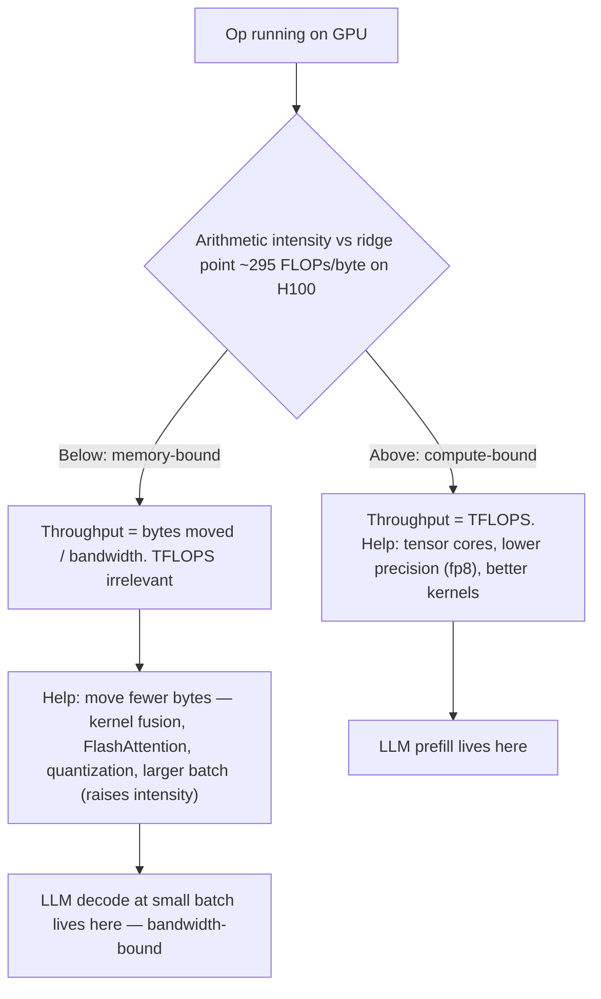
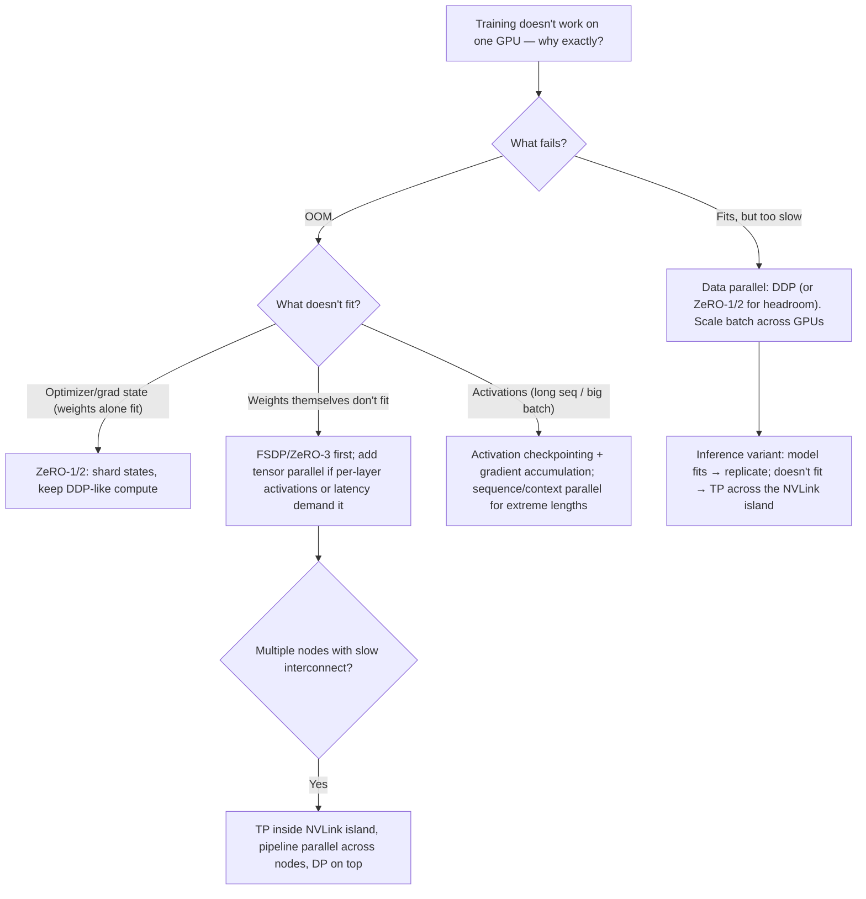

# GPU and Distributed AI Systems

GPUs are the most expensive line item in any AI system, and the engineers who can reason about them — why a job OOMs, why "100% utilization" is a lie, why decode is slow even on an H100, which parallelism strategy fits which failure mode — are the ones trusted with the cluster. You do not need to write CUDA or train a frontier model. You do need to do VRAM arithmetic on a whiteboard, read a profiler trace, and explain why a 7B model that serves fine on one GPU needs ~112GB to train naively. This guide expands Phase 9 into that practical depth.

Part of the [Senior AI Engineer Roadmap](./00-Senior-AI-Engineer-Roadmap.md) — Phase 9.

---

## 1. GPU Execution Model: Why GPUs Win at Matmul

### 1.1 CPU vs GPU

A CPU optimizes **latency of one thread**: a few large cores, deep caches, branch prediction, out-of-order execution. A GPU optimizes **throughput of many threads**: thousands of small cores (an H100 has 132 streaming multiprocessors, ~16k FP32 lanes) with almost no per-thread machinery. Instead of avoiding memory latency, a GPU **hides** it — while one group of threads waits on memory, the scheduler runs another. This only works when you have massive, uniform parallelism, which is exactly what a matrix multiply is: millions of independent multiply-accumulates. Deep learning is ~90% matmul, which is why GPUs win.

### 1.2 SIMT and Warps

CUDA's model is **SIMT** (Single Instruction, Multiple Threads). Threads are grouped into **warps** of 32 that execute the same instruction in lockstep on different data. Consequences an engineer should know:

- **Branch divergence:** if threads in a warp take different `if` branches, both paths execute serially with lanes masked off. Uniform control flow is fast; ragged control flow wastes lanes.
- **Coalesced memory access:** a warp reading 32 adjacent floats is one memory transaction; scattered reads are 32. This is why contiguous tensors and good memory layouts matter even from Python.
- **Occupancy:** the scheduler needs many resident warps to hide memory latency. Tiny batch sizes and tiny kernels leave the machine idle.

### 1.3 CUDA Concepts Without Writing CUDA

- **Kernel:** a function launched over a grid of thread blocks. Every PyTorch op (`torch.matmul`, `softmax`) launches one or more kernels. Kernel launches cost ~5-10 microseconds of CPU overhead — thousands of tiny kernels can leave the GPU starved (this is what CUDA Graphs and `torch.compile` fix by fusing/replaying them).
- **Streams:** ordered queues of kernels. Kernels in different streams can overlap — e.g., copy the next batch to the GPU (stream A) while computing on the current one (stream B). `DataLoader(pin_memory=True)` + `tensor.to(device, non_blocking=True)` exists to enable exactly this overlap.
- **Host-device transfers:** PCIe gives ~32-64 GB/s vs ~3,350 GB/s HBM bandwidth on an H100 — a 50-100x gap. Moving data between CPU and GPU inside the training loop is a classic silent performance killer.
- **Asynchrony and synchronization:** kernel launches are asynchronous — Python returns immediately and the GPU catches up. `tensor.item()`, `.cpu()`, and `print(tensor)` force a sync and stall the pipeline. This is also why naive `time.time()` timing lies; use `torch.cuda.Event` or a profiler.
- **Compute capability:** the hardware generation (V100 = 7.0, A100 = 8.0, H100 = 9.0). It gates features: bf16 needs ≥ 8.0, fp8 needs ≥ 8.9. Check with `torch.cuda.get_device_capability()`.

---

## 2. Memory Hierarchy, Arithmetic Intensity, and the Roofline

### 2.1 The Hierarchy

| Level | Size (H100) | Bandwidth | Notes |
| --- | --- | --- | --- |
| Registers | KB per thread | fastest | private to a thread |
| SRAM (shared memory / L1) | ~228 KB per SM | ~20+ TB/s | programmer-managed tile cache |
| HBM ("VRAM") | 80 GB | ~3.35 TB/s | where tensors live |
| Host RAM over PCIe/NVLink | 100s of GB | 32-64 GB/s | offload target, slow |

The whole game of kernel optimization is: load a tile from HBM into SRAM once, do as much math as possible on it, write back once.

### 2.2 Arithmetic Intensity and the Roofline

**Arithmetic intensity** = FLOPs performed per byte moved from HBM. Every GPU has a ridge point: H100 does ~989 TFLOPS (bf16 tensor core) over ~3.35 TB/s, so ops need roughly **~295 FLOPs per byte** to be compute-bound. Below that, the op is **memory-bandwidth-bound**: the compute units idle while waiting on HBM, and quoted TFLOPS are irrelevant.

- Big matmuls (large batch × large hidden dims): high intensity → compute-bound. 
- Elementwise ops, softmax, layernorm: ~1 FLOP/byte → hopelessly memory-bound.
- **LLM decode:** generating one token requires reading *every* weight (and the whole KV cache) to produce one token's worth of math. At batch 1, intensity ≈ 1-2 FLOPs/byte → decode speed ≈ `bytes to read / memory bandwidth`. A 14 GB fp16 7B model on 3.35 TB/s tops out around ~240 tokens/s per sequence *no matter the TFLOPS*. This is why inference servers batch requests (raises intensity) and why quantization speeds up decode (fewer bytes to read).
- **Prefill** processes all prompt tokens at once → big matmuls → compute-bound. Same model, two different bottlenecks.

### 2.3 Why FlashAttention Matters (Concept Level)

Naive attention materializes the `seq_len × seq_len` score matrix in HBM: for 32 heads at 8k context in fp16 that is 32 × 8192² × 2 bytes ≈ 4 GB *per layer* of reads/writes — attention becomes memory-bound on its own intermediate. FlashAttention never writes that matrix: it streams K/V tiles through SRAM, computing softmax incrementally (online softmax) and keeping only running statistics. Same exact math, IO-aware scheduling → memory traffic drops from O(seq²) to O(seq), giving large speedups and making long contexts feasible. Lesson to internalize: **the biggest wins in modern GPU performance come from moving fewer bytes, not doing fewer FLOPs.**



---

## 3. Tensor Cores and Precision

### 3.1 The Formats

| Format | Bits | Exponent / Mantissa | Range | Use |
| --- | --- | --- | --- | --- |
| fp32 | 32 | 8 / 23 | ~1e38 | master weights, reductions |
| tf32 | 19 used | 8 / 10 | fp32 range | free tensor-core speedup for fp32 matmul on A100+ |
| fp16 | 16 | 5 / 10 | ~65,504 max | inference; training needs loss scaling |
| bf16 | 16 | 8 / 7 | fp32 range | default training dtype on A100+ |
| fp8 (e4m3/e5m2) | 8 | 4/3 or 5/2 | tiny | H100+ training/inference with per-tensor scaling |

**Tensor cores** are dedicated matrix-multiply-accumulate units; they deliver ~8-16x the FLOPS of the regular FP32 pipeline but only for matmul-shaped work in these reduced precisions (dimensions ideally multiples of 8/16). If you train in pure fp32 on an A100 without tf32, you leave most of the machine idle.

### 3.2 bf16 vs fp16

Both are 16 bits; they spend them differently. **fp16** has more mantissa (precision) but a max value of 65,504 — gradients overflow to inf and small ones underflow to zero, which is why fp16 mixed precision requires **dynamic loss scaling** (`GradScaler`). **bf16** keeps fp32's 8-bit exponent, so it has fp32's range with less precision — no loss scaling, no overflow drama, numerically boring in the good way. Rule: on Ampere or newer, use bf16 and delete your GradScaler; use fp16 only on older hardware. In both cases keep fp32 **master weights** and do optimizer math in fp32 — that is what "mixed" precision means.

```python
# Modern mixed-precision training step (bf16, no GradScaler needed)
import torch
torch.backends.cuda.matmul.allow_tf32 = True  # free speedup for remaining fp32 matmuls

for batch in loader:
    optimizer.zero_grad(set_to_none=True)
    with torch.autocast(device_type="cuda", dtype=torch.bfloat16):
        loss = model(batch["x"]).squeeze(-1).sub(batch["y"]).pow(2).mean()
    loss.backward()          # grads flow in bf16/fp32 as appropriate
    optimizer.step()         # optimizer states and master weights stay fp32
```

---

## 4. VRAM Budgeting: Do the Arithmetic

### 4.1 Inference: 7B Model at fp16

**Weights:** 7e9 params × 2 bytes = **14 GB**.

**KV cache** (the memory that actually kills serving):

```text
kv_bytes = 2 (K and V) × layers × kv_heads × head_dim × seq_len × batch × bytes_per_value
```

Llama-2-7B: 32 layers, 32 heads, head_dim 128, fp16 (2 bytes):

- Per token: 2 × 32 × 32 × 128 × 2 = **524,288 bytes ≈ 0.5 MB/token**
- One 4,096-token sequence: ≈ **2 GB**
- Batch of 16 at 4k context: ≈ **32 GB** — more than double the weights!

So a "14 GB model" needs 14 + 32 + workspace ≈ 48+ GB to serve batch 16 at 4k. This arithmetic is why grouped-query attention (fewer kv_heads: 8 instead of 32 → 4x smaller cache), KV-cache quantization, and paged attention (vLLM allocates cache in blocks to kill fragmentation) exist.

### 4.2 Training: Why 7B Needs ~112 GB Naively

Standard mixed-precision Adam, per parameter:

| Component | Bytes/param |
| --- | --- |
| bf16 weights | 2 |
| bf16 gradients | 2 |
| fp32 master weights | 4 |
| Adam first moment (fp32) | 4 |
| Adam second moment (fp32) | 4 |
| **Total states** | **16** |

7e9 × 16 bytes = **112 GB** — before activations, which add tens of GB more depending on batch, sequence length, and whether you checkpoint them. No single 80 GB GPU holds this, which is the entire motivation for ZeRO/FSDP (Section 6). Sanity rules of thumb: inference ≈ 2 bytes/param (fp16) plus KV cache; full fine-tuning ≈ 16-20 bytes/param; LoRA slashes the optimizer/gradient terms because only adapters train.

### 4.3 OOM: Causes and Fixes

In rough order of what to try:

1. **Reduce micro-batch size** and use **gradient accumulation** to keep the effective batch (Section 6.5) — near-free.
2. **Activation checkpointing** (`torch.utils.checkpoint`): drop activations in forward, recompute in backward. Trades ~30% more compute for a large activation-memory cut.
3. **Shorter sequences / packing** — activations and KV cache scale with seq_len (attention's intermediate with seq²).
4. **Quantize**: bf16 → int8/int4 for inference; QLoRA (4-bit base + LoRA) for fine-tuning.
5. **Shard or offload states**: FSDP/ZeRO, or CPU-offload the optimizer as a last resort (PCIe-slow).
6. Check for leaks: storing `loss` instead of `loss.item()` in a list retains whole graphs; growing Python lists of tensors; forgetting `torch.no_grad()` in eval.

**Fragmentation:** PyTorch's caching allocator can hold plenty of free VRAM in blocks too small for the next allocation — the OOM message that says "reserved memory much larger than allocated" is fragmentation, commonly triggered by variable sequence lengths. Fixes: bucket/pad to fixed shapes, `PYTORCH_CUDA_ALLOC_CONF=expandable_segments:True`, occasional `torch.cuda.empty_cache()` at phase boundaries (not per step). This is the same disease vLLM's PagedAttention cures for KV cache.

---

## 5. Profiling: Trust Instruments, Not Vibes

### 5.1 nvidia-smi and Its Lies

`nvidia-smi` shows memory used, power, temperature, and "GPU-Util". Know the trap: **GPU-Util is the fraction of time at least one kernel was resident, not how busy the chip is**. A memory-bound kernel using 5% of the SMs shows 100% util. Better honesty signals: power draw near TDP, and SM efficiency/tensor-core activity from a real profiler. `nvidia-smi dmon` gives a cheap per-second stream; `-l 1` loops.

### 5.2 PyTorch Profiler

```python
from torch.profiler import profile, schedule, ProfilerActivity

with profile(
    activities=[ProfilerActivity.CPU, ProfilerActivity.CUDA],
    schedule=schedule(wait=1, warmup=2, active=3),
    profile_memory=True, with_stack=True,
    on_trace_ready=torch.profiler.tensorboard_trace_handler("./trace"),
) as prof:
    for step, batch in enumerate(loader):
        train_step(batch)
        prof.step()
        if step >= 6:
            break
print(prof.key_averages().table(sort_by="cuda_time_total", row_limit=15))
```

Read the trace for: gaps between kernels (input pipeline or launch-overhead starvation), big `Memcpy HtoD` blocks inside the loop (transfer problem), one dominant kernel (optimize it or check it's tensor-core eligible). `torch.cuda.memory_summary()` and `torch.cuda.memory._record_memory_history()` diagnose OOM and fragmentation; Nsight Systems is the next tool up when you need whole-system timelines.

### 5.3 Fleet Metrics: DCGM

For clusters, NVIDIA **DCGM** and the `dcgm-exporter` publish per-GPU Prometheus metrics — SM activity, tensor-core activity, memory bandwidth utilization, ECC errors, thermal throttling. The single most valuable production dashboard: tensor-core activity vs GPU-Util. A fleet at "95% utilization" but 20% SM activity is money on fire, usually a data-loading or communication bottleneck.

---

## 6. Distributed Training

### 6.1 Data Parallelism and DDP

Every GPU holds a **full model replica** and processes a different data shard; after backward, gradients are averaged across replicas so all stay in sync. The averaging uses **ring all-reduce**: N GPUs arranged in a ring, each sends/receives chunks in 2(N-1) steps (reduce-scatter then all-gather). Total bytes each GPU moves ≈ 2 × gradient_size × (N-1)/N — nearly **independent of N**, which is why data parallel scales to thousands of GPUs. DDP also does **gradient bucketing**: gradients are grouped into ~25 MB buckets and all-reduced as soon as each bucket's grads are ready, overlapping communication with the rest of backward.

Complete minimal DDP script (save as `ddp_min.py`, run with `torchrun --nproc_per_node=4 ddp_min.py`):

```python
import os, torch
import torch.distributed as dist
from torch.nn.parallel import DistributedDataParallel as DDP
from torch.utils.data import DataLoader, TensorDataset, DistributedSampler

def main():
    dist.init_process_group("nccl")                    # torchrun sets RANK/WORLD_SIZE/MASTER_ADDR
    rank = dist.get_rank()
    local_rank = int(os.environ["LOCAL_RANK"])
    torch.cuda.set_device(local_rank)

    model = torch.nn.Sequential(
        torch.nn.Linear(512, 2048), torch.nn.ReLU(), torch.nn.Linear(2048, 1)
    ).cuda(local_rank)
    model = DDP(model, device_ids=[local_rank])

    ds = TensorDataset(torch.randn(8192, 512), torch.randn(8192, 1))
    sampler = DistributedSampler(ds)                   # each rank sees a distinct shard
    loader = DataLoader(ds, batch_size=64, sampler=sampler, num_workers=2, pin_memory=True)
    opt = torch.optim.AdamW(model.parameters(), lr=3e-4)

    for epoch in range(2):
        sampler.set_epoch(epoch)                       # reshuffle shards each epoch
        for x, y in loader:
            x, y = x.cuda(local_rank, non_blocking=True), y.cuda(local_rank, non_blocking=True)
            opt.zero_grad(set_to_none=True)
            loss = torch.nn.functional.mse_loss(model(x), y)
            loss.backward()                            # all-reduce overlaps with backward
            opt.step()
        if rank == 0:
            print(f"epoch {epoch} loss {loss.item():.4f}")
    if rank == 0:
        torch.save(model.module.state_dict(), "ckpt.pt")  # unwrap .module; save on one rank
    dist.destroy_process_group()

if __name__ == "__main__":
    main()
```

### 6.2 ZeRO and FSDP: When DDP Stops Fitting

DDP's limit: **every rank holds all 16 bytes/param of training state**, so a 7B model (112 GB) cannot train on 80 GB GPUs regardless of GPU count. ZeRO (DeepSpeed) / FSDP (PyTorch) shard that redundant state across ranks:

| Stage | What is sharded | Memory per GPU (7B, 8 GPUs) |
| --- | --- | --- |
| ZeRO-1 | optimizer states (12 bytes/param) | 2+2 + 12/8 ≈ 5.5 bytes/param ≈ 39 GB |
| ZeRO-2 | + gradients | 2 + (2+12)/8 ≈ 3.75 bytes/param ≈ 26 GB |
| ZeRO-3 / FSDP full shard | + parameters themselves | 16/8 = 2 bytes/param ≈ 14 GB |

At stage 3, each layer's full weights are **all-gathered just before use** and freed after, so the whole model never sits on one GPU — the cost is extra communication each forward and backward. FSDP usage: wrap the model with a per-transformer-block auto-wrap policy, use bf16 mixed precision, add activation checkpointing; DDP-era training loops mostly carry over.

### 6.3 Tensor Parallelism and Pipeline Parallelism

- **Tensor parallelism (TP):** split individual weight matrices across GPUs (column-split then row-split pairs in an MLP; heads across GPUs in attention), each GPU computing a slice of every layer, with an all-reduce inside every layer. Communication is constant and heavy → TP is confined to GPUs on the same NVLink island (typically ≤ 8). It cuts both weight and **activation** memory per GPU and reduces latency — the standard way to serve models too big for one GPU.
- **Pipeline parallelism (PP):** assign contiguous layer ranges to different GPUs; activations flow stage to stage. Naive pipelining leaves stages idle — the **bubble**. Fix: split each batch into **micro-batches** kept in flight simultaneously; bubble fraction ≈ (stages − 1) / (micro-batches + stages − 1), so you want many micro-batches per stage. PP is communication-cheap (only activations cross stage boundaries) so it spans nodes well, but it adds no per-layer memory relief for activations in flight and complicates the schedule (1F1B, interleaved).
- **Expert parallelism (MoE), briefly:** MoE layers hold many expert MLPs but route each token to a few; experts are spread across GPUs and tokens are exchanged with all-to-all communication. It scales parameter count much faster than FLOPs — the reason trillion-parameter models are affordable — at the price of routing/load-balancing complexity.

Frontier recipes compose all of these ("3D parallelism"): TP within a node, PP across nodes, data parallel/ZeRO across the rest.

### 6.4 The Decision Framework



### 6.5 Gradient Accumulation and Effective Batch Size

`effective_batch = micro_batch × accumulation_steps × world_size`. Run `accumulation_steps` forward/backwards summing grads, then step once — big-batch training on small memory. Two production details: learning rate is tuned to the *effective* batch (linear-scaling heuristic, with warmup), and under DDP wrap non-final backwards in `model.no_sync()` so you don't all-reduce every micro-batch.

### 6.6 Checkpointing, Fault Tolerance, Elastic Training

At scale, failure is routine — a 1,000-GPU job has a hardware failure every few hours. Requirements: **sharded/distributed checkpoints** (`torch.distributed.checkpoint`) where each rank writes its own shard in parallel — gathering a sharded 70B model to rank 0 would itself OOM — and resharding on load so you can resume on a different world size; frequent asynchronous saves (checkpoint time is lost work × restart frequency); and **elastic training** (`torchrun --nnodes=2:8 ...`), where the rendezvous re-forms the process group when nodes join or die and training resumes from the last checkpoint instead of the job dying. Save model, optimizer, scheduler, scaler, step, and RNG states — not weights alone.

### 6.7 Multi-Node Realities

**NCCL** is the collective-communication engine under everything above (all-reduce, all-gather, reduce-scatter, all-to-all), picking ring or tree algorithms per topology. Know your bandwidth ladder, because parallelism choice is really a bandwidth-topology decision:

| Link | Bandwidth (approx) | Implication |
| --- | --- | --- |
| NVLink/NVSwitch (intra-node, H100) | ~900 GB/s per GPU | TP lives here |
| PCIe 5.0 x16 | ~64 GB/s | avoid TP across plain PCIe |
| InfiniBand NDR (per node, multi-rail) | ~50-400 GB/s | DP all-reduce and PP cross here |
| Ethernet/TCP | ~1-12 GB/s | fine for orchestration, painful for gradients |

Debugging staples: `NCCL_DEBUG=INFO` to see chosen transports/rings; a hanging job is usually one rank dead or a mismatched collective (different ranks calling different ops); set timeouts so hangs fail fast. If scaling efficiency collapses going from 1 node to 2, suspect the interconnect before the code.

---

## Best Practices

- Budget VRAM on paper before launching anything: ~2 bytes/param inference + KV cache (0.5 MB/token for a 7B), ~16 bytes/param training + activations. If the arithmetic doesn't fit, no flag will save you.
- Decide memory-bound vs compute-bound before optimizing. For bandwidth-bound work (LLM decode), quantize and batch; more TFLOPS won't help.
- Default to bf16 on Ampere+; keep fp32 master weights and optimizer states; enable tf32. Reserve fp16+loss-scaling for old hardware.
- Never trust `nvidia-smi` GPU-Util as "busy". Confirm with tensor-core/SM activity from the PyTorch profiler or DCGM, and watch power draw.
- Keep host-device transfers out of the hot loop: pinned memory, `non_blocking=True`, no `.item()`/`.cpu()` per step except where required.
- Escalate parallelism in order of cheapness: gradient accumulation → activation checkpointing → ZeRO-1/2 → FSDP/ZeRO-3 → TP (NVLink only) → PP. Don't run FSDP when DDP fits.
- Fix fragmentation by fixing shapes: pad/bucket variable-length batches; use `expandable_segments`; treat "reserved ≫ allocated" OOMs as fragmentation, not capacity.
- Checkpoint sharded, asynchronously, and often; include optimizer/RNG state; test the resume path (including on a different world size) before the long run, not during it.
- Profile one representative step per change. Performance work without a trace is guessing with a very expensive meter running.

## Interview Questions

<details><summary>Why are GPUs so much faster than CPUs for deep learning, and what workloads do they lose at?</summary>
GPUs trade per-thread sophistication for throughput: thousands of simple lanes organized as 32-thread warps executing in lockstep (SIMT), with memory latency hidden by swapping in other warps rather than by big caches. Deep learning is dominated by matmul — millions of independent, uniform multiply-accumulates — which saturates that machine, and tensor cores accelerate exactly that shape of work. GPUs lose on branchy, serial, latency-sensitive code: divergent branches serialize a warp, small irregular workloads can't fill the machine, and each kernel launch has microseconds of overhead. That's why tokenization, data loading, and business logic stay on CPU.
</details>

<details><summary>Explain memory-bound vs compute-bound, and why LLM decoding is memory-bandwidth-bound.</summary>
Arithmetic intensity is FLOPs per byte read from HBM. Each GPU has a ridge (H100: ~295 FLOPs/byte at bf16); ops above it are limited by TFLOPS, ops below by memory bandwidth. Decoding one token at small batch must stream all model weights plus the KV cache through the chip to do a single token's math — intensity of roughly 1-2 FLOPs/byte, far below the ridge — so throughput ≈ bytes/bandwidth: a 14 GB fp16 7B on 3.35 TB/s caps near ~240 tok/s regardless of compute. Prefill processes many tokens per weight-read, so it's compute-bound. Consequences: batching raises decode intensity, quantization shrinks bytes read, and speculative decoding amortizes weight-reads across several drafted tokens.
</details>

<details><summary>What problem does FlashAttention solve? It computes the same result — why is it faster?</summary>
Naive attention writes the seq×seq score matrix to HBM and reads it back for softmax and the value multiply — O(seq²) memory traffic that makes attention memory-bound and long contexts explosive (gigabytes per layer at 8k). FlashAttention is an IO-aware reordering: it tiles Q, K, V through on-chip SRAM, maintains an online (incremental) softmax with running max/sum statistics, and never materializes the score matrix in HBM. Identical math, drastically fewer bytes moved — and since the op was bandwidth-bound, less IO translates directly into speed and enables long context. The generalizable lesson: on modern GPUs the win is usually moving fewer bytes, not fewer FLOPs.
</details>

<details><summary>bf16 vs fp16 — same size, so what's the difference and which do you pick for training?</summary>
They allocate the 16 bits differently. fp16: 5 exponent / 10 mantissa — more precision, but max value 65,504, so large gradients overflow and small ones underflow; training needs dynamic loss scaling and still occasionally diverges. bf16: 8 exponent / 7 mantissa — fp32's dynamic range with coarser precision, so no loss scaling and far fewer numerical surprises; the coarse mantissa is fine because optimizer math and master weights stay fp32. Pick bf16 on Ampere/Hopper (compute capability ≥ 8.0); fp16 only on older GPUs. tf32 is the related trick that runs fp32 matmuls through tensor cores with a 10-bit mantissa nearly for free.
</details>

<details><summary>Walk me through the VRAM budget for serving and for fine-tuning a 7B model.</summary>
Serving at fp16: weights 7e9 × 2 B = 14 GB, plus KV cache = 2 × layers × kv_heads × head_dim × seq_len × batch × bytes. Llama-2-7B (32/32/128, fp16) ≈ 0.5 MB per token, so one 4k sequence ≈ 2 GB and batch 16 at 4k ≈ 32 GB — the cache dwarfs the weights, which motivates GQA, cache quantization, and PagedAttention. Full fine-tuning with mixed-precision Adam: bf16 weights (2) + bf16 grads (2) + fp32 master weights (4) + Adam m and v (4+4) = 16 bytes/param ≈ 112 GB, before activations — hence sharding (FSDP/ZeRO) or LoRA/QLoRA, which trains only small adapters and drops most gradient/optimizer memory.
</details>

<details><summary>A training job OOMs. What's your diagnosis-and-fix sequence?</summary>
First read the error: if reserved memory greatly exceeds allocated, it's fragmentation (variable shapes) — pad/bucket sequence lengths and set expandable_segments — not capacity. If truly out of capacity, identify what grew: batch/sequence (activations), model size (states), or a leak (accumulating tensors that retain graphs, e.g. appending `loss` instead of `loss.item()`, missing `no_grad` in eval). Fixes in cost order: smaller micro-batch with gradient accumulation to preserve effective batch; activation checkpointing (~30% recompute for a big activation cut); shorter/packed sequences; ZeRO-1/2 to shard optimizer/grad state; FSDP/ZeRO-3 when weights themselves don't fit; quantized training (QLoRA) or CPU offload last. Verify with `torch.cuda.memory_summary()` and the profiler's memory timeline rather than guessing.
</details>

<details><summary>How does DDP keep replicas in sync, and what are ring all-reduce and gradient bucketing?</summary>
Each rank holds a full replica and a distinct data shard; after backward, gradients are averaged so every rank applies the identical update. The average uses ring all-reduce: N ranks in a ring perform a reduce-scatter then all-gather in 2(N−1) chunked steps, so each rank transmits about 2×(N−1)/N × gradient bytes — per-GPU traffic nearly constant in N, which is why it scales. DDP buckets gradients (~25 MB) and launches each bucket's all-reduce as soon as its grads are ready during backward, overlapping communication with computation. With gradient accumulation you wrap non-final micro-batches in `no_sync()` to skip redundant all-reduces. Pitfalls: unused parameters stalling buckets, and any rank diverging in control flow causing a collective mismatch hang.
</details>

<details><summary>What do ZeRO stages 1/2/3 (and FSDP) shard, and when does DDP stop being enough?</summary>
DDP replicates all ~16 bytes/param of training state on every rank, so it dies when that state exceeds one GPU (7B ≈ 112 GB > 80 GB) — no number of extra GPUs helps. ZeRO removes the redundancy: stage 1 shards optimizer states (12 B/param → /N), stage 2 also shards gradients, stage 3 (= FSDP full shard) also shards the parameters, all-gathering each layer's weights just-in-time in forward/backward and freeing them after, so per-GPU memory approaches 16/N bytes/param plus activations. The price rises with stage: 3 adds parameter all-gathers every step, so use the lowest stage that fits — ZeRO-1/2 keep DDP-like communication. FSDP is PyTorch's native implementation: wrap per transformer block, bf16 mixed precision, activation checkpointing, sharded checkpoints.
</details>

<details><summary>Compare tensor and pipeline parallelism. Why does TP stay inside a node while PP crosses nodes?</summary>
TP splits each weight matrix across GPUs — every GPU computes a slice of every layer, with an all-reduce inside each layer, cutting weight and activation memory and per-token latency. That per-layer communication is enormous and latency-sensitive, so TP needs NVLink-class bandwidth (~900 GB/s) and is confined to a node (~8 GPUs); over PCIe it's slower than one GPU. PP assigns layer ranges to stages and passes only boundary activations between them — tiny traffic that tolerates InfiniBand, so it spans nodes — but idle "bubbles" appear at batch start/end; micro-batches shrink the bubble to ≈ (stages−1)/(micro-batches+stages−1), so you need many micro-batches in flight. Large jobs compose them: TP intra-node, PP inter-node, data parallel/ZeRO on top; MoE adds expert parallelism with all-to-all token routing.
</details>

<details><summary>You're taking a job from one node to a 4-node cluster and throughput per GPU drops 40%. What do you investigate?</summary>
The interconnect first: intra-node NVLink is ~900 GB/s but cross-node links may be tens of GB/s, so gradient all-reduce can go from hidden-behind-backward to dominant. Check NCCL_DEBUG=INFO for the transport actually chosen (IB verbs vs falling back to TCP/sockets — a classic misconfiguration), confirm GPUDirect RDMA, and measure with nccl-tests before blaming code. Then: is communication overlapping compute (profiler trace shows all-reduce concurrent with backward, or serialized after it)? Larger buckets, gradient accumulation with no_sync, or ZeRO-stage reduction cut traffic; if the model uses FSDP/TP across nodes, restructure so bandwidth-hungry parallelism stays intra-node and only DP/PP crosses. Also rule out non-network causes: shared storage throttling the dataloader at 4x scale, one slow/thermal-throttling straggler GPU — collectives run at the slowest rank's pace — and rendezvous/topology misconfiguration.
</details>
