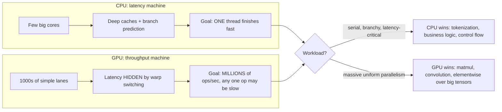
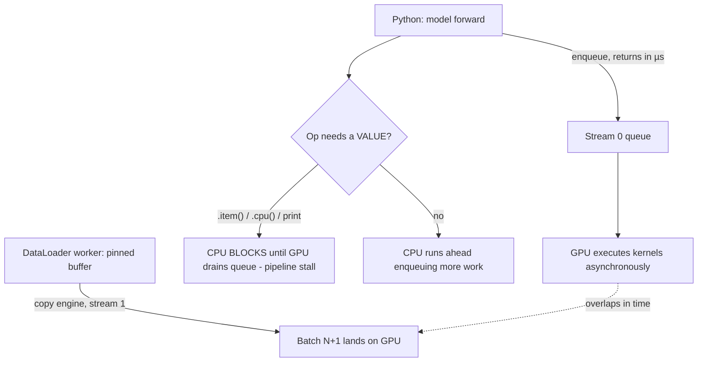
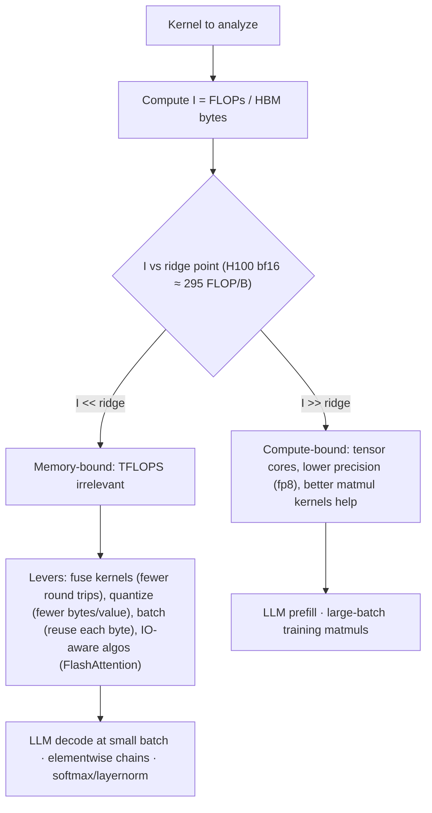

# GPU Architecture and Execution

A GPU is not a "faster CPU" — it is a fundamentally different machine, built on the bet that you have millions of independent, uniform operations to run and don't care how long any single one takes. Every performance mystery you will ever debug on a GPU — why "100% utilization" can mean 8% efficiency, why LLM decode crawls on a chip with a thousand TFLOPS, why ten thousand tiny ops lose to one fused kernel — traces back to three design facts: the SIMT execution model, a steep memory hierarchy, and asynchronous kernel launch. This guide builds those three facts from the ground up, with real numbers from A100/H100 hardware, and derives the roofline model you will use to reason about every op you ever profile.

By the end you should be able to compute arithmetic intensity for a matmul on a whiteboard, explain bit-by-bit why bf16 trains where fp16 diverges, and articulate why FlashAttention is faster despite doing *more* FLOPs than naive attention.

Part of the [Senior AI Engineer Roadmap](../00-Senior-AI-Engineer-Roadmap.md) — Phase 9.

---

## 1. CPU vs GPU: Latency Machines vs Throughput Machines

### 1.1 The Design Trade

A CPU is a **latency machine**: its job is to finish *one* instruction stream as fast as possible. Transistor budget goes to:

- A few large cores (8–64) at high clocks (3–5 GHz)
- Deep cache hierarchies (L1/L2/L3, tens of MB) so one thread rarely waits on DRAM
- Branch predictors, out-of-order execution, speculative execution — machinery to keep *one* pipeline full

A GPU is a **throughput machine**: its job is to finish *millions* of operations per second, and it is content for any individual operation to be slow. Transistor budget goes to:

- Thousands of simple ALUs (H100: 132 SMs × 128 FP32 lanes = 16,896 lanes at ~1.8 GHz)
- Massive register files (256 KB *per SM* — larger than a CPU's L2)
- Wide memory buses (HBM: 3.35 TB/s on H100 vs ~100 GB/s dual-channel DDR5)
- Almost **no** per-thread cleverness: no branch prediction, no out-of-order execution

The key mechanism difference: a CPU **avoids** memory latency with caches and prediction. A GPU **hides** memory latency with parallelism — when warp A stalls on a 500-cycle HBM read, the SM's scheduler issues instructions from warps B, C, D... at zero switch cost (all warp state lives in registers simultaneously). This only works if you *have* thousands of ready threads. Give a GPU a serial, branchy workload and it becomes a very expensive 1.8 GHz in-order processor.



Deep learning is ~90% matrix multiplication — millions of independent multiply-accumulates with perfectly uniform control flow. It is the ideal throughput workload, which is the entire reason the field runs on GPUs.

### 1.2 What This Predicts

This one design fact predicts most GPU performance behavior:

| Symptom | Root cause in the design |
| --- | --- |
| Batch size 1 inference is slow | Not enough parallel work to hide memory latency |
| `if/else` on tensor values is slow | No branch prediction; divergence serializes (Section 2.3) |
| Thousands of tiny ops lose to one big op | Per-launch overhead can't amortize; machine never fills |
| Data-dependent control flow forces CPU round-trips | GPU can't decide what to launch next; CPU must |

---

## 2. The SIMT Model Precisely

### 2.1 Threads, Warps, Blocks, Grids

CUDA organizes work in a hierarchy. From bottom to top:

- **Thread**: one logical lane of execution with its own registers. You launch millions.
- **Warp**: 32 threads that execute **the same instruction at the same time** on different data. The warp is the true unit of execution — the hardware scheduler schedules warps, not threads. This is **SIMT**: Single Instruction, Multiple Threads.
- **Block** (thread block): up to 1,024 threads that run on **one SM**, can share the SM's shared memory (SRAM), and can synchronize with each other (`__syncthreads()`). Threads in different blocks cannot cheaply synchronize.
- **Grid**: all blocks of one kernel launch. Blocks are distributed across the GPU's SMs (132 on H100) in any order — the programming model *requires* blocks to be independent, which is what lets the same code run on a 4-SM laptop GPU and a 132-SM H100.

A matmul like `C[4096,4096] = A @ B` might launch a grid of 1,024 blocks of 256 threads = 262,144 threads, each block computing one 128×128 tile of C.

### 2.2 Warp Scheduling and Occupancy

Each SM holds many **resident warps** (up to 64 on A100/H100). Every cycle, each of the SM's 4 warp schedulers picks a warp that is *ready* (not waiting on memory or a dependency) and issues its next instruction.

**Occupancy** = resident warps / maximum resident warps. It is *not* a goal in itself — it is the supply of latency-hiding material. An HBM read takes ~400–600 cycles. If a warp issues one and the SM has 40 other ready warps, those 400 cycles are filled with useful work; if the SM has 2 resident warps, the lanes idle. Occupancy is limited by whichever per-block resource runs out first: registers per thread (register file is 65,536 32-bit registers per SM), shared memory per block, or thread slots. A kernel using 128 registers/thread caps at 512 threads/SM — 25% occupancy — regardless of how many threads you ask for.

Rule of thumb: memory-bound kernels want high occupancy (more latency to hide); compute-bound kernels with good data reuse (matmul) can run happily at 25–50% occupancy because their latency is hidden by instruction-level parallelism within each warp.

### 2.3 Warp Divergence: A Worked Example

Because all 32 lanes of a warp share one program counter, an `if` where lanes disagree cannot run both sides in parallel. The hardware runs the taken path with non-taking lanes **masked off** (executing but discarding results), then the other path with the mask inverted. Execution time = sum of both paths.

Worked example — per-element op over a tensor:

```python
# Logical computation each thread performs:
#   if x[i] > 0:  y[i] = expensive_a(x[i])   # 100 instructions
#   else:         y[i] = expensive_b(x[i])   # 100 instructions
```

- **Case 1 — sorted data**: all 32 lanes of most warps take the same branch. Each warp executes ~100 instructions. Full throughput.
- **Case 2 — random signs**: nearly every warp has both positive and negative lanes. Each warp executes path A (100 instructions, ~16 lanes active) **then** path B (100 instructions, ~16 lanes active) = 200 instructions for 32 lanes of results. **Effective throughput: 50%.**
- **Pathological case** — a 32-way `switch` on `threadIdx % 32`: 32 serialized paths, ~3% lane utilization.

Divergence only matters *within* a warp. Different warps taking different branches is free. This is why "sort your data by branch condition" and "pad sequences into uniform buckets" are real optimizations, and why `torch.where(cond, a, b)` (compute both, select — no divergence) often beats indexed masking for cheap branches.

### 2.4 Coalesced Memory Access

A warp's 32 loads are serviced in memory transactions of 32–128 bytes. If the 32 threads read 32 **consecutive** floats (128 contiguous bytes), that is **one** transaction. If they read a strided or random pattern, it can take up to 32 transactions — a 32× waste of bandwidth on a machine whose whole game is bandwidth. This is why `.contiguous()`, memory layout (NCHW vs NHWC), and transpose-avoidance matter even from Python: an innocuous `tensor.t()` view feeding a custom op can turn coalesced reads into strided ones.

---

## 3. The Memory Hierarchy With Real Numbers

### 3.1 The Ladder (A100 80GB SXM / H100 80GB SXM)

| Level | Size | Bandwidth (approx) | Latency | Managed by |
| --- | --- | --- | --- | --- |
| Registers | 256 KB per SM (64K × 32-bit) | ~monstrous (operand-collector fed, effectively 100s of TB/s aggregate) | 1 cycle | compiler |
| Shared memory / L1 (SRAM) | A100: 192 KB/SM · H100: 228 KB/SM (~27 MB total) | ~19 TB/s (A100) / ~33 TB/s (H100) aggregate | ~30 cycles | programmer (kernel author) |
| L2 cache | A100: 40 MB · H100: 50 MB | ~7 TB/s | ~200 cycles | hardware |
| HBM ("VRAM") | 80 GB | A100: 2.0 TB/s · H100: 3.35 TB/s | ~500 cycles | you (tensors live here) |
| Host RAM over PCIe | 100s of GB–TB | PCIe 4.0 x16: ~32 GB/s · PCIe 5.0 x16: ~64 GB/s | ~µs | you |
| NVMe / network storage | TBs+ | 3–14 GB/s | ~10s of µs+ | you |

Two observations to internalize:

1. **Each step down the ladder costs ~5–10× bandwidth.** SRAM → HBM is ~10×; HBM → PCIe is ~50–100×. The single worst move in a training loop is a host-device transfer per step; the single best kernel optimization is keeping a tile in SRAM.
2. **On-chip memory is tiny.** All 132 SMs of an H100 together hold ~27 MB of SRAM — less than one layer's weights of a 7B model. Everything interesting must stream through from HBM, which is why bandwidth, not FLOPs, bounds most of inference.

### 3.2 The Compute-vs-Bandwidth Gap: The Arithmetic

H100 SXM, bf16 tensor core, dense: **~990 TFLOPS**. HBM3 bandwidth: **3.35 TB/s**.

```text
ridge point = peak FLOPs / peak bytes
            = 990e12 FLOP/s / 3.35e12 B/s
            ≈ 295 FLOPs per byte
```

For every byte the chip reads from HBM, it can execute ~295 floating-point operations "for free" in the same time. An op doing fewer than ~295 FLOPs/byte leaves compute idle waiting on memory; an op doing more leaves bandwidth idle. For comparison:

| GPU | Peak (dense, 16-bit TC) | HBM BW | Ridge point |
| --- | --- | --- | --- |
| A100 80GB | 312 TFLOPS | 2.0 TB/s | ~156 FLOPs/B |
| H100 SXM | 990 TFLOPS | 3.35 TB/s | ~295 FLOPs/B |
| RTX 4090 | 165 TFLOPS (fp16 accum fp32) | 1.0 TB/s | ~165 FLOPs/B |

The ridge point has climbed every generation — compute grows faster than bandwidth (the "memory wall"). Every generation, *more* ops become memory-bound, which is why kernel fusion and IO-aware algorithms keep getting more valuable.

---

## 4. Kernel Launch: What Actually Happens

### 4.1 Host-Device Asynchrony

Every PyTorch CUDA op (`torch.matmul`, `x + y`, `softmax`) enqueues one or more **kernels** onto a CUDA **stream** — an ordered queue the GPU drains. The Python call returns *immediately*, typically microseconds before the GPU even starts the work. The CPU "runs ahead," queuing work; the GPU catches up asynchronously.

Synchronization points — where the CPU must stop and wait for the GPU:

- `tensor.item()`, `tensor.cpu()`, `tensor.numpy()`, `print(tensor)` — need the value, so they block until the queue drains up to that op
- `torch.cuda.synchronize()` — explicit full-device barrier
- Memory allocation that misses PyTorch's cache (may trigger a `cudaMalloc`, sometimes a sync)
- A blocking (non-pinned) host→device copy

This asynchrony is why naive timing lies:

```python
import torch

x = torch.randn(4096, 4096, device="cuda")

# WRONG — times only the enqueue, not the work:
import time
t0 = time.time()
y = x @ x
print(f"wrong: {(time.time() - t0) * 1e3:.3f} ms")   # wrong: ~0.05 ms (just the Python call!)

# RIGHT — CUDA events measure GPU time on the stream:
start, end = torch.cuda.Event(enable_timing=True), torch.cuda.Event(enable_timing=True)
for _ in range(3):
    y = x @ x                      # warmup: first call compiles/selects kernels, pages in memory
torch.cuda.synchronize()
start.record()
for _ in range(10):
    y = x @ x
end.record()
torch.cuda.synchronize()
print(f"right: {start.elapsed_time(end) / 10:.3f} ms")  # right: ~0.9 ms on A100 (fp32/tf32)
```

### 4.2 Launch Overhead: Why Many Small Ops Lose

Each kernel launch costs **~3–10 µs of CPU time** (driver call, argument marshalling) plus a few µs of GPU-side scheduling. For a kernel that runs 5 ms, this is noise. For a kernel that runs 10 µs — an elementwise op on a small tensor — launch overhead is 50–100% of runtime, and worse: if the CPU can't enqueue kernels faster than the GPU retires them, the GPU **starves**, sitting idle between kernels. The profiler signature is a trace with thin kernel slivers separated by gaps ("gaps are the enemy").

Worked example: a LayerNorm implemented as 8 separate elementwise ops on a `[16, 1024]` tensor. Each op moves 64 KB and runs ~4 µs of GPU time, but costs ~7 µs to launch. The chain takes 8 × max(4, 7) ≈ 56 µs, CPU-bound, GPU mostly idle. A fused LayerNorm kernel: one launch, ~6 µs total. **~9× speedup from doing the identical math in one kernel.** This is precisely what `torch.compile` (fusing elementwise chains via Inductor/Triton) and **CUDA Graphs** (recording a whole sequence of launches and replaying it with one call — amortizing all launch overhead) exist to fix, and why LLM decode servers use CUDA Graphs for the decode step.

### 4.3 Streams and Overlap

A **stream** is an ordered kernel queue; kernels in *different* streams may run concurrently if resources allow. The canonical use is overlapping data transfer with compute:

```python
# Overlap: copy batch N+1 while computing batch N.
# Requires pinned (page-locked) host memory — otherwise non_blocking silently degrades to blocking.
loader = DataLoader(ds, batch_size=256, num_workers=4, pin_memory=True)

for x, y in loader:
    x = x.cuda(non_blocking=True)   # async copy on the copy engine, overlaps prior compute
    y = y.cuda(non_blocking=True)
    step(x, y)
```

GPUs have dedicated **copy engines** (DMA units), so a host→device copy genuinely runs concurrently with SM compute — but only from pinned memory. `prefetch_factor` in DataLoader plus pinned memory plus `non_blocking=True` is the standard input-pipeline overlap stack (Guide 02 implements a full prefetcher).



---

## 5. Tensor Cores and Precision Formats

### 5.1 What Tensor Cores Are

Tensor cores are dedicated matrix-multiply-accumulate (MMA) units — each executes a small matrix product (e.g., 4×4×4 or larger tiles) *per instruction*, instead of one scalar FMA per lane. On H100 they supply ~990 TFLOPS bf16 vs ~67 TFLOPS from the plain fp32 pipeline: **~15× the throughput, but only for matmul-shaped work in supported precisions**. Consequences:

- Convolutions, attention, and linear layers get tensor cores; elementwise ops, softmax, and reductions do not — another reason non-matmul ops are relatively slow and worth fusing.
- Dimensions should be multiples of 8 (fp16/bf16) or 16 for full efficiency — hence padding vocab sizes and hidden dims to multiples of 64/128.
- Pure fp32 matmul on A100 without tf32 uses the slow pipeline: enabling `torch.backends.cuda.matmul.allow_tf32 = True` (or `torch.set_float32_matmul_precision("high")`) is a near-free ~8× matmul speedup.

### 5.2 The Formats, Bit by Bit

A floating-point number is `sign × 1.mantissa × 2^(exponent − bias)`. **Exponent bits buy range; mantissa bits buy precision.** Every format is a different split of that budget:

| Format | Total bits | Sign | Exponent | Mantissa | Max normal | Smallest normal | Relative precision (~2^-m) |
| --- | --- | --- | --- | --- | --- | --- | --- |
| fp32 | 32 | 1 | 8 | 23 | ~3.4e38 | ~1.2e-38 | ~1.2e-7 |
| tf32 | 19 (stored as 32) | 1 | 8 | 10 | ~3.4e38 | ~1.2e-38 | ~9.8e-4 |
| fp16 | 16 | 1 | 5 | 10 | 65,504 | ~6.1e-5 | ~9.8e-4 |
| bf16 | 16 | 1 | 8 | 7 | ~3.4e38 | ~1.2e-38 | ~7.8e-3 |
| fp8 e4m3 | 8 | 1 | 4 | 3 | 448 | ~1.6e-2 | ~1.25e-1 |
| fp8 e5m2 | 8 | 1 | 5 | 2 | 57,344 | ~6.1e-5 | ~2.5e-1 |

Where each fails, and why:

- **fp16** (5-bit exponent): max value 65,504. Attention logits, loss values, and especially *gradients* routinely exceed this → `inf` → NaN. Small gradients below ~6e-5 underflow to zero. Training in fp16 therefore requires **dynamic loss scaling** (multiply the loss by ~2^16 before backward so gradients land in representable range, unscale before the optimizer step, skip steps that produced inf) — the `GradScaler` dance, which occasionally still diverges.
- **bf16** (8-bit exponent = fp32's): same *range* as fp32, so no overflow drama and no loss scaling. The price is a 7-bit mantissa — only ~2–3 decimal digits. That coarseness is fine for weights/activations/grads because the *optimizer math and master weights stay fp32* (that's what "mixed" precision means); it is NOT fine for accumulating long sums, which is why tensor cores accumulate in fp32 internally.
- **tf32**: fp32's range, fp16's mantissa, executed on tensor cores. It is "fp32 matmul, but rounded to 10 mantissa bits" — a transparent speedup with accuracy indistinguishable for DL in practice.
- **fp8** (H100+): e4m3 for forward-pass values (more precision, tiny range → needs per-tensor scaling factors), e5m2 for gradients (more range). Requires scaling machinery (Transformer Engine tracks per-tensor amax history). Doubles tensor-core throughput again (~1,979 TFLOPS on H100) and halves memory/bandwidth per value — the direction of travel for both training and inference.

Rule: **on Ampere (compute capability ≥ 8.0) or newer, use bf16 autocast, no GradScaler; use fp16 + GradScaler only on V100/T4-class hardware; enable tf32 always.** Check capability with `torch.cuda.get_device_capability()` — A100 = (8,0), H100 = (9,0), fp8 needs ≥ (8,9).

---

## 6. Arithmetic Intensity and the Roofline Model, Derived

### 6.1 The Model

For any kernel:

```text
time ≥ max( total_FLOPs / peak_FLOPS ,  total_bytes_moved / bandwidth )
```

Define **arithmetic intensity** `I = FLOPs / bytes moved (to/from HBM)`. Then achievable throughput is:

```text
attainable FLOPS = min( peak_FLOPS ,  I × bandwidth )
```

Plotted on log-log axes (I on x, FLOPS on y), this is a slanted "roofline" (bandwidth-limited region) meeting a flat roof (compute-limited region) at the ridge point `I* = peak_FLOPS / bandwidth ≈ 295` FLOPs/B on H100 bf16.

### 6.2 Matmul Intensity at Various Sizes — The Full Arithmetic

For `C[M,N] = A[M,K] @ B[K,N]` in fp16 (2 bytes/element), assuming each matrix touches HBM once (ideal caching):

```text
FLOPs  = 2·M·N·K                      (multiply + add per output-element-K-step)
bytes  = 2·(M·K + K·N + M·N)
I      = 2MNK / 2(MK + KN + MN) = MNK / (MK + KN + MN)
```

For square matrices M = N = K = n: `I = n³/3n² = n/3` — **intensity grows linearly with size**.

| Shape (M=N=K) | FLOPs | Bytes | I (FLOPs/B) | H100 verdict |
| --- | --- | --- | --- | --- |
| 128 | 4.2e6 | 9.8e4 | ~43 | memory-bound (43 < 295) |
| 512 | 2.7e8 | 1.6e6 | ~171 | memory-bound |
| 1024 | 2.1e9 | 6.3e6 | ~341 | **just compute-bound** |
| 4096 | 1.4e11 | 1.0e8 | ~1,365 | strongly compute-bound |
| 8192 | 1.1e12 | 4.0e8 | ~2,731 | compute-bound, near peak |

The asymmetric case that matters for LLMs — a skinny matmul `[B, K] @ [K, N]` with small batch B:

```text
I = BNK / (BK + KN + BN) ≈ BNK / KN = B      (when K,N >> B)
```

**Intensity ≈ batch size.** A batch-1 matvec has I ≈ 1; you need batch ≈ 300 to hit the H100 ridge. This single line of algebra explains why inference servers batch aggressively.

### 6.3 Elementwise Ops

`y = relu(x)` on n fp16 elements: n FLOPs, 4n bytes (read + write) → **I = 0.25**. Softmax, layernorm, residual adds: I ≈ 1–4. These are ~100–1000× below the ridge — hopelessly, permanently memory-bound. No amount of TFLOPS helps; the only lever is moving fewer bytes (fusion: compute `relu(x + b)` in one kernel = one read, one write, instead of two of each).

### 6.4 Why LLM Decode Is Bandwidth-Bound: The Full Arithmetic

Generating **one token** for **one sequence** with a 7B fp16 model:

```text
FLOPs  ≈ 2 × params            = 2 × 7e9  = 1.4e10 FLOPs
bytes  ≈ all weights read once = 7e9 × 2  = 1.4e10 bytes   (+ KV cache read)
I      ≈ 1 FLOP/byte           (vs ridge ~295)
```

The chip is ~99.7% idle on compute. Decode throughput is therefore a *bandwidth* calculation:

```text
tokens/s ≈ bandwidth / bytes_per_token ≈ 3.35e12 / 1.4e10 ≈ 239 tokens/s   (H100, batch 1, fp16 7B)
```

— regardless of whether the GPU does 300 or 990 or 2,000 TFLOPS. Cross-check the levers:

- **int4 quantization** → 3.5 GB of weights → ~950 tok/s ceiling: quantization speeds decode because it shrinks *bytes*, not because int math is faster.
- **Batching** 64 sequences reads weights *once* for 64 tokens → I ≈ 64, throughput ×~64 until compute or KV-cache bandwidth binds.
- **Prefill** processes the whole prompt in one pass — 2,048 tokens is effectively a batch-2048 matmul, I in the thousands → compute-bound. Same model, same weights, two opposite bottlenecks: **prefill is compute-bound, decode is bandwidth-bound.** This is why chunked-prefill/disaggregated serving separates them.

### 6.5 How FlashAttention Exploits the Hierarchy

Naive attention for one head: `S = QKᵀ` ([s,s] scores), `P = softmax(S)`, `O = PV`. The [s,s] intermediate is materialized in HBM: at s = 8,192, fp16, 32 heads, that's 32 × 8192² × 2 B = **4.3 GB written and re-read per layer**. Attention's matmuls have decent intensity, but the softmax round-trip drowns them — the op is bound by O(s²) HBM traffic.

FlashAttention's move: never write S or P to HBM. Tile Q into SRAM-sized blocks; stream K,V tile-by-tile through SRAM; maintain a running (online) softmax — per-row running max m and running sum l — rescaling the partial output as each new tile arrives. The math is *exactly* equivalent (a telescoping renormalization), and the backward pass *recomputes* S from Q,K rather than reading it back — deliberately spending extra FLOPs to save IO, the correct trade for a memory-bound op.

IO complexity: naive = O(s²) HBM traffic; Flash = O(s² d / M_sram) reads of K,V tiles ≈ O(s²·d/M) which for realistic d and SRAM size M is ~10–20× fewer bytes; the intermediates are O(s), not O(s²). Result: 2–4× wall-clock speedup and — often more important — attention's memory footprint drops from O(s²) to O(s), which is what made 32k–128k contexts feasible at all.

**The generalizable lesson: the biggest wins on modern GPUs come from moving fewer bytes, not doing fewer FLOPs.** FlashAttention does *more* FLOPs than naive attention and wins anyway.



---

## 7. Reading GPU Specs Critically

Marketing numbers deserve a discount rate. How to read an H100 datasheet:

- **"3,958 TFLOPS"** — that is fp8 *with sparsity*. The 2:4 structured-sparsity number doubles the dense figure and applies only if your weights are pruned into the 2-of-4 pattern (almost no production LLMs are). Dense fp8 = 1,979; dense bf16 = 990; dense fp32 (non-TC) = 67. Always ask: *which precision, dense or sparse?*
- **Achievable vs peak**: a well-tuned large matmul (cuBLAS/CUTLASS) reaches 70–85% of dense peak. End-to-end training of a transformer reaching 40–55% **MFU** (model FLOPs utilization = useful model FLOPs / peak FLOPs / time) is *good*; 20–35% is common. Nobody sustains 100%.
- **SXM vs PCIe variants**: H100 PCIe has lower TDP (350 W vs 700 W), lower clocks, ~2.0 TB/s bandwidth vs 3.35, and no NVSwitch fabric — 30–40% less real throughput than the SXM number you saw quoted.
- **Bandwidth is often the number that matters**: for a serving fleet doing small-batch decode, A100 (2.0 TB/s) → H100 (3.35 TB/s) buys ~1.7×, not the 3.2× the TFLOPS ratio implies.
- **Power/thermals**: sustained clocks < boost clocks; a throttling GPU (check `nvidia-smi -q -d PERFORMANCE` for "SW Thermal Slowdown") quietly loses 15–30%.

Quick spec-sanity worksheet for any GPU: write down (1) dense bf16 TFLOPS, (2) HBM bandwidth, (3) their ratio (ridge point), (4) VRAM size, (5) interconnect (NVLink? PCIe gen?). Those five numbers, not the headline, determine what the card can do for you.

---

## Production War Stories & Failure Modes

### Story 1: The 100-µs Model That Took 8 ms

**Symptom:** A small transformer (12 layers, d=512) for real-time ranking showed 8 ms p50 latency on an A100. Back-of-envelope said the math was ~100 µs of GPU work. GPU util: 30%.

**Investigation:** PyTorch profiler trace showed ~2,400 kernel launches per forward pass, each kernel 1–5 µs, with 3–8 µs CPU gaps between them. The trace's CPU row was solid; the GPU row was confetti. Classic launch-overhead starvation: the CPU could not enqueue 2,400 kernels fast enough, so the GPU idled between slivers.

**Root cause:** Batch size 1 + tiny tensors meant every op was launch-dominated; unfused elementwise chains (bias→dropout→residual→layernorm as separate ops) multiplied the count.

**Fix:** `torch.compile(model, mode="reduce-overhead")` — Inductor fused the elementwise chains (2,400 → ~300 kernels) and CUDA Graphs replayed the whole decode as one launch. Latency: 8 ms → 0.6 ms.

**Prevention:** For latency-critical small models, count kernels per step in the profiler; treat >100 launches for <1 ms of math as a red flag; make CUDA Graph compatibility (static shapes) a design requirement.

### Story 2: The fp16 Fine-Tune That NaN'd at Step 3,000

**Symptom:** A 1.3B model fine-tune on V100s (no bf16 support) trained smoothly for ~3,000 steps, then loss spiked to NaN. Restarting from checkpoint reproduced it within a few hundred steps.

**Investigation:** Logged `scaler.get_scale()` — the GradScaler's scale had climbed to 65,536, and grad-norm logging showed attention-logit magnitudes growing as the model sharpened. An overflow check showed inf appearing in the attention scores *forward* pass — before the scaler could help, since loss scaling only protects the backward pass.

**Root cause:** fp16's 65,504 max. As training sharpened attention, `q·k` logits exceeded fp16 range in the forward pass. GradScaler cannot fix forward-pass overflow.

**Fix:** Cast attention-score computation to fp32 (pre-softmax), keep the rest fp16 — standard practice now baked into most attention implementations. Longer-term: moved the job to A100s with bf16, deleted the GradScaler, problem structurally gone.

**Prevention:** On fp16 hardware, always keep softmax/logits paths in fp32; log the loss scale and treat a scale collapsing toward 1 as an early-warning signal; prefer bf16 hardware for anything > 1B params.

### Story 3: "Upgraded to H100, Only Got 1.6×"

**Symptom:** Team migrated a batch-4 LLM serving workload from A100 to H100 expecting ~3× (990 vs 312 TFLOPS). Measured: 1.6×. Leadership asked where the money went.

**Investigation:** Roofline arithmetic on the workload: batch-4 decode has I ≈ 4 FLOPs/byte — 70× below H100's ridge. The workload was bandwidth-bound on both cards, so the relevant ratio was 3.35/2.0 TB/s = 1.68×. The measured 1.6× was in fact *near-perfect* scaling.

**Root cause:** Nothing was broken — the expectation was. TFLOPS ratios only predict compute-bound workloads.

**Fix:** To actually harvest H100 compute: raised batch via continuous batching (intensity ↑), adopted fp8 KV cache and weights (bytes ↓ — this helps *because* it's bandwidth-bound). Combined: 2.7× over the A100 baseline.

**Prevention:** Before any hardware decision, classify the workload on the roofline and compare the *binding* resource across cards. Put ridge-point arithmetic in the capacity-planning template.

---

## Best Practices

- Classify every op you care about as compute-bound or memory-bound (compute I, compare to the ridge point) *before* optimizing; the two regimes have disjoint fixes.
- Never time GPU code with `time.time()` around an op — use `torch.cuda.Event` pairs or the profiler, always with warmup iterations and a final `synchronize()`.
- Default numerics on Ampere+: bf16 autocast, tf32 enabled, fp32 master weights and optimizer states, no GradScaler. fp16 + GradScaler only on pre-Ampere hardware, with fp32 softmax paths.
- Keep host-device transfers out of hot loops; when you must transfer, use pinned memory + `non_blocking=True` so copy engines overlap compute.
- Avoid per-step sync points: no `.item()`, `.cpu()`, `print(tensor)`, or Python-side conditionals on tensor values inside the loop; accumulate metrics on-GPU and sync once per N steps.
- Feed tensor cores: keep matmul dims multiples of 8/16 (pad vocab and hidden sizes), keep tensors contiguous, and verify tensor-core kernels are actually running (profiler kernel names containing `s16816`/`hmma`/`wgmma`).
- Treat kernel count as a metric: hundreds of launches for a millisecond of math means fuse (`torch.compile`) or capture (CUDA Graphs).
- Prefer IO-aware implementations (FlashAttention/SDPA, fused optimizers, fused losses) — on modern GPUs, bytes moved is the budget that binds.
- Read GPU specs as (dense TFLOPS at your precision, HBM bandwidth, ridge, VRAM, interconnect); ignore sparsity-inflated headline numbers.
- Expect 40–55% MFU for good transformer training and 70–85% of peak for isolated large matmuls; investigate below that, but don't chase 100%.

---

## Interview Drills

<details><summary>1. Why can a GPU be thousands of times faster than a CPU on matmul but slower on parsing JSON?</summary>

Matmul is millions of independent, uniform multiply-accumulates — exactly what a throughput machine wants: it fills tens of thousands of lanes, control flow is identical across threads (no divergence), memory access is regular (coalesced), and abundant parallelism lets the scheduler hide 500-cycle HBM latency by switching warps. JSON parsing is the opposite: serial data dependencies (you can't parse byte n+1's meaning without byte n), branchy control flow (divergence serializes warps), irregular memory access, and little parallelism per document. On that workload the GPU degenerates to a 1.8 GHz in-order core with no branch prediction — strictly worse than a modern CPU core.

**Follow-up: "So where's the boundary — what properties must a workload have to benefit?"** Enough independent work items to fill the machine (tens of thousands), uniform control flow within groups of 32, regular/coalesced access patterns, and high enough arithmetic intensity (or enough batch) that you're not purely bandwidth-bound. Partial fits work partially — e.g., embedding lookups are parallel but scattered, so they run on GPU but at bandwidth-, not compute-, limits.
</details>

<details><summary>2. Explain warps and warp divergence. When does an `if` statement cost you 2× and when does it cost nothing?</summary>

Threads execute in warps of 32 sharing one program counter — one instruction issued per cycle for all 32 lanes (SIMT). On a data-dependent branch where lanes disagree, the hardware executes the taken path with non-taking lanes masked, then the other path with the mask inverted: time = sum of both paths. If both branches are similar length and most warps are mixed, throughput halves. The branch costs *nothing* when all 32 lanes of each warp agree — divergence is intra-warp only; warp-to-warp differences are free. So `if (batch_element_is_long_sequence)` where sequences are bucketed is free, while `if (x[i] > 0)` on random data is ~2×.

**Follow-up: "How would you make a divergent computation fast without removing the branch semantically?"** Options: sort/bucket data so warps become uniform (pad sequences into length buckets); replace branches with predication — `torch.where(c, f(x), g(x))` computes both and selects, which beats divergence when branches are cheap; or split into two kernel launches over pre-partitioned indices when branches are expensive.
</details>

<details><summary>3. Walk me through the memory hierarchy of an H100 with numbers, and tell me which level dominates LLM inference cost.</summary>

Registers (256 KB/SM, ~1 cycle) → shared memory/L1 SRAM (228 KB/SM, ~27 MB chip-wide, ~33 TB/s, ~30 cycles) → L2 (50 MB, ~7 TB/s) → HBM3 (80 GB, 3.35 TB/s, ~500 cycles) → host over PCIe 5.0 (~64 GB/s). Each level down costs roughly an order of magnitude in bandwidth. LLM inference at small batch is dominated by the **HBM level**: every decoded token must stream all weights plus KV cache from HBM through the chip, so throughput ≈ bytes/3.35 TB/s. The 27 MB of SRAM can't hold even one layer of a 7B model, so weights can't be cached on-chip — HBM bandwidth is the hard ceiling.

**Follow-up: "Why do kernel authors obsess over shared memory if it's so small?"** Because *reuse* lives there. A matmul tile loaded into SRAM once gets used in hundreds of FMAs; without tiling, every FMA would re-read operands from HBM and the op would be bandwidth-bound at ~1 FLOP/byte instead of compute-bound. SRAM doesn't hold the model; it holds the working set of the current tile — that's the entire mechanism by which matmul achieves high arithmetic intensity in practice.
</details>

<details><summary>4. Derive the ridge point of an H100 and use it to predict whether a batch-8 decode step of a 13B fp16 model is compute- or memory-bound.</summary>

Ridge = peak FLOPS / bandwidth = 990e12 / 3.35e12 ≈ 295 FLOPs/byte (bf16 dense). Batch-8 decode: FLOPs ≈ 2 × 13e9 × 8 = 2.08e11 per step; bytes ≈ weights once = 13e9 × 2 = 2.6e10 (weights are shared across the batch — that's the point of batching). I ≈ 2.08e11 / 2.6e10 ≈ 8 FLOPs/byte — about 37× below the ridge, so decisively **memory-bound**. Predicted step time ≈ 26 GB / 3.35 TB/s ≈ 7.8 ms → ~128 steps/s → ~1,024 tok/s aggregate. You'd need batch ≈ 300 to approach compute-bound (I ≈ batch for skinny matmuls).

**Follow-up: "You ignored the KV cache — when does that assumption break?"** At long contexts and large batches the KV cache read rivals or exceeds the weight read: KV bytes/step = batch × cache_per_seq, and cache grows linearly with sequence. E.g., 8 sequences at 16k tokens with a ~0.4 MB/token cache is ~52 GB read per step — double the weights. Then batching stops helping linearly, because KV reads (unlike weights) don't amortize across the batch — each sequence has its own cache. That's the regime where GQA, KV quantization, and paged/offloaded cache matter.
</details>

<details><summary>5. Why does `torch.matmul(a, b)` return in microseconds even when the matmul takes 50 ms, and what are three ways this bites people?</summary>

CUDA launches are asynchronous: the call enqueues a kernel on a stream and returns; the GPU drains the queue independently, and the CPU only blocks at a synchronization point (`.item()`, `.cpu()`, `synchronize()`, blocking copies). Three classic bites: (1) **benchmarking lies** — `time.time()` around an op measures enqueue time, making the op look 1000× faster than reality; fix with CUDA events + warmup + sync. (2) **misattributed stack traces** — an async CUDA error (e.g., illegal memory access) surfaces at some *later* sync point, blaming an innocent line; debug with `CUDA_LAUNCH_BLOCKING=1`. (3) **hidden sync stalls** — an innocuous `if loss.item() > threshold` or `tqdm` postfix printing a tensor each step forces a full pipeline drain per iteration, serializing CPU and GPU.

**Follow-up: "Is CPU run-ahead unbounded? What happens with a very fast CPU loop?"** Effectively bounded: the allocator, per-stream queue depth, and eventual sync points bound it; in steady state the CPU runs a few iterations ahead. But run-ahead means Python-side exceptions and GPU-side errors are decoupled in time, and it's why the profiler is the only honest way to see which side — CPU enqueue or GPU execution — is the bottleneck at any moment.
</details>

<details><summary>6. Compare fp16, bf16, and tf32 bit-by-bit. Why did the industry converge on bf16 for training?</summary>

fp16 = 1/5/10 (sign/exp/mantissa): max 65,504, relative precision ~1e-3. bf16 = 1/8/7: fp32's range (~3.4e38) with only ~2-3 significant digits. tf32 = 1/8/10 executed on tensor cores: fp32 range, fp16-class precision, a drop-in fast path for fp32 matmuls. Training's enemy is *range*, not precision: gradients and logits span many orders of magnitude, and fp16's 5-bit exponent overflows (inf → NaN) and underflows (vanishing grads), forcing dynamic loss scaling that adds failure modes. bf16's fp32-equal exponent eliminates both failure classes; its coarse mantissa is tolerable because tensor cores accumulate in fp32 and master weights/optimizer states stay fp32. Simpler + robust beat marginally-more-precise + fragile.

**Follow-up: "If range matters so much, why does fp8 training use e4m3 — only 4 exponent bits — for activations?"** Because fp8 abandons the fixed-format assumption: Transformer Engine attaches a *per-tensor scale factor* (tracked from amax history) that re-centers each tensor into e4m3's small window — software dynamic range replacing exponent bits, spending the freed bits on mantissa. Gradients, whose distribution is spikier and harder to track, get e5m2 (more hardware range). It's loss scaling generalized: per-tensor, automatic, and in both directions.
</details>

<details><summary>7. Your training step launches 3,000 kernels. Why is that a problem, what's the trace signature, and what are the fixes in order of effort?</summary>

Each launch costs ~3–10 µs of CPU time; 3,000 launches ≈ 10–30 ms of pure CPU enqueue per step. If GPU work per step is comparable or smaller, the CPU becomes the bottleneck and the GPU starves — trace signature: a dense CPU row, a GPU row of thin kernel slivers separated by gaps, low power draw despite "high utilization". Fixes by effort: (1) remove Python-level loops over layers/ops that fragment work; (2) `torch.compile` — Inductor fuses elementwise/reduction chains, typically cutting kernel count 3–10×; (3) CUDA Graphs (`mode="reduce-overhead"`) — record the whole step once, replay with ~one launch, eliminating per-kernel CPU cost, at the price of static shapes; (4) fused libraries (apex/fused optimizers, FlashAttention) for the remaining hot spots.

**Follow-up: "When does torch.compile make things worse?"** Highly dynamic shapes (recompilation storms — every new shape triggers a compile taking seconds), data-dependent control flow causing graph breaks that fragment the model into many small compiled regions plus eager glue, and debugging pain from asynchronous compiled code. Mitigate with bucketing/padding to a small set of shapes, `dynamic=True` compilation, and checking `torch._dynamo.utils.compile_times()` / graph-break counts before trusting a speedup.
</details>

<details><summary>8. Explain FlashAttention's algorithm to me at the level of "what's in SRAM when". Why does the backward pass recompute the score matrix?</summary>

Outer loop over blocks of Q (each block sized to fit SRAM); inner loop streams blocks of K and V through SRAM. For each (Q-block, K-block) pair: compute the partial score tile QKᵀ in SRAM, update per-row running max m and running sum l (online softmax), rescale the partial output accumulator O by the correction factor from the new max, and accumulate the tile's contribution PV — all without the [s,s] matrix ever existing in HBM; only Q,K,V,O (all O(s·d)) touch HBM. Backward recomputes score tiles from Q,K rather than storing them because attention is memory-bound: storing S would cost O(s²) HBM writes+reads, while recomputing costs FLOPs the bandwidth-starved SMs have idle to spare. Trading spare compute for scarce bandwidth is *the* FlashAttention idea.

**Follow-up: "What's the IO complexity improvement, and what does it do to the memory footprint?"** HBM traffic drops from O(s² ) (naive, dominated by S/P round trips) to O(s²·d/M) where M is SRAM size — with realistic d≈64-128 and M≈100-200 KB, roughly a 10–20× traffic cut. Footprint for attention intermediates drops O(s²) → O(s) (just running statistics + output), which is what made 32k+ contexts feasible — at 32k, a naive fp16 score matrix would be 2 GB *per head-layer*.
</details>

<details><summary>9. nvidia-smi shows 100% GPU utilization but your job is slow. Reconcile this.</summary>

"GPU-Util" is the fraction of the sample window during which *at least one kernel was resident on the device* — a duty-cycle metric, not an efficiency metric. One thread-block of a memory-bound kernel using 1 of 132 SMs at 2% of bandwidth counts as "100% utilized". So 100% util is compatible with 5% of peak FLOPS. Honest signals: power draw vs TDP (a busy H100 pulls 600–700 W; 250 W at "100% util" means idle silicon), SM efficiency / tensor-core activity from DCGM or the profiler, achieved memory bandwidth, and ultimately MFU (achieved model FLOPs / peak). The profiler trace then tells you *which* pathology: gaps (starvation), small kernels (launch overhead), or dense-but-slow kernels (memory-bound work).

**Follow-up: "Define MFU precisely and give me the good/bad thresholds for transformer training."** MFU = (model FLOPs per step, ≈ 6·params·tokens for a transformer fwd+bwd) / (step time × peak dense FLOPS at training precision). It deliberately excludes recomputation (that's HFU) so it measures useful work. Rough bands: 45–55% excellent for large-scale bf16 training, 30–45% typical, <25% means a real pathology — input pipeline, communication, small batch, or unfused ops.
</details>

<details><summary>10. Why does quantizing a model from fp16 to int4 speed up single-stream decode by ~3–4×, but barely speed up prefill?</summary>

Decode at small batch is bandwidth-bound: time ≈ weight-bytes / bandwidth. int4 shrinks bytes 4× (fp16→0.5 B/param, minus some overhead for scales/zeros), so the bandwidth ceiling rises ~4× — dequantization adds FLOPs, but compute was ~99% idle, so it's free. Prefill is compute-bound (high arithmetic intensity from processing many tokens per weight-read): its time ≈ FLOPs / TFLOPS, and int4 doesn't reduce FLOPs — dequantized values still multiply at fp16/bf16 rates (unless using true low-precision tensor-core paths). So the memory-bound phase accelerates with byte count; the compute-bound phase doesn't. Same reasoning explains why speculative decoding helps decode (amortizes weight reads over drafted tokens) but is irrelevant to prefill.

**Follow-up: "So when would int4 actually hurt throughput?"** At high batch, where serving becomes compute-bound: dequant overhead and non-tensor-core int4 kernels can make int4 *slower* than fp16 cuBLAS at batch 64+. Also when the KV cache, not weights, dominates bytes (long context, big batch) — quantizing weights then attacks the minor term; you'd quantize the KV cache instead. Always identify which bytes dominate before choosing what to shrink.
</details>

<details><summary>11. What is occupancy, what limits it, and when is low occupancy fine?</summary>

Occupancy = resident warps per SM / hardware max (64 on A100/H100) — the pool of warps the scheduler can switch among to hide latency. Limits per SM: register file (65,536 regs — a kernel using 128 regs/thread caps at 512 threads), shared memory (a block wanting 100 KB of 228 KB allows only 2 blocks), and thread/block slots. Low occupancy is fine when latency is hidden *another* way: compute-bound kernels with high instruction-level parallelism and heavy data reuse — tuned matmuls deliberately run fat blocks (many registers, lots of shared memory, 25–50% occupancy) because each warp has long dependency-free FMA chains. Memory-bound kernels, with little ILP and constant stalls, need high occupancy.

**Follow-up: "A junior engineer 'optimizes' a kernel by cutting register usage to raise occupancy to 100%, and it gets slower. Explain."** Fewer registers per thread forces spilling intermediates to local memory (which lives in HBM) — trading cheap on-chip storage for the very memory traffic occupancy was supposed to hide. Occupancy is a means (latency hiding), not an end; past the point where latency is covered, extra occupancy buys nothing and the register squeeze costs real bandwidth. Measure achieved bandwidth/FLOPS, not occupancy.
</details>

<details><summary>12. Your colleague benchmarks two attention implementations and reports the new one is 5× faster. The number seems too good. What methodology errors do you check for?</summary>

In order of likelihood: (1) **no synchronization** — timing enqueue with `time.time()`, so the "fast" one just enqueues fewer/lazier ops; require CUDA events or profiler numbers. (2) **no warmup** — first iterations include kernel compilation/autotuning/allocator warmup; the baseline may have eaten that cost. (3) **different dtypes or shapes** — new impl silently running fp16 vs baseline fp32, or non-contiguous inputs penalizing one side. (4) **not comparing equal math** — e.g., new one is causal/dropout-free while baseline isn't, or returns unnormalized outputs. (5) **cache effects** — tiny tensors fitting L2 on one path. (6) **cherry-picked shape** — 5× at seq 8k may be 1.1× at the production seq 512. Demand: event-timed, warmed-up, synced, same-dtype, same-shape sweep over production shapes, plus an output allclose check.

**Follow-up: "The comparison survives all that and it's still 5× at your production shape. What do you check before shipping?"** Numerical acceptance (max abs/rel error vs reference across dtypes and *adversarial* inputs — long sequences, large magnitudes), backward-pass correctness and speed if training, memory footprint (some fast kernels trade memory for speed), determinism requirements, hardware coverage (is it Hopper-only?), and behavior under torch.compile/CUDA Graphs. Then canary it behind a flag with output-diff monitoring.
</details>

<details><summary>13. Prefill and decode run the same weights through the same layers. Why do serving systems increasingly run them on separate GPU pools?</summary>

They sit at opposite ends of the roofline: prefill processes s prompt tokens in one pass — batch-s-scale matmuls with intensity in the hundreds-to-thousands → compute-bound, long-running, latency-tolerant per token. Decode emits one token per sequence per step — intensity ≈ batch → bandwidth-bound, launch-sensitive, latency-critical. Mixed on one GPU, they poison each other: a long prefill stalls all decoding sequences (head-of-line blocking, visible as inter-token latency spikes), while decode's small kernels waste a compute-optimized allocation. Disaggregation lets each pool be sized and even hardware-matched to its bottleneck (compute-rich cards for prefill, bandwidth-rich for decode), at the cost of shipping the prompt's KV cache from prefill pool to decode pool over the interconnect.

**Follow-up: "What's the alternative if you can't afford two pools?"** Chunked prefill: split long prompts into chunks and interleave chunk-processing with decode steps in the same batch — bounding the head-of-line delay any decode step suffers, at slight prefill-throughput cost. vLLM and TensorRT-LLM both implement this; it's the single-pool compromise, and the knob (chunk size) trades TTFT against inter-token latency.
</details>

<details><summary>14. Give me the five numbers you'd extract from a GPU spec sheet to decide if it fits a workload, and a marketing number you'd ignore.</summary>

(1) Dense TFLOPS *at my precision* (bf16 or fp8, dense — determines compute-bound throughput); (2) memory bandwidth (determines decode/memory-bound throughput); (3) their ratio, the ridge point (classifies my workload); (4) VRAM capacity (determines what fits: weights + KV/optimizer + activations); (5) interconnect — NVLink presence/bandwidth and PCIe gen (determines multi-GPU strategy viability, e.g., tensor parallel needs NVLink). Ignore: the sparsity-doubled TFLOPS headline (requires 2:4 structured-pruned weights nobody deploys) and any number not marked dense/sparse and precision-specific. Also discount SXM numbers if buying PCIe cards — bandwidth and TDP differ 30–40%.

**Follow-up: "Workload: serve a 70B fp8 model, 8k context, latency-sensitive. L40S (48 GB, ~864 GB/s, no NVLink) vs H100 (80 GB, 3.35 TB/s, NVLink) — walk the numbers."** 70B fp8 ≈ 70 GB weights + KV cache: doesn't fit one card of either → tensor parallel required. TP needs per-layer all-reduces; L40S has no NVLink, so TP runs over PCIe (~64 GB/s shared) — latency dies. H100: fits in 2×80 GB with NVLink (900 GB/s) TP-2, decode ceiling ≈ 3.35×2 TB/s aggregate against ~70 GB reads ≈ 90+ tok/s/stream. The interconnect line item, which the headline TFLOPS comparison never mentions, decides this one outright.
</details>

<details><summary>15. "Moving fewer bytes beats doing fewer FLOPs on modern GPUs." Defend this claim with three concrete examples, then tell me when it's false.</summary>

(1) FlashAttention does strictly *more* FLOPs than naive attention (backward recompute) yet wins 2–4× by cutting O(s²) HBM traffic to tiles streamed through SRAM. (2) Kernel fusion: `relu(x+b)` fused does the same FLOPs as the two-op version but halves reads/writes — near-2× on any elementwise chain, the core of torch.compile's wins. (3) Quantization: int4 decode does *extra* work (dequantization) and speeds up ~4× purely because weights shrink 4× against a bandwidth ceiling. All three spend compute to save bytes, and win because the ridge point (~300 FLOPs/byte) means compute is the abundant resource. It's false in the compute-bound regime: large-batch prefill, big training matmuls at 50% MFU — there, bytes are already amortized and only FLOP reduction (lower precision like fp8, sparsity, better algorithms like MoE routing, distillation) or more silicon helps.

**Follow-up: "Does this trend strengthen or weaken with future hardware?"** Strengthens: each generation, FLOPS grows faster than bandwidth (A100: 156 FLOP/B ridge → H100: 295 → B200 higher still), so the memory-bound region swallows more ops. Architecturally that's why the field moves toward ever-more-aggressive fusion (megakernels), on-chip persistence, fp8/fp4 formats, and algorithms designed around IO complexity rather than FLOP counts.
</details>
