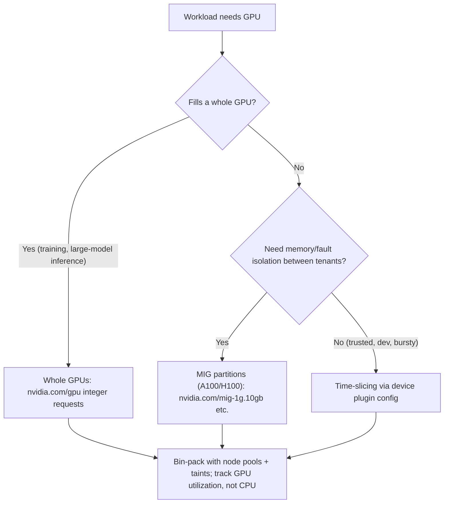
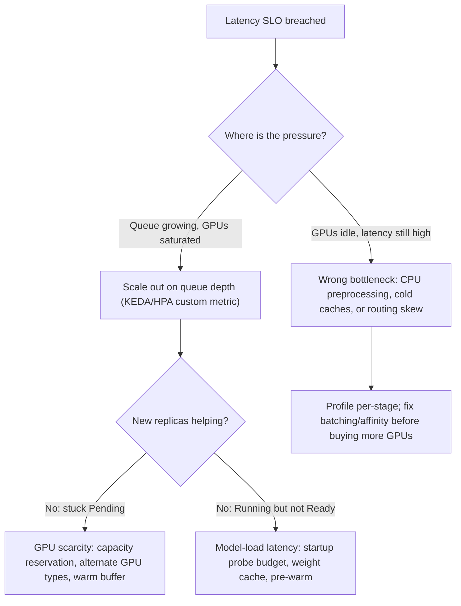

# Cloud, Kubernetes and Infrastructure for AI

You already know Docker and Kubernetes; this guide is about what breaks when the workload is an ML system: 10GB+ images, GPUs that cannot be fractionally requested by default, pods that take minutes to become ready because they are loading 70GB of weights, and autoscalers that watch CPU while the GPU sits at 100%. AI workloads violate the assumptions general-purpose infrastructure was tuned for — instant startup, cheap fungible replicas, CPU as the bottleneck — and each violation has a specific, learnable fix. This guide expands Phase 10 into practical depth: containerization discipline for ML images, GPU scheduling and sharing on Kubernetes, autoscaling on the metrics that actually matter, and Terraform patterns for GPU node pools, artifact storage, and environment separation.

Part of the [Senior AI Engineer Roadmap](./00-Senior-AI-Engineer-Roadmap.md) — Phase 10.

---

## 1. Containerization for ML

### 1.1 Why ML Images Are Different

A typical Python service image is 200-500MB. A PyTorch + CUDA image starts around 5GB and hits 10-15GB once you add flash-attention, vLLM, or TensorRT. At that size, every sloppy layer costs real money (registry storage, egress) and real time (node pull time directly delays autoscaling — a 12GB image can take 3-5 minutes to pull on a fresh node). Image-size discipline is not aesthetics; it is part of your scaling latency budget.

### 1.2 CUDA Base Image Choices: runtime vs devel

NVIDIA publishes three flavors of CUDA base images:

| Image | Contents | Size | Use for |
| --- | --- | --- | --- |
| `base` | CUDA runtime libs only | ~100MB | Minimal; you install exactly what you need |
| `runtime` | + cuDNN, CUDA math libraries | ~2-3GB | **Serving containers** — running precompiled wheels |
| `devel` | + nvcc compiler, headers, static libs | ~6-8GB | **Build stages only** — compiling custom CUDA kernels |

The classic mistake is shipping `devel` to production. You need `devel` only when something compiles CUDA code at build time (flash-attention from source, custom ops): compile in a `devel` build stage, copy the resulting wheels/venv into a `runtime` final stage.

### 1.3 A Real Multi-Stage Dockerfile with uv

```dockerfile
# ---- Stage 1: build dependencies (devel image: has nvcc if anything compiles) ----
FROM nvidia/cuda:12.4.1-devel-ubuntu22.04 AS builder
COPY --from=ghcr.io/astral-sh/uv:latest /uv /usr/local/bin/uv

WORKDIR /app
ENV UV_COMPILE_BYTECODE=1 UV_LINK_MODE=copy

# Dependency layer: cached unless pyproject.toml/uv.lock change.
# Code changes do NOT invalidate this layer — this is the caching win.
COPY pyproject.toml uv.lock ./
RUN --mount=type=cache,target=/root/.cache/uv \
    uv sync --frozen --no-install-project --no-dev

# Code layer: changes often, but is tiny and fast to rebuild
COPY src/ ./src/
RUN --mount=type=cache,target=/root/.cache/uv \
    uv sync --frozen --no-dev

# ---- Stage 2: runtime image (no compiler toolchain, no build cache) ----
FROM nvidia/cuda:12.4.1-runtime-ubuntu22.04

RUN apt-get update && apt-get install -y --no-install-recommends \
    python3.11 tini && rm -rf /var/lib/apt/lists/*

# Non-root: required by most cluster PodSecurity policies, and just correct
RUN groupadd -g 10001 app && useradd -u 10001 -g app -m app
USER app
WORKDIR /app

COPY --from=builder --chown=app:app /app/.venv /app/.venv
COPY --from=builder --chown=app:app /app/src /app/src
ENV PATH="/app/.venv/bin:$PATH"

# NOTE: no model weights in the image — see 1.4
ENTRYPOINT ["tini", "--"]
CMD ["python", "-m", "src.server"]
```

Key points: lockfile-first `COPY` so the multi-gigabyte dependency layer is cached across code changes; `--mount=type=cache` so uv's download cache survives rebuilds without bloating layers; `devel` only in the builder; non-root user with a fixed UID (some volume mounts and PodSecurity admission care about numeric UIDs).

### 1.4 Where Model Weights Live: Object Storage, Not the Image

Baking weights into the image is tempting (one immutable artifact, no startup dependency) but usually wrong: a 14GB checkpoint turns a 5GB image into 19GB, so every code-only change ships 19GB through the registry and onto every node; model updates force image rebuilds even though weights and code change on independent schedules; and registries throttle and bill for exactly this pattern.

The standard pattern: the image contains code + runtime; weights are pulled at startup from object storage (S3/GCS) or a model registry into a local volume, ideally a node-local cache (hostPath/PVC) so the second pod on the same node skips the download. Record the exact weight version (URI + hash) in config so deployments stay reproducible.

**When baking weights in is defensible:** small models (<1-2GB), air-gapped environments, or when cold-start time from object storage genuinely dominates and you pair the fat image with image pre-pulling (DaemonSet or node image cache).

### 1.5 Supply-Chain Hygiene

- **Vulnerability scanning:** run Trivy/Grype in CI on every build; ML base images ship enormous CVE surface (system libs in the CUDA image, transitive Python deps). Gate on critical CVEs with a documented exception process, or the gate will just be disabled.
- **Signed images:** sign with cosign in CI, verify at admission (Kyverno/policy-controller) so only CI-built images run in the cluster.
- **Secret-free, reproducible builds:** no tokens in layers — use `--mount=type=secret` for private index credentials — and pin base image digests (`nvidia/cuda@sha256:...`) plus lockfiles; "latest CUDA" is how training suddenly stops converging after a rebuild.

---

## 2. GPU Containers and Scheduling on Kubernetes

### 2.1 The GPU Plumbing Stack

For a container to see a GPU, three layers must line up: the **NVIDIA driver** on the host (node image or DaemonSet-installed), the **nvidia-container-toolkit** (container runtime hook that mounts driver libraries and device nodes into containers), and the **NVIDIA device plugin** (a DaemonSet that advertises `nvidia.com/gpu` as a schedulable resource to the kubelet). Managed offerings (GKE, EKS with GPU AMIs, or the NVIDIA GPU Operator) install all three; the GPU Operator additionally manages driver upgrades, MIG configuration, and DCGM metrics exporters.

Inside the pod you request GPUs like any extended resource:

```yaml
resources:
  limits:
    nvidia.com/gpu: 1   # requests and limits must be equal; no overcommit
```

### 2.2 Whole-GPU Granularity, Time-Slicing, and MIG

Unlike CPU (millicores) and memory (bytes), `nvidia.com/gpu` is an **integer**. You cannot request `0.5` of a GPU — a small inference service gets a whole A100 and wastes 80% of it. Two sharing mechanisms exist:

- **Time-slicing:** the device plugin advertises N virtual GPUs per physical GPU; workloads context-switch on the same silicon. **No memory or fault isolation** — one pod can OOM the GPU and take its neighbors down. Fine for dev clusters and bursty low-duty-cycle inference; risky for multi-tenant production.
- **MIG (Multi-Instance GPU, A100/H100/B100):** hardware partitioning into up to 7 instances (e.g., `1g.10gb`, `3g.40gb`) with **isolated memory, cache, and compute**. Each instance appears as its own schedulable resource (`nvidia.com/mig-1g.10gb`). Proper isolation, but the partition layout is semi-static — repartitioning requires draining the GPU.

Rule of thumb: MIG for multi-tenant serving of small models; time-slicing for trusted, non-critical sharing; whole GPUs for training and large-model inference.



### 2.3 GPU Node Pools: Taints, Tolerations, Affinity

GPU nodes cost 10-30x CPU nodes, so the cardinal sin is a random cronjob getting scheduled onto one. Taint every GPU pool so only workloads that explicitly tolerate it land there, and use labels + affinity to route workloads to the right GPU type:

```yaml
# Node pool (conceptually — set via cloud provider / Terraform):
#   labels:  gpu-type: a100, workload-class: inference
#   taints:  nvidia.com/gpu=present:NoSchedule
apiVersion: v1
kind: Pod
metadata:
  name: embedder
spec:
  tolerations:
    - key: nvidia.com/gpu
      operator: Exists
      effect: NoSchedule
  affinity:
    nodeAffinity:
      requiredDuringSchedulingIgnoredDuringExecution:
        nodeSelectorTerms:
          - matchExpressions:
              - { key: gpu-type, operator: In, values: [l4, a10g] }  # cheap GPUs suffice
  containers:
    - name: embedder
      image: ghcr.io/acme/embedder@sha256:abc123
      resources:
        limits: { nvidia.com/gpu: 1 }
```

Also standard for GPU serving: **PodDisruptionBudgets** (`minAvailable: 1` or a percentage) so node upgrades and cluster-autoscaler consolidation never evict all replicas of a slow-to-warm model at once, and **pod anti-affinity** across zones/nodes for availability.

### 2.4 Jobs and CronJobs for Training and Batch Scoring

Training and batch scoring are Jobs, not Deployments — they run to completion:

- `backoffLimit` low (2-3): a training job failing on OOM will fail again; retrying 6 times burns GPU-hours. `activeDeadlineSeconds` kills runaway/hung training instead of paying for a wedged GPU overnight; `ttlSecondsAfterFinished` garbage-collects finished pods.
- Checkpoint to object storage every N steps so preemption (spot!) resumes rather than restarts.
- CronJobs for nightly batch scoring: set `concurrencyPolicy: Forbid` (a slow run must not overlap the next) and `startingDeadlineSeconds` so missed schedules do not stampede.
- For multi-node distributed training, plain Jobs are insufficient — you need gang scheduling (all pods or none, or you deadlock half-allocated GPUs); that is what Kueue, Volcano, and the Kubeflow training operators provide.

---

## 3. Autoscaling AI Workloads

### 3.1 Why HPA on CPU Is Wrong for GPU Inference

The default HPA scales on CPU utilization. A GPU inference server does tokenization and HTTP handling on CPU (light) and the actual work on GPU (heavy). Result: the GPU saturates, latency explodes, requests queue — and the HPA sees 20% CPU and does nothing. Or the inverse: CPU-heavy preprocessing spikes trigger scale-up of idle GPUs.

Scale on signals that reflect the real bottleneck: **queue depth / pending requests** per replica (vLLM exports `vllm:num_requests_waiting`), **in-flight concurrency** (KServe/Knative-style concurrency targets), **tokens/sec or batch saturation** relative to measured capacity, or — laggy and misleading under continuous batching, so least preferred — **GPU utilization** from the DCGM exporter.

Plumbing: Prometheus + prometheus-adapter feeding HPA custom metrics, or **KEDA**, which is the pragmatic default — it scales on Prometheus queries, queue lengths (SQS/Kafka/Rabbit), and can scale to zero for bursty workloads.

### 3.2 What Replica Scaling Does Not Solve

The roadmap's list, with the mitigation for each — this is the difference between knowing HPA syntax and operating AI systems:

| Problem | Why more replicas don't fix it | Mitigation |
| --- | --- | --- |
| Model-loading time | New replica serves nothing for 2-10 min while pulling weights | Startup probes with honest budgets; node-local weight cache (PVC/hostPath); pre-pulled images; scale early on leading indicators |
| GPU scarcity | The autoscaler asks for nodes the cloud doesn't have | Capacity reservations for baseline; multi-region/multi-type fallbacks; over-provision a warm buffer |
| Memory fragmentation | Long-lived KV-cache/allocator fragmentation degrades a replica internally | Paged KV cache (vLLM); scheduled rolling restarts; per-replica memory monitoring |
| Queue buildup | Scaling reacts after the queue exists; loading delay makes it worse | Scale on queue depth (KEDA), not utilization; admission control + load shedding at the gateway |
| Cache locality | A new replica has cold KV/prefix caches — slower until warmed | Session/prefix-affinity routing; warm-up requests in the startup path before Ready |
| Uneven request sizes | One 8k-token request behind ten 50-token requests; means lie | Continuous batching (vLLM); separate pools or routing by expected length; per-token accounting |
| Multi-GPU placement | A TP=4 model needs 4 GPUs on one node with NVLink — replicas can't span | Node pools sized to model topology; whole-node scheduling; gang scheduling for multi-node |



### 3.3 Probes for Slow-Loading Models

A default liveness probe (`failureThreshold: 3`, 10s period) will kill a pod that takes 4 minutes to load weights, which triggers a reload, which fails the probe again — a crash loop that looks like a broken image. Use a **startup probe** to cover the load window (liveness/readiness are suspended until it passes), keep liveness itself cheap and lenient, and make **readiness** mean "model in memory and warmed", not "HTTP port open". Do warm-up inference (compile CUDA graphs, populate caches) before reporting ready.

### 3.4 A Production vLLM Deployment

```yaml
apiVersion: apps/v1
kind: Deployment
metadata:
  name: vllm-llama31-8b
spec:
  replicas: 2
  strategy:
    rollingUpdate: { maxSurge: 1, maxUnavailable: 0 }  # never dip capacity: replicas warm slowly
  selector: { matchLabels: { app: vllm-llama31-8b } }
  template:
    metadata:
      labels: { app: vllm-llama31-8b }
    spec:
      terminationGracePeriodSeconds: 120        # drain in-flight generations
      tolerations:
        - { key: nvidia.com/gpu, operator: Exists, effect: NoSchedule }
      nodeSelector: { gpu-type: a100, workload-class: inference }
      volumes:
        - name: model-cache
          persistentVolumeClaim: { claimName: hf-model-cache }   # shared weight cache
        - name: shm
          emptyDir: { medium: Memory, sizeLimit: 8Gi }           # NCCL/tensor-parallel shm
      containers:
        - name: vllm
          image: vllm/vllm-openai@sha256:0d5e...   # digest-pinned
          args: ["--model", "meta-llama/Llama-3.1-8B-Instruct",
                 "--download-dir", "/models", "--gpu-memory-utilization", "0.90"]
          env:
            - { name: HF_HOME, value: /models }
          ports: [{ containerPort: 8000 }]
          resources:
            requests: { cpu: "4", memory: 24Gi }
            limits:   { cpu: "8", memory: 32Gi, nvidia.com/gpu: 1 }
          volumeMounts:
            - { name: model-cache, mountPath: /models }
            - { name: shm, mountPath: /dev/shm }
          startupProbe:                       # budget: up to 10 min for download + load
            httpGet: { path: /health, port: 8000 }
            periodSeconds: 10
            failureThreshold: 60
          readinessProbe:
            httpGet: { path: /health, port: 8000 }
            periodSeconds: 5
          livenessProbe:                      # cheap and lenient; never kills during load
            httpGet: { path: /health, port: 8000 }
            periodSeconds: 30
            failureThreshold: 5
---
apiVersion: policy/v1
kind: PodDisruptionBudget
metadata: { name: vllm-llama31-8b }
spec:
  minAvailable: 1
  selector: { matchLabels: { app: vllm-llama31-8b } }
```

### 3.5 Cluster Autoscaling with GPU Node Pools

Node-level scaling has GPU-specific pain:

- **Scale-from-zero is slow and fragile:** the autoscaler must infer that an empty pool can satisfy `nvidia.com/gpu` (label hints/ASG tags), then node boot + driver install + 12GB image pull + weight load stack up to 5-15 minutes of cold start. Keep min size ≥ 1 for latency-sensitive serving; scale-to-zero is for batch and dev.
- **Capacity is not guaranteed:** "scale up" is a request the cloud can refuse (`InsufficientInstanceCapacity`). Use capacity reservations for baseline serving; treat on-demand GPU availability as a dependency that can fail.
- **Spot vs on-demand:** spot GPUs at 60-90% discount are excellent for **training with checkpointing** (interruption = resume from checkpoint) and tolerable for stateless batch scoring, but a bad fit for user-facing serving of slow-loading models, where a 2-minute interruption notice meets a 5-minute replacement warm-up. Common split: on-demand/reserved for serving baseline, spot for training and burst. Run separate pools per GPU type and workload class with distinct taints, so bin-packing and scaling decisions stay independent.

---

## 4. Terraform for AI Infrastructure

### 4.1 What Changes vs Ordinary Infra

Nothing about Terraform itself — what changes is the resource mix: GPU node pools (quota-gated, region-scarce, autoscaling 0..N), object storage as a first-class citizen (model artifacts, datasets, checkpoints — with lifecycle rules, because checkpoint buckets grow without bound), IAM that lets pods read model buckets via workload identity instead of long-lived keys, and secrets (model-provider API keys) in a secret manager, never in tfvars committed to git.

### 4.2 Module Layout and Environment Separation

```text
infra/
├── modules/
│   ├── gpu-node-pool/        # reusable: pool + taints + labels + autoscaling
│   ├── model-artifacts/      # bucket + lifecycle + IAM bindings
│   └── inference-cluster/    # cluster + system pools + GPU operator
├── envs/
│   ├── dev/                  # small/spot GPUs, scale-to-zero, own state
│   ├── staging/
│   └── prod/                 # reserved capacity, min-size floors, own state
└── backend.tf                # remote state: versioned bucket + state locking
```

Environments are separate root modules with separate remote state (versioned bucket + locking) — never workspaces-only separation for infra where a `terraform destroy` in the wrong context deletes the prod model bucket. Dev proves the same modules with cheaper parameters (T4/L4 spot, min 0) that prod runs with A100s and reservations.

### 4.3 GPU Node Pool, Artifact Bucket, and IAM (GKE-flavored HCL)

```hcl
resource "google_container_node_pool" "inference_a100" {
  name     = "inference-a100"
  cluster  = google_container_cluster.ai.id
  autoscaling {
    min_node_count = 1      # floor > 0: serving can't eat scale-from-zero cold starts
    max_node_count = 8
  }
  node_config {
    machine_type = "a2-highgpu-1g"
    spot         = false    # serving pool; the training pool sets spot = true
    guest_accelerator {
      type  = "nvidia-tesla-a100"
      count = 1
    }
    labels = { gpu-type = "a100", workload-class = "inference" }
    taint {
      key    = "nvidia.com/gpu"
      value  = "present"
      effect = "NO_SCHEDULE"
    }
    service_account = google_service_account.inference_nodes.email
    oauth_scopes    = ["https://www.googleapis.com/auth/cloud-platform"]
  }
}

resource "google_storage_bucket" "model_artifacts" {
  name                        = "acme-${var.environment}-model-artifacts"
  location                    = var.region
  uniform_bucket_level_access = true
  versioning { enabled = true }              # roll back a bad model like bad code
  lifecycle_rule {
    condition { age = 30, matches_prefix = ["checkpoints/"] }
    action    { type = "Delete" }            # checkpoints are cattle after 30 days
  }
}

# Workload identity: inference pods read weights with no static keys anywhere
resource "google_storage_bucket_iam_member" "inference_read" {
  bucket = google_storage_bucket.model_artifacts.name
  role   = "roles/storage.objectViewer"
  member = "principal://iam.googleapis.com/projects/${var.project_number}/locations/global/workloadIdentityPools/${var.project_id}.svc.id.goog/subject/ns/inference/sa/vllm-server"
}
```

The same shape applies on EKS (`eks_node_group` + GPU AMI + S3 + IRSA) and AKS. Also manage via Terraform: VPC/networking, the cluster itself, databases, secret-manager entries, monitoring dashboards/alerts — the roadmap's full 10.3 list — so a new region or environment is a `terraform apply`, not a wiki page.

### 4.4 Cost Engineering

- **Utilization is the metric.** A GPU billed 24/7 at 15% utilization means ~85% of spend is waste. Track DCGM utilization per pool; healthy serving pools run 50-70% (headroom for spikes), training jobs should push 90%+.
- **Right-size the GPU to the model:** a 7B model in int8 does not need an H100 — L4/A10G class cards serve it at a fraction of the cost. Benchmark $/1k tokens per GPU type, not sticker price, and MIG-partition big GPUs for small-model fleets instead of dedicating whole cards.
- **Spot for interruptible work, reservations for baseline, on-demand only for burst** — and scale batch/dev pools to zero on schedule (nights/weekends).
- **Count the whole bill:** egress on 10GB image pulls, cross-zone traffic between replicas, and idle "warm buffer" capacity are recurring costs that never show up in a per-request benchmark.

---

## Best Practices

- Build in `devel`, ship in `runtime`. If your production image contains `nvcc`, you are paying to ship a compiler.
- Order Dockerfile layers by change frequency: lockfile-installed dependencies first, code last; never bake multi-GB weights into a layer that code changes invalidate.
- Pull weights from versioned object storage at startup, cache them on a node-local volume, and pin the exact artifact (URI + hash) in config.
- Run containers as non-root with pinned base-image digests; scan with Trivy in CI and verify cosign signatures at admission.
- Taint every GPU node pool; require explicit tolerations. One untainted GPU pool will eventually run someone's cron job at A100 prices.
- Autoscale inference on queue depth or concurrency (KEDA/custom metrics), never on CPU; autoscale nodes with capacity reservations behind the serving baseline.
- Give every slow-loading model a startup probe sized to its real load time, make readiness mean "warmed", not "port open", and set `maxUnavailable: 0` rollouts plus PDBs — with multi-minute warm-up, losing capacity during a rollout is a self-inflicted outage.
- Checkpoint training to object storage and run it on spot; serve on reserved/on-demand — never invert this. One Terraform module set, parameterized per environment, with separate remote state per env, and lifecycle rules on checkpoint buckets before they hit 100TB.

## Interview Questions

<details><summary>Your PyTorch inference image is 18GB and every deploy is slow. How do you shrink it and why does size matter here?</summary>
Size matters because image pull time is part of autoscaling latency (a fresh GPU node pulling 18GB adds minutes to scale-up) and because registry storage/egress on multi-GB images costs real money. Fixes, in order of impact: (1) if model weights are baked in, move them to object storage pulled at startup into a node-local cache — weights and code have independent release cadences; (2) multi-stage build — compile in a CUDA `devel` stage, copy the venv into a `runtime` final stage, dropping ~4-5GB of toolchain; (3) layer ordering — install from the lockfile before copying code, so code changes reuse the cached dependency layer and nodes only pull small top layers; (4) remove dev/test dependencies (`uv sync --no-dev`), use `--no-install-recommends`, clean apt lists; (5) for remaining cold-start pain, pre-pull images via DaemonSet or node image caches.
</details>

<details><summary>What are the nvidia-container-toolkit and the NVIDIA device plugin, and why do you need both?</summary>
They solve different halves of the problem. The nvidia-container-toolkit is a container-runtime integration on the node: when a container requests GPU access it injects the device nodes and mounts the host's driver libraries into the container, so a container built without drivers can use the host's driver. The device plugin is a Kubernetes DaemonSet implementing the device-plugin API: it discovers GPUs on the node and advertises them to the kubelet as the extended resource `nvidia.com/gpu`, making them visible to the scheduler and enforcing exclusive assignment. Without the toolkit, a scheduled pod couldn't actually touch the GPU; without the plugin, the scheduler wouldn't know GPUs exist. The host driver itself is a third prerequisite; the NVIDIA GPU Operator packages all of this plus MIG config and DCGM metrics.
</details>

<details><summary>You need to run twelve small models but GPUs are only schedulable as whole units. What are your options and their trade-offs?</summary>
`nvidia.com/gpu` is integer-only, so by default each model would waste most of a card. Options: (1) MIG on A100/H100 — hardware partitioning into up to 7 instances with isolated memory, cache, and compute, each schedulable as its own resource type; proper multi-tenant isolation, but the partition layout is semi-static (repartitioning requires draining) and only supported on high-end GPUs. (2) Time-slicing via device-plugin config — advertise N virtual GPUs per card; works on any GPU but provides no memory or fault isolation, so one tenant's OOM or crash affects the others; acceptable for dev or trusted bursty workloads. (3) Consolidation — serve multiple models from one process (multi-model server) or replace some with a single multi-task model. (4) Right-size hardware — many small models fit L4/A10G-class cards cheaply without sharing. For untrusted or production multi-tenancy, MIG is the defensible answer.
</details>

<details><summary>Why is HPA on CPU utilization wrong for a GPU inference service, and what should you scale on?</summary>
The bottleneck is the GPU, but HPA watches CPU. A saturated GPU with growing request queues can coexist with 20% CPU (tokenization and HTTP are cheap), so the HPA never scales out while latency explodes; conversely CPU spikes from preprocessing can scale out expensive idle GPUs. Scale on bottleneck-truthful signals: queue depth / pending requests per replica (vLLM exposes `vllm:num_requests_waiting`), in-flight concurrency against a measured per-replica capacity, or token throughput saturation. GPU utilization from DCGM is usable but laggy and misleading under continuous batching. Implementation: Prometheus + prometheus-adapter for HPA custom metrics, or KEDA for Prometheus-query and queue-based scalers with scale-to-zero. Crucially, pair scaling with realistic warm-up handling — new replicas take minutes to load weights, so scale on leading indicators and keep a warm buffer.
</details>

<details><summary>The roadmap says replica scaling doesn't solve several AI-specific problems. Name four and their mitigations.</summary>
(1) Model-loading time — a new replica is useless for minutes while pulling weights; mitigate with startup probes sized to real load time, node-local weight caches (PVC/hostPath), pre-pulled images, and warm-up before Ready. (2) GPU scarcity — the cluster autoscaler can request nodes the cloud cannot provide; mitigate with capacity reservations for baseline, multiple instance-type/zone fallbacks, and a warm over-provisioned buffer. (3) Cache locality — new replicas have cold KV/prefix caches and serve slower; mitigate with prefix-affinity routing and warm-up traffic. (4) Uneven request sizes — one 8k-token generation can block many small ones and per-replica averages lie; mitigate with continuous batching (vLLM), routing by expected length or separate pools, and per-token metrics. Also on the list: memory fragmentation (paged KV cache, rolling restarts), queue buildup (scale on queue depth, admission control), and multi-GPU placement (topology-aware node pools, gang scheduling).
</details>

<details><summary>A model server pod takes 5 minutes to load weights and is stuck in a CrashLoopBackOff. What is likely happening and how do you fix it?</summary>
Classic probe misconfiguration: a default liveness probe (e.g., 3 failures at 10s intervals) declares the pod dead ~30 seconds into a 5-minute weight load, kills it, and the restart repeats the load — an infinite loop that looks like a bad image. Fix: add a startupProbe with a budget covering worst-case load (e.g., `periodSeconds: 10`, `failureThreshold: 60` for 10 minutes) — liveness and readiness are suspended until it succeeds; keep the liveness probe cheap and lenient (it should only catch a hung process); make readiness reflect "weights in memory and warmed", not "port open", and run warm-up inference before reporting ready. Then attack the load time itself: cache weights on a node-local volume so restarts skip the download, and use `maxUnavailable: 0` rollouts plus a PDB so slow warm-up never coincides with lost capacity.
</details>

<details><summary>When would you use spot GPUs, and when would you refuse to?</summary>
Spot fits interruption-tolerant work: training and fine-tuning with regular checkpointing to object storage (an interruption costs only the steps since the last checkpoint), batch/offline scoring, and dev/experimentation — at 60-90% discounts this is the single biggest GPU cost lever. Refuse spot for user-facing serving of slow-loading models: a ~2-minute interruption notice combined with a 5-15 minute replacement cold start (node boot + image pull + weight load) means every reclamation is a capacity dip or outage, and spot pools can be reclaimed en masse exactly when demand (and your traffic) peaks. Standard architecture: reserved or on-demand capacity for the serving baseline, spot for training and for burst capacity behind a queue that tolerates delay. If you must serve on spot, over-provision, spread across instance types/zones, and handle the interruption notice by draining early.
</details>

<details><summary>How would you structure Terraform for dev/staging/prod AI infrastructure, and what AI-specific resources does it manage?</summary>
Reusable modules (`gpu-node-pool`, `model-artifacts` bucket + IAM, `inference-cluster`) instantiated by separate root modules per environment, each with its own remote state in a versioned, locked backend — separate state so a mistake in dev cannot touch prod, and prod applies go through CI with plan review. Environments differ only in parameters: dev uses small/spot GPUs with scale-to-zero; prod uses A100-class pools with min-size floors and capacity reservations. AI-specific resources: GPU node pools with taints/labels/autoscaling bounds (quota- and region-constrained), object-storage buckets for model artifacts and checkpoints with versioning (model rollback) and lifecycle rules (checkpoint cleanup), workload-identity IAM so pods read model buckets without static keys, secret-manager entries for model-provider API keys, plus the standard networks, clusters, databases, and monitoring. The test of success: standing up a new environment or region is an apply, not archaeology.
</details>

<details><summary>Your monthly GPU bill doubled but traffic didn't. Where do you look?</summary>
Start with utilization, not price: pull DCGM per-pool GPU utilization — the usual culprit is paid-for-but-idle capacity. Specifically check: (1) autoscaler floors — someone raised `min_node_count` or a scale-to-zero dev/batch pool stopped scaling down (a stuck pod, a PDB blocking consolidation, or a DaemonSet keeping nodes "needed"); (2) orphaned workloads — finished training Jobs without `ttlSecondsAfterFinished`, crash-looping pods holding GPUs, forgotten experiments on tainted pools; (3) right-sizing regressions — a new service requesting whole A100s for a small model that belongs on L4s or a MIG slice; (4) spot-to-on-demand drift — fallback logic quietly serving training from on-demand after spot reclamations; (5) storage and egress — unbounded checkpoint buckets and multi-GB image pulls across zones. Structurally: per-team/workload cost allocation via labels, utilization dashboards with alerts on idle GPU-hours, and $/1k-tokens (or $/training-run) as the tracked efficiency metric rather than raw spend.
</details>
