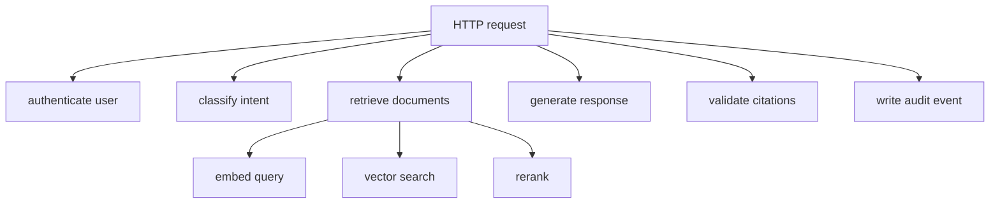
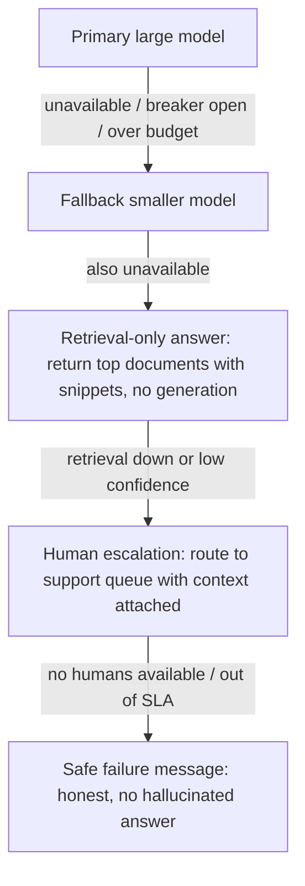

# AI Observability and Reliability

Production AI systems fail in ways traditional services do not: a model can return a syntactically valid but wrong answer, retrieval can silently degrade, and a provider outage can take down every feature that depends on it. This guide covers the signals you must collect, how to instrument an LLM call with OpenTelemetry, and the reliability patterns that keep an AI system useful when its dependencies misbehave. The goal is the senior-engineer bar: know why the AI system is failing before the customer reports it.

Part of the [Senior AI Engineer Roadmap](./00-Senior-AI-Engineer-Roadmap.md) — Phase 11.

---

## 1. Standard Signals: RED and USE

Before adding anything AI-specific, an AI service is still a service. Two classic frameworks cover the baseline.

**RED** (for request-driven services — your API, your gateway, your retrieval service):

| Signal | Meaning | Example metric |
| --- | --- | --- |
| Rate | Requests per second | `http_requests_total` |
| Errors | Failed requests per second | `http_requests_failed_total` |
| Duration | Latency distribution (p50/p90/p95/p99) | `http_request_duration_seconds` |

**USE** (for resources — GPUs, CPU, memory, queues, database connections):

| Signal | Meaning | Example |
| --- | --- | --- |
| Utilization | How busy the resource is | GPU utilization percent |
| Saturation | Queued work the resource cannot absorb | inference queue depth |
| Errors | Resource-level failures | CUDA OOM count, DB connection errors |

Track percentiles, never just averages. A p99 of 30 seconds with a p50 of 800 ms means one in a hundred users has an unusable experience, and averages hide it entirely.

---

## 2. AI-Specific Signals

Standard signals tell you the service is up. They do not tell you the answers are good, grounded, affordable, or safe. Add these to every AI request:

* **Model version** and **prompt version** — without these you cannot attribute a quality regression to a change.
* **Retrieval query and retrieved document IDs** — the only way to debug "why did it answer from the wrong document".
* **Token consumption** — input, output, and cached tokens per request; this is your cost signal.
* **Tool calls and tool errors** — which tools the model invoked, with what arguments, and which failed.
* **Model latency and model-provider errors** — separate provider latency from your own overhead.
* **Output-schema failures** — how often structured output failed validation and required retry.
* **Safety-filter outcomes** — inputs or outputs blocked, and by which filter.
* **Human overrides** — when a reviewer changed the AI's decision, a direct quality signal.
* **Quality scores** — online scorer or LLM-judge results sampled from production traffic.
* **Cost** — per request, per task, and per successful task.

A practical rule: every log line and span for an AI request should let you answer *"which model, which prompt, which documents, what did it cost, and was the output accepted?"*

### Instrumenting an LLM call with OpenTelemetry

```python
import time
from opentelemetry import trace
from opentelemetry.sdk.trace import TracerProvider
from opentelemetry.sdk.trace.export import BatchSpanProcessor, ConsoleSpanExporter

provider = TracerProvider()
provider.add_span_processor(BatchSpanProcessor(ConsoleSpanExporter()))
trace.set_tracer_provider(provider)
tracer = trace.get_tracer("ai.gateway")


def generate_answer(question: str, context_docs: list[dict], client) -> dict:
    with tracer.start_as_current_span("llm.generate") as span:
        # Low-cardinality attributes: safe to also emit as metric labels.
        span.set_attribute("gen_ai.request.model", "claude-sonnet-4-5")
        span.set_attribute("app.prompt.version", "answer-v14")
        span.set_attribute("app.retrieval.doc_count", len(context_docs))
        # High-cardinality attributes: fine on spans, NEVER as metric labels.
        span.set_attribute(
            "app.retrieval.doc_ids",
            [d["id"] for d in context_docs],
        )

        start = time.monotonic()
        try:
            response = client.messages.create(
                model="claude-sonnet-4-5",
                max_tokens=1024,
                messages=[{"role": "user", "content": question}],
            )
        except Exception as exc:
            span.record_exception(exc)
            span.set_attribute("app.provider.error", type(exc).__name__)
            raise

        span.set_attribute("gen_ai.usage.input_tokens", response.usage.input_tokens)
        span.set_attribute("gen_ai.usage.output_tokens", response.usage.output_tokens)
        span.set_attribute(
            "app.model.latency_ms", int((time.monotonic() - start) * 1000)
        )
        span.set_attribute("app.cost.usd", estimate_cost(response.usage))
        return {"text": response.content[0].text, "usage": response.usage}
```

Notes on this pattern:

* Use the emerging `gen_ai.*` OpenTelemetry semantic conventions where they exist, and a consistent `app.*` namespace for your own attributes.
* Record the prompt **version**, not the full prompt text, on the span. Full prompts and completions belong in a sampled, access-controlled log store — they contain user data.
* Record exceptions on the span before re-raising so the trace shows the failure point.

### The distributed trace of an AI request

One user question fans out into many operations. A trace stitches them together:



When a request is slow, the trace tells you *which* child span ate the budget: a 4-second response might be 200 ms of retrieval and 3.6 seconds of generation — or 3 seconds of reranking, which is a completely different fix. Propagate a single trace ID from the edge through retrieval, generation, and audit so you can join spans, logs, and cost records.

### The high-cardinality caveat

Metrics backends aggregate time series per unique label combination. Attributes like `user_id`, `document_id`, `retrieval_query`, or `session_id` have unbounded cardinality — attaching them as metric labels creates millions of series and can take down your metrics pipeline (or your bill).

Rule of thumb:

* **Metrics**: only bounded labels — model name, prompt version, route, tenant *tier* (not tenant ID), error class.
* **Traces and logs**: high-cardinality detail lives here — doc IDs, queries, tool arguments.

```yaml
# common-pitfall.yaml — DO NOT do this
# A Prometheus counter labelled by user and query explodes cardinality:
#   ai_requests_total{user_id="u_84213", query="how do I reset my password"}  # BAD
# Correct: bounded labels only.
#   ai_requests_total{model="claude-sonnet-4-5", prompt_version="v14", outcome="ok"}
```

---

## 3. Reliability Patterns

AI dependencies (model providers, GPUs, vector stores) are slower and flakier than typical microservice dependencies, so these patterns are not optional.

| Pattern | What it does | AI-specific note |
| --- | --- | --- |
| Timeouts | Bound how long you wait | Set separate budgets for time-to-first-token and total generation |
| Retries with jitter | Retry transient failures without thundering herd | Retry 429/5xx, never retry on content errors; cap attempts — LLM retries are expensive |
| Circuit breakers | Stop calling a failing dependency | Trip per provider+model; probe with cheap requests |
| Bulkheads | Isolate resource pools per workload | Separate GPU/connection pools for chat vs. batch so batch cannot starve chat |
| Backpressure | Reject or queue when full instead of collapsing | Bounded queues in front of GPU workers; reject early with 429 |
| Dead-letter queues | Park messages that repeatedly fail | Essential for async document-ingestion pipelines |
| Idempotency | Same request twice → one effect | Idempotency keys on every tool call with side effects (refunds, emails) |
| Fallback models | Route to an alternative model | A smaller/cheaper model, another provider, or a cached answer |
| Load shedding | Drop low-priority work under stress | Shed batch scoring before interactive traffic |
| Caching | Reuse previous work | Prompt/prefix caches, embedding caches, full-response caches for idempotent queries |

### Circuit breaker with model fallback

```python
import random
import time


class CircuitBreaker:
    def __init__(self, failure_threshold: int = 5, reset_timeout_s: float = 30.0):
        self.failure_threshold = failure_threshold
        self.reset_timeout_s = reset_timeout_s
        self.failures = 0
        self.opened_at: float | None = None

    @property
    def state(self) -> str:
        if self.opened_at is None:
            return "closed"
        if time.monotonic() - self.opened_at >= self.reset_timeout_s:
            return "half_open"  # allow one probe request
        return "open"

    def record_success(self) -> None:
        self.failures = 0
        self.opened_at = None

    def record_failure(self) -> None:
        self.failures += 1
        if self.failures >= self.failure_threshold:
            self.opened_at = time.monotonic()


class ModelRouter:
    """Primary model behind a breaker, with a fallback chain."""

    def __init__(self, primary, fallback, breaker: CircuitBreaker):
        self.primary = primary
        self.fallback = fallback
        self.breaker = breaker

    def generate(self, prompt: str, timeout_s: float = 20.0) -> dict:
        if self.breaker.state != "open":
            for attempt in range(3):
                try:
                    out = self.primary.generate(prompt, timeout=timeout_s)
                    self.breaker.record_success()
                    return {"text": out, "model": "primary", "degraded": False}
                except TransientProviderError:
                    self.breaker.record_failure()
                    if self.breaker.state == "open":
                        break  # stop hammering a dead provider
                    # Exponential backoff with full jitter.
                    time.sleep(random.uniform(0, min(2 ** attempt, 8)))
        # Breaker open or retries exhausted: degrade, don't fail.
        out = self.fallback.generate(prompt, timeout=timeout_s)
        return {"text": out, "model": "fallback", "degraded": True}


class TransientProviderError(Exception):
    pass
```

Key details interviewers probe:

* **Full jitter** (`random.uniform(0, backoff)`) prevents synchronized retry storms across many clients.
* The breaker must be **per dependency** (per provider, per model), not global.
* Always tag the response as `degraded: True` and emit a metric — silent degradation destroys your quality data.
* A common pitfall: retrying on *validation* failures (bad schema output) with the identical prompt and temperature 0 — you will get the identical bad output. Change something (add the error to the prompt, raise temperature slightly) or fall back.

### Graceful degradation chain

A senior design never has exactly two states, "working" and "down". It has a ladder:



Implementation notes per rung:

1. **Large → small model**: keep prompts compatible with both; pre-test the fallback in your eval suite so you know the quality delta before the incident, not during it.
2. **Retrieval-only**: the system stops generating prose and returns ranked source passages with links. Zero hallucination risk, still genuinely useful. Requires that retrieval and generation are separately deployable — a good architectural forcing function.
3. **Human escalation**: attach the conversation, retrieved documents, and attempted answer to the ticket so the human starts warm, not cold.
4. **Safe failure**: an explicit, honest message ("I can't answer reliably right now — here's how to reach support") beats a confident wrong answer every time. Never let the degraded path invent content.

Also: make degradation **observable** (a `degradation_level` attribute on every response) and **rehearsed** (game days where you kill the primary provider in staging and verify each rung engages).

---

## 4. Alerting on What Matters

Alert on symptoms users feel, backed by causes for diagnosis:

* Page: p95 latency SLO breach, error-rate SLO breach, degradation level >= retrieval-only for N minutes, cost-per-hour anomaly.
* Ticket: schema-failure rate creeping up, human-override rate rising, retrieval recall drop on canary queries, provider error-rate above baseline.
* Dashboard-only: token usage trends, cache hit rates, GPU utilization.

Run a small set of **canary queries** (known question → known expected grounding) through the full pipeline every few minutes; they catch silent retrieval and quality regressions that infrastructure metrics never will.

---

## Best Practices

* Instrument the AI path with OpenTelemetry traces from day one; retrofitting tracing during an incident is misery.
* Stamp every response with model version, prompt version, and degradation level — no anonymous outputs in production.
* Keep high-cardinality data (doc IDs, queries, tool args) on spans and logs; keep metric labels bounded.
* Track cost as a first-class metric with alerts, at the same priority as latency.
* Set timeouts everywhere, retry only transient errors, always with jittered exponential backoff and a retry budget.
* Use per-dependency circuit breakers and pre-evaluated fallback models; measure the fallback's quality before you need it.
* Design an explicit degradation ladder ending in an honest safe-failure message, and chaos-test each rung.
* Separate interactive and batch workloads with bulkheads and shed batch first under load.
* Make every side-effecting operation idempotent with client-supplied idempotency keys.
* Sample production traffic into an online quality scorer; human-override rate is your best leading quality indicator.

## Interview Questions

<details><summary>What extra signals does an LLM-backed service need beyond standard RED metrics, and why?</summary>
RED tells you the service returned 200s quickly — an LLM service can do that while being wrong, ungrounded, unsafe, or wildly expensive. You must add: model and prompt versions (attribution of regressions to changes), retrieval query and retrieved doc IDs (debugging grounding), token consumption and cost per request/task, tool calls and tool errors, output-schema validation failures, safety-filter outcomes, human-override rate, and sampled quality scores. Together these let you answer "which model, which prompt, which documents, what did it cost, was the output accepted?" for any request.
</details>

<details><summary>Why is putting user_id or document_id as a Prometheus metric label a problem, and where should that data go instead?</summary>
Metrics systems create a separate time series per unique label combination. Unbounded values like user_id, session_id, or doc_id multiply series counts into the millions ("cardinality explosion"), which bloats memory, slows queries, and can take down the metrics backend or explode SaaS billing. High-cardinality context belongs on trace spans and structured logs, which are designed for per-event detail; metrics keep only bounded labels such as model, prompt version, route, and error class. You join the two via the trace ID.
</details>

<details><summary>Walk me through debugging a report that "the assistant got slow this afternoon."</summary>
Start with the latency dashboard: is it p50 (systemic) or p99 (tail) degradation, and which route? Then open exemplar distributed traces from the slow window and compare span durations against a good baseline: is the extra time in retrieval (embed/search/rerank spans), generation (provider latency, time-to-first-token), queueing (saturation — check GPU queue depth and USE metrics), or retries (multiple provider-call spans indicating elevated provider errors)? Correlate with deploys (new prompt version producing longer outputs increases generation time and token counts) and with provider status. The trace tells you which layer; the layer's own metrics tell you why.
</details>

<details><summary>How would you implement retries for LLM API calls? What mistakes do people make?</summary>
Retry only transient failures (timeouts, 429, 5xx) with exponential backoff plus full jitter (sleep uniform(0, min(2^attempt, cap))) to avoid synchronized retry storms; cap attempts (2-3) because each retry costs real money and latency; respect Retry-After headers; enforce an overall request deadline so retries never exceed the user's latency budget; and use a retry budget or circuit breaker so a hard-down provider isn't hammered. Common mistakes: retrying non-idempotent operations without idempotency keys, retrying schema-validation failures with an identical deterministic prompt (you get the identical bad output — change the prompt or fall back instead), no jitter, and retrying inside every layer so three layers of 3 retries becomes 27 calls.
</details>

<details><summary>Explain the circuit breaker pattern and how you would apply it to a multi-provider LLM setup.</summary>
A breaker has three states: closed (calls flow; failures counted), open (after a failure threshold, calls fail fast without touching the dependency), and half-open (after a cooldown, one probe request tests recovery — success closes the breaker, failure reopens it). For LLMs: one breaker per provider+model pair, tripped by timeouts and 5xx/429 bursts, not by content-level errors. When the primary's breaker opens, the router sends traffic to a fallback model or second provider and tags responses as degraded. Benefits: failing fast preserves your latency budget for the fallback, and not hammering a struggling provider helps it recover. Emit breaker state as a metric and alert on open.
</details>

<details><summary>Design a graceful degradation strategy for an AI question-answering product.</summary>
Ladder: (1) primary large model; (2) on breaker-open/timeout/cost-cap, a smaller pre-evaluated fallback model with a compatible prompt; (3) if generation is entirely unavailable, retrieval-only mode — return top-ranked passages with citations and no generated prose (zero hallucination risk, still useful); (4) human escalation with full context (conversation, retrieved docs, attempted answer) attached to the ticket; (5) honest safe-failure message that never invents content. Requirements: each transition is automatic and observable (degradation_level on every response plus alerts), the fallback's quality delta is known from offline evals in advance, retrieval and generation are independently deployable, and the chain is rehearsed in game days.
</details>

<details><summary>What are bulkheads and load shedding, and why do they matter more for GPU-backed services?</summary>
Bulkheads partition resources so one workload's saturation cannot sink others — e.g., separate GPU pools, worker pools, and queues for interactive chat vs. batch document processing. Load shedding deliberately rejects or defers low-priority work when saturated, ideally early (429 at admission) rather than after queuing. GPUs make both critical because capacity is expensive, scarce, and slow to scale (model loading takes minutes, GPU nodes may be unavailable), and request costs are extremely uneven — one 100k-token batch job can occupy a GPU for a long time. Without bulkheads, a nightly batch run silently destroys interactive p95; without shedding, queues grow unboundedly and every request times out instead of most requests succeeding.
</details>

<details><summary>Why do async AI pipelines need dead-letter queues and idempotency, and how do they interact?</summary>
In an async pipeline (document ingestion, batch scoring, agent tool execution), some messages will fail repeatedly — a corrupt PDF, a poisoned document, a payload that always crashes the parser. Without a DLQ, such a "poison message" is retried forever, blocking the queue and burning compute; with a DLQ, after N attempts it is parked with its error history for inspection, replay, or discard. Idempotency (keys plus effect-deduplication) makes the retries themselves safe: a message may be delivered or retried multiple times (at-least-once delivery), and without idempotency each redelivery re-executes side effects — double-indexing a document, or worse, an agent issuing the same refund twice. Together they give you "retry freely, park what never succeeds, and never duplicate an effect."
</details>
</details>
