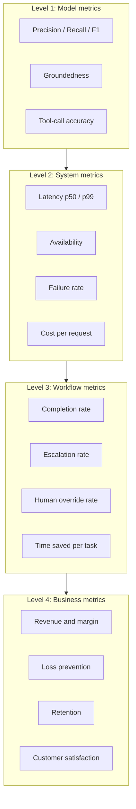

# Product, Business Thinking and Leadership for Senior AI Engineers

This guide expands Phases 14-15 of the roadmap: how a senior AI engineer connects model quality to business value, designs human-in-the-loop systems, leads technically and cross-functionally, defends architecture decisions in plain language, and owns incidents end to end. Everything here is what separates "strong mid-level" from "senior" in interviews and in the job itself.

Part of the [Senior AI Engineer Roadmap](./00-Senior-AI-Engineer-Roadmap.md).

---

## 1. The Questions a Senior Asks Before Writing Code

A junior asks "which model should I use?" A senior asks the following eight questions, and refuses to start building until they have at least provisional answers.

| Question | Why it matters | Example answer you should be able to give |
| --- | --- | --- |
| How much time does this save? | Time saved is the most common justification for AI spend. If it saves 2 minutes per task at 500 tasks/day, that is a quantifiable baseline. | "Claims handlers spend 12 min/document; extraction cuts it to 3 min; 40 handlers x 30 docs/day = 180 saved hours/day." |
| What revenue does it create? | Some AI features drive conversion or upsell rather than efficiency. | "Personalized quotes increase conversion from 4.1% to 4.9% on 100k monthly visitors." |
| What loss does it prevent? | Fraud, risk and compliance systems are valued by avoided loss, not accuracy. | "Catching 15% more fraudulent claims prevents ~$2M/year at current claim volume." |
| What percentage of work can be automated safely? | 100% automation is rarely the goal. The safe-automation percentage defines the human-review budget. | "70% of documents are routine and auto-processed; 30% route to review. That is still a 3x capacity gain." |
| When should the system escalate? | Escalation policy is a product decision, not a model afterthought. | "Escalate below 0.8 confidence, above $10k value, or on any policy-exception flag." |
| Will users trust the output? | An accurate system nobody trusts delivers zero value. Trust requires explanations, citations and consistent behaviour. | "We show source citations and a confidence band; override rate fell from 40% to 12% after adding them." |
| Is the cost per task commercially viable? | A $0.40 LLM call automating a $0.30 human task destroys value. | "Cost per successful task is $0.06 against a fully loaded human cost of $1.80." |
| What happens when the AI is wrong? | The cost and reversibility of errors determines architecture: guardrails, approvals, rollbacks. | "A wrong auto-approval costs the claim amount; wrong denial costs a complaint and rework. So denials always go to a human." |

Practise answering these for every portfolio project you build. In senior interviews, "walk me through the business case" is as common as "design the system."

---

## 2. The Four-Level Metrics Hierarchy

Model metrics do not pay salaries. A senior engineer maintains an explicit chain from model quality to business outcome, and can point to the level where a problem lives.

### Worked example: a claims-processing assistant

Imagine an insurance claims assistant that reads claim documents, extracts fields, checks policy coverage and drafts a decision for a human adjuster.

1. **Model level.** Field-extraction F1 is 0.94; coverage-decision precision is 0.91; groundedness (every claim statement backed by a document span) is 0.96. These say the model is good *in isolation*.
2. **System level.** p95 end-to-end latency is 9 s per claim; availability is 99.7%; schema-validation failures are 1.2% of requests; cost is $0.11 per claim. These say the *service* is dependable and affordable.
3. **Workflow level.** 68% of claims are completed without human edits; 22% are escalated by design (high value or low confidence); adjusters override 6% of auto-drafted decisions; average handling time drops from 18 minutes to 6 minutes. These say the *humans plus system* actually work faster.
4. **Business level.** Claims settled 2.4 days faster; customer-satisfaction score up 9 points; leakage (overpayment) down $1.1M/year; adjuster headcount redeployed to complex claims instead of growing with volume.

The senior skill is diagnosis across levels. If business results stall, you trace backwards: satisfaction flat → because override rate rose → because a new document format broke extraction → model-level recall on that segment fell. A mid-level engineer stares at the F1 dashboard; a senior walks the chain.

---

## 3. Human-in-the-Loop Design

Human review is not an admission of failure — it is a designed component with its own throughput, cost and quality characteristics.

Humans in the loop should: approve high-risk actions, resolve ambiguous cases, correct labels, review low-confidence predictions, handle policy exceptions, and generate feedback data.

### 3.1 Review-queue prioritization

A naive FIFO review queue wastes your scarcest resource: expert attention. Prioritize by a scoring function over five dimensions.

```mermaid
flowchart LR
    P["Prediction + metadata"] --> SC["Priority scorer"]
    SC --> Q["Ranked review queue"]
    Q --> H["Human reviewer"]
    H --> D["Decision + correction"]
    D --> FB["Feedback store"]
    FB --> T["Training / eval data"]
    T --> P
    subgraph Factors["Priority factors"]
        F1["Risk: cost if wrong"]
        F2["Uncertainty: model confidence"]
        F3["Business value: amount at stake"]
        F4["Time sensitivity: SLA deadline"]
        F5["Novelty: out-of-distribution signal"]
    end
    Factors -.-> SC
```

* **Risk** — irreversible or costly actions (payments, denials, medical guidance) always outrank cosmetic ones.
* **Uncertainty** — review effort concentrated near the decision boundary teaches you the most and catches the most errors per review.
* **Business value** — a $50,000 claim earns review before a $50 one at equal confidence.
* **Time sensitivity** — items approaching an SLA deadline get boosted so automation never causes a breach.
* **Novelty** — inputs that look unlike training data (new document template, new merchant category) are exactly where the model is silently unreliable; route them to humans and harvest labels.

### 3.2 Feedback loops as training data

Every human decision is a labelled example. Capture, for each reviewed item: the input, the model output, the human's final decision, what was changed, and a reason code. Then:

1. Route corrections into a versioned feedback dataset.
2. Add systematically failing cases to the offline evaluation suite first (so regressions are caught forever), and to training data second.
3. Watch for feedback bias: reviewers only see queued items, so the feedback set over-represents hard cases. Mix in random samples of auto-approved items to measure silent failure.
4. Report the loop's health: correction rate trend, time-to-incorporate feedback, and eval-set growth.

A senior line for interviews: "The review queue is my labelling pipeline, my safety net, and my drift detector at the same time."

---

## 4. Senior Leadership Behaviours

### Technical leadership

* **Write architecture decision records (ADRs).** One page: context, options considered, decision, consequences. Your future self and new teammates will rely on them.
* **Define engineering standards** — prompt versioning conventions, evaluation gates before deploy, tool-permission patterns — and enforce them through CI, not nagging.
* **Lead design reviews** by asking failure-mode questions: "What happens when the provider times out mid-tool-call?" "Who can see whose documents?"
* **Reduce complexity.** The senior move is often deleting an agent and replacing it with a state machine, or deleting a vector DB and using pgvector.
* **Mentor** by pairing on error analysis and incident reviews, not just code style.

### Cross-functional leadership

You translate between worlds. With **product managers**, convert model behaviour into user-visible trade-offs ("we can auto-answer 60% now or 75% in six weeks with a higher error rate"). With **legal and compliance**, explain data retention, explainability limits and audit trails honestly. With **operations**, design the escalation path and staffing implications of the review queue. With **security**, walk through prompt-injection and tool-abuse scenarios. With **executives**, speak only in levels 3 and 4 of the metrics hierarchy, with level 1-2 evidence in your back pocket. With **domain experts**, treat them as the source of labels, edge cases and error costs — not as an approval formality.

---

## 5. Decisions a Senior Must Be Able to Explain

Each of these is a classic senior-interview prompt. Learn the *shape* of the answer: constraint, evidence, trade-off, decision.

**Why a smaller model is sufficient.**
"Our task is closed-domain extraction with structured outputs. On our 800-case evaluation set, the small model scores within 1 point of the large one, at one-eighth the cost and one-quarter the latency. The large model's advantage shows up on open-ended reasoning we do not need. We keep the large model as a fallback for the 5% of cases the small one flags as low confidence — so we get large-model quality where it matters at small-model cost overall."

**Why RAG is preferable to fine-tuning.**
"Our knowledge changes weekly and must be citable. RAG lets us update by re-indexing documents in minutes, gives per-answer citations for trust and audit, keeps tenant data isolated at retrieval time, and requires no training pipeline. Fine-tuning bakes knowledge into weights: it goes stale, cannot cite sources, risks cross-tenant leakage, and each update means retraining and re-evaluating. We would consider fine-tuning for *style and format* adherence, not for knowledge."

**Why the rule-based system should remain in place.**
"The rules encode regulatory requirements that must be deterministic and explainable — an auditor can read them. They are cheap, fast, and their failure modes are known. The ML model runs alongside to catch what rules miss and to propose new rules from patterns it finds. Replacing working rules with a model adds cost and opacity for no measured gain; the right architecture is rules for hard constraints, model for ranking and grey areas."

**Why a human approval step is required.**
"This action is irreversible and high-cost — issuing a payment. Our model precision is 0.93, which means roughly 1 in 14 auto-approvals would be wrong; at our volumes that is an unacceptable loss and trust risk. The approval step costs 30 seconds of reviewer time and drops effective error rate near zero, while the queue collects labels that will raise precision until we can revisit the threshold. Automation percentage is a dial we turn up with evidence, not a switch."

**Why the model should not yet be deployed.**
"Aggregate metrics pass, but segment analysis shows recall of 0.61 on claims from one region — likely a data-coverage gap — and we have no rollback tested for the prompt change bundled with it. Deploying would trade a visible launch date for an invisible fairness and quality risk. I am blocking until we have segment parity within our threshold and a rehearsed rollback; here is the two-week plan to get there." (Note the structure: block *with* a plan, never just "no.")

**Why a more accurate model may still be commercially worse.**
"Model B is 2 points more accurate but has 3x the latency and 5x the cost per call. At our traffic, that is $40k/month more, and the latency pushes p95 past the point where users abandon the flow — measured abandonment wipes out the value of the accuracy gain. Accuracy is one term in the objective function; the business objective is value per task, which includes cost, latency, trust and error asymmetry. Model A wins on the metric that matters."

---

## 6. Incident Ownership

Seniors are judged by how they behave when the system misbehaves. Incidents you should be prepared to lead: model-provider outage, sudden hallucination increase, cross-tenant data exposure, broken embedding migration, GPU saturation, incorrect automated actions, data drift, unexpected cost increase, corrupted training data.

The universal loop: **detect → triage → mitigate → root-cause → postmortem**. Mitigate *before* you fully understand; understand *before* you close.

### Worked walkthrough: sudden hallucination increase

**Detect.** Monday 09:40, the groundedness scorer on sampled production traffic drops from 0.96 to 0.78; simultaneously the human-override rate alert fires. You did not wait for a customer complaint because groundedness is monitored online — that is the point of AI-specific observability.

**Triage.** Declare an incident, assign roles (you lead, one engineer on data, one on comms). Establish blast radius: which tenants, which workflows, since when? Timeline shows degradation began 08:55 — right after the morning index rebuild. Severity: answers are being generated with wrong citations in a customer-facing product → Sev-2, stakeholders notified in plain language: "Answer quality degraded since 08:55; automated answers paused for affected tenants; no data exposure."

**Mitigate.** Flip the degradation chain you designed in advance: route affected tenants to retrieval-only answers with a "showing sources, summary unavailable" banner, and raise the escalate-to-human threshold. Quality is degraded gracefully instead of confidently wrong. Cost: higher escalation load for a few hours. This took 20 minutes because the fallback path already existed and was tested.

**Root-cause.** Work the RAG failure taxonomy layer by layer: generation prompt unchanged; retrieval recall on the golden set collapsed from 0.92 to 0.40. The overnight embedding-model upgrade re-embedded *queries* with the new model while the index still held *old-model* vectors — a broken embedding migration causing near-random retrieval, which the LLM papered over by hallucinating plausible answers. The model was never the problem; the retrieval layer was.

**Fix and verify.** Roll back the query-embedding version, confirm golden-set recall returns to 0.92 and online groundedness to 0.95, then restore normal routing gradually while watching override rate.

**Postmortem (blameless).** Findings: (1) embedding version was not treated as a jointly-versioned pair between index and query path — fix: single config source with a startup assertion that versions match; (2) index rebuilds had no post-deploy retrieval-recall gate — fix: golden-set check in the rebuild pipeline that blocks cutover; (3) detection worked but took 45 minutes — fix: per-tenant groundedness alerting with tighter windows. Actions get owners and dates. The narrative — "my monitoring caught it, my fallback contained it, my pipeline now prevents it" — is exactly the story to tell in a senior interview.

---

## Best Practices

* Never present a model metric to a business audience without translating it one level up the hierarchy; never accept a business complaint without tracing it one level down.
* Write the eight business questions into every design document template so they cannot be skipped.
* Treat the safe-automation percentage as a dial governed by evidence: start conservative, publish the criteria for raising it, and raise it deliberately.
* Design the human-review queue as a first-class product: prioritization, reviewer UX, feedback capture, and health metrics.
* Mix random audits of auto-approved cases into review so you measure silent failures, not just queued ones.
* Keep a tested degradation chain (fallback model → retrieval-only → human → safe failure) for every AI feature; incidents are mitigated by pre-built paths, not on-the-spot heroics.
* Block deployments with a plan attached — the criteria to unblock and the date you expect to meet them.
* Write ADRs for every consequential decision, especially the ones where you chose the boring option.
* Run blameless postmortems that end with owned, dated actions; close the loop by adding every incident's trigger to the evaluation suite.
* Quantify error asymmetry (false-positive cost vs false-negative cost) before choosing thresholds — accuracy alone hides it.

---

## Interview Questions

Tell me about a time you had to convince stakeholders not to ship an AI feature.

Use the block-with-a-plan pattern. Example answer: "Our claims model passed aggregate accuracy gates, but my segment analysis showed recall of 0.61 for one region — a data-coverage gap that would have meant systematically worse service for those customers and a fairness risk. I brought product and legal a one-page summary: the specific segment numbers, the customer and regulatory impact, and a two-week remediation plan with the exact criteria that would unblock launch. Framing it as 'here is what we need to launch safely, and when' rather than 'no' kept trust; we launched 12 days later with segment parity, and the segment-level gate became a permanent CI check so the conversation never has to happen again."

How do you measure the success of an AI system beyond model accuracy?

Describe the four-level hierarchy with a concrete chain. "I maintain four linked levels: model metrics (precision, groundedness), system metrics (p95 latency, availability, cost per request), workflow metrics (completion rate, escalation rate, human override rate, time saved), and business metrics (loss prevented, retention, satisfaction). For our claims assistant, F1 of 0.94 mattered only because it drove override rate down to 6%, which cut handling time from 18 to 6 minutes, which settled claims 2.4 days faster and reduced leakage by seven figures. The hierarchy also works backwards for diagnosis: when business results stall I trace down the chain to find the level that broke."

A stakeholder asks why you are recommending a cheaper, less accurate model. How do you respond?

"I reframe from accuracy to value per task. The larger model is 2 points more accurate but 5x the cost and 3x the latency; at our volume that is tens of thousands per month, and the latency measurably increases user abandonment — which destroys more value than the accuracy gain creates. I show the evaluation numbers on our own dataset, not benchmarks, and I offer a hybrid: the small model handles everything, and low-confidence cases route to the large model, so we get large-model quality on the hard 5% at near small-model cost. Stakeholders rarely resist when the trade-off is expressed in their units — dollars, conversion, and wait time."

Describe how you would lead an incident where your AI system started making incorrect automated decisions.

"Mitigate first, understand second. I declare the incident, establish blast radius — which tenants, which decisions, since when — and immediately reduce automation: raise confidence thresholds, route affected decision types to the human queue, or pause automation entirely if the actions are irreversible, using the degradation path we built and tested in advance. I communicate early in plain language: what is affected, what users see, what we have done. Then root-cause systematically by layer — data, retrieval, model, prompt, recent deploys — rather than guessing. Once fixed and verified against our golden set, I restore automation gradually while watching override rates. The blameless postmortem produces owned actions, and every triggering case is added to the evaluation suite so the same failure can never ship silently again. I also own the follow-up question: which wrong decisions already executed, and how do we compensate affected users?"

How do you decide what percentage of a workflow to automate?

"It is an error-cost calculation, not a technology limit. I segment the workflow by risk and reversibility: routine, reversible, low-value cases automate first; irreversible or high-value cases keep human approval regardless of model confidence. I set initial thresholds so that expected error cost is well below the value created, publish the criteria for raising automation — sustained precision on audited samples, stable override rates — and treat the percentage as a dial we turn with evidence. In one system we started at 40% automation, and the review queue's feedback data raised model precision enough to reach 70% within two quarters. I also always audit a random sample of automated cases, because a queue-only view hides silent failures."

Tell me about a time you mentored an engineer through an AI-specific problem.

"A mid-level engineer kept iterating on prompts to fix bad RAG answers. Instead of giving the fix, I paired with them on layer-by-layer diagnosis: we checked whether the right document was indexed, whether retrieval returned it, whether reranking kept it, whether it survived context truncation — and found retrieval recall was the real failure; no prompt could fix it. The durable lesson I coached was 'diagnose the layer before changing anything,' and we turned the method into a team runbook and a set of per-layer metrics on the dashboard. Six months later they were running that diagnosis independently and teaching it to a new hire — which is my definition of successful mentoring: the capability outlives my involvement."

How do you handle disagreement with a product manager about AI feature scope?

"I convert the disagreement from opinions into a shared decision framework. When a PM wanted a fully autonomous support agent, rather than arguing feasibility I built a small evaluation set from real tickets and showed the numbers: 62% handled correctly end to end, but the failures included confidently wrong answers on billing — the highest-trust-damage category. I proposed a scoped alternative: automate the 60% of intents where we measured high reliability, draft-plus-human-approve for the rest, with published criteria for expanding autonomy. The PM got a shippable feature sooner; I got a safe system; and the evaluation set became the neutral referee for every future scope debate. The senior behaviour is replacing 'can't' with 'here is what the evidence supports today, and here is the path to more.'"

Why might you keep a legacy rule-based system instead of replacing it with your new model?

"Rules are deterministic, auditable, cheap, and encode hard constraints — often regulatory ones — that must never be violated probabilistically. My model complements rather than replaces them: rules enforce the constraints and catch the known patterns; the model ranks grey areas and surfaces novel patterns that later become new rules. I would only retire a rule when the model demonstrably covers its cases *and* the rule's function is not a compliance requirement. Ripping out working, explainable logic to increase model surface area is complexity-seeking, not seniority; the senior instinct is to minimize the amount of probabilistic behaviour in the system, not maximize it."

What would you do if your AI system's costs doubled month over month?

"Treat it as an incident with a diagnosis phase. First decompose: cost per request times request volume, split by tenant, feature, model and token type. Doubling usually has a concentrated cause — a retry loop hammering the API, a prompt change that ballooned context length, an agent looping without a step cap, cache hit-rate collapse, or one customer's usage pattern. I fix the acute cause, then add the guardrails that were evidently missing: per-feature cost budgets with alerts, maximum-step limits on agents, prompt-size regression checks in CI, and cost-per-successful-task on the main dashboard next to quality. Cost is a first-class metric in the hierarchy — a system that quietly doubles in cost is failing even if accuracy is perfect."

How do you build user trust in an AI system's outputs?

"Trust is earned through verifiability, calibrated confidence, and graceful failure. Concretely: show citations so users can check claims; expose confidence honestly and route low-confidence cases to humans instead of bluffing; keep behaviour consistent across releases with regression evaluation; make errors easy to report and visibly acted upon; and never let the system fail confidently — a clear 'I could not find this' beats a fluent wrong answer. I measure trust through the override rate and acceptance rate, not surveys alone. In one document-assistant rollout, adding citations and an explicit 'insufficient evidence' response cut the override rate from 40% to 12% — same model, same accuracy; the trust work was in the product and honesty layers around the model."

