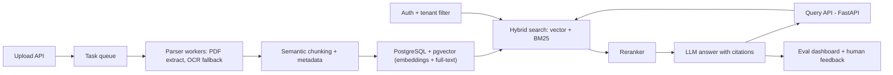
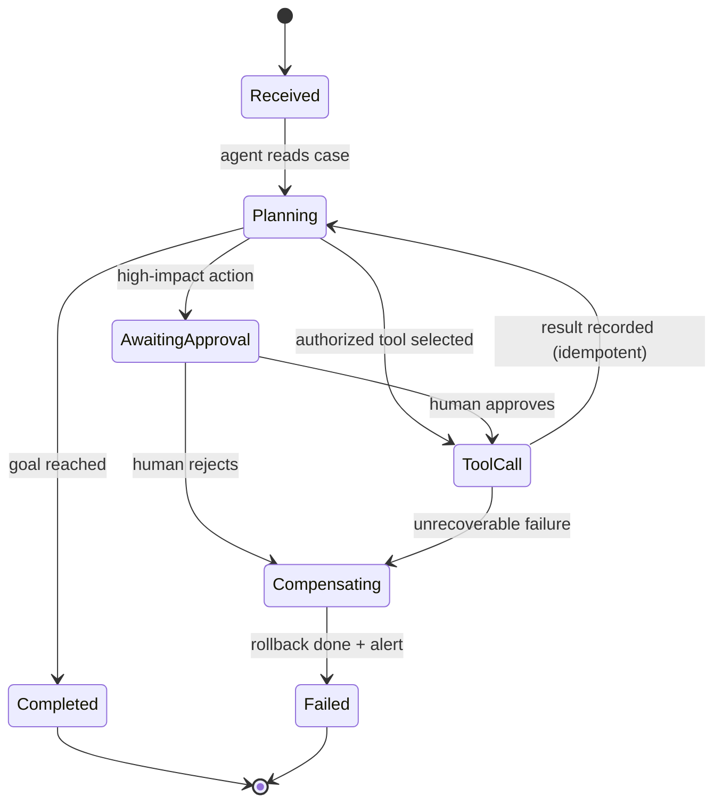
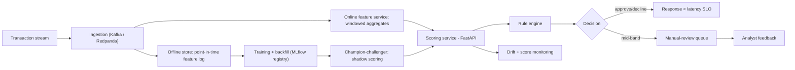
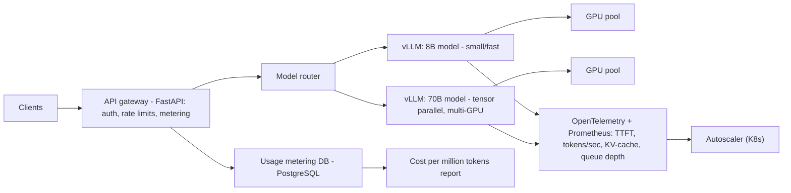
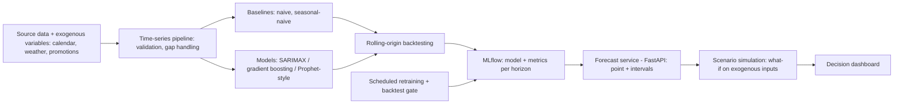

# Portfolio Projects

A senior portfolio is not a pile of weekend demos — it is a small number of systems you built, operated, measured, broke, and fixed. Five production-grade projects, each with real architecture, evaluation, and operational history, will outperform fifty notebooks in any interview. This guide expands the roadmap's five recommended projects into concrete architectures, staged milestone plans, evaluation stories, and the write-ups and interview narratives that turn each project into evidence of senior capability.

Part of the [Senior AI Engineer Roadmap](./00-Senior-AI-Engineer-Roadmap.md) — Section 16.

---

## 1. Philosophy: Fewer, Deeper, Production-Grade

The roadmap's rule is blunt: **build fewer projects, but make each one deep and production-grade.** A demo proves you can call an API. A senior-grade project proves you can own a system.

What separates a senior-grade project from a demo:

| Dimension | Demo | Senior-grade |
| --- | --- | --- |
| Lifespan | Built in a weekend, abandoned | Operated over weeks/months; has uptime and cost history |
| Evaluation | "It seems to work" | Versioned eval datasets, metrics tracked per release |
| Failure | Hidden or never encountered | Documented incidents, runbooks, and fixes |
| Data | Toy dataset, happy path | Ingestion validation, edge cases, deletion, versioning |
| Documentation | README with install steps | Design doc, ADRs, model card, incident write-ups |
| Deployment | `python app.py` | Docker/Kubernetes, CI/CD, monitoring, rollback path |

The strongest interview material is a **failure story with a fix**: "retrieval quality collapsed after re-chunking; my eval suite caught a 12-point faithfulness drop before release; here is the ADR for the fix." That sentence is only possible if the project was evaluated, versioned, and operated. Every milestone plan below is structured to generate those stories: **MVP → production hardening → senior additions.**

---

## 2. Project 1: Enterprise Document Intelligence Platform (RAG)

**Goal:** users upload PDFs and documents, ask questions, and get cited answers scoped to their tenant and permissions.

**Senior capability it proves:** you can build retrieval systems that stay correct as the corpus changes — incremental indexing, deletion propagation, document versioning — and you can *measure* retrieval quality instead of eyeballing it.



**Tech stack:** FastAPI, PostgreSQL + pgvector (vectors, full-text search, and app state in one store), a task queue (Celery/arq) for background parsing, OCR fallback (Tesseract), a cross-encoder reranker, Docker + Kubernetes, MLflow for prompt/model versioning, OpenTelemetry tracing across the retrieve→rerank→generate path.

**Milestones:**

1. **MVP:** upload → parse → chunk → embed → hybrid search → answer with citations. Single tenant. Deliverables: working API, ingestion pipeline with OCR fallback, a 50-question golden eval set with retrieval hit-rate and faithfulness scores.
2. **Production hardening:** tenant isolation and access-controlled retrieval (permission filters applied *inside* the search query, never after generation); background parsing with retries and dead-letter handling; evaluation dashboard; human feedback capture; prompt and model versioning in MLflow. Deliverables: multi-tenant deployment on Kubernetes, per-release eval report, feedback loop feeding the eval set.
3. **Senior additions:** incremental indexing (only changed documents re-embed), deletion propagation with a verification job (deleted docs must be unretrievable within an SLA), document-version handling, prompt-injection defence (retrieved text treated as untrusted), per-tenant cost controls and budgets, canary deployment of prompt/model changes gated by eval scores. Deliverables: ADRs for chunking and index-migration strategy, an incident write-up, canary release pipeline.

**Evaluation story:** retrieval metrics (recall@k, MRR on the golden set), answer metrics (faithfulness/groundedness via LLM-judge validated against human labels, citation accuracy), operational metrics (p95 latency per stage, cost per query, ingestion lag). Track all of them per release; block releases on regression.

**Write up:** the chunking ADR (what you tried, what won, the eval numbers), the deletion-propagation design, tenant-isolation threat model, cost-per-query breakdown.

**Likely follow-ups:** How do you know retrieval got better and not just different? What happens when a user's permissions change after indexing? How do you defend against a document that says "ignore previous instructions"? What breaks first at 10x corpus size?

---

## 3. Project 2: Operational AI Agent

Example domains: insurance claims processing, customer support, field-service or staff scheduling.

**Goal:** an agent that executes real multi-step business workflows — reading records, calling tools, requesting human approval, and completing or compensating reliably.

**Senior capability it proves:** you can make an unreliable component (the LLM) part of a reliable system — durable state, idempotency, authorization, and auditability are the actual product.



**Tech stack:** FastAPI, PostgreSQL as the durable workflow store (every step, tool call, and LLM response persisted — the process can die and resume), an explicit state machine for orchestration, tool layer with per-tool authorization checks, OpenTelemetry for step-level tracing, MLflow for prompt versions, Docker + Kubernetes.

**Milestones:**

1. **MVP:** one workflow end-to-end with 3–5 tools, PostgreSQL-backed state, human approval step for irreversible actions, full audit log of every step. Deliverables: agent completing real cases, replayable audit trail.
2. **Production hardening:** idempotency keys on every tool call (retries never double-execute), retries with backoff, failure recovery (resume from last durable state), permission checks per tool per user, cost tracking per run, agent evaluation harness (scripted scenarios scored on task completion, tool-call correctness, safety). Deliverables: scenario test suite in CI, cost-per-completed-case dashboard.
3. **Senior additions:** state-machine orchestration with compensating transactions (a failed step triggers explicit rollbacks of earlier side effects), tool-level authorization enforced *outside* the prompt, deterministic replay from the audit log for debugging, simulation tests against a mocked environment, adversarial tests (prompt injection via case data, tool-output manipulation), provider failover with behavioral regression checks. Deliverables: chaos/adversarial test report, provider-failover ADR, one incident write-up.

**Evaluation story:** task completion rate on a versioned scenario suite, tool-call precision (correct tool, correct arguments), unsafe-action rate (must be zero for gated actions), human-approval override rate, cost and latency per completed case. The key chart: completion rate vs cost across prompt/model versions.

**Write up:** the state-machine design and why you didn't just loop the LLM, the idempotency and compensation model, the authorization boundary ("the LLM proposes, the system disposes"), replay-based debugging.

**Likely follow-ups:** What happens if the process crashes mid-tool-call? How do you stop the agent from doing something it isn't allowed to, even if the prompt is compromised? How do you test an agent — what does a regression suite look like? When would you refuse to automate a step?

---

## 4. Project 3: Real-Time Fraud or Risk Platform

**Goal:** score streaming transactions in tens of milliseconds, combine model scores with rules, route mid-band cases to human review, and learn from outcomes.

**Senior capability it proves:** training-serving consistency under time pressure — point-in-time correct features, exactly-once-effect processing, and safe model rollout via champion-challenger.



**Tech stack:** Kafka (or Redpanda) for streaming, Redis or an online feature store for windowed aggregates, PostgreSQL for the offline point-in-time feature log and audit, FastAPI scoring service, XGBoost + logistic-regression baseline, MLflow model registry, OpenTelemetry, Docker + Kubernetes. This project extends the Phase 2 risk engine in [05-Classical-Machine-Learning.md](./05-Classical-Machine-Learning.md) into a streaming system.

**Milestones:**

1. **MVP:** streaming ingestion, online features (counts/ratios over sliding windows), model + rule scoring behind one endpoint, manual-review queue, per-decision explainability (top SHAP factors). Deliverables: end-to-end scoring under a stated latency budget, decision audit log.
2. **Production hardening:** model registry with promotion workflow, drift detection on features and score distribution, feedback collection from analyst decisions, shadow deployment of a challenger, load testing against a latency SLO (e.g., p99 < 100 ms). Deliverables: drift dashboard, shadow-mode comparison report, load-test results.
3. **Senior additions:** point-in-time correct training data generated from the logged feature values (never recomputed after the fact), a documented feature-store design (online/offline parity checks), champion-challenger promotion based on production outcomes, threshold tuning from an explicit loss function (cost of FN vs FP), exactly-once-effect processing (idempotent scoring and decision writes under replays), incident runbooks. Deliverables: train/serve skew audit, champion-challenger promotion ADR, at least one runbook exercised in a game day.

**Evaluation story:** PR-AUC and recall-at-fixed-review-capacity offline; in production, expected cost at the operating threshold, alert precision experienced by analysts, feature freshness lag, online/offline feature parity rate, p99 latency. The champion is only replaced when the challenger wins on *production* outcomes, not offline AUC.

**Write up:** why point-in-time correctness matters (with a concrete leakage example you caught), the exactly-once design, the threshold/loss-function derivation, the promotion criteria.

**Likely follow-ups:** How do you guarantee the features at training time match what serving saw? What happens when Kafka replays a partition? Why did you pick that threshold? How do you roll back a bad model at 2 a.m.?

---

## 5. Project 4: Self-Hosted LLM Serving Platform

**Goal:** serve open-weight models on your own GPUs behind an authenticated, metered, observable API — and answer, with data, when self-hosting beats a provider.

**Senior capability it proves:** inference-infrastructure literacy — throughput/latency trade-offs, GPU economics, and capacity planning, expressed as **cost per million tokens**.



**Tech stack:** vLLM (continuous batching, paged KV cache), Kubernetes with GPU nodes, FastAPI gateway (API keys, rate limiting, streaming passthrough), PostgreSQL for usage metering, Prometheus/Grafana + OpenTelemetry, k6 or Locust for load tests, quantized variants (AWQ/GPTQ/FP8) for comparison.

**Milestones:**

1. **MVP:** one open-weight model on vLLM on a GPU (cloud spot instance is fine), streaming completions through an authenticated gateway, basic token metering per key. Deliverables: OpenAI-compatible endpoint, per-key usage report.
2. **Production hardening:** rate limiting, model routing (small model default, large model on demand), prompt/prefix caching, Kubernetes deployment with health checks and graceful drain, dashboards for TTFT, inter-token latency, tokens/sec, GPU utilization, queue depth. Deliverables: load-test report (throughput vs latency curves at increasing concurrency), autoscaling policy.
3. **Senior additions:** multi-GPU inference (tensor parallelism) for a larger model, quantized-vs-full-precision comparison (quality on an eval set vs throughput vs VRAM), continuous-batching analysis (how batch composition moves TTFT and tokens/sec), a defensible **cost-per-million-tokens** model (GPU-hour price x utilization vs tokens served), provider-vs-self-hosted breakeven analysis, graceful degradation under overload (shed load, shrink max context, route to smaller model). Deliverables: cost model spreadsheet + write-up, degradation runbook, quantization eval report.

**Evaluation story:** two axes — *performance* (TTFT p50/p99, tokens/sec per GPU, max sustainable concurrency from load tests) and *economics* (cost per million input/output tokens at measured utilization, breakeven volume vs API providers). Plus quality: the quantized model must hold within a stated tolerance on your eval set before it serves traffic.

**Write up:** the load-test methodology and curves, the cost model with assumptions stated, the quantization decision, what actually limited throughput (it is usually memory bandwidth and KV cache, not compute).

**Likely follow-ups:** Walk me through cost per million tokens — what assumptions dominate? Why continuous batching over static batching? When would you tell a company *not* to self-host? What did your load tests reveal that surprised you?

---

## 6. Project 5: Forecasting and Decision Platform

Example domains: hospital staffing demand, infrastructure risk, revenue forecasting, inventory planning.

**Goal:** forecast a real operational quantity with honest uncertainty, and turn forecasts into decisions via scenario simulation.

**Senior capability it proves:** statistical honesty — backtesting without leakage, calibrated prediction intervals, and communicating uncertainty to decision-makers instead of a single misleading number.



**Tech stack:** pandas/statsmodels + gradient boosting (with lag/rolling features) for models, conformal or quantile methods for intervals, FastAPI forecast service, PostgreSQL for history and forecast versions, MLflow for per-horizon metrics, scheduled retraining (cron/Airflow), Docker, a dashboard (Grafana or Streamlit).

**Milestones:**

1. **MVP:** ingestion + validation for one real series, naive and seasonal-naive baselines, one real model, rolling-origin backtesting comparing all of them per horizon. Deliverables: backtest report where the model demonstrably beats the baseline (or an honest note that it doesn't yet).
2. **Production hardening:** prediction intervals with measured empirical coverage (a "90% interval" must contain ~90% of actuals in backtests), exogenous variables handled point-in-time (only information available at forecast time), per-prediction explainability, scheduled retraining gated by a backtest, forecast-version storage so every past forecast can be compared to what actually happened. Deliverables: coverage report, forecast-vs-actual dashboard.
3. **Senior additions:** scenario simulation ("what if demand spikes 20%?", "what if the promotion runs?") by perturbing exogenous inputs and propagating intervals, decision layer mapping forecasts + costs to a recommendation (staffing levels, order quantities), monitoring for series drift and forecast degradation with automatic alerts. Deliverables: scenario UI/API, a decision memo showing money or hours saved vs the baseline policy, degradation runbook.

**Evaluation story:** MASE/sMAPE vs the seasonal-naive baseline per horizon (never absolute error alone), pinball loss and empirical interval coverage, and a decision-level metric: cost of acting on the model's forecasts vs acting on the baseline. Backtests use rolling origins only — a random split on a time series is an automatic interview fail.

**Write up:** the backtesting protocol, how intervals were produced and validated, one case where the model was confidently wrong and what you changed, the decision-layer cost analysis.

**Likely follow-ups:** How do you know your 90% intervals are really 90%? Why is beating seasonal-naive hard, and did you? How do you avoid leaking future exogenous data? How would a planner actually use this?

---

## 7. Documenting and Presenting the Projects

The documentation *is* part of the project — it is what interviewers actually read.

- **Design doc (per project):** problem, constraints, architecture diagram, alternatives considered and rejected, SLOs, failure modes. One page beats ten.
- **Architecture Decision Records:** short dated notes — context, decision, alternatives, consequences. Aim for 3–5 per project ("chose pgvector over a dedicated vector DB because…"). ADRs show *judgment*, which is the thing senior interviews probe.
- **Model cards:** intended use, training data, per-segment metrics, limitations, fairness notes — for every model that makes decisions about people (mandatory for the fraud platform).
- **Incident write-ups:** at least one real (or deliberately induced game-day) incident per operated project: timeline, impact, root cause, fix, prevention. Nothing signals seniority faster.
- **Eval reports:** versioned metrics per release, so you can show a graph of quality over time instead of claiming it.
- **Demo strategy:** a 3-minute recorded demo per project (live demos fail), a README that leads with the architecture diagram and metrics rather than install steps, and a rehearsed 5-minute narrative: problem → constraint → architecture → hardest failure → measured result. Practice answering "what would you change if you rebuilt it?" — have a real answer.

A README skeleton that interviews well:

```text
# <Project name> — one-line value statement
1. What it does and for whom (2 sentences)
2. Architecture diagram (Mermaid) + 3 bullets on key decisions
3. Metrics table: quality, latency p95, cost per unit, uptime
4. The hardest problem and how it was solved (link to ADR)
5. Evaluation: how quality is measured, link to eval reports
6. Operations: incidents, runbooks, monitoring screenshots
7. Running it locally (last, not first)
```

And a minimal ADR template — one page, written the day the decision is made:

```text
# ADR-004: pgvector over dedicated vector database   (2026-07-24, accepted)
Context:  multi-tenant RAG, ~2M chunks, transactional deletes required
Decision: PostgreSQL + pgvector as the single store for vectors + metadata
Alternatives: Qdrant (faster ANN, second system to operate),
              OpenSearch (hybrid built-in, heavier ops)
Consequences: simpler deletes/tenancy via SQL; revisit past ~10M vectors
```

## 8. Mapping to the 18-Month Progression

The five projects are sequenced deliberately across the roadmap's Section 17 timeline:

| Months | Phase focus | Project work |
| --- | --- | --- |
| 1–3 | Classical ML | **Project 3 core:** the risk/classification engine (offline first) |
| 4–6 | Deep learning | Deep-learning service; feeds later serving skills |
| 7–9 | Applied generative AI | **Projects 1 and 2:** document platform + operational agent (MVP → hardening) |
| 10–12 | Evaluation and MLOps | Retrofit eval-driven releases onto Projects 1–3; make Project 3 streaming with champion-challenger |
| 13–15 | Serving and infrastructure | **Project 4:** self-hosted serving platform; route Projects 1–2 through it |
| 16–18 | Senior ownership | **Project 5** plus flagship polish: pick one project, give it users, operational history, cost data, and full documentation |

Notice the compounding: the fraud engine grows from a batch model into a streaming platform; the RAG and agent projects become the first customers of your serving platform; every project gains the evaluation and deployment discipline of months 10–12. By month 18, one project should be the **flagship** — with real users, uptime history, metrics, and the full documentation set — because "tell me about a system you owned end to end" is the senior interview, and that project is your answer.

---

## Best Practices

- Depth beats breadth: five operated systems outweigh twenty demos. Delete or archive anything you cannot defend in depth.
- Every project ships an evaluation harness before it ships features. If quality is not measured, "it works" is an opinion.
- Operate what you build: keep at least the flagship running, collect cost and uptime data, and run a game day so you have a genuine incident write-up.
- Prefer boring, defensible infrastructure (FastAPI, PostgreSQL + pgvector, Docker, Kubernetes, MLflow, OpenTelemetry) — interviews reward reasoning about trade-offs, not exotic tools.
- Write ADRs at decision time, not retroactively. Rejected alternatives are the most valuable part.
- Track cost per unit (per query, per completed case, per million tokens, per forecast) from day one — senior conversations always reach economics.
- Keep security in scope: tenant isolation, tool authorization, prompt-injection defence, and audit logs are features, not afterthoughts.
- Lead every README with the architecture diagram, the metrics, and the hardest problem solved — not the install instructions.

## Interview Questions

<details><summary>Walk me through the architecture of your most complex project. Why these components?</summary>
Structure the answer as: problem and constraints first ("multi-tenant document QA, permissioned retrieval, corpus changes daily"), then the diagram left to right along the data path, then justify the two or three contentious choices with trade-offs ("pgvector over a dedicated vector DB: one system of record, transactional deletes for deletion propagation, and our scale fits — the trade-off is ANN performance at very large scale, and my measured break-point is roughly N vectors"). End with what you would change on a rebuild. Naming the rejected alternatives and the break-points is what makes the answer senior.
</details>

<details><summary>How do you know your RAG system actually works? Prove it.</summary>
Point to the evaluation harness, not a demo: a versioned golden set of question–answer–source triples; retrieval measured with recall@k and MRR; generation measured with faithfulness and citation accuracy via an LLM judge that was validated against human labels; all metrics tracked per release with regressions blocking deploys. Then give a concrete save: "the eval caught a 12-point retrieval drop from a chunking change before it reached users." Production telemetry (feedback rate, unanswered-question rate) closes the loop by feeding new hard cases into the golden set.
</details>

<details><summary>Your agent calls tools that move money or change records. How do you make that safe?</summary>
Defence in depth, none of it in the prompt: tool-level authorization enforced by the platform (the agent can only invoke tools the acting user is permitted to use, checked server-side per call); human approval gates for irreversible or high-value actions; idempotency keys so retries never double-execute; compensating transactions for multi-step rollback; a complete audit log enabling deterministic replay; and adversarial tests where injected case data tries to steer the agent. The principle to state: the LLM proposes, the system disposes — safety properties must hold even if the model is fully compromised.
</details>

<details><summary>Explain point-in-time correctness in your fraud platform. What goes wrong without it?</summary>
Training features must equal what the serving system knew at decision time. I log the exact online feature values at scoring time and train from that log, rather than recomputing aggregates later — recomputation silently includes future events (label-adjacent transactions, chargebacks) and inflates offline metrics that then collapse in production. Back it with a concrete catch: a windowed count recomputed from the warehouse included same-day later transactions and looked several PR-AUC points better than reality; the online/offline parity check is what exposed it. This is the classic train/serve skew story interviewers want.
</details>

<details><summary>Defend your cost-per-million-tokens number. When is self-hosting the wrong call?</summary>
Show the model: GPU-hour price times fleet size, divided by tokens actually served at measured utilization — not theoretical peak throughput. State the dominating assumptions: utilization (idle GPUs destroy the economics), input/output token mix, and batch-friendliness of traffic. From load tests, give tokens/sec per GPU at the latency SLO, then the breakeven volume against provider pricing. Self-hosting is wrong below that volume, with spiky low-utilization traffic, without ops capacity for GPU infrastructure, or when frontier-model quality is required — saying this unprompted demonstrates judgment rather than enthusiasm.
</details>

<details><summary>How did you validate your prediction intervals, and why do intervals matter more than the point forecast?</summary>
Empirical coverage in rolling-origin backtests: a claimed 90% interval must contain roughly 90% of held-out actuals, per horizon — conformal or quantile methods, checked, not assumed. Intervals matter because the decision layer consumes them: staffing to the 90th percentile of demand is a different (and defensible) decision from staffing to the mean, and the asymmetric costs of under- vs over-provisioning are only expressible with uncertainty. Add the honesty markers: the model is compared against seasonal-naive with MASE, and there is a documented case where the model was confidently wrong and what changed as a result.
</details>

<details><summary>Tell me about an incident in one of your projects. What did you change afterward?</summary>
Use the write-up structure: symptom and detection ("faithfulness alert fired after an embedding-model upgrade"), impact and scope, root cause ("re-indexed corpus with new embeddings while queries still used the old model — mixed-space retrieval"), immediate mitigation (rollback), and prevention (index versioning tied to embedding-model version, canary re-index with eval gate, a runbook). If the incident was from a deliberate game day, say so — inducing failures on purpose to test recovery is itself a senior signal. The worst answer is "nothing ever broke": it means the system was never really operated.
</details>

<details><summary>You have five projects. Which one is your flagship, and why should we believe it is production-grade?</summary>
Pick one and prove operation, not intention: how long it has run, real or realistic users, uptime and p95 latency, cost per unit served, eval scores across releases, and the documentation trail — design doc, ADRs, model card, incident write-ups. Then differentiate the rest in one line each ("the serving platform proves infrastructure depth; the agent proves reliability engineering around LLMs"). The meta-signal interviewers seek: you chose depth over breadth deliberately, you measure what you claim, and you can say precisely what you would rebuild differently.
</details>
