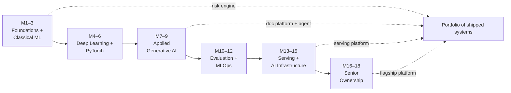
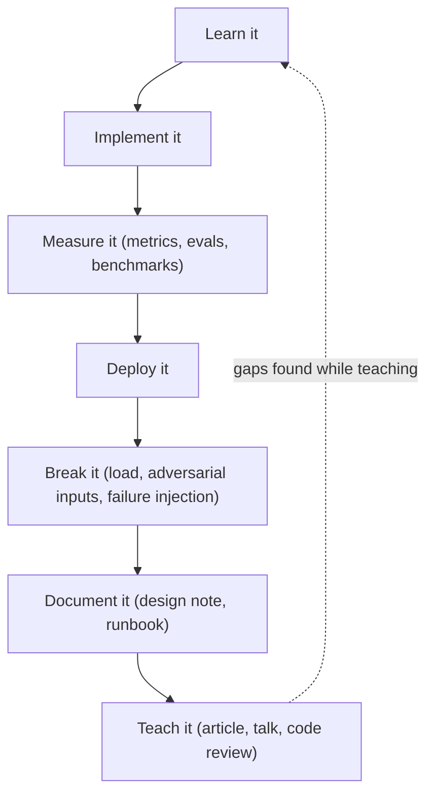

# Study Plan and Readiness Checklist

Knowing what to learn is the easy half; the hard half is sequencing it, sustaining it around a full-time job, and knowing when you have actually crossed the senior bar rather than just accumulated tutorials. This guide turns the roadmap's final sections into an operational plan: an 18-month progression mapped to the other twenty guides in this folder, a weekly cadence that survives real life, a research-literacy method, the technology stack worth mastering, the anti-patterns that quietly cap careers, and a checklist you can literally tick off.

Treat the timeline as a competency sequence, not a promotion schedule. You are done with a block when you have shipped its output and can defend it under questioning — not when the calendar says so.

Part of the [Senior AI Engineer Roadmap](./00-Senior-AI-Engineer-Roadmap.md) — Sections 17–22.

---

## 1. The 18-Month Progression

Each quarter has a focus, a concrete shipped output, and the guides in this folder to study alongside the building. The outputs are non-negotiable: a quarter without a deployed artifact is a quarter of reading, not progress.

| Months | Focus | Primary guides | Shipped output |
| --- | --- | --- | --- |
| 1–3 | Mathematical refresh, scientific Python, scikit-learn, feature engineering, honest evaluation, MLflow | [01 Python](./01-Python-for-AI-Engineering.md), [02 Mathematics](./02-Mathematics-for-AI.md), [03 Probability & Statistics](./03-Probability-and-Statistics-for-AI.md), [04 SQL & Data Engineering](./04-SQL-and-Data-Engineering-for-ML.md), [05 Classical ML](./05-Classical-Machine-Learning.md) | Production-grade risk or classification system (calibrated, threshold-tuned, audited) |
| 4–6 | Neural networks, backpropagation, PyTorch, CNNs, transformers, GPU basics, first fine-tuning | [06 Deep Learning](./06-Deep-Learning-with-PyTorch.md), [07 NLP & Transformers](./07-NLP-and-Transformers.md), [14 GPU & Distributed](./14-GPU-and-Distributed-AI-Systems.md) (fundamentals only) | Deep-learning service with a training pipeline and a deployment pipeline |
| 7–9 | Structured generation, RAG, hybrid search, reranking, tool calling, constrained agents, multimodal | [08 GenAI Applications](./08-GenAI-Application-Engineering.md), [09 RAG](./09-Retrieval-Augmented-Generation.md), [10 Agents, Memory & Multimodal](./10-Agentic-Systems-Memory-and-Multimodal.md) | Enterprise document platform plus one operational agent |
| 10–12 | Evaluation datasets, LLM/agent evaluation, model registry, prompt versioning, CI/CD, drift, shadow/canary | [11 Evaluation Engineering](./11-AI-Evaluation-Engineering.md), [12 MLOps & LLMOps](./12-MLOps-and-LLMOps.md) | Evaluation-driven release pipeline gating every model and prompt change |
| 13–15 | vLLM, Ray Serve, Kubernetes, GPU scheduling, quantization, batching, load testing, observability | [13 Serving & Inference](./13-Model-Serving-and-Inference-Optimization.md), [14 GPU & Distributed](./14-GPU-and-Distributed-AI-Systems.md), [15 Cloud & Kubernetes](./15-Cloud-Kubernetes-and-Infrastructure-for-AI.md), [16 Observability](./16-AI-Observability-and-Reliability.md) | Self-hosted model-serving platform with published latency/throughput numbers |
| 16–18 | Architecture leadership, security, governance, cost engineering, incident response, mentoring, design docs, business metrics | [17 Security & Governance](./17-AI-Security-Privacy-and-Governance.md), [18 AI System Design](./18-AI-System-Design.md), [19 Product & Leadership](./19-Product-Business-and-Leadership.md), [20 Portfolio Projects](./20-Portfolio-Projects.md) | One flagship AI platform with real users, operational history, metrics, and architecture documentation |

Notes on using the table:

- **Backend engineers can compress months 1–3** on the Python/SQL side but should not skip the statistics and evaluation material — that is usually the actual gap (see roadmap Section 23).
- **Guides are re-entrant.** You will revisit [11 Evaluation](./11-AI-Evaluation-Engineering.md) and [16 Observability](./16-AI-Observability-and-Reliability.md) in every later quarter; the table lists where each guide gets its deepest first pass.
- **If a quarter slips, ship a smaller output rather than skipping it.** A modest deployed system beats an ambitious unfinished one in every interview and every performance review.

---

## 2. Weekly Structure

The sustainable weekly split from the roadmap:

| Activity | Share | What it looks like |
| --- | ---: | --- |
| Building production projects | 45% | Writing, deploying, and operating the quarter's output system |
| Theory and mathematics | 20% | Working through the relevant guide, deriving, implementing from scratch |
| Reading documentation and papers | 15% | One paper plus primary docs for the tools in use |
| Evaluation and experimentation | 10% | Running and extending eval suites, error analysis, A/B or shadow results |
| Writing and teaching | 10% | Articles, design docs, recorded explanations, open-source PRs |

### A realistic week alongside a full-time job

Assume roughly 12 focused hours per week. A workable pattern:

| Slot | Hours | Activity |
| --- | ---: | --- |
| Mon evening | 1.5 | Theory: current guide section, with a from-scratch implementation |
| Tue evening | 1.5 | Building: project feature work |
| Wed evening | 1.0 | Paper: one pass with the 10-item extraction list (Section 3) |
| Thu evening | 1.5 | Building: project feature work |
| Sat morning | 4.0 | Building: the week's main block — deploy, load test, break things |
| Sat afternoon | 1.0 | Evaluation: run evals on the week's changes, error analysis |
| Sun morning | 1.5 | Writing: document the week — design note, article draft, README |

Two rules make this stick. First, **building gets the protected long block** (Saturday morning); theory and reading can survive fragmentation, deployment work cannot. Second, **the writing hour is not optional** — it is the cheapest test of whether you actually understood the week.

### The concept loop

For every major concept, run the full loop before declaring it learned:

Most engineers stop at "implement". The senior differentiators are the last four steps: measurement forces honesty, deployment forces engineering, breaking forces humility, and teaching exposes every gap you papered over. If you cannot explain it to a colleague without hand-waving, you are not done with it.

---

## 3. Research Literacy

You do not need to be a researcher, but you must read papers efficiently — the field moves too fast for secondhand summaries alone.

### The 10-item extraction list

For every paper, force yourself to write one line for each:

1. **Problem** — what is broken or missing?
2. **Previous approach** — what did people do before, and why was it insufficient?
3. **Core contribution** — the one idea that makes this paper matter.
4. **Architecture** — what does the model/system actually look like?
5. **Training objective** — what loss is optimized, on what signal?
6. **Dataset** — what was it trained and tested on?
7. **Evaluation method** — how do they claim to know it works?
8. **Ablations** — which components actually carry the improvement?
9. **Limitations** — what do the authors admit, and what do they omit?
10. **Production relevance** — does this change anything you would build today?

If you cannot fill in item 10, the paper goes in the archive, not the to-implement list. Implement selected ideas rather than only collecting papers — one reimplemented technique teaches more than twenty skimmed PDFs.

### Key topic families

Attention and transformers, representation learning, retrieval, dense embeddings, reranking, parameter-efficient fine-tuning, quantization, scaling laws, mixture-of-experts, reinforcement learning from feedback, tool-using agents, time-series forecasting, graph neural networks, model evaluation, interpretability.

### Starter reading list — ten canonical papers

| Paper | Why it matters |
| --- | --- |
| Attention Is All You Need (2017) | The transformer itself; everything after is a variation on this architecture |
| BERT (2018) | Pretrain-then-fine-tune with bidirectional encoders; still the mental model for encoder/embedding systems |
| GPT-3: Language Models are Few-Shot Learners (2020) | Scale plus in-context learning; why prompting works at all |
| Chinchilla: Training Compute-Optimal LLMs (2022) | Scaling laws done right — the compute/data trade-off behind every modern model's size |
| InstructGPT (2022) | RLHF: how raw language models become helpful assistants; the alignment recipe |
| LoRA (2021) | Parameter-efficient fine-tuning; why you can adapt a 70B model on one GPU |
| RAG: Retrieval-Augmented Generation (2020) | The original argument for grounding generation in retrieved evidence |
| FlashAttention (2022) | IO-aware exact attention; the canonical example of hardware-aware algorithm design |
| Chain-of-Thought Prompting (2022) | Eliciting intermediate reasoning; the foundation of test-time compute techniques |
| ReAct (2022) | Interleaving reasoning and tool actions; the pattern under every practical agent |

Read them in roughly this order across months 4–12, one per week or fortnight, each through the 10-item list.

---

## 4. Technologies to Master

The stack below is deliberately boring and durable. Depth in these beats breadth across every new framework.

### Core

| Technology | Why |
| --- | --- |
| Python | The language of the entire ecosystem; production fluency, not just scripts |
| SQL | Most ML value still starts with getting the right rows out of a database |
| PostgreSQL | One database that covers OLTP, audit logs, and (with pgvector) retrieval |
| NumPy | The array model underneath everything, including PyTorch semantics |
| Pandas or Polars | Tabular wrangling for features, evals, and error analysis |
| Scikit-learn | Baselines, pipelines, calibration — the discipline layer of ML |
| PyTorch | The lingua franca of model training and internals |
| FastAPI | Standard Python service layer for model and agent APIs |
| Docker | The unit of reproducible deployment |
| Git | Versioning code — and by extension prompts, configs, and eval sets |

### Applied AI

| Technology | Why |
| --- | --- |
| Transformers (HF) | Load, fine-tune, and inspect virtually any open model |
| Datasets (HF) | Reproducible, versioned dataset handling at scale |
| PEFT | LoRA/QLoRA adapters — fine-tuning within realistic budgets |
| Embeddings | The representation layer of search, RAG, clustering, and dedup |
| pgvector | Vector search inside the database you already operate |
| OpenSearch | BM25 + vectors for hybrid retrieval at scale |
| Structured outputs | Schema-constrained generation; the difference between demo and API |
| Tool calling | The primitive under every agent and integration |
| RAG | The default pattern for grounding models in private data |
| Agent orchestration | Constrained multi-step workflows — patterns, not one framework |

### MLOps

| Technology | Why |
| --- | --- |
| MLflow | Experiment tracking and model registry with lineage |
| Airflow or Prefect | Scheduled, retryable data and training pipelines |
| Object storage (S3-style) | Artifacts, datasets, and checkpoints live here |
| GitHub Actions | CI/CD, including eval gates on model and prompt changes |
| Terraform | Infrastructure you can review, reproduce, and roll back |
| Kubernetes | The substrate for scaling training and serving workloads |
| Argo CD | GitOps delivery — the cluster converges on what Git says |
| Prometheus | Metrics collection and alerting |
| Grafana | Dashboards the on-call engineer actually looks at |
| OpenTelemetry | Vendor-neutral traces across gateway, retrieval, and model calls |

### Serving

| Technology | Why |
| --- | --- |
| vLLM | High-throughput LLM inference (PagedAttention, continuous batching) |
| Ray Serve | Composable, autoscaling Python serving graphs |
| NVIDIA Triton | Multi-framework, multi-model GPU serving with dynamic batching |
| Redis | Caching, rate limits, queues, session state at low latency |
| Kafka or RabbitMQ | Async and streaming inference decoupled from request paths |

### Optional advanced

| Technology | Why |
| --- | --- |
| Spark / Databricks | Feature and training data at scales Pandas cannot touch |
| dbt | Tested, versioned SQL transformations |
| Feast | Feature store with online/offline consistency |
| Kubeflow / KServe | Kubernetes-native training and serving control planes |
| ONNX / TensorRT | Graph export and compiled GPU inference for latency-critical paths |
| CUDA | Reading and reasoning about kernels when profiling says you must |
| DeepSpeed | Large-scale distributed training and memory optimization |

**The framework-chasing warning.** Do not attempt to master every orchestration or agent framework — frameworks change quarterly. The durable knowledge is what all of them are wrappers around: **state, data flow, evaluation, permissions, reliability, distributed execution, and model behaviour**. Learn those once and every new framework is a two-day read; skip them and every new framework is a fresh start.

---

## 5. Anti-Patterns: What to Avoid

Each of these is common, career-capping, and correctable with a specific habit.

| Anti-pattern | Failure mode | Corrective habit |
| --- | --- | --- |
| **API-only engineer** | Can call model APIs but cannot debug retrieval, evaluate quality, or explain model behaviour; replaceable by a code generator | For every API you call, learn one layer beneath it: data, evaluation, model internals, infrastructure, security |
| **Framework chasing** | Rebuilds projects every time a new agent framework trends; portfolio of restarts, no operational history | Pick boring tools, ship, and only migrate when a framework solves a measured problem you actually have |
| **Notebook-only development** | Work dies in `untitled_final_v3.ipynb`; nothing is tested, deployed, or owned | Every project graduates to a package with tests, CI, a Dockerfile, and monitoring — notebooks are for exploration only |
| **Starting with fine-tuning** | Weeks of GPU spend before a baseline exists; no way to tell if it helped | In order: (1) baseline, (2) reliable eval dataset, (3) strong retrieval/prompting, (4) a written reason fine-tuning is still required |
| **Demos without evaluation** | A demo proves it worked once; production asks how often and where it fails — silence | No feature ships without an eval set and a number; build the eval before the feature when possible |
| **Unnecessary agents** | Autonomous loops where a state machine would do; unbounded cost and failure modes | Default to deterministic workflows, queues, and rules, with a single model decision at a controlled point; add autonomy only when the task genuinely requires it |
| **Ignoring cost** | Beautiful system, unsustainable unit economics discovered by finance, not engineering | Track cost per request, per task, per successful task, per customer, GPU utilization, and human-review cost from day one |

A quick self-test: if your last three months produced more repository scaffolds than deployed endpoints, you are framework chasing; if you cannot state your system's failure rate, you are demoing; if you cannot state its cost per successful task, you are ignoring cost.

---

## 6. Senior Readiness Checklist

You are approaching senior readiness when you can confidently do all of the following. Check items only when you have **done them on a real system**, not merely read about them.

### Modelling

- [ ] Build strong baselines before any complex model
- [ ] Select metrics suited to the problem and its costs
- [ ] Detect data leakage in features, splits, and preprocessing
- [ ] Tune decision thresholds against business cost
- [ ] Run systematic error analysis after every training run
- [ ] Explain model trade-offs to technical and non-technical audiences
- [ ] Train and fine-tune neural networks end to end

### Generative AI

- [ ] Design reliable RAG with measured retrieval quality
- [ ] Build constrained agents with bounded actions and budgets
- [ ] Create schema-validated structured outputs
- [ ] Implement tool permissions and authorization boundaries
- [ ] Evaluate retrieval and generation separately
- [ ] Defend against prompt injection and untrusted content

### Data

- [ ] Build reproducible, versioned datasets
- [ ] Implement point-in-time correct joins
- [ ] Validate data quality automatically on ingestion
- [ ] Detect and respond to data and concept drift
- [ ] Design feedback loops that improve the system safely
- [ ] Track lineage from raw data to deployed model

### Systems

- [ ] Design both online and batch inference paths
- [ ] Operate queues and durable workflows
- [ ] Deploy containerized services with health checks and rollbacks
- [ ] Scale Kubernetes workloads, including GPU scheduling
- [ ] Profile GPU workloads and identify bottlenecks
- [ ] Optimize latency and throughput with data to prove it

### Operations

- [ ] Version models, prompts, and eval sets together
- [ ] Build CI/CD with evaluation gates
- [ ] Create observability covering AI-specific signals
- [ ] Run canary and shadow deployments
- [ ] Roll back safely under pressure
- [ ] Lead incidents end to end, including the postmortem

### Business

- [ ] Define success metrics tied to business outcomes
- [ ] Quantify the cost of each error type
- [ ] Measure automation value against the human alternative
- [ ] Communicate model limitations honestly to stakeholders
- [ ] Decide where humans must remain in the loop, and design for it

### Leadership

- [ ] Lead architecture reviews
- [ ] Mentor engineers with measurable growth
- [ ] Write design documents that survive review
- [ ] Make and defend build-versus-buy decisions
- [ ] Coordinate across product, security, and operations
- [ ] Own outcomes after deployment, not just delivery

---

## 7. Your Positioning Statement

The end state of this track is being able to say, truthfully:

> I design and operate production AI systems end to end — from data and model evaluation to agent workflows, backend integration, GPU inference, observability, security and business outcomes.

That is considerably stronger than "I build chatbots" — but only if every clause is backed by evidence. Map each claim to an artifact:

- **"Data and model evaluation"** → the risk engine (months 1–3) and the evaluation-driven release pipeline (months 10–12), with eval sets and metrics in the repo.
- **"Agent workflows"** → the operational agent (months 7–9) with tool permissions, budgets, and an eval harness.
- **"Backend integration"** → FastAPI services, queues, and audit logs across every project.
- **"GPU inference"** → the self-hosted serving platform (months 13–15) with published latency/throughput/load-test numbers.
- **"Observability, security"** → dashboards, traces, injection defences, and at least one documented incident with a postmortem.
- **"Business outcomes"** → the flagship platform (months 16–18) with a metrics hierarchy, cost per successful task, and real usage history.

In an interview, deliver the statement, then immediately offer one concrete story per clause. Evidence, not adjectives, is what makes "senior" credible.

---

## Best Practices

- Treat the 18 months as a competency sequence: exit a quarter on shipped output and defensible understanding, never on elapsed time.
- Protect one long weekly building block; deployment and load testing do not survive being sliced into 30-minute fragments.
- Keep the 45/20/15/10/10 split honest — most drift is toward 80% reading and 0% writing, which produces knowledge you cannot demonstrate.
- Run every major concept through the full learn → implement → measure → deploy → break → document → teach loop; teaching is the test, not the reward.
- Read one paper per week through the 10-item extraction list, and implement roughly one in ten — implementation is what converts reading into skill.
- Master the boring durable stack (Python, SQL, PostgreSQL, PyTorch, Docker, Kubernetes, MLflow) before touching optional advanced tools.
- Audit yourself against the anti-pattern table monthly; the failure modes are gradual and invisible from the inside.
- Revisit the readiness checklist quarterly and check items only on real-system evidence — the unchecked items are your next quarter's syllabus.
- Maintain the positioning statement as a living document: every project should strengthen the evidence behind at least one clause.

## Interview Questions

How do you know you are done with a phase of study rather than just familiar with it?

Done means the full concept loop is closed: you implemented it, measured it with honest metrics, deployed it somewhere real, broke it deliberately (load, adversarial input, failure injection), documented it, and taught it to someone else without hand-waving. Familiarity is stopping after "learn" or "implement". The practical test: can you produce the shipped artifact, state its failure modes and costs from memory, and answer follow-up questions about why it behaves as it does? If the quarter's output system does not exist, the quarter is not finished regardless of how much you read.

What would you build first on a brand-new AI problem, and what does that reveal about seniority?

A dumb baseline and an evaluation dataset — before any model work, and long before fine-tuning. The roadmap's ordering is explicit: baseline, reliable evals, strong retrieval or prompting, and only then a written justification for fine-tuning. Juniors reach for the most powerful technique first; seniors reach for the measurement that will tell them whether any technique is working. If you cannot articulate what number the baseline sets and what number would justify each escalation in complexity, you are demoing, not engineering.

How do you read a research paper efficiently, and how do you decide whether it changes what you build?

One structured pass extracting ten items: problem, previous approach, core contribution, architecture, training objective, dataset, evaluation method, ablations, limitations, and production relevance. The ablations tell you which component actually carries the result; the limitations tell you what the authors know you will hit in production. The final filter is production relevance: if the paper does not change a decision in a system you build or operate, it is archived, not actioned. Roughly one paper in ten deserves implementation — and implementing that one teaches more than skimming the other nine.

A new agent framework is trending. How do you decide whether to adopt it?

Ask what measured problem it solves that the current stack does not. Frameworks are wrappers around durable concerns — state, data flow, evaluation, permissions, reliability, distributed execution, model behaviour — and if you have mastered those, any framework is a short read; if you have not, no framework saves you. Adoption is justified by a concrete gap (say, durable execution you would otherwise build badly yourself), never by trend pressure. Rebuilding a working project on a new framework with no measured gap is the framework-chasing anti-pattern: it converts operational history, the scarcest senior asset, into perpetual scaffolding.

How can you tell whether a problem needs an agent at all?

Default to no. Most "agent" problems decompose into deterministic workflows, state machines, queues, and rules, with a single model decision at a controlled point — cheaper, testable, and debuggable. An autonomous loop is justified only when the path genuinely cannot be enumerated in advance and the value of flexibility exceeds the cost of unbounded failure modes. Even then, a senior design constrains it: whitelisted tools, permission boundaries, step and cost budgets, human approval on irreversible actions, and an evaluation harness that measures task success rate, not vibes.

What cost metrics would you report for an AI feature, and why is cost a readiness criterion?

Cost per request, cost per task, cost per successful task, cost per customer, GPU utilization, and human-review cost. Cost per successful task is the one that matters: a cheap request rate hides an expensive system if success rates are low or humans quietly clean up failures. Ignoring cost is a listed anti-pattern because unit economics decide whether the system survives contact with finance — a senior engineer surfaces the number before being asked, designs to improve it (caching, routing to smaller models, batching, quantization), and can state it for their own systems from memory.

Walk through how you would use the readiness checklist honestly. What counts as evidence for an item?

An item is checkable only when it has been done on a real system with consequences — not a tutorial, not a toy repo. "Run canary deployments" means you shipped a model change behind a canary, watched the metrics, and either promoted or rolled it back; "lead incidents" means you were the one coordinating during a real degradation and wrote the postmortem. The honest protocol: review quarterly, demand a nameable artifact or story per checked item, and treat unchecked items as the syllabus for the next quarter. The checklist's seven areas also expose profile gaps — strong Modelling with empty Operations and Business columns is a mid-level profile regardless of model skill.

Deliver your positioning statement, then back one clause of it with evidence.

The target statement: "I design and operate production AI systems end to end — from data and model evaluation to agent workflows, backend integration, GPU inference, observability, security and business outcomes." The senior move is pairing any clause with a concrete artifact on demand: for "GPU inference", that might be a self-hosted vLLM platform with load-test results showing p95 latency and throughput at a stated GPU utilization; for "business outcomes", a metrics hierarchy tying model quality to a cost-per-successful-task number a stakeholder signed off on. If a clause has no artifact behind it, either build the evidence or drop the clause — an interviewer will find the hollow one, and honesty about scope reads as senior; inflation does not.

