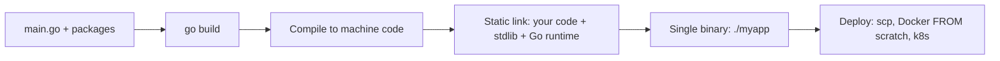

# Go Fundamentals

This guide covers the foundations every Go interview assumes: how code is organized into modules and packages, how visibility works, what zero values are, how constants and `iota` behave, and Go's deliberately minimal control flow. It also explains Go's compilation model — the single static binary — which is a favorite topic in system design conversations about deployment and containers.

## Workspace and Modules (go.mod)

Since Go 1.11, dependency management is built into the toolchain via **modules**. A module is a tree of packages with a `go.mod` file at its root that names the module and pins its dependencies.

```bash
mkdir myapp && cd myapp
go mod init github.com/you/myapp   # creates go.mod
go get github.com/google/uuid      # adds a dependency, records it in go.mod + go.sum
go build ./...                     # builds every package in the module
go mod tidy                        # adds missing / removes unused deps
```

A minimal `go.mod`:

```go
module github.com/you/myapp

go 1.22

require github.com/google/uuid v1.6.0
```

Key points interviewers probe:

- `go.sum` stores cryptographic checksums of dependencies for reproducible, tamper-evident builds.
- Versions follow **semantic import versioning**: v2+ of a module changes its import path (`github.com/you/lib/v2`).
- There is no central artifact you must publish to — any Git repo is a module source, cached through the public module proxy (`proxy.golang.org`).

## Packages and Visibility

Every `.go` file starts with a `package` clause. All files in one directory belong to one package. There are no `public`/`private` keywords — **visibility is determined by capitalization**:

```go
package bank

// Account is exported (starts with an uppercase letter) — visible to importers.
type Account struct {
    Owner   string  // exported field
    balance float64 // unexported field: only code in package bank can touch it
}

// Deposit is exported.
func (a *Account) Deposit(amount float64) { a.balance += amount }

// validate is unexported — an internal helper.
func validate(amount float64) bool { return amount > 0 }
```

This single rule replaces access modifiers entirely. A common design consequence: packages expose small exported APIs and keep everything else lowercase. The special directory name `internal/` goes further — packages under it can only be imported by code within the same module subtree.

The `main` package with a `main()` function is the program entry point; everything else is a library package.

## Variables and Zero Values

Go has two declaration forms, and every declared variable is **always initialized** — there is no "uninitialized memory" in Go.

```go
var count int          // declaration with zero value: 0
var name string        // ""
var price float64      // 0.0
var active bool        // false
var buf []byte         // nil (slices, maps, channels, pointers, funcs, interfaces zero to nil)

city := "Nairobi"      // short declaration: type inferred, only inside functions
count, name = 3, "Ann" // multiple assignment
```

The zero value is not just a default — idiomatic Go designs types so the zero value is *useful*. Examples: `var sb strings.Builder` is ready to use, `var mu sync.Mutex` is an unlocked mutex, `var wg sync.WaitGroup` is an empty wait group. Expect the interview question: *"What is the zero value of X?"* — memorize the table:

| Type family | Zero value |
|---|---|
| Numeric types | `0` |
| `string` | `""` (empty, never nil) |
| `bool` | `false` |
| Pointers, slices, maps, channels, functions, interfaces | `nil` |
| Structs | Every field zeroed recursively |

## Basic Types

```go
var (
    i   int     = -42        // platform-sized (64-bit on modern systems)
    u   uint8   = 255        // also: int8/16/32/64, uint16/32/64, uintptr
    f   float64 = 3.14       // float32 exists; float64 is the default
    c   complex128 = 2 + 3i
    b   byte    = 'A'        // alias for uint8
    r   rune    = '世'        // alias for int32: a Unicode code point
    s   string  = "héllo"    // immutable sequence of bytes (UTF-8 by convention)
)

// Strings: len() counts BYTES, range iterates RUNES.
fmt.Println(len("héllo"))          // 6 (é is 2 bytes)
for i, r := range "héllo" {        // i is the byte index, r is the rune
    fmt.Printf("%d:%c ", i, r)     // 0:h 1:é 3:l 4:l 5:o
}
```

Go has **no implicit numeric conversions** — mixing `int` and `int64` requires an explicit cast: `int64(x)`. This eliminates a whole class of C bugs and is a frequent trivia question.

## Constants and iota

Constants are compile-time values. Untyped constants have arbitrary precision and adapt to context. `iota` is an auto-incrementing counter reset to 0 in each `const` block:

```go
const Pi = 3.14159 // untyped constant

type Weekday int

const (
    Sunday Weekday = iota // 0
    Monday                // 1 (iota repeats the expression)
    Tuesday               // 2
    Wednesday             // 3
)

// Classic idiom: bit flags and sizes
const (
    _  = iota             // skip 0
    KB = 1 << (10 * iota) // 1 << 10 = 1024
    MB                    // 1 << 20
    GB                    // 1 << 30
)
```

## Control Flow

### for — the only loop

Go has exactly one loop keyword, covering all loop forms:

```go
for i := 0; i < 5; i++ {}     // classic C-style
for count < 10 { count++ }     // "while" loop
for { break }                  // infinite loop
for i, v := range slice {}     // range over slice/array/map/string/channel
for range time.Tick(time.Second) {} // values can be ignored entirely
for i := range 10 {}           // Go 1.22+: range over an integer
```

### switch — no fallthrough by default

```go
switch day {
case "Sat", "Sun":            // multiple values per case
    fmt.Println("weekend")
default:
    fmt.Println("weekday")
}

// Expressionless switch: a cleaner if/else chain
switch {
case score >= 90:
    grade = "A"
case score >= 80:
    grade = "B"
default:
    grade = "C"
}
```

Cases break automatically; the rare explicit `fallthrough` keyword continues to the next case.

### defer — cleanup that always runs

`defer` schedules a call to run when the surrounding **function** returns (not the block). Deferred calls run **LIFO**, and their arguments are evaluated at the `defer` statement, not at execution time:

```go
func readFile(path string) ([]byte, error) {
    f, err := os.Open(path)
    if err != nil {
        return nil, err
    }
    defer f.Close() // runs on every return path — even panics

    return io.ReadAll(f)
}

// Pitfall: argument captured at defer time
func pitfall() {
    x := 1
    defer fmt.Println("deferred:", x) // prints 1, not 2
    x = 2
}
```

## Compilation Model: Static Binaries

Go compiles ahead-of-time to native machine code, and by default links the runtime (scheduler, GC) and all dependencies into **one self-contained binary**. There is no VM, no interpreter, and typically no shared-library dependencies.



Why this matters in the real world (and in system design interviews):

- **Tiny containers.** A Go binary can run in a `FROM scratch` or distroless Docker image of a few megabytes — no OS packages, no runtime to install. This is a big reason Docker and Kubernetes themselves are written in Go.
- **Trivial cross-compilation.** `GOOS=linux GOARCH=arm64 go build` produces a Linux ARM binary from a Mac, with no toolchain setup.
- **Fast builds.** Go's package model (no header files, explicit imports, no circular imports) keeps compile times low even on huge codebases.

```bash
GOOS=linux GOARCH=amd64 CGO_ENABLED=0 go build -o server .
# 'file server' -> ELF 64-bit LSB executable, statically linked
```

## Best Practices

- Run `gofmt` (or `goimports`) on save — formatting debates do not exist in Go, and unformatted code in an interview is a red flag.
- Use `:=` inside functions and `var` when you specifically want the zero value or a package-level variable.
- Design types so the zero value is usable; document it when it is (e.g., "the zero value of Buffer is an empty buffer ready to use").
- Keep packages small and named after what they *provide* (`http`, `json`), not generic buckets (`utils`, `helpers`, `common`).
- Never use `fallthrough` unless the intent is unmistakable; prefer listing values in one case.
- Put `defer f.Close()` immediately after a successful open, before any other logic.
- Prefer `internal/` packages to hide implementation detail in larger repos.

## Interview Questions

<details>
<summary>1. How does Go decide whether an identifier is public or private?</summary>

By capitalization of the first letter. Identifiers starting with an uppercase letter are exported (visible outside the package); lowercase identifiers are unexported (package-private). There are no access-modifier keywords. Additionally, packages under an `internal/` directory can only be imported by code rooted at the parent of `internal/`.
</details>

<details>
<summary>2. What are zero values and why do they matter?</summary>

Every variable in Go is initialized to its type's zero value: `0`, `""`, `false`, or `nil` (for pointers, slices, maps, channels, funcs, interfaces); struct fields are zeroed recursively. This means there is no undefined/uninitialized state. Good Go APIs make the zero value useful — e.g., `var mu sync.Mutex` works immediately, `var sb strings.Builder` is an empty builder. The main gotcha: a nil map can be read but writing to it panics.
</details>

<details>
<summary>3. When are the arguments to a deferred function evaluated?</summary>

Immediately, at the point of the `defer` statement — only the *call* is delayed until the surrounding function returns. So `defer fmt.Println(x)` prints the value `x` had when the defer was declared. To see the final value, defer a closure: `defer func() { fmt.Println(x) }()`. Deferred calls run in LIFO order and run even during a panic.
</details>

<details>
<summary>4. Explain iota.</summary>

`iota` is a predeclared constant counter usable only in `const` blocks. It starts at 0 and increments by one for each constant specification (line) in the block, resetting to 0 in the next `const` block. Lines without an expression repeat the previous expression with the new `iota` value, enabling enum-like sequences (`Sunday = iota`) and computed patterns like bit flags (`1 << iota`) or sizes (`1 << (10 * iota)` for KB/MB/GB).
</details>

<details>
<summary>5. Why does len("héllo") return 6, and what is the difference between a byte and a rune?</summary>

Strings are immutable byte sequences, and `len` counts bytes; `é` encodes to two bytes in UTF-8. A `byte` is an alias for `uint8` (one byte of the underlying data); a `rune` is an alias for `int32` and represents a Unicode code point. `for range` over a string decodes runes (yielding byte index + rune), while `s[i]` indexes raw bytes. To count characters use `utf8.RuneCountInString(s)`.
</details>

<details>
<summary>6. Why do companies like deploying Go services, and what makes the binary "static"?</summary>

`go build` produces a single ahead-of-time-compiled native binary containing the program, all its dependencies, and the Go runtime (GC + scheduler). With `CGO_ENABLED=0` it has no libc dependency, so it runs in a `FROM scratch` container. Benefits: tiny images, no runtime version drift, trivial cross-compilation via `GOOS`/`GOARCH`, fast startup (no JIT warm-up). This is why Go dominates CLIs (kubectl, terraform) and containerized microservices.
</details>

<details>
<summary>7. What does go mod tidy do, and what is go.sum for?</summary>

`go mod tidy` reconciles `go.mod` with the actual imports in the code: it adds `require` entries for imported-but-missing modules and drops unused ones. `go.sum` records cryptographic hashes of every module version ever downloaded so future builds verify they get bit-identical code — protecting against tampered or vanished upstream dependencies (reproducible builds).
</details>

<details>
<summary>8. Does Go have a while loop or a ternary operator?</summary>

No to both. `for` is the only loop: `for cond {}` is the while form, `for {}` is infinite, and `for ... range` iterates collections (and integers since Go 1.22). There is no ternary operator (`?:`); you write an explicit `if`/`else`. This is deliberate — Go trades expressiveness for a single obvious way to write things, which keeps large codebases uniform.
</details>
