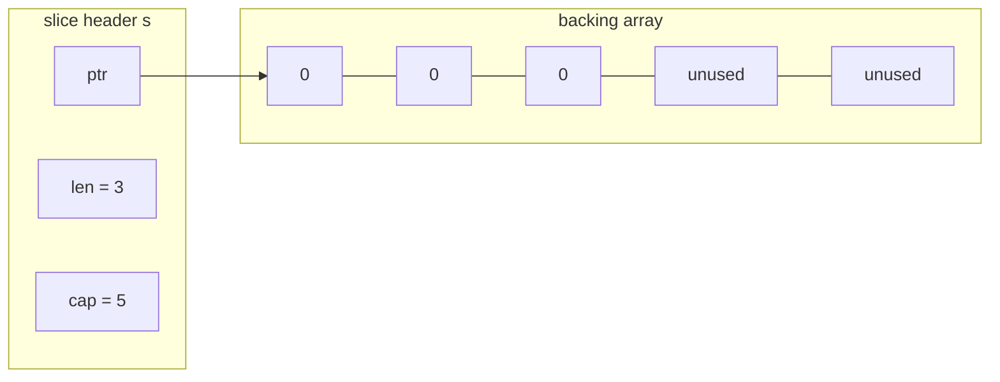
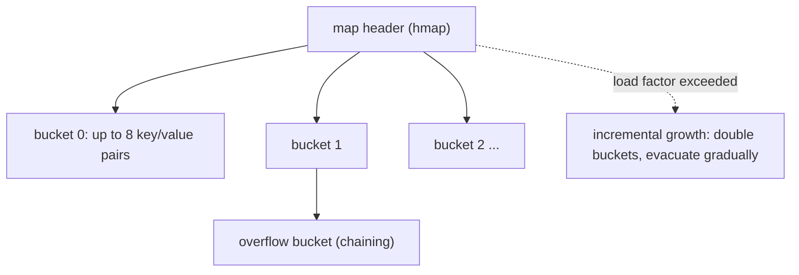

# Slices, Arrays, and Maps

Slices and maps are Go's workhorse collections, and slice internals are arguably the single most common Go interview topic. This guide explains what a slice actually is (a small header pointing at an array), why `append` sometimes shares memory and sometimes doesn't, and how maps behave — including the deliberately randomized iteration order and the classic nil-map panic.

## Arrays vs Slices

An **array** has a fixed length that is part of its type: `[3]int` and `[4]int` are different, incompatible types. Arrays are **values** — assigning or passing one copies every element.

```go
a := [3]int{1, 2, 3}
b := a          // full copy
b[0] = 99
fmt.Println(a)  // [1 2 3] — unchanged
```

Arrays are rare in application code. A **slice** is a lightweight, flexible view over an array, and it is what you use 99% of the time.

## Slice Internals: pointer, len, cap

A slice is a three-word header: a pointer into a backing array, a length, and a capacity.

```go
s := make([]int, 3, 5) // len 3, cap 5
```



- `len(s)` — how many elements you can index.
- `cap(s)` — how many elements the backing array can hold from the slice's start.
- Slicing (`s[1:3]`) creates a **new header over the same array** — no data is copied.

```go
nums := []int{10, 20, 30, 40, 50}
part := nums[1:3]              // [20 30], len 2, cap 4 (from index 1 to end of array)
part[0] = 999
fmt.Println(nums)              // [10 999 30 40 50] — same backing array!
```

Because slice headers are small, slices are passed to functions **by value** (the header is copied) but both copies point at the same array — so a callee can mutate the caller's elements, yet a callee's `append` that reallocates will *not* be visible to the caller. This asymmetry is the source of most Go slice bugs.

## append: Growth and Aliasing Gotchas

`append` adds elements, reallocating the backing array only when capacity is exhausted:

```go
s := make([]int, 0, 2)
s = append(s, 1)      // len 1, cap 2 — same array
s = append(s, 2)      // len 2, cap 2 — same array
s = append(s, 3)      // len 3, cap 4 — NEW array (old one copied over)
```

Growth is amortized O(1): capacity roughly doubles for small slices and grows by ~25% for large ones (the exact factors are an implementation detail — say "approximately doubling" in interviews).

### The classic aliasing puzzle

```go
func main() {
    a := []int{1, 2, 3, 4}
    b := a[:2]           // len 2, cap 4 — shares a's array
    b = append(b, 99)    // fits within cap: OVERWRITES a[2]!
    fmt.Println(a)       // [1 2 99 4]  — surprise
    b = append(b, 100)   // still fits (cap 4): overwrites a[3]
    b = append(b, 101)   // cap exceeded: b reallocates, a and b now independent
    b[0] = -1
    fmt.Println(a)       // [1 2 99 100] — no longer affected
}
```

Whether `append` clobbers the original depends entirely on remaining capacity. Two defenses:

```go
// 1. Full slice expression: cap b at 2 so any append must reallocate.
b := a[:2:2]           // s[low : high : max] — cap = max - low

// 2. Explicit copy.
b := make([]int, 2)
copy(b, a[:2])         // copy(dst, src) copies min(len(dst), len(src)) elements
```

### Don't hold subslices of huge buffers

```go
// BAD: keeps the entire 10MB file alive to retain 10 bytes.
header := hugeFileContents[:10]

// GOOD: copy the small piece so the big array can be garbage collected.
header := make([]byte, 10)
copy(header, hugeFileContents[:10])
```

## Maps

A Go map is a hash table. Keys must be **comparable** with `==`: booleans, numbers, strings, pointers, channels, interfaces, arrays, and structs of comparable fields. Slices, maps, and functions **cannot** be keys.

```go
ages := map[string]int{"ann": 30, "bob": 25}
ages["carol"] = 41            // insert
delete(ages, "bob")           // delete (safe even if absent)

age, ok := ages["dave"]       // the "comma ok" idiom
if !ok {
    fmt.Println("dave not found; age is the zero value:", age) // 0
}
```

Reading a missing key returns the value type's zero value — you *must* use `, ok` to distinguish "absent" from "present with zero value".

### Nil map: read OK, write panics

```go
var m map[string]int      // nil map
fmt.Println(m["x"])       // 0 — reading a nil map is fine
m["x"] = 1                // PANIC: assignment to entry in nil map

m = make(map[string]int)  // must make (or use a literal) before writing
m["x"] = 1                // fine
```

This is one of the most frequently asked "spot the bug" questions.

### Iteration order is randomized

```go
for k, v := range ages {
    fmt.Println(k, v)     // order differs run to run — BY DESIGN
}
```

The runtime deliberately randomizes the starting bucket so programs cannot accidentally depend on order. To iterate deterministically, sort the keys:

```go
keys := make([]string, 0, len(ages))
for k := range ages {
    keys = append(keys, k)
}
sort.Strings(keys)
for _, k := range keys {
    fmt.Println(k, ages[k])
}
```

### Map internals (high level)



Buckets hold 8 entries each; collisions chain into overflow buckets; when the load factor is exceeded the table doubles and entries are migrated incrementally during subsequent operations (no big stop-the-world rehash). Two more facts interviewers like:

- Maps are **not safe for concurrent writes** — the runtime detects concurrent map writes and crashes the program (it is not a recoverable panic). Use `sync.Mutex` or `sync.Map`.
- Map values are **not addressable**: `m[k].Field = 1` does not compile for struct values. Store pointers (`map[string]*Player`) or read-modify-write the whole value.

```go
type Player struct{ Score int }

m := map[string]Player{"ann": {Score: 1}}
// m["ann"].Score = 2          // compile error: cannot assign
p := m["ann"]; p.Score = 2; m["ann"] = p // read-modify-write

mp := map[string]*Player{"ann": {Score: 1}}
mp["ann"].Score = 2            // fine: the map value is a pointer
```

## Common Pitfalls Summary

```go
// 1. Writing to a nil map — panics.
var m map[string]int
// m["k"] = 1 // panic

// 2. Appending to a shared slice — silently clobbers the original.
b := a[:2]
b = append(b, 99) // may overwrite a[2]

// 3. Expecting a callee's append to be visible to the caller.
func addItem(s []int) { s = append(s, 1) } // caller sees nothing if s reallocates
// Fix: return the slice — func addItem(s []int) []int { return append(s, 1) }

// 4. Comparing slices with == (only nil comparison compiles).
// Use slices.Equal(a, b) (Go 1.21+) or reflect.DeepEqual.

// 5. len(nil slice) is 0 and append to a nil slice works — nil slices are USABLE.
var s []int
s = append(s, 1) // fine; unlike nil maps
```

Real-world relevance: HTTP handlers slicing request bodies, log processors reusing buffers, and Kubernetes controllers copying object lists all hit slice-aliasing bugs; understanding cap-based reallocation is essential for writing allocation-efficient hot paths.

## Best Practices

- Preallocate when the size is known: `make([]T, 0, n)` and `make(map[K]V, n)` avoid repeated growth in hot paths.
- Return slices from functions that append; never rely on append mutating the caller's header.
- Use the three-index slice `s[low:high:max]` or `copy` whenever you hand a subslice to code that may append.
- Copy small slices out of large buffers to avoid pinning big allocations in memory.
- Always use the `, ok` idiom when a zero value is a legitimate stored value.
- Never rely on map iteration order; sort keys when order matters.
- Protect maps with a mutex under concurrency; reserve `sync.Map` for append-mostly caches with disjoint key sets.
- Prefer nil slices (`var s []T`) over empty literals for "no results" — they range and append fine, and `encoding/json` differences (`null` vs `[]`) are the only visible distinction.

## Interview Questions

<details>
<summary>1. What exactly is a slice, and what happens when you pass one to a function?</summary>

A slice is a three-word header: pointer to a backing array, length, and capacity. Passing a slice copies the header (cheap), but both headers point at the same backing array — so the callee can mutate existing elements and the caller sees it. However, if the callee appends beyond capacity, the callee gets a *new* array and the caller's slice is unaffected; even an in-capacity append changes only the callee's copy of `len`. Hence the idiom: functions that append must return the slice.
</details>

<details>
<summary>2. Given a := []int{1,2,3,4}; b := a[:2]; b = append(b, 99) — what is a?</summary>

`[1 2 99 4]`. `b` has len 2 but cap 4 (it shares `a`'s backing array), so `append` writes 99 into the shared array at index 2, overwriting `a[2]`. If the append had exceeded capacity, `b` would have reallocated and `a` would be untouched. Prevent this with `a[:2:2]` (capping capacity) or an explicit `copy`.
</details>

<details>
<summary>3. Why is map iteration order random in Go?</summary>

The Go team deliberately randomizes the iteration start point (since Go 1) so developers cannot write code that accidentally depends on hash-table order — such code broke whenever the hash implementation changed. If you need deterministic order, collect the keys into a slice and sort it. This is a language-level lesson in Hyrum's Law: any observable behavior will be depended on unless you prevent it.
</details>

<details>
<summary>4. What types can be map keys, and why can't a slice be one?</summary>

Keys must be comparable with `==`: numbers, strings, booleans, pointers, channels, interface types, arrays, and structs whose fields are all comparable. Slices, maps, and functions are excluded because `==` is not defined for them — equality would be ambiguous (identity vs deep equality) and slice contents can mutate, which would corrupt the hash invariant. Workaround: convert the slice to a string or an array, or key on a derived hash.
</details>

<details>
<summary>5. What happens when you read from and write to a nil map?</summary>

Reading a nil map is safe and returns the zero value (and `ok == false` with the comma-ok form); `len` of a nil map is 0 and ranging over it runs zero iterations. *Writing* to a nil map panics with "assignment to entry in nil map". You must initialize with `make` or a literal before inserting. Contrast with nil slices, where `append` works fine.
</details>

<details>
<summary>6. How does append grow a slice, and what is the amortized cost?</summary>

If the new length fits within capacity, append writes in place. Otherwise it allocates a larger backing array — roughly doubling for small slices and growing by about 25% for larger ones — copies the elements, and returns a header pointing at the new array. Growth is geometric, so a sequence of n appends costs amortized O(1) per append. Preallocating with `make([]T, 0, n)` eliminates the copies entirely when n is known.
</details>

<details>
<summary>7. Why does m[key].Field = value fail to compile for a map of structs?</summary>

Map values are not addressable: the runtime may move entries during incremental growth, so Go cannot hand out a stable pointer to a value stored in a map. Assigning to a field requires an addressable value. Fixes: store pointers in the map (`map[K]*T`, then `m[k].Field = v` works), or read the value out, modify it, and store it back.
</details>

<details>
<summary>8. What happens when two goroutines write to the same map concurrently?</summary>

The runtime's concurrent-map-write detector throws a fatal error ("fatal error: concurrent map writes") that crashes the process — it is not a panic and cannot be recovered. Maps have no internal locking for performance reasons. Solutions: guard the map with `sync.Mutex`/`sync.RWMutex`, shard it, or use `sync.Map` for the specific patterns it is optimized for (mostly-read caches, disjoint key sets per goroutine).
</details>
