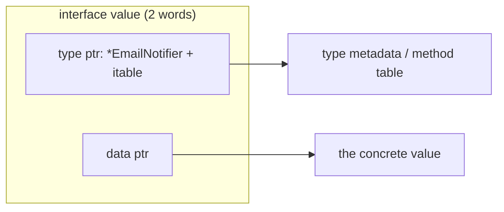
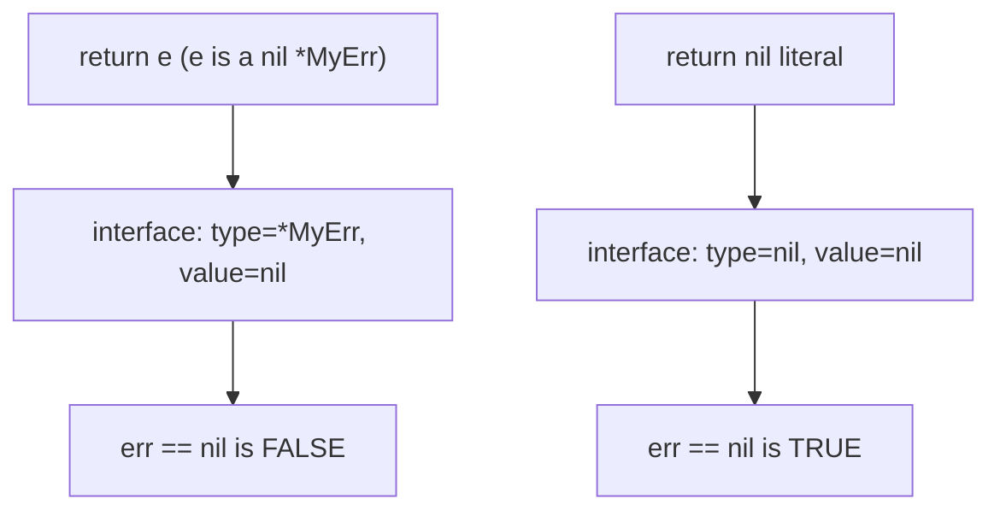

# Structs, Methods, and Interfaces

Go replaces classes and inheritance with three simpler tools: structs for data, methods on any named type, and small implicitly-satisfied interfaces for polymorphism. This guide covers embedding vs inheritance, the value-vs-pointer receiver decision, how interfaces work under the hood, and the notorious "nil interface vs nil pointer" gotcha that appears in a huge fraction of Go interviews.

## Structs

A struct is a typed collection of fields:

```go
type User struct {
    ID        int64
    Name      string
    Email     string
    createdAt time.Time // unexported: private to this package
}

// Construction
u1 := User{ID: 1, Name: "Ann", Email: "ann@example.com"} // field names: robust
u2 := User{2, "Bob", "bob@example.com", time.Now()}      // positional: brittle, avoid
u3 := &User{ID: 3}                                       // pointer to struct; other fields zeroed
var u4 User                                              // zero value: all fields zeroed
```

Structs are **values**: assignment and function passing copy all fields. Structs are comparable with `==` iff all fields are comparable.

Constructor functions are a convention, not a language feature:

```go
func NewUser(name, email string) (*User, error) {
    if email == "" {
        return nil, errors.New("email required")
    }
    return &User{Name: name, Email: email, createdAt: time.Now()}, nil
}
```

## Embedding vs Inheritance

Go has **no inheritance**. Instead, embedding a type inside a struct *promotes* its fields and methods:

```go
type Logger struct{ prefix string }

func (l *Logger) Log(msg string) { fmt.Println(l.prefix, msg) }

type Server struct {
    Logger        // embedded: no field name
    Addr   string
}

s := Server{Logger: Logger{prefix: "[srv]"}, Addr: ":8080"}
s.Log("starting")        // promoted method — looks like inheritance...
```

...but it is **composition, not inheritance**. Crucial differences:

- There is no polymorphic override: inside `Logger.Log`, the receiver is always the `Logger`, never the `Server`. Go has no virtual dispatch to the "outer" type (no fragile base class problem).
- A `Server` is not a `Logger` for type purposes — you cannot pass `Server` where `*Logger` is required.
- Name collisions are resolved by depth, and ambiguity at the same depth is a compile error you resolve by qualifying: `s.Logger.Log(...)`.

Embedding also works with interfaces (common in wrappers/middleware):

```go
type readCounter struct {
    io.Reader      // embed the interface
    n int64
}

func (rc *readCounter) Read(p []byte) (int, error) {
    n, err := rc.Reader.Read(p) // delegate
    rc.n += int64(n)
    return n, err
}
```

## Methods: Value vs Pointer Receivers

A method is a function with a receiver. The receiver kind determines whether the method sees a copy or the original:

```go
type Counter struct{ n int }

func (c Counter) IncVal()  { c.n++ } // value receiver: mutates a COPY — useless here
func (c *Counter) IncPtr() { c.n++ } // pointer receiver: mutates the original

func main() {
    c := Counter{}
    c.IncVal()
    fmt.Println(c.n) // 0 — the copy was incremented and discarded
    c.IncPtr()       // Go auto-takes the address: (&c).IncPtr()
    fmt.Println(c.n) // 1
}
```

Choose pointer receivers when the method mutates state, when the struct is large (avoid copying), or when *any* method on the type needs a pointer (consistency rule: don't mix). Choose value receivers for small immutable types (e.g., `time.Time` uses value receivers).

One subtlety: the automatic `&`/`*` sugar works for **addressable** values only. A value stored in a map or an interface is not addressable, and only the pointer type's method set includes pointer-receiver methods — which matters for interface satisfaction below.

## Interfaces: Implicit Satisfaction

An interface declares a method set. Any type with those methods satisfies it **automatically** — no `implements` keyword:

```go
type Notifier interface {
    Notify(msg string) error
}

type EmailNotifier struct{ To string }

func (e EmailNotifier) Notify(msg string) error {
    fmt.Println("email to", e.To, ":", msg)
    return nil
}

// EmailNotifier satisfies Notifier without declaring it anywhere.
func alertAll(ns []Notifier, msg string) {
    for _, n := range ns {
        _ = n.Notify(msg)
    }
}
```

Implicit satisfaction means the *consumer* defines the interface it needs, and producers don't even have to know it exists. This decouples packages and is the foundation of Go's testing/mocking story. The standard library's most successful interfaces are tiny: `io.Reader`, `io.Writer`, `fmt.Stringer` — one or two methods each.

If a type uses pointer receivers, only the **pointer** satisfies the interface:

```go
type FileStore struct{}
func (f *FileStore) Save(b []byte) error { return nil }

var s Saver = &FileStore{} // OK
// var s Saver = FileStore{} // compile error: Save has a pointer receiver
```

## Interface Internals: Type + Value

An interface value is a two-word pair: a pointer to type information (which concrete type, and its method table) and a pointer to the data.



An interface is `nil` **only when both words are nil**. That leads to the most famous Go gotcha:

### The nil interface vs nil pointer gotcha

```go
type MyErr struct{}
func (e *MyErr) Error() string { return "boom" }

func mayFail(fail bool) error {
    var e *MyErr            // nil pointer
    if fail {
        e = &MyErr{}
    }
    return e                // WRONG: wraps a (type=*MyErr, value=nil) pair
}

func main() {
    err := mayFail(false)
    fmt.Println(err == nil) // false! The interface holds a non-nil type word.
}
```

Even though the pointer inside is nil, the interface's *type* word is `*MyErr`, so the interface is not nil. The fix is to return the literal `nil`:

```go
func mayFail(fail bool) error {
    if fail {
        return &MyErr{}
    }
    return nil              // truly nil interface: both words nil
}
```



Rule of thumb: never return concrete error types through the `error` interface; declare `error` return types and return `nil` explicitly.

## The Empty Interface and any

`interface{}` (aliased as `any` since Go 1.18) has an empty method set, so **every** type satisfies it. It is Go's escape hatch for truly dynamic values (e.g., `json.Unmarshal` targets, `fmt.Println` args). Overusing `any` throws away static typing — since generics arrived, most "container of anything" uses are better served by type parameters.

## Type Assertions and Type Switches

To recover the concrete type from an interface:

```go
var v any = "hello"

s := v.(string)        // assert: panics if v is not a string
s, ok := v.(string)    // comma-ok form: safe, ok=false on mismatch
n, ok := v.(int)       // ok=false, n=0

// Type switch: branch on the dynamic type
switch x := v.(type) {
case string:
    fmt.Println("string of len", len(x))
case int, int64:
    fmt.Println("integer-ish", x)
case fmt.Stringer:              // interfaces work as cases too
    fmt.Println("stringer:", x.String())
case nil:
    fmt.Println("nil interface")
default:
    fmt.Printf("unhandled %T\n", x)
}
```

Real-world use: `errors.As` uses these mechanics to walk error chains; HTTP middleware asserts `http.ResponseWriter` to `http.Flusher`/`http.Hijacker` to unlock optional capabilities.

## Best Practices

- Keep interfaces small — one to three methods. "The bigger the interface, the weaker the abstraction" (Rob Pike).
- Define interfaces in the **consuming** package, next to the code that needs them, not alongside implementations.
- Accept interfaces, return concrete structs: callers get flexibility, and returned structs can grow methods without breaking anyone.
- Don't mix receiver kinds on one type; if any method needs a pointer receiver, use pointer receivers everywhere on that type.
- Use field names in struct literals; positional literals break when fields are added.
- Never store a possibly-nil concrete pointer into an interface you will compare to nil — return the nil literal.
- Prefer the comma-ok assertion form; a bare assertion is a hidden panic.
- Reach for embedding to reuse behavior, but remember it is delegation — do not design for "overrides".

## Interview Questions

<details>
<summary>1. How does Go achieve polymorphism without inheritance?</summary>

Through interfaces with implicit (structural) satisfaction: any type that has the right method set satisfies the interface automatically, and calls through an interface dispatch dynamically via the method table stored in the interface value. Code reuse is handled separately by composition/embedding, which promotes fields and methods but performs no virtual dispatch to the outer type. This splits the two jobs inheritance conflates — subtyping and reuse — into independent, simpler mechanisms.
</details>

<details>
<summary>2. When should a method use a pointer receiver vs a value receiver?</summary>

Use a pointer receiver when the method must mutate the receiver, when the struct is large enough that copying is wasteful, or when the type contains fields that must not be copied (e.g., `sync.Mutex`). Use value receivers for small, immutable, value-like types. Consistency rule: if any method needs a pointer receiver, give all methods pointer receivers, because the method set of `T` excludes pointer-receiver methods — a mixed type satisfies interfaces differently as `T` vs `*T`, which confuses users.
</details>

<details>
<summary>3. A function returns error but the caller's err == nil check fails even though "nothing went wrong". What happened?</summary>

The function almost certainly returned a nil *concrete* pointer (e.g., `var e *MyErr; return e`). An interface value is a (type, value) pair and is nil only when *both* are nil; wrapping a nil `*MyErr` produces (type=`*MyErr`, value=nil), which compares non-nil. Fix: declare the return type as `error` and return the literal `nil` on success, never a typed nil pointer.
</details>

<details>
<summary>4. What are the two words inside an interface value?</summary>

A type word and a data word. The type word points to metadata about the dynamic type — for non-empty interfaces this is an *itable* pairing the interface with the concrete type's method implementations; for `any` it is just the type descriptor. The data word points to (or for pointer types, is) the concrete value. Method calls through the interface index into the itable — one extra indirection versus a direct call, which also usually prevents inlining.
</details>

<details>
<summary>5. Why does var s Saver = FileStore{} fail when Save has a pointer receiver?</summary>

Because the method set of the value type `FileStore` contains only value-receiver methods, while the method set of `*FileStore` contains both. `Save` is defined on `*FileStore`, so only the pointer satisfies `Saver`. The deeper reason: a value stored inside an interface is not addressable, so Go could not take its address to call a pointer-receiver method — the method might mutate a temporary copy, which would be silently wrong.
</details>

<details>
<summary>6. What is the difference between a type assertion and a type switch, and when does each panic?</summary>

A type assertion `v.(T)` extracts the dynamic value if its type is `T` (or if it satisfies interface `T`); the single-result form panics on mismatch, while the `x, ok := v.(T)` form returns `ok=false` safely. A type switch (`switch x := v.(type)`) branches over multiple candidate types and never panics — unmatched types fall to `default` (or fall through nothing). Use comma-ok or a type switch in production; bare assertions only where a mismatch is a programming bug you *want* to crash on.
</details>

<details>
<summary>7. What does "accept interfaces, return structs" mean and why is it idiomatic?</summary>

Functions should take the smallest interface that expresses what they need (e.g., `io.Reader` instead of `*os.File`) so any conforming implementation — including test fakes — can be passed in. But they should return concrete types, because returning an interface hides useful methods, forces consumers through a lowest-common-denominator API, and makes it a breaking change to add functionality. The caller can always assign a returned struct to their own interface variable if they want abstraction.
</details>

<details>
<summary>8. How does struct embedding differ from a named field of the same type?</summary>

Embedding (`type S struct { Logger }`) promotes the embedded type's exported fields and methods to the outer type — `s.Log(...)` works, and the promoted methods count toward `S`'s method set for interface satisfaction. A named field (`type S struct { L Logger }`) provides no promotion; you must write `s.L.Log(...)` and `S` does not satisfy interfaces via `L`'s methods. Both are composition; embedding is just automatic delegation sugar plus method-set inclusion.
</details>
