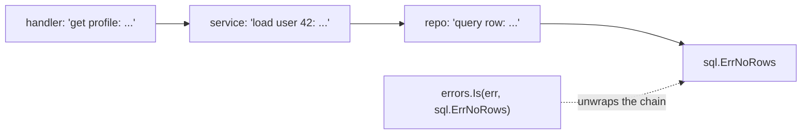

# Error Handling in Go

Go treats errors as ordinary values returned from functions, not as exceptions thrown up the stack. This guide covers the `error` interface, wrapping with `%w` and inspecting chains with `errors.Is`/`errors.As`, the trade-off between sentinel and typed errors, and the narrow, legitimate uses of `panic`/`recover`.

## Errors Are Values

`error` is just an interface:

```go
type error interface {
    Error() string
}
```

Functions that can fail return an error as their **last** return value, and callers check it immediately:

```go
func loadConfig(path string) (*Config, error) {
    data, err := os.ReadFile(path)
    if err != nil {
        return nil, fmt.Errorf("read config: %w", err)
    }
    var cfg Config
    if err := json.Unmarshal(data, &cfg); err != nil {
        return nil, fmt.Errorf("parse config %s: %w", path, err)
    }
    return &cfg, nil
}
```

The `if err != nil { return ..., err }` pattern is verbose by design: every failure point is explicit and visible in the control flow — nothing propagates invisibly. Because errors are values, you can program with them: store them, aggregate them, retry on them, or attach behavior to them.

Creating errors:

```go
err1 := errors.New("connection refused")          // simple static error
err2 := fmt.Errorf("user %d not found", id)       // formatted
err3 := fmt.Errorf("query users: %w", err1)       // wrapped (see below)
```

## Error Wrapping: %w, errors.Is, errors.As

`fmt.Errorf` with the `%w` verb **wraps** an error, adding context while preserving the original for programmatic inspection. Repeated wrapping builds a chain:



```go
func findUser(id int) (*User, error) {
    row := db.QueryRow("SELECT ... WHERE id=$1", id)
    var u User
    if err := row.Scan(&u.ID, &u.Name); err != nil {
        return nil, fmt.Errorf("find user %d: %w", id, err)
    }
    return &u, nil
}

// The caller checks the CAUSE without string matching:
u, err := findUser(42)
if errors.Is(err, sql.ErrNoRows) {   // walks the chain via Unwrap()
    return nil, ErrUserNotFound      // translate to a domain error
}
```

- **`errors.Is(err, target)`** — walks the chain asking "is any error in this chain equal to `target`?" Use for **sentinel** errors.
- **`errors.As(err, &target)`** — walks the chain asking "is any error in this chain of type `T`?" and if so copies it into `target`. Use for **typed** errors when you need their fields.

```go
var pathErr *fs.PathError
if errors.As(err, &pathErr) {
    fmt.Println("failed op:", pathErr.Op, "on", pathErr.Path)
}
```

Use `%v` instead of `%w` when you deliberately want to *hide* the underlying cause from callers (e.g., not leaking internal driver errors across an API boundary). Since Go 1.20, `errors.Join(err1, err2)` combines multiple errors, and `Is`/`As` traverse all branches.

## Sentinel Errors vs Typed Errors

**Sentinel errors** are exported package-level values compared by identity:

```go
var ErrNotFound = errors.New("not found")   // package-level sentinel

if errors.Is(err, ErrNotFound) { ... }
```

Pros: dead simple; standard library precedent (`io.EOF`, `sql.ErrNoRows`, `context.Canceled`). Cons: they carry no data, and they become permanent public API — callers depend on them forever.

**Typed errors** are custom types carrying structured data:

```go
type ValidationError struct {
    Field  string
    Reason string
}

func (e *ValidationError) Error() string {
    return fmt.Sprintf("validation failed on %s: %s", e.Field, e.Reason)
}

// Caller:
var ve *ValidationError
if errors.As(err, &ve) {
    http.Error(w, ve.Field+" is invalid", http.StatusBadRequest)
}
```

Guidance: prefer plain wrapped errors for most failures; add a sentinel when callers must branch on *one* well-known condition; add a typed error when callers need the *data* inside the failure. Expose as little as possible — every exported error is API surface.

## panic and recover

`panic` unwinds the stack, running deferred functions along the way; if it reaches the top of the goroutine, the whole program crashes. `recover`, called inside a deferred function, stops the unwind:

```go
func safeCall(f func()) (err error) {
    defer func() {
        if r := recover(); r != nil {
            err = fmt.Errorf("recovered from panic: %v", r)
        }
    }()
    f()
    return nil
}
```

**When panic is appropriate:**

- Truly unrecoverable programmer errors: broken invariants, impossible states ("this switch is exhaustive"). Out-of-range indexing and nil dereferences already panic for this reason.
- `Must` helpers at initialization time: `regexp.MustCompile`, `template.Must` — misuse should fail fast at startup, not limp along.

**When it is not:** expected failures — missing files, bad user input, network timeouts, invalid JSON. Those are errors. Libraries should essentially never let panics escape their public API.

**Where recover belongs:** at goroutine/system boundaries. `net/http` recovers per-request so one buggy handler doesn't kill the server; worker pools often recover per-task. Critically, a panic in a goroutine **you** started is not caught by anyone else's recover — each goroutine needs its own deferred recover, or the whole process dies.

```go
go func() {
    defer func() {
        if r := recover(); r != nil {
            log.Printf("worker panic: %v\n%s", r, debug.Stack())
        }
    }()
    doWork() // a panic here would otherwise crash the entire program
}()
```

## Designing Errors: A Decision Path

```mermaid
flowchart TD
    A["A failure occurs"] --> B{"Programmer bug / broken invariant?"}
    B -- yes --> C["panic (fail fast)"]
    B -- no --> D{"Do callers need to branch on it?"}
    D -- no --> E["fmt.Errorf(\"context: %w\", err)"]
    D -- yes --> F{"Do callers need data from it?"}
    F -- no --> G["Sentinel: var ErrX = errors.New(...)"]
    F -- yes --> H["Typed error + errors.As"]
```

Real-world note: this layered style is exactly how production Go services are built — repositories return `sql.ErrNoRows` wrapped with context, services translate it to domain sentinels like `ErrUserNotFound`, and HTTP handlers map domain errors to status codes. gRPC follows the same idea with `status.Code(err)`.

## Best Practices

- Add context at every level with lowercase, `:`-separated prefixes: `"open config: %w"`. Messages should not start with a capital or end with punctuation.
- Wrap with `%w` when callers may need the cause; use `%v` to deliberately sever the chain at API boundaries.
- Handle each error exactly once: either log it or return it — logging *and* returning produces duplicate noise.
- Never branch on `err.Error()` strings; use `errors.Is`/`errors.As`.
- Name error variables `err`; name sentinel values `ErrXxx`; name error types `XxxError`.
- Return early on errors (guard clauses) and keep the happy path at minimal indentation.
- Give every goroutine that must not kill the process its own `defer`/`recover`.
- Don't ignore errors with `_` silently; if an error is genuinely ignorable, a brief comment saying why is idiomatic.

## Interview Questions

<details>
<summary>1. Why does Go use error return values instead of exceptions?</summary>

Because it makes failure handling explicit and local: every call that can fail visibly returns an error, and the control flow for handling it is ordinary code — no invisible non-local jumps, no forgetting a catch block, no wondering which calls can throw. Errors being plain values also means you can compose them: wrap them with context, aggregate them, match on them, retry on them. The cost is verbosity (`if err != nil`), which Go accepts as the price of readability and reliability.
</details>

<details>
<summary>2. What is the difference between errors.Is and errors.As?</summary>

Both walk the wrap chain created by `%w` (via repeated `Unwrap()`). `errors.Is(err, target)` checks *identity/equality* — is some error in the chain equal to this sentinel value (e.g., `io.EOF`, `sql.ErrNoRows`)? `errors.As(err, &target)` checks *type* — is some error in the chain assignable to this concrete type — and extracts it so you can read its fields (e.g., `*fs.PathError`). Rule: `Is` for sentinels, `As` for typed errors.
</details>

<details>
<summary>3. What is the difference between %w and %v in fmt.Errorf?</summary>

Both interpolate the error's message, but `%w` additionally records the wrapped error so `errors.Is`/`errors.As`/`errors.Unwrap` can traverse to it — the new error implements `Unwrap() error`. `%v` produces a plain new error with no chain link, deliberately hiding the cause. Use `%w` inside a service where callers legitimately inspect causes; use `%v` at boundaries where exposing internal error types would leak implementation details into your public API.
</details>

<details>
<summary>4. When is panic appropriate in Go?</summary>

For unrecoverable programmer errors — violated invariants, impossible states — where continuing would be worse than crashing, and for `Must`-style initialization helpers (`regexp.MustCompile`) where failure means the program is misconfigured and should die at startup. Expected runtime failures (I/O, input validation, network) must be errors. Libraries should not panic across their API; if they use panic internally for control flow, they must recover before returning.
</details>

<details>
<summary>5. Does a recover in main catch a panic in a goroutine started by main?</summary>

No. Panics unwind only the stack of the goroutine that panicked; `recover` works only in a deferred function on that same goroutine's stack. An unrecovered panic in *any* goroutine terminates the whole program. Therefore long-running worker goroutines that must survive bugs each need their own `defer func() { recover() }()` — this is exactly what `net/http` does per request handler.
</details>

<details>
<summary>6. What are sentinel errors and what are their drawbacks?</summary>

Sentinels are exported package-level error values (`var ErrNotFound = errors.New("not found")`) that callers match with `errors.Is`. Drawbacks: they carry no contextual data; they become permanent public API (removing one breaks callers); they create import dependencies on the defining package; and pre-`errors.Is` code compared them with `==`, which breaks once anyone wraps them. Alternatives: typed errors when data is needed, or interface-based checks (e.g., a `Temporary() bool` behavior) to avoid coupling entirely.
</details>

<details>
<summary>7. How would you design error handling for a layered web service?</summary>

Repository layer: return low-level errors wrapped with operation context (`fmt.Errorf("query user %d: %w", id, err)`). Service layer: translate infrastructure errors into a small set of domain errors (`errors.Is(err, sql.ErrNoRows)` becomes `ErrUserNotFound`), so upper layers never import `database/sql`. Transport layer: map domain errors to status codes (404 for `ErrUserNotFound`, 400 for `*ValidationError` via `errors.As`, 500 otherwise) and log the full chain once, at this top level, with request context. Each error is handled exactly once.
</details>

<details>
<summary>8. What does errors.Join do?</summary>

Added in Go 1.20, `errors.Join(errs...)` combines multiple non-nil errors into one whose message is the individual messages joined by newlines, and whose chain is a *tree*: `errors.Is` and `errors.As` inspect every branch. It is useful for aggregating independent failures — closing multiple resources, validating multiple fields, collecting errors from parallel workers — while preserving each cause for programmatic matching.
</details>
