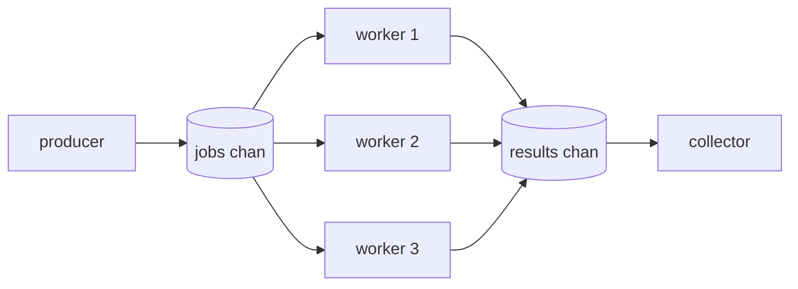
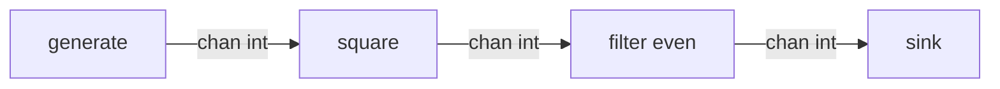
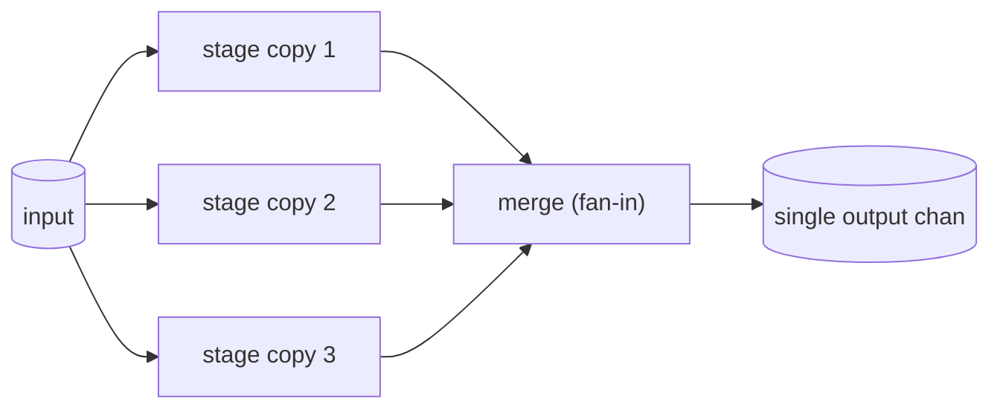

# Goroutines and Channels

Concurrency is Go's signature feature and the most heavily tested topic in Go interviews. This guide covers goroutines (and why they are so much cheaper than OS threads), channels in all their variations, `select`, and the canonical concurrency patterns — worker pools, fan-out/fan-in, pipelines, and done channels — that interviewers routinely ask candidates to implement live.

## Goroutines vs OS Threads

A goroutine is a function executing concurrently, managed by the Go runtime rather than the OS:

```go
go doWork()               // that's it — the function now runs concurrently
go func(id int) {         // closures work too
    fmt.Println("worker", id)
}(7)
```

| | Goroutine | OS thread |
|---|---|---|
| Initial stack | ~2 KB, grows/shrinks dynamically | 1–8 MB, fixed |
| Creation/teardown | Cheap runtime call | Expensive syscall |
| Scheduling | User-space, cooperative+preemptive, by Go scheduler | Kernel scheduler, full context switch |
| Practical count | Millions | Thousands |

The runtime multiplexes many goroutines onto few OS threads (the GMP model — see the [Runtime guide](07-Go-Runtime-and-Scheduler.md)). Key interview facts: `main` is itself a goroutine; when `main` returns, the program exits immediately, killing all other goroutines — nothing waits for them automatically.

```go
func main() {
    go fmt.Println("probably never prints")
    // main returns; program exits before the goroutine runs.
    // Fix: synchronize with a WaitGroup or channel — never time.Sleep.
}
```

## Channel Basics

Channels are typed conduits that communicate *and* synchronize: "Don't communicate by sharing memory; share memory by communicating."

```go
ch := make(chan int)        // unbuffered: capacity 0
buf := make(chan int, 3)    // buffered: capacity 3

ch <- 42                    // send
v := <-ch                   // receive
v, ok := <-ch               // ok=false if channel is closed AND drained
close(ch)                   // close: signals "no more values"
```

**Unbuffered** channels are synchronous rendezvous points: a send blocks until a receiver is ready, and vice versa. The handoff is also a synchronization point (happens-before edge).

**Buffered** channels decouple sender and receiver up to the capacity: sends block only when full, receives block only when empty.

```go
done := make(chan struct{})     // struct{} = zero-size pure signal
go func() {
    doWork()
    close(done)                 // closing broadcasts to ALL receivers
}()
<-done                          // wait
```

### Channel directions

Function signatures can restrict a channel to send-only or receive-only — compile-time enforcement of protocol roles:

```go
func produce(out chan<- int) { // can only send
    for i := 0; i < 5; i++ { out <- i }
    close(out)                 // only the SENDER should close
}

func consume(in <-chan int) {  // can only receive
    for v := range in {        // range drains until the channel is closed
        fmt.Println(v)
    }
}
```

### The channel behavior table (memorize this)

| Operation | nil channel | open channel | closed channel |
|---|---|---|---|
| send `ch <- v` | blocks forever | blocks until received/buffered | **panics** |
| receive `<-ch` | blocks forever | blocks until value | zero value immediately, `ok=false` |
| `close(ch)` | **panics** | closes it | **panics** (double close) |

## select

`select` waits on multiple channel operations, choosing **uniformly at random** among the ready ones (preventing starvation):

```go
select {
case v := <-results:
    fmt.Println("got", v)
case <-time.After(2 * time.Second):
    fmt.Println("timeout")          // classic timeout pattern
case <-ctx.Done():
    return ctx.Err()                // cancellation
default:
    fmt.Println("nothing ready")    // makes the select NON-blocking
}
```

- With no `default`, `select` blocks until some case is ready.
- With `default`, it never blocks — used for non-blocking send/receive ("try-send").
- A `select{}` with no cases blocks forever.
- A case on a nil channel is never ready — a trick used to *disable* cases dynamically in fan-in loops.

## Concurrency Patterns

### Worker pool

Bound concurrency by fixing the number of workers pulling from a shared jobs channel:



```go
func workerPool(jobs []int, workers int) []int {
    jobsCh := make(chan int)
    results := make(chan int)
    var wg sync.WaitGroup

    for w := 0; w < workers; w++ {
        wg.Add(1)
        go func() {
            defer wg.Done()
            for j := range jobsCh {      // exits when jobsCh is closed
                results <- j * j          // "process" the job
            }
        }()
    }

    go func() {
        for _, j := range jobs { jobsCh <- j }
        close(jobsCh)                     // no more jobs
    }()

    go func() {
        wg.Wait()                         // when all workers finish...
        close(results)                    // ...close results so range ends
    }()

    var out []int
    for r := range results { out = append(out, r) }
    return out
}
```

Real-world: rate-limited API scrapers, image-processing services, message-queue consumers all use exactly this shape.

### Pipeline

Stages connected by channels; each stage is a goroutine transforming values:



```go
func generate(nums ...int) <-chan int {
    out := make(chan int)
    go func() {
        defer close(out)
        for _, n := range nums { out <- n }
    }()
    return out
}

func square(in <-chan int) <-chan int {
    out := make(chan int)
    go func() {
        defer close(out)
        for n := range in { out <- n * n }
    }()
    return out
}

// for v := range square(generate(1, 2, 3)) { fmt.Println(v) } // 1 4 9
```

Each stage owns and closes its output; closure propagates down the pipeline naturally.

### Fan-out / Fan-in

Fan-out: multiple goroutines read one channel (distributing work). Fan-in: merge several channels into one:



```go
func merge(chans ...<-chan int) <-chan int {
    out := make(chan int)
    var wg sync.WaitGroup
    for _, c := range chans {
        wg.Add(1)
        go func(c <-chan int) {          // one forwarder per input
            defer wg.Done()
            for v := range c { out <- v }
        }(c)
    }
    go func() { wg.Wait(); close(out) }() // close after ALL inputs drain
    return out
}
```

### Done channel (cancellation)

Before `context` existed, cancellation used a closed channel; the pattern still underlies `ctx.Done()`:

```go
func worker(done <-chan struct{}, jobs <-chan int) {
    for {
        select {
        case <-done:
            return                        // cancelled
        case j, ok := <-jobs:
            if !ok { return }             // jobs closed
            process(j)
        }
    }
}
// Caller: done := make(chan struct{}); ... close(done) // broadcasts to every worker
```

Closing a channel is a **broadcast**: every current and future receiver unblocks immediately. That is why `close`, not a send, signals cancellation.

### Deadlock example (what NOT to do)

```go
func main() {
    ch := make(chan int)
    ch <- 1                    // fatal error: all goroutines are asleep - deadlock!
    fmt.Println(<-ch)          // never reached: unbuffered send has no receiver
}
// Fixes: make(chan int, 1), or send from another goroutine.
```

## Best Practices

- Never start a goroutine without knowing how it will stop — every goroutine needs a termination story (channel close, context cancel, or input exhaustion), or it leaks.
- Only the sender closes a channel; never close from the receiver side, and never close twice.
- Closing is optional — only needed to signal "no more values" (e.g., to end a `range`). Channels are garbage collected regardless.
- Use `chan struct{}` for pure signals, and channel direction types (`chan<-`, `<-chan`) in every function signature.
- Prefer unbuffered channels by default; choose a buffer size for a measured reason (burst absorption, decoupling), not as a deadlock band-aid.
- Synchronize with `sync.WaitGroup` or channels — `time.Sleep` in tests/interviews signals you don't understand the synchronization.
- Bound concurrency with worker pools or semaphores; unbounded `go` per request is how services fall over.
- Run everything with `go test -race` / `go run -race` during development.

## Interview Questions

<details>
<summary>1. Why are goroutines cheaper than OS threads?</summary>

Three reasons. Memory: a goroutine starts with a ~2 KB growable stack versus megabytes of fixed stack per thread, so millions fit in RAM. Creation: starting a goroutine is a user-space runtime operation, not a syscall. Scheduling: the Go runtime schedules goroutines onto a small set of OS threads in user space (the GMP model), so switching goroutines avoids kernel context switches; blocking channel operations just park the goroutine and run another on the same thread.
</details>

<details>
<summary>2. What is the difference between an unbuffered and a buffered channel?</summary>

An unbuffered channel (capacity 0) is a synchronous rendezvous: a send blocks until a receiver is simultaneously ready, so every transfer is also a synchronization point between the two goroutines. A buffered channel decouples them: sends complete immediately while the buffer has space, and block only when it is full; receives block only when it is empty. Unbuffered gives the strongest ordering guarantees; buffers add throughput/burst absorption at the cost of weaker coupling between sender progress and receiver progress.
</details>

<details>
<summary>3. What happens when you send to, receive from, or close a closed channel? A nil channel?</summary>

Closed channel: send panics; receive returns immediately with the zero value and `ok=false` (after any buffered values are drained — buffered values are still delivered with `ok=true`); close panics (double close). Nil channel: send and receive block forever; close panics. The nil-blocks-forever behavior is actually useful: setting a channel variable to nil inside a select loop disables that case.
</details>

<details>
<summary>4. If multiple select cases are ready, which one runs?</summary>

One is chosen uniformly at random among the ready cases. This is deliberate — deterministic priority (e.g., always the first case) would starve the other channels under load. If no case is ready, select blocks unless there is a `default`, which runs immediately and makes the select non-blocking. If you truly need priority, you nest selects: try the priority case with `default`, then fall back to a blocking select over all cases.
</details>

<details>
<summary>5. Implement a function that merges N channels into one (fan-in). What are the tricky parts?</summary>

Start one forwarding goroutine per input channel, each doing `for v := range c { out <- v }`, track them with a `sync.WaitGroup`, and close the output in a separate goroutine after `wg.Wait()`. Tricky parts: (1) closing `out` too early or from the wrong place — it must close only after *all* inputs are drained, and only once; (2) capturing the loop variable correctly when starting the goroutines; (3) supporting cancellation — each forward should be a `select` between `out <- v` and `<-done` so the merge doesn't leak goroutines if the consumer stops reading.
</details>

<details>
<summary>6. Why does closing a channel work as a broadcast cancellation signal, while sending doesn't?</summary>

A send delivers exactly one value to exactly one receiver — to cancel N workers you'd need to know N and send N times, and any worker that already exited would strand a send. A closed channel, by contrast, makes *every* current and future receive complete immediately (zero value, `ok=false`) — one `close` wakes all workers, forever, idempotently for readers. This is precisely how `context` implements `Done()`: cancellation closes the done channel.
</details>

<details>
<summary>7. What is a goroutine leak and how do you cause/prevent one?</summary>

A goroutine leak is a goroutine blocked forever (or looping forever) that can never terminate, holding its stack and referenced memory for the life of the process. Classic causes: sending on a channel no one will ever receive from (e.g., a timeout abandoned the receiver), receiving from a channel no one will close or send on, or forgetting to cancel a context. Prevention: give every blocking operation an escape hatch (`select` with `<-ctx.Done()`), always `defer cancel()`, ensure producers close their outputs, and use buffered channels of size 1 for "one-shot" results whose receiver may abandon them. Detection: `pprof`'s goroutine profile or `runtime.NumGoroutine()` growth in tests (e.g., goleak).
</details>

<details>
<summary>8. Sketch a worker pool. Why is it preferable to spawning one goroutine per task?</summary>

Fixed W workers each `for j := range jobs { ... }` over a shared jobs channel; the producer closes `jobs` when done; a WaitGroup tracks workers and closes `results` when all finish. One-goroutine-per-task provides no backpressure: a traffic spike creates unbounded goroutines, each consuming stack and possibly holding sockets/DB connections, until memory or file descriptors run out. A pool bounds resource usage, provides natural backpressure (producers block when workers are saturated), and matches downstream capacity limits like database connection pools.
</details>
